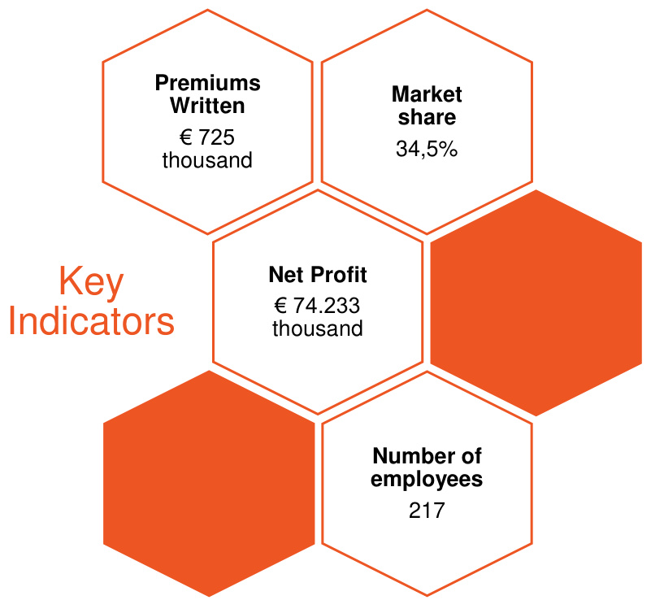

# Relatório sobre a Solvência e a Situação Financeira (SFCR)  

31 de dezembro de 2023  

# Índice  

Executive summary ..   
A. Business and performance ... 7   
B. System of governance . 10   
C. Risk profile .. . 12   
D. Valuation for solvency purpose .. . 13   
E. Capital management . . 14   
Sumário executivo . . 17   
A. Atividade e desempenho 17   
B. Sistema de governação.. 20   
C. Perfil de risco . ... 22   
D. Avaliação para efeitos de solvência .. . 23   
E. Gestão de capital . . 24   
A. Atividade e desempenho . 27   
1. Atividades .. . 27   
1.1. Estrutura acionista . .. 27   
1.2. Organização do negócio . .. 28   
1.3. Desafios atuais e futuros .... . 29   
1.4. Sustentabilidade . . 31   
1.4.1. A sustentabilidade como prioridade.. . 31   
1.5. Número de colaboradores a tempo inteiro . . 32   
1.6. Detalhe zona geográfica .. . 32   
1.7. Atividades ou eventos ocorridos no ano .. ... 33   
2. Desempenho da subscrição . .. 33   
2.1. Prémio .. . 33   
2.2. Resultado Operacional .. . 34   
2.3. Custos Administrativos .. . 36   
2.4. CSM Balanço ...... . 37   
3. Desempenho dos investimentos .. ... 38   
3.1. Rendimentos e despesas decorrentes de investimentos.. . 38   
3.2. Ganhos e perdas reconhecidos diretamente em ações . . 39   
3.3. Investimentos em titularizações ... . 39   
4.  Desempenho de outras atividades .... ... 39   
5.  Eventuais informações adicionais .. . 39   
5.1. Informação qualitativa e quantitativa nas transações intra-grupo ..... . 39   
5.1.1. Contrato de resseguro – Working excess of loss per life ..... ... 39   
5.2. Eventos subsequentes . 39   
5.3. Adoção das IFRS 9 – Instrumentos financeiros e IFRS 17 – Contratos de seguro ... 40   
Sistema de governação..... 41   
1. Informações gerais sobre o sistema de governação .... .. 41   
1.1. Assembleia geral de acionistas . . 41   
1.2. Estrutura da administração ..... ... 41   
1.2.1. Conselho de administração . 42   
1.2.2. Comissão executiva ... . 43   
1.2.3. Comités especializados ... . 45   
1.2.4. Vinculação e representação . ... 47   
1.3. Fiscalização ...... . 47   
1.3.1. Conselho fiscal .. . 47   
1.3.2. Revisor oficial de contas ...... ...... 48   
1.3.3. Conselho de auditoria ... ..... 48   
1.4. Secretário da sociedade . . 48   
1.5. Processo de tomada de decisão . . 49   
1.5.1. Gestão de risco ........ ... 49   
1.5.2. Compliance ....... . 49   
1.5.3. Auditoria interna .. . 49   
1.5.4. Função atuarial . . 49   
1.5.5. Atuário responsável ... ...... 50   
1.6. Princípios de conduta profissional . . 50   
1.7. Normativo interno ...... . 52   
1.8. Política de remunerações ...... . 52   
2. Requisitos de qualificação e idoneidade ....... ..... 63   
Descrição da política de seleção e avaliação da adequação . ......... 63   
2.2. Requisitos de qualificação e idoneidade........ .. 66   
3. Sistemas de gestão de riscos e informação sobre a autoavaliação do risco e da   
solvência (ORSA) .... .... 68   
3.1. Estratégia de risco, processos e procedimentos de reporte do risco........... 68   
3.2. Estrutura de gestão de riscos .... .... 69   
3.3. Organização e governação de riscos ..... ... 70   
3.4. Autoavaliação do risco e da solvência (ORSA) . .... 74   
3.5. Gestão de capital ... .. 75   
4. Sistema de controlo interno ..... .. 76   
4.1. Descrição do sistema de controlo interno . .. 76   
4.2. Avaliação anual do sistema de controlo interno . . 78   
4.3. Descrição do modo como atua a função de compliance..... . 79   
5. Função de auditoria interna ........... ..... 80   
5.1. Descrição sobre a implementação da função de auditoria interna ............... 80   
5.2. Descrição de como a auditoria interna mantém a independência e   
objetividade ..... .... 80   
6. Função atuarial . . 81   
7. Subcontratação ... . 82   
8. Eventuais informações adicionais .. . 83   
8.1. Informação adicional sobre o sistema de governação societária . .. 83   
C. Perfil de risco .. .. 84   
1. Risco específico de seguros ... . 85   
1.1. Risco específico de seguros de vida .... .... 86   
1.2. Resseguro ... . 89   
2. Risco de mercado . . 91   
2.1. Sensibilidade ao risco ... .... 95   
2.2. Princípio do gestor prudente . . 96   
3. Risco de crédito ..... .. 97   
4. Risco de liquidez ..... .... 100   
5. Risco operacional .. . 102   
6. Outros riscos.. . 104   
7. Eventuais informações adicionais . ... 107   
7.1. Exposições extrapatrimoniais.... . 107   
7.2. Análises de sensibilidade .... ... 107   
D. Avaliação para efeitos de solvência .. .... 108   
1. Ativos .. . 108   
1.1 Ativos intangíveis .. . 109   
1.2 Ativos financeiros .. . 109   
1.3 Ativos detidos com contratos ligados a índices e unidades de participação (UL) 112   
1.4 Outros ativos tangíveis ...... ... 112   
1.5 Recuperáveis de resseguro .. . 112   
1.6 Outros ativos .. . 113   
1.7 Impostos diferidos .. .. 114   
. Provisões técnicas ... .. 114   
2.1. Aspetos gerais .... .... 115   
2.1.1. Horizonte temporal para projeção dos cash-flows .......... ............ 115   
2.1.2. Desconto ... .... 115   
2.1.3. Granularidade... .. 116   
2.1.4. Análise de experiência passada ...... 116   
2.1.5. Limites dos contratos .... .... 117   
2.1.6. Despesas .... .... 118   
2.1.7. Comissões ...... ... 118   
2.1.8. Testes ............ ........ 118   
2.1.9. Incerteza ..... ..... 119   
2.1.10. Parecer especializado (expert judgement) . ... 120   
2.1.11. Melhor estimativa vida ..... ...... 120   
2.1.12. Pressupostos não económicos..... .... 121   
2.1.12.1. Mortalidade e longevidade ...... ...... 121   
2.1.12.2. Anulação, resgate, redução, suspensão do pagamento de prémios . 121   
2.1.12.3. Pressupostos de renovação .. .. 122   
2.1.12.4. Opções e garantias no cálculo das provisões técnicas ..... ........ 122   
2.1.13. Pressupostos económicos ..... .. 122   
2.1.14. Ações de gestão futuras .......... ..... 123   
2.1.15. Avaliação estocástica ........ ... 123   
2.1.16. Explicação das diferenças mais significativas entre base, métodos e   
pressupostos utilizados no cálculo das provisões técnicas no âmbito de solvência   
II e de acordo com as regras contabilísticas locais........... .................. 123   
2.2. Margem de risco .... .... 124   
2.3. Diferenças significativas nos pressupostos relevantes tomados no cálculo   
das provisões técnicas comparando com o último período de reporte.......... ....... 125   
2.4. Impacto da redução do ajustamento de volatilidade para zero ................... 125   
2.5. Impacto das medidas de transição: medida transitória para as provisões   
técnicas ..... .... 126   
2.6. Impacto de outras medidas de longo prazo ..... .... 127   
2.7. Uso de simplificações .......... .. 127   
2.8. Empréstimos subordinados ............ ........... 127   
3. Outras responsabilidades ... . 127   
Métodos alternativos de avaliação . 130   
5. Eventuais informações adicionais . ... 131   
. Gestão de capital . .. 132   
1. Fundos próprios ...... .. 132   
1.1. Gestão dos fundos próprios . ... 132   
1.2. Estrutura, montante e qualidade dos fundos próprios .. . 133   
1.3. Explicação quantitativa das diferenças entre o capital próprio incluído nas   
demonstrações financeiras e o excesso de ativos sobre passivos, calculados em ambiente   
SII 134   
1.4. Fundos próprios disponíveis e elegíveis para cobertura do SCR e MCR . .... 134   
2. Requisito de capital de solvência e requisito de capital mínimo . ... 136   
2.1. Informação quantitativa do SCR por módulo de risco . ... 137   
2.2. Informação quantitativa do MCR .. .. 138   
3. Eventuais informações adicionais ..... ... 138   
3.1. Utilização do submódulo de risco acionista baseado na duração para calcular o   
requisito de capital de solvência .... .... 138   
3.2. Diferenças entre a fórmula-padrão e qualquer modelo interno utilizado ........... 139   
3.3. Incumprimento do requisito de capital mínimo e incumprimento do requisito de   
capital de solvência .. 139   
3.4. Uso de métodos simplificados .......... ... 139   
3.5. Parâmetros específicos da entidade . ... 139   
3.6. Acréscimo do requisito de capital de solvência . .. 139   
Anexos - Informação quantitativa ..... .... 140   
Anexos – Certificação atuário responsável .. ... 148   
Anexos – Certificação revisor oficial de conta . ... 151   
onselho de administração .. . 159  

# Executive summary  

In line with the Law no. 147/2015 of $9^{\mathrm{th}}$ of September, which transposed the Solvency II directive to the Portuguese legislation, insurance and reinsurance companies are required to disclose publicly, on an annual basis, a report on their solvency and financial condition, leading to this document - the Solvency and Financial Condition Report (SFCR), focusing on qualitative and quantitative information.  

The following chapters summarize the full report of Ocidental - Companhia Portuguesa de Seguros de Vida, S.A. (Ocidental Vida):  

# A. Business and performance  

rrent legal structure of Ageas Portugal includes two holding com  

Ageas Portugal Holdings, SGPS, S.A. (wholly owned by Ageas Group, namely by Ageas Insurance International, NV); and   
Millenniumbcp Ageas, Grupo Segurador, SGPS, S.A. $51\%$ owned by Grupo Ageas and $49\%$ by Banco Comercial Português, S.A., hereinafter “Millenniumbcp”, representing the partnership established for Bancassurance).  

Considering the different operations of insurance and pension funds management activities, Ageas Portugal is composed by five companies:  

Ageas Portugal – Companhia de Seguros, S.A. Ageas Portugal – Companhia de Seguros de Vida, S.A.   
■ Ocidental - Companhia Portuguesa de Seguros de Vida, S.A.   
■ Ageas - Sociedade Gestora de Fundos de Pensões, S.A. Médis – Companhia Portuguesa de Seguros de Saúde, S.A  

As to Ocidental Vida, it is wholly owned by Millenniumbcp Ageas, Grupo Segurador, SGPS, S.A.  

  
The chart below contains the ownership structure:  

Ageas Portugal also integrates Ageas Portugal Services, A.C.E., a complementary grouping of companies with the purpose of ensuring complementary tasks to the exercise of the insurance activity pursued by the members, namely at the level of acquisition of goods and services from third parties.  

  

In 2023, the production issued by Ocidental Vida, Companhia de Seguros Vida, totaled 725 million euros, a drop of 199 million euros compared to the same period in the previous year.  

The drop in production issued by Ocidental Vida is also accompanied by the market, which decreased, more modestly, $14.3\%$ , as a consequence of the pronounced drop seen in investment products – Unit linked.  

The Unit Linked products registered a decrease of $66.8\%$ , minus 355 million euros, observed mainly in Open Unit Linked, where the company has developed new offers over the last few years, prioritizing the placement of these products in the context experienced by the market with yields historically low. The new market environment, macroeconomic and geopolitical conditions have brought volatility and a drop in the value of units of account, reducing the incentive to place this product that transfers the entire investment risk to the client, without granting rights or guarantees over the capital invested. Even so, the company has made an effort to diversify the offer of this type of products, having launched the first Closed Linked Unit, in the last quarter of 2023, after 5 years without offering this segment. The market share of Unit Linked products was $12.4\%$ , a reduction of 5.0pts compared to 2022.  

The capitalization insurance (Savings $^+$ PPR and PPR/E) showed a growth of $57.4\%$ compared to 2022, totaling 391 million euros. Highlight for retirement products, with a growth of $75.9\%$ , driven by the increase in the target remuneration rate for customers to $2.75\%$ , following the market trend towards increasing profitability on savings, which resulted in growth of the market by $23.9\%$ .  

This indicator materializes the company's strategy of offering medium and long-term solutions, supporting and encouraging savings for retirement, also meaning an increase in market share by 10.2 pts, to $34.5\%$ .  

In capitalization products, there was a decrease of $24.5\%$ , totaling 34.5 million euros. Despite the reinforcement of savings remuneration, the ceiling available for commercialization was less ambitious, with a trend contrary to that observed in the market, which grew $52.5\%$ , reducing the Company's market share to $2.1\%$ , a drop 2.2pts compared to the same period last year.  

In risk products, Ocidental Vida obtained processed revenue of 158 million euros, representing growth of $1\,1\%$ ( $+15.6$ million euros) compared to 2022, strongly driven by the signing of a group contract with death and invalidity, not associated with banking product. The market also demonstrated, but in a more modest way, growth in this business segment, with growth of $0.7\%$ . This performance allowed Ocidental Vida to increase its market share by $1.4\%$ , to $15.1\%$ , materializing our customers' trust in the Ocidental brand.  

The operating result, which comprises the technical result associated with insurance contracts as well as investment contracts, after attributable and non-attributable operating costs, totaled 108.5 million euros in the year 2023, representing an increase of $40\%$ compared to the same period as the previous year.  

Despite the growth in the financial margin, this was partially offset by the reduction in the Contractual Service Margin, an important indicator of recognition of the margin of products measured by the GMM accounting model (General Measurement Model).  

After tax, net profit reached 74.2 million euros, an increase of 21.8 million euros compared to 2022.  

# B. System of governance  

# Risk management and internal control systems  

The fundamental principle underlying Ocidental Vida’s risk strategy is to maximize the shareholder value, within the defined risk appetite limits, and considering the best interest and protection of policyholders, insured persons and beneficiaries. To this end, risk acceptance is directed towards businesses that present attractive amounts of risk-adjusted return.  

Ocidental Vida has implemented systematic processes for identifying and monitoring risks, which are assessed both qualitatively and quantitatively.  

Risks are defined through a risk taxonomy whose objective is to guarantee a consistent and comprehensive approach to identifying, evaluating, monitoring, and managing the risks applicable to Ocidental Vida. The risk taxonomy is divided into four main categories: Financial Risks, Insurance Risks, Operational Risks and Strategic and Business Risks.  

On a quarterly basis, Ocidental Vida assesses and reports the relevant risks (existing and emerging) that could jeopardize the achievement of the Company’ strategic objectives – Key Risk Reporting. All areas of the risk taxonomy are considered when identifying risks, using a consistent methodology, in line with risk appetite.  

Those risks to the implementation of Ocidental Vida's strategy must then be mitigated, through process’ improvements, or through a combination of process improvements and capital holding. Capital needs to mitigate the main Solvency II risks are determined using a decision tree:  

Risks for which a Solvency Capital Requirement (SCR) is measured using the standard formula are considered pillar 1 risks: such risks are measured on a current basis every quarter and reported to Risk Committee through the quarterly risk reports. Risks that are not adequately covered in standard formula are considered pillar 2 risks, and the assessment of capital needs is performed accordingly with the internal vision of Group Ageas (SCRAgeas).  

For the Own Risk and Solvency Assessment (ORSA), pillar 1 and pillar 2 risks are also assessed on a forward-looking basis during the strategic plan and multi-year budget cycle.  

To guarantee that all material risks are well understood and managed effectively, Ocidental Vida has an Enterprise Risk Management (ERM) framework that:  

Ensures that risks affecting the achievement of objectives are identified, assessed, monitored, and managed.   
Defines the risk appetite to ensure that the risk of insolvency remains within the risk appetite, in all moments, in acceptable levels and the risk profile remains within risk appetite.   
Supports the decision-making process by ensuring that the information of risk is consistent, reliable, and timely and is available for who takes the decisions.   
Promotes a culture of risk so that each employee performs his function with the awareness of the risks inherent in its activities, to manage them properly and to report them in a transparent way.  

ERM framework is defined in 4 risk management dimensions: Policies; Governance; Models; and Reporting.  

Risk Management is inherent to insurance business and, as such, is part of the activities of all businesses and employees of the company. The activities of risk management in Ocidental Vida are incorporated into existing management bodies, with specific risk committees and functions been created, whose principles are set out in the established Risk Policy.  

In the scope of risk management processes, stands out the Own Risk and Solvency Assessment (ORSA) which main objective is to ensure that Ocidental Vida assesses all risks inherent to its business and depending on its strategy, determines its capital needs. ORSA is directly incorporated into Company’s strategy and its strategic planning process and multi-year budget. It is also embedded in governance processes and decision-making process, being defined as one of the responsibilities of the Executive Committee and the Board of Directors.  

In addition, the purpose of the Internal Control System is to provide management with reasonable assurance that the Company is operating properly, supporting the realization of strategic and business objectives.  

The internal control adequacy assessment (INCA) is carried out during the year and the overall view is reported in the annual INCA report, which is transversal to all Ageas Portugal Group companies. This report includes the results of the self-assessment by each organizational area and the opinion of the second and third lines of defence, ensuring that the risks existing in the processes are under control or that action plans are defined, and that appropriate follow-up is carried out on the weaknesses identified.  

# C. Risk profile  

As described in the section B System of Governance, Chapter 3, Ocidental Vida has implemented a systematic process of risk identification and monitoring, assessed both quantitative and qualitatively.  

Based on the qualitative assessment carried out through the Key Risk Reporting (KRR) process, were identified the following risks with level of concern equal to or greater than 4, i.e., residual risk not acceptable, to monitor and actions to reduce the risk exposure during the MYB period (2024-2027):  

Information security – providers and external entities.   
Geo-political instability & economic uncertainty.   
Digital transformation, raise of AI and Big Data.  

The company has implemented control actions and mitigation of the risks, which are followed and quarterly reported to the Risk Committee, Executive Committee, and the Ageas Group.  

Based on the quantitative risk assessment using the standard formula, the overall risk profile on 31st December of 2023 is illustrated on the figure below.  

  

Compared with last year, there is an increase in the weight of market risk in the total risks and a decrease in the life underwriting risk, mainly explained by the impact of risk-free interest rate developments on the risk of mass discontinuity.  Market Risk continues to be the biggest risk of Ocidental Vida.  

# D. Valuation for solvency purpose  

The Solvency II balance sheet valuation is based on fair value, that is the amount for which an asset could be exchanged, a liability settled, or a granted equity instrument exchanged between knowledgeable, willing parties in an arm’s length transaction.  

The most significant differences from the local financial statements’ valuation concern mainly to:  

Technical provisions and reinsurance recoverable follow the rules defined in the Solvency II regime, not fully aligned with local accounting standards. The value of holdings in property investment companies is revalued at fair value. Derecognition of deferred acquisition costs and intangibles assets, if any.  

The table below summarises the valuation differences between the balance sheet with accounting rules and Solvency II:  

in thousand euros   

<html><body><table><tr><td>31.12.2023</td><td>Solvency</td><td>Statutory accounts</td><td>Var.</td></tr><tr><td>Totalassets</td><td>8,121,712</td><td>8,081,051</td><td>40,661</td></tr><tr><td>Totalliabilities</td><td>7,698,908</td><td>7,888,542</td><td>-189,634</td></tr><tr><td>Excessofassetsoverliabilities</td><td>422,805</td><td>192,509</td><td>422,805</td></tr></table></body></html>  

The value of technical provisions under Solvency II is equal to the sum of the best estimate of the liabilities and the risk margin. The best estimate is the expected value of future cash flows, weighted by their probability of occurrence, considering the time value of money, based on the time structure of interest rates without relevant risk. The risk margin represents the capital costs of the non-hedgeable risks included in the best estimate.  

In the preparation of this report, it has been considered the long-term measure volatility adjustment (VA) and the transitional measure for technical provisions, both approved by the Supervisory Authority (ASF).  

The impact of considering the long-term measure volatility adjustment in the available own funds and in the respective solvency II ratio are:  

in thousand euros   

<html><body><table><tr><td>31.12.2023</td><td>BaseCase</td><td>WithoutVolatility Adjustment</td><td>Impact</td></tr><tr><td>TechnicalProvisions</td><td>7,415,269</td><td>7,441,096</td><td>25,827</td></tr><tr><td>BasicOwnFunds</td><td>465,095</td><td>446,887</td><td>-18,208</td></tr><tr><td>EligibleOwnFundstocoverSCR*</td><td>465,095</td><td>446,887</td><td>-18,208</td></tr><tr><td>SolvencyCapital Requirement(SCR)</td><td>193,514</td><td>216,444</td><td>22,930</td></tr><tr><td>RatioofEligibleOwnFundstoSCR</td><td>240%</td><td>206%</td><td>-34pp</td></tr><tr><td>EligibleOwnFundstocoverMCR*</td><td>448,785</td><td>428,089</td><td>-20,696</td></tr><tr><td>MinimumCapitalRequirement(MCR)</td><td>87,081</td><td>97,400</td><td>10,318</td></tr><tr><td>RatioofEligibleOwnFundstoMCR</td><td>515%</td><td>440%</td><td>-76pp</td></tr></table></body></html>

\* Deducted of expected dividends  

Regarding the transitional measure, the impacts on the coverage ratio of the SCR and MCR are the following:  

in thousand euros   

<html><body><table><tr><td>31.12.2023</td><td>BaseCase</td><td>WithoutTransitional Measure</td><td>Impact</td></tr><tr><td>TechnicalProvisions</td><td>7,415,269</td><td>7,557,628</td><td>142,359</td></tr><tr><td>BasicOwnFunds</td><td>465,095</td><td>364,732</td><td>-100,363</td></tr><tr><td>EligibleOwnFundstocoverSCR*</td><td>465,095</td><td>364,732</td><td>-100,363</td></tr><tr><td>SolvencyCapitalRequirement(SCR)</td><td>193,514</td><td>207,515</td><td>14,001</td></tr><tr><td>RatioofEligibleOwnFundstoSCR</td><td>240%</td><td>176%</td><td>-65pp</td></tr><tr><td>EligibleOwnFundstocoverMCR*</td><td>448,785</td><td>344,019</td><td>-104,766</td></tr><tr><td>MinimumCapitalRequirement(MCR)</td><td>87,081</td><td>93,382</td><td>6,300</td></tr><tr><td>RatioofEligibleOwnFundstoMCR</td><td>515%</td><td>368%</td><td>-147 pp</td></tr></table></body></html>

\* Deducted of expected dividends  

# E. Capital management  

The main objective of the capital management policy is to optimize the structure, composition, and allocation of company’s capital, to support profitable future growth and ensure the sustainability of the dividends policy in place.  

The composition of eligible own funds of Ocidental Vida on 31st December of 2023 is the following:  

<html><body><table><tr><td></td><td>31.12.2023</td><td>31.12.2022</td><td>Var.</td><td>Var. %</td></tr><tr><td>EligibleOwnFunds</td><td>465,095</td><td>440,024</td><td>25,071</td><td>5.7%</td></tr><tr><td>Tier 1-unrestricted</td><td>345,095</td><td>320,024</td><td>25,071</td><td>7.8%</td></tr><tr><td>Tier1-restricted</td><td>86,274</td><td>80,006</td><td>6,268</td><td>7.8%</td></tr><tr><td>Tier2</td><td>33,726</td><td>39,994</td><td>-6,268</td><td>-15.7%</td></tr><tr><td>Tier 3</td><td>0</td><td>0</td><td>0</td><td></td></tr></table></body></html>

\* The Own Funds are deducted of expected dividends  

Ocidental Vida monitors on a regular basis the evolution of its own funds, considering the solvency quarterly values and the strategic plan (5 years’ time horizon). Any change that put in risk the own funds quality will be subject to an evaluation and respective correction.  

Compared with last year, the level of eligible own funds, after expected dividends distribution, registered an increase of 25,071 thousand euros $(6\%)$ , mainly due to financial markets and business evolution.  

According to the Capital Management Policy, dividend distribution is decided based on net operating result, but the amount payable is dependent on the target solvency ratio ( $175\%$ of SCRAgeas).  

in thousand euros   

<html><body><table><tr><td></td><td>31.12.2023</td><td>31.12.2022</td><td>Var.</td><td>Var. %</td></tr><tr><td>EligibleOwnFundswithoutdeductionofexpecteddividends</td><td>542,805</td><td>440.024</td><td>102,780</td><td>23%</td></tr><tr><td>Expecteddividends</td><td>77,710</td><td>0</td><td>77,710</td><td></td></tr><tr><td>EligibleOwnFundswithdeductionofexpecteddividends</td><td>465,095</td><td>440,024</td><td>25,071</td><td>6%</td></tr></table></body></html>  

In 2023, the Company considered as future dividends the amount of 77,710 thousand of euros.  

In the scope of Solvency II capital adequacy, the following measures are applicable:  

The Minimum Capital Requirement (MCR) – the MCR is the amount of eligible basic own funds below which policyholders, insured persons and beneficiaries are exposed to an unacceptable level of risk and that can lead to an extreme Supervisor Intervention in case of non-compliance (e.g., do not allow the subscription of new business). The MCR is calculated through a combined linear function, limited to a maximum of the $45\%$ of SCR and a minimum of $25\%$ of the SCR. Where eligible own funds fall below the MCR or there is a risk of non-compliance with the MCR in the subsequent three months, a short-term financing plan has to be defined and submitted to the Supervisor.  

The Solvency Capital Requirement (SCR) is the amount of capital to cover the capital requirements calculated from standard formula (designated ‘pillar 1’). When the eligible own funds fall below the SCR or there is risk of non-compliance with the SCR, a recovery plan should be defined and submitted to the Supervisory.  

The SCR coverage ratio, after expected dividends, increased 11 pp between 31 December of 2022 and 31 December of 2023, mainly due to the increase of Eligible Own Funds to cover SCR. In the same vein, the MCR coverage ratio increased 33 pp.  

in thousand euros   

<html><body><table><tr><td></td><td>31.12.2023</td><td>31.12.2022</td><td>Var. %</td></tr><tr><td>EligibleOwnFundstocoverSCR</td><td>465.095</td><td>440.024</td><td>5,7%</td></tr><tr><td>SolvencyCapitalRequirement(SCR)</td><td>193.514</td><td>192.174</td><td>0,7%</td></tr><tr><td>RatioofEligibleOwnFundstoSCR</td><td>240%</td><td>229%</td><td>11,4 pp</td></tr><tr><td>EligibleOwnFundstocoverMCR</td><td>448.785</td><td>417.326</td><td>7,5%</td></tr><tr><td>MinimumCapitalRequirement(MCR)</td><td>87.081</td><td>86.478</td><td>0,7%</td></tr><tr><td>RatioofEligibleOwnFundstoMCR</td><td>515%</td><td>483%</td><td>32,8 pp</td></tr></table></body></html>

\* The Eligible Own Funds are deducted of expected dividends  

SCR evolution is presented in the table below:   
in thousand euros   

<html><body><table><tr><td></td><td>31.12.2023</td><td>31.12.2022</td><td>Var.</td><td>Var. %</td></tr><tr><td>SolvencyCapitalRequirement</td><td>193.514</td><td>192.174</td><td>1.340</td><td>0,7%</td></tr><tr><td>LAC-DT</td><td>-62.741</td><td>-52.718</td><td>-10.023</td><td>19,0%</td></tr><tr><td>OperationalRisk</td><td>27.378</td><td>18.886</td><td>8.492</td><td>45,0%</td></tr><tr><td>BasicSolvencyCapitalRequirement</td><td>228.878</td><td>226.007</td><td>2.871</td><td>1,3%</td></tr><tr><td>Diversification</td><td>-52.393</td><td>-49.230</td><td>-3.163</td><td>6,4%</td></tr><tr><td>MarketRisk</td><td>185.125</td><td>168.444</td><td>16.681</td><td>9,9%</td></tr><tr><td>CounterpartyDefaultRisk</td><td>10.841</td><td>14.558</td><td>-3.717</td><td>-25,5%</td></tr><tr><td>LifeUnderwritingRisk</td><td>80.501</td><td>92.235</td><td>-11.735</td><td>-12,7%</td></tr></table></body></html>  

# Sumário executivo  

De acordo com a Lei nº147/2015 de 9 de setembro, que transpôs a Diretiva de Solvência II para a ordem jurídica interna, as empresas de seguros e de resseguros deverão divulgar publicamente, numa base anual, informação de natureza qualitativa e quantitativa sobre a sua Solvência e a Situação Financeira, através deste relatório – o Relatório sobre a Solvência e a Situação Financeira (SFCR).  

Nos pontos seguintes, apresenta-se o resumo das secções A a E, abordadas em detalhe no SFCR da Ocidental - Companhia Portuguesa de Seguros de Vida, S.A. (Ocidental Vida):  

# A. Atividade e desempenho  

A atual estrutura jurídica da Ageas Portugal compreende duas sociedades gestoras de participações sociais:  

Ageas Portugal Holdings, SGPS, S.A. (totalmente detida pelo Grupo Ageas, mais concretamente a Ageas Insurance International, NV) e   
Millenniumbcp Ageas, Grupo Segurador, SGPS, S.A. (detida em $51\%$ pelo Grupo Ageas e em $49\%$ pelo Banco Comercial Português, S.A., adiante designado Millenniumbcp, representando a parceria instituída para Bancassurance).  

Em termos operativos, relativamente à atividade seguradora e de gestão de fundos de pensões, a Ageas Portugal compreende as seguintes cinco sociedades:  

Ageas Portugal – Companhia de Seguros, S.A.   
Ageas Portugal – Companhia de Seguros de Vida, S.A.   
Ocidental – Companhia Portuguesa de Seguros de Vida, S.A.   
Ageas – Sociedade Gestora de Fundos de Pensões, S.A.   
Médis – Companhia Portuguesa de Seguros de Saúde, S.A.  

Relativamente à Ocidental Vida, esta é detida pela Millenniumbcp Ageas, Grupo Segurador, SGPS, S.A.  

Esquematicamente a estrutura de participações é a seguinte:  

  

A Ageas Portugal integra ainda a Ageas Portugal Services, A.C.E., um agrupamento complementar de empresas com a finalidade de assegurar tarefas complementares ao exercício da atividade seguradora prosseguida pelos membros, designadamente ao nível da aquisição de bens e serviços a terceiros.  

  

Em 2023, a produção emitida da Ocidental Vida, Companhia de Seguros Vida, totalizou os 725 milhões de euros, uma quebra de 199 milhões de euros em comparação com o período homólogo, o ano de 2022.  

A quebra da produção emitida da Ocidental Vida é também acompanhada pelo mercado, que decresceu, de forma mais modesta, $14\%$ , como consequência da quebra pronunciada verificada nos produtos de investimento – Unit linked.  

Os produtos Unit Linked registaram um decréscimo de $66{,}8\%$ , menos 355 milhões de euros, observado sobretudo nos Unit Linked Abertos, onde a Companhia desenvolveu novas ofertas ao longo dos últimos anos, privilegiando a colocação destes produtos no contexto vivenciado pelo mercado com yields historicamente baixas. O novo ambiente do mercado, as condições macroeconómicas, bem como geopolíticas trouxeram volatilidade e quebra na valorização das unidades de conta, diminuindo o incentivo para a colocação deste produto que transfere a totalidade do risco de investimento para o cliente, sem conferir direitos ou garantias sobre o capital investido. Ainda assim, a Companhia tem feito um esforço para diversificar a oferta desta tipologia de produtos, tendo lançado o primeiro Unit Linked Fechado, no último trimestre de 2023, após 5 anos sem oferta deste segmento. A quota de mercado dos produtos tipo Unit Linked foi de $12{,}4\%$ , uma redução de 5,0pts face a 2022.  

Os seguros de Capitalização (Poupança $^+$ PPR e PPR/E) apresentaram um crescimento de $57,4\%$ em comparação com 2022, totalizando 391 milhões de euros. Destaque para os produtos de reforma, com um crescimento de $75,9\%$ , impulsionado pelo aumento da taxa objetivo de remuneração dos clientes para $2.75\%$ , acompanhando a tendência do mercado no incremento da rentabilidade sobre as poupanças, o que resultou num crescimento do mercado em $^{23,9\%}$ .  

Este indicador materializa a estratégia da Companhia de oferecer soluções de médio e longo prazo, de apoio e incentivo à poupança para a reforma, significando também um reforço da quota de mercado em 10,2 pts, para os $34,5\%$ .  

Nos produtos de Capitalização, verificou-se um decréscimo de $24,5\%$ , totalizando 34,5 milhões de euros. Apesar do reforço da remuneração da poupança, o plafond disponível para comercialização foi menos ambicioso, verificando-se uma tendência contrária à observada no mercado, que cresceu $52,5\%$ , reduzindo a quota de mercado da Companhia para $2,1\%$ , uma queda -2,2pts comparativamente com o período homólogo.  

Nos produtos de Risco, a Ocidental Vida obteve uma receita processada de 158 milhões de euros, representando um crescimento de $1\,1\%$ ( $^{\,+15,6}$ milhões de euros) face a 2022, fortemente impulsionado pela celebração de um contrato grupo com coberturas de Morte e Invalidez, não associado a produto bancário. O mercado demonstrou, igualmente, mas de forma mais modesta, um crescimento neste segmento de negócio, com um crescimento de $0.7\%$ . Esta performance permitiu à Ocidental Vida reforçar a sua quota de mercado em $1,4\%$ , para os $15,1\%$ , materializando a confiança dos nossos clientes na marca Ocidental.  

O resultado operacional, que compreende o resultado técnico associado aos contratos de seguro, bem como aos contratos de investimento, após custos operacionais atribuíveis e não atribuíveis, totalizou 108,5 milhões de euros no ano 2023, representando um aumento de $40\%$ em comparação com o mesmo período do ano anterior.  

Apesar do crescimento da margem financeira, este foi parcialmente anulado pela redução da Margem de Serviço Contratual, um indicador importante de reconhecimento da margem dos produtos mensurados pelo modelo contabilísticos GMM (Modelo Geral de Mensuração).  

Após o imposto, o resultado líquido atingiu os 74,2 milhões de euros, um crescimento de 21,8 milhões de euros comparativamente a 2022.  

# B. Sistema de governação  

# Sistemas de gestão de riscos e controlo interno  

O princípio fundamental subjacente à estratégia de risco da Ocidental Vida é maximizar o valor para o acionista, dentro dos limites de apetite de risco definidos, e tendo em conta o melhor interesse e a proteção dos tomadores de seguros, segurados e beneficiários. Para este efeito, a aceitação de risco é direcionada para negócios que apresentem montantes atrativos de retorno ajustado ao risco.  

A Ocidental Vida tem implementados processos sistemáticos de identificação e monitorização de riscos, avaliados tanto de forma qualitativa como quantitativa.  

Os riscos são definidos através de uma taxonomia de risco cujo objetivo é garantir uma abordagem consistente e abrangente na identificação, avaliação, monitorização e gestão dos riscos aplicáveis à Ocidental Vida. A taxonomia de risco encontra-se dividida em quatro grandes categorias: Riscos Financeiros, Riscos de Seguros, Riscos Operacionais e Riscos Estratégicos e de Negócio.  

Trimestralmente, a Ocidental Vida avalia e reporta os riscos relevantes (existentes e emergentes) que possam comprometer a realização dos objetivos estratégicos da Companhia – Key Risk Reporting. Todas as áreas da taxonomia de risco são consideradas na identificação dos riscos, sendo utilizada uma metodologia consistente, em linha com o apetite ao risco.  

Esses riscos para a concretização da estratégia da Ocidental Vida devem então ser mitigados, através da introdução de melhorias aos processos, ou através de uma combinação de melhorias aos processos e realização de capital, quando apropriado. As necessidades de capital para mitigar os principais riscos de Solvência II, são apuradas utilizando uma árvore de decisão:  

Riscos para os quais o Requisito de Capital de Solvência (SCR) é medido utilizando a fórmula-padrão são considerados riscos de pilar 1: tais riscos são medidos trimestralmente e reportados ao Comité de Risco através de relatórios de risco trimestrais;   
Riscos que não são se encontram refletidos na fórmula-padrão são considerados riscos de pilar 2 e a avaliação das necessidades de capital é calculada de acordo com a visão interna do Grupo Ageas $\left(S C R_{A g e a s}\right)$ .  

No âmbito do processo de Autoavaliação do Risco e da Solvência (ORSA), os riscos de pilar 1 e de pilar 2 são também avaliados prospectivamente para o horizonte temporal do plano estratégico e do orçamento plurianual $(M Y B)$ .  

Para garantir que todos os riscos materiais são entendidos e geridos de forma eficaz, a Ocidental Vida dispõe de uma estrutura de Enterprise Risk Management (ERM) que:  

Assegura que os riscos que afetam a concretização dos objetivos são identificados, avaliados, monitorizados e geridos;   
Define um apetite ao risco de modo a assegurar que o risco de insolvência permanece, em todos os momentos, em níveis aceitáveis e que o perfil de risco é mantido dentro do apetite ao risco;   
Suporta o processo de tomada de decisão, assegurando que a informação de risco é consistente, fiável e atempada e está disponível a quem toma as decisões;   
Promove uma cultura de risco, para que cada colaborador desempenhe a sua função com a consciência dos riscos inerentes às suas atividades, de forma a geri-los adequadamente e a reportá-los de forma transparente. A estrutura de ERM está articulada em torno de 4 dimensões de gestão de risco: Políticas;   
Governação; Modelos e Reporte.  

A Gestão de Riscos é parte integrante do negócio de seguros e, como tal, faz parte das atividades de todos os negócios e colaboradores da empresa. As atividades de gestão de riscos da Ocidental Vida encontram-se incorporadas nos órgãos de gestão existentes, tendo sido criados comités e funções específicas de risco, cujos princípios se encontram definidos na política de risco estabelecida.  

No âmbito dos processos de gestão de riscos, destaca-se o processo de Autoavaliação do Risco e da Solvência (ORSA), cujo objetivo é assegurar que a Ocidental Vida avalia todos os riscos inerentes ao seu negócio e, em função da sua estratégia, determina as suas necessidades de capital. O ORSA está diretamente incorporado na estratégia e no processo de planeamento estratégico e orçamento plurianual (MYB) da Companhia. Está também incorporado nos processos de governação e tomada de decisão, sendo definido como uma das responsabilidades da Comissão Executiva e do Conselho de Administração.  

Adicionalmente, o sistema de controlo interno tem como objetivo fornecer à gestão razoável segurança de que a Companhia está a funcionar de forma adequada, suportando a concretização dos objetivos estratégicos e de negócio.  

A avaliação da adequação do controlo interno (INCA) é realizada durante o ano e a visão global é reportada através do relatório anual do INCA, transversal a todas as empresas do Grupo Ageas Portugal. Este relatório inclui os resultados da autoavaliação por cada área organizacional e a opinião da segunda e terceira linha de defesa, assegurando que os riscos existentes nos processos estão sob controlo ou que são definidos planos de ação, e que é realizado o acompanhamento adequado das fragilidades identificadas.  

# C. Perfil de risco  

Conforme descrito no capítulo 3 da secção B Sistema de Governação, a Ocidental Vida tem implementado um processo de avaliação de riscos que combina avaliações qualitativas e quantitativas.  

Com base na avaliação qualitativa realizada através do processo de Key Risk Reporting (KRR), foram identificados os seguintes riscos com um nível de preocupação igual ou superior a 4, ou seja, com risco residual não aceitável, e que exigem a monitorização e a implementação de ações para reduzir a exposição ao risco durante o período do MYB (2024-2027):  

Segurança da informação - fornecedores e entidades externas;   
Instabilidade geopolítica e incerteza económica;   
Transformação digital, aumento da Inteligência Artificial e Big Data.  

A Companhia tem implementadas ações de controlo e mitigação dos riscos, as quais são seguidas e reportadas trimestralmente ao Comité de Risco, à Comissão Executiva e ao Grupo Ageas.  

Com base na avaliação quantitativa dos riscos através da fórmula-padrão, o perfil de risco global da Ocidental Vida, a 31 de dezembro de 2023, é ilustrado na figura abaixo.  

  

Comparativamente ao ano anterior, verifica-se um aumento do peso do risco de mercado no total dos riscos e uma redução do risco específico de seguros de vida, explicado principalmente pelo impacto da evolução da taxa de juro sem risco no risco de descontinuidade em massa. O Risco de Mercado continua a ser o maior risco da Ocidental Vida.  

# D. Avaliação para efeitos de solvência  

A avaliação do balanço Solvência II é baseada no justo valor, correspondente ao montante pelo qual um ativo pode ser negociado ou um passivo liquidado entre partes conhecedoras e com interesse no negócio, numa transação em condições normais de mercado.  

As diferenças entre o capital próprio nas demonstrações financeiras, obtido de acordo com as regras contabilísticas locais (GAAP local), e o excesso de ativos sobre passivos apurados em ambiente de Solvência II (fundos próprios) são maioritariamente explicadas por:  

Os passivos de seguros e os recuperáveis de resseguros seguem as regras definidas no regime de Solvência II, não completamente correspondentes ao reconhecimento de acordo com as normas contabilísticas locais;   
Os valores das participações em empresas de investimento imobiliário são reavaliados ao justo valor;   
Não reconhecimento dos custos de aquisição diferidos e dos ativos intangíveis, se existirem.  

No quadro abaixo é apresentado o resumo das diferenças de avaliação entre o balanço com regras contabilísticas e Solvência II:  

em milhares de euros  

<html><body><table><tr><td>31.12.2023</td><td>Solvenciall</td><td>ContasLocais Estatutarias</td><td>Var.</td></tr><tr><td>Totalativos</td><td>8.121.712</td><td>8.081.051</td><td>40.661</td></tr><tr><td>Totalpassivos</td><td>7.698.908</td><td>7.888.542</td><td>-189.634</td></tr><tr><td>Excessodeativossobrepassivos</td><td>422.805</td><td>192.509</td><td>422.805</td></tr></table></body></html>  

O valor das provisões técnicas em Solvência II é igual à soma da melhor estimativa das responsabilidades e da margem de risco. A melhor estimativa corresponde ao valor esperado dos fluxos de caixa futuros, ponderados pela sua probabilidade de ocorrência, tendo em conta o valor temporal do dinheiro, com base na estrutura temporal das taxas de juro sem risco relevante. A margem de risco representa o custo de capital associado aos riscos não suscetíveis de cobertura (“non-hedgeable”) incluídos no cálculo da melhor estimativa.  

Na avaliação das provisões técnicas, foi considerado o ajustamento de volatilidade à estrutura temporal das taxas de juro sem risco relevante (VA) e a medida transitória das provisões técnicas, ambos aprovados pela Autoridade de Supervisão Seguros e Fundos de Pensões (ASF).  

O impacto ajustamento de volatilidade nos fundos próprios da Companhia bem como nos requisitos de capital e respetivos rácios de cobertura, é apresentado no quadro abaixo.  

em milhares de euros   

<html><body><table><tr><td>31.12.2023</td><td>Cenariobase</td><td>SemAjustamentode Volatilidade</td><td>Impacto</td></tr><tr><td>ProvisoesTecnicas</td><td>7.415.269</td><td>7.441.096</td><td>25.827</td></tr><tr><td>FundosPropriosdeBase</td><td>465.095</td><td>446.887</td><td>-18.208</td></tr><tr><td>FundosProprios Elegiveispara cobriroSCR*</td><td>465.095</td><td>446.887</td><td>-18.208</td></tr><tr><td>RequisitodeCapitaldeSolvencia(SCR)</td><td>193.514</td><td>216.444</td><td>22.930</td></tr><tr><td>RaciodeCoberturadoSCR</td><td>240%</td><td>206%</td><td>-34pp</td></tr><tr><td>Fundos Proprios Elegiveis para cobrir o MCR*</td><td>448.785</td><td>428.089</td><td>-20.696</td></tr><tr><td>RequisitodeCapital Minimo(MCR)</td><td>87.081</td><td>97.400</td><td>10.318</td></tr><tr><td>RaciodeCoberturadoMcR</td><td>515%</td><td>440%</td><td>-76pp</td></tr></table></body></html>

\* Deduzidos dos dividendos esperados  

Quanto à medida transitória das provisões técnicas, o impacto nos fundos próprios elegíveis e na situação de Solvência da Ocidental Vida é o seguinte:  

em milhares de euros   

<html><body><table><tr><td>31.12.2023</td><td>Cenariobase</td><td>Semmedidade transicao</td><td>Impacto</td></tr><tr><td>ProvisoesTecnicas</td><td>7.415.269</td><td>7.557.628</td><td>142.359</td></tr><tr><td>FundosPropriosdeBase*</td><td>465.095</td><td>364.732</td><td>-100.363</td></tr><tr><td>FundosPropriosElegiveispara cobriroSCR</td><td>465.095</td><td>364.732</td><td>-100.363</td></tr><tr><td>Requisito de Capital de Solvencia (SCR)</td><td>193.514</td><td>207.515</td><td>14.001</td></tr><tr><td>RaciodeCoberturadoSCR</td><td>240%</td><td>176%</td><td>-65pp</td></tr><tr><td>FundosProprios Elegiveis para cobriroMCR*</td><td>448.785</td><td>344.019</td><td>-104.766</td></tr><tr><td>RequisitodeCapital Minimo(MCR)</td><td>87.081</td><td>93.382</td><td>6.300</td></tr><tr><td>RaciodeCoberturadoMCR</td><td>515%</td><td>368%</td><td>-147 pp</td></tr></table></body></html>

\* Deduzidos dos dividendos esperados  

# E. Gestão de capital  

O principal objetivo do processo de gestão de capital é otimizar a estrutura, composição e afetação do capital da Companhia, financiar o crescimento rentável, garantir a viabilidade e a rentabilidade e financiar os dividendos.  

em milhares de euros   

<html><body><table><tr><td></td><td>31.12.2023</td><td>31.12.2022</td><td>Var.</td><td>Var. %</td></tr><tr><td>FundosPropriosElegiveis</td><td>465.095</td><td>440.024</td><td>25.071</td><td>5,7%</td></tr><tr><td>Tier1-unrestricted</td><td>345.095</td><td>320.024</td><td>25.071</td><td>7,8%</td></tr><tr><td>Tier1-restricted</td><td>86.274</td><td>80.006</td><td>6.268</td><td>7,8%</td></tr><tr><td>Tier 2</td><td>33.726</td><td>39.994</td><td>-6.268</td><td>-15,7%</td></tr><tr><td>Tier3</td><td>0</td><td>0</td><td>0</td><td></td></tr></table></body></html>

\* Os Fundos Próprios Elegíveis estão deduzidos dos dividendos esperados  

A Ocidental Vida monitoriza numa base regular a evolução dos seus fundos próprios, tendo em consideração quer os valores trimestrais calculados, quer as projeções do seu planeamento estratégico (horizonte temporal de 5 anos). Qualquer alteração que ponha em risco a qualidade dos seus fundos próprios será alvo de avaliação e respetiva correção.  

Comparativamente com o ano anterior, o valor dos fundos próprios elegíveis aumentou 25.071 milhares de euros $(6\%)$ , principalmente devido à evolução dos mercados financeiros e do setor segurador.  

De acordo com a política de gestão de capital, a distribuição de dividendos é decidida em função do resultado líquido operacional, mas o valor a pagar é dependente do rácio de solvência objetivo $(175\%\ S C R_{A g e a s})$  

em milhares de euros   

<html><body><table><tr><td></td><td>31.12.2023</td><td>31.12.2022</td><td>Var.</td><td>Var. %</td></tr><tr><td>FundosPropriosElegiveissemdeducaodosdividendosesperados</td><td>542.805</td><td>440.024</td><td>102.780</td><td>23%</td></tr><tr><td>DividendosEsperados</td><td>77.710</td><td>0</td><td>77.710</td><td></td></tr><tr><td>FundosPropriosElegiveiscomdeducaodosdividendosesperados</td><td>465.095</td><td>440.024</td><td>25.071</td><td>6%</td></tr></table></body></html>  

Em 2023, a Companhia considerou como dividendos esperados, o montante de 77.710 milhares de euros.  

No âmbito da adequação de capital em Solvência II, as seguintes medidas são aplicáveis:  

O Requisito de Capital Mínimo (MCR) é o nível de capital que representa o montante de fundos próprios de base elegíveis abaixo do qual os tomadores de seguros, os segurados e os beneficiários ficam expostos a um nível de risco inaceitável e que pode levar a uma intervenção extrema por parte do Supervisor no caso de incumprimento (por exemplo, não autorização de subscrição de novo negócio). O MCR é calculado pela aplicação de uma fórmula linear combinada, limitada a um máximo de $45\%$ do SCR e um mínimo de $25\%$ do SCR. Quando os fundos próprios elegíveis descem abaixo do MCR ou existe risco de incumprimento do MCR nos três meses subsequentes, tem de ser definido e submetido ao Supervisor um plano de financiamento a curto prazo;  

O Requisito de Capital de Solvência (SCR) é o montante de capital a deter para cobrir os requisitos de capital calculados pela fórmula-padrão (designada de ‘pilar 1’). Quando os fundos próprios elegíveis descem abaixo do SCR ou existe risco de incumprimento do SCR, tem de ser definido e submetido ao Supervisor um plano de recuperação.  

O rácio de cobertura do SCR aumentou 11 pp em relação ao ano anterior, decorrente do aumento dos fundos próprios para cobrir o SCR. No mesmo sentido, o rácio de cobertura do MCR aumentou 33 pp.  

em milhares de euros   

<html><body><table><tr><td></td><td>31.12.2023</td><td>31.12.2022</td><td>Var.</td></tr><tr><td>Fundos Proprios Elegiveis para cobrir o SCR</td><td>465.095</td><td>440.024</td><td>5,7%</td></tr><tr><td>RequisitodeCapitaldeSolvencia(SCR)</td><td>193.514</td><td>192.174</td><td>0,7%</td></tr><tr><td>RaciodeCoberturadoSCR</td><td>240%</td><td>229%</td><td>11,4 pp</td></tr><tr><td>FundosPropriosElegiveisparacobriroMCR</td><td>448.785</td><td>417.326</td><td>7,5%</td></tr><tr><td>Requisito de Capital Minimo (MCR)</td><td>87.081</td><td>86.478</td><td>0,7%</td></tr><tr><td>RaciodeCoberturadoMcR</td><td>515%</td><td>483%</td><td>32,8 pp</td></tr></table></body></html>

\* Os Fundos Próprios Elegíveis estão deduzidos dos dividendos esperados  

A evolução do SCR é ilustrada no quadro seguinte.  

em milhares de euros   

<html><body><table><tr><td></td><td>31.12.2023</td><td>31.12.2022</td><td>Var.</td><td>Var. %</td></tr><tr><td>SCR</td><td>193.514</td><td>192.174</td><td>1.340</td><td>0,7%</td></tr><tr><td>Ajustamentos porimpostosdiferidos(LAC-DT)</td><td>-62.741</td><td>-52.718</td><td>-10.023</td><td>19,0%</td></tr><tr><td>RiscoOperacional</td><td>27.378</td><td>18.886</td><td>8.492</td><td>45,0%</td></tr><tr><td>BSCR</td><td>228.878</td><td>226.007</td><td>2.871</td><td>1,3%</td></tr><tr><td>Diversificacao</td><td>-52.393</td><td>-49.230</td><td>-3.163</td><td>6,4%</td></tr><tr><td>RiscodeMercado</td><td>185.125</td><td>168.444</td><td>16.681</td><td>9,9%</td></tr><tr><td>RiscodeIncumprimentodeContraparte</td><td>10.841</td><td>14.558</td><td>-3.717</td><td>-25,5%</td></tr><tr><td>RiscoEspecificodeVida</td><td>80.501</td><td>92.235</td><td>-11.735</td><td>-12,7%</td></tr></table></body></html>  

# A. Atividade e desempenho  

# 1. Atividades  

A Ocidental – Companhia Portuguesa de Seguros de Vida, S.A. (doravante também designada como Ocidental Vida ou Companhia) é uma empresa incluída no âmbito da parceria estabelecida desde 2005 entre o Grupo Ageas, um grupo empresarial com mais de 190 anos de história e que integra a lista das 20 maiores seguradoras europeias, e o Banco Comercial Português, S.A. (adiante Millenniumbcp).  

A Companhia desenvolve a sua atividade de comercialização de seguros do Ramo Vida, focada na distribuição através do canal Bancassurance com o parceiro Millenniumbcp.  

Nesse âmbito, é supervisionada pela Autoridade de Supervisão de Seguros e Fundos de Pensões (ASF) com sede na Av. da República n.º 76, 1600-205 Lisboa, tendo como auditor externo a PricewaterhouseCoopers & Associados (SROC), com sede no Palácio Sottomayor, Rua Sousa Martins, 1 – 3.º, 1069-316 Lisboa, Portugal.  

# 1.1. Estrutura acionista  

A Ocidental - Companhia Portuguesa de Seguros de Vida, S.A. integra a estrutura da Ageas Portugal, a qual atualmente compreende duas sociedades gestoras de participações sociais, a Ageas Portugal Holdings, SGPS, S.A. (totalmente detida pelo Grupo Ageas, mais concretamente a Ageas Insurance International, NV) e a Millenniumbcp Ageas, Grupo Segurador, SGPS, S.A. (detida em $51\%$ pelo Grupo Ageas e em $49\%$ pelo Millenniumbcp, representando a parceria instituída para Bancassurance).  

Em termos operativos, relativamente às atividades seguradora e de gestão de fundos de pensões, a Ageas Portugal compreende as seguintes cinco sociedades:  

Ageas Portugal – Companhia de Seguros, S.A.   
Ageas Portugal – Companhia de Seguros de Vida, S.A.   
Ocidental – Companhia Portuguesa de Seguros de Vida, S.A.   
Ageas – Sociedade Gestora de Fundos de Pensões, S.A.   
Médis – Companhia Portuguesa de Seguros de Saúde, S.A.  

  
Esquematicamente a estrutura de participações é a seguinte:  

No âmbito deste enquadramento, a Ocidental – Companhia Portuguesa de Seguros de Vida, S.A. é detida totalmente pela Millenniumbcp Ageas, Grupo Segurador, SGPS, S.A., significando uma participação maioritária de $51\%$ da Ageas Portugal Holdings, SGPS, S.A. e de $49\%$ do Millenniumbcp.  

Faz ainda parte da Ageas Portugal a Ageas Portugal Services, A.C.E., um agrupamento complementar de empresas com a finalidade de assegurar tarefas complementares ao exercício da atividade seguradora prosseguida pelos membros, designadamente ao nível da aquisição de bens e serviços a terceiros. Todas as sociedades acima referidas, incluindo a Ocidental Vida, são membros deste agrupamento.  

# 1.2. Organização do negócio  

O Modelo Operacional implementado na Ageas Portugal demonstra, ainda, uma segregação de entidades legais por linhas de negócio e/ou canais de distribuição. Sem prejuízo, e com o objetivo de agilizar o processo de tomada de decisão, garantir um maior foco no cliente e promover a sustentabilidade como um todo, tem vindo a ser progressivamente implementada uma simplificação do Modelo Operacional, quer em termos governativos, quer em termos de simplificação das estruturas legais.  

Assim, operando no Ramo Não Vida, a Ageas Portugal - Companhia de Seguros, S.A. (a qual absorveu a Ocidental Companhia Portuguesa de Seguros, S.A. através de uma fusão por incorporação com efeito a 1 de janeiro de 2022) desenvolve a sua atividade numa multiplicidade de canais, abrangendo agentes e corretores, parcerias e ainda o canal de Bancassurance. A Médis – Companhia Portuguesa de Seguros de Saúde, S.A. encontra-se focada na oferta de Saúde, explorando uma distribuição multicanal e em regime de parcerias. A Ageas Portugal – Companhia de Seguros de Vida, S.A. e Ocidental - Companhia Portuguesa de Seguros de Vida, S.A. operam no Ramo Vida estando, respetivamente, focadas no canal tradicional de agentes e corretores e no canal de Bancassurance. Por fim, a Ageas - Sociedade Gestora de Fundos de Pensões, S.A. dedica-se à gestão de fundos de pensões, atuando principalmente ao nível do atuando principalmente ao nível do segmento de empresa.  

# 1.3. Desafios atuais e futuros  

O ano de 2024 adivinha-se desafiante, envolvendo incertezas quer ao nível do desempenho da atividade económica, quer ao nível social e político.  

Como principais riscos de natureza estrutural e conjuntural, destacam-se:  

as tensões geopolíticas internacionais, verificando-se nesta fase diversos conflitos militares com impactos significativos ao nível da economia mundial, para além das suas dramáticas consequências humanas e sociais;   
as incertezas que decorrem do próprio contexto político nacional, com eleições marcadas para março de 2024;   
incertezas que decorrem do desempenho macroeconómico internacional, em especial das economias europeias, algumas das quais em risco real de entrar em recessão, arrastando potencialmente economias periféricas como a portuguesa;   
a volatilidade dos mercados, com potenciais desvalorizações dos ativos de magnitude imprevisível, podendo traduzir-se num aumento dos prémios de risco, transversal a toda a tipologia de ativos (ações, obrigações, imobiliário, …) com impacto em termos de imparidades;   
as alterações climáticas e a transição para uma economia sustentável e de baixo carbono, que encerra riscos de governação, reputacionais, legais e tecnológicos, bem como desafios ao nível a alocação de capital e da gestão de riscos relacionados com o clima;   
os riscos cibernéticos, em função da massificação do processo de digitalização e crescente conectividade (ex.: 5G), e da maior dependência de soluções remotas, digitais e com recurso a inteligência artificial.  

Pese embora os riscos referidos, as previsões do Banco de Portugal para a economia Portuguesa em 2024 são moderadamente positivas, destacando-se:  

a estimativa do crescimento de $1,\!2\%$ do Produto Interno Bruto (PIB);   
a previsão do crescimento económico, traduz-se numa manutenção da taxa de desemprego em níveis relativamente baixos, que se irá situar próximo dos $7\%$ ; a expectativa de abrandamento das pressões inflacionistas, projetando-se um aumento anual dos preços de $2{,}9\%$ , uma evolução muito influenciada pela componente energética / matérias-primas e dos bens intermédios;   
a aplicação dos fundos do plano de recuperação e resiliência, que tem o triplo objetivo de contribuir para uma sociedade mais resiliente do ponto de vista social, do potencial produtivo e da competitividade territorial.  

Este contexto irá provavelmente impactar a produção de Vida, pois mantêm-se muito condicionadas as perspetivas de evolução do rendimento disponível das famílias e, logo, da sua capacidade de poupança, ainda que um ambiente de taxas de juro mais elevadas tenda a reposicionar, favoravelmente, os típicos produtos de capitalização.  

As crescentes desigualdades e vulnerabilidades, agravadas pela pandemia, e o contexto macroeconómico, irão exigir uma oferta mais inclusiva. Neste sentido, a diversidade e inclusão serão dois dos temas mais relevantes a merecerem o nosso foco, bem como a plena integração da sustentabilidade numa vertente transversal a todo o negócio.  

Em 2024 a Ocidental Vida manterá o objetivo da rentabilidade e na consolidação do modelo de distribuição bancassurance, visando fortalecer uma parceria que tem permitido que a operação com o Millennium bcp possa continuar a ser uma referência a nível internacional e que assinala neste ano de 2024, 20 anos de sucesso.  

Neste sentido, a nossa estratégia tem 5 áreas de foco:  

Proporcionar uma experiência de cliente relevante e humana que permita a criação de ligações emocionais;   
Apresentar ao mercado soluções holísticas que impulsionam o crescimento, para benefício e deleite de mais pessoas;   
Construir uma cultura ágil, focada na aprendizagem, que permita transformações constantes e crie um sentimento de pertença;   
Explorar tecnologias & dados para estimular a humanidade, a inovação e o alcance; Promover ações positivas que cativem as pessoas e que amplifiquem o nosso impacto nas comunidades e no planeta.  

A ambição da Ocidental Vida é ser a empresa preferida dos nossos Clientes e Parceiros!  

# 1.4. Sustentabilidade  

# 1.4.1.  A sustentabilidade como prioridade  

No Grupo Ageas Portugal entendemos a sustentabilidade como uma abordagem sistémica que abre portas à inovação social e cria valor partilhado entre o negócio e a sociedade. Proteger as pessoas faz parte do nosso ADN, por isso somos um dos setores mais impactantes e impactados pelos desafios sociais e ambientais. Estamos comprometidos em:  

contribuir para uma sociedade mais saudável;   
promover a resiliência climática;   
fomentar a inclusão na nossa cultura e no nosso negócio.  

Em 2021 iniciámos o novo ciclo estratégico - Impact24, que se encontra atualmente em vigor até 2024. Esta nova estratégia expandiu as ambições da Connect21, definindo combinar a performance com o humanismo, numa visão de longo-prazo até 2030. Aborda cinco áreas de foco nos próximos três anos, que têm associadas 11 iniciativas a ser implementadas no período do ciclo estratégico. A Sustentabilidade desempenha um papel central na estratégia e o plano de ação definido neste âmbito evidencia a crescente relevância desta dimensão no Grupo Ageas Portugal.  

A partir de uma reflexão interna foram definidas três ambições de longo prazo até 2030 e seis grandes objetivos corporativos até 2024, que refletem os nossos compromissos com as práticas de governação na Organização, a gestão de pessoas, a revisão de processos, o desenvolvimento da oferta, o nosso papel enquanto investidor institucional e o contributo que damos à comunidade. As três ambições de longo prazo espelham os nossos compromissos com o desenvolvimento sustentável até 2030 e são encaradas numa dupla perspetiva. Internamente, estamos preocupados com a saúde e bem-estar dos nossos Colaboradores, em reduzir a nossa pegada ambiental e em garantir uma cultura interna inclusiva, que respeite e valorize as características e competências de cada uma das nossas pessoas.  

Externamente, contribuir para uma Sociedade mais saudável significa, para nós, endereçar as necessidades mais prementes dos nossos Clientes, apostando na prevenção e promoção de estilos de vida saudáveis e no desenvolvimento de soluções acessíveis. Promover a resiliência climática passa por trabalharmos com Fornecedores que adotem práticas ambientais responsáveis e garantirmos que as nossas atividades de subscrição e gestão de ativos se pautam por critérios ambientais rigorosos.  

Por último, fomentar a inclusão significa garantir que os nossos Clientes são tratados com respeito e se sentem devidamente representados, procurar novas soluções e garantir que temos um impacto social positivo na Sociedade.  

Destaques principais em 2023:  

Publicação do Relatório de Sustentabilidade 2022;   
Continuação do projeto de reforço do programa de ética, incluindo a revisão do Código Deontológico, com a participação dos Colaboradores e do canal interno de denúncias (2022/2023);   
Iniciativas internas com Colaboradores no âmbito do Future of Work Initiative, um projeto que tem como missão refletir sobre o futuro do trabalho;   
Realização de várias iniciativas internas para promover a Diversidade & Inclusão junto de colaboradores, a destacar-se a criação das Comunidades D&I, seis grupos voluntários para promover a inclusão no local de trabalho – deficiência e neurodiversidade, etnia, género, LGBTQIA+, idade e vida (conciliação trabalho e vida pessoal);   
Menção honrosa na categoria Bem-Estar e Cidades Sustentáveis, no Prémio Nacional de Sustentabilidade, promovido pelo Jornal de Negócios com o projeto "Novos edifíciossedes do Grupo Ageas Portugal: multifuncionais, mais sustentáveis e mais inclusivos."; $1^{\circ}$ lugar na $9^{\mathtt{a}}$ Edição do Reconhecimento de Práticas de Responsabilidade Social e Sustentabilidade, promovido pela Associação Portuguesa de Ética Empresarial (APEE) à Estratégia de Sustentabilidade do Grupo Ageas Portugal, no eixo I – Responsabilidade Social, categoria Governação Organizacional;   
Integração de critérios de sustentabilidade no desenvolvimento da oferta de vida; Parceria com a Fundação Dr. Antonio Cupertino de Miranda (FACM) com a missão de promover e estimular a literacia financeira;   
Lançamento de piloto com a start-up Actif pelo programa MaisIdadeMais com o intuito de promover a autonomia e reduzir a fragilidade da população sénior  

O impacto positivo que queremos ter no planeta e nas pessoas é, simultaneamente, um objetivo e uma consequência da nossa estratégia e atuação. Inserido no foco da sustentabilidade, a ambição da Ocidental Vida é ser pioneiros nesta área e uma voz precursora de mudanças positivas!  

# 1.5. Número de colaboradores a tempo inteiro  

No final do exercício de 2023 o número total de colaboradores (média) a trabalhar na Companhia era de 217 colaboradores, um reforço ao número de 2022, que era de 205 colaboradores.  

# 1.6. Detalhe zona geográfica  

Os elementos apresentados neste documento não foram divididos por zona geográfica, uma vez que a Companhia exerce apenas a sua atividade em Portugal.  

# 1.7. Atividades ou eventos ocorridos no ano  

As atividades ou eventos significativos que ocorreram durante o ano com impacto material na Companhia foram divulgadas no ponto 5. Eventuais Informações Adicionais.  

# 2. Desempenho da subscrição  

# 2.1. Prémio  

<html><body><table><tr><td>Premios emitidos seguro directo</td><td>2022</td><td>2023</td><td>Variacao 23/22</td><td>Estrutura 2023</td></tr><tr><td>Unit-Linked</td><td>531,2</td><td>176,3</td><td>-66,8%</td><td>24,3%</td></tr><tr><td>Poupanca</td><td>45,8</td><td>34,6</td><td>-24,5%</td><td>4,8%</td></tr><tr><td>Risco</td><td>140,6</td><td>156,7</td><td>11,4%</td><td>21,6%</td></tr><tr><td>Mistos</td><td>1,7</td><td>1,3</td><td>-26,5%</td><td>0,2%</td></tr><tr><td>Rendas</td><td>2,0</td><td>-0,4</td><td>-121,8%</td><td>-0,1%</td></tr><tr><td>PPRePPR/E</td><td>202,8</td><td>356,8</td><td>75,9%</td><td>49,2%</td></tr><tr><td>Total</td><td>924,1</td><td>725,2</td><td>-21,5%</td><td>100%</td></tr></table></body></html>  

Unidade: Milhões de euros Em 2023, a produção emitida da Ocidental Vida, Companhia de Seguros Vida, totalizou os 725 milhões de euros, uma quebra de 199 milhões de euros em comparação com o período homólogo, o ano de 2022.  

O ano de 2023 representou um período de desafios significativos e de adaptação estratégica para a Ocidental Vida, num contexto marcado por mudanças profundas nas condições de mercado e nas políticas monetárias, que foram mais restritivas por parte do Banco Central Europeu (BCE) nomeadamente pela subida das taxas de juro diretoras.  

Este novo ambiente resultou num contexto desafiante para todo o mercado financeiro e, em concreto, para o mercado segurador pela maior competitividade na captação de novo dinheiro por parte das várias instituições financeiras a operar em território nacional, mas também pelo efeito da inflação que consome poupança disponível das famílias, o principal cliente segurador.  

A quebra da produção emitida da Ocidental Vida $\acute{\circ}$ também acompanhada pelo mercado, que decresceu, de forma mais modesta, $14\%$ , como consequência da quebra pronunciada verificada nos produtos de investimento – Unit linked.  

Os produtos Unit Linked registaram um decréscimo de $66{,}8\%$ , menos 355 milhões de euros, observado sobretudo nos Unit Linked Abertos, onde a Companhia desenvolveu novas ofertas ao longo dos últimos anos, privilegiando a colocação destes produtos no contexto vivenciado pelo mercado com yields historicamente baixas. O novo ambiente do mercado, as condições macroeconómicas, bem como geopolíticas trouxeram volatilidade e quebra na valorização das unidades de conta, diminuindo o incentivo para a colocação deste produto que transfere a totalidade do risco de investimento para o cliente, sem conferir direitos ou garantias sobre o capital investido. Ainda assim, a Companhia tem feito um esforço para diversificar a oferta desta tipologia de produtos, tendo lançado o primeiro Unit Linked Fechado, no último trimestre de 2023, após 5 anos sem oferta deste segmento. A quota de mercado dos produtos tipo Unit Linked foi de $12{,}4\%$ , uma redução de 5,0pts face a 2022.  

Os seguros de Capitalização (Poupança $^+$ PPR e PPR/E) apresentaram um crescimento de $57,4\%$ em comparação com 2022, totalizando 391 milhões de euros. Destaque para os produtos de reforma, com um crescimento de $75,9\%$ , impulsionado pelo aumento da taxa objetivo de remuneração dos clientes para $2.75\%$ , acompanhando a tendência do mercado no incremento da rentabilidade sobre as poupanças, o que resultou num crescimento do mercado em $^{23,9\%}$ .  

Este indicador materializa a estratégia da Companhia de oferecer soluções de médio e longo prazo, de apoio e incentivo à poupança para a reforma, significando também um reforço da quota de mercado em 10,2 pts, para os $34,5\%$ .  

Nos produtos de Capitalização, verificou-se um decréscimo de $24,5\%$ , totalizando 34,5 milhões de euros. Apesar do reforço da remuneração da poupança, o plafond disponível para comercialização foi menos ambicioso, verificando-se uma tendência contrária à observada no mercado, que cresceu $52,5\%$ , reduzindo a quota de mercado da Companhia para $2,1\%$ , uma queda -2,2pts comparativamente com o período homólogo.  

Nos produtos de Risco, a Ocidental Vida obteve uma receita processada de 158 milhões de euros, representando um crescimento de $1\,1\%$ ( $^{\,+15,6}$ milhões de euros) face a 2022, fortemente impulsionado pela celebração de um contrato grupo com coberturas de Morte e Invalidez, não associado a produto bancário. O mercado demonstrou, igualmente, mas de forma mais modesta, um crescimento neste segmento de negócio, com um crescimento de $0.7\%$ . Esta performance permitiu à Ocidental Vida reforçar a sua quota de mercado em $1,4\%$ , para os $15,1\%$ , materializando a confiança dos nossos clientes na marca Ocidental.  

# 2.2. Resultado Operacional  

No seguimento das mudanças regulamentares significativas no setor de seguros, o ano de 2023 representou um marco significativo na história das seguradoras com a implementação do normativo contabilístico IFRS17 que entrou em vigor a 1 de janeiro de 2023 e que proporcionou uma maior transparência e consistência nas demonstrações financeiras das seguradoras, garantindo uma melhor compreensão dos riscos associados às suas atividades, promovendo uma avaliação mais precisa do seu desempenho e com um incremento significativo no índice de comparabilidade.  

O novo normativo de IFRS17 foi aplicado à contabilização dos contratos de seguro, de resseguro e de investimento com características de participação de resultados e substitui o normativo anteriormente utilizado, o IFRS4.  

Adicionalmente, e com efeito à mesma data, ou seja, a 1 de janeiro de 2023, a Ocidental Vida adotou a norma IFRS09, que substitui a norma IAS39, aplicando-se aos ativos financeiros e aos restantes contratos de investimento.  

Apesar da nova norma IFRS09 estar em vigor deste 1 de janeiro de 2018, a Ocidental Vida optou pelo diferimento até 1 de janeiro 2023, garantindo um alinhamento na transição para os dois novos normativos já que há uma clara ligação da política de investimentos e na valorização dos passivos técnicos.  

<html><body><table><tr><td>Resultado Operacional</td><td>2022</td><td>2023</td><td>Variacao 23/22</td><td>Estrutura 2023</td></tr><tr><td>Risco</td><td>62,2</td><td>71,0</td><td>14%</td><td>65%</td></tr><tr><td>Rendas</td><td>1,4</td><td>2,5</td><td>82%</td><td>2%</td></tr><tr><td>Capitalizacao</td><td>0,8</td><td>24,6</td><td>2792%</td><td>23%</td></tr><tr><td>Unit Linked</td><td>12,8</td><td>10,4</td><td>-18%</td><td>10%</td></tr><tr><td>Resultado Operacional</td><td>77,3</td><td>108,5</td><td>40%</td><td>100%</td></tr></table></body></html>

Unidade: Milhões de euros  

Como habitual, o presente relatório oferece uma visão comparativa da performance financeira de 2023, já mensurado pelas regras do novo normativo, bem como um comparativo com o período homólogo, o ano de 2022, também mensurado sob o mesmo novo normativo, com um objetivo não apenas comparativo, mas também relevante para efeito de cálculo do balanço de transição.  

O resultado operacional, que compreende o resultado técnico associado aos contratos de seguro, bem como aos contratos de investimento, após custos operacionais atribuíveis e não atribuíveis, totalizou 108,5 milhões de euros no ano 2023, representando um aumento de $40\%$ em comparação com o mesmo período do ano anterior.  

Por linha de negócio, os produtos de risco continuam a ser muito representativos na sua capacidade de geração de resultado, contribuindo com cerca de $65\%$ do resultado operacional. Este contributo positivo é também evidenciado em comparação ao período homólogo com um crescimento de $14\%$ , tanto em soluções associadas ao produto bancário quanto não associadas, demonstrando uma política de pricing ajustada e eficiente em consonância com o perfil de risco do portfólio.  

Os produtos Unit Linked, produtos de investimento complexo, desempenham um papel fundamental na estratégia de diversificação da Companhia, tanto na oferta comercial ao cliente, quanto na gestão da política de apetite ao risco da Companhia. Esta linha de negócio apresentou uma margem 10,4 milhões de euros, representando uma quebra de $18\%$ explicável com uma maior alocação de custos operativos, bem como uma redução dos fundos médios em gestão, combinando uma redução dos proveitos e um aumento dos custos alocados ao produto. É importante salientar que, apesar do decréscimo nos fundos médios, esta linha de negócio fechou 2023 com um volume de ativos em gestão comparável ao verificado no final de 2022, apesar da quebra significativa registada no volume de vendas, evidenciando uma estratégia de preservação do portfólio eficiente.  

As Rendas, por sua vez, apresentam uma margem operacional de 2,5 milhões de euros, $82\%$ acima do verificado em 2022, essencialmente explicado por uma melhoria da margem financeira, que foi penalizada em 2022 por menos valias registadas pelo justo valor dos ativos financeiros que são reconhecidos diretamente no resultado do período, refletindo a volatilidade do mercado financeiro. Adicionalmente, o maior retorno financeiro foi suficiente para compensar um efeito extraordinário verificado em 2022 relativamente à reversão da onerosidade de alguns contratos.  

Os produtos de Capitalização, que englobam PPR e Não PPR, registaram uma margem operacional de 24,2 milhões de euros, representando um aumento de 23,7 milhões de euros face a 2022. Esse incremento pode ser explicado pelo aumento da margem financeira, que cresceu 27,1 milhões de euros.  

Em 2022, esta margem foi afetada por menos valias registadas pelo justo valor dos ativos financeiros que são reconhecidos diretamente no resultado do período, refletindo a volatilidade do mercado financeiro. A mesma margem foi também penalizada em 2023 pelo incremento das despesas financeiras, anulando parcialmente o incremento do retorno financeiro.  

Apesar do crescimento da margem financeira, este foi parcialmente anulado pela redução da Margem de Serviço Contratual, um indicador importante de reconhecimento da margem dos produtos mensurados pelo modelo contabilísticos GMM (Modelo Geral de Mensuração).  

# 2.3. Custos Administrativos  

<html><body><table><tr><td>CustosAdministrativos (excluindo amortizacoes do exercicio)</td><td>2022</td><td>2023</td><td>Variacao 23/22</td><td>Estrutura 2023</td></tr><tr><td>DespesascomPessoal</td><td>17,1</td><td>17,0</td><td>-1%</td><td>35%</td></tr><tr><td>FornecimentoseServicosExternos</td><td>14,8</td><td>18,6</td><td>25%</td><td>38%</td></tr><tr><td>ImpostoseTaxas</td><td>0,5</td><td>0,4</td><td>-24%</td><td>1%</td></tr><tr><td>Outros(</td><td>9,8</td><td>13,3</td><td>35%</td><td>27%</td></tr><tr><td>Total</td><td>42,2</td><td>49,2</td><td>16,6%</td><td>100,0%</td></tr></table></body></html>

Unidade: Milhões de euros (\*) Inclui juros do empréstimo subordinado  

Os custos administrativos atingiram os 49,2 milhões de euros, correspondente a um aumento de $16{,}6\%$ face ao período homólogo. Este aumento é explicado pelos Fornecimentos e Serviços  

Externos que apresentaram um aumento de $25,3\%$ $^{+3,8}$ milhões de euros), justificado por um incremento dos custos com as prestações de serviços, custos IT e custos com rendas de imóveis decorrente de ter sido o primeiro ano completo nos edifícios sede de Lisboa e Porto.  

Os Outros custos administrativos apresentaram um incremento de $35,2\%$ $^{+3,5}$ milhões de euros), essencialmente como resultado do aumento dos custos com juros relacionados com os empréstimos subordinados.  

# 2.4. CSM Balanço  

  

Em 2023, a Margem de Serviço Contratual (CSM) da Ocidental Vida atingiu os 113,2 milhões de euros, refletindo o lucro não realizado proveniente de um conjunto de contratos de seguro avaliados como lucrativos no momento da sua subscrição. Este valor evidência a contínua habilidade da empresa em gerar lucros futuros, destacando a rentabilidade intrínseca dos novos contratos avaliados pelo modelo geral do IFRS17.  

Durante o ano, a Companhia reconheceu na demonstração de resultados 19,6 milhões de euros deste lucro até então classificado como não realizado, guiado pelo princípio das unidades de cobertura, que distribui o reconhecimento do lucro de forma alinhada com a prestação do serviço de seguro.  

Adicionalmente, todas as alterações subsequentes nos fluxos de caixa de cumprimento (FCF) relacionados com o serviço futuro ajustam a provisão de balanço, tendo estes ajustes significado um reforço das provisões em cerca de 0,6 milhões euros.  

Esta provisão é também ajustada pelo efeito do tempo, representando um incremento de 2,6 milhões na provisão da CSM.  

# 3. Desempenho dos investimentos  

# 3.1. Rendimentos e despesas decorrentes de investimentos  

A carteira de investimentos não afeta a produtos “unit-linked” registou em 2023 os seguintes rendimentos e despesas:  

em milhares de euros  

<html><body><table><tr><td></td><td colspan="5">Carteiras Tradicionais</td></tr><tr><td rowspan="2">Classe de ativos</td><td>Juros Dividendos</td><td></td><td>Rendas</td><td>Total</td><td>Total</td></tr><tr><td colspan="5">31/12/2023</td></tr><tr><td>Depositos</td><td>-2</td><td></td><td></td><td>-2</td><td>31/12/2022 -304</td></tr><tr><td>Acoes</td><td></td><td>12 447</td><td></td><td>12 447</td><td>4237</td></tr><tr><td>Fundos de Investimentos</td><td></td><td>1236</td><td></td><td>1236</td><td>5305</td></tr><tr><td>Imobiliario</td><td></td><td></td><td></td><td></td><td></td></tr><tr><td>Divida Publica</td><td>66 770</td><td></td><td></td><td>66 770</td><td>56769</td></tr><tr><td>DividadeEmpresas</td><td>14 770</td><td></td><td></td><td>14 770</td><td>10687</td></tr><tr><td>ProdutosEstruturados</td><td>0</td><td></td><td></td><td>0</td><td>173</td></tr><tr><td>Emprestimos</td><td>3748</td><td></td><td></td><td>3748</td><td>4194</td></tr><tr><td>Titularizacoes</td><td>452</td><td></td><td></td><td>452</td><td>18</td></tr><tr><td>Derivados</td><td></td><td></td><td></td><td></td><td></td></tr><tr><td>Custos deInvestimento</td><td></td><td></td><td></td><td></td><td></td></tr><tr><td>Total</td><td>85739</td><td>13683</td><td></td><td>99422</td><td>81079</td></tr></table></body></html>  

Esta carteira registou um aumento de cerca 18,3 milhões de EUR, face ao ano anterior, explicado em larga medida pela subida das taxas de juro, um aumento dos rendimentos em ações diretas e a diminuição dos rendimentos em fundos de investimentos.  

No mesmo período a carteira de investimentos afeta a produtos “unit-linked” registou os seguintes rendimentos e despesas:  

em milhares de euros  

<html><body><table><tr><td colspan="6">Carteiras Unit-Linked</td></tr><tr><td rowspan="2">Classe de ativos</td><td colspan="4">Juros Dividendos Rendas Total</td></tr><tr><td></td><td>31/12/2023</td><td></td><td>Total 31/12/2022</td></tr><tr><td rowspan="2">Depositos</td><td>81</td><td></td><td></td><td>81</td></tr><tr><td>0</td><td></td><td></td><td>-596</td></tr><tr><td>Acoes Fundos de Investimentos</td><td>0</td><td>7</td><td></td><td>7</td></tr><tr><td>Imobiliario</td><td>0</td><td></td><td></td><td>6</td></tr><tr><td>DividaPublica</td><td>34026</td><td></td><td></td><td>34026 35891</td></tr><tr><td>DividadeEmpresas</td><td>568</td><td></td><td></td><td>568 150</td></tr><tr><td>ProdutosEstruturados</td><td>26</td><td></td><td></td><td>26 187</td></tr><tr><td>Emprestimos</td><td>0</td><td></td><td></td><td>0</td></tr><tr><td>Titularizacoes</td><td>0</td><td></td><td></td><td>0</td></tr><tr><td>Derivados</td><td>-56 784</td><td></td><td></td><td>-56 784 44844</td></tr></table></body></html>  

<html><body><table><tr><td>CustosdeInvestimento</td><td>-30952</td><td></td><td></td><td>-30952</td><td>-32261</td></tr><tr><td>Total</td><td>-53025</td><td>7</td><td>0</td><td>-53018</td><td>48222</td></tr></table></body></html>  

Esta carteira registou uma diminuição de rendimentos de 101 milhões de EUR, face ao ano anterior, explicada pela diminuição de rendimentos em derivados.  

# 3.2. Ganhos e perdas reconhecidos diretamente em ações  

am realizados ganhos em ações de aproximadamente 8,7 milh  

# 3.3. Investimentos em titularizações  

A empresa detinha a 31 de dezembro de 2023 14,9 milhões de EUR em titularizações.  

4.  Desempenho de outras atividades  

Não aplicável.  

# 5.  Eventuais informações adicionais  

5.1. Informação qualitativa e quantitativa nas transações intra-grupo  

Em dezembro de 2014, foi contratado um empréstimo subordinado no montante de 120.000 milhares de euros à Millenniumbcp Ageas, holding de seguros, participada em $51\%$ pela Ageas e $49\%$ pelo Millenniumbcp.  

# 5.1.1. Contrato de resseguro – Working excess of loss per life  

A Companhia utiliza o resseguro como um método para garantir que o risco proveniente das responsabilidades com contratos é mantido dentro dos níveis de apetite ao risco e otimizado de um ponto de vista de risco/retorno e capital. Para além da transferência e mitigação de risco, o resseguro contém ainda um conjunto de outros benefícios, como a otimização do capital, a melhoria de fluxos de caixa e os serviços adicionais fornecidos pelos resseguradores (incluindo o conhecimento, o apoio na definição do preço, nova informação de mercado, etc.).  

Na Ocidental Vida, para 2023, concretizamos um tratado não-proporcional “per life”, com uma participação de $20\%$ do ressegurador Ageas SA NV para todas as linhas de negócio Vida Risco Individual e Grupo do ramo Vida, exceto a apólice de colaboradores do Banco Millennium BCP.  

# 5.2. Eventos subsequentes  

Tendo em conta o disposto no IAS 10, até à data de autorização para emissão destas demonstrações financeiras, não foram identificados eventos subsequentes que impliquem ajustamentos ou divulgações adicionais.  

# 5.3. Adoção das IFRS 9 – Instrumentos financeiros e IFRS 17 – Contratos de seguro  

Em 1 de janeiro de 2023, a Companhia, fez a adoção simultânea das IFRS 9 – Instrumentos financeiros e a IFRS 17 – Contratos de seguro. Optou pela possibilidade dada às Seguradoras de adiar a aplicação da IFRS 9, uma vez que a implementação combinada com a IFRS 17 minimizaria a distorção de resultados. A aplicação inicial da IFRS 17 e IFRS 9 exige informação comparativa. Assim sendo, a Companhia fez o exercício da transição a 01 de janeiro de 2022. Informação adicional da Transição para as IFRS 9/17 a essa data, está divulgada no Relatório e Contas.  

# B. Sistema de governação  

# Informações gerais sobre o sistema de governa  

Para além do cumprimento da legislação e dos regulamentos e políticas vigentes em cada momento, o cumprimento das recomendações e boas práticas de governação são características importantes da Companhia.  

O Modelo Operacional, descrito no capítulo A, traduz-se num Modelo de Governação baseado em três níveis: o Conselho de Administração (composto por membros executivos e não executivos), a Comissão Executiva (naturalmente composta por membros executivos) e os Comités especializados (compostos por membros da Comissão Executiva e diretores de topo). Este Modelo de Governo está tão alinhado quanto possível no que diz respeito aos seus membros, garantindo a harmonização da estratégia entre todas as unidades de negócio, mas também leva em consideração a parceria com o Millenniumbcp.  

# 1.1. Assembleia geral de acionistas  

A Assembleia Geral das sociedades da Companhia é composta pelos respetivos detentores de capital social e a sua participação e voto encontram-se sujeitos às previsões estatutárias e legais.  

No que concerne à identificação dos detentores de capital, conforme descrito no capítulo A, a Ocidental Vida, é detida pela Millenniumbcp Ageas, Grupo Segurador, SGPS, S.A., pertencendo $51\%$ ao Grupo Ageas e $49\%$ à Millenniumbcp. Mais acresce que as ações são nominativas, revestindo forma escritural e estando registadas junto do próprio emitente, sem a atuação de intermediários financeiros.  

A Assembleia Geral reúne, ordinariamente, uma vez por ano para aprovação do relatório de gestão e das contas e, extraordinariamente, sempre que convocada por quem tiver essa competência legal ou estatutária, e aplicando-se os termos legais e estatutários ao funcionamento do órgão. A Mesa da Assembleia Geral é composta por um Presidente, um VicePresidente e um Secretário, eleitos por três anos e reelegíveis por uma ou mais vezes.  

À Assembleia Geral, além do disposto na lei, compete, em especial, eleger a respetiva mesa, eleger os membros do Conselho de Administração, eleger os membros do órgão de fiscalização e fixar as remunerações dos membros dos órgãos sociais e bem assim os esquemas de segurança social e de outras prestações complementares.  

# 1.2. Estrutura da administração  

Com a redefinição do Modelo de Governo, a gestão das sociedades que compõem a Ageas Portugal consiste no Conselho de Administração, na Comissão Executiva (a quem foi delegada  

a gestão corrente) e na Comissão de Gestão (que tem a missão de coadjuvar a gestão das unidades de negócio), com as características que passamos a apresentar.  

# 1.2.1.  Conselho de administração  

# Função e responsabilidades  

O Conselho de Administração é o órgão soberano no processo de decisão empresarial, excetuando as competências que se encontrem reservadas estatutária ou legalmente à Assembleia Geral e sem prejuízo da possibilidade de delegação da gestão corrente numa Comissão Executiva. Com efeito, os Administradores não-executivos exercem um dever de vigilância sobre a Comissão Executiva, bem como o exercício desta quanto aos poderes e competências que lhe foram delegados.  

Entre as matérias reservadas ao Conselho de Administração encontram-se temas como:  

os projetos ou propostas de fusão, cisão, divisão de ativos, transformação e ainda de alteração do pacto social;   
a adoção e alteração de margens de solvência, sem prejuízo da necessária observância dos limites mínimos de solvência legais e regulamentares;   
a alienação ou oneração de ações representativas do capital social da Sociedade ou das sociedades suas participadas ou ainda de ativos que tenham valor igual ou superior a $30\%$ do valor dos ativos não relacionados com a cobertura de provisões de seguros; a constituição de sociedades e a aquisição ou alienação de participações sociais dentro de determinados parâmetros previstos estatutariamente;   
a participação em joint-ventures ou outros acordos de parceria entre empresas; a concessão de licenças de utilização ou de quaisquer outros direitos sobre a propriedade intelectual das empresas;   
a celebração de contratos com valor superior a um determinado limite;   
a concessão de financiamento ou prestação de garantias, a aquisição ou alineação ou oneração de imóveis, o pedido de financiamento ou constituição de dívidas e a aprovação de investimentos que excedam em valor $10\%$ do requisito de capital de solvência;   
a designação ou destituição de auditores externos;   
a definição dos termos e condições da delegação de poderes na Comissão Executiva.  

Pelo menos uma vez por ano, o Conselho de Administração discute a estratégia, o orçamento e os principais riscos do negócio, em conformidade com os resultados da avaliação decorrente dos sistemas internos de controlo e risco e previamente validados pela Comissão Executiva.  

No exercício das suas competências o Conselho de Administração é coadjuvado pelas unidades transversais que, a nível da governação societária, contribuem para o processo de decisão e empresarial.  

# Composição  

Quanto à sua composição, o Conselho de Administração é integrado por um mínimo de três e um máximo de dez membros. Os membros do Conselho de Administração são eleitos pela Assembleia Geral, por um período de três anos e reelegíveis uma ou mais vezes, que designa, de entre os membros, os respetivos Presidente e Vice-Presidente.  

Em 31 de dezembro de 2023, o Conselho de Administração era constituído por um Presidente (Hans Jozef Josephina De Cuyper), Vice-Presidente (José Miguel Bensliman Schorcht da Silva Pessanha), ambos membros não executivos, e oito vogais, sendo três não-executivos (Antonio Cano Y Bosque, Rui Manuel da Silva Teixeira e Eduardo Manuel Carmona e Silva Consiglieri Pedroso) e cinco executivos (Stefan Georges Leon Braekeveldt, Nelson Ricardo Bessa Machado, José António Soares Augusto Gomes, Diogo Cordeiro Crespo Cabral Campello e José Laurindo Reino da Costa).  

# Funcionamento  

O Conselho de Administração reúne, sempre que convocado pelo seu Presidente ou por outros dois Administradores, no mínimo uma vez a cada trimestre. Em regra, as reuniões são realizadas presencialmente, sem prejuízo de poderem ser realizadas por meios telemáticos ou passadas procurações para representação através de outros Administradores. As apresentações ao Conselho são geralmente realizadas pelos membros da Comissão Executiva ou convidados desta.  

As deliberações são tomadas por maioria simples dos membros presentes ou representados, com exceção das matérias reservadas ao Conselho de Administração que não podem ter o voto desfavorável ou abstenção de mais de dois membros (salvo se aprovadas por uma maioria qualificada em Assembleia Geral). O Conselho de Administração opera numa base colegial, funcionando de forma a alcançar, sempre que possível, o consenso na tomada de deliberações. Esta constatação não prejudica, contudo, o exercício livre do direito de voto que assiste aos membros deste órgão social, os quais expressam livre e oportunamente as suas opiniões e argumentos sobre os temas suscitados ou submetidos à deliberação e dos quais fica registo em ata da reunião.  

1.2.2.  Comissão executiva  

Função e responsabilidades  

A Comissão Executiva é constituída por deliberação do Conselho de Administração, nos termos da lei e dos Estatutos, que fixa nessa mesma deliberação a respetiva composição e indicação do Presidente, os limites da delegação e o modo de funcionamento do órgão.  

Mediante decisão do Conselho de Administração, é delegada na Comissão Executiva toda a sua competência de gestão da sociedade, ficando a mesma incumbida de praticar todos os atos necessários ao seu regular funcionamento, com exceção das matérias que ficam reservadas ao Conselho de Administração ou à Assembleia Geral nos termos da lei e dos Estatutos e sem prejuízo da possibilidade de preparação e de proposição ao Conselho de Administração de projetos de deliberação respeitantes a essas matérias reservadas.  

Em particular, a Comissão Executiva é responsável pelas seguintes atividades, reportando ao Conselho de Administração:  

desenvolver propostas para o Conselho de Administração relacionadas com a estratégia e o desenvolvimento de negócio, incluindo planos de negócio e orçamentos plurianuais, recomendações sobre a possível celebração, revisão ou rescisão de parcerias, cisões ou fusões, aquisições e desinvestimentos;  

desenvolver propostas para o Conselho de Administração de políticas de gestão financeira, gestão de risco, conduta comercial ou qualquer outra questão sobre a qual o Conselho de Administração ou a Comissão Executiva considerem que o primeiro deve estabelecer uma política;  

assegurar a liderança da Companhia e sua Administração geral, dentro das diretrizes estratégicas e de acordo com o normativo estabelecido pelo Conselho de Administração, incluindo:  

desenvolvimento e implementação de políticas e diretrizes em todas as áreas que considere relevantes e dentro dos limites da sua competência;  

no dia-a-dia, acompanhar as operações para assegurar partilha das melhores práticas e experiências (relativamente a operações, desenvolvimento de produtos, vendas, marketing, etc.), capturando sinergias quando relevante e otimizando estruturas e custos, mantendo operações eficientes de modo a assegurar os serviços com custos reduzidos e de alta qualidade;  

monitorização do desempenho da Companhia, e das unidades de negócios em particular, comparativamente com metas estratégicas, planos e orçamentos conforme aprovado pelo Conselho de Administração;  

monitorização dos principais alertas identificados pela função de gestão de risco e outros comités e acompanhamento dessas recomendações;  

garantir a preparação e divulgação atempada das demonstrações financeiras, bem como outros relatórios financeiros e não financeiros;   
implementação de sistemas de controlo interno adequados e monitorização da sua eficácia;   
supervisionar as funções de suporte relevantes ou de controlo, e seus relatórios sobre assuntos como recursos humanos, jurídicos, fiscalidade, etc.. Organizar o sistema de controlo interno e de gestão de riscos;   
Assegurar comunicações adequadas com todas as partes interessadas externas relevantes.  

# Composição e Funcionamento  

A Comissão Executiva tem como limite máximo cinco membros.  

Tendo o limite máximo de cinco membros, em 31 de dezembro de 2023 a Comissão Executiva era integrada por cinco membros: Stefan Georges Leon Braekeveldt (na qualidade de Chief Executive Officer), Nelson Ricardo Bessa Machado (na qualidade de Chief Bancassurance & Pensões Officer), José António Soares Augusto Gomes (na qualidade de Chief Operations Officer),  Diogo Cordeiro Crespo Cabral Campello (na qualidade de Chief Financial Officer) e José Laurindo Reino da Costa (na qualidade de Chief Commercial Officer de Bancassurance).  

A Comissão Executiva tem um Presidente, com as atribuições abaixo previstas.  

À semelhança do Conselho de Administração, também a Comissão Executiva opera numa base colegial, funcionando de forma a alcançar, sempre que possível, o consenso na tomada de deliberações. Esta constatação não prejudica, contudo, o exercício livre do direito de voto que assiste aos membros deste órgão social, os quais expressam livre e oportunamente as suas opiniões e argumentos sobre os temas suscitados ou submetidos à deliberação e dos quais fica registo em ata da reunião. Por norma, a Comissão Executiva reúne duas vezes por mês.  

# Presidente da Comissão Executiva  

O Presidente da Comissão Executiva, que é designado pelo Conselho de Administração e corresponde à função de Chief Bancassurance & Pensões, deve assegurar que seja prestada a informação relevante aos demais membros do Conselho de Administração relativamente à atividade e às deliberações da Comissão Executiva e assegurar o cumprimento dos limites da delegação de competências, da estratégia aprovada para a Companhia e para a Ageas Portugal e dos deveres de colaboração perante o Conselho de Administração.  

# 1.2.3.  Comités especializados  

# Funções e responsabilidades  

De acordo com a deliberação do Conselho de Administração, a Comissão Executiva pode criar estruturas de apoio que considere úteis para auxiliar na execução das suas competências, aprovando, com a respetiva constituição, a composição, o modo de funcionamento e as funções dessas estruturas de apoio.  

Com o processo de reestruturação do Modelo Operacional levado a cabo em 2021, que teve como um dos pilares a agilização do processo de tomada de decisão, passaram a fazer parte do Modelo de Governação da Ageas Portugal os seguintes Comités especializados:  

a) O Comité de Risco, com a missão de garantir que os riscos são geridos de maneira eficaz;   
b) O Comité de Investimentos e ALM, com foco na recomendação da estratégia de Alocação de Ativos Estratégicos, bem como na decisão e monitorização da respetiva implementação dentro dos seus limites de competência;   
c) O Comité de Custos, com foco na monitorização e controlo orçamental dos custos operacionais, identificando desvios e propondo medidas corretivas e na aprovação - dentro dos limites definidos - de custos não incluídos no exercício orçamental anual;   
d) O Comité de Investimentos Imobiliários, com foco na estratégia de investimento imobiliário, monitorizando a respetiva implementação, avaliando novas oportunidades de investimento e acompanhando o desempenho dos investimentos imobiliários;   
e) O Comité de Pessoas e Organização, que acompanha temas essenciais em matéria de gestão de pessoas, tais como, os planos de ação emergentes dos Estudos de Clima e Compromisso Organizacional, criação de novas funções, a análise e emissão de recomendações em questões cruciais em matéria de gestão de talento e aprovação de políticas de recursos humanos que estejam dentro do seu nível de competência;   
f) O Comité de IT, que acompanha as questões que impactam as atividades de IT, podendo decidir em caso de conflitos decorrentes do planeamento e priorização dessas mesmas atividades dentro dos limites do orçamento anual aprovado;   
g) O Comité de Produto e Preço, com foco principal na revisão e aprovação de propostas de Produto e Preço, dentro dos níveis e competências que lhe estão atribuídas (seguindo o Processo de Aprovação de Produtos, conforme definido na respetiva Política), revendo igualmente o desempenho dos produtos em vigor, podendo propor e aprovar alterações sempre que necessário.  

# Composição e Funcionamento  

Todos os Comités são compostos, como regra geral e sem prejuízo de exceções devidamente justificadas, por um mínimo de quatro e um máximo de sete membros com direito de voto. O Presidente e o Vice-Presidente de cada Comité devem ser membros da Comissão Executiva.  

Para que os Comités validamente reúnam e deliberem é necessário que estejam presentes, ou representados (nos casos dos membros da Comissão Executiva), a maioria dos seus membros, devendo estar sempre presentes dois membros da Comissão Executiva (sendo um deles o Presidente ou o Vice-Presidente). O Comité poderá ainda reunir para discutir e propor recomendações à Comissão Executiva se, além da maioria dos membros conforme acima referido, estiver presente pelo menos um membro da Comissão Executiva (tratando-se do Presidente ou do Vice-Presidente do Comité).  

As decisões são tomadas por maioria de votos, competindo ao Presidente (ou Vice-Presidente, na sua ausência) o voto de desempate. Sem prejuízo, qualquer membro da Comissão Executiva que esteja presente no Comité, em caso de discordar com o sentido da decisão, poderá comunicar a sua oposição e fazer escalar a mesma para o âmbito da reunião da Comissão Executiva imediatamente subsequente. Os membros da Comissão Executiva poderão ainda solicitar a pronuncia da Comissão Executiva quanto a decisões tomadas no âmbito dos Comités especializados assim que tomem conhecimento das mesmas (designadamente aquando da partilha da ata conforme processo abaixo previsto), sem prejuízo de eventuais efeitos externos que já possam ter tido lugar.  

# 1.2.4.  Vinculação e representação  

As empresas da Ageas Portugal ficam vinculadas pela intervenção de dois membros do Conselho de Administração ou um membro do Conselho de Administração e um procurador ou dois procuradores (nos termos do mandato conferido), sendo admissível a intervenção de apenas um membro do Conselho de Administração ou procurador para atos de mero expediente.  

Sem prejuízo, para assegurar questões relacionadas com a gestão diária foi transversalmente aprovada uma Política de Vinculação e Autorizações de Encargos que, para assuntos específicos elencados no próprio documento e dentro dos limites estabelecidos pelo Conselho de Administração, confere poderes de vinculação a colaboradores da Ageas Portugal.  

# 1.3. Fiscalização  

# 1.3.1.  Conselho fiscal  

O Conselho Fiscal é composto por três membros efetivos e um suplente, que são eleitos, pelo período de três anos, pela Assembleia Geral que também designa o respetivo Presidente. A maioria dos seus membros é independente, em conformidade com os critérios legais que definem o requisito de independência.  

O Conselho Fiscal reúne nos prazos estabelecidos na lei e extraordinariamente sempre que convocado pelo seu Presidente, pela maioria dos seus membros ou pelo Conselho de Administração. Atualmente este órgão tem reunido com uma periodicidade trimestral. Os membros do Conselho Fiscal, sempre que o julguem conveniente, poderão assistir às reuniões do Conselho de Administração.  

# 1.3.2.  Revisor oficial de contas  

A Fiscalização da atividade é igualmente exercida por um Revisor Oficial de Contas ou uma Sociedade de Revisores Oficiais de Contas, eleito pela Assembleia Geral, pelo período de três anos, não podendo ser eleito um membro do Conselho Fiscal. Sempre que o julgue conveniente, poderá assistir às reuniões do Conselho de Administração.  

# 1.3.3.  Conselho de auditoria  

Sem prejuízo da competência do Conselho Fiscal ou do Revisor Oficial de Contas, a Assembleia Geral, nos termos dos Estatutos, pode designar um Conselho de Auditoria para a verificação das contas da sociedade e assistir o Conselho de Administração no que respeita, em geral, a funções de controlo interno, tendo sido constituído este órgão.  

O Conselho de Auditoria é composto por três membros do Conselho de Administração sem funções executivas, um dos quais será o Vice-Presidente do Conselho de Administração, que assumirá as funções de Presidente do Conselho de Auditoria. As funções detalhadas, o funcionamento e os requisitos aplicáveis à composição deste Conselho de Auditoria (no nível de independência e qualificação) são definidos nos Termos de Referência aprovados pelo Conselho de Administração.  

O Presidente do Conselho de Auditoria submete ao Conselho de Administração, na reunião seguinte, um reporte sintético dos temas que foram discutidos em sede do Conselho de Auditoria. Este Conselho de Auditoria pode ainda emitir opiniões, pareceres ou recomendações dirigidas ao Conselho de Administração em matérias que estejam sob as suas responsabilidades.  

# 1.4. Secretário da sociedade  

Encontra-se designado, o Secretário da Sociedade, com um membro Efetivo e um Suplente, com as funções que resultam da lei e que compreendem, designadamente, o apoio aos órgãos sociais, o secretariado das reuniões dos órgãos sociais, a conservação e atualização das atas e do livro de registo de ações, a expedição de convocatórias legais para as reuniões de todos os órgãos sociais, a certificação de assinaturas dos membros dos órgãos sociais apostas nos documentos oficiais e a satisfação das solicitações formuladas pelos acionistas no exercício do direito à informação, bem como da informação solicitada aos membros dos órgãos sociais que exercem funções de Fiscalização sobre deliberações do Conselho de Administração ou da Comissão Executiva.  

A designação dos membros do Secretário da Sociedade compete ao Conselho de Administração. Em tudo o demais é aplicado o regime legal que resulta do Código das Sociedades Comerciais  

# 1.5. Processo de tomada de decisão  

No quadro do processo de decisão empresarial existem várias funções, comissões específicas e unidades orgânicas que, sendo eleitas pela Assembleia Geral ou designadas pelo órgão de Administração, coadjuvam o Conselho de Administração e a Comissão Executiva no exercício das suas funções, assegurando a segregação entre as áreas de negócio e as áreas de operações.  

# 1.5.1. Gestão de risco  

Decorrente da imposição legal resultante do regime de Solvência II, encontra-se implementado um sistema de governo da gestão de risco na Ageas Portugal. Deste sistema, para além da própria função de Gestão de Risco, assinalam-se fóruns próprios, com competências específicas (sem prejuízo do que acima já foi referido sobre alguns dos Comités especializados), tais como i) o Comité de Risco, com os seus subcomités (Operational Risk & Internal Control Committee, o Model Control Board e o Information Security Committee), ii) o Comité de Investimentos e ALM e ainda o iii) Comité de Produto & Preço.  

# 1.5.2.  Compliance  

O Compliance tem por função estimular, monitorizar e controlar a observação das leis, regulamentos, políticas e regras internas e padrões éticos relevantes para a integridade e, consequentemente, para a reputação da Ageas Portugal. No contexto das boas práticas de governação, o Compliance visa proporcionar razoável garantia de que as empresas da Ageas Portugal e os seus Colaboradores cumprem aquelas leis, regulamentos, regras internas e padrões éticos.  

# 1.5.3.  Auditoria interna  

A Auditoria Interna apoia o Conselho de Auditoria e a Comissão Executiva e outros órgãos de gestão no desempenho dos seus deveres, proporcionando razoável garantia acerca dos processos de governação, risco e controlo, incluindo relatórios periódicos e declarações anuais sobre a efetividade do controlo interno.  

# 1.5.4.  Função atuarial  

No âmbito da Ageas Portugal encontra-se implementada uma função atuarial eficaz, que tem as competências previstas no regime jurídico da atividade, assegurando, entre outras tarefas, a adequação das provisões técnicas, a adequação das metodologias, modelos de base e pressupostos utilizados no seu cálculo, avaliar a suficiência e qualidade dos dados utilizados no cálculo das provisões técnicas, comparar o montante da melhor estimativa das provisões técnicas com os valores efetivamente observados, a informação ao órgão de Administração sobre o grau de fiabilidade e adequação do cálculo das provisões técnicas, a emissão de parecer sobre a política global de subscrição, a emissão de parecer sobre a adequação dos acordos de resseguro e, de um modo geral, a contribuição para aplicação efetiva do sistema de gestão de riscos.  

A Ageas Portugal cumpre ainda o imperativo legal quanto às pessoas que exercem a função atuarial, na medida em que são devidamente ponderados os seus conhecimentos de matemática atuarial e financeira considerando a natureza, dimensão e complexidade dos riscos inerentes à atividade e ainda a sua experiência relativamente às normas aplicáveis.  

# 1.5.5.  Atuário responsável  

No âmbito da Ageas Portugal é ainda assegurada a nomeação de um atuário responsável, para efeitos de certificação, entendendo-se por tal a emissão de uma opinião de índole atuarial, independente face a funções operacionais, em especial face à função atuarial, sobre a adequação às disposições legais, regulamentares e técnicas aplicáveis do cálculo das provisões técnicas, dos montantes recuperáveis de contratos de resseguro e de entidades com objeto específico de titularização de riscos de seguros e das componentes do requisito de capital de solvência relacionadas com esses itens.  

Nos termos legais, competirá ao atuário responsável apresentar ao órgão de Administração o relatório de certificação, devendo incluir a formulação de recomendações para a eventual melhoria da adequação referida no número anterior e, sempre que detete situações de incumprimento ou inexatidão materialmente relevantes, propor àquele órgão medidas que permitam regularizar tais situações, devendo o atuário responsável ser informado das medidas adotadas na sequência da sua proposta.  

Esta função está sujeita à prévia autorização da Autoridade de Supervisão de Seguros e Fundos de Pensões, devendo ser cumpridos os requisitos quanto à adequação dos sujeitos, quer quanto à sua formação e experiência profissional, mas ainda quanto à sua capacidade, destacando-se as situações de incompatibilidade ou conflito de interesses aplicáveis (como, por exemplo, o facto de o atuário responsável não poder ter ligações enquanto membro de órgão social ou pertencer ao quadro de pessoal ou de colaboradores do Supervisor, nem tão pouco pertencer aos órgãos sociais de uma seguradora ou deter uma participação qualificada numa seguradora).  

# 1.6. Princípios de conduta profissional  

A reputação da Ageas Portugal como parceiro de confiança é um ativo de grande importância, devendo ser mantida e reforçada pela conduta adequada. A Ageas Portugal espera que todos os intervenientes internos, qualquer que seja a posição que ocupem, adiram e observem corretamente princípios de conduta profissional. Além disso, espera dos primeiros responsáveis um comportamento exemplar que ativamente motive os Colaboradores a observar permanentemente estes princípios, reagindo a Ageas Portugal eficazmente a casos de negligência ou violação desses princípios, caso elas ocorram.  

No caso do Conselho de Administração, a conduta dos seus membros pauta-se por alguns princípios específicos, que se traduzem no seguinte:  

Contratos paralelos: os membros não executivos não podem, direta ou indiretamente, celebrar acordos com a Ageas Portugal para a prestação de serviços remunerados (como consultoria, aconselhamento financeiro ou legal), exceto se autorizado pelo Conselho de Administração e tendo o Presidente do Conselho o dever de esclarecer se se trata de uma exceção passível de autorização ou não; Seguros próprios: qualquer seguro oferecido pela Ageas Portugal aos membros do Conselho de Administração só será concedido se respeitar os termos comerciais conformes às práticas de mercado correntes; Conflito de Interesses: todos os Administradores devem evitar qualquer ação, posição ou interesse que conflitue ou pareça entrar em conflito com o interesse da Ageas Portugal, compreendendo designadamente os interesses ou relações financeiras e não financeiras, presentes ou passadas, dos Administradores, dos seus familiares próximos e dos seus afins interfiram ou sejam suscetíveis de interferir com a capacidade de desempenharem as suas funções com independência e imparcialidade ou com o cumprimento dos deveres de ética profissional a que se encontram sujeitos, independentemente da respetiva natureza pessoal, institucional, financeira, comercial, política ou outra. Quando confrontados com um potencial conflito de interesses, os membros do Conselho devem notificar o respetivo Presidente prontamente. Os Administradores devem abster-se de discutir ou participar numa decisão do Conselho que interfira com os seus interesses pessoais, comerciais ou profissionais, não podendo votar sobre assuntos em que tenham um conflito de interesse. Todos os membros do órgão de administração estão vinculados ao cumprimento da Política de Conflito de Interesses bem como às regras sobre esta matéria contidas na Política de Seleção e Avaliação da Adequação, que se encontrem em vigor; Interações com gestores: os membros não executivos do Conselho de Administração podem estabelecer contactos com qualquer gestor da estrutura da Ageas Portugal, que não seja membro executivo do Conselho, no entanto deve demonstrar que esse contacto se proporcionou por questões operacionais relacionadas com o exercício do seu mandato, sendo que deverá contactar previamente o Chief Executive Officer; Interações externas: os membros do Conselho de Administração e da Comissão Executiva devem apoiar, tanto em público como em privado, a posição defendida pelo órgão colegial em relação à estratégia, políticas e ações da Ageas Portugal; Confidencialidade: para facilitar a discussão aberta nas reuniões do Conselho de Administração e da Comissão Executiva, os membros do Conselho comprometem-se a manter a confidencialidade das informações e deliberações, de acordo com os requisitos legais.  

Independentemente destas regras específicas e ainda do quadro legal e regulamentar aplicável às sociedades comerciais em geral e às empresas de seguros e sociedades gestoras de fundos de pensões em particular, o Conselho de Administração aprovou um Código Deontológico que incorpora os Princípios de Conduta Profissional, estabelecendo regras de funcionamento e de comportamento individual, abrangendo nomeadamente colaboradores e membros do Conselho de Administração e da Comissão Executiva, no exercício das respetivas funções.  

O Código Deontológico sistematiza ainda as regras a observar em matéria de conflito de interesses e investimentos pessoais.  

# 1.7. Normativo interno  

A Ageas Portugal tem um sistema interno de preparação, aprovação e divulgação de normativos internos, o qual é do conhecimento geral de todos os Colaboradores, tendo sido aprovado pela Comissão Executiva, enquanto órgão executivo de Administração. Este sistema prevê que o normativo seja categorizado em Políticas (estabelecem princípios ou regras gerais, bem como as ações necessárias para atingir metas e objetivos), Regulamentos (definem as regras específicas de atividades concretas) ou Procedimentos (definem aspetos práticos relativos, nomeadamente, competências, circuitos de circulação de informação, processos e prazos de conclusão e outros níveis de serviço a adotar por cada empresa ou unidade orgânica da Ageas Portugal).  

Sem prejuízo de outras temáticas de relevância sectorial, são exemplos de normativos em vigor na Ageas Portugal, algumas das Políticas estruturais já acima mencionadas, aqui destacando, a título meramente exemplificativo, o Código Deontológico, a Política de Conflito de Interesses, a Política de Remunerações, a Política Anticorrupção, a Política de Tratamento de Clientes, a Política de Prevenção e Combate ao Assédio no Trabalho, a Política de Integridade, a Política de Prevenção do Branqueamento de Capitais e do Financiamento do Terrorismo, a Política de Sanções e a Política de Seleção e Avaliação da Adequação.  

# 1.8. Política de remunerações  

Apresenta-se infra a informação essencial sobre as Remunerações dos Órgãos de Administração e Fiscalização e dos Colaboradores em vigor na Política de Remunerações.  

# Política de Remuneração dos Órgãos de Administração e Fiscalização  

O objetivo da Política de Remuneração do Grupo Ageas Portugal é definir, implementar e monitorizar uma filosofia de estrutura global de remuneração no Grupo Ageas Portugal em linha com os requisitos da Política de Remuneração do Grupo Ageas a nível internacional e, bem assim, dos requisitos regulamentares em vigor em Portugal, estabelecendo os princípios e os procedimentos que permitam alcançar esse desiderato, a todo o momento, com total transparência e idoneidade e sem prejudicar ou, por qualquer forma comprometer, a essência da competitividade de mercado e da posição que o Grupo Ageas Portugal pretende atingir.  

Mais especificamente, a Política destina-se a:  

Assegurar a adoção de práticas remuneratórias sãs e prudentes;   
Recompensar os Colaboradores de forma justa e competitiva, garantindo a capacidade da organização de atrair, motivar e reter talentos;   
Promover o cumprimento de metas de desempenho e crescimento sustentável de longo prazo;   
Instituir mecanismos de diferenciação da remuneração consoante o desempenho face a objetivos pré-estabelecidos (de grupo, empresa e individuais);   
Procurar a criação de valor de longo prazo e o alinhamento com os interesses dos acionistas;   
Contribuir para a mobilidade sustentada dentro do Grupo;   
Observar princípios sólidos de governo corporativo, de conduta empresarial responsável e de cumprimento de requisitos legais;   
Promover uma gestão de risco sólida e eficaz e não deve incentivar a assunção de riscos que excedam os limites de tolerância face ao risco da empresa;  

Esta Política é assim estabelecida e implementada em alinhamento com a estratégia de negócio e gestão de risco do Grupo Ageas Portugal, com os seus objetivos e, bem assim, com os seus interesses e desempenho de longo prazo.  

A Política de Remuneração obedece aos princípios da justiça, equidade e proporcionalidade, sendo desenhada por forma a ter em conta a organização interna da Companhia, bem como a dimensão, natureza e complexidade dos riscos inerentes à sua atividade.  

A presente Política assegura ainda que, em matéria remuneratória, os acordos celebrados com os prestadores de serviços não incentivam a assunção de riscos excessivos face à estratégia de gestão de riscos do Grupo Ageas Portugal e aos limites de tolerância de riscos estabelecidos.  

# Princípios Gerais da Política de Remuneração  

A Política e as práticas internas relativas as remunerações devem:  

Incentivar a progressão pessoal e profissional, a igualdade de oportunidades e fomentar o desenvolvimento e progressão individuais; Estar em linha com a estratégia, a tolerância ao risco, as metas anuais, os valores dos KPI’s e os interesses de longo prazo do Grupo Ageas Portugal; Ser coerentes com os princípios relativos à proteção de clientes e investidores; Incluir medidas que evitem conflitos de interesses; Estar em conformidade com os regulamentos internacionais e locais;  

Ser divulgados, executados, implementados e revistos na organização de forma adequada e com total transparência.  

Em linha com o Grupo Ageas, a Política de Remuneração será aplicada de forma a garantir a inexistência de discriminação, nomeadamente em função de ascendência, idade, sexo, orientação sexual, identidade de género, estado civil, situação familiar, situação económica, instrução, origem ou condição social, património genético, capacidade de trabalho reduzida.  

# neração de Membros dos órgãos de administração e de fisc  

A Política de Remuneração é aplicável aos membros do Conselho de Administração e do órgão de fiscalização e é estruturada de forma a assegurar o equilíbrio entre a performance anual das Sociedades e a contribuição dos membros daqueles órgãos para essa mesma performance, sem desconsiderar os interesses a médio e longo prazo das Sociedades e do Grupo Ageas Portugal. A presente Política é revista anualmente para garantir consistência e coerência com os objetivos de cada Sociedade e do Grupo Ageas Portugal, para evitar conflitos de interesses e tendo em conta a política de gestão de riscos e controlo interno de cada Sociedade.  

A remuneração dos membros do órgão de fiscalização e dos membros não executivos do Conselho de Administração comporta apenas uma componente fixa, a qual será alvo de uma recomendação emitida pelo Comité de Remunerações, destinada à Assembleia Geral.  

A remuneração dos membros executivos do Conselho de Administração é materializada numa componente fixa de remuneração, a qual será alvo de recomendação emitida pelo Comité de Remunerações destinada à Assembleia Geral, e numa componente variável, cuja determinação depende de uma avaliação do desempenho, realizada pelos órgãos competentes, de acordo com critérios mensuráveis predeterminados. Nos objetivos de desempenho relevantes para efeitos da atribuição de remuneração variável estão incluídos critérios e objetivos ESG, proporcionais ao tipo de atividade exercida.  

A componente variável, quando atribuída em função dos critérios estabelecidos na presente Política de Remuneração, será exclusivamente paga através de benefícios pecuniários e não sob a forma de participação nos lucros da Sociedade, exceto se o Comité de Remunerações assim o vier a recomendar à Assembleia Geral, tendo em conta a dimensão e a estrutura acionista de cada Sociedade. Não está prevista a existência de planos de atribuição de instrumentos financeiros ou de opções da sua aquisição sobre as próprias Sociedades, podendo, no entanto, ser aplicado um plano de atribuição de ações do Grupo Ageas, sendo nessa matéria aplicável a própria Política do Grupo quanto a Long Term Incentives (nomeadamente performance shares).  

A atribuição da componente variável da remuneração está dependente do resultado da avaliação do membro executivo, a realizar nos termos da presente Política de Remuneração, assim como de os resultados evidenciarem um desempenho positivo da Sociedade no último exercício, sendo expectável que no exercício em curso assim se mantenha (nomeadamente no que diz respeito aos limites impostos pelo controlo interno e pela solvabilidade da Sociedade).  

# mponentes da Remuneração dos Administradores Executi  

A remuneração dos membros executivos do Conselho de Administração, conforme vier a ser definido pelo Comité Remunerações e desenvolvido em Regulamento Interno, é constituída pelas seguintes componentes:  

remuneração fixa mensal, cuja definição terá por base o posicionamento competitivo face ao universo de empresas de referência nacional, podendo, quando se trate de Administradores que também exercem funções noutras sociedades do mesmo Grupo, ser considerado o seu enquadramento global nessas Sociedades, nomeadamente o nível remuneratório.   
remuneração variável anual eventual, paga, em regra, após a aprovação das contas anuais em Assembleia Geral, cuja fixação tem por referência as práticas dos players de referência nos mercados em que o Grupo Ageas tem presença, sendo que a remuneração variável anual do conjunto dos administradores executivos não deve exceder $2\%$ dos resultados das empresas que integram o Grupo Ageas Portugal, antes de amortização de VOBA (Value of Business Acquired) ou Goodwill, no exercício a que diga respeito.  

A remuneração variável anual não poderá exceder os $30\%$ da remuneração fixa anual individual salvo, em casos justificados e sempre enquadrados nos Princípios Gerais estabelecidos na presente Política, no entanto nunca poderá exceder $50\%$ da remuneração fixa anual individual.  

A remuneração variável diferida é condicional, porquanto:  

(i) o seu pagamento fica dependente de critérios de desempenho futuro, medidos com base em critérios ajustados ao risco, que atendam aos riscos associados à atividade da qual resulta a sua atribuição, de tal forma que o mesmo possa não ser efetuado quando o colaborador contribua para a deterioração relevante do desempenho da empresa em qualquer ano do período de diferimento;  

(ii) o seu pagamento fica condicionado à continuação do desempenho positivo da Sociedade ao longo do período de deferimento e à sua sustentabilidade à luz da situação financeira da Sociedade e, bem assim, à verificação dos pressupostos plurianuais definidos para a atribuição da componente variável da remuneração;  

(iii) pode ser objeto de reversão ou de redução se o membro executivo do Conselho de Administração em causa participou ou foi responsável por uma atuação que resultou em incumprimento de políticas do Grupo Ageas Portugal e/ou resultou em danos para a sustentabilidade social ou ambiental nos investimentos ou ativos sob gestão, ao longo do ano em curso; e ainda  

(iv) poderá ser sujeita a redução ou reversão – em nome da liquidez, viabilidade e sustentabilidade do Grupo Ageas Portugal - mediante proposta do Comité de Remunerações aprovada pela Assembleia Geral.  

# Critérios de Avaliação dos Administradores Executivos  

A avaliação do desempenho dos membros executivos do Conselho de Administração é feita pelos Acionistas, conforme modelo e estrutura hierárquica definida internamente no Grupo Ageas Portugal e sem prejuízo dos princípios enunciados, podendo ser solicitado parecer do órgão de fiscalização, se necessário.  

O desempenho dos membros executivos do Conselho de Administração é avaliado tendo em consideração os seguintes critérios financeiros e não financeiros, adequadamente equilibrados entre si:  

o grau de realização dos objetivos considerados no Business Plan de médio e longo prazo, que é aprovado pelo Conselho de Administração de cada Sociedade;  

o desempenho individual de cada um (produtividade e contribuição para o desenvolvimento do negócio e capacidade de análise e resolução de problemas);  

o real crescimento da Sociedade e a riqueza efetivamente criada para os acionistas;  

a proteção dos interesses dos tomadores de seguros, segurados, participantes e beneficiários;  

a sustentabilidade da Sociedade a longo prazo;  

o cumprimento de critérios e objetivos de sustentabilidade ambiental, social e de governação.  

O processo de avaliação de desempenho individual tem por referência um quadro plurianual, a fim de assegurar que o mesmo se baseia num desempenho de longo prazo.  

A decisão de atribuição da componente variável da remuneração depende, para além do grau de cumprimento do orçamento anual, da solidez financeira da própria Sociedade, dos níveis de solvência e de rating, e da própria envolvente económica e competitiva.  

# Outros Benefícios  

Os membros executivos do Conselho de Administração poderão ainda receber outros benefícios adicionais, pecuniários ou não pecuniários, desde que relativos ao exercício das suas funções e conforme vier a ser determinado pelo Comité de Remunerações.  

Pelo exercício das suas funções, os membros executivos do Conselho de Administração poderão ainda beneficiar de contribuições para regimes complementares de pensões ou de reforma  

antecipada, e conforme vier a ser determinado pelo Comité de Remunerações, em termos de valores e modalidades dessas contribuições.  

# s: novos membros, situações de destituição ou cessação d  

Compete ao Comité de Remunerações recomendar à Assembleia Geral o montante máximo de todas as compensações a pagar aos membros cessantes do Conselho de Administração ou do órgão de fiscalização em virtude da cessação de funções, observando o seguinte:  

salvo acordo expresso em contrário, em caso de destituição ou cessação antecipada de funções de qualquer membro do Conselho de Administração ou do órgão de fiscalização, não haverá lugar ao pagamento de qualquer outra indemnização ou compensação para além do previsto nas disposições legais aplicáveis;  

salvo em caso de demonstrado interesse da sociedade, e sempre tendo em conta a sua solvabilidade e liquidez, não deverá haver lugar ao diferimento de compensações;  

as compensações devem ser determinadas, tendo por base o respetivo montante e o desempenho demonstrado e salvaguardando que a forma como é assegurado o pagamento em causa não recompensa o insucesso.  

A compensação eventualmente acordada com os membros do Conselho de Administração - para casos de destituição sem justa causa ou para casos de acordo resultante de um inadequado desempenho de funções - não é devida, e não deve ser paga, se a cessação de funções resultar de um inadequado desempenho do membro cessante.  

A eventual remuneração visando a compensação de qualquer novo membro do Conselho de Administração ou do órgão de fiscalização pela cessação do exercício de funções anteriores deverá ser proposta pelo Comité de Remunerações para aprovação da Assembleia Geral, e ter em consideração os interesses de longo prazo do Grupo Ageas Portugal, incluindo a aplicação de regras relativas a desempenho, indisponibilidade mediante retenção, diferimento e mecanismos de redução e de reversão.  

# Comité de Remunerações  

Os Acionistas, em sede de Assembleia Geral, deliberam a constituição de um Comité de Remunerações, que será composto por um mínimo de 2 (dois) e um máximo de 5 (cinco) membros, um dos quais será designado seu Presidente, eleitos pela Assembleia Geral para mandatos com a duração de 3 (três) anos alinhados com a duração do mandato dos órgãos sociais.  

O Comité de Remunerações deve ser composto por membros do Conselho de Administração sem funções executivas, por membros do órgão de fiscalização ou por peritos externos, devendo ser assegurado que $\acute{\circ}$ composto por uma maioria de membros independentes, de modo que possa formular juízos informados e independentes sobre a Política de Remuneração e a sua supervisão.  

Para efeitos do parágrafo anterior, considera-se independente a pessoa que não esteja associada a qualquer grupo de interesses específicos na sociedade nem se encontre em alguma circunstância suscetível de afetar a sua isenção de análise ou de decisão, nomeadamente em virtude de:  

Ser titular ou atuar em nome ou por conta de titulares de participação qualificada igual ou superior a $2\%$ do capital social da sociedade; ou  

Ter sido reeleita por mais de dois mandatos, de forma contínua ou intercalada.  

Os membros do Comité de Remunerações devem possuir, a nível coletivo, qualificação profissional adequada ao exercício das suas funções, detendo, em particular conhecimentos e experiência profissional na área da gestão de riscos e do controlo interno e, especialmente, em matéria de alinhamento da Política de Remuneração com a estratégias global de negócios, a política de gestão de riscos e os limites de tolerância ao risco e o sistema de governação, incluindo a gestão de conflitos de interesses.  

O Comité de Remunerações deve informar anualmente a Assembleia Geral sobre o exercício das suas funções, incluindo o envio de um parecer fundamentado sobre a adequação da Política de Remuneração e de eventuais alterações à mesma que considere necessárias, e deve estar presente nas reuniões de Assembleia Geral em que a Política de Remuneração conste da ordem de trabalhos, bem como prestar a informação que lhe for solicitada pela Assembleia Geral.  

Remuneração de Colaboradores com Funções-Chave e Colaboradores com Funções Relevantes  

A Política autonomiza o regime remuneratório aplicável aos Colaboradores com Funções-Chave e Colaboradores com Funções Relevantes (face aos demais Colaboradores) tendo em conta a importância e impacto das funções pelos mesmos desempenhadas na estrutura e organização do Grupo Ageas Portugal e, nomeadamente, pela relevância de tais funções na tomada de decisões, na atividade e execução do negócio e na gestão de riscos do Grupo.  

Nas situações em que seja aplicável, ou venha a ser, um instrumento de regulamentação coletiva às relações com os Colaboradores com Funções-Chave e Colaboradores com Funções Relevantes, a estrutura e composição remuneratórias, serão ajustadas ao que se mostre necessário para que, em cada momento, seja dado cumprimento a esse instrumento contratual. O mesmo princípio e ajustamento será feito para os eventuais benefícios que possam decorrer desse mesmo instrumento contratual, como imperativos aplicáveis.  

Componentes da Remuneração dos Colaboradores com Funções-Chave e Colaboradores com Funções Relevantes  

A remuneração fixa dos Colaboradores com Funções-Chave e Colaboradores com Funções Relevantes é estabelecida tendo em conta os seguintes critérios:  

o tipo e modo de execução do trabalho;   
a função e o respetivo peso e preponderância na estrutura organizacional no Grupo Ageas Portugal;   
a eventual evolução ou promoção do Colaborador com Função-Chave ou Colaborador com Funções Relevantes, com respetivo realinhamento salarial;   
o posicionamento competitivo no mercado, considerando a mediana do benchmark de mercado escolhido e pré-definido, considerando ainda as circunstâncias específicas de mercado para a função em causa;   
as bandas salariais internas, no caso de virem a ser estabelecidos sistemas salariais internos, que estabeleçam mínimos salariais para categorias e tipos de função; e os mínimos previstos em instrumento de regulamentação coletiva, caso aplicável.  

A remuneração variável é atribuída por deliberação do Conselho de Administração, sob proposta do Comité de Remunerações, e a sua determinação depende de uma avaliação do desempenho realizada anualmente, de acordo com critérios mensuráveis predeterminados.  

Os direitos à aquisição e ou ao pagamento da componente variável da remuneração poderão ainda ser suspensos, no caso de serem imputados ao Grupo Ageas Portugal, em processo judicial, quaisquer responsabilidades que decorram de conduta do Colaborador com FunçõesChave ou do Colaborador com Funções Relevantes em causa, mantendo‐se tal suspensão até ao apuramento das imputações e responsabilidades em causa, caducando aqueles direitos automaticamente no caso de as imputações ao Grupo Ageas Portugal serem consideradas procedentes e imputáveis ao Colaborador em causa.  

São nulos quaisquer acordos – seja sob que forma ou com que conteúdo for - celebrados entre os entre os Colaboradores com Funções-Chave ou os Colaboradores com Funções Relevantes e as Sociedades, que tenham por objetivo ou efeito mitigar o risco inerente à variabilidade da remuneração que lhes for fixada.  

# Outros Benefícios  

Por política interna, e considerando as práticas de mercado que se verifiquem em cada momento e os objetivos do Grupo Ageas Portugal, poderão ser estabelecidos benefícios discricionários (fringe benefits), a atribuir aos Colaboradores com Funções-Chave ou Colaboradores com Funções Relevantes, devendo essa atribuição considerar a categoria, funções e responsabilidades desempenhadas.  

Estes benefícios constituem, em regra, uma componente complementar e discricionária do pacote de remuneração, podendo os critérios de atribuição dos mesmos ser alterados $\mathsf{e}/\mathsf{o u}$ revogados a qualquer momento pelo Grupo Ageas Portugal, devendo sempre e em qualquer caso ser comunicados aos trabalhadores previamente ao período abrangido pelo processo de avaliação.  

O montante anual de remuneração pago pela Ageas Portugal aos membros dos órgãos de administração e de fiscalização no exercício de 2023, de forma agregada e individual, é o seguinte:  

<html><body><table><tr><td colspan="2"></td><td>Total 2022</td><td>Remuneracao Fixa 2023</td><td>RemuneracaoVariavele Outrosbeneficios2023</td><td>Total 2023</td></tr><tr><td rowspan="6">ConselhodeAdministracao</td><td>Nelson RicardoBessa Machado</td><td>494.999</td><td>313.196</td><td>155.837</td><td>469.033</td></tr><tr><td>Diogo Campello</td><td>279.147</td><td>220.982</td><td>52.296</td><td>273.277</td></tr><tr><td>PedroMiguel da ConceicäoSilvaDuarteAntonio</td><td>432.990</td><td>86.429</td><td>Nao Aplicavel</td><td>86.429</td></tr><tr><td>JoseAntonioSoaresAugustoGomes</td><td>No Aplicavel</td><td>226.767</td><td>154.482</td><td>381.250</td></tr><tr><td>JoseReinodaCosta</td><td>Nao Aplicavel</td><td>157.553</td><td>9.067</td><td>166.619</td></tr><tr><td>VascoRebelo deAndrade</td><td>334.962</td><td>120.390</td><td>63.621</td><td>184.011</td></tr><tr><td rowspan="4">ConselhoFiscal</td><td>Maria Rosa Almas Rodrigues (Vogal)</td><td>6.000</td><td>2.000</td><td>Nao Aplicavel</td><td>2.000</td></tr><tr><td>Egidio dos Reis</td><td>Näo Aplicavel</td><td>4.667</td><td>Nao Aplicavel</td><td>4.667</td></tr><tr><td>Jose Carlos Brites (Vogal)</td><td>6.000</td><td>6.667</td><td>Nao Aplicavel</td><td>6.000</td></tr><tr><td>JoaoAlbino Cordeiro Augusto(Presidente)</td><td>9.000</td><td>9.000</td><td>Nao Aplicavel</td><td>9.000</td></tr><tr><td colspan="2"></td><td>Total 1.563.099</td><td>1.147.649</td><td>435.303</td><td>1.582.952</td></tr></table></body></html>

Valores en Eunas  

# Política de Remuneração dos Colaboradores  

# Processo de decisão e estrutura da remuneração  

A Política de Remuneração aplicável aos colaboradores vinculados por contrato de trabalho e com funções não incluídas no ponto anterior, é estruturada de forma a assegurar o equilíbrio entre a performance anual da Sociedade e a contribuição dos Colaboradores para essa mesma performance, sem desconsiderar os interesses de médio e longo prazo da Sociedade e do Grupo Ageas Portugal.  

A remuneração dos Colaboradores é materializada numa componente fixa de remuneração e numa eventual componente variável, a atribuir e determinar em conformidade com o disposto na presente Política de Remuneração.  

Em termos gerais, fica estabelecido que:  

A componente fixa da remuneração representa uma proporção suficientemente elevada da remuneração total, a fim de permitir a aplicação de uma política plenamente flexível sobre a componente variável da remuneração, incluindo a possibilidade de não pagamento de qualquer componente variável da remuneração;  

A componente variável, a existir, não é objeto de qualquer diferimento, mas a remuneração variável anual individual não poderá exceder $25\%$ da remuneração fixa anual individual, salvo em casos justificados e sempre enquadrados nos Princípios Gerais estabelecidos na presente Política.  

# Componentes da Remuneração dos Colaboradores  

A remuneração dos Colaboradores é constituída pelas seguintes componentes:  

Remuneração fixa mensal, correspondente à remuneração base do nível previsto em instrumento de regulamentação coletiva de trabalho, mas que pode ter uma diferenciação individual, através de complemento retributivo, que varia em função da evolução da carreira profissional, do nível retributivo, da especificidade e exigência da função, do grau de senioridade, do mérito individual e nível de responsabilidade atribuído.  

A Remuneração Fixa é constituída pela remuneração base, margem livre, suplementos diversos e outras rúbricas que sejam contrapartida do tipo e modo de trabalho prestado e é estabelecida tendo em conta os seguintes critérios:  

Os mínimos previstos na lei e no Acordo Coletivo de Trabalho do Grupo Ageas; O tipo e modo de execução do trabalho, tendo em consideração os subsídios específicos previstos na lei e no Acordo Coletivo de Trabalho do Grupo Ageas Portugal;   
Peso da função: a determinação da remuneração base, da margem livre e dos suplementos diversos, tem como base o peso / preponderância da função, que se poderá basear numa análise objetiva efetuada por consultor de Recursos Humanos externo; Banda salarial interna: poderão ser estabelecidos sistemas salariais internos, que estabeleçam mínimos salariais para categorias / tipos de função;   
Posicionamento competitivo no mercado: o salário-alvo será posicionado na mediana do benchmark de mercado escolhido e pré-definido. Exceções ao posicionamento mediano podem ser feitas para funções específicas ou em condições de mercado específicas (por exemplo, necessidade de vantagem competitiva para novos mercados);   
Eventual evolução / promoção do Colaborador com respetivo realinhamento salarial, tendo em conta o previsto no Acordo Coletivo de Trabalho do Grupo Ageas Portugal e, bem assim, a banda salarial interna.   
Circunstâncias de mercado: em circunstâncias específicas de mercado (por exemplo, escassez de perfis devido a grandes projetos de mercado), pode ser necessário exceder o salário da banda salarial interna para certas funções.  

Remuneração variável anual eventual, a determinar em função do resultado da avaliação do desempenho da Sociedade bem como do desempenho individual do próprio Colaborador.  

A componente variável, a existir, será atribuída em função de critérios objetivos proporcionais ao tipo de funções exercidas e ainda os critérios sustentabilidade definidos para o Grupo Ageas Portugal, e exclusivamente paga através de benefícios pecuniários e não sob a forma de participação nos lucros da Sociedade, exceto se o Conselho de Administração assim o vier a deliberar, tendo em conta a dimensão e a estrutura acionista de cada Sociedade. Não está prevista a existência de planos de atribuição de instrumentos financeiros ou de opções da sua aquisição sobre as próprias Sociedades, podendo, no entanto, ser aplicado um plano de atribuição de ações do Grupo Ageas, sendo nessa matéria aplicável a própria Política do Grupo quanto a LTI - Long Term Incentives (nomeadamente performance shares).  

A atribuição da componente variável da remuneração está dependente do resultado da avaliação de cada Colaborador, a realizar nos termos da presente Política, assim como de os resultados evidenciarem um desempenho positivo da Sociedade no último exercício, sendo expectável que no exercício em curso assim se mantenha (nomeadamente no que diz respeito aos limites impostos pelo controlo interno e pela solvabilidade da Sociedade).  

Compete ao Conselho de Administração deliberar, anualmente, sobre a atribuição e, a ser o caso, o montante da componente variável anual, tomando por referência as práticas dos players de referência nos mercados em que estão presentes. A remuneração variável anual do conjunto dos Colaboradores não deve, em qualquer circunstância, exceder $5\%$ dos resultados das empresas que integram o Grupo Ageas Portugal, antes de amortização de VOBA (Value of Business Acquired) ou Goodwill, no exercício a que diga respeito.  

O pagamento da componente variável da remuneração, quando atribuída, por regra, terá lugar após o apuramento das contas de cada exercício económico e só em casos excecionais será atribuído durante esse exercício.  

A atribuição de componente variável da remuneração, em determinado ano a um determinado Colaborador, independentemente do valor ou do regime de atribuição, não constitui um direito adquirido, nem pode ser reclamada com tal natureza para efeitos futuros.  

# Critérios de Avaliação dos Colaboradores  

A avaliação do desempenho dos Colaboradores é materializada pelo Departamento de Pessoas e Organização, em conformidade com as diretrizes e o modelo de avaliação que sejam definidos pelo Conselho de Administração de cada uma das Sociedades.  

O desempenho dos Colaboradores é avaliado tendo em conta:  

o grau de cumprimento dos objetivos das Sociedades, que são definidos numa base anual pelo órgão de Administração das mesmas;  

o desempenho individual do Colaborador, conforme objetivos definidos anualmente pelo mesmo com a sua chefia;  

o cumprimento dos critérios e objetivos de sustentabilidade ambiental, social e de governação.  

A decisão de atribuição da componente variável da remuneração, em resultado da avaliação do desempenho do Colaborador, depende, para além do grau de cumprimento do orçamento anual  

já referido, da solidez financeira da própria Sociedade, dos níveis de solvência e de rating, e da própria envolvente económica e competitiva.  

# aplicáveis a Colaboradores intervenientes na distribuição  

Nos termos do previsto na Lei $\mathsf{n}^{\mathsf{0}}$ 7/2019, de 16 de Janeiro, e regulamentação conexa, a remuneração dos Colaboradores intervenientes na atividade de distribuição de seguros e os seus objetivos comerciais deverão ser estabelecidos de modo a não colidir com o dever de agir de acordo com os melhores interesses dos Clientes, em particular não recorrendo a mecanismos de remuneração, de objetivos de vendas ou de outro tipo, suscetíveis de constituir um incentivo à recomendação de um determinado produto de seguros a um Cliente, que não seja coincidente com o produto de seguros que melhor corresponda às necessidades desse Cliente.  

Devem ser tidos em consideração os seguintes critérios:  

o incentivo ou regime de incentivos não deverá ser suscetível de induzir os Colaboradores da empresa de seguros a propor ou a recomendar um determinado produto de seguros ou um determinado serviço ao Cliente, não obstante o facto de poderem propor um produto ou serviço de seguros diferente que corresponda melhor às necessidades desse Cliente; o incentivo ou regime de incentivos não deve basear-se exclusiva ou essencialmente em critérios comerciais quantitativos, devendo ter em consideração critérios qualitativos adequados, nomeadamente que reflitam o cumprimento das normas e procedimentos internos, a regulamentação aplicável, a qualidade dos serviços prestados aos Clientes e a satisfação do Cliente; o equilíbrio entre o valor do incentivo pago ou recebido em relação ao valor do produto e dos serviços prestados; se o incentivo é inteiro ou principalmente pago no momento da celebração do contrato de seguro ou se prolonga durante toda a vigência do contrato; a existência de um mecanismo adequado para a restituição do incentivo, caso o produto tenha sido resgatado numa fase inicial, ou caso os interesses do Cliente tenham sido lesados; a existência de qualquer tipo de patamar variável ou condicional ou qualquer outro tipo de acelerador de valor desencadeado na consecução de um objetivo com base no volume ou valor das vendas.  

# 2. Requisitos de qualificação e idoneidade  

# 2.1. Descrição da política de seleção e avaliação da adequação  

Na Ageas Portugal encontra-se em vigor a Política de Seleção e Avaliação da Adequação, tendo sido aprovada transversalmente e em conformidade com a legislação e regulamentação aplicáveis, nomeadamente o Regime Jurídico de Acesso e Exercício da Atividade Seguradora e Resseguradora, o Código das Sociedades Comerciais, o Regime Jurídico da Supervisão de Auditoria, as Orientações relativas ao Sistema de Governação e a regulamentação da Autoridade de Supervisão de Seguros e Fundos de Pensões.  

Nos termos desta Política, são submetidos ao processo de avaliação:  

os membros do órgão de Administração;   
as demais pessoas que dirijam efetivamente a empresa, que não estejam nomeadas   
como membros do órgão de Administração;   
os membros do órgão de Fiscalização e o Revisor Oficial de Contas a quem compete   
emitir a certificação legal de contas;   
os Diretores de Topo, considerando-se como tal as pessoas singulares que, não fazendo   
parte do órgão de Administração, constituem a primeira linha hierárquica responsável   
pela gestão da empresa;   
as pessoas responsáveis por funções-chave ou que exercem funções-chave,   
considerando-se como tal: $\checkmark$ Auditoria Interna; $\checkmark$ Compliance; $\checkmark$ Gestão de Riscos; $\checkmark$ Função Atuarial.  

Para contextualização, apresentamos esquematicamente o enquadramento das funções-chave dentro da organização, considerando a sua linha de reporte.  

  

A Política de Seleção e Avaliação da Adequação aplica-se ainda, nos termos legais e com as necessárias adaptações, ao Atuário Responsável e aos membros da equipa deste (sendo que por membros da equipa deve considerar-se todas as pessoas que exerçam a sua atividade sob direção ou orientação do Atuário Responsável e que exerçam funções em áreas ligadas às matemáticas atuariais ou financeiras), às pessoas diretamente envolvidas na atividade de distribuição de seguros ou de resseguros, às pessoas que intervenham na gestão dos processos relativos a reclamações e às pessoas responsáveis pela conduta de mercado, e às pessoas subcontratadas que correspondam a uma das funções incluídas na listagem acima e às pessoas que, não sendo enquadradas em nenhuma das situações mencionadas acima, sejam nomeadas como membros permanentes e com direito de voto de um dos Comités especializados.  

Com este enquadramento, são estabelecidos mecanismos que permitam promover e avaliar a verificação dos requisitos legais de adequação dos indivíduos abrangidos pela Política de Seleção e Avaliação da Adequação, valorizando a demonstração de elevados padrões éticos, comportamentais e de competência compatíveis com os padrões exigidos ao exercício da atividade seguradora.  

Para efeitos de avaliação da adequação, a presente Política prevê:  

Os requisitos de adequação exigidos (idoneidade, qualificação profissional, independência, disponibilidade e capacidade);   
A identificação dos responsáveis na empresa pela avaliação da adequação (compete ao órgão de Administração, excetuando-se a sua própria avaliação e a avaliação do Revisor Oficial de Contas, para a qual compete o órgão de Fiscalização, sendo que as áreas do Secretariado da Sociedade, de Pessoas e Organização e de Compliance são chamadas a apoiar estes órgãos nas tarefas de avaliação, nos termos descritos na Política, abrangendo a instrução dos processos);   
Os procedimentos de avaliação adotados (que têm ligeiras diferenças consoante se trate de um membro de órgão estatutário ou de outro indivíduo abrangido pela Política, sendo que, se se tratar de uma avaliação individual relativa a membro de um órgão colegial é ainda exigida a apreciação coletiva para verificar se o órgão, considerando a sua composição, reúne qualificação profissional e disponibilidade suficientes para cumprir as respetivas funções legais e estatutárias em todas as áreas relevantes de atuação); As regras sobre prevenção, comunicação e sanação de conflitos de interesses; e Os meios de formação profissional disponibilizados.  

Nesta Política encontra-se ainda previsto um procedimento anual de certificação de todos os indivíduos abrangidos pela mesma, associado ao procedimento de reavaliação da adequação, sempre que, ao longo do respetivo exercício de funções, ocorram circunstâncias supervenientes que possam determinar o não preenchimento dos requisitos exigidos.  

De mencionar que, para adoção dos mais recentes normativos regulamentares da Autoridade de Supervisão de Seguros e Fundos de Pensões, a Política de Seleção e Avaliação da Adequação foi revista em Janeiro de 2024 e está atualmente em processo de aprovação pelos órgãos sociais competentes, aguardando a realização da Assembleia Geral.  

# 2.2. Requisitos de qualificação e idoneidade  

A Política de Seleção e Avaliação da Adequação foca-se, essencialmente, na verificação da capacidade de os sujeitos impactados assegurarem, em permanência, a gestão sã e prudente das empresas que compõem a Ageas Portugal, tendo em vista, de modo particular, a salvaguarda dos interesses dos tomadores de seguros, segurados e beneficiários.  

Os requisitos de adequação avaliados nos termos e para os efeitos desta Política são:  

Idoneidade;   
Qualificação profissional;   
Independência, Disponibilidade e Capacidade.  

A qualificação profissional é avaliada através da habilitação académica, da formação especializada e da experiência profissional. Na avaliação da habilitação académica e da formação especializada é especialmente valorizada a obtenção de conhecimentos no domínio segurador e financeiro em geral ou qualquer outro domínio relevante para a atividade a desempenhar (v.g., banca, finanças, gestão, economia, matemática, direito). Na avaliação da experiência profissional $\acute{\circ}$ confrontada a natureza, dimensão e complexidade das atividades previamente exercidas com as que vão ser exercidas, dando-se especial atenção ao tempo de serviço, à natureza e complexidade das funções exercidas, ao poder de decisão e demais responsabilidades e ainda ao número de colaboradores a gerir.  

No caso concreto dos Diretores de Topo, implicando cargos de gestão com reporte direto ao órgão de Administração executivo, destaca-se, como experiência profissional requerida, um período de experiência prévio de 5 anos.  

Já no caso de funções-chave são requeridas as seguintes qualificações profissionais:   

<html><body><table><tr><td></td><td>Habilitacao Academica</td><td>Formacao Especializada</td><td>Experiencia Profissional</td></tr><tr><td>Auditoria Interna (Responsavel)</td><td>Licenciatura Gestaode Empresas, Economia, Auditoria ou area similar</td><td>Formacao continua,promovida através da BusinessAcademy,comoobjetivode desenvolver competencias técnicas e comportamentais para a execucao da funcao.</td><td>10 anosde experiencia em auditoria, 5 dos quais em funcoes de gestao.</td></tr><tr><td>Auditoria Interna (Elementoda equipa)</td><td>Licenciatura em Economia, Gestao, Financas ou similar</td><td>Formacao continua,promovida através da Business Academy,com o objetivo de desenvolvercompetenciastecnicase comportamentais para a execucao da funcao.</td><td>3 anos deexperiencia minima na area ou similar, sendo que dependedafuncao especifica que o colaborador estiver a</td></tr><tr><td>Compliance (Responsavel)</td><td>Licenciaturaem Direito</td><td>Formacao continua, promovida através da Business Academy,com o objetivo de desenvolvercompetenciastecnicase comportamentaispara a execucao da</td><td>exercer. 10anosde experiencia na area ou similar.</td></tr></table></body></html>  

<html><body><table><tr><td></td><td>Habilitacao Academica</td><td>Formacao Especializada</td><td>Experiencia Profissional</td></tr><tr><td></td><td></td><td>funcao.E ainda valorizada Mestrado em Economia,Gestao ou areas similares.</td><td></td></tr><tr><td>Compliance (Elemento da equipa)</td><td>Licenciatura em Direito, Gestao, Economia ou area similar</td><td>Formacao continua, promovida através da Business Academy, com o objetivo de desenvolvercompetenciastécnicase comportamentaispara aexecucao da funcao.E aindavalorizadoMestrado em Economia, Gestao ou areas similares, ou em Compliance.</td><td>3 anos de experiencia na area ou similar, sendo que depende da funcao especifica que o colaborador estiveraexercer.</td></tr><tr><td>Gestao de Riscos (Responsavel)</td><td>Formacao superior em Matematica, Atuariado, Economia, Estatistica ou similar</td><td>Formacao continua, promovida através da Business Academy, com o objetivo de desenvolver competencias técnicase comportamentais para a execucao da funcao.E ainda valorizada experiencia previa em atuariado,modelos atuariais e reporting, bem como conhecimentos tecnicos de seguros.</td><td>10 a 15 anos de experiencia.</td></tr><tr><td>Gestao de Riscos (Elemento da equipa)</td><td>Formacao superior em Matematica, Atuariado, Economia, Estatistica ou similar</td><td>Formacao continua, promovida através da Business Academy, com o objetivo de desenvolver competencias técnicase comportamentais para a execucao da funcao. E ainda valorizada experiencia previa em atuariado,modelos atuariais e reporting,bem como conhecimentos técnicos de seguros.</td><td>2 anos de experiencia minima, sendo que depende dafuncao especifica que o colaboradorestiver a exercer.</td></tr><tr><td>Funcao Atuarial (Responsavel)</td><td>Formacao superior em Matematica, Atuariado, Economia ou Estatistica</td><td>Formacao continua, promovida através da BusinessAcademy,com oobjetivo de desenvolver competencias técnicase comportamentais para a execucao da funcao.E aindavalorizadoMestrado em CienciasAtuariais.</td><td>10 anos de experiencia em atuariado.</td></tr><tr><td>Funcao Atuarial (Elemento da equipa)</td><td>Formacao superior em Matematica ou Estatistica</td><td>Formacao continua, promovida através da BusinessAcademy,comoobjetivo de desenvolver competencias técnicase comportamentaispara a execucao da funcao. E ainda valorizado mestrado em Ciencias Atuariais.</td><td>1 ano de experiencia profissional minima, sendoquedepende da funcao especifica que o colaborador estiver a exercer.</td></tr></table></body></html>  

Quanto aos membros dos órgãos de Administração e de Fiscalização estes devem possuir, coletivamente, qualificação, experiência e conhecimentos apropriados, pelo menos, em mercados de seguros e financeiros, estratégia de negócio e modelo de negócio, sistema de governação, análise financeira e atuarial e enquadramento regulamentar e requisitos aplicáveis.  

Em complemento, é particularmente valorizada no processo de avaliação a demonstração de elevados princípios éticos, valores e comportamentos compatíveis com os padrões exigidos às empresas de seguros, a sua cultura de risco, bem como a sua capacidade para exercer um juízo crítico, ponderado, construtivo e independente.  

# 3. Sistemas de gestão de riscos e informação sobre a autoavaliação do risco e da solvência (ORSA)  

# 3.1. Estratégia de risco, processos e procedimentos de reporte do risco  

O princípio fundamental subjacente à estratégia de risco da Ocidental Vida é maximizar o valor para o acionista, dentro dos limites de apetite de risco definidos, e tendo em conta a proteção dos tomadores de seguros. Para este efeito, a aceitação de risco é direcionada para negócios que apresentem montantes atrativos de retorno ajustado ao risco.  

A Ocidental Vida apenas assume riscos:  

que sejam muito bem compreendidos;   
que possam ser adequadamente avaliados e geridos, tanto do ponto de vista individual, como ao nível global da carteira;   
que sejam aceitáveis (ou seja, dentro do apetite ao risco);   
que apresentem um balanceamento adequado de retorno versus risco.  

A incorporação da estratégia de risco ocorre no ciclo de gestão da performance, articulado em torno dos processos de planeamento estratégico anual, do orçamento plurianual (MYB) e de autoavaliação do risco e de solvência (ORSA), suportados por relevantes abordagens de modelização. Estas últimas são uma parte intrínseca da recolha de informação que é fundamental para a adequada realização de previsões e projeções baseadas em eventos específicos e parâmetros (que por sua vez são incorporados, entre outros, em indicadores chave de desempenho e em propostas de preços).  

Os principais objetivos da gestão riscos são:  

A aceitação de risco é consistente com a estratégia e dentro do apetite ao risco; Existem incentivos adequados para promover uma visão comum da nossa cultura de risco;   
Estão disponíveis informações apropriadas, precisas e atempadas, para permitir a tomada de decisões estratégicas adequadas;   
Existe uma governação de risco adequada e eficaz e pode ser evidenciada;   
Uma estrutura de políticas ERM (Enterprise Risk Management), incluindo limites e requisitos mínimos, e essa estrutura é compreendida e incorporada nas atividades do negócio;   
Os processos de risco são de qualidade elevada e são eficientes, facilitando reportes de risco precisos que reforçam o processo de tomada de decisão.  

A Ocidental Vida tem implementados processos sistemáticos de identificação e monitorização de riscos, avaliados tanto de forma qualitativa como quantitativa.  

Os riscos são definidos através de uma taxonomia de risco cujo objetivo é garantir uma abordagem consistente e abrangente na identificação, avaliação, monitorização e gestão dos riscos aplicáveis ao Grupo Ageas. A taxonomia de risco encontra-se dividida em quatro grandes categorias:  

  

Trimestralmente, a Ocidental Vida reporta os seus principais riscos (atuais & emergentes), respetivos controlos e planos de ação associados através do processo de Key Risk Reporting (KRR). Todas as áreas da taxonomia de risco são consideradas na identificação dos riscos, sendo utilizada uma metodologia consistente, em linha com o apetite ao risco.  

Estes riscos para alcançar a estratégia delineada para a Ocidental Vida devem então ser mitigados através da melhoria de processos ou através de uma combinação de melhoria de processos e realização de capital, quando apropriado. A Ocidental Vida avalia as necessidades de capital para mitigar os principais riscos:  

Riscos para os quais o Requisito de Capital de Solvência (SCR) é medido utilizando a fórmula-padrão são considerados riscos de pilar 1: tais riscos são medidos trimestralmente e reportados ao Comité de Risco através de relatórios de risco trimestrais;   
Riscos que não se encontram refletidos na fórmula-padrão são considerados riscos de pilar 2 e a avaliação das necessidades de capital é calculada de acordo com a visão interna do Grupo Ageas $\ensuremath{\left(S C R_{A g e a s}\right)}$ .  

No âmbito do ORSA, os riscos de pilar 1 e pilar 2 são também avaliados prospectivamente para o horizonte temporal do plano estratégico e orçamento plurianual (MYB).  

# 3.2. Estrutura de gestão de riscos  

Para garantir que todos os riscos materiais são entendidos e geridos de forma eficaz, a Ocidental Vida dispõe de uma estrutura de gestão de riscos ERM (Enterprise Risk Management) que:  

Assegura que os riscos que afetam a concretização dos objetivos são identificados, avaliados, monitorizados e geridos;  

Define um apetite ao risco de modo a assegurar que o risco de insolvência permanece, em todos os momentos, em níveis aceitáveis e que o perfil de risco é mantido dentro do apetite ao risco;   
Suporta o processo de tomada de decisão, assegurando que a informação de risco é consistente, fiável e atempada e está disponível a quem toma as decisões;   
Promove uma cultura de risco, para que cada colaborador desempenhe a sua função com a consciência dos riscos inerentes às suas atividades, de forma a geri-los adequadamente e a reportá-los de forma transparente.  

A estrutura de ERM está articulada em torno de quatro dimensões de gestão de risco: Políticas; Governação; Modelos e Reporte. De acordo com a estrutura ERM, a gestão do risco na Ocidental Vida ocorre através das seguintes etapas:  

Identificação: De forma a garantir uma abordagem sólida e abrangente ao processo de identificação de riscos, a taxonomia de risco $\acute{\circ}$ regularmente analisada tendo em conta fatores do ambiente interno/externo assim como de estratégia empresarial (incluindo o apetite ao risco), com vista à identificação dos riscos materiais e relevantes;   
Avaliação: A avaliação dos riscos pode ser efetuada pela avaliação do seu impacto quantitativo em termos de resultados, solvência, etc., mas também em termos de impactos qualitativos (como a reputação, os aspetos operacionais e jurídicos);   
Gestão: Descrição das ações de gestão (evitar, transferir, manter, etc.), determinação do impacto das ações de gestão sobre a situação financeira e exposição global ao risco da empresa;   
Monitorização: São tomadas medidas para evitar, transferir ou mitigar riscos identificados para os quais a empresa não tem qualquer (ou parcial) tolerância ao risco; Reporte: Relatórios de risco e ORSA para relatar os principais riscos e seguir planos de ação propostos para evitar, reduzir ou mitigar esses riscos.  

# 3.3. Organização e governação de riscos  

Gestão de Riscos e Governação são parte integrante do negócio de seguros e, como tal, fazem parte das atividades de todos os negócios e colaboradores da empresa. As atividades de gestão de riscos da Ocidental Vida encontram-se incorporadas nos órgãos de gestão existentes, tendo sido criados comités e funções específicas de risco, cujos princípios se encontram definidos na Política de Risco estabelecida. O número de órgãos de governo está estabelecido de modo a garantir que a estrutura global de ERM seja sustentada eficazmente.  

Dentro da organização, no âmbito da gestão de riscos, encontra-se em vigor a seguinte estrutura:  

  

O Conselho de Administração tem a responsabilidade final por todas as atividades relacionadas com a gestão de risco. O Conselho de Administração é o órgão máximo de decisão da Companhia, com exceção das questões reservadas para a Assembleia Geral de acionistas definida pela lei ou estatutos da sociedade. O Conselho determina a estratégia e o apetite ao risco. Entre outras matérias, aprova as estruturas adequadas para a gestão de riscos e controlos, supervisiona o desempenho das auditorias internas e externas e monitoriza o desempenho da Companhia face aos objetivos estratégicos, planos, perfis de risco e orçamentos;  

A responsabilidade da Comissão Executiva $(E x C O)$ para com o Conselho de Administração $\acute{\circ}$ assegurar que os órgãos relevantes da Companhia tomam as decisões adequadas no que diz respeito a estruturas, riscos e execução, bem como garantem que existem as estruturas adequadas e que estão totalmente operacionais. Na execução das suas funções, a ExCo é aconselhada pelo Comité de Risco em tópicos relacionados com o risco;  

O Conselho de Auditoria tem uma função consultiva para o Conselho de Administração. Assiste o Conselho de Administração realizando a supervisão e monitorização de responsabilidades no que diz respeito ao controlo interno no seu sentido mais amplo, incluindo o controlo interno sobre o reporte financeiro. O Conselho de Auditoria elabora recomendações ao Conselho de Administração, no entanto, só o Conselho de Administração tem o poder para tomar decisões;  

O Comité de Risco (RC) é o órgão operacional cujo papel é supervisionar o perfil de risco global e aconselhar e emitir recomendações à Comissão Executiva e ao Conselho de Administração, tendo ainda atribuídos poderes de decisão sobre tópicos relacionados com risco. O Comité de Risco é apoiado pelos seguintes subcomités:  

O Comité de Risco Operacional e Controlo Interno (ORICC), cuja função é apoiar o RC em todos os temas relacionados com o risco operacional e o controlo interno, com particular enfoque no risco de evento.  

O Model Control Board (MCB) que supervisiona a governação dos modelos usados na Companhia ou das partes desses modelos que são adjudicados a terceiros, assim como da sua utilização. Adicionalmente, tem poder de decisão em cada passo no desenvolvimento ou alteração de um modelo, controlando a totalidade do ciclo de vida dos modelos.  

O Comité de Segurança de Informação tem como missão apoiar e aconselhar a Comissão Executiva na tomada de decisões sobre a estratégia de Segurança da Informação de forma a proteger ativos de informação críticos.  

O Comité de Produto e Preço valida e aprova as propostas sobre produtos e atribuição de preços relativamente aos ramos Vida (seguindo a política de aprovação de produtos). Não obstante ter como foco principal a revisão de propostas de produtos e de atribuição de preços (novo negócio e renovações) desenvolvidas pelas áreas técnica e oferta e de marketing, é igualmente responsável pela avaliação das tendências de mercado, numa base regular, e proceder a recomendações que devem ser consideradas em futuras propostas de produtos e atribuição de preços, contribuindo para o crescimento e aumento da rendibilidade do negócio, em linha com os planos de negócio da empresa. Sempre que um determinado tópico em discussão levanta questões de natureza da gestão de risco, as mesmas deverão ser enviadas para apreciação do Comité de Risco;  

▪ O Comité de Investimentos & ALM monitoriza a implementação da estratégia de investimento, orienta a alocação tática de ativos, avalia novas oportunidades de investimento e monitoriza o desempenho dos investimentos, dentro dos limites de risco estabelecidos pela Comissão Executiva, seguindo as recomendações do Comité de Risco.  

As atividades de Gestão de Risco estão organizadas de acordo com o modelo das ‘três linhas de defesa’. O modelo das ‘três linhas de defesa’ incorpora a integração da gestão de risco e a consciência do risco na organização. Adicionalmente realça que existem diferentes níveis de controlo e meios para escalonamento, caso necessário.  

# 1ª Linha de defesa – Linhas de negócio  

As linhas de negócio têm a responsabilidade primária de assegurar que a Companhia não é afetada por eventos imprevistos, sendo responsáveis por gerir a taxonomia total de riscos que estão dentro das suas áreas. Devem ter uma cultura de risco robusta e uma consciência do risco em todos os processos até aos níveis mais baixos da sua organização, e são responsáveis por assegurarem que os processos e controlos apropriados estão em vigor e corretamente implementados. Deverão ter uma cultura sólida e consciencialização de risco, em linha com a Estrutura de Gestão de Risco (ERM) estabelecida na Companhia.  

# 2ª Linha de defesa – Risco e compliance  

A função de Gestão de Riscos assegura elevados padrões de gestão de risco por toda a organização através do desenvolvimento da Estrutura de Risco e mais especificamente, através de orientações e políticas específicas para cada tipo de risco. A Função de Risco coordena a implementação de iniciativas de risco e aumenta a consciência da gestão de topo em relação ao risco e ao desempenho económico a nível consolidado. Dá ainda suporte à Comissão Executiva, e/ou ao Conselho de Administração na otimização do apetite global ao risco, dos limites de risco, do perfil de risco/retorno e da utilização da capacidade de assumir riscos. Adicionalmente tem a responsabilidade de comunicar e incorporar a estratégia de risco, de promover a sensibilização para os riscos e a gestão de riscos dentro de toda a organização, de assegurar que os processos e os controlos estão alinhados com os requisitos relacionados com o risco e de dar a opinião no seu desenho e desenvolvimento, identificando qualquer deficiência ou problema.  

A função de Controlo Interno, integrada na Direção de Gestão de Risco, reforça o ambiente operacional interno da empresa, aumentando assim a sua capacidade para lidar com eventos externos (e internos) e de identificar possíveis falhas e deficiências de processos e de estruturas. Consequentemente, a estrutura de avaliação do controlo interno, dá suporte à realização dos objetivos da empresa (estratégia) identificando os riscos que possam comprometer a sua realização, implementando controlos para mitigá-los e realizando atividades de monitorização. Tem como responsabilidades desafiar, apoiar e acompanhar a implementação da Política de Controlo Interno, nomeadamente dos requisitos de documentação e de monitorização dos controlos.  

A função de Compliance, conforme descrito no ponto 5, assume uma posição independente na organização transversal, estimula, monitoriza e controla o cumprimento da lei, regulamentação, regras internas, regulamentos e padrões éticos relevantes para a integridade e, consequentemente, para a reputação da Companhia. No contexto de Governação Societária, a função Compliance assegura com razoabilidade que os colaboradores cumprem essas leis, regulamentações, regras internas e padrões éticos e aconselham o Órgão de Administração na forma de assegurar esse cumprimento. A missão do Compliance inclui também uma avaliação do possível impacto de quaisquer alterações no contexto legal, nas operações da Companhia e na identificação e avaliação do risco de Compliance. Adicionalmente, a função de Compliance desenvolve uma relação de confiança e entendimento com as autoridades de supervisão no que diz respeito a Compliance (ver ponto 4.3 abaixo).  

A função Atuarial tem a responsabilidade de coordenar o cálculo das provisões técnicas assegurando a adequação das metodologias, dados e pressupostos usados para estes mesmos cálculos. Tem ainda de reportar o nível de adequação destas provisões para os órgãos de gestão. A função Atuarial tem também a responsabilidade de emitir um parecer sobre a política de subscrição e a adequação dos tratados de resseguro. Contribui também para o sistema de gestão de risco, em particular através da modelização dos riscos de subscrição (ver ponto 6 abaixo).  

# 3ª Linha de defesa – Auditoria interna  

A Auditoria Interna proporciona segurança sobre o adequado desenvolvimento e implementação da estrutura de gestão de riscos e cumprimento das regras, políticas e processos. avalia a adequação e eficácia do sistema de controlo interno e outros elementos do sistema de governo de risco. Fornece garantia sobre esses sistemas e recomendações para a sua melhoria, de forma independente e regida pelo seu charter (ver ponto 5 abaixo).  

O sistema de Governo de Risco inclui ainda as seguintes funções chave e/ou relevantes:  

A função Jurídica gere de uma forma integrada os assuntos legais da Companhia, aconselhando legalmente o Conselho Executivo e as unidades de negócio no desenvolvimento das suas atuais atividades e assegurando uma proteção judicial quando necessário. Da perspetiva da gestão de risco, a função Jurídica analisa as leis, regulamentações e requisitos administrativos que podem ter impacto no sistema de governo de risco e aconselha os órgãos de administração e de gestão da Companhia. Acompanha os desenvolvimentos do contexto legal e de qualquer litígio a nível local que possa afetar o sistema de governo de risco. A função Jurídica acompanha qualquer litígio no qual a Companhia esteja envolvida;   
O Atuário Responsável, com qualificações profissionais certificadas pelo Supervisor (ASF), é responsável por emitir uma opinião de índole atuarial, independente face a funções operacionais, em especial face à função atuarial, sobre a adequação às disposições legais, regulamentares e técnicas aplicáveis do cálculo das provisões técnicas, dos montantes recuperáveis de contratos de resseguro e das componentes do requisito de capital de solvência relacionadas com esses itens.  

# 3.4. Autoavaliação do risco e da solvência (ORSA)  

O objetivo principal do Processo de Autoavaliação do Risco e da Solvência (ORSA) é assegurar que a Ocidental Vida avalia todos os riscos inerentes ao seu negócio e, em função de sua estratégia, determina as suas necessidades de capital.  

O ORSA cobre todos os riscos materiais descritos na taxonomia de risco, abrangendo tanto os riscos quantificáveis quanto os não quantificáveis. O ORSA está diretamente incorporado na estratégia e no processo de planeamento estratégico e orçamento plurianual (MYB) da Companhia. Está também incorporado nos processos de governação e tomada de decisão, sendo definido como uma das responsabilidades da Comissão Executiva e do Conselho de Administração.  

A Ocidental Vida realiza anualmente o seu processo ORSA regular, uma vez que está ligado ao MYB que é realizado inteiramente numa base anual. O ORSA está completo quando o relatório ORSA é validado e as decisões estratégicas finais são tomadas pela Comissão Executiva.  

A frequência com que o ORSA é executado tem em consideração o perfil de risco da empresa e a volatilidade das suas necessidades globais de solvência relativamente à sua posição de capital. Contudo, em caso de qualquer alteração significativa/material no perfil de risco, deverá ser iniciado um processo de ORSA ‘não regular’, sendo apenas reportadas as alterações mais significativas. A função de Gestão de Riscos tem a responsabilidade de identificar alterações materiais que possam potencialmente iniciar este processo.  

Após concluída a avaliação é submetido o relatório ORSA ao Supervisor. A avaliação é considerada como concluída assim que o relatório ORSA estiver aprovado pela Comissão Executiva e ratificado pelo Conselho de Administração. Os resultados de qualquer ORSA não regular são reportados ao Supervisor, após aprovação da Comissão Executiva.  

A Comissão Executiva e o Conselho de Administração da Ocidental Vida orientam o ORSA, nomeadamente definindo como as avaliações devem ser executadas, o seu âmbito, desafiando os resultados, tirando conclusões e assegurando que os planos de ação e respetivo acompanhamento são adequadamente transmitidos pela gestão e efetivamente implementados. Operacionalmente, estes órgãos são assistidos pela função de Gestão de Riscos, pela função Financeira (incluindo Capital Management & Performance Management), Estratégia e função Atuarial.  

As informações contidas nos relatórios ORSA devem ser consistentes com as informações encontradas noutros relatórios fornecidos ao Comité de Risco, Comissão Executiva e Conselho de Administração, bem como ao supervisor.  

# 3.5. Gestão de capital  

Em Solvência II, a Ocidental Vida usa a fórmula-padrão para calcular requisito de capital de solvência (SCR) de pilar 1. Adicionalmente, de acordo com a visão interna do Grupo Ageas, a Ocidental Vida ajusta o rácio de cobertura do requisito de capital de solvência para medir as suas necessidades de capital de pilar 2 (designado por $S C R_{A g e a s})$ . A visão interna baseia-se no cálculo da fórmula-padrão com as seguintes alterações:  

SCR para o risco de spread:  

Exclusão do risco de spread não-fundamental para dívida corporate com base na metodologia da EIOPA para calibração do ajustamento de volatilidade; o Inclusão do risco de spread fundamental para dívida pública, com base nas cargas de capital da fórmula-padrão para dívida corporate excluindo o risco de spread não-fundamental como referido para a dívida corporate.  

Ajustamento de volatilidade à estrutura temporal das taxas de juro sem risco relevante: Ajustamento de volatilidade baseado no Expected Loss Model (ELM) em que é calculada uma correção na avaliação de ativos decorrente da diferença entre o valor fundamental dos ativos e seu valor de mercado.  

O SCRAgeas consiste no Valor em Risco (VaR), a um ano, medido para os Capitais Próprios de Solvência II. Este SCRAgeas é então comparado com os fundos próprios elegíveis para determinar a adequação do capital.  

A adequação de capital é avaliada:  

Através de relatórios trimestrais de risco, que permitem ao Conselho de Administração garantir a contínua adequação do capital; Através do processo de autoavaliação do risco e da solvência, que se encontra incorporado no processo de planeamento e estratégico, através do qual o Conselho de Administração avalia e orienta proactivamente a adequação de capital numa base plurianual, tendo conta a estratégia e a projeção do negócio e os pressupostos de risco.  

As necessidades de capital de Solvência II são medidas para os seguintes riscos:  

Riscos financeiros Riscos específicos de seguros Riscos operacionais.  

Estes riscos serão abordados na secção C, Perfil de Risco.  

# 4. Sistema de controlo interno  

# 4.1. Descrição do sistema de controlo interno  

O sistema de controlo interno implementado na Ocidental Vida encontra-se desenvolvido em conformidade com o quadro da referência do COSO Enterprise Risk Management, cujos princípios se encontram definidos na Política de Controlo Interno. O objetivo deste sistema é fornecer à Comissão Executiva e ao Conselho de Administração uma razoável segurança de que os riscos enfrentados pela Ocidental Vida, ao longo dos processos, estão sob controlo, de forma a suportar a concretização dos objetivos estratégicos e de negócio.  

O controlo interno reforça o ambiente operacional interno da Ocidental Vida, aumentando assim a sua capacidade para lidar com eventos externos (e internos) e revelar eventuais falhas e deficiências nos processos e estruturas. Consequentemente, a estrutura de avaliação de controlo interno contribui para dar suporte à concretização dos objetivos estratégicos e de negócio, através da identificação de riscos que possam comprometer a sua realização, implementando controlos para mitigação dos mesmos e desenvolvendo atividades de monitorização contínua da adequação e eficácia desses controlos.  

O sistema de controlo interno baseia-se nos seguintes elementos, os quais se encontram relacionados entre si:  

um ambiente de controlo que incentive a integridade, valores éticos, consciência de risco e uma atitude positiva em relação ao controlo;  

a identificação e avaliação de riscos que possam comprometer a realização de objetivos; o desenvolvimento de atividades de controlo para mitigar os riscos; o estabelecimento de sistemas de informação e comunicação que assegurem a disponibilização, a partilha e a obtenção das informações necessárias para a realização das responsabilidades de controlo interno no suporte à realização dos objetivos; monitorização e avaliação periódica das medidas tomadas.  

Um sistema de controlo interno compreende um conjunto de estratégias, políticas, sistemas, processos e procedimentos definidos a vários níveis da Companhia para responder aos riscos que ameaçam a concretização dos objetivos estratégicos e de negócio.  

A Política de Controlo Interno, transversal ao Grupo Ageas Portugal, tem como objetivo definir o conjunto de princípios a serem seguidos na conceção e na implementação da estrutura de controlo interno na Ocidental Vida.  

Os princípios podem ser agrupados em três categorias:  

Objetivos Operacionais: conduta do negócio bem organizada e pautada pela transparência, uso efetivo e eficiente de recursos, salvaguarda de ativos e continuidade de Negócio, gestão e controlo dos riscos, capital e posição de solvência, prevenção e deteção de fraude e erros; Objetivos de Reporte: a existência de informação financeira e de gestão (externa e interna) pertinente, completa, fiável e apropriada de suporte à decisão; Objetivos de Compliance: respeito e aplicabilidade pelas disposições legais e regulamentares, bem como políticas, regulamentos e procedimentos internos.  

A avaliação do sistema de controlo interno constitui uma abordagem sistemática pela qual todas os responsáveis avaliam os seus processos e controlos, com o objetivo de melhorar o nível geral de controlo interno implementado, através da identificação dos riscos associados aos principais processos, avaliação e teste aos controlos existentes para reduzir ou mitigar os riscos e implementação de plano de ação, sempre que o nível residual de risco revele preocupação.  

# 4.2. Avaliação anual do sistema de controlo interno  

Anualmente é realizada a autoavaliação do sistema de controlo interno para fornecer “confiança razoável” à gestão, de que os riscos enfrentados ao longo dos processos estão sob controlo ou que estão definidos planos de ação para colmatar as fragilidades identificadas, bem como o respetivo acompanhamento é efetuado. Os resultados da autoavaliação anual estão refletidos no relatório de Avaliação da Adequação do Controlo Interno (INCA), o qual é aprovado em Comité de Risco e na Comissão Executiva, reportado ao Conselho de Administração e partilhado com o Grupo Ageas.  

Os papéis e responsabilidades encontram-se definidos e as correspondentes estruturas de governação e linhas de reporte estão em vigor dentro da estrutura de controlo para garantir a concretização dos objetivos.  

A avaliação do sistema de controlo interno constitui uma abordagem sistemática pelo qual todas os responsáveis avaliam os seus processos e controlos, com o objetivo de melhorar o nível geral de controlo interno implementado, através da identificação dos riscos associados aos principais processos, avaliação e teste aos controlos existentes para reduzir ou mitigar os riscos e implementação de planos de ação, sempre que o nível de risco residual revele preocupação.  

A Comissão Executiva e, em particular, o CEO da Ocidental Vida, são os responsáveis, em última instância, pela gestão do Controlo Interno, conforme evidenciado através da declaração anual de gestão sobre o controlo (MCS - Management Control Statement) emitida pelo CEO, na qual expressa a sua confiança nas estruturas de controlo. O MCS é o elemento de conclusão formal do processo de identificação e monitorização contínua dos riscos e controlos das áreas de negócio e de suporte.  

Relativamente ao exercício de 2023, foi emitido o relatório INCA (Avaliação da Adequação do Controlo Interno), que descreve a avaliação do controlo interno realizada em 2023 e que vai de encontro à exigência da Diretiva de Solvência II, artigo $46^{\circ}$ , transposta em Portugal pela Lei 147/2015 de 9 de setembro, que estabelece que as empresas de Seguros e Resseguros devem ter em vigor um sistema de controlo interno eficaz. Este relatório, com os resultados da autoavaliação realizada, foi reportado ao Conselho de Administração e partilhado com o Grupo Ageas.  

Todas as áreas da Ocidental Vida foram avaliadas através de um questionário dirigido a todos os gestores de topo, avaliando todas as etapas do Controlo Interno, para compreender as alterações que ocorreram em relação ao ano anterior, nomeadamente no ambiente de controlo, novos riscos, novos controlos, e o estado das ações para reduzir o risco residual. Além disso, foram selecionados os processos críticos, com o objetivo de promover uma análise aprofundada e detalhada, com identificação e avaliação dos principais riscos, avaliação da efetividade dos controlos instituídos e a definição de planos de ação para os riscos classificados acima ou igual a 3 com "alguma preocupação".  

A autoavaliação do controlo interno realizada pela $1^{\mathtt{a}}$ linha de defesa demonstra confiança das diferentes áreas, na robustez do sistema de controlo interno. A maioria dos responsáveis dos processos classificou o seu sistema de controlo interno como satisfatória, assegurando uma garantia razoável de que os riscos enfrentados pela Ocidental Vida, ao longo dos seus processos estão sob controlo não comprometendo o alcance dos objetivos estratégicos. As oportunidades de melhoria identificadas serão monitorizadas no decorrer no ano 2024.  

# 4.3. Descrição do modo como atua a função de compliance  

Cumprindo os requisitos do regime Solvência II que impõem que as empresas de seguros devem dispor de um sistema de controlo interno eficaz, do qual deve fazer parte uma função de verificação do cumprimento, o sistema de governo da Ocidental Vida inclui a função de Compliance, que é considerada uma função-chave e consequentemente fundamental ou importante, sendo parte do sistema de controlo interno.  

A Ocidental Vida aprovou e tem em vigor uma Política de Compliance de acordo com a política do Grupo Ageas. A Política de Compliance define o âmbito, missão, responsabilidades e estrutura organizacional da função de Compliance dando cumprimento às obrigações legais.  

Com efeito, a função de Compliance é uma função independente de controlo, de segunda linha de defesa, que tem como objetivo proporcionar razoável garantia de que a Ocidental Vida e os seus colaboradores cumprem as leis, regulamentos, políticas e normas internas e padrões éticos. A missão do Compliance é a de estimular, monitorizar e controlar o cumprimento das leis, regulamentos, regras internas e políticas, bem como os padrões éticos relevantes para a integridade e, consequentemente, para a reputação do Grupo Ageas. O responsável da função de Compliance reporta hierarquicamente ao Chief Risk Officer e funcionalmente ao Group Compliance Director do Grupo Ageas.  

O âmbito da função de Compliance é definido através de uma abordagem baseada em regras e numa abordagem baseada no risco. A abordagem baseada em regras consiste em assegurar que as leis (analisadas através de um processo de monitorização), normas, regulamentos ou políticas são adequadamente transpostos para instruções e procedimentos claros e precisos e que os controlos de primeira linha de defesa estão implementados e são corretamente aplicados, sendo a legislação em preparação também essencial nesta abordagem. A abordagem baseada no risco consiste em identificar e avaliar os riscos de Compliance e assegurar que são tomadas as medidas razoáveis (incluindo instruções, procedimentos, programas informáticos, métodos de monitorização, ações de formação e sensibilização e estabelecimento de objetivos e sanções, entre outros), no sentido de evitar ou reduzir a ocorrência dos riscos de Compliance identificados e minimizar os danos caso os riscos se materializem. As ações de correção devem também ser monitorizadas.  

No âmbito da sua missão o Compliance tem a responsabilidade de assegurar o resultado final na adequação dos controlos estabelecidos quanto aos tópicos de Compliance. Não obstante, a responsabilidade primária pela implementação dos procedimentos de correção no sentido do cumprimento legal e regulamentar cabe a cada área envolvida.  

A função de Compliance emite Recomendações de Compliance ou “Compliance Statements”, devidamente documentadas. As Recomendações de Compliance, juntamente com o seguimento do “Compliance Universe”, são a base para o estabelecimento do Plano de Compliance, o qual é definido numa perspetiva trienal, com revisão anual. O plano é baseado numa metodologia de análise de risco e é aprovado pelo órgão de administração.  

As responsabilidades da função de Compliance (verificação do cumprimento) constam da Norma Regulamentar $\mathsf{n}^{\circ}\,\,4/2022\!-\!\mathsf{R}$ (Sistema de Governação das Empresas de Seguros e Resseguros) que define as responsabilidades detalhando o regime estabelecido no RJASR e no Regulamento Delegado.  

# 5. Função de auditoria interna  

# 5.1. Descrição sobre a implementação da função de auditoria interna  

A função de Auditoria Interna é uma função independente na estrutura organizacional da Ageas Portugal e representa a terceira linha de defesa no modelo implementado de governo, gestão de riscos e controlo interno. Na Ageas Portugal, a Auditoria Interna apoia o Conselho de Auditoria, Comissão Executiva e outras comissões de gestão na efetiva execução das suas atribuições, proporcionando segurança razoável sobre a qualidade dos processos de governo, gestão de riscos e controlo interno, que incluem o reporte da gestão sobre o controlo interno e gestão de riscos e as declarações anuais da gestão sobre a efetividade do controlo interno.  

O responsável da Auditoria Interna gere a função de auditoria de acordo com os princípios, limitações e condições descritas em regulamento e tem a obrigação de informar o CEO e o Conselho de Auditoria de qualquer assunto relevante (ação, evento, decisão, fator de bloqueio, falta de recursos, etc.) que limite ou possa limitar o âmbito da Auditoria Interna.  

# 5.2. Descrição de como a auditoria interna mantém a independência e objetividade  

A função de Auditoria Interna da Ageas Portugal é regida por um regulamento que define o seu papel, missão, posicionamento, reporte, deveres e estrutura operacional da Auditoria Interna. Este regulamento está em conformidade com a regulamentação em matéria de controlo interno e de auditoria interna e com a regulamentação de Solvência II e faz parte do modelo de governo da Ageas Portugal.  

O Conselho de Administração da Ageas Portugal garante à Auditoria Interna um estatuto que preserva a sua autonomia, independência funcional, objetividade e autoridade necessárias para cumprir o seu papel e missão. A Auditoria Interna documenta as suas prioridades num plano de auditoria anual que é submetido ao Conselho de Auditoria para aprovação, após apreciação do CEO. A função de auditoria tem igualmente o dever profissional de preservar a sua objetividade e imparcialidade. Portanto, o quadro de pessoal da auditoria não pode ser envolvido em atividades operacionais ou na implementação de qualquer medida de controlo interno, incluindo a execução de monitorização de controlos. A Auditoria Interna opera dentro das práticas profissionais internacionais estabelecidas pelo Instituto de Auditores Internos (IIA) e dentro das diretrizes estabelecidas pelas autoridades reguladoras.  

# 6. Função atuarial  

A Função Atuarial coordena o cálculo das provisões técnicas e avalia a adequação e suficiência das provisões contabilizadas face às responsabilidades futuras. Assegura que as metodologias usadas para o cálculo das estimativas futuras, os modelos de base e os pressupostos utilizados são adequados. Reporta a informação ao órgão de Administração sobre o grau de fiabilidade e adequação do cálculo das provisões técnicas, emite parecer sobre a política global de subscrição e, de um modo geral, contribui para aplicação efetiva do sistema de gestão de riscos.  

A Função Atuarial deverá ser desempenhada por pessoas que tenham fortes conhecimentos atuariais, compatíveis com a natureza, dimensão e complexidade inerente à atividade da Companhia.  

# Responsabilidades  

Coordenar o cálculo das provisões técnicas;   
Assegurar a adequação das metodologias, modelos de base e pressupostos utilizados no cálculo das provisões técnicas;   
Avaliar a suficiência e qualidade dos dados utilizados no cálculo das provisões técnicas;   
Comparar o montante da melhor estimativa das provisões técnicas com os valores efetivamente observados;   
Informar o órgão de administração sobre o grau de fiabilidade e adequação do cálculo das provisões técnicas;   
Emitir parecer sobre a política global de subscrição;   
Emitir parecer sobre a adequação dos acordos de resseguro;  

Contribuir para a aplicação efetiva do sistema de gestão de riscos, em especial no que diz respeito à modelização do risco em que se baseia o cálculo do requisito de capital de solvência e do requisito de capital mínimo, bem como à autoavaliação do risco e da solvência.  

# 7. Subcontratação  

A Companhia recorre à externalização de serviços (outsourcing) pela contratação de outras entidades para o fornecimento de determinados serviços, ou processos auxiliares destinados a suportar a prestação de serviços que são parte do negócio.  

A Companhia tem em vigor a Política de Outsourcing, através da qual se pretende dar cumprimento dos requisitos legais que visam reforçar as exigências de boas práticas de governo societário, nomeadamente em matéria de subcontratação, tendo em vista a salvaguarda dos interesses dos tomadores de seguro, dos segurados e dos beneficiários, garantindo que os prestadores de serviços cumprem os mesmos requisitos legais aplicáveis às empresas de seguros. Nessa medida, a política define os princípios, as regras e o processo que deve ser seguido em caso de subcontratação.  

Na aplicação dessas orientações, deverão ser tidos em conta elementos específicos tais como materialidade, outsourcing externo versus outsourcing intra-grupo e requisitos legais. Adicionalmente, assume importância a distinção entre o outsourcing de funções fundamentais ou importantes e o outsourcing de funções não fundamentais ou importantes, com diferentes requisitos e procedimentos na contratação.  

A Política de Outsourcing não constitui uma estratégia de outsourcing da Companhia e não determina quais as atividades que deverão estar em regime de outsourcing. A decisão da estratégia de outsourcing, assim como as atividades que deverão estar em regime de outsourcing, são da responsabilidade total da Comissão Executiva e deverá ser baseada na estratégia de negócio, nos pressupostos económicos e no respeito pelos princípios éticos e valores fundamentais da Companhia.  

A Comissão Executiva da Companhia é responsável pelo controlo adequado dos processos de negócio, quer sejam estabelecidos em regime de outsourcing ou não. Parte deste controlo consiste em avaliações (contínuas) de risco, medidas e atividades de monitorização adequadas. Genericamente, para todos os contratos de outsourcing é necessária uma análise detalhada prévia à contratação, que inclui um business case e uma avaliação de risco, uma seleção cuidadosa e prudente do prestador, a existência de contrato escrito, entre outros requisitos, de forma a assegurar o cumprimento das obrigações legais decorrentes designadamente do art. $^{274^{\circ}}$ do Regulamento Delegado (EU) 2015/35 da Comissão, de 10 de outubro de 2014.  

Quando a Comissão Executiva aprova a proposta de outsourcing, as áreas de Compliance, Jurídica e de Gestão de Risco são informadas e envolvidas em todas as etapas seguintes do chamado Processo de Outsourcing, bem como quando existem ajustamentos aos acordos/contratos de outsourcing existentes.  

Em função do exposto, passam a indicar-se as funções consideradas fundamentais ou importantes que se encontraram subcontratadas durante o ano de 2023:  

<html><body><table><tr><td>Atividadesubcontratada</td><td>Localizacao do prestador</td></tr><tr><td>Gestaodeativos</td><td>Portugal</td></tr></table></body></html>  

# 8. Eventuais informações adicionais  

8.1. Informação adicional sobre o sistema de governação societária  

A Ageas Portugal reavalia a adequação do seu Sistema de Governação a vários níveis.  

A revisão mais operacional é realizada pela gestão de Topo, sempre que ocorrem circunstâncias excecionais que o justifiquem, como no caso de alterações organizacionais ou legislativas, ou ainda na sequência de relatórios produzidos pela Auditoria Interna ou pelo Compliance sobre diligências tomadas no âmbito da respetiva intervenção e das quais resultam recomendações para a gestão.  

Em termos institucionais compete ainda clarificar que o Grupo Ageas emite diretrizes globais, que são posteriormente implementadas localmente, designadamente pela Companhia, que refletem as melhores práticas em termos de modelo governativo.  

Por fim, a Assembleia Geral faz, nos termos legais, uma apreciação geral sobre a Administração e Fiscalização.  

# Perfil de risco  

Conforme descrito no capítulo 3 da secção B Sistema de Governação, a Ocidental Vida tem implementado um processo de avaliação de riscos que combina avaliações qualitativas e quantitativas.  

Com base na avaliação qualitativa realizada através do processo de Key Risk Reporting (KRR), foram identificados riscos com um nível de preocupação igual ou superior a 4, ou seja, com um risco residual não aceitável, exigindo a monitorização e implementação de ações para reduzir a exposição ao risco durante o período do MYB (2024-2027):  

Segurança da informação - fornecedores e entidades externas;   
Instabilidade geopolítica e incerteza económica;   
Transformação digital, Inteligência Artificial e Big Data.  

A Companhia tem implementadas ações de controlo e mitigação dos riscos, as quais são seguidas e reportadas trimestralmente ao Comité de Risco, à Comissão Executiva e ao Grupo Ageas.  

Com base na avaliação quantitativa dos riscos através da fórmula-padrão, o perfil de risco global a 31 de dezembro de 2023 é ilustrado na figura abaixo.  

  

Comparativamente ao ano anterior, verifica-se um aumento do peso do risco de mercado no total dos riscos e uma redução do risco específico de seguros de vida, explicada principalmente pelo impacto da evolução da taxa de juro sem risco no risco de descontinuidade em massa. O Risco de Mercado continua a ser o maior risco da Ocidental Vida.  

Nas secções seguintes são apresentadas com maior detalhe as exposições aos riscos da Ocidental Vida.  

# 1. Risco específico de seguros  

Os riscos específicos de seguros ou riscos de subscrição referem-se a todos os riscos de subscrição devidos a desvios nos sinistros decorrentes da incerteza do montante e do momento da ocorrência dos mesmos, bem como dos desvios face aos pressupostos subjacentes no momento da subscrição das apólices, incluindo despesas e anulações.  

Os riscos de seguros são geridos através de uma combinação de políticas de subscrição, de aprovação de produtos, de reservas, de gestão de sinistros e de resseguro, não sendo transferidos riscos para entidades com objeto específico.  

Existe particular atenção em garantir que o segmento de clientes que compra o produto é consistente com as hipóteses subjacentes assumidas aquando do lançamento do produto, nomeadamente na projeção do preço.  

As políticas de subscrição são adotadas como parte integrante da gestão global do risco de seguros e são revistas por equipas atuariais, que analisam a experiência com sinistros. Um conjunto de indicadores e ferramentas de análise estatística são utilizados para melhorar as regras de subscrição a fim de melhorar a sinistralidade e / ou garantir que o preço é ajustado.  

A Ocidental Vida procura definir os preços num nível que garanta que os prémios recebidos mais o rendimento dos investimentos excede os sinistros totais, os custos de gestão de sinistros e as despesas de exploração. A adequação de tarifas é testada e seguida no Comité de Produto e Preço, tanto a priori como a posteriori, usando várias técnicas e indicadores chave de desempenho adequados à linha de negócio em causa.  

Os fatores considerados aquando da definição do preço variam por produto de acordo com a cobertura e benefícios garantidos. Em geral, estes incluem:  

Sinistros esperados e cadência de pagamentos esperada;   
Nível e natureza da variabilidade associada aos benefícios esperados. Isto inclui a análise das estatísticas de sinistros, bem como a consideração da evolução da jurisprudência, das condições económicas e da tendência demográfica;   
Outros custos de produção do produto, tais como distribuição, marketing, gestão da apólice e os custos de gestão de sinistros;   
Condições financeiras, refletindo o valor temporal do dinheiro;   
Requisitos de capital de solvência;   
Objetivos dos níveis de rentabilidade;   
Condições do mercado de seguros, nomeadamente preços de produtos similares oferecidos por concorrentes.  

Na exposição aos riscos acima mencionados, a Ocidental Vida beneficia da diversificação entre as diferentes linhas de negócio exploradas e até mesmo entre os diferentes fatores de risco, não se encontrando assim exposta a concentrações significativas de riscos de seguros.  

# 1.1. Risco específico de seguros de vida  

Os riscos específicos de seguros de vida incluem risco de mortalidade, risco de longevidade, risco de invalidez, risco de morbilidade (i.e., risco de doenças graves), risco de descontinuidade (onde se inclui resgates e anulações), risco de despesas, risco de revisão e risco de catástrofe.  

Estes riscos serão descritos neste ponto (sub-pontos A a E), seguindo-se uma visão global da forma como são geridos na Ocidental Vida (sub-ponto F).  

A 31 de dezembro de 2023, o requisito de capital de solvência para os riscos específicos de seguros de vida, avaliados pela fórmula-padrão, ascendem a 80.501 milhares de euros. Comparativamente com o ano anterior observou-se uma redução do risco específicos de seguros de vida de $13\%$ , motivado essencialmente pela diminuição do risco de descontinuidade, em consequência da descida das taxas de juro sem risco.  

O perfil de risco da Ocidental Vida por sub-risco específicos de Seguros Vida é apresentado no gráfico seguinte:  

  

O risco de descontinuidade, continua a ser o risco com maior peso no risco específicos de seguros de Vida, com destaque para o risco de descontinuidade em massa.  

# A. Risco de mortalidade e risco de longevidade  

O risco de mortalidade é o risco de perda ou de mudança adversa no valor dos passivos de seguros, resultante de alterações no nível, tendência ou volatilidade das taxas de mortalidade, quando um aumento na taxa de mortalidade leva a um aumento no valor do passivo de seguros. As tábuas de mortalidade utilizadas no preço incluem margens prudenciais. Este risco é gerido através da análise anual da mortalidade da carteira, por comparação da mortalidade real com a mortalidade esperada. Esta análise tem em conta uma série de critérios tais como, idade, ano da apólice, o capital seguro e outros critérios de subscrição. Quando se verifique que a mortalidade real tem uma tendência crescente face à assumida na tábua de mortalidade, são tomadas medidas para garantir a adequação dos pressupostos de mortalidade assumidos. Estas medidas podem passar por constituição de provisões adicionais e ajustamento do preço para novos produtos.  

O risco de longevidade é o risco de perda ou de alteração adversa no valor dos passivos de seguros, resultante de alterações no nível, tendência ou volatilidade das taxas de mortalidade, sempre que uma diminuição da taxa de mortalidade conduza a um aumento do valor dos referidos passivos. Este risco é gerido através da análise anual da mortalidade da carteira, por comparação da mortalidade real com a mortalidade esperada. Quando se verifique que a longevidade real tem uma tendência crescente face à assumida na tábua de mortalidade, são tomadas várias medidas para garantir a adequação dos pressupostos de mortalidade assumidos. Estas medidas podem passar por constituição de provisões adicionais e ajustamento do preço para novos produtos.  

Os pressupostos para mortalidade e longevidade são revistos e aprovados em Comité de Risco, no mínimo uma vez por ano.  

A 31 de dezembro de 2023, o requisito de capital de solvência para o risco de mortalidade, calculado através de fórmula-padrão, foi avaliado em 3.436 milhares de euros (2.267 milhares de euros a 31 de dezembro de 2022) e o risco de longevidade foi quantificado em 11.329 milhares de euros (10.540 milhares de euros a 31 de dezembro de 2022).  

# B. Risco de invalidez / morbilidade  

O risco de Invalidez cobre a incerteza das perdas efetivas devidas à ocorrência de taxas de invalidez superiores às esperadas e pode ser mais relevante na carteira de seguros de vida risco. A incidência deste risco, bem como as taxas de recuperação são influenciadas por vários fatores tais como o ambiente económico, a intervenção governamental, avanços da medicina, bem como os critérios utilizados para a avaliação da invalidez. Este risco $\acute{\circ}$ gerido através duma revisão regular do padrão histórico de sinistros e das tendências futuras esperadas, assim como através do ajustamento dos preços, provisões e Política de Subscrição, sempre que tal se justifique. A Ocidental Vida também mitiga o risco de invalidez através da adoção de questionários médicos adequados e de uma cobertura apropriada de resseguro.  

A 31 de dezembro de 2023, o requisito de capital de solvência para o risco de invalidez, avaliado através de fórmula-padrão, ronda os 2.333 milhares de euros (2.982 milhares de euros a 31 de dezembro de 2022), apresentando um decréscimo de $22\%$ face ao período homólogo.  

# C. Risco de descontinuidade  

O risco de descontinuidade, geralmente designado por risco de resgate resulta do risco de perda ou de evolução desfavorável do valor dos passivos de seguros, resultante de alterações no nível ou volatilidade das taxas de descontinuidade, resolução, não renovação, resgate ou de outras formas de cessação dos contratos de seguro.  

No processo de desenho e preço dos produtos, são também assumidos pressupostos relativos aos custos de aquisição e gestão, durante a vigência dos contratos até ao resgate, anulação ou vencimento e relacionados com a taxa de persistência verificada. Durante a fase de desenvolvimento dos produtos, são também tidos em consideração os principais riscos que derivam dos desvios da experiência real face à esperada sendo incorporados nos novos produtos formas de mitigar os riscos. Por exemplo, a utilização de penalizações por resgate antecipado, prémios de fidelidade, encargos iniciais ou pagamento de comissionamento por cada ano de vigência do contrato.  

Os pressupostos para os resgates, anulações e suspensão de pagamento de prémios são revistos e aprovados em Comité de Risco, no mínimo uma vez por ano.  

A 31 de dezembro de 2023, o requisito de capital de solvência para o risco de descontinuidade, avaliado através de fórmula-padrão, é de 53.277 milhares de euros (66.076 milhares de euros a 31 de dezembro de 2022), apresentando um decréscimo de $19\%$ face ao período homólogo. Dentro dos cenários de descontinuidade, a Ocidental Vida $\acute{\circ}$ mais vulnerável ao cenário de perda de $40\%$ da carteira. O decréscimo verificado deve-se à descida da estrutura temporal da taxa de juro sem risco.  

# D. Risco de despesas vida  

O risco de despesas vida consiste no risco de perda ou de evolução adversa no valor dos passivos de seguros, resultante de alterações no nível, tendência ou volatilidade das despesas de gestão dos contratos de seguros ou de resseguro. O risco de despesas surge quando as despesas estimadas são insuficientes para cobrir os custos reais.  

Os pressupostos de despesas são revistos e aprovados em Comité de Risco, no mínimo uma vez por ano.  

A 31 de dezembro de 2023, o requisito de capital de solvência para o risco de despesas, avaliado através de fórmula-padrão, é de 26.951 milhares de euros (27.220 milhares de euros a 31 de dezembro de 2022), apresentando um decréscimo de $1\%$ face ao período homólogo.  

# E. Risco catastrófico  

O risco catastrófico consiste no risco de perda ou de evolução desfavorável do valor dos passivos de seguro resultante de incerteza significativa nos pressupostos de tarifação de provisionamento relacionados com a cobertura de riscos de ocorrência de eventos extremos ou de caracter excecional, tais como explosão nuclear, pandemia de doenças infeciosas, terrorismo ou desastres naturais.  

A 31 de dezembro de 2023, o requisito de capital de solvência para o risco catastrófico, avaliado através de fórmula-padrão, é de 13.828 milhares de euros (13.944 milhares de euros a 31 de dezembro de 2022), apresentando um decréscimo de $1\%$ face ao período homólogo.  

# F. Gestão dos riscos específicos de seguros de vida na Ocidental Vida  

A gestão dos riscos específicos de seguros Vida segue os princípios e orientações definidas nas políticas internas. Estas incluem, entre outros aspetos, regras de aceitação de risco, orientações de gestão de sinistros relativas à avaliação dos custos e alocação de fundos, e gestão do resseguro.  

Estão em vigor uma série de reportes relacionadas com a gestão das atividades acima mencionadas, como por exemplo, monitorização e reporte de KPI’s e testes de adequação de reservas, tanto de sinistros como de prémios.  

# 1.2. Resseguro  

Quando se revela adequado, a Ocidental Vida contrata resseguro para limitar a sua exposição a perdas. O resseguro pode ser feito numa base apólice a apólice (por risco), ou numa base global (por evento) quando as exposições individuais estão dentro de determinados limites, mas a acumulação de sinistros se encontra num nível inaceitável (risco de catástrofe). Os resseguradores são selecionados com base nos preços e no risco de contraparte. A gestão de risco de contraparte está integrada na gestão global de risco de crédito.  

As principais utilizações do resseguro incluem a mitigação do impacto de desastres naturais, sinistros individuais graves e múltiplos sinistros decorrentes de um único evento.  

Os tratados de resseguro são a principal técnica de mitigação de risco usada pela Ocidental Vida, sendo utilizado como método para garantir que o risco específico de seguros é mantido dentro dos níveis de apetite ao risco e é otimizado do ponto de vista de risco / retorno e de capital.  

Neste sentido, o resseguro traz outros benefícios para além da transferência de risco: otimização de capital, melhoraria dos fluxos de caixa e serviços adicionais que os resseguradores fornecem (incluindo conhecimento, suporte nos preços, informações sobre o mercado, etc.).  

Apesar do objetivo principal do resseguro ser reduzir o risco para a seguradora, este pode também introduzir outros riscos de inadequada ou insuficiente transferência de risco devido a:  

Preço: risco de o preço pago pelo resseguro ser desproporcionado em relação à mitigação de riscos que proporciona;   
Programa: risco de conceção inadequada do esquema de resseguro, ou seja, o âmbito e o nível de cobertura;   
Risco operacional: relacionado com a redação dos contratos, relacionado com falhas na comunicação de sinistros ou no seguimento dos procedimentos corretos de comunicação de sinistros cobertos, etc.;   
Risco de incumprimento pela contraparte: risco de falência das empresas de resseguro antes ou após o sinistro.  

A Ocidental Vida tem em vigor uma política de resseguro, que define os princípios e orientações aplicados à atividade de resseguro, os processos de resseguro e os mecanismos de controlo para mitigar os riscos decorrentes da atividade de resseguro. Abrange também os papéis e as responsabilidades relativamente ao resseguro dentro da organização.  

Para monitorizar e controlar a atividade de resseguro e os riscos provenientes desta atividade, encontram-se estabelecidos os seguintes procedimentos:  

A Direção de Resseguro reporta o programa de resseguro ao Comité de Risco, Comissão Executiva e aos stakeholders internos e externos apropriados (incluindo a Companhia de Resseguro do Grupo Ageas: Ageas NV);   
A Direção de Resseguro deve confirmar anualmente que todos os contratos de resseguro estão assinados e documentados adequadamente de acordo com os prazos definidos. É necessário um follow-up se este não for o caso;   
A Direção de Resseguro deve recolher dados que permitam o backtesting e análises futuras do valor e da rentabilidade do programa de resseguro;   
A Direção de Resseguro deve elaborar um relatório anual do desempenho do programa de resseguro (incluindo dados históricos que permitam uma visão multianual) com a parte de informação relevante deste relatório a ser incluída no Relatório Atuarial.  

Os recuperáveis de resseguro a 31 de dezembro de 2023 são apresentados na secção D Avaliação para efeitos de Solvência (ponto 1.6).  

# 2. Risco de mercado  

O risco de mercado resulta das variações do nível ou da volatilidade dos preços de mercado dos instrumentos financeiros com impacto no valor dos elementos do ativo e passivo e do desfasamento estrutural entre ativos e passivos, em especial no que diz respeito à sua duração. É composto pelos seguintes sub-riscos calculados na fórmula-padrão:  

A. Risco de taxa de juro;   
B. Risco acionista;   
C. Risco de spread;   
D. Risco cambial (a companhia atualmente não se encontra exposta);   
E. Risco imobiliário;   
F. Risco de concentração.  

De acordo com a avaliação efetuada pela fórmula-padrão a 31 de dezembro de 2023, o risco de mercado situa-se em 185.125 milhares de euros, apresentando um aumento face ao ano anterior no valor de 16.681 milhares de euros $(10\%)$ . O gráfico abaixo apresenta o detalhe das componentes do risco de mercado da Companhia e a sua evolução comparativamente com o ano anterior.  

  

# A. Risco de taxa de juro  

O risco de taxa de juro existe para todos os ativos, responsabilidades e instrumentos financeiros sensíveis a alterações na estrutura temporal das taxas de juros ou na volatilidade das taxas de juro. Isto aplica-se tanto a estruturas temporais reais como nominais. As alterações no risco das taxas de juro podem também afetar os tipos de produtos que as companhias de seguros comercializam, como por exemplo, através de garantias prestadas, participação nos resultados e valor dos investimentos. Este risco surge como resultado de um desfasamento na sensibilidade às variações das taxas de juro entre os ativos e passivos.  

A Ocidental Vida avalia, monitoriza e controla o seu risco de taxa de juro através de um conjunto de indicadores, que incluem análise de desfasamento de fluxos de caixa e testes de stress. As políticas de investimento geralmente exigem o matching entre ativos e passivos, salvo se aprovado o contrário. Para as responsabilidades de longo prazo pode ser difícil combinar ativos devido à falta de disponibilidade de ativos adequados. A estratégia de matching será determinada tendo em conta o apetite ao risco, a disponibilidade de ativos (de longo prazo), as taxas de mercado atuais e futuras e os níveis de garantia. Os derivados são por vezes utilizados para cobrir o risco de taxa de juro. O risco de taxa de juro tem sido um ponto de atenção durante o processo ORSA.  

As responsabilidades de seguros tipicamente longas e a falta de ativos de longo prazo implicam um gap negativo para as maturidades mais longas e um gap positivo para horizontes mais curtos da curva.  

A 31 de dezembro de 2023, o requisito de capital para o risco de taxa de juro, calculado através da fórmula-padrão, é de 21.073 milhares de euros (26.483 milhares de euros em 31 de dezembro de 2022). Este decréscimo de $20\%$ é resultado de um cenário de taxas de juro mais baixas.  

# B. Risco acionista  

O risco acionista decorre da sensibilidade dos ativos, responsabilidades e instrumentos financeiros a mudanças no nível ou na volatilidade dos preços de mercado das ações ou do seu rendimento.  

Este risco é controlado através da definição de limites baseados no apetite ao risco e por políticas de investimento que exigem a implementação de uma série de controlos, incluindo medidas a tomar em caso de diminuição significativa do valor das ações. Uma gestão proactiva deste risco resulta numa rápida redução da exposição ao risco de ações através de vendas e no uso de instrumentos de cobertura. Todas estas questões irão ajudar na limitação de perdas potenciais, garantindo que a Companhia continuará solvente mesmo durante um período de crise financeira.  

Para efeitos de gestão do risco, a Ocidental Vida define a sua exposição a ações com base na realidade económica dos ativos subjacentes e nos respetivos riscos.  

A 31 de dezembro de 2023, o requisito de capital para o risco acionista, calculado através da fórmula-padrão, é de 98.399 milhares de euros (78.134 milhares de euros a 31 de dezembro de 2022), dos quais $75\%$ são relativos a investimentos em ações cotadas em mercados regulamentados nos países membros do Espaço Económico Europeu ou da Organização para a Cooperação e o Desenvolvimento Económico (exposições tipo 1) e os restantes $25\%$ , a exposições do tipo 2 (ações não cotadas ou cotadas em bolsas de valores em países que não são membros do EEE nem da OCDE e outros investimentos alternativos). Refira-se que a exposição a ações não cotadas não é materialmente relevante.  

Este aumento do risco acionista de $26\%$ decorre da evolução positiva dos mercados financeiros, de uma maior exposição a ações e do aumento do ajustamento simétrico ( $-3.02\%$ em 2022 versus $1,\!46\%$ em 2023).  

# C. Risco de spread  

O risco de spread resulta da sensibilidade do valor dos elementos do ativo e passivo e dos instrumentos financeiros a alterações no nível e volatilidade dos spreads de crédito sobre a estrutura temporal de taxa de juro sem risco.  

A Ocidental Vida, geralmente, procura manter os títulos de dívida até à maturidade, o que limita significativamente o impacto de longo prazo do risco de spread, uma vez que uma parte significativa das responsabilidades são relativamente ilíquidas permitindo deter esses ativos até ao seu vencimento.  

Embora a volatilidade de curto prazo possa ser importante, é altamente improvável que a Ocidental Vida seja forçada a vender ativos a preços baixos, no entanto pode optar por vender se considerar ser esta a melhor opção. Este é o motivo pelo qual é usada uma medida interna do risco de spread fundamental, que considera apenas a parte do risco de spread que pode levar a uma perda real, relacionando o default e downgrade dos ratings de crédito. Esta evolução está alinhada com o conceito de ajustamento de volatilidade em Solvência II, que ignora a volatilidade de curto prazo, resultando na não realização de perdas.  

A 31 de dezembro de 2023, o requisito de capital de solvência para o risco de spread, avaliado através da fórmula-padrão, é de 37.810 milhares de euros (33.470 milhares de euros a 31 de dezembro de 2022). Este aumento de $13\%$ resulta essencialmente de uma maior exposição a obrigações corporativas.  

# D. Risco cambial  

O risco cambial resulta da sensibilidade dos ativos, responsabilidades e instrumentos financeiros a alterações no nível ou na volatilidade de taxas de câmbio relevantes sempre que exista um desfasamento entre as moedas relevantes dos ativos e responsabilidades. Neste caso são incluídas as situações em que a Ocidental Vida possui ativos (de participações e investimentos) que não sejam denominados em Euros.  

A política de investimento da Ocidental Vida limita este risco, obrigando que o desfasamento cambial entre ativos e passivos seja minimizado e, na maioria dos casos, seja totalmente eliminado.  

A Ocidental Vida não se encontra exposta a este risco.  

# E. Risco imobiliário  

O risco imobiliário surge como resultado da sensibilidade dos ativos, responsabilidades e investimentos financeiros ao nível ou volatilidade dos preços de mercado do imobiliário ou do seu rendimento.  

Para efeitos de gestão de risco, a Ocidental Vida estabelece a exposição a imóveis com base no valor de mercado destes ativos. Isto difere da exposição reportada nas demonstrações financeiras, que exclui mais-valias não realizadas.  

A 31 de dezembro de 2023, o requisito de capital de solvência para o risco imobiliário, calculado através de fórmula-padrão, é de 54.628 milhares de euros (57.756 milhares de euros a 31 de dezembro de 2022), apresentando uma diminuição de $5\%$ face ao período homólogo.  

# F. Concentração do risco de mercado  

O risco de concentração consiste nos riscos adicionais decorrentes da falta de diversificação da carteira de ativos ou de grandes exposições ao risco de incumprimento por parte de um único emitente de títulos ou de um grupo de emitentes relacionados entre si.  

O risco de concentração pode surgir devido a grandes exposições numa única contraparte ou a um conjunto de exposições agregadas a um número de contrapartes positivamente correlacionadas entre si (ou seja, tendência para o incumprimento em circunstâncias semelhantes) com potencial de provocar um montante significativo de imparidades devido a falência ou falha no pagamento.  

Evitar a concentração a um determinado número de contrapartes é, portanto, fundamental para a estratégia de risco de crédito/incumprimento da Ocidental Vida, que tem como principal objetivo manter uma carteira de ativos líquida e diversificada. A Ocidental Vida é responsável por definir os seus limites de exposição e técnicas de monitorização, tendo em conta a sua situação particular bem como quaisquer requisitos do Grupo. Os relatórios periódicos permitem verificar esses limites e monitorizar a posição geral de forma contínua.  

Para gerir a concentração do risco de crédito, os limites de investimento da Ocidental Vida visam a distribuição do risco de crédito entre diferentes setores e países. A Ocidental Vida monitoriza as suas maiores exposições a entidades individuais, grupos de empresas (Total One Obligor) e outras eventuais concentrações, nomeadamente setores de atividades e áreas geográficas, para assegurar uma diversificação adequada e a identificação de risco de concentração significativo.  

A 31 de dezembro de 2023, o requisito de capital de solvência para o risco de concentração, avaliado através da fórmula-padrão, é nulo (sendo 933 milhares de euros em 31 de dezembro de 2022).  

# 2.1. Sensibilidade ao risco  

O risco de mercado é o risco mais significativo para a Ocidental Vida. A gestão do risco de mercado combina políticas de investimento, limites de exposição ao risco, testes de stress e monitorização regular, de modo a controlar a natureza e o nível dos riscos financeiros, bem como garantir que os riscos assumidos são adequados e devidamente remunerados, tanto para o cliente, como para o acionista.  

A composição global da carteira de ativos é determinada com base em estudos para identificar os ativos estratégicos mais apropriados, na sua adequação numa perspetiva de ALM e no acompanhamento regular da situação dos mercados e nos cenários para decisão na alocação tática. O processo de decisão para chegar a um objetivo de alocação ótima procura equilibrar o apetite ao risco, os requisitos de capital, os riscos de longo prazo e retorno, as expectativas dos tomadores de seguros, os requisitos de participação nos resultados, as questões fiscais e de liquidez. A missão da função de Risco inclui a monitorização do apetite ao risco que cobre os riscos financeiros e o trabalho com as áreas de negócio para desenvolver as políticas e melhores práticas, as quais devem ser aprovadas pelo Conselho de Administração para assegurar que passem a fazer parte da atividade regular.  

Anualmente, a Ocidental Vida realiza análises de sensibilidade aos principais riscos de mercado. Em 31 de dezembro de 2023, foram testadas as seguintes sensibilidades:  

<html><body><table><tr><td>Taxa deJuro</td><td>·Choque paralelo de+50 bps na estrutura temporal dastaxas de juro ·Choqueparalelo de-50bpsna estrutura temporal das taxas de juro ·Inclinacaona estrutura temporal dastaxas de juro(Steepening)</td></tr><tr><td>Accionista</td><td>·Descida de 25%no valor dos investimentos das acoes</td></tr><tr><td>Imobiliario</td><td>·Descidade10%novalordosinvestimentosemimobiliario</td></tr><tr><td>Spreads</td><td>·Subida de50bps em obrigacoes corporate · Subida de 50 bps em obrigacoes de divida publica</td></tr><tr><td>Downgrade</td><td>· Descida de 1-notch das obrigacoes corporate ·DowngradedeBBBparaBBdasobrigacoescorporate</td></tr><tr><td>Inflacao</td><td>· Choque paralelo de 50 bps na curva de inflacao · Inflacao elevada durante um periodo prolongado</td></tr></table></body></html>  

O impacto de cada um dos cenários acima expostos no rácio de solvência encontra-se ilustrado no quadro abaixo, sendo que os cenários com maior impacto para a Ocidental Vida são os cenários de alargamento de spread da dívida pública e de descida de rating das obrigações corporate. Em todos os cenários, o rácio de cobertura mantém-se em níveis muito confortáveis.  

<html><body><table><tr><td colspan="2"></td><td>Fundos Proprios</td><td>SCR</td><td>Racio de Solvencia</td><td>△Base (pp)</td></tr><tr><td colspan="2">Base Q42023</td><td>465.095</td><td>193.514</td><td>240%</td><td></td></tr><tr><td rowspan="10">Sensibilidades</td><td>Choqueparalelode-50bpsnas taxas de juro</td><td>457.599</td><td>193.093</td><td>237%</td><td>-3pp</td></tr><tr><td>Choque paralelo de +50 bps nas taxas de juro</td><td>472.501</td><td>196.017</td><td>241%</td><td>1pp</td></tr><tr><td>Inclinacao das taxas de juro</td><td>476.757</td><td>194.731</td><td>245%</td><td>4 pp</td></tr><tr><td>Descidade25%novalordosinvestimentosdasacoes</td><td>454.515</td><td>179.100</td><td>254%</td><td>13 pp</td></tr><tr><td>Subidade50bps em obrigacoes corporate</td><td>466.417</td><td>192.788</td><td>242%</td><td>2pPp</td></tr><tr><td>Subida de 50 bps em obrigacoes de divida publica</td><td>448.158</td><td>201.423</td><td>222%</td><td>-18pp</td></tr><tr><td>Descidade10%novalordosinvestimentosemimobiliario</td><td>451.769</td><td>197.168</td><td>229%</td><td>-11 pp</td></tr><tr><td>Descidade1-notchdasobrigacoescorporate</td><td>466.722</td><td>198.015</td><td>236%</td><td>-5pp</td></tr><tr><td>DowngradedeBBBparaBBdasobrigacoescorporate</td><td>465.095</td><td>203.455</td><td>229%</td><td>-12 pp</td></tr><tr><td>Choqueparalelode+50bpsnataxadeinflacao</td><td>463.721</td><td>193.196</td><td>240%</td><td>oPp</td></tr><tr><td>Elevadainflacaoduranteumperiodoprolongado</td><td></td><td>463.721</td><td>193.211</td><td>240%</td><td>Opp</td></tr></table></body></html>  

# 2.2. Princípio do gestor prudente  

A política de investimentos em vigor menciona claramente a necessidade de agir como um gestor prudente, na medida em que os investimentos devem ser feitos com ponderação e cuidado (segundo as circunstâncias que prevalecem à data), por pessoas reconhecidas por exercer prudência, discrição e discernimento na gestão dos seus assuntos. Isto significa, no que diz respeito a investimentos, tomar em consideração a probabilidade de salvaguardar capital, bem como a probabilidade do retorno daí decorrente.  

Dentro das fronteiras estabelecidas pelos limites de exposições ao risco, os gestores de investimentos devem adotar uma abordagem prudente na seleção de investimentos. Devem ter em conta toda a informação disponível (para além dos limites de risco) para identificar oportunidades de investimento adequadas.  

As oportunidades de investimento são ponderadas sob uma perspetiva de aversão ao risco, sendo selecionada a oportunidade de investimento menos arriscada para um certo nível de retorno. A Ocidental Vida seleciona apenas ativos e instrumentos cujos riscos possam ser corretamente identificados, avaliados, monitorizados, geridos, controlados e reportados, bem como ser devidamente avaliados em termos de sua solvência global.  

Os ativos devem ser suficientemente diversificados de forma a evitar a dependência excessiva de qualquer ativo, emitente ou grupo de empresas, ou a área geográfica e a acumulação excessiva de risco da carteira como um todo. Os ativos que não sejam admitidos à negociação num mercado regulamentado devem ser mantidos em níveis prudentes.  

Todos os ativos, em particular os que cobrem o Requisito de Capital Mínimo e o Requisito de Capital de Solvência, devem ser investidos de forma a garantir a segurança, a qualidade, a liquidez e a rentabilidade da carteira como um todo. Além disso, a localização desses ativos deverá garantir a sua disponibilidade.  

Os ativos detidos para cobertura das provisões técnicas também devem ser investidos de forma adequada à natureza e à duração dos passivos de seguros e resseguros. Esses ativos devem ser investidos no melhor interesse de todos os segurados e beneficiários, tendo em conta qualquer política objetivo divulgada.  

No caso de um conflito de interesses, a Ocidental Vida, ou a entidade que gere a sua carteira de ativos, deve assegurar que o investimento é feito no melhor interesse dos segurados e beneficiários.  

Quando apropriado a Ocidental Vida recorre a instrumentos derivados para mitigação dos riscos financeiros, nomeadamente com maior relevância na mitigação dos riscos de câmbio e riscos de taxa de juro. No entanto, a exposição direta a derivados no final de 2023 é nula.  

# Análise da adequação das avaliações de crédito externas  

No caso de investimento em instrumentos de crédito, é realizada uma análise de crédito por uma equipa dedicada dentro da função de Investimentos, com monitorização pela função de Risco, ou por um gestor de ativos profissional que tenha essa competência e que seja confirmada por um processo de due diligence.  

As classificações fornecidas por entidades externas podem ser usadas se nenhuma classificação estiver disponível, desde que a equivalência com ECAI possa ser demonstrada. A Ocidental Vida não confia exclusivamente em entidades externas e tem processos para realizar reavaliações de crédito, quando apropriado.  

Quando existam várias classificações de rating de crédito, é considerada a segunda melhor classificação.  

# 3. Risco de crédito  

O risco de incumprimento ou default refere-se ao risco de perda ou de alteração adversa da situação financeira da Companhia, causada por flutuações no rating de crédito dos emissores de títulos, contrapartes e quaisquer devedores de operações de seguros ou de resseguro. A Companhia realiza regularmente, no âmbito do seu ORSA regular, testes de stress sobre cenários de incumprimento de emitentes soberanos.  

O Risco de Crédito é composto por dois sub-riscos:  

A. Risco de incumprimento dos investimentos;   
B. Risco de incumprimento pelas contrapartes.  

# A. Risco de incumprimento dos investimentos  

O risco de incumprimento dos investimentos inclui o risco de default efetivo dos investimentos da Ocidental Vida, bem como as potenciais perdas indiretas sobre a carteira de investimentos que possam resultar de um evento de default em ativos de investimento. De realçar que este aspeto também é conhecido como risco de spread fundamental. As flutuações de valor devido à volatilidade de curto prazo do mercado são cobertas no risco de mercado. O risco de default dos investimentos não inclui os contratos cobertos pelo risco de default da contraparte (ver ponto B abaixo).  

Este risco é gerido através de limites que têm em conta o tipo de exposição, a qualidade do crédito e, quando necessário, a maturidade, e através da monitorização regular e sistemas de alerta antecipado (early warning).  

As exposições são monitorizadas através de um relatório trimestral de incumprimento dos limites, os quais se baseiam no justo valor baseado na classificação dos ativos. Os limites são definidos pelas seguintes categorias:  

# Obrigações Soberanas:  

Limites macro, definidos em percentagem do produto interno bruto (PIB), dívida pública e ativos de investimento;   
Limites Total One Obligor (TOO), definidos como exposição máxima a um emitente com base em ratings de crédito;   
Restrições de (re-)investimento: novos investimentos em dívida soberana com rating BBB ou inferior estão sujeitos à aprovação do Comité de Investimentos & ALM. O aumento da exposição a países da zona Euro classificados como BBB só é permitido na condição de existir uma perspetiva de estabilidade.  

# Obrigações Corporate:  

Exposição total como percentagem da carteira;   
Limites em função do capital de solvência exigido para o risco de spread;   
Limites por sector com base nas notações de crédito;   
Monitorização da exposição a instituições financeiras com base em ratings de crédito;   
Total One Obligor.  

A Ocidental Vida considera também no apetite ao risco um cenário de stress de default, segundo o qual o maior evento de default soberano e o maior evento de default corporate, devem permanecer dentro dos orçamentos do apetite ao risco e de solvência.  

Os investimentos em ações são permitidos quando os indicadores permanecem dentro dos limites do apetite ao risco.  

O risco de default dos investimentos é avaliado no âmbito do sub-módulo de risco de spread, tanto na fórmula-padrão como na medida interna SCRAgeas.  

# B. Risco de incumprimento pelas contrapartes  

O risco de incumprimento pela contraparte reflete possíveis perdas devido ao incumprimento inesperado das contrapartes ou deterioração da qualidade de crédito (rating) de contrapartes e devedores. O âmbito do risco de incumprimento pela contraparte inclui contratos de mitigação de risco (como tratados de resseguro, securitizações e instrumentos derivados), numerário, e os valores a receber de intermediários, bem como outras exposições de crédito não cobertas noutro contexto.  

O risco de contraparte pode ocorrer devido à compra de resseguro, outros instrumentos de mitigação de risco e "outros ativos". A Ocidental Vida minimiza este risco através de políticas para a seleção de contrapartes, requisitos de colaterais e diversificação.  

Na Ocidental Vida, esse risco é mitigado através do acompanhamento próximo das posições de crédito em aberto, bem como na diversificação das suas posições, minimizando a exposição a contrapartes com avaliações de rating baixas, e exigindo a colocação de colateral nos negócios em que participa.  

O reconhecimento da imparidade ocorre se existir evidência objetiva de que a Ocidental Vida não será capaz de receber os montantes devidos de acordo com as condições contratuais. O montante da imparidade é a diferença entre o valor contabilizado e o valor recuperável. No caso de valores mobiliários negociados no mercado, a quantia recuperável é o justo valor. As imparidades são baseadas nas estimativas mais recentes dos montantes recuperáveis e representam a perda que a Ocidental Vida considera ir incorrer. As condições de anulação podem ser a conclusão do processo de falência do devedor sem valores mobiliários disponíveis, a insolvência do devedor e/ou fiadores, o esgotamento de todos os esforços de recuperação normal ou atingir o período de perda económica (ou seja, o período dentro do qual todas as despesas irão exceder a quantia recuperável).  

A 31 de dezembro de 2023, o requisito de capital de solvência para o risco de incumprimento pela contraparte, avaliado através da fórmula-padrão, é de 10.841 milhares de euros (14.558 milhares de euros em 31 de dezembro de 2022), registando uma diminuição de $26\%$ face ao período homólogo.  

No gráfico abaixo apresentamos a evolução do Risco de Incumprimento pela Contraparte onde é possível observar uma redução nas exposições de tipo 1, resultante de uma melhoria no rating dessas exposições e uma maior exposição de tipo 2 resultante do aumento das contas a receber.  

  

Neste momento, o Risco de Incumprimento da Contraparte da Ocidental Vida incide sobre 4 tipos de exposições (Depósitos, Empréstimos hipotecários, Resseguro e Contas a receber) que se decompõem da seguinte forma:  

  

# 4. Risco de liquidez  

O risco de liquidez é o risco de incapacidade em liquidar investimentos ou outros ativos para cumprir as obrigações financeiras quando estas se vencem. Por exemplo, este é o risco de não poder satisfazer os pagamentos esperados aos beneficiários e outros titulares de contratos, sem sofrer perdas ou pôr em causa a continuidade do negócio devido a restrições na liquidação de ativos. Essas restrições podem ser estruturais ou devidas a perturbação de mercado. O risco de liquidez também cobre o risco de qualquer prémio de liquidez (ajuste de volatilidade) usado para avaliar passivos ilíquidos.  

A Ocidental Vida tem implementada uma política de liquidez, cujo objetivo passa por um lado, fornecer padrões mínimos de gestão do risco de liquidez e por outro, definir os reportes a realizar e as funções e as responsabilidades de cada área no âmbito da gestão do risco de liquidez.  

De acordo com a política de liquidez as causas deste risco podem ser divididas em dois grupos:  

Elementos que podem criar um aumento repentino das necessidades de caixa; Elementos que podem reduzir inesperadamente a disponibilidade dos recursos esperados para cobrir as necessidades de caixa.  

Os diferentes tipos de risco de liquidez são:  

  

Cada área de negócio garante que pode fazer face a todos os requisitos de liquidez através da identificação e monitorização do risco de liquidez, no sentido de conhecer e compreender as circunstâncias em que problemas de liquidez podem surgir (ou seja, alteração no perfil de runoff das responsabilidades, redução do novo negócio, mudança na classificação de ratings, etc.), bem como a capacidade para responder a esses problemas (ou seja, a liquidez dos ativos em situação de crise).  

A gestão de risco de liquidez é realizada através de limites, que indicam a posição líquida de liquidez. Esses limites são definidos com base nos rácios entre ativos líquidos e passivo líquidos para diferentes horizontes temporais (3 meses e 1 ano) de acordo com os eventos de risco de liquidez. Na definição destes limites, são ainda consideradas as circunstâncias sob as quais a liquidez é avaliada (stress vs. condições normais), assumindo-se os cenários de stress previstos na fórmula-padrão para o risco catastrófico e o risco de descontinuidade em massa. Os níveis mínimos destes rácios de $100\%$ são considerados como limites utilizados ativamente na gestão do risco de liquidez.  

O risco de liquidez é assim monitorizado utilizando a seguinte informação de gestão:  

Projeção dos cash-flows;   
Alocação de ativos e perfil de maturidades   
Perfil de run-off das responsabilidades, em condições de mercado normais e cenário de stress;   
Resultados de teste de cenários.  

A Ocidental Vida monitoriza o nível de liquidez disponível numa base trimestral, no sentido de garantir que este se encontra em linha com as expectativas, estando atenta a qualquer alteração material ao perfil de risco de liquidez atual ou futuro. São tomadas as medidas necessárias para assegurar que o risco de liquidez é identificado, medido, monitorizado e controlado adequadamente.  

Trimestralmente é seguido em Comité de Risco um reporte de liquidez completo, onde a posição de liquidez atual e a evolução trimestral são apresentadas. Em caso de quebra de algum limite, são tomadas as medidas necessárias para reduzir a exposição ao risco de liquidez.  

Os rácios de liquidez a 31 de dezembro de 2023 estão acima do limite mínimo de $100\%$ em ambos os cenários, base e stress, e para os horizontes temporais analisados.  

Nas projeções efetuadas, foram considerados “lucros esperados” (EPIFP – expected profit included in future premiums) correspondentes ao valor atual dos lucros esperados resultantes da inclusão dos prémios referentes aos contratos de seguro no cumprimento dos limites contratuais previstos na regulamentação, independentemente dos direitos legais ou contratuais do tomador do seguro de cessar a apólice.  O montante de EPIFP a 31 de dezembro de 2023 é de 29.327 milhares de euros (30.194 milhares de euros em 31 de dezembro de 2022).  

# 5. Risco operacional  

A Ocidental Vida está exposta – tal como qualquer outra instituição financeira – a riscos operacionais, entendidos como os riscos de perdas decorrentes de processos internos inadequados ou com falhas, de pessoas ou de sistemas, ou de eventos externos.  

A Ocidental Vida tem implementados processos para gerir os riscos operacionais, os quais são parte integrante do sistema de gestão de riscos. A gestão do risco operacional assenta em políticas e processos que visam a identificação, avaliação, gestão, mitigação, monitorização e reporte dos riscos operacionais. Alguns destes processos incluem:  

Gestão da continuidade do negócio (GCN);   
Gestão do risco de fraude;   
Avaliação do risco de serviços de outsourcing críticos/fundamentais; Avaliação do risco das tecnologias de informação e comunicação (TIC);   
Avaliação de risco nos novos projetos, produtos e sistemas;   
Base de dados de perdas (BDP);   
Adequação do controlo interno (INCA);   
Identificação dos principais riscos (KRR);   
Monitorização do perfil de risco operacional;   
Análise de cenários para justificar a adequação da alocação de carga de capital baseado na fórmula-padrão para risco operacional.  

No âmbito da Gestão de Continuidade de Negócio foram revistos e atualizados em 2023, todos os Planos de Continuidade de Negócio e realizados exercícios de continuidade pelas diferentes componentes de resposta (emergência de evacuação, negócio e tecnológica) com propósito de assegurar a capacidade da Ocidental Vida para operar numa base contínua e minimizar as possíveis perdas operacionais, na eventualidade de uma perturbação grave tendo demonstrando a resiliência operacional da sua atividade. Os resultados foram monitorizados e reportados trimestralmente no Comité de Risco Operacional e Controlo Interno (ORICC). Adicionalmente, a implementação de recomendações regulamentares e emitidas internamente pelas áreas de Compliance e Auditoria Interna é também monitorizada no referido Comité. Anualmente é ainda revista a Política e Regulamento de Continuidade de Negócio, a qual incorpora a dimensão relativa a ativos de informação e ativos de TIC (Tecnologias da Informação e Comunicação).  

Anualmente é realizada uma avaliação a todos os outsourcings considerados críticos. Os riscos e respetivos planos de ação são acompanhados e reportados regularmente em comité. O responsável do outsourcing critico é convidado a apresentar no ORICC, os resultados da avaliação, nomeadamente a monitorização dos planos de mitigação para redução do nível de preocupação. Adicionalmente, numa base anual, é solicitada a cada outsourcing crítico, a revisão do respetivo Plano de Continuidade de Negócio, de forma a assegurar uma eficaz e eficiente resposta a incidentes de interrupção/disrupção do serviço, ação também monitorizada no mesmo comité.  

Todos os colaboradores são incentivados a registar, numa ferramenta interna “Base de Dados de Perdas”, os eventos que resultam em perda financeira real ou potencial e / ou danos ao cliente devido a inadequação ou falhas nos processos internos, pessoas, sistemas ou devido a eventos externos. Os incidentes são associados aos processos de controlo interno, avaliados, monitorizados e apresentados de forma regular no ORICC.  

A gestão do risco das tecnologias de informação e comunicação (TIC) e da segurança da informação faz parte do sistema global de gestão do risco operacional do Grupo Ageas Portugal e é realizada de forma contínua ao longo das fases do processo de gestão do risco, dando cumprimento à Norma Regulamentar n.º 6/2022-R, de 7 de junho. Os requisitos de proteção relacionados com a segurança da informação (confidencialidade, integridade e disponibilidade)  

de processos e atividades de negócio suportados por ativos de informação e ativos de TIC são continuamente avaliados e monitorizados através da realização de testes regulares e ferramentas de monitorização.  

A estratégia de mitigação de riscos operacionais da Ocidental Vida passa por identificar e avaliar potenciais riscos operacionais, com consequente identificação de ações de controlo, com o propósito de minimizar seus impactos nas operações do negócio evitando prejudicar a sua reputação e / ou incorrer em perdas financeiras. A formação contínua e as iniciativas de consciencialização de risco são atividades essenciais para garantir que os colaboradores têm uma compreensão adequada de seus papéis e responsabilidades na gestão dos riscos.  

A Ocidental Vida aplica a fórmula-padrão para calcular o requisito de capital para o risco operacional. Paralelamente, utiliza uma abordagem baseada em cenários, assente em julgamentos especializados e em dados internos e externos, para estimar perdas operacionais.  

Os resultados desta análise, permitem aferir se o requisito de capital para o risco operacional, calculado pela fórmula-padrão, é suficiente para cobertura dos principais riscos operacionais.  

A 31 de dezembro de 2023, o requisito de capital para o risco operacional, avaliado pela fórmulapadrão, é de 27.378 milhares de euros (18.886 milhares de euros a 31 de dezembro de 2022) registando um aumento de $45\%$ face ao período homólogo.  

# 6. Outros riscos  

Outros riscos abrangem fatores internos e externos que podem afetar a capacidade da Ocidental Vida de cumprir o seu atual plano de negócios e posicionar-se para atingir o crescimento contínuo e a criação de valor. Estão abrangidas aqui alterações no enquadramento externo, incluindo regulamentar, económico, cenário competitivo ou o modo como as pessoas (clientes ou colaboradores) se comportam. Pode também ocorrer devido a deficiências no processo de gestão e tomada de decisões ou como resultado de perda de reputação e valor do negócio.  

Tais riscos, incluídos na taxonomia de riscos da Ocidental Vida, são geridos no âmbito do processo KRR acima descrito que visa a sua identificação, avaliação, gestão, mitigação, monitorização e reporte. Esses riscos são os seguintes:  

# Risco de alterações regulamentares  

Regulamentação que diz respeito a características permitidas para produtos, regras de negócio, práticas de subscrição, garantias, participação nos resultados, regras de recursos humanos, processos de reserva e regras de solvência, que são passíveis de afetar o volume ou quantidade de novas vendas ou a rentabilidade do negócio em carteira.  

Relativamente à regulamentação aplicável à atividade seguradora, a Ocidental Vida implementou as medidas necessárias para a implementação das regras de Solvência II, contudo, atendendo às incertezas que ainda subsistem e às expectáveis alterações à fórmula-padrão, trata-se de um risco que, apesar de não ser considerado chave no âmbito do KRR, é acompanhado com proximidade.  

# Risco de concorrência  

O risco de concorrência surge devido a mudanças no cenário competitivo como um todo ou no posicionamento de mercado da Companhia, e pode incluir:  

Rivalidade com concorrentes existentes (por exemplo, guerras de preços);   
Produtos concorrentes/substitutos (por exemplo, fundos mútuos como alternativa aos seguros de capitalização);   
Novos operadores no mercado;   
Poder de negociação do cliente (por exemplo, crescente sofisticação dos clientes);   
Poder de negociação dos stakeholders (por exemplo, disponibilidade de resseguro).  

# Risco de distribuição  

O risco de distribuição é o risco de uma perda devido a desvios nos planos de distribuição em relação às expectativas. Este tipo de risco estratégico foi alvo de particular atenção devido à importância da distribuição no modelo de negócio da Companhia e à dependência de entidades e parcerias externas para a distribuição. O risco de distribuição pode decorrer de várias causas, incluindo falta de alinhamento de incentivos, deficiente gestão da relação contratual ou falta de suficiente poder de negociação na relação contratual.  

# Risco de reputação  

O risco de reputação é o risco de perda pelo decréscimo do número de transações e oportunidades de financiamento, decorrentes da perceção desfavorável da imagem da Companhia por parte de clientes e diferentes stakeholders. Este risco pode ter um impacto significativo no valor atual da Companhia pelo potencial aumento do número de anulações, podendo ainda pôr em causa a capacidade de criação de valor futura ao reduzir a sua habilidade em atrair e manter novos clientes, parceiros de distribuição e colaboradores.  

# Risco do país  

O risco do país refere-se ao risco de investimento num país devido a alterações no ambiente de negócios, que possam afetar negativamente os lucros operacionais ou o valor dos ativos de uma empresa. Por exemplo, controlo à saída de capital do país, desvalorização de moeda, alterações  

de regulamentação ou outros fatores de instabilidade como motins, guerras civis e outro tipo de eventos.  

# Risco de ambiente económico  

O risco de ambiente económico é o risco de evolução desfavorável no ambiente económico com impacto no enquadramento geral dos negócios, comportamento dos clientes, etc. Inclui o risco de inflação que resulta da sensibilidade do valor dos ativos e responsabilidades decorrentes de alterações nas expectativas de inflação. As condições gerais do mercado, tais como taxas de câmbio, spreads ou taxas de juro, não são cobertas pelo risco de ambiente económico, mas sim pelo risco de mercado.  

# Outros riscos de enquadramento  

Os riscos de enquadramento cobrem uma série de alterações no enquadramento externo que não tenham sido já cobertas pelas categorias acima, incluindo:  

Enquadramento geopolítico, que pode ter impacto na capacidade de a Companhia desenvolver negócios nos diferentes países onde opera;   
Mudanças tecnológicas como a vulgarização da internet e o impacto que isto pode ter no comportamento de consumo do cliente e na necessidade de desenvolver estratégias tecnológicas adequadas;   
Outros riscos emergentes são os eventos de maior escala ou circunstâncias para além da capacidade direta de controlo, que impactam de um modo difícil de imaginar atualmente, tais como potenciais sinistros como a nano-tenologia ou alteração de padrões climatéricos.   
Riscos de contágio - uma forma extrema de risco de concentração que surge quando fatores de risco normalmente não relacionados podem afetar-se mutuamente, tornandose altamente correlacionados - ligados a níveis maiores de conectividade em todo o mundo e, consequentemente, nos nossos mercados e tipo de riscos.  

# Risco de ativos intangíveis  

O risco de ativos intangíveis é o risco de perda ou alteração desfavorável no valor dos ativos intangíveis (como direitos ao serviço de propriedades ou plataformas de software) devido a uma variação nos benefícios futuros esperados do ativo intangível.  

A Ocidental Vida não está exposta a este risco.  

# Risco estratégico  

Risco estratégico é o risco do impacto, atual e futuro, sobre os lucros ou sobre o capital, decorrente de decisões de negócio desfavoráveis, incorreta implementação das decisões, ou falta de capacidade de resposta às mudanças da indústria. O risco estratégico é uma função da compatibilidade dos objetivos estratégicos da empresa, da estratégia de negócios desenvolvido para alcançar esses objetivos, dos recursos mobilizados para alcançar esses objetivos e da qualidade da implementação.  

Em resumo, o risco estratégico é um risco que é 'cultivado em casa': as perdas são decorrentes de ações ou decisões tomadas pela Gestão.  

# 7. Eventuais informações adicionais  

# 7.1. Exposições extrapatrimoniais  

A Ocidental Vida não está exposta a riscos materiais decorrentes de posições extrapatrimoniais.  

# 7.2. Análises de sensibilidade  

Anualmente, no âmbito do exercício anual de autoavaliação dos riscos e da solvência (ORSA), a Companhia realiza, para além das análises de sensibilidade aos principais riscos de mercado apresentadas no ponto 2 acima, testes de esforço que complementam a avaliação dos riscos efetuada para o cenário base. Em 2023, foram realizados os seguintes cenários:  

<html><body><table><tr><td>Cenario</td><td>Descricao</td><td>TaxonomiadeRisco</td></tr><tr><td>Spreaddividapublicaportuguesa</td><td>Aumentode300bpse310bps(countryspecificVA) TestedeesforcomacroeconomicodoFundoMonetarioInternacional,</td><td>Financeiros</td></tr><tr><td>Testedeesforcomacroeconomico</td><td>incluindo2cenariosespecificosdeseguros:1)riscodedescontinuidade emmassaparaonegociovida;2)choquedeinflacaoaospremios, despesasesinistros.</td><td>Financeiros Inflacao/pressaonos custos/repricing Instabilidadegeo-politica</td></tr><tr><td>Alteracoesclimaticas</td><td>Cenariocombinadodemercadosfinanceirosparaavaliacaodosriscos detransicaoemtresatuacoesgovernamentais(Earlyaction;Lateaction; eNoAdditionalAction)paradeterminadoshorizontestemporais(2026; 2032;2050;2100). Adicionalmenteforamefetuadasanalisesrelativasaosimpactosdas alteracoesclimaticasnasresponsabilidadesdeseguro.</td><td>Eventosnaturais Riscocatastroficoesismico Sustentabilidade</td></tr><tr><td>RevisaoSCRriscodetaxadejuro</td><td>AvaliaroimpactodarevisaopropostapelaElOPAparaoriscodetaxa de juro.</td><td>Alteracoesregulatorias</td></tr><tr><td>Volumesdeprodutosdepoupanca</td><td>AnalisesdesensibilidadeaosvolumesprojetadosnoMYB</td><td>Impactodataxadejuronosvolumese resgates DependenciadaBancassurance</td></tr></table></body></html>  

Os cenários quantitativos testados permitiram concluir que a situação de solvência da companhia não fica comprometida.  

# D. Avaliação para efeitos de solvência  

A principal metodologia de avaliação do balanço de Solvência II é baseada no valor justo, que é o valor pelo qual um ativo poderia ser trocado, um passivo liquidado ou um instrumento de património concedido trocado entre partes conhecedoras e com interesse no negócio, numa transação em condições normais de mercado.  

As diferenças de avaliação entre as demonstrações financeiras locais e Solvência II mais significativas são:  

As provisões técnicas e os recuperáveis de resseguros seguem as regras definidas no regime de Solvência II, não completamente correspondentes ao reconhecimento de acordo com as normas contabilísticas locais; Os valores das participações em empresas de investimento imobiliário são reavaliados ao justo valor; Não reconhecimento dos custos de aquisição diferidos e dos ativos intangíveis, se existirem.  

Nos pontos seguintes são detalhados as bases, os métodos e os principais pressupostos usados na valorização nas rubricas específicas de Balanço (ativo e passivo) e simultaneamente as comparações e justificações entre valores em Solvência II e os valores das demonstrações financeiras locais.  

O total do ativo e do passivo são apresentados no quadro seguinte:  

em milhares de euros   

<html><body><table><tr><td>31.12.2023</td><td>Solvencia</td><td>Contas sLocais Estatutarias</td><td>Var.</td></tr><tr><td>Totalativos</td><td>8.121.712</td><td>8.081.051</td><td>40.661</td></tr><tr><td>Total passivos</td><td>7.698.908</td><td>7.888.542</td><td>-189.634</td></tr><tr><td>Excessodeativossobrepassivos</td><td>422.805</td><td>192.509</td><td>422.805</td></tr></table></body></html>  

# 1. Ativos  

As avaliações dos ativos serão analisadas e repartidas pelos seguintes tipos:  

1.1. Ativos intangíveis;   
1.2. Ativos financeiros;   
1.3. Ativos detidos com contratos ligados a índices e unidades de participação (UL);   
1.4. Outras ativos tangíveis;   
1.5. Recuperáveis de resseguro;  

1.6. Outros ativos.  

1.7. Impostos diferidos  

O valor dos ativos da Companhia à data de 31 de dezembro de 2023 eram os seguintes:   
emmilharesdeeuros   

<html><body><table><tr><td></td><td>SolvenciaIl</td><td>Contas Locais Estatutarias(*)</td><td>Variacao</td></tr><tr><td>Ativos</td><td>8 121 712</td><td>8 081 051</td><td>40661</td></tr><tr><td>Ativosfinanceiros</td><td>3627866</td><td>3596810</td><td>31056</td></tr><tr><td>Emprestimos</td><td>205628</td><td>205 628</td><td>0</td></tr><tr><td>Ativosdetidoscomcontratosligados aindicese unidades de participacao (UL)</td><td>4 162 709</td><td>4 162 709</td><td>0</td></tr><tr><td>Ativos intangiveis</td><td>0</td><td>6661</td><td>-6 661</td></tr><tr><td>Outros ativostangiveis</td><td>1 794</td><td>1 794</td><td>0</td></tr><tr><td>Recuperaveisderesseguro</td><td>5 848</td><td>6 135</td><td>-287</td></tr><tr><td>Impostosdiferidos</td><td>42598</td><td>42598</td><td>0</td></tr><tr><td>Ativosporbeneficiospos-empregoeoutros</td><td>1 700</td><td>1 700</td><td>0</td></tr><tr><td>beneficiosdelongoprazo</td><td>25 014</td><td></td><td></td></tr><tr><td>Outros devedores (**) Outros ativos (**)</td><td>48 554</td><td>18 712 38304</td><td>6302 10 250</td></tr></table></body></html>

(\*) inclui reclassificac?es para efeitos de Sovencia Il; (\*) a variacao decorre dos valores incluidos para efeitos das contas locais, nas responsabilidades de contratos de seguro (de acordo com a IFRS17)  

# 1.1 Ativos intangíveis  

Os ativos intangíveis da Ocidental Vida, de acordo com as regras de Solvência II, são valorizados a zero. Sob GAAP local, a Companhia valoriza os seus ativos intangíveis pelo custo amortizado (se prazo de vida finito) ou pelo custo histórico menos qualquer imparidade (se prazo de vida indefinido).  

<html><body><table><tr><td>Tipo</td><td>Mark-to-Model</td><td>Base, metodos e principais p pressupostosutilizados</td></tr><tr><td>Ativosintangiveis</td><td>Sim</td><td>Intangiveis:valorizadosazero</td></tr></table></body></html>  

# 1.2 Ativos financeiros  

Na tabela seguinte são apresentados os ativos financeiros, dividido por classe de ativos: quer para o balanço económico quer para as contas estatutárias.  

em milhares de euros   

<html><body><table><tr><td></td><td>Solvenciall</td><td>ContasLocais Estatutarias</td><td>Variacao</td></tr><tr><td>AtivosfinanceiroseEmprestimos</td><td>3833494</td><td>3802438</td><td>31056</td></tr><tr><td>Ac?es</td><td>163830</td><td>163830</td><td>0</td></tr><tr><td>Obrigacoesdedividapublica</td><td>2214487</td><td>2214487</td><td>0</td></tr><tr><td>Obrigacoesdeempresas</td><td>861754</td><td>861754</td><td>0</td></tr><tr><td>Organismosdeinvestimentocoletivo</td><td>139484</td><td>139484</td><td>0</td></tr><tr><td>Investimentoemsubsidiarias</td><td>248310</td><td>217254</td><td>31056</td></tr><tr><td>Emprestimos</td><td>205 628</td><td>205 628</td><td>0</td></tr></table></body></html>

\* inclui reclassificacoes para efeitos de Solvencia Il  

Não foram identificadas diferenças entre o valor estatutário e o valor do balanço económico uma vez que ambos estão considerados ao justo valor (valor de mercado) para as rúbricas apresentadas, com exceção dos Investimentos em subsidiárias.  

A metodologia base de avaliação no balanço do Solvência II tem por base o justo valor, é o montante pelo qual um ativo pode ser negociado ou um passivo liquidado entre partes conhecedoras e com interesse no negócio, numa transação em condições normais de mercado.  

A valorização ao justo valor fundamenta-se em um dos níveis apresentados de seguida:  

Nível 1: valorizados de acordo com valores obtidos em mercados cotados ou fornecidos por “providers”;   
Nível 2: valorizados com modelos de avaliação, suportados por variáveis de mercado observáveis;   
Nível 3: valorizados com modelos de avaliação, cujas variáveis não são passíveis de ser suportadas por evidência de mercado, tendo estas um peso significativo na valorização obtida.  

Quantitativamente, a valorização ao justo valor divide-se nos seguintes níveis:   

<html><body><table><tr><td></td><td>emmnharesdeeuros</td></tr><tr><td></td><td></td></tr><tr><td>Total</td><td>3833494</td></tr><tr><td>Nivel 1 Nivel2</td><td>3238038</td></tr><tr><td>Nivel3</td><td>595430</td></tr><tr><td></td><td>26</td></tr></table></body></html>  

A classificação dos ativos financeiros depende do modelo de negócio seguido pela Empresa na gestão dos ativos financeiros (recebimento dos fluxos de caixa ou apropriação de variações de justo valor) e os termos contratuais dos fluxos de caixa a receber.  

Alterações à classificação dos ativos financeiros só podem ser efetuadas quando o modelo de negócio seja alterado, exceto quanto aos ativos financeiros ao justo valor através de outro rendimento integral, que constituem instrumentos de capital próprio, os quais nunca poderão ser reclassificados para outra categoria.  

Os ativos financeiros podem ser classificados nas seguintes categorias de mensuração:  

-Ativos financeiros ao custo amortizado: inclui os ativos financeiros que correspondem apenas ao pagamento do valor nominal e de juros e cujo modelo de negócio seguido pela gestão é o do recebimento dos fluxos de caixa contratuais;  

-Ativos financeiros ao justo valor através de outro rendimento integral: esta categoria pode incluir ativos financeiros que qualificam como instrumentos de dívida (obrigação contratual de entregar fluxos de caixa) ou instrumentos de capital próprio (interesse residual numa entidade);  

A. Quando se trate de instrumentos de dívida, esta categoria inclui os ativos financeiros que correspondem apenas ao pagamento do valor nominal e de juros, para os quais o modelo de negócio seguido pela gestão é o do recebimento dos fluxos de caixa contratuais ou pontualmente o da sua venda;   
B. Quando se trate de instrumentos de capital próprio, esta categoria inclui a percentagem de interesse detido em entidades sobre as quais a Empresa não exerce controlo, controlo conjunto ou influência significativa, e que a Empresa optou, de forma irrevogável, na data do reconhecimento inicial designar ao justo valor através do outro rendimento integral;  

-Ativos financeiros ao justo valor através dos resultados: inclui os ativos que não cumprem com os critérios de classificação como ativos financeiros ao custo amortizado ou ao justo valor através de outro rendimento integral, quer se refiram a instrumentos de dívida ou instrumentos de capital que não foram designados ao justo valor através de outro rendimento integral.  

A tabela abaixo resume por classe material de ativo a base, os métodos e os principais pressupostos utilizados na valorização de ativos financeiros em ambiente de Solvência II.  

<html><body><table><tr><td>Tipo</td><td>Mark-to-Model</td><td>Base, metodos e principais pressupostos utilizados</td></tr><tr><td>Acoes (listadas)</td><td>Nao</td><td>Justo valor(valor de mercado) UtilizacaodeummodeloMark-to-Marketcombasenosprecos cotadosemmercadosativos</td></tr><tr><td>Acoes (nao listadas)</td><td>Sim</td><td>Justo valor (valor de mercado) UtilizacaodeummodeloMark-to-Modelquandonaoexistam precosdemercadodisponiveisedadosobservaveisem mercadosativos(nivel2)oudadosdemercadonao observaveis (nivel 3). Osinvestimentosemprivateequityeemacoesnao-cotadas seguememgeralasdiretrizessobreavalorizacaodeativosda EuropeanVentureCapitalAssociation,utilizandoovalordo EBITDA (lucros antes de juros,impostos,depreciacao e amortizacao)da empresa,oraciopreco/resultadoliquido,etc. As acoespreferenciaisnaocotadaquesaocaracterizadas comoinstrumentosdedividasaovalorizadasaplicandoo modelodosfluxosdecaixadescontados.</td></tr><tr><td>Obrigacoes corporativas; Obrigacoes divida publica; Fundos deinvestimento;</td><td>Sim, se nao for possivel o metodo Mark-to-Market</td><td>Justovalor(valor de mercado) UtilizacaodoMark-to-Marketcombaseemprecoscotadosem mercados ativosouMark-to-Model quandonaoexistamprecos demercadodisponiveisedadosobservaveisemmercados ativos(nivel 2)oudadosdemercadonaoobservaveis(nivel 3).</td></tr></table></body></html>  

Em termos do balanço de solvência da Companhia, remete-se a informação para o template de reporte quantitativo SE.02.01.16 que acompanha em anexo o presente documento.  

# 1.3 Ativos detidos com contratos ligados a índices e unidades de participação (UL)  

Tal como referido no ponto anterior, a Ocidental Vida classifica os seus ativos financeiros no início da transação considerando a intenção que lhes está subjacente. Para os ativos financeiros designados no momento do seu reconhecimento inicial ao justo valor através dos resultados, há a destacar os investimentos relativos a contratos de vida em que o risco de investimento $\acute{\circ}$ suportado pelo tomador de seguro.  

<html><body><table><tr><td>Tipo</td><td>Mark-to-Model</td><td>Base, metodos e principais pressupostos utilizados</td></tr><tr><td>Ativosdetidoscom contratosligadosa indiceseunidadede participacao(UL)</td><td>Sim,senaofor possivelometodo Mark-to-Market</td><td>Justovalor(valordemercado) UtilizacaodoMark-to-Marketcombaseemprecoscotadosem mercadoativosouMark-to-Modelquandonaoexistamprecos demercadodisponiveisedadosobservaveisemmercados ativos(nivel2)oudadosdemercadonaoobservaveis(nivel3).</td></tr></table></body></html>  

Não foram identificadas diferenças entre o valor estatutário e o valor do balanço económico uma vez que ambos estão valorizados ao justo valor (valor de mercado).  

# 1.4 Outros ativos tangíveis  

O justo valor dos outros ativos tangíveis, mensurados ao custo amortizado, é analisado como se segue:  

em milhares de euros   

<html><body><table><tr><td></td><td>Solvenciall</td><td>ContasLocais Estatutarias</td><td>Variacao</td></tr><tr><td>Outrosativostangiveis</td><td>1794</td><td>1794</td><td></td></tr><tr><td>Equipamentoinformatico</td><td>408</td><td>408</td><td>0</td></tr><tr><td>Outro equipamento</td><td>1054</td><td>1054</td><td></td></tr><tr><td>Edificios (IFRS16)</td><td>5</td><td>5</td><td></td></tr><tr><td>Materialtransporte(IFRS16)</td><td>326</td><td>326</td><td></td></tr></table></body></html>

\* inclui reclassificacoes para efeitos de Sovencia Il  

Não foram identificadas diferenças entre o valor estatutário e o valor no balanço económico uma vez que ambos estão considerados aos custos amortizado para as rúbricas apresentadas.  

# 1.5 Recuperáveis de resseguro  

O valor dos recuperáveis dos contratos de Resseguro, considerado no balanço económico em ambiente de Solvência II são os seguintes:  

em milhares de euros   

<html><body><table><tr><td></td><td>Solvenciall</td><td>ContasLocais Estatutarlas</td><td>Variacao</td></tr><tr><td>Recuperaveisderesseguro</td><td>5848</td><td>6135</td><td>-287</td></tr><tr><td>Ramovida</td><td>5848</td><td>6 135</td><td>-287</td></tr></table></body></html>

\* inclui reclassificacoes para efeitos de Solvencia Il  

As diferenças no montante dos recuperáveis de resseguro (embora sejam residuais e não se veja a diferença em milhares de euros) são devidas à aplicação do método da melhor estimativa para as contas a receber do resseguro. O montante dos recuperáveis seguiu a mesma metodologia adotada no cálculo das provisões técnicas tendo em conta a probabilidade de default do ressegurador.  

# 1.6 Outros ativos  

outros ativos mensurados ao custo amortizado é analisado como  

em milhares de euros   

<html><body><table><tr><td></td><td>Solvenciall</td><td>ContasLocais Estatutarias</td><td>Variacao</td></tr><tr><td>Ativosporbeneficiospos emprego</td><td>1700</td><td>1700</td><td></td></tr><tr><td>Outrosdevedores</td><td>25014</td><td>18712</td><td>6302</td></tr><tr><td>Caixaedisponibilidades</td><td>31992</td><td>31992</td><td></td></tr><tr><td>Outros (incluindoacrescimosediferimentos)</td><td>16 562</td><td>6312</td><td>10250</td></tr></table></body></html>

() inclui reclassificacoes para efeitos de Sovencia Il;(\*) a variacao decorre dos valores incluidos para efeitos das contas locais, nas responsabilidades de contratos de seguro (de acordo com a IFRS17)  

Não foram identificadas diferenças entre o valor estatutário e o valor no balanço económico uma vez que ambos estão considerados aos custos amortizado para as rúbricas apresentadas.  

Contudo nas contas a receber estão reportados os valores referentes às operações a liquidar que para efeitos informação em ambiente de Solvência II é considerado título a título, ao passo que nas contas locais a análise é feita de modo global. Esta alteração tem como efeito espelho nas Contas a Pagar no lado do passivo.  

<html><body><table><tr><td>Tipo</td><td>Mark-to-Model</td><td>Base, metodos e principais pressupostos utilizados</td></tr><tr><td>Caixaedisponibilidades</td><td></td><td>Justovalor(valordemercado)</td></tr><tr><td>Contasareceberpor operacoesdeseguro direto</td><td>Nao</td><td>E utilizadoometododocustoamortizadodevidoa imaterialidadedadiferencaentreocustoamortizadoeojusto valorpelocurtoprazodestesativos.Seapropriado,éaplicado ometododamelhorestimativaparaascontasareceberde</td></tr><tr><td>Contasareceber(nao relacionadascomo negocio)</td><td></td><td>resseguro.Caixaeseusequivalentestemumprazomenordo que tres meses.Outros ativos incluem，entre outros,os impostoscorrentesareceber.</td></tr></table></body></html>  

# 1.7 Impostos diferidos  

De acordo com Solvência II, a valorização segundo o balanço económico é baseada na diferença entre o valor dos ativos e passivos subjacentes no balanço económico, entre contas estatutárias e Solvência II e a base fiscal do balanço.  

Os princípios da IAS 12 são aplicados na valorização dos impostos diferidos. Apenas será considerado como imposto diferido se a probabilidade de obter lucros futuro compensar estes valores.  

# 2. Provisões técnicas  

O valor das Provisões técnicas em Solvência II é igual à soma da melhor estimativa das responsabilidades e da margem de risco. A melhor estimativa corresponde ao valor esperado dos fluxos de caixa futuros, ponderados pela sua probabilidade de ocorrência, tendo em conta o valor temporal do dinheiro, com base na estrutura temporal das taxas de juro sem risco relevante. A margem de risco representa o custo de capital associado aos riscos não suscetíveis de cobertura (“non-hedgeable”) incluídos no cálculo da melhor estimativa.  

Remete-se esta informação para os templates de reporte quantitativo SE.02.01.16 (balanço) e S.12.01.01 (provisões técnicas vida) que acompanham o presente documento.  

As provisões técnicas apresentadas de seguida, englobam também as provisões técnicas de contratos ligados a índices e a unidades de participação (UL).  

em milhares de euros  

<html><body><table><tr><td>31.12.2023</td><td>Solvencia Il</td><td>Contas Locais Estatutarias</td><td>Var.</td></tr><tr><td>Provisoestecnicas</td><td>7.415.269</td><td>7.711.518</td><td>-296.249</td></tr><tr><td>Totalramovida</td><td>3.324.089</td><td>3.547.614</td><td>-223.525</td></tr><tr><td>Ramovida</td><td>3.300.337</td><td>3.547.614</td><td>-247.277</td></tr><tr><td>Margemderisco</td><td>23.752</td><td></td><td>23.752</td></tr><tr><td>Totalprovisoestécnicas-contratosligadosa indiceseaunidadesdeparticipacao(UL)</td><td>4.091.180</td><td>4.163.904</td><td>-72.724</td></tr><tr><td>Provisoestecnicas-contratosligadosa indiceseaunidadesdeparticipacao(UL)</td><td>4.162.710</td><td>4.163.904</td><td>-1.194</td></tr><tr><td>Melhorestimativa</td><td>-83.651</td><td></td><td>-83.651</td></tr><tr><td>Margemderisco</td><td>12.122</td><td></td><td>12.122</td></tr></table></body></html>

\* inclui reclassificações para efeitos comparativos  

A melhor estimativa é reconhecida bruta de resseguro, ou seja, sem dedução dos montantes recuperáveis dos contratos de resseguro. Os montantes recuperáveis de resseguro são reconhecidos separadamente.  

A melhor estimativa inclui as responsabilidades classificadas em IFRS como de contratos de seguro, incluindo contratos de investimento com participação discricionária, bem como os contratos de investimento não discricionária (passivos financeiros de contratos de seguro considerados para efeitos contabilísticos como contratos de investimento).  

As melhores práticas atuariais para avaliação de reservas são baseadas na utilização de modelos de projeção, tendo em consideração os seguintes elementos:  

A compreensão das principais características da carteira em termos de riscos, políticas de subscrição e de gestão de sinistros, contexto económico, social e judicial, requisitos legais e regulamentares, comportamento dos mercados, etc., e respetivos potenciais impactos na avaliação das reservas; A quantidade, qualidade / relevância dos dados estatísticos disponíveis e sua consistência ao longo do tempo; A consistência e limitações dos métodos de previsão utilizados, tendo em conta as características do negócio e os dados disponíveis; A seleção de pressupostos atuariais relevantes e a sua correta aplicação aos modelos de projeção atuarial; A capacidade de interpretar economicamente e justificar os resultados projetados, tanto quantitativamente como qualitativamente, e finalmente de explicar a terceiros a lógica por detrás de cálculos.  

Este capítulo encontra-se estruturado da seguinte forma: no ponto 2.1. podem ser encontrados tópicos genéricos relativos às responsabilidades de Vida. No ponto 2.2. é descrito o cálculo da melhor estimativa, seguindo-se a metodologia de cálculo da margem de risco no ponto 2.3..  

# 2.1. Aspetos gerais  

# 2.1.1. Horizonte temporal para projeção dos cash-flows  

O horizonte temporal usado no cálculo da melhor estimativa é o período de vigência das responsabilidades de seguro à data da avaliação. A determinação desse período baseia-se nos limites de contratos e nos pressupostos sobre quando é que estas responsabilidades podem ser liquidadas, canceladas ou expiradas.  

O período considerado para efeitos de projeção de cash-flows nos modelos atuariais internos é de 50 anos.  

# 2.1.2. Desconto  

O desconto dos fluxos de caixa é efetuado para todas as entradas e saídas relevantes de fluxos de caixa, tais como prémios, sinistros pagos e despesas. De modo a simplificar o processo, esperase que os fluxos de caixa apareçam no meio do ano. Este processo é realizado trimestralmente sobre dados anualizados, sendo o desconto efetuado com base nas curvas de taxa de juro indicadas pela EIOPA e o ajustamento de volatilidade (VA).  

Em Portugal, a utilização do ajustamento de volatilidade está sujeita à aprovação do Supervisor. A Ocidental Vida recebeu em julho de 2016 autorização da Autoridade de Supervisão de Seguros e de Fundos de Pensões (ASF) para utilizar o ajustamento de volatilidades no cálculo da melhor estimativa das reservas.  

# 2.1.3. Granularidade  

Em termos de granularidade, a projeção dos cash-flows determinísticos dos passivos baseia-se no cálculo realizado ao nível da apólice. Para determinação da valorização das opções contratuais e as garantias financeiras incluídas nos contratos de seguro, os cash-flows estocásticos são efetuados sobre model points resultantes da agregação por grupos de risco homogéneos com características de risco ou exposição semelhantes. Por último, os cálculos são reagrupados pelas seguintes linhas de negócios em Solvência II:  

Seguros com participação nos resultados;   
Seguros ligados a índices e a unidades de participação, com detalhe entre contratos com opções e garantias e Contratos sem opções e garantias;   
Outros seguros de vida, com detalhe entre contratos com opções e garantias e Contratos sem opções e garantias.  

No entanto, o negócio da Companhia é gerido de um modo mais granular do que as linhas de negócio ao nível da Solvência II.  

# 2.1.4. Análise de experiência passada  

As orientações da EIOPA requerem uma análise de experiência passada, devendo os dados utilizados conter informação histórica credível e suficiente para cada um dos grupos de risco homogéneos relevantes, que permita a avaliação das características dos riscos subjacentes e identificação de tendências.  

Adicionalmente, a análise da experiência passada deve igualmente considerar a avaliação da adequação da melhor estimativa das hipóteses relativas a períodos anteriores, através da comparação entre as estimativas efetuadas e a experiência real, calculando o impacto da experiência real para cada fator de risco na variação das provisões técnicas.  

A análise da experiência passada através de informação histórica relativa a vários períodos deve basear-se numa análise estatística dos dados históricos da empresa. Esta análise estatística deve ser realizada para um período de tempo suficiente para ser estatisticamente significativo e não deve ser demasiado longo que inclua períodos não representativos da provável experiência futura.  

Geralmente a melhor estimativa dos pressupostos são com base num período de observação mínimo de 5 anos.  

Quando os dados históricos da experiência não estão disponíveis ou são inadequados para uma análise fiável, poder-se-á considerar a experiência do mercado disponível e comparável ou, em alternativa, a aplicação de expert judgement. Entende-se por experiência do mercado comparável, os dados do mercado em que a empresa acredita representarem uma experiência comparável à experiência da companhia.  

Na definição da melhor estimativa dos pressupostos não económicos para o negócio de vida para cada fator de risco é seguida a seguinte abordagem:  

Analisar os resultados da análise da experiência e ajustar uma distribuição para os pressupostos;   
Considerar a estratégia de negócio definida pela gestão sobre a expectativa de experiência futura, e tendo também em conta outros fatores externos relevantes que possam afetar o comportamento futuro (por exemplo, mudanças regulatórias, mudanças de impostos, lançamento de produtos mais atraentes etc.);   
Ter em conta quaisquer tendências subjacentes nos dados (por exemplo, futuros desenvolvimentos demográficos, médicos ou económicos esperados);   
Avaliar se e como se deve ter em conta eventuais assimetrias detetadas.  

# 2.1.5. Limites dos contratos  

A consideração de prémios futuros na melhor estimativa para prémios depende dos limites dos contratos de seguros. Os limites dos contratos definem-se, segundo as especificações técnicas da EIOPA, como:  

a) Quando a empresa de seguros ou de resseguros tem o direito unilateral de rescindir o contrato ou de rejeitar os prémios devidos ao abrigo do contrato ou uma capacidade ilimitada para alterar os prémios ou as prestações devidas no âmbito do contrato em algum momento no futuro, quaisquer obrigações relativas às coberturas de seguros ou de resseguros deixam de ser exigíveis no âmbito do contrato existente;   
b) Quando a empresa de seguros ou de resseguros tem o direito unilateral de rescindir o contrato ou de rejeitar os prémios ou uma capacidade ilimitada para alterar os prémios ou os benefícios relativos a uma parte do contrato, o mesmo princípio definido acima deve ser aplicado a esta parte;   
c) Todas as outras obrigações relacionadas com os termos e condições do contrato pertencem ao contrato.  

O balanço de Solvência II exclui todos os prémios esperados para novos negócios ainda não subscritos à data e os prémios futuros esperados de contratos existentes em que a companhia tem o direito unilateral de terminar o contrato, e/ou rejeitar os prémios ou fazer o repricing completo dos mesmos. De acordo com estas especificações, considera-se que os prémios dos contratos de seguros de vida grupo temporários anuais renováveis (grupo aberto e grupo fechado) não serão renovados e somente os prémios esperados antes da renovação serão incluídos na projeção desses contratos.  

# 2.1.6. Despesas  

Todas as despesas a incorrer devido ao serviço das responsabilidades de seguros e resseguros são consideradas no cálculo da melhor estimativa das responsabilidades. Elas incluem despesas operacionais diretas e despesas gerais da atividade.  

Os pressupostos utilizados no cálculo da componente de despesas da melhor estimativa sustentam-se através duma análise histórica e pelos valores considerados no processo de orçamento plurianual. Quaisquer tendências observadas ou eventos pouco frequentes são analisadas numa base probabilística de modo a serem incluídas em futuras projeções. A este respeito, as despesas passadas que tenham sido de ocorrência única podem ser ajustadas. As despesas são desagregadas de acordo com a sua natureza entre comissões, despesas de aquisição relacionadas com a venda de novo negócio, custos com a gestão de sinistros e os custos de gestão que incluem todas as outras despesas de manutenção.  

O regime de Solvência II requer explicitamente que a inflação seja tida em conta no cálculo das provisões técnicas, sendo por isso assumido no cálculo dos custos de gestão a evolução de acordo com uma curva de inflação, ao longo da duração da projeção.  

# 2.1.7. Comissões  

O total de comissões deve ser representativo do montante real do ano anterior, sendo os pressupostos definidos, geralmente em percentagem de prémios/reservas ou número de contratos.  

As comissões são divididas de acordo com a sua natureza entre comissões de aquisição e de renovação. Os pressupostos das comissões incluem comissão de aquisição, comissão de renovação, comissão de bónus e implicitamente incluem claw-back de comissões a recuperar em caso de resgate/anulação.  

# 2.1.8. Testes  

A realização de testes é parte integrante do ciclo de controlo atuarial associado ao processo de reservas, fornecendo a segurança necessária ao atuário, através da evidência empírica quanto ao grau de erro associado a uma estimativa. Os testes realizados devem fornecer a garantia formal de que o atuário está a utilizar métodos adequados de acordo com o âmbito e circunstâncias das avaliações para as quais foi mandatado.  

Os seguintes testes podem ser executados (lista não exaustiva nem prescritiva):  

Testes aos dados;   
Testes de homogeneidade;   
Teste de hipóteses e métodos;   
Back-testing;   
Testes de sensibilidade;   
Análise de alterações (analyse of change);   
Benchmarking;   
Teste de cenários.  

# 2.1.9. Incerteza  

Devido à incerteza dos eventos futuros, qualquer modelização de fluxos de caixa futuros (implícita ou explicitamente contida na metodologia de avaliação) será necessariamente imperfeita, levando a um certo grau de imprecisão na avaliação (ou erro do modelo). Uma avaliação anual do modelo é realizada, a fim de rever qualquer potencial recurso de modelização que esteja a faltar no modelo e possa ser significativo para a determinação da melhor estimativa.  

Tal avaliação do erro do modelo pode ser realizada por julgamento de especialistas ou por abordagens mais sofisticadas, por exemplo:  

Análise de sensibilidade no enquadramento do modelo aplicado: isto significa variação dos parâmetros e/ou dos dados, observando assim o intervalo onde se pode situar a melhor estimativa; Comparação com os resultados de outros métodos: a aplicação de diferentes métodos fornece intuições sobre possíveis erros no modelo. Estes métodos não precisarão de ser necessariamente mais complexos; Estatística descritiva: em alguns casos o modelo aplicado permite a derivação de estatística descritiva sobre o erro de estimação contido; Back-testing:  comparando os resultados da estimação contra a experiência pode ajudar a identificar desvios sistémicos; Cenário de avaliação quantitativa como benchmarking.  

# 2.1.10. Parecer especializado (expert judgement)  

Recorre-se a parecer especializado quando a seleção de um ajustamento particular, metodologia ou parâmetro no âmbito do modelo de cálculo da melhor estimativa, se baseia não apenas numa análise científica, mas também na experiência de pessoas com conhecimentos relevantes, experiência e compreensão dos riscos inerentes à atividade de seguros ou de resseguros. O uso de expert judgement deve sempre ser justificado, explicado e validado, devendo o seu impacto ser avaliado através de testes e devidamente documentado.  

# 2.1.11. Melhor estimativa vida  

A projeção dos fluxos de caixa usados no cálculo da melhor estimativa considera todos os fluxos de caixa de entrada e saída necessários para fazer face às obrigações financeiras até à sua completa resolução. Assim, todos os fluxos de caixa relevantes para o cumprimento das responsabilidades são identificados e avaliados:  

Pagamento de benefícios aos tomadores e beneficiários (vencimentos, rendas, resgates parciais / totais e sinistros por morte e invalidez, incluindo participação nos benefícios se aplicável); Despesas, incluindo comissões e despesas a intermediários como é o caso de entidades financeiras; Prémios futuros em conformidade com os limites de contratos de seguro e pressupostos de melhor estimativa de descontinuidade dos prémios regulares; Pagamentos relacionados com management fees de contratos Unit-Linked.  

A estimativa de todos os fluxos de caixa de entrada e saída tem por base:  

Bases de dados de ativos e passivos em carteira no momento de referência;   
Melhor estimativa dos pressupostos não económicos;   
Pressupostos económicos em linha com o publicado pela EIOPA;   
Regras do sistema de participação nos resultados dos produtos;   
Características técnicas dos produtos, incluindo taxas de juro garantidas, encargos contratuais e tarifa dos prémios.  

A metodologia considerada de atribuição / distribuição de benefícios discricionários futuros está consistente com as regras incluídas nos contratos de seguros e princípios adotados pela companhia na gestão de contratos, nomeadamente:  

Atribuição da participação de benefícios incidindo sobre resultados financeiros e/ou resultados técnicos, dependendo do tipo de conta de participação de benefícios intrínseca ao contrato de seguro;  

Distribuição da participação de benefícios por aumento das importâncias seguras, por pagamento em numerário ou por aumento provisões matemáticas conforme o sistema contratual de distribuição nos resultados do contrato de seguro;   
Pressupostos relativos à distribuição dos benefícios discricionários futuros suportados pelos parâmetros de participação nos resultados “experienciados” e harmonizados face aos estimados no orçamento do ano corrente. A validação destes pressupostos de participação nos resultados passa pelo Comité de Risco.  

O resseguro não está modelizado e, como tal, não está prevista a projeção dos recuperáveis de resseguro associado aos sinistros.  

Relativamente às garantias complementares, os cash-flows de invalidez mais relevantes estão modelizados e refletidos nas responsabilidades de invalidez. Apesar da imaterialidade do montante de responsabilidades relativas às restantes coberturas complementares, está planeado um projeto interno com vista à respetiva implementação no modelo.  

# 2.1.12. Pressupostos não económicos  

# 2.1.12.1. Mortalidade e longevidade  

As melhores estimativas dos pressupostos de mortalidade e longevidade são baseadas na análise estatística dos dados da experiência histórica da companhia nos últimos 5 anos, com segmentação por género e por ramo. Caso o ramo/produto não tenha dimensão de dados suficiente para estimar este pressuposto, usar-se-á a experiência do mercado.  

Estes pressupostos para o negócio da vida devem considerar eventuais benefícios futuros na melhoria da mortalidade, equilibrando com a evidência da possibilidade da mudança das tendências históricas, e também com a eventualidade dos preços de mercado evoluírem reduzindo os benefícios provenientes da melhoria futura da mortalidade. Os negócios de anuidade devem ser acompanhados de perto, com a possibilidade constituição de provisão adicional para os custos resultante do aumento da longevidade, com base nas condições do mercado português.  

# 2.1.12.2. Anulação, resgate, redução, suspensão do pagamento de prémios  

Anulação, resgate, redução, suspensão do pagamento de prémios: Todos estes termos referemse a um evento em que o tomador de seguro decide alterar o contrato deixando de pagar ou reduzindo prémios ou mesmo retirar total ou parcialmente o valor que acumulou até à data na apólice. Esta ação pode cessar completamente a responsabilidade da companhia para o segurado ou simplesmente reduzi-la. Para a companhia, este evento pode ser financeiramente positivo ou drasticamente negativo, dependendo das características do contrato de seguro e do momento em que ocorre o evento.  

Considera-se que um contrato é anulado ou resgatado quando o tomador do seguro decide rescindir o contrato antes do final do prazo do contrato. O resgate parcial de um contrato ocorre quando o tomador de seguro retira parte do valor acumulado (geralmente contratos de poupança) antes da data de vencimento. Considera-se que uma apólice se encontra em suspensão do pagamento de prémios quando o tomador do seguro decide cancelar os prémios futuros estabelecidos contratualmente antes do final do prazo da apólice.  

Por motivos de simplificação, todos estes eventos de anulação, resgate, redução ou suspensão do pagamento de prémios são designados coletivamente por descontinuidade (“lapse”).  

Os pressupostos de descontinuidade são definidos com base nos dados de experiência histórica da Companhia. Caso os dados não estejam disponíveis ou sejam inadequados para a realização de uma análise de experiência para um determinado produto, é então utilizada a respetiva taxa de descontinuidade de um produto similar.  

# 2.1.12.3. Pressupostos de renovação  

O pressuposto de renovação é a hipótese de um contrato ser renovado após o prazo de validade ou após o fim do período garantido.  

Os limites do contrato de seguro no âmbito da Solvência II são totalmente respeitados, de acordo com as recentes especificações técnicas já referidas neste documento. Como tal, todas as apólices de seguro de grupo temporário anuais renováveis não são renovadas após um ano.  

# 2.1.12.4. Opções e garantias no cálculo das provisões técnicas  

As opções e garantias (O&G) avaliadas nas melhores estimativas das projeções dos cash-flows incluem todas as O&G materiais incorporadas no negócio da Ocidental Vida. O seu cálculo é efetuado através duma abordagem estocástica.  

As opções e garantias modelizadas são as seguintes:  

Taxas de juro garantidas (tal como saldos de conta garantidos);   
Sistema de participação nos resultados;  

As opções e garantias são calculadas sobre toda a carteira exceto os Unit-Linked – produtos sem garantias em caso de resgate.  

# 2.1.13. Pressupostos económicos  

Os pressupostos económicos estabelecidos são consistentes com as informações sobre ou fornecidas pelos mercados financeiros. Como princípio geral, a informação financeira utilizada é tal que permite a estimativa de pressupostos fiáveis quando observado em detalhe em mercados  

líquidos e transparentes. Contudo, podem ser utilizadas informações observadas noutros tipos de mercados desde que, sempre que possível, possam ser aplicados testes ou ajustamentos adequados para demonstrar a sua fiabilidade.  

# Estrutura de taxa de juro sem risco e taxa de desconto  

Os pressupostos e cenários económicos considerados foram os disponibilizados centralmente pelo Grupo Ageas, garantindo-se o alinhamento com as especificações técnicas da EIOPA. Portanto, a Companhia usa a estrutura de taxa de juro sem risco de referência com ajustamento de volatilidade, em conformidade com a curva publicada pela EIOPA.  

# 2.1.14. Ações de gestão futuras  

Não foram consideradas ações de gestão futuras.  

# 2.1.15. Avaliação estocástica  

Finalmente, com base em pressupostos não económicos e económicos, a melhor estimativa dos passivos é calculada seguindo princípios consistentes com o mercado que exigem o uso de técnicas de avaliação estocástica (Simulação de Monte Carlo, para o cálculo do valor das opções e garantias). As provisões técnicas são calculadas como a soma da melhor estimativa dos passivos e da margem de risco.  

# 2.1.16. Explicação das diferenças mais significativas entre base, métodos e pressupostos utilizados no cálculo das provisões técnicas no âmbito de solvência II e de acordo com as regras contabilísticas locais  

As provisões técnicas calculadas no âmbito de Solvência II são sujeitas aos requisitos de valorização presentes nos Atos Delegados da EIOPA, pelos quais “o valor das provisões deve ser igual à soma das melhores estimativas e de uma margem de risco” e “a melhor estimativa deve corresponder à probabilidade média dos fluxos de caixa futuros, tendo em conta o valor temporal da moeda (...)”. Estes princípios não são os mesmos que os considerados nas regras contabilísticas locais (GAAP local).  

As principais diferenças entre as duas formas de cálculo resumem-se pelos pontos seguintes:  

Segmentação: os requisitos de reporte em GAAP local são diferentes do regime Solvência II;   
Princípios de reserva: em GAAP local as reservas seguem os princípios das normas contabilísticas de IFRS17 e IFRS9; no âmbito de Solvência II tal abordagem não é aceitável, tendo que se estimar as reservas com base numa melhor estimativa e uma margem de risco adicional;   
Modelo de mensuração geral / IFRS17: as reservas técnicas são representadas pela expectativa de realização dos fluxos de caixa de entradas e saídas (PVFCF – Present  

Value of Future Cash Flows), Margem de Serviço Contratual (CSM) e Ajustamento de Risco; Pressupostos não económicos: no modelo de mensuração geral os pressupostos não económicos considerados na projeção dos fluxos de caixa futuros são semelhantes aos previstos na melhor estimativa de Solvência II excetuando-se os pressupostos de despesas de gestão. Em IFRS17 os fluxos de caixa futuros contemplam o pressuposto de despesas de gestão atribuíveis, enquanto em Solvência II consideram-se pressupostos de despesas de gestão atribuíveis e não atribuíveis. Abordagem de Alocação de Prémio (PAA): para os grupos de contratos elegíveis: em GAAP local são constituídas reservas para todas as apólices que tenham sido aceites até à data de valorização e cujos prémios já tenham sido emitidos; de acordo com Solvência II, as apólices que estavam legalmente obrigadas a serem subscritas na data de valorização, mesmo que não tenham sido iniciadas ou os prémios ainda não tenham sido pagos, também deverão ser consideradas; Desconto: em Solvência II todos os fluxos de caixa futuros são descontados de acordo com a curva de taxa de juro sem risco; em GAAP local as curvas de desconto a aplicar seguem uma abordagem Top-Down a partir da avaliação interna de Pilar 2, traduzindose em curvas de taxa de juro sem risco com spread específico por portfolio. Margem de risco: a margem de prudência nas reservas calculadas de acordo com GAAP local – Ajustamento ao Risco – é derivada com o nível de confiança de acordo com o apetite da Companhia, já a Margem de Risco segue os requisitos de Solvência II exigindo que a margem de risco seja calculada pela consideração do custo de capital de $6\%$ associado aos riscos não-transferíveis no balanço da Companhia.  

Remete-se esta informação para o template de reporte quantitativo SE.02.01.16 (balanço) que acompanha o presente documento.  

# 2.2. Margem de risco  

A margem de risco (RM) é definida como o custo do risco non-hedgeable, ou seja, a margem adicional ao valor atual esperado dos cash-flows das responsabilidades necessários para gerir o negócio numa base contínua. Em geral, a maioria dos riscos específicos de seguros são considerados riscos non-hedgeable.  

A margem de risco para os riscos non-hedgeable é calculada utilizando a metodologia do custo de capital com uma taxa de $6\%$ , conforme previsto no $\mathsf{n}^{\mathsf{0}}$ 1 do artigo 37 do Regulamento Delegado.  

A margem de risco a 31 de dezembro de 2023 foi calculada de forma global. A alocação da margem de risco global às classes de negócio $\acute{\circ}$ efetuada em proporção da contribuição proporcional de cada classe de negócio para o requisito de capital de solvência utilizado no cálculo dessa margem de risco.  

Remete-se esta informação para o template de reporte quantitativo SE.02.01.16 (balanço) que acompanha o presente documento.  

2.3. Diferenças significativas nos pressupostos relevantes tomados no cálculo das provisões técnicas comparando com o último período de reporte  

Os pressupostos não económicos são atualizados anualmente com base na experiência e são aprovados em Comité de Risco, podendo ser atualizados mais frequentemente caso ocorram alterações materiais que o justifiquem.  

A metodologia de apuramento do spread salarial sobre a curva de inflação aplicável sobre os fluxos de caixa de despesas salariais foi revista para refletir a evolução salarial local/portuguesa sobre a inflação. Todos os outros pressupostos não económicos usados para o cálculo de 31 de dezembro de 2023 foram apurados segundo a mesma metodologia do ano anterior.  

A informação relativa às provisões técnicas da Ocidental Vida encontra-se no template de reporte quantitativo S.12.01.02.  

# 2.4. Impacto da redução do ajustamento de volatilidade para zero  

Como investidor de longo prazo, a Ocidental Vida está, em princípio, não economicamente, exposta à volatilidade dos spreads de curto prazo. O regime de Solvência II reconheceu este princípio e definiu um ajustamento de volatilidade (VA) para compensar a falta de liquidez dos passivos de seguros nos fundos próprios. Valorizar o balanço sob o pressuposto de que qualquer prémio de liquidez (ajuste de volatilidade) usado para avaliar os passivos ilíquidos não se concretizará, permite ter uma visão sobre o impacto desta falta de liquidez do passivo.  

Em Portugal, a utilização do ajustamento de volatilidade está sujeita à aprovação do Supervisor. A Ocidental Vida recebeu em julho de 2016 autorização da Autoridade de Supervisão de Seguros e de fundos de Pensões (ASF) para utilizar o ajustamento de volatilidades no cálculo das provisões técnicas.  

O possível efeito de uma redução do ajustamento de volatilidade para zero foi testado a 31 de dezembro de 2023, tendo resultado num aumento das provisões técnicas em 25.827 milhares de euros, representando um impacto líquido sobre os fundos próprios elegíveis para o cumprimento do SCR de -18.208 milhares de euros e de 22.930 milhares de euros no SCR, conforme apresentado no QRT S.22.01.  

O quadro abaixo apresenta com mais detalhe os impactos do ajustamento de volatilidade a 31 de dezembro de 2023:  

em milhares de euros   

<html><body><table><tr><td>31.12.2023</td><td>Cenariobase</td><td>SemAjustamentode Volatilidade</td><td>Impacto</td></tr><tr><td>ProvisoesTecnicas</td><td>7.415.269</td><td>7.441.096</td><td>25.827</td></tr><tr><td>FundosPropriosdeBase*</td><td>465.095</td><td>446.887</td><td>-18.208</td></tr><tr><td>FundosPropriosElegiveispara cobriroSCR*</td><td>465.095</td><td>446.887</td><td>-18.208</td></tr><tr><td>RequisitodeCapital deSolvencia(SCR)</td><td>193.514</td><td>216.444</td><td>22.930</td></tr><tr><td>RaciodeCoberturadoSCR</td><td>240%</td><td>206%</td><td>-34pp</td></tr><tr><td>Fundos Proprios Elegiveis para cobrir o MCR*</td><td>448.785</td><td>428.089</td><td>-20.696</td></tr><tr><td>RequisitodeCapital Minimo(MCR)</td><td>87.081</td><td>97.400</td><td>10.318</td></tr><tr><td>RaciodeCoberturadoMCR</td><td>515%</td><td>440%</td><td>-76 pp</td></tr></table></body></html>

\* Deduzidos dos dividendos esperados  

# 2.5. Impacto das medidas de transição: medida transitória para as provisões técnicas  

A Ocidental Vida utiliza a medida transitória para as provisões técnicas (doravante designada de TTP) para os Produtos de Poupança (Capitalização) e para os PPR de acordo com a aprovação da ASF.  

A utilização da medida TTP visa garantir uma maior flexibilidade em termos da gestão de capital da Companhia, sobretudo pela redução (linearmente decrescente) do impacto do ajustamento da valorização das provisões técnicas em balanço de solvência versus a posição estatutária por um período de 16 anos, ou seja, com data-fim no ano de 2032. Assim, garante-se uma transição mais gradual para o regime de Solvência II.  

O quadro seguinte apresenta o impacto da medida de transição nos fundos próprios e no SCR e, consequentemente, no rácio de solvência da Companhia:  

<html><body><table><tr><td>31.12.2023</td><td>Cenariobase</td><td>Semmedidade transicao</td><td>Impacto</td></tr><tr><td>ProvisoesTecnicas</td><td>7.415.269</td><td>7.557.628</td><td>142.359</td></tr><tr><td>FundosPropriosdeBase</td><td>465.095</td><td>364.732</td><td>-100.363</td></tr><tr><td>FundosPropriosElegiveispara cobriroSCR*</td><td>465.095</td><td>364.732</td><td>-100.363</td></tr><tr><td>RequisitodeCapitaldeSolvencia(SCR)</td><td>193.514</td><td>207.515</td><td>14.001</td></tr><tr><td>RaciodeCoberturadoSCR</td><td>240%</td><td>176%</td><td>-65pp</td></tr><tr><td>Fundos Proprios Elegiveis para cobrir o MCR*</td><td>448.785</td><td>344.019</td><td>-104.766</td></tr><tr><td>RequisitodeCapital Minimo(MCR)</td><td>87.081</td><td>93.382</td><td>6.300</td></tr><tr><td>RaciodeCoberturadoMcR</td><td>515%</td><td>368%</td><td>-147 pp</td></tr></table></body></html>

\* Deduzidos dos dividendos esperados  

A 31 de dezembro de 2023, o impacto de não consideração da medida transitória para as provisões técnicas é de -65 pts no rácio de cobertura do SCR e de -147 pts no rácio de cobertura do MCR.  

A informação quantitativa sobre o impacto da utilização desta medida encontra-se disponível em anexo pelo template de reporte S.22.01.01 (impacto das medidas de longo prazo e de transição).  

# 2.6. Impacto de outras medidas de longo prazo  

Para além do ajustamento de volatilidade, a Ocidental Vida não aplica outras medidas de longo prazo, designadamente o ajustamento de congruência e a medida transitória relativa às taxas de juro sem risco.  

# 2.7. Uso de simplificações  

Foi assumida a seguinte simplificação:  

Recuperáveis de resseguro: dado o valor pouco expressivo dos montantes de resseguro assume-se o pressuposto de aproximar os montantes dos recuperáveis dos contratos de resseguros ao montante registado nas demonstrações financeiras com ajustamento de desconto à taxa de juro sem risco; Ajustamento de risco de ruína de contrapartes no montante de recuperáveis: assume-se o cálculo simplificado permitido no artigo 61 do regulamento delegado.  

# 2.8. Empréstimos subordinados  

À data de 31 de dezembro de 2023 a Companhia possuía passivos subordinados elegíveis como fundos próprios de base:  

em milhares de euros   

<html><body><table><tr><td></td><td>Solvenciall</td><td>Contas Locais Estatutarias</td><td>Variacao</td></tr><tr><td>Emprestimosubordinado</td><td>120 000</td><td>120 000</td><td></td></tr></table></body></html>  

# 3. Outras responsabilidades  

outros passivos mensurados ao custo amortizado é analisado co  

em milhares de euros   

<html><body><table><tr><td></td><td>Solvenciall</td><td>ContasLocais Estatutarias</td><td>Variacao</td></tr><tr><td>Outrospassivos</td><td>163639</td><td>57024</td><td>106615</td></tr><tr><td>Outrasprovisoes</td><td>293</td><td>293</td><td>0</td></tr><tr><td>Impostosdiferidos</td><td>109832</td><td>13467</td><td>96365</td></tr><tr><td>Outroscredores</td><td>37814</td><td>37814</td><td>0</td></tr><tr><td>Outrospassivos (**）</td><td>15 700</td><td>5 450</td><td>10 250</td></tr></table></body></html>

(\*) inclui reclassificac?es para efeitos de Sovencia ll; (\*) a variacao decorre dos valores incluidos para efeitos das contas locais, nas responsabilidades de contratos de seguro (de acordo com a IFRS17)  

Os valores apresentados encontram-se valorizadas ao custo amortizado. As diferenças resultam de reclassificações dos valores de devedores relacionados com os contratos, para junto das responsabilidades de contratos de seguro de acordo com a IFRS17, nas contas estatutárias. A exceção diz apenas respeito aos Impostos diferidos.  

Os passivos pós impostos diferidos, estão de acordo com Solvência II: a valorização segundo o balanço económico é baseada na diferença entre o valor dos ativos e passivos subjacentes no balanço económico, entre contas estatutárias e solvência II e a base fiscal do balanço.  

Tal como referido no ponto 1.8 Capítulo D, nas Contas a Receber estão reportados os valores referentes às operações a liquidar que para efeitos informação em ambiente de Solvência II é considerado título a título, ao passo que nas contas locais a análise é feita de modo global. Esta alteração tem como efeito espelho nas Contas a Pagar no lado do ativo.  

O quadro seguinte resume as bases, métodos e principais pressupostos considerados:   

<html><body><table><tr><td>Tipo</td><td>Mark-to-Model</td><td>Base, metodos e principais pressupostos utilizados</td></tr><tr><td>Impostos diferidos</td><td>Sim</td><td>Justovalor(valordemercado) AvalorizacaodoBalancoEconomico(MCBS)temcomobase asdiferencasentreosativosepassivossubjacentesao balancoeasuabasefiscal.Noentanto,osprincipios de medicao da /AS 12 säo aplicados na valorizacao de ativos por</td></tr><tr><td>Contas a pagar por outras operacoes</td><td>Sim</td><td>impostos diferidos. Justovalor(valordemercado) E utlizado o metodo do custo amortizado devido a imaterialidadedadiferencaentreocustoamortizadoeojusto valorpelocurtoprazodestespagamentos</td></tr><tr><td>Outras provisoes</td><td>Sim</td><td>JustoValor A valorizacaodestespassivosbaseia-senometododamelhor estimativa(aoabrigodalAS37).emconjuntocoma componentedeexpertjudgementeaopiniaodeconsultores legais e fiscais</td></tr><tr><td>Contas a pagar por operacoesdeseguro direto</td><td>Nao</td><td>Justovalor E utilizadoometododocustoamortizadodevidoa imaterialidadeda diferencaentreocusto amortizadoeojusto valorpelocurtoprazodestespagamentos.</td></tr><tr><td>Acrescimosediferimento</td><td>Nao</td><td>Justovalor Eutilizadoometododocustoamortizadodevidoa valorpelocurtoprazodestespagamentos</td></tr></table></body></html>  

# 4. Métodos alternativos de avaliação  

O justo valor de ativos e passivos que não são transacionados em mercados ativos é estimado da seguinte forma:  

Usando serviços especializados de avaliação externos e independentes; ou Usando técnicas de valorização.  

A. Inexistência de mercado Ativo: utilização de serviços de preço externo  

Os serviços especializados de avaliação externos podem ser fornecidos por sociedades gestoras de ativos em casos de investimentos não consolidados em fundos ou por brokers nos restantes casos. A utilização destes serviços tem como objetivo obter uma avaliação, do ativo ou passivo, que reflita o seu justo valor.  Os fornecedores externos de preço, face à inexistência ou ao reduzido número de transações observáveis, podem recorrer à utilização de uma grande variedade de pressupostos.  

# B. Inexistência de mercado Ativo: uso de técnicas de valorização  

O objetivo das técnicas de valorização é obter uma avaliação capaz de representar devidamente os diferentes fatores que afetam a estrutura de remuneração do produto, aproveitando ao máximo os dados de mercado e pela qual uma determinada transação pode ser efetuada entre participantes de mercado (entre um comprador e um vendedor de boa-fé) na data de valorização.  

Os modelos de técnicas de valorização, dividem-se em:  

Modelos de mercado: utilizando preços recentes e outra informação relevante gerada por transações de mercado envolvendo ativos / passivos substancialmente similares; Modelos de rendibilidade: utilizando a análise dos cash-flows descontados ou outras técnicas de valor atual de cash-flows futuros;   
Modelos de custo: utilizando os valores pelos quais um bem pode ser construído ou substituído.  

As técnicas de valorização podem ser utilizadas:  

Quando existe uma amostra reduzida de preços de transação como característica inerente ao mercado em que se transacionam;   
Quando as avaliações disponíveis pelos fornecedores externos de preço são muito dispersas;   
Ou quando as condições de mercado são tão difíceis que levam a que sejam necessários ajustamentos significativos para encontrar o justo valor.  

As técnicas de valorização são subjetivas por natureza e envolvem julgamentos significativos na determinação do justo valor, podem incluir transações recentes em ativos semelhantes (acordadas entre partes conhecedoras e atuando de boa-fé), ter em consideração taxas de juro, correlações, volatilidades, taxas de default e outros fatores.  

Para a avaliação dos instrumentos de capital não cotados é utilizado o cruzamento de informação de empresas similares em conjunto com a utilização da técnica de desconto dos cash-flows associados ao excesso do ativo sobre o passivo. A utilização de pressupostos e técnicas de valorização pode conduzir a estimativas diferentes do justo valor. Contudo, as avaliações são determinadas utilizando modelos geralmente aceites (desconto de cash-flows, modelo de Black & Scholes, etc) recorrendo a dados diretamente observáveis e ajustando as valorizações tendo em consideração a liquidez e o risco de crédito.  

# 5. Eventuais informações adicionais  

Durante o período abrangido por este relatório não existiram alterações significativas das bases de reconhecimento, avaliação ou de estimativas.  

# E. Gestão de capital  

# 1. Fundos próprios  

# 1.1. Gestão dos fundos próprios  

A abordagem de gestão de capital deve estar claramente definida para garantir uma implementação eficiente e eficaz. Esta abordagem deve equilibrar as necessidades e os requisitos das partes interessadas, incluindo acionistas, supervisores, colaboradores e clientes.  

Os objetivos da Ocidental Vida no que respeita à gestão de capital são para ser alcançados através de um processo que é regido por políticas claramente definidas, que vincula claramente o perfil de risco com as necessidades de capital e tem como objetivo a criação de valor.  

O principal objetivo do processo de gestão de capital é otimizar a estrutura, composição e alocação do capital da Companhia, de modo a suportar um crescimento futuro rentável e garantindo a viabilidade da política de dividendos corrente.  

A Ocidental Vida tem em vigor uma política de gestão de capital que define um conjunto de regras, visando assegurar o critério necessário ao desenvolvimento dos seguintes momentos:  

Planeamento de Capital – o nível de capital que a Companhia deverá reter, o qual será função dos seguintes aspetos: requisitos legais ou de alinhamento com a política de apetite ao risco em vigor, ambição de crescimento futuro, ou pela antecipação da alteração de determinadas variáveis exógenas que possam pôr em causa a sua solvência;   
Alocação de Capital – otimização da função risco-retorno tendo em conta os limites de exposição ao risco definidos na política de apetite ao risco e o retorno objetivo, em paralelo com a análise da performance histórica dos potenciais investimentos a serem realizados;   
Política de dividendos.  

A Ocidental Vida monitoriza numa base regular a evolução dos seus fundos próprios, tendo em consideração quer os valores trimestrais calculados, quer as projeções do seu planeamento estratégico (horizonte temporal de 5 anos). Qualquer alteração que ponha em risco a qualidade dos seus fundos próprios será alvo de avaliação e respetiva correção.  

De acordo com a política de gestão de capital, a distribuição de dividendos é decidida em função do resultado líquido operacional, mas o valor a pagar é dependente do rácio de solvência objetivo ( $175\%$ SCRAgeas).  

em milhares de euros   

<html><body><table><tr><td></td><td>31.12.2023</td><td>31.12.2022</td><td>Var.</td><td>Var. %</td></tr><tr><td>FundosPropriosElegiveissemdeducaodosdividendosesperados</td><td>542.805</td><td>440.024</td><td>102.780</td><td>23%</td></tr><tr><td>DividendosEsperados</td><td>77.710</td><td>0</td><td>77.710</td><td></td></tr><tr><td>FundosPropriosElegiveiscomdeducaodosdividendosesperados</td><td>465.095</td><td>440.024</td><td>25.071</td><td>6%</td></tr></table></body></html>  

Relativamente ao exercício de 2023, a Companhia considerou como dividendos esperados o montante de 77.710 milhares de euros.  

# 1.2. Estrutura, montante e qualidade dos fundos próprios  

O principal objetivo do capital é a proteção contra perdas inesperadas. Os recursos elegíveis para cobrir as necessidades de capital são determinados tendo em conta a sua capacidade de absorver perdas de forma contínua e no caso em que a Companhia se encontra financeiramente em esforço.  

A disponibilidade dos Fundos Próprios depende da sua classificação em níveis, denominados de ‘tiers’, ou seja, o capital é classificado de acordo com a qualidade de cada uma das suas componentes, como definido no regime de Solvência II.  

A metodologia corrente da Ocidental Vida é a seguinte:  

Tier 1: Todos os outros itens não considerados nos pontos abaixo;   
Tier 2: Empréstimos subordinados com uma determinada maturidade;   
Tier 3: Impostos diferidos ativos.  

A composição dos fundos próprios de 2023 da Ocidental Vida é a seguinte:  

em milhares de euros   

<html><body><table><tr><td></td><td>31.12.2023</td><td>31.12.2022</td><td>Var.</td><td>Var. %</td></tr><tr><td>FundosPropriosElegiveis</td><td>465.095</td><td>440.024</td><td>25.071</td><td>5,7%</td></tr><tr><td>Tier 1-unrestricted</td><td>345.095</td><td>320.024</td><td>25.071</td><td>7,8%</td></tr><tr><td>Tier1-restricted</td><td>86.274</td><td>80.006</td><td>6.268</td><td>7,8%</td></tr><tr><td>Tier 2</td><td>33.726</td><td>39.994</td><td>-6.268</td><td>-15,7%</td></tr><tr><td>Tier3</td><td>0</td><td>0</td><td>0</td><td></td></tr></table></body></html>

\* Os Fundos Próprios Elegíveis estão deduzidos dos dividendos esperados  

Comparativamente com o ano anterior, o nível de fundos próprios elegíveis registou um aumento de 25.071 milhares de euros $(6\%)$ , em linha com a evolução dos fundos próprios disponíveis.  

# 1.3. Explicação quantitativa das diferenças entre o capital próprio incluído nas demonstrações financeiras e o excesso de ativos sobre passivos, calculados em ambiente SII  

As diferenças entre o capital próprio pelas demonstrações financeiras de acordo com as regras contabilísticas locais (GAAP local) e os fundos próprios disponíveis apurados em ambiente de Solvência II podem ser explicadas maioritariamente devido a:  

# Ajustamento de Ativos  

Não reconhecimento dos ativos intangíveis;   
Ajustamento do valor das participações em empresas de investimento imobiliário, ao custo nas demonstrações financeiras, para o valor de mercado;   
Ajustamento dos montantes recuperáveis de resseguro de forma a corresponder à melhor estimativa acrescida de um ajustamento para perdas esperadas por incumprimento da contraparte, de acordo com as regras de Solvência II.  

# Ajustamento de Passivos  

Ajustamento das provisões técnicas de forma a corresponder à soma da melhor estimativa das responsabilidades e da margem de risco, de acordo com as regras de Solvência II.  

No esquema seguinte encontram-se espelhadas as diferenças de valorização entre contas estatutárias e o regime de Solvência II.  

  

# 1.4. Fundos próprios disponíveis e elegíveis para cobertura do SCR e MCR  

No âmbito da adequação de capital em regime de Solvência II, as seguintes medidas são aplicáveis:  

O Requisito de Capital Mínimo (MCR) – O MCR é o nível de capital que representa o montante de fundos próprios de base elegíveis abaixo do qual os tomadores de seguros, os segurados e os beneficiários ficam expostos a um nível de risco inaceitável e que pode levar a uma intervenção extrema por parte do Supervisor no caso de incumprimento (não autorização de subscrição de novo negócio). O MCR é uma fórmula linear combinada limitada a um máximo de $45\%$ do SCR e um mínimo de $25\%$ do SCR. Quando os fundos próprios elegíveis descem abaixo do MCR ou existe risco de incumprimento do MCR nos três meses subsequentes, tem de ser definido e submetido ao Supervisor um plano de financiamento a curto prazo; O Requisito de Capital de Solvência (SCR) é o montante de capital a deter para cobrir os requisitos de capital calculados pela fórmula-padrão. Quando os fundos próprios elegíveis descem abaixo do SCR tem de ser definido e submetido ao Supervisor um plano de recuperação.  

Existem limites de elegibilidade para os Fundos Próprios. No tocante ao cumprimento do SCR, os montantes de fundos elegíveis estão sujeitos aos seguintes limites quantitativos (expressos em percentagem do SCR):  

$15\%$ como máximo em Tier 3;   
$50\%$ como mínimo em Tier 1;   
$50\%$ como máximo na soma de Tier 2 $^+$ Tier 3.  

E relativamente ao cumprimento do MCR, os montantes de fundos elegíveis estão sujeitos aos seguintes limites quantitativos (expressos em percentagem do MCR):  

$80\%$ como mínimo em Tier 1;   
$20\%$ como máximo em Tier 2;   
$0\%$ como Tier 3.  

O detalhe da composição dos fundos próprios elegíveis para cobertura do requisito de capital pode ser consultado no template de reporte quantitativo S.23.01.01 apresentado em anexo.  

Dando cumprimento aos limites de elegibilidade acima referidos, a situação de cumprimento do SCR e MCR é apresentada no quadro abaixo.  

em milhares de euros   

<html><body><table><tr><td></td><td>31.12.2023</td><td>31.12.2022</td><td>Var.</td></tr><tr><td>FundosPropriosElegiveisparacobriroSCR</td><td>465.095</td><td>440.024</td><td>5,7%</td></tr><tr><td>Requisito de Capital de Solvencia (SCR)</td><td>193.514</td><td>192.174</td><td>0,7%</td></tr><tr><td>RaciodeCoberturadoSCR</td><td>240%</td><td>229%</td><td>11,4 pp</td></tr><tr><td>FundosPropriosElegiveisparacobriroMCR*</td><td>448.785</td><td>417.326</td><td>7,5%</td></tr><tr><td>Requisito de Capital Minimo (MCR)</td><td>87.081</td><td>86.478</td><td>0,7%</td></tr><tr><td>RaciodeCoberturadoMcR</td><td>515%</td><td>483%</td><td>32,8pp</td></tr></table></body></html>

\* Os Fundos Próprios Elegíveis estão deduzidos dos dividendos esperados  

O rácio de cobertura do SCR aumentou 12 pts entre 31 de dezembro de 2022 e 31 de dezembro de 2023, dado o aumento dos fundos próprios elegíveis $(6\%)$ . No mesmo sentido, o rácio de cobertura do MCR aumentou 33 pts.  

# 2. Requisito de capital de solvência e requisito de capital mínimo  

O cálculo do requisito de capital de Solvência II da Ocidental Vida é efetuado de acordo com a fórmula-padrão não existindo qualquer modelo interno total ou parcial. O resultado é apresentado no quadro abaixo.  

em milhares de euros   

<html><body><table><tr><td></td><td>31.12.2023</td><td>31.12.2022</td><td>Var.</td><td>Var. %</td></tr><tr><td>SCR</td><td>193.514</td><td>192.174</td><td>1.340</td><td>0,7%</td></tr><tr><td>Ajustamentos porimpostos diferidos (LAC-DT)</td><td>-62.741</td><td>-52.718</td><td>-10.023</td><td>19,0%</td></tr><tr><td>RiscoOperacional</td><td>27.378</td><td>18.886</td><td>8.492</td><td>45,0%</td></tr><tr><td>BSCR</td><td>228.878</td><td>226.007</td><td>2.871</td><td>1,3%</td></tr><tr><td>Diversificacao</td><td>-52.393</td><td>-49.230</td><td>-3.163</td><td>6,4%</td></tr><tr><td>RiscodeMercado</td><td>185.125</td><td>168.444</td><td>16.681</td><td>9,9%</td></tr><tr><td>RiscodeIncumprimentodeContraparte</td><td>10.841</td><td>14.558</td><td>-3.717</td><td>-25,5%</td></tr><tr><td>RiscoEspecificodeVida</td><td>80.501</td><td>92.235</td><td>-11.735</td><td>-12,7%</td></tr></table></body></html>  

Sem consideração do ajustamento para a capacidade de absorção de perdas (LAC DT), o rácio de cobertura do SCR seria de $181\%$ (versus $240\%$ ), o que se traduz num impacto de 59 pp.  

em milhares de euros   

<html><body><table><tr><td></td><td>31.12.2023</td><td>31.12.2022</td></tr><tr><td>FundosPropriosElegiveis</td><td>465.095</td><td>440.024</td></tr><tr><td>Requisito de Capital de Solvencia</td><td>256.256</td><td>244.893</td></tr><tr><td>RaciodeSolvenciall</td><td>181%</td><td>180%</td></tr></table></body></html>

\* Os Fundos Próprios Elegíveis estão deduzidos dos dividendos esperados  

O reconhecimento do LAC-DT pela Ocidental Vida tem como base os seguintes princípios:  

O montante de LAC-DT é apurado em conformidade com a IAS 12 e as regras fiscais aplicáveis;  

Apenas os lucros futuros não necessários ao reconhecimento dos impostos diferidos ativos (DTA) nas demonstrações financeiras podem ser usados para reconhecer LAC-DT;   
Os lucros futuros remanescentes são ajustados para fazer face à incerteza pós-choque; As perdas instantâneas podem ser compensadas por reavaliações efetuadas na construção do Balanço Económico;   
Quando da perda instantânea resulta numa diminuição do imposto diferido passivo (DTL), não são necessários lucros futuros para reconhecê-lo como LAC-DT;   
As ações de gestão futuras após a perda instantânea podem ser assumidas se os requisitos regulamentares forem cumpridos.  

A Ocidental Vida utiliza assim, uma abordagem baseada num balanço económico pós-choque considerando tanto os ajustamentos económicos (diferenças entre IFRS e valorização de Solvência II de ativos e passivos) como as perdas instantâneas. Esta abordagem considera também uma análise de recuperação fiscal onde os lucros futuros considerados refletem de um modo adequado e prudente a amplitude das perdas instantâneas e o seu impacto na situação financeira atual e futura da Companhia.  

No template de reporte quantitativo S.25.01.01 e S.28.01.01 são apresentados maior detalhe do SCR (por módulo de risco) e do MCR.  

# 2.1. Informação quantitativa do SCR por módulo de risco  

No gráfico abaixo é apresentado o SCR de 2023 e respetiva comparação com o ano de 2022, desagregado nas suas várias componentes.  

  

A diminuição do SCR em 3.464 milhares de euros $(2\%)$ entre 31 de dezembro de 2022 e 31 de dezembro de 2023, é explicado pelos seguintes efeitos:  

A. Aumento do risco de mercado em 16.681 milhares de euros $(10\%)$ , sendo o sub-módulo de risco acionista o que mais contribuiu para esse aumento.   
B. Diminuição do requisito de capital para o risco de incumprimento pela contraparte em 3.717 milhares de euros $(-26\%)$ , devido a uma menor exposição.   
C. Diminuição do risco específico de seguros de Vida em 11.735 milhares de euros $(-13\%)$ decorrente do decréscimo do risco de descontinuidade (descontinuidade em massa), explicado sobretudo pela evolução das taxas de juro sem risco no período.   
D. Aumento do risco operacional em 8.492 milhares de euros $(45\%)$ , em consequência do maior volume de prémios.   
E. Maior ajustamento da capacidade de absorção de perdas por impostos diferidos (10.023 milhares de euros; $19\%$ ).  

# 2.2. Informação quantitativa do MCR  

O MCR entre 31 de dezembro de 2022 e 31 de dezembro de 2023 teve um ligeiro aumento, situando-se nos 87.081 milhares de euros.  

em milhares de euros   

<html><body><table><tr><td></td><td>31.12.2023</td><td>31.12.2022</td><td>Var.</td><td>Var. %</td></tr><tr><td>MCRLinear</td><td>155.897</td><td>175.068</td><td>-19.171</td><td>-11,0%</td></tr><tr><td>MCRcap(45%SCR)</td><td>87.081</td><td>86.478</td><td>603</td><td>0,7%</td></tr><tr><td>MCRfloor(25%SCR)</td><td>48.379</td><td>48.044</td><td>335</td><td>0,7%</td></tr><tr><td>MCR Combinado=min[max(MCRLinear;MCR floor);MCR cap]</td><td>87.081</td><td>86.478</td><td>603</td><td>0,7%</td></tr><tr><td>Limiteinferiorabsoluto</td><td>4.000</td><td>4.000</td><td>0</td><td>0,0%</td></tr><tr><td>MCR</td><td>87.081</td><td>86.478</td><td>603</td><td>0,7%</td></tr></table></body></html>  

O MCR linear resulta da soma das componentes da fórmula linear relativas às responsabilidades de seguros de Vida, calculados de acordo com os artigos 250.º e 251.º do Regulamento Delegado (EU) 2015/35 da Comissão, com base nos prémios brutos emitidos líquidos de resseguro e na melhor estimativa das provisões técnicas líquida de resseguro por linha de negócio.  

# 3. Eventuais informações adicionais  

3.1. Utilização do submódulo de risco acionista baseado na duração para calcular o requisito de capital de solvência  

Sem informação a acrescentar.  

# 3.2. Diferenças entre a fórmula-padrão e qualquer modelo interno utilizado  

A Ocidental Vida não utiliza modelo interno.  

3.3. Incumprimento do requisito de capital mínimo e incumprimento do requisito de capital de solvência  

Não aplicável.  

3.4. Uso de métodos simplificados  

A Ocidental Vida não utiliza métodos simplificados.  

3.5. Parâmetros específicos da entidade  

Não aplicável.  

3.6. Acréscimo do requisito de capital de solvência  

Não aplicável.  

# Anexos - Informação quantitativa  

# 5E.02.01.16 - Balango  

<html><body><table><tr><td colspan="2" rowspan="3"></td><td>Valor Solvencia II</td></tr><tr><td></td></tr><tr><td>C0010</td></tr><tr><td>ATIVOS</td><td></td></tr><tr><td>Goodwill</td><td>R0010</td></tr><tr><td>Custos de aquisicao diferidos</td><td>R0020</td></tr><tr><td>Ativos intangiveis</td><td>R0030 0</td></tr><tr><td>Ativos por impostos diferidos</td><td>R0040 42598</td></tr><tr><td>Excedente de prestagoes de pensao</td><td>R0050 1 700</td></tr><tr><td>Imoveis, instalagoes e equipamento para uso proprio</td><td>R0060</td></tr><tr><td>Investimentos (que nao ativos detidos no quadro de contratos ligados a indices e</td><td>1 794</td></tr><tr><td>a ynidades de participacao)</td><td>R0070 3 627 866</td></tr><tr><td>Imoveis (que nao para uso proprio)</td><td>R0080 0</td></tr><tr><td>Interesses em empresas relacionadas, induindo participacoes.</td><td>R0090 248.310</td></tr><tr><td>Titulos de fundos proprios</td><td>R0100 163 830</td></tr><tr><td>Acoes - cotadas em bolsa</td><td>R0110 163 804</td></tr><tr><td>Agoes- - nao cotadas em bolsa</td><td>R0120 26</td></tr><tr><td>Obnigacoes</td><td>R0130 3.076.242</td></tr><tr><td>Obrigagoes de divida piblica</td><td>R0140 2 214 487</td></tr><tr><td>Obrigagoes de empresas</td><td>R0150 846 842</td></tr><tr><td>Titulos de divida estruturados</td><td>R0160 0</td></tr><tr><td>Titulos de divida garantidos_com colateral</td><td>R0170 14.913</td></tr><tr><td>Organismos de investimento coletivo</td><td>R0180 139 484</td></tr><tr><td>Derivados</td><td>R0190</td></tr><tr><td>Depositos que nao equivalentes a numeranio</td><td>R0200 0</td></tr><tr><td>Outros investimentos</td><td>R0210 0</td></tr><tr><td>Ativos detidos no quadro de contratos ligados a indices e a unidades de participacao</td><td>R0220 4 162 709</td></tr><tr><td>Emprestimos e hipotecas</td><td>R0230</td></tr><tr><td>Emprestimos sobre apolices de seguro</td><td>205628 R0240</td></tr><tr><td>Emprestimos e hipotecas a particulares.</td><td>0 R0250 0</td></tr><tr><td>Outros emprestimos e hipotecas</td><td>R0260 205 628</td></tr><tr><td>Montantes recuperaveis de contratos de resseguro dos ramos:</td><td>R0270 5848</td></tr><tr><td>Nao-vida e acidentes e doenga com bases tecnicas semelhantes as do ramo nao-vida</td><td>R0280</td></tr><tr><td>Nao-vida, exduindo seguros de acidentes e doenca</td><td>R0290</td></tr><tr><td>Aoidentes e doenga com bases tecnicas semelhantes as do ramo nao-vida</td><td>R0300 0</td></tr><tr><td>Vida e aoidentes e doenca com bases tecnicas seme hantes as do ramo vida, exduindo</td><td></td></tr><tr><td>seguros de acidentes e doenca_e contratos ligados a indices e a unidades de participacao Acidentes e doenga com bases tecnicas semelhantes as do ramo vida</td><td>R0310 5848 R0320 0</td></tr><tr><td>Vida, excluindo seguros de acidentes e doenga e contratos ligados a indices e a ynidades de participacao</td><td></td></tr><tr><td>Vida, ligado a indices e a unidades de participacao</td><td>R0330 5848</td></tr><tr><td></td><td>R0340 0</td></tr><tr><td>Depositos em cedentes</td><td>R0350 0</td></tr><tr><td>Valores a receber de operagoes de seguro e mediadores</td><td>R0360 6 596</td></tr><tr><td>Valores a_receber a titulo_ de operacoes de resseguro</td><td>R0370 4764</td></tr><tr><td>Valores a receber (de operacoes comerciais, nao de seguro)</td><td>R0380</td></tr><tr><td></td><td>13 654</td></tr><tr><td>Agoes proprias (detidas diretamente)</td><td>R0390 0</td></tr><tr><td>Montantes devidos a titulo de elementos dos fundos proprios ou dos fundos iniciais</td><td>R0400</td></tr><tr><td colspan="2">mobilizados mas ainda nao realizados Caixa e equivalentes de caixa</td><td>中 R0410 31 992</td></tr><tr><td colspan="2">Quaisquer outros ativos, nao indluidos noutros elementos do balango</td><td>16 562</td></tr><tr><td colspan="2"></td><td></td></tr><tr><td colspan="2"></td><td>8 121 712</td></tr><tr><td colspan="2">ATIVOS TOTAIS</td><td>R0420 R0500</td></tr></table></body></html>  

PASSIVOS   
em milhares de euros   

<html><body><table><tr><td>Provisoes tecnicas — nao-vida</td><td>R0510</td><td>0</td></tr><tr><td></td><td>R0520</td><td>0</td></tr><tr><td>Provisoes tecnicas. — nao-vida (excluindo acidentes e doenca)</td><td></td><td></td></tr><tr><td>PT calculadas no seu todo</td><td>R0530</td><td>0</td></tr><tr><td>Melhor Estimativa Margem de risco</td><td>R0540 R0550</td><td>0 0</td></tr><tr><td>Provisoes tecnicas — acidentes e doenca (com bases tecnicas semelhantes as do</td><td></td><td></td></tr><tr><td>ramo nao-vida) PT calculadas no seu todo</td><td>R0560</td><td>0</td></tr><tr><td>Melhor Estimativa</td><td>R0570 R0580</td><td>0 0</td></tr><tr><td>Margem de risco Provisoes tecnicas - vida (exduindo os seguros ligados a indices e a unidades</td><td>R0590</td><td>0</td></tr><tr><td>de participacao) Provisoes tecnicas acidentes e doenca (com bases tecnicas semelhantes as do</td><td>R0600</td><td>680 028 6</td></tr><tr><td>ramo vida) PT calculadas no seu todo</td><td>R0610</td><td>0 0</td></tr><tr><td>Melhor Estimativa</td><td>R0620 R0630</td><td>0</td></tr><tr><td>Margem de risco Provisoes tecnicas. — vida (exdluindo os seguros de acidentes e doenga e</td><td>R0640</td><td>0</td></tr><tr><td>contratos ligados a indices e a unidades de participacao)</td><td>R0650</td><td>680 4266</td></tr><tr><td>PT calculadas no seu todo Melhor Estimativa</td><td>R0660</td><td>0</td></tr><tr><td></td><td>R0670</td><td>3 300 337</td></tr><tr><td>Margem de risco</td><td>R0680</td><td>23 752</td></tr><tr><td>Provisoes tecnicas -- contratos ligados a indices e a ynidades de participacao</td><td>R0690</td><td>4091180</td></tr><tr><td>PT calculadas no seu todo</td><td>R0700</td><td>4 162 710</td></tr><tr><td>Melhor Estimativa</td><td>R0710</td><td>-83 651</td></tr><tr><td>Margem de risco</td><td>R0720</td><td>12 122</td></tr><tr><td>Outras Provisoes tecnicas</td><td>R0730</td><td></td></tr><tr><td>Passivos contingentes</td><td>R0740</td><td>0</td></tr><tr><td>Provisoes que nao provisdes tecnicas</td><td>R0750</td><td>293</td></tr><tr><td>Obrigacbes a titulo de prestagoes de pensao</td><td>R0760</td><td>0</td></tr><tr><td>Depositos de resseguradores</td><td>R0770</td><td>0</td></tr><tr><td>Passivos por impostos diferidos</td><td>R0780</td><td>109 832</td></tr><tr><td>Derivados</td><td>R0790</td><td>0</td></tr><tr><td>Dividas a instituigoes de credito</td><td>R0800</td><td>0</td></tr><tr><td>Passivos financeiros que nao sejam dividas a instituigoes de credito</td><td>R0810</td><td>336</td></tr><tr><td>Valores a pagar de operacoes de sequro e mediadores</td><td>R0820</td><td>13 091</td></tr><tr><td>Valores a pagar a titulo de operagoes de resseguro</td><td>R0830</td><td>8.8</td></tr><tr><td>Valores a pagar (de operacoes comerciais, nao de seguro)</td><td>R0840</td><td>24 635</td></tr><tr><td>Passivos subordinados</td><td>R0850</td><td>120 000</td></tr><tr><td>Passivos subordinados nao dassificados nos fundos proprios de base (FPB)</td><td>R0860</td><td>0</td></tr><tr><td>Passivos subordinados dassificados nos fundos proprios de base (FPB)</td><td>R0870</td><td>120 000</td></tr><tr><td>Quaisquer outros passivos nao induidos noutros elementos do balango</td><td>R0880</td><td>15 364</td></tr><tr><td>TOTAL DOS PASSIVOS</td><td>R0900</td><td>7698 908</td></tr><tr><td></td><td></td><td></td></tr><tr><td>EXCEDENTE DO ATIVO SOBRE O PASSIVO</td><td>R1000</td><td>422805</td></tr></table></body></html>  

<html><body><table><tr><td rowspan="5"></td><td></td><td colspan="5">Classe de neg j6cio: Responsabilidades de seguros de vida</td><td colspan="2">Responsabilidades de resseguro de vida</td><td></td></tr><tr><td></td><td></td><td>Seguros ligados</td><td></td><td>Anuidades decorrentes de contratos de seguro</td><td>Anuidades decorrentes de contratos de seguro do ramo naio-vida</td><td></td><td></td><td>Total</td></tr><tr><td></td><td>Seguros de acidentese doenca</td><td>Seguroscom participacao nos resultados</td><td>Outros aindicese seguros de unidades de vida participachio</td><td>relacionadas com responsabilidades de seguro de acidentes e doenca</td><td>relacionadas com outras responsabilidades de seguro que nao de acidentes e doenca</td><td>Resseguro de acidentese doenca</td><td>Resseguro do ramo vida</td><td></td></tr><tr><td></td><td>C0210</td><td>C0220</td><td>C0230</td><td>C0240 C0250</td><td>C0260</td><td>C0270</td><td>C0280</td><td>C0300</td></tr><tr><td>Premios emitidos Valorbruto</td><td></td><td></td><td></td><td></td><td></td><td></td><td></td><td></td><td></td></tr><tr><td>Parte dos resseguradores</td><td>R1410</td><td>0</td><td>410 293</td><td>176 430</td><td>138447</td><td>0</td><td>0</td><td>0</td><td>0</td><td>725170</td></tr><tr><td></td><td>R1420</td><td>0</td><td>8612</td><td>0</td><td>5 676</td><td>0</td><td>0</td><td>0</td><td>0</td><td>14289</td></tr><tr><td>Valorliquido</td><td>R1500</td><td>0</td><td>401681</td><td>176 430</td><td>132771</td><td>0</td><td>0</td><td>0</td><td>0</td><td>710881</td></tr><tr><td>Premios adquiridos</td><td></td><td></td><td></td><td>176430</td><td></td><td>0</td><td>0</td><td>0</td><td></td><td></td></tr><tr><td>Valorbruto Parte dos ressequradores</td><td>R1510</td><td>0</td><td>410293 8612</td><td>0</td><td>138447 5 676</td><td>0</td><td>0</td><td>0</td><td>0 0</td><td>725170</td></tr><tr><td>Valor liquido</td><td>R1520</td><td>0</td><td>401681</td><td>176 430</td><td>132 771</td><td>0</td><td>0</td><td>0</td><td>0</td><td>14289</td></tr><tr><td>Encargos com sinistros</td><td>R1600</td><td>0</td><td></td><td></td><td></td><td></td><td></td><td></td><td></td><td>710881</td></tr><tr><td>Valorbruto</td><td>R1610</td><td>0</td><td>1133532</td><td>426191</td><td>49860</td><td>0</td><td>0</td><td>0</td><td>0</td><td>1609582</td></tr><tr><td></td><td>R1620</td><td></td><td>10 514</td><td></td><td>4 352</td><td>0</td><td>0</td><td>0</td><td>0</td><td>14866</td></tr><tr><td>Parte dos resseguradores Valorliquido</td><td>R1700</td><td>0</td><td>1123018</td><td>426191</td><td>45508</td><td>0</td><td>0</td><td>0</td><td>0</td><td>1594716</td></tr><tr><td>Despesas suportadas</td><td>R1900</td><td>0</td><td>26 655</td><td>9 841</td><td>37 912</td><td>0</td><td>0</td><td>0</td><td>0</td><td>74407</td></tr><tr><td>Saldo-outras</td><td>R2500</td><td></td><td></td><td></td><td></td><td></td><td></td><td></td><td></td><td></td></tr><tr><td>despesas receitastecnicas</td><td></td><td></td><td></td><td></td><td></td><td></td><td></td><td></td><td></td><td>0</td></tr><tr><td>Despesas totais</td><td>R2600</td><td></td><td></td><td></td><td></td><td>0</td><td>0</td><td></td><td></td><td>74407</td></tr><tr><td>Total do montante dos resgates</td><td>R2700</td><td>0</td><td>185 298</td><td>229 512</td><td>EOE</td><td></td><td></td><td>0</td><td>0</td><td>415114</td></tr></table></body></html>  

em milhares de   

<html><body><table><tr><td rowspan="3"></td><td rowspan="3"></td><td rowspan="2">Seguros com participagao SOU resultados</td><td colspan="3">Seguros ligados a indices e unidades de participagao</td><td colspan="3">Outros seguros de vida</td><td rowspan="2">Anuidades decorrentes de contratos de owei op ounbas nao-vida relacionadas com outras responsabilidades de seguro que nao de acidentes e</td><td rowspan="2">Resseguro aceite</td><td rowspan="2">Total (Vida exceto segurosde acidentese induindo contratos ligados a unidades de</td></tr><tr><td></td><td>Contratos sem opgoes nem garantias</td><td>Contratos comopcoes ou garantias</td><td></td><td>Contratos sem opgoes garantias</td><td>Contratos com opgoes ou garantias</td></tr><tr><td>C0020</td><td>C0030</td><td>C0040</td><td>C0050</td><td>09000</td><td>C0070</td><td>C0080</td><td>eueop C0090</td><td>C0100</td><td>participagao) C0150</td></tr><tr><td>Provisoestecnicas calculadascomo umtodo Total dos Montantes recuperaveis de</td><td>R0010</td><td>0</td><td>4162710</td><td></td><td></td><td>0</td><td></td><td></td><td>0</td><td>0</td><td>4162710</td></tr><tr><td rowspan="2">contratos de resseguro/EI e Resseguro Finito apos ajustamento para perdas esperadas por incumprimento da contraparte associado as PT calculadas como um todo R0020</td><td rowspan="2"></td><td></td><td></td><td></td><td></td><td></td><td></td><td></td><td></td><td></td><td></td></tr><tr><td>0</td><td>0</td><td></td><td></td><td>0</td><td></td><td></td><td>0</td><td>0</td><td>0</td></tr><tr><td>Provisoes tecnicas calculadas como a soma da MEeda MR</td><td></td><td></td><td></td><td></td><td></td><td></td><td></td><td></td><td></td><td></td><td></td></tr><tr><td>MelhorEstinativa</td><td></td><td></td><td></td><td></td><td></td><td></td><td></td><td></td><td></td><td></td><td></td></tr><tr><td>MelhorEstimativabruta Total dos Montantes recuperaveis de contratos de resseguro/EI e Resseguro</td><td>R0030</td><td>3 249 158</td><td></td><td>-83 651</td><td>0</td><td></td><td>35 017</td><td>158 520</td><td>0</td><td>0</td><td>3359044</td></tr><tr><td>Finito apos ajustamento para perdas esperadas por incumprimento da contraparte Melhor estimativa menos montantes recuperaveis de contratos de resseguro/EI</td><td>RD080</td><td>2.537</td><td></td><td>0</td><td></td><td></td><td>3 311</td><td>0</td><td>0</td><td>0</td><td>5848</td></tr><tr><td></td><td>R0090</td><td>3246622</td><td></td><td>-83651</td><td></td><td>0</td><td>31705</td><td>158520</td><td>0</td><td>0</td><td>3353196</td></tr><tr><td>MargemdeRisoo</td><td>R0100</td><td>16 234</td><td>12 122</td><td></td><td></td><td>7518</td><td></td><td></td><td>0</td><td>0</td><td>35874</td></tr><tr><td>Provisoestecnicas-Total</td><td>R0200</td><td>3137769</td><td>4091180</td><td></td><td></td><td>186320</td><td></td><td></td><td>0</td><td>0</td><td>7415269</td></tr></table></body></html>  

<html><body><table><tr><td colspan="3"></td><td colspan="3">Seguro de doenga (seguro direto)</td><td colspan="3">Anuidades</td></tr><tr><td colspan="2" rowspan="2">Provisoestecnicascalculadascomoumtodo</td><td></td><td>Contratos sem opcoe nem garantias</td><td>Contratos com opgoes ou garantias</td><td>decorrentes de contratos de seguro relacionadas com sapepiqesuodsas de seguro de acidentes e doenga</td><td>Seguro de doenca (resseguro aceite)</td><td>euros TOTAL (Seguros de woo e5uaop bases tecnicas semelhantes as dos seguros do ramo vida)</td></tr><tr><td>C0160</td><td>C0170</td><td>C0180</td><td>C0190</td><td>C0200</td><td>C0210</td></tr><tr><td rowspan="2">ajustamento para perdas esperadas por incumprimento da contraparte associado as PT calculadas como um todo</td><td>R0010</td><td></td><td></td><td></td><td></td><td></td><td>0</td></tr><tr><td>R0020</td><td>D</td><td></td><td></td><td></td><td></td><td></td></tr><tr><td colspan="2">ProvisoestecnicascalculadascomoasomadaMEedaMR MelhorEstimativa</td><td></td><td></td><td></td><td></td><td></td><td></td></tr><tr><td colspan="2">MelhorEstimativabruta</td><td></td><td></td><td>0</td><td></td><td></td><td></td></tr><tr><td colspan="2">Total dos Montantes recuperaveis de contratos de resseguro/EI e Resseguro Finito apos</td><td>R0030</td><td></td><td></td><td>0 =</td><td></td><td>0 0</td></tr><tr><td colspan="2">ajustamentoparaperdasesperadasporincumprimentodacontraparte Melhor estimativa menosmontantesrecuperaveis de contratos de resseguro/EIe</td><td>R0080</td><td></td><td></td><td>0</td><td>D</td><td>0</td></tr><tr><td colspan="2">Resseguro finito</td><td>R0090</td><td></td><td></td><td></td><td>0 0</td><td>0</td></tr><tr><td colspan="2">MargemdeRisco</td><td>R0100</td><td>0</td><td></td><td></td><td>0 0</td><td>0</td></tr><tr><td colspan="2">Provisoestecnicas-Total</td><td>R0200</td><td></td><td></td><td>0</td><td>0</td><td>0</td></tr></table></body></html>

S.12.01 - Provisoes Tecnicas Vida e Acidentes e Doenga STV (cont.)  

# em milhares de euros  

<html><body><table><tr><td colspan="2"></td><td>Montantecom as garantias a longoprazoe as medidas transitorias</td><td>Impacto das medidas transitorias ao nivel das provisoes tecnicas</td><td>Impacto das medidas transitorias aonivel da taxa dejuro</td><td>Impactodo ajustamento para a volatilidade definidocomo zero</td><td>Impacto do ajustamentode congruencia definido como zero</td></tr><tr><td colspan="2">Provisoestecnicas Fundosproprios debase</td><td>C0010</td><td>C0030</td><td>C0050</td><td>C0070</td><td>06000</td></tr><tr><td rowspan="2"></td><td>R0010</td><td>7 415 269</td><td>142 359</td><td>0</td><td>25 827</td><td>0</td></tr><tr><td>R0020</td><td>465 095</td><td>-100363</td><td>0</td><td>-18208</td><td>0</td></tr><tr><td></td><td></td><td></td><td></td><td></td><td></td><td></td></tr><tr><td>FundosproprioselegiveisparacumprimentodoRequisito deCapital deSolvencia RequisitodeCapitaldeSolvencia</td><td>R0050</td><td>465 095</td><td>-100363</td><td>0</td><td>-18208</td><td>0</td></tr><tr><td></td><td>R0090</td><td>193 514</td><td>14 001</td><td>0</td><td>22930</td><td>0</td></tr><tr><td>FundosproprioselegiveisparacumprimentodoRequisito deCapital Minimo</td><td>R0100</td><td>448 785</td><td>-104766</td><td>0</td><td>-20 696</td><td>0</td></tr><tr><td>Requisitodecapitalminimo</td><td>R0110</td><td>87081</td><td>6300</td><td>0</td><td>10318</td><td>0</td></tr></table></body></html>  

# S.23.01 - Fundos proprios  

<html><body><table><tr><td colspan="3" rowspan="2"></td><td>TOTAL</td><td>Nivel 1- sem restrigoes</td><td>Nivel 1- comrestrigoes</td><td>Nivel 2</td><td>Nivel3</td></tr><tr><td>C0010</td><td>C0020</td><td>C0030</td><td>C0040</td><td>C0050</td></tr><tr><td>Fundospropriosdebaseantesdadedugaoporparticipagoesnoutrossetores</td><td></td><td></td><td></td><td></td><td></td><td></td><td></td></tr><tr><td>finanoeiroscomoprevistonoartigo68.odoRegulamentoDelegado2015/35 Capitalemacoes ordinarias(semdeducao das acoes proprias)</td><td>R0010</td><td>22375</td><td></td><td>22 375</td><td></td><td>0</td><td></td></tr><tr><td>Conta depremiosdeemissaorelacionadoscomocapitalemacoesordinarias</td><td>R0030</td><td>35779</td><td></td><td>35 779</td><td></td><td>0</td><td></td></tr><tr><td>Fundos iniciais, contribuicoes dos membros ou elemento dos fundos proprios de base</td><td></td><td></td><td></td><td></td><td></td><td></td><td></td></tr><tr><td>equivalente para as mutuas e sociedades sob a forma mutua</td><td>R0040</td><td></td><td>0</td><td>0</td><td></td><td>0</td><td></td></tr><tr><td>Contassubordinadas dos associadosde mutuas</td><td>RO050</td><td></td><td>0</td><td>0</td><td>0</td><td></td><td>0</td></tr><tr><td>Fundosexcedentarios</td><td>R0070</td><td></td><td>0 0</td><td></td><td>0</td><td>0</td><td></td></tr><tr><td>ss Contadepremiosdeemissaorela</td><td>R0090</td><td></td><td>0</td><td></td><td>0</td><td>0</td><td>0 0</td></tr><tr><td>lacionadoscomacoes_preferenciais Reserva dereconciliacao</td><td>R0110 R0130</td><td>286941</td><td></td><td>286941</td><td></td><td></td><td></td></tr><tr><td>Passivos subordinados</td><td>R0140</td><td>120000</td><td></td><td></td><td>120000</td><td></td><td>0</td></tr><tr><td>Montanteiqualaovalorliguidodosativosporimpostosdifenidos Outros elementosdosfundos proprios aprovadospelaautonidadede supervisaocomofundos</td><td>R0160</td><td></td><td>0</td><td></td><td></td><td></td><td>0</td></tr><tr><td>proprios de base, nao especificados anteriormente Fundosproprios constantes das demonstragoesfinanceiras que naodevem ser</td><td>R0180</td><td></td><td>0</td><td>0</td><td>0</td><td>0</td><td>0</td></tr><tr><td>considerados na reserva de reconciliagao e nao cumprem os criterios de classificagao comofundospropriosnostermosdaDiretivaSolvenciaII</td><td></td><td></td><td></td><td></td><td></td><td></td><td></td></tr><tr><td>Fundos proprios constantes das demonstracoes financeiras que nao devem ser considerados na reserva de reconciliacao e nao cumprem os criterios de dassificacao como fundos proprios nos termos da Diretiva Solvencia II</td><td>R0220</td><td></td><td></td><td></td><td></td><td></td><td></td></tr><tr><td>Deducoes_ Deducoes por participacoes em instituicoes financeiras e instituicoes de credito</td><td></td><td>0</td><td></td><td></td><td></td><td></td><td></td></tr><tr><td>TOTALDOSFUNDOSPROPRIOSDEBASEAPOSDEDUCOES</td><td>R0230 R0290</td><td>0 465095</td><td></td><td>0 345095</td><td>0 120000</td><td>0 0</td><td>0</td></tr><tr><td></td><td></td><td></td><td></td><td></td><td></td><td></td><td>0</td></tr><tr><td>Fundosproprioscomplementares.</td><td></td><td></td><td></td><td></td><td></td><td></td><td></td></tr><tr><td>Capitalnaorealizadoenaomobilizado emacoesordinarias,mobilizaveismediante_pedido Fundos iniciais,quotizacoes dos associados ou elemento dos fundos proprios de base</td><td>R0300</td><td>0</td><td></td><td></td><td></td><td>0</td><td></td></tr><tr><td>equivalente paraasmutuas as sociedades sobaformamutuanrealizadosnemmobiliados</td><td>R0310</td><td></td><td></td><td></td><td></td><td></td><td></td></tr><tr><td>mas mobilizaveis mediante_pedido</td><td></td><td></td><td>0</td><td></td><td></td><td>0</td><td></td></tr><tr><td>Acoes preferenciais nao realizadas nemmobilzadas masmobilizaveismediante pedido</td><td>R0320</td><td>0</td><td></td><td></td><td></td><td>0</td><td>0</td></tr><tr><td>mediante_pedido</td><td>R0330</td><td>0</td><td></td><td></td><td></td><td></td><td>0</td></tr><tr><td>Cartas de credito e qarantias nos termos do artigo96.o,n.o 2, da Diretbiva 2009/138/CE</td><td>R0340</td><td>0</td><td></td><td></td><td></td><td>0</td><td></td></tr><tr><td>Reforcos de quobzacao dos membros nos termos do arbigo 96.o,n.o3,primeiro paragrafo, da</td><td>R0350</td><td>0</td><td></td><td></td><td></td><td>0</td><td>0</td></tr><tr><td>Diretiva 2009/138/CE Reforcos dequobzaaodosmembrsnao abrangidos pelo artigo96.,n3primeiro</td><td>R0360</td><td>0</td><td></td><td></td><td></td><td>0</td><td></td></tr><tr><td>paragrafo,daDiretiva 2009/138/CE</td><td>R0370</td><td></td><td>0</td><td></td><td></td><td>0</td><td>0</td></tr><tr><td>Outrosfundosproprioscomplementares TOTALDOSFUNDOSPROPRIOSCOMPLEMENTARES</td><td>R0390</td><td></td><td>0</td><td></td><td></td><td>0</td><td>0</td></tr><tr><td></td><td>R0400</td><td></td><td>0</td><td></td><td></td><td>0</td><td>0</td></tr></table></body></html>  

5.23.01 - Fundos proprios (cont.)   

<html><body><table><tr><td>Fundospropriosdisponiveiseelegiveis</td><td></td><td></td><td></td><td></td><td></td><td></td></tr><tr><td>TotaldosfundospropriosdisponiveisparacumprimentodoRCS</td><td>R0500</td><td>465095</td><td>345095</td><td>120000</td><td>0</td><td>0</td></tr><tr><td>TotaldosfundospropriosdisponiveisparacumprimentodoRCM</td><td>R0510</td><td>465095</td><td>345095</td><td>120000</td><td>0</td><td></td></tr><tr><td>TotaldosfundosproprioselegiveisparacumprimentodoRcs</td><td>R0540</td><td>465 095</td><td>345095</td><td>86274</td><td>33726</td><td></td></tr><tr><td>TotaldosfundosproprioselegiveisparacumprimentodoRCM</td><td>R0550</td><td>448785</td><td>345095</td><td>86274</td><td>17416</td><td></td></tr><tr><td>RCS</td><td>R0580</td><td>193514</td><td></td><td></td><td></td><td></td></tr><tr><td>RCM</td><td>R0600</td><td>87081</td><td></td><td></td><td></td><td></td></tr><tr><td>RacioentreosFundosproprioselegiveiseoRcs</td><td>R0620</td><td>240,00%</td><td></td><td></td><td></td><td></td></tr><tr><td>RacioentreosFundosproprioselegiveiseoRCM</td><td>R0640</td><td>515.00%</td><td></td><td></td><td></td><td></td></tr></table></body></html>  

<html><body><table><tr><td></td><td></td><td>090000</td><td></td></tr><tr><td>Reservadereconciliacao</td><td></td><td></td><td></td></tr><tr><td>Excedentedoativosobreopassivo</td><td>R0700</td><td>422805</td><td></td></tr><tr><td>Acoes_proprias(detidasdiretaeindiretamente)</td><td>R0710</td><td>0</td><td></td></tr><tr><td>Dividendos,distribuicoeseencargosprevisiveis</td><td>R0720</td><td>77 710</td><td></td></tr><tr><td>Outroselementosdosfundospropriosdebase Ajustamentosdoselementosdosfundosproprioscomrestricoesemrelacao</td><td>R0730</td><td>58154</td><td></td></tr><tr><td>comcarteiras de ajustamento de congruenciae fundoscircunscritospara fins especificos</td><td>R0740</td><td></td><td></td></tr><tr><td>Reservadereconciliacao</td><td>R0760</td><td>286941</td><td></td></tr><tr><td>LucrosEsperados</td><td></td><td></td><td></td></tr><tr><td>Lucros esperados incluidosnospremios futuros(EPIFP)-Ramovida</td><td>R0770</td><td>29 327</td><td></td></tr><tr><td>LucrosEsperados incluidos nospremios futuros(EPIFP)—Ramo nao-vida</td><td>R0780</td><td>0</td><td></td></tr><tr><td>TotaldosLucrosEsperadosincluidosnospremiosfuturos(EPIFP)</td><td>R0790</td><td>29327</td><td></td></tr></table></body></html>  

<html><body><table><tr><td rowspan="2"></td><td rowspan="2">20010</td><td colspan="3"></td></tr><tr><td>Netsolvency capital requirement</td><td>Gross solvency capital requirement</td><td>Allocationfrom adjustmentsdueto RFF and Matching adjustmentsportfolios</td></tr><tr><td>Article1Z</td><td></td><td>C0030</td><td>C0040</td><td>C0050</td></tr><tr><td>Market risk</td><td>R0010</td><td>185 124 965,48</td><td>248 622 611,45</td><td></td></tr><tr><td>Counterparty defaultrisk</td><td>R0020</td><td>10 841431,24</td><td>10 841 431,24</td><td></td></tr><tr><td>Lifeunderwriting risk</td><td>R0030</td><td>80 500 554,50</td><td>95 231 190,76</td><td></td></tr><tr><td>Health underwriting risk</td><td>R0040</td><td></td><td></td><td></td></tr><tr><td>Non-life underwriting risk</td><td>R0050</td><td></td><td>-63 659 210,60</td><td></td></tr><tr><td>Diversification</td><td>R0060 R0070</td><td>-53 396 692.46</td><td></td><td></td></tr><tr><td>Intangible asset risk BasicSolvencyCapitalRequirement</td><td>R0100</td><td>223070258.75</td><td>291036022.85</td><td></td></tr></table></body></html>  

Calculation of Solvency Capital Requirement   

<html><body><table><tr><td colspan="2"></td><td>C0100</td></tr><tr><td>Adjustment due to RFFiMAP nSCR aggregation</td><td>R0120</td><td>0,00</td></tr><tr><td>Total capital requirement for operational risk</td><td>R0130</td><td>27 377 776.72</td></tr><tr><td>Loss-absorbing capacity of technical provisions</td><td>R0140</td><td>-62 158 271,00</td></tr><tr><td>Loss-absorbing capacityofdeferred taxes</td><td>R0150</td><td>-62 741 207,44</td></tr><tr><td>Capital requirement for business operated in accordance with Art. 4 of Directive 2003l41EC</td><td>R0160</td><td>0,00</td></tr><tr><td>SolvencyCapitalRequirementcalculatedonthebasisofArt.336(a]ofDelegatedReg</td><td>R0200</td><td>193514321,13</td></tr><tr><td>Capital add-ons already set</td><td>R0210</td><td></td></tr><tr><td>of which,capital add-ons already set-Article 37(1) Type a</td><td>R0211</td><td>0,00</td></tr><tr><td>of which, capital add-ons already set -Article 37 (1) Type b</td><td>R0212</td><td>0,00</td></tr><tr><td>of which, capital add-ons already set - Article 37 (1) Type c</td><td>R0213</td><td>0,00</td></tr><tr><td>of which, capital add-ons already set - Article 37 (1) Type d</td><td>R0214</td><td>0,00</td></tr><tr><td>ConsolidatedGroupSCR</td><td>R0220</td><td>193514 321,13</td></tr><tr><td>OtherinformationonSCR</td><td></td><td></td></tr><tr><td>Capital requirement for duration-based equity risk sub-module</td><td>R0400</td><td>0,00</td></tr><tr><td>Total amount of Notional Solvency Capital Requirements for remaining part</td><td>R0410</td><td>0.00</td></tr><tr><td>Total amount of Notional Solvency Capital Requirements for ring-fenced funds</td><td>R0420</td><td>0,00</td></tr><tr><td>TotalamountofNotionalSolvencyCapitalRequirementsformatchingadjustmentportfolios</td><td>R0430</td><td>0,00</td></tr><tr><td>Diversification effects due toRFFnSCR aggregationfor article304 Method used to calculate the adjustment due to RFFlMAP nSCR aggregation</td><td>R0440</td><td>0,00</td></tr><tr><td></td><td>R0450</td><td>4 - No adjustment</td></tr><tr><td>Net future discretionary benefits</td><td>R0460</td><td>62 158 271,00</td></tr></table></body></html>  

<html><body><table><tr><td></td><td colspan="2">YestNo</td></tr><tr><td></td><td></td><td>C0109</td></tr><tr><td>Approach based on average taxrate</td><td>R0590</td><td>2-No</td></tr></table></body></html>  

<html><body><table><tr><td colspan="3"></td><td>Beforetheshock C0110</td><td>After the shock C0120</td></tr><tr><td>DTA</td><td>R0600</td><td>42 598 352,00</td><td></td><td>63 795 587,42</td></tr><tr><td>DTA carry forward</td><td>R0610</td><td></td><td>49 794 977,71</td><td>68 584 709.50</td></tr><tr><td>DTA due to deductible temporary differences</td><td>R0620</td><td></td><td>-7 196 625,.71</td><td>-4 789 122,08</td></tr><tr><td>DTL</td><td>R0630</td><td></td><td>109 832 114,02</td><td>48 740 597.94</td></tr></table></body></html>  

# Calculation of loss absorbing capacity of deferred taxes  

<html><body><table><tr><td colspan="3">LACDT</td></tr><tr><td>LACDT</td><td>R0640</td><td>C0130 -62741207.66</td></tr><tr><td>LACDTjustified by reversion ofdeferred taxliabilities</td><td>R0650</td><td>-48740597.94</td></tr><tr><td>LAC DT justified by reference to probable future taxable economic profit</td><td>R0660</td><td>-14000609.71</td></tr><tr><td>LAC DT justified by carry back, current year</td><td>R0670</td><td>0,00</td></tr><tr><td>LAC DT justified by carry back, future years</td><td>R0680</td><td>0,00</td></tr><tr><td>Maximum LAC DT</td><td>R0690</td><td>-62 741 207,66</td></tr></table></body></html>  

<html><body><table><tr><td colspan="2">Componentedaformula linearrelativaasresponsabilidadesde seguro e deresseguro nao-vida</td><td>Valorliquido(decontratosde resseguro/EOET) da melhor estimativa ePTcalculadas como um todo</td><td>Valor liquido(de contratos de resseguro) dos premios emitidos nos iltimos 12 meses</td></tr><tr><td></td><td></td><td>C0020</td><td>C0030</td></tr><tr><td>Seguro dedespesasmedicaseresseguroproporcional</td><td>R0020</td><td>0</td><td>0</td></tr><tr><td>Seguro deprotecao derendimentos eresseguroproporcional</td><td>R0030</td><td>0</td><td>0</td></tr><tr><td>Seguro de acidentes de trabalho e resseguro_proporcional</td><td>R0040</td><td>0</td><td>0</td></tr><tr><td>Seguro eresseguroproporcional de automovel-responsabilidade civil</td><td>R0050</td><td>0</td><td>0</td></tr><tr><td>Seguroeresseguroproporcionaldeautomovel-outrosramos</td><td>R0060</td><td>0</td><td>0</td></tr><tr><td>Seguro maritimo,da aviacaoedostransporteseresseguroproporcional</td><td>R0070</td><td>0</td><td>0</td></tr><tr><td>Seguroeresseguro_proporcional de incendioeoutros danospatrimoniais</td><td>R0080</td><td>0</td><td>0</td></tr><tr><td>Seguroeresseguroproporcionalderesponsabilidadecivilgeral</td><td>R0090</td><td>0</td><td>0</td></tr><tr><td>Seguro eresseguro proporcional de creditoecaucao</td><td>R0100</td><td>0</td><td>0</td></tr><tr><td>Seguroeresseguroproporcionaldeprotecaojuridica</td><td>R0110</td><td>0</td><td></td></tr><tr><td></td><td>R0120</td><td>0</td><td>0</td></tr><tr><td>Assistenciaeresseguro proporcional</td><td></td><td>0</td><td>0</td></tr><tr><td>Seguro eresseguro_proporcional deperdasfinanceiras diversas</td><td>R0130</td><td>0</td><td>0</td></tr><tr><td>Resseguro de acidentese doenca naoproporcional</td><td>R0140</td><td></td><td>0</td></tr><tr><td>Resseguro deacidentes naoproporcional Resseguronaoproporcionalmaritimo,daaviacaoedos transportes</td><td>R0150 R0160</td><td>0</td><td>0 0</td></tr><tr><td>Ressequro de danos patrimoniais nao proporcional R0170 Valorliquido(decontratosde</td><td colspan="3">0 0 Valor liquido(de</td></tr><tr><td>Componenteda formulalinear relativaasresponsabilidades deseguro e deresseguro de vida</td><td>resseguro/EOET)damelhor</td><td>estimativa e PTcalculadas como um todo</td><td>contratosde resseguro/EOET) do capital em risco total</td></tr><tr><td>Responsabilidadescomparticipacaonoslucrosbeneficiosgarantidos</td><td></td><td>C0050</td><td>C0060</td></tr><tr><td>Responsabilidadescomparticipacaonoslucros-beneficiosdiscricionariosfuturos</td><td>R0210</td><td>3056839</td><td rowspan="4"></td></tr><tr><td></td><td>R0220</td><td>62158</td></tr><tr><td>Responsabilidades desequrosligados a indicese aunidades departicipacao Outrasresponsabilidades de(re)seguro dos ramosvida e acidentes e doenca</td><td>R0230 R0240</td><td>4079058</td></tr><tr><td>Total do capital em risco para todas as responsabilidades de (re)seguro do ramo vida</td><td>R0250</td><td>183009</td></tr><tr><td></td><td></td><td></td><td>19 470911</td></tr><tr><td></td><td></td><td>Atividades Nao-Vida</td><td>AtividadesVida</td></tr><tr><td></td><td></td><td>C0010</td><td>C0040</td></tr><tr><td>Resultado de RCMNL</td><td>R0010</td><td>0</td><td>0</td></tr><tr><td colspan="4">Resultado de RCML R0200</td></tr><tr><td>Calculodo RCMglobal</td><td></td><td></td><td>0 155 897 C0070</td></tr><tr><td>RCMlinear</td><td>R0300</td><td></td><td>155897</td></tr><tr><td>RCS</td><td>R0310</td><td></td><td>193514</td></tr><tr><td>Limite superior doRCM</td><td>R0320</td><td></td><td></td></tr><tr><td>Limite inferior doRCM</td><td>R0330</td><td></td><td>87081</td></tr><tr><td>RCM combinado</td><td>R0340</td><td></td><td>48379</td></tr><tr><td>Limite inferior absoluto do RCM</td><td></td><td></td><td>87081</td></tr><tr><td></td><td>R0350</td><td></td><td>4000</td></tr><tr><td></td><td>R0400</td><td></td><td>87081</td></tr><tr><td colspan="4">REQUISITODECAPITALMINIMO(RCM)</td></tr></table></body></html>  

# Anexos – Certificação atuário responsável  

Exmos. Senhores   
Ocidental Vida - Companhia Portuguesa de Seguros de Vida, S.A.   
Edificio Ageas Tejo   
Praga Principe Perfeito, $\mathbb{N}^{s}\geq$   
1990-278 Lisboa   
PORTUGAL  

Lisboa, 12 de junho de 2024  

Exmos. Senhores,  

Certificagao atuarial do relatorio sobre a solvencia e a situagao financeira e da informagao a prestar a AsF para efeitos de supervisao reportado a 31 de dezembro de 2023  

# 1. Introdugao  

A Towers Watson de Espafia, S.A. ("Willis Towers Watson') foi nomeada pela Ocidental Vida - Companhia Portuguesa de Seguros de Vida, S.A. ("Ocidental Vida') para a elaboragao da certificacao atuarial do relatorio sobre a solvencia e a situagao financeira e da informagao a prestar a Autoridade de Supervisao de Seguros e Fundos de Pensoes (\*ASF") para efeitos de supervisao reportado a 31 de dezembro de 2023 (a \*informagao sobre Solvencia Il'), de acordo com a Noma Regulamentar N.° 2/2017-R, de 24 de margo.  

A elaboragao da presente certificagao foi realizada por Julien Vergues, consultor da Wilis Towers Watson e certificado pela AsF como atuario responsavel.  

Na Tabela 1 apresenta-se a informagao global sobre Solvencia ll a data de 31 de dezembro de 2023 preparada pela Ocidental Vida.  

Tabela 1: Informagao sobre Solvenciall reportada a 31 de dezembro de 2023 (Valores em Euros)  

Requisito de capital de solencia Requisito de capital minimo   

<html><body><table><tr><td colspan="2">31 de dezembro de: 2023</td></tr><tr><td>Provisoes tecnicas</td><td>7.415.268.780,75</td></tr><tr><td>Montantes recuperaveis</td><td>5.848.122.98</td></tr><tr><td>Fundos proprios disponiveis</td><td>485.095.133.91</td></tr><tr><td>Fundos proprios elegiveis para a cobertura do SCR</td><td>485.095.133.91</td></tr><tr><td>Fundos proprios elegiveis 5 para a cobertura do MCR2)</td><td>448.785.206.28</td></tr><tr><td>SCR</td><td>193.514.321.13</td></tr><tr><td>MCRR</td><td>87.081.444.51</td></tr></table></body></html>  

# 2. Ambito  

A certificagao abrange a verificagao da adequagao as disposip8es legais, regulamentares e tecnicas aplicaveis no calculo dos seguintes elementos da informacao sobre Solvencia Il:  

Das provisoes tecnicas, incluindo a aplicagao do ajustamento de volatilidade e dos regimes transitorios previstos; 口 Dos montantes recuperaveis de contratos de resseguro; Do modulo de risco especifico de seguros de vida e do ajustamento para a capacidade de absorgao de perdas das provisoes tecnicas do requisito de capital de solvencia, divulgados no relatorio sobre a solvencia e a situagao financeira.  

A informagao sobre Solvencia $\parallel$ reportada a 31 de dezembro de 2023 foi preparada pela Ocidental Vida e o atuario responsavel realizou a revisao da metodologia e dos pressupostos utilizados pela Ocidental Vida no calculo dos elementos descritos anteriormente em relagao aos requisitos das disposigoes legais, regulamentares e tecnicas aplicaveis.  

O atuario responsavel tambem realizou uma analise de razoabilidade aos resultados dos calculos da informagao sobre Solvencia ll, mas nao procedeu a verificagoes detalhadas dos modelos e processos envolvidos.  

# 3. Responsabilidades  

Este relatorio encontra-se elaborado em conformidade com o disposto na Norma Regulamentar n.° 2/2017-R, de 24 de margo.  

O orgao de administragao da Ocidental Vida e responsavel pela aprovagao do relatorio sobre a solvencia e a situagao financeira.  

E fungao do atuario responsavel a emissio de uma opiniao de indole atuarial, independente, sobre os elementos referidos no numero anterior. Para as suas conclusbes foram tomadas em consideracao as conclusoes do revisor oficial de contas, incluindo, se aplicavel, eventuais inconfomidades por este detectadas.  

A Ocidental Vida e responsavel pela completude e exatidao dos dados necessarios para produzir a informagao sobre Solvencia ll. O atuario responsavel nao procedeu a quaisquer testes de verificagao a informagao facultada e foi infomado que os responsaveis de Diregao da Ocidental Vida nao tem conhecimento de nenhuma outra informagao, a que o atuario responsavel nao tenha tido acesso que poderia ter afetado o seu parecer.  

# 4. 0piniao  

O atuario responsavel concluiu que a metodologia e os pressupostos utilizados para a determinacao das. provisoes tecnicas, dos montantes recuperaveis de contratos de resseguro e do modulo de risco especifico de seguros de vida e do ajustamento para a capacidade de absorgao de perdas das provisies tecnicas do requisito de capital de solvencia, encontram-se em confomidade com as disposipoes legais, regulamentares e tecnicas aplicaveis, correspondentes as alineas de 1.3 a 1.21, 2.3 a 2.10 e de 2.19 a 2.23 do Anexo ll, Capitulo Il, Secgao ll da Noma Regulamentar N.° 2/2017-R, de 24 de margo. 0 atuario responsavel considera que as questoes encontradas nao tem impacto material na informagao sobre Solvencia ll analisada.  

De acordo com a nossa analise de razoabilidade, os resultados dos calculos nao revelaram nenhuma questio que sugerisse uma distorgao material referente as provisoes tecnicas, aos montantes recuperaveis de contratos de resseguro e aos modulos de risco especifico de seguros de vida e do ajustamento para a capacidade de absorgao de perdas das provisoes tecnicas do requisito de capital de solvencia.  

# 5. Credibilidade e limitagoes  

Para estas conclusoes o atuario responsavel baseou-se nos dados e nas infomacoes disponibilizadas pela Ocidental Vida. O presente parecer e efetuado unicamente para uso da Ocidental Vida de acordo com os temos do nosso ambito do trabalho. Nos limites maximos permitidos pela lei aplicavel, a Willis Towers Watson nao aceita ou assume qualquer responsabilidade, dever ou pedidos de indemnizagao de outra entidade que nao a Ocidental Vida em relagao a revisao, opiniao ou qualquer afirmagao constante neste parecer.  

Varios pressupostos foram assumidos sobre a experiencia futura, incluindo a experiencia economica e de investimentos, custos, rescisoes de contratos e sinistralidade. Estes pressupostos assumidos foram determinados com base em estimativas razoaveis. No entanto, e provavel que a experiencia real futura seja diferente destes pressupostos devido a flutuagoes aleatorias, alterapoes no contexto operacional e outros fatores incluindo acontecimentos imprevisiveis repentinos como a pandemia CoViD-19 e/o ambiente inflacionario que poderao ter repercussoes importantes ao nivel da atividade economica e no negocio da Ocidental Vida.  

Os efeitos da pandemia CoviD-19 e o ambiente inflacionario poderao ter um impacto material inesperado nas nossas conclusbes. O nivel de incerteza das nossas conclusbes e a volatilidade subjacente da experiencia real futura sao acrescidos devido ao surgimento e a evolugao da pandemia CoVID-19 e do ambiente inflacionario.  

  

Julien Vergues  

Willis Towers Watson  

# Ocidental-CompanhiaPortuguesa de Seguros de Vida, S.A.  

RelatoriodoRevisor Oficial deContassobreorelatorioanual sobre a solvencia e a situacao financeira nos termos da alinea a) do n.°1 do artigo 3.°da Norma Regulamentar n.°2/2017-R, de 24 de marco, da Autoridade de Supervisao de Seguros e Fundos de Pensoes  

31 de dezembro de 2023  

# Relatorio doRevisorOficial deContassobreorelatorio anual sobre a solvencia ea situacao financeira nos termos da alinea a) don.°1 do artigo 3. daNormaRegulamentarn.°2/2017-R,de24demarco,daAutoridadede SupervisaodeSeguroseFundosdePensoes  

Ao Conselho deAdministracao da Ocidental -CompanhiaPortuguesa de Seguros deVida,S.A.  

# Introducao  

Nos termos da alinea a) don.°1do artigo3.°daNormaRegulamentarn.°2/2017-R,de24 deMarco, daAutoridadedeSupervisaodeSeguroseFundosdePensoes(ASF)(NormaRegulamentar),fomos contratadospeloConselhodeAdministracaodaOcidental-CompanhiaPortuguesadeSegurosde Vida,S.A.(aEntidade)paraarealizacaodeumtrabalhodegarantiadefiabilidadesobreorelatorio anual sobreasolvenciaeasituacaofinanceira(Relatorio),previstona alinea a)doartigo26.°da NormaRegulamentarn.°4/2023-R,de11dejulho,daASF,incluindoainformacaoquantitativaa divulgaremconjuntocomesseRelatorio,conformeestabelecida noartigo3.°doRegulamento de Execucao（UE)n.°2023/895,daComissao,de4de abrilde2023（Informacaoquantitativa)da Entidade,comreferenciaa31dedezembrode2023.  

Onossorelatoriocompreendeorelatodasseguintesmaterias:  

A. Relatosobre osajustamentos entrea demonstracaodaposicaofinanceiraestatutariaea constantedobalancoparaefeitosdesolvenciacassificacaodisponibilidadeeelegibilidade dosfundosproprioseocalculodorequisitodecapital desolvenciaedorequisitodecapital minimo;  

B.Relato sobre a implementacaoeefetivaaplicacaodosistema de governacao;e  

C. Relatosobre arestanteinformacao divulgadanorelatorio sobrea solvencia ea situacao financeira,incluindoaInformacaoquantitativa conjuntamente divulgada.  

A.Relatosobreos ajustamentosentre a demonstracao daposicaofinanceira estatutariae a constante dobalancopara efeitosdesolvencia,classificacao, disponibilidade eelegibilidadedosfundosproprioseocalculodorequisito de capital desolvenciaedorequisitodecapitalminimo  

# Responsabilidades do Conselho de Administracao  

Eda responsabilidade do Conselho de Administracao da Entidade o calculo dos ajustamentos entrea respetiva demonstracao daposicaofinanceira estatutariaea constantedobalancoparaefeitos de solvencia,classificacaoeavaliacaoda disponibilidadeeelegibilidadedosfundosproprioseocalculo dorequisitodecapitaldesolvenciaedorequisitodecapitalminimosubmetidoaASF,em  

conformidadecomoRegulamentoDelegado（UE)n.2015/35,daComissao,de10deoutubrode 2014,quecompletaaDiretivan.°2009/138/CE,doParlamentoEuropeuedoConselho,de25de novembro de2009,relativa aoacessoaatividadedeseguros eressegurose aoseuexercicio,nasua redacao atual (RegulamentoDelegado).  

# ResponsabilidadesdoRevisorOficial de Contas  

Anossaresponsabilidade,conforme definidona alinea a) don.°1doartigo4.°daNorma Regulamentar,consisteememitirumrelatoriodegarantiarazoaveldefiabilidade,profissionale independente,sobreosajustamentosentrea demonstracaodaposicaofinanceiraestatutariaea constantedobalancoparaefeitosdesolvencia,classificacao,disponibilidadeeelegibilidadedos fundosproprioseocalculodorequisitodecapital desolvenciaedorequisitodecapitalminimo, baseadonosprocedimentosrealizadoseespecificadosabaixo.  

OnossotrabalhofoiefetuadodeacordocomaNormaInternacionalsobreTrabalhosdeGarantiade FiabilidadequeNaoSejamAuditoriasou Revisoesde InformacaoFinanceiraHistorica-(ISAE)3000 (Revista),emitidapeloInternationalAuditingandAssuranceStandardsBoarddaInternational Federationof Accountantse cumprimos as demaisnormaseorientacoestecnicas daOrdem dos Revisores Oficiais de Contas(OROC"),as quais exigem queonosso trabalho seja planeado e executadocomoobjetivodeobtergarantiarazoaveldefiabilidadesobreseosajustamentos entrea demonstracaodaposicaofinanceiraestatutariaeaconstantedobalancoparaefeitosdesolvencia, classificacao,disponibilidadeeelegibilidadedosfundosproprioseocalculodorequisitodecapital de solvenciaedorequisitodecapitalminimo,estaoisentosdedistorcoesmateriais,saocompletose fiaveise,emtodososaspetosmaterialmenterelevantes,saoapresentadosdeacordocomos requisitoslegaiseregulamentaresaplicaveis.  

Para tantooreferido trabalho consistiunosseguintesprocedimentos:  

(a) revisaodareconciliacaoda informacaobaseutilizadapara ocalculodosajustamentosdo balancopara efeitosdesolvenciacomossistemasdeinformacaodaEntidadeearespetiva demonstracaodaposicaofinanceira estatutaria em31dedezembrode2023objetoderevisao legaldecontas,esobreaqualfoiemitidaCertificacaoLegaldasContassemreservas,datada de30deabril de2024;   
(b) revisao deacontecimentossubsequentesocorridosentrea data daCertificacaoLegal das Contasea data deste relatorio;   
(C) entendimento doscriteriosadotados; recalculo dos ajustamentos efetuadospela Entidade entre a demonstracaoda posicao financeira estatutariaea constantedobalancopara efeitosdesolvencia,excetoosreferidosno paragrafoseguintequeestaoexcluidosdoambitodonosso trabalho;   
(e) arevisao,embasedeamostragem,dacorretaclassificacao,disponibilidadeeelegibilidadedos fundosproprios deacordo comosrequisitosdoRegulamentoDelegado;  

RelatoriodoRevisorOficialdeContassobreorelatorio anualsobreasolvenciaeasituacaofinanceiranostermos da alinea a)do $n^{0}$ 1 do artigo3.°daNormaRegulamentar n.°2/2017-R,de24demarco,daASF 31dedezembrode2023  

Ocidental-CompanhiaPortuguesa deSegurosdeVida,S.A PwC2de7  

(f) revisao dareconciliacao dainformacaobase utilizadaparaoscalculosdosrequisitosdecapital desolvenciaedecapital minimoem31dedezembrode2023,comobalancopara efeitosde solvencia,osregistoscontabilisticose demaisinformacao mantidanossistemasdaEntidade comreferenciaamesma data;   
(g) revisao embasedeamostragem,dacorretaclassificacaoecaracterizacaodos ativosde acordo com os requisitos do RegulamentoDelegado;   
(h) revisao doscalculos dosrequisitosde capital desolvenciae de capital minimo em31de dezembro de 2023,efetuados pela Entidade;e   
(i) leiturada documentacaopreparadapelaEntidadepara darcumprimento aosrequisitos do RegulamentoDelegado.  

Conforme previsto no $n.^{\circ}2$ doartigo3.daNormaRegulamentar,o trabalhorealizadonao compreendeu averificacao da adequacaoasdisposicoeslegais,regulamentaresetecnicas aplicaveis dosajustamentosefetuadosaoniveldasprovisoestecnicasedosmontantesrecuperaveisde contratosderesseguronemaverificacaodocalculodosrequisitosdecapitalque,conforme definid no artigo7.daNormaRegulamentar,sao incluidosnoambito da certificacao doatuarioresponsavel daEntidade.  

Relativamente aos ajustamentosefetuadospelaEntidadeaonivelde impostosdiferidosdecorrentes dosajustamentosacimareferidos,otrabalhorealizadoapenascompreendeuavalidacaodoimpacto emimpostosdiferidos,tomandoporbaseosreferidosajustamentos  

Osprocedimentosefetuadosdependemdonossojulgamentoprofissional,incluindoosprocedimentos relativosaavaliacaodoriscodedistorcaomaterialnainformacaoobjetodeanalise,resultantesde fraudeouerro.Na avaliacaoderiscotivemosemconsideracaoocontrolo internorelevanteparaa preparacaoeapresentacaodareferidainformacao,comoobjetivodeplanearmoseexecutarmosos procedimentosconsideradosapropriadosnascircunstancias.  

Consideramosqueosprocedimentosefetuadosproporcionamumabase aceitavelpara aexpressao da nossa conclusao.  

# Qualidadeeindependencia  

AplicamosaNorma InternacionaldeGestaodeQualidadeISQM1,aqualrequerqueseja desenhado,implementadoemantidoumsistemadegestaodequalidadeabrangentequeinclui politicaseprocedimentossobreocumprimentoderequisitoseticos,normasprofissionaiserequisitos legais e regulamentares aplicaveis.  

Cumprimos com osrequisitos deindependencia e etica docodigo deetica(incluindo asNormas InternacionaisdeIndependencia)emitidopelo International EthicsStandardsBoard forAccountants (IESBA)e do codigo de etica daOROC)  

RelatoriodoRevisorOficial deContassobreorelatorio anualsobreasolvenciaeasituacaofinanceiranostermos da alinea a)do $n.^{\circ\prime}$ 1do artigo3.°daNorma Regulamentar $n.^{\circ}$ 2/2017-R,de24demarco,daASF 31dedezembrode2023  

Ocidental-CompanhiaPortuguesa deSegurosdeVida,S.. PwC3de7  

# Conclusao  

A nossa conclusaofoiformada combasenasmateriasesujeita aostermos descritosnesterelatorio.  

Combaseno trabalhoefetuado,énossa opiniaoqueosajustamentosentre a demonstracao da posicaofinanceiraestatutariaeaconstantedobalancoparaefeitosdesolvencia,classificacao disponibilidade eelegibilidadedosfundosproprioseocalculo dorequisito decapital de solvencia e dorequisitodecapitalminimo,indicadosnoRelatoriocomreferenciaa31dedezembrode2023, estaoisentosdedistorcoesmateriais,saocompletosefiaveise,emtodososaspetosmaterialmente relevantes,saoapresentadosdeacordocomosrequisitoslegaiseregulamentaresaplicaveis.  

# B.Relatosobre a implementacaoe efetiva aplicacao dosistema degoverr  

# ResponsabilidadesdoConselhodeAdministracao  

EdaresponsabilidadedoConselhodeAdministracaodaEntidade:  

A preparacaodoRelatorioedainformacao aprestaraASFpara efeitosdesupervisao,nos termosexigidospelaNormaRegulamentarn.°4/2023-R,de11dejulho,daASF;e A definicao,aprovacao,revisaoperiodicaedocumentacaodasprincipaispoliticas,estrategias eprocessosque definemeregulamentamomodocomoa Entidadeédirigida,administradae controlada,incluindoossistemasdegestaoderiscosedecontrolointerno(Sistema de governacao),osquaisdevemserdescritosnocapituloBdoRelatorio,tendoemconta previstono artigo294.°doRegulamentoDelegado.  

# ResponsabilidadesdoRevisorOficial deContas  

A nossaresponsabilidade,conforme definidona alinea b) don.°1 do artigo4.°da Norma Regulamentar,consisteememitirumrelatoriodegarantialimitadadefiabilidadeprofissional independente,sobreaimplementacaoeefetivaaplicacaodosistemadegovernacao,baseadonos procedimentosrealizadoseespecificadosabaixo.  

Onosso trabalhofoiefetuadodeacordocomaNorma Internacional sobreTrabalhosdeGarantiade FiabilidadequeNaoSejamAuditoriasouRevisoesde InformacaoFinanceira Historica-(ISAE) 3000 (Revista),emitidapeloInternationalAuditingandAssuranceStandardsBoarddaInternational FederationofAccountantse cumprimosas demaisnormaseorientacoestecnicasdaOrdemdos RevisoresOficiais de Contas(OROC),asquais exigemqueonosso trabalho sejaplaneadoe executadocomoobjetivodeobtergarantialimitadadefiabilidadequenadachegouaonosso conhecimentoquenoslevea concluirqueoconteudodocapitulo“Sistemadegovernacao”do Relatorionaoreflete,emtodososaspetosmaterialmenterelevantes,a descricaodaimplementacaoe efetivaaplicacaodoSistemadegovernacaodaEntidadeem31dedezembrode2023.  

Para tantooreferido trabalho consistiu nosseguintes procedimentos:  

RelatoriodoRevisorOficial deContassobreorelatorio anualsobreasolvenciaeasituacaofinanceiranostermos da alinea a)do $n^{\circ\cdot}$ 1doartigo3.°daNormaRegulamentar n.°2/2017-R,de24demarco,daASF 31dedezembrode2023  

Ocidental-CompanhiaPortuguesa deSegurosdeVida,S.A. PwC4de7  

(a) aapreciacaodainformacaocontidanoRelatoriosobreoSistemadegovernacaodaEntidade quanto aosseguintesprincipaisaspetos:informacoesgerais;requisitosdequalificacaoede idoneidade;sistema de gestao deriscos com inclusao da autoavaliacao dorisco e da solvencia;sistema decontrolointerno;funcao deauditoriainterna;funcaoatuarial; subcontratacao e eventuais informacoes adicionais;e  

(b)a leitura e apreciacao da documentacao que sustenta as principais politicas,estrategias e processos descritosnoRelatorioqueregulamentamomodocomo a Entidadeédirigida, administradaecontroladaeobtencaodeprovacorroborativasobreasuaimplementacao  

Osprocedimentos executados dependem do nosso conhecimento sobreo cumprimento com os requisitosestabelecidospelaNormaRegulamentarepeloRegulamentoDelegadoedeoutras circunstanciasrelacionadascomo trabalho,eda consideracaodeareas onde éprovavelquepossam surgirdistorcoesmaterialmenterelevantes.  

Osprocedimentosrealizadosnum trabalhodegarantialimitadadefiabilidadesaodiferentesna natureza,oportunidadeeextensao,sendomaislimitadosqueaquelesexecutadosnumtrabalhode garantiarazoaveldefiabilidade.Consequentemente,oniveldesegurancaobtidonumtrabalhode garantia limitadadefiabilidadeésubstancialmenteinferiorasegurancaquepoderia serobtidacaso umtrabalhodegarantiarazoaveldefiabilidadetivessesidorealizado.  

Consideramos que osprocedimentos efetuados proporcionam uma base aceitavel para a expressao da nossa conclusao.  

# Qualidadeeindependencia  

AplicamosaNorma Internacional deGestaodeQualidadeISQM1,aqualrequerqueseja desenhado,implementadoemantidoumsistemadegestaodequalidadeabrangentequeinclui politicaseprocedimentossobreocumprimentoderequisitoseticos,normasprofissionaiserequisitos legaiseregulamentaresaplicaveis.  

Cumprimos com osrequisitos deindependenciae etica do codigodeetica(incluindo asNormas InternacionaisdeIndependencia)emitidopeloInternationalEthicsStandardsBoard forAccountants (IESBA)edo codigo deetica daOROC  

# Conclusao  

Anossaconclusaofoiformadacombasenasmateriasesujeitaaostermosdescritosnesterelatorio.  

Combaseno trabalhoefetuado,nada chegou aonossoconhecimentoquenosleveaconcluirque conteudodocapitulo“Sistema degovernacao”doRelatorionaoreflete,em todososaspetos materialmenterelevantes,adescricaodaimplementacaoeefetivaaplicacaodoSistemade governacaodaEntidadeem31dedezembrode2023.  

RelatoriodoRevisorOficial deContassobreorelatorio anualsobreasolvenciaeasituacaofinanceiranostermos da alinea a)don.°1doartigo3.°da Norma Regulamentar n.2/2017-R,de24demarco,daASF 31dedezembrode2023  

Ocidental-CompanhiaPortuguesa deSeguros deVida,S.A. PwC5de7  

# Outrasmaterias  

Tendoemcontaanormal dinamicadequalquersistemadecontrolointerno,asconclusoes apresentadasrelativamenteaosistemadegovernacaodaEntidadenaodeveraoserutilizadas para efetuarqualquerprojecaoparaperiodosfuturos,namedidaemquepoderaoexistiralteracoes nosprocessose controlosanalisadosenoseugrau de eficacia.Poroutrolado,dadasas limitacoesinerentesaosistemadecontrolointernoirregularidades,fraudesourrosodm ocorrersemquesejamdetetados.  

Anossaconclusaonaoémodificadaemrelacaoaestamateria.  

# C.Relato sobre a restante informacao divulgada no relatorio sobre a solvencia ea situacaofinanceira,incluindoaInformacaoquantitativaconjuntamente divulgada  

# ResponsabilidadesdoConselhodeAdministracao  

E da responsabilidade doConselho deAdministracao da Entidadeapreparacao doRelatorio ea informacaoaprestaraASFpara efeitosdesupervisao,nostermosexigidospelaNorma Regulamentarn.4/023-R,de11dejuho,daASF,incluindoanformacaoquantitativaadivulgarm conjuntocom esseRelatorio,conforme estabelecida noartigo3.°doRegulamento deExecucao(UE) n.2023/895,daComissao,de4de abril de2023.  

# ResponsabilidadesdoRevisorOficial deContas  

A nossaresponsabilidade,conforme definidona alinea c)don.°1do artigo 4.daNorma Regulamentar,consisteemmitirumrelatoriodegarantialimitadadefiabilidaderofissional independente,sobresearestanteinformacaodivulgadanoRelatorio,incluindoaInformacao quantitativaconjuntamentedivulgada,éconcordantecomainformacaoexaminadaecomo conhecimentoobtido durantearealizacaodonosso trabalhobaseadonosprocedimentosrealizadose especificadosabaixo.  

OnossotrabalhofoiefetuadodeacordocomaNormaInternacionalsobreTrabalhosdeGarantiade FiabilidadequeNaoSejamAuditoriasouRevisoesde InformacaoFinanceiraHistorica”-(ISAE)3000 （Revista),emitidapeloInternationalAuditing andAssuranceStandardsBoardda International Federation of Accountantse cumprimos asdemais normase orientacoes tecnicas da Ordem dos Revisores Oficiais de Contas (OROC),as quais exigem que o nosso trabalho seja planeado e executadocomoobjetivodeobter garantia limitada de fiabilidade de quenada chegou aonosso conhecimento quenosleve a concluirque arestanteinformacao divulgadanoRelatorio,incluindoa informacaoquantitativaconjuntamente divulgada,nao esta isenta,emtodososaspetos materialmenterelevantes,dedistorcoesfaceainformacaoexaminadaeaoconhecimentoobtido durante arealizacao donosso trabalho.  

Para tanto,oreferido trabalho consistiunaleitura integral doRelatorioenaavaliacaoda concordancia dos seus conteudos com a informacao examinada,descrita nas seccoes anteriores do nossorelatorio.  

RelatoriodoRevisorOficialdeContassobreorelatorio anual sobreasolvenciaea situacaofinanceiranostermos da alinea a) don.°1do artigo3.°da Norma Regulamentar n.°2/2017-R,de24 demarco,daASF 31dedezembrode2023  

Ocidental-CompanhiaPortuguesa deSeguros deVida,S.A. PwC6de7  

Osprocedimentosexecutadosdependemdonossoconhecimentosobreocumprimentocomos requisitos estabelecidospela NormaRegulamentarepeloRegulamentoDelegado edeoutras circunstanciasrelacionadascomotrabalho,e daconsideracaodeareasondeéprovavel quepossam surgirdistorcoesmaterialmenterelevantes.  

Osprocedimentosrealizadosnumtrabalhodegarantialimitadadefiabilidadesaodiferentesna natureza,oportunidadeeextensao,sendomaislimitadosqueaquelesexecutadosnum trabalho de garantiarazoavel defiabilidade.Consequentemente,onivel deseguranca obtidonum trabalhode garantialimitada defiabilidadeésubstancialmente inferioraseguranca quepoderiaserobtida caso umtrabalhodegarantiarazoaveldefiabilidadetivessesidorealizado.  

Consideramos queosprocedimentos efetuadosproporcionam uma baseaceitavelpara aexpressao da nossa conclusao.  

# Qualidade eindependencia  

AplicamosaNormaInternacional deGestaodeQualidadeISQM1,aqualrequerqueseja desenhado,implementadoemantidoumsistema degestaodequalidade abrangentequeinclui politicaseprocedimentossobreocumprimentoderequisitoseticos,normasprofissionaiserequisitos legaiseregulamentares aplicaveis.  

Cumprimos com osrequisitos de independencia e etica docodigo de etica(incluindo asNormas InternacionaisdeIndependencia)emitidopeloInternational EthicsStandardsBoardforAccountants (IESBA)e do codigo de etica da OROC.  

# Conclusao  

A nossaconclusaofoiformada combasenasmateriasesujeita aostermosdescritosneste relatorio.  

Combasenotrabalhorealizado,nadachegouaonossoconhecimentoquenosleveaconcluirquea restanteinformacaodivulgadanoRelatorio,incluindoainformacaoquantitativaconjuntamente divulgada,naoestaisenta,emtodososaspetosmaterialmenterelevantes,dedistorcoesfacea informacaoexaminadaeaoconhecimentoobtidodurantearealizacaodonosso trabalho.  

14 de junho de 2024  

Carlos Manuel Sim Sim Maia,ROCn.1138   
Registadona CMVMcomon.°20160750  

Ocidental-CompanhiaPortuguesa deSeguros deVida,S.A. PwC7de7  