RELATÓRIO SOBRE A SOLVÊNCIA E A SITUAÇÃO FINANCEIRA  

2023  

# SÍNTESE  

A Lusitania Vida, Companhia de Seguros, S.A. vem, nos termos do estabelecido no artigo 83.º, da Lei n.º 147/2015, de 9 de setembro, através do presente relatório anual, proceder à divulgação pública da sua solvência e situação fnanceira em 31 de dezembro de 2023.  

A 1 de janeiro de 2016 entrou em vigor um novo regime regulamentar harmonizado a nível europeu, designado por Solvência II. Este regime exige que as empresas de seguros estabeleçam novos procedimentos em matéria de divulgação, relativamente à sua solvência e situação fnanceira. Este documento, o Relatório sobre a Solvência e a Situação Financeira ("SFCR") pode ser consultado no site www.lusitaniavida.pt .  

O presente Relatório sobre a Solvência e a Situação Financeira segue o disposto no capítulo XII do Regulamento Delegado n.º 2015/35, da Comissão Europeia, sendo os temas desenvolvidos em consonância com o defnido nos artigos 51.º a 56.º, da Diretiva Solvência II e nos artigos 292.º a 298.º, do referido Regulamento.  

Assim, de acordo com o estabelecido, apresentamos uma síntese dos diferentes capítulos abordados ao longo do relatório.  

# Atividades e Desempenho  

A Lusitania Vida, Companhia de Seguros, S.A., com sede na Rua do Prior, n.º 6, 1200-777 Lisboa, é uma seguradora do ramo vida que comercializa diferentes produtos existentes no mercado segurador nacional, fazendo, complementarmente, a gestão de Fundos de Pensões fechados.  

A Lusitania Vida é detida em $99,79\%$ pela Montepio Geral - Associação Mutualista. Esta entidade detém ainda a seguradora Lusitania, Companhia de Seguros, S.A..  

A produção de seguro direto em 2023 totalizou €191.435 milhares (2022: €188.709 milhares), o que se traduziu num crescimento de $1,\!4\%$ em relação ao ano anterior. Assim, em 2023, a Companhia assegurou o 8.º lugar no ranking do mercado no ramo vida com uma quota de $3,7\%$ (2022: 9.º lugar no ranking do mercado no ramo vida com uma quota de mercado de $3,1\,\%)$ .  

As indemnizações processadas em 2023 totalizaram €290.637 milhares (2022: €242.356 milhares), registando um aumento de $19.9\%$ face ao valor do exercício anterior, dos quais €135.557 milhares respeitam a vencimentos (2022: €164.264 milhares) e o restante a outro tipo de indemnizações, designadamente, rendas, reembolsos, resgates e a indemnizações por riscos de morte e invalidez. No primeiro trimestre de 2023, registou-se um acréscimo pontual, não previsível, de resgates de produtos de poupança, que foram movimentados pelos clientes para aplicações fnanceiras alternativas emitidas pelo Estado – Certifcados de Aforro.  

O montante dos passivos técnicos líquidos de resseguro, em base IFRS, incluindo passivos fnanceiros, ascenderam no fnal do exercício a €764.056 milhares (31 de dezembro de 2022: €872.702 milhares), o que representa um decréscimo de cerca de $12.4\%$ relativamente ao ano anterior.  

O saldo de resseguro cedido em 2023 foi de €14 milhares a favor dos resseguradores (2022: €1.298 milhares, a favor dos resseguradores), o que comprova os resultados técnicos obtidos.  

A rentabilidade média anual do investimento afeto aos ativos e passivos por contratos de seguro e de contratos de investimento foi de $2,\!4\%$ (2022: 1,4%).  

Em 31 de dezembro de 2023, o investimento total atingiu os €858.127 milhares (31 de dezembro de 2022: €920.716 milhares), uma redução de $6,8\%$ .  

O resultado líquido do exercício de 2023 foi de €17.860 milhares (2022 reexpresso: $\in\!4.978$ milhares), um aumento percentual de $258,8\%$ .  

# Sistema de Governação  

A estrutura de governo da sociedade é composta por:  

Assembleia Geral;   
Conselho de Administração;   
Comissão Executiva; • Conselho Fiscal;   
• Revisor Ofcial de Contas;   
• Secretário da Sociedade • Comissão de Vencimentos;   
• Comité de Remunerações;   
• Comités de Gestão.  

A Lusitania Vida possui quatro Funções-chave de apoio ao Órgão de Administração, designadamente, a Função de Gestão de Risco, a Função Atuarial, a Função de Verifcação do Cumprimento (Compliance) e a Função de Auditoria Interna.  

O sistema de gestão de riscos da Companhia permite proceder à identifcação, avaliação e monitorização de todos os riscos a que está exposta, de acordo com o seu apetite ao risco, sendo dada uma ênfase especial aos riscos de maior expressão.  

Por sua vez, o sistema de controlo interno, assente no sistema de governo, é um processo dinâmico e interativo, composto por atividades e tarefas contínuas, efetuado por toda a Companhia e adaptado à respetiva estrutura e dimensão. Este sistema visa o acompanhamento, revisão e monitorização dos controlos sobre os riscos a que a empresa se encontra exposta.  

# Perfl de Risco  

Os montantes apurados a 31 de dezembro de 2023 relativamente ao requisito de capital de solvência, após o efeito de mitigação por via da participação nos resultados e dos impostos diferidos, foram os seguintes:  

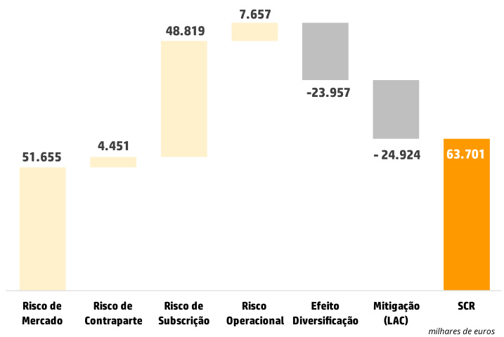  

O valor do Requisito de Capital de Solvência (RCS ou SCR de Solvency Capital Requirement) é de €63.701 milhares, que compara com €66.942 milhares do ano anterior (gráfco abaixo).  

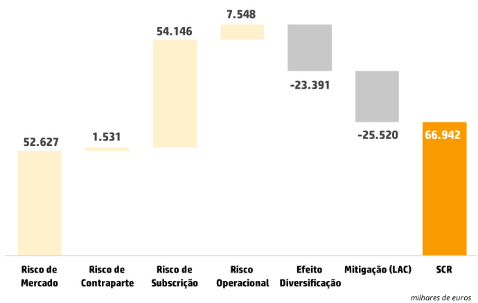  

Anualmente a Companhia realiza também a autoavaliação do risco e da solvência (ORSA) onde são avaliados os riscos inerentes ao seu negócio, sendo também realizados “stress tests” com o objetivo de avaliar o ajustamento ao seu plano de negócios. Nos “stress tests” são utilizados diferentes cenários considerando os riscos que, eventualmente, possam vir a impactar de forma material a solvência da Companhia.  

# Avaliação para Efeitos de Solvência  

Para efeitos de Solvência, o balanço é avaliado a valores de mercado, tanto nos ativos como nos passivos.  

O valor total dos ativos, apurado para efeitos de Solvência, a 31 de dezembro de 2023, era de €846.570 milhares. Este montante é inferior ao estatutário que, na mesma data, se situava em €879.033 milhares, essencialmente, devido a parte dos investimentos serem valorizados a custo amortizado.  

Quanto aos passivos, destacam-se os montantes apurados no fnal do ano de 2023 relativos às provisões técnicas, que constam no quadro abaixo:  

milhares de euros   

<html><body><table><tr><td>ProvisoesTecnicas</td><td>2023</td><td>2022</td></tr><tr><td>MelhorEstimativa</td><td>690752</td><td>766464</td></tr><tr><td>MargemdeRisco</td><td>14131</td><td>12903</td></tr><tr><td>TotaldasProvisoesTecnicas</td><td>704883</td><td>779367</td></tr><tr><td>Montantesrecuperaveisde resseguro</td><td>(1363)</td><td>(984)</td></tr></table></body></html>  

Conforme previsto na regulamentação europeia e nacional, a Lusitania Vida aplica a medida transitória sobre as provisões técnicas.  

# Gestão do Capital  

Os montantes dos fundos próprios, requisitos de capital e respetivo rácio de solvência, apurados no fnal dos dois últimos exercícios, foram os que constam no quadro seguinte:  

milhares de euros   

<html><body><table><tr><td></td><td>2023</td><td>2022</td></tr><tr><td>RequisitodeCapitalMinimo</td><td>16.851</td><td>18.589</td></tr><tr><td>FundosProprioselegiveisparaoRCS</td><td>94.712</td><td>87.272</td></tr><tr><td>RequisitodeCapitaldeSolvencia(RCS)</td><td>63.701</td><td>66.942</td></tr><tr><td>RaciodeSolvencia</td><td>148,7%</td><td>130.4%</td></tr></table></body></html>  

O montante dos Fundos Próprios é classifcado em Nível 1 e Nível 2, sendo o Nível 1 o capital da mais elevada qualidade e que permite absorver de imediato a totalidade das eventuais perdas. Em 2023, o rácio de solvência da Lusitania Vida aumentou em consequência de um aumento signifcativo dos Fundos Próprios, pese embora a redução do mesmo em 2023, em virtude da aprovação de distribuição de dividendos no ano de 2024 relativos a 2023, no montante de €10.000 milhares.  

# ÍNDICE  

Atividades e Desempenho Sistema de Governação I Perfl de Risco ... III Avaliação para Efeitos de Solvência . .III Gestão do Capital . IV  

# Atividades e Desempenho  

A.1 - Atividades A.1.1 - Informações Gerais sobre a Atividade Comercial .. 2 A.1.2 - Informações Relevantes Sobre a Atividade . 2 A.1.3 - Sustentabilidade   
A.2 – Desempenho da Subscrição . 6   
A.3 – Desempenho dos Investimentos .... ... 13   
A.4 - Desempenho de Outras Atividades .......... 15   
A.5 – Informações Adicionais .. . 15 A.5.1 – Custos e Gastos de Exploração Líquidos . 15 A.5.2 – Resultados e Dividendos . 17  

# Sistema de Governação. 18  

B.1 – Informações Gerais sobre o Sistema de Governação . 18 B.1.1 – Sobre a Estrutura de Governação da Companhia ..... 19 B.1.2 - Remuneração e Benefícios aos Trabalhadores .... 20 B.1.3 – Transações Relevantes. 20 B.2 – Requisitos de Qualifcação e Idoneidade 20 B.3 – Sistema de Gestão de Riscos com Inclusão da Autoavaliação do Risco e da Solvência ........ 21 B.3.1 – Estrutura de Gestão de Riscos ... . 21 B.3.2 – Articulação com a Autoavaliação do Risco e da Solvência (ORSA) ....... 22 B.4 – Sistema de Controlo Interno 23 B.4.1 – Função de Verifcação do Cumprimento . 24  

B.5 – Função de Auditoria Interna 24   
B.6 – Função Atuarial ... . 25   
B.7 – Subcontratação. . 25   
B.8 – Adequação do sistema de governação .... 26  

# Perfl de Risco 27  

C.1 – Riscos Específcos de Seguros .................... 28   
C.1.1 – Risco de Mortalidade ..... ......... 28   
C.1.2 – Risco de Longevidade .......................... 28   
C.1.3 – Risco de Invalidez-Morbilidade ........... 29   
C.1.4 – Risco de Despesas ....... ......... 29   
C.1.5 – Risco de Descontinuidade ................... 29   
C.1.6 – Risco Catastrófco de Vida ................... 29   
C.2 – Risco de Mercado ................ ............. 30   
C.2.1 – Risco de Taxa de Juro ............ ............... 30   
C.2.2 – Risco Acionista ....... .......... 30   
C.2.3 – Risco Imobiliário . .......... 30   
C.2.4 – Risco Cambial ............ .............. 30   
C.2.5 – Risco de Sprea  ... ......... 30   
C.2.6 – Risco de Concentração. ......... 31   
C.3 – Risco de Crédito (Contraparte) .................. 31   
C.4 – Risco de Liquidez .................. ................ 32   
C.5 – Risco Operacional .. .......... 32   
C.6 – Outros Riscos Materiais ........... ............... 32   
C.7 – Eventuais Informações Adicionais............. 33   
C.7.1 – Formas de Mitigação dos Riscos ........ 33   
C.7.2 – Análise de Sensibilidade ...................... 33   
C.7.3 – Análise comparativa ......... ....... 33   
C.7.4 – Princípio do Gestor Prudente ............. 34   
C.7.5 – Ajustamentos da capacidade de   
absorção de perdas das provisões técnicas   
(LAC-PT) e por impostos diferidos (LAC-DT) .. 34  

# Avaliação para Efeitos de Solvência .. . 36  

D.1 – Ativos 37   
D.1.1 – Ativos Financeiros . . 37   
D.1.2 – Ativos Intangíveis.. . 40   
D.1.3 – Ativos por Impostos Diferidos ... . 40  

D.1.4 – Excedente de Prestações de Pensão 40 D.1.5 – Imóveis, Instalações e Equipamento para Uso Próprio ................ ............. 40 D.1.6 – Imóveis (que não para Uso Próprio) . 40 D.1.7 – Interesses em Empresas Relacionadas, incluindo Participações .................................... 40 D.1.8 – Ações Cotadas em Bolsa..................... 41 D.1.9 – Ações Não Cotadas.............................. 41 D.1.10 – Obrigações de Dívida Pública .......... 41 D.1.11– Obrigações de Empresas ................... 41 D.1.12 – Títulos de Dívida Estruturados ........ 41 D.1.13 – Organismo de Investimento Coletivo D.1.14 – Depósitos que Não Equivalentes a Numerário ......................................................... 41 D.1.15 – Montantes Recuperáveis de Contratos de Resseguro do Ramo Vida ........................... 41 D.1.16 – Valores a Receber de Operações de Seguro e Mediadores .................. ....... 42 D.1.17 – Valores a Receber por Operações de Resseguro .......................................................... 42 D.1.18 – Valores a Receber de Operações Comerciais, Não de Seguro ............................. 42 D.1.19 – Caixa e Equivalentes de Caixa ......... 42 D.1.20 – Quaisquer Outros Ativos, Não Incluídos noutros Elementos .......................... 42 D.1.21 – Balanço ......... ....... 42 D.2 – Provisões Técnicas............... .............. 46 D.2.1 – Bases e Métodos de Cálculo .............. 48 D.2.2 – Pressupostos ................. ......... 48 D.2.3 – Nível de incerteza .............. ..... 49 D.2.4 – Montantes Recuperáveis de Resseguro .......... ........................... 49 D.2.5 – Medidas de Transição ......................... 50 D.3 – Outras Responsabilidades ........................ 50 D.3.1 – Depósitos de Resseguradores ........... 50 D.3.2 – Ativos e Passivos por Impostos Diferidos ............................................................ 50  

D.3.3 – Valores a Pagar de Operações de Seguro e Mediadores ..... .... 50 D.3.4 – Valores a Pagar de Contratos de Resseguro ..... .. 50 D.3.5 – Valores a Receber (de Operações Comerciais, Não de Seguro)..... ... 50 D.3.6 – Passivos Subordinados....... ... 50 D.3.7 – Quaisquer Outros Passivos, Não Incluídos Noutros Elementos .. ... 51 D.3.8 - Passivos contingentes . .. 51 D.4 – Métodos Alternativos de Avaliação .......... 51 D.5 – Eventuais Informações Adicionais ............ 51   
Gestão do Capital ...... .... 52 E.1 – Fundos Próprios ..... . 53 E.2 – Requisito de Capital de Solvência e Requisito de Capital Mínimo .... .. 56 E.3 – Utilização do Sub-módulo de Risco Acionista Baseado na Duração para Calcular o Requisito de Capital .... ... 57 E.4 – Diferenças entre a Fórmula Padrão e qualquer Modelo Interno Utilizado .... ... 57 E.5 – Incumprimento do Requisito de Capital Mínimo e Incumprimento do Requisito de Capital de Solvência .. ... 57 E.6 – Eventuais Informações Adicionais ...... ...... 58   
Anexos ... ... 59  

# ATIVIDADES E DESEMPENHO  

# A.1 - ATIVIDADES  

# A.1.1 - Informações Gerais sobre a Atividade Comercial  

A Lusitania Vida, Companhia de Seguros, S.A., adiante designada por Lusitania Vida, encontra-se constituída como Sociedade Anónima de acordo com a legislação portuguesa aplicável às Companhias de Seguros. É uma seguradora que tem como objeto a atividade de seguros e resseguros do Ramo Vida.  

A Companhia obteve ainda autorização para a gestão de fundos de pensões.  

# LUSITANIAVIDA  

$+351$   
$+351$  

$6^{\circ}$  

$\mathsf{n}^{\circ}\,\mathsf{676-7^{\circ}}$  

A Autoridade de Supervisão responsável pela supervisão fnanceira e comportamental é:  

  

O auditor externo / ROC é:  

Palacio Sottomayor, Au. Fontes   
Pereira de Melo, n.0 16   
1050-121 Lisboa   
Portugal  

A certifcação atuarial está a cargo da:  

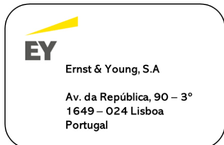  

A Lusitania Vida é detida em $99.79\%$ pela Montepio Geral - Associação Mutualista. Esta entidade também detém a seguradora Lusitania, Companhia de Seguros, SA.  

Por sua vez, a Lusitania Vida detém a $100\%$ a Sociedade Gestora de Imóveis da Rua do Prior, SA.  

# A.1.2 - Informações Relevantes Sobre a Atividade  

No início de 2022, a Lusitania Vida enfrentou um desafo comum no dinâmico mundo dos seguros, uma vez que as futuações dos mercados fnanceiros impactaram temporariamente o seu requisito de capital de solvência. Contudo, a Companhia agiu de forma proativa e transparente, comunicando prontamente a situação à Autoridade de Supervisão de Seguros e Fundos de Pensões (ASF). Em resposta, foi desenvolvido um Plano de Recuperação  

Financeira, alinhado com as melhores práticas regulatórias do RJASR. Este plano não só demonstrou a resiliência e adaptabilidade da Lusitania Vida, mas também o seu compromisso com a sustentabilidade fnanceira e a proteção dos interesses dos seus clientes. A inclusão desta informação nos relatórios anuais refete a sua dedicação à transparência e governo corporativo. Com estas medidas, a Lusitania Vida reafrmou a sua posição como uma instituição responsável e confável no mercado de seguros.  

Para reverter esse impacto temporário, a Lusitania Vida implementou um plano de e-risking, que consistiu na redução expressiva dos riscos de sprea  e de taxa de juro, através da alienação de ativos fnanceiros de maior volatilidade e menor rentabilidade, de molde a adequar as durações entre ativos e passivos. A Companhia também ajustou a sua oferta de produtos, redesenhando-os para as novas condições de mercado, com foco na rentabilidade e na sustentabilidade. Estas medidas permitiram a recuperação fnanceira e económica da Companhia, que tem continuamente apresentado um nível de solvência confortável e resultados ajustados ao risco expressivos em 2022 e 2023 (em IFRS e Solvência II), tendo, em consequência, o Órgão de Administração proposto uma distribuição de dividendos de €10.000 milhares, relativos ao exercício fndo em 31 de dezembro de 2023, aprovado em sede de Assembleia Geral de Acionistas.  

Ao nível do sistema de governação, a Lusitania Vida implementou uma estrutura com uma maior segregação de funções e de pelouros, com um Órgão de Administração mais alargado, com vista a uma gestão orientada ao crescimento sustentado da atividade. Em termos de estruturas internas, o novo modelo organizacional contempla novos Comités de Gestão, orientados para o Controlo Interno, Investimentos e Gestão de Riscos.  

Com estas medidas, a Lusitania Vida demonstrou a sua capacidade de adaptação e de superação, reforçando a sua posição no mercado segurador português em 2023 e a confança dos seus clientes, parceiros e colaboradores.  

A implementação do novo normativo contabilístico IFRS 17 constituiu um projeto complexo, longo, com diversas linhas de trabalho envolvendo várias direções da Companhia, com o suporte de consultores externos, e que determinou uma alocação de recursos fnanceiros muito material. Os resultados desta nova norma contabilística, aplicável aos contratos de seguros, que determinou um novo Plano de Contas, implicou a reexpressão do exercício de 2022, para efeitos comparativos, bem como o apuramento dos impactos de transição.  

# A.1.3 - Sustentabilidade  

As regras de Solvência II, que regulam a atividade das empresas de seguros e de resseguros na União Europeia, estão em processo de revisão, tendo em conta os desafos e as oportunidades que se colocam ao setor no âmbito da sustentabilidade ambiental, social e de governação (ESG).  

A sustentabilidade é um conceito que engloba os fatores ambientais, sociais e de governação, que infuenciam o desempenho e o risco das empresas, bem como o impacto que estas têm na sociedade e no ambiente. Estes fatores incluem, por exemplo, as emissões de gases com efeito de estufa, o consumo de recursos naturais, a diversidade e a inclusão, os direitos humanos, a ética e a transparência.  

A revisão das regras de Solvência II visa integrar os fatores ESG na subscrição de riscos, na gestão de riscos, na gestão dos investimentos, na avaliação dos requisitos de capital de solvência, na governação e na divulgação de informação das empresas de seguros e de resseguros, de forma a alinhar o setor com os objetivos do Pacto Ecológico Europeu e do Plano de Ação para o Financiamento Sustentável.  

A adaptação às regras de Solvência II, decorrentes dos critérios ESG, implica, por um lado, que as empresas de seguros e de resseguros tenham em conta os riscos e as oportunidades que os fatores  

ESG representam para a sua atividade, tanto do ponto de vista fnanceiro como não fnanceiro. Por outro lado, implica que as empresas de seguros e de resseguros contribuam para a transição para uma economia mais verde e mais justa, através da oferta de produtos e serviços que promovam o ESG, a subscrição de riscos sustentáveis (conforme a taxonomia europeia) e a alocação de capital a investimentos sustentáveis.  

Algumas das medidas previstas na revisão das regras de Solvência II, no âmbito da sustentabilidade, são as seguintes:  

- A introdução de um requisito de integração dos fatores ESG na política de subscrição e na gestão de passivos das empresas de seguros e de resseguros, tendo em conta os riscos e as oportunidades que estes fatores representam para a adequação e a competitividade dos produtos e serviços oferecidos, bem como o seu impacto na sustentabilidade da Companhia;  

- A introdução de um requisito de integração dos fatores ESG na política de investimento e na gestão de ativos das empresas de seguros e de resseguros, tendo em conta os riscos e as oportunidades que estes fatores representam para a rentabilidade e a segurança dos investimentos, bem como o seu impacto na sustentabilidade;  

- A introdução de um requisito de avaliação do impacto das alterações climáticas na situação fnanceira e na solvência das empresas de seguros e de resseguros, através da realização de testes de esforço climático, que simulam cenários adversos de evolução da temperatura, da precipitação e do nível do mar;  

- A introdução de um requisito de integração dos fatores ESG na política de remuneração e na gestão de recursos humanos das empresas de seguros e de resseguros, tendo em conta os riscos e as oportunidades que estes fatores representam para a motivação e a retenção dos colaboradores, bem como o seu impacto na sustentabilidade;  

- A introdução de um requisito de divulgação de informação sobre a exposição das empresas de seguros e de resseguros aos riscos relacionados com as alterações climáticas, bem como sobre a sua estratégia e as suas metas para mitigar esses riscos e para alinhar a sua atividade com os objetivos do Acordo de Paris.  

Estas medidas visam tornar o setor dos seguros e dos resseguros mais resiliente e mais responsável socialmente, bem como estimular a inovação e a competitividade, em benefício dos tomadores de seguros, dos investidores, da sociedade e do ambiente.  

Adicionalmente, a Lusitania Vida observa as novas regras de relato de sustentabilidade, vigentes desde 1 de janeiro de 2024, decorrentes da Diretiva (UE) 2022/2464, também conhecida como CSRD (Corporate Sustainability Reporting Directive).  

A CSRD aplica-se a todas as empresas de maior dimensão e a todas as empresas cotadas (exceto microempresas cotadas) que tenham a sua sede na UE ou que estejam sujeitas à lei da UE. Uma empresa é considerada de maior dimensão se cumprir pelo menos dois dos seguintes critérios: ter um balanço total superior a €20 milhões, ter um volume de negócios líquido superior a €40 milhões, ter mais de 250 colaboradores. A Lusitania Vida cumpre os dois primeiros critérios.  

A CSRD também se aplica às empresas-mãe de grupos grandes que incluam uma ou mais empresas cotadas ou grandes.  

Isto signifca que a Companhia irá reportar, em 2025, por referência ao exercício de 2024, informações sobre os riscos e as oportunidades que os fatores ESG representam para a sua atividade, bem como sobre o impacto da sua atividade nas pessoas e no ambiente. A Companhia irá reportar de acordo com as Normas Europeias de Relato de Sustentabilidade (ESRS), que foram desenvolvidas pelo EFRAG (European Financial Reporting A visory Group). As ESRS foram publicadas no Jornal Ofcial da União Europeia em 22 de dezembro de 2023, sob a forma de um regulamento delegado. As ESRS baseiam-se e contribuem para as iniciativas de normalização internacionais, tendo em conta as políticas da UE.  

A CSRD também exige uma verifcação das informações de sustentabilidade que as empresas reportam e prevê a taxonomia digital das informações de sustentabilidade. A verifcação visa garantir a fabilidade, a comparabilidade e a relevância das informações de sustentabilidade. A taxonomia digital visa facilitar a recolha, a análise e a divulgação das informações de sustentabilidade, através de um formato eletrónico comum.  

A Lusitania Vida terá de se adaptar às regras da CSRD, o que implica um esforço ao nível dos sistemas, dos dados, dos recursos humanos, do tempo e do investimento. No entanto, a CSRD também representa uma oportunidade para a Companhia melhorar o seu desempenho e a sua reputação em matéria de sustentabilidade / ESG, bem como para atrair e reter investidores, clientes, parceiros e colaboradores que partilhem os mesmos valores e objetivos.  

Finalmente, em 2024, o Órgão de Administração dará seguimento à consecução do Plano Estratégico para a área seguradora para o período 2023-2026, focando-se na proximidade com os seus clientes e distribuidores e continuando a simplifcar operações. Esta estratégia está assente em vetores com o foco do reposicionamento no mercado para os segmentos-alvo: agilidade de gestão, redução de custos estruturais, diferenciação da oferta e novos meios de distribuição. Relativamente aos vetores ESG, em particular na componente da responsabilidade social, para além das medidas internas e da especifcidade decorrente da regulamentação da atividade seguradora, a Companhia acompanha e desenvolve de forma estruturada a Política de Responsabilidade Social defnida para o Grupo Montepio.  

# A.2 – DESEMPENHO DA SUBSCRIÇÃO  

A Lusitania Vida emite contratos, titulados por apólices, que incluem o risco específco de seguro, o risco fnanceiro ou uma composição de ambos, que podem ser subscritos em todo o território nacional. Um contrato em que a Companhia aceita um risco signifcativo de seguro da outra parte, concordando compensar o segurado no caso de um futuro acontecimento incerto e/ou específco e que possa afetar desfavoravelmente o segurado, é classifcado como um Contrato de Seguro. Um contrato emitido pela Companhia, cujo risco seguro transferido não seja signifcativo, mas cujo risco fnanceiro transferido inclua participação nos resultados discricionária, é considerado como um contrato de seguro, sendo reconhecido e mensurado de acordo com as políticas contabilísticas aplicáveis aos contratos de seguro.  

Um contrato emitido pela Companhia que transfere apenas o risco fnanceiro, sem participação nos resultados discricionária, é registado como um instrumento fnanceiro e, para efeitos de informação, é considerado como um Contrato de Investimento.  

# Contratos de seguro mensurados pelo modelo geral  

Para efeitos de relato fnanceiro, no reconhecimento inicial, a Companhia mensura as responsabilidades técnicas resultantes de um contrato de seguro mensurado pelo modelo geral como o somatório das seguintes parcelas: (i) Fluxos de caixa ligados ao cumprimento dos contratos, que incluem as estimativas do valor atual esperado dos fuxos de caixa futuros (já ajustados pelos riscos fnanceiros inerentes à projeção dos fuxos de caixa futuros) e um ajustamento de risco não fnanceiro; e (ii) Margem dos serviços contratuais.  

A projeção dos fuxos de caixa futuros inclui, na mensuração de um grupo de contratos de seguro, todos os fuxos de caixa futuros até ao limite contratual de cada contrato de seguro do grupo.  

A Companhia não reconhece passivos ou ativos relacionados com prémios esperados ou sinistros esperados fora dos limites dos contratos de seguro vigentes. Tais montantes referem-se a contratos de seguro futuros.  

Os fuxos de caixa ligados ao cumprimento dos contratos de seguro incluem as estimativas do valor atual esperado dos fuxos de caixa futuros (já ajustados pelos riscos fnanceiros inerentes à projeção dos fuxos de caixa futuros), denominados por “melhor estimativa”, e um ajustamento de risco não fnanceiro.  

A melhor estimativa corresponde ao valor dos fuxos de caixa futuros, ponderados pela sua probabilidade de ocorrência, tendo em conta o valor temporal do dinheiro, com base na estrutura temporal das taxas de juro sem risco relevante, divulgada pela European Insurance an  Occupational Pensions Aut ority (“EIOPA”), adicionada de um prémio de iliquidez.  

A melhor estimativa é calculada pelo seu valor bruto, sem dedução dos montantes recuperáveis de contratos de resseguro detidos. Os montantes recuperáveis de contratos de resseguro detidos e de entidades com objeto específco de titularização de riscos de seguro são calculados separadamente.  

O ajustamento de risco não fnanceiro de contratos de seguro mensura a compensação necessária para que a Companhia reconheça responsabilidades técnicas, considerando a amplitude de desfechos possíveis decorrentes de riscos não fnanceiros. O ajustamento de risco não fnanceiro é, portanto, uma margem de prudência sobre a melhor estimativa (“cenário-central”), para fazer face aos riscos não fnanceiros. O ajustamento de risco não fnanceiro é determinado tendo por base o Value-at-Risk multivariado agregado dos requisitos de capital do risco específco de seguro com um nível de confança de $75\%$ .  

A reconciliação dos saldos de abertura e de encerramento dos passivos por contratos de seguro direto emitidos, mensurados pelo modelo de mensuração geral no exercício de 2023,  

<html><body><table><tr><td>Saldos em1 de janeiro de 2023</td></tr><tr><td>Posicaoativa</td></tr><tr><td>Posicao passiva</td></tr><tr><td>Alteracoesrelacionadascomoservicocorrente</td></tr><tr><td>Libertacao da margem de servicos contratuaispelos servicos transferidos</td></tr><tr><td>Libertacao do ajustamento derisco(nao financeiro)pelo riscoexpirado</td></tr><tr><td>Ajustamentos de experiencia</td></tr><tr><td>Alteracoesrelacionadas com o servicofuturo Contratosreconhecidos no ano</td></tr><tr><td>Alteracaodeestimativasqueafetamamargemdeservicoscontratuais</td></tr><tr><td>Alteracaodeestimativasqueresultam emperdasoureversaodeperdas</td></tr><tr><td>Alteracoesrelacionadascomoservicopassado</td></tr><tr><td>Resultado decontratos de seguro</td></tr><tr><td>Efeitofinanceironademonstracaodosresultados</td></tr><tr><td>Efeito financeiro em outro rendimento integral</td></tr><tr><td>Totaldasalteracoesemrendimentointegral</td></tr><tr><td>Fluxos de caixa liquidados</td></tr><tr><td>Transferenciadeoutrositensdaposicaofinanceira</td></tr><tr><td>Posicao ativa</td></tr><tr><td>Posicao passiva</td></tr><tr><td>Saldosem31de dezembro de2023</td></tr></table></body></html>  

A Companhia encerrou o exercício de 2023 com uma margem de serviços contratuais de aproximadamente €45.1 milhões (31 de dezembro de 2022: €55 milhões), tendo escriturado um resultado negativo de contratos de seguro em 2023 de €5.4 milhões (2022: -€2.2 milhões), que se decompõe: (i) Numa perda de €7.4 milhões de alterações relacionadas com o serviço corrente; (ii) Numa alteração positiva, que apenas afeta a margem de serviços contratuais, de aproximadamente €3.8 milhões, relacionadas com o serviço futuro; e (iii) Uma perda por alterações relacionadas com o serviço passado de €1.7 milhões.  

decompostos entre fuxos de caixa futuros, ajustamento de risco (não fnanceiro) e margem de serviços contratuais, é como segue:  

(Montantes expressos em € milhares)   

<html><body><table><tr><td colspan="3">Passivos de servicos futuros e de servicos passados desegurodireto</td><td></td></tr><tr><td>Fluxosdecaixa futuros</td><td>Ajustamento de risco nao financeiro</td><td>Margem de servicos contratuais</td><td>Total</td></tr><tr><td>147.908</td><td>23.737</td><td>54.960</td><td>226.605</td></tr><tr><td>(7.293)</td><td>1.114</td><td>2.850</td><td>(3.329)</td></tr><tr><td>155.200</td><td>22.623</td><td>52.110</td><td>229.934</td></tr><tr><td></td><td></td><td></td><td></td></tr><tr><td>0</td><td>0</td><td>(4.662)</td><td>(4.662)</td></tr><tr><td>0</td><td>(1.824)</td><td>0</td><td>(1.824)</td></tr><tr><td>3.658</td><td>(3.309)</td><td>(1.288)</td><td>(939)</td></tr><tr><td></td><td></td><td></td><td></td></tr><tr><td>(11.709)</td><td>3.439</td><td>12.864</td><td>4.594</td></tr><tr><td>10.227</td><td>6.513</td><td>(17.671)</td><td>(931)</td></tr><tr><td>126</td><td>0</td><td>0</td><td>126</td></tr><tr><td>(1.723)</td><td>0</td><td>0</td><td>(1.723)</td></tr><tr><td>579</td><td>4.819</td><td>(10.758)</td><td>(5.360)</td></tr><tr><td>2.316</td><td>484</td><td>905</td><td>3.705</td></tr><tr><td>1.767</td><td>261</td><td>0</td><td>2.028</td></tr><tr><td>4.662</td><td>5.564</td><td>(9.853)</td><td>373</td></tr><tr><td>11.226</td><td>0</td><td>0</td><td>11.226</td></tr><tr><td>1.910</td><td>0</td><td>0</td><td>1.910</td></tr><tr><td>(53.912)</td><td>19.993</td><td>27.816</td><td>(6.103)</td></tr><tr><td>219.618</td><td>9.308</td><td>17.291</td><td>246.217</td></tr><tr><td>165.706</td><td>29.301</td><td>45.107</td><td>240.114</td></tr></table></body></html>  

A componente fnanceira no exercício de 2023 ascendeu a cerca de $\epsilon5.7$ milhões (2022: -23.1 milhões), dos quais cerca de $\epsilon3.7$ milhões em resultados e €2 milhões em rendimento integral.  

A reconciliação dos saldos de abertura e de encerramento dos passivos por contratos de seguro direto emitidos, mensurados pelo modelo de mensuração geral no exercício de 2022, decompostos entre fuxos de caixa futuros, ajustamento de risco (não fnanceiro) e margem de serviços contratuais, é como segue:  

<html><body><table><tr><td rowspan="2"></td><td colspan="3">Passivos de servicos futuros e de servicos passados</td><td></td></tr><tr><td>Fluxos de caixa futuros</td><td>Ajustamento de risco nao financeiro</td><td>Margem de servicos contratuais</td><td>Total</td></tr><tr><td>Saldos em1de janeiro de2022</td><td>137.920</td><td>22.972</td><td>33.397</td><td>194.289</td></tr><tr><td>Posicao ativa</td><td>(49.913)</td><td>17.771</td><td>23.090</td><td>(9.052)</td></tr><tr><td>Posicaopassiva</td><td>187.885</td><td>5.201</td><td>10.307</td><td>203.393</td></tr><tr><td></td><td></td><td></td><td></td><td></td></tr><tr><td>Alteracoesrelacionadascomoservicocorrente</td><td></td><td></td><td></td><td></td></tr><tr><td>Libertacao da margem deservicoscontratuaispelos servicos transferidos</td><td>0</td><td>0</td><td>(4.314)</td><td>(4.314)</td></tr><tr><td>Libertacao do ajustamento derisco(nao financeiro)pelorisco expirado</td><td>0</td><td>(1.181)</td><td>0</td><td>(1.181)</td></tr><tr><td>Ajustamentos de experiencia</td><td>287</td><td>0</td><td>17.027</td><td>17.314</td></tr><tr><td></td><td></td><td></td><td></td><td></td></tr><tr><td>Alteracoesrelacionadas como servicofuturo Contratosreconhecidosnoano</td><td></td><td>7.228</td><td>23.733</td><td></td></tr><tr><td>Alteracaodeestimativasqueafetamamargemdeservicoscontratuais</td><td>(28.317) 0</td><td>1.476</td><td>(15.352)</td><td>2.644 (13.876)</td></tr><tr><td>Alteracaodeestimativasqueresultamemperdasoureversaodeperdas</td><td>47</td><td>220</td><td>0</td><td>267</td></tr><tr><td>Alteracoesrelacionadascomoservicopassado</td><td>(3.006)</td><td>0</td><td>0</td><td>(3.006)</td></tr><tr><td>Resultadodecontratosdeseguro</td><td></td><td></td><td></td><td></td></tr><tr><td></td><td>(30.989)</td><td>7.742</td><td>21.094</td><td>(2.154)</td></tr><tr><td>Efeitofinanceironademonstracaodosresultados</td><td>2.005</td><td>74</td><td>469</td><td>2.548</td></tr><tr><td>Efeitofinanceiroemoutrorendimentointegral</td><td>(16.461)</td><td>(7.051)</td><td>0</td><td>(23.512)</td></tr><tr><td>Totaldasalteracoesemrendimentointegral</td><td></td><td></td><td></td><td></td></tr><tr><td></td><td>(45.445)</td><td>765</td><td>21.562</td><td>(23.117)</td></tr><tr><td>Fluxosdecaixaliquidados</td><td>56.930</td><td>0</td><td>0</td><td></td></tr><tr><td>Transferencia de outrositens da posicao financeira</td><td>(1.497)</td><td>0</td><td>0</td><td>56.930</td></tr><tr><td></td><td></td><td></td><td></td><td>(1.497)</td></tr><tr><td>Posicaoativa</td><td>(7.293)</td><td>1.114</td><td>2.850</td><td>(3.329)</td></tr><tr><td>Posicao passiva</td><td>155.200</td><td>22.623</td><td>52.110</td><td>229.934</td></tr><tr><td>Saldosem31dedezembrode2022</td><td>147.908</td><td>23.737</td><td>54.960</td><td>226.605</td></tr><tr><td></td><td></td><td></td><td></td><td></td></tr></table></body></html>  

A Companhia encerrou o exercício de 2022 com uma margem de serviços contratuais de aproximadamente €55 milhões (31 de dezembro de 2021: €33.4 milhões), tendo alcançado um resultado negativo de contratos de seguro em 2023 de €2.2 milhões, que se decompõe: (i) Num ganho de €11.8 milhões de alterações relacionadas com o serviço corrente; e (ii) Em alterações negativas relacionadas com o serviço futuro de €11 milhões (largamente por contrapartida da margem de serviços contratuais); e (iii) Alterações negativas relacionadas com o serviço passado de €3 milhões.  

A componente fnanceira no exercício de 2022 ascendeu a cerca de -€20.9 milhões, dos quais um ganho de cerca de $\in2.5$ milhões em resultados e - €23.5 milhões em rendimento integral.  

# Contratos de seguro mensurados pela abordagem da alocação do prémio  

Para efeitos de relato fnanceiro, um contrato de seguro ou um grupo de contratos de seguro, poderá ser mensurado através da abordagem da alocação do prémio, se a Companhia tiver razões para crer que essa simplifcação conduzirá a uma mensuração do passivo de cobertura remanescente do contrato ou do grupo, que não será signifcativamente diferente daquela que seria obtida pela aplicação dos requisitos de mensuração da abordagem geral, plasmados acima.  

Na abordagem da alocação do prémio, no reconhecimento inicial, o passivo de cobertura remanescente corresponde aos prémios por adquirir. No fnal de cada período de relato subsequente, o passivo de cobertura remanescente corresponde à quantia escriturada no início do período de relato, acrescido dos prémios do período, deduzido do montante reconhecido como rédito de seguros por serviços prestados nesse período.  

Na abordagem da alocação do prémio, a Companhia considera que o valor temporal do dinheiro e os riscos fnanceiros não são signifcativos para o passivo de cobertura remanescente, dado que os pagamentos e os serviços associados são esperados ocorrer num curto período após a data de relato, tendo optado por não descontar o passivo de cobertura remanescente.  

Nesta abordagem, os fuxos de caixa pagos diretamente relacionados com a aquisição de contratos são reconhecidos como gasto quando ocorrem.  

Os passivos por sinistros ocorridos, apresentados na demonstração da posição fnanceira, seguem as bases de mensuração descritas para o modelo geral de mensuração, plasmadas acima.  

A reconciliação dos saldos de abertura e de encerramento dos passivos de serviços futuros e de serviços passados de seguro direto do exercício de 2023, é como segue:  

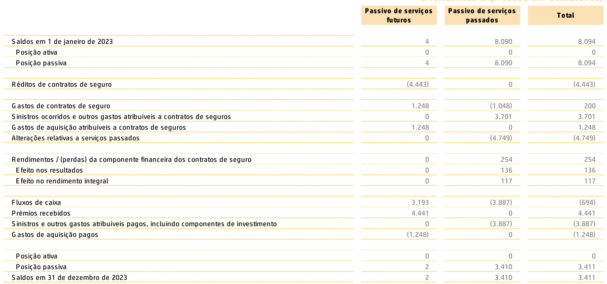  

A reconciliação dos saldos de abertura e de encerramento dos passivos de serviços futuros e de serviços passados de seguro direto do exercício de 2022, é como segue:  

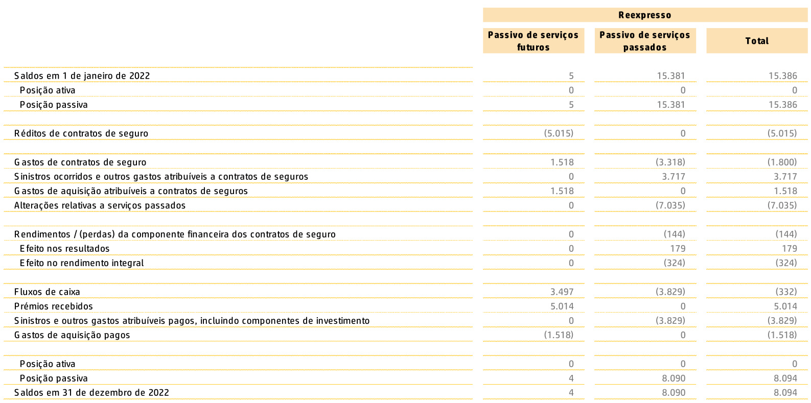  

# Contratos de resseguro detidos  

A Companhia celebra acordos de resseguro como técnica de mitigação do risco específco de seguro. A cessão do risco específco de seguro implica a cedência dos respetivos prémios. Os riscos específcos de seguro são cedidos para uma ou mais resseguradoras e classifcados de forma consistente com os respetivos contratos de seguro subjacentes (i.e., contratos de seguro direto).  

A Companhia reconhece um contrato ou grupo de contratos de resseguro detidos, a partir da primeira das seguintes datas: (i) Início do período de cobertura do contrato ou grupo de contratos de resseguro detidos; ou (ii) Data em que a Companhia reconhece um grupo oneroso de contratos de seguro subjacentes, se existirem contratos de resseguro conexos.  

Na mensuração dos ativos ou passivos de contratos de resseguro do ramo vida são utilizados as bases de mensuração e os critérios valorimétricos acima mencionados, a respeito dos contratos de seguro direto, tendo em atenção as percentagens de  

cedência, assim como outras cláusulas existentes nos tratados em vigor, com a ressalva de que as  

referências aos contratos onerosos nesses parágrafos devem ser substituídas por uma referência aos contratos em que existe um ganho líquido relativamente ao reconhecimento inicial. Os ativos ou passivos de contratos de resseguro do ramo vida correspondem à quota-parte da responsabilidade dos resseguradores nas responsabilidades técnicas da Companhia, sendo calculadas de acordo com os tratados de resseguro em vigor, no que se refere às percentagens de cedência e outras cláusulas existentes.  

As quantias escrituradas relacionadas com o resseguro cedido são apresentadas na demonstração da posição fnanceira pelo seu montante ilíquido, exceto quando existe a possibilidade legal de compensar os montantes reconhecidos e exista a intenção de os liquidar pelo seu valor líquido ou realizar o ativo e liquidar o passivo simultaneamente.  

Os recuperáveis de contratos de resseguro cedido detidos são mensurados pela abordagem da alocação do prémio, face ao período de cobertura. Os recuperáveis de contratos de resseguro cedido detidos são reconhecidos como um ativo quando a Companhia tem direito à compensação de sinistros ou eventos cobertos pelo contrato de resseguro detido.  

A mensuração inicial dos recuperáveis é baseada nos prémios pagos nominais, líquido de comissões, não descontados.  

Após a mensuração inicial, os recuperáveis são subsequentemente mensurados pelo montante ajustado dos prémios pagos, em função da cobertura de risco remanescente.  

A Companhia avalia os recuperáveis por contratos de resseguro cedido detidos em cada data de relato, aferindo qualquer indicação de que os recuperáveis possam estar diminuídos. Se tal indicação existir, a Companhia realiza um teste de recuperabilidade para determinar se a quantia escriturada dos recuperáveis excede o valor recuperável. Se a quantia escriturada exceder o valor recuperável, a Companhia reconhece uma perda por imparidade por contrapartida da redução do valor recuperável.  

A reconciliação dos saldos de abertura e de encerramento dos ativos de serviços futuros e de serviços passados de resseguro cedido do exercício de 2023, é como segue:  

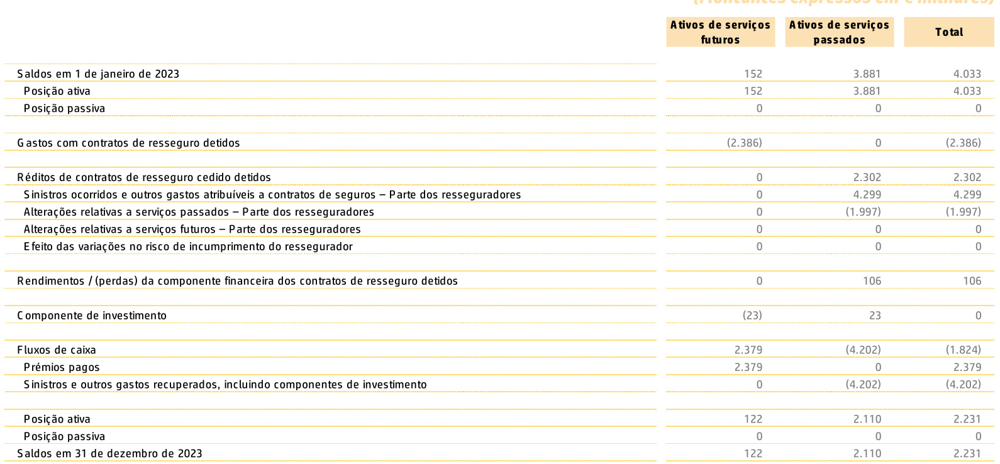  

serviços passados de resseguro cedido do exercício de 2022, é como segue:  

A reconciliação dos saldos de abertura e de encerramento dos ativos de serviços futuros e de   

<html><body><table><tr><td rowspan="2"></td><td colspan="3">(Montantesexpressos emEmilhares)</td></tr><tr><td>Ativosdeservicos</td><td>Reexpresso Ativosdeservicos</td><td>Total</td></tr><tr><td></td><td>futuros</td><td>sopessed</td><td></td></tr><tr><td>Saldos em 1de janeiro de 2022</td><td>154</td><td>7.286</td><td>7.440</td></tr><tr><td>Posicaoativa</td><td>154</td><td>7.286</td><td>7.440</td></tr><tr><td>Posicao passiva</td><td>0</td><td>0</td><td>0</td></tr><tr><td></td><td></td><td></td><td></td></tr><tr><td>Gastos de contratosderesseguro detidos</td><td>(3.299)</td><td>0</td><td>(3.299)</td></tr><tr><td></td><td></td><td></td><td></td></tr><tr><td>Réditosdecontratosderessegurocedidodetidos</td><td>0</td><td>1.909</td><td>1.909</td></tr><tr><td>Sinistros ocorridoseoutrosgastosatribuiveisacontratosdeseguros-Partedosresseguradores Alteracoesrelativasaservicospassados-Partedosresseguradores</td><td>0</td><td>1.329</td><td>1.329</td></tr><tr><td>Alteracoesrelativasaservicosfuturos-Partedosresseguradores</td><td>0</td><td>580</td><td>580</td></tr><tr><td>Efeitodasvariacoesnoriscodeincumprimentodoressegurador</td><td>0 0</td><td>0 0</td><td>0 0</td></tr><tr><td></td><td></td><td></td><td></td></tr><tr><td>Rendimentos/(perdas)dacomponente financeira dos contratosderesseguro detidos</td><td>0</td><td>(79)</td><td>(79)</td></tr><tr><td>Componente deinvestimento</td><td>(24)</td><td>24</td><td>0</td></tr><tr><td></td><td></td><td></td><td></td></tr><tr><td>Fluxos de caixa Premiospagos</td><td>3.321 3.321</td><td>(5.260)</td><td>(1.939)</td></tr><tr><td>Sinistroseoutrosgastosrecuperados,incluindocomponentesdeinvestimento</td><td>0</td><td>0 (5.260)</td><td>3.321 (5.260)</td></tr><tr><td></td><td></td><td></td><td></td></tr><tr><td>Posicao ativa</td><td>152</td><td>3.881</td><td>4.033</td></tr><tr><td>Posicaopassiva</td><td>0</td><td>0</td><td>0</td></tr><tr><td>Saldos em 31 de dezembro de 2022</td><td>152</td><td>3.881</td><td>4.033</td></tr></table></body></html>  

# A.3 – DESEMPENHO DOS INVESTIMENTOS  

Os rendimentos, ganhos líquidos e perdas por imparidade, gerados pelos investimentos da  

Companhia em 2023, distribuídos por classes de ativos, são como seguem:  

(Montantes expressos em € milhares)  

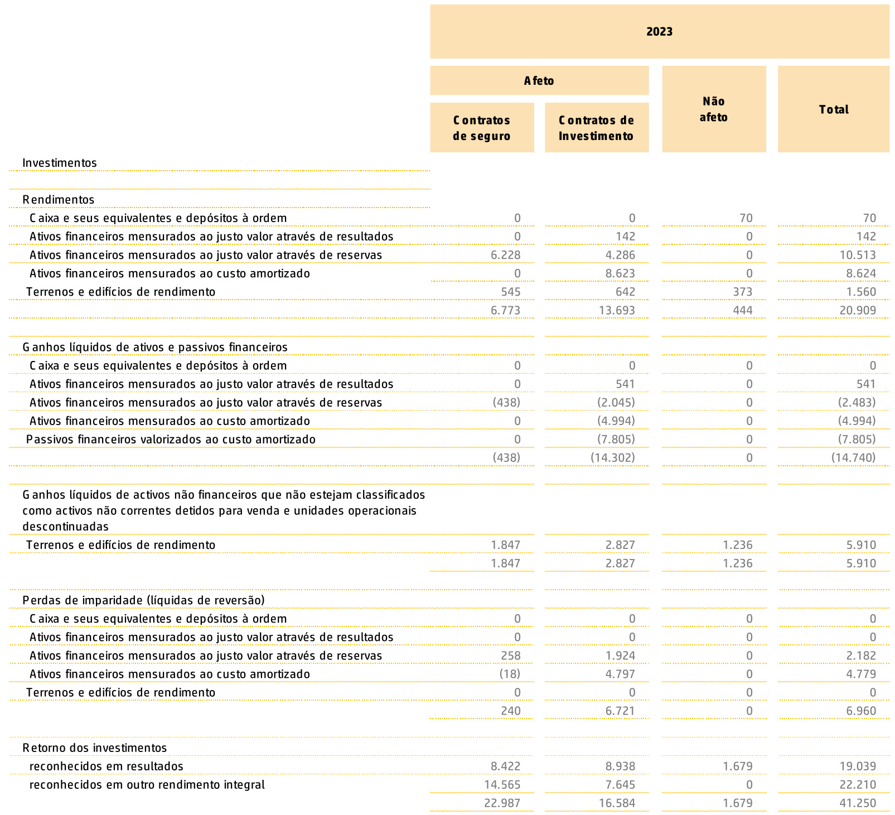  

Os rendimentos, ganhos líquidos e perdas por imparidade, gerados pelos investimentos da Companhia em 2022, distribuídos por classes de ativos, são como seguem:  

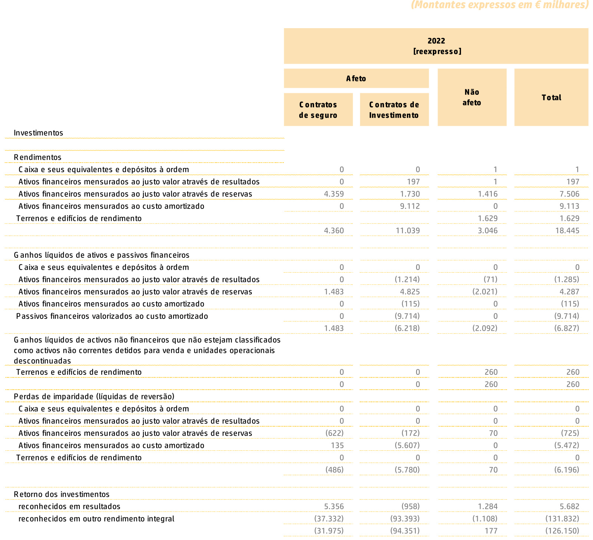  

A carteira de ativos fnanceiros da Lusitania Vida é maioritariamente constituída por obrigações de taxa fxa, o que permite uma elevada previsibilidade dos fuxos de caixa.  

Não existem quaisquer ganhos ou perdas reconhecidas diretamente em ações.  

Em outubro de 2022, a Lusitania Vida Companhia de Seguros, S.A. alienou a participação detida na Montepio Seguros S.G.P.S., S.A.  

# A.4 - DESEMPENHO DE OUTRAS ATIVIDADES  

A atividade de gestão de fundos de pensões gerou réditos de €33 milhares (2022: €63 milhares), escriturados na rubrica “Outros rendimentos/gastos  

técnicos líquidos de resseguro” da demonstração dos resultados.  

# A.5 – INFORMAÇÕES ADICIONAIS  

# A.5.1 – Custos e Gastos de Exploração Líquidos  

No âmbito da IFRS 17, os custos diretamente atribuíveis são os custos que a Companhia incorre na aquisição, emissão e manutenção de um grupo de contratos de seguro, que não teria incorrido se não tivesse emitido esses contratos. Referem-se, portanto, a despesas que a Companhia associa diretamente à aquisição, emissão e manutenção dos contratos de seguro. Esses custos incluem, por exemplo, comissões, taxas, despesas administrativas e de subscrição, entre outros.  

Assim, no modelo de mensuração geral, esses custos são capitalizados como ativos por contratos de seguro. Na abordagem da alocação do prémio, os fuxos de caixa pagos diretamente relacionados com a aquisição de contratos são reconhecidos como gasto quando ocorrem.  

Os custos de aquisição que não se relacionam diretamente com a aquisição ou renovação de contratos e, bem assim, os demais custos operacionais não diretamente atribuíveis à aquisição ou renovação de contratos são reconhecidos como gastos do período em que são incorridos.  

Os custos atribuíveis e não atribuíveis a contratos de seguro em 2023 e 2022, detalham-se por natureza como segue:  

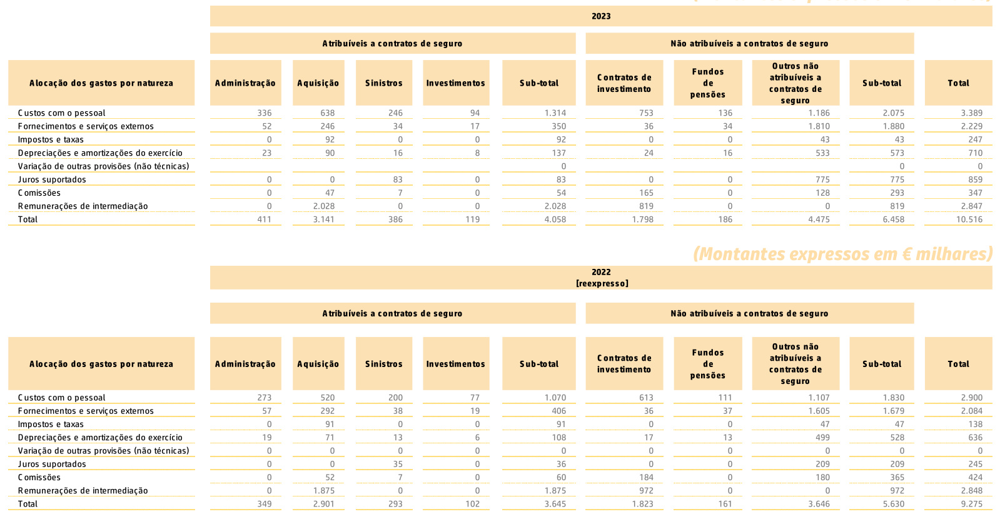  

Os custos por natureza em 2023 e 2022 decompõem-se como segue:   
(Montantes expressos em € milhares)   

<html><body><table><tr><td>Rubricas</td><td>2023</td><td>2022</td></tr><tr><td>Remuneracoes</td><td>2.534.</td><td>2.110</td></tr><tr><td>-dos orgaos sociais</td><td>647</td><td>375</td></tr><tr><td>- do pessoal</td><td>1.887</td><td>1.736</td></tr><tr><td>Encargossobreremuneracoes</td><td>625</td><td>446</td></tr><tr><td>Beneficiospos-emprego</td><td>115</td><td>49</td></tr><tr><td>-Planos de contribuicao definida</td><td>112.</td><td>57</td></tr><tr><td>-Planos debeneficios definidos</td><td>3</td><td>(8)</td></tr><tr><td>Segurosobrigatorios</td><td>49</td><td>90</td></tr><tr><td>G astos de accao social</td><td>20</td><td>1</td></tr><tr><td>Outrosgastoscomopessoal</td><td>46</td><td>204</td></tr><tr><td></td><td>3.389</td><td>2.900</td></tr><tr><td>Energia e combustiveis</td><td>45</td><td>25</td></tr><tr><td>Conservacaoereparacao</td><td>555</td><td>654</td></tr><tr><td>Rendas e alugueres</td><td>31</td><td>0</td></tr><tr><td>Comunicacao</td><td>118</td><td>85</td></tr><tr><td>TrabalhosEspecializados</td><td>1.053</td><td>954</td></tr><tr><td>O utros Fornecimentos e servicos externos</td><td>426</td><td>366</td></tr><tr><td>Fornecimentos e servicos externos</td><td>2.229</td><td>2.084</td></tr><tr><td>Depreciacoesde activosintangiveis</td><td>369</td><td>369</td></tr><tr><td>Depreciacoes de activos tangiveis</td><td>153</td><td>149</td></tr><tr><td>Depreciacoes propriedades investimento</td><td>188</td><td>118</td></tr><tr><td></td><td>710</td><td>636</td></tr><tr><td>Impostosetaxas</td><td>136</td><td>138</td></tr><tr><td>Juros suportados</td><td>859</td><td>245</td></tr><tr><td>Comissoes</td><td>347</td><td>424</td></tr><tr><td>Total</td><td>7.669</td><td>6.428</td></tr></table></body></html>  

<html><body><table><tr><td></td><td colspan="2">(Montantes expressos em E milhares)</td></tr><tr><td></td><td>2023</td><td>2022 [REEXPRESSO]</td></tr><tr><td>Itens que poderao vir a ser reclassificados para a demonstracao de resultados</td><td></td><td></td></tr><tr><td>Reserva de justo valor de activos financeiros mensurados ao justo valor atraves de reservas</td><td>24.624</td><td>(146.027)</td></tr><tr><td>Reserva de justo valor de activos financeiros ao justo valor atraves de reservas</td><td>24.624</td><td>(146.027)</td></tr><tr><td>Alteracoesnoexcedentederevalorizacao</td><td>1.901</td><td>0</td></tr><tr><td>Por revalorizacao de terrenos e edificios de uso proprio</td><td>1.901</td><td>0</td></tr><tr><td>Por revalorizacao de outros activos tangiveis</td><td>0</td><td>0</td></tr><tr><td>Porrevalorizacao de activosintangiveis</td><td>0</td><td>0</td></tr><tr><td>Provisao para perdas de credito previstas em instrumentos de divida mensuradosaojustovaloratravesdereservas</td><td>(2.182)</td><td>725</td></tr><tr><td>Reservadacomponentefinanceiradoscontratosdeseguro</td><td>(2.146)</td><td>23.835</td></tr><tr><td>Reserva da componente financeira dos contratos deresseguro</td><td>36</td><td>(172)</td></tr><tr><td>Impostos diferidos e correntes</td><td>(6.594)</td><td>29.992</td></tr><tr><td></td><td>15.640</td><td>(91.647)</td></tr><tr><td>Itens que nao irao ser reclassificados para a demonstracao de</td><td></td><td></td></tr><tr><td>resultados Reconhecimento de ganhos e perdas actuariais, liquido de impostos</td><td>0</td><td>(110)</td></tr><tr><td></td><td>0</td><td></td></tr><tr><td></td><td></td><td>(110)</td></tr><tr><td>Total do outro rendimento integral</td><td>15.640</td><td>(91.758)</td></tr><tr><td></td><td></td><td></td></tr><tr><td></td><td></td><td></td></tr><tr><td>Resultado liquido do periodo</td><td>17.860</td><td>4.978</td></tr><tr><td></td><td></td><td></td></tr><tr><td>Total do rendimento integral do periodo liquido de impostos</td><td>33.500</td><td>(86.780)</td></tr></table></body></html>  

# A.5.2 – Resultados e Dividendos  

O resultado líquido de imposto apurado no fnal do exercício de 2023 foi de €17.860 milhares (2022 reexpresso: €4.978 milhares), o que representa uma variação de $284,5\%$ face a 2022. Do resultado do presente exercício serão distribuídos €10.000 milhares de dividendos.  

# SISTEMA DE GOVERNAÇÃO  

O Sistema de Governação da Lusitania Vida baseiase no princípio da criação sustentável de valor. Os principais objetivos são a garantia da confança dos seus clientes, o apoio aos seus mediadores, a satisfação dos seus colaboradores e parceiros e o reconhecimento dos seus acionistas.  

# B.1.1 – Sobre a Estrutura de Governação da Companhia  

A estrutura da Companhia é composta por diversos órgãos sociais, previstos no Código das Sociedades Comerciais, e unidades funcionais internas e externas, em conformidade com o RJARS e com a Norma Regulamentar:  

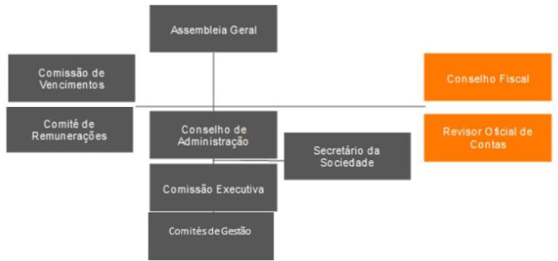  

# Assembleia Geral  

A Assembleia Geral é constituída pelos acionistas com direito de voto. Reúne ordinariamente, uma vez por ano, ou sempre que requerida, nos termos legais e estatutários, a sua convocação. A mesa da Assembleia Geral da Lusitania Vida é composta, desde 22 de setembro de 2023, por um Presidente e um Secretário.  

# Conselho de Administração  

O Conselho de Administração é atualmente composto por sete administradores, sendo um Presidente (não executivo) e seis Vogais. O Conselho de Administração gere os negócios da Sociedade com os mais amplos poderes, tendo delegado na Comissão Executiva a gestão corrente da Sociedade.  

# Comissão Executiva  

A Comissão Executiva é composta, atualmente, por seis administradores, sendo um Presidente e cinco Vogais.  

# Conselho Fiscal e Revisor Ofcial de Contas  

A fscalização da Sociedade compete a um Conselho Fiscal composto por três membros efetivos e um suplente e a um Revisor Ofcial de Contas, eleitos quadrienalmente, sendo reelegíveis  

# Comissão de Vencimentos  

As remunerações dos membros dos Órgãos Sociais são fxadas pela Comissão de Vencimentos, sendo esta composta por três membros, eleitos pela Assembleia Geral, para mandatos de quatro anos.  

# Comité de Remunerações  

O Comité de Remunerações é composto por três a cinco membros, eleitos pela Assembleia Geral, para mandatos de quatro anos, de entre os membros do órgão de administração que não desempenhem funções executivas, os membros do órgão de fscalização, e, ou, peritos externos, devendo ser composto por uma maioria de membros independentes.  

Este Comité tem as competências previstas a nível regulamentar, nas quais se incluem, designadamente, prestar informação e apoio ao órgão de administração na defnição da Política de Remuneração, preparar decisões e recomendações nesta matéria e rever anualmente a Política de Remuneração, a sua implementação e funcionamento.  

# Comités de Gestão  

Os Comités de Gestão, cuja criação e determinação da composição é competência do Órgão de Administração, agrupam várias competências e têm como objetivo apoiar o Órgão de Administração com análises aprofundadas, sugestões de deliberação e orientações de ação sobre assuntos que são transversais a várias áreas da Companhia, encontrando as soluções mais adequadas e promovendo o alinhamento de perspetivas e uma maior articulação das decisões de gestão.  

# B.1.2 - Remuneração e Benefícios aos Trabalhadores  

A Lusitania Vida utiliza uma tabela de remunerações própria, elaborada com base na tabela salarial do Acordo Coletivo de Trabalho, bem como os demais benefícios nele contemplados, designadamente, seguros de Saúde, seguros de Vida e Plano Individual de Reforma para todos os trabalhadores.  

Anualmente, pode existir a distribuição de uma participação nos resultados aos trabalhadores atendendo à análise de desempenho anual e assiduidade.  

Para os Diretores de Topo e responsáveis que desempenham Funções-Chave existe uma política de remuneração própria, aprovada pelo Conselho de Administração.  

A Lusitania Vida dispõe ainda de uma política de remuneração para os membros do Conselho de Administração, do Conselho Fiscal e do Revisor Ofcial de Contas, aprovada pela Assembleia Geral.  

Os Diretores de Topo, os responsáveis pelas Funções-Chave e restantes trabalhadores encontram-se abrangidos pelo Plano Individual de Reforma estabelecido no Acordo Coletivo de Trabalho.  

A 26 de abril de 2022, foi publicada a Norma Regulamentar n.º 4/2022-R em matéria de Sistema de Governação das Empresas de Seguros e Resseguros e que, por via do seu artigo 120.º, revogou parcialmente a Norma Regulamentar n.º  

5/2010-R, de 1 de abril e a Circular n.º 6/2010, de 1 de abril, no que respeita à atividade seguradora e resseguradora.  

A sobredita Norma Regulamentar introduziu, entre outras aspetos, um conjunto de novos requisitos em matéria de remuneração, a cumprir pelas empresas de seguros e de resseguros, tornando premente a necessidade de revisão e consequente aprovação de uma nova Política de Remuneração dos Órgãos Sociais que vá ao encontro das regras estabelecidas pela Autoridade de Supervisão de Seguros e Fundos de Pensões  

Realizou-se, em sede de Assembleia Geral Extraordinária, a 22 de setembro de 2023, a aprovação da revisão da Política de Remuneração do Conselho de Administração, do Conselho Fiscal e do Revisor Ofcial de Contas, tendo em vista o alinhamento da prática remuneratória da Companhia com o enquadramento regulamentar aplicável.  

As políticas de remuneração atrás referidas encontram-se publicadas no sítio da Companhia em www.lusitaniavida.pt.  

# B.1.3 – Transações Relevantes  

Não se verifcaram quaisquer transações materiais com membros dos órgãos sociais ou das direções da Lusitania Vida.  

# B.2 – REQUISITOS DE QUALIFICAÇÃO E IDONEIDADE  

A Lusitania Vida assegura, em todas as atividades que exerce, elevados níveis de competência técnica, garantindo uma organização empresarial com os meios humanos e materiais adequados a assegurar condições apropriadas de qualidade e efciência.  

Neste âmbito, os membros do Conselho de Administração e do Conselho Fiscal da Companhia e, ainda, o Revisor Ofcial de Contas procedem, tanto a nível interno, como a nível externo, com clientes e outras empresas de seguros ou de resseguros, instituições e sociedades fnanceiras, com diligência, neutralidade, lealdade, discrição e respeito consciencioso dos interesses que lhes estão confados, com a diligência de um gestor criterioso e ordenado, tendo em conta, por um lado, a salvaguarda do sistema fnanceiro e, por outro lado, o interesse dos tomadores do seguro, dos segurados e dos benefciários. Com este intuito, a Companhia recentemente aprovou a política de seleção e avaliação da adequação dos membros do Conselho de Administração, do Conselho Fiscal e do Revisor Ofcial de Contas, o procedimento específco de seleção e avaliação da adequação do Revisor Ofcial de Contas e, bem assim, os requisitos de adequação e idoneidade exigidos aos Colaboradores.  

Os membros do Conselho de Administração e do Conselho Fiscal da Companhia cumprem os requisitos de idoneidade, qualifcação profssional, independência e disponibilidade, plenamente observando o preceituado na política supra referida.  

O Revisor Ofcial de Contas, nos termos do sobredito normativo, além de cumprir com os requisitos de qualifcação e idoneidade previstos elencados, com as adaptações necessárias, dispõe de meios humanos, materiais e fnanceiros adequados ao desempenho das suas funções, bem como do cumprimento de requisitos específcos de independência previstos nas leis próprias aplicáveis à sua atividade.  

# B.3 – SISTEMA DE GESTÃO DE RISCOS COM INCLUSÃO DA AUTOAVALIAÇÃO DO RISCO E DA SOLVÊNCIA  

# B.3.1 – Estrutura de Gestão de Riscos  

A estrutura de governação dos Sistemas de Gestão de Riscos e de Controlo Interno encontra-se suportada no modelo das três linhas de defesa, permitindo, deste modo, uma gestão transversal e estratégica do risco e a construção de um adequado ambiente de controlo interno.  

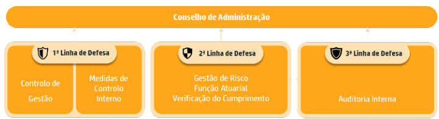  

A primeira linha de defesa, face aos riscos inerentes ao negócio, é constituída pela ação desenvolvida por todas as áreas de negócio ou de suporte da Companhia, sendo responsáveis pela gestão diária dos riscos. Este processo envolve a identifcação, a avaliação e o reporte de exposição ao risco, tendo em consideração as políticas de gestão dos riscos.  

A segunda linha de defesa inclui a função de Gestão de Risco, que complementa as atividades de gestão de riscos, da primeira linha de defesa, através da monitorização e do reporte das respetivas responsabilidades. Por outro lado, é responsável pela monitorização das atividades da Companhia que possam resultar numa tomada de risco, avaliando os mesmos de forma independente da área de negócio.  

A função de Verifcação do Cumprimento encontrase, igualmente, incorporada na segunda linha de defesa, devendo monitorizar, de forma contínua, o cumprimento de legislação, regulamentação, regras internas e políticas da Companhia.  

Também inserida na segunda linha de defesa se encontra a função atuarial que coordena e assegura a adequação das metodologias e pressupostos utilizados no cálculo das provisões técnicas e monitoriza a gestão efcaz do risco de cumprimento por parte da Companhia, contribuindo para a aplicação efetiva do Sistema de Gestão de Riscos.  

A terceira linha de defesa consiste na função de Auditoria Interna, responsável, entre outros aspetos, pela avaliação, independente e objetiva, da qualidade e efciência da estrutura de governação dos Sistemas de Gestão de Riscos e de Controlo Interno.  

Adicionalmente, a estrutura de governação determina a importância dos Responsáveis de primeira linha na identifcação e análise crítica dos riscos. Em complemento desta atividade, seguindo os princípios da descentralização, as Funções–chave são responsáveis pelo bom funcionamento dos Sistemas.  

Para uma maior articulação entre as diferentes áreas foram implementados os Comités de Gestão da Companhia que, conforme referido, agrupam várias competências e têm como objetivo apoiar o Órgão de Administração com análises aprofundadas, sugestões de deliberação e orientações de ação, sobre assuntos transversais a várias áreas da Companhia, encontrando as soluções mais adequadas e promovendo o alinhamento de perspetivas e uma maior articulação das decisões de gestão.  

A criação de Comités é da competência do Órgão de Administração e a sua composição é constituída pelos primeiros responsáveis dos Órgãos identifcados. Em matérias específcas podem, ainda, participar por convite, outros Órgãos da Companhia. A presença dos elementos do Órgão de Administração é decidida pelos próprios, em função das agendas previamente defnidas em cada um dos Comités existentes.  

As atas de cada Comité devem ser presentes ao Órgão de Administração.  

Quando o Órgão de Administração assim o decidir, os Órgãos de Estrutura deverão incorporar nos seus planos de atividade e na sua gestão corrente, as decisões que resultarem das propostas dos Comités, depois de aprovadas pela Órgão de Administração.  

Os Comités deverão, igualmente, fazer uma avaliação da sua atividade, pelo menos uma vez por ano.  

De salientar que a presença das Funções-Chave em cada Comité assumirá um cariz preventivo ou interventivo, consoante os temas que estejam a ser objeto de análise naquela reunião.  

# B.3.2 – Articulação com a Autoavaliação do Risco e da Solvência (ORSA)  

Anualmente a Companhia efetua a autoavaliação do risco e da solvência (ORSA), onde são avaliados todos os riscos inerentes ao seu negócio e ao plano estratégico, sendo determinadas as suas necessidades de capital para um período de cinco anos.  

O exercício do ORSA abrange, como componente fundamental, a quantifcação de risco e capital no horizonte temporal do plano de negócios, de forma a avaliar a solvabilidade futura da Companhia e determinar a viabilidade da sua estratégia de risco e negócio refetida no Orçamento. Este processo inclui a avaliação dos níveis de apetite ao risco e tolerância.  

A integração do ORSA no processo de gestão de risco permite uma visão abrangente dos riscos, sendo também prospetiva no que diz respeito à sua natureza, mensurando os riscos conforme as suas especifcidades, complementando o quadro de gestão do risco com a noção de perfl de risco e transpondo esta articulação em necessidades globais de solvência. A monitorização dos resultados do ORSA é feita através de reportes trimestrais de solvência.  

No âmbito da realização do exercício do ORSA, são desenvolvidas análises de sensibilidade (stress tests) que têm como objetivo determinar os tipos de eventos que podem levar à alteração, ou mesmo inviabilidade, do seu plano de negócios. Este processo visa não só relevar as vulnerabilidades existentes nos planos de gestão de risco, capital e estratégia operacional, como também melhorar os planos de contingência já existentes. Os cenários são selecionados tendo por base os principais riscos aos quais a Companhia se encontra exposta.  

O Conselho de Administração procede à análise das conclusões relativas a este exercício e garante a implementação e o acompanhamento da gestão dos respetivos planos de ação.  

Os resultados e conclusões do ORSA são expressos num relatório que é aprovado pelo Conselho de  

# B.4 – SISTEMA DE CONTROLO INTERNO  

A Companhia tem implementado um Sistema de Controlo Interno (SCI) desenhado para identifcar e mitigar os riscos potenciais de falhas no desenvolvimento dos objetivos estratégicos, de incumprimento dos objetivos de negócio defnidos, bem como para garantir um desempenho sustentado.  

Adicionalmente, este sistema contribui para reforçar a confança nos procedimentos operacionais, de modo a permitir a deteção tempestiva de falhas ou fragilidades nos processos e estruturas operativas.  

A solidez do Sistema de Controlo Interno é assegurada por todos os colaboradores da Companhia, que contribuem, em conjunto e através das suas ações, para se obter uma garantia razoável que os objetivos defnidos são atingidos.  

A estrutura de governação deste sistema encontrase suportada no Modelo das Três Linhas de defesa, conforme Framework defnido pelo T e Institute of Internal Au itors. Este modelo tem como fnalidade possibilitar a identifcação das estruturas e dos processos que potenciam o cumprimento dos respetivos objetivos, bem como uma gestão transversal do risco e a construção de um adequado ambiente de controlo interno. Para que o modelo se torne efciente e efetivo, as três linhas têm de estar coordenadas, nomeadamente através da divisão clara das diferentes funções na gestão do risco.  

As áreas de Primeira Linha têm como principais responsabilidades a criação e disponibilização de produtos e serviços aos clientes e incluem as funções de suporte da Companhia. As áreas de Segunda Linha, contribuem para a existência de processos transversais de gestão do risco.  

Por último, a estrutura de Terceira Linha, relacionada com a Função de Auditoria Interna, independente e com livre acesso a pessoas, recursos e informação necessários ao cumprimento dos respetivos objetivos.  

De forma transversal, devem ser defnidos processos claros e transparentes de partilha de informação e de alinhamento de objetivos e atividades entre todos os stake ol ers, através de mecanismos adequados de comunicação, cooperação e colaboração, promovendo, desta forma, a fabilidade, coerência e transparência das informações necessárias para que haja uma tomada de decisões baseada no risco.  

O Sistema de Controlo Interno é um processo dinâmico e interativo, composto por atividades e tarefas contínuas, efetuado por toda a Companhia e adaptado à respetiva estrutura e dimensão, de acompanhamento, revisão e monitorização do controlo dos riscos a que a empresa se encontra exposta.  

O Conselho de Administração avalia os resultados do modelo de controlo interno, através das informações das unidades de gestão de risco, função atuarial, compliance e auditoria interna. Para além destas Funções-Chave, o Órgão de Administração da Lusitania Vida suporta a sua tomada de decisão nos elementos debatidos nas reuniões com os diferentes Comités.  

Encontram-se defnidas responsabilidades específcas e transversais para determinadas unidades da estrutura que, em conjunto e em articulação com as restantes estruturas, desenvolvem atividades no sentido de garantir um adequado Sistema de Controlo Interno. Este sistema baseia-se, também, na atuação das Funções de Gestão de Risco, Atuarial, Verifcação do Cumprimento e Auditoria Interna, em relação às quais estão defnidas as suas missões, objetivos e principais responsabilidades neste âmbito.  

As Funções-Chave de Gestão de Riscos, Atuarial e de Verifcação do Cumprimento compõem a segunda linha de defesa da Companhia e têm como objetivo auxiliar a Companhia através da orientação e avaliação do Sistema de Controlo Interno relacionado com as suas áreas de especialidade, mantendo a Companhia informada sobre alterações relevantes que ocorram ao longo do tempo.  

Não obstante cada Função-Chave ter as respetivas atividades e objetivos claramente defnidos e formalizados através de políticas específcas, as suas ações são coordenadas e integradas conforme adequado, de forma a acrescentar o maior valor possível às operações da Companhia.  

A área de Gestão de Riscos é responsável por identifcar os riscos conhecidos e os emergentes, bem como por auxiliar as diferentes áreas da Companhia no desenvolvimento de processos adequados para a gestão dos riscos relevantes, comunicando e dando formações sobre o processo de identifcação e gestão de riscos.  

# B.4.1 – Função de Verifcação do Cumprimento  

Sem prejuízo de outras atribuições que lhe são legalmente acometidas ou defnidas por meio de normativos internos, a Função de Verifcação do Cumprimento é responsável por assessorar o Órgão de Administração relativamente ao cumprimento das disposições legais, regulamentares e administrativas aplicáveis, por avaliar o impacto de eventuais alterações do enquadramento legal na atividade da Companhia, e por identifcar e avaliar o risco de incumprimento.  

A Função é, ainda, responsável por reportar de imediato ao Órgão de Administração quaisquer indícios de violação de obrigações legais e regulamentares, de regras de conduta e de relacionamento com clientes e partes relacionadas ou de outros deveres que possam fazer incorrer a Companhia ou os seus colaboradores num ilícito de natureza criminal ou contraordenacional, devendo manter um registo dos incumprimentos e das medidas propostas e adotadas para os suprir  

# B.5 – FUNÇÃO DE AUDITORIA INTERNA  

Auditoria Interna tem como responsabilidade fornecer ao Órgão de Administração uma avaliação independente sobre a qualidade e a efcácia do Sistema de Governação da Companhia, bem como dos Sistemas de Gestão de Risco e de Controlo Interno.  

Assim, a Função de Auditoria Interna realiza atividades de avaliação sobre os processos da Companhia, sem qualquer limitação de âmbito, produzindo recomendações para uma melhoria da respetiva efcácia e efciência, tendo como objetivo principal analisar e avaliar a efcácia integrada da governação dos processos, das políticas defnidas, dos procedimentos estabelecidos e dos respetivos sistemas de suporte. Estas atividades incluem:  

Estabelecer, implementar e manter um plano de auditoria baseado no risco. Uma abordagem baseada no risco é mais efcaz comparativamente a outras abordagens, (e.g., abordagem baseada no compliance), uma vez que permite avaliar se os controlos implementados são efcazes na gestão dos riscos assumidos pelo Conselho de Administração aquando da defnição da estratégica da Companhia;  

Monitorizar que os riscos identifcados são geridos adequadamente no âmbito do Sistema de Controlo Interno defnido, avaliando o respetivo desenho e efcácia operacional;  

Monitorizar e avaliar a adequabilidade e a efcácia das políticas e dos processos de negócio, respetiva documentação de suporte e controlos associados, de forma transversal a toda a Companhia;  

Rever o nível de compliance de cada colaborador, áreas de negócio ou prestador externo, com leis, regulamentações e orientações do supervisor, bem como políticas estabelecidas, processos e controlos defnidos;  

Avaliar a integridade, confabilidade e a abrangência da informação contabilística, fnanceira, operacional e de risco, assim como a capacidade dos sistemas de informação de suporte para produzir, tratar e divulgar esses dados de forma atempada e correta;  

Avaliar a gestão dos ativos da Companhia e, nos casos aplicáveis, dos ativos de Tomadores de  

Seguros, bem como dos meios utilizados para prevenir a fraude e o uso inapropriado desses ativos;  

Monitorizar a efcácia e acompanhar a atividade das funções de controlo da Companhia, nomeadamente as restantes Funções-Chave e a Auditoria Externa.  

Adicionalmente, a Função de Auditoria Interna poderá realizar ações de consultoria em questões relacionadas com governação, gestão de riscos e de controlos, assegurando-se da inexistência de confitos de interesse relacionados com a Independência e Objetividade da Função.  

# B.6 – FUNÇÃO ATUARIAL  

A Função Atuarial tem como competência contribuir para a aplicação efetiva do sistema de gestão de riscos, relativamente à avaliação das provisões técnicas, seus pressupostos, metodologias, adequação e qualidade de dados, entre outros e emitir parecer sobre a política de subscrição e adequação dos tratados de resseguro.  

# B.7 – SUBCONTRATAÇÃO  

Para efeitos de subcontratação de funções, a Lusitania Vida dispõe de uma política de subcontratação que defne, entre outros, os procedimentos de escolha do prestador de serviços, além de estabelecer a forma como o contrato de prestação de serviços deve ser reduzido a escrito e como é efetuada a avaliação do desempenho do prestador.  

No fnal do ano 2022 foram encetadas negociações, tendo em vista a desmaterialização do arquivo histórico e arquivo corrente em papel da Lusitania Vida. Fruto da avaliação interna promovida, o processo de negociação culminou com a comunicação à ASF, em janeiro de 2023, nos termos o n.º 3 do artigo 78.º do RJASR, da subcontratação de funções ou atividades operacionais fundamentais ou importantes àquele prestador. Com efeito, a prestação deste serviço comporta a execução de tarefas de digitalização e indexação e arquivo digital em plataforma que permite a consulta e pesquisa dos documentos desmaterializados, atividades essas passíveis de enquadramento no conceito de data storage.  

# B.8 – ADEQUAÇÃO DO SISTEMA DE GOVERNAÇÃO  

A Lusitania Vida apresenta um Sistema de Governação e de Gestão de Riscos que visa a gestão sã e prudente da sua atividade, assegurando a continuidade e o cumprimento dos objetivos estratégicos, tendo em conta a reduzida dimensão da Companhia. A avaliação global dos riscos assumidos pela Lusitania Vida e a estrutura de Governação existente, permitem concluir que a Companhia cumpre e tem a capacidade para cumprir, com todos os requisitos do regime Solvência II de forma efetiva e continuada tendo também em consideração a dimensão e complexidade do negócio gerido.  

A adequação do Sistema de Governação da Lusitania Vida é alvo de uma revisão regular, envolvendo a Administração. A revisão é efetuada no mínimo de 4 em 4 anos e sempre que necessário, sendo esta mais frequente quando se verifcam circunstâncias excecionais que o justifquem como, por exemplo, alterações organizacionais. Adicionalmente, são revistas, no mínimo anualmente, as políticas que integram o Sistema de Governação.  

# PERFIL DE RISCO  

Ao longo do ano de 2023, o rácio de solvência manteve uma tendência crescente, pese embora a redução do mesmo em 31 de dezembro de 2023, em virtude da aprovação de distribuição de dividendos no ano de 2024 relativos a 2023, no montante de €10.000 milhares, tendo-se o rácio atingido no fnal do ano $148,7\%$ .  

No que respeita o perfl de risco, a 31 de dezembro de 2023 a Lusitania Vida apresenta a distribuição seguinte:  

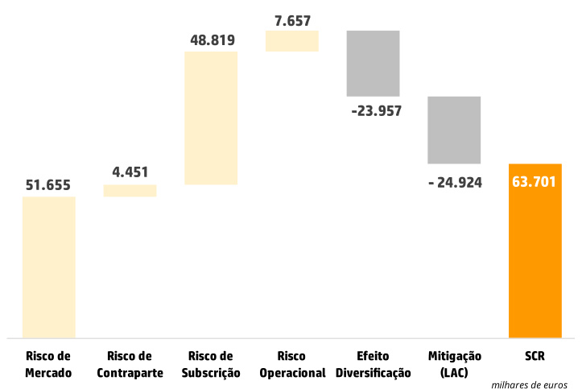  

# C.1 – RISCOS ESPECÍFICOS DE SEGUROS  

Os riscos específcos de seguros são os inerentes à atividade de seguros capazes de gerar perda de valor nos fundos próprios, devido a pressupostos desajustados da realidade ou eventos extraordinários.  

Os riscos específcos de seguros de vida são a mortalidade, longevidade, morbilidade ou invalidez, despesas, resgates ou anulações e catastrófco.  

As medidas de mitigação dos riscos são usadas para reduzir a volatilidade dos resultados e diminuir o requisito de capital. A adequação de preços praticados, subscrição, resseguro, gestão de sinistros e diversifcação, são as principais ações com vista à mitigação dos riscos específcos de seguros.  

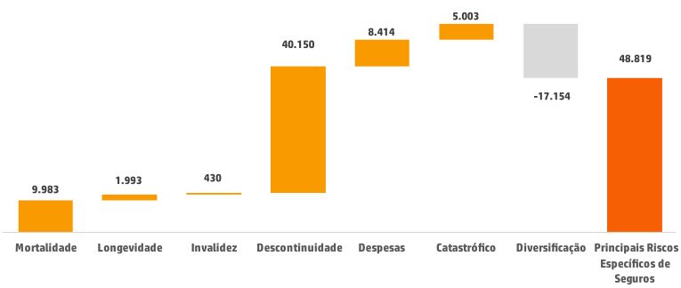  

Valor dos Principais Riscos Específcos de Seguros em 31 de dezembro de 2023: €48.819 milhares, após efeito de diversifcação dos mesmos (2022: €54.146 milhares).  

# C.1.1 – Risco de Mortalidade  

O risco de mortalidade está associado às obrigações de seguro onde um pagamento ou pagamentos são feitos em caso de morte da pessoa segura durante a vigência do contrato. O requisito de capital deste risco é calculado pela variação negativa dos fundos próprios resultantes de um aumento permanente das taxas de mortalidade em $15\%$ , para toda a carteira de seguros.  

Valor do risco de mortalidade em 31 de dezembro de 2023: €9.983 milhares (2022: €10.502 milhares).  

# C.1.2 – Risco de Longevidade  

O risco de longevidade está associado a obrigações de seguro quando os pagamentos são efetuados durante a vida do titular da apólice e onde uma diminuição das taxas de mortalidade resulta em provisões técnicas mais elevadas. O requisito de capital necessário é calculado pela variação negativa dos fundos próprios resultante de uma diminuição permanente das taxas de mortalidade em $20\%$ , cenário que é aplicado a toda a carteira sujeita ao risco de longevidade, como o caso das rendas vitalícias.  

Valor do risco de longevidade em 31 de dezembro de 2023: €1.993 milhares (2022: €1.781 milhares).  

# C.1.3 – Risco de InvalidezMorbilidade  

O risco de invalidez-morbilidade está associado a todos os tipos de seguros que reembolsam em caso de perdas causadas por mudanças nas taxas de morbilidade ou incapacidade. O cenário consiste num aumento de $35\%$ nas taxas de incapacidade durante o próximo ano e $25\%$ nos anos subsequentes, bem como uma descida nas taxas de recuperabilidade dos mesmos.  

Valor do risco de invalidez-morbilidade em 31 de dezembro de 2023: €430 milhares (2022: €504 milhares).  

# C.1.4 – Risco de Despesas  

O valor deste risco é apurado pelo efeito negativo nos fundos próprios resultante de um aumento permanente dos custos utilizados para determinar a melhor estimativa e que correspondem aos custos reais do exercício. O choque consiste num aumento dos custos em $10\%$ , projetado no primeiro ano, em simultâneo com um aumento na infação de 1 ponto percentual por ano.  

Valor do risco de despesas em 31 de dezembro de 2023: €8.414 milhares (2022: €5.863 milhares).  

# C.1.5 – Risco de Descontinuidade  

Corresponde ao risco de perdas devido a uma alteração imprevista, positiva ou negativa, das taxas de anulação de apólices, liberação do pagamento dos prémios ou de resgates antecipados. O requisito de capital corresponde ao pior resultado dos seguintes cenários:  

Aumento permanente das taxas de resgate e anulações em $50\%$ ;   
Diminuição permanente das taxas de resgate e anulações em $50\%$ ; ou   
Ocorrência de resgates em massa (saída de $70\%$ das apólices de seguro de grupo e $40\%$ das restantes).  

A ocorrência de resgates em massa é aplicada às modalidades de seguros da Companhia. O valor do risco de descontinuidade em 31 de dezembro de 2023: €40.150 milhares (2022: €47.390 milhares).  

# C.1.6 – Risco Catastrófco de Vida  

O risco catastrófco decorre de eventos extremos que não são capturados nos restantes riscos específcos de seguro, como por exemplo as pandemias. A exigência de capital para este risco é calculada através de um aumento instantâneo de $1,5\%0$ nas taxas de mortalidade consideradas na melhor estimativa, sempre que o impacto gere um aumento dessa melhor estimativa.  

Valor do risco catastrófco em 31 de dezembro de 2023: €5.003 milhares (2022: €5.000 milhares).  

# C.2 – RISCO DE MERCADO  

O risco de mercado corresponde às perdas potenciais devido a movimentos adversos em variáveis do mercado fnanceiro. A exposição ao risco de mercado é medida pelo impacto das alterações das variáveis fnanceiras tais como preços de ações, ratings, taxa de juro e valor de imóveis, sendo agrupados nas seguintes categorias:  

Risco de Taxa de Juro;   
Risco Acionista;   
Risco Imobiliário;   
Risco Cambial;   
Risco de Sprea ; e Risco de Concentração.  

O principal risco de mercado da Lusitania Vida, é o risco de sprea .  

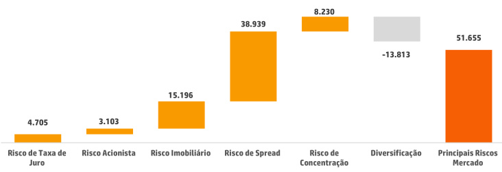  

Valor do risco de mercado em 31 de dezembro de 2023: €51.655 milhares, após o efeito de diversifcação (2022: €52.627 milhares).  

# C.2.1 – Risco de Taxa de Juro  

O risco de taxa de juro é o risco do valor dos ativos e passivos ou instrumentos fnanceiros perderem valor, devido a futuações nas taxas de juro.  

O capital requerido para o risco de taxa de juro é determinado pelo cálculo do impacto nos fundos próprios devido a alterações na curva das taxas de juro, simultaneamente nos ativos e nos passivos. O risco de taxa de juro é a perda máxima entre o choque ascendente e o choque descendente da curva de taxa de juro, de acordo com a metodologia defnida pela EIOPA.  

Valor do risco de taxa de juro em 31 de dezembro de 2023: €4.705 milhares (2022: €13.503 milhares).  

# C.2.2 – Risco Acionista  

O risco de ações avalia a exposição a este tipo de ativos e a fundos de investimentos em ações, sendo o capital requerido determinado pelo impacto sobre o capital disponível, devido a uma queda imediata dos preços das ações.  

As ações cotadas em mercados regulamentados de países do EEE ou da OCDE sofrem um choque de $39\%$ , juntamente com o ajustamento simétrico.  

As ações de países que não são membros do EEE ou da OCDE, ações não cotadas, investimentos alternativos ou fundos de investimento nos quais o princípio da transparência não é aplicável, têm um choque de $49\%$ , juntamente com o ajustamento simétrico.  

Quanto às participações estratégicas, o choque aplicado é de $22\%$ .  

Valor do risco acionista em 31 de dezembro de 2023: €3.103 milhares (2022: €1.562 milhares).  

# C.2.3 – Risco Imobiliário  

O risco imobiliário avalia a exposição total ao imobiliário, sendo o capital requerido para este risco determinado por uma queda imediata de $25\%$ no valor dos imóveis ou em fundos imobiliários.  

Valor do risco imobiliário em 31 de dezembro de 2023: €15.196 milhares (2022: €13.640 milhares).  

# C.2.4 – Risco Cambial  

A Lusitania Vida não está exposta a este risco, uma vez que tem apenas contratos e investimentos em euros.  

# C.2.5 – Risco de Spread  

O risco de sprea  decorre da sensibilidade do valor dos ativos e passivos às variações nos sprea s de crédito, sendo o capital necessário determinado pelo cálculo do impacto nos fundos próprios.  

O capital necessário para o risco de sprea corresponde à totalidade dos requisitos de capital das obrigações, produtos estruturados e derivados de crédito e depende do valor de mercado, da duração modifcada e da qualidade creditícia do ativo ou rating.  

O risco de sprea  é um dos maiores riscos da Lusitania Vida, considerando que a maioria dos ativos em carteira estão sujeitos a este risco, apesar de uma parte signifcativa destes estar investida em títulos de dívida pública que, para efeito deste risco, não têm qualquer carga de capital.  

Valor do risco de sprea  em 31 de dezembro de 2023: €38.939 milhares (2022: €42.014 milhares).  

# C.2.6 – Risco de Concentração  

O risco de concentração corresponde à acumulação de exposições a uma mesma contraparte.  

A Lusitania Vida monitoriza o risco de concentração numa base trimestral e gere a carteira de ativos de forma diversifcada, a fm de evitar concentrações num único devedor e, em especial, em contrapartes de baixo rating. Releva-se também a necessidade de monitorização dos investimentos no próprio grupo económico em que a Lusitania Vida tem vindo a reduzir a sua exposição, de modo a diminuir o risco.  

Valor do risco de concentração em 31 de dezembro de 2023: €8.230 milhares (2022: €10.604 milhares).  

# C.3 – RISCO DE CRÉDITO (CONTRAPARTE)  

O risco de incumprimento da contraparte refete as perdas ou deterioração inesperada da posição de crédito das entidades relacionadas com a Companhia, podendo afetar vários tipos de ativos:  

Resseguro; Contas a receber; e Caixa e depósitos à ordem.  

Por defnição, os ativos que constam dos riscos de mercado, não constarão do risco de crédito da contraparte e vice-versa.  

O regime Solvência II estabelece uma distinção entre dois grupos de posições em risco:  

Tipo 1: as contrapartes que têm uma notação de rating, nomeadamente resseguradores, derivados, saldos em conta corrente, depósitos em cedentes, garantias emitidas e depósitos à ordem; e   
Tipo 2: as restantes como, por exemplo, contas a receber de intermediários e tomadores de seguro.  

O requisito total de capital é apurado pela soma da exposição de tipo 1 e a exposição de tipo 2, tomando uma correlação de $75\%$ .  

A mitigação deste risco é feita através da escolha de resseguradores com ratings elevados e com dispersão da exposição por mais de uma contraparte. No caso dos depósitos à ordem, a seleção da entidade depositária é feita com critério semelhante.  

Valor do risco de crédito da contraparte em 31 de dezembro de 2023: €4.451 milhares (2022: €1.531 milhares).  

# C.4 – RISCO DE LIQUIDEZ  

O risco de liquidez é meticulosamente avaliado pela capacidade da Lusitania Vida de converter ativos em disponibilidades e liquidar passivos nas datas de vencimento, minimizando as perdas potenciais. Embora o risco de liquidez não seja diretamente considerado no cálculo do requisito de capital de solvência, ele é intrínseco à gestão prudencial dos riscos da Companhia.  

A Lusitania Vida reconhece que uma proporção signifcativa dos seus produtos permite resgates antecipados, infuenciados primariamente pelas variações nas taxas de juro de mercado. Para mitigar o impacto dessas variações, a Companhia implementa uma estratégia de gestão fnanceira que se baseia na adequação de  urations entre ativos e passivos técnicos, visando a imunização contra o risco de taxa de juro.  

Além disso, a Companhia emprega uma projeção da sua melhor estimativa dos fuxos de caixa resultantes dos ativos afetos e dos passivos técnicos. Esta projeção é desenhada para alinhar-se com os princípios de Solvência II, garantindo que a liquidez seja mantida em níveis ótimos para suportar as obrigações da Companhia, mesmo em cenários de stress fnanceiro.  

# C.5 – RISCO OPERACIONAL  

O risco operacional avalia o impacto de perdas causadas por fracos ou defcientes procedimentos internos, falhas na ação do pessoal e nos sistemas, eventos externos e fraude interna ou externa, sendo calculado através da fórmula padrão da EIOPA. Este risco é atualmente avaliado pelo volume de prémios processados nos últimos 12 meses face ao volume de prémios processados nos 12 meses anteriores, isto, com o intuito de, não só de medir a dimensão da produção anual como também o seu crescimento face ao ano anterior.  

Valor do risco operacional em 31 de dezembro de 2023: €7.657 milhares (2022: €7.548 milhares).  

# C.6 – OUTROS RISCOS MATERIAIS  

Como parte do processo ORSA, o perfl de risco global da Lusitania Vida é avaliado face à posição real de solvência e não apenas em relação aos riscos incorporados na fórmula padrão. Os riscos que a Lusitania Vida reconhece como potencialmente materiais são os seguintes:  

Risco cibernético;   
Risco de reputação;   
Risco de concentração, que não seja de mercado;   
Risco estratégico; e   
Risco de sustentabilidade.  

# C.7 – EVENTUAIS INFORMAÇÕES ADICIONAIS  

A Companhia não tem exposição a posições extrapatrimoniais e não transfere parte dos riscos para outras entidades com objetos específcos.  

# C.7.1 – Formas de Mitigação dos Riscos  

Quando necessário ou apropriado, a Companhia subscreve contratos de resseguro para limitar a sua exposição a perdas relacionadas com o desenvolvimento do seu negócio. Estes contratos podem assumir a forma de facultativos (por apólice/risco) ou respeitar a carteira de seguros por linha de negócio da Companhia como um todo (por evento). Esta última modalidade está associada sobretudo com riscos do tipo catastrófco, sejam eles de origem natural ou humana, em que pode existir uma acumulação agregada de risco que a Companhia pode não conseguir suportar. Atualmente, a Companhia considera que a exposição aos maiores riscos está devidamente assegurada pela proteção dos respetivos tratados de resseguro, a cargo de um conjunto de resseguradores líderes de mercado.  

# C.7.2 – Análise de Sensibilidade  

No decorrer da realização do exercício da autoavaliação do risco e da solvência, foram determinados os montantes de fundos próprios, requisitos de capital de solvência e rácios de solvência para os próximos cinco anos, de acordo com o plano de negócios - designado como cenário base. Posteriormente, foram realizados três testes de sensibilidade - cenários de “stress” - decorrentes da análise de alguns dos principais riscos a que, atualmente, a Companhia se encontra exposta. Esta avaliação foi feita tendo como ponto de partida o fnal do ano de 2023, bem como um conjunto de pressupostos que foi defnido em função do contexto da altura.  

No quadro seguinte é apresentado, para o fnal de 2024, o impacto dos seguintes cenários de “stress”:  

# MEDIDAS DEMITIGACAO DE RISCO  

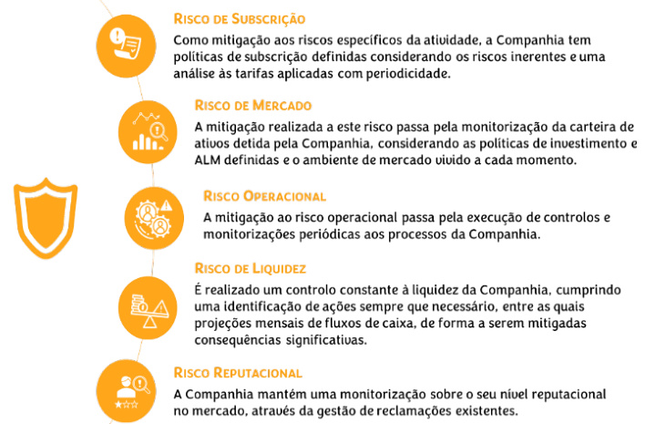  

Subida das taxas de juros - Este cenário consiste numa deslocação paralela de 1 p.p. na estrutura de taxa de juro sem risco;  

Quebra de produção e aumento de despesas - Este cenário consiste numa diminuição do volume de vendas de prémios dos produtos mais rentáveis, e produtos risco temporários, em $40\%$ da produção atual. Adicionalmente, considera-se um aumento das despesas de administração em $3\%$ .  

<html><body><table><tr><td></td><td>Cenario "Haircut" DividaPublica</td><td>Cenario subidadetaxa juro</td><td>Cenario quebra de producaoe aumentode despesas</td></tr><tr><td>FundosProprios</td><td>-34,1%</td><td>-15,6%</td><td>-20,9%</td></tr><tr><td>RCS</td><td>-1,0%</td><td>-2,4%</td><td>-3,8%</td></tr><tr><td>Racio desolvencia</td><td>-26,80%</td><td>4,30%</td><td>-2,30%</td></tr></table></body></html>  

# C.7.3 – Análise comparativa  

Analisando a evolução do requisito de capital dos riscos de subscrição, face ao ano anterior, registouse uma diminuição deste, essencialmente derivado do decréscimo do risco de descontinuidade.  

milhares de euros   

<html><body><table><tr><td>Requisito de Capital</td><td>2023</td><td>2022</td></tr><tr><td>TotalRiscodeSubscricao</td><td>48.819</td><td>54.146</td></tr><tr><td>RiscodeMortalidade</td><td>9.983</td><td>10.502</td></tr><tr><td>RiscodeLongevidade</td><td>1.993</td><td>1.781</td></tr><tr><td>RiscodeInvalidez</td><td>430</td><td>504</td></tr><tr><td>RiscodeDescontinuidade</td><td>40.150</td><td>47.390</td></tr><tr><td>RiscodeDespesas</td><td>8.414</td><td>5.863</td></tr><tr><td>RiscoCatastrofico</td><td>5.003</td><td>5.000</td></tr><tr><td>EfeitodeDiversificacao</td><td>(17.154)</td><td>(16.893)</td></tr></table></body></html>  

Relativamente aos riscos de mercado, foi registada uma ligeira redução deste, derivado principalmente da descida dos riscos de sprea  e taxa de juro.  

mithares de euros   

<html><body><table><tr><td>RequisitodeCapital</td><td>2023</td><td>2022</td></tr><tr><td>TotalRiscodeMercado</td><td>51.655</td><td>52.627</td></tr><tr><td>RiscodeTaxadeJuro</td><td>4.705</td><td>13.503</td></tr><tr><td>Risco Acionista</td><td>3.103</td><td>1.562</td></tr><tr><td>Riscolmobiliario</td><td>15.196</td><td>13.640</td></tr><tr><td>Risco deSpread</td><td>38.939</td><td>42.014</td></tr><tr><td>RiscodeConcentracao</td><td>8.230</td><td>10.604</td></tr><tr><td>EfeitodeDiversificacao</td><td>(13.813)</td><td>(15.193)</td></tr></table></body></html>  

O risco de contraparte no fnal de 2023 é superior a 2022, em virtude, de uma maior concentração dos depósitos à ordem no dentro do Grupo à data de 31 de dezembro de 2023.  

milhares de euros   

<html><body><table><tr><td>RequisitodeCapital</td><td>2023</td><td>2022</td></tr><tr><td>TotalRiscodeContraparte</td><td>4.451</td><td>1.531</td></tr><tr><td>Tipo I</td><td>4.432</td><td>1.054</td></tr><tr><td>Tipo ll</td><td>26</td><td>573</td></tr><tr><td>EfeitodeDiversificacao</td><td>(7)</td><td>(96)</td></tr></table></body></html>  

Quanto ao risco operacional, sendo este fortemente dependente da produção, e tendo havido uma estabilidade nesta de 2022 para 2023, risco operacional, manteve-se igualmente estável face ao ano anterior.  

<html><body><table><tr><td></td><td colspan="2">milharesdeeuros</td></tr><tr><td>Requisito deCapital</td><td>2023</td><td>2022</td></tr><tr><td>RiscoOperacional</td><td>7.657</td><td>7.548</td></tr></table></body></html>  

# C.7.4 – Princípio do Gestor Prudente  

A Companhia desenvolve a gestão dos investimentos no contexto do Princípio do Gestor Prudente, estando a Política de Investimentos desenhada com diretrizes que devem ser atendidas em cada decisão de investimento, nomeadamente no que respeita a investir unicamente em ativos que permitem identifcar, mensurar, controlar e assegurar a qualidade, a liquidez e a rentabilidade da carteira e a necessidade global de solvência.  

Estão defnidos internamente limites no que respeita à concentração de ativos do mesmo emitente, atendendo também à sua diversifcação e tipologia, de modo a reduzir o risco, nomeadamente o limite à exposição em ações e a impossibilidade de investimento em instrumentos derivados  

Não obstante estas orientações, em face da necessidade de assegurar a liquidez adequada às responsabilidades mais urgentes, foram tomadas decisões táticas no sentido de ajustar a duração dos ativos através da troca por investimentos com maior liquidez.  

# C.7.5 – Ajustamentos da capacidade de absorção de perdas das provisões técnicas (LAC-PT) e por impostos diferidos (LAC-DT)  

O rácio de cobertura do RCS incluí o ajustamento da capacidade de absorção de perdas das provisões técnicas (LAC-PT) e a capacidade de absorção de perdas por impostos diferidos (LAC-DT).  

A capacidade de absorção de perdas das provisões técnicas por via da participação nos resultados (LACTP), signifca que, por exemplo, no caso de haver um agravamento da mortalidade, o valor a pagar por participação nos resultados poderá vir a ser inferior e, por essa via, haver uma redução do valor do risco e consequente impacto positivo na margem de solvência.  

Valor da capacidade de absorção de perdas das provisões técnicas por via da participação nos resultados em 31 de dezembro de 2023: €17.541 milhares (2022: €15.783 milhares).  

A capacidade de absorção de perdas por via dos impostos diferidos (LAC-DT), nos termos do n.º 1, do artigo 207.º, do Regulamento Delegado (UE) n.º 2015/35 da Comissão, de 10 de outubro de 2014, equivale à alteração do valor dos impostos diferidos da empresa de seguros que resultaria de uma perda instantânea de um montante igual à soma:  

Do requisito de capital de solvência de base; Do requisito de capital para o risco operacional; Do ajustamento para a capacidade de absorção de perdas das provisões técnicas.  

O reconhecimento do LAC-DT pela Lusitania Vida tem como base os seguintes princípios:  

Os riscos e subriscos são atribuídos e distribuídos de acordo com a sua contribuição marginal e base de exposição; É utilizada uma taxa média de imposto. A taxa de impostos associada a perdas permanentes é $21\%$ e para os restantes casos $25,5\%$ ;   
A perda de solvência é testada no ambiente estatutário e com base num plano de negócios a 5 anos. O teste de recuperação está limitado a um período de cinco anos, após a perda e segue os entendimentos defnidos pelo Supervisor;   
São assumidas algumas medidas de gestão futuras.  

Valor da capacidade de absorção de perdas por impostos diferidos em 31 de dezembro de 2023: €7.383 milhares (2022: €9.737 milhares).  

# AVALIAÇÃO PARA EFEITOS DE SOLVÊNCIA  

# D.1 – ATIVOS  

O balanço económico é preparado com base no balanço contabilístico, pelo que reconhece os elementos do ativo e do passivo em conformidade com as normas internacionais de relato fnanceiro adotadas pela União Europeia.  

A partir de 1 de janeiro de 2018, a Companhia adotou a IFRS 9.  

# D.1.1 – Ativos Financeiros  

# Classifcação, reconhecimento inicial e mensuração subsequente  

No momento do seu reconhecimento inicial, os ativos fnanceiros são classifcados numa das seguintes categorias:  

i. Ativos fnanceiros ao custo amortizado;   
ii. Ativos fnanceiros ao justo valor através de reservas; ou   
iii. Ativos fnanceiros ao justo valor através de resultados.  

A classifcação é efetuada tendo em consideração os seguintes aspetos:  

O modelo de negócio da Companhia para a gestão do ativo fnanceiro; e As características dos fuxos de caixa contratuais do ativo fnanceiro.  

# Avaliação do Modelo de Negócio  

A Companhia procedeu, com referência a 1 de janeiro de 2018, à avaliação do modelo de negócio onde se enquadram os ativos fnanceiros, isto é, ao nível das carteiras e da forma como estas são geridas. A informação considerada nesta avaliação incluiu:  

As políticas e objetivos defnidos pela gestão para as carteiras, incluindo a forma como a gestão trata o recebimento de juros contratualizados, mantendo um determinado perfl de taxa de juro, adequando a duração dos ativos fnanceiros à duração dos passivos (responsabilidades com tomadores de seguros) ou na realização de fuxos de caixa através da venda dos ativos; A forma como o desempenho das carteiras é avaliado; A avaliação dos riscos que afetam o desempenho do modelo de negócio e dos ativos fnanceiros respetivos e a forma como esses riscos são geridos; e A frequência, volume e periodicidade das vendas nos períodos anteriores, os motivos para as referidas vendas e as expectativas sobre as vendas futuras.  

O modelo de negócio em vigor até 2021 foi revisto com efeitos a 1 de outubro de 2022, na sequência de uma alteração na gestão de um conjunto de produtos com garantia de taxa de rendimento (sem participação nos resultados), tendo sido defnida uma gestão dos ativos fnanceiros adequadas às urations das responsabilidades técnicas, com impacto na reclassifcação de uma carteira de ativos fnanceiros.  

Avaliação dos fuxos de caixa contratuais corresponde somente ao recebimento de capital e juros (SPPI - Solely Payments of Principal and Interest).  

Para efeitos desta avaliação, “capital” é defnido como o justo valor do ativo fnanceiro no seu reconhecimento inicial e “juro” é defnido como a contrapartida pelo valor temporal do dinheiro, pelo risco de crédito associado ao montante em dívida, durante um determinado período e para outros riscos e custos associados à atividade como risco de liquidez e custos administrativos, assim como uma margem de lucro.  

Na avaliação dos instrumentos fnanceiros em que os fuxos de caixa contratuais se referem exclusivamente ao recebimento de capital e juros, foram considerados os termos contratuais originais do instrumento. Esta avaliação incluiu a análise da existência de situações em que os termos contratuais possam modifcar a periodicidade e o montante dos fuxos de caixa de forma que não cumpram a condição de SPPI. No processo de avaliação, atendeu-se, nomeadamente a:  

Eventos contingentes que possam modifcar a periodicidade e montante dos fuxos de caixa;   
Características que resultem em alavancagem;   
Cláusulas de pagamento antecipado e/ou de extensão da maturidade;   
Cláusulas que possam limitar o direito de reclamar os fuxos de caixa em relação a ativos específcos, por exemplo a existência de cláusulas que impedem o acesso a ativos em caso de incumprimento – “non-recourse asset”; e   
Características que possam modifcar a compensação pelo valor temporal do dinheiro.  

Adicionalmente, um pagamento antecipado é consistente como critério SPPI, se:  

O ativo fnanceiro for adquirido ou originado com um prémio ou desconto relativamente ao valor nominal contratual;   
O pagamento antecipado representar substancialmente o montante nominal do contrato acrescido dos juros contratuais periodizados ainda não pagos, podendo, inclusive, incluir uma compensação pelo pagamento antecipado; e   
O justo valor do pagamento antecipado é insignifcante no reconhecimento inicial.  

# Ativos fnanceiros ao custo amortizado  

# Classifcação  

Um ativo fnanceiro é classifcado na categoria de “Ativos fnanceiros ao custo amortizado” se cumprir cumulativamente as seguintes condições:  

O ativo fnanceiro é detido num modelo de negócio cujo objetivo principal é a detenção de ativos para recolha dos seus fuxos de caixa contratuais; e  

Os seus fuxos de caixa contratuais ocorrem em datas específcas e correspondem apenas a pagamentos de capital e juro do montante em dívida (SPPI).  

A categoria de “Ativos fnanceiros ao custo amortizado” inclui depósitos a prazo, os quais são detidos no modelo de negócio e cujo objetivo é o recebimento dos seus fuxos de caixa contratuais.  

# Reconhecimento inicial e mensuração subsequente  

Os ativos fnanceiros ao custo amortizado são reconhecidos inicialmente pelo seu justo valor, acrescido dos custos de transação e, subsequentemente, são mensurados ao custo amortizado. Adicionalmente, estão sujeitos, desde o seu reconhecimento inicial, ao apuramento de perdas por imparidade para perdas de crédito esperadas, a qual reduz o valor do ativo fnanceiro por contrapartida de gastos do período.  

Os juros dos ativos fnanceiros ao custo amortizado são reconhecidos em proveitos, com base no método da taxa de juro efetiva e os ganhos ou perdas geradas no momento do seu desreconhecimento são registadas como proveitos ou perdas do período.  

Ativos fnanceiros ao justo valor através de reservas  

# Classifcação  

Um ativo fnanceiro é classifcado na categoria de “Ativos fnanceiros ao justo valor através de reservas”, se cumprir cumulativamente as seguintes condições:  

O ativo fnanceiro é detido num modelo de negócio em que o objetivo é a recolha dos seus fuxos de caixa contratuais e a venda desse ativo fnanceiro; Os seus fuxos de caixa contratuais ocorrem em datas específcas e correspondem apenas a pagamentos de capital e juro do montante em dívida (SPPI).  

Adicionalmente, no reconhecimento inicial de um instrumento de capital, que não seja detido para negociação, a Companhia pode optar irrevogavelmente por classifcá-lo na categoria de “Ativos fnanceiros ao justo valor através de reservas". Esta opção é exercida caso a caso e está disponível apenas para os instrumentos fnanceiros que cumpram a defnição de instrumentos de capital prevista na IAS 32. A Lusitania Vida optou por não classifcar os instrumentos de capital ao justo valor através de reservas.  

# Reconhecimento inicial e mensuração subsequente  

Os instrumentos de dívida ao justo valor através de reservas são reconhecidos inicialmente pelo seu justo valor, acrescido dos custos de transação e, subsequentemente, são mensurados ao justo valor. As variações no justo valor destes ativos fnanceiros são registadas por contrapartida de outro rendimento integral (reservas de reavaliação).  

Aquando da sua alienação, os respetivos ganhos ou perdas acumuladas em outro rendimento integral são registados em resultados.  

Os instrumentos de dívida ao justo valor através de reservas estão sujeitos, desde o seu reconhecimento inicial, ao apuramento de perdas por imparidade para perdas de crédito esperadas. As perdas por imparidade estimadas são reconhecidas em resultados, por contrapartida de outro rendimento integral e não reduzem a quantia escriturada do ativo fnanceiro no balanço nem o valor dos capitais próprios.  

Os juros, prémios ou descontos dos ativos fnanceiros ao justo valor através de reservas são reconhecidos em resultados do período com base no método da taxa de juro efetiva.  

# Ativos fnanceiros ao justo valor através de ganhos e perdas  

# Classifcação  

Um ativo fnanceiro é classifcado na categoria de “Ativos fnanceiros ao justo valor através de ganhos e perdas" se o modelo de negócio ou as características dos seus fuxos de caixa contratuais não cumprirem as condições acima descritas para ser mensurado ao custo amortizado, nem ao justo valor através de reservas.  

A Companhia classifcou como “Ativos fnanceiros ao justo valor através de ganhos e perdas” os seguintes ativos:  

Instrumentos de dívida cujos fuxos de caixa contratuais não correspondem apenas a reembolsos de capital e pagamento de juros sobre o capital em dívida, ou seja, não cumprem o critério de SPPI;   
Ativos fnanceiros de rendimento variável, como instrumentos de capital próprio e unidades de participação em fundos de investimento.  

# Reconhecimento inicial e mensuração subsequente  

Os ativos fnanceiros ao justo valor através de ganhos e perdas são reconhecidos inicialmente ao seu justo valor, com os custos ou proveitos associados às transações reconhecidas em resultados no momento inicial. As variações subsequentes de justo valor destes ativos fnanceiros são reconhecidas em resultados.  

A periodização dos juros é reconhecida em proveitos no exercício em que ocorrem com base na taxa de juro efetiva de cada transação. Os dividendos são reconhecidos em resultados quando for atribuído o direito ao seu recebimento.  

# Justo valor dos ativos fnanceiros  

O justo valor dos ativos fnanceiros cotados é o seu preço de compra corrente (bi -price). Na ausência de cotação, a Companhia estima o justo valor utilizando (i) metodologias de avaliação, tais como a utilização de preços de transações recentes, semelhantes e realizadas em condições de mercado, técnicas de fuxos de caixa descontados e modelos de avaliação de opções customizados de modo a refetir as particularidades e circunstâncias do instrumento, e (ii) pressupostos de avaliação baseados em informações de mercado.  

Os instrumentos fnanceiros para os quais não é possível mensurar com fabilidade o justo valor são registados ao custo de aquisição, sujeitos a testes de imparidade.  

A Companhia acompanha diariamente a evolução das cotações dos seus ativos fnanceiros cotados e regista com regularidade mensal em balanço os impactos das variações nestas cotações. Em simultâneo, a Companhia monitoriza também a liquidez dos mercados, validando se as cotações são produzidas em mercados ativos e com volume de transações signifcativo.  

# D.1.2 – Ativos Intangíveis  

Os ativos intangíveis são desreconhecidos para efeitos de balanço económico, de acordo com o artigo 10.º do Regulamento Delegado 2015/35/EU/Comissão, de 10 de outubro de 2014.  

# D.1.3 – Ativos por Impostos Diferidos  

O cálculo dos ativos e passivos por impostos diferidos segue a IAS 12 e considera a totalidade dos ajustamentos efetuados para efeitos do balanço económico.  

# D.1.4 – Excedente de Prestações de Pensão  

Este ativo corresponde ao excesso de dotação do Fundo de Pensões Lusitania Vida.  

Para efeitos de balanço económico, considerou-se que o valor registado para este ativo respeita o n.º 2 do artigo 10.º do Regulamento Delegado 2015/35/UE/ Comissão, de 10 de outubro de 2014.  

# D.1.5 – Imóveis, Instalações e Equipamento para Uso Próprio  

Esta rubrica do balanço económico compreende a soma dos ativos fxos tangíveis e dos terrenos e edifícios de uso próprio. No balanço estatutário, ambas as rubricas se encontram valorizadas ao custo, deduzido das respetivas depreciações acumuladas e perdas por imparidade, sendo as depreciações calculadas segundo o método linear até ao seu valor residual no fnal da vida estimada.  

No balanço económico considerou-se que os ativos fxos tangíveis estão registados respeitando a alínea c), do n.º 7, do artigo 10.º, do Regulamento Delegado 2015/35/UE/Comissão, de 10 de outubro de 2014, pelo que a diferença entre o balanço contabilístico e o balanço económico refete a valorização dos imóveis de uso próprio a preços de mercado, segundo avaliações efetuadas em dezembro de 2023, por peritos avaliadores credenciados pela CMVM.  

# D.1.6 – Imóveis (que não para Uso Próprio)  

Esta rubrica do balanço económico corresponde aos terrenos e edifícios de rendimento em balanço contabilístico, onde já se encontram valorizados ao justo valor, sendo este determinado por avaliação anual, efetuada por perito avaliador independente registado na CMVM.  

Todos os terrenos e edifícios classifcados como de rendimento destinam-se a serem arrendados a terceiros, resultando daí uma compensação fnanceira pela ocupação do seu espaço.  

Os terrenos e edifícios de rendimento são reconhecidos inicialmente ao custo de aquisição, incluindo os custos de transação diretamente relacionados e, subsequentemente, ao seu justo valor.  

Os terrenos e edifícios de rendimento não são depreciados.  

# D.1.7 – Interesses em Empresas Relacionadas, incluindo Participações  

A Companhia detém uma participação que se encontra registada no balanço contabilístico ao custo histórico. Para efeitos de balanço económico, a mesma encontra-se mensurada ao justo valor, 5em conformidade com o normativo, nomeadamente o artigo 75.º, da Diretiva 2009/138/CE, de 25 de novembro, bem como, com o n.º 1 e n.º 2, do artigo 9.º, do Regulamento Delegado 2015/35/UE/Comissão, de 10 de outubro de 2014.  

# D.1.8 – Ações Cotadas em Bolsa  

As ações cotadas são valorizadas ao justo valor através de resultados e o seu justo valor corresponde ao preço corrente de compra (bi -price) obtido em mercado ofcial, nomeadamente através da Bloomberg.  

# D.1.9 – Ações Não Cotadas  

A Companhia detém um conjunto de ações valorizadas ao justo valor através de ganhos e perdas, as quais se encontram registadas no balanço contabilístico ao justo valor. Esta valorização está em conformidade com o normativo, nomeadamente o art.º 75.º da Diretiva 2009/138/CE, de 25 de novembro, bem como, com o n.º 1 e n.º 2 do artigo 9.º do Regulamento Delegado 2015/35/UE/ Comissão, de 10 de outubro de 2014.  

# D.1.10 – Obrigações de Dívida Pública  

Estão aqui classifcadas todas as obrigações emitidas pelo Estado Português e por estados estrangeiros, emitidas em Euro, e ainda obrigações emitidas por organismos supranacionais e entidades públicas (empresas ou não), cujo risco da emissão está assumido por algum estado, através de garantias soberanas.  

Todas as obrigações de dívida pública estão mensuradas ao custo amortizado ou ao justo valor por reservas, sendo este obtido através de consulta de informação de mercado na data de balanço. Para efeitos de balanço económico, as mensurações são sempre ao justo valor.  

# D.1.11– Obrigações de Empresas  

Compreende todas as obrigações emitidas por entidades corporativas que não têm garantia de qualquer estado e não são classifcadas como títulos de dívida estruturados (structure  notes).  

A totalidade destes títulos são mensurados ao custo amortizado ou ao justo valor por reservas, sendo este obtido através de consulta de informação de mercado na data de balanço. Para efeitos de balanço económico, as mensurações são sempre ao justo valor.  

# D.1.12 – Títulos de Dívida Estruturados  

Os títulos de dívida estruturados são obrigações que contêm uma componente de derivado embutido, que se ajusta ao perfl de risco e retorno do título. São títulos emitidos por instituições fnanceiras, cujo retorno é baseado em índices de ações, ações, conjunto de ações, taxas de juro, commo ities ou moeda estrangeira.  

# D.1.13 – Organismo de Investimento Coletivo  

Esta categoria compreende os fundos de investimento e unidades de participação em fundos de investimento mobiliário e imobiliário aberto, que a Companhia detém e que se encontra registado conforme publicação de cotações no sítio da CMVM. Estas unidades de participação são mensuradas ao justo valor.  

# D.1.14 – Depósitos que Não Equivalentes a Numerário  

Esta rubrica compreende os Depósitos a Prazo, que a Companhia detém e que são mensurados ao custo amortizado.  

Tratando-se de aplicações de curto prazo - até um ano - consideramos que o valor bruto registado em balanço contabilístico é uma aproximação bastante razoável do justo valor dos mesmos.  

# D.1.15 – Montantes Recuperáveis de Contratos de Resseguro do Ramo Vida  

Os montantes recuperáveis de resseguro correspondem à parte das perdas que a Companhia pode recuperar a partir de cedência em resseguro. Incluem o montante em dívida do ressegurador relativo a sinistros e respetivas despesas, o montante em dívida para perdas estimadas que tenham ocorrido e tenham sido participadas, bem como o montante de lucros não realizados de prémios pagos ao ressegurador por via de participação nos resultados.  

Adicionando a melhor estimativa ao saldo de resseguro projetado para o futuro, obtém-se o valor dos recuperáveis de resseguro no balanço económico.  

# D.1.16 – Valores a Receber de Operações de Seguro e Mediadores  

Compreende, fundamentalmente, o valor dos recibos de prémio emitidos e ainda não cobrados, líquidos de ajustamentos para recibos por cobrar, bem como eventuais saldos a receber dos mediadores.  

# D.1.17 – Valores a Receber por Operações de Resseguro  

Estão incluídos os saldos a receber dos resseguradores.  

# D.1.18 – Valores a Receber de Operações Comerciais, Não de Seguro  

Esta rubrica do balanço económico compreende as rubricas do balanço contabilístico relativas a Ativos  

por impostos correntes e Contas a receber por outras operações.  

# D.1.19 – Caixa e Equivalentes de Caixa  

Corresponde à rubrica do balanço contabilístico de Caixa e seus equivalentes, bem como a depósitos à ordem.  

# D.1.20 – Quaisquer Outros Ativos, Não Incluídos noutros Elementos  

Corresponde à rubrica do balanço contabilístico de Acréscimos e diferimentos.  

Para o conjunto das rubricas Depósitos que não equivalentes a numerário, Valores a receber de operações de seguro e mediadores, Valores a receber a título de operações de resseguro, Valores a receber de outras operações comerciais e quaisquer outros ativos, não incluídos noutros elementos, consideramos que o valor registado em balanço contabilístico é uma aproximação bastante razoável do justo valor dos mesmos.  

# D.1.21 – Balanço  

O balanço económico referente à parte de Ativos, com as respetivas diferenças para o balanço contabilístico, encontra-se refetido no quadro seguinte.  

milhares de euros   

<html><body><table><tr><td>Ano 2023</td><td>Solvencia Il</td><td>Demonstracoes Financeiras</td><td>Diferenca</td></tr><tr><td>Ativos</td><td></td><td></td><td></td></tr><tr><td>Goodwill</td><td>0</td><td>0</td><td>0</td></tr><tr><td>Custos de aquisicao diferidos</td><td>0</td><td>0</td><td>0</td></tr><tr><td>Ativos intangiveis</td><td>0</td><td></td><td>(1)</td></tr><tr><td>Ativos por impostos diferidos (sem inclusao medida transitoria)</td><td>20.623</td><td>9.875</td><td>10.747</td></tr><tr><td>Excedente de prestacoes de pensao</td><td>430</td><td>430</td><td>0</td></tr><tr><td>Imoveis, instalacoes e equipamento para uso proprio</td><td>7.418</td><td>6.839</td><td>579</td></tr><tr><td>Investimentos (que nao ativos detidos no quadro de contratos ligados a indices e a unidades de participacao)</td><td>810.696</td><td>844.785</td><td>(34.089)</td></tr><tr><td>Imoveis (que nao para uso proprio)</td><td>52.579</td><td>52.579</td><td>0</td></tr><tr><td>Interessesemempresasrelacionadas,incluindoparticipacoes</td><td>5.312</td><td>3.394</td><td>1.919</td></tr><tr><td>Ac?es</td><td>1.263</td><td>1.263</td><td>0</td></tr><tr><td>Acoes ——cotadas em bolsa</td><td>0</td><td>0</td><td>0</td></tr><tr><td>Acoes—naocotadasembolsa</td><td>1.263</td><td>1.263</td><td>0</td></tr><tr><td>Obrigacoes</td><td>682.993</td><td>719.034</td><td>(36.041)</td></tr><tr><td>Obrigacoes de divida puiblica</td><td>309.166</td><td>329.710</td><td>(20.543)</td></tr><tr><td>Obrigacoes de empresas</td><td>373.826</td><td>389.324</td><td>(15.498)</td></tr><tr><td>Titulosdedividaestruturados</td><td>0</td><td>0</td><td>0</td></tr><tr><td>Titulosdedividagarantidoscomcolateral</td><td>0</td><td>0</td><td>0</td></tr><tr><td>Organismos de investimento coletivo</td><td>58.149</td><td>58.149</td><td>0</td></tr><tr><td>Derivados</td><td>0</td><td>0</td><td>0</td></tr><tr><td>Depositos que nao equivalentes a numerario</td><td>10.400</td><td>10.367</td><td>EE</td></tr><tr><td>Outros investimentos</td><td>0</td><td>0</td><td>0</td></tr><tr><td>Ativosdetidos noquadro decontratos ligadosa indices ea unidades de participacao</td><td>0</td><td>0</td><td>0</td></tr><tr><td>Emprestimos e hipotecas</td><td>0</td><td>0</td><td>0</td></tr><tr><td>Emprestimos sobre apolices de seguro</td><td>0</td><td>0</td><td>0</td></tr><tr><td>Emprestimos e hipotecas a particulares</td><td>0</td><td>0</td><td>0</td></tr><tr><td>Outros emprestimosehipotecas</td><td>0</td><td>0</td><td>0</td></tr><tr><td>Montantesrecuperaveis de contratos deresseguro dos ramos:</td><td>(1.363)</td><td>2.231</td><td>(3.594)</td></tr><tr><td>Nao-vidaeacidentesedoenca combasestecnicas semelhantes as do ramo nao-vida</td><td>0</td><td>0</td><td>0</td></tr><tr><td>Nao-vida,excluindosegurosdeacidenteseDoenga</td><td>0</td><td>0</td><td>0</td></tr><tr><td>Acidentesedoencacombasestecnicassemelhantesasdo ramonao-vida</td><td>0</td><td>0</td><td>0</td></tr><tr><td>Vida e acidentes e doenca com bases tecnicas semelhantes as do ramo vida, excluindo seguros de acidentes e doenca e</td><td>(1.363)</td><td>2.231</td><td>(3.594)</td></tr><tr><td>contratos liqados a indices e a unidades de participacao Acidentese doenca com bases tecnicas semelhantes as do ramovida</td><td>0</td><td>0</td><td></td></tr><tr><td>Vida,excluindosegurosdeacidentesedoencaecontratos ligadosaindiceseaunidadesdeparticipacao</td><td>(1.363)</td><td>2.231</td><td>0 (3.594)</td></tr><tr><td>Vida, ligado a indices e a unidades de participacao</td><td>0</td><td>0</td><td>0</td></tr><tr><td>Depositos em cedentes</td><td>0</td><td>0</td><td>0</td></tr><tr><td>Valores a receber de operacoes de seguro e mediadores</td><td>34</td><td></td><td></td></tr><tr><td>Valores a receber a titulo de operacoes de resseguro</td><td>1.782</td><td>6.139</td><td>(6.104)</td></tr><tr><td>Valores a receber (de operacoes comerciais, nao de seguro)</td><td>119</td><td>1.782</td><td>0</td></tr><tr><td>Acoes proprias (detidas diretamente)</td><td>0</td><td>119 0</td><td>0 0</td></tr><tr><td>Montantes devidos a titulo de elementos dos fundos proprios ou</td><td>0</td><td>0</td><td></td></tr><tr><td>dos fundos iniciais mobilizados, mas ainda nao realizados Caixa e equivalentes de caixa</td><td></td><td></td><td>0</td></tr><tr><td>Quaisqueroutros ativos,nao incluidos noutros elementos do</td><td>6.743</td><td>6.743</td><td>0</td></tr><tr><td>balanco</td><td>89</td><td>89</td><td>0</td></tr><tr><td>Total de Ativos</td><td>846.570</td><td>879.033</td><td>(32.462)</td></tr></table></body></html>  

O valor das obrigações, de dívida pública e de empresas, é menor no balanço económico devido à classifcação de um conjunto destes ativos ao custo amortizado no balanço estatutário. Da comparação do valor dos ativos entre as Demonstrações Financeiras e Solvência II, realça-se ainda a redução no montante dos recuperáveis de resseguro, resultante do resseguro futuro e da não inclusão dos intangíveis para efeitos de Solvência II, conforme já referido.  

A comparação homóloga dos elementos do ativo do balanço económico e respetivas variações, é a que consta no quadro seguinte.  

Da comparação do valor dos ativos a valor económico entre 2022 e 2023, destaca-se a redução em €47.115 milhares no valor dos Investimentos.  

<html><body><table><tr><td>COMPARATIVO</td><td>Solvencia Il 2023</td><td>Solvencia Il 2022</td><td>Diferenca</td></tr><tr><td>Ativos</td><td></td><td></td><td></td></tr><tr><td>Goodwill</td><td>0</td><td>0</td><td>0</td></tr><tr><td>Custos de aquisicao diferidos</td><td>0</td><td>0</td><td>0</td></tr><tr><td>Ativos intangiveis</td><td>0</td><td>0</td><td>0</td></tr><tr><td>Ativos por impostos diferidos (sem inclusäo medida transitoria)</td><td>20.623</td><td>0</td><td>20.623</td></tr><tr><td>Excedente de prestacoes de pensäo</td><td>430</td><td>424</td><td>6</td></tr><tr><td>Imoveis,instalacoes e equipamento para uso proprio</td><td>7.418</td><td>5.578</td><td>1.840</td></tr><tr><td>Investimentos (que nao ativos detidos no quadro de contratos ligados a indices e a unidades de participacao)</td><td>810.696</td><td>857.811</td><td>(47.115)</td></tr><tr><td>Imoveis (que nao para uso proprio)</td><td>52.579</td><td>48.198</td><td>4.381</td></tr><tr><td>Interesses em empresas relacionadas,incluindo participacoes</td><td>5.312</td><td>3.394</td><td>1.918</td></tr><tr><td>Acoes</td><td>1.263</td><td>1.805</td><td>(542)</td></tr><tr><td>Acoes—cotadas em bolsa</td><td>0</td><td>716</td><td>(716)</td></tr><tr><td>Acoes—nao cotadas embolsa</td><td>1.263</td><td>1.089</td><td>174</td></tr><tr><td>Obrigacoes</td><td>682.993</td><td>780.639</td><td>(97.646)</td></tr><tr><td>Obrigacoes de divida puiblica</td><td>309.166</td><td>381.232</td><td>(72.066)</td></tr><tr><td>Obrigacoes deempresas</td><td>373.826</td><td>399.407</td><td>(25.581)</td></tr><tr><td>Titulos dedivida estruturados</td><td>0</td><td>0</td><td>0</td></tr><tr><td>Titulosdedivida garantidoscomcolateral</td><td>0</td><td>0</td><td>0</td></tr><tr><td>Organismosdeinvestimento coletivo</td><td>58.149</td><td>1.031</td><td>57.118</td></tr><tr><td>Derivados</td><td>0</td><td>0</td><td>0</td></tr><tr><td>Depositos que nao equivalentes a numerario</td><td>10.400</td><td>22.745</td><td>(12.345)</td></tr><tr><td>Outros investimentos Ativos detidos no quadro de contratos ligados a indices e a</td><td>0</td><td>0</td><td>0</td></tr><tr><td>unidades de participacao</td><td>0</td><td>0</td><td>0</td></tr><tr><td>Emprestimos e hipotecas</td><td>0</td><td>0</td><td>0</td></tr><tr><td>Emprestimos sobre apolices de seguro</td><td>0</td><td>0</td><td>0</td></tr><tr><td>Emprestimos e hipotecas a particulares</td><td>0</td><td>0</td><td>0</td></tr><tr><td>Outros emprestimose hipotecas Montantesrecuperaveis de contratos deresseguro dos</td><td>0</td><td>0</td><td>0</td></tr><tr><td>ramos:</td><td>(1.363)</td><td>984</td><td>(2.347)</td></tr><tr><td>Näo-vida e acidentes e doenca com bases tecnicas semelhantes as doramo nao-vida</td><td>0</td><td>0</td><td>0</td></tr><tr><td>Nao-vida,excluindo segurosde acidenteseDoenca Acidentesedoengacom basestecnicas semelhantes asdo</td><td>0</td><td>0</td><td>0</td></tr><tr><td>ramonao-vida Vidaeacidentesedoencacom basestecnicas semelhantes as</td><td>0</td><td>0</td><td>0</td></tr><tr><td>do ramo vida,excluindo seguros de acidentes e doenca e contratos liqados a indices e a unidades de participacao</td><td>(1.363)</td><td>984</td><td>(2.347)</td></tr><tr><td>Acidentesedoengacombasestecnicas semelhantesasdo ramovida Vida,excluindoseguros deacidentesedoencaecontratos</td><td>0</td><td>0</td><td>0</td></tr><tr><td>ligadosaindiceseaunidadesdeparticipacao</td><td>(1.363)</td><td>984</td><td>(2.347)</td></tr><tr><td>Vida,ligado a indices e a unidades de participacao</td><td>0</td><td>0</td><td>0</td></tr><tr><td>Depositos em cedentes</td><td>0</td><td>0</td><td>0</td></tr><tr><td>Valores areceber de operacoesdeseguro emediadores</td><td>34</td><td>3.674</td><td>(3.640)</td></tr><tr><td>Valores a receber a titulo de operacoes de resseguro</td><td>1.782</td><td>2.807</td><td>(1.025)</td></tr><tr><td>Valores a receber (de operacoes comerciais, nao de seguro)</td><td>119</td><td>915</td><td>(796)</td></tr><tr><td>Acoes proprias(detidas diretamente) Montantes devidos a titulo de elementos dosfundos proprios ou</td><td>0</td><td>0</td><td>0</td></tr><tr><td>dos fundos iniciais mobilizados, mas ainda nao realizados</td><td>0</td><td>0</td><td>0</td></tr><tr><td>Caixa e equivalentes de caixa</td><td>6.743</td><td>6.265</td><td>478</td></tr><tr><td>Quaisquer outros ativos, nao incluidos noutros elementos do balanco</td><td>68</td><td>180</td><td>(91)</td></tr><tr><td>Total deAtivos</td><td>846.570</td><td>878.638</td><td>(32.068)</td></tr></table></body></html>  

# D.2 – PROVISÕES TÉCNICAS  

As diferenças entre o passivo económico em base de Solvência II e o passivo estatutário à data de 31 de dezembro de 2023 é como segue:  

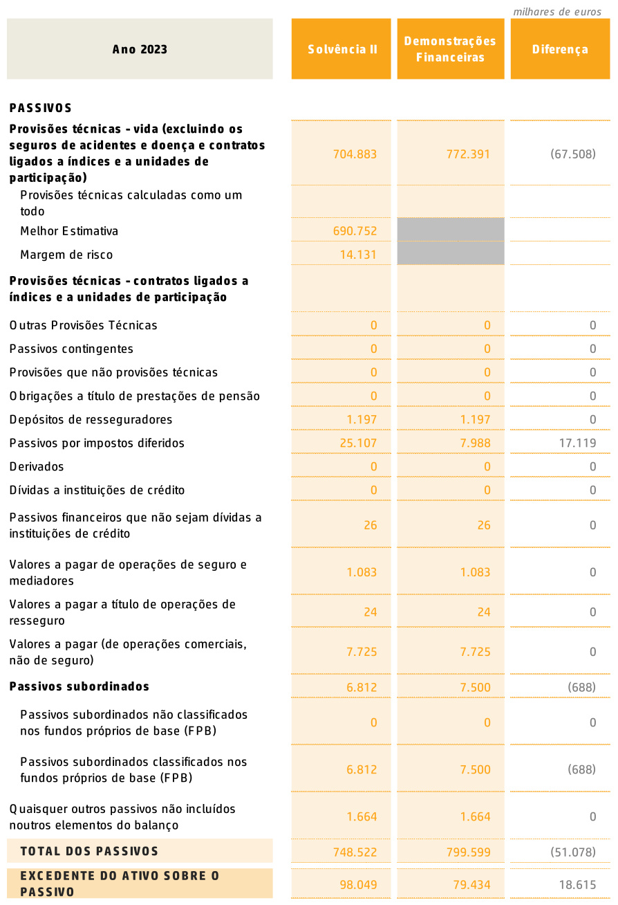  

As variações dos passivos e do excedente do ativo sobre o passivo entre 31 de dezembro de 2023 e 2022 foram como segue:   

<html><body><table><tr><td>COMPARATIVO</td><td>Solvencia I 2023</td><td>Solvencia II 2022</td><td>Variacao</td></tr><tr><td>PASSIVOS</td><td></td><td></td><td></td></tr><tr><td>Provisoes tecnicas - vida (excluindo os seguros de acidentese doenca econtratos ligados a indices e a unidades de</td><td>704.883</td><td>779.367</td><td>(74.484)</td></tr><tr><td>participacao) Provisoes tecnicas calculadas como um todo</td><td></td><td>0</td><td>0</td></tr><tr><td>MelhorEstimativa</td><td>690.752</td><td>766.464</td><td>(75.712)</td></tr><tr><td>Margem de risco</td><td>14.131</td><td>12.903</td><td>1.228</td></tr><tr><td>Provisoes tecnicas-contratos ligados a indices e a unidades de participacao</td><td></td><td></td><td></td></tr><tr><td>Outras ProvisoesTécnicas</td><td>0</td><td>0</td><td>0</td></tr><tr><td>Passivos contingentes</td><td>0</td><td>0</td><td>0</td></tr><tr><td>Provisoesque nao provisoes tecnicas</td><td>0</td><td>0</td><td>0</td></tr><tr><td>Obrigacoes a titulo de prestacoes de pensao</td><td>0</td><td>0</td><td>0</td></tr><tr><td>Depositos de resseguradores</td><td>1.197</td><td>3.305</td><td>(2.108)</td></tr><tr><td>Passivos porimpostos diferidos</td><td>25.107</td><td>3.059</td><td>22.048</td></tr><tr><td>Derivados</td><td>0</td><td>0</td><td>0</td></tr><tr><td>Dividas a instituicoes de credito</td><td>0</td><td>0</td><td>0</td></tr><tr><td>Passivosfinanceiros que nao sejam dividas a instituicoes de credito</td><td>26</td><td>45</td><td>(19)</td></tr><tr><td>Valores apagarde operacoes deseguro e mediadores</td><td>1.083</td><td>1.094</td><td>(11)</td></tr><tr><td>Valores apagar a titulo de operacoes de resseguro</td><td>24</td><td>166</td><td>(142)</td></tr><tr><td>Valores a pagar (de operacoes comerciais, nao de seguro)</td><td>7.725</td><td>2.022</td><td>5.703</td></tr><tr><td>Passivos subordinados</td><td>6.812</td><td>6.522</td><td>290</td></tr><tr><td>Passivos subordinados nao classificados nos fundos proprios de base (FPB)</td><td>0</td><td>0</td><td>0</td></tr><tr><td>Passivos subordinados classificados nos fundos proprios de base (FPB)</td><td>6.812</td><td>6.522</td><td>290</td></tr><tr><td>Quaisquer outros passivos nao incluidos noutros elementos do balanco</td><td>1.664</td><td>2.061</td><td>(397)</td></tr><tr><td>TOTALDOSPASSIVOS</td><td>748.522</td><td>797.641</td><td>(49.119)</td></tr><tr><td>EXCEDENTEDOATIVOSOBREOPASSIVO</td><td>98.049</td><td>80.997</td><td>17.052</td></tr></table></body></html>  

No regime Solvência II, a Melhor Estimativa (ME) corresponde ao valor esperado dos fuxos futuros inerentes aos contratos em vigor, atualizados à estrutura temporal das taxas de juro fornecida pela EIOPA à data de avaliação, sem qualquer ajustamento.  

O montante global da margem de risco foi determinado em conformidade com os requisitos regulamentares que constam no artigo 37.º, do Regulamento Delegado.  

O montante global das provisões técnicas, em 31 de dezembro de 2023, era de €704.883 milhares, sendo composto pelos seguintes itens:  

<html><body><table><tr><td>Classes</td><td>Seguros com Participacao nos Resultados</td><td>OutrosSeguros do Ramo Vida</td><td>TOTAL</td></tr><tr><td>MelhorEstimativa</td><td>247.413</td><td>443.339</td><td>690.752</td></tr><tr><td>MargemdeRisco</td><td>3.354</td><td>10.777</td><td>14.131</td></tr><tr><td>TotalProvisoesTecnicas</td><td>250.768</td><td>454.115</td><td>704.883</td></tr></table></body></html>  

A comparação entre as provisões técnicas em Solvência II e as estatutárias em 31 de dezembro de 2023 é como segue:  

<html><body><table><tr><td>ProvisoesTecnicas</td><td>Solvenciall</td><td>somaapsaipul Demonstracoes financeiras</td></tr><tr><td>MelhorEstimativa</td><td>690.752</td><td></td></tr><tr><td>Margem deRisco</td><td>14.131</td><td></td></tr><tr><td>TotaldasProvisoesTecnicas</td><td>704.883</td><td>772.391</td></tr><tr><td>Montantesrecuperaveisderesseguro</td><td>(1.363)</td><td>(2.231)</td></tr></table></body></html>  

Salienta-se uma diferença negativa nas provisões técnicas, líquidas dos recuperáveis de resseguro, no montante de €66.640 milhares à data de 31 de dezembro de 2023.  

# Classes de negócio  

A distribuição do montante das provisões técnicas por classe de negócio à data de 31 de dezembro de 2023, é apresentada na seguinte tabela:  

<html><body><table><tr><td>Classes</td><td>Seguros com Participacao nos Resultados</td><td>Outros Seguros do Ramo Vida</td><td>TOTAL</td></tr><tr><td>MelhorEstimativa</td><td>247.413</td><td>443.339</td><td>690.752</td></tr><tr><td>MargemdeRisco</td><td>3.354</td><td>10.777</td><td>14.131</td></tr><tr><td>TotalProvisoesTecnicas</td><td>250.768</td><td>454.115</td><td>704.883</td></tr></table></body></html>  

# D.2.1 – Bases e Métodos de Cálculo  

No cálculo da Melhor Estimativa (ME) foram utilizados todos os cash-fows atuais e futuros até ao run-of da carteira, no máximo de 50 anos, sendo calculados por grupos homogéneos de risco. A ME inclui, também, a participação nos resultados mínima contratualmente garantida, a provisão de sinistros constituída e o montante dos recuperáveis de resseguro. A avaliação da participação nos resultados futura é feita considerando os rendimentos reais projetados para cada grupo homogéneo de risco.  

O custo das opções e garantias foi apurado por fundo, sendo simulados 2.000 ciclos de estimativas, baseadas em diferentes cenários económicos, sendo o custo fnal das opções e garantias a diferença positiva entre a média dos ciclos estocásticos e a Melhor Estimativa determinística.  

Salienta-se que a Lusitania Vida não calculou as suas provisões de forma agregada, conforme a opção defnida no quadro regulamentar.  

# D.2.2 – Pressupostos  

Os pressupostos utilizados para o cálculo das provisões técnicas foram os seguintes:  

• Foram considerados os prémios futuros e todos os cas -fows futuros subjacentes como, por exemplo, os sinistros e o resseguro, apenas em contratos em que à data de 31 de dezembro de 2023 a Companhia não pudesse unilateralmente anular ou modifcar as condições contratuais, nomeadamente nos casos em que o prazo de anulação já tivesse expirado; Os prémios futuros de resseguro foram considerados nos casos em que os contratos de resseguro assim o defnem; Não foi considerado novo negócio, nem entregas futuras nos produtos fnanceiros, exceto as contratualmente existentes; No desconto fnanceiro é utilizada a estrutura temporal das taxas de juro sem risco fornecida pela EIOPA a 31 de dezembro de 2023;   
• Não foram incluídos os ajustamentos de volatilidade e de congruência; As despesas foram calculadas através de um modelo de repartição de custos por funções, por tipo de produtos, por canal de distribuição e por natureza; A taxa de infação utilizada nos principais produtos foi de $4\%$ no primeiro ano, $3\%$ no segundo ano e $2\%$ nos anos seguintes; e   
• Para o cálculo da melhor estimativa da participação nos resultados, foram considerados os rendimentos dos ativos afetos às carteiras e foi considerada a distribuição de apenas o mínimo contratual.  

A Companhia em 2023 procedeu à revisão dos pressupostos atuariais (relativos à mortalidade, invalidez ou morbilidade, resgates e anulações), bem como os pressupostos económicos (rendimentos e despesas).  

Os pressupostos foram apurados com base na experiência observada em cada um dos produtos, assim:  

Mortalidade ou invalidez-morbilidade: A análise incidiu sobre os históricos dos últimos 10 anos de todos os produtos, das taxas de mortalidade e invalidez absoluta e defnitiva, ou invalidez total e permanente;  

Resgates: O estudo efetuado para este pressuposto incidiu sobre o número de resgates totais ocorridos dos últimos 10 anos, com a exceção de duas modalidades fnanceiras de grupo, no qual se considerou os montantes de resgates pagos, no apuramento deste pressuposto;  

Anulações: Para a generalidade das modalidades considerou-se o histórico das taxas de anulação para todos os produtos em carteira, sendo projetado para os anos subsequentes a média das taxas de anulação dos últimos 10 anos e, para os casos de modalidades que não têm histórico para este prazo, considerou-se no mínimo os 8 últimos anos.  

# D.2.3 – Nível de incerteza  

A aplicação de modelos tem sempre implícita uma componente de incerteza associada, devido a fatores externos e internos à Companhia. No entanto, para a projeção dos fuxos é sempre necessário assumir pressupostos baseados na experiência.  

# D.2.4 – Montantes Recuperáveis de Resseguro  

Os montantes recuperáveis de resseguro correspondem à parte das perdas de uma Companhia, que podem ser recuperadas a partir de cedência em resseguro. Os recuperáveis de resseguro incluem o montante em dívida do ressegurador para com a seguradora relativo a sinistros e despesas com sinistros relacionados, o montante em dívida para perdas estimadas que tenham ocorrido e tenham sido participadas, bem como o montante da participação nos resultados de resseguro.  

Para apurar a vertente económica dos recuperáveis de resseguro, é somada a melhor estimativa do saldo de resseguro futuro.  

Valor dos montantes recuperáveis de resseguro em 31 de dezembro de 2023: -€1.363 milhares (2022: €984 milhares).  

# D.2.5 – Medidas de Transição  

A legislação prevê a possibilidade de aplicação de várias medidas de transição para o regime Solvência II, tendo a Lusitania Vida procedido à aplicação da medida transitória sobre as provisões técnicas, pelo período máximo de transição, conforme aprovado pela ASF.  

Na data de avaliação, o montante das provisões técnicas após a aplicação da medida de transição sobre as provisões técnicas, situou-se em €704.883 milhares, enquanto que, sem a aplicação da medida, este montante seria de €721.204 milhares. O valor apurado para a medida de transição sobre as provisões técnicas para o corrente ano corresponde a €16.321 milhares (2022: €18.134 milhares), conforme referido no ponto E.5.  

O impacto das medidas é o seguinte:   

<html><body><table><tr><td>2023</td><td>Montantes com medidas de transicao e de longo prazo</td><td>mrtmu/esdeeuro Montantes sem medidas de transicao esem medidas de longo</td></tr><tr><td>FundosproprioselegiveisRCS</td><td>94.712</td><td>prazo 82.744</td></tr><tr><td>NivelI</td><td>87.901</td><td>75.742</td></tr><tr><td>NivellIl</td><td>6.812</td><td>6.812</td></tr><tr><td>Nivel !ll</td><td></td><td>190</td></tr><tr><td>RequisitodeCapitalde Solvencia</td><td>63.701</td><td>63.701</td></tr><tr><td>RequisitodeCapitalMinimo</td><td>16.851</td><td>16.902</td></tr></table></body></html>  

A Lusitania Vida não utilizou mais nenhuma medida de transição ou de longo prazo à data de 31 de dezembro de 2023.  

# D.3 – OUTRAS RESPONSABILIDADES  

# D.3.1 – Depósitos de Resseguradores  

Os depósitos recebidos de resseguradores representam o valor das provisões de resseguro constituídas em consequência da aceitação de riscos e do recebimento de prémios de operações originadas pelo negócio de resseguro cedido.  

# D.3.2 – Ativos e Passivos por Impostos Diferidos  

O cálculo dos ativos e passivos por impostos diferidos obedece à IAS 12 e considera a totalidade dos ajustamentos efetuados para efeitos de balanço económico.  

# D.3.3 – Valores a Pagar de Operações de Seguro e Mediadores  

Compreende o valor a pagar a mediadores e a tomadores de seguros.  

# D.3.4 – Valores a Pagar de Contratos de Resseguro  

Estão incluídos os saldos a pagar aos resseguradores.  

# D.3.5 – Valores a Receber (de Operações Comerciais, Não de Seguro)  

Esta rubrica do balanço económico compreende as rubricas do balanço contabilístico passivos por impostos correntes e contas a pagar por outras operações.  

# D.3.6 – Passivos Subordinados  

O passivo subordinado reporta-se ao empréstimo obrigacionista, que a Lusitania Vida emitiu em 23 de setembro de 2022, no valor de $\epsilon7.500$ milhares, o qual foi totalmente subscrito pela Montepio Geral - Associação Mutualista. Este empréstimo tem a duração prevista de 10 anos e uma taxa de juro fxa de $10\%$ .  

Para efeitos de balanço económico, este empréstimo é valorizado ao justo valor e tem como base as cotações de mercado (Bi -price), sempre que estas se encontrem disponíveis. Caso estas não existam, o cálculo do justo valor assenta na utilização de modelos numéricos internos, baseados em técnicas de desconto de fuxos de caixa que, para estimar o justo valor, utilizam as taxas de juro de mercado ajustadas pelos fatores associados, predominantemente o risco de liquidez (de acordo com o Regulamento, não é efetuado qualquer ajustamento associado à variação da qualidade de crédito da Companhia) e determinados de acordo com as condições de mercado e prazos respetivos.  

# D.3.7 – Quaisquer Outros Passivos, Não Incluídos Noutros Elementos  

Corresponde às rubricas do balanço contabilístico Acréscimos e diferimentos e Outras provisões.  

Para efeitos do balanço económico, as rubricas Depósitos de resseguradores, Valores a pagar de operações de seguro e mediadores, Valores a pagar de contratos de resseguro, Valores a pagar (de operações comerciais, não de seguro), quaisquer outros passivos, não incluídos noutros elementos, consideramos que o valor registado em balanço contabilístico é uma aproximação bastante razoável do justo valor dos mesmos.  

# D.3.8 - Passivos contingentes  

A Companhia está envolvida em processos judiciais em Portugal, relacionados com ações movidas pela Companhia e contra a mesma, os quais estão relacionados com o decurso normal da sua atividade enquanto seguradora, entidade empregadora e contribuinte fscal. Não é exequível estimar ou prever o desfecho fnal dos processos judiciais em curso. No entanto, é convicção do Conselho de Administração que, com as devidas reservas, a possibilidade de o desfecho dos processos judiciais em curso vir a ter um efeito material adverso nas demonstrações fnanceiras estatutárias e, inerentemente, no balanço económico da Companhia é remota.  

# Garantias  

Em 31 de dezembro de 2023 não existem garantias bancárias.  

# Compromissos  

A 31 de dezembro de 2023, a Companhia possuía um contrato de locação operacional relacionado com um veículo.  

# D.4 – MÉTODOS ALTERNATIVOS DE AVALIAÇÃO  

A Lusitania Vida não aplica métodos alternativos de avaliação.  

# D.5 – EVENTUAIS INFORMAÇÕES ADICIONAIS  

Sem outras informações relevantes.  

# GESTÃO DO CAPITAL  

# E.1 – FUNDOS PRÓPRIOS  

A Lusitania Vida é uma Sociedade Anónima com o capital integralmente realizado, que pertence ao Grupo Montepio e é detida em $99,8\%$ pela Montepio Geral - Associação Mutualista. A Lusitania Vida não tem planos para emitir novas ações no curto ou médio prazo.  

Os fundos próprios da Companhia são investidos principalmente em títulos de dívida pública e privada, depósitos e em imóveis. À data da elaboração do relatório não estão defnidas medidas no sentido de alterar a disposição dos itens de fundos próprios.  

O plano de gestão de capital de médio prazo estabelecido pelo Conselho de Administração é o seguinte:  

• Manter o nível de fundos próprios superior ao Requisito de Capital de Solvência (RCS);   
· Não prever a emissão de capital a curto ou médio prazo;   
• Investir os fundos próprios essencialmente em ativos fnanceiros; Distribuir dividendos se as condições fnanceiras assim o permitirem.  

Atualmente os fundos próprios incluem o capital social, a reserva de reconciliação e um empréstimo subordinado e são calculados utilizando as medidas de transição aprovadas pela Autoridade de Supervisão de Seguros e Fundos de Pensões.  

Relativamente aos níveis de capital, a legislação de Solvência II exige que as seguradoras classifquem os fundos próprios em três níveis, cada um com diferentes qualifcações:  

• Nível 1 - Fundos próprios de Base. Inclui o Capital Ordinário (Capital Social), Reserva de Reconciliação e eventual capital restrito de empréstimos subordinados sem prazo defnido; Nível 2 - inclui Fundos Próprios de Base e Complementares. Os fundos próprios complementares consistem em outros elementos que não os fundos próprios de base e que podem ser mobilizados para absorver perdas. Os elementos de fundos próprios complementares requerem a aprovação prévia da ASF. A Lusitania Vida dispõe de um empréstimo subordinado neste nível de capital; e   
• Nível 3 – inclui, entre outros elementos, os Ativos por Impostos Diferidos.  

As regras impõem limites ao montante de cada nível que pode ser utilizado para cobrir os requisitos de capital, com o objetivo de garantir que os do primeiro nível estarão disponíveis quando for necessário absorver quaisquer perdas que possam surgir.  

Na tabela seguinte são apresentados os montantes dos fundos próprios, requisitos de capital e rácio de solvência, considerando a inclusão da medida de transição sobre as provisões técnicas.  

<html><body><table><tr><td></td><td>2023</td><td>2022</td></tr><tr><td>Requisito deCapital Minimo</td><td>16.851</td><td>18.589</td></tr><tr><td>FundosProprios elegiveis parao RCS</td><td>94.712</td><td>87.272</td></tr><tr><td>Requisito deCapitaldeSolvencia(RCS)</td><td>63.701</td><td>66.942</td></tr><tr><td>RaciodeSolvencia</td><td>148,7%</td><td>130.4%</td></tr></table></body></html>  

Houve um forte aumento do rácio da solvência ao longo de 2023, em resultado do aumento dos Fundos Próprios e da diminuição do Requisito de capital. Quanto ao aumento dos Fundos próprios, destaca-se uma forte valorização dos ativos, ocorrida ao longo do ano de 2023, principalmente no último trimestre. O Requisito de Capital reduziu, em consequência duma redução nos riscos de subscrição, que por sua vez resulta de uma redução de carteira de apólices. Contudo, em virtude da aprovação de distribuição de dividendos no ano de 2024 relativos a 2023, no montante de €10.000 milhares, o rácio de solvência fxou-se em $148,7\%$ . Relativamente aos Fundos Próprios, importa também referir que este valor também é afetado pela redução da medida transitória sobre as provisões técnicas, por via da amortização anual desta.  

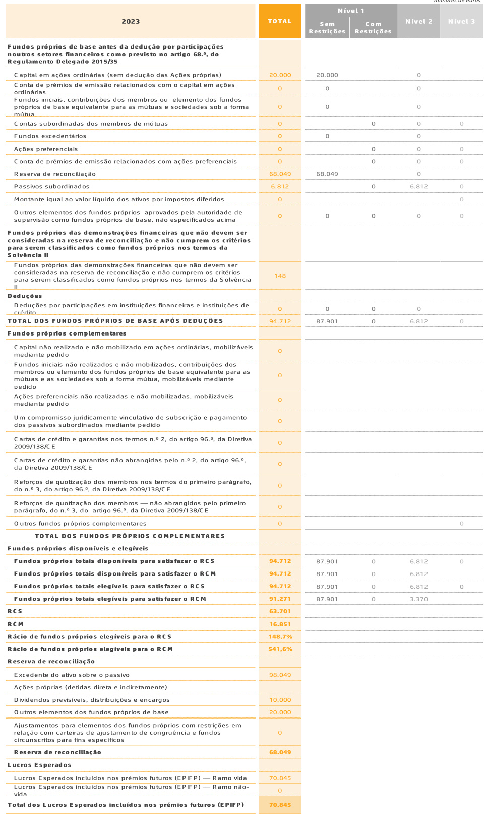  

Tendo em consideração que a Lusitania Vida apenas tem capital dos Níveis 1 e 2, a comparação face ao exercício anterior é efetuada apenas considerando estes Níveis, como consta do quadro seguinte:   

<html><body><table><tr><td rowspan="2">2023</td><td colspan="3">2023</td><td colspan="3">2022</td></tr><tr><td>TOTAL</td><td>NIVEL1 (S/R)</td><td>NIVEL2</td><td>TOTAL</td><td>NIVEL1 (S/R)</td><td>NIVEL2</td></tr><tr><td>setoresfinanceiroscomoprevistonoartigo68.°.doRegulamento</td><td></td><td></td><td></td><td></td><td></td><td></td></tr><tr><td>Delegado2015/35 Capitalem acoesordinarias(sem deducao das Acoes proprias)</td><td>20.000</td><td>20.000</td><td>0</td><td>20.000</td><td>20.000</td><td></td></tr><tr><td>Conta de premios de emissao relacionados com o capital em acoes ordinarias</td><td></td><td>0</td><td></td><td></td><td>0</td><td></td></tr><tr><td>Fundosiniciais,contribuicoes dosmembros ou elemento dosfundosproprios</td><td></td><td>0</td><td></td><td>0</td><td></td><td></td></tr><tr><td>de base equlvalente para as mutuas e sociedades sob a forma mitua</td><td></td><td></td><td></td><td>。</td><td></td><td>0</td></tr><tr><td>Contas subordinadas dos membros de mutuas</td><td>0</td><td>0</td><td>0</td><td>。</td><td></td><td>0</td></tr><tr><td>Fundos excedentarios</td><td></td><td></td><td></td><td>。</td><td></td><td></td></tr><tr><td>Acoes preferenclais</td><td></td><td></td><td></td><td></td><td></td><td></td></tr><tr><td>Conta depremiosde emissaorelacionadoscom acoespreferenciais Reserva dereconciliacao</td><td>68.049</td><td>68.049</td><td>0</td><td>60.997</td><td>60.997</td><td>0</td></tr><tr><td>Passivossubordinados</td><td>6.812</td><td></td><td>6.812</td><td>6.522</td><td></td><td>6.522</td></tr><tr><td>Montante igualaovalor tiquido dos ativos por impostos diferidos</td><td></td><td></td><td></td><td></td><td></td><td></td></tr><tr><td>Outroselementos dosfundosproprios aprovadospelaautoridadede supervisao como fundosproprios debase,nao especificados acima</td><td></td><td></td><td></td><td></td><td></td><td></td></tr><tr><td>Fundospropriosdas demonstracoesfinanceiras que n&o devem ser consideradasnareservadereconciliacaoenao cumpremoscriterios para serem classificados como fundosproprios nos termos da SolvenciaH</td><td></td><td></td><td></td><td></td><td></td><td></td></tr><tr><td>Fundospropriosdas demonstracoesfinanceiras que nao devem ser consideradasna teserva de reconciliacao enao cumprem os criterios para</td><td></td><td></td><td></td><td>247</td><td></td><td></td></tr><tr><td>serem classificados como fundos proprios nos termos da Solvencia ll Deducoes Deducoesporparticipacdeseminstitulcbesfinanceirase instituicoesde</td><td></td><td></td><td></td><td></td><td></td><td></td></tr><tr><td>credito TOTALDOSFUNDOSPROPRIOSDEBASEAPOSDEDUCOES</td><td>口 94.712</td><td>0 87.901</td><td>0</td><td>87.272</td><td>80.750</td><td>0</td></tr><tr><td>Fundosproprioscomplementares</td><td></td><td></td><td>6.812</td><td></td><td></td><td>6.522</td></tr><tr><td>Capital nao realizadoenao mobllizado em acoes ordinarias,mobilizaveis mediante pedido Fundos iniciais nao realizadosen&o mobilizados,contribuicoes dosmembros</td><td></td><td></td><td></td><td></td><td></td><td></td></tr><tr><td>ou elemento dos fundos proprios de base equlvalente para as mituas e as sociedadessobaforma mutua,mobitizaveismediantepedido</td><td></td><td></td><td></td><td></td><td></td><td></td></tr><tr><td>Acoespreferenciais nao realizadas e nao mobilizadas,mobilizaveis mediante pedido</td><td></td><td></td><td></td><td></td><td></td><td></td></tr><tr><td>Um compromissojuridicamente vinculativo de subscricaoe pagamento dos passivossubordinadosmediantepedido</td><td></td><td></td><td></td><td></td><td></td><td></td></tr><tr><td>Cartas de credito e garantiasnos termosn.2,do artigo 96.9,da Diretiva 2009/138/CE</td><td></td><td></td><td></td><td></td><td></td><td></td></tr><tr><td>Cartas de credito e garantias nao abrangidas pelo n.2.do artigo 96.,da Diretiva2009/138/CE</td><td></td><td></td><td></td><td></td><td></td><td></td></tr><tr><td>Reforcos de quotizacao dos membrosnos termos do primeiro paragrafo,do n.°3,do artigo 96.9,daDiretiva 2009/13B/CE</td><td></td><td></td><td></td><td></td><td></td><td></td></tr><tr><td>Reforcos de quotizacao dos membros—nao abrangidos pelo primeiro paragrafo,don.3.do artigo96.°,daDiretiva2009/138/CE</td><td></td><td></td><td></td><td></td><td></td><td></td></tr><tr><td>Outrosfundosproprios complementares TOTALDOSFUNDOSPROPRIOSCOMPLEMENTARES</td><td></td><td></td><td></td><td></td><td></td><td></td></tr><tr><td>Fundosproprios disponiveiseelegiveis</td><td></td><td></td><td></td><td></td><td></td><td></td></tr><tr><td>Fundospropriostotaisdisponivelspara satisfazeroRcs</td><td>94.712</td><td>87.901</td><td>6.812</td><td>87.272</td><td>80.750</td><td>6.522</td></tr><tr><td>Fundosproprios totals disponiveispara satisfazeroRCM</td><td>94.712</td><td>87.901</td><td>6.812</td><td>87.272</td><td>80.750</td><td>6.522</td></tr><tr><td>Fundospropriostotaiselegiveispara satisfazeroRcS</td><td>94.712</td><td>87.901</td><td>6.812</td><td>87.272</td><td>80.750</td><td>6.522</td></tr><tr><td>Fundosproprios totais elegiveispara satisfazeroRCM</td><td>91:271</td><td>87.901</td><td>3.370</td><td>84.468</td><td>80.750</td><td>3.718</td></tr><tr><td>RCS</td><td>63.701</td><td></td><td></td><td>66.942</td><td></td><td></td></tr><tr><td>RCM</td><td>16.851</td><td></td><td></td><td>18.589</td><td></td><td></td></tr><tr><td>Racio de fundosproprios elegiveispara o RCS</td><td>148.7%</td><td></td><td></td><td></td><td></td><td></td></tr><tr><td>Racio de fundosproprios elegiveisparao RCM</td><td>547,696</td><td></td><td></td><td>130.4%</td><td></td><td></td></tr><tr><td>Reserva dereconciliacao</td><td></td><td></td><td></td><td>454,4%</td><td></td><td></td></tr><tr><td>Excedente do ativo sobre opassivo</td><td>96.049</td><td></td><td></td><td>80.997</td><td></td><td></td></tr><tr><td>Acoes proprias (detidas direta e indiretamente)</td><td></td><td></td><td></td><td></td><td></td><td></td></tr><tr><td>Dividendosprevisiveis,distribuicoeseencargos</td><td>10.000</td><td></td><td></td><td>。</td><td></td><td></td></tr><tr><td>Outroselementos dosfundospropriosde base</td><td>20.000</td><td></td><td></td><td></td><td></td><td></td></tr><tr><td>Ajustamentos para elementos dosfundosproprios com restricoes emrelacao</td><td></td><td></td><td></td><td>20.000</td><td></td><td></td></tr><tr><td>com carteiras de ajustamento de congruencia e fundos circunscritos para fins especificos</td><td></td><td></td><td></td><td>0</td><td></td><td></td></tr><tr><td>Reserva dereconciliacio</td><td>68.049</td><td></td><td></td><td>60.997</td><td></td><td></td></tr><tr><td>LucrosEsperados</td><td></td><td></td><td></td><td></td><td></td><td></td></tr><tr><td>LucrosEsperadosincluidosnospremiosfuturos(EPiFP)-</td><td>70:845</td><td></td><td></td><td>76.047</td><td></td><td></td></tr><tr><td>Ramo vida</td><td></td><td></td><td></td><td></td><td></td><td></td></tr><tr><td></td><td></td><td></td><td></td><td></td><td></td><td></td></tr><tr><td>Lucros Esperados incluidos nos premios futuros (EPIFP)—Ramo nao-vida Total dosLucrosEsperadosincluidos nospremiosfuturos(EPiFP)</td><td>70.845</td><td></td><td></td><td>0 76.047</td><td></td><td></td></tr></table></body></html>

O aumento dos Fundos Próprios resulta da subida do excedente do Ativo sobre o Passivo, deduzido do valor do requisito de capital dos fundos de pensões geridos pela Lusitania Vida, em 2023, resultando num acréscimo de Fundos Próprios no valor de €7.440 milhares. Durante o ano de 2023, os investimentos, sofreram valorizações  

positivas no seu valor de mercado, em especial no fnal ano, em consequência de algum abrandamento das subidas das “yiel s” de mercado, pelo que a reserva de reconciliação foi afetada positivamente.  

Face à recuperação fnanceira e económica da Companhia, que tem continuamente apresentado um nível de solvência confortável e resultados ajustados ao risco expressivos em 2022 e 2023 (em IFRS e Solvência II), o Órgão de Administração propôs uma distribuição de dividendos de $\pounds10.000$ milhares, relativos ao exercício fndo em 31 de dezembro de 2023, aprovado em sede de Assembleia Geral de Acionistas.  

# E.2 – REQUISITO DE CAPITAL DE SOLVÊNCIA E REQUISITO DE CAPITAL MÍNIMO  

Os montantes do Requisito de Capital de Solvência (RCS) e do Requisito de Capital Mínimo (RCM), no fnal do ano 2023, eram de €63.701 milhares e €16.851 milhares, respetivamente, que comparam com €66.942 milhares e €18.589 milhares de em 2022.  

Contrariamente ao que acontecia no fnal de 2022, o risco de mercado passou a ser o que mais impacta no Requisito de Capital de Solvência, sendo que, dentro deste o maior risco continua a ser o risco de spread (ver C.8.3 – Análise comparativa).  

A Lusitania Vida não utiliza parâmetros específcos da empresa nem simplifcações para o cálculo do Requisito de Capital de Solvência.  

O quadro seguinte apresenta as componentes do RCS, apurados através da fórmula padrão.  

montante de recursos fnanceiros não deverá descer, valor que é largamente superado pela Companhia.  

milhares de euros   

<html><body><table><tr><td>Ano2023</td><td>Requisito de capital desolvencia</td></tr><tr><td>Riscodemercado</td><td>51.655</td></tr><tr><td>Risco deincumprimentopelacontraparte</td><td>4.451</td></tr><tr><td>Riscoespecificodesegurosdevida</td><td>48.819</td></tr><tr><td>Efeitodediversificacao</td><td>(23.957)</td></tr><tr><td>Requisito deCapital deSolvencia deBase</td><td>80.968</td></tr><tr><td>Riscooperacional</td><td>7.657</td></tr><tr><td>Capacidade de absorcao deperdasdasprovisoestecnicas</td><td>(17.541)</td></tr><tr><td>Capacidadedeabsorcaodeperdasporimpostos diferidos</td><td>(7.383)</td></tr><tr><td>Requisito decapitalde solvencia,excluindo acrescimos decapital</td><td>63.701</td></tr><tr><td>REQUISITODECAPITALDESOLVENCIA</td><td>63.701</td></tr></table></body></html>  

Relativamente ao Requisito de Capital Mínimo, o valor consta do quadro seguinte e corresponde ao nível mínimo de fundos próprios abaixo do qual o  

<html><body><table><tr><td>Ano 2023</td><td>Valor Liquido de Resseguro</td></tr><tr><td>Responsabilidades com participacao noslucros-beneficios garantidos</td><td>216.385</td></tr><tr><td>Responsabilidades comparticipacaonoslucros-beneficios discricionariosfuturos</td><td>34.311</td></tr><tr><td>Responsabilidades de seguros ligados a indices e a unidades de participacao</td><td>0</td></tr><tr><td>Outras responsabilidades de (re)seguro dos ramos vida e acidentes e doenca</td><td>455.549</td></tr><tr><td>Total do capital em risco para todas as responsabilidades de (re)seguro do ramo vida</td><td>1.518.041</td></tr><tr><td>REQUISITO DECAPITALMINIMO(RCM)</td><td></td></tr><tr><td>Resultado de RCM</td><td>16.851</td></tr><tr><td>RCM linear</td><td>16.851</td></tr><tr><td>RCS</td><td>63.701</td></tr><tr><td>Limite superior do RCM</td><td>28.665</td></tr><tr><td>Limite inferior do RCM</td><td>15.925</td></tr><tr><td>RCM combinado</td><td>16.851</td></tr><tr><td>Limite inferior absoluto do RCM REQUISITO DECAPITAL MINIMO (RCM)</td><td>3.700 16.851</td></tr></table></body></html>  

milhares de euros   

<html><body><table><tr><td>2023</td><td>Montantes com medidas de transicao e de</td><td>Montantes sem deducao do LAC-DT</td></tr><tr><td>Fundosproprios</td><td>94.712</td><td>94.712</td></tr><tr><td>elegiveisRCS Nivell</td><td>87.901</td><td>87.901</td></tr><tr><td>Nivel Il</td><td>6.812</td><td>6.812</td></tr><tr><td>Nivel Ill</td><td>0</td><td>0</td></tr><tr><td>RequisitodeCapital deSolvencia</td><td>63.701</td><td>71.084</td></tr><tr><td>RequisitodeCapital Minimo</td><td>16.851</td><td>16.851</td></tr></table></body></html>  

O valor apurado para a Capacidade de absorção de perdas por impostos diferidos no fnal de 2023 foi de €7.383 milhares e tiveram o seguinte impacto na solvência:  

# E.3 $\boldsymbol{\Gamma}$ UTILIZAÇÃO DO SUB-MÓDULO DE RISCO ACIONISTA BASEADO NA DURAÇÃO PARA CALCULAR O REQUISITO DE CAPITAL  

A Lusitania Vida não utilizou o sub-módulo de risco acionista baseado na duração para calcular a solvência.  

# E.4 – DIFERENÇAS ENTRE A FÓRMULA PADRÃO E QUALQUER MODELO INTERNO UTILIZADO  

A Lusitania Vida aplica, na íntegra, a fórmula padrão e não utiliza modelos internos para calcular o Requisito de Capital de Solvência.  

# E.5 – INCUMPRIMENTO DO REQUISITO DE CAPITAL MÍNIMO E INCUMPRIMENTO DO REQUISITO DE CAPITAL DE SOLVÊNCIA  

Ao longo de todo o ano de 2023, a Lusitania Vida não apresentou incumprimento do Requisito de Capital de Solvência nem do Requisito de Capital Mínimo.  

Ambos os rácios são superiores a $100\%$ , tanto com a aplicação das medidas transitórias sobre as  

provisões técnicas, como sem a utilização das mesmas.  

A solvência trimestral ao longo do ano de 2023 foi a seguinte:  

<html><body><table><tr><td></td><td>Dez'22</td><td>Mar'23</td><td>Jun'23</td><td>Set'23</td><td>Dez'23</td></tr><tr><td>FundosproprioselegiveisparaoRCS</td><td>87.271</td><td>112.533</td><td>108.028</td><td>107.492</td><td>94.712</td></tr><tr><td>Requisito deCapital deSolvencia(RCS)</td><td>66.941</td><td>72.399</td><td>65.654</td><td>64.933</td><td>63.701</td></tr><tr><td>Racio(FP/RCS)</td><td>130,4%</td><td>155,4%</td><td>164,5%</td><td>165,5%</td><td>148,7%</td></tr><tr><td>FundosproprioselegiveisparaoRCM</td><td>84.468</td><td>109.631</td><td>104.887</td><td>104.217</td><td>91.271</td></tr><tr><td>Requisito deCapital Minimo(RCM)</td><td>18.588</td><td>18.100</td><td>16.905</td><td>16.233</td><td>16.851</td></tr><tr><td>Racio(FP/RCM)</td><td>454,4%</td><td>605,7%</td><td>620,5%</td><td>642,0%</td><td>541,6%</td></tr></table></body></html>  

# E.6 – EVENTUAIS INFORMAÇÕES ADICIONAIS  

Não existem informações adicionais relevantes a reportar.  

# ANEXOS  

REPORTE QUANTITATIVO (QRTS)  

# Anexo 1 - Balanço Económico  

<html><body><table><tr><td></td><td>milhares de euros</td></tr><tr><td>ATIVOS</td><td>ValorSolvenciaIl</td></tr><tr><td>Goodwill</td><td></td></tr><tr><td>Custos de aquisicao diferidos</td><td>0 0</td></tr><tr><td>Ativos intangiveis</td><td>0</td></tr><tr><td>Ativos por impostos diferidos (sem inclusäo medida transitoria)</td><td>20.623</td></tr><tr><td>Excedente de prestacoes de pensao</td><td>430</td></tr><tr><td>Imoveis, instalacoes e equipamento para uso proprio</td><td>7.418</td></tr><tr><td>Investimentos (que nao ativos detidos no quadro de contratos ligados a indices e a unidades de participacao)</td><td>810.696</td></tr><tr><td>Imoveis (que nao para uso proprio)</td><td>52.579</td></tr><tr><td>Interesses em empresas relacionadas,incluindo participacoes</td><td>5.312</td></tr><tr><td>Titulos de fundos proprios</td><td>1.263</td></tr><tr><td>Acoes—cotadas em bolsa</td><td>0</td></tr><tr><td>Acoes —— nao cotadas em bolsa</td><td>1.263</td></tr><tr><td>Obrigacoes</td><td>682.993</td></tr><tr><td>Obrigacoes de divida publica</td><td>309.166</td></tr><tr><td>Obrigacoes de empresas</td><td>373.826</td></tr><tr><td>Titulos de divida estruturados</td><td>0</td></tr><tr><td>Titulos de divida garantidos com colateral</td><td>0</td></tr><tr><td>Organismos de investimento coletivo</td><td>58.149</td></tr><tr><td>Derivados</td><td>0</td></tr><tr><td>Depositos que nao equivalentes a numerario</td><td>10.400</td></tr><tr><td>Outros investimentos</td><td>0</td></tr><tr><td>Ativos detidos no quadro de contratos ligados a indices e a unidades de participacao</td><td>0</td></tr><tr><td>Emprestimos e hipotecas</td><td>0</td></tr><tr><td>Emprestimos sobre apolices de seguro</td><td>0</td></tr><tr><td>Emprestimos e hipotecas a particulares</td><td>0</td></tr><tr><td>Outros emprestimos e hipotecas</td><td>0</td></tr><tr><td>Montantesrecuperaveis decontratos deresseguro dosramos:</td><td>(1.363)</td></tr><tr><td>Nao-vida e acidentes e doenca com bases técnicas semelhantes as do ramo nao-vida</td><td>0</td></tr><tr><td>Nao-vida, excluindo seguros de acidentes e doenca</td><td>0</td></tr><tr><td>Acidentes e doenca com bases tecnicas semelhantes as doramo nao-vida</td><td>0</td></tr><tr><td>Vida e acidentes e doenca com bases tecnicas semelhantes as do ramo vida, excluindo seguros de acidentes e doenca e contratos</td><td></td></tr><tr><td>ligados a indices e a unidades de participacäo</td><td>(1.363)</td></tr><tr><td>Acidentese doenca combases tecnicas semelhantes as doramo vida</td><td>0</td></tr><tr><td>Vida, excluindo seguros de acidentes e doenca e contratos ligados a indices e a unidades de participacao</td><td>(1.363)</td></tr><tr><td>Vida, ligado a indices e a unidades de participacäo</td><td>0</td></tr><tr><td>Depositos em cedentes</td><td>0</td></tr><tr><td>Valores a receber de operacoes de seguro e mediadores</td><td>34</td></tr><tr><td>Valores a receber a titulo de operafoes de resseguro</td><td>1.782</td></tr><tr><td>Valores a receber (de operacoes comerciais, nao de seguro)</td><td>119</td></tr><tr><td>Ac?es proprias (detidas diretamente)</td><td>0</td></tr><tr><td>Montantes devidos a titulo de elementos dos fundos proprios ou dos fundos iniciais mobilizados, mas ainda nao realizados</td><td>0</td></tr><tr><td>Caixa e equivalentes de caixa</td><td>6.743</td></tr><tr><td>Quaisquer outros ativos, nao incluidos noutros elementos do balanco</td><td>89</td></tr><tr><td>TOTALDOSATIVOS</td><td>846.570</td></tr></table></body></html>  

<html><body><table><tr><td>PASSIVOS</td><td></td></tr><tr><td>Provisoes tecnicas—nao-vida</td><td>0</td></tr><tr><td>Provisoes tecnicas — nao-vida (excluindo acidentes e doenca)</td><td>0</td></tr><tr><td>Provisoestecnicascalculadas como umtodo</td><td>0</td></tr><tr><td>Melhorestimativa</td><td>0</td></tr><tr><td>Margem de risco</td><td>0</td></tr><tr><td>Provisoes tecnicas -—- acidentes e doenca (com bases tecnicas semelhantes as do ramo nao-vida)</td><td>0</td></tr><tr><td>Provisoestecnicascalculadas como um todo</td><td>0</td></tr><tr><td>Melhor estimativa</td><td>0</td></tr><tr><td>Margem de risco</td><td>0</td></tr><tr><td>Provisoes tecnicas — vida (excluindo os seguros ligados a indices e a unidades de participacao)</td><td>704.883</td></tr><tr><td>Provisoes tecnicas — acidentes e doenca (com bases tecnicas semelhantes as do ramo vida)</td><td>0</td></tr><tr><td>Provisoestecnicascalculadas como umtodo</td><td>0</td></tr><tr><td>Melhor estimativa</td><td>0</td></tr><tr><td>Margem de risco</td><td>0</td></tr><tr><td>Provisoes tecnicas — vida (excluindo os seguros de acidentes e doenca e contratos ligados a indices e a unidades de participacao)</td><td>704.883</td></tr><tr><td>Provisoestecnicascalculadascomoumtodo</td><td>0</td></tr><tr><td>Melhor estimativa</td><td>690.752</td></tr><tr><td>Margem de risco</td><td>14.131</td></tr><tr><td>Provisoes tecnicas — contratos ligados a indices e a unidades de participacao</td><td></td></tr><tr><td>Provisoes tecnicas calculadas como umtodo</td><td>0 0</td></tr><tr><td>Melhor estimativa</td><td></td></tr><tr><td>Margem de risco</td><td>0</td></tr><tr><td>Outrasprovisoestecnicas</td><td>0</td></tr><tr><td>Passivos contingentes</td><td>0</td></tr><tr><td>Provisoesque naoprovisoestecnicas</td><td>0</td></tr><tr><td>Obrigacoes a titulo de prestacoes de pensao</td><td>0</td></tr><tr><td>Depositos deresseguradores</td><td>1.197</td></tr><tr><td>Passivos por impostos diferidos</td><td>25.107 0</td></tr><tr><td>Derivados</td><td></td></tr><tr><td>Dividas a instituicoes de credito</td><td>0</td></tr><tr><td>Passivos financeiros que nao sejam dividas a instituicoes de credito</td><td>26</td></tr><tr><td>Valoresapagardeoperacoesdeseguroemediadores</td><td>1.083</td></tr><tr><td>Valoresapagaratitulodeoperacoesderesseguro</td><td>24</td></tr><tr><td>Valores a pagar(de operacoes comerciais,nao de seguro)</td><td>7.725</td></tr><tr><td>Passivos subordinados</td><td>6.812</td></tr><tr><td>Passivossubordinadosnao classificadosnosfundosproprios debase(FPB)</td><td>0</td></tr><tr><td>Passivossubordinados classificadosnosfundos propriosdebase(FPB)</td><td>6.812</td></tr><tr><td>Quaisqueroutrospassivosnaoincluidosnoutroselementosdobalanco</td><td>1.664</td></tr><tr><td>TOTAL DOS PASSIVOS</td><td>748.522</td></tr><tr><td>EXCEDENTEDOACTIVOSOBREOPASSIVO</td><td>98.049</td></tr></table></body></html>  

Anexo 2 – Prémios, Custos e Sinistros por Linha de Negócio   
milhares de euros   

<html><body><table><tr><td></td><td colspan="5">Ramo:Responsabilidades de seguros de vida Anuidades decorrentes de decorrentes de</td><td>Anuidades</td><td colspan="2">Responsabilidades de resseguro de vida</td><td>Total</td></tr><tr><td></td><td>Seguros de acidentes edoenca</td><td>Seguroscom participacao nos resultados</td><td>Seguros ligados a indices e unidades de participacao</td><td>Outros seguros de vida</td><td>contratos de segurodoramo nao-vida relacionadas com responsabilidades de seguro de acidentese doenca</td><td>contratos de seguro do ramo nao-vida relacionadas com outras responsabilidades de seguro que nao de acidentes e doenca</td><td>Ressegurode acidentese doenca</td><td>Resseguro doRamo Vida</td><td></td></tr><tr><td>Premios emitidos</td><td colspan="7"></td><td></td><td></td></tr><tr><td>Valorbruto</td><td colspan="7">52838 138597</td><td></td><td>191 435</td></tr><tr><td>Partedosresseguradores</td><td colspan="7">48 2365</td><td></td><td>2 413</td></tr><tr><td>Liquido Premiosadquiridos</td><td colspan="7">52790 136 232</td><td></td><td>189022</td></tr><tr><td colspan="7">Valorbruto</td><td></td><td></td><td>191 435</td></tr><tr><td>Parte dosresseguradores</td><td colspan="7">52838 138 597 48 2365</td><td></td><td>2 413</td></tr><tr><td rowspan="2"></td><td colspan="8">Liquido 52790 43789</td><td colspan="2">189022</td></tr><tr><td colspan="8">136 232</td><td colspan="2"></td></tr><tr><td colspan="8">Sinistros ocorridos</td><td colspan="2">300549</td></tr><tr><td colspan="2">Valor bruto Partedosresseguradores</td><td colspan="2">43789</td><td>256 760 1669</td><td colspan="3"></td><td colspan="2"></td><td colspan="2">1669</td></tr><tr><td colspan="8">Liquido 255 091</td><td colspan="2">298880</td></tr><tr><td colspan="8">Alteracoesnoutrasprovisoestecnicas</td><td colspan="2"></td></tr><tr><td colspan="8">Valorbruto Parte dosresseguradores</td><td colspan="2"></td></tr><tr><td colspan="8">Liquido</td><td colspan="2"></td></tr><tr><td colspan="8">2398</td><td colspan="2"></td></tr><tr><td>Despesas efetuadas</td><td colspan="4"></td><td colspan="3">10322</td><td colspan="2"></td><td colspan="2">12 720</td></tr><tr><td>Outras despesas Despesas totais</td><td colspan="3">2398</td><td colspan="4">10 322</td><td colspan="2"></td><td colspan="2">12 720</td></tr></table></body></html>  

Anexo 3 - Prémios, Custos e Sinistros por País   

<html><body><table><tr><td rowspan="2"></td><td></td><td></td><td>milhares deeuros</td></tr><tr><td>PORTUGAL</td><td>Cinco principais paises (em montante de premios emitidos em valor bruto) -— Responsabilidades do ramo vida</td><td>Total</td></tr><tr><td></td><td>PT</td><td></td><td></td></tr><tr><td>Prémios emitidos</td><td></td><td></td><td></td></tr><tr><td>Valor bruto</td><td></td><td></td><td></td></tr><tr><td>Parte dos resseguradores</td><td>191435 2 413</td><td></td><td>191 435</td></tr><tr><td>Liquido</td><td>189022</td><td></td><td>2 413</td></tr><tr><td>Premios adquiridos</td><td></td><td></td><td>189022</td></tr><tr><td>Valor bruto</td><td>191 435</td><td></td><td>191435</td></tr><tr><td>Parte dos resseguradores</td><td>2 413</td><td></td><td>2413</td></tr><tr><td>Liquido</td><td>189022</td><td></td><td>189022</td></tr><tr><td>Sinistros ocorridos</td><td></td><td></td><td></td></tr><tr><td>Valor bruto</td><td>300549</td><td></td><td>300 549</td></tr><tr><td>Parte dos resseguradores</td><td>1669</td><td></td><td>1669</td></tr><tr><td>Liquido</td><td>298880</td><td></td><td>298880</td></tr><tr><td>Alteracoes noutras provisoes técnicas</td><td></td><td></td><td></td></tr><tr><td>Valor bruto</td><td></td><td></td><td></td></tr><tr><td>Parte dosresseguradores</td><td></td><td></td><td></td></tr><tr><td>Liquido</td><td></td><td></td><td></td></tr><tr><td></td><td></td><td></td><td></td></tr><tr><td>Despesasefetuadas</td><td>12 720</td><td></td><td>12 720</td></tr><tr><td>Outras despesas</td><td></td><td></td><td></td></tr><tr><td>Despesas totais</td><td>12 720</td><td></td><td>12 720</td></tr></table></body></html>  

<html><body><table><tr><td rowspan="2"></td><td rowspan="2">Seguroscom participacao nos resultados</td><td colspan="2">Seguros ligados a indices e unidades de participacao</td><td colspan="3">Outros seguros de vida</td><td rowspan="2">Anuidades decorrentes de contratos de seguro do ramo nao-vida</td><td colspan="2">milharesdeeuros Total</td></tr><tr><td>opcoes nem garantias</td><td>Contratos sem Contratos com opc?es ou garantias</td><td></td><td>Contratos sem Contratos com opcoes nem garantias</td><td>opc?es ou garantias</td><td>relacionadas com outras responsabilidades de seguroque nao de acidentes e doenca</td><td>(Vida exceto Resseguro segurosde aceite acidentese doenca, incluindo contratos ligados a unidades de participacao)</td></tr><tr><td>Provisoestecnicas calculadas comoumtodo Total dos montantesrecuperaveisde</td><td></td><td>0</td><td></td><td></td><td></td><td></td><td></td><td></td><td></td></tr><tr><td>contratos deresseguro/EOETe ressegurofinitoaposoajustamento para perdas esperadas por incumprimento da contraparte associados as provisoestecnicas</td><td></td><td></td><td></td><td></td><td></td><td></td><td></td><td></td><td></td></tr><tr><td>calculadas no seu todo Provisoes tecnicas calculadas comoa soma daMEeda MR</td><td></td><td></td><td></td><td></td><td></td><td>0</td><td></td><td></td><td></td></tr><tr><td>Melhor estimativa</td><td>0</td><td></td><td></td><td></td><td></td><td>0</td><td></td><td></td><td>0</td></tr><tr><td>Melhorestimativa bruta Total doMontanterecuperavelde</td><td>251.096</td><td></td><td></td><td></td><td></td><td>455.977</td><td></td><td></td><td>707.073</td></tr><tr><td>contratos deresseguro/EoETe resseguro finito apos ajustamento para perdas esperadas por</td><td>72</td><td></td><td></td><td></td><td></td><td>(1.434)</td><td></td><td></td><td>(1.363)</td></tr><tr><td>incumprimento da contraparte Melhor estimativa menos montante recuperavel de contratos de resseguro/EOETeressegurofinito-</td><td>251.024</td><td></td><td></td><td></td><td></td><td>457.411</td><td></td><td></td><td>708.435</td></tr><tr><td>total Margemderisco Montante das Medidas transitorias ProvisoesTecnicas-Total</td><td>3.354 250.768</td><td>(3.682)</td><td></td><td></td><td></td><td>10.777 (12.638) 454.115</td><td></td><td></td><td>14.131 (16.321) 704.883</td></tr></table></body></html>  

<html><body><table><tr><td></td><td>Montante com as garantias a longo prazo e as medidas transitorias</td><td>Impacto das medidas transitorias ao nivel das provisoes tecnicas</td><td>Impacto das medidas transitorias ao nivel da taxa de juro</td><td>Impacto do ajustamento para a volatilidade definido como zero</td><td>Impacto do ajustamento de congruencia definido como zero</td></tr><tr><td>Provisoes tecnicas</td><td></td><td></td><td></td><td>0</td><td></td></tr><tr><td>Fundos proprios de base</td><td>704.883 94.712</td><td>16.321 (12.159)</td><td>0 0</td><td>0</td><td>0 0</td></tr><tr><td>Fundosproprios elegiveis para cumprimento do Requisito de Capital de</td><td>94.712</td><td>(11.969)</td><td>0</td><td>0</td><td>0</td></tr><tr><td>Solvencia Requisito de capital de solvencia</td><td>63.701</td><td>0</td><td>0</td><td>0</td><td>0</td></tr><tr><td>Fundos proprios elegiveis para cumprimento do</td><td>91.271</td><td>(12.149)</td><td>0</td><td>0</td><td>0</td></tr><tr><td>Requisito de Capital Minimo Requisito de capital minimo</td><td>16.851</td><td>51</td><td>0</td><td>0</td><td>0</td></tr></table></body></html>  

Anexo 6 - Fundos Próprios   

<html><body><table><tr><td>2023</td><td>TOTAL</td><td>Nivel 1 Sem Com Restricoes Restricoes</td><td>Nivel 2</td><td>Nivel 3</td></tr><tr><td>Fundos pr6prios de base antes da deducao por participacoes noutros setores financeiros como previsto no artigo 68.°, do Regulamento Delegado 2015/35</td></tr><tr><td>C apital em acoes ordinarias (sem deducao das Ac?es proprias) Conta de premios de emissao relacionados com o capital em acoes</td><td>20.000 0</td><td>20.000</td><td>0 0</td><td></td></tr><tr><td>ordinarias Fundos iniciais, contribuic?es dos membros ou elemento dos fundos proprios de base equivalente para as mutuas e sociedades sob a forma</td><td>0</td><td>0 0</td><td>0</td><td></td></tr><tr><td>mutua C ontas subordinadas dos membros de mutuas</td><td>0</td><td>0</td><td>0</td><td>0</td></tr><tr><td>Fundos excedentarios</td><td>0</td><td>0 0</td><td>0 0</td><td>0</td></tr><tr><td>Ac?es preferenciais C onta de premios de emissao relacionados com acoes preferenciais</td><td>0 68.049</td><td>0 68.049</td><td>0</td><td>0</td></tr><tr><td>Reserva de reconciliacao Passivos subordinados Montante igual ao valor liquido dos ativos por impostos diferidos</td><td>6.812 0</td><td>0</td><td>0 6.812</td><td>0 0</td></tr><tr><td>O utros elementos dos fundos proprios aprovados pela autoridade de supervisao como fundos proprios de base, nao especificados acima Fundos proprios das demonstracoes financeiras que nao devem ser consideradas na reserva de reconciliacaoe nao cumprem os criterios para serem classificados como fundos proprios nos termos da</td><td>0</td><td>0 0</td><td>0</td><td>0</td></tr><tr><td>Solvencia Il Fundos proprios das demonstracoes financeiras que nao devem ser consideradas na reserva de reconciliacao e nao cumprem os criterios para serem classificados como fundos proprios nos termos da Solvencia Deducoes</td><td>148</td><td></td><td></td><td></td></tr><tr><td>Deducoes por participacoes em instituicoes financeiras e instituicoes de credito. TOTAL DOS FUNDOS PROPRIOS DE BASE APOS DEDUCOES Fundos proprios complementares</td><td>0 94.712</td><td>0 0 87.901 0</td><td>0 6.812</td><td>0</td></tr><tr><td>C apital nao realizado e nao mobilizado em ac?es ordinarias, mobilizaveis mediante pedido Fundos iniciais nao realizados e nao mobilizados,contribuicoes dos</td><td>0</td><td></td><td></td><td></td></tr><tr><td>membros ou elemento dos fundos proprios de base equivalente para as mutuas e as sociedades sob a forma muitua, mobilizaveis mediante nedido.</td><td>0</td><td></td><td></td><td></td></tr><tr><td>Ac?es preferenciais nao realizadas e nao mobilizadas, mobilizaveis mediante pedido</td><td></td><td></td><td></td><td></td></tr><tr><td>Um compromisso juridicamente vinculativo de subscricao e pagamento dos passivos subordinados mediante pedido</td><td>0</td><td></td><td></td><td></td></tr><tr><td>Cartas de credito e garantias nos termos n.° 2, do artigo 96., da Diretiva 2009/138/CE</td><td>0</td><td></td><td></td><td></td></tr><tr><td>C artas de credito e garantias nao abrangidas pelo n.° 2, do artigo 96.9, da Diretiva 2009/138/CE</td><td>Q</td><td></td><td></td><td></td></tr><tr><td>Reforcos de quotizacao dos membros nos termos do primeiro paragrafo, do n.° 3, do artigo 96., da Diretiva 2009/138/C E</td><td>Q</td><td></td><td></td><td></td></tr><tr><td>Reforcos de quotizacao dos membros — nao abrangidos pelo primeiro</td><td>0</td><td></td><td></td><td></td></tr><tr><td>paragrafo, do n.° 3, do artigo 96.9, da Diretiva 2009/138/C E 0 utros fundos proprios complementares</td><td>0</td><td></td><td></td><td>0</td></tr><tr><td>TOTAL DOS FUNDOS PROPRIOS COMPLEMENTARES</td><td></td><td></td><td></td><td></td></tr><tr><td>Fundos proprios disponiveis e elegiveis</td><td></td><td></td><td></td><td></td></tr><tr><td>Fundos proprios totais disponiveis para satisfazer o RCS Fundos proprios totais disponiveis para satisfazer o RC M</td><td>94.712 94.712</td><td>87.901 0 0</td><td>6.812</td><td>0</td></tr><tr><td>Fundos proprios totais elegiveis para satisfazer o RCS</td><td>94.712</td><td>87.901 87.901 0</td><td>6.812</td><td></td></tr><tr><td>Fundos proprios totais elegiveis para satisfazer o RC M</td><td></td><td>0</td><td>6.812</td><td></td></tr><tr><td></td><td>91.271</td><td>87.901</td><td>3.370</td><td></td></tr><tr><td>RCS</td><td>63.701</td><td></td><td></td><td></td></tr><tr><td>RCM</td><td>16.851</td><td></td><td></td><td></td></tr><tr><td>Racio de fundos proprios elegiveis para o RCS</td><td>148,7%</td><td></td><td></td><td></td></tr><tr><td>Racio de fundos proprios elegiveis para o RCM</td><td>541,6%</td><td></td><td></td><td></td></tr><tr><td>Reserva de reconciliacao</td><td></td><td></td><td></td><td></td></tr><tr><td></td><td></td><td></td><td></td><td></td></tr><tr><td>E xcedente do ativo sobre o passivo</td><td>98.049</td><td></td><td></td><td></td></tr><tr><td>Ac?es proprias (detidas direta e indiretamente)</td><td></td><td></td><td></td><td></td></tr><tr><td>Dividendos previsiveis, distribuicoes e encargos</td><td></td><td></td><td></td><td></td></tr><tr><td></td><td>10.000</td><td></td><td></td><td></td></tr><tr><td>O utros elementos dos fundos proprios de base</td><td>20.000</td><td></td><td></td><td></td></tr><tr><td>Ajustamentos para elementos dos fundos proprios com restricoes em</td><td></td><td></td><td></td><td></td></tr><tr><td>relacao com carteiras de ajustamento de congruencia e fundos circunscritos para fins especificos</td><td></td><td></td><td></td><td></td></tr><tr><td></td><td></td><td></td><td></td><td></td></tr><tr><td>Reserva de reconciliacao</td><td>68.049</td><td></td><td></td><td></td></tr><tr><td></td><td></td><td></td><td></td><td></td></tr><tr><td>Lucros Esperados</td><td></td><td></td><td></td><td></td></tr><tr><td></td><td></td><td></td><td></td><td></td></tr><tr><td></td><td></td><td></td><td></td><td></td></tr><tr><td></td><td></td><td></td><td></td><td></td></tr><tr><td></td><td></td><td></td><td></td><td></td></tr><tr><td></td><td></td><td></td><td></td><td></td></tr><tr><td></td><td></td><td></td><td></td><td></td></tr><tr><td></td><td></td><td></td><td></td><td></td></tr><tr><td></td><td></td><td></td><td></td><td></td></tr><tr><td>Lucros Esperados incluidos nos premios futuros (EPIFP) — Ramo vida</td><td>70.845</td><td></td><td></td><td></td></tr><tr><td></td><td></td><td></td><td></td><td></td></tr><tr><td></td><td></td><td></td><td></td><td></td></tr><tr><td></td><td></td><td></td><td></td><td></td></tr><tr><td></td><td></td><td></td><td></td><td></td></tr><tr><td></td><td></td><td></td><td></td><td></td></tr><tr><td></td><td></td><td></td><td></td><td></td></tr><tr><td></td><td></td><td></td><td></td><td></td></tr><tr><td></td><td></td><td></td><td></td><td></td></tr><tr><td></td><td></td><td></td><td></td><td></td></tr><tr><td></td><td></td><td></td><td></td><td></td></tr><tr><td></td><td></td><td></td><td></td><td></td></tr><tr><td></td><td></td><td></td><td></td><td></td></tr><tr><td></td><td></td><td></td><td></td><td></td></tr><tr><td>Lucros Esperados incluidos nos premios futuros (EPIFP)—Ramo nao-</td><td></td><td></td><td></td><td></td></tr><tr><td></td><td></td><td></td><td></td><td></td></tr><tr><td></td><td></td><td></td><td></td><td></td></tr><tr><td></td><td></td><td></td><td></td><td></td></tr><tr><td></td><td></td><td></td><td></td><td></td></tr><tr><td></td><td></td><td></td><td></td><td></td></tr><tr><td>vida Total dos Lucros Esperados incluidos nos premios futuros (EPIFP)</td><td>0 70.845</td><td></td><td></td></table></body></html>  

<html><body><table><tr><td>REQUISITODECAPITALDESOLVENCIA2023</td><td colspan="3">milhares de euros</td></tr><tr><td></td><td>Requisito de capital de solvencia bruto</td><td>Parametro Especifico da Empresa (PEE)</td><td>Simplificac?es</td></tr><tr><td>Risco de mercado</td><td>51.655</td><td></td><td></td></tr><tr><td>Risco de incumprimento pela contraparte</td><td>4.451</td><td></td><td></td></tr><tr><td>Risco especifico dos seguros de vida</td><td>48.819</td><td></td><td></td></tr><tr><td>Risco especifico dosseguros de acidentes e doenga</td><td></td><td></td><td></td></tr><tr><td>Risco especifico dos seguros nao-vida</td><td>(23.957)</td><td></td><td></td></tr><tr><td>Diversificagao Risco de ativos intangiveis</td><td></td><td></td><td></td></tr><tr><td>Requisito de Capital de Solvencia de Base</td><td>80.968</td><td></td><td></td></tr><tr><td>Risco operacional</td><td>7.657</td><td></td><td></td></tr><tr><td>Capacidade de absorcao de perdas das provisoes técnicas</td><td>(17.541)</td><td></td><td></td></tr><tr><td>Capacidade de absorcao de perdas dos impostos diferidos</td><td>(7.383)</td><td></td><td></td></tr><tr><td>Requisito de capital para atividades exercidas nos termos do artigo 4.°, da Diretiva 2003/41/CE</td><td></td><td></td><td></td></tr><tr><td>Requisito de capital de solvencia excluindo acréscimos de capital</td><td>63.701</td><td></td><td></td></tr><tr><td>Acrescimos de capital ja decididos</td><td>63.701</td><td></td><td></td></tr><tr><td>Requisito de Capital de Solvencia</td><td></td><td></td><td></td></tr><tr><td>Outras informacoes sobre o RCS Requisito de capital para o submodulo de risco acionista baseado na</td><td></td><td></td><td></td></tr><tr><td>duracao Montante total doRequisito de Capital deSolvencia Nocional para a parte</td><td></td><td></td><td></td></tr><tr><td>remanescente Montante total doRequisito deCapital deSolvenciaNocional para osfundos</td><td></td><td></td><td></td></tr><tr><td>circunscritosparafinsespecificos</td><td></td><td></td><td></td></tr><tr><td>Montante total doRequisito de Capital deSolvenciaNocional para as carteiras de ajustamento de congruencia</td><td></td><td></td><td></td></tr><tr><td>Efeitos de diversificacao devidos a agregacao RCSl dos FCFE para efeitos do artigo 304.0</td><td></td><td></td><td></td></tr></table></body></html>  

# Anexo 8 – Requisito de Capital Mínimo  

<html><body><table><tr><td colspan="3">REQUISITODECAPITALMINIMO milhares de euros</td></tr><tr><td></td><td>Valor liquido de resseguro da melhor estimativa</td><td>Valor liquido de resseguro do capital em risco total</td></tr><tr><td>Responsabilidades com participacao nos lucros — beneficios garantidos</td><td>216.385</td><td rowspan="6"></td></tr><tr><td>Responsabilidades com participagao nos lucros — beneficios discricionarios futuros</td><td>34.311</td></tr><tr><td>Responsabilidades de seguros ligados a indices e a unidades de participacao Outrasresponsabilidades de (re)seguro dosramosvida e acidentes e doenga</td><td>455.549</td></tr><tr><td>Total do capital em risco para todas as responsabilidades de (re)seguro do ramo vida</td><td></td><td>1.518.041</td></tr><tr><td></td><td>Atividade Vida</td><td></td></tr><tr><td>RCM linear</td><td>16.851</td><td></td></tr><tr><td>RCS</td><td>63.701</td><td></td></tr><tr><td>Limite superior do RCM</td><td>28.665</td><td></td></tr><tr><td>Limite inferior do RCM</td><td>15.925</td><td></td></tr><tr><td>RCM combinado</td><td>16.851</td><td></td></tr><tr><td>Limite inferior absoluto do RCM</td><td>3.700</td><td></td></tr><tr><td>REQUISITO DE CAPITAL MINIMO (RCM)</td><td>16.851</td><td></td></tr></table></body></html>  

Declaracao  

Para efeitos de apresentacao a ASF - Autoridade de Supervisao de Seguros e Fundos de Pensoes, declara-se que o Relatorio sobre a Solvencia e a Situacao Financeira da Lusitania Vida, Companhia de Seguros, S.A., relativo ao exercicio de 2023, foi aprovado pelo Conselho de Administracao na reuniao de 15 de Maio de 2024.  

Lisboa, 15 de maio de 2024  

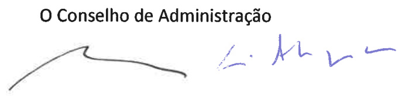  