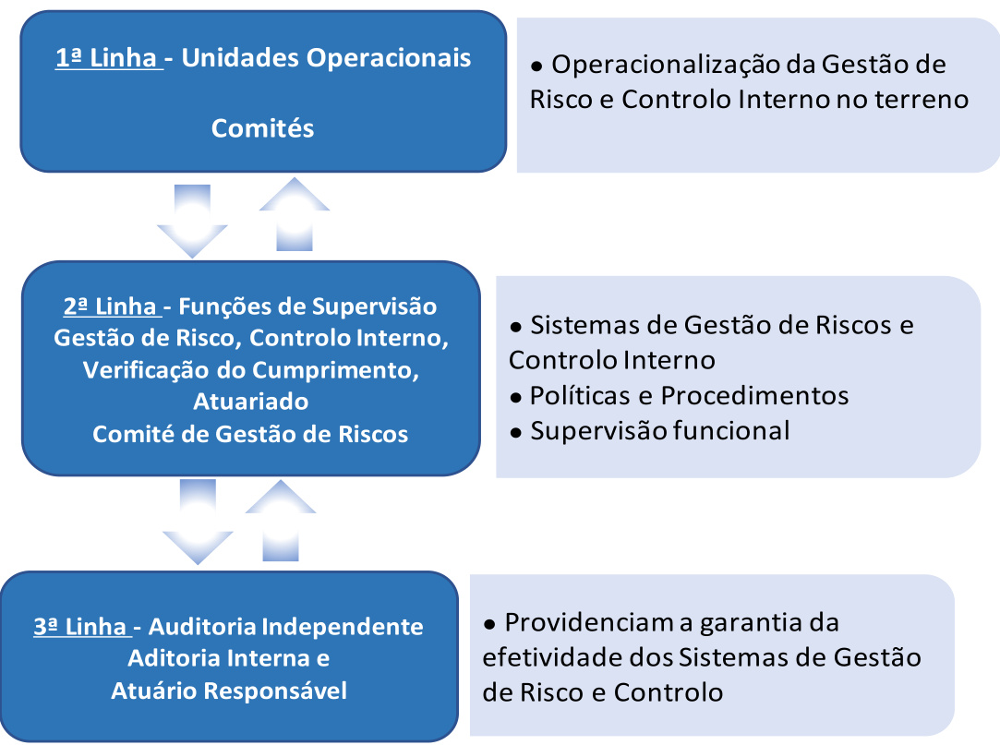

2023 VICTORIA – Seguros Vida, SA  

Nota Introdutória .. 8   
Resumo .11   
Introdução ... . 19   
1. Atividades e Desempenho . .. 20   
Atividade .. . 20   
1.1.1. Nome e forma jurídica da empresa . . 20   
Nome e dados de contacto da autoridade de supervisão .. . 20   
1.1.3. Nome e dados de contacto do auditor externo da empresa . 20   
Titulares de participações qualificadas e empresas participadas relevantes  ...... 20   
Posição ocupada no Grupo ... . 20   
Classes de negócio e zonas geográficas materiais . 21   
1.1.7. Atividades ou eventos significativos ocorridos ... 22   
Desempenho da Subscrição .. . 22   
1.2.1. Desempenho da actividade de  subscrição global e por classe de negócio e zona   
geográfica ...... . 22   
Desempenho dos investimentos.... . 25   
1.3.1. Rendimentos e despesas de investimentos por classe de ativos  .... . 25   
Informações sobre todos os ganhos e perdas reconhecidos diretamente em   
capitais próprios .... . 27   
Informações sobre quaisquer investimentos em titularizações  . .. 28   
Desempenho de outras atividades .. . 28   
1.4.1. Outros rendimentos e despesas relevantes ... . 28   
Eventuais informações adicionais ....... .. 28   
2. Sistema de Governação . . 29   
Informações gerais sobre o modelo de governação . . 29   
2.1.1. Estrutura do órgão de direção, administração ou supervisão da Companhia  ..... 29   
2.1.2. Alterações materiais no sistema de governação . .. 34   
2.1.3. Política e práticas de remuneração ... . 34   
2.1.4. Informações sobre transações materiais .... .. 35   
Requisitos de Qualificação e Idoneidade ... .. 35   
2.2.1. Principios de Qualificação e Idoneidade ..... .... 35   
Processo de avaliação da qualificação e da idoneidade  . . 36   
Sistema de Gestão de Riscos .. .. 38   
2.3.1. Estratégia, processos e procedimentos de reporte dos riscos  .. .. 38   
2.3.2. Integração do Sistema de Gestão de Riscos na estrutura organizacional e nos   
processos de tomada de decisão da Companhia ......... .... 41   
Processo de Avaliação Interna do Risco e da Solvência ..... . 44   
2.4.1. Descrição do Processo ORSA . .. 44   
2.4.2. Integração entre a gestão de capital e o sistema de gestão de risco  . . 45   
Determinação de necessidades de solvência tendo em conta o perfil de risco e   
gestão do capital . . 46   
Sistema de Controlo Interno .... . 46   
Função de Verificação do Cumprimento.... . 47   
Implementação da Função de Verificação do Cumprimento  ....... ... 47   
Atividades de verificação de cumprimento anual executadas  ..... ... 48   
Função de Auditoria Interna ....... . 49   
Implementação da função de auditoria interna . .. 49   
2.7.2. Independência e objetividade da função de auditoria interna ... 50   
Função Atuarial .. . 51   
2.8.1. Implementação da função atuarial . .. 51   
Subcontratação ....... ... 52   
2.9.1. Política de Subcontratação e principais serviços subcontratados  ... .. 52   
Avaliação da adequação do sistema de governo .... . 54   
Eventuais informações adicionais .. .. 54   
3. Perfil de Risco .. . 55   
Risco de Subscrição . . 59   
Descrição e medidas de avaliação do risco de subscrição .. 59   
Concentração do Risco de Subscrição .. 62   
Risco de Mercado.. . 62   
Medidas de avaliação do risco de mercado . 62   
Aplicação do princípio do gestor prudente sobre os ativos  ... . 64   
Concentração do Risco de Mercado .... ... 65   
Risco de Contraparte / Crédito . . 65   
3.3.1. Medidas de avaliação do risco de contraparte / crédito  ... . 65   
3.3.2. Concentração do Risco de Contraparte . . 67   
Risco de Liquidez .. .. 67   
3.4.1. Medidas de avaliação do risco de liquidez ...... ... 67   
Risco Operacional .. .. 68   
Medidas de avaliação do risco operacional .. 68   
Concentração do Risco Operacional .. . 70   
Outros riscos importantes . . 70   
Medidas de avaliação de outros riscos importantes .. 70   
Concentração de riscos importantes ...... . 72   
Técnicas de mitigação ... .. 72   
Métodos, hipóteses e resultados de testes de stress e análise de sensibilidade para grandes riscos   
. 73   
Outras informações relativas ao perfil de risco . . 74   
4. Avaliação Para Efeitos de Solvência . . 75   
Ativos . . 75   
Provisões Técnicas .... . 80   
Valores, bases, métodos e principais pressupostos de valorização da Melhor   
Estimativa e da Margem de Risco ....... .. 80   
4.2.1. ..83   
4.2.2. Nível de incerteza associado ao valor das provisões técnicas  ... .. 83   
Aplicação das medidas de transição ... . 84   
Montantes recuperáveis de resseguro . . 84   
Alterações importantes de pressupostos do cálculo das provisões técnicas  ...... 85   
Outra informação ..... .. 85   
Outras Responsabilidades .. . 85   
Métodos alternativos de avaliação ... . 87   
Informação adicional .. . 87   
5. Gestão do Capital .. .. 88   
Informação sobre os Fundos Próprios . .. 88   
5.1.1. Objetivos, Politica e Procedimentos de Fundos Próprios .. .. 88   
Estrutura, Valores e Qualidade dos Fundos Próprios . 88   
Montante de fundos próprios para cobertura do Requisito de Capital de   
Solvência (RCS) .... . 90   
5.1.4. Montante de fundos próprios para cobertura do Requisito de Capital Mínimo   
(RCM) ..... . 90   
5.1.5. Principais diferenças entre o excedente de activos sobre passivos e o capital   
próprio das demonstrações financeiras ....... . 90   
5.1.6. Montante e métodos de cálculo de fundos complementares .. 90   
5.1.7. Medidas transitórias de fundos próprios ..... .. 90   
Requisito de Capital de Solvência (RCS) e Requisito de Capital Minimo (RCM) ... . 91   
5.2.1. Montante de RCS por módulo de risco e cálculo do RCM . 91   
5.2.2. Utilização do sub -módulo de risco acionista baseado na duração para calcular o   
requisito de capital mínimo . .. 93   
Diferenças entre a fórmula padrão e qualquer modelo interno utilizado  ............ 93   
5.2.4. Incumprimento do Requisito de Capital Regulamentar e RCM  .... .. 93   
Eventuais informações adicionais .. .. 93   
6. Anexos .. . 95   
Declaração do Conselho de Administração . .. 103   
Certificação pelo Revisor Oficial de Contas . . 104   
Certificação pelo Atuário Responsável ... . 105  

# Lista de Figuras  

Figura 1: Organigrama e participações . 21   
Figura 2: Principais Indicadores ... 23   
Figura 3: Evolução dos PBE’s (2021, 2022 e 2023) 24   
Figura 4: Distribuição de PBE’s por Modalidade (dezembro 2023) .. 24   
Figura 5: Organograma da VICTORIA Vida (dezembro de 2023) . 30   
Figura 6: Framework de apetite ao risco ..... . 39   
Figura 7: Modelo das 3 linhas de defesa . 42   
Figura 8: Requisito de Capital de Solvência Base da VICTORIA Vida (dezembro 2023 e 2022) ................. 56   
Figura 9: Risco de Mercado da VICTORIA Vida (dezembro 2023 e 2022) .. . 56   
Figura 10: Etapas do processo operacional de gestão de incidentes .... .. 69  

# Lista de Tabelas  

Tabela 1: Distribuição da Carteira de investimentos .... 26   
Tabela 2: Classe de Ativos ... 27   
Tabela 3: Rendimentos e Gastos de Instrumentos Financeiros 27   
Tabela 4: Outros Ganhos e Perdas .... . 28   
Tabela 5: Requisito de Capital VICTORIA Vida . . 57   
Tabela 6: Requisito de Capital VICTORIA Vida com e sem medidas transitórias . 57   
Tabela 7: Detalhe do requisito de Capital VICTORIA Vida . 58   
Tabela 8: Classes e indicadores de risco de subscrição . .. 59   
Tabela 9: Carteira Vida . ... 60   
Tabela 10: RCS do Risco Específico de Seguros Vida .. 62   
Tabela 11: Classes e indicadores de risco de mercado . .. 63   
Tabela 12: Exposições ao risco de concentração ... 64   
Tabela 13: Risco de Mercado . ... 65   
Tabela 14: Classes e indicadores de risco de crédito .... .. 66   
Tabela 15: Distribuição dos investimentos por nível de rating . ... 66   
Tabela 16: Risco de Incumprimento da Contraparte.... . 67   
Tabela 17: Classes e indicadores de risco de liquidez . 68   
Tabela 18: Classes e indicadores de risco operacional . . 70   
Tabela 19: RCS Operacional .... .. 70   
Tabela 20: Classes e indicadores de outros riscos . 71   
Tabela 21: Balanço – Ativos ... . 76   
Tabela 22: Balanço – Passivos . . 80   
Tabela 23: Provisões Económicas, sem medidas de transição . .. 82   
Tabela 24: Valores estatutários vs. valores Solvência II . . 83   
Tabela 25: Margem de risco .. . 83   
Tabela 26: Valor da medida transitória relativa às Provisões Técnicas .. . 84   
Tabela 27: Recuperáveis de resseguro .. 85   
Tabela 28: Balanço – Outros Passivos . . 86   
Tabela 29: Fundos Próprios . 89   
Tabela 30: Reservas de Reconciliação . .. 89   
Tabela 31: Requisito Capital Solvência e Rácio de Solvência 91   
Tabela 32: Cálculo do Requisito de Capital de Solvência .. 92   
Tabela 33: Cálculo do Requisito de Capital Mínimo . . 92   
Tabela 34: Impacto das medidas transitórias Fundos Próprios ... 94   
Tabela 35: Cálculo do Requisito de Capital com medidas transitórias . 94  

O ano de 2023 continuou a ser marcado por um aumento dos riscos geopolíticos, em particular pelo impasse da guerra na Ucrânia e uma nova guerra no Médio Oriente, mas também pela deterioração da situação política em muitos países. Apesar destes crescentes riscos geopolíticos e do aumento dos riscos financeiros com o forte aperto monetário nos países ocidentais, o crescimento global acabou por registar apenas um ligeiro abrandamento em 2023, embora com alguma disparidade regional. As economias beneficiaram, por um lado, da atenuação do choque energético o que contribuiu para uma descida das taxas de inflação, e, por outro lado, de políticas orçamentais relativamente expansionistas. Embora os bancos centrais tenham continuado uma política monetária restritiva em 2023, começaram, no entanto, a sugerir no Outono que o fim do ciclo de subida das taxas estaria próximo, o que favoreceu um rali nos mercados financeiros no final do ano.  

O crescimento mundial abrandou ligeiramente em 2023 (para $3,1\%^{1}$ em média anual, após $3,5\%$ em 2022) embora, tal como referido tenham existido diferenças regionais.  

A aceleração da economia dos EUA foi provavelmente uma das maiores surpresas económicas do ano, com um crescimento do PIB de $2,\!5\%^{1}$ ao ano $(2022;1,9\%)$ , graças, em parte, a uma política orçamental expansionista. O consumo privado foi impulsionado pelo dinamismo do mercado de trabalho e utilização pelas famílias de parte das poupanças acumuladas durante a pandemia. As empresas americanas continuaram a beneficiar de preços de energia mais baixos e de subsídios governamentais para apoiar a (re)industrialização "verde".  

O dinamismo económico americano contrastou com a alguma estagnação na economia europeia. Apesar, do impacto positivo da atenuação da crise energética, graças à queda do preço do gás e ausência de perturbações nos stocks, sofreu, no entanto, uma perda de competitividade devido ao efeito negativo da subida das taxas de juro, principalmente nos setores da construção e imobiliário. No geral, o PIB deverá ter crescido $0{,}5\%^{1}$ em 2023 (2022: $3,4\%)$ . Este número esconde dinâmicas muito diferentes: a economia alemã, muito industrial, contraiu-se cerca de $0,3\%\,(2022;1,8\%),$ , enquanto as economias mais orientadas para os serviços viram o seu PIB crescer, em particular a França (cerca de $0.8\%$ face a $2,5\%$ no ano anterior) e Portugal por exemplo. Portugal superou de facto o crescimento médio da Zona Euro, apresentando um aumento de $2,\!1\%^{2}$ no PIB (2022: $6,8\%)$ ). Este crescimento assentou na resiliência da procura interna e na manutenção de algum dinamismo do setor exportador. A taxa de desemprego recuou de $6,7\%^{2}$ para $6,4\%$ e o saldo das contas públicas deverá apresentar um superavit de $1,1\%$ do PIB face a um défice de $0.3\%$ em 2022.  

Por seu lado, a China beneficiou da reabertura da sua economia no início de 2023, permitindo que o crescimento recuperasse para uma média anual de $5,2\%$ (após $3\%$ em 2022). No entanto, o crescimento permaneceu enfraquecido pelo efeito deflacionista da bolha imobiliária, e que levou as autoridades a flexibilizar a política orçamental e monetária. Destaca-se também o efeito positivo do desenvolvimento da produção ou, em particular de automóveis elétricos, que reforçou o setor exportador.  

O preço das matérias-primas (alimentares, industriais e energéticas) registou uma descida quase universal em 2023. Após a crise energética de 22, os preços do petróleo, mas especialmente os do gás caíram significativamente durante o ano, graças à combinação de vários fatores: procura limitada por um menor crescimento económico, um inverno ameno na Europa e melhoria da oferta). O preço do petróleo (Brent) perdeu $5\%$ em 2023, voltando a cair abaixo dos 80 dólares por barril. Esta descida dos preços das matérias-primas contribuiu significativamente para a descida acentuada da inflação em 2023. Na área do euro, desceu de uma média homóloga de $8,\!4\%^{3}$ em 2022 para $5,5\%$ em 2023. Nos Estados Unidos, a tendência é a mesma, com a inflação a descer de $8\%^{3}$ para $4,1\%$ em 2023. Portugal também apresentou um perfil inflacionista semelhante, tendo este indicador atingindo $5,3\%^{2}$ em média em 2023 (após $8,1\%$ em 2022).  

A pandemia de Covid-19 em 2020 e 21 e a crise energética de 2022, levaram os governos a medidas excecionais de apoio à economia, com natural impacto negativo nas contas públicas. Para 2023 era de esperar algum regresso a um maior controlo orçamental, o que efetivamente não aconteceu. Em diferentes graus, os governos mantiveram os défices públicos em níveis elevados, destacando-se o caso dos Estados Unidos que apresentaram uma deterioração do défice orçamental federal para $6,3\%$ do PIB em 2023. Os principais países da zona euro reduziram ligeiramente o seu défice público durante o ano. Simultaneamente, os bancos centrais mantiveram o controlo monetário que iniciaram em meados de 2022. A Reserva Federal nos EUA aumentou a sua taxa de juro de referência em 100 p.b., para $5,\!50\%$ em julho, e depois manteve-a inalterada. Um pouco atrás, o Banco Central Europeu, aumentou a taxa diretora em 200 p.b., atingido os $4\%$ em setembro.  

Apesar dos riscos geopolíticos e da continuação das políticas monetárias restritivas, os ativos financeiros obtiveram um bom desempenho em 2023. As principais classes de ativos financeiros, nomeadamente mercado monetário, obrigações soberanas e de empresas europeias e mercados acionistas europeus e norte-americanos registaram retornos positivos no ano. Os mercados viveram um episódio de stress em março de 2023, na sequência da falência de alguns bancos regionais dos EUA (SVB, First Republic...) seguida da aquisição do Credit Suisse pelo UBS. A resposta rápida das autoridades monetárias dos EUA – fornecendo liquidez aos bancos e garantindo implicitamente os depósitos dos bancos mais pequenos – ajudou a conter os receios dos investidores quanto à solidez do sistema financeiro. Também, a divulgação de más notícias sobre a situação financeira dos promotores imobiliários chineses teve um efeito reduzido nos mercados. Após estes episódios de stress, os mercados passaram a acreditar num cenário "cor-de-rosa" caracterizado por um abrandamento suave do crescimento e o regresso da inflação para os $2\%$ , o que permitiria aos bancos centrais começar o processo de redução das taxas de juro. Efetivamente no último trimestre a Reserva Federal deu como certo que as taxas de juro teriam atingido o seu máximo neste ciclo, o que contribuiu para uma valorização dos mercados no final do ano.  

Depois da queda em 2022, os índices de ações tiveram um desempenho excecional em 2023, tendo beneficiado de um certo entusiasmo pelas ações tecnológicas relacionadas com o tema emergente da Inteligência Artificial e, no final do ano, das expectativas de cortes de taxas por parte dos bancos centrais. O índice global de ações MSCI World teve uma performance de $21\small{,}8\%$ em dólares. O S&P500 superou os seus homólogos europeus com um ganho de $24,2\%$ em 2023, com o Eurostoxx50 e o PSI a subirem 19, $.2\%$ e $11,7\%$ , respetivamente. O MSCI Emerging Markets subiu mais moderadamente $7,1\%$ ao longo do ano, arrastado por algumas ações asiáticas (China em particular).  

Após a sua forte subida em 2022, as taxas de juro europeias a 10 anos caíram em 2023 (-54 pontos base na taxa alemã e -95 pontos base na taxa portuguesa), enquanto a taxa de juro a 10 anos nos EUA quase estabilizou. No entanto, estas variações ocultam movimentos significativos ao longo do ano, com uma tendência ascendente das taxas de juro de longo prazo até ao setembro, antes de uma descida significativa no final do ano. As taxas de juro a 10 anos atingiram um pico em meados de outubro, com $2,\!97\%$ para a taxa alemã a 10 anos e $4{,}98\%$ para a taxa de rendibilidade a 10 anos dos EUA.  

A mudança de tom do Reserva Federal e o aumento das expectativas dos investidores em relação ao futuro das taxas de juro levaram a um rali dos títulos no final do ano. As yields alemã, portuguesa e norte-americana a 10 anos terminaram o ano em $2,\!02\%$ , $2,\!63\%$ e $3,88\%$ , respetivamente. As taxas de rendibilidade das obrigações de empresas seguiram a mesma tendência, subindo no primeiro semestre do ano, antes de descerem significativamente no final do ano. O índice Bloomberg de Obrigações Soberana Euro subiu $7,1\%,$ , enquanto o índice iBoxx de Obrigações de Empresas Euro subiu $8,2\%$ .  

O preço do ouro fechou o ano em 2.072 USD, uma valorização de $^{13,4\%}$ em relação ao ano de 2023. Depois de valorizar em 2022, o dólar perdeu valor no ano em relação à maioria das principais moedas, como resultado da retórica mais branda da Reserva Federal. O euro ganhou 3,3 e encerrou a cotar nos 1,1064 dólares/euro.  

# Atividade  

A VICTORIA – Seguros de Vida, S.A. é uma sociedade anónima pertencente à holding VICTORIA Internacional de Portugal, S.G.P.S, S.A. que por sua vez pertence maioritariamente à SMABTP e à SMAVie BTP (SMA) com sede social em Paris, França.  

A SMA opera em todas as linhas de negócio Vida e Não Vida, e é, em conjunto com as mútuas filiadas à SGAMBTP, líder no setor de seguros de construção em França. A aquisição da VICTORIA Vida enquadrou-se na estratégia de crescimento e diversificação da SMA.  

Relativamente à atividade da VICTORIA – Seguros de Vida, esta é exercida em Portugal desde 1930 e em Espanha desde 2016 em livre prestação de serviços. Em Portugal explora todas as modalidades de seguro de vida, nomeadamente os produtos tradicionais, produtos financeiros, planos de poupança reforma, rendas e todas as formas de planos de previdência. Assume ainda, no âmbito da legislação aplicável, a gestão de fundos de pensões. O resseguro aceite não é explorado pela VICTORIA.  

Ao nível das participações, a Companhia detém uma quota representativa de $59\%$ do capital social da sociedade SELICOMI Portugal, Lda., cuja atividade tem por objeto a compra e venda de bens imóveis, bem como a exploração e gestão, nomeadamente o arrendamento, dos mesmos.  

Os principais indicadores de desempenho da VICTORIA Vida em 2023, foram os seguintes:  

  

A VICTORIA-Seguros de Vida, S.A manteve-se fiel à estratégia de comercialização e perfil de carteira dos últimos anos.  

No tocante à distribuição do negócio – e porque o mercado mais tradicional da intermediação seguradora prossegue com a sua particular metamorfose - a VICTORIA adaptou o seu modelo de acompanhamento no terreno dos canais de agentes e corretores, multiplicando a presença junto dos profissionais mais proativos e reequacionando a sua proposta de valor para o resto. No âmbito dos novos canais, o ano de 2023 significou, a partir do terceiro trimestre, o fim da parceria de cinco anos com o EuroBic. Pela sua vez, o canal exclusivo de pessoais manteve o foco no desenvolvimento de consultores especialistas na mitigação dos riscos derivados da perda de rendimentos. Ainda em relação ao negócio, foi possível finalizar a primeira fase do projeto de automatização e sistematização da ação comercial, avançar nos projetos de simuladoresemissores e ampliar o número de ligações web com os distribuidores.  

A nível de desempenho e evolução da atividade, apresentamos a evolução dos seguintes indicadores:  

Em Prémios Brutos Emitidos1, a Companhia apresenta em dezembro de 2023 valores superiores em $1\%$ face ao período homólogo (2023: 42.093 mil de euros vs. 2022: 41.694 mil de euros);   
Os montantes pagos de sinistros totalizaram 25.462 mil euros, um aumento de $0{,}4\%$ comparativamente com 2022 (25.369 mil euros);   
O resultado líquido do exercício em 2023, de acordo com a norma contabilística em vigor a partir de 1 de janeiro de 2023 (IFRS 17), foi de 2.213 mil euros. Comparativamente, em 2022 o RLE foi de -1.135 mil euros (2022 em IFRS 4: 843 mil euros).  

# Sistema de Governação  

A Companhia dispõe de uma estrutura de governo composto por uma Assembleia Geral, um Conselho de Administração, uma Comissão Executiva do Conselho de Administração, um Conselho Fiscal e um Revisor Oficial de Contas. A Comissão Executiva do Conselho de Administração é apoiada por uma estrutura organizacional adequada de acordo com o modelo das três linhas de defesa e por um conjunto de Comités estabelecidos para endereçar diferentes temas e riscos.  

A estrutura organizativa é adequada à dimensão e complexidade do negócio e dos riscos, sendo a principal responsabilidade dos diretores, também designados de Diretores de Topo, planear, coordenar e controlar as atividades desenvolvidas pelas respetivas áreas no âmbito das suas responsabilidades de acordo com o plano estratégico da Companhia, legislação, normativos e sistemas aplicáveis e orientações emanadas pelo Grupo.  

A nível de políticas da Companhia, as mesmas encontram-se alinhadas com as Políticas da SMA e têm por base as recomendações e linhas de orientação da Diretiva de Solvência II e respetivos Atos Delegados.  

As funções chave dispõem de autoridade, recursos e independência operacional para desempenhar as suas funções. As funções chave podem comunicar com qualquer colaborador e ter acesso a toda a informação relevante para o adequado desempenho da sua função. O Conselho de Administração é informado, numa base mínima anual, das principais atividades das funções chave.  

Prestar assistência ao órgão de direção, administração ou supervisão e outras funções no âmbito do funcionamento eficaz do sistema de gestão de riscos;   
Monitorizar o Sistema de Gestão de Riscos;   
Monitorizar o perfil de risco geral da Companhia como um todo;   
Efetuar a comunicação de informações pormenorizadas sobre exposições ao risco e aconselhar o órgão de direção, administração ou supervisão em matéria de gestão de riscos, incluindo no atinente a questões estratégicas, como a estratégia empresarial, fusões e aquisições e grandes projetos e investimentos;   
Identificar e avaliar os riscos emergentes.  

O Sistema de Gestão de Riscos assenta numa política de gestão de riscos adequada à natureza, dimensão e complexidade dos riscos a que se encontra exposta e devidamente alinhada com as políticas da SMA. O Sistema de Gestão de Riscos contém instrumentos de natureza estratégica e operacional.  

Tendo em conta a dimensão da empresa, considera-se que a estrutura organizacional desta garante a existência e desenvolvimento contínuo, adequado e eficaz numa gestão baseada no conhecimento do risco, em linha com os princípios de Solvência II, controlando e minimizando os riscos decorrentes da atuação da VICTORIA nas suas diversas vertentes.  

# Perfil de Risco  

Desde 1 de janeiro de 2016, data de implementação do regime Solvência II, que a Companhia determina o seu requisito de capital de solvência (RCS) com base na fórmula padrão, considerando-se que este, à data, reflete, de forma apropriada, os principais tipos e categorias de risco a que a Companhia se encontra exposta. Estes riscos, bem como outros identificados pela Companhia, encontram-se sujeitos a mecanismos de avaliação e gestão adequados, procedendo-se à sua monitorização regular e quando adequado à aplicação de ações adicionais.  

A partir de dezembro de 2019, com autorização da entidade supervisora, Autoridade de Supervisão de Seguros e Fundos de Pensões, doravante designada ASF, a Companhia passou a utilizar o Ajustamento de Volatilidade, doravante designado VA, no cálculo do seu requisito de capital de solvência. Todos os valores apresentados no presente capítulo para o ano de 2023, 2022 e 2021 já incorporam o ajustamento da volatilidade.  

A dezembro de 2023 a VICTORIA Vida apresenta o seguinte perfil de risco:  

  

  

Pela natureza do negócio os principais riscos da Companhia estão concentrados no Risco de Mercado e no Risco Específico de Seguros de Vida, sendo que o maior risco a que a Companhia se encontra exposta é o Risco de Mercado, representando $70,5\%$ do Requisito Capital Solvência Base, doravante representado por RCSB, (antes de diversificação). O Risco Imobiliário e o Risco de Spread são os dois maiores riscos totalizando $46,0\%$ e $24,7\%$ do total do Risco de Mercado.  

A Companhia aplicou o regime transitório, previsto no artigo 25.º da Lei n.º 147/2015, de 9 de setembro, às provisões técnicas através das medidas de garantia de longo prazo. Esta Medida foi aplicada às responsabilidades de natureza vida dos grupos de “Seguros com Participação nos Resultados” e “Outros Seguros de Vida”.  

Quando comparamos os valores finais de 2023 com e sem medidas transitórias e com e sem VA, os resultados são os seguintes:  

(Un: Milhares de euros)  

<html><body><table><tr><td rowspan="2"></td><td colspan="2">Sem VA</td><td colspan="2">Com VA</td></tr><tr><td>SemMT</td><td>Com MT</td><td>Sem MT</td><td>Com MT</td></tr><tr><td>Requisito de Capital de Solvencia(RCS)</td><td>20 521</td><td>20014</td><td>19837</td><td>19 433</td></tr><tr><td>Surplus</td><td>10803</td><td>12 701</td><td>13 237</td><td>15 032</td></tr><tr><td>RacioRCS</td><td>152,6%</td><td>163,5%</td><td>166,7%</td><td>177,4%</td></tr><tr><td>Requisito deCapital Minimo(RCM)</td><td>7875</td><td>7872</td><td>7817</td><td>7814</td></tr><tr><td>RacioRCM</td><td>354,3%</td><td>372,1%</td><td>379,2%</td><td>397,1%</td></tr><tr><td>FundosPropriosElegiveisparaRCS</td><td>31324</td><td>32715</td><td>33073</td><td>34 464</td></tr><tr><td>FundosPropriosElegiveisparaRCM</td><td>27899</td><td>29 290</td><td>29637</td><td>31027</td></tr></table></body></html>  

Uma análise aos ajustamentos efetuados ao balanço estatutário permite relacionar o excesso de ativo sobre passivo das Demonstrações Financeiras com o excesso de Ativos sobre Passivos de Solvência II da seguinte forma:  

(Un: Milhares de euros)  

<html><body><table><tr><td rowspan="2"></td><td colspan="2">SemVA</td><td colspan="2">Com VA</td></tr><tr><td>Sem MT</td><td>ComMT</td><td>SemMT</td><td>ComMT</td></tr><tr><td>FundosPropriosSl(Estatutarios)</td><td>31806</td><td>31806</td><td>31806</td><td>31806</td></tr><tr><td>Custos de aquisicao diferidos</td><td>-145</td><td>-145</td><td>-145</td><td>-145</td></tr><tr><td>Ativos Intangiveis</td><td>-5 361</td><td>-5 361</td><td>-5 361</td><td>-5 361</td></tr><tr><td>Justovalordosativos</td><td>2763</td><td>2763</td><td>2763</td><td>2763</td></tr><tr><td>Excedente Beneficios Fundos dePensoes + Outros</td><td>-19</td><td>-19</td><td>305</td><td>305</td></tr><tr><td>Impostos Diferidos</td><td>1524</td><td>1 121</td><td>1017</td><td>613</td></tr><tr><td>Recuperaveis de Resseguro</td><td>-61</td><td>-61</td><td>-61</td><td>-61</td></tr><tr><td>Provisoes Técnicas</td><td>-3 952</td><td>-2 157</td><td>-2 019</td><td>-224</td></tr><tr><td>Fundos Proprios de Sll</td><td>26 555</td><td>27946</td><td>28305</td><td>29 696</td></tr><tr><td>Limitacao Tier 3</td><td>0</td><td>0</td><td>0</td><td>0</td></tr><tr><td>Tier 2</td><td>5000</td><td>5000</td><td>5000</td><td>5000</td></tr><tr><td>Outros</td><td>231</td><td>231</td><td>231</td><td>231</td></tr><tr><td>FundosPropriosElegiveisdeSll</td><td>31324</td><td>32715</td><td>33073</td><td>34464</td></tr></table></body></html>  

<html><body><table><tr><td rowspan="2"></td><td colspan="2">Sem VA</td><td colspan="2">Com VA</td></tr><tr><td>Sem MT</td><td>Com MT</td><td>Sem MT</td><td>Com MT</td></tr><tr><td>Requisito de Capital de Solvencia (RcS)</td><td>20 521</td><td>20014</td><td>19837</td><td>19433</td></tr><tr><td>Risco Operacional</td><td>1479</td><td>1479</td><td>1479</td><td>1479</td></tr><tr><td>Ajustamento Capacidade de absorcao (Imp. Dif. e PT's)</td><td>-1842</td><td>-2349</td><td>-2416</td><td>-2820</td></tr><tr><td>RCSB</td><td>20 884</td><td>20 884</td><td>0</td><td>20774</td></tr><tr><td>Diversificacao</td><td>4418</td><td>4418</td><td>25 166</td><td>-4 392</td></tr><tr><td>Risco de Mercado</td><td>17817</td><td>17817</td><td>17728</td><td>17728</td></tr><tr><td>Diversificacao</td><td>-5 759</td><td>-5 759</td><td>-5 716</td><td>-5 716</td></tr><tr><td>Taxa de Juro</td><td>3052</td><td>3052</td><td>2919</td><td>2919</td></tr><tr><td>Acionista</td><td>1284</td><td>1284</td><td>1284</td><td>1284</td></tr><tr><td>Imobiliario</td><td>10 794</td><td>10 794</td><td>10 794</td><td>10 794</td></tr><tr><td>Spread</td><td>5 779</td><td>5 779</td><td>5 779</td><td>5 779</td></tr><tr><td>Cambial</td><td>128</td><td>128</td><td>128</td><td>128</td></tr><tr><td>Concentracao</td><td>2540</td><td>2540</td><td>2540</td><td>2540</td></tr><tr><td>Risco de Incumprimento pela Contraparte</td><td>377</td><td>377</td><td>377</td><td>377</td></tr><tr><td>Diversificacao</td><td>5</td><td>5</td><td>5</td><td>-5</td></tr><tr><td>Tipo 1</td><td>363</td><td>363</td><td>363</td><td>363</td></tr><tr><td>Tipo 2</td><td>19</td><td>19</td><td>19</td><td>19</td></tr><tr><td>Risco especifico dos seguros de vida</td><td>7108</td><td>7108</td><td>7060</td><td>7060</td></tr><tr><td>Diversificacao</td><td>4 712</td><td>4712</td><td>4719</td><td>-4 719</td></tr><tr><td>Mortalidade</td><td>872</td><td>872</td><td>866</td><td>866</td></tr><tr><td>Longevidade</td><td>2 194</td><td>2194</td><td>2 125</td><td>2 125</td></tr><tr><td>Invalidez</td><td>1375</td><td>1375</td><td>1369</td><td>1369</td></tr><tr><td>Descontinuidade</td><td>1367</td><td>1367</td><td>1602</td><td>1602</td></tr><tr><td>Despesas</td><td>2543</td><td>2543</td><td>2353</td><td>2353</td></tr><tr><td>Revisao</td><td>0</td><td>0</td><td>0</td><td>0</td></tr><tr><td>Catastrofico</td><td>3468</td><td>3468</td><td>3463</td><td>3463</td></tr></table></body></html>  

# Avaliação para efeitos de Solvência  

Em relação aos ativos, provisões técnicas e outros passivos, são descritas as bases, métodos e principais pressupostos usados na sua avaliação para efeitos de solvência, bem como a sua comparação com aquela que é usada nas demonstrações financeiras.  

<html><body><table><tr><td>2023</td><td>Solvenciall</td><td>Estatutarios</td></tr><tr><td>Ativos</td><td>224253</td><td>226173</td></tr><tr><td>ProvisoesTecnicas-Vida</td><td>154249</td><td>154343</td></tr><tr><td>ProvisoesTecnicas-contratosligadosaindiceseaunidadesdeparticipacao</td><td>18 464</td><td>18147</td></tr></table></body></html>  

A VICTORIA Vida aplica a medida de transição relativa às provisões técnicas, a qual se encontra aprovada pela Autoridade de Supervisão de Seguros e Fundos de Pensões, doravante designada ASF.  

Em 2022 a Companhia procedeu ao recálculo da medida de transição sobre as provisões técnicas. Tendo em conta o resultado obtido a medida foi aplicada sobre a responsabilidade apurada com base na melhor estimativa no montante de 1.795 mil euros (1.994 mil euros em 2022).  

Desde dezembro de 2019, a Companhia utiliza o Ajustamento de Volatilidade, no cálculo do seu requisito de capital de solvência.  

# Gestão de Capital  

Em 2023, a Companhia dispunha de fundos próprios de base de nível 1 e nível 2 compreendendo estes essencialmente capital social ordinário, prémio de emissão relacionado com o capital ordinário, reserva de reconciliação e empréstimos subordinados.  

Em 2023 a Companhia continua a dispor de fundos próprios de nível 2, referentes ao empréstimo subordinado contraído junto da VICTORIA Seguros, SA, no montante de 5.000 mil euros. O empréstimo foi emitido a 12 de agosto de 2020 com uma maturidade de 10 anos e uma taxa de juro fixa de $4\%$ ao ano.  

A 31 de dezembro de 2020, com o objetivo de reforçar os Fundos Próprios, e considerando os artigos $17^{\circ}\in18^{\circ}$ do Regulamento delegado (EU) $\mathsf{n}^{\mathsf{o}}\,2015/35$ da Comissão, de 10 de outubro de 2014 (Regulamento Delegado), a Companhia procedeu à alteração dos limites contratuais de um universo de contratos vida temporário anual renovável (TAR).  

Em termos regulamentares os fundos próprios elegíveis para cobrir o Requisito de Capital Mínimo, doravante designado RCM apresentam critérios mais restritos em termos de limites e níveis, são compostos pela totalidade dos elementos nível 1 não restritos e pelo montante elegível de nível 2.  

Os requisitos de capital são calculados tendo por base a fórmula padrão. A 31 de dezembro de 2023 o Requisito de Capital de Solvência, doravante designado RCS líquido era de 19.432 mil euros e o RMC de 7.814 mil euros. Tendo em consideração os fundos próprios elegíveis referidos anteriormente a Companhia apresenta um rácio de fundos próprios elegíveis para o RCS de $^{177,4\%}$ e um rácio de fundos próprios elegíveis para o RMC de $397,1\%$ .  

(Un: Milhares de euros)   

<html><body><table><tr><td>RaciodeSolvencia</td><td>2021</td><td>2022</td><td>2023</td></tr><tr><td>FundosProprioselegiveis(RCS)</td><td>33466</td><td>40897</td><td>34 464</td></tr><tr><td>Requisito de Capital de Solvencia Base (RCSB)</td><td>21373</td><td>21 055</td><td>20 774</td></tr><tr><td>Risco Operacional</td><td>1 424</td><td>1459</td><td>1479</td></tr><tr><td>AjustamentoProvisoesTécnicas</td><td>-244</td><td>-371</td><td>-620</td></tr><tr><td>Ajustamento Impostos Diferidos</td><td>-514</td><td>-3 216</td><td>-2200</td></tr><tr><td>Requisito de Capital de Solvencia (RCS)</td><td>22039</td><td>18926</td><td>19 433</td></tr><tr><td>Racio de Capital de Solvencia</td><td>151,8%</td><td>216,1%</td><td>177,4%</td></tr><tr><td>Fundos Proprios elegiveis(RMC)</td><td>30235</td><td>37459</td><td>31027</td></tr><tr><td>Requisito Minimo de Capital (RMC)</td><td>8845</td><td>7808</td><td>7814</td></tr><tr><td>Racio de Capital Minimo</td><td>341,8%</td><td>479,8%</td><td>397,1%</td></tr></table></body></html>  

O presente relatório sobre a solvência e a situação financeira foi desenvolvido de acordo com a Lei nº 147/2015 de 9 de setembro que transpôs para o ordenamento jurídico português a Diretiva 2009/138/CE do Parlamento Europeu e do Conselho Europeu, também denominada “Diretiva Solvência II”.  

O documento é aplicável à VICTORIA – Seguros de Vida, S.A., doravante designada por VICTORIA Vida ou Companhia.  

O conteúdo do mesmo é referente à atividade da VICTORIA Vida no ano de 2023, sendo reportado um conjunto de informação sobre a sua atividade e desempenho, sistema de governação, perfil de risco, avaliação para efeitos de solvência e gestão do capital. A sua estrutura tem por base o Anexo XX do Regulamento Delegado (EU) 2015/35 da Comissão, doravante designado Regulamento Delegado, contudo a sua disposição de subcapítulos segue as indicações do template do relatório da SMA.  

O Relatório Sobre a Solvência e a Situação Financeira, doravante designado RSSF, tem como objetivo divulgar publicamente informação clara, objetiva e útil, que possibilita o reconhecimento do negócio e performance da Companhia, das estruturas de governação e inclui, para cada categoria, informação sobre os montantes de exposição ao risco, situações de concentração, estratégias de mitigação e análises de sensibilidade.  

Todos os valores apresentados nas tabelas do RSSF estão denominados em milhares de euros, salvo se algo mencionado em contrário.  

A informação quantitativa e qualitativa do presente ano, e a de anos anteriores, desde a implementação da Diretiva de Solvência II, poderá ser consultada no portal da Companhia (www.victoria-seguros.pt/).  

# 1. Atividades e Desempenho  

# Atividade  

# Nome e forma jurídica da empresa  

A VICTORIA – Seguros de Vida, S.A. é uma sociedade anónima pertencente à holding VICTORIA Internacional de Portugal, S.G.P.S. S.A. que por sua vez pertence maioritariamente à SMABTP e à SMAVie BTP (SMA) com sede social em Paris, França.  

# Nome e dados de contacto da autoridade de supervisão  

A supervisão da VICTORIA Vida é realizada pela Autoridade de Supervisão de Seguros e Fundos de Pensões (ASF), tendo os seguintes dados de contacto: Av. da República, 76, 1600-205 Lisboa, Telefone: 21 790 31 00.  

Adicionalmente, a supervisão da SMA é realizada pela Autorité de Contrôle Prudentiel et de Résolution, doravante designada ACPR, tendo os seguintes dados de contato: 61 rue de Taitbout, 75436 Paris Cedex 09 France, Telefone: $+(33)$ 1 49 95 40 00.  

# Nome e dados de contacto do auditor externo da empresa  

O auditor externo é a Deloitte & Associados, SROC S.A., tendo os seguintes dados de contacto: Av. Eng. Duarte Pacheco, 1070-100 Lisboa, Telefone: 210 422 500.  

Titulares de participações qualificadas e empresas  

participadas relevantes  

O capital social da Companhia é integralmente detido pela VICTORIA Internacional de Portugal S.G.P.S. S.A.  

Ao nível das participações, em 2014, a Companhia adquiriu uma quota representativa de $59\%$ do capital social da sociedade SELICOMI Portugal, Lda., cuja atividade tem por objeto a compra e venda de bens imóveis, bem como a exploração e gestão, nomeadamente o arrendamento, dos mesmos.  

# Posição ocupada no Grupo  

A SMA opera em todas as linhas de negócio Vida e Não Vida, e é, em conjunto com as mútuas filiadas à SGAMBTP, líder no setor de seguros de construção em França. A aquisição da VICTORIA Vida enquadrou-se na estratégia de crescimento e diversificação da SMA.  

Em Portugal, o Grupo é representado por um único acionista, VICTORIA Internacional de Portugal S.G.P.S., S.A. que detém a totalidade do capital social da VICTORIA – Seguros de Vida, S.A. e da VICTORIA – Seguros, S.A. As duas Companhias de seguros utilizam estruturas comuns, com uma colaboração muito estreita nas áreas administrativa e comercial.  

  
Figura 1: Organigrama e participações  

# Classes de negócio e zonas geográficas materiais  

A Companhia exerce a sua atividade em Portugal desde 1930 e em Espanha desde 2016. Em Portugal explora todas as modalidades de seguro de vida, nomeadamente os produtos tradicionais, produtos financeiros, planos de poupança reforma, rendas e todas as formas de planos de previdência. Assume ainda, no âmbito da legislação aplicável, a gestão de fundos de pensões.  

Em Espanha o exercício da atividade seguradora da Companhia é efetuado em regime de livre prestação de serviços a partir da sede nos seguintes seguros e operações do ramo vida: Seguro de vida, seguros ligados a fundos de investimento, e operações de gestão de fundos coletivos de reforma, conforme classificado no Anexo II à Diretiva 2009/138/CE de 25 de novembro.  

# Atividades ou eventos significativos ocorridos  

Em 2023, foram diversos os projetos e iniciativas desenvolvidas, que contribuíram para uma contínua melhoria da Companhia no seu funcionamento e relacionamento com os clientes. Destaca-se assim as seguintes atividades:  

Reporte quantitativo e narrativo anual (RSSF) integral;   
Reporte quantitativo trimestral;   
Elaboração e respetiva submissão de um conjunto reportes extraordinários requeridos pela autoridade de supervisão;   
Certificação por parte do Revisor Oficial de Contas e dos Atuários Responsáveis dos resultados de Solvabilidade, bem como da informação a disponibilizar ao público; Revisão anual da matriz de grandes riscos, mantendo o alinhamento da mesma com a metodologia do Grupo e métricas de solvência II de forma a monitorizar de perto e mitigar a exposição aos riscos de maior impacto;   
Revisão anual das políticas existentes garantindo o contínuo alinhamento com o Grupo; Elaboração do reporte Avaliação Interna do Risco e da Solvência, a nível solo e de grupo, permitindo analisar e dar suporte à tomada de decisão para a estratégia definida para os próximos 5 anos e no qual foram pela primeira vez integradas dimensões ESG; Manteve-se a nível do Grupo um Comité específico de Qualidade de Dados, reunindo todas as filiais do Grupo e garantindo o cumprimento de um adequado desenvolvimento e implementação de uma Política de Qualidade de Dados. Com isto, pretende-se garantir a fiabilidade dos valores apurados em termos de solvência e gestão do negócio, nomeadamente com a identificação dos dados sensíveis e respetivos controlos.  

Durante o ano de 2023, um dos maiores focos da Empresa manteve-se na garantia de adaptação ao novo âmbito contabilístico, determinado pelas normas IFRS 17 e 9.  

# Desempenho da Subscrição  

Desempenho da actividade de  subscrição global e por classe de negócio e zona geográfica  

A VICTORIA-Seguros de Vida, S.A manteve-se fiel à estratégia de comercialização e perfil de carteira dos últimos anos. Manteve-se a aposta estratégica na comercialização de seguros de vida risco e relativamente aos seguros de rendas vitalícias mantiveram-se as regras de subscrição que impõem condicionalismos à comercialização deste tipo de seguros apesar da acentuada subida das taxas de juro registada.  

No que se refere a seguros financeiros manteve-se também o acompanhamento à exposição ao risco de taxa de juro ao que acresceu o desempenho desfavorável e errático dos mercados acionistas. A VICTORIA manteve a sua estratégia de comercialização de seguros financeiros para financiamento de planos de pensões.  

Concluída em 2021 a ação de de-risking dos contratos do produto VICTORIA Vantagem Investimento que garantiam uma taxa de $2\%$ , em 2022 e tal como previsto, procedeu-se à sua implementação, resultando desta operação a transferência de grande parte da carteira para contratos com garantias inferiores.  

No tocante à distribuição do negócio – e porque o mercado mais tradicional da intermediação seguradora prossegue com a sua particular metamorfose - a VICTORIA adaptou o seu modelo de acompanhamento no terreno dos canais de agentes e corretores, multiplicando a presença junto dos profissionais mais proativos e reequacionando a sua proposta de valor para o resto. No âmbito dos novos canais, o ano de 2023 significou, a partir do terceiro trimestre, o fim da parceria de cinco anos com o EuroBic. Pela sua vez, o canal exclusivo de pessoais manteve o foco no desenvolvimento de consultores especialistas na mitigação dos riscos derivados da perda de rendimentos. Ainda em relação ao negócio, foi possível finalizar a primeira fase do projeto de automatização e sistematização da ação comercial, avançar nos projetos de simuladoresemissores e ampliar o número de ligações web com os distribuidores.  

dicadores de desempenho da VICTORIA Vida em 2023, foram o  

  
Figura 2: Principais Indicadores  

Prémios Brutos Emitidos  

O mercado apresenta um volume de prémios no ramo Vida de 5,1 mil milhões de euros, representando um decréscimo de $14,5\%$ relativamente a 2022. Os seguros ligados a fundos de investimento, com um montante global de 1,4 mil milhões de euros, registaram uma queda de $54,5\%$ face a 2022, passando a representar apenas $28,0\%$ do Ramo Vida $[52,6\%$ em 2022). Os planos de poupança reforma representarem $24,\!8\%$ do total do Ramo Vida, registando uma redução da sua produção de $11,5\%$ . O desempenho dos mercados financeiros terá assim contribuído para a volatilidade do Ramo Vida.  

A nível de Prémios Brutos Emitidos1, a Companhia apresenta em dezembro de 2023 valores superiores em $1\%$ face ao período homólogo (2023: 42.093 mil de euros vs. 2022: 41.694 mil de euros), explicados pelo aumento de $1,3\%$ em contratos de seguro e de $0,\!1\%$ em contratos de investimento. Em 2023 a VICTORIA – Seguros de Vida, S.A. consolidou a sua presença no mercado, alcançando $0.8\%$ de quota de mercado.  

(Un: Milhares de euros)  

  
Figura 3: Evolução dos PBE’s (2021, 2022 e 2023)  

No que diz respeito à composição da carteira, comparativamente com o ano anterior, a estrutura mantêm-se sendo os produtos financeiros os mais representativos com $50\%$ (2022: $48\%$ ), seguidos dos seguros de Vida Risco, em que o peso aumenta ligeiramente de $35\%$ em 2022 para $36\%$ em 2023. Os seguros mistos e rendas representam $11\%$ e $4\%$ em 2023 (2022: Seguros Mistos: $12\%$ e Rendas: $5\%$ ).  

  
Composicao da Carteira 2023   
Figura 4: Distribuição de PBE’s por Modalidade (dezembro 2023)  

A VICTORIA iniciou em 2016, junto das autoridades competentes, o processo de autorização para explorar em Espanha, em regime de Livre Prestação de Serviços, todas as modalidades de seguro de vida. O impacto desse negócio, na receita de prémios de 2023 foi de cerca de 47 mil euros (2022: 50 mil euros).  

# Desempenho dos investimentos  

A gestão de investimentos da VICTORIA é efetuada através de mandatos celebrados com a empresa SMA Vie, pertencente também à SMA. No ano corrente manteve-se a linha orientadora da estratégia de investimentos, continuando a dar prioridade à seleção de ativos com valor (em alternativa a uma simples seleção de classes de ativos) e implementada consistentemente através de uma agregação de oportunidades de valor e restringida pelas características técnicas e legais das carteiras de investimento, alicerçada numa elevada solidez financeira. A gestão foi acompanhada de forma regular pelo Comité de Gestão Ativo Passivo, constituído por representantes das áreas Financeira, Atuarial, Técnica e de Gestão de Risco. Foram também definidos mecanismos locais de monitorização do risco de crédito e do risco de taxa de juro para acompanhamento do efeito na cobertura da margem de solvência.  

Rendimentos e despesas de investimentos por classe de  

# ativos  

A carteira de investimentos da Companhia atingiu, no final de 2023, o montante de 216.541 mil euros que se concentrou maioritariamente na rubrica Obrigações com 59, $14\%$ . O investimento em Imóveis corresponde a 19, $03\%$ e as aplicações em fundos de investimento registaram um decréscimo acréscimo no peso da carteira de $5,\!4\%$ em 2022 para 75, $4\%$ em 2023.  

A carteira de investimentos apresenta a seguinte distribuição:   

<html><body><table><tr><td>Balanco Sll</td><td>2021</td><td>2022</td><td>2023</td></tr><tr><td>ImoveisdeRendimento</td><td>1906</td><td>1790</td><td>1449</td></tr><tr><td>Investimentos (outros que nao Unit-linked)</td><td>207 573</td><td>186 304</td><td>186 176</td></tr><tr><td>Imoveis de uso proprio</td><td>37095</td><td>37096</td><td>39619</td></tr><tr><td>Participacoes</td><td>3003</td><td>2708</td><td>2659</td></tr><tr><td>Acoes</td><td>0</td><td>0</td><td>0</td></tr><tr><td>Obrigacoes</td><td>148 067</td><td>134 934</td><td>127 906</td></tr><tr><td>Emissores Publicos</td><td>46 954</td><td>36 754</td><td>26 635</td></tr><tr><td>EmissoresPrivados</td><td>101 114</td><td>98180</td><td>101 270</td></tr><tr><td>Obrigacoes Estruturadas</td><td>0</td><td>0</td><td>0</td></tr><tr><td>FundosdeInvestimentos</td><td>19 408</td><td>11 566</td><td>15 992</td></tr><tr><td>Derivados</td><td>0</td><td>0</td><td>0</td></tr><tr><td>Depositos</td><td>0</td><td>0</td><td>0</td></tr><tr><td>Ativos de Unit-Linked</td><td>14 214</td><td>15 013</td><td>18 147</td></tr><tr><td>Emprestimos</td><td>7718</td><td>7715</td><td>8104</td></tr><tr><td>Empréstimos sobre apolices</td><td>109</td><td>94</td><td>78</td></tr><tr><td>Outros Emprestimos</td><td>7609</td><td>7621</td><td>8026</td></tr><tr><td>Depositos a ordem</td><td>2769</td><td>2156</td><td>2666</td></tr><tr><td>Ativos</td><td>234 181</td><td>212 977</td><td>216 541</td></tr></table></body></html>  

Analisando o resultado de investimento bruto por classe de ativos, em 2023 os principais contributos foram, imóveis e obrigações com um peso relativo de $43,0\%$ e $35,6\%,$ , respetivamente.  

O resultado de investimentos em 2023 foi de 8.931 mil euros (2022: 5.166 mil euros), o que representa uma variação positiva de 14,5 milhões de euros. Esta recuperação deveu-se por um lado ao facto à subida do rendimento associado aos ativos de rendimento fixo, que em 2022 tinha sido impactado pela operação de venda de obrigações e reconhecimento de parte das perdas potenciais existentes em balanço e também pelo aumento do rendimento implícito dos ativos.  

(Un: Milhares de euros)  

<html><body><table><tr><td>ClassedeAtivos(*)</td><td>2021</td><td>2022</td><td>2023</td></tr><tr><td>ResultadodeInvestimentosBruto</td><td>4272</td><td>-3952</td><td>10591</td></tr><tr><td>Imoveis</td><td>2095</td><td>2 145</td><td>4549</td></tr><tr><td>Obrigacoes</td><td>1607</td><td>-4873</td><td>3773</td></tr><tr><td>FundosdeInvestimentos</td><td>144</td><td>-1666</td><td>1708</td></tr><tr><td>Acoes</td><td>177</td><td>183</td><td>152</td></tr><tr><td>Outros</td><td>249</td><td>258</td><td>410</td></tr><tr><td>DespesasdeInvestimentos</td><td>1237</td><td>1 214</td><td>1660</td></tr><tr><td>ResultadodeInvestimentosLiquido</td><td>3034</td><td>-5166</td><td>8931</td></tr></table></body></html>  

Tabela 2: Classe de Ativos  

# Informações sobre todos os ganhos e perdas reconhecidos diretamente em capitais próprios  

No exercício de 2023, os ganhos e perdas em instrumentos financeiros, apresentam o seguinte detalhe:  

Tabela 3: Rendimentos e Gastos de Instrumentos Financeiros   

<html><body><table><tr><td></td><td>Via Resultados</td><td>Via Cap Proprios</td><td>TOTAL</td></tr><tr><td>Rendimentos de instrumentos financeiros</td><td>5,921,915</td><td>0</td><td>5,921,915</td></tr><tr><td>de investimentos em associadas</td><td>151,904</td><td></td><td>151,904</td></tr><tr><td>de ativosdetidospara negociacao</td><td>0</td><td></td><td>0</td></tr><tr><td>de ativos financeiros mensurados ao justo valor por resultados</td><td>335,575</td><td></td><td>335,575</td></tr><tr><td>de ativos financeiros mensurados aojustovalorporreservas</td><td>3,094,836</td><td></td><td>3,094,836</td></tr><tr><td>de ativos financeiros mensurados ao custo amortizado</td><td>174,974</td><td></td><td>174,974</td></tr><tr><td>de outros ativos</td><td>2,164,626</td><td></td><td>2,164,626</td></tr><tr><td>Gastosfinanceiros</td><td>-1,660,111</td><td>0</td><td>-1,660,111</td></tr><tr><td>de ativos financeiros mensurados ao justo valor por resultados</td><td>-399,564</td><td></td><td>-399,564</td></tr><tr><td>de ativos financeiros nao mensurados ao justo valor por resultados</td><td>-1,049,175</td><td></td><td>-1,049,175</td></tr><tr><td>deoutros ativos</td><td>-211,372</td><td></td><td>-211,372</td></tr><tr><td>Ganhos liquidos de activos epassivos financeiros naovalorizados ao justovalor através ganhos e perdas</td><td>2,373,740</td><td>-2,640,855</td><td>-267,115</td></tr><tr><td>de ativos financeiros mensurados ao justo valor por reservas</td><td>-17,397</td><td>3,054,202</td><td>3,036,806</td></tr><tr><td>de ativos financeiros mensurados ao custo amortizado</td><td>4,593</td><td></td><td>4,593</td></tr><tr><td>da componente financeira passivos de contratos de seguro</td><td></td><td>-5,629,578</td><td>-5,629,578</td></tr><tr><td>de outros</td><td>2,386,544</td><td>-65,480</td><td>2,321,064</td></tr><tr><td>Ganhosliquidos de activos epassivos financeirosvalorizados ao justo valor atravesganhoseperdas</td><td>369,254</td><td>0</td><td>369,254</td></tr><tr><td>Ganhos liquidos de activos e passivos financeiros detidos para negociacao</td><td></td><td></td><td></td></tr><tr><td>Ganhos liquidos de activos e passivos financeiros classificados no reconhecimento inicial ao justo valor através de ganhos e perdas</td><td>369,254</td><td>0</td><td>369,254</td></tr><tr><td>Perdas deimparidade(liquidasreversao)</td><td>-7,707</td><td>0</td><td>-7,707</td></tr><tr><td>Deativosfinanceirosmensuradosaojustovaloratravesdereservas</td><td>-7,720</td><td></td><td>-7,720</td></tr><tr><td>De ativos financeirosmensurados ao custo amortizado</td><td>13</td><td></td><td>13</td></tr><tr><td>De outros</td><td></td><td></td><td></td></tr><tr><td>Total</td><td>6,997,092</td><td>-2,640,855</td><td>4,356,236</td></tr></table></body></html>  

# Informações sobre quaisquer investimentos em titularizações  

A Companhia não detém investimentos em titularizações.  

# Desempenho de outras atividades  

# Outros rendimentos e despesas relevantes  

A nível de outros rendimentos e despesas materiais da Companhia respeitantes ao triénio em análise, o saldo é o que se segue:  

(Un: Milhares de euros)  

Tabela 4: Outros Ganhos e Perdas   

<html><body><table><tr><td></td><td>2021</td><td>2022</td><td>2023</td><td></td><td>2021</td><td>2022</td><td>2023</td></tr><tr><td>Gastoseperdasnao correntes</td><td></td><td></td><td></td><td>Rendimentoseganhos nao correntes</td><td></td><td></td><td></td></tr><tr><td>Multasepenalidades</td><td>0</td><td>24</td><td>0</td><td>Restituicaoimpostos</td><td></td><td></td><td></td></tr><tr><td>Quotizacoesdiversasedonativos</td><td>16</td><td>13</td><td>12</td><td>Outrosrendimentoseganhos</td><td>112</td><td>52</td><td>47</td></tr><tr><td>Outrosgastoseperdas</td><td>7</td><td>8</td><td>45</td><td>Rendimentose ganhosfinanceiros</td><td></td><td></td><td></td></tr><tr><td>Gastose perdasfinanceiras</td><td></td><td></td><td></td><td>Juros obtidos</td><td>0</td><td></td><td>3</td></tr><tr><td>Juros suportados</td><td>0</td><td>0</td><td>6</td><td>Outrosrendimentoseganhos</td><td></td><td>0</td><td>0</td></tr><tr><td>Outrosgastoseperdas</td><td>13</td><td>15</td><td>6</td><td></td><td></td><td></td><td></td></tr><tr><td>Ajustamentos</td><td></td><td></td><td></td><td>Ajustamentos</td><td></td><td></td><td></td></tr><tr><td>De recibos por cobrar</td><td></td><td></td><td></td><td>Derecibos por cobrar</td><td>55</td><td>16</td><td>12</td></tr><tr><td>De creditos de cobranca duvidosa</td><td>0</td><td>9</td><td>0</td><td>De creditos de cobranca duvidosa</td><td>32</td><td></td><td>16</td></tr><tr><td>Perdas em Ativos Tangiveis</td><td>141</td><td></td><td></td><td>Ganhos em ativos tangiveis</td><td>0</td><td></td><td>2</td></tr><tr><td></td><td></td><td></td><td></td><td>Outros</td><td></td><td>0</td><td>3</td></tr><tr><td>Subtotal</td><td>177</td><td>69</td><td>69</td><td></td><td>199</td><td>68</td><td>84</td></tr><tr><td>Total</td><td>22</td><td>-1</td><td>15</td><td></td><td></td><td></td><td></td></tr></table></body></html>  

# Eventuais informações adicionais  

O exercício de 2023 fica marcado pelos desafios da implementação da Norma Internacional de Relato Financeiro IFRS17 e a adaptação do Plano de Contas para as Empresas de Seguros, reconhecidamente assumido como um processo de elevada complexidade para todos os intervenientes.  

A norma IFRS 16 – Locações, a Companhia classifica como ativos sob direito de uso, os contratos de locação sobre o qual é transmitido o direito de usar e controlar um ativo, por um período superior a um ano. Para efeito de balanço económico, estes ativos são reconhecidos na rubrica “Ativos sob direito uso”, não sendo calculado requisito de capital sobre o mesmo.  

# Informações gerais sobre o modelo de governação  

Estrutura do órgão de direção, administração ou supervisão  

# da Companhia  

A Companhia dispõe de uma estrutura de governo composto por uma Assembleia Geral, um Conselho de Administração, uma Comissão Executiva do Conselho de Administração, um Conselho Fiscal e um Revisor Oficial de Contas. A Comissão Executiva do Conselho de Administração é apoiada por uma estrutura organizacional adequada de acordo com o modelo das três linhas de defesa e por um conjunto de Comités estabelecidos para endereçar diferentes temas e riscos.  

Mesa da Assembleia Geral  

A Mesa da Assembleia Geral reúne-se com periocidade anual e é composta por um Presidente e um Secretário.  

O Conselho de Administração reúne-se com periocidade trimestral e é composto por um Presidente, quatro Vogais, atuando como órgão máximo de decisão da entidade.  

Conselho Fiscal  

O Conselho Fiscal é composto por um Presidente, dois Vogais e um suplente, tendo como função a fiscalização interna da Companhia.  

Comissão Executiva do Conselho de Administração  

A Comissão Executiva do Conselho de Administração é composta por um Presidente e por um Administrador, ambos membros executivos do Conselho de Administração.  

Este órgão tem como função a gestão da Companhia, de acordo com as competências delegadas pelo Conselho de Administração, sendo as suas principais responsabilidades:  

Definir as linhas de orientação estratégica da Companhia, delegando a sua coordenação   
à gestão de topo, no sentido de viabilizar a sua implementação e alinhamento com os objetivos de médio e longo prazo estabelecidos; Aprovar o Orçamento Anual e o Plano de Atividades global da Companhia, orientando a sua evolução no sentido de garantir a gestão da sua atividade, de acordo com os objetivos estratégicos definidos;   
Definir a estratégia de controlo interno, através do estabelecimento e manutenção de um sistema de controlo interno adequado e eficaz que permita garantir uma gestão e um controlo da Companhia em conformidade com a legislação e demais regulamentação em vigor, bem como definir, aprovar e rever a estrutura organizacional   
da Companhia por forma a garantir o seu devido enquadramento no âmbito do sistema de gestão de riscos e de controlo interno, estabelecendo as cadeias de responsabilidades e de autoridade, os procedimentos de tomada de decisão  

apropriados e uma segregação adequada de deveres, tanto ao nível individual como entre funções;  

Estabelecer e manter um sistema de gestão de riscos apropriado e eficaz, de acordo com conhecimento adequado dos tipos de riscos a que a Companhia se encontra exposta e das técnicas utilizadas para avaliar e gerir os mesmos eficientemente, bem como assegurar, definir, aprovar e rever periodicamente as principais orientações estratégicas e políticas de negócio globais da Companhia, devendo proceder-se regularmente à monitorização e avaliação do seu desempenho;  

Aprovar o portfolio de projetos multidisciplinares no âmbito da Companhia, de acordo com o planeamento estratégico definido, no sentido de promover uma eficiente gestão de custos operacionais e da melhoria contínua dos macroprocessos, por forma a promover os padrões de qualidade de serviço definidos.  

A Comissão Executiva do Conselho de Administração é apoiada por uma estrutura organizativa adequada à dimensão e complexidade do negócio e dos riscos, sendo a principal responsabilidade dos diretores, também designados de Diretores de Topo, planear, coordenar e controlar as atividades desenvolvidas pelas respetivas áreas no âmbito das suas responsabilidades de acordo com o plano estratégico da Companhia, legislação, normativos e sistemas aplicáveis e orientações emanadas pelo Grupo.  

  
A 31 de dezembro de 2023, o Organograma da Companhia era o seguinte:   
Figura 5: Organograma da VICTORIA Vida (dezembro de 2023)  

# Estrutura de Comités  

Comité de Risco  

Este Comité, com periodicidade trimestral, tem como objetivo acompanhar a adequação e evolução do Sistema de Gestão de Riscos e de Controlo Interno da Companhia.  

O Comité é coordenado pelo Departamento de Gestão de Riscos, com a participação da Comissão Executiva do Conselho de Administração, do responsável pela Função Chave de Gestão de Riscos e dos Diretores de Topo.  

Além deste acompanhamento, é de referir que embora não sendo em sede de Comité, mantevese também a análise mensal de indicadores de risco nas reuniões de Direção, constituída por membros da Comissão Executiva do Conselho de Administração e todos os Diretores de Topo, permitindo identificar em cada momento os riscos mais críticos e delinear formas de os mitigar. Os indicadores e respetivas análises são apresentados trimestralmente na reunião de Conselho de Administração.  

# Comité de Risco Operacional  

O presente Comité reúne com periodicidade trimestral, sendo responsável por analisar a evolução e garantir a existência de um Sistema de Gestão de Risco Operacional e Controlo Interno adequado e eficaz, incluindo temas de fraude e de prevenção de branqueamento de capitais.  

O Comité é coordenado pelo Departamento de Gestão de Riscos e conta com a participação da Comissão Executiva do Conselho de Administração e de todos os Diretores de Topo, bem como os responsáveis de Controlo Interno, Auditoria Interna e Verificação do Cumprimento.  

Comité de Gestão de Ativo-Passivo  

Este Comité, com periodicidade trimestral, tem como objetivo garantir a existência de uma Política de Investimentos prudente e adequada às responsabilidades assumidas pela Companhia ao nível de passivo, analisando e mitigando os principais riscos de mercado inerentes.  

O Comité é coordenado pelo Departamento de Gestão de Riscos e conta com a participação da Comissão Executiva do Conselho de Administração, do Diretor Financeiro, do Departamento Técnico Pessoais e da função chave Atuarial.  

# Comité de Projetos  

Este Comité, com periodicidade mensal, tem como objetivo analisar e garantir a viabilidade dos projetos propostos e estipular prioridades face à estratégia da Companhia, bem como gerir os projetos em curso garantindo o cumprimento de acordo com o plano definido e os resultados/ custos expetáveis.  

O Comité é coordenado pelo Diretor do Departamento de Informática e conta com a participação da Comissão Executiva do Conselho de Administração, do Diretor de Operações e dos restantes Diretores de topo sempre que projetos de sua responsabilidade são objeto de análise naquele fórum.  

# Comité de Subscrição  

Este Comité, com periodicidade mensal, tem como objetivo garantir a existência de uma adequada e prudente Política de Subscrição, de acordo com a dimensão e estratégia da Companhia.  

O Comité é coordenado pelos Diretores dos Departamentos Técnicos Pessoais e Reais e conta com a participação da Comissão Executiva do Conselho de Administração, bem como do Diretor do Departamento de Operações.  

Reunião de Direção  

A reunião ocorre com intervalos de três semanas, existe um acompanhamento da evolução das ações e orçamento anual, permitindo assim analisar possíveis desvios e impactos face ao previsto e em caso de necessidade implementar planos de atuação de mitigação.  

# Funções-Chave  

Em linha com os requisitos regulamentares, a Companhia dispõe na sua estrutura de governação das quatro funções-chave: Gestão de Riscos, Verificação do Cumprimento, Auditoria Interna e Atuarial.  

As funções-chave têm uma clara atribuição de responsabilidades e tarefas descritas em normativo interno.  

As funções-chave incluem os Responsáveis de funções-chave e os colaboradores das funçõeschave. Os Responsáveis de funções-chave têm responsabilidade funcional sobre os colaboradores das respetivas funções-chave e reportam à Comissão Executiva do Conselho de Administração.  

Abaixo o resumo de algumas das principais responsabilidades das funções chaves:  

# Gestão de Riscos  

Apoiar o Conselho de Administração e a Comissão Executiva do Conselho de Administração e outras funções no âmbito do funcionamento eficaz do Sistema de Gestão de Riscos;   
Monitorizar o Sistema de Gestão de Riscos;   
Monitorizar o Sistema de Risco Operacional e Controlo Interno;   
Monitorizar o perfil de risco global da Companhia;   
Efetuar a comunicação de informações pormenorizadas sobre exposições ao risco e aconselhar o Conselho de Administração e a Comissão Executiva do Conselho de Administração em matéria de gestão de riscos, incluindo no atinente a questões estratégicas, como a estratégia empresarial, fusões e aquisições e grandes projetos e investimentos;   
Identificar e avaliar os riscos emergentes. Verificar o Cumprimento das disposições legais e regulamentares;   
Avaliar o impacto da alteração do enquadramento legal;   
Avaliar adequação das medidas tomadas para prevenir o não cumprimento;   
Identificar e avaliar o risco de não conformidade.  

# Auditoria Interna  

Estabelecer, implementar e manter um plano de auditoria que define o trabalho de auditoria a realizar nos próximos anos, tendo em conta o conjunto das atividades e todo o sistema de governação da Companhia de seguros;   
Adotar uma abordagem baseada nos riscos para decidir as suas prioridades;   
Prestar informações sobre o plano de auditoria ao Conselho de Administração e à Comissão Executiva;   
Emitir recomendações baseadas no resultado dos trabalhos realizados e apresentar um relatório escrito sobre as suas conclusões e recomendações ao Conselho de Administração e à Comissão Executiva pelo menos uma vez por ano;   
Verificar o cumprimento das decisões tomadas pelo Conselho de Administração e pela Comissão Executiva com base nas recomendações efetuadas.  

A função de auditoria interna inclui avaliar a adequação e a eficácia do sistema de controlo interno e outros elementos do sistema de governo.  

# Atuarial:  

Coordenar o cálculo das provisões técnicas; Assegurar a adequação das metodologias, modelos de base e pressupostos utilizados no cálculo das provisões técnicas; Avaliar a suficiência e qualidade dos dados utilizados no cálculo das provisões técnicas; Comparar o montante da melhor estimativa das provisões técnicas com os valores efetivamente observados; Informar o órgão de Administração sobre o grau de fiabilidade e adequação do cálculo das provisões técnicas; Emitir parecer sobre a Política de Subscrição; Emitir parecer sobre a adequação dos acordos de resseguro; Contribuir para a aplicação efetiva do Sistema de Gestão de Riscos, em especial no que diz respeito à modelização do risco em que se baseia o cálculo do requisito de capital de solvência e do requisito de capital mínimo, bem como à autoavaliação do risco e da solvência.  

A função atuarial contribui para a gestão dos riscos de negócio, nomeadamente através da modelização do risco de subscrição e cálculo do RCS (Requisito de Capital de Solvência) e, dá um parecer sobre o nível tarifário de novos produtos.  

As funções-chave dispõem de autoridade, recursos e independência operacional para desempenhar as suas funções. As funções chave podem comunicar com qualquer colaborador e ter acesso a toda a informação relevante para o adequado desempenho da sua função. O Conselho de Administração é informado, numa base mínima anual, das principais atividades das funções-chave.  

# Alterações materiais no sistema de governação  

Face a 2022 registou-se uma alteração ao sistema de governação, tendo sido segregada a função de Gestão de Risco da função Financeira.  

# Política e práticas de remuneração  

# Princípios da política  

A Companhia dispõe de uma política de remuneração aplicada a todos os elementos e funções da Organização contendo princípios e mecanismos de remuneração fixa e variável, sendo revista anualmente.  

A remuneração fixa é a principal componente da remuneração de cada função. Esta é a forma de garantir a necessária e suficiente estabilidade remuneratória a cada colaborador permitindo que independentemente de situações externas à sua função e ou ao seu desempenho seja possível a manutenção da mesma remuneração fixa ilíquida. Tendo em conta o nível de influência nos resultados da Companhia a percentagem da remuneração fixa sobre a remuneração global varia num intervalo entre $65\%$ (funções de direção) a $93\%$ (funções exclusivamente administrativas de menor grau de complexidade).  

A remuneração variável está associada aos resultados da organização e ao desempenho de cada colaborador. As funções dos colaboradores são descritas e avaliadas através de uma metodologia que engloba vários critérios de avaliação sendo posicionadas posteriormente numa matriz funcional da Companhia, na qual estão refletidos os diferentes pesos de cada função para a organização. Esta componente é assim efetivamente variável, podendo no limite, ser inexistente se os critérios que para ela são contributivos assim o determinarem. Em termos de rácio face à remuneração global ela situa-se de uma forma genérica num intervalo entre os $35\%$ (funções de direção) e os $7\%$ (funções exclusivamente administrativas de menor grau de complexidade).  

# Critérios de desempenho individuais e coletivos  

Tendo em conta um alinhamento com o plano estratégico plurianual são definidos os objetivos anuais da Companhia e os consequentes planos de ação. Os planos de ação departamentais dão origem aos objetivos específicos de cada colaborador, os quais estarão na base da remuneração variável de cada um. Estes objetivos funcionais, definidos pelas hierarquias, estão alinhados com o plano de ação anual e concorrem indiscutivelmente para o objetivo global.  

A atribuição de remuneração variável assenta numa lógica de premiação do sucesso, sendo que para esse efeito contribuem dois critérios de elegibilidade:  

Nível dos resultados da Companhia;   
Nível dos resultados dos objetivos funcionais dos colaboradores.  

Cada objetivo funcional tem atribuído uma determinada ponderação, ajustada ao contributo desse para o objetivo global da organização e que representa o percentual do valor máximo de remuneração variável anual adstrito a esse objetivo.  

Dessa forma, é garantida a correta atribuição de remuneração variável tendo em conta o peso do objetivo para a organização e o seu nível de concretização.  

Este esquema, aplicado a todos os colaboradores, permite retribuir os desempenhos de acordo com o seu grau de excelência e fazê-lo tendo em conta os resultados da organização, sendo que uma boa avaliação de ambos os fatores, estará sempre alinhado com o plano estratégico plurianal previamente definido e que perspetiva os bons resultados da Companhia a médio prazo.  

# Regimes complementares de pensões ou de reforma antecipada  

Na Política de Remuneração da Companhia não se encontram contemplados regimes complementares de pensões ou de reforma antecipada aplicáveis aos membros do Conselho de Administração e da Comissão Executiva do Conselho de Administração da Companhia e a outros detentores de funções-chave.  

# Informações sobre transações materiais  

Durante o período abrangido pelo relatório não existiram transações materiais com acionistas, pessoas que exercem influência significativa na Companhia e membros do órgão de Direção, Administração ou Supervisão.  

# Requisitos de Qualificação e Idoneidade  

# Principios de Qualificação e Idoneidade  

A Companhia dispõe de uma política de qualificação e idoneidade que pretende assegurar que os titulares das funções de Administração, Direção, Supervisão e Funções-Chave, devem coletivamente assegurar – ao nível da sua qualificação, conhecimentos e experiência – saberes nos seguintes domínios (entre outros):  

Mercados de seguros e financeiros;   
Estratégia de negócio e modelo de negócio;   
Sistema de governação;   
Análise financeira e atuarial;   
Enquadramento regulamentar e requisitos aplicáveis.  

Ao nível de idoneidade, pretende assegurar que os mesmos indivíduos sejam elementos cujos comportamentos de índole profissional ou pessoal não coloquem em causa princípios de honestidade e de confiança, nomeadamente:  

A forma como gere habitualmente os seus negócios pessoais e profissionais;   
A forma como exerce habitualmente a sua função;   
A sua capacidade para decidir de forma ponderada e criteriosa;   
A pontualidade e criticidade no respeito pelos seus deveres e obrigações no âmbito pessoal e profissional.  

Adicionalmente são avaliados critérios de acumulação de cargos, disponibilidade e incompatibilidades por forma a garantir que nenhum destes temas é suscetível de prejudicar o exercício da função em causa.  

# Processo de avaliação da qualificação e da idoneidade  

# Qualificação  

A avaliação dos critérios de qualificação tem em conta não só o momento de início de funções como todo o período temporal em que determinado indivíduo assume as funções especificamente abrangidas pela Política de Qualificação e Idoneidade.  

Avaliação inicial dos órgãos de administração e supervisão  

A avaliação inicial da qualificação individual dos membros dos órgãos de Administração e fiscalização deve ser efetuada antes da sua seleção e apresentação à Assembleia Geral para sua aprovação ou eleição.  

Essa avaliação inicial tem em conta essencialmente critérios de conhecimento técnico e experiência, facilmente comprovados curricularmente e a demonstração efetiva de resultados obtidos em experiências profissionais anteriores.  

A avaliação sucessiva da qualificação individual dos membros dos órgãos de Administração e fiscalização é realizada pela Assembleia Geral de forma periódica e tendo essencialmente em conta o desempenho e os resultados obtidos no espaço de tempo definido.  

De forma regular estas avaliações acontecem anualmente através da apresentação do relatório e contas e do plano de atividades para os anos seguintes. Em todo o caso, esta periodicidade pode ser alterada tendo em conta fatores que a Assembleia Geral ou o próprio órgão de Administração assim entenda.  

Ainda numa lógica de acompanhamento de resultados o órgão de administração reúne com maior periodicidade (mensal/trimestral) possibilitando assim uma intervenção mais rápida na avaliação em causa.  

Esta avaliação de qualificação quer inicial, quer sucessiva, abrange quer uma perspetiva individual como coletiva (garantia de se encontrarem reunidas as qualificações necessárias para o desempenho da função tanto na equipa como num todo).  

Avaliação inicial dos órgãos de direção e funções chave  

A avaliação inicial de potenciais candidatos aos órgãos de direção e funções chave é normalmente efetuada pelo Departamento de Recursos Humanos ou por uma entidade externa contratada para esse efeito.  

A avaliação inicial tem em conta essencialmente aspetos curriculares (conhecimentos e experiência profissional) previamente identificados como fundamentais para o desempenho da função.  

Avaliação sucessiva dos órgãos de Direção e funções-chave  

A avaliação sucessiva dos órgãos de Direção e de funções-chave é efetuada de acordo com os princípios globais de avaliação da Companhia.  

As qualificações em causa são normalmente avaliadas tendo em conta o desempenho – medido essencialmente pelo atingimento de objetivos – e as competências comportamentais demonstradas pelos titulares das funções em causa.  

# Idoneidade  

A avaliação dos critérios de idoneidade de um membro de qualquer um dos órgãos ou titulares de funções, abrangidos pela Política de Qualificação e Idoneidade, deve reger-se pelos mesmos princípios e mecanismos independentemente das características da função e dessa avaliação ser efetuada num momento inicial ou numa abordagem de avaliação sucessiva.  

Avaliação inicial e sucessiva dos órgãos de Administração, Supervisão, Direção e Funções-chave  

Na avaliação inicial e sucessiva da idoneidade de um candidato a um dos órgãos ou funções em causa deverão ser tidos em conta todos os dados pertinentes disponíveis para avaliação, independentemente do enquadramento legal que os referidos dados mereçam à luz de cada uma das jurisdições envolvidas e independentemente do local da prática de factos ou da ocorrência dos seus efeitos.  

Nesta avaliação de idoneidade são tidos em conta nomeadamente os seguintes elementos:  

Registos criminais, contraordenacionais ou administrativos relevantes; Circunstâncias específicas, atenuantes, agravantes, ou que de outra forma condicionem o juízo sobre o facto ou evento imputado ao avaliado; Qualquer tipo de incidentes, ainda que de menor gravidade, mas que pelo contexto ou repetição possam suscitar fundadas dúvidas sobre a aptidão do avaliado; A existência de processos disciplinares.  

# Sistema de Gestão de Riscos  

# Estratégia, processos e procedimentos de reporte dos riscos  

A Companhia dispõe de uma política de gestão de risco adequada à natureza, dimensão e complexidade dos riscos a que se encontra exposta e devidamente alinhada com as políticas da SMA. O Sistema de Gestão de Riscos contém instrumentos de natureza estratégica e operacional. A política de gestão de risco é complementada por um conjunto de políticas adicionais estabelecidas para endereçar de forma mais detalhada temas ou riscos relevantes, como: subscrição e provisionamento, gestão de ativo e passivo, investimentos, gestão de risco de concentração e liquidez, gestão do risco operacional e resseguro e outras técnicas de mitigação.  

# Apetite ao Risco  

A Companhia dispõe de uma política de apetite ao risco na qual procura traduzir a dimensão estratégica de risco da Companhia. Trata-se de um instrumento de grande importância e fundamental para o Sistema de Gestão de Risco cujas métricas são monitorizadas de forma regular e o seu resultado integrado no processo de tomada de decisão.  

O apetite ao risco é um processo dinâmico de definição de objetivos, métricas e limites e de implementação, monitorização e reporte dos mesmos e pode ser esquematizada como segue:  

  
Figura 6: Framework de apetite ao risco  

O apetite ao risco é igualmente importante no apoio ao processo de tomada de decisão sendo os seus resultados de grande importância para a tomada de determinadas decisões e para a necessária articulação entre objetivos de negócio e a adequada gestão de riscos.  

# Processo de gestão de risco  

# Perfil de Risco  

A análise da adequação do risco e capital pressupõe uma consciência por parte da Companhia sobre as características do seu perfil de risco, nomeadamente ao nível dos principais riscos materialmente relevantes e quantidade de risco que está disposta a aceitar no desempenho da atividade, em linha com os objetivos estratégicos e de negócio a que se propôs atingir.  

Esta identificação do perfil de risco, bem como dos possíveis desvios do mesmo face à fórmula padrão são avaliados em sede do Comité de Gestão de Riscos e reportados no relatório de Avaliação Interna do Risco e da Solvência.  

# Identificação dos Principais Riscos  

A Companhia tem um processo sistemático de identificação de principais riscos junto das diferentes áreas, com vista a identificar e avaliar riscos que possam colocar em causa a concretização dos seus objetivos estratégicos. Assim são selecionados os principais riscos de maior impacto que possam originar perdas materiais significativas para a Companhia, podendo também comprometer a sua posição de solvência.  

A identificação dos principais riscos é apresentada pela área Gestão de Riscos e validada pelo Comité de Gestão de Riscos.  

# Indicadores de Risco  

Com uma periodicidade mensal e/ou trimestral o Departamento de Gestão de Riscos, com a colaboração e a informação disponibilizada pelas restantes Direções, elabora um conjunto de indicadores, os quais são avaliados segundo o nível de cada classe de risco e também segundo a tendência, que permite acompanhar e monitorizar os riscos a que a Companhia se encontra exposta, permitindo atempadamente tomar decisões e delinear planos de ação sempre que existam desvios face ao expectável.  

Estes indicadores são avaliados considerando os seguintes fatores:  

De forma quantitativa, considerando as métricas estipuladas na Política de Apetite ao Risco, bem como considerando alguns indicadores de mercado; De forma mais qualitativa, considerando a estratégia de negócio delineada a 5 anos.  

Mensalmente é avaliado o nível de cada classe de risco, e trimestralmente a respetiva tendência.  

Esta análise é apresentada, mensalmente, em sede da Reunião Mensal de Direção e, trimestralmente, em sede de Comité de Gestão de Riscos e em Conselho de Administração.  

Requisitos de Solvência e Capitais Próprios  

Normalmente a solvabilidade da Companhia é acompanhada com uma periodicidade trimestral, através do apuramento pela fórmula padrão do RCS (Requisito de Capital de Solvência), RCM (Requisito Mínimo de Capital) e Capitais Próprios elegíveis.  

Dado a atual situação pandémica, por indicação do regulador nacional (ASF) o cálculo do requisito de solvência e capital próprio da VICTORIA Vida é calculado numa base mensal, de modo a dotar a companhia de resultados e análises mais rápidos e completos em caso da ocorrência de uma eventualidade, tendo em conta a situação pandémica que se assiste.  

Os pressupostos e metodologias utilizadas são analisadas e validadas em sede de Comité de Gestão de Riscos, bem como os resultados apurados permitindo acompanhar a evolução do risco nas suas diversas dimensões vs. exigência de capital e cumprimento das métricas estipuladas no âmbito de apetite ao risco.  

Esta análise é também efetuada trimestralmente no Comité de Risco, no Conselho Fiscal e no Conselho de Administração.  

O processo do ORSA, devidamente detalhado na Política de Avaliação Interna do Risco e da Solvência, engloba análises quantitativas e qualitativas sobre os riscos a que a Companhia se encontra exposta ou poderá vir a estar, de forma a concluir acerca da sua adequação face ao capital disponível e avaliar a solidez da posição de solvência da Companhia numa ótica prospetiva.  

Este exercício tem uma periodicidade mínima anual e ocorre normalmente no último trimestre de cada ano, aproveitando a fase de definição da estratégia para os próximos cinco anos e, de forma a garantir o alinhamento entre essa estratégia e as métricas e limites estipulados na política de apetite ao risco.  

# Stress Tests  

Da seleção dos principais riscos aprovada em Comité de Gestão de Riscos, resulta a definição dos cenários de Stress Tests a testar no âmbito do processo ORSA. Esta seleção tem em conta a probabilidade de ocorrência de cada cenário e o impacto potencial na posição de capital e solvência no caso de ocorrência dos mesmos. Adicionalmente, tem também em consideração o impacto de cada cenário à luz da estratégia e orçamento definidos para os próximos anos, considerando a forma como cada cenário poderia colocar em risco o cumprimento de determinado objetivo de negócio.  

O exercício de stress testing encontra-se definido na Política de Apetite ao Risco.  

# Reporte  

Em linha com o descrito nos pontos anteriores estão definidos os procedimentos de reporte e comunicação, garantindo a prestação de informação adequada às várias unidades organizacionais. Pretende-se que esta permita uma gestão baseada no conhecimento do risco a que a Companhia se encontra exposta, de forma a se seguir uma estratégia de negócio adequada de acordo com as métricas e limites estipulados de apetite ao risco.  

O Comité de Gestão de Riscos (que conforme já mencionado, reúne trimestralmente) analisa e valida os seguintes pontos apresentados pela Gestão de Riscos:  

Todo o processo do ORSA, realizado no mínimo uma vez por ano, idealmente coincidindo com a revisão do orçamento plurianual;   
Os fundos próprios elegíveis para cobrir o RCS, apurados trimestralmente;   
Os pressupostos, metodologias e resultados apurados para o RCS com uma periodicidade trimestral (com exceção do primeiro trimestre);   
Todos os reportes quantitativos e narrativos a reportar à ASF;   
Os indicadores de risco, apurados mensal e/ou trimestralmente;   
Validação e aprovação das políticas de risco.  

nte, o Conselho de Administração analisa a informação referid  

Por outro lado, é da responsabilidade da função Gestão de Riscos além do já identificado, acompanhar o perfil de risco, bem como o cumprimento das métricas de apetite ao risco, informando sempre que existam alterações significativas aos órgãos de gestão. É também responsabilidade desta função garantir a atualização das políticas sob a sua responsabilidade, no mínimo uma vez por ano.  

Integração do Sistema de Gestão de Riscos na estrutura organizacional e nos processos de tomada de decisão da  

# Companhia  

Em linha com os princípios de gestão de riscos a estrutura da Companhia encontra-se definida com base no modelo das 3 linhas de defesa, compreendendo este:  

Primeira linha de defesa, representada pelos departamentos operacionais, áreas responsáveis pela operacionalização da gestão de riscos e respetivos controlos;  

Segunda linha de defesa, representada pelas áreas de Gestão de Riscos, Controlo Interno, Atuariado e Verificação de Conformidade, garante o desenvolvimento e monitorização do Sistema de Gestão de Riscos e Controlo Interno; Terceira linha de defesa, representada pela Auditoria Interna e Externa, tendo a principal função garantir a efetividade dos controlos.  

  
Figura 7: Modelo das 3 linhas de defesa  

No âmbito da Política de Gestão de Risco encontram-se definidas as principais responsabilidades dos diferentes órgãos relacionadas com a gestão de risco clarificando deste modo o papel de cada interveniente no processo de gestão de risco no processo de tomada de decisão.  

O Responsável da Área de Gestão de Riscos mantém o reporte direto aos membros da Comissão Executiva do Conselho de Administração Conselho, garantindo uma cadeia de responsabilidades e segregação de deveres adequada, objetiva e rigorosa. Nomeadamente, a área de Gestão de Riscos coordena o Comité Gestão de Riscos e participa no de Risco Operacional e no de Gestão Ativo Passivo.  

No âmbito da gestão de riscos descreve-se as responsabilidades e interligação entre as seguintes funções/ órgãos da Companhia:  

Conselho de Administração  

O Conselho de Administração é o responsável último por assegurar a eficácia do Sistema de Gestão de Riscos, definindo o apetite pelo risco da Companhia e os limites globais de tolerância face ao risco, bem como pela aprovação das principais estratégias e políticas de gestão de riscos.  

ão Executiva do Conselho de Administração tem como respons  

Definir, em conjunto com o Comité de Risco, a estratégia de gestão do risco da Companhia e o seu perfil de risco;   
Aprovar as metodologias de avaliação de risco aplicáveis para a Companhia, incluindo as matrizes de risco;   
Assegurar o bom funcionamento de todo o processo da gestão do risco, analisando as falhas e/ou fragilidades de todo o processo e definindo medidas para as mitigar; Definir e acompanhar as medidas corretivas necessárias em matéria de gestão do risco (podendo delegar às diferentes unidades da Companhia quaisquer atividades que considere adequadas neste âmbito);   
Considerar as informações comunicadas no âmbito do sistema de gestão do risco no processo de tomada de decisão;   
Analisar e aprovar os cenários de Stress Tests;   
Analisar e aprovar as principais estratégias e políticas existentes.  

# Comité de Gestão de Riscos  

O Comité de Gestão de Riscos é responsável por analisar a evolução e garantir a existência de um Sistema de Gestão de Riscos adequado e eficaz, que permita identificar, mensurar, monitorizar e comunicar os riscos nas suas diversas vertentes e dimensões.  

O mesmo tem uma periodicidade mínima trimestral, sendo coordenado pelo Departamento de Gestão de Riscos, tendo a Comissão Executiva do Conselho de Administração Conselho e diversos Diretores da Companhia como membros permanentes.  

Os objetivos deste Comité são:  

Validação das Matrizes de Risco;   
Validar a cartografia de todos os riscos;   
Definir as hipóteses, analisar e validar o exercício ORSA;   
Garantir o respeito das métricas fixadas e os níveis de tolerância ao risco, definindo planos de ação sempre que necessário;   
Analisar e validar os resultados de solvência;   
Monitorizar a evolução do perfil de risco da Companhia;   
Validar, numa perspetiva de risco, os relatórios submetidos à aprovação do Conselho de Administração.  

# Departamentos Operacionais  

vem colaborar com a área de Gestão de Risco, nas seguintes ve  

Participar na identificação e avaliação dos riscos principais;   
Participar na construção e monitorização de indicadores de risco;   
Alertar para possíveis desvios face aos limites de risco estipulados;   
Participar na definição de limites operacionais, na sua área de abrangência;   
Elaborar e assegurar a revisão das respetivas políticas.  

# Funções Chave  

Ao nível das funções chave, as suas responsabilidades encontram-se descritas no capítulo 2.1.1.  

# Processo de Avaliação Interna do Risco e da Solvência  

# Descrição do Processo ORSA  

Para apoiar o processo de avaliação prospetiva de risco encontra-se definida a Política de Avaliação Interna do Risco e da Solvência que estabelece o processo a realizar, os seus intervenientes e elementos, e as orientações para a construção do relatório de reporte. O processo de autoavaliação de risco e da solvência pode ser dividido em três fases distintas:  

# Recolha de Dados  

O processo inicia-se com a identificação e recolha da informação necessária à realização das diferentes análises quantitativas e qualitativas. O processo de recolha da informação junto dos diversos Departamentos da Companhia encontra-se tanto quanto possível centralizado e sistematizado, para garantir a consistência e a qualidade da informação recolhida e para assegurar que esta se encontra de acordo com o formato necessário para a realização do exercício.  

# Realização dos cálculos  

Esta fase abrange a um primeiro nível a identificação dos principais riscos a que a Companhia se encontra exposta, tendo sempre em consideração as particularidades da sua estratégia de risco e negócio.  

O resultado desta fase de seleção dos principais riscos alimenta a definição e seleção do conjunto de Stress Tests, a aplicar no âmbito do ORSA, de acordo com a realidade da Companhia.  

A aplicação de choques à estratégia de risco e negócio, como resultado de eventos extremos, mas plausíveis, tem por objetivo testar a robustez do capital da VICTORIA e avaliar se, em alguma circunstância, a sua posição de solvência ou os seus limites de apetite ao risco são postos em causa.  

Recolhidos os dados e definidos e aprovados os Stress Tests, segue-se a análise quantitativa que engloba a projeção de capital e risco para o horizonte temporal do Plano Plurianual, alinhado com o período de projeção da estratégia e negócio (atualmente de cinco anos). Durante a fase de projeção do risco e capital, deve ser fechada a calibração dos Stress Tests definidos, de forma a permitir uma análise da resposta da posição de solvência da VICTORIA aos diferentes choques.  

Todos os dados e informação recolhida, métodos utilizados e pressupostos considerados durante as análises ao capital e risco são adequadamente documentados.  

# Análise de resultados  

Obtidos os resultados, estes são discutidos e aprovados em sessões estabelecidas para o efeito, procedendo-se igualmente à análise e validação, quando adequado, de ações adicionais. Quando existir consenso entre as principais partes interessadas relativamente à adequação dos resultados obtidos, procede-se à preparação do relatório, cuja estrutura e conteúdo se encontram descritos na Política.  

O exercício é dinamizado pela área de Gestão de Risco, com a participação dos diferentes intervenientes, sendo os seus resultados discutidos, desafiados e validados no âmbito do Comité de Gestão de Riscos. A aprovação do processo e relatório e do seu reporte ao supervisor é da responsabilidade do Conselho de Administração, sob proposta da Comissão Executiva do Conselho de Administração Conselho, assim como o alinhamento entre os resultados e a definição da estratégia da Companhia.  

# Regularidade da revisão e aprovação da avaliação interna do risco e da solvência  

O processo descrito é realizado numa base anual, conforme disposto a nível regulamentar. No entanto, o supervisor exige também às Companhias que definam um processo para a realização de um exercício não regular caso despoletem determinados triggers presentes na Política.  

# Integração entre a gestão de capital e o sistema de gestão  

# de risco  

Um dos objetivos do exercício de avaliação do risco e da solvência consiste em garantir que as suas principais conclusões são consideradas no processo de tomada de decisão da Gestão de Topo da Companhia. Mais concretamente pretende-se que os resultados da análise da adequação do risco e capital possam dar origem a um conjunto de ações sempre que necessário, abrangendo dimensões como ajustamentos no perfil de risco, alterações na estratégia alterações de capital e fundos próprios, entre outros.  

# Determinação de necessidades de solvência tendo em conta  

# o perfil de risco e gestão do capital  

De modo a determinar as necessidades de solvência, o cálculo do requisito de capital da Companhia é realizado numa base mensal, trimestral, anual e também prospetiva (através do exercício ORSA), onde se tira conclusões relativamente à sua solvabilidade futura, sendo esta informação utilizada para avaliar a viabilidade da estratégia de risco e negócio definida internamente e refletida no Orçamento Plurianual a cinco anos. Desta forma, a VICTORIA Vida pode determinar as necessidades de solvência com base no perfil de risco da Companhia e na gestão do capital.  

A avaliação relativa à adequação do Capital considera uma análise do cumprimento de limites de Apetite ao Risco num cenário base e em cenários de stress, de modo a avaliar em que medida a exposição ao risco se encontra em harmonia com os limites que a Companhia definiu como estando disposta a aceitar.  

# Sistema de Controlo Interno  

A partir de 2019, como resultado da restruturação interna do Organograma Normativo, a temática de risco operacional e controlo interno e todas as suas responsabilidades e atividades encontram-se integradas na Área de Gestão de Riscos.  

A avaliação do risco operacional na VICTORIA é realizada de acordo com uma Matriz de Riscos que cruza o “Impacto” com a “Probabilidade de Ocorrência”.  

A avaliação é realizada a dois níveis, em que num primeiro momento é feita a avaliação do risco inerente, sendo de seguida avaliado o risco residual, considerando para o efeito, os atuais controlos que existem na Companhia para mitigar o risco inicialmente identificado.  

A avaliação dos controlos é feita através de um plano a três anos, o qual deverá percorrer todos os controlos da Companhia, sendo revisto anualmente.  

Deste modo considerando os riscos que envolvem uma maior criticidade para a VICTORIA, a Área de Gestão de Riscos, poderá redefinir quais os controlos a serem avaliados para o ano em curso.  

A avaliação dos Controlos é feita através da conjugação de 2 níveis:  

Avaliação ao nível da Aplicabilidade: esta avaliação é efetuada considerando três resultados possíveis:   
Não Aplicado;   
Parcialmente aplicado;   
Aplicado.   
Avaliação ao nível da Relevância: esta avaliação é efetuada considerando 3 resultados possíveis:   
口 Inadequado;   
口 A Melhorar; Adequado.  

Após avaliados os dois níveis do Controlo a conjugação de ambos resulta na avaliação final do Controlo, sendo que esta é refletida em 4 níveis:  

Baixo;   
Moderado;   
Elevado;   
Crítico.  

# Função de Verificação do Cumprimento  

# Implementação da Função de Verificação do Cumprimento  

A Companhia dispõe de uma função de verificação do cumprimento cujas responsabilidades, competências e obrigações de reporte se encontram definidas numa Política, validada pelo Comité de Gestão de Riscos e aprovada pelo Conselho de Administração.  

A verificação do cumprimento da legislação e da regulamentação, assim como das normas e procedimentos internos definidos pela Comissão Executiva do Conselho de Administração Conselho, tem os seguintes objetivos:  

Assegurar que as condições necessárias à satisfação dos imperativos de natureza jurídica, legislativa, administrativa e regulamentar que tenham impacto sobre o desenvolvimento da atividade estejam reunidos;   
Assegurar uma vigilância permanente relativamente às modificações legislativas, regulamentares ou jurisprudenciais que tenham impacto sobre a atividade, visando garantir a conformidade com a legislação e regulamentação em vigor;   
Controlar a adequação e avaliar a eficácia das medidas e procedimentos internos adotados pela VICTORIA, corrigindo os eventuais erros ou deficiências sobrevindas durante o processo de implementação;   
Assegurar o respeito pelas regras e diretivas emitidas pelo Grupo SMA, detetando os riscos de inexecução das ditas obrigações às quais a VICTORIA está subordinada.  

No ano de 2023, em virtude da indisponibilidade do software “E-front”, os registos de Incidentes foram sendo efetuados numa base de dados alternativa.  

A Companhia mantém uma regular e especial atenção em estar adequadamente alinhada às exigências regulatórias e legislação aplicável. Nesse sentido, adota uma gestão adequada e proactiva do risco de conformidade, que inclui o levantamento diário de publicação de legislação e regulamentação. Em face de uma nova publicação, procede ao respetivo encaminhamento para as Áreas afetadas, com conhecimento da Área de Gestão de Riscos, e monitoriza a implementação destas novas matérias, comunicando quaisquer desvios de conformidade, atrasos ou outros riscos relevantes ao Comité de Gestão de Riscos. Mediante a sua relevância, alguns riscos de conformidade podem ser escalonados e tratados por alçadas de decisão superiores – Comissão Executiva do Conselho de Administração ou Conselho de Administração, por esta ordem.  

# Atividades de verificação de cumprimento anual executadas  

No âmbito da verificação do cumprimento pretende-se assegurar as condições necessárias à observância e cumprimento de todos os imperativos de natureza jurídica com impacto no desenvolvimento da atividade. Esta função, inserida na Área de Jurídico e reportando diretamente à Comissão Executiva, visa mitigar o risco de perdas financeiras ou reputacionais em consequência do incumprimento da legislação e regulamentação em vigor.  

Neste domínio, as principais atividades desenvolvidas em 2023 consubstanciaram-se nos seguintes procedimentos:  

a) Verificação diária dos sítios institucionais;   
b) Divulgação aos Departamentos das informações e matérias específicas nos quais possam ter impacto, bem como a toda a empresa em matérias transversais, através de e-mail, sempre com o conhecimento da Área de Gestão de Riscos;   
c) Divulgação das medidas restritivas, tendo em vista a sua publicação no Portal de Agentes, cumprindo assim as orientações da ASF;   
d) Acompanhamento das iniciativas legislativas e regulamentares e colaboração para a implementação na VICTORIA dos diplomas publicados;   
e) Representação da VICTORIA nas comissões e grupos de trabalho criados na Associação Portuguesa de Seguradores (APS), prestando os seus contributos, nomeadamente, nas Consultas Públicas lançadas pela ASF;   
f) Acompanhamento dos diversos pedidos de informação e questionários endereçados pela ASF, dando o devido suporte às Áreas sempre que se mostrou necessário;   
g) Monitorização e Controlo diário do “Reporte Externo”;   
h) Controlo mensal do cumprimento e implementação de normas, leis ou regulamentos com impacto na atividade, bem como da jurisprudência mais relevante;   
i) Controlo mensal das atividades da Autoridade de Supervisão ou outras entidades públicas, relativamente a inspeções, informações, autos de contraordenação, questionários e quaisquer ações implementadas, bem como o respetivo acompanhamento e resposta por parte da VICTORIA;   
j) Participação no Comité de Risco Operacional, com periodicidade trimestral;   
k) Em virtude da indisponibilidade do software “E-front”, os registos de Incidentes foram sendo efetuados numa base de dados alternativa. Após a sua compilação, os Incidentes registados foram alvo de confirmação pela função-chave de verificação do cumprimento;   
l) Confirmação anual da informação constante do Registo Central do Beneficiário Efetivo da sociedade;   
m) Nomeação do utilizador principal do Balcão Único Eletrónico da CMVM e reporte da informação relativa à constituição e mandato do órgão de fiscalização, através daquele balcão;   
n) O Responsável pela Função-chave de verificação do cumprimento teve a oportunidade de participar nalgumas das reuniões do Projeto de Sustentabilidade;   
o) Ação de formação em matéria de prevenção de riscos de corrupção e infrações conexas (e-learning);   
p) Elaboração dos Relatórios de Avaliação Anual e de Avaliação Intercalar do Plano de Prevenção de Riscos de Corrupção e Infrações Conexas, em abril e outubro de 2023, respetivamente;   
q) Controlo diário dos Parceiros face à lista de pessoas/ entidades sancionadas, através de query;   
r) Reporte mensal à UIF/DCIAP das situações previstas na Portaria n.º 310/2018, de 4 de dezembro;   
s) Controlo trimestral das operações previstas no Regulamento do IMPIC n.º 603/2021, de 2 de julho;   
t) Monitorização trimestral às apólices de risco elevado e a diligências simplificadas;   
u) Atualização periódica da Matriz de Avaliação de Risco de Branqueamento de Capitais e Combate ao Financiamento do Terrorismo, nomeadamente devido à alteração de jurisdições não cooperantes e outros fatores de risco quando se justificou;   
v) Ações de formação (e-learning e online) em matéria de Combate ao Branqueamento de Capitais e Financiamento do Terrorismo;   
w) Envio de mailling de atualização de dados para os Clientes (Know Your Client);   
x) Articulação e reporte de informação para a organização de Prevenção de Branqueamento de Capitais e Combate ao Financiamento do Terrorismo constituída no Grupo SMA.  

Em 2023 foram efetuados 275 registos referente ao conjunto da legislação emitida, normas regulamentares, circulares, informação técnica e de âmbito geral, 608 registos referentes a jurisprudência com potencial impacto futuro nas diferentes áreas da VICTORIA e 179 registos referentes a medidas restritivas com potencial impacto presente ou futuro nas diversas áreas da VICTORIA.  

# Função de Auditoria Interna  

# Implementação da função de auditoria in  

A Auditoria Interna é uma estrutura distinta, dotada de independência de meios, constituída por recursos internos da VICTORIA, podendo recorrer a entidades externas devidamente habilitadas para a função, com uma linha de reporte à Direção de Auditoria Interna do Grupo SMABTP.  

A Auditoria Interna integra o sistema de controlo interno e de gestão de riscos da VICTORIA, que é constituído por três linhas de defesa, fazendo esta parte da 3º linha de defesa.  

Na terceira linha de defesa, a Auditoria Interna, através duma abordagem de avaliação de riscos, fornece informação à Comissão Executiva e ao Conselho de Administração sobre a forma como os riscos são avaliados e geridos, incluindo a forma como a primeira e segunda linha de defesa operam.  

A estratégia definida para a Auditoria Interna deve estar alinhada com os objetivos definidos no plano estratégico das entidades VICTORIA e com as expectativas das partes interessadas (internas ou externas), em conformidade com as normas profissionais e código deontológico baseadas no quadro de referência das práticas internacionais profissionais de Auditoria Interna.  

A Auditoria Interna define um plano plurianual baseado entre outros, numa análise de cobertura do universo auditável e a capacidade de alocação de recursos. O plano plurianual é submetido para validação à direção de Auditoria Interna do Grupo SMABTP e aprovado pela Comissão Executiva e Conselho de administração da VICTORIA.  

As missões a realizar pela Auditoria Interna podem ser enquadradas nas seguintes categorias:  

Auditorias de conformidade, garantindo a correta aplicação das regras e normas em   
vigor nas entidades auditadas;   
Auditoria de avaliação de desempenho (eficácia e eficiência) que incluem em especial   
auditorias de avaliação ao sistema de controlo interno, que podem ser de dois tipos: Auditoras a processos: onde será analisada a aplicação dos vários sistemas de controlo interno dos domínios em causa; Auditorias à gestão do sistema de controlo interno: onde são revistos os riscos identificados e a estratégia de controlo interno e sua implementação operacional;   
Auditorias de gestão e/ ou estratégia;   
Opinião ou pareceres sobre a modificação ou eliminação de grandes riscos.  

# Independência e objetividade da função de auditoria interna  

A independência e a objetividade são fundamentais para realizar os trabalhos de auditoria.  

Entende-se como independência, a capacidade de a Auditoria Interna exercer as suas responsabilidades sem interferências que ponham em causa a sua objetividade.  

Objetividade é a atitude que permite aos auditores internos realizar as suas missões sem compromisso e sem subordinar o seu próprio julgamento ao de outros.  

Considerando as caraterísticas específicas da estrutura de Auditoria Interna existente na VICTORIA os dois princípios referidos são assegurados da seguinte forma:  

Ao nível do Responsável da função-chave Auditoria Interna:  

Aprovação da Política de Auditoria Interna pelo Conselho de Administração;   
Reporte direto à Comissão Executiva;   
Aprovação do plano anual de Auditoria Interna pelo Conselho de Administração; A equipa de auditoria local está exclusivamente afeta à função de auditoria, não desempenhando outras funções operacionais sendo que, qualquer outra missão confiada será objeto de uma análise de compatibilidade;   
Garantia de um ambiente que encoraje os auditores a relatar sem restrições opiniões negativas ou assuntos críticos, assegurando assim a sua independência operacional e imparcialidade;   
Aplicação dos mesmos princípios de independência e objetividade nas auditorias confiadas a entidades externas;   
Planos de formação que reforcem as competências profissionais dos auditores.  

Ao nível da missão da Auditoria Interna:  

Livre acesso à informação necessária;   
Total cooperação das entidades auditadas;  

Não interferência dos órgãos de gestão, incluindo Funções-Chave.  

# Ao nível do auditor:  

O auditor deve cumprir o código de ética da profissão de auditoria e reportar ao Responsável da função-chave de Auditoria Interna qualquer situação que possa constituir uma ameaça à sua independência, objetividade e conflito de interesses (pressão social, laços familiares, financeiros…); Observância do Código de Conduta da VICTORIA pelo auditor interno; O auditor não realizar missões de auditoria a áreas onde exerceu funções nos últimos dois anos e quando aplicável, durante o período coberto pela auditoria; Os auditores são designados para as missões de acordo com as suas competências e conhecimentos, garantindo a rotação dos auditores ao longo do tempo, prevenindo conflitos de interesses.  

# Função Atuarial  

# Implementação da função atuarial  

Cabe à função atuarial e no âmbito da implementação de um Sistema de Gestão de Riscos eficaz e adequado, a realização das seguintes atividades:  

Coordenar o cálculo das Provisões Técnicas e respetivos controlos; Efetuar a avaliação periódica das Provisões Técnicas, devendo informar a sua adequação e suficiência, bem como possíveis desvios e propor respetivas ações para os mesmos; Assegurar a adequação das metodologias e pressupostos utilizados no cálculo das Provisões Técnicas, bem como em outras restantes análises técnicas/ atuariais, e fundamentar quaisquer efeitos materiais, decorrentes de alterações destes; Avaliar a suficiência e qualidade dos dados utilizados no cálculo das Provisões Técnicas, devendo sempre que relevante efetuar recomendações sobre os procedimentos internos a seguir de forma a melhorar os mesmos; Apurar o valor das Provisões Técnicas com base em valores económicos, as quais seguem também o mencionado nos pontos anteriores e de acordo com o regime de Solvência II; Elaborar um relatório escrito, e apresentar o mesmo ao órgão de direção, administração ou supervisão, pelo menos anualmente, de acordo com o disposto no artigo 272º, $n{\stackrel{0}{-}}8$ do Regulamento Delegado (UE) 2015/35 da Comissão de 10 de outubro de 2014. Efetuar um parecer sobre a Política global de Subscrição e a adequação dos acordos de resseguro; Colaborar na construção do Plano e do Orçamento no âmbito solicitado pela respetiva área;  

Desenvolver, em colaboração com o Departamento Financeiro, análises de Gestão Ativo/Passivo que auxiliem a tomada de decisão;   
Contribuir para a implementação de um Sistema de Gestão de Riscos eficaz, nomeadamente nas análises quantitativas e qualitativas para os riscos solicitados; Em particular, com a área de Gestão de Riscos no desenvolvimento e implementação do mesmo, nomeadamente no que respeita à modelização do risco em que se baseia o cálculo de requisitos de capital, bem como no processo de Autoavaliação Prospetiva de Riscos.  

# Subcontratação  

# Política de Subcontratação e principais serviços  

# subcontratados  

A subcontratação é uma atividade relevante para as organizações, mas também uma potencial fonte de risco adicional, havendo assim que garantir a existência de instrumentos que permitam a sua efetiva gestão e mitigação. Para apoiar o processo de subcontratação a Companhia estabeleceu uma política incorporando os princípios estabelecidos na Política de Subcontratação da SMA, como sua subsidiária, e os regulamentos e especificidades locais.  

Incluem-se no âmbito desta política a subcontratação de atividades ou funções operacionais que sejam essenciais à prestação de serviços e à execução de atividades de forma contínua e em condições de qualidade e eficiência, ou seja, aquelas em que uma falha no seu exercício possa prejudicar significativamente o cumprimento, por parte da Companhia, dos deveres a que se encontra sujeita como seguradora, os seus resultados e garantias financeiras ou a continuidade dos seus serviços e atividades de negócio.  

A subcontratação com terceiros não poderá ser realizada caso prejudique o controlo interno a realizar pela VICTORIA Vida e/ou a capacidade da autoridade competente, Autoridade de Supervisão de Seguros e Fundos de Pensões (ASF), de controlar o cumprimento pela Companhia dos deveres, que lhe estejam impostos por Lei ou por Regulamento.  

A Política de Subcontratação tem como objetivos:  

Identificar os riscos associados à externalização;   
Identificar as atividades e funções a externalizar;   
Acompanhar as atividades externalizadas e controlar o risco operacional;   
Garantir a qualidade dos bens e serviços.  

A Política de Subcontratação tem assim, como objetivo prioritário, permitir controlar o cumprimento da legislação em vigor e mitigar os riscos operacionais decorrentes da subcontratação de serviços e atividades da Companhia.  

Na prossecução deste objetivo, é implementado um conjunto de medidas e procedimentos detalhado na Política de Subcontratação que permitem controlar o cumprimento da legislação em vigor e que evitem ou limitem o risco operacional da Companhia sempre que recorre à subcontratação de atividades ou funções.  

A aplicação da referida Política é garantida através da definição e formalização de procedimentos associados à aquisição, gestão, monitorização, renovação e cessação de contratos de prestação de serviços e/ou atividades subcontratadas, através do Manual do Processo “Gestão de Aprovisionamentos e Stocks”.  

Na política encontram-se ainda definidas os princípios e regras a seguir de forma a garantir uma adequada avaliação dos fornecedores de serviços no que diz respeito à competência, capacidade e qualquer autorização requerida por lei.  

A Companhia deverá garantir que a entidade subcontratada:  

Tem as qualificações, a capacidade técnica e financeira e a autorização, se requerida por lei, para realizar de forma confiável e profissional as atividades ou funções subcontratadas;   
Presta eficazmente as atividades ou funções subcontratadas;   
Controla a realização das atividades ou funções subcontratadas e gere os riscos associados à subcontratação, bem como define um responsável pelo subcontrato em questão;   
Dispõe de toda a informação necessária ao cumprimento do subcontrato;   
Informa a VICTORIA Vida de factos suscetíveis de influenciar a sua capacidade para exercer, em cumprimento dos requisitos legislativos e regulamentares aplicáveis, as atividades ou funções subcontratadas;   
Coopera com as autoridades de supervisão relativamente às atividades ou funções subcontratadas;   
Permite o acesso da Companhia dos seus auditores e das autoridades de supervisão à informação relativa às atividades ou funções subcontratadas, bem como às suas instalações comerciais;   
Diligencia no sentido de proteger quaisquer informações confidenciais através de cláusulas de confidencialidade que se mantêm mesmo após a cessação do contrato; Qualquer subcontratação deve ser sempre um acordo escrito que define os respetivos direitos e obrigações das partes.  

Na política encontram-se ainda definidas os princípios e regras a seguir de forma a garantir uma adequada avaliação dos fornecedores de serviços no que diz respeito à competência, capacidade e qualquer autorização requerida por lei.  

Entidades com contratos de subcontratação com funções ou atividades operacionais fundamentais ou importantes em 2023:  

SMAVie, com país jurisprudência, França;  

# 2.10. Avaliação da adequação do sistema de governo  

Tendo em conta o sistema de governação apresentado, a VICTORIA Vida conclui que se trata de um modelo adequado à natureza, dimensão e complexidade da atividade e dos riscos a que a Companhia se encontra exposta não se prevendo alterações significativas a curto prazo. Não obstante a Companhia dispõe de mecanismos de monitorização e procederá a quaisquer alterações que se vierem a revelar necessárias e importantes.  

# 2.11. Eventuais informações adicionais  

Nada a referir.  

Desde 1 de janeiro de 2016, data de implementação do regime Solvência II, que a Companhia determina o seu requisito de capital de solvência (RCS) com base na fórmula padrão, considerando-se que este, à data, reflete, de forma apropriada, os principais tipos e categorias de risco a que a Companhia se encontra exposta. Estes riscos, bem como outros identificados pela Companhia, encontram-se sujeitos a mecanismos de avaliação e gestão adequados, procedendo-se à sua monitorização regular e quando adequado à aplicação de ações adicionais.  

A partir de dezembro de 2019, com autorização da entidade supervisora, Autoridade de Supervisão de Seguros e Fundos de Pensões, doravante designada ASF, a Companhia passou a utilizar o Ajustamento de Volatilidade, doravante designado VA, no cálculo do seu requisito de capital de solvência. Todos os valores apresentados no presente capítulo para o ano de 2023, 2022 e 2021 já incorporam o ajustamento da volatilidade.  

A dezembro de 2023 e 2022 a VICTORIA Vida apresenta o seguinte perfil de risco:  

  

  
Figura 8: Requisito de Capital de Solvência Base da VICTORIA Vida (dezembro 2023 e 2022)  

Deste requisito, destaca-se claramente o risco de mercado, seguindo-se, com uma dimensão inferior, os riscos específicos de seguros de Vida e incumprimento da contraparte. O detalhe do risco de mercado é apresentado na figura abaixo:  

  
Figura 9: Risco de Mercado da VICTORIA Vida (dezembro 2023 e 2022)  

Pela natureza do negócio os principais riscos da Companhia estão concentrados no Risco de Mercado e no Risco Específico de Seguros de Vida, sendo que o maior risco a que a Companhia se encontra exposta é o Risco de Mercado, representando $70,4\%$ do Requisito Capital Solvência  

Base, doravante representado por RCSB, (antes de diversificação). No Risco de Mercado, o Risco Imobiliário e o Risco de Spread são os dois maiores riscos totalizando $46,0\%$ e 24,7% do total do Risco de Mercado.  

(Un: Milhares de euros)  

Tabela 5: Requisito de Capital VICTORIA Vida   

<html><body><table><tr><td>Risco</td><td>2021</td><td>2022</td><td>2023</td></tr><tr><td>Risco de Mercado</td><td>17761</td><td>17614</td><td>17728</td></tr><tr><td>RiscodeContraparte</td><td>698</td><td>651</td><td>377</td></tr><tr><td>Risco de Vida</td><td>7874</td><td>7589</td><td>7060</td></tr><tr><td>Diversificacao entremodulos derisco</td><td>-4960</td><td>-4799</td><td>-4392</td></tr><tr><td>Requisito de Capital de Solvencia Base</td><td>21373</td><td>21055</td><td>20 774</td></tr><tr><td>Risco Operacional</td><td>1424</td><td>1459</td><td>1479</td></tr><tr><td>Ajustamento para a capacidade de absorcao de perdas das provisoes técnicas</td><td>-244</td><td>-371</td><td>-620</td></tr><tr><td>Ajustamento para a capacidade de absorcao de perdas de impostos diferidos</td><td>-514-</td><td>-3 216-</td><td>-2200</td></tr><tr><td>Requisito de Capital de Solvencia</td><td>22039</td><td>18926</td><td>19433</td></tr></table></body></html>  

O segundo maior risco é o Risco de Subscrição Vida, com um peso de $28,1\%$ e, por fim, o Risco de Incumprimento da Contraparte, é o menor risco a que a companhia se encontra exposta, representando $1,5\%$ do total do RCSB (antes de diversificação), no valor de 369 mil euros.  

Comparativamente com o ano anterior, existe uma diminuição do Risco de Subscrição Vida, do Risco de Incumprimento da Contraparte. O Risco de Mercado tem um aumento de $0.7\%$ .  

Comparando os valores finais de 2023 com e sem medidas transitórias e com e sem ajustamento de volatilidade, os resultados são os seguintes:  

(Un: Milhares de euros)  

Tabela 6: Requisito de Capital VICTORIA Vida com e sem medidas transitória   

<html><body><table><tr><td rowspan="2"></td><td colspan="2">SemVA</td><td colspan="2">Com VA</td></tr><tr><td>Sem MT</td><td>Com MT</td><td>SemMT</td><td>Com MT</td></tr><tr><td>Requisito de Capital de Solvencia(RCS)</td><td>20 521</td><td>20 014</td><td>19837</td><td>19 433</td></tr><tr><td>Surplus</td><td>10803</td><td>12 701</td><td>13 237</td><td>15 032</td></tr><tr><td>Racio RCS</td><td>152,6%</td><td>163,5%</td><td>166,7%</td><td>177,4%</td></tr><tr><td>Requisito deCapital Minimo(RCM)</td><td>7875</td><td>7872</td><td>7817</td><td>7814</td></tr><tr><td>RacioRCM</td><td>354,3%</td><td>372,1%</td><td>379,2%</td><td>397,1%</td></tr><tr><td>FundosPropriosElegiveisparaRCS</td><td>31324</td><td>32715</td><td>33073</td><td>34464</td></tr><tr><td>FundosPropriosElegiveisparaRCM</td><td>27899</td><td>29290</td><td>29637</td><td>31027</td></tr></table></body></html>  

Analisando a tabela acima, verifica-se que a medida transitória das Provisões técnicas e o ajustamento da Volatilidade têm um impacto de 22,8 pontos percentuais no rácio de capital de  

Solvência, a medida de transição referente às provisões técnicas (PT) melhorou o rácio em cerca de 10,8 pontos percentuais (com medida $\mathsf{P T}=163,5\%)$ e o ajustamento de volatilidade (VA) teve ainda um impacto adicional de $^{13,9\%}$ (com medida $P T\,+\,V\mathsf{A}=\,177,4\%)$ . Este impacto resulta principalmente do aumento dos fundos próprios, consequência do impacto da medida de transição das provisões técnicas no valor das Melhores Estimativas.  

Na tabela abaixo são apresentados os requisitos de capital calculados com e sem ajustamento da volatilidade. O maior impacto é no risco de Subscrição vida e no ajustamento da capacidade de absorção dos impostos diferidos.  

(Un: Milhares de euros)  

Tabela 7: Detalhe do requisito de Capital VICTORIA Vida   

<html><body><table><tr><td rowspan="2"></td><td colspan="2">Sem VA</td><td colspan="2">ComVA</td></tr><tr><td>Sem MT</td><td>Com MT</td><td>Sem MT</td><td>Com MT</td></tr><tr><td>Requisito de Capital de Solvencia (RcS)</td><td>20 521</td><td>20014</td><td>19837</td><td>19433</td></tr><tr><td>Risco Operacional</td><td>1479</td><td>1479</td><td>1479</td><td>1479</td></tr><tr><td>Ajustamento Capacidade de absorcao (lmp. Dif. e PT's)</td><td>-1 842</td><td>-2349</td><td>-2416</td><td>-2 820</td></tr><tr><td>RCSB</td><td>20 884</td><td>20 884</td><td>0</td><td>20774</td></tr><tr><td>Diversificacao</td><td>4418</td><td>4418</td><td>25 166</td><td>-4 392</td></tr><tr><td>Risco de Mercado</td><td>17817</td><td>17817</td><td>17728</td><td>17728</td></tr><tr><td>Diversificacao</td><td>-5 759</td><td>-5 759</td><td>-5716</td><td>-5 716</td></tr><tr><td>Taxa de Juro</td><td>3052</td><td>3052</td><td>2919</td><td>2919</td></tr><tr><td>Acionista</td><td>1284</td><td>1284</td><td>1284</td><td>1 284</td></tr><tr><td>Imobiliario</td><td>10 794</td><td>10 794</td><td>10 794</td><td>10 794</td></tr><tr><td>Spread</td><td>5779</td><td>5779</td><td>5779</td><td>5779</td></tr><tr><td>Cambial</td><td>128</td><td>128</td><td>128</td><td>128</td></tr><tr><td>Concentracao</td><td>2540</td><td>2540</td><td>2540</td><td>2540</td></tr><tr><td>Risco de Incumprimento pela Contraparte</td><td>377</td><td>377</td><td>377</td><td>377</td></tr><tr><td>Diversificacao</td><td>5</td><td>5</td><td>5</td><td>-5</td></tr><tr><td>Tipo 1</td><td>363</td><td>363</td><td>363</td><td>363</td></tr><tr><td>Tipo 2</td><td>19</td><td>19</td><td>19</td><td>19</td></tr><tr><td>Risco especifico dos seguros de vida</td><td>7108</td><td>7108</td><td>7060</td><td>7060</td></tr><tr><td>Diversificacao</td><td>4 712</td><td>4712</td><td>4719</td><td>-4 719</td></tr><tr><td>Mortalidade</td><td>872</td><td>872</td><td>866</td><td>866</td></tr><tr><td>Longevidade</td><td>2 194</td><td>2194</td><td>2 125</td><td>2 125</td></tr><tr><td>Invalidez</td><td>1375</td><td>1375</td><td>1369</td><td>1369</td></tr><tr><td>Descontinuidade</td><td>1367</td><td>1367</td><td>1602</td><td>1602</td></tr><tr><td>Despesas</td><td>2543</td><td>2543</td><td>2353</td><td>2353</td></tr><tr><td>Revisao</td><td>0</td><td>0</td><td>0</td><td>0</td></tr><tr><td>Catastrofico</td><td>3468</td><td>3468</td><td>3463</td><td>3463</td></tr></table></body></html>  

# Risco de Subscrição  

# Descrição e medidas de avaliação do risco de subscrição  

O risco específico de seguros ou risco de subscrição pode resultar em perdas inesperadas, que se tornarão evidentes através da insuficiência dos prémios e/ou das provisões constituídas para fazer face aos custos totais dos compromissos assumidos e/ou a assumir.  

Estas perdas podem resultar de diversos fatores:  

Deficiências nos processos de subscrição, de desenho e tarifação de produtos, de provisionamento e de gestão de sinistros; De alterações nos riscos mais significativos como o risco biométrico (que inclui o risco de mortalidade, de longevidade e o risco de morbilidade), o risco de taxa de juro, o risco de descontinuidade, o risco de despesas e o risco de catástrofe.  

A Companhia apresenta um perfil de subscrição conservador, mantendo os critérios de análise de risco prudentes, baseados na experiência, conhecimento de mercado e indicações de resseguradores. A análise e aceitação do risco são realizadas tendo por base os princípios e os instrumentos constantes na política e nos manuais de subscrição.  

A Companhia dispõe de um conjunto de indicadores de risco que permitem acompanhar e monitorizar os riscos, permitindo atempadamente tomar decisões e delinear planos de ação sempre que existem desvios face ao expectável.  

ores utilizados para acompanhar o risco de subscrição são os se  

Tabela 8: Classes e indicadores de risco de subscrição   

<html><body><table><tr><td>Classe de Risco</td><td>Risco</td><td>Indicadores</td></tr><tr><td rowspan="6">Risco de Subscricao</td><td>Risco Biométrico</td><td>Mortalidade real vs. Expectavel</td></tr><tr><td rowspan="2">Risco Taxa de Juro</td><td>Gap de Taxas</td></tr><tr><td>Variacao de LAT</td></tr><tr><td rowspan="3">Risco de Descontinuidade</td><td>Taxa de Anulacao Vida</td></tr><tr><td>Taxa de anulacao carteira + novos</td></tr><tr><td>Taxa de anulacao Novos</td></tr><tr><td rowspan="2">Risco de Despesas Catastrofe</td><td>Racio de despesas</td></tr><tr><td>Despesas Gerais Analise do perfil da carteira</td></tr></table></body></html>  

# Riscos Biométricos  

Os riscos biométricos abrangem os eventos que possam originar possíveis perdas, relacionados com pressupostos de longevidade, mortalidade e invalidez.  

O risco de longevidade decorre da incerteza quanto ao impacto nos valores da seguradora de um aumento na esperança de vida dos segurados, sendo este impacto mais relevante em seguros de rendas vitalícias.  

O risco de mortalidade está ligado a um aumento da taxa de mortalidade e tem impacto em seguros que garantem um capital em caso de morte.  

O risco de invalidez está associado aos custos com sinistros provenientes das coberturas de invalidez.  

Tabela 9: Carteira Vida   

<html><body><table><tr><td>Produtos</td><td>Caracteristicas</td><td>Riscos</td></tr><tr><td rowspan="2">SegurosdeRisco</td><td>Beneficioemcasodemorte</td><td>AumentodaMortalidade</td></tr><tr><td>Sempossibilidadede ajustamento dopremio</td><td>Crescimentodoscustoscomsinistros</td></tr><tr><td rowspan="3">Mistos</td><td>Beneficioemcasodemorte</td><td>AumentodaMortalidade</td></tr><tr><td>Beneficioemcasodevida</td><td>Crescimento doscustoscom sinistros</td></tr><tr><td>Sem possibilidade de ajustamento do premio</td><td></td></tr><tr><td>Rendas</td><td>Beneficioemcasodevida</td><td>Aumentodalongevidade</td></tr><tr><td rowspan="2">Invalidez</td><td>Beneficioemcasodeinvalidez</td><td>Aumentodastaxasdeinvalidez</td></tr><tr><td></td><td>Crescimentodoscustoscomsinistros</td></tr></table></body></html>  

A carteira de Vida, maioritariamente composta por rendas vitalícias, seguros mistos e seguros de risco com uma forte componente de seguros complementares de invalidez, está por este motivo mais exposta aos riscos de longevidade, mortalidade e invalidez.  

A avaliação da exposição da Companhia aos riscos biométricos é efetuada anualmente através da utilização de dados de sinistralidade e de pressupostos de mortalidade baseados nas melhores estimativas decorrentes da análise histórica da carteira da Companhia e de dados de mercado.  

O acompanhamento anual dos desvios ocorridos entre os montantes efetivamente pagos em caso de morte ou em caso de vida para seguros de rendas e os valores esperados, permite aferir a existência ou não da necessidade de uma revisão das tábuas de mortalidade usadas no cálculo dos prémios e das provisões.  

# Risco taxa de juro  

O risco de taxa de juro está relacionado com a sensibilidade dos ativos e passivos a alterações da estrutura a prazo das taxas de juro. Consiste, por um lado, no risco proveniente de alterações na taxa de juro, com impacto no desconto das provisões para benefícios futuros, e por outro lado, no risco da taxa de juro garantida, associado ao retorno dos ativos relativamente aos compromissos de taxa de juro dos contratos.  

Tendo em conta a natureza do negócio Vida, onde grande parte dos contratos são de médio e longo prazo, o risco de mismatching assume especial relevo, assumindo neste ponto a Companhia uma posição de muito rigor no sentido de que os ativos afetos à representação das responsabilidades estejam o mais próximo possível destas, quer em termos de maturidade quer em termos de valor.  

A Companhia efetua com uma periodicidade anual o teste de adequação das responsabilidades (Liability Adequacy Test – LAT) associadas aos produtos financeiros em IFRS 9. Para além desta provisão é também constituída uma provisão para garantia de resgate.  

# Risco de Descontinuidade  

O risco de descontinuidade é o risco inerente à cessação do pagamento de prémios, à resolução das apólices ou à transferência de apólices para outras seguradoras.  

A taxa de descontinuidade é monitorizada regularmente, pelo Departamento Técnico Pessoais, Atuariado e Resseguro Vida e pela área de Gestão de Riscos, de forma a acompanhar o impacto no valor das carteiras, com um acompanhamento mensal da taxa de anulação para os produtos de risco.  

Risco de Despesas  

O risco de despesas encontra-se relacionado com o possível impacto da variação das despesas nos custos da Companhia.  

As despesas de exploração possuem um peso bastante significativo no resultado de uma seguradora, pelo que existe uma monitorização mensal da evolução das despesas e do seu peso relativamente aos prémios brutos emitidos. Desta forma a Companhia possui uma estrutura de custos perfeitamente identificada a qual é tida em conta no pricing e provisionamento dos produtos.  

Risco Catastrófico  

O risco catastrófico está associado a eventos extremos, ou seja, eventos de baixa frequência e grande severidade.  

Tendo em conta a natureza dos contratos de seguro do ramo vida, as principais fontes de exposição a este risco advêm de aumentos abruptos na mortalidade. Através da celebração de tratados de resseguro, a VICTORIA Vida limita a sua exposição a este risco.  

A Companhia anualmente analisa o perfil de carteira, através da análise da evolução dos capitais seguros vs. tipologias de risco, de forma a garantir a existência de um tratado de catástrofe que mitigue adequadamente este risco.  

# Concentração do Risco de Subscrição  

(Un: Milhares de euros)  

Tabela 10: RCS do Risco Específico de Seguros Vida   

<html><body><table><tr><td>RiscoEspecificodeSegurosVida</td><td>2021</td><td>2022</td><td>2023</td></tr><tr><td>RiscodeMortalidade</td><td>1008</td><td>817</td><td>866</td></tr><tr><td>RiscodeLongevidade</td><td>3054</td><td>2000</td><td>2 125</td></tr><tr><td>RiscodeInvalidez</td><td>663</td><td>725</td><td>1369</td></tr><tr><td>RiscodeDespesa</td><td>2375</td><td>2239</td><td>2353</td></tr><tr><td>RiscodeDescontinuidade</td><td>3777</td><td>2782</td><td>1602</td></tr><tr><td>RiscoCatastrofico</td><td>1945</td><td>3751</td><td>3463</td></tr><tr><td>DiversificacaodoRisco</td><td>-4947</td><td>-4725</td><td>-4719</td></tr><tr><td>RequisitodeCapitaldeSolvencia</td><td>7874</td><td>7589</td><td>7060</td></tr></table></body></html>  

O Risco Específico de Seguros Vida diminuiu $7,\!0\%$ de 2022 para 2023, principalmente explicado pelo decréscimo significativo do Risco de Descontinuidade.  

A diminuição do requisito de capital associado ao Risco de Descontinuidade deve-se à redução do valor da exposição em cerca de $25\%$ e o efeito da variação da curva EIOPA.  

O Risco de Longevidade e o de Despesas apresentam um aumento de $6,2\%$ e de $5,\!1\%,$ respetivamente.  

As variações no Risco Específico de Seguros, resultam da alteração da exposição às várias classes de produtos e da atualização anual dos pressupostos de mortalidade, invalidez e de anulações ou resgates com os dados históricos das diferentes classes de produtos.  

Relativamente ao Risco Catastrófico, este apresenta uma redução de $7,7\%$ devido à diminuição dos capitais seguros da carteira de apólices dos seguros anuais renováveis (STAR).  

Desde 2020 a Companhia renunciou, de forma comprovada, ao direito unilateral de rescindir o contrato e de rejeitar ou de alterar as tarifas vigentes para uma parte dos contratos ligados ao crédito à habitação. Assim, para estes contratos os limites contratuais que foram considerados para efeitos de avaliação das provisões técnicas, foram o termo do prazo contratado para o crédito à habitação associado a cada um deles e tendo em conta as probabilidades de descontinuidade.  

# Risco de Mercado  

# Medidas de avaliação do risco de mercado  

Os riscos de mercado representam genericamente a eventual perda resultante de uma alteração adversa de um instrumento financeiro como consequência da perda potencial em resultado de alterações de taxas (juro e de câmbio) e/ou preços (correlacionando quer entre eles quer com a respetiva volatilidade).  

A Companhia apresenta um perfil de risco de mercado conservador, sendo este o principal risco da Companhia, representando cerca de $70,5\%$ do RCSB total (antes de diversificação). Os principais contributos para o RCS de mercado são o risco imobiliário e o risco de spread, representando $60,9\%$ e $32,6\%$ respetivamente (antes de diversificação). A Política de Investimentos da Companhia define limites, restrições, regras e procedimentos relativamente à gestão de ativos da Companhia.  

Abaixo os indicadores utilizados para acompanhar o risco de mercado:   
Tabela 11: Classes e indicadores de risco de mercado   

<html><body><table><tr><td>Classe de Risco</td><td>Risco</td><td>Indicadores</td></tr><tr><td rowspan="6">Risco de Mercado</td><td rowspan="2">Risco Imobiliario</td><td>Analise do investimento direto</td></tr><tr><td>Analise dos fundos de investimento</td></tr><tr><td rowspan="2">Risco de Concentracao</td><td>Avaliacao periodica da estrutura da carteira de ativos</td></tr><tr><td>Analise ao cumprimento dos limites estipulados pela ASF</td></tr><tr><td>Risco de Crédito</td><td>Avaliacao do risco de contraparte</td></tr><tr><td>Risco de Taxa de Juro</td><td>Choque mais gravoso de modo a analisar uma descida das taxas de juro</td></tr><tr><td>Risco Acionista</td><td>Acompanhamento da evolucao das acoes detidas</td></tr></table></body></html>  

# Risco Imobiliário  

Este risco contempla o investimento direto em ativos imobiliários, e indireta via fundos, mas também integra a exposição a imobiliário via a participação estratégica na empresa SELICOMI Lda. Globalmente, o risco refere-se essencialmente a dois ativos que pelas suas características e localização apresentam um excelente perfil de retorno/risco. Os principais ativos são o investimento direto no imóvel da Avenida da Liberdade $(90,9\%$ dos ativos considerados neste risco) e imóvel na Rua Camilo Castelo Branco, também em Lisboa $(6,2\%)$ .  

# Risco de Concentração  

A Companhia apresenta uma estratégia de diversificação e incluiu na sua Política de Investimentos limites estritos de concentração. Em 2023 o RCS de concentração resulta das seguintes exposições:  

posição relativa a obrigações de entidades controladas, mas não garantidas pela Repúblic   
Tabela 12: Exposições ao risco de concentração   

<html><body><table><tr><td>ClassedeAtivo</td><td>Entidade</td><td>Exposicao</td><td>%dosAtivos</td></tr><tr><td>EmprestimoeParticipacao</td><td>GroupeSMA(CQS2)</td><td>8,0EURMio</td><td>4.1%</td></tr><tr><td>Imovel</td><td>AvenidaLiberdade</td><td>39,2EURMio</td><td>20.0%</td></tr><tr><td>Obrigacoes</td><td>Franca(CQS2) 米</td><td>7,9EURMio</td><td>4.0%</td></tr><tr><td>Obrigacoes</td><td>BNPParibas(CQS2)</td><td>6,4EURMio</td><td>3.3%</td></tr><tr><td>Obrigacoes</td><td>ConfNationaleCreditMutuel(CQS3)</td><td>5,6EURMio</td><td>2.8%</td></tr></table></body></html>  

A área de Investimentos, em conjunto com a entidade gestora do Grupo, analisam periódica e detalhadamente a estrutura a nível de carteira de ativos identificando e mitigando atempadamente este risco. Por outro lado, existe também um acompanhamento mensal da Política de Investimentos seguida vs. Estrutura da carteira por parte do Grupo de trabalho de Investimentos.  

Além deste acompanhamento, é também validado pela área de Investimentos o cumprimento dos limites legalmente estipulados pela ASF das carteiras e, no caso de desvios, existe uma comunicação à entidade SMA Vie, a qual responde de imediato à resolução do mesmo.  

# Risco de Crédito  

O Risco de Crédito surge essencialmente nos títulos de dívida onde o risco do emissor está representado no Spread de crédito. Em 2023 o risco de spread mantém-se como o segundo maior no sub-módulo do Risco de Mercado e ascende a 5.779 mil euros (6.297 mil euros em 2022), apresentando porém uma redução de $8,2\%$ .  

# Risco de Taxa de Juro  

O risco de taxa de juro está relacionado com a sensibilidade dos ativos e passivos a alterações da estrutura temporal das taxas de juro.  

A evolução das taxas de juro em 2023, resultou num Risco de Taxa de Juro de 2.919 mil euros face a 3.249 mil euros.  

# Risco Acionista  

A exposição a este risco resulta do investimento em fundos de investimento de ações, na abordagem da transparência aplicada á exposição a ações relativamente aos Benefícios Pós Emprego.  

# Aplicação do princípio do gestor prudente sobre os ativos  

Tal como definido na Política de Investimentos, a abordagem seguida pelo Grupo assenta numa lógica de investimento com restrições de risco. A SMA implementou uma metodologia de gestão equilibrada, que não assenta na obtenção de rentabilidade tendo em conta as projeções de longo prazo que o mercado efetua, pois estas podem revelar-se demasiado especulativas. Desta forma, privilegiou-se uma abordagem de gestão que dá prioridade à análise de ativos individuais (ações e obrigações), e não a classes de ativos.  

# Concentração do Risco de Mercado  

(Un: Milhares de euros)  

Tabela 13: Risco de Mercado   

<html><body><table><tr><td>RiscodeMercado</td><td>2021</td><td>2022</td><td>2023</td></tr><tr><td>RiscodeTaxadeJuro</td><td>855</td><td>3249</td><td>2919</td></tr><tr><td>Risco de Acoes</td><td>1598</td><td>1074</td><td>1284</td></tr><tr><td>Riscolmobiliario</td><td>10300</td><td>10228</td><td>10794</td></tr><tr><td>Risco de Spread</td><td>7745</td><td>6297</td><td>5779</td></tr><tr><td>Risco Cambial</td><td>133</td><td>112</td><td>128</td></tr><tr><td>RiscodeConcentracao</td><td>2206</td><td>2 206</td><td>2540</td></tr><tr><td>DiversificacaodoRisco</td><td>-5 077</td><td>-5 552</td><td>-5716</td></tr><tr><td>RequisitodeCapital deSolvencia</td><td>17761</td><td>17614</td><td>17728</td></tr></table></body></html>  

Os valores apresentados refletem o alinhamento entre a Política de Investimentos com a estratégia de risco da Companhia, definida anualmente, por parte da Administração da VICTORIA Vida.  

O requisito de capital para o Risco de Mercado, a 31 de dezembro de 2023, era de 17.728 mil euros. Quando comparado com os valores do ano anterior, 17.614 mil euros, é possível verificar um aumento de $0.7\%$ do valor total do risco de mercado. A composição do risco sofreu, no entanto, uma alteração da composição, em que o aumento do peso do módulo de risco imobiliário, foi compensado pela redução nos riscos de crédito e taxa de juro.  

Ao nível do valor total do RCSB da VICTORIA Vida, o peso do risco de mercado aumentou, passando a representar $70,5\%$ do RCSB (antes diversificação) comparativamente com os $68,1\%$ do ano anterior.  

# Risco de Contraparte / Crédito  

# Medidas de avaliação do risco de contraparte / crédito  

O risco de crédito ou de contraparte está associado a uma possível perda por incumprimento dos emitentes de valores mobiliários, contrapartes ou quaisquer devedores a que a Companhia se encontra exposta. A exposição ao risco de crédito advém, assim, das transações financeiras da Companhia com emitentes de valores mobiliários, devedores, mediadores, tomadores de seguros, cosseguradoras e resseguradoras.  

Abaixo os indicadores utilizados para acompanhar o risco de contraparte/crédito:  

<html><body><table><tr><td>ClassedeRisco</td><td>Risco</td><td>Indicadores</td></tr><tr><td rowspan="2">RiscodeCredito</td><td rowspan="2">RiscodeContraparte</td><td>Saldoseprovisaodeagentes</td></tr><tr><td>Agentes com poder de cobranca</td></tr></table></body></html>  

Tabela 14: Classes e indicadores de risco de crédito   

<html><body><table><tr><td rowspan="3"></td><td rowspan="3"></td><td>Raciodeendividamento</td></tr><tr><td>IndicadordecobrancadeTS</td></tr><tr><td>Ratings resseguradorasVida</td></tr><tr><td></td><td></td><td>Ratingobrigacoes</td></tr></table></body></html>  

O risco de contraparte encontra-se essencialmente presente nos emitentes de valores mobiliários e nas resseguradoras. Em ambos os casos, a exposição aos riscos referidos é gerida tendo em conta a situação creditícia dos emitentes. A política seguida pela Companhia baseiase em critérios de ratings de elevada qualidade.  

No final de 2023 o volume de empréstimos era de 8,0 milhões de euros, que corresponde essencialmente ao empréstimo à entidade participada SELICOMI.  

A distribuição dos investimentos por níveis de rating é a seguinte:  

Tabela 15: Distribuição dos investimentos por nível de rating   

<html><body><table><tr><td>Rating médio</td><td>%</td></tr><tr><td>AAA</td><td>0.4%</td></tr><tr><td>AA</td><td>14.8%</td></tr><tr><td>A</td><td>26.6%</td></tr><tr><td>BBB</td><td>17.7%</td></tr><tr><td>BB</td><td>1.5%</td></tr><tr><td>B</td><td>0.0%</td></tr><tr><td>NR</td><td>1.4%</td></tr><tr><td>ImoveisdeRendimento</td><td>20.0%</td></tr><tr><td>Instrumentos Representativos Capital</td><td>1.3%</td></tr><tr><td>Fundos de Investimento</td><td>16.3%</td></tr><tr><td>Total</td><td>100%</td></tr></table></body></html>  

Em 2023 assistiu-se a um aumento no rendimento associado aos ativos de rendimento fixo, porém a gestão manteve a sua orientação conservadora e prudente com foco nos ativos líquidos e de baixo risco. Desta forma o perfil de risco da carteira manteve-se bastante conservador o que se reflete numa elevada qualidade de crédito: cerca de $59,5\%$ da carteira possui qualidade de investment grade.  

Em 2023, manteve-se a preocupação de privilegiar relações com resseguradores financeiramente sólidos e a proceder a uma adequada dispersão dos riscos.  

No âmbito do risco de crédito proveniente de mediadores, o mesmo mantém um acompanhamento continuo por parte da Companhia apostando no rigor na seleção destes. Com uma periodicidade mensal, são elaborados indicadores de risco em função da evolução dos saldos das contas correntes e rácios de endividamento.  

O acompanhamento dos saldos consolidados devedores e planos de pagamento (como tentativa de recuperar a dívida) são acompanhados pelo Departamento de Gestão de Riscos, a qual, de forma a mitigar o impacto a nível de resultados, constitui uma provisão.  

Por outro lado, de forma a mitigar o risco, quando se regista um incumprimento na prestação de contas por parte dos mediadores $\acute{\mathbf{e}}$ -lhes inibido o poder de cobrança.  

Relativamente ao risco de crédito inerente aos tomadores de seguro, este é acompanhado através da análise de indicadores de prémios pendentes e prémios brutos emitidos, apurados trimestralmente.  

# Concentração do Risco de Contraparte  

A 31 de dezembro de 2023, o requisito de capital para o risco de incumprimento de contraparte da VICTORIA Vida era de cerca de 377 mil euros ( $^{1,5\%}$ do RCSB, antes diversificação, da Companhia), uma redução de $42,1\%$ comparativamente com igual período do ano anterior.  

A rubrica de “Caixa e equivalente de Caixa”: Contributo da exposição via saldos bancários manteve-se estável face a 2022  

(Un: Milhares de euros)  

Tabela 16: Risco de Incumprimento da Contraparte   

<html><body><table><tr><td></td><td>2021</td><td>2022</td><td>2023</td></tr><tr><td>SCRContraparte</td><td>698</td><td>651</td><td>377</td></tr><tr><td>Contraparte Tipo I</td><td>609</td><td>601</td><td>363</td></tr><tr><td>Contraparte Tipo II</td><td>113</td><td>66</td><td>19</td></tr><tr><td>Diversificacao</td><td>-24</td><td>-15</td><td>-5</td></tr></table></body></html>  

# Risco de Liquidez  

# Medidas de avaliação do risco de liquid  

O Risco de Liquidez advém da incapacidade potencial de financiar o ativo satisfazendo as responsabilidades exigidas à medida que estas se vençam e da existência de potenciais dificuldades de liquidação de posições em carteira sem incorrer em perdas exageradas e inaceitáveis ao alienar investimentos ou outros ativos de forma não programada.  

Abaixo os indicadores utilizados para acompanhar o risco de liquidez:  

<html><body><table><tr><td>ClassedeRisco</td><td>Risco</td><td>Indicadores</td></tr><tr><td rowspan="2">Risco de Liquidez</td><td rowspan="2">Risco de Liquidez</td><td>AnaliseGAP</td></tr><tr><td>LimitesPoliticadeInvestimentos</td></tr></table></body></html>  

A incerteza face ao momento de ocorrência e ao montante dos fluxos de saída de caixa relacionados com a atividade seguradora pode afetar a capacidade da Companhia de seguros para fazer face às suas responsabilidades, podendo implicar custos adicionais na alienação de investimentos ou outros ativos. A gestão deste risco assenta em duas vertentes: análise GAP (gestão ativo passivo) e definição da política de investimentos.  

A gestão de tesouraria é efetuada com a preocupação de minimizar os saldos em instituições bancárias sem afetar o bom funcionamento das atividades operacionais.  

A manutenção da tendência de descida das yields para valores negativos ou próximos de zero relativamente ao mercado de dívida soberana levou a que mantivesse uma exposição criteriosa nessa classe de ativos, embora continue a ser um ativo chave para gestão prudente e avisada face às necessidades futuras de liquidez.  

Ainda no que se refere ao risco de liquidez, os "Lucros Esperados Incluídos nos Prémios Futuros", quantificam o valor atual esperado dos fluxos de caixa futuros, decorrentes da inclusão nas provisões técnicas de prémios relativos a contratos de seguro existentes previamente contratualizados. A 31 de dezembro de 2023 este valor é de 4.781 mil euros (7.819 mil euros no final de 2022).  

# Risco Operacional  

# Medidas de avaliação do risco operacional  

O risco operacional define-se como a ocorrência de eventos que resultam em perdas ou impactos negativos financeiros, no negócio e/ou na imagem/ reputação da organização, causados por falha, deficiência ou inadequação na governação e processos de negócio, nas pessoas, ou nos sistemas.  

A Companhia dispõe de cadeias de responsabilidade que permitem supervisionar e dirigir adequadamente o funcionamento dos sistemas de gestão de risco operacional a nível individual e que estabelecem, implementam e asseguram procedimentos de tomada de decisão eficazes. Para além disso, possui uma estrutura organizacional que especifica claramente circuitos de transmissão de informação, quer no sentido ascendente (bottom-up), quer no sentido descendente (top-down).  

A gestão do risco operacional consiste no processo completo, contínuo e sistemático de identificar, quantificar, avaliar, priorizar, responder, reportar, monitorizar e controlar os riscos operacionais.  

A gestão do risco operacional tem em consideração o desenvolvimento dos seguintes Eixos:  

1º Eixo: Identificação e avaliação de riscos e controlos  

A primeira fase do modelo de gestão de risco operacional consiste em identificar os macroprocessos e principais processos, subprocessos e atividades desenvolvidas pela  

Companhia: quem as executa, qual a sua finalidade e as suas interdependências. Serve ainda para a identificação dos riscos e controlos de mitigação implementados.  

A quantificação e avaliação dos riscos é feita recorrendo a várias fontes, entre elas:  

Registo e posterior análise dos incidentes ocorridos – O registo é feito na ferramenta eFront, pelos GeCIPs (gestores de controlo interno permanentes) e/ou declarantes (todos os colaboradores da Companhia são declarantes);   
Informação recolhida nas auditorias internas e externas e inspeções regulatórias; A avaliação é feita através de uma Matriz de Risco (4 níveis: Baixo, Moderado, Elevado, Crítico), que cruza a “Probabilidade de Ocorrência” com o “Impacto”, podendo este ser de cariz, financeiro, reputacional, qualidade do serviço, regulamentar ou legal; A avaliação é feita a dois níveis, isto $\acute{\Theta}_{.}$ , num primeiro momento é feita a avaliação do risco inerente, sendo de seguida avaliado o risco residual, considerando para o efeito os atuais controlos que existem na Companhia para mitigar o risco inicialmente identificado.  

# 2º Eixo: Gestão de incidentes  

A gestão de incidentes envolve todo o processo de registo/identificação de ocorrências que resultam em perdas ou impactos negativos financeiros, no negócio e/ou na imagem, reputação da organização, causados por falha, deficiência ou inadequação na governação de processos de negócio, nas pessoas, ou nos sistemas.  

Subsequente ao registo, o processo envolve a análise, quantificação, avaliação, priorização, monitorização, mitigação e controlo dos riscos associados aos incidentes.  

O processo operacional de gestão de incidentes, tem, suporte no sistema eFront. O processo envolve as seguintes macro etapas:  

  
Figura 10: Etapas do processo operacional de gestão de incidentes  

3ª Eixo: Planos de ação  

A elaboração de Planos de Ação apenas é obrigatória para os riscos com classificação de “Crítico” e “Elevado”, contudo sempre que se verifique a necessidade de elaborar uma melhoria (ou novo controlo), para um risco, que envolva uma classificação de “Moderado” ou “Baixo”, será sempre definido um Plano de Ação para acompanhamento da sua implementação.  

A responsabilidade de definição e implementação dos Planos de Ação é dos Donos de Processo ao qual o risco está associado, cabendo à área de Gestão de Riscos o papel de apoio à definição do mesmo em conjunto também com os GeCIP’s.  

O acompanhamento dos Planos de Ação é feito mensalmente pela área de Gestão de Riscos, junto dos Donos de Processo e reportado o ponto de situação, trimestralmente nos Comités de Risco Operacional e de Gestão de Riscos.  

# Monitorização  

Os procedimentos de reporte e comunicação, visam garantir a prestação de informação adequada às várias unidades organizacionais. Pretende-se que esta permita uma gestão baseada no conhecimento do risco operacional a que a Companhia se encontra exposta.  

A informação produzida suporta o processo de tomada de decisão sobre a gestão do risco operacional. É divulgada por meio de um conjunto de reportes periódicos, que incluem a evolução e análise de indicadores de risco, bem como recomendações de estratégias para sua mitigação.  

Os principais indicadores de avaliação do risco operacional são:  

Tabela 18: Classes e indicadores de risco operacional   

<html><body><table><tr><td>ClassedeRisco</td><td>Risco</td><td>Definicao</td><td>Indicadores</td></tr><tr><td rowspan="2">RiscoOperacional</td><td>RiscodeFraude</td><td rowspan="2">Praticas defraude,apropriacao indevidadeativosouinfracao doenquadramentolegalpor partedeterceiros</td><td>Estatisticas-Fraude Estatisticas-Registode</td></tr><tr><td>RiscodeFalhas</td><td>perdas Estatisticas-Anomalias</td></tr></table></body></html>  

# Concentração do Risco Operacional  

O risco operacional no final de 2023 era de 1.479 mil euros, verificando-se um ligeiro aumento de $1,3\%$ face ao período homólogo em que apresentava um valor de 1.459 mil euros.  

Tabela 19: RCS Operacional   

<html><body><table><tr><td></td><td>2021</td><td>2022</td><td>2023</td></tr><tr><td>SCR Operacional</td><td>1,424</td><td>1,459</td><td>1,479</td></tr></table></body></html>  

# Outros riscos importantes  

# Medidas de avaliação de outros riscos importantes  

O risco estratégico, reputacional e de conformidade são riscos de elevada importância para a Companhia, sendo como tal avaliados, geridos e monitorizados. Em adição, foram também avaliados e monitorizados os riscos de sustentabilidade, por via do crescente impacto dos mesmos e dos compromissos regulatórios existentes.  

Os principais indicadores de avaliação dos riscos referidos são:   
Tabela 20: Classes e indicadores de outros riscos   

<html><body><table><tr><td>Classe de Risco</td><td>Risco</td><td>Indicadores</td></tr><tr><td>Risco Estratégico</td><td>RiscoEstrategico</td><td>PBE(VICTORIAeMercado)</td></tr><tr><td rowspan="3">RiscoReputacional</td><td rowspan="3">RiscoReputacional</td><td>Processosdereclamacoes</td></tr><tr><td>Processodeunidadesdeapoioao cliente</td></tr><tr><td>Processosdelitigiocom colaboradores</td></tr><tr><td>RiscoConformidade</td><td>RiscoConformidade</td><td>Normativo/Legislativo</td></tr><tr><td>RiscoSustentabilidade</td><td>RiscosTransicao/Riscos Fisico</td><td>Normativo/Legislativo</td></tr></table></body></html>  

# Risco Estratégico  

O risco estratégico é baseado no risco de perdas por decisões e objetivos estratégicos inadequados. A Companhia define objetivos estratégicos globais a cinco anos, bem como anualmente o plano de ações estratégicas a desenvolver e implementar. A estratégia é delineada tendo em conta a realidade da Companhia e do mercado envolvente, bem como na capacidade e sustentabilidade dos riscos assumidos.  

De forma a garantir que toda a organização se identifica e conhece a estratégia da Companhia, esta é comunicada na reunião anual a todos os colaboradores.  

Cabe ao Comité de Gestão de Riscos analisar a evolução e garantir a existência de um Sistema de Gestão de Riscos adequado, o qual é coordenado pelo Diretor de Departamento de Gestão de Riscos, tendo a participação dos Diretores de Topo da Companhia.  

Existe também um acompanhamento mensal da evolução das ações e do plano, que é analisado mensalmente na reunião de Direção, permitindo assim observar possíveis desvios e impactos face ao previsto e em caso de necessidade implementar planos de ação de mitigação.  

# Risco Reputacional  

O risco reputacional corresponde ao registo de perdas originadas por eventos que possam afetar negativamente a imagem da Companhia.  

De forma a monitorizar este risco são analisados periodicamente alguns indicadores do relatório trimestral da evolução das reclamações, por tipologia, rácio de razão dos clientes, bem como rapidez de resposta e indicadores do mercado.  

# Risco de Conformidade  

No âmbito da conformidade pretende-se assegurar as condições necessárias à observância e cumprimento de todos os imperativos de natureza jurídico-legal com impacto no desenvolvimento da atividade. Esta função integrada no Departamento de Operações visa mitigar o risco de perdas financeiras ou reputacionais em consequência do incumprimento da legislação em vigor.  

# Risco de Sustentabilidade  

No ano de 2023 a Companhia atualizou a sua Política de Investimento Sustentável - parte integrante da Política de Investimento e Concentração - de modo a garantir que os riscos climáticos e ambientais se encontram geridos de acordo com o princípio de gestor prudente definido no artigo 132.o da Diretiva 2009/138/CE, contribuindo assim para uma melhoria na mitigação dos riscos decorrentes das alterações climáticas no que se refere à carteira de investimentos da Companhia. À luz do estabelecido, é combinada a integração de critérios ESG em conjunto com critérios financeiros e a utilização em primazia de critérios ESG para a seleção de ativos. São excluídos investimentos em empresas envolvidas na fabricação de algum tipo de armamento ou promoção da utilização do carvão. Do mesmo modo o desempenho ao nível de critérios ESG dos ativos é acompanhado e é apurada a pegada de carbono da carteira de investimentos.  

No contexto do exercício de análise de riscos de sustentabilidade à qual foi sujeita a carteira de investimentos da VICTORIA Seguros de Vida, S.A., realizou-se uma segmentação tendo em conta os diferentes ativos presentes, por forma a apurar os respetivos riscos de transição e físicos.  

# Concentração de riscos importantes  

A Companhia tem uma elevada diversificação ao nível da subscrição, operando nas diferentes linhas de negócio existentes. Dispõe de políticas, procedimentos e limites que lhe permite controlar o nível de concentração. Dispõe de tratados de resseguro para fazer face a concentrações ou acumulações de garantias superiores aos níveis de aceitação definidos.  

Em termos do risco de mercado, para além dos limites definidos em termos regulamentares, a Companhia dispõe de uma Política de Investimentos com limites máximos e mínimos por classe de ativo bem como por tipo de emitente e rating. Estes limites são monitorizados de forma regular.  

# Técnicas de mitigação  

A mitigação dos riscos biométricos é efetuada através de uma adequada tarifação e da aplicação de uma cuidadosa e rigorosa Política de Subscrição. O acompanhamento anual dos desvios ocorridos entre os montantes efetivamente pagos em caso de morte ou em caso de vida para seguros de rendas e os valores esperados, permite efetuar uma revisão regular das tabelas de mortalidade usadas no cálculo dos prémios e das provisões.  

A mitigação dos riscos de taxa de juro é efetuada através da realização, para todos os produtos, de um Teste de Adequação do Passivo (Liability Adequacy Test – LAT), com pressupostos revistos anualmente em função da evolução das carteiras (nomeadamente taxa de resgates, taxa de anulações, imputação despesas gerais por carteira) e das condições do mercado financeiro. As curvas de taxas de juro usadas são ajustadas à composição dos títulos de cada carteira de investimentos.  

A Companhia utiliza também o resseguro como forma de mitigação do risco de mortalidade e invalidez através da celebração de tratados de proteção de retenção.  

Para mais detalhes acerca das técnicas de mitigação de subscrição consultar o capítulo 1.2.4.  

A mitigação do risco de investimento é efetuada através de uma Política de Investimentos prudente. A utilização e análise de indicadores de alerta pré-definidos permite à Companhia antecipar possíveis situações de risco e como tal agir de forma rápida e eficiente no desenvolvimento e implementação de medidas de mitigação do risco detetado.  

Os indicadores referidos são monitorizados diariamente ao nível da Companhia, pela área de investimentos.  

Mais em concreto para a monitorização do risco de mercado foi definido um orçamento anual para o RCS de Mercado que é monitorizado periodicamente, quer através do apuramento trimestral do próprio rácio, quer através de metodologias de estimativa para o consumo de capital implícito na alocação de investimento existente a cada momento.  

Os controlos de mitigação dos riscos inerentes aos processos organizativos estão implementados tanto ao nível da 1ª como da 2ª linha de defesa. Estes podem ser compostos por sistemas, políticas, procedimentos, práticas e estruturas organizacionais desenhadas para assegurar que os objetivos de negócio serão alcançados e os riscos mitigados.  

# Métodos, hipóteses e resultados de testes de stress e análise de sensibilidade para grandes riscos  

Para avaliar a sua exposição ao risco de uma forma abrangente e completa, a VICTORIA procedeu à análise dos grandes riscos a que se encontra exposta, definindo cenários extremos, mas plausíveis.  

Desta análise resultou um conjunto de cenários de Stress Test¸ a partir dos quais seria possível testar o impacto de riscos não abrangidos pelo Pilar I que pudessem colocar em risco os objetivos estratégicos da Companhia. A realização deste exercício teve em vista avaliar a robustez da Companhia e do seu Capital em situações de Stress, de forma a garantir que a sua exposição ao risco não coloca em causa a concretização da estratégia para os próximos cinco anos.  

Para cada cenário foram efetuadas três análises, uma com a aplicação da medida de transição das provisões técnicas, outra sem a aplicação da medida de transição das provisões técnicas e outra com a aplicação da medida de transição das provisões técnicas juntamente com a aplicação do VA (Volatility Adjustment), de forma a aferir e incorporar na gestão os resultados das referidas as situações.  

Os cenários selecionados foram:  

Cenário de Queda da Taxa de Juro;   
Cenário de Quebra da Qualidade Creditícia (Risco de Spread);   
Cenário de Inclusão de Obrigações Governamentais;   
Cenário de Deterioração das Taxas de Câmbio;   
Cenário de Sustentabilidade.  

Compilando os resultados obtidos nas diversas análises conclui-se que, com a utilização da medida de transição das provisões técnicas e o ajustamento da volatilidade, são cumpridos a maioria dos cenários, à exceção dos anos de 2025 a 2027 no cenário de queda das taxas de juro, os limites estipulados na política de Apetite ao Risco.  

Os resultados obtidos permitem dar a conhecer a reação da estratégia da Companhia a alguns eventos adversos, o que permite a implementação sempre que necessário de controlos periódicos, para que atempadamente a VICTORIA consiga delinear ações que lhe permitam responder sem colocar em causa a sua solvabilidade/ sustentabilidade.  

# 3.10. Outras informações relativas ao perfil de risco  

Nada a salientar.  

# 4. Avaliação Para Efeitos de Solvência  

# Ativos  

As classes de ativos descritos nesta sessão refletem a estrutura de balanço para efeitos de Solvência II. A tabela seguinte apresenta, para cada categoria de ativo, a valorização para efeitos de Solvência II e a respetiva comparação com os valores presentes nas demonstrações financeiras da Companhia relativamente a 31 de dezembro de 2023.  

Tabela 21: Balanço – Ativos   

<html><body><table><tr><td>Ativos</td><td>Valor SolvenciaIl</td><td>Valor Estatutario</td></tr><tr><td>ATIVOS</td><td></td><td></td></tr><tr><td>Goodwill</td><td></td><td>0</td></tr><tr><td>Custos de aquisicao diferidos</td><td></td><td>145</td></tr><tr><td>Ativos intangiveis</td><td>0</td><td>5 361</td></tr><tr><td>Ativos porimpostos diferidos</td><td>3066</td><td>2508</td></tr><tr><td>Excedentedeprestacoesdepensao</td><td>856</td><td>860</td></tr><tr><td>Imoveis, instalacoes e equipamento para uso proprio</td><td>1 449</td><td>1 449</td></tr><tr><td>Investimentos (que nao ativos detidos no quadro de contratos ligados a indices e a UP?s)</td><td>186 176</td><td>183421</td></tr><tr><td>Imoveis (que nao para uso proprio)</td><td>39 619</td><td>39 619</td></tr><tr><td>Interesses em empresas relacionadas, incluindo participacoes</td><td>2659</td><td>1</td></tr><tr><td>Titulos de fundos proprios</td><td>0</td><td>0</td></tr><tr><td>Acoes — cotadas em bolsa</td><td>0</td><td>0</td></tr><tr><td>Acoes — nao cotadas em bolsa</td><td>0</td><td>0</td></tr><tr><td>Obrigacoes</td><td>127 906</td><td>127 809</td></tr><tr><td>Obrigacoes de divida publica</td><td>26 635</td><td>26 539</td></tr><tr><td>Obrigacoes de empresas</td><td>101 270</td><td>101 270</td></tr><tr><td>Titulos de divida estruturados</td><td>0</td><td>0</td></tr><tr><td>Titulos de divida garantidos com colateral</td><td>0</td><td>0</td></tr><tr><td>Organismos de investimento coletivo</td><td>15 992</td><td>15 992</td></tr><tr><td>Derivados</td><td>0</td><td>0</td></tr><tr><td>Depositos que nao equivalentes a numerario</td><td>0</td><td>0</td></tr><tr><td>Outrosinvestimentos</td><td>0</td><td>0</td></tr><tr><td>Ativos detidos no quadro de contratos ligados a indices e a unidades de participacao</td><td>18 147</td><td>18 147</td></tr><tr><td>Emprestimosehipotecas</td><td>8104</td><td>8096</td></tr><tr><td>Emprestimos sobre apolices de seguro</td><td>78</td><td>78</td></tr><tr><td>Empréstimos e hipotecas a particulares</td><td>0</td><td>0</td></tr><tr><td>Outros emprestimosehipotecas</td><td>8026</td><td>8018</td></tr><tr><td>Montantes recuperaveis de contratos deresseguro dosramos:</td><td>496</td><td>557</td></tr><tr><td>Nao-vidae acidentese doenca com bases tecnicas semelhantes as do ramo nao-vida</td><td>0</td><td>0</td></tr><tr><td>Nao-vida, excluindo seguros de acidentes e doenca</td><td>0</td><td>0</td></tr><tr><td>Acidentesedoenca combasestecnicassemelhantesasdoramonao-vida Vidae acidentese doenca com basestécnicassemelhantes as do ramovida,excl.seguros de acidentes e</td><td>0</td><td>0</td></tr><tr><td>doenca e contratos ligados a indices e a UP's.</td><td>496</td><td>557</td></tr><tr><td>Acidentese doenca combasestécnicas semelhantesas doramo vida</td><td>0</td><td>0</td></tr><tr><td>Vida, excluindo seguros de acidentes e doencae contratos ligados a indices e a unidades de participacao</td><td>496</td><td>557</td></tr><tr><td>Vida, ligado a indices e a unidades de participacao</td><td>0</td><td>0</td></tr><tr><td>Depositos em cedentes</td><td>0</td><td>0</td></tr><tr><td>Valoresareceberdeoperacoesdeseguroemediadores</td><td>390</td><td>60</td></tr><tr><td>Valoresareceberatitulodeoperacoes deresseguro</td><td>285</td><td>285</td></tr><tr><td>Valores a receber(de operacoes comerciais, nao de seguro)</td><td>2418</td><td>2418</td></tr><tr><td>Acoes proprias(detidas diretamente)</td><td>0</td><td>0</td></tr><tr><td>Montantes devidosa titulo de elementos dosfundospropriosou dosfundosiniciaismobilizados,mas ainda nao realizados</td><td>0</td><td>0</td></tr><tr><td>Caixa e equivalentes de caixa</td><td>2666</td><td>2666</td></tr><tr><td>Quaisquer outros ativos, nao incluidos noutros elementos do balanco</td><td>202</td><td>202</td></tr><tr><td>ATIVOSTOTAIS</td><td>224253</td><td>226 173</td></tr></table></body></html>  

Para as principais classes de ativos descrevem-se as bases, métodos e pressupostos estabelecidos na valorização para efeitos de solvência, assim como uma explicação qualitativa e quantitativa das diferenças substâncias entre a Solvência II e o valor das demonstrações financeiras com os normativos contabilísticos em vigor até à data de 31 de dezembro de 2023.  

# Custos de aquisição diferidos  

De acordo com os princípios de Solvência II, no balanço económico a rubrica dos custos de aquisição diferidos é eliminada por incorporação no cálculo das provisões técnicas.  

# Ativos intangíveis  

Os ativos intangíveis, que não goodwill, só podem ser reconhecidos para efeitos de Solvência II quando possam ser vendidos separadamente e a empresa demonstre que existe um valor para os mesmos ativos ou para ativos semelhantes.  

Os ativos intangíveis da Companhia são essencialmente compostos por aplicações informáticas e por aplicações em desenvolvimento, não cumprindo os requisitos de reconhecimento estabelecidos, sendo os seus valores anulados para efeitos de Solvência II.  

# Ativos por impostos diferidos  

Ao nível dos impostos diferidos a Companhia procedeu a ajustamentos para efeitos de Solvência II resultando estes das variações entre as contas estatutárias e o balanço Solvência II, aplicando a taxa média de $22,5\%$ .  

Os ativos por impostos diferidos resultam de diferenças temporárias provenientes das valorizações em investimentos financeiros e imóveis, e ajustamentos a outras rubricas de balanço.  

Relativamente a ativos por impostos diferidos referente a prejuízos fiscais, a política da Companhia, uma vez que se encontra enquadrada no Regime Especial de Tributação dos Grupos de Sociedades, apenas reconhece os montantes que comprovadamente são absorvidos pelos resultados fiscais do Grupo no ano ou no curto prazo, tendo em consideração os resultados previstos.  

# Excedente de prestações de pensão  

A nível dos fundos de pensões registados no balanço procedeu-se ao respetivo apuramento da melhor estimativa do passivo, sendo que o valor desta rubrica corresponde à diferença do ativo vs. O passivo.  

# Imóveis, instalações e equipamentos de uso próprio  

Nesta rubrica encontram-se registados os imóveis destinados a uso próprio bem como outros ativos tangíveis da Companhia.  

No que diz respeito aos imóveis de uso próprio a Companhia utiliza o método de revalorização, sendo as taxas de depreciação determinadas pelo número de anos de vida útil atribuída a cada imóvel, em função das avaliações efetuadas. A Companhia solicita anualmente uma avaliação independente realizada por uma entidade credenciada, tendo-se realizado no decurso de 2023.  

Os outros ativos tangíveis, fundamentalmente relacionados com equipamento informático e administrativo, são contabilizados ao custo histórico de aquisição e amortizados com o método de quotas constantes, sendo igualmente sujeito a imparidade. A Companhia não procedeu a alterações para efeitos de Solvência II tendo em consideração o princípio da materialidade do valor em questão.  

# Investimentos  

Imóveis de rendimento  

Os imóveis de rendimento são valorizados ao modelo de justo valor tendo sido realizadas avaliações por entidades independentes e credenciadas em 2023.  

# Participações  

Os investimentos em filiais, associadas e empreendimentos conjuntos são contabilizados ao custo de aquisição líquido de imparidades. Para efeitos de Solvência II a participação foi avaliada ao método de equivalência patrimonial ajustada, de acordo com a informação contabilística da sociedade referente a 31 de dezembro de 2023.  

# Obrigações  

As obrigações encontram-se maioritariamente avaliadas ao valor de mercado utilizando-se para o efeito as cotações retiradas da Bloomberg, não existindo atualmente qualquer ativo para o qual não exista valor de mercado. As obrigações a deter até à maturidade são ajustadas para o justo valor, seguindo os critérios referidos anteriormente.  

Fundos de investimentos  

Os fundos de investimento são avaliados ao valor de mercado utilizando as cotações disponibilizadas na Bloomberg pelas entidades gestoras dos fundos.  

# Ativos detidos para fundos unit-linked e índex-linked  

Os ativos relacionados com contratos unit-linked são avaliados a valor de mercado utilizando as cotações da Bloomberg, conforme descrito anteriormente.  

# Empréstimos e hipotecas  

Esta rubrica é essencialmente composta por suprimentos efetuados à sociedade SELICOMI Portugal, Lda., filial da Companhia, que é controlada pela VICTORIA em Portugal (VICTORIA Seguros de Vida detém 59, $1\%$ do capital e a VICTORIA Seguros detém $23\%$ ). A remuneração para a entidade credora tem por base uma taxa de juro variável ajustada anualmente e com um spread que refletia as condições de mercado no início do contrato. O ativo apresenta assim um risco de taxa de juro muito baixo e atendendo a que a entidade devedora é controlada pela entidade credora, o risco de crédito ou default é também extremamente mitigado. A Companhia considera que a avaliação ao custo amortizado deste ativo respeita os requisitos de avaliação para efeitos de Solvência II.  

# Recuperáveis de resseguro  

Ver informação incluída no capítulo de provisões técnicas, 4.2.  

# Contas a receber por operações de seguro e mediadores  

Nesta rubrica são reconhecidos os valores de créditos com segurados e mediadores. Estes são reconhecidos ao seu valor nominal, sujeitos a imparidade, constituída, ao nível dos segurados, para prémios com atraso superior a 3 meses.  

# Contas a receber de contratos de resseguro  

Nesta rubrica são reconhecidos os valores de créditos relacionados com operações de resseguro para efeitos reconhecidos ao seu valor nominal.  

# Valores a receber (de operações comerciais, não de seguro)  

Nesta rubrica encontram-se os créditos que não obedecem a operações de seguro, estando o valor maioritariamente relacionado com empresas do Grupo (seguradoras não vida). O valor está contabilizado com base no valor a receber. Trata-se de valores com características de curto prazo. Nesta rubrica encontram-se igualmente outros devedores que são sujeitos a testes anuais de imparidade.  

# Caixa e equivalentes de caixa  

Nesta rubrica encontram-se presentes os valores de caixa destinados a fazer face a pequenas despesas administrativas efetuadas. A rubrica é essencialmente constituída por depósitos à ordem.  

# Provisões Técnicas  

(Un: Milhares de euros)  

Tabela 22: Balanço – Passivos   

<html><body><table><tr><td>Passivos</td><td>Valor Solvencia ll</td><td>Valor Estatutario</td></tr><tr><td>PASSIVOS</td><td></td><td></td></tr><tr><td>ProvisoesTecnicas-naovida</td><td>0</td><td>0</td></tr><tr><td>Provisoes Tecnicas - nao vida (excluindo acidentes e doenca)</td><td>0</td><td>0</td></tr><tr><td>PT calculadas no seu todo</td><td>0</td><td></td></tr><tr><td>Melhor Estimativa</td><td>0</td><td></td></tr><tr><td>Margem de risco</td><td>0</td><td></td></tr><tr><td>Provisoes técnicas - acidentes e doenca (com bases técnicas semelhantes as do ramo nao-vida)</td><td>0</td><td>0</td></tr><tr><td>PT calculadasnoseutodo</td><td>0</td><td></td></tr><tr><td>Melhor Estimativa</td><td>0</td><td></td></tr><tr><td>Margem de risco</td><td>0</td><td></td></tr><tr><td>Provisoes tecnicas — vida (excluindo os seguros ligados a indices e a unidades de participacao)</td><td>154 249</td><td>154 343</td></tr><tr><td>Provisoestecnicas一acidentese doenca (com basestecnicas semelhantes as doramo vida)</td><td>0</td><td>0</td></tr><tr><td>PT calculadas no seu todo</td><td>0</td><td></td></tr><tr><td>Melhor Estimativa</td><td>0</td><td></td></tr><tr><td>Margem de risco</td><td>0</td><td></td></tr><tr><td>Provisoes tecnicas —vida(excl.seguros de acidentes e doenca e contratos ligados aindices e a UP's)</td><td>154 249</td><td>154 343</td></tr><tr><td>PT calculadas no seu todo</td><td>0</td><td></td></tr><tr><td>Melhor Estimativa</td><td>151 079</td><td></td></tr><tr><td>Margem de risco</td><td>3170</td><td></td></tr><tr><td>Provisoes tecnicas - contratos ligados a indices e a unidades de participacao</td><td>18 464</td><td>18 147</td></tr><tr><td>PTcalculadasno seu todo</td><td>18 147</td><td></td></tr><tr><td>Melhor Estimativa</td><td>311</td><td></td></tr><tr><td>Margem de risco</td><td>6</td><td></td></tr><tr><td>OutrasProvisoesTécnicas</td><td></td><td>0</td></tr></table></body></html>  

Valores, bases, métodos e principais pressupostos de  

ação da Melhor Estimativa e da Margem de  

Este ponto tem como objetivo apresentar informação relevante relativamente à avaliação das provisões técnicas utilizadas para efeitos de apuramento de Solvência II.  

# Pressupostos  

O conjunto de pressupostos utilizados na avaliação de 31 de dezembro de 2023 das provisões técnicas irá ser descrito nos próximos pontos.  

# Taxas de Inflação  

Foram incluídas na projeção dos fluxos referentes aos valores futuros de custos / despesa unitários hipóteses de comportamento da inflação futura.  

# Fatores de descontinuidade  

Como fatores de descontinuidade utilizados podemos referir as taxas de anulação, resgate e redução de contratos. Foram utilizados dados condizentes com histórico (últimos três a cinco  

anos) e experiência da Companhia, tendo sido os respetivos fatores apurados através de valores médios.  

Anualmente é efetuada a comparação histórica das anulações, resgates e reduções reais versus os valores esperados. No caso de existirem divergências nos valores apurados ou de se verificar uma tendência para os dados esperados desviarem-se dos reais, os pressupostos são revistos.  

# Mortalidade/ Longevidade  

A derivação do pressuposto de mortalidade utilizada para os produtos da Companhia, excluindo as Rendas Vitalícias, baseou-se na análise dos últimos 10 anos entre a comparação dos valores reais contabilizados em montantes pagos por morte e os resultados projetados pelo modelo em 31 de dezembro do ano anterior, utilizando os pressupostos definidos. Tomou-se como pressuposto nesta análise que, os contratos durante o seu primeiro ano de vigência não originam montantes materiais de sinistros pagos por morte, derivado do processo de aceitação do risco.  

Relativamente às Rendas Vitalícias a análise de adequação do pressuposto de mortalidade / longevidade foi efetuada com base na mortalidade real dos últimos 12 anos. Verificou-se, no entanto, que o valor médio deste período é inferior à probabilidade de morte esperada para a tábua de mortalidade utilizada como pressuposto.  

Renovações e prémios futuros  

Foram consideradas todas as apólices em vigor à data de 31 de dezembro de 2023, à exceção dos produtos não modeladas. Não foi considerado qualquer novo negócio futuro.  

Foram incluídos os prémios de contratos em vigor à data de reporte em que a perspetiva de recebimento dos prémios era significativa, embora o pagamento não seja exigível para efeitos de garantia das condições contratadas tendo sido considerados os respetivos custos com sinistros e despesas futuras expectáveis.  

Para a maioria dos contratos anuais renováveis, apenas foi considerado o período a decorrer desde 31 de dezembro de 2023 até ao momento em que ocorreria a próxima renovação de cada contrato.  

# Despesas  

A imputação de custos tem como base um modelo de custos unitários por apólice para o total de custos de Administração, bem como os de Sinistros. Os custos de aquisição não foram incorporados no modelo dado que estamos a considerar uma carteira fechada sem negócio novo. No entanto, sempre que existe projeção de prémios, são consideradas nos cash-flows as respetivas comissões. Por sua vez, os custos de investimento são imputados em função das provisões matemáticas.  

O nível de despesas gerado é condizente com o total de custos gerais da VICTORIA excluindo as despesas consideradas “one-off” (i.e. despesas apenas do ano e que não se irão repetir no futuro).  

# Opções e Garantias  

Foi efetuada a valoração das opções e garantias através de cenários macroeconómicos gerados e apurados pela SMA.  

# Participação nos resultados  

O cálculo da participação nos resultados futura teve em consideração as medidas de gestão futura para esta rúbrica.  

# Melhor estimativa  

A melhor estimativa, apurada de acordo com a segmentação das responsabilidades de natureza «Vida», é apresentada na figura seguinte:  

(Un: Milhares de euros)  

Tabela 23: Provisões Económicas, sem medidas de transição   

<html><body><table><tr><td colspan="4">MelhorEstimativaeProvisoescalculadascomoumtodo</td></tr><tr><td rowspan="2">Classe de NegocioVida</td><td colspan="3">2023</td></tr><tr><td>Total</td><td>Provisoescalculadascomo umtodo</td><td>MelhorEstimativa</td></tr><tr><td>Seguros comParticipacao nos Resultados</td><td>123 098</td><td>0</td><td>123098</td></tr><tr><td>Seguros emUnidades de Conta(Unit Linked)</td><td>18 458</td><td>18 147</td><td>311</td></tr><tr><td>OutrosSeguros devida</td><td>29 776</td><td>0</td><td>29 776</td></tr><tr><td></td><td>171331</td><td>18147</td><td>153185</td></tr><tr><td colspan="4"></td></tr><tr><td rowspan="2">Classe de Negocio Vida</td><td colspan="3">MelhorEstimativaeProvisoescalculadascomoumtodo</td></tr><tr><td>Total</td><td>2022 Provisoescalculadascomo</td><td>Melhor Estimativa</td></tr><tr><td>Seguros com Participacao nos Resultados</td><td>121 864</td><td>um todo 0</td><td>121 864</td></tr><tr><td>Seguros em Unidades de Conta (Unit Linked)</td><td>15 141</td><td>15 013</td><td>129</td></tr><tr><td>Outros Seguros de vida</td><td>25908</td><td>0</td><td>25908</td></tr><tr><td></td><td>162913</td><td>15013</td><td>147900</td></tr></table></body></html>  

Comparativamente ao período homólogo, a Melhor Estimativa apresenta um aumento de $3,6\%$ . As classes de negócio Seguros com Participação nos Resultados e Outros Seguros de Vida apresentam um aumento de $1,\!0\%$ e $^{14,9\%}$ , respetivamente, explicada pela redução da exposição aos seguros com participação nos resultados e comportamento da curva da taxa de juro. A classe de negócio Seguros em Unidades de Conta (unit-linked) apresenta uma exposição residual no valor total da Melhor Estimativa.  

Quando comparamos os Valores da Melhor Estimativa com os valores das provisões estatutárias em IFRS17 apresenta uma redução ligeira desta rúbrica em âmbito de solvência de $0.7\%$ , devido à convergência, sempre que se aplique, nas metodologias e pressupostos na avaliação das responsabilidades em regime de solvência e em IFRS17.  

<html><body><table><tr><td rowspan="2">ResponsabilidadesdoRamoVida</td><td colspan="2">2023</td><td rowspan="2">Variacao</td></tr><tr><td>Prov.Estatutaria</td><td>Prov.Solvenciall</td></tr><tr><td>SeguroscomParticipacaonosResultados</td><td>122 191</td><td>123 098</td><td>0,7%</td></tr><tr><td>Segurosligadosaindiceseaunidadesde participacao</td><td>18 147</td><td>18458</td><td>1,7%</td></tr><tr><td>OutrosSegurosdoramovida</td><td>32006</td><td>29 776</td><td>-7,0%</td></tr><tr><td></td><td>172344</td><td>171331</td><td>-0,6%</td></tr></table></body></html>  

Tabela 24: Valores estatutários vs. valores Solvência II   

<html><body><table><tr><td rowspan="2">ResponsabilidadesdoRamoVida</td><td colspan="2">2022</td><td rowspan="2">Variacao</td></tr><tr><td>Prov.Estatutaria</td><td>Prov.Solvenciall</td></tr><tr><td>SeguroscomParticipacaonosResultados</td><td>134370</td><td>121 864</td><td>-9,3%</td></tr><tr><td>Segurosligadosaindiceseaunidadesdeparticipacao</td><td>15 013</td><td>15 141</td><td>0,9%</td></tr><tr><td>OutrosSegurosdoramovida</td><td>31941</td><td>25908</td><td>-18,9%</td></tr><tr><td></td><td>181324</td><td>162913</td><td>-10,2%</td></tr></table></body></html>  

A Companhia apresenta apenas responsabilidades para as classes de negócio Seguros com participação nos resultados, Seguros e operações ligados a fundos de investimento (unit-linked) e Outras responsabilidades de natureza «Vida».  

A Companhia utilizou a simplificação 3 para o cálculo da margem de risco, sendo a distribuição ponderada em função da melhor estimativa.  

Em 2023, a margem de risco apenas aumentou cerca de $0.8\%$ face ao ano anterior com um valor de 3.177 mil euros (2022: 3.151 mil euros). Esta variação ficou a dever-se ao aumento da duração dos passivos em 0,7 anos e decréscimo do requisito de capital associado ao Risco Específico de Seguros.  

(Un: Milhares de euros)  

Tabela 25: Margem de risco   

<html><body><table><tr><td rowspan="2">ClassedeNegocioVida</td><td colspan="2">Margem deRisco</td></tr><tr><td>2022</td><td>2023</td></tr><tr><td>SeguroscomParticipacaonosResultados</td><td>2594</td><td>2551</td></tr><tr><td>Seguros em Unidades de Conta (Unit Linked)</td><td>3</td><td>6</td></tr><tr><td>OutrosSegurosdevida</td><td>554</td><td>619</td></tr><tr><td>Total</td><td>3151</td><td>3177</td></tr></table></body></html>  

# incerteza associado ao valor das provisões  

Os resultados da aplicação de modelos têm sempre um grau de incerteza implícito fruto de fatores aleatórios, mudanças estruturais ainda não refletidas no sistema de informação da Companhia e porventura no mercado, bem como de alterações legais, judiciais e políticas.  

# Aplicação das medidas de transição  

Para além da medida de transição relativa às Provisões Técnicas, a VICTORIA também aplica o Ajustamento de Volatilidade, ambas aprovadas pela ASF.  

A medida transitória das provisões técnicas foi aplicada sobre a responsabilidade apurada com base na melhor estimativa e recalculada, face ao período em questão. Desta forma foi considerado $100\%$ do valor recalculado a 31 de dezembro de 2023.  

(Un: Milhares de euros)  

Tabela 26: Valor da medida transitória relativa às Provisões Técnicas   

<html><body><table><tr><td rowspan="2">ClassedeNegocioVida</td><td colspan="2">ValordaMedidadasProvisoesTecnicas</td></tr><tr><td>2022</td><td>2023</td></tr><tr><td>SeguroscomParticipacaonosResultados</td><td>1,171</td><td>1,054</td></tr><tr><td>Seguros em Unidades de Conta (Unit Linked)</td><td>0</td><td>0</td></tr><tr><td>OutrosSegurosdevida</td><td>823</td><td>741</td></tr><tr><td>Total</td><td>1,994</td><td>1,795</td></tr></table></body></html>  

Em termos de impacto no rácio de cobertura, a medida de transição referente às provisões técnicas (PT) melhorou o rácio em cerca de $^\mathrm{10,8\%}$ (rácio de cobertura com medida $P\top=163,5\%)$ e o ajustamento de volatilidade (VA) teve ainda um impacto adicional de $^{13,9\%}$ (rácio de cobertura com medida PT e com $V_{A=\,177,4\%}$ ).  

Das análises de sensibilidade efetuadas à carteira de Vida, como expetável, são as análises de sensibilidade que incorporam o impacto da varável da taxa de juro, as mais penalizadoras para a Companhia, o que assume especial relevo aquando do cálculo do rácio de cobertura sem a aplicação das medidas.  

# LAT  

A adequação das provisões às responsabilidades assumidas é revista numa base anual através da realização de um teste de adequação das responsabilidades (Liability Adequacy Test - LAT), aplicada às responsabilidades de produtos financeiros classificados em IFRS 9.  

O teste foi efetuado com a projeção dos cash-flows futuros esperados, descontados com as diferentes curvas de taxas de juro associadas às carteiras de ativos que cobrem as respetivas responsabilidades.  

O valor apurado em 2023 para a provisão para compromisso de taxa foi de 571 mil euros (2022: 675 mil euros). Esta redução é proveniente da não inclusão dos contratos de seguro que estão classificados em IFRS 17.  

# Montantes recuperáveis de resseguro  

Os valores apurados para os recuperáveis de resseguro, de acordo com a segmentação das responsabilidades de natureza «Vida», foram os seguintes:  

Tabela 27: Recuperáveis de resseguro   

<html><body><table><tr><td rowspan="2">Classe de Negocio Vida</td><td colspan="2">RecuperaveisdeResseguro</td></tr><tr><td>2022</td><td>2023</td></tr><tr><td>SeguroscomParticipacaonosResultados</td><td>-281</td><td>-167</td></tr><tr><td>Seguros em Unidades de Conta (Unit Linked)</td><td>0</td><td>0</td></tr><tr><td>OutrosSegurosdevida</td><td>1 212</td><td>663</td></tr><tr><td>Total</td><td>931</td><td>496</td></tr></table></body></html>  

A avaliação dos montantes recuperáveis de resseguro é consistente com os limites dos contratos de seguro considerados no cálculo da melhor estimativa bruta.  

Os valores apurados foram:  

Valor atual do montante dos sinistros futuros a recuperar através dos contratos de resseguro cedido;   
Valores futuros dos prémios de resseguro cedidos, líquidos de comissões e participação nos resultados a receber dos resseguradores, atualizados com a estrutura temporal de taxas de juro sem risco.  

O cálculo do valor das verbas recuperáveis de resseguro teve em conta o ajustamento relativo às perdas esperadas em caso de default da contraparte / ressegurador.  

# Alterações importantes de pressupostos do cálculo das  

# provisões técnicas  

Relativamente a metodologias e/ou pressupostos utilizados, não se assinalam alterações relevantes a não ser as inumeradas ao longo do relatório.  

# Outra informação  

Nada a assinalar.  

# Outras Responsabilidades  

As classes de outros passivos descritos nesta sessão refletem a estrutura de balanço para efeitos de Solvência II. A tabela seguinte apresenta, para cada categoria de outros passivos, a valorização para efeitos de Solvência e a respetiva comparação com os valores presentes nas demonstrações financeiras da Companhia relativamente a 31 de dezembro de 2022.  

Tabela 28: Balanço – Outros Passivos   

<html><body><table><tr><td>OutrosPassivos</td><td>Valor Solvencia ll</td><td>Valor Estatutario</td></tr><tr><td>Passivos contingentes</td><td>0</td><td>0</td></tr><tr><td>Provisoesquenaoprovisoestécnicas</td><td>126</td><td>126</td></tr><tr><td>Obrigacoes a titulo de prestacoes de pensao</td><td>0</td><td>0</td></tr><tr><td>Depositos de resseguradores</td><td>0</td><td>0</td></tr><tr><td>Passivos porimpostos diferidos</td><td>5266</td><td>5 321</td></tr><tr><td>Derivados</td><td>0</td><td>0</td></tr><tr><td>Dividasainstituicoesdecredito</td><td>0</td><td>0</td></tr><tr><td>Passivosfinanceiros que nao sejam dividas ainstituicoes de crédito</td><td>51</td><td>51</td></tr><tr><td>Valoresapagardeoperacoesdeseguroemediadores</td><td>5788</td><td>5 767</td></tr><tr><td>Valores a pagar a titulo de operacoes de resseguro</td><td>454</td><td>454</td></tr><tr><td>Valores a pagar (de operacoes comerciais, nao de seguro)</td><td>2732</td><td>2732</td></tr><tr><td>Passivos subordinados</td><td>5000</td><td>5000</td></tr><tr><td>Passivos subordinados nao classificados nos fundos proprios de base (FPB)</td><td>0</td><td>0</td></tr><tr><td>Passivos subordinados classificados nosfundos proprios de base (FPB)</td><td>5000</td><td>5000</td></tr><tr><td>Quaisquer outros passivos naoincluidos noutros elementos do balanco</td><td>2 427</td><td>2 427</td></tr><tr><td>TOTALDOSPASSIVOS</td><td>194557</td><td>194367</td></tr><tr><td>EXCEDENTEDOATIVOSOBREOPASSIVO</td><td>29 696</td><td>31806</td></tr></table></body></html>  

Para as principais classes de outros passivos descrevem-se as bases, métodos e pressupostos estabelecidos na valorização para efeitos de solvência, assim como uma explicação qualitativa e quantitativa das diferenças substâncias entre a Solvência II e o valor das demonstrações financeiras com os normativos contabilísticos em vigor até à data de 31 de dezembro de 2023.  

# Provisões que não provisões técnicas  

Estas provisões destinam-se a fazer face a outros riscos da atividade, nomeadamente pelo facto de a Companhia proceder à anulação de cheques que não se encontram descontados há mais de 2 anos. Adicionalmente, a Companhia apura sobre determinadas operações, um montante correspondente à probabilidade de contingência. As provisões são calculadas a cada data de reporte com base na melhor estimativa do valor.  

# Passivos por impostos diferidos  

Ao nível dos impostos diferidos a Companhia procedeu a ajustamentos para efeitos de solvência II resultando estes das variações entre as contas estatutárias e o balanço de Solvência II, aplicando a taxa média de $22,5\%$ .  

Os passivos por impostos diferidos resultam de diferenças temporárias provenientes das valorizações em investimentos financeiros e imóveis.  

# Valores a pagar por operações de seguro e mediadores  

Nesta rubrica encontram-se incluídos os valores a pagar a segurados ou mediadores relacionados com a atividade seguradora que não estão sejam provisões técnicas. A rubrica é maioritariamente relacionada com reembolsos de produtos financeiros maturados que ainda não foram reclamados pelos clientes, estando estes reconhecidos ao valor nominal.  

# Valores a pagar (de operações comerciais, não de seguro)  

Nesta rúbrica encontram-se expressos valores relacionados com fornecedores e bancos de valores em trânsito encontrando-se igualmente o valor de impostos correntes.  

# Métodos alternativos de avaliação  

Os ativos financeiros existentes dispõem de valor de mercado não recorrendo a Companhia a métodos de avaliação alternativos.  

# Informação adicional  

A norma IFRS 16 – Locações requer que os locatários reconheçam todas as locações no balanço, um passivo por locação, de forma a refletir o direito de uso do ativo por um período. A VICTORIA, para efeitos de balanço económico reconhece este ativo na rubrica de “Outros ativos”, não sendo calculado requisito de capital sobre o mesmo.  

# Informação sobre os Fundos Próprios  

# Objetivos, Politica e Procedimentos de Fundos Próprios  

A Política de Gestão de Capital da Companhia tem como objetivo definir os princípios de acompanhamento e monitorização que permitem à entidade dispor de uma solidez financeira suficiente nos limites de tolerância estabelecidos pela Política de Gestão de Risco.  

A Companhia, fazendo parte da SMA, tem uma preocupação constante em manter os seus níveis de solvência em níveis sólidos tendo em conta os riscos que são cobertos.  

Todos os anos, com uma periodicidade trimestral é efetuado o cálculo dos fundos próprios elegíveis para o cumprimento dos requisitos quantitativos de acordo com a regulamentação Solvência II com base nos elementos de fecho do exercício anterior.  

Como parte do processo ORSA, é feita uma projeção do capital, normalmente no final de cada ano do plano estratégico. Estas projeções são feitas assumindo um cenário central, envolvendo um conjunto de hipóteses que correspondem à melhor estimativa da evolução dos negócios e da sua conjuntura. Estas projeções são também efetuadas considerando choques de um ou mais destes pressupostos.  

Os fundos próprios da Companhia são classificados como fundos próprios de base de nível 1, nível 2 e nível 3, não se prevendo no horizonte do seu plano estratégico fazer emissões de instrumentos de capital. Os únicos movimentos que podem afetar a evolução do capital próprio classificado como nível 1 são:  

A aplicação dos resultados de cada ano;   
A decisão de distribuição de dividendos, sendo a atual posição da Companhia a de não distribuição, de forma a fomentar o reforço da situação financeira e o cumprimento contínuo de um nível de solvência sólido;   
A volatilidade das reservas resultantes dos princípios de valorização dos ativos e passivos em relação aos requisitos quantitativos e regulamentares de Solvência II.  

# Estrutura, Valores e Qualidade dos Fundos Próprios  

Os fundos próprios podem ser divididos entre fundos próprios de base e fundos próprios complementares. Os fundos próprios são por sua vez classificados em 3 níveis de acordo com as suas características, encontrando-se estabelecidos limites para os diferentes níveis.  

Conforme referido, a 31 de dezembro de 2023 a Companhia dispunha de fundos próprios de base de nível 1 e nível 2, compreendendo estes essencialmente capital social ordinário, prémio de emissão relacionado com o capital ordinário, reserva de reconciliação e empréstimos subordinados.  

De seguida a estrutura dos fundos próprios da Companhia e a sua disponibilidade para cumprir com os requisitos estabelecidos:  

Un: Milhares de euros)  

Tabela 29: Fundos Próprios   

<html><body><table><tr><td>Capital Solvencia Il</td><td>2021</td><td>2022</td><td>2023</td></tr><tr><td>FundosProprios</td><td>33466</td><td>40897</td><td>34464</td></tr><tr><td>Nivel1-semrestricoes</td><td>28466</td><td>35897</td><td>29 464</td></tr><tr><td>Nivel 1-com restricoes</td><td>0</td><td>0</td><td>0</td></tr><tr><td>Nivel 2</td><td>5000</td><td>5000</td><td>5000</td></tr><tr><td>Nivel 3</td><td>0</td><td>0</td><td>0</td></tr><tr><td>Dividendos</td><td>0</td><td>0</td><td>0</td></tr></table></body></html>  

Comparativamente com o ano anterior, a natureza da estrutura dos Fundos manteve-se inalterada.  O montante total sofreu uma diminuição face a 2022 de $15,7\%.$ , como resultado de uma diminuição de Fundos Próprios de nível 1.  

Em 2023 a Companhia dispõe de fundos próprios de nível 2, referentes ao empréstimo subordinado contraído junto da VICTORIA Seguros, SA, no montante de $5.000~\mathrm{mil}$ euros. O empréstimo foi emitido a 12 de agosto de 2020 com uma maturidade de 10 anos e uma taxa de juro fixa de $4\%$ ao ano.  

(Un: Milhares de euros)h  

Tabela 30: Reservas de Reconciliação   

<html><body><table><tr><td>Reservasdereconciliacao</td><td>2021</td><td>2022</td><td>2023</td></tr><tr><td>Excedentedoativosobreopassivo</td><td>28 701</td><td>36108</td><td>29696</td></tr><tr><td>Acoes proprias(detidasdiretaeindiretamente)</td><td>0</td><td>0</td><td>0</td></tr><tr><td>Dividendosprevisiveis,distribuicoeseencargos</td><td>0</td><td>0</td><td>0</td></tr><tr><td>Outroselementosdosfundospropriosdebase</td><td>11000</td><td>11 000</td><td>11000</td></tr><tr><td>Ajustamentosparaelementosdosfundosproprioscomrestricoes emrelacaocomcarteirasdeajustamentodecongruenciaefundos circunscritospara finsespecificos</td><td>0</td><td>0</td><td>0</td></tr><tr><td>Reservadereconciliacao</td><td>17701</td><td>25 108</td><td>18696</td></tr></table></body></html>  

No que diz respeito à reserva de reconciliação esta foi determinada tendo em consideração o excedente de ativos sobre passivos determinados com base nos princípios de valorização do Solvência II. Foram deduzidos os valores de fundos próprios de base no valor de 11.000 mil euros referentes ao capital ordinário e ao prémio de emissão, devidamente individualizados no mapa de fundos próprios.  

# Montante de fundos próprios para cobertura do Requisito  

de Capital de Solvência (RCS)  

Como foi referido anteriormente, a Companhia dispõe de fundos próprios de base de nível 1, e nível 2, refletindo assim a elevada qualidade e disponibilidade dos mesmos, não existindo restrições à sua elegibilidade para efeitos do RCS.  

# Montante de fundos próprios para cobertura do Requisito de Capital Mínimo (RCM)  

Em termos regulamentares os fundos próprios elegíveis para cobrir o Requisito de Capital Mínimo, doravante designado RCM apresentam critérios mais restritos em termos de limites e níveis, são compostos pela totalidade dos elementos nível 1 não restritos e pelo montante elegível de nível 2.  

# Principais diferenças entre o excedente de activos sobre  

Para efeitos de solvência algumas rubricas de ativos e passivos são valorizadas tendo em consideração diferentes critérios face aos utilizados nas demonstrações financeiras. Estas diferenças de critérios de avaliação dão lugar à alteração de valores e consequentemente à alteração do excedente de ativos sobre passivos para efeitos de solvência. No âmbito das demonstrações financeiras o excesso de ativos sobre passivos para efeitos de solvência II é de 29.458 mil euros.  

Para maior detalhe em relação às variações e explicações quantitativas e qualitativa ver o capítulo 4. “Avaliação para efeitos de solvência”.  

# Montante e métodos de cálculo de fundos complementares  

A Companhia não dispõe de fundos próprios complementares.  

# Medidas transitórias de fundos próprios  

A Companhia não considerou elementos de fundos próprios a que se aplicaram as disposições transitórias que se refere o artigo 308 b), $\mathsf{n}^{\mathsf{o}}\,\mathsf{9}$ e 10 da Diretiva 2009/138/EC.  

# Requisito de Capital de Solvência (RCS) e Requisito de Capital Minimo (RCM)  

Os requisitos de capital são calculados tendo por base a fórmula padrão. A 31 de dezembro de 2023 o RCS era de 19.432 mil euros e o RMC de $7.814~\mathrm{mil}$ euros. Tendo em consideração os fundos próprios elegíveis referidos anteriormente a Companhia apresenta um rácio de fundos próprios elegíveis para o RCS de cerca de $^{177,4\%}$ e um rácio de fundos próprios elegíveis para o RCM de cerca de 397, $1\%$ .  

(Un: Milhares de euros)  

Tabela 31: Requisito Capital Solvência e Rácio de Solvência   

<html><body><table><tr><td>RaciodeSolvencia</td><td>2021</td><td>2022</td><td>2023</td></tr><tr><td>FundosProprioselegiveis (RCS)</td><td>33466</td><td>40897</td><td>34 464</td></tr><tr><td>Requisito de Capital de Solvencia Base (RCSB)</td><td>21 373</td><td>21 055</td><td>20 774</td></tr><tr><td>Risco Operacional</td><td>1 424</td><td>1459</td><td>1479</td></tr><tr><td>Ajustamento Provisoes Tecnicas</td><td>-244</td><td>-371</td><td>-620</td></tr><tr><td>Ajustamento Impostos Diferidos</td><td>-514</td><td>-3 216</td><td>-2 200</td></tr><tr><td>Requisito de Capital de Solvencia (RCS)</td><td>22039</td><td>18926</td><td>19 433</td></tr><tr><td>Racio de Capital de Solvencia</td><td>151,8%</td><td>216,1%</td><td>177,4%</td></tr><tr><td>FundosProprioselegiveis(RMC)</td><td>30235</td><td>37459</td><td>31027</td></tr><tr><td>Requisito Minimo de Capital (RMC)</td><td>8845</td><td>7808</td><td>7814</td></tr><tr><td>Racio de Capital Minimo</td><td>341,8%</td><td>479,8%</td><td>397,1%</td></tr></table></body></html>  

A Companhia apresenta um Rácio de Capital de Solvência de $^{177,4\%}$ , diminuiu cerca de 38,7 p.p.   
face ao ano anterior (2022: 216,1%).  

O Rácio de Capital Mínimo apresenta um diminuiu de cerca de 82,7p.p. face ao período homólogo, $^{479,8\%}$ a 31 de dezembro de 2022.  

# Montante de RCS por módulo de risco e cálculo do RCM  

A Companhia determina o requisito de capital tendo em consideração a fórmula padrão, apresentando-se de seguida o cálculo discriminado por módulos de risco:  

Tabela 32: Cálculo do Requisito de Capital de Solvência   

<html><body><table><tr><td>RequisitodeCapital deSolvencia</td><td>2021</td><td>2022</td><td>2023</td></tr><tr><td>Risco de Mercado</td><td>17 761</td><td>17 614</td><td>17728</td></tr><tr><td>Risco de incumprimento pela contraparte</td><td>698</td><td>651</td><td>377</td></tr><tr><td>Risco especifico dos seguros de vida</td><td>7874</td><td>7589</td><td>7060</td></tr><tr><td>Riscoespecificodossegurosdeacidentesedoenca</td><td></td><td></td><td></td></tr><tr><td>Risco especifico dos seguros nao-vida</td><td></td><td></td><td></td></tr><tr><td>Diversificacao</td><td>-4 960</td><td>-4 799</td><td>-4392</td></tr><tr><td>Riscodeativosintangiveis</td><td>0</td><td>0</td><td>0</td></tr><tr><td>RequisitosdeCapital deSolvencia deBase</td><td>21 373</td><td>21055</td><td>20 774</td></tr><tr><td>Risco Operacional</td><td>1 424</td><td>1459</td><td>1479</td></tr><tr><td>Capacidade de absorcao de perdas das provisoes técnicas</td><td>-244</td><td>-371</td><td>-620</td></tr><tr><td>Capacidade de absorcao de perdas dos impostos diferidos</td><td>-514</td><td>-3 216</td><td>-2 200</td></tr><tr><td>Requisito de Capital deSolvencia</td><td>22039</td><td>18926</td><td>19433</td></tr></table></body></html>  

Conforme referido, e em linha com a natureza do negócio da Companhia, os principais requisitos de capital estão relacionados com o módulo de risco de mercado e com o módulo do risco específico de seguros.  

Para o cálculo do requisito de capital de solvência, a Companhia aplica a fórmula standard prevista nos artigos 119.º a 129.º do Regime Jurídico de Acesso e Exercício da Atividade Seguradora e Resseguradora, aprovado pela Lei n.º 147/2015 (RJASR). A Companhia não utiliza simplificações no cálculo do requisito de capital, nem são considerados quaisquer parâmetros específicos da entidade.  

O cálculo do requisito de capital mínimo foi efetuado de acordo com o previsto no artigo 147.º do RJASR, tendo a Companhia obtido o RCM combinado com base no RCM linear e nos limites superior e inferior estabelecido pelo RCS. Sendo o RCM combinado superior ao limite inferior absoluto do RCM, estabelecido pela regulamentação, este dá origem ao RCM da Companhia.  

(Un: Milhares de euros)  

Tabela 33: Cálculo do Requisito de Capital Mínimo   

<html><body><table><tr><td></td><td>2021</td><td>2022</td><td>2023</td></tr><tr><td>ResultadodoRCMv</td><td>8845</td><td>7808</td><td>7814</td></tr><tr><td>RCMLinear</td><td>8845</td><td>7808</td><td>7814</td></tr><tr><td>RCS</td><td>22039</td><td>18926</td><td>19433</td></tr><tr><td>LimitesuperiordoRCM</td><td>9918</td><td>8517</td><td>8745</td></tr><tr><td>LimiteinferiordoRCM</td><td>5510</td><td>4732</td><td>4858</td></tr><tr><td>RCMCombinado</td><td>8845</td><td>7808</td><td>7814</td></tr><tr><td>LimiteabsolutodoRCM</td><td>3700</td><td>3700</td><td>4000</td></tr><tr><td>Requisito de Capital Minimo (RcM)</td><td>8845</td><td>7808</td><td>7814</td></tr></table></body></html>  

# Utilização do sub-módulo de risco acionista baseado na duração para calcular o requisito de capital mínimo  

Não aplicável.  

Diferenças entre a fórmula padrão e qualquer modelo interno utilizado  

A Companhia não utiliza modelo interno, sendo os cálculos realizados com base na fórmula padrão.  

RCM  

A 31 de dezembro de 2023 a Companhia mantém uma adequada cobertura dos requisitos de capital de solvência não sendo por esse motivo necessário considerar a adoção de nenhum tipo de medidas corretivas para o efeito.  

# Eventuais informações adicionais  

No ano de 2023 não existiu distribuição de dividendos.  

Medidas Transitórias  

A Companhia calcula o seu rácio de Solvência utilizando a Medida Transitória das Provisões Técnicas e o Ajustamento da Volatilidade.  

Considerando os ajustamentos efetuados ao balanço estatutário, é possível relacionar o excesso de Ativos sobre Passivos Estatutários com o excesso de Ativos sobre Passivos de Solvência II da seguinte forma:  

Tabela 34: Impacto das medidas transitórias Fundos Próprios   

<html><body><table><tr><td rowspan="2"></td><td colspan="2">SemVA</td><td colspan="2">Com VA</td></tr><tr><td>SemMT</td><td>ComMT</td><td>SemMT</td><td>Com MT</td></tr><tr><td>Fundos Proprios Sl (Estatutarios)</td><td>31 806</td><td>31 806</td><td>31806</td><td>31 806</td></tr><tr><td>Custos de aquisicao diferidos</td><td>-145</td><td>-145</td><td>-145</td><td>-145</td></tr><tr><td>Ativos Intangiveis</td><td>-5 361</td><td>-5 361</td><td>-5 361</td><td>-5 361</td></tr><tr><td>Justo valor dos ativos</td><td>2763</td><td>2763</td><td>2763</td><td>2763</td></tr><tr><td>OutrosAjustamentos</td><td>-19</td><td>-19</td><td>305</td><td>305</td></tr><tr><td>Impostos Diferidos</td><td>1524</td><td>1 121</td><td>1017</td><td>613</td></tr><tr><td>Recuperaveis deResseguro</td><td>-61</td><td>-61</td><td>-61</td><td>-61</td></tr><tr><td>Provisoes Técnicas</td><td>-3 952</td><td>-2 157</td><td>-2019</td><td>-224</td></tr><tr><td>Fundos Proprios de Sll</td><td>26555</td><td>27946</td><td>28305</td><td>29696</td></tr><tr><td>Limitacao Tier 3</td><td>0</td><td>0</td><td>0</td><td>0</td></tr><tr><td>Tier 2</td><td>5000</td><td>5000</td><td>5000</td><td>5000</td></tr><tr><td>Outros</td><td>231</td><td>231</td><td>231</td><td>231</td></tr><tr><td>Fundos Proprios Elegiveis de Sll</td><td>31324</td><td>32715</td><td>33073</td><td>34 464</td></tr></table></body></html>  

Na tabela abaixo são apresentados os impactos nos requisitos de capital calculados com e sem medida transitória e com e sem ajustamento da volatilidade.  

(Un: Milhares de euros)  

Tabela 35: Cálculo do Requisito de Capital com medidas transitórias   

<html><body><table><tr><td rowspan="2"></td><td colspan="2">SemVA</td><td colspan="2">ComVA</td></tr><tr><td>SemMT</td><td>ComMT</td><td>SemMT</td><td>ComMT</td></tr><tr><td>Requisito de Capital deSolvencia(RCS)</td><td>20 521</td><td>20 014</td><td>19837</td><td>19 433</td></tr><tr><td>FundosPropriosElegiveisparaRCS</td><td>31324</td><td>32715</td><td>33073</td><td>34 464</td></tr><tr><td>RacioRCS</td><td>152,6%</td><td>163,5%</td><td>166,7%</td><td>177,4%</td></tr><tr><td>RequisitodeCapital Minimo(RCM)</td><td>7875</td><td>7872</td><td>7817</td><td>7814</td></tr><tr><td>FundosPropriosElegiveisparaRCM</td><td>27899</td><td>29 290</td><td>29637</td><td>31027</td></tr><tr><td>RacioRCM</td><td>354,3%</td><td>372,1%</td><td>379,2%</td><td>397,1%</td></tr></table></body></html>  

# Alteração dos limites dos contratos de Seguro temporário anual renovável  

Em 2020 a Companhia solicitou a alteração dos limites contratuais de um conjunto de contratos, Vida Temporários Anuais Renováveis (TAR), associados ao crédito à habitação com a maturidade do contrato de crédito subjacente, tendo o pedido sido aceite pela Autoridade de Supervisão de Seguros e Fundos de Pensões. Os dados divulgados no presente relatório incorporam esta alteração.  

# 6. Anexos  

# Matriz de Grandes Riscos  

<html><body><table><tr><td colspan="6">2023MatrizdeGrandesRiscos</td></tr><tr><td colspan="6">Identificacao doRisco</td></tr><tr><td>Tipo de Risco</td><td>Tipo de Sub-Risco</td><td>Cenario Transferencia decarteiras/negocios</td><td>Modode Avaliacao*</td><td>Avaliacao2022</td><td>Avaliacao 2023</td><td></td></tr><tr><td>Risco Operacional</td><td>Clientes, produtos e negocios</td><td>devido a erros /falhas na gestäao do dia-a-dia (servico). Ocorrencia de um evento critico que</td><td>Metodologia Qualitativa</td><td>Moderado</td><td>Moderado</td><td></td></tr><tr><td>Risco Operacional</td><td>Execucao,entrega egestaode atividades</td><td>necessite deacionaroPCNe inadequada Implementacao, monitorizacaoe atualizacao do Plano de Continuidade de Negocio (PCN). Intrusao externa nos sistemas da</td><td>Metodologia Qualitativa</td><td>Moderado</td><td>Moderado</td><td></td></tr><tr><td>Risco Externo</td><td>Risco Externo</td><td>Companhia(Ciberataque)com acessoainformacaoconfidencial dos clientes e divulgacao nos meios de comunicacao social.</td><td>Metodologia Qualitativa</td><td>Elevado</td><td>Elevado</td><td></td></tr><tr><td>Risco Externo</td><td>Risco de Inflacao</td><td>Riscoinerente a evolucoes adversas da taxa de inflacao. Risco da garantia da taxa de juro, associado aoretorno dos activos</td><td>Metodologia Qualitativa</td><td>Elevado</td><td>Moderado</td><td></td></tr><tr><td>Risco de Mercado</td><td>Risco de Taxa Juro</td><td>relativamenteaos compromissos de taxa de juro assumidos. Prolongamento de Taxas deJuro Baixas.</td><td>Pilarll/Cenario Stress</td><td>Elevado</td><td>Elevado</td><td></td></tr><tr><td>Risco de Mercado</td><td>Risco lmobiliario</td><td>Risco de queda do mercado imobiliario Risco de perdas originadas por uma</td><td>Formula Standard</td><td>Elevado</td><td>Elevado</td><td></td></tr><tr><td>Risco de Mercado</td><td>Risco de Concentracao</td><td>elevada exposicao a determinadas fontes derisco como categorias de ativose/ouemitentes</td><td>Formula Standard</td><td>Moderado</td><td>Moderado</td><td></td></tr><tr><td>Risco de Mercado</td><td>Risco de Credito</td><td>Descidadeumnivelcrediticioda carteira de ativos</td><td>Pilarll/Cenario Stress</td><td>Moderado</td><td>Moderado</td><td></td></tr><tr><td>Risco Operacional</td><td>Compliance</td><td>Risco de naoconformidadecom a legislacao(Ex:Regulamento Geral de ProtecäodeDados,entreoutros)</td><td>Pilar ll/Cenario Stress</td><td>Moderado</td><td>Moderado</td><td></td></tr><tr><td>Risco Especifico de Seguro</td><td>Risco de Longevidade</td><td>Riscoinerente a evolucoes adversas a longevidade.</td><td>Formula Standard</td><td>Baixo</td><td>Baixo</td><td></td></tr><tr><td>Risco Especifico de Seguro</td><td>Risco de Descontinuidade</td><td>Riscoinerente a evolucoes adversas noque sereferea descontinuidade.</td><td>Formula Standard</td><td>Moderado</td><td>Moderado</td><td></td></tr><tr><td>Risco Especifico de Seguro</td><td>Risco de Despesas</td><td>Riscoinerente a evolucoes adversas as despesas. Degradacao de carteira /</td><td>Formula Standard</td><td>Moderado</td><td>Moderado</td><td></td></tr><tr><td>Risco Estrategico</td><td>Risco Estrategico</td><td>incapacidade para gerar novo negocioporpercecaode remuneracaoreduzidanaViCTORIA</td><td>Pilarll/Cenario Stress</td><td>Moderado</td><td>Moderado</td><td></td></tr><tr><td>Risco Contraparte</td><td>Risco de Exposicao Tipo 2 (Agentes)</td><td>PerdadeCorretores/mediadorcom impacto relevante nos PBE's Novos</td><td>Pilarll/Cenario Stress</td><td>Moderado</td><td>Moderado</td><td></td></tr><tr><td>Risco Reputacional</td><td>Risco Reputacional</td><td>Percecao de perda de servico/ imagem nomercado.</td><td>Pilar ll/ Cenario Stress</td><td>Moderado</td><td>Moderado</td><td></td></tr></table></body></html>  

# S.02.01  

<html><body><table><tr><td colspan="2"></td><td>Valor de Solvencia Il CO010</td></tr><tr><td colspan="2">Ativos</td><td></td></tr><tr><td>Ativos intangiveis</td><td>R0030</td><td>0</td></tr><tr><td>Ativosporimpostos diferidos</td><td>R0040</td><td>3066</td></tr><tr><td>Excedentedeprestacaodepensao</td><td>R0050</td><td>856</td></tr><tr><td>Imoveis,instalacoeseequipamentoparausoproprio</td><td>R0060</td><td>1 449</td></tr><tr><td>Investimentos(que nao ativos detidos no quadro de contratos ligados a indices e a UP's)</td><td>R0070</td><td>186 176</td></tr><tr><td>Imoveis (que nao para uso proprio)</td><td>R0080</td><td>39619</td></tr><tr><td>Interesses em empresas relacionadas,incluindo participacoes3</td><td>R0090</td><td>2659</td></tr><tr><td>Accoes - cotadas em bolsa</td><td>R0100</td><td>0</td></tr><tr><td>Accoes-nao cotadas em bolsa</td><td>R0110</td><td>0</td></tr><tr><td>Obrigacoes de divida publica</td><td>R0120</td><td>0</td></tr><tr><td>Obrigacoes de empresas</td><td>R0130</td><td>127 906</td></tr><tr><td>Organismosdeinvestimentocoletivo</td><td>R0140</td><td>26 635</td></tr><tr><td>Outros depositos</td><td>R0150</td><td>101 270</td></tr><tr><td>Organismos deinvestimento coletivo</td><td>R0160</td><td>0</td></tr><tr><td>Outros depositos</td><td>R0170</td><td>0</td></tr><tr><td>Collective Investments Undertakings</td><td>R0180</td><td></td></tr><tr><td>Derivatives</td><td>R0190</td><td>15992</td></tr><tr><td>Deposits other than cash equivalents</td><td>R0200</td><td>0</td></tr><tr><td>Outros depositos</td><td>R0210</td><td>0</td></tr><tr><td>Ativosdetidosnoquadrodecontratosligados aindicese a unidadesdeparticipacao</td><td>R0220</td><td>0</td></tr><tr><td>Emprestimosehipotecas</td><td>R0230</td><td>18 147</td></tr><tr><td>Loans on policies</td><td>R0240</td><td>8104</td></tr><tr><td>Loans and mortgages to individuals</td><td>R0250</td><td>78 0</td></tr><tr><td>Other loans and mortgages</td><td>R0260</td><td>8026</td></tr><tr><td>Montantesrecuperaveisdecontratos deressegurodosramos:</td><td>R0270</td><td>496</td></tr><tr><td>Nao-vidaeacidentesedoenca combases tecnicassemelhantesas doramonao-vida</td><td>R0280</td><td>0</td></tr><tr><td>Nao-vida,excluindo seguros de acidentes e doenca</td><td>R0290</td><td>0</td></tr><tr><td>Acidentese doenca com bases tecnicas semelhantes as do ramo nao-vida</td><td>R0300</td><td>0</td></tr><tr><td>Vidaeacidentesedoencacombasestécnicassemelhantesasdoramovida</td><td>R0310</td><td>496</td></tr><tr><td>Acidentesedoencacombasestécnicassemelhantesasdoramovida</td><td>R0320</td><td>0</td></tr><tr><td>Vida,excluindo seguros de acidentes e doenca e contratos ligados a indicese a unidades de</td><td>R0330</td><td>496</td></tr><tr><td>participacao Vida, ligado a indices e a unidades de participacao</td><td>R0340</td><td></td></tr><tr><td>Depositos em cedentes</td><td>R0350</td><td>0 0</td></tr><tr><td>Valoresareceberdeoperacoesdeseguroemediadores</td><td>R0360</td><td>390</td></tr><tr><td>Valores a receber a titulo de operacoes de resseguro</td><td>R0370</td><td>285</td></tr><tr><td>Valores areceber(de operacoescomerciais,naodeseguro)</td><td>R0380</td><td>2 418</td></tr><tr><td>Acoesproprias(detidasdiretamente)</td><td>R0390</td><td>0</td></tr><tr><td>Montantes devidosa titulo de elementos dosfundosproprios ou dosfundosiniciais</td><td>R0400</td><td>0</td></tr><tr><td>mobilizadosmasaindanaorealizados Caixaeequivalentesdecaixa</td><td>R0410</td><td>2666</td></tr><tr><td>Quaisqueroutros ativos,naoincluidosnoutroselementosdobalanco</td><td>R0420</td><td>202</td></tr><tr><td>Ativos Totais</td><td>R0500</td><td>224 253</td></tr></table></body></html>  

<html><body><table><tr><td colspan="4">Passivos</td></tr><tr><td>ProvisoesTecnicas-naoVida</td><td>R0510</td><td>0</td><td></td></tr><tr><td>Provisoes tecnicas — nao-vida (excluindo acidentes e doenca)</td><td>R0520</td><td>0</td><td></td></tr><tr><td>PT calculadas no seu todo</td><td>R0530</td><td></td><td>0</td></tr><tr><td>Melhor Estimativa</td><td></td><td>R0540</td><td>0</td></tr><tr><td>Margem de risco</td><td>R0550</td><td>0</td><td></td></tr><tr><td>Provisoes tecnicas — acidentes e doenca (com bases tecnicas semelhantes as do ramo nao- vida)</td><td>R0560</td><td></td><td>0</td></tr><tr><td>PT calculadas no seu todo</td><td>R0570</td><td></td><td>0</td></tr><tr><td>MelhorEstimativa</td><td>R0580</td><td></td><td>0</td></tr><tr><td>Margem de risco</td><td>R0590</td><td></td><td>0</td></tr><tr><td>Provisoestecnicas-vida(excluindoos segurosligadosa indices e a unidades departicipacao</td><td>R0600</td><td></td><td>154249</td></tr><tr><td>Provisoestecnicas—acidentesedoenca(combases tecnicassemelhantesas doramo</td><td>R0610</td><td></td><td>0</td></tr><tr><td>PT calculadas no seu todo</td><td>R0620</td><td></td><td>0</td></tr><tr><td>MelhorEstimativa</td><td>R0630</td><td></td><td>0</td></tr><tr><td>Margem de risco</td><td>R0640</td><td></td><td>0</td></tr><tr><td>Provisoes Técnicas-vida</td><td>R0650</td><td></td><td>154 249</td></tr><tr><td>PT calculadas no seu todo</td><td>R0660</td><td></td><td></td></tr><tr><td>MelhorEstimativa</td><td>R0670</td><td></td><td>0</td></tr><tr><td>Margem de risco</td><td>R0680</td><td></td><td>151 079</td></tr><tr><td>Provisoes tecnicas — contratos ligados a indices e a unidades de participacao</td><td></td><td></td><td>3170</td></tr><tr><td>PT calculadas no seu todo</td><td>R0690</td><td></td><td>18 464</td></tr><tr><td>Melhor Estimativa</td><td>R0700</td><td></td><td>18 147</td></tr><tr><td>Margem de risco</td><td>R0710</td><td></td><td>311</td></tr><tr><td>Outras provisoes tecnicas</td><td>R0720</td><td></td><td>6</td></tr><tr><td>Passivos contigentes</td><td>R0730</td><td></td><td></td></tr><tr><td>Provisoesque naoprovisoestécnicas</td><td>R0740</td><td></td><td>0</td></tr><tr><td>Obrigacoesatitulodeprestacaodepensao</td><td>R0750</td><td></td><td>126</td></tr><tr><td>Depositosderesseguradores</td><td>R0760</td><td></td><td>0</td></tr><tr><td>Passivosporimpostosdiferidos</td><td>R0770</td><td></td><td>0</td></tr><tr><td>Derivados</td><td>R0780</td><td></td><td>5266</td></tr><tr><td>Dividasainstituicaodecrédito</td><td>R0790</td><td></td><td>0</td></tr><tr><td>Passivosfinanceiros que nao sejam dividas ainstituicoes de crédito</td><td>R0800</td><td></td><td>0</td></tr><tr><td>Valoresa pagar de operacoes deseguroe mediadores</td><td>R0810</td><td></td><td>51</td></tr><tr><td>Valores apagara titulode operacoesderesseguro</td><td>R0820</td><td></td><td>5788</td></tr><tr><td>Valores a pagar(de operacoes comerciais, nao de seguro)</td><td>R0830</td><td></td><td>454</td></tr><tr><td>Passivos subordinados</td><td>R0840</td><td></td><td>2732</td></tr><tr><td></td><td>R0850</td><td></td><td>5000</td></tr><tr><td>Passivos subordinadosnaoclassificadosnosfundospropriosdebase(FPB)</td><td>R0860</td><td></td><td>0</td></tr><tr><td>Passivossubordinadosclassificadosnosfundospropriosdebase(FPB)</td><td>R0870</td><td></td><td>5000</td></tr><tr><td>Quaisqueroutrospassivosnaoincluidosnoutroselementosdobalanco</td><td>R0880</td><td></td><td>2 427</td></tr><tr><td>Total dosPassivos</td><td></td><td>R0900</td><td>194 557</td></tr><tr><td>ExcedentedoAtivosobreoPassivo</td><td></td><td>R1000</td><td>29 696</td></tr></table></body></html>  

<html><body><table><tr><td colspan="2"></td><td colspan="5">Ramo:Responsabilidades deseguros devida Seguroscom</td><td rowspan="2">Total</td></tr><tr><td colspan="2"></td><td>Seguros de acidentese doenca</td><td>participacao nos resultados</td><td>Seguros ligados a indiceseunidades departicipacao</td><td>Outrosseguros devida</td></tr><tr><td colspan="2"></td><td>C0210</td><td>C0220</td><td>C0230</td><td>C0240</td><td>C0300</td></tr><tr><td>Premiosemitidos</td><td></td><td></td><td></td><td></td><td></td><td></td></tr><tr><td>Valorbruto</td><td>R1410</td><td>0</td><td>25 093</td><td>6614</td><td>10386</td><td>42093</td></tr><tr><td>Parte dosresseguradores</td><td>R1420</td><td>0</td><td>4582</td><td>0</td><td>706</td><td>5288</td></tr><tr><td>Liquido</td><td>R1500</td><td>0</td><td>20 511</td><td>6614</td><td>9680</td><td>36805</td></tr><tr><td>Premiosadquiridos</td><td></td><td></td><td></td><td></td><td></td><td></td></tr><tr><td>Valorbruto</td><td>R1510</td><td>0</td><td>25 113</td><td>6 614</td><td>10 408</td><td>42 135</td></tr><tr><td>Parte dosresseguradores</td><td>R1520</td><td>0</td><td>4736</td><td>0</td><td>706</td><td>5 441</td></tr><tr><td>Liquido</td><td>R1600</td><td>0</td><td>20 377</td><td>6614</td><td>9702</td><td>36693</td></tr><tr><td>Sinistrosocorridos</td><td></td><td></td><td></td><td></td><td></td><td></td></tr><tr><td>Valorbruto</td><td>R1610</td><td>0</td><td>30236</td><td>4 419</td><td>6907</td><td>41 562</td></tr><tr><td>Parte dosresseguradores</td><td>R1620</td><td>0</td><td>749</td><td>0</td><td>110</td><td>858</td></tr><tr><td>Liquido</td><td>R1700</td><td>0</td><td>29 487</td><td>4 419</td><td>6 797</td><td>40 704</td></tr><tr><td>Alteracoesnoutrasprovisoestecnicas</td><td></td><td></td><td>0</td><td></td><td></td><td></td></tr><tr><td>Valorbruto</td><td>R1710</td><td>0</td><td></td><td>0</td><td>0</td><td>0</td></tr><tr><td>Parte dosresseguradores</td><td>R1720</td><td>0</td><td>0</td><td>0</td><td>0</td><td>0</td></tr><tr><td>Liquido</td><td>R1800</td><td>0</td><td>0</td><td>0</td><td>0</td><td>0</td></tr><tr><td>Despesasefetuadas Despesastotais</td><td>R2600 R2700</td><td>0</td><td>13 078</td><td>4 419</td><td>226</td><td>8986 17 722</td></tr></table></body></html>  

# S.12.01  

<html><body><table><tr><td rowspan="2"></td><td rowspan="2"></td><td rowspan="2">Seguros C/ partic. nosresultados</td><td colspan="3">Seguros ligadosa indicese UP's</td><td colspan="3">Outrossegurosdevida</td><td rowspan="2">TOTAL (Vida outrosque naoseguro saudeincluindo</td></tr><tr><td></td><td>Contratoss/ opcoesnem garantias</td><td>Contratosc/ opcoes ou garantias</td><td></td><td>Contratoss/ opcoesnem garantias</td><td>Contratosc/ opcoesou garantias</td></tr><tr><td>Provisoestecnicascalculadascomo um todo</td><td>R0010</td><td>C0020 0</td><td>C0030 18 147</td><td>CO040</td><td>CO050</td><td>C0060 0</td><td>C0070</td><td>C0080</td><td>unit linked) C0150 18 147</td></tr><tr><td>Total dos Montantesrecuperaveis decontratos de resseguro/EOETe Resseguro Finito apos o ajustamento para perdas esperadas porincumprimento da</td><td></td><td></td><td></td><td></td><td></td><td></td><td></td><td></td><td></td></tr><tr><td>contraparteassociadosasprovisoestecnicascalculadas no seu todo Provisoestecnicascalculadascomoa soma daMEedaMR</td><td>R0020</td><td>0</td><td>0</td><td></td><td></td><td>0</td><td></td><td></td><td>0</td></tr><tr><td>MelhorEstimativa</td><td></td><td></td><td></td><td></td><td></td><td></td><td></td><td></td><td></td></tr><tr><td>MelhorEstimativabruta</td><td></td><td></td><td></td><td></td><td></td><td></td><td></td><td></td><td></td></tr><tr><td>Total doMontanterecuperavel de contratos de</td><td>R0030</td><td>123 098</td><td></td><td>0</td><td>311</td><td></td><td>24 154</td><td>5622</td><td>153 185</td></tr><tr><td>resseguro/EOETeResseguroFinito apos ajustamento para perdas esperadas porincumprimento da contraparte</td><td>R0080</td><td>-167</td><td></td><td>0</td><td>0</td><td></td><td>663</td><td>0</td><td>496</td></tr><tr><td>Melhorestimativamenosmontanterecuperavel de contratos de resseguro/EOET e resseguro finito— total</td><td>R0090</td><td>123 265</td><td></td><td>0</td><td>311</td><td></td><td>23 491</td><td>5622</td><td>152 689</td></tr><tr><td>Margem deRisco</td><td>R0100</td><td>2 551</td><td>6</td><td></td><td></td><td>619</td><td></td><td></td><td>3 177</td></tr><tr><td>Montante dasmedidastransitoriasnasprovisoestecnicas</td><td></td><td></td><td></td><td></td><td></td><td></td><td></td><td></td><td></td></tr><tr><td>Provisoes tecnicascalculadas como um todo</td><td>R0110</td><td>0</td><td>0</td><td></td><td></td><td>0</td><td></td><td></td><td>0</td></tr><tr><td>Melhorestimativa</td><td>R0120</td><td>-1 054</td><td></td><td>0</td><td>0</td><td></td><td>-383</td><td>-357</td><td>-1 795</td></tr><tr><td>MargemdeRisco</td><td>R0130</td><td></td><td>0</td><td></td><td></td><td>0</td><td></td><td></td><td>0</td></tr><tr><td>PROVISOESTECNICAS-TOTAL</td><td>R0200</td><td>0 124 595</td><td>18 464</td><td></td><td></td><td>29 654</td><td></td><td></td><td>172 713</td></tr></table></body></html>  

# S.22.01  

<html><body><table><tr><td colspan="2"></td><td>Montantecomas garantias a longo prazoeasmedidas</td><td>Impactodas medidastransitorias ao nivel das</td><td>Impacto das medidastransitorias aonivel da taxa de</td><td>Impactodo ajustamentoparaa volatilidadedefinido</td><td>Impacto do ajustamento de congruencia</td></tr><tr><td colspan="2"></td><td>transitorias C0010</td><td>provisoestecnicas C0030</td><td>juro C0050</td><td>comozero C0070</td><td>definidocomozero C0090</td></tr><tr><td>Provisoestecnicas</td><td>R0010</td><td>172 713</td><td>1 795</td><td>0</td><td>1 933</td><td>0</td></tr><tr><td>Fundos proprios debase Fundosproprioselegiveispara</td><td>R0020</td><td>34 464</td><td>-1 391</td><td>0</td><td>-1 749</td><td>0</td></tr><tr><td>cumprimentodoRequisitodeCapital deSolvencia</td><td>R0050</td><td>34 464</td><td>-1 391</td><td>0</td><td>-1 749</td><td>0</td></tr><tr><td>RequisitodeCapitaldeSolvencia Fundosproprioselegiveispara</td><td>R0090</td><td>19 433</td><td>404</td><td>0</td><td>684</td><td>0</td></tr><tr><td>cumprimentodoRequisitodeCapital Minimo</td><td>R0100</td><td>31027</td><td>-1 390</td><td>0</td><td>-1 738</td><td>0</td></tr><tr><td>Requisitodecapitalminimo</td><td>R0110</td><td>7 814</td><td>3</td><td>0</td><td>58</td><td>0</td></tr></table></body></html>  

<html><body><table><tr><td colspan="2"></td><td>TOTAL</td><td>Nivel 1 - s/ restricoes</td><td>Nivel 1 - c/ restricoes</td><td>Nivel 2</td><td>Nivel 3</td></tr><tr><td>FundosProprios debase antes da deducaoporparticipacoesnoutros setoresfinanceiroscomoprevistono artigo68doRegulamento</td><td></td><td></td><td></td><td></td><td></td><td></td></tr><tr><td>Delegado2015/35 Capitalemacoesordinarias(semdeducaodasacoesproprias)</td><td>R0010</td><td>8500</td><td>8500</td><td></td><td>0</td><td></td></tr><tr><td>Conta depremios de emissao relacionados com o capitalem acoes ordinarias</td><td>R0030</td><td>2500</td><td>2500</td><td></td><td>0</td><td></td></tr><tr><td>Fundosiniciais,contribuicoes dosmembros ouelementodosFundos Proprios debase equivalente para as mutuas e sociedades sob aforma</td><td>R0040</td><td>0</td><td>0</td><td></td><td>0</td><td></td></tr><tr><td>mutua Contassubordinadasdosmembrosdemutuas</td><td>R0050</td><td>0</td><td></td><td>0</td><td>0</td><td>0</td></tr><tr><td>Fundosexcedentarios</td><td>R0070</td><td>0</td><td>0</td><td></td><td></td><td></td></tr><tr><td>Acoes preferenciais</td><td>R0090</td><td>0</td><td></td><td>0</td><td>0</td><td>0</td></tr><tr><td>Contadepremiosdeemissaorelacionadoscomacoespreferenciais</td><td>R0110</td><td>0</td><td></td><td>0</td><td>0</td><td>0</td></tr><tr><td>Reservadereconciliacao</td><td>R0130</td><td>18696</td><td>18696</td><td></td><td></td><td></td></tr><tr><td>Passivossubordinados</td><td>R0140</td><td>5000</td><td></td><td>0</td><td>5000</td><td>0</td></tr><tr><td>Montanteigualaovalorliquidodosativosporimpostosdiferidos</td><td>R0160</td><td>0</td><td></td><td></td><td></td><td>0</td></tr><tr><td>Outros elementos dos Fundos Proprios aprovados pela autoridade de supervisao comoFundosProprios debase,naoespecificados acima FundosPropriosdas demonstracoesfinanceirasque naodevemser</td><td>R0180</td><td>0</td><td>0</td><td>0</td><td>0</td><td>0</td></tr><tr><td>consideradasnareservadereconciliacaoenaocumpremoscriterios para serem classificadoscomoFundosPropriosnostermos da SolvenciaIl FundosProprios dasdemonstracoesfinanceiras quenaodevem ser</td><td></td><td></td><td></td><td></td><td></td><td></td></tr><tr><td>consideradasnareservadereconciliacaoenaocumpremoscriterios para serem classificados como Fundos Proprios nos termos da Solvencia</td><td>R0220</td><td>231</td><td></td><td></td><td></td><td></td></tr><tr><td>Deducoes Deducoes porparticipacoes em instituicoesfinanceiras einstituicoes de</td><td></td><td></td><td></td><td></td><td></td><td></td></tr><tr><td>credito TOTALDOSFUNDOSPROPRIOSDEBASEAPOSDEDUCOES</td><td>R0230 R0290</td><td>0</td><td>0</td><td>0 0</td><td>0</td><td></td></tr><tr><td>FundosProprioscomplementares</td><td></td><td>34464</td><td>29464</td><td></td><td>5000</td><td>0</td></tr><tr><td>Capital naorealizadoe nao mobilizado em acoes ordinarias,mobilizaveis mediantepedido Fundosiniciaisnaorealizadosenaomobilizados,contribuicoes dos</td><td>R0300</td><td>0</td><td></td><td></td><td>0</td><td></td></tr><tr><td>membrosouelementodosFundosPropriosdebaseequivalenteparaas mutuase as sociedades soba forma mutua,mobilizaveis mediante pedido</td><td>R0310</td><td>0</td><td></td><td></td><td>0</td><td></td></tr><tr><td>Acoes preferenciais naorealizadase nao mobilizadas,mobilizaveis mediantepedido</td><td>R0320</td><td>0</td><td></td><td></td><td>0</td><td>0</td></tr><tr><td>Um compromisso juridicamentevinculativode subscricaoepagamento dospassivossubordinadosmediantepedido</td><td>R0330</td><td>。</td><td></td><td></td><td>0</td><td>0</td></tr><tr><td>Cartas de credito e garantias nos termos do artigo 96.o, n° 2, da Diretiva 2009/138/CE</td><td>R0340</td><td></td><td></td><td></td><td>0</td><td></td></tr><tr><td>Cartasdecreditoegarantiasnaoabrangidaspeloartigo96°,n2,da Diretiva2009/138/CE</td><td>R0350</td><td>0</td><td></td><td></td><td>0</td><td>0</td></tr><tr><td>Reforcosdequotizacaodosmembrosnostermosdoartigo96.o,n3, primeiroparagrafo,daDiretiva2009/138/CE</td><td>R0360</td><td>0</td><td></td><td></td><td>0</td><td></td></tr><tr><td>n°3,primeiro paragrafo,daDiretiva2009/138/CE</td><td>R0370</td><td>0</td><td></td><td></td><td>0</td><td>0</td></tr><tr><td>OutrosFundosProprioscomplementares</td><td>R0390</td><td>0</td><td></td><td></td><td>0</td><td>0</td></tr><tr><td>TOTALDOSFUNDOSPROPRIOSCOMPLEMENTARES</td><td>R0400</td><td></td><td></td><td></td><td></td><td></td></tr><tr><td>FundosProprios disponiveiseelegiveis</td><td></td><td></td><td></td><td></td><td></td><td></td></tr><tr><td>FundosPropriostotaisdisponiveispara satisfazeroRCS</td><td>R0500</td><td>34 464</td><td>29 464</td><td>0</td><td>5000</td><td>0</td></tr><tr><td>FundosProprios totais disponiveis para satisfazeroRCM</td><td>R0510</td><td>34 464</td><td>29 464</td><td>0</td><td>5000</td><td></td></tr><tr><td>FundosPropriostotaiselegiveispara satisfazeroRCS</td><td>R0540</td><td>34464</td><td>29 464</td><td>0</td><td>5000</td><td>0</td></tr><tr><td>FundosPropriostotaiselegiveisparasatisfazeroRCM</td><td>R0550</td><td>31 027</td><td>29 464</td><td>0</td><td>1563</td><td></td></tr><tr><td>RCS</td><td>R0580</td><td>19 433</td><td></td><td></td><td></td><td></td></tr><tr><td>RCM</td><td>R0600</td><td>7814</td><td></td><td></td><td></td><td></td></tr><tr><td>Racio de Fundos Proprios elegiveis para o RCS</td><td>R0620</td><td>177,4%</td><td></td><td></td><td></td><td></td></tr><tr><td>RaciodeFundosProprioselegiveisparaoRCM</td><td>R0640</td><td>397,1%</td><td></td><td></td><td></td><td></td></tr></table></body></html>  

<html><body><table><tr><td colspan="2"></td><td>TOTAL</td></tr><tr><td>Reservas de reconciliacao</td><td></td><td></td></tr><tr><td>Excedentedoativosobreopassivo</td><td>R0700</td><td>29 696</td></tr><tr><td>Acoesproprias(detidasdiretaeindiretamente)</td><td>R0710</td><td>0</td></tr><tr><td>Dividendosprevisiveis,distribuicoeseencargos</td><td>R0720</td><td>0</td></tr><tr><td>OutroselementosdosFundosPropriosdebase</td><td>R0730</td><td>11000</td></tr><tr><td>relacao com carteiras de ajustamento de congruencia e fundos circunscritos para fins especificos</td><td>R0740</td><td>0</td></tr><tr><td>Reserva de reconciliacao</td><td>R0760</td><td>18696</td></tr><tr><td>Lucros Esperados</td><td></td><td></td></tr><tr><td>Lucros Esperados incluidos nos prémios futuros (EPlFP) — Ramo vida</td><td>R0770</td><td>4782</td></tr><tr><td>Lucros Esperados incluidos nos prémios futuros (EPlFP) — Ramo nao- vida</td><td>R0780</td><td>0</td></tr><tr><td>Total dos Lucros Esperadosincluidosnos premiosfuturos (EPiFP)</td><td>R0790</td><td>4782</td></tr></table></body></html>  

# S.25.01  

<html><body><table><tr><td colspan="2"></td><td>Requisitode capital de solvenciabruto</td><td>Parametro Especifico da Empresa (PEE)</td><td>Simplificacoes</td></tr><tr><td>RiscodeMercado</td><td>R0010</td><td>17728</td><td></td><td>0</td></tr><tr><td>Riscodeincumprimentopelacontraparte</td><td>R0020</td><td>377</td><td></td><td></td></tr><tr><td>Riscoespecificodossegurosdevida</td><td>R0030</td><td>7060</td><td>0</td><td>0</td></tr><tr><td>Riscoespecificodossegurosdeacidentesedoenca</td><td>R0040</td><td>0</td><td>0</td><td>0</td></tr><tr><td>Riscoespecificodossegurosnao-vida</td><td>R0050</td><td>0</td><td>0</td><td>0</td></tr><tr><td>Diversificacao</td><td>R0060</td><td>-4 392</td><td></td><td></td></tr><tr><td>Riscodeativosintangiveis</td><td>R0070</td><td>0</td><td></td><td></td></tr><tr><td>RequisitosdeCapitaldeSolvenciadeBase</td><td>R0100</td><td>20774</td><td></td><td></td></tr></table></body></html>  

<html><body><table><tr><td>Riscooperacional</td><td>R0130</td><td>1 479</td></tr><tr><td>Capacidadedeabsorcaodeperdasdasprovisoestécnicas</td><td>R0140</td><td>-620</td></tr><tr><td>Capacidade de absorcao de perdas dos impostos diferidos</td><td>R0150</td><td>-2 200</td></tr><tr><td>Requisito de capital para atividades exercidas nos termos do artigo 4.9 da Diretiva 2003/41/CE</td><td>R0160</td><td>0</td></tr><tr><td>Requisitodecapitaldesolvenciaexcluindoacrescimosdecapital</td><td>R0200</td><td>19 433</td></tr><tr><td>Acrescimosdecapitaljadecididos</td><td>R0210</td><td>0</td></tr><tr><td>REQUISITODECAPITALDESOLVENCIA</td><td>R0220</td><td>19 433</td></tr><tr><td colspan="2">Outras informacoes sobre o RCS</td><td></td></tr><tr><td>Requisito de capital para o submodulo de risco acionista baseadonaduracao</td><td>R0400</td><td>0</td></tr><tr><td>Montante totaldoRequisitodeCapital deSolvenciaNocional paraaparteremanescente Montante total do Requisito de Capital de Solvencia Nocional</td><td>R0410</td><td>0</td></tr><tr><td>para osfundos circunscritos para fins especificos</td><td>R0420</td><td>0</td></tr><tr><td>Montante total do Requisito de Capital de Solvencia Nocional para ascarteiras de ajustamento decongruencia</td><td>R0430</td><td>0</td></tr><tr><td>Efeitos de diversificacao devidos a agregacao RCSl dos FCFE para efeitos do artigo304.9</td><td>R0440</td><td>0</td></tr></table></body></html>  

# S.28.01  

<html><body><table><tr><td colspan="2"></td><td>Valor liq. (de contratos deresseguro/EOET)da melhorestimativaePT calculadasc/oumtodo</td><td>Valorlig.(decontratos de resseguro/EOET)do capital em risco total</td></tr><tr><td>Responsabilidades com participacao nos lucros —beneficios garantidos</td><td>R0210</td><td>117375</td><td></td></tr><tr><td>Responsabilidades comparticipacao nos lucros—beneficios discricionariosfuturos</td><td>R0220</td><td>5890</td><td></td></tr><tr><td>Responsabilidadesdesegurosligadosaindiceseaunidades de participacao</td><td>R0230</td><td>18458</td><td></td></tr><tr><td>Outrasresponsabilidadesde(re)segurodosramosvidae acidentesedoenca</td><td>R0240</td><td>28991</td><td></td></tr><tr><td>Totaldocapitalemriscoparatodasasresponsabilidadesde (re)seguro doramo vida</td><td>R0250</td><td></td><td>4342097</td></tr></table></body></html>  

<html><body><table><tr><td>ResultadodoRCMv</td><td>R0200</td><td>7814</td></tr><tr><td colspan="3"></td></tr><tr><td>RCMlinear</td><td>R0300</td><td>7814</td></tr><tr><td>RCS</td><td>R0310</td><td>19 433</td></tr><tr><td>LimitesuperiordoRCM</td><td>R0320</td><td>8745</td></tr><tr><td>LimiteinferiordoRCM</td><td>R0330</td><td>4858</td></tr><tr><td>RCMcombinado</td><td>R0340</td><td>7 814</td></tr><tr><td>LimiteinferiorabsolutodoRCM</td><td>R0350</td><td>4000</td></tr><tr><td>REQUISITO DE CAPITALMINIMO (RCM)</td><td>R0400</td><td>7814</td></tr></table></body></html>  

# Declaração do Conselho de Administração  

Dando cumprimento ao estabelecido pelo $\mathsf{n}^{\mathsf{Q}}\ 12$ do artigo $83^{\circ}$ da Lei $\mathsf{n}^{\mathsf{g}}$ 147/2015, o Conselho de Administração da VICTORIA-Seguros de Vida, S.A. declara que o presente Relatório sobre a Solvência e a Situação Financeira foi elaborado de acordo com os requisitos legais e regulamentares aplicáveis em vigor, sendo a informação nele constante concordante com a atividade e desempenho da Sociedade.  

8 de abril de 2024  

VICTORIA-Seguros de Vida, SA  

  

O Conselho de Administração  