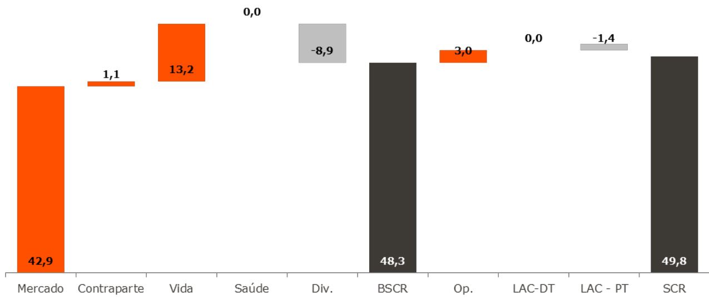

# Relatório sobre a Solvência e Situação Financeira 2023  

Una Seguros de Vida, S.A.  

1. SÍNTESE .... .... 6   
A. ATIVIDADES E DESEMPENHO . .. 9   
A.1. Atividades . . 9   
A.1.1. Apresentação geral da Una Seguros de Vida, S.A.... ... 9   
A.1.2. Análise da atividade da Una Seguros de Vida . .. 9   
A.1.3. Objetivos e estratégias . . 9   
A.2. Desempenho da subscrição . ... 10   
A.2.1. Desempenho global da subscrição . . 10   
A.2.2. Margem técnica .. ... 10   
A.2.2.1. Prémios brutos emitidos ... . 10   
A.2.2.2. Custos com sinistros .. ..... 12   
A.2.2.3. Comissões e custos imputados ... .... 13   
A.2.2.4. Provisões técnicas .. . 13   
A.3. Desempenho dos investimentos ... .... 13   
A.3.1. Análise do desempenho dos investimentos . .... 13   
A.4. Desempenho de outras atividades . .... 14   
A.4.1. Gastos e rendimentos de outras atividades . ... 14   
A.4.1.1. Outros gastos e rendimentos técnicos .. ... 14   
A.4.1.2. Outros gastos e rendimentos não técnicos . .... 14   
A.5. Eventuais informações adicionais . .... 14   
B. SISTEMA DE GOVERNAÇÃO . ...... 16   
B.1. INFORMAÇÕES GERAIS SOBRE O SISTEMA DE GOVERNAÇÃO ..... 16   
B.1.1. Sistema de Governação.. 16   
B.1.2. Estrutura do Órgão de Administração da Una Seguros de Vida ........ 16   
B.1.2.1. Conselho de Administração ... .... 17   
B.1.2.1.1. Membros .... .... 17   
B.1.2.1.2. Principais funções e responsabilidades ... 17   
B.1.2.1.3. Comité Executivo ... 18   
B.1.3. Funções chave ... 19   
B.1.4. Política de remuneração e suas práticas 20   
B.1.4.1. Política de remuneração e suas práticas para os membros do Conselho de   
Administração, do Conselho Fiscal e do Comité Executivo .. . 20   
B.1.4.2. Política de remuneração e suas práticas para os colaboradores ... .... 20   
B.2. REQUISITOS DE QUALIFICAÇÃO E IDONEIDADE .... 23   
B.2.1. Qualificação dos membros do Conselho de Administração ... . 23   
B.2.2. Qualificação das pessoas que dirigem efetivamente a empresa ou desempenham   
funções-chave ......... .... 23   
B.2.2. Idoneidade . 23   
B.3. SISTEMA DE GESTÃO DE RISCOS COM INCLUSÃO DA AUTOAVALIAÇÃO DO RISCO E   
DA SOLVÊNCIA ..... . 24   
B.3.1. Sistema de gestão de risco 24   
B.3.1.1. Objetivos e estratégia do sistema de gestão de risco da Companhia .... 24   
B.3.1.2. Identificação, avaliação e monitorização dos riscos . . 25   
B.3.1.3. Governação e linhas de reporte .. 25   
B.3.2. Avaliação interna dos riscos e da solvência . .. 26   
B.3.2.1. Função e responsabilidade das funções chave e órgão de gestão . ...... 27   
B.3.2.1.1 Função e responsabilidade das funções chave .. .... 27   
B.3.2.1.2 Função e responsabilidade de órgão de administração e comités.. .......... 27   
B.3.2.2 Metodologia de avaliação dos riscos e da solvência atual e prospetiva ............. 27   
B.3.2.3 Frequência do exercício ORSA e calendário de execução .... ....... 27   
B.4. SISTEMA DE CONTROLO INTERNO ... 28   
B.4.1. Descrição do sistema de controlo interno . 28   
B.4.1.1. Principais procedimentos de Controlo Interno ..... ...... 28   
B.4.1.2. Plano de Controlo Permanente .. 29   
B.4.2 Função de verificação do cumprimento .. 30   
B.5 FUNÇÃO AUDITORIA INTERNA .. ... 30   
B.5.1 Descrição de Auditoria Interna .... ... 30   
B.6. FUNÇÃO ATUARIAL . 31   
B.6.1. Provisionamento .. . 31   
B.6.2. Subscrição ..... .... 31   
B.6.3. Resseguro .... ... 32   
B.7. SUBCONTRATAÇÃO . .... 32   
B.7.1. Objetivos da política de subcontratação .. 32   
B.7.2. Prestadores fundamentais ou importantes ...... 33   
B.8. AVALIAÇÃO DA ADEQUAÇÃO DO SISTEMA DE GOVERNAÇÃO .. 33   
B.9. EVENTUAIS INFORMAÇÕES ADICIONAIS . 33   
C. PERFIL DE RISCO ... ..... 34   
C.1. RISCO ESPECÍFICO DE SEGUROS 34   
C.1.1. Exposição ao risco específico de seguros ... 34   
C.1.1.1. Metodologia para identificar e avaliar os riscos .. .. 34   
C.1.1.2. Descrição dos riscos mais significativos .. .... 35   
C.1.2. Concentração do risco específico de seguros ... 36   
C.1.3. Técnicas de mitigação do risco . . 36   
C.1.3.1. Política de subscrição e provisionamento .... ..... 36   
C.1.3.2. Política de resseguro . ... 36   
C.1.4. Sensibilidade ao risco específico de seguro .. .... 37   
C.2. RISCO DE MERCADO 37   
C.2.1. Exposição ao risco de mercado ..... 37   
C.2.1.1. Metodologia para identificar e avaliar os riscos . 38   
C.2.1.2. Descrição dos riscos mais significativos 38   
C.2.2. Concentração do risco de mercado. ..... 38   
C.2.3. Técnicas de mitigação do risco ... . 39   
C.2.4. Sensibilidade ao risco de mercado ..... ... 39   
C.3. RISCO DE CRÉDITO .... .. 40   
C.3.1. Exposição ao risco de crédito ........... ......... 40   
C.3.2. Concentração do risco de crédito . 40   
C.3.3. Técnicas de mitigação do risco ... 41   
C.3.4. Sensibilidade ao risco de crédito ... ... 41   
C.4. RISCO DE LIQUIDEZ . 41   
C.4.1. Exposição ao risco de liquidez ...... .. 41   
C.4.2. Concentração do risco de liquidez ... .... 41   
C.4.3. Técnicas de mitigação do risco ..... 42   
C.4.4. Sensibilidade ao risco de liquidez .... ..... 42   
C.5. RISCO OPERACIONAL . ... 42   
C.5.1. Exposição ao risco de operacional . . 42   
C.5.2. Descrição das concentrações de risco materiais às quais a Companhia esteja   
exposta .... 42   
C.5.3. Técnicas de mitigação do risco .... .... 42   
C.5.4. Sensibilidade ao risco operacional . ..... 43   
C.6. OUTROS RISCOS MATERIAIS 43   
C.7. EVENTUAIS INFORMAÇÕES ADICIONAIS . .... 44   
D. AVALIAÇÃO PARA EFEITOS DE SOLVÊNCIA . ... 45   
D.1. ATIVOS ..... ..... 47   
D.1.1. Goodwill .. ... 47   
D.1.2. Custos aquisição diferidos . . 47   
D.1.3. Outros ativos intangíveis . 47   
D.1.4. Ativos por impostos diferidos ... 47   
D.1.5. Ativos por benefícios pós emprego . ... 48   
D.1.6. Edifícios e outros ativos de uso próprio .. ..... 49   
D.1.7. Investimentos (excluindo ativos associados a unit-linked / index-linked) ......... 49   
D.1.7.1. Edifícios de rendimento . ...... 49   
D.1.7.2. Investimentos em filiais associadas e empreendimentos conjuntos ...... 49   
D.1.7.3. Ações, obrigações, Fundos de investimento e ativos colaterizados . 50   
D.1.8. Derivados ...... .......... 51   
D.1.9. Depósitos, excluindo caixa e seus equivalentes ... 51   
D.1.10. Outros investimentos . 51   
D.1.11. Ativos representativos de responsabilidades associadas a unit-linked/ index  
linked ..... ...... 51   
D.1.12. Empréstimos e hipotecas .. ...... 52   
D.1.13. Empréstimos sobre apólices 52   
D.1.14. Resseguro cedido – provisão para sinistros . ...... 52   
D.1.15. Outros ativos .. ..... 52   
D.1.15.1. Depósitos Concedidos . 52   
D.1.15.2. Contas a receber por operações seguro.. ........ 52   
D.1.15.3. Contas a receber por operações de resseguro ..... .... 52   
D.1.15.4. Contas a receber por outras operações 52   
D.1.15.5. Ações próprias ... .... 53   
D.1.15.6. Instrumentos de capital ... ... 53   
D.1.15.7. Caixa e seus equivalentes e depósitos à ordem . ... 53   
D.1.15.8. Outros ativos não mencionados nas rúbricas anteriores ... 53   
D.2. PROVISÕES TÉCNICAS .. 53   
D.2.1. Método de cálculo e análise de discrepâncias entre os regimes estatutário e   
Solvência II ........... ..... 53   
D.2.1.1. Provisão Técnicas Vida .... .. 54   
D.2.1.2. Margem de Risco ... 55   
D.2.1.3. Explicações para as diferenças existentes entre a valorização das demonstrações   
financeiras e a valorização Solvência II ... ...... 56   
D.2.2. Impacto da aplicação de medidas de longo prazo e medidas transitórias . 57   
D.2.2.1. Medidas de Garantia a Longo Prazo ...... 57   
D.2.2.2. Medidas Transitórias relativas às Provisões Técnicas ... .... 57   
D.2.3. Montantes Recuperáveis de Resseguro ... 58   
D.3. OUTROS PASSIVOS . ..... 58   
D.3.1. Passivos contingentes ... .... 58   
D.3.2. Outras provisões . 59   
D.3.3. Passivos por benefícios pós-emprego . .... 59   
D.3.4. Depósitos de resseguradores ... .... 59   
D.3.5. Passivos por impostos diferidos .. 59   
D.3.6. Derivados ... .... 59   
D.3.7. Dividas a instituições de crédito .... 59   
D.3.8. Passivos financeiros, excluindo dívidas a instituições de crédito . 59   
D.3.9. Contas a pagar por operações de seguro. ..... 59   
D.3.10. Contas a pagar por operações de resseguro .. .... 59   
D.3.11. Contas a pagar por outras operações . 60   
D.3.12. Passivos subordinados .... 60   
D.3.13. Outros passivos não mencionados nas rúbricas anteriores .. .... 60   
D.4. MÉTODOS ALTERNATIVOS DE AVALIAÇÃO 60   
D.5. EVENTUAIS INFORMAÇÕES ADICIONAIS ... 60   
E. GESTÃO DO CAPITAL 61   
E.1. FUNDOS PRÓPRIOS.. 61   
E.1.1 Estrutura, montantes e classificação dos fundos próprios ... 61   
E.1.2 Desvio entre os fundos próprios estatutários e os fundos próprios avaliados de   
acordo com o regime Solvência II . ......... 62   
E.2. REQUISITO DE CAPITAL DE SOLVÊNCIA E REQUISITO DE CAPITAL MÍNIMO .......... 63   
E.2.1 Requisito de capital de solvência.. 63   
E.2.2 Requisito de capital mínimo 64   
E.2.3 Impacto das medidas transitórias e de longo prazo 65   
E.3. UTILIZAÇÃO DO SUBMÓDULO DE RISCO ACIONISTA BASEADO NA DURAÇÃO PARA   
CALCULAR O SCR ..... 65   
E.4. DIFERENÇAS ENTRE A FÓRMULA-PADRÃO E QUALQUER MODELO INTERNO   
UTILIZADO .... . 65   
E.5. INCUMPRIMENTO DO MCR E INCUMPRIMENTO DO SCR ... . 65   
E.6. EVENTUAIS INFORMAÇÕES ADICIONAIS . ... 66  

Anexos . 67  

Figura 1: Requisito de Capital da Companhia ... 8   
Figura 2: Detalhe dos prémios brutos emitidos por ramo .. 11   
Figura 3: Custos com sinistros por ramo ...... 12   
Figura 4: Organigrama da Companhia a 31 de dezembro de 2022 .. 17   
Figura 5: Níveis e Tipos de Controlo .. 29   
Figura 6: Perfil de Risco atual ... 34   
Figura 7: Requisito de Capital da Companhia .. 63   
Figura 8: Evolução do Requisito de Capital da Companhia . . 64   
Figura 9: Evolução do Requisito de Capital Mínimo da Companhia .. 65  

# Índice Tabelas:  

Tabela 1: Desempenho da subscrição da atividade vida 10   
Tabela 2: Prémios brutos emitidos da Companhia 11   
Tabela 3: Custos com sinistros da Companhia .... 12   
Tabela 4: Desempenho dos investimentos da Companhia ... 13   
Tabela 6: Gastos e rendimentos não técnicos da Companhia ..... 14   
Tabela 7: Prestadores de serviços fundamentais ou importantes da Companhia ..... 33   
Tabela 8: Riscos Específicos de Seguros de Vida ........ 35   
Tabela 9: Exposição ao Risco de Mercado ... 37   
Tabela 10: Riscos de Mercado ..... 38   
Tabela 11: Risco de Incumprimento da Contraparte ... 41   
Tabela 12: Risco Operacional .... 42   
Tabela 13: Balanço Económico... 46   
Tabela 14: Ativos por Impostos Diferidos ..... 48   
Tabela 15: Ativos detidos pela Companhia . 50   
Tabela 16: Comparação entre as provisões técnicas estatutárias e económicas ..... 54   
Tabela 18: Comparação de Provisões técnicas ... 55   
Tabela 19: Provisões Técnicas por classe de negócio .............. . 55   
Tabela 20: Comparação das Provisões Técnicas estatutárias e económicas por classe de   
negócio...... 56   
Tabela 21: Medida de Transição das provisões Técnicas ..... . 57   
Tabela 22: Recuperáveis de Resseguro ....... . 58   
Tabela 23: Recuperáveis de Resseguro por tipo de tratado .... 58   
Tabela 24: Fundos próprios disponíveis e elegíveis para a cobertura do SCR e do MCR ...... 62   
Tabela 25: Comparação dos fundos próprios entre as demonstrações financeiras e Solvência   
II ..... .. 62   
Tabela 26: Diferenças na avaliação dos fundos próprios ...... ... 63   
Tabela 27: Impacto das medidas transitórias e de longo prazo .. .. 65  

# 1. SÍNTESE  

O relatório sobre a solvência e situação financeira foi preparado pela Una Seguros de Vida, SA, em concordância com as disposições legislativas e regulamentares aplicáveis, sendo relativo ao exercício encerrado a 31 de dezembro de 2023.  

De acordo com o disposto no artigo $^{2920}$ do Regulamento Delegado, apresenta-se um resumo dos capítulos abordados neste relatório. Este resumo não invalida a leitura na integra do documento, dado não serem apresentados em detalhe todos os temas tratados.  

# ATIVIDADES E DESEMPENHO  

A Una Seguros de Vida, S.A. (“Una Seguros de Vida” ou “Companhia”) encontra-se constituída como sociedade anónima de acordo com a legislação portuguesa aplicável às Companhias de Seguros. A Companhia opera no ramo vida, faz parte integrante do Grupo empresarial da China Tianying Inc. (CNTY) e é detida a $100\%$ pela Benefits & Increases, SGPS, Unipessoal, Lda. (B&I).  

Não se verificaram alterações significativas no que diz respeito ao crescimento alcançado em 2023 dos produtos Vida, mantendo-se a performance identificada no ano anterior. Nos seguros de Poupança, registou-se um aumento dos seguros de Poupança Grupo, alavancado pela presença da Companhia no mercado dos “employee benefits”, tendo-se verificado em contrapartida um decréscimo dos seguros de Poupança Individual. Relativamente aos produtos de risco, verifica-se um crescimento moderado de $3\%$ motivado pelo ramo tradicional.  

# SISTEMA DE GOVERNAÇÃO  

A Companhia possui uma estrutura organizacional na qual se encontram definidas as funções chave, nomeadamente função chave de gestão de riscos, auditoria interna, verificação da conformidade e função atuarial.  

O sistema de governação é da responsabilidade última do Conselho de Administração, sendo auxiliado nos processos de tomada de decisão pelo Comité Executivo e pelos demais Comités relevantes para cada temática.  

A Una Seguros de Vida adotou um conjunto de políticas internas que definem os princípios que devem ser respeitados na gestão dos riscos a que a Companhia se encontra exposta.  

O sistema de gestão de riscos, que inclui o sistema de controlo interno da Companhia, permite garantir com um nível aceitável de segurança que os riscos são identificados e geridos de forma sólida e adequada. O trabalho desenvolvido relativamente aos processos e procedimentos no âmbito da gestão de riscos, tem permitido desenvolver uma cultura de risco que se tem mostrado essencial para a implementação deste sistema.  

# PERFIL DE RISCO  

A Companhia procura manter um perfil de risco balanceado, procedendo periodicamente à identificação e avaliação dos principais riscos aos quais se encontra, ou poderá vir a encontrar exposta.  

Esta avaliação, feita sempre que aplicável através da fórmula padrão, contempla o risco específico de seguro, risco de mercado, risco de crédito, risco de liquidez e risco operacional.  

Para cada categoria de risco, além de apurado o seu impacto quantitativo, são também identificadas as medidas de mitigação, e são realizadas, com uma periodicidade mínima anual, análises de sensibilidade para testar a resiliência da Companhia face a eventos adversos.  

Devido ao enquadramento macroeconómico, à estrutura das responsabilidades assumidas e à composição da carteira de ativos financeiros, o risco de descontinuidade e de Despesas associados ao risco específico de seguro, o risco de spread e de concentração incluídos no risco de mercado, são os riscos que apresentam um nível de criticidade mais elevado.  

<html><body><table><tr><td></td><td>2023%BSCR</td><td></td><td>2022%BSCR</td><td></td><td>Var.</td></tr><tr><td>Market risk</td><td>42 912</td><td>75%</td><td>42695</td><td>74%</td><td>218</td></tr><tr><td>Counterpartydefaultrisk</td><td>1084</td><td>2%</td><td>774</td><td>1%</td><td>310</td></tr><tr><td>Lifeunderwriting risk</td><td>13207</td><td>23%</td><td>14 113</td><td>25%</td><td>-906</td></tr><tr><td>Healthunderwritingrisk</td><td>0</td><td>0%</td><td>0</td><td>0%</td><td>0</td></tr><tr><td>Non-lifeunderwritingrisk</td><td>0</td><td>0%</td><td>0</td><td>0%</td><td>0</td></tr><tr><td>Diversification</td><td>-8 924</td><td></td><td>-9 148</td><td></td><td>223</td></tr><tr><td>BasicSolvencyCapital Requirement</td><td>48279</td><td></td><td>48434</td><td></td><td>-155</td></tr><tr><td>Totalcapitalrequirementforoperationalrisk</td><td>2957</td><td></td><td>10798</td><td></td><td>-7 840</td></tr><tr><td>Loss-absorbingcapacityoftechnicalprovisions</td><td>-1 442</td><td></td><td>-1 138</td><td></td><td>-304</td></tr><tr><td>Loss-absorbing capacityofdeferred taxes</td><td>0</td><td></td><td>-3578</td><td></td><td>3578</td></tr><tr><td>Solvency capitalrequirement</td><td>49794</td><td></td><td>54516</td><td></td><td>-4 722</td></tr></table></body></html>  

# AVALIAÇÃO PARA EFEITOS DE SOLVÊNCIA  

A avaliação dos ativos e passivos da Companhia para efeitos de solvência obedece aos critérios valorimétricos definidos no quadro regulamentar do regime Solvência II, estando as principais diferenças de valorização, face às demonstrações financeiras da Companhia, devidamente identificadas, quer em termos dos seus ativos, quer em termos do cálculo das provisões técnicas.  

O valor total dos ativos, segundo o regime de Solvência $\Pi,$ ascende a 401.512 milhares de euros, enquanto segundo os dados estatutários ascende a 414.221 milhares de euros. No que se refere ao passivo, em termos de Solvência II, apresenta um valor de 312.455 milhares de euros, ao passo que de acordo com as regras estatutárias o seu valor é de 329.776 milhares de euros. A informação estatutária acima indicada espelha os dados divulgados no modelo para a apresentação da informação à Autoridade de Supervisão (S.02.01.01. Balanço).  

As diferenças acima identificadas correspondem principalmente a custos de aquisição diferidos, ativos intangíveis, impostos diferidos, participações em empresas relacionadas e montantes recuperáveis de resseguro no que se refere ao lado do ativo, sendo no passivo a diferença em termos da valorização das provisões técnicas a rúbrica mais impactante.  

No que se refere às provisões técnicas, e mediante a aprovação prévia da Autoridade de Seguros e Fundos de Pensões, a Companhia procedeu á aplicação do regime transitório previsto no artigo $250$ da Lei nº 147/2015, de 9 de setembro.  

# GESTÃO DE CAPITAL  

A gestão do capital encontra-se formalizada na política interna da Companhia, tendo como um dos objetivos principais assegurar o cumprimento contínuo dos requisitos regulamentares e simultaneamente otimizar a alocação do capital tendo em consideração a rentabilidade esperada.  

O montante dos requisitos de capital de solvência é determinado através da aplicação da fórmula padrão, em conformidade com as provisões do regulamento delegado nº 2015/35 da Comissão Europeia de 10 de outubro de 2014.  

Relativamente ao ano de 2023, o cálculo do requisito de capital de solvência da Una Seguros de Vida decompõe-se da seguinte forma:  

  
Figura 1: Requisito de Capital da Companhia  

A 31 de dezembro de 2023, a Una Seguros de Vida apresentou um rácio de cobertura dos seus requisitos de capital de solvência através dos seus fundos próprios elegíveis de $178,9\%$ . No final de 2022, este rácio apresentava um valor de $118,5\%$ . A desvalorização dos Ativos resultante da subida das taxas de juro foi o fator que contribuiu para o decréscimo dos Ativos, ao passo que se registou uma descida mais acentuada das provisões técnicas. Ao nível dos riscos a descida do risco específico de seguros e do risco operacional em virtude da diminuição do volume de negócios fizeram com que o SCR tivesse descido consideravelmente.  

# Ajustamento de volatilidade à estrutura temporal das taxas de juro sem risco relevante  

Ao abrigo do artigo $98^{\circ}$ do regime jurídico de acesso e exercício da atividade seguradora e resseguradora (RJASR) aprovado pela Lei $\mathsf{n}^{0}$ 147/2015, de 9 de setembro foi autorizada à aplicação do ajustamento de volatilidade à estrutura temporal das taxas de juro sem risco relevante, no cálculo da melhor estimativa referida pelo artigo $93^{\circ}$ do RJASR, nos termos requeridos pela Una Seguros de Vida, S.A. em 30 de dezembro de 2020.  

Lisboa, 02 de abril de 2024  

# A. ATIVIDADES E DESEMPENHO  

# A.1. Atividades  

# A.1.1. Apresentação geral da Una Seguros de Vida, S.A.  

A Companhia foi constituída em 1991 sob a forma jurídica de sociedade anónima.  

A Companhia encontra-se registada em Portugal sob o NIF 502661313 e matriculada na Conservatória do Registo Comercial. A sua sede é na Avenida de Berna, 24-D, Lisboa.  

A Companhia dedica-se ao exercício da atividade de seguros para os ramos Vida para o qual obteve a devida autorização da Autoridade de Supervisão de Seguros e Fundos de Pensões (ASF). A sua atividade é exercida em Portugal.  

A Una Seguros de Vida, S.A., é detida pela Benefits & Increases, SGPS, Unipessoal, Lda. na totalidade.  

A Una Seguros de Vida S.A. empregava 51 trabalhadores a 31 de dezembro de 2023.  

Autoridade de Supervisão  

A Una Seguros de Vida, S.A é supervisionada pela Autoridade de Supervisão de Seguros e Fundos de Pensões, sítio na Av. Da República, 76, 1600-205 Lisboa, Portugal.  

Auditor Externo da Empresa  

O auditor externo da Una Seguros de Vida, S.A. é a empresa KPMG & Associados, SROC, SA, sito na Av. Fontes Pereira de Melo, 41, $15\time10$ , 1069-096 Lisboa, Portugal.  

Participações qualificadas  

A Companhia detém $100\%$ da Una Seguros, SA.  

Posição da Companhia na Estrutura do Grupo  

A Companhia é detida a $100\%$ pela Benefits and Increases, SGPS, Unipessoal, Lda. (B&I) pertencente ao Grupo China Tianying Inc. (CNTY).  

Informação detalhada sobre a posição da Companhia na estrutura do Grupo disponível no ponto B.1.1.2.  

# A.1.2. Análise da atividade da Una Seguros de Vida  

O decréscimo dos prémios brutos emitidos apresentado pela Una Seguros de Vida resulta, em larga escala, de não ter ocorrido durante este ano a venda de contratos de investimento. Se excluirmos este tipo de produtos da análise, observamos uma redução muito ligeira da produção $(-0,5\%)$ devido essencialmente ao abrandamento da venda de produtos de poupança individual que não foi suficientemente compensada pelo crescimento dos produtos de poupança de grupo e de risco. Durante o ano de 2023 a companhia registou uma produção de 73,6 milhões de euros de produção de seguro direto.  

Assim, a Companhia diminuiu os seus ativos, mantendo uma sustentabilidade futura consentânea com as suas responsabilidades.  

# A.1.3. Objetivos e estratégias  

A Una Seguros de Vida pretende a prazo rever a sua estrutura de vendas de forma a adequar as necessidades dos seus clientes, quer com produtos de risco, quer ainda com produtos de poupança e reforma. É igualmente objetivo crescer no segmento individual e continuar a suportar a área de corporate, que continua a procurar produtos ligados às áreas de “employee benefits”.  

# A.2. Desempenho da subscrição  

# A.2.1. Desempenho global da subscrição  

A descida das taxas de juro em 2023, a inflação ainda persistente acompanhados de volatilidade nos mercados financeiros onde se acrescenta o conflito armado entre a Rússia e a Ucrânia e no médio oriente contribuíram para um clima de incerteza a nível dos investimentos. Por outro lado, os regates registados ao longo do ano obrigaram a uma maior alocação em fundos de tesouraria para fazer face a potenciais necessidades de liquidez.  

Tabela 1: Desempenho da subscrição da atividade vida   

<html><body><table><tr><td>ATIVIDADEVIDA 2023 2022</td></tr><tr><td>Var.</td></tr><tr><td>PrémiosBrutosEmitidos Seguros direto 73593 180928 -59,3%</td></tr><tr><td>Ressegurocedido 3189 3705 -13,9%</td></tr><tr><td>Liquido de resseguro 70 404 177223 -60,3%</td></tr><tr><td></td></tr><tr><td>CustoscomSinistros 98314</td></tr><tr><td>Seguros direto 130 011 32,2%</td></tr><tr><td>Resseguro cedido 1223 1297 -5,7% Liquido de resseguro 128 788 97018 32,7%</td></tr><tr><td></td></tr><tr><td>Variacaodeoutrosprovisoestécnicas</td></tr><tr><td>Seguros direto 28 132 11 734 139,7%</td></tr><tr><td>Resseguro cedido -1 304 -1 556 16,2%</td></tr><tr><td>Liquido de resseguro 29435 13 291 121,5%</td></tr><tr><td>Comissoes e custos imputados 8557 7967 7,4% Valores emKE</td></tr></table></body></html>  

O volume de produção do ramo Vida alcançou um montante de 73.593 milhares de euros, correspondendo a um decréscimo de 59, $3\%$ quando comparado com o ano anterior.  

Os custos com sinistros foram de 130.011 milhares de euros e de 128.788 milhares de euros líquidos de resseguro.  

Registou-se uma variação nas outras provisões técnicas de 28.132 milhares de euros, incluindo provisões matemáticas.  

O montante das comissões e outros custos imputados registaram um valor de 8.557 milhares de euros. O rácio de comissões e outros custos imputados sobre prémios brutos emitidos foi de $11.6\%$ face aos $4,4\%$ registados em 2022.  

# A.2.2. Margem técnica  

# A.2.2.1. Prémios brutos emitidos  

O volume de produção do ramo Vida alcançou um montante de 73 593 milhares de euros, dos quais $93,9\%$ são seguros com participação nos resultados $^{\,\!}38,7\%$ em 2022), sendo os restantes $6,1\%$ relativos a Outros Seguros de Vida ( $61,3\%$ em 2022). Na base da alteração  

na distribuição está essencialmente o produto financeiro lançado em 2022 e que angariou cerca de 107 milhões de euros.   
Valores em K€   
Tabela 2: Prémios brutos emitidos da Companhia   

<html><body><table><tr><td>PREMIOSBRUTOEMITIDOS</td><td>2023</td><td>2022</td><td>Var.</td></tr><tr><td>Seguro com participacao</td><td>69137</td><td>70000</td><td>-1,2%</td></tr><tr><td>Unit-Link</td><td>0</td><td>0</td><td></td></tr><tr><td>OutrosSegurosVida</td><td>4456</td><td>110928</td><td>-96,0%</td></tr><tr><td>TotalVida</td><td>73593</td><td>180928</td><td>-59,3%</td></tr></table></body></html>  

  
Detalhe dos prémios brutos emitidos Vida por segmento de negócio nos anos 2023 e 2022:   
Figura 2: Detalhe dos prémios brutos emitidos por ramo  

# A.2.2.2. Custos com sinistros  

O montante dos custos com sinistros foi de 130.011 milhares de euros. O rácio de custos com sinistros sobre prémios brutos emitidos foi de $176,7\%$ $.54,3\%$ em 2022).  

Tabela 3: Custos com sinistros da Companhia   

<html><body><table><tr><td>CUSTOSCOMSINISTROS</td><td>2023</td><td>2022</td><td>Var.</td></tr><tr><td>Segurocomparticipacao</td><td>98910</td><td>78510</td><td>26,0%</td></tr><tr><td>Unit-Link</td><td>45</td><td>35</td><td>27,9%</td></tr><tr><td>OutrosSegurosVida</td><td>31056</td><td>19770</td><td>57,1%</td></tr><tr><td>TotalVida</td><td>130011</td><td>98 314</td><td>32,2%</td></tr></table></body></html>  

Detalhe dos custos com sinistros Vida por segmento de negócio nos anos 2023 e 2022:  

  
Figura 3: Custos com sinistros por ramo  

# A.2.2.3. Comissões e custos imputados  

Nesta rubrica, para além das comissões, estão também considerados os custos técnicos imputados às diversas áreas.  

s encargos representam, no ano de 2023, 8.557 milhares de e  

# A.2.2.4. Provisões técnicas  

A variação das provisões técnicas, excluindo contratos de investimento, apresentou um decréscimo de 31.009 milhares de euros e deveu-se essencialmente a:  

-31.044 milhares de euros de variação da provisão matemática;   
-853 milhares de euros de participação nos resultados atribuída;   
859 milhares de euros de reforço de provisão para sinistros.  

# A.3. Desempenho dos investimentos  

# A.3.1. Análise do desempenho dos investimentos  

O mapa a seguir apresenta os rendimentos de investimentos, os ganhos e perdas realizados e os ganhos e perdas não realizados, por categoria de ativos, excluindo os custos de gestão de investimentos.  

Tabela 4: Desempenho dos investimentos da Companhia   

<html><body><table><tr><td>2023</td><td>Rendimentos (Divid., juros e rendas)</td><td>Ganhos e perdas realizadas</td><td>Ganhos e perdas nao realizadas</td></tr><tr><td>1.e 2. Obrigagoes (Estado e Diversas)</td><td>8752</td><td>-271</td><td>-21 517</td></tr><tr><td>3.Acgoes 4.Organismosdeinvestimento coletivo</td><td>0</td><td>0 31</td><td>0</td></tr><tr><td></td><td>2 184</td><td></td><td>9</td></tr><tr><td>9.Imobilizagoescorporeas Total</td><td>0</td><td>0 -239</td><td>0 -21509</td></tr><tr><td></td><td>10937 Rendimentos</td><td>Ganhos e</td><td>Ganhos e</td></tr><tr><td>2022</td><td>(Divid., juros e rendas)</td><td>perdas realizadas</td><td>perdas nao realizadas</td></tr><tr><td>1.e 2.Obrigacoes (Estado e Diversas) 3. Acgoes</td><td>9649 0</td><td>977 0</td><td>-38 475</td></tr><tr><td>4.Organismos deinvestimento coletivo</td><td>801</td><td>-62</td><td>0</td></tr><tr><td>9.Imobilizagoescorporeas</td><td>3</td><td>0</td><td>7</td></tr><tr><td>Total</td><td>10 453</td><td>914</td><td>0 -38 468</td></tr><tr><td></td><td></td><td></td><td>ValoresemKe</td></tr></table></body></html>  

Os custos e proveitos líquidos correspondem à diferença entre o valor de venda ou maturidade e o justo valor no final do exercício anterior.  

Os custos e proveitos não realizados correspondem aos ativos que não foram vendidos, nem chegaram à maturidade durante o exercício e são calculados com base na diferença entre o justo valor no final do exercício e o justo valor no final do exercício anterior.  

Os custos com gestão de investimentos apresentam um valor de 593 milhares de euros (521 milhares de euros em 2023).  

# A.4. Desempenho de outras atividades  

# A.4.1. Gastos e rendimentos de outras atividades  

# A.4.1.1. Outros gastos e rendimentos técnicos  

A Companhia não pretende alterar a estrutura do resultado dos outros rendimentos técnicos.  

<html><body><table><tr><td>OUTROSRENDIMENTOSTECNICOS 2023</td></tr><tr><td>2022 Gastos</td></tr><tr><td>Fundode pensoes 0 0</td></tr><tr><td>Swiss Life -120 -124</td></tr><tr><td>Outros -10 -8</td></tr><tr><td>Total -130 -132</td></tr><tr><td>Rendimentos</td></tr><tr><td></td></tr><tr><td>Outrosrendimentostecnicos 7 7</td></tr><tr><td>Total 7</td></tr></table></body></html>  

Tabela 5: Outros Rendimentos Técnicos   
Tabela 5: Gastos e rendimentos não técnicos da Companhia   

<html><body><table><tr><td>OUTROS GASTOS E RENDIMENTOS NAOTECNICOS</td><td>2023</td><td>2022</td></tr><tr><td>Gastos Perdasemativostangiveis</td><td>0</td><td>-1</td></tr><tr><td>Variagaode ajustamentos emsaldos areceber</td><td>-4</td><td>-81</td></tr><tr><td>Custos deservicosbancarios</td><td>-77</td><td>-35</td></tr><tr><td>Donativos</td><td>0</td><td>-5</td></tr><tr><td>Quotizagoes</td><td>-1</td><td>-1</td></tr><tr><td>Outrosgastos</td><td>-6</td><td>-58</td></tr><tr><td>Total</td><td>-89</td><td>-181</td></tr><tr><td>Rendimentos</td><td></td><td></td></tr><tr><td>Outrosrendimentos</td><td>1</td><td>3</td></tr><tr><td>Total</td><td>48</td><td>3</td></tr></table></body></html>  

# A.5. Eventuais informações adicionais  

A Companhia em maio de 2023 recebeu um aumento de capital do acionista que totalizou 20 milhões de euros.  

Apesar da redução da pressão inflaciomista e da descida das taxas de juro em comparação com o ano anterior e que levaram a uma redução da menos valias não realizadas, a instabilidade mantém-se ao nível dos mercados financeiros. Esta situação reforça a prudência relativamente aos investimentos realizados e o aumento do nível de liquidez da carteira. Ao nível do passivo a sdescida das taxas levou a uma valorização das responsabilidades o que se reflete ao nível dos fundos próprios.  

O conflito armado entre a Rússia e a Ucrânia e a crise no médio oriente veio criar um clima de grande instabilidade geo-politica que se reflete nos mercados financeiros e na pressão inflacionista com naturais consequências para o mercado segurador e nos resultados da companhia.  

# B. SISTEMA DE GOVERNAÇÃO  

# B.1. INFORMAÇÕES GERAIS SOBRE O SISTEMA DE GOVERNAÇÃO  

# B.1.1. Sistema de Governação  

O sistema de governação da Companhia comporta a Assembleia Geral de Acionistas, o Conselho de Administração, o Conselho Fiscal e um Revisor Oficial de Contas ou uma Sociedade de Revisores Oficiais de Contas.  

No âmbito do sistema de governação, relevam igualmente:  

• A Comissão de Remunerações e Previdência;   
? O Comité Executivo; Vários Comités de apoio ao Comité Executivo: comité de investimentos; comité de produtos; comité de aprovação de produtos; comité de projetos; comité comercial; comité de solvência II, riscos, controlo interno e auditoria; comité técnico vida; comité técnico não-vida; comité de aceitação de negócio; comité de acompanhamento de resultados; HR Council; Comité de Gestão Global; comité de Recursos Humanos e Townhall – Encontro de Colaboradores As funções-chave.  

Neste contexto, o sistema de governação assenta no “princípio dos quatro olhos”, de acordo com o qual pelo menos duas pessoas dirigem efetivamente a empresa e nenhuma decisão importante é implementada sem a intervenção de, pelo menos, duas dessas pessoas.  

O sistema de governação encontra-se sujeito a um processo de melhoria contínua, de acordo com os princípios subjacentes à diretiva Solvência II.  

Adicionalmente, a companhia segue as suas políticas de governação interna em linha com os princípios da organização.  

# B.1.2. Estrutura do Órgão de Administração da Una Seguros de Vida  

A estrutura do Órgão de Administração da Companhia é composta pelo Conselho de Administração e pelo Comité Executivo.  

Em 2023 foram nomeados em Assembleia Geral os membros do Conselho de Administração da Companhia para o mandato quadrienal que então se iniciou.  

O organograma organizacional simplificado encontra-se na figura abaixo:  

  
Figura 4: Organigrama da Companhia a 31 de dezembro de 2023  

# B.1.2.1. Conselho de Administração  

# B.1.2.1.1. Membros  

O Conselho de Administração da Companhia é composto pelos seguintes membros, eleitos em Assembleia Geral:  

Presidente do Conselho de Administração (não executivo): Shengjun Yan   
Vice-Presidente do Conselho de Administração (não executivo): José Almaça   
Administrador-Delegado (executivo): Nuno David   
Administradores executivos: Dong Qiao, Nuno Catarino, Eduardo Dias   
Administrador não executivo: Haihong Tu  

# B.1.2.1.2. Principais funções e responsabilidades  

Responsabilidades do Conselho de Administração  

O Conselho de Administração é o órgão que detém a responsabilidade de definir as principais linhas orientadoras e estratégicas da Companhia, certificando-se da sua correta implementação através da supervisão das funções desempenhadas pelos responsáveis de área.  

O Conselho de Administração tem ainda a seu cargo a responsabilidade de, em última instância, tomar as decisões necessárias para o normal funcionamento da Companhia.  

# Responsabilidades do Presidente do Conselho de Administração  

O Presidente do Conselho de Administração tem por missão organizar e dirigir os trabalhos do Conselho de Administração, reportando os mesmos à Assembleia Geral. De igual forma, fiscaliza o bom funcionamento dos órgãos da Companhia, assegurando o cumprimento das suas obrigações por parte dos demais administradores.  

Competências reservadas ao Conselho de Administração  

De acordo com os estatutos da Companhia, ao Conselho de Administração compete, em especial, sem prejuízo das atribuições que por lei lhe são genericamente conferidas:  

Definir a estratégia da sociedade e estabelecer os planos e orçamentos anuais e plurianuais;   
Orientar e gerir a sociedade, praticando todos os atos e operações inseríveis no seu objeto social;   
Adquirir, onerar e alienar quaisquer bens e direitos, móveis ou imóveis, sempre que o entenda conveniente para a sociedade;   
Contratar os empregados da sociedade, estabelecendo as respetivas condições contratuais e exercer o correspondente poder diretivo e disciplinar;   
Constituir mandatários para a prática de atos determinados;   
Executar e fazer cumprir os preceitos legais e estatutários e as deliberações da Assembleia Geral;   
Delegar os poderes nos seus membros, nos termos previstos nos estatutos;   
Representar a sociedade em juízo e fora dele, ativa e passivamente, podendo contrair obrigações, propor e seguir pleitos, confessar, desistir ou transigir em processo, comprometer se em árbitros, assinar termos de responsabilidade e, em geral, resolver acerca de todos os assuntos que não caibam na competência de outros Órgãos Sociais ou dos serviços subalternos;   
Nomear um Secretário da Sociedade efetivo e um suplente conferindo-lhe poderes dentro dos limites legais.  

# B.1.2.1.3. Comité Executivo  

O comité executivo assume, no âmbito das competências que lhe são delegadas, poderes de decisão de alto nível sobre os principais assuntos de gestão relativos às operações e aos recursos da empresa, complementando o Conselho de Administração nos processos de tomada de decisão, na definição das linhas estratégicas de acordo com os princípios do Grupo, bem como na gestão operacional da Companhia.  

Reúne-se com uma periodicidade mínima mensal, sendo composto pelos Administradores executivos e, quando seja o caso, pelos Diretores de Topo, a saber: o Administrador-Delegado (CEO); o Chief Commercial Officer (CCO); o Chief Operations Officer (COO) e o Chief Technical Officer (CTO).  

# B.1.3. Funções chave  

Função de gestão de riscos  

A função de gestão de riscos é exercida por uma área específica da Companhia dedicada a esta temática e reporta diretamente ao Chief Executive Officer.  

A função de gestão de riscos atua em estreita cooperação com as demais funções chave, tendo por missão garantir a existência de um eficaz sistema de gestão de riscos, o qual identifica, quantifica, monitoriza e gere os principais riscos que afetam ou poderão vir a afetar o normal funcionamento da Companhia e/ou da sua solvência, nomeadamente os riscos específicos de seguros, riscos financeiros, os riscos operacionais e demais riscos.  

A função de gestão de riscos informa periodicamente o Comité Executivo relativamente aos resultados dos trabalhos desenvolvidos, com especial enfoque nas medidas implementadas/a implementar para mitigar os principais riscos identificados. Estes elementos são transmitidos ao Conselho de Administração pelo Administrador-Delegado.  

Função de verificação do cumprimento  

A função de verificação do cumprimento é exercida no seio da Área Jurídica, de Compliance e de Recursos Humanos, reportando diretamente ao Chief Executive Officer.  

A função de verificação do cumprimento presta assessoria ao órgão de administração relativamente ao cumprimento das disposições legais, regulamentares e administrativas aplicáveis. Por outro lado, procede à avaliação do potencial impacto de eventuais alterações do enquadramento legal na atividade da empresa de seguros e, bem assim, à identificação e avaliação do risco de cumprimento. Informa periodicamente o Comité Executivo relativamente aos resultados dos trabalhos desenvolvidos, com especial enfoque nas medidas implementadas/a implementar.  

A função de verificação do cumprimento é ainda responsável por reportar de imediato ao órgão de administração quaisquer indícios de violação de obrigações legais e regulamentares, de regras de conduta e de relacionamento com clientes e partes relacionadas ou de outros deveres que possam fazer incorrer a empresa de seguros ou os seus colaboradores num ilícito de natureza criminal ou contraordenacional. Na sequência da prestação dessa informação, a função de verificação do cumprimento mantém um registo dos incumprimentos e das medidas propostas e adotadas para os suprir.  

# Função de auditoria interna  

Com reporte direto ao Conselho de Administração, a função de auditoria interna é exercida por uma área específica da Companhia, a qual assegura o seu cumprimento de forma objetiva e independente das funções operacionais.  

O plano anual de auditoria interna é sujeito à aprovação da Administração da companhia, sendo as conclusões e recomendações resultantes do trabalho desenvolvido comunicadas ao Conselho de Administração e aos responsáveis de cada área. As medidas a tomar relativamente a cada uma das conclusões e recomendações da auditoria interna são da responsabilidade última do Conselho de Administração, o qual assegura que as mesmas sejam executadas.  

Função atuarial  

A função atuarial encontra-se sob a responsabilidade do Chief Technical Officer.  

A função atuarial coordena o cálculo das provisões técnicas de acordo com os princípios de Solvência II, informando o órgão de administração sobre a fidedignidade e adequação dos cálculos efetuados, fazendo recomendações sempre que considere relevante.  

Em termos de subscrição, tem a função atuarial a responsabilidade de assegurar a monitorização das responsabilidades assumidas pela Companhia, garantindo que os prémios se encontram adequados face aos riscos assumidos.  

# B.1.4. Política de remuneração e suas práticas  

# B.1.4.1. Política de remuneração e suas práticas para os membros do Conselho de Administração, do Conselho Fiscal e do Comité Executivo  

Os membros do Conselho de Administração que exerçam funções não executivas – e que não integrem, portanto, o Comité Executivo – não são, em princípio, remunerados pela Companhia.  

Os membros efetivos do Conselho Fiscal beneficiam de uma remuneração fixa, definida pela Comissão de Remunerações e Previdência.  

Quanto ao Comité Executivo, o mesmo é presidido pelo Administrador-Delegado (CEO) e compreende os Administradores Executivos e, quando seja o caso, Diretores de Topo, integrando, todos eles, a noção de pessoas que dirigem efetivamente a empresa (Dirigentes Efetivos). A respetiva remuneração compreende um montante fixo e outro variável, conforme o previsto no contrato de trabalho ou em deliberação da Comissão de Remunerações e Previdência.  

O sistema de remuneração variável inclui critérios de desempenho coletivo que permitam calculá-la, fomentando a coesão e solidariedade na concretização dos objetivos comuns.  

A remuneração variável é calculada de acordo com indicadores de desempenho anualmente aferidos pela Comissão de Remunerações e Previdência. Esses indicadores, financeiros e não financeiros, respeitam à Companhia, traduzindo uma avaliação coletiva de desempenho.  

São exemplos de indicadores financeiros: os resultados líquidos da Companhia; o volume de prémios; o rácio de sinistralidade; e o rácio combinado.  

Os indicadores não financeiros reportam-se a projetos transversais e com relevância estratégica para a Companhia.  

Quanto ao valor de referência a considerar para cada membro do Comité Executivo, o mesmo é aferido pela Comissão de Remunerações e Previdência.  

A percentagem representada por cada um dos indicadores financeiros e não financeiros é anualmente aferida pela Comissão de Remunerações e Previdência.  

A avaliação sobre o cumprimento dos objetivos é efetuada pela Comissão de Remunerações e Previdência. Não obstante, a atribuição do prémio variável fica dependente da verificação de dois objetivos (triggers), sem a qual os membros do Comité Executivo deixam de ser elegíveis para o mencionado prémio.  

Quanto ao pagamento da remuneração variável, verifica-se o respetivo diferimento pelo período de 3 anos, nos seguintes termos: parcela de $50\%$ paga no ano $\boldsymbol{\mathsf{n}}\!+\!1$ , $30\%$ no ano $_{\mathsf{n}+2}$ e $20\%$ no ano $_{\mathsf{n}+3}$ . O pagamento diferido não está sujeito à continuação do desempenho positivo nos anos de diferimento.  

Não são aplicáveis regimes complementares de pensões (ou de reforma antecipada) não previstos em IRCT, bem como benefícios não pecuniários relevantes ou mecanismos que impeçam a celebração de contratos que ponham em causa a razão de ser da remuneração variável.  

# B.1.4.2. Política de remuneração e suas práticas para os colaboradores  

O n.º 4 do artigo 64.º do Regime Jurídico de Acesso e Exercício da Atividade Seguradora e Resseguradora (RJASR), aprovado pela Lei n.º 147/2015, de 9 de setembro, estabelece, entre os requisitos gerais de governação, que as empresas de seguros e de resseguros devem definir e implementar uma política devidamente documentada relativa à remuneração, acrescentando o n.º 5 que a mesma deve ser previamente aprovada pelo órgão de administração e adaptada sempre que se verifique uma alteração significativa no sistema de governação ou na área em causa, sendo revista, no mínimo, anualmente.  

Neste quadro, os princípios a adotar na política remuneratória devem:  

• Ser definidos de acordo com a estratégia de negócio e de gestão de risco; Promover uma gestão de risco eficaz e sólida, evitando que se incorra em riscos para lá de níveis sustentáveis;   
• Contemplar medidas para prevenir e resolver conflitos de interesses; Estabelecer disposições específicas que tenham em consideração as funções e o desempenho das pessoas que gerem efetivamente a empresa, ou sejam responsáveis por funções-chave, assim como outras categorias de funcionários cujas atividades profissionais tenham um impacto significativo no perfil de risco da Companhia; Ter em consideração a organização interna, assim como a escala e complexidade dos riscos inerentes à atividade.  

No contexto da legislação europeia, é importante mencionar que a presente política de remunerações está em conformidade com o artigo 275.º do Regulamento Delegado (UE) 2015/35 da Comissão, de 10 de junho de 2014, que completa a Diretiva 2009/138/CE do Parlamento Europeu e do Conselho, relativa ao acesso à atividade de seguros e resseguros e ao seu exercício (Solvência II),  

Releva também referir que a presente Política de Remunerações visa dar cumprimento ao disposto na Norma Regulamentar n.º 4/2022-R, de 26 de abril, da ASF, em especial ao consagrado nos artigos 78.º a 88.º e 91.º.  

A política de remunerações da Una Seguros de Vida, S.A. encontra-se plenamente alinhada com a estratégia da Companhia, designadamente, com as prioridades-chave de otimização do desempenho e de sedimentação do compromisso dos colaboradores. Como tal, promove uma gestão de risco ponderada e efetiva, e evita a assunção de risco para lá dos níveis toleráveis definidos pelo órgão de gestão.  

A abordagem da Companhia compreende uma vertente social e humana, sustentada por um projeto económico a longo prazo. Consiste, portanto, na conjugação de um ideal de bem-estar social com um esquema de pagamentos que encoraje e promova o desempenho individual e coletivo, através de uma abordagem abrangente da remuneração.  

Esta abrangente política de remunerações compreende 5 objetivos:  

• Remuneração justa para o desempenho individual e coletivo;   
· Regime remuneratório competitivo;   
• Apoio a planos de carreira e ao desenvolvimento;   
Garantia de uma política social adequada; Controlo das despesas do empregador e otimização dos benefícios dos colaboradores.  

Através da sua ampla política remuneratória, a Companhia aborda diversas problemáticas:  

Uma questão estratégica, baseada em regras que visam reconhecer o desempenho individual e coletivo, encorajando o envolvimento e empenho da força de trabalho; Uma problemática económica, relacionada com o aumento dos custos salariais e outros benefícios, e com alterações, atuais e futuras, na regulamentação social e fiscal;  

• Uma questão social e de recursos humanos, com a oferta aos colaboradores de um plano salarial amplo e adequado que atenda às expetativas e que encoraje a mobilidade interna, enquanto aumenta a flexibilidade do plano salarial; Uma questão de desenvolvimento comercial, em linha com a estratégia da Companhia de estabelecer relações de confiança e de ir ao encontro dos objetivos do cliente.  

A política de remunerações abrange os membros remunerados de órgãos de gestão e de fiscalização, e todos os colaboradores assalariados da Companhia. A política de remunerações não se aplica a mediadores de seguros.  

As categorias de pessoas a quem se aplica a política de remunerações são as seguintes:  

· Membros remunerados do Conselho de Administração ou do Conselho Fiscal; Diretores de topo (dirigentes efetivos, membros do Comité Executivo);   
• Diretores; Pessoas responsáveis ou que desempenhem funções-chave: conformidade, gestão de riscos, auditoria interna, e atuarial;   
• Colaboradores assalariados envolvidos em atividade comercial que dê lugar ao pagamento de uma remuneração variável em função dos objetivos alcançados;   
• Outros colaboradores assalariados.  

Os elementos fundamentais da Política de Remunerações da UNA e a sua aplicação são:  

Remuneração Fixa: A remuneração de todos os colaboradores é composta por um montante fixo, estabelecido no contrato individual de trabalho. Este montante é organizado por escalões salariais, definidos de conformidade: (i) com as práticas internas da Companhia (consistência interna); (ii) com o Instrumento de Regulamentação Coletiva de trabalho aplicável; e (iii) com as referências de mercado para funções equivalentes (“benchmarking”). Os aumentos individuais são atribuídos mediante um processo de apreciação individual e específico, em sede de HR Council, que se realiza uma vez por ano, conduzido pelos Recursos Humanos e pela gestão de topo da Companhia, de acordo com os princípios de justiça, do reconhecimento do mérito e do nível de responsabilidade, bem como da melhoria das competências.  

Remuneração Individual Variável: A Remuneração individual variável visa o reconhecimento individual e/ou coletivo do desempenho anual. Está dependente de objetivos definidos anualmente, em função da linha de estratégia seguida pela Companhia e da sua política de controlo de risco, estando também ligado ao nível de responsabilidade, ao desempenho individual e à dedicação, empenho, compromisso e conduta para com a UNA. A orientação e o compromisso no sentido da sustentabilidade ambiental integram o ADN da Companhia. Com efeito, esta é detida pelo Grupo China Tianying (CNTY), cuja atividade se centra precisamente na defesa, preservação e sustentabilidade do meio ambiente. Assim, ao nível da avaliação do desempenho, entre os objetivos definidos para as pessoas envolvidas no processo de tomada de decisão sobre investimentos, são mitigados os riscos de sustentabilidade. A Remuneração individual variável não constitui um direito e é definida anualmente de acordo com as orientações estratégicas respeitantes ao ano em questão e com os princípios de gestão atuais, sendo por norma o seu valor anual de $_{2\times}$ o vencimento bruto mensal do colaborador. Não obstante, poderão existir exceções, devidamente justificadas pela criticidade da função desempenhada pelo colaborador em causa. Excecionalmente, poderá haver lugar a ajustamentos em baixa da remuneração individual variável, se a situação financeira da Companhia ou um contexto económico-financeiro de estrita condicionalidade assim o justifique, sendo os tipos de ajustamento avaliados em função do cenário concretamente verificado. Em caso de cessação do contrato de trabalho no ano seguinte ao de referência, a remuneração variável só será liquidada ao trabalhador se o trabalhador ainda estiver em funções na data definida para o pagamento da Remuneração individual variável. A Remuneração individual variável é definida de forma a evitar a introdução de incentivos geradores de conflitos de interesses (designadamente, entre colaboradores e clientes), ou o incumprimento das regras de boa conduta (a proteção do consumidor, as normas internas da Companhia e as regras éticas).  A atribuição do direito a uma remuneração variável garantida constitui uma prática atípica, apenas verificável em casos pontuais de gestão recursos humanos (tais como processos de negociação para a contratação ou mobilidade de colaboradores), e deve ser estritamente limitada no tempo.  

Por fim, a atribuição da remuneração individual variável não pode constituir uma ameaça à capacidade de a Companhia manter uma base de fundos próprios adequada.  

Benefícios Sociais: Entre vários benefícios cuja consulta está disponível na intranet da Companhia (Portal RH), são implementados na Companhia regimes de proteção social complementar (seguros de vida, saúde e reforma), em linha com o estabelecido no Instrumento de Regulamentação Coletiva do Trabalho aplicável. Os pagamentos em caso de cessação do contrato de trabalho são regulados, para todas as categorias de pessoal, pela lei e pelas cláusulas contratuais aplicáveis.  

# B.2. REQUISITOS DE QUALIFICAÇÃO E IDONEIDADE  

# B.2.1. Qualificação dos membros do Conselho de Administração  

É da competência da Assembleia Geral de acionistas da Sociedade a eleição dos membros do Conselho de Administração, sendo observado o disposto no regime jurídico de acesso e exercício da atividade seguradora e resseguradora (RJASR) artigo 65.º.  

A nomeação dos administradores envolve a análise prévia da respetiva qualificação profissional, designadamente, a experiência profissional, as qualificações académicas e competência dos mesmos para o exercício das suas funções, tendo em vista a salvaguarda dos interesses dos tomadores de seguros, segurados e beneficiários.  

De modo a complementar as competências e conhecimentos adquiridos, a Companhia proporciona periodicamente formação nas áreas que considere de maior relevância.  

# B.2.2. Qualificação das pessoas que dirigem efetivamente a empresa ou desempenham funções-chave  

Compete ao Conselho de Administração a deliberação sobre a nomeação dos diretores de topo como membros do Comité Executivo, os quais se qualificam – e são, para o efeito, registados junto da ASF – como pessoas que dirigem efetivamente a empresa.  

Quanto à contratação ou nomeação de responsáveis por funções-chave ou de pessoas que desempenham funções-chave, a respetiva decisão cabe ao Comité Executivo ou ao Conselho de Administração.  

Em qualquer dos casos, a mencionada nomeação implica uma prévia análise da respetiva qualificação profissional, tomando em conta, nomeadamente, a experiência profissional anterior, as qualificações académicas, outros dados curriculares relevantes (gerais e específicos da função em causa), bem como, em geral, as competências pessoais para o exercício das funções, atento o objetivo de salvaguarda dos interesses dos tomadores de seguros, segurados e beneficiários.  

Para complementar as competências e conhecimentos adquiridos, a Companhia proporciona periodicamente formação nas áreas de maior relevância.  

# B.2.2. Idoneidade  

A Companhia definiu um nível de exigência semelhante em termos dos requisitos de idoneidade para os membros do órgão de administração, diretores de topo, responsáveis de funçõeschave e demais pessoas que exerçam funções-chave.  

Neste contexto, de acordo com o estabelecido no artigo 68.º do RJASR e na NORMA REGULAMENTAR N.o 4/2022-R, de 26 de Abril, e por forma a garantir a observância dos requisitos de idoneidade, é solicitado aos diretores de topo, responsáveis de funções chave e demais pessoas que exerçam funções chave, o certificado de registo criminal ou documento equivalente, aquando da sua nomeação e/ou renovação de funções. Os membros do órgão de administração devem igualmente assinar uma declaração de honorabilidade, de modo a dar cumprimento ao enquadramento legal em vigor.  

Aquando da renovação de mandatos, devem os mesmos assinar uma declaração na qual atestam que os requisitos de idoneidade não sofreram alterações.  

B.3. SISTEMA DE GESTÃO DE RISCOS COM INCLUSÃO DA AUTOAVALIAÇÃO DO RISCO E DA SOLVÊNCIA  

B.3.1. Sistema de gestão de risco  

# B.3.1.1. Objetivos e estratégia do sistema de gestão de risco da Companhia  

A Companhia implementou um sistema de gestão de riscos cujos princípios estruturais, definidos a nível do Grupo, visam dar resposta às exigências do regime de Solvência II. Estes princípios encontram-se definidos na política de gestão de riscos, quer em termos do método de identificação, avaliação e gestão dos riscos, quer em termos organizacionais. A política de gestão de riscos é complementada por um conjunto de outras políticas escritas específicas a cada risco, as quais foram validadas pelo Conselho de Administração da Companhia.  

A estratégia do sistema de gestão de riscos, articulado com a estratégia da Companhia, tem por objetivo manter um perfil de risco balanceado, em conformidade com as seguintes linhas orientadoras:  

Diversificação dos riscos por linha de negócio, tipo de cliente (individual ou grupo) e distribuição geográfica;   
Vasto conhecimento sobre a estrutura de responsabilidades;   
Implementação do princípio da prudência nos processos de subscrição, investimentos e provisões;   
Política de investimentos baseada na diversificação do risco entre as diferentes classes de ativos, com controlo sobre o risco de concentração;   
Sistema de mitigação do risco específico de seguro, através de uma correta política de resseguro;   
Medidas de mitigação do risco operacional (sistema de controlo permanente, plano de continuidade de negócios, sistema de segurança física e informática, entre outros).  

No que diz respeito aos ativos financeiros, a Companhia tem implementado um sistema monitorização que tem por principais objetivos:  

Limitar a exposição a ativos com elevado risco;   
Definir um limite mínimo de tesouraria;   
Evitar concentração da exposição ao mercado acionista e obrigacionista em termos de emitentes, sectores, países, ...  

O sistema de monitorização acima indicado tem em consideração a resistência da carteira de investimentos face à eventual ocorrência de choques simultâneos sobre os ativos financeiros.  

No que se refere aos riscos operacionais, o método utilizado baseia-se numa abordagem processual. Esta abordagem procura determinar os riscos operacionais que poderão afetar o normal funcionamento da Companhia, identificando-os, implementando controlos e gerindo os respetivos riscos. Este processo é aplicado a todos os riscos operacionais, está intimamente ligado à implementação do plano de controlo permanente.  

# B.3.1.2. Identificação, avaliação e monitorização dos riscos  

O sistema de gestão de riscos tem por base um processo contínuo e eficiente de identificação, avaliação, monitorização, gestão e reporte de todos os riscos a que a Companhia esteja ou possa a vir a estar exposta, a nível individual ou a nível do Grupo.  

O mapeamento dos riscos da Companhia assenta nas grandes áreas de risco - riscos de mercado, riscos específicos de seguros e riscos operacionais.  

O processo de identificação, avaliação e monitorização dos riscos tem por base as categorias de risco do regime de Solvência II, através dos riscos avaliados no pilar I e através dos riscos incluídos no Pilar II. Sempre que possível, é feita uma avaliação quantitativa de todos os riscos identificados.  

# B.3.1.3. Governação e linhas de reporte  

A governação do sistema de gestão de riscos é assegurada pelo Conselho de Administração da Companhia, sendo auxiliado no desempenho desta função pelo Comité Executivo, pelos Comités Técnicos, Comerciais e de Risco.  

O sistema de governação e de gestão de riscos da Companhia encontra-se sujeito a um processo de melhoria contínua, de acordo com as linhas orientadoras do Grupo e com os princípios subjacentes à diretiva Solvência II.  

O Conselho de Administração é o órgão que valida a estratégia de gestão de riscos e determina o nível de apetite ao risco, em conformidade com a política de gestão de riscos da Companhia, mantendo a coerência com a estratégia global do Grupo.  

No exercício das suas funções, o Conselho de Administração é auxiliado pelo trabalho realizado nos Comités abaixo indicados:  

Comité de investimentos   
Realizado com uma periodicidade mensal, este comité efetua o acompanhamento e controlo das atividades de investimentos, analisa o impacto das atividades de investimentos em termos de solvência II.   
Comité de produtos   
Realizado sempre que necessário, tem por principais objetivos a análise, criação e acompanhamento da implementação de novos produtos ou de alterações a produtos existentes. Efetua a análise do business plan e efetua recomendações/ações para aprovação do Comité Executivo.   
Comité de aprovação de produtos   
Realizado sempre que necessário, efetua a análise e aceitação/validação da conclusão de implementação de novos ou de alterações a produtos, efetuando igualmente recomendações/ações para aprovação do Comité Executivo.   
Comité de projetos   
Apresenta uma periodicidade trimestral e tem por principais objetivos a análise a validação do plano anual de IT, a análise, validação e acompanhamento do orçamento de IT, o acompanhamento dos projetos de IT, o acompanhamento dos projetos operacionais e regulamentares, a análise dos business plans e aprovação/validação de novos projetos e a elaboração de recomendações/ações para aprovação pelo Comité Executivo.   
Comité comercial   
Realizado mensalmente, tem por missão o acompanhamento dos resultados das redes comerciais (Agentes, Corretores e outros canais), a análise e definição de ações comerciais a implementar e a elaboração de recomendações/ações para aprovação pelo Comité Executivo.  

Comité de solvência II, riscos, controlo interno e auditoria Reunido semestralmente, tem por principais responsabilidades o acompanhamento das atividades de solvência II, o acompanhamento das atividades de gestão de risco, o acompanhamento das atividades e recomendações de controlo interno, o acompanhamento das atividades e recomendações de auditoria interna e a elaboração de recomendações/ações para aprovação pelo Comité Executivo.  

Comité técnico  

Realizado trimestralmente, este comité visa acompanhar os resultados de resseguro, acompanhar a rentabilidade técnica do portfolio de produtos e dos novos produtos, acompanhar as políticas/normas de subscrição e efetuar a elaboração de recomendações/ações para aprovação pelo Comité Executivo.  

Apresenta uma periodicidade mensal, tem por principais funções acompanhar o reporte mensal elaborado pelo Controlo de Gestão e elaborar recomendações/ações para aprovação pelo Comité Executivo.  

A periodicidade não está definida e é feito sempre que necessário, tem por principais funções Análise de cotações/Riscos, análise da aplicação e gestão de descontos comerciais, elaboração de recomendações/acões para aprovação pelo comité executivo.  

Com periodicidade trimestral destina-se à comunicação dos principais assuntos de gestão diária da Companhia, evolução Financeira, performance da Empresa no mercado, gestão das operações e recursos da Companhia apresentação e ponto de situação dos principais projetos a decorrerem na companhia (Responsáveis de Área).  

# HR Council  

Ocorre uma vez por ano e tem como objetivo dar resposta às propostas de alterações salariais, à definição de prémios variáveis, à definição de objetivos corporativos e por pelouro, à avaliação de Performance, planos de Desenvolvimento Individuais e plano de sucessão.  

Ocorre uma vez por ano e destina-se a definir a estratégia de Recursos Humanos, delinear a formação e desenvolvimento, a avaliação de performance, definir as estruturas orgânicas e abordar a comunicação interna.  

Townhall – Encontro de colaboradores  

De periodicidade semestral tem como objetivo alinhar todos os colaboradores da companhia com os principais objetivos corporativos, avaliar Status quo da Companhia – KPI s Financeiros, Indicadores de Negócio, definir as estratégias Comerciais e de negócio e ainda fazer o Follow-Up dos principais projetos e iniciativas a decorrer ou a implementar.  

# B.3.2. Avaliação interna dos riscos e da solvência  

O processo de avaliação interna dos riscos e da solvência visa analisar e avaliar os principais riscos a que a Companhia se encontra exposta, bem como analisar a sua situação em termos de solvência a curto e médio prazo (horizonte temporal definido em função do horizonte temporal do plano estratégico operacional).O objetivo passa por um lado, por assegurar que estes riscos são geridos adequadamente face ao capital disponível e por outro, por assegurar a robustez da posição de solvência da Companhia numa ótica prospetiva.  

# B.3.2.1. Função e responsabilidade das funções chave e órgão de gestão  

# B.3.2.1.1 Função e responsabilidade das funções chave  

A função chave de gestão de riscos é responsável:  

Pela coordenação do exercício do ORSA;   
Pelo ciclo de vida do exercício ORSA, assegurando que é feita a ligação com os restantes processos inerentes à gestão de riscos e solvência, em particular os processos de gestão de capital descritos no ponto E do presente documento;   
Pela redação do relatório e política do ORSA;   
Por assegurar a aprovação pelo órgão de administração.  

A função atuarial encontra-se sob a responsabilidade do Chief Technical Officer e tem por objetivo assegurar a conformidade com os princípios e metodologias atuariais do Grupo. Em particular, nos temas da política e níveis de provisionamento e melhor estimativas, políticas e programas de resseguro, política de subscrição, pressupostos de cálculo de requisitos de Capital.  

# B.3.2.1.2 Função e responsabilidade de órgão de administração e comités  

O Comité Executivo tem a responsabilidade de validar o relatório ORSA e validar o plano de ação necessário para a manutenção de um nível de solvência robusto e balanceado.  

O Conselho de Administração procede à validação dos princípios e pressupostos considerados nos trabalhos do ORSA, sendo o responsável último pela aprovação do relatório ORSA.  

# B.3.2.2 Metodologia de avaliação dos riscos e da solvência atual e prospetiva  

A Companhia implementou as medidas necessárias para dar cumprimento ao disposto na sua política ORSA, nomeadamente em termos dos processos necessários para a realização do exercício de autoavaliação dos riscos e da solvência, os quais se encontram em conformidade com os requisitos regulamentares.  

Neste sentido, fazem parte do plano de trabalho as seguintes atividades:  

Avaliação dos riscos aos quais a Companhia se encontra ou poderá vir a encontrar exposta, incluindo os riscos não avaliados na fórmula padrão, tal como o risco de liquidez, risco de reputação, risco de imagem, entre outros.   
Análise dos desvios entre o perfil de risco da Companhia e os pressupostos subjacentes ao cálculo dos requisitos regulamentares;   
Determinação prospetiva do valor dos capitais elegíveis, bem como determinação do valor dos capitais elegíveis em cenário adverso;   
Cálculo real e prospetivo dos requisitos de capital (horizonte temporal consistente com o plano estratégico operacional);   
Determinação do limite de apetite ao risco;   
Avaliação das necessidades globais de solvência, nomeadamente os meios necessários para a mitigação dos riscos e para a implementação do plano estratégico operacional delineado, mantendo as margens de segurança em termos do perfil de risco da Companhia.   
Avaliação do cumprimento contínuo das exigências regulamentares em termos de solvência em termos das provisões técnicas, para o horizonte temporal definido.  

# Frequência do exercício ORSA e calendário de exe  

O exercício de autoavaliação dos riscos e da solvência é realizado com uma periodicidade mínima anual. Os trabalhos a realizar ocorrem normalmente no segundo semestre do ano.  

A necessidade de efetuar um exercício do ORSA adicional pode ser despoletada por uma alteração significativa do perfil de risco da Companhia. Os princípios inerentes a este processo ad hoc são em tudo semelhantes ao processo realizado nos trabalhos anuais.  

# B.4. SISTEMA DE CONTROLO INTERNO  

# B.4.1. Descrição do sistema de controlo interno  

O sistema de controlo interno implementado pela Companhia baseia-se em práticas geralmente aceites, inspiradas na metodologia do IPAI (Instituto Português de Auditoria Interna), tomando o COSO como referência. O controlo interno visa o cumprimento de políticas e procedimentos estabelecidos pela Companhia, de forma a garantir a eficácia e eficiência das operações e a fiabilidade das informações financeiras e não financeiras.  

A política de controlo interno define as linhas orientadoras, em consonância com as diretrizes do Grupo, sobre as temáticas acima descritas, tendo sido revista e posteriormente aprovada pelo Conselho de Administração.  

O sistema de controlo interno tem por principais objetivos assegurar:  

O cumprimento das leis, regulamentos e normas vigentes, bem como dos códigos de boa conduta relacionados com as atividades da Companhia;   
A aplicação das instruções e diretrizes estabelecidas pelos Órgãos de Gestão da Companhia e do Grupo;   
O correto funcionamento dos processos e regras internas de todas as áreas, nomeadamente os que estão envolvidos na salvaguarda dos ativos da Companhia; Fiabilidade das informações financeiras;   
A gestão dos riscos operacionais aos quais a Companhia se encontra exposta. A monitorização de outros elementos do sistema de governação definidos pela Administração.  

O sistema de controlo interno é coordenado e encontra-se sob a responsabilidade da área de Solvência II, Gestão de Riscos, Controlo Interno (doravante designada por CI).  

# B.4.1.1. Principais procedimentos de Controlo Interno  

A utilização de uma abordagem processual na gestão dos riscos operacionais, permite à Companhia identificar os eventos que possam impedir o seu normal funcionamento. Os processos encontram-se organizados em três níveis, sendo o nível um relativo aos macroprocessos, seguido do nível dois e nível três, os quais se encontram diferenciados com base na granularidade da informação que apresentam.  

Após o mapeamento dos processos, a Companhia efetua a identificação e alocação dos riscos operacionais a cada processo, sendo igualmente identificados neste âmbito os tipos de incidentes possíveis e os controlos associados. Este processo é realizado sempre que sejam identificados novos riscos, ou sempre que se verifiquem alterações que justifiquem a sua revisão.  

A Companhia implementou uma ferramenta que apresenta uma mais-valia significativa em termos da recolha de evidências e reporte dos controlos efetuados, bem como em termos da recolha e valorização de cada incidente. Neste sentido, esta ferramenta irá contribuir para a otimização da gestão dos riscos operacionais e para a otimização da gestão do plano de controlo permanente.  

Encontram-se definidos internamente os procedimentos de informação, comunicação e reporte entre o Controlo Interno e as diversas áreas bem assim como com a Administração da Companhia ou outras entidades, bem como têm sido desenvolvidos e implementados procedimentos formais de tratamento e partilha de informação, que permitem dar suporte à tomada de decisão e cumprir obrigações perante terceiros.  

# B.4.1.2. Plano de Controlo Permanente  

O sistema de controlo interno abrange mecanismos de controlo permanente de primeiro e segundo nível. A Companhia dispõe igualmente de um sistema de controlo periódico – terceiro nível, não incluído no controlo permanente que é realizado pela área de auditoria interna.  

O Plano de Controlo Permanente (PCP) reúne a documentação de todos os controlos chave, nível 1 e nível 2, bem como a sua evidência e a documentação dos resultados obtidos.  

Os controlos mapeados foram definidos pelos responsáveis de cada uma das respetivas áreas, ficando a seu cargo a responsabilidade da realização dos mesmos, com vista a alcançar os objetivos acordados, tendo-se verificado a participação ativa e positiva de todos os intervenientes.  

  
Figura 5: Níveis e Tipos de Controlo  

O primeiro nível de controlo inclui reconciliações automáticas e manuais, níveis de autorização, direitos de acesso aos sistemas entre outros controlos. Estes controlos são executados com a periodicidade previamente definida, podendo ser executados diariamente, semanalmente, mensalmente ou outra periodicidade aplicável.  

Os controlos realizados pela segunda linha de defesa têm como objetivo efetuar a validação dos controlos realizados no primeiro nível, reduzindo potenciais fragilidades a que a Companhia se encontre exposta devido aos riscos inerentes à sua atividade. Estes controlos são executados por uma área que não a proprietária do processo, nomeadamente Controlo Interno, Gestão de Risco, Compliance, Organização e Qualidade, ou mesmo por outra área operacional.  

A terceira linha de defesa é composta pelos trabalhos realizados pela área de Auditoria Interna, nas quais é feita uma avaliação dos controlos realizados no primeiro e segundo níveis. Em virtude dos controlos efetuados pelo terceiro nível não apresentarem uma periodicidade definida por processo, estes estão excluídos do plano de controlo permanente, fazendo, no entanto, parte integrante do sistema de controlo interno.  

O controlo interno por via dos seus mecanismos de monitorização visa dar cumprimento ao plano estratégico da Companhia e das respetivas políticas aprovadas. A monitorização é executada de forma contínua por via de ações e avaliações de controlo, promovendo um ambiente de controlo inclusivo e transversal a todos os colaboradores.  

# B.4.2 Função de verificação do cumprimento  

O risco de não conformidade é um risco operacional transversal, pelo que o sistema de gestão do risco de incumprimento é uma componente essencial do controle interno desenvolvido pela Companhia.  

A Função de Verificação do Cumprimento tem como objetivos:  

Assegurar uma monitorização dos desenvolvimentos jurídicos, regulamentares e jurisprudenciais, realizada pelo Área Jurídica, de Compliance e de Recursos Humanos; Identificar os potenciais impactos destes desenvolvimentos;   
Verificar a adequação das políticas e procedimentos à regulamentação;   
Redigir normas de conduta em função dos intervenientes a que se destinem;   
Apoiar a Área de Gestão de Risco, Solvência II e Controlo Interno na definição de planos de controlo de nível 1 para reforçar o controlo dos riscos de incumprimento e a elaboração dos planos de controlo de nível 2;   
Identificar, avaliar, fiscalizar e acompanhar a exposição ao risco de incumprimento das empresas, de acordo com a metodologia adotada;   
Informar os dirigentes da Companhia dos resultados dos controlos permanentes dedicados aos riscos de incumprimento;   
Contribuir para a elaboração das respostas para a autoridade de supervisão (ASF); Informar as instâncias de governação da Companhia, nomeadamente disponibilizar informação regular ao Comité Executivo ou ao Conselho de Administração;   
Alertar o Conselho de Administração ou o Comité Executivo em caso de problemas graves relacionados com a conformidade;   
Dinamizar a Conformidade.  

Os trabalhos centram-se principalmente nas temáticas e nos Riscos Críticos seguintes:  

Proteção do cliente;   
Prevenção e luta contra o branqueamento de capitais e o financiamento do terrorismo;   
Ética e deontologia;   
Gestão dos conflitos de interesses;   
Sigilo profissional;   
Proteção de dados pessoais, em particular os dados clínicos;   
Fraude externa.  

# B.5 FUNÇÃO AUDITORIA INTERNA  

# B.5.1 Descrição de Auditoria Interna  

O Institute of Internal Auditors define a auditoria interna como “uma atividade independente, de garantia e de consultoria, destinada a acrescentar valor e a melhorar as operações de uma organização. Ajuda a organização a alcançar os seus objetivos, através de uma abordagem sistemática e disciplinada, na avaliação e melhoria da eficácia dos processos de gestão de risco, de controlo e de governação.”  

A Auditoria Interna da Companhia possui a capacidade de acesso a todos os mecanismos necessários à realização de análises transversais. Possui um posicionamento organizacional independente capacitando-a a efetuar avaliações sobre áreas de gestão de risco e governação e de verificar todos os processos e ciclos que a Companhia apresenta.  

Os objetivos gerais da Auditoria Interna são:  

Integridade e confiança da informação financeira e operacional;   
Eficácia e eficiência das operações;   
Salvaguardar os ativos da Companhia;   
Cumprimento das leis, regulamentos e contratos.  

Sendo estes os objetivos gerais, a área considera importante possuir também uma função complementar de consultor dentro da organização, podendo assim alcançar uma maior eficiência nos objetivos propostos, função essa que não interfere com a função fundamental de auditar e com a independência e objetividade que a mesma exige.  

O trabalho de Auditoria Interna é orientado pela avaliação de risco efetuada, sendo que este deve ser adaptado às circunstâncias próprias da função e da atividade da Companhia, assim, é natural a definição de áreas de maior relevância no plano de trabalho. Esta definição é efetuada tendo em consideração:  

A avaliação dos processos mais significativos da Companhia;   
A classificação dos riscos associados a cada processo;   
A classificação dos processos com base nos seus riscos relativos.  

As ações do plano de Auditoria Interna são definidas anualmente (ou num período considerado mais adequado), este plano tem como objetivo verificar todos os processos operacionais e funcionais, tendo enfoque nos mais sensíveis ou de maior risco. A definição dos processos de maior risco deverá ser precedida de uma análise de risco da Companhia efetuada por esta área.  

Anualmente, a Auditoria Interna apresenta um relatório de atividades com uma síntese das suas ações e dos seus principais diagnósticos, assim como as orientações que pretende dar às missões do ano seguinte. Para cada ação é apresentado um relatório com o detalhe dos trabalhos executados e conclusões, o qual possui ainda as recomendações e comentários da Área auditada.  

Os colaboradores desta área respeitam os princípios da sua atividade (integridade, objetividade, independência, confidencialidade e competência).  

# B.6. FUNÇÃO ATUARIAL  

A esta função estão atribuídas tarefas de coordenação, gestão e controlo no domínio das provisões técnicas ou avaliação de políticas e regras de subscrição e estrutura de resseguro.  

# B.6.1. Provisionamento  

A função atuarial define e atualiza o mapeamento de dados e sistemas de informação utilizados no cálculo das provisões, juntamente com a descrição do processo de recolha de dados e realização dos cálculos. Verifica que os dados chave sejam controlados antes da realização dos cálculos: reconciliação contabilística, integridade das carteiras modelizadas e consistência com os dados de anos anteriores, etc.  

Todas as provisões técnicas nas contas da empresa devem ser avaliadas no quadro do Solvência II. A função atuarial garante que os métodos utilizados são adequados e documentados, que a segmentação do risco está de acordo com a Solvência II, e que as abordagens selecionadas são proporcionais à materialidade, natureza e complexidade dos riscos. Avalia se as metodologias e os pressupostos utilizados no cálculo das provisões técnicas são adequados aos ramos específicos de atividade da empresa e à forma como o negócio é gerido.  

Para os dados que permitem o uso de abordagens atuariais que se baseiam nos modelos de previsão de cash-flows, os cálculos levam a uma avaliação da incerteza associada às estimativas por meio da análise de sensibilidade dos principais pressupostos do modelo.  

O processo de provisionamento inclui análises de variações, desvios de experiência de um ano para o outro e o impacto das atualizações de dados.  

Os principais resultados e conclusões dessas análises estão incluídos no relatório que a função atuarial prepara anualmente e submete ao Comité Executivo.  

# B.6.2. Subscrição  

A função atuarial participa no lançamento de novos produtos, de como as tarifas são determinadas e as carteiras são monitorizadas. Assegura, em especial, que as alterações tarifárias também tenham em conta as alterações dos riscos subjacentes e que qualquer desvio com o previsto seja identificado e sujeito a medidas corretivas.  

Avalia a suficiência dos prémios para a cobertura de sinistros e despesas futuras, tendo em consideração os riscos subjacentes, e o impacto das opções e garantias incluídas nos contratos de seguro e resseguro. Assim como, o efeito da inflação, do risco legal, e da alteração da composição da carteira da empresa.  

Acompanha a tendência progressiva da carteira de contratos de seguro em atrair ou reter segurados com perfil de risco mais elevado.  

As principais conclusões deste trabalho estão incluídas no relatório que apresenta anualmente ao Comité Executivo.  

# B.6.3. Resseguro  

A Função Atuarial da Una Seguros analisa, estuda e propõe os programas de resseguro em termos da sua adequação ao perfil de risco e seus efeitos produzidos em cenários adversos.  

As principais conclusões tiradas estão incluídas no relatório apresentado anualmente ao Comité Executivo.  

# B.7. SUBCONTRATAÇÃO  

# B.7.1. Objetivos da política de subcontratação  

A Política de Subcontratação da Companhia relativamente às atividades operacionais e/ou funções subcontratadas, sobretudo as identificadas como fundamentais ou importantes, tem por objetivo clarificar as regras e procedimentos de seleção, monitorização e controlo das empresas subcontratadas, tomando em linha de conta as especificidades inerentes a cada um dos contratos existentes (volumes, riscos, entre outros).  

É aplicável à Companhia uma política de subcontratação na medida em que a Companhia subcontrate atividades operacionais de seguros ou serviços, bem como outras sem caráter securitário, sobretudo quando essas atividades ou prestações sejam qualificadas como fundamentais ou importantes.  

A política referida define os princípios de implementação, identifica as atividades fundamentais ou importantes passíveis de subcontratação e o processo de subcontratação. Este, por seu turno, segue as seguintes etapas:  

Definição de necessidades e objetivos;   
Identificação dos riscos;   
Escolha do prestador;   
Formalização do contrato;   
Notificação prévia da intenção de subcontratação à ASF, nos termos do n.º 3 do artigo 78.º do RJASR;   
Validação e arquivo do contrato;   
Redação de um acordo de níveis de serviço;   
Nomeação de um supervisor da atividade subcontratada;   
Designação de um responsável pela relação direta com o prestador de serviços;   
Elaboração de um plano de reversibilidade.  

O processo de subcontratação de cada prestador é da responsabilidade da Área funcionalmente ligada ao serviço a subcontratar e a escolha do prestador assenta nos seguintes critérios:  

Posse das competências e capacidades técnicas necessárias para realizar eficazmente as atividades delegadas;  

Boa reputação, idoneidade e referências do prestador, o que deverá ser avaliado de acordo com critérios objetivos;   
Solidez financeira, que poderá ser avaliada em concreto pelos últimos relatórios e contas do prestador;   
Resiliência do subcontratado;   
Detenção das autorizações obrigatórias, se aplicável, em caso de atividade regulamentada;   
Custos da prestação.  

A Política de Subcontratação da Companhia encontra-se em conformidade com o artigo 78.º do RJASR, bem como com a Norma Regulamentar n.º 4/2022-R, de 26 de abril, da ASF. Neste quadro, e nos termos do n.º 2 do referido artigo do RJASR, não pode ser efetuada a subcontratação de funções ou atividades operacionais fundamentais ou importantes se da mesma resultar: um prejuízo significativo para a qualidade do sistema de governação; um aumento indevido do risco operacional; um prejuízo para a capacidade da ASF de verificar se a empresa de seguros ou de resseguros cumpre as suas obrigações; um prejuízo para a continuidade ou qualidade dos serviços prestados aos tomadores de seguros, segurados e beneficiários.  

O quadro abaixo apresenta a síntese dos prestadores, que em face dos critérios avaliados, são considerados fundamentais ou importantes para a Companhia.  

<html><body><table><tr><td>PRESTADOR</td><td>DESCRICAODAATIVIDADESUBCONTRATADA</td></tr><tr><td>ACTUARIADO-CarmenOliveira</td><td>Atuario responsavel Vida</td></tr><tr><td>GAM-GroupamaAssetManagement</td><td>GestaodeAtivosFinanceiros</td></tr><tr><td>BBVA-GestaodeAtivos</td><td>GestaodeAtivosFinanceiros</td></tr><tr><td>NosSistemas</td><td>ServicosInformaticosdeSuporteeManutencao</td></tr><tr><td>CAPGEMINI</td><td>Servicos Informaticos de Suporte e Manutencao</td></tr><tr><td>HOLOS</td><td>ServicosInformaticosdeSuporteeManutencao</td></tr><tr><td>Contisystems</td><td>Printing and finishing</td></tr><tr><td>IDW2</td><td>Digitalizacaodecorreio</td></tr><tr><td>TB Files</td><td>Arquivo documental</td></tr><tr><td colspan="2">Tabela6:PrestadoresdeservicosfundamentaisouimportantesdaCompanhia</td></tr></table></body></html>  

# B.8. AVALIAÇÃO DA ADEQUAÇÃO DO SISTEMA DE GOVERNAÇÃO  

A Companhia considera que o seu sistema de governação, dada a sua natureza, dimensão e complexidade das suas atividades, cumpre os requisitos previstos no Regime Jurídico de Acesso e Exercício da Atividade Seguradora e Resseguradora.  

# B.9. EVENTUAIS INFORMAÇÕES ADICIONAIS  

A informação relevante encontra-se divulgada nos pontos anteriores.  

# C. PERFIL DE RISCO  

A companhia avalia os seus riscos de acordo com a fórmula-padrão definida no regime Solvência II.  O atual perfil de risco da Companhia, apresentado na figura abaixo revela uma subida do peso do risco de mercado e uma redução do risco operacional. O BSCR é bastante semelhante ao do ano passado, porém, o risco operacional teve uma redução considerável no ano de 2023 em consequência do decréscimo de produção verificada este ano a nível dos contratos de investimento o que resultou numa redução do SCR.  

  
Figura 6: Perfil de Risco atual  

# C.1. RISCO ESPECÍFICO DE SEGUROS  

# C.1.1. Exposição ao risco específico de seguros  

# C.1.1.1. Metodologia para identificar e avaliar os riscos  

A identificação e avaliação dos riscos específicos de seguros é parte integrante do sistema de gestão dos riscos, o qual se encontra descrito no ponto B.3.1.  

De acordo com a nomenclatura de Solvência II, artigo $\mathsf{n}^{0}\ \mathsf{112}$ do RJASR, os riscos específicos de seguro para o ramo vida podem ser classificados entre as categorias abaixo indicadas:  

Risco de mortalidade, que tem por objetivo avaliar as perdas resultantes do aumento das taxas de mortalidade face ao esperado;   
Risco de longevidade, que visa avaliar as perdas resultantes da diminuição das taxas de mortalidade face ao esperado;   
Risco de invalidez, cujo objetivo é avaliar as perdas resultantes do aumento das taxas de invalidez, doença ou morbilidade face ao esperado;   
Risco de descontinuidade, que pretende avaliar as perdas resultantes de alterações no nível de volatilidade das taxas de descontinuidade, renovação ou resgate das apólices; Risco de despesas, o qual avalia as perdas resultantes do aumento do volume de despesas ligadas à gestão dos contratos de seguro;  

Risco de revisão, que tem por objetivo avaliar as perdas que resultam do aumento das taxas de revisão das anuidades, devido a alterações no normativo legal ou nas condições de saúde do segurado.  

Para cada submódulo foram identificados os principais riscos aos quais a Companhia se encontra, ou poderá vir a encontrar, exposta.  

A avaliação dos riscos quantificáveis é efetuada utilizando um conjunto de abordagens diferenciadas (cálculos efetuados através da fórmula padrão, os quais apresentam uma probabilidade de ocorrência de 1/200 anos, simulações em cenários adversos elaboradas à priori para os riscos considerados críticos, análises diversas, parecer de peritos, entre outros).  

Em termos do requisito de capital de solvência, o risco específico de seguros de vida, apresentou a 31 de dezembro de 2023 um valor de 13.207 milhares de euros, tendo no final de 2022 apresentado um valor de 14.113 milhares de euros.  

O risco específico de seguros é monitorizado e acompanhado pela área de Solvência II e de Gestão de Riscos em colaboração com a Área Atuarial.  

# C.1.1.2. Descrição dos riscos mais significativos  

De entre os riscos específicos de seguros, aquele que apresenta um maior impacto para a Companhia é o risco de descontinuidade, sendo o cenário de mass lapse o mais penalizador. O cálculo do risco de descontinuidade foi aplicado às responsabilidades de seguros adversamente expostas a este risco, nomeadamente aos produtos financeiros e mistos, tendo sido utilizados os pressupostos da fórmula padrão, de acordo com o artigo $\mathsf{n}^{0}$ 142 do Regulamento Delegado (UE) 2015/35 da Comissão Europeia, de 10 de outubro de 2014.  

No quadro seguinte são apresentados os riscos específicos de seguros Vida:  

Tabela 7: Riscos Específicos de Seguros de Vida   

<html><body><table><tr><td>RISCOESPECIFICODESEGUROSDEVIDA</td><td>2023</td><td>2022</td></tr><tr><td>RiscodeMortalidade</td><td>2168</td><td>898</td></tr><tr><td>RiscodeLongevidade</td><td>1 237</td><td>1 001</td></tr><tr><td>Risco deInvalidez</td><td>597</td><td>234</td></tr><tr><td>RiscodeDescontinuidade</td><td>6284</td><td>9877</td></tr><tr><td>Risco de Despesa</td><td>6 174</td><td>4774</td></tr><tr><td>Risco de Revisao</td><td>0</td><td>0</td></tr><tr><td>RiscoCatastrofico</td><td>3161</td><td>1981</td></tr><tr><td>Diversificacao</td><td>-6 414</td><td>-4 652</td></tr><tr><td>Total</td><td>13207</td><td>14 113</td></tr></table></body></html>

Valores em K€  

O risco de descontinuidade é um risco que emerge de uma complexa interação entre as condições macroeconómicas, mercados financeiros, concorrência no mercado segurador, conjugado com o comportamento do tomador de seguros face a cada um dos cenários com que é confrontado.  

A instabilidade dos mercados de capitais e a ainda persistente pressão inflacionista representam alguns desafios especialmente a nível dos investimentos e do seu reflexo nos capitais próprios, acresce a tendência de descida das taxas de juro sentida nos últimos tempos com efeito negativo nas responsabilidades de longo prazo o que se reflete nos fundos próprios e nos riscos tal como divulgado no ponto E.2.2.  

O risco de descontinuidade representa o maior risco, seguido de muito próximo pelo risco de despesa $32\%$ e $31,5\%$ do SCR vida antes do efeito de diversificação respetivamente), sendo o risco de catástrofe o terceiro mais severo $(16\%)$ .  

O risco de despesa foi calculado para toda a carteira, ao passo que o risco de mortalidade foi calculado para os produtos financeiros, unit linked, mistos e para os produtos temporários anuais renováveis.  

# C.1.2. Concentração do risco específico de seguros  

Tal como mencionado no ponto anterior, no que se refere aos riscos constitutivos do risco de subscrição, e em virtude da estrutura da carteira de responsabilidades da Companhia e da evolução dos mercados financeiros, o risco de descontinuidade assume especial preponderância face aos restantes riscos.  

Desta forma é efetuado um acompanhamento periódico da taxa de descontinuidade, de modo a avaliar o impacto no valor das responsabilidades e consequentemente nos requisitos de capital da Companhia.  

# C.1.3. Técnicas de mitigação do risco  

O sistema de mitigação dos riscos específicos de seguro é composto pelas diretrizes constantes na política de subscrição e provisionamento, bem como pelo sistema de resseguro.  

# C.1.3.1. Política de subscrição e provisionamento  

Os princípios de gestão dos riscos de subscrição encontram-se formalizados na política de subscrição e provisionamento da Companhia, a qual foi aprovada pelo Conselho de Administração.  

A política de subscrição e provisionamento, em conformidade com a política do Grupo, abrange os seguintes temas:  

Regras de subscrição, limites e exclusões em consonância com os tratados de resseguro;   
Monitorização das responsabilidades da Companhia e adequação dos níveis tarifários;   
Ações de prevenção;   
Normas de gestão de sinistros;   
Normas de provisionamento.  

As regras de delegação de poderes são definidas no seio da Companhia. Cada risco é aceite ou declinado no nível de delegação de poderes respetivo, com base nas regras de subscrição, as quais fazem parte integrante do conjunto de regras técnicas e comerciais do Grupo.  

Os riscos aceites na subscrição tal como os riscos declinados, são ajustados em função do produto e do segmento de negócio.  

# C.1.3.2. Política de resseguro  

ca de resseguro tem por base as linhas orientadoras abaixo in  

Contratação de programas de resseguro, essencialmente com os líderes mundiais, existindo uma seleção de resseguradores de acordo com níveis mínimos de rating, com base em uma abordagem conservadora. Qualquer pedido de isenção/exceção é submetido para decisão à comissão executiva, previamente avaliado e discutido em sede de Comité Técnico e obtida opinião da área de Gestão de Risco; Inclusão generalizada nos contratos de cláusulas de caucionamento das provisões cedidas, conforme Política de Resseguro. Qualquer pedido de isenção/exceção é submetido para decisão à Administração, previamente avaliado e discutido em sede de Comité Técnico e obtida opinião da área de Gestão de Risco;  

Regras sobre a dispersão de resseguradores por limites de tratados e concentração de prémios cedidos, com algumas exceções previamente discutidas em Comité Técnico e aprovadas pelos membros da comissão executiva.  

# C.1.4. Sensibilidade ao risco específico de seguro  

A sensibilidade da Companhia relativamente aos riscos específicos de seguros assume um papel de primordial importância no que respeita ao perfil de risco da Companhia, bem como à sua capacidade de subscrição dos seus riscos mais significativos.  

A Companhia realiza anualmente uma análise especializada a cada carteira. A metodologia desta análise é detalhada na Política de Provisionamento da UNA Seguros, bem como outros documentos associados.  

Para os principais riscos identificados e não abrangidos pela fórmula padrão, são realizados testes de stress-test ou análises de sensibilidade. Para a realização destes exercícios é definido um cenário de evento, extremo e plausível, identificando-se de seguida as suas implicações ao nível dos requisitos de solvência e das métricas de apetite ao risco definidas.  

A Companhia efetuou análises de sensibilidade durante o ano de 2023 sobre os riscos considerados de maior criticidade - neste caso específico o risco de descontinuidade. Foi analisado o impacto de um aumento de $10\%$ do volume de resgates esperado. De acordo com os resultados obtidos, a Companhia continuaria a apresentar um rácio de solvência acima dos $100\%$ e acima do limite de apetite ao risco.  

# C.2. RISCO DE MERCADO  

# C.2.1. Exposição ao risco de mercado  

A tabela abaixo apresenta a exposição da Companhia ao risco de mercado no final de 2023 e no final de 2022:  

Tabela 8: Exposição ao Risco de Mercado   

<html><body><table><tr><td>Investimentos(que naoativos detidos no quadro de contratos ligados a indices e a unidades de participacao)</td><td>2023</td><td>2022</td></tr><tr><td>Imoveis(quenaopara usoproprio)</td><td>0</td><td>480</td></tr><tr><td>Interesses em empresas relacionadas, incluindo participagoes</td><td>28560</td><td>15 832</td></tr><tr><td>Obrigacoes</td><td>299778</td><td>361007</td></tr><tr><td>Obrigacoesdedividapublica</td><td>124 168</td><td>151 858</td></tr><tr><td>Obrigagoesdeempresas</td><td>175 610</td><td>209 149</td></tr><tr><td></td><td></td><td></td></tr><tr><td>Organismos de Investimento coletivo(oIc)</td><td>66773</td><td>36453</td></tr><tr><td>OIC Tesouraria</td><td>42076</td><td>14 267</td></tr><tr><td>OIC obrigagoes</td><td>24698</td><td>22 186</td></tr><tr><td>OICimobiliario</td><td>0</td><td>0</td></tr><tr><td>Depositos diferentes dos equivalentes de caixa</td><td>0</td><td>6 831</td></tr><tr><td></td><td>395 111</td><td></td></tr><tr><td>Total</td><td></td><td>420 603</td></tr><tr><td></td><td></td><td>Valores em KE</td></tr></table></body></html>  

O investimento em ativos financeiros foi efetuado de acordo com o princípio do gestor prudente, tendo em consideração:  

O sistema de monitorização dos riscos de mercado, avaliado com base no seu impacto nos resultados, bem como com base no seu consumo de capital;   
As diretrizes da política de investimentos, na qual se encontram definidos os de investimento;   
O sistema de governação, o qual abrange a validação da estratégia de investimentos e a monitorização da sua implementação.  

Em termos do requisito de capital de solvência, o risco de mercado é o mais significativo em termos de riscos contidos na fórmula-padrão, apresentou no final de 2023 um valor de 42.912 milhares de euros, tendo no final de 2022 apresentado um valor de 42.695 milhares de euros.  

# 2.1.1. Metodologia para identificar e avaliar os ris  

A identificação e avaliação dos riscos de mercado é parte integrante do sistema de gestão dos riscos, o qual se encontra descrito no ponto B.3.1.  

O risco de mercado é monitorizado e acompanhado pela área de gestão de riscos e solvência II em colaboração com a área de investimentos.  

# C.2.1.2. Descrição dos riscos mais significativos  

O risco de mercado é o principal risco ao qual a Companhia se encontra exposta. No final de 2023, representou aproximadamente $75\%$ do valor do requisito de capital de solvência de base (antes do cálculo do efeito de diversificação) em 2022 essa percentagem era muito semelhante. A exposição a este risco advém maioritariamente da componente obrigacionista detida na carteira de investimentos, especificamente através do risco de concentração seguido pelo risco de spread, representando $55\%$ e $26\%$ respetivamente do total de requisitos de capital do risco de mercado (antes do cálculo do efeito de diversificação).  

No quadro seguinte é apresentado o detalhe do risco de mercado:  

Tabela 9: Riscos de Mercado   

<html><body><table><tr><td>RISCODEMERCADO 2023 2022</td></tr><tr><td>RiscodeTaxadeJuro 5 452</td></tr><tr><td>6885 Risco Acionista 6820 3492</td></tr><tr><td>Risco Imobiliario 14 458</td></tr><tr><td>Risco de Spread 16 264 20319</td></tr><tr><td></td></tr><tr><td>RiscodeConcentracao 34682 32546</td></tr><tr><td>Risco Cambial 358 360</td></tr><tr><td>Diversificacao -20 677 -21 364</td></tr><tr><td>Total 42912 42695</td></tr></table></body></html>

Valores em K€  

# C.2.2. Concentração do risco de mercado  

Em 2023 o risco de concentração continua a ser o risco mais relevante dentro do módulo de risco de mercado. Tal fica a dever-se ao investimento em 2 private placements do grupo CNTY no valor de 50 milhões de euros (20 e 30 milhões de euros respetivamente) com o objetivo de cobrir os compromissos de taxa e fazer face à volatilidade e incerteza vivida pelos mercados financeiros aquando do lançamento de contratos de investimento. No que se refere ao risco de spread, e apesar de ser o segundo mais significativo, a Companhia, através da sua política de investimentos, procura manter uma carteira de investimentos balanceada, detendo uma componente significativa de obrigações de dívida pública, emitidas essencialmente por países da zona euro – incluindo países periféricos - com maturidades mais longas, os quais de acordo com a fórmula padrão têm um consumo de capital em termos de risco de spread nulo.  

# C.2.3. Técnicas de mitigação do risco  

As técnicas de mitigação do risco são implementadas de acordo com a estratégia de risco da Companhia, em conformidade com as linhas orientadoras do Grupo; estas poderão ser aplicadas isoladamente ou beneficiando da sua complementaridade de modo a manter o perfil de risco da Companhia corretamente balanceado.  

As estratégias de mitigação do risco de mercado são definidas por tipo de risco e encontramse formalizadas na política de gestão ativo-passivo e risco de investimento, concentração e liquidez, bem como na política de investimentos. A mitigação do risco é primeiramente efetuada através de uma adequada diversificação dos ativos, a qual é acompanhada neste contexto por uma eficiente implementação de um sistema de limites, tendo por objetivo assegurar a manutenção de um rácio de solvência robusto e compatível com o nível de apetite ao risco definido pelo acionista.  

Na definição do nível de cada um dos limites foi tido em consideração a capacidade de resistência face à eventual ocorrência de choques simultâneos nos ativos. Os principais objetivos a alcançar prendem-se com:  

Limitar a detenção em carteira de ativos com maior risco (ações, imóveis, spread, entre outros);   
Definir um montante mínimo de tesouraria;   
Minimizar o risco de concentração (concentração por emitente, por sector, por país, ...), na exposição aos mercados acionista e obrigacionista.  

Sempre que considere necessário, a Companhia pode utilizar outros instrumentos para mitigar os riscos de mercado da sua carteira de investimentos.  

# C.2.4. Sensibilidade ao risco de mercado  

A Companhia realizou um conjunto de análises de sensibilidade focadas nos riscos de mercado considerados mais significativos:  

Spread;   
Concentração;   
Taxa de juro.  

Os resultados obtidos permitiram enquadrar e hierarquizar, por severidade de impacto, os diversos cenários adversos sob análise. Os testes efetuados obedeceram à seguinte metodologia:  

Impacto no valor dos capitais próprios estatutários e valias latentes, proveniente da aplicação do teste de sensibilidade;   
Os restantes elementos constitutivos dos capitais próprios elegíveis foram mantidos inalterados;   
Recálculo do valor dos requisitos de capital relativos ao risco de mercado, tendo por base o valor dos ativos após a aplicação do choque.   
Recálculo dos requisitos de capital associados aos restantes módulos caso o seu impacto seja considerado relevante;   
Atualização do valor respeitante à capacidade de absorção de perdas dos impostos, tendo por base o novo valor dos impostos diferidos;  

Classificação dos elementos dos fundos próprios por nível, de acordo com a sua qualidade e consequente recálculo de acordo com os requisitos de capital de solvência pós choque.  

Devido ao natural investimento em títulos de dívida, o subrisco de Spread é o segundo maior no consumo de capital de entre todos os riscos calculados através da fórmula padrão, apenas superado pelo risco de concentração que cresceu de forma significativa em 2023.  

O risco de spread está relacionado não apenas com a qualidade de crédito dos ativos expostos, como também com a sua duração. A Companhia utiliza na gestão dos seus ativos uma estratégia de ALM, na qual a duração dos ativos pretende convergir para a duração das responsabilidades, razão pela qual o teste de sensibilidade foi efetuado sobre a qualidade creditícia dos ativos, reservando a componente de diferencial de durations para o risco de taxa de juro. Neste sentido, foi decidido simular para 2023 o downgrade de um nível nos ativos com maior risco e simular uma descida da taxa de juro em $2\%$ .  Em virtude dos resultados apurados nos cenários mencionados anteriormente, a Companhia continuaria a apresentar um rácio de solvência superior a $100\%$ e encontra-se acima do limite de apetite ao risco.  

O risco de concentração, apesar de apresentar o valor mais significativo, advém maioritariamente da exposição sobre entidades do Grupo, razão pela qual não foram efetuadas análises de sensibilidade.  

No que se refere ao risco de taxa de juro, foi criado um cenário adverso de descida das taxas. Este cenário impacta principalmente o valor dos fundos próprios – através do aumento das provisões técnicas, parcialmente compensada pelo aumento da reserva de reavaliação. Face aos resultados obtidos, a Companhia continuaria a apresentar um rácio de solvência acima dos $100\%\%$ e encontra-se acima do limite de apetite ao risco.  

# C.3. RISCO DE CRÉDITO  

# C.3.1. Exposição ao risco de crédito  

O risco de crédito aqui apresentado respeita a eventuais perdas resultantes do incumprimento inesperado ou da deterioração da qualidade de crédito das contrapartes e devedores da Companhia, nomeadamente valores a receber de intermediários, resseguradores e bancos, bem como todas as restantes posições decorrentes de créditos não abrangidos pelo risco de spread, incluído no módulo do risco de mercado.  

De acordo com a nomenclatura utilizada na fórmula padrão, este risco corresponde ao risco de incumprimento pela contraparte.  

No que respeita aos resseguradores, o risco de incumprimento assume uma maior probabilidade aquando da ocorrência de um evento ou de uma série de eventos que despoletem um processo de recuperação perante um ou mais resseguradores.  

Em termos do requisito de capital de solvência, o risco de incumprimento pela contraparte, apresentou no final de 2023 um valor de 1.084 milhares de euros, tendo no final de 2022 apresentado um valor de 774 milhares de euros.  

O risco de crédito é monitorizado e acompanhado pela área de gestão de riscos e solvência II em colaboração com a área financeira.  

# C.3.2. Concentração do risco de crédito  

O consumo de requisitos de capital de solvência é feito principalmente pelas exposições passíveis de serem diversificadas e cuja contraparte pode ser objeto de notação de crédito (exposições de tipo 1).  

Tabela 10: Risco de Incumprimento da Contraparte   

<html><body><table><tr><td>RISCODEINCUMPRIMENTOPELACONTRAPARTE</td><td>2023</td><td>2022</td></tr><tr><td>Tipo 1</td><td>881</td><td>478</td></tr><tr><td>Tipo 2</td><td>253</td><td>348</td></tr><tr><td>Efeitodiversificacao</td><td>-50</td><td>-52</td></tr><tr><td>Total</td><td>1084</td><td>774</td></tr></table></body></html>  

# C.3.3. Técnicas de mitigação do risco  

A cessão envolve a transferência de parte do risco subscrito pela Companhia para o ressegurador, deste modo é de extrema importância uma análise cuidada da qualidade creditícia do ressegurador, bem como a revisão periódica desta avaliação.  

A Companhia reconheceu os contratos de resseguro como técnica de mitigação do risco, no cálculo do requisito de capital através da fórmula padrão, dado considerar que estes transferem eficazmente o risco para fora do âmbito da empresa de seguros.  

# C.3.4. Sensibilidade ao risco de crédito  

Os testes de resistência ao risco de incumprimento foram efetuados através da simulação da deterioração da falha no pagamento de $50\%$ dos recebíveis.  

A sensibilidade foi aplicada para 2024 e de acordo com os resultados obtidos, a Companhia apresenta para esse ano, apesar desse choque um rácio de solvência acima dos $100\%$ e encontra-se acima do limite de apetite ao risco.  

# C.4. RISCO DE LIQUIDEZ  

# C.4.1. Exposição ao risco de liquidez  

O risco de liquidez traduz-se no risco de a Companhia não conseguir alienar os seus ativos financeiros por forma a honrar os seus compromissos financeiros na data devida. A gestão deste risco assenta em dois pilares fundamentais:  

Implementação de medidas de monitorização do risco de liquidez, nomeadamente acompanhamento dos ativos menos líquidos detidos em carteira; Definição de limites no que se refere ao nível mínimo de tesouraria e ao nível máximo de ativos ilíquidos (mediante condições normais do mercado financeiro).  

A Companhia monitoriza periodicamente a maturidade dos seus produtos, de forma a minimizar a discrepância entre o vencimento dos seus instrumentos financeiros e as datas de vencimentos dos seus compromissos.  

# C.4.2. Concentração do risco de liquidez  

A Companhia efetua a escolha das instituições financeiras em que efetua as suas aplicações de depósitos a prazo de forma criteriosa, complementando esta abordagem com a estreita monitorização dos requisitos de capital, pelo que não se verifica risco de concentração.  

# C.4.3. Técnicas de mitigação do risco  

A principal técnica de mitigação do risco de liquidez é a diversificação dos investimentos em instrumentos de tesouraria, acompanhado da definição de limites de exposição mínima e máxima, sempre que tal seja oportuno.  

Os investimentos financeiros estão maioritariamente classificados como disponíveis para venda, o que possibilita, em situações normais, a sua transformação imediata em liquidez.  

A Companhia privilegia igualmente uma eficiente monitorização da aplicação da sua política de adequação entre as suas responsabilidades e os ativos detidos em carteira.  

# C.4.4. Sensibilidade ao risco de liquidez  

Devido ao constante acompanhamento e monitorização da política de liquidez, e não obstante a evolução dos mercados financeiros e seus impactos em termos dos resgates, não se verificou ao longo dos anos qualquer incidente em termos dos níveis de liquidez da Companhia.  

# C.5. RISCO OPERACIONAL  

# C.5.1. Exposição ao risco de operacional  

Trata-se do risco de perdas resultantes da inadequação ou falha nos procedimentos internos, pessoas, sistemas ou eventos externos. Está associado a eventos como fraudes, falhas de sistemas e ao não cumprimento das normas e regras estabelecidas. Inclui ainda, por exemplo, o risco resultante de falhas no governo da sociedade, nos sistemas, nos contratos de prestação de serviços em outsourcing e no plano de continuidade do negócio.  

# C.5.2. Descrição das concentrações de risco materiais às quais a Companhia  

# esteja exposta  

Apesar de um eficiente controlo dos riscos operacionais, nomeadamente através do plano de controlo permanente, a Companhia considera que o risco de concentração dos riscos operacionais apresenta um nível médio de criticidade, especialmente devido ao risco cibernético.  

Em termos do requisito de capital de solvência, o risco operacional, apresentou no final de 2023 um valor de 2.957 milhares de euros, tendo apresentado um valor de 10.798 milhares de euros no final de 2022. Esta descida deveu-se essencialmente à redução durante o ano da produção de contratos de investimento que no ano de 2022 tinha ascendido a 107 milhões de euros.  

Tabela 11: Risco Operacional   

<html><body><table><tr><td>RISCOOPERACIONAL</td><td>2023</td><td>2022</td></tr><tr><td>Total</td><td>2957</td><td>10798</td></tr></table></body></html>  

# C.5.3. Técnicas de mitigação do risco  

A redução do risco operacional advém de uma ação deliberada com vista a reduzir a frequência, severidade ou imprevisibilidade de potenciais incidentes.  

A metodologia adotada para reduzir o risco operacional encontra-se baseada na implementação de um sistema de controlo dos riscos robusto e adaptado às necessidades específicas da Companhia, nomeadamente em termos da criticidade dos riscos e do nível de tolerância ao risco. Fazem parte do sistema de controlo dos riscos:  

Plano de controlo permanente  

A definição e implementação do plano de controlo permanente são da responsabilidade do Conselho de administração e do Comité Executivo, sendo suportados neste processo pelo responsável de Controlo Interno.  

A definição do perímetro de aplicação do plano de controlo permanente tem subjacente a existência de um ou mais riscos materiais no decorrer dos processos mapeados.  

# Plano de continuidade de negócios  

A Companhia implementou o plano de continuidade de negócios, o qual visa minimizar os impactos provenientes da ocorrência de eventos adversos.  

A definição do plano de continuidade de negócios envolve a preparação e antecipação de situações de indisponibilidade dos principais recursos da Companhia, adotando uma atitude proactiva com o objetivo último de mitigar os riscos associados, quer sejam de natureza financeira, jurídica ou de imagem.  

Neste contexto, a Companhia tem focado a sua atenção em três cenários específicos: indisponibilidade dos recursos humanos, indisponibilidade das infraestruturas e falha dos sistemas informáticos.  

As principais matérias relativamente ao plano de continuidade de negócios encontram-se formalizadas na política respetiva.  

Segurança dos sistemas de informação  

O procedimento para controlar os riscos operacionais assenta numa estratégia de segregação dos sistemas informáticos e no sistema de segurança dos dados.  

Por forma a mitigar os riscos, a Companhia tem por objetivo garantir a segurança dos dados, nomeadamente no que se refere à sua disponibilidade, integridade, confidencialidade e rastreabilidade. Em 2022 foram contratados meios técnicos e humanos para aumentar o grau de segurança da informação, tendo-se tornado a mitigação deste risco uma das prioridades da companhia no que ao risco operacional diz respeito.  

# C.5.4. Sensibilidade ao risco operacional  

A Companhia, ao avaliar os seus riscos operacionais, efetua diversos testes de sensibilidade, em cenários pré-definidos de forma a quantificar sempre que possível, os impactos decorrentes desses mesmos cenários. No caso do risco operacional foram feitos testes cujo impacto não compromete o cumprimento da margem de solvência.  

# C.6. OUTROS RISCOS MATERIAIS  

De acordo com o definido na Política de Gestão de Riscos da Companhia e no âmbito do processo de autoavaliação dos riscos e da solvência, a Companhia identificou riscos que não se encontram abrangidos pela fórmula-padrão, nomeadamente:  

Risco de Reputação  

O risco de reputação representa o risco de a Companhia incorrer em perdas resultantes da deterioração ou posição no mercado devido a uma perceção negativa da sua imagem entre os clientes, contrapartes, acionistas ou Autoridades de Supervisão, bem como do público em geral.  

# Risco Estratégico  

O risco estratégico pode ser definido como o risco do impacto atual e/ou futuro nos proveitos ou capital resultante de decisões de negócio inadequadas, implementação imprópria de decisões ou falta de capacidade de resposta às alterações ocorridas no mercado.  

De modo a mitigar este risco a Companhia tem implementado medidas transversais de monitorização do plano estratégico operacional, nomeadamente através do acompanhamento realizado ao nível do Comité de Resultados.  

# Risco Legal  

O risco legal traduz os impactos negativos nos resultados ou no capital da Companhia provenientes de violações ou do incumprimento de leis, regulamentos, que se materializem em sanções de carácter legal ou regulamentar e/ou em prejuízos financeiros ou de reputação.  

Este risco é fundamentalmente mitigado através das tarefas desempenhadas pela área de Compliance, nomeadamente em termos de procedimentos de acompanhamento regular da regulamentação.  

# C.7. EVENTUAIS INFORMAÇÕES ADICIONAIS  

A informação relevante encontra-se divulgada nos pontos anteriores.  

D. AVALIAÇÃO PARA EFEITOS DE SOLVÊNCIA   

<html><body><table><tr><td>ATIVO</td><td></td><td>2023</td></tr><tr><td>Goodwill</td><td>R0010</td><td>0</td></tr><tr><td>Deferred acquisition costs</td><td>R0020</td><td>0</td></tr><tr><td>Intangible assets</td><td>R0030</td><td>0</td></tr><tr><td>Deferred tax assets</td><td>R0040</td><td>0</td></tr><tr><td>Pension benefit surplus</td><td>R0050</td><td>309</td></tr><tr><td>Property, plant & equipment held for own use</td><td>R0060</td><td>1130</td></tr><tr><td>Investments (other than assets held for index-linked and ul contracts)</td><td>R0070</td><td>395 111</td></tr><tr><td>Property (other than for own use)</td><td>R0080</td><td>0</td></tr><tr><td>Holdings in related undertakings, including participations</td><td>R0090</td><td>28560</td></tr><tr><td>Equities</td><td>R0100</td><td>0</td></tr><tr><td>Equities - listed</td><td>R0110</td><td>0</td></tr><tr><td>Equities - unlisted</td><td>R0120</td><td>0</td></tr><tr><td>Bonds</td><td>R0130</td><td>299778</td></tr><tr><td>Government Bonds</td><td>R0140</td><td>124 168</td></tr><tr><td>Corporate Bonds</td><td>R0150</td><td>175 610</td></tr><tr><td>CollectiveInvestmentsUndertakings</td><td>R0180</td><td>66 773</td></tr><tr><td>Derivatives</td><td>R0190</td><td>0</td></tr><tr><td>Deposits other than cash equivalents</td><td>R0200</td><td>0</td></tr><tr><td>Other investments</td><td>R0210</td><td>0</td></tr><tr><td>Assetsheldforindex-linked and unit-linked contracts</td><td>R0220</td><td>843</td></tr><tr><td>Loans and mortgages</td><td>R0230</td><td>0</td></tr><tr><td>Loans on policies</td><td>R0240</td><td>0</td></tr><tr><td>Loans and mortgages to individuals</td><td>R0250</td><td>0</td></tr><tr><td>Other loans and mortgages</td><td>R0260</td><td>0</td></tr><tr><td>Reinsurance recoverables from:</td><td>R0270</td><td>-146</td></tr><tr><td>Non-lifeand healthsimilartonon-life</td><td>R0280</td><td>0</td></tr><tr><td>Non-life excluding health</td><td>R0290</td><td>0</td></tr><tr><td>Health similar to non-life</td><td>R0300</td><td>0</td></tr><tr><td>Life and health similar to life, excluding health and index-linked and ul)</td><td>R0310</td><td>-146</td></tr><tr><td>Health similar to life</td><td>R0320</td><td>0</td></tr><tr><td>Life excluding health and index-linked and unit-linked</td><td>R0330</td><td>-146</td></tr><tr><td>Life index-linked and unit-linked</td><td>R0340</td><td>0</td></tr><tr><td>Deposits to cedants</td><td>R0350</td><td>0</td></tr><tr><td>Insuranceandintermediariesreceivables</td><td>R0360</td><td>743</td></tr><tr><td>Reinsurance receivables</td><td>R0370</td><td>95</td></tr><tr><td>Receivables (trade, not insurance)</td><td>R0380</td><td>939</td></tr><tr><td>Own shares (held directly)</td><td>R0390</td><td>0</td></tr><tr><td>Amounts dueinrespect of OF items orinitialfund called upbut notyetpaid in</td><td>R0400</td><td>0</td></tr><tr><td>Cash and cash equivalents</td><td>R0410</td><td>2 273</td></tr><tr><td>Any other assets, not elsewhere shown</td><td>R0420</td><td>215</td></tr><tr><td>Total assets</td><td>R0500</td><td>401 513</td></tr></table></body></html>

Valores em K€  

Tabela 12: Balanço Económico   

<html><body><table><tr><td>PASSIVO</td><td></td><td>2023</td></tr><tr><td>Technical provisions-non-life</td><td>R0510</td><td>0</td></tr><tr><td>Technical provisions - non-life (excluding health)</td><td>R0520</td><td>0</td></tr><tr><td>Technical provisions calculated as a whole</td><td>R0530</td><td>0</td></tr><tr><td>Best estimate</td><td>R0540</td><td>0</td></tr><tr><td>Risk margin</td><td>R0550</td><td>0</td></tr><tr><td>Technical provisions - health (similar to non-life)</td><td>R0560</td><td>0</td></tr><tr><td>Technical provisions calculated asawhole</td><td>R0570</td><td>0</td></tr><tr><td>Best estimate</td><td>R0580</td><td>0</td></tr><tr><td>Risk margin</td><td>R0590</td><td>0</td></tr><tr><td>Technical provisions - life (excluding index-linked and unit-linked)</td><td>R0600</td><td>305392</td></tr><tr><td>Technical provisions - health (similar to life)</td><td>R0610</td><td>0</td></tr><tr><td>Technical provisions calculated as awhole</td><td>R0620</td><td>0</td></tr><tr><td>Best estimate</td><td>R0630</td><td>0</td></tr><tr><td>Risk margin</td><td>R0640</td><td>0</td></tr><tr><td>Technical provisions- life(excluding health and index-linked and unit-linkiR0650</td><td></td><td>305392</td></tr><tr><td>Technicalprovisionscalculatedasawhole</td><td>R0660</td><td>0</td></tr><tr><td>Best estimate</td><td>R0670</td><td>298199</td></tr><tr><td>Risk margin</td><td>R0680</td><td>7 194</td></tr><tr><td>Technical provisions-index-linked andunit-linked</td><td>R0690</td><td>1080</td></tr><tr><td>Technical provisions calculated as a whole</td><td>R0700</td><td>0</td></tr><tr><td>Best estimate</td><td>R0710</td><td>1 057</td></tr><tr><td>Risk margin</td><td>R0720</td><td>23</td></tr><tr><td>Othertechnicalprovisions</td><td>R0730</td><td>0</td></tr><tr><td>Contingent liabilities</td><td>R0740</td><td>0</td></tr><tr><td>Provisions other than technical provisions</td><td>R0750</td><td>897</td></tr><tr><td>Pension benefit obligations</td><td>R0760</td><td>0</td></tr><tr><td>Deposits from reinsurers</td><td>R0770</td><td>0</td></tr><tr><td>Deferred tax liabilities</td><td>R0780</td><td>667</td></tr><tr><td>Derivatives</td><td>R0790</td><td>0</td></tr><tr><td>Debts owed to creditinstitutions</td><td>R0800</td><td>0</td></tr><tr><td>Financial liabilitiesother thandebtsowed tocreditinstitutions</td><td>R0810</td><td>0</td></tr><tr><td>Insurance & intermediaries payables</td><td>R0820</td><td>694</td></tr><tr><td>Reinsurance payables</td><td>R0830</td><td>851</td></tr><tr><td>Payables (trade, not insurance)</td><td>R0840</td><td>1 263</td></tr><tr><td>Subordinated liabilities</td><td>R0850</td><td>0</td></tr><tr><td>Subordinated liabilitiesnotinBasic OwnFunds</td><td>R0860</td><td>0</td></tr><tr><td>Subordinated liabilities not inBasic Own Funds</td><td>R0870</td><td>0</td></tr><tr><td>Any other liabilities, not elsewhere shown</td><td>R0880</td><td>1 612</td></tr><tr><td>Total liabilities</td><td>R0900</td><td>312 455</td></tr></table></body></html>

Valores em K€  

# D.1. ATIVOS  

# D.1.1. Goodwill  

Não aplicável.  

# D.1.2. Custos aquisição diferidos  

Nesta conta encontram-se registadas as despesas de aquisição a diferir em função das durações de vida residual dos contractos, o que permite assim diminuir o valor das responsabilidades presentes, dado que uma parte dos seus custos de aquisição, só será efetiva nos exercícios seguintes.  

Para efeitos de Solvência II, a sua valorização é nula.  

# D.1.3. Outros ativos intangíveis  

Os ativos fixos intangíveis são recursos não monetários, mas identificáveis sem substância física, que a Companhia possui, tais como desenvolvimento de programa informáticos, despesas de constituição e trespasses. O reconhecimento inicial destes ativos é feito pelo método do valor de aquisição mais as despesas associadas. Este valor será depois amortizado pelo período de vida útil, caso ele seja finito, descontado de qualquer perda por imparidade.  

Para efeitos de Solvência II, a sua valorização é nula.  

# D.1.4. Ativos por impostos diferidos  

Os impostos diferidos resultam das diferenças entre os valores contabilísticos dos ativos e passivos e as respetivas bases fiscais (diferenças temporárias), dando origem a ativos por impostos diferidos (que representam poupança futura de imposto sobre o rendimento).  

Regra geral o lucro tributável é diferente do lucro contabilístico. As diferenças entre ambos podem ter duas naturezas:  

Diferenças permanentes ou definitivas (não revertem nos períodos seguintes) – são custos ou proveitos que afetam o resultado fiscal, mas nunca o contabilístico e viceversa;   
Diferenças temporárias – podem ser tributáveis ou dedutíveis e revertem nos períodos seguintes (ex. prejuízos fiscais, subsídios ao investimento).  

O tratamento contabilístico dos impostos diferidos está associado ao tratamento contabilístico das transações ou eventos que lhes dão origem.  

O tratamento contabilístico dos atos tributários das diferenças temporárias, afeta sempre contas ligadas a resultados, já que as diferenças temporárias resultam de diferentes critérios de imputação temporal utilizados pela contabilidade e pela fiscalidade.  

Sempre que a transação ou evento que origina os impostos diferidos for contabilizado em contas diferentes de resultados, então os impostos diferidos resultantes desta diferença temporária, não afetam as contas ligadas a resultados, mas sim, as contas em que foram contabilizados os factos subjacentes. Assim sendo, no caso da reserva de reavaliação regulamentar que origina uma diferença temporária, os efeitos tributários desta reavaliação afetam as respetivas contas de capitais próprios.  

Desde o ano de 2023 a dedução de prejuízos fiscais, incluindo os prejuízos fiscais anteriores a 2023, encontra-se limitada a $65\%$ não existindo limite temporal para a sua utilização  

A diferença entre os impostos diferidos ativos do regime estatutário e os impostos resultantes dos cálculos do regime de Solvência II encontra-se detalhado no quadro abaixo.  

IMPOSTOS DIFERIDOS ATIVOS   
Tabela 13: Ativos por Impostos Diferidos   

<html><body><table><tr><td colspan="2">Regime estatutario 559</td></tr><tr><td>Activos porImpostos Diferidos</td><td>R0040 624</td></tr><tr><td>PassivosporImpostosDiferidos</td><td>R0780 -65</td></tr><tr><td>Detalhe ajustamentos</td><td>-1 226</td></tr><tr><td>Participagoes em empresas, incluindo participagoes</td><td>R0090 11</td></tr><tr><td>Custosdeaquisicaodiferidos</td><td>R0020 287</td></tr><tr><td>Ativos intangiveis</td><td>R0030 2 196</td></tr><tr><td>RecuperaveisdeResseguro</td><td>R0031 -151</td></tr><tr><td>ProvisoesTecnicasvsMelhorestimativa</td><td>R0600 194</td></tr><tr><td>Intermediarios e outros</td><td>R0820 -3 823</td></tr><tr><td>ProvisoesTecnicasUnitLinked</td><td></td></tr><tr><td>Regime Solvencia II</td><td>R0690 59 -667</td></tr><tr><td>R0040</td><td>0</td></tr><tr><td>Activos por Impostos Diferidos</td><td>R0780</td></tr><tr><td>PassivosporImpostosDiferidos</td><td>667 ValoresemKe</td></tr></table></body></html>  

# D.1.5. Ativos por benefícios pós emprego  

Benefícios dos empregados são todas as formas de remuneração dadas por uma entidade em troca de serviços prestados pelo empregado. Esses benefícios incluem benefícios relacionados com o salário (como salários, participação nos lucros, bónus e outros), benefícios de rescisão e benefícios pós-emprego (como planos de benefício de reforma).  

Benefícios pós-emprego incluem pensões, seguro de vida pós-emprego e cuidados médicos. Estes benefícios podem ser valorizados através de planos de contribuição definida ou planos de benefícios definidos.  

O reconhecimento e mensuração dos benefícios a curto prazo é relativamente simples, porque os pressupostos atuariais não são necessários e as responsabilidades não são descontadas.  

No plano de contribuição definida, o custo do plano é a contribuição a pagar pela utilização do ano do exercício.  

Nos planos de benefício definido, a entidade tem obrigação de proporcionar os benefícios acordados, logo a contabilização é mais complexa, exigindo maiores cálculos devido às incertezas sobre o futuro.  

Assim, são realizadas avaliações atuariais para mensurar as obrigações materiais de benefícios pós-emprego, usando pressupostos e métodos atuariais não preconceituosos e mutuamente compatíveis, de modo a fazer uma estimativa fiável do custo final que representa para a entidade o benefício que os empregados obtiveram em troca do seu serviço nos períodos em curso e em períodos anteriores.  

O objetivo da contabilização dos planos de benefício definido é refletir adequadamente o valor justo dos ativos e passivos dos planos, o custo (não o valor dos pagamentos) é reconhecido no resultado no período em que os benefícios são adquiridos pelos funcionários.  

A empresa utiliza a contribuição definida para os elementos ativos, e o benefício definido para os elementos aposentados/reformados.  

# D.1.6. Edifícios e outros ativos de uso próprio  

Estes edifícios são mensurados ao custo de aquisição deduzida das amortizações acumuladas e eventuais imparidades. A amortização será reconhecida de forma consistente ao longo da vida útil estimada para o ativo, considerando que o terreno representa $25\%$ do valor de inventário do imóvel (IAS 16). Apesar destes imóveis serem valorizados ao custo de aquisição deduzida das amortizações acumuladas e eventuais imparidades, também são avaliados através de estudos de mercado (efetuados anualmente ou por peritos independentes devidamente credenciados, ou por pessoas capacitadas dentro da própria estrutura da Companhia) para verificação se o valor contabilizado está enquadrado com os valores praticado no mercado. Caso este valor de avaliação seja inferior ao contabilizado então é registada uma imparidade pela diferença. É calculado imposto diferido sobre a diferença entre o valor de aquisição considerado aquando da conversão para as normas internacionais de contabilidade e o mesmo valor corrigido pelos coeficientes de desvalorização da moeda.  

Na venda, a valia será apurada da seguinte forma:  

Valor de venda – Custo amortizado à data da venda;   
Anulação de imparidade (se aplicável);   
Anulação do imposto diferido ativo (calculado imposto diferido sobre a diferença entre o valor de aquisição considerado aquando da conversão para as normas internacionais de contabilidade e o mesmo valor corrigido pelos coeficientes de desvalorização da moeda);   
Anulação do imposto diferido ativo/passivo das amortizações calculadas até á data da venda.  

D.1.7. Investimentos (excluindo ativos associados a unit-linked / indexlinked)  

# D.1.7.1. Edifícios de rendimento  

Estes edifícios são valorizados ao justo valor de acordo com estudos efetuados anualmente ou por peritos independentes devidamente credenciados, ou por pessoas capacitadas dentro da própria estrutura da Companhia (IAS 40). As mais e menos valias potenciais são reconhecidas diretamente em resultados. É calculado imposto diferido sobre a diferença entre o valor de aquisição considerado aquando da conversão para as normas internacionais de contabilidade e o mesmo valor corrigido pelos coeficientes de desvalorização da moeda.  

Na venda, a valia será apurada da seguinte forma:  

Valor de venda menos o valor de balanço;   
Anulação de imposto diferido ativo (calculado imposto diferido sobre a diferença entre o valor de aquisição considerado aquando da conversão para as normas internacionais de contabilidade e o mesmo valor corrigido pelos coeficientes de desvalorização da moeda).  

Não aplicável a 31 de dezembro de 2023.  

D.1.7.3. Ações, obrigações, Fundos de investimento e ativos colaterizados   
Tabela 14: Ativos detidos pela Companhia   

<html><body><table><tr><td colspan="3"></td><td rowspan="2">SOLVENCIA II ESTATUTARIO</td><td rowspan="2">DIF.</td></tr><tr><td></td><td>R0070</td><td>395 111</td></tr><tr><td>Investimentos(outrosquenaoR0220)</td><td></td><td></td><td>404850</td><td>-9 739</td></tr><tr><td>Imoveis (exceto para uso proprios)</td><td>R0080</td><td>0</td><td>0</td><td>0</td></tr><tr><td>Participacoesemempresas,incluindoparticipacoes</td><td>R0090</td><td>28560</td><td>39017</td><td>-10 457</td></tr><tr><td>Obrigagoes</td><td>R0130</td><td>299778</td><td>299060</td><td>718</td></tr><tr><td>ObrigacoesdeGoverno</td><td>R0140</td><td>124 168</td><td>124 168</td><td>0</td></tr><tr><td>ObrigacoesdeCorporativas</td><td>R0150</td><td>175 610</td><td>174 892</td><td>718</td></tr><tr><td>FundosdeInvestimento</td><td>R0180</td><td>66 773</td><td>66773</td><td>0</td></tr><tr><td>AtivosassociadosaUnitLinked</td><td>R0220</td><td>843</td><td>843</td><td>0</td></tr></table></body></html>  

Os critérios de valorimetria que suportam os valores de Solvência II não diferem dos critérios de suporte das contas estatutárias, com exceção para os seguintes pontos:  

Valorização da participação da Una Seguros de Vida na Una Seguros; Valorização das obrigações emitidas pelo Grupo CNTY, dado que no regime estatutário destas se encontram contabilizadas como ativo a deter até à maturidade.  

Ativos financeiros, detidos para negociação e ativos financeiros classificados no reconhecimento inicial ao justo valor através de ganhos e perdas  

Os investimentos classificados nestas categorias são valorizados ao valor de mercado (cotação do último dia de fecho em bolsa). As mais e menos valias apuradas após reconhecimento inicial são registadas em resultados.  

Nas ações e obrigações, as compras são tratadas por lotes, embora as obrigações obedeçam a quatro fases de contabilização:  

Primeira fase, pelo valor de custo das obrigações, acrescido de eventuais custos de transação;   
Segunda fase, a contabilização do prémio ou desconto calculado de acordo com o método da taxa efetiva, por contrapartida de uma conta de rendimentos;   
Terceira fase, valorização ao valor de mercado, por contrapartida de uma conta de mais ou menos valias potenciais;   
Quarta fase, transferência para a conta de participação nos resultados a atribuir as valias de produtos com participação nos resultados, pela parte afeta ao tomador de seguro.  

Quanto ao imposto diferido, este é calculado sobre as valias potenciais. Relativamente às ações, de carteiras livres e afetas sem participação nos resultados, adquiridas há mais de 2 anos, também é calculado imposto diferido sobre a diferença entre o valor de custo da ação e o referido valor corrigido pelos coeficientes de desvalorização da moeda.  

Assim, no momento da venda, estes títulos serão retirados pelo método do custo médio ponderado. As mais e menos valias realizadas são registadas em resultados. (Valor de venda – Valor de Mercado a 31 de dezembro do ano anterior ou Valor de Compra do exercício, se vendidas no ano de aquisição).  

Quanto às unidades de participação em fundos de investimento, as compras não constituem qualquer lote, ou seja, no momento da venda estes títulos serão retirados pelo método do custo médio. As mais e menos valias realizadas apuradas são registadas em resultados. (Valor de venda – Valor de Mercado a 31 de dezembro do ano anterior ou Valor de Compra do exercício, se vendidas no ano de aquisição).  

Ativos disponíveis para venda  

Os investimentos classificados nestas categorias são valorizados ao valor de mercado (cotação do último dia de fecho em bolsa). As mais e menos valias apuradas após o reconhecimento inicial são registadas em Reservas, numa fase inicial, pela parte afeta ao tomador de seguro.  

Nas ações e obrigações, as compras são tratadas por lotes embora as obrigações obedeçam a quatro fases de contabilização:  

Primeira fase, pelo valor de custo das obrigações, acrescido de eventuais custos de transação;   
Segunda fase, a contabilização do prémio ou desconto calculado de acordo com o método da taxa efetiva, por contrapartida de uma conta de rendimentos;   
Terceira fase, valorização ao valor de mercado, por contrapartida da reserva de reavaliação.   
Quarta fase, transferência para a conta de participação nos resultados a atribuir as valias de produtos com participação nos resultados, pela parte afeta ao tomador de seguro.  

Quanto ao imposto diferido, este é calculado sobre as valias potenciais apenas sobre a parte que afeta a reserva. Relativamente às ações, de carteiras livres e afetas sem participação nos resultados, adquiridas há mais de 2 anos, também é calculado imposto diferido sobre a diferença entre o valor de custo da ação e o referido valor corrigido pelos coeficientes de desvalorização da moeda.  

Assim, no momento da venda, estes títulos serão retirados pelo método do custo médio ponderado. As mais e menos valias realizadas são registadas em resultados. (Valor de venda – Valor de Mercado a 31 de dezembro do ano anterior ou Valor de Compra do exercício, se vendidas no ano de aquisição).  

Quanto às unidades de participação em fundos de investimento, as compras não constituem qualquer lote, ou seja, no momento da venda estes títulos serão retirados pelo método do custo médio. As mais e menos valias realizadas apuradas são registadas em resultados. (Valor de venda – Valor de Mercado a 31 de dezembro do ano anterior ou Valor de Compra do exercício, se vendidas no ano de aquisição).  

Quanto às obrigações de cupão zero quer sejam de trading, held for trading ou AFS, estas obrigações são igualmente valorizadas ao valor de mercado. No entanto, e ao contrário das outras obrigações, o juro angariado na data do seu aniversário é capitalizado em vez de liquidado. Relativamente a estes títulos, o valor de Bolsa já inclui os juros decorridos, pelo que a Companhia tem que deduzir o juro decorrido para apresentar em linhas separadas do balanço o justo valor (deduzido do juro decorrido) e o próprio juro decorrido.  

# D.1.8. Derivados  

Não aplicável.  

D.1.9. Depósitos, excluindo caixa e seus equivalentes  

Não aplicável.  

D.1.10. Outros investimentos  

Não aplicável.  

# D.1.11. Ativos representativos de responsabilidades associadas a unitlinked/ index-linked  

O valor é composto por unidades de participação de fundos de investimento, valorizados ao valor de mercado (trading) que se decompõem: Groupama Court-Term, Groupama  

Dynamisme, Groupama Equilibre e Groupama Prudence. Estes títulos são representativos do produto unit-linked VivaInvest.  

Quanto às unidades de participação de fundos de investimento, as compras não constituem qualquer lote, ou seja, no momento da venda estes títulos serão retirados pelo método do custo médio. As mais e menos valias realizadas apuradas são registadas em resultados. (Valor de venda – Valor de Mercado 31.12.N-1 ou Valor de Compra do exercício, se vendidas no ano de aquisição).  

D.1.12. Empréstimos e hipotecas  

Não aplicável.  

# D.1.13. Empréstimos sobre apólices  

Não aplicável.  

# D.1.14. Resseguro cedido – provisão para sinistros  

Valor que corresponde ao custo total estimado em que a empresa de seguros transferiu a responsabilidade para outras empresas de seguros/resseguros para regularizar todos os sinistros que tenham ocorrido até ao final do exercício, quer tenham sido comunicados ou não, após dedução dos montantes já pagos respeitantes a esses sinistros.  

D.1.15. Outros ativos  

# D.1.15.1. Depósitos Concedidos  

Não aplicável.  

As contas a receber por operações de seguro compreendem os valores em divida (conta corrente) por parte dos tomadores de seguro (vulgo segurados), bem como pelos intermediadores de negócio (corretores, mediadores e outros) e ainda por cosseguradores.  

Os valores apresentados nesta rúbrica (conta-correntes) têm a característica de serem inferiores a um ano, e reconhecidos pelo valor do negócio efetuado. Caso contrário (superiores a um ano) serão reavaliados de acordo com as características de mercado, havendo lugar, ou não, à constituição das respetivas imparidades.  

# D.1.15.3. Contas a receber por operações de resse  

Esta conta compreende os valores em dívida por parte dos resseguradores, de acordo com atividade de resseguro, geralmente dizem respeito à comparticipação do ressegurador nos sinistros pagos pela Companhia ao segurado ou a terceiros.  

Os valores apresentados nesta rubrica têm a característica de serem inferiores a um ano, e reconhecidos pelo valor do negócio efetuado. Caso contrário (superiores a um ano) serão reavaliados de acordo com as características de mercado, havendo lugar ou não à constituição das respetivas imparidades.  

# D.1.15.4. Contas a receber por outras operações  

Contas a receber por outras operações, apresenta na sua essência os valores a haver de devedores diversos não diretamente associados ao negócio, como por exemplo entidades fiscais e parafiscais, segurança social, empregados e outros.  

Os valores apresentados nesta rubrica têm a característica de serem inferiores a um ano, e reconhecidos pelo valor do negócio efetuado. Caso contrário (superiores a um ano) serão  

reavaliados de acordo com as características de mercado, havendo lugar ou não à constituição das respetivas imparidades.  

# D.1.15.5. Ações próprias  

Não aplicável.  

# D.1.15.6. Instrumentos de capital  

Não aplicável.  

# D.1.15.7. Caixa e seus equivalentes e depósitos à ordem  

Compreende notas e moedas metálicas com curso legal e cheques nacionais e estrangeiros, bem como valores em bancos sem termo, cuja finalidade é efetuar a gestão corrente de tesouraria.  

# D.1.15.8. Outros ativos não mencionados nas rúbricas anteriores  

Na rúbrica acréscimos e diferimentos ativos são registados os instrumentos necessários para contabilizar adequadamente as receitas e as despesas. Neste caso, temos diferimentos a adiar o reconhecimento de uma despesa que foi paga ou de uma receita que não foi registada, bem como acréscimos, como despesa que não foi paga ou uma receita que ainda não foi recebida, por exemplo os proveitos a reconhecer no próprio exercício, uma vez que o serviço foi realizado, mas sem documentação vinculativa. A contrapartida é sempre uma conta de proveitos. Outro exemplo serão as faturas recebidas relativas a serviços que só irão ser consumidos nos exercícios seguintes, pelo que não podem ser reconhecidos como custos deste exercício.  

# D.2. PROVISÕES TÉCNICAS  

# D.2.1. Método de cálculo e análise de discrepâncias entre os regimes estatutário e Solvência II  

No processo de cálculo da melhor estimativa, a Companhia avalia, segundo as normas de Solvência II, o total das provisões técnicas contabilizadas, sendo, de acordo com o disposto no artigo 28.º do Regulamento Delegado, consideradas as seguintes rúbricas:  

As provisões técnicas correspondem à soma da Melhor Estimativa, Margem de Risco, Provisão para Sinistros e Provisão para Participação nos Resultados.  

Melhor Estimativa: A metodologia seguida no cálculo da Melhor Estimativa, tanto do seguro direto, resseguro aceite ou resseguro cedido, baseia-se na projeção de cash-flows futuros através de métodos estocásticos e/ou determinísticos conforme os contratos tenham, ou não, opções. De forma a capturar as opções nos produtos financeiros com garantias, individuais e grupo, são usadas projeções estocásticas sendo a Melhor Estimativa a média dessas projeções. Quanto aos restantes produtos assim como para o resseguro cedido, o valor das provisões técnicas baseia-se na projeção determinística de cash-flows futuros.  

Quanto às fronteiras dos contratos a projeção de prémios é feita de acordo com as condições contratuais sendo que no caso dos produtos de risco, parte da carteira tem projeção de prémios até ao termo.  

Margem de Risco: A margem de risco é determinada usando o método de custo de capital que segundo a legislação em vigor é de $6\%$ . A margem de risco baseia-se no requisito de capital de solvência (RCS) determinado para o risco de seguro, risco operacional e risco de contraparte para os contratos de resseguro.  

Provisão para Sinistros e Provisão para Participação nos Resultados: estas provisões são iguais às existentes no balanço das contas estatutárias da Companhia.  

As provisões técnicas apresentam um nível de incerteza reduzido, os cálculos são realizados apólice a apólice e título a título. O nível de representatividade de ativos e passivos no modelo é elevado. O custo das opções existentes nos contratos foi considerado no cálculo. O custo com as garantias futuras, nomeadamente com taxas garantidas, está incluído no cálculo. A margem de risco reflete todos os riscos não financeiros e é adequada à sua natureza e complexidade. Foram verificadas pela atuária responsável, externa à Companhia.  

# D.2.1.1. Provisão Técnicas Vida  

O quadro seguinte apresenta, por linha de negócio, o valor das provisões técnicas para efeitos de solvência, a 31 de dezembro de 2023, calculadas com a curva enunciada anteriormente.  

Tabela 15: Comparação entre as provisões técnicas estatutárias e económicas   

<html><body><table><tr><td colspan="3">SOLVENCIA II</td><td colspan="2">ESTATUTARIO</td><td colspan="2">%</td></tr><tr><td>2023</td><td>Melhor estimativa</td><td>Medida transitoria</td><td>Margem de risco</td><td>Prov. Técnicas</td><td>Prov. Técnicas</td><td>(A)/(B)</td></tr><tr><td>Financeiros com participacao</td><td>264 758</td><td>-24 009</td><td>5920</td><td>(A) 246669</td><td>(B) 254 426</td><td>97%</td></tr><tr><td>Unit Linked</td><td>1057</td><td>0</td><td>23</td><td>1080</td><td>797</td><td>136%</td></tr><tr><td>Outros</td><td>57 450</td><td>0</td><td>1273</td><td>58 723</td><td>69 125</td><td>85%</td></tr><tr><td>Prov. part. resultados a atribuir</td><td></td><td></td><td></td><td></td><td>0</td><td></td></tr><tr><td>Prov.para compromisso de taxa</td><td></td><td></td><td></td><td></td><td>0</td><td></td></tr><tr><td>Zillmerizacao das prov.mat.</td><td></td><td></td><td></td><td></td><td>47</td><td></td></tr><tr><td>TOTAL</td><td>323265</td><td>-24 009</td><td>7217</td><td>306 473</td><td>324395</td><td>94%</td></tr><tr><td>2022</td><td>Melhor</td><td>Medida transitoria</td><td>Margem</td><td>Prov. Técnicas</td><td>Prov. Técnicas</td><td>(A)/(B)</td></tr><tr><td>Financeiros com participacao</td><td>estimativa 284 523</td><td>-26 677</td><td>de risco 8442</td><td>(A) 266288</td><td>(B) 286 478</td><td>93%</td></tr><tr><td>Unit Linked</td><td>806</td><td>0</td><td>0</td><td>806</td><td>775</td><td>104%</td></tr><tr><td>Outros</td><td>84 671</td><td>0</td><td>2 496</td><td>87167</td><td>96970</td><td>90%</td></tr><tr><td>Prov. part. resultados a atribuir</td><td></td><td></td><td></td><td></td><td>0</td><td></td></tr><tr><td>Prov. para compromisso de taxa</td><td></td><td></td><td></td><td></td><td>0</td><td></td></tr><tr><td></td><td></td><td></td><td></td><td></td><td>57</td><td></td></tr><tr><td>Zillmerizacao das prov. mat.</td><td>370000</td><td>-26 677</td><td>10938</td><td>354 261</td><td></td><td></td></tr><tr><td>TOTAL</td><td></td><td></td><td></td><td></td><td>384280</td><td>92%</td></tr><tr><td>VARIACAO</td><td>-46 735</td><td>2 668</td><td>-3 721</td><td>-47 788</td><td>-59885</td><td>-16%</td></tr><tr><td></td><td></td><td></td><td></td><td></td><td></td><td>Valores em KE</td></tr></table></body></html>  

O valor total das provisões contabilísticas é 324.395 milhares de euros a 31 de dezembro de 2023. Destas provisões, excluindo a provisão para participação nos resultados a atribuir, a provisão para compromissos de taxa e a Zillmerização das provisões matemáticas, o que corresponde a 324.348 milhares de euros, $80,8\%$ estão modelizadas.  

O valor da Melhor Estimativa é 299.255 milhares de euros e contém uma dedução transitória de 24.009 milhares de euros.  

De acordo com o artigo 308d da Diretiva da Solvência II, todas as companhias podem calcular um ajustamento transitório às suas provisões técnicas, tendo o mesmo que ser aprovado pela autoridade de supervisão.  

Esta dedução transitória foi calculada a 31 de dezembro de 2015 por grupo homogéneo de risco (GHR) e corresponde à diferença entre as provisões técnicas em Solvência I e Solvência II. Será amortizada ao longo de 16 anos, e poderá ser recalculada (sujeito a aprovação por parte da entidade de supervisão) de modo a refletir alterações a nível de perfil de risco.  

A Companhia aplicou esta medida transitória para todos os produtos financeiros que contêm uma cláusula de participação nos resultados, e foi aprovada pelo regulador, Autoridade de Supervisão de Seguros e Fundos de Pensões (ASF), a 04 de agosto de 2016.  

As tabelas abaixo indicam o valor de provisões técnicas, medida transitória, margem de risco e melhor estimativa por classe de negócio, relativos aos anos 2023 e 2022.  

<html><body><table><tr><td>PROVISOESTECNICAS</td><td>2023</td><td>2022</td></tr><tr><td>Melhorestimativaliquidaderecuperaveisderess.</td><td>299402</td><td>342829</td></tr><tr><td>Margem de risco</td><td>7217</td><td>10938</td></tr><tr><td>Recuperaveisderesseguro</td><td>-146</td><td>494</td></tr><tr><td>Total</td><td>306473</td><td>354261</td></tr></table></body></html>  

Tabela 16: Comparação de Provisões técnicas   
Tabela 17: Provisões Técnicas por classe de negócio   

<html><body><table><tr><td>2023</td><td>Margem de</td><td>MedidaProvisoes transitoria</td><td>técnicas</td><td>Melhorestimativa</td></tr><tr><td></td><td>risco</td><td></td><td></td><td>264 758</td></tr><tr><td>Financeiroscomparticipacao</td><td>5 920</td><td>24 009</td><td>246 669</td><td></td></tr><tr><td>UnitLinked</td><td>23</td><td>0</td><td>1080</td><td>1 057</td></tr><tr><td>Outros</td><td>1 273</td><td>0</td><td>58 723</td><td>57 450</td></tr><tr><td>Total</td><td>7217</td><td>24009</td><td>306472</td><td>323265</td></tr><tr><td></td><td>Margem de</td><td></td><td>MedidaProvisoes</td><td></td></tr><tr><td>2022</td><td>risco</td><td>transitoria</td><td>técnicas</td><td>Melhor estimativa</td></tr><tr><td>Financeiros com participacao</td><td>8 442</td><td>26 677</td><td>266 288</td><td>284 523</td></tr><tr><td>UnitLinked</td><td>0</td><td>0</td><td>806</td><td>806</td></tr><tr><td>Outros</td><td>2496</td><td>0</td><td>87 167</td><td>84 671</td></tr><tr><td>Total</td><td>10938</td><td>26 677</td><td>354261</td><td>370000</td></tr></table></body></html>  

# D.2.1.2. Margem de Risco  

A margem de risco, que representa o custo estimado da obtenção do capital de solvência exigido para a manutenção do passivo, é calculada de forma simplificada, de acordo com o artigo 58.º do Regulamento Delegado (EU) 2015/35 de 10 de outubro de 2014.  

A abordagem simplificada baseia-se na duração das provisões: a margem de risco é igual ao requisito de capital de solvência calculado a 31 de dezembro de 2023, multiplicado pelo custo de capital $(6\%)$ e pela duração modificada do passivo bruto à mesma data, bem como o fator de desconto para um ano correspondente à taxa de juro sem risco em 2023, sem ajustamento de volatilidade.  

O requisito de capital de solvência é calculado utilizando os seguintes módulos:  

Risco de mercado residual é considerado como nulo;   
Risco de contraparte recalculado excluindo risco de contraparte sobre as contas bancárias;   
Risco de específico de seguro;  

Risco operacional recalculado através da introdução de um novo limite, de acordo com o requisito de solvência de base, partindo dos módulos calculados de acordo com os princípios delineados nos números anteriores.  

O requisito de capital de solvência é calculado sem ajustamento de volatilidade e sem absorção de perdas por impostos diferidos.  

A alocação da margem de risco, por ramo, é realizada proporcionalmente aos riscos.  

# D.2.1.3. Explicações para as diferenças existentes entre a valorização das demonstrações financeiras e a valorização Solvência II  

As provisões apresentadas nas contas estatutárias são avaliadas de acordo com as disposições regulamentares nacionais relativas às contas anuais das companhias de seguros.  

Os quadros abaixo sumarizam as diferenças existentes, por classe de negócio, para os anos 2023 e 2022:  

Tabela 18: Comparação das Provisões Técnicas estatutárias e económicas por classe de negócio   

<html><body><table><tr><td>2023</td><td></td><td>SOLVENCIA IIESTATUTARIO</td><td>DIF.</td></tr><tr><td>Financeiros com participacao</td><td>246669</td><td>310 110</td><td>-63 441</td></tr><tr><td>UnitLinked</td><td>1080</td><td>977</td><td>103</td></tr><tr><td>Outros</td><td>58723</td><td>6754</td><td>51969</td></tr><tr><td>Total</td><td>306 472</td><td>317 841</td><td>-11 369</td></tr><tr><td>2022</td><td>SOLVENCIA II</td><td>ESTATUTARIO</td><td>DIF.</td></tr><tr><td>Financeiros com participacao</td><td>266288</td><td>286478</td><td>-20 190</td></tr><tr><td>UnitLinked</td><td>806</td><td>775</td><td>31</td></tr><tr><td>Outros</td><td>87167</td><td>96970</td><td>-9803</td></tr><tr><td>Total</td><td>354261</td><td>384 223</td><td>-29962</td></tr></table></body></html>

Valores em K€  

O valor total das provisões técnicas reconhecido para efeitos de solvência II é inferior em cerca de $6\%$ face ao valor considerado nas constas estatutárias.  

As principais diferenças entre a avaliação para efeitos de solvência II e a avaliação das contas estatutárias são:  

As provisões técnicas avaliadas no contexto de solvência II são avaliadas descontando os cash-flows com uma curva de taxa de juro sem risco publicada pela EIOPA a 31 de dezembro de 2023, enquanto no âmbito das contas estatutárias, as mesmas são calculadas com a taxa técnica de juro acordada no contrato, ou seja, definida nas bases técnicas aprovadas;   
A existência da margem de risco no contexto de Solvência II.  

# D.2.2. Impacto da aplicação de medidas de longo prazo e medidas transitórias  

# D.2.2.1. Medidas de Garantia a Longo Prazo  

Para os diferentes perímetros de responsabilidades e para a avaliação das suas provisões técnicas, a Companhia:  

Não utiliza o ajustamento compensatório referido no artigo $\mathsf{n}^{0}$ 77b da Diretiva 2009/138/CE;   
Não utiliza a medida transitória relativa às taxas de juro sem risco referida no artigo $\mathsf{n}^{0}\ 308$ da Diretiva 2009/138/CE;   
Utiliza o ajustamento de volatilidade referido no artigo $\mathsf{n}^{0}$ 77e da Diretiva 2009/138/CE.  

# D.2.2.2. Medidas Transitórias relativas às Provisões Técnicas  

A Companhia utiliza a medida transitória relativa às provisões técnicas referida no artigo $\mathsf{n}^{0}$ 308e da Diretiva 2009/138/CE e autorizada pela Autoridade de Supervisão de Seguros e Fundos de Pensões.  

Os efeitos da aplicação da dedução transitória na situação financeira da companhia, em 2023 e 2022, são sumarizados nas seguintes tabelas:  

Tabela 19: Medida de Transição das provisões Técnicas   

<html><body><table><tr><td>2023</td><td>Com medida transitoria</td><td>Sem medida transitoria</td><td>Impacto</td></tr><tr><td>Provisoes técnicas</td><td>306473</td><td>330482</td><td>24009</td></tr><tr><td>Fundos proprios elegiveis para cobertura SCR</td><td></td><td></td><td>-23 273</td></tr><tr><td>Requisitos de capital de solvencia (SCR)</td><td>89057 49 794</td><td>65 784 49 794</td><td>0</td></tr><tr><td>Racio dos fundos proprios para cobertura</td><td></td><td></td><td>-47%</td></tr><tr><td>SCR Fundos proprios elegiveis para cobertura</td><td>179%</td><td>132%</td><td></td></tr><tr><td>MCR</td><td>89.057</td><td>65 784</td><td>-23 273</td></tr><tr><td>Requisitos de capital de solvencia (MCR)</td><td>12 448</td><td>22 407</td><td>-9959</td></tr><tr><td>Racio dos fundos proprios para cobertura MCR</td><td>715%</td><td>294%</td><td>-422%</td></tr><tr><td></td><td></td><td></td><td></td></tr><tr><td>2022</td><td>Com medida</td><td>Sem medida</td><td>Impacto</td></tr><tr><td>Provisoestécnicas</td><td>transitoria 354261</td><td>transitoria 380938</td><td>26 677</td></tr><tr><td>Fundos proprios elegiveis para cobertura SCR</td><td></td><td></td><td></td></tr><tr><td>Requisitos de capital de solvencia (SCR)</td><td>64 628 54 516</td><td>48 217</td><td>-16 411</td></tr><tr><td>Racio dos fundos proprios para cobertura</td><td></td><td>54516</td><td>0</td></tr><tr><td>SCR</td><td>119%</td><td>88%</td><td>-30%</td></tr><tr><td>Fundos proprios elegiveis para cobertura MCR</td><td></td><td></td><td></td></tr><tr><td></td><td>64628</td><td>40039</td><td>-24 589</td></tr><tr><td>Requisitos de capital de solvencia (MCR)</td><td>13 629</td><td>24 532</td><td>-10 903</td></tr><tr><td>Racio dos fundos proprios para cobertura MCR</td><td>474%</td><td>163%</td><td>-311%</td></tr></table></body></html>

Valores em K€  

# D.2.3. Montantes Recuperáveis de Resseguro  

As melhores estimativas cedidas são avaliadas aplicando os mesmos princípios adotados para as melhores estimativas brutas. Os fluxos de caixa futuros cedidos são calculados dentro dos limites dos contratos de seguro aos quais pertencem. Os fluxos de caixa futuros cedidos são calculados separadamente para provisões de prémios e provisões de sinistros reportados, mas não encerrados.  

As melhores estimativas cedidas avaliadas usando este método são ajustadas pela probabilidade de incumprimento do ressegurador. Os colaterais foram utilizados para limitar a exposição ao risco por incumprimento do ressegurador.  

A provisão para efeitos de solvência de resseguro cedido, calculada de acordo com a metodologia descrita anteriormente.  

Tabela 20: Recuperáveis de Resseguro   

<html><body><table><tr><td>2023</td><td>SOLVENCIAII</td><td>ESTATUTARIO</td><td>DIF.</td></tr><tr><td>Recuperaveisderesseguro</td><td>-146</td><td>779</td><td>-925</td></tr><tr><td>Total</td><td>-146</td><td>779</td><td>-925</td></tr><tr><td></td><td></td><td></td><td></td></tr><tr><td>2022</td><td>SOLVENCIAII</td><td>ESTATUTARIO</td><td>DIF.</td></tr><tr><td>Recuperaveisderesseguro</td><td>494</td><td>593</td><td>-10C</td></tr><tr><td>Total</td><td>494</td><td>593</td><td>-10C</td></tr><tr><td></td><td></td><td></td><td></td></tr><tr><td>VARIACAO</td><td>-640</td><td>186</td><td>-825</td></tr></table></body></html>  

Distribuição por tipo de tratado:   
Tabela 21: Recuperáveis de Resseguro por tipo de tratado   

<html><body><table><tr><td>Tipo de Tratado</td><td>2023</td><td>2022</td></tr><tr><td>Excedentedesinistros</td><td>244</td><td>201</td></tr><tr><td>Quota-parte</td><td>-390</td><td>293</td></tr><tr><td>Total</td><td>-146</td><td>494</td></tr></table></body></html>  

# D.3. OUTROS PASSIVOS  

# D.3.1. Passivos contingentes  

Não aplicável.  

# D.3.2. Outras provisões  

São registados possíveis custos a incorrer com hipotéticos processos de injunção fiscal.  

# D.3.3. Passivos por benefícios pós-emprego  

São reconhecidos nesta rúbrica as diferenças atuariais negativas entre os ativos dos planos e as responsabilidades assumidas nos planos de benefício definido.  

# D.3.4. Depósitos de resseguradores  

Não aplicável.  

# D.3.5. Passivos por impostos diferidos  

Nesta conta são apresentadas as quantias de impostos sobre o rendimento a pagar em períodos futuros, relativas a diferenças temporárias tributáveis.  

A base fiscal de um passivo é a sua quantia escriturada, deduzida de qualquer quantia que será dedutível para finalidades fiscais com respeito a esse passivo em períodos futuros.  

Quando a base fiscal de um passivo não for imediatamente evidente, é de considerar com certas exceções limitadas, reconhecer um passivo por impostos diferidos quando a recuperação ou liquidação da quantia escriturada de um passivo fizer com que os pagamentos futuros de impostos sejam menores do que seria se tais recuperações ou liquidações não tivessem consequências tributáveis.  

O detalhe dos ajustamentos efetuados nesta rúbrica encontra-se disponível no ponto relativo aos impostos diferidos ativos.  

# D.3.6. Derivados  

Não aplicável.  

D.3.7. Dividas a instituições de crédito  

Não aplicável.  

D.3.8. Passivos financeiros, excluindo dívidas a instituições de crédito  

Não aplicável.  

# D.3.9. Contas a pagar por operações de seguro  

As contas a pagar por operações de seguro compreendem os valores em divida (conta corrente) por parte dos tomadores de seguro (vulgo segurados), bem como pelos intermediadores de negócio (corretores, mediadores e outros) e ainda por cosseguradores.  

Os valores apresentados nesta rubrica (conta-correntes), têm a característica de serem inferiores a um ano, e reconhecidos pelo valor do negócio efetuado. Caso contrário (superiores a um ano) serão reavaliados de acordo com as características de mercado.  

# D.3.10. Contas a pagar por operações de resseguro  

Esta conta compreende os valores a pagar a resseguradores, de acordo com atividade de resseguro.  

Os valores apresentados nesta rubrica, têm a característica de serem inferiores a um ano, e reconhecidos pelo valor do negócio efetuado. Caso contrário (superiores a um ano), serão reavaliados de acordo com as características de mercado.  

# D.3.11. Contas a pagar por outras operações  

Contas a pagar por outras operações, apresenta na sua essência os valores a dever a credores diversos não diretamente associados ao negócio, como por exemplo segurança social, colaboradores e outros.  

Os valores apresentados nesta rubrica têm a característica de serem inferiores a um ano, e reconhecidos pelo valor do negócio efetuado. Caso contrário (superiores a um ano) serão reavaliados de acordo com as características de mercado.  

# D.3.12. Passivos subordinados  

Não aplicável.  

# D.3.13. Outros passivos não mencionados nas rúbricas anteriores  

Na rúbrica Acréscimos e diferimentos – passivos são registados os custos a reconhecer no próprio exercício, se o consumo/utilização foi realizado no exercício, mas sem documentação vinculativa. A contrapartida é sempre uma conta de custos. As faturas emitidas e provável recebimento relativas a serviços que só irão ser prestados nos exercícios seguintes, pelo que não podem ser reconhecidos como proveito do próprio exercício.  

# D.4. MÉTODOS ALTERNATIVOS DE AVALIAÇÃO  

Não aplicável.  

# D.5. EVENTUAIS INFORMAÇÕES ADICIONAIS  

A informação relevante encontra-se divulgada nos pontos anteriores.  

# E. GESTÃO DO CAPITAL  

# E.1. FUNDOS PRÓPRIOS  

# E.1.1 Estrutura, montantes e classificação dos fundos próprios  

A Companhia formalizou na sua política de gestão de capital os princípios e metodologias a aplicar relativamente ao sistema de gestão do capital, por forma a garantir a conformidade com o enquadramento regulamentar em vigor. Com este propósito foram estabelecidos os princípios organizacionais, regras e limites no que aos processos operacionais diz respeito.  

Na lista abaixo encontram-se elencados os principais objetivos a alcançar através da gestão do capital da Companhia:  

Assegurar o cumprimento contínuo dos requisitos regulamentares, bem como monitorizar a volatilidade do rácio de cobertura de Solvência II; Assegurar a consistência entre o rácio de cobertura de Solvência II e os objetivos definidos no âmbito da avaliação interna do risco e da solvência, mantendo paralelamente a consistência com o perfil de risco da Companhia; Otimizar a alocação do capital, tendo em consideração a rentabilidade esperada, a estratégia da Companhia e o seu perfil de risco.  

A avaliação dos requisitos de capital é realizada para um horizonte temporal de cinco anos, o qual corresponde ao período utilizado na definição do plano estratégico operacional da Companhia. Além de outras componentes, esta avaliação baseia-se nas análises de sensibilidade contempladas no exercício de autoavaliação do risco e da solvência.  

Determinação dos fundos próprios de base  

Os fundos próprios de base representam o diferencial entre o valor dos ativos e dos passivos de acordo com o disposto no regime de Solvência II, não tendo a Companhia dívida subordinada.  

Para efeitos de determinação dos fundos próprios base, e tendo em conta o disposto no artigo $\mathsf{n}^{0}~68$ do regulamento delegado (EU) 2015/35 da Comissão Europeia de 10 de outubro de 2014, a Companhia não efetuou a dedução do valor da participação detida na Una Seguros, S.A.  

Fundos próprios complementares  

A Companhia não detém fundos próprios complementares.  

Passivos subordinados  

A Companhia não detém passivos subordinados.  

Classificação dos elementos dos fundos próprios por nível  

A classificação dos elementos dos fundos próprios por nível obedece ao disposto no regulamento delegado 2015/35, artigo $\mathsf{n}^{0}\,\,69$ ao artigo $n\rrangle\rrangle9$ .  

De igual forma a aplicação dos limites quantitativos na determinação dos fundos próprios elegíveis para cobertura dos requisitos de capital de solvência e para cobertura dos requisitos de capital mínimo encontra-se em conformidade com o artigo $82^{\circ}$ do regulamento delegado acima mencionado.  

As regras para o cálculo dos requisitos de capital de solvência e para os requisitos de capital mínimo encontram-se detalhados no ponto E.2.2 e no ponto E.2.3.  

Os fundos próprios disponíveis para a cobertura do SCR e do MCR, bem como os fundos próprios elegíveis para cobertura do SCR e MCR, apresentavam a seguinte classificação por níveis, no final de 2023 e no final de 2022, respetivamente:  

Tabela 22: Fundos próprios disponíveis e elegíveis para a cobertura do SCR e do MCR   

<html><body><table><tr><td>2023 2022</td></tr><tr><td>Fundos proprios disponiveis</td><td>MCR</td><td>SCR</td><td>MCR</td></tr><tr><td>Nivel 1</td><td>SCR 89057</td><td>89057</td><td>64628</td><td>64628</td></tr><tr><td>Nivel 2</td><td>0</td><td>0</td><td>0</td><td>0</td></tr><tr><td>Nivel 3</td><td>0</td><td>0</td><td>0</td><td>0</td></tr><tr><td>TOTAL</td><td>89057</td><td>89057</td><td>64 628</td><td>64 628</td></tr><tr><td></td><td></td><td></td><td></td><td></td></tr><tr><td>FundosProprioselegiveis</td><td>SCR</td><td>MCR</td><td>SCR</td><td>MCR</td></tr><tr><td>Nivel 1</td><td>89057</td><td>89057</td><td>64628</td><td>64628</td></tr><tr><td>Nivel 2</td><td>0</td><td>0</td><td>0</td><td>0</td></tr><tr><td>Nivel 3</td><td>0</td><td>0</td><td>0</td><td>0</td></tr><tr><td>TOTAL</td><td>89057</td><td>89057</td><td>64 628</td><td>64 628</td></tr></table></body></html>

Valores em K€  

# E.1.2 Desvio entre os fundos próprios estatutários e os fundos próprios avaliados de acordo com o regime Solvência II  

Por definição, o excesso do valor dos ativos face ao valor dos passivos (ativos líquidos do balanço avaliados de acordo com os princípios de solvência II) corresponde à soma:  

Dos capitais próprios estatutários divulgados nas demonstrações financeiras da Companhia;   
Do impacto sobre os fundos próprios económicos do conjunto das reavaliações efetuadas ao nível dos ativos e dos passivos quando da construção do balanço económico.  

O balanço económico, assente nos princípios de valorização do regime de Solvência II, tem por base o balanço estatutário ao qual são efetuados os necessários ajustamentos nas rúbricas não valorizadas a princípios económicos, podendo os mesmos ter um impacto positivo ou negativo. Os ajustamentos podem repercutir-se em termos das valias potenciais dos ativos financeiros, no valor das responsabilidades assumidas pela Companhia, entre outros.  

De forma a balancear os ajustamentos efetuados, são contabilizados os desvios apurados numa rúbrica de fundos próprios, mais especificamente a reserva de reconciliação (valor líquido de imposto diferido).  

Sumariamente, as principais diferenças entre os capitais próprios estatutários e os fundos próprios avaliados de acordo com os princípios de solvência II correspondem mecanicamente ao diferencial entre as avaliações subjacentes às demonstrações financeiras e as avaliações tendo por base os princípios económicos, atenuadas pelo mecanismo dos impostos diferidos.  

Tabela 23: Comparação dos fundos próprios entre as demonstrações financeiras e Solvência II   

<html><body><table><tr><td></td><td>SolvenciaII</td><td>Estatutario</td><td>Dif.</td></tr><tr><td>TotalAtivos</td><td>401 513</td><td>414 222</td><td>-12 709</td></tr><tr><td>TotalPassivos</td><td>312455</td><td>329776</td><td>-17 321</td></tr><tr><td>Excedentedo ativosobreop passivo</td><td>89057</td><td>84446</td><td>4611</td></tr></table></body></html>

Valores em K€  

O detalhe desta informação pode ser consultado na tabela abaixo:  

Tabela 24: Diferenças na avaliação dos fundos próprios   

<html><body><table><tr><td>Estatutario 84446</td></tr><tr><td>Custosdeaquisicaodiferidos -53</td></tr><tr><td>Participacoesemempresas -10 457</td></tr><tr><td>PTvsMelhorestimativa 18 206</td></tr><tr><td>PT vs Melhor estimativa Unit Linked -283</td></tr><tr><td>RecuperaveisdeResseguro -924,9</td></tr><tr><td>ObrigacoesCorporativas 718</td></tr><tr><td>IDPassivos -602</td></tr><tr><td>IDAtivos -624</td></tr><tr><td>Ativosintangiveis -1369</td></tr><tr><td>SolvenciaII 89057</td></tr></table></body></html>

Valores em K€  

# E.2. REQUISITO DE CAPITAL DE SOLVÊNCIA E REQUISITO DE CAPITAL MÍNIMO  

# E.2.1 Requisito de capital de solvência  

O montante do requisito de capital de solvência é determinado de acordo com a fórmula padrão prevista no regulamento delegado $\mathsf{n}^{0}$ 2015/35 da Comissão Europeia de 10 de outubro de 2014.  

A estrutura temporal das taxas de juro sem risco utilizada nos cálculos é a publicada mensalmente pela EIOPA, tendo sido concedida à Companhia a autorização para a aplicação do ajustamento de volatilidade a 31 de dezembro de 2020.  

Os valores apresentados incluem o impacto da aplicação do regime transitório relativo às provisões técnicas, nos termos do artigo $250$ da Lei $\mathsf{n}^{0}$ 147/2015 de 9 de setembro.  

A Companhia efetuou os seus cálculos sem recurso às simplificações previstas nas diretrizes de solvência II, tendo aplicado a fórmula-padrão sem utilização dos parâmetros específicos.  

  
Figura 7: Requisito de Capital da Companhia  

  
O rácio de cobertura dos seus requisitos de capital de solvência a 31 de dezembro de 2023 é de $^{178,9\%,}$ tendo o rácio apresentado um valor de $118,5\%$ no final de 2022.   
Figura 8: Evolução do Requisito de Capital da Companhia  

Comparativamente ao ano anterior, verificou-se em 2023 um aumento do rácio de solvência de 60 pontos percentuais. A contribuir para esse aumento contribuiu a injeção de capital de 20 milhões de euros feita em maio de 2023, a valorização da sua participada UNA Seguros em aproximadamente 13 milhões de Euros bem como a redução das menos-valias não realizadas por via da redução das taxas de juro e do volume das provisões técnicas. No que concerne aos riscos, o risco de concentração aumentou e pelo contrário, o risco operacional teve uma redução significativa em virtude do volume de produção mais reduzido registado durante este ano.  

# E.2.2 Requisito de capital mínimo  

O montante de capital mínimo requerido no final do período de referência é de aproximadamente 12.448 milhares de euros.  

O requisito de capital mínimo é calculado trimestralmente de acordo com o disposto no artigo $n^{\circ}\geq248$ do regulamento delegado 2015/35 de 10 de outubro de 2014. Em cada trimestre e no fecho do ano, em conformidade com o artigo acima mencionado, o cálculo do requisito de capital mínimo linear é baseado no cálculo completo das provisões técnicas e do montante de prémios.  

  
Figura 9: Evolução do Requisito de Capital Mínimo da Companhia  

O rácio de cobertura dos requisitos de capital mínimo a 31 de dezembro de 2023 é de $715,4\%$ , tendo o rácio apresentado um valor de $474\%$ no final de 2022.  

E.2.3 Impacto das medidas transitórias e de longo prazo   

<html><body><table><tr><td>2023</td><td>Commedidasde longoprazoe transitorias</td><td>Semmedida transitorianas provisoestecnicas</td><td>Impacto</td><td>Semmedidatransitorianas provisoestecnicassesem ajustamentodevolatilidade</td><td>Impacto</td></tr><tr><td>Provisoestecnicas</td><td>306 473</td><td>306 473</td><td></td><td>330 482</td><td>24 009</td></tr><tr><td>FundosproprioselegiveisparacoberturaSCR</td><td>89 057</td><td>89 057</td><td>O</td><td>65 715</td><td>-23 342</td></tr><tr><td>Tier I</td><td>89 057</td><td>89 057</td><td>0</td><td>65 715</td><td>-23 342</td></tr><tr><td>Tier II</td><td>0</td><td>0</td><td></td><td>0</td><td>0</td></tr><tr><td>Tier III</td><td>0</td><td>0</td><td>0</td><td>4 375</td><td>4 375</td></tr><tr><td>Requisitosdecapitaldesolvencia(SCR)</td><td>49 794</td><td>49 794</td><td>0</td><td>49 794</td><td>O</td></tr><tr><td>Raciodosfundospropriospara coberturaSCR</td><td>179%</td><td>179%</td><td>%0</td><td>132%</td><td>-47%</td></tr><tr><td>FundosproprioselegiveisparacoberturaMCR</td><td>89 057</td><td>89 057</td><td>0</td><td>65 715</td><td>-23 342</td></tr><tr><td>Requisitosdecapitaldesolvencia(MCR)</td><td>12 448</td><td>12 448</td><td></td><td>12 448</td><td>0</td></tr><tr><td>Raciodosfundospropriospara coberturaMCR</td><td>715%</td><td>715%</td><td>0%</td><td>528%</td><td>-188%</td></tr></table></body></html>

Tabela 25: Impacto das medidas transitórias e de longo prazo  

# E.3. UTILIZAÇÃO DO SUBMÓDULO DE RISCO ACIONISTA BASEADO NA DURAÇÃO PARA CALCULAR O SCR  

A Companhia não aplicou o submódulo de risco acionista baseado na duração no cálculo do requisito de capital de solvência.  

# E.4. DIFERENÇAS ENTRE A FÓRMULA-PADRÃO E QUALQUER MODELO INTERNO UTILIZADO  

A Companhia não utilizou qualquer modelo interno, tendo efetuado todos os cálculos através da aplicação da fórmula padrão.  

# 5. INCUMPRIMENTO DO MCR E INCUMPRIMENTO  

A Companhia apresentou durante o período de referência o cumprimento do requisito de capital mínimo, bem como o cumprimento do requisito de capital de solvência.  

# E.6. EVENTUAIS INFORMAÇÕES ADICIONAIS  

A companhia durante o ano de 2023 mostrou-se alinhada com o Plano de Recuperação assumido com a ASF no dia 08/05/2023.  

Além do descrito no parágrafo acima, não são conhecidos à data quaisquer eventos subsequentes adicionais, com impacto significativo no requisito de capital de solvência com referência a 31 de dezembro de 2023.  

# Anexos  

<html><body><table><tr><td></td><td></td><td>SolvencyIvalue CO010</td><td>Statutory accounts value C0020</td></tr><tr><td>Assets Goodwill</td><td>R0010</td><td></td><td></td></tr><tr><td>Deferred acquisition costs</td><td>R0020</td><td></td><td>0,00 52,83</td></tr><tr><td>Intangible assets</td><td>R0030</td><td>0,00</td><td>1368,62</td></tr><tr><td>Deferredtaxassets</td><td>R0040</td><td></td><td>624,07</td></tr><tr><td>Pensionbenefit surplus</td><td></td><td>0,00</td><td></td></tr><tr><td>Property,plant&equipment held for ownuse</td><td>R0050</td><td>309,44 1 130,35</td><td>309,44 1 130,35</td></tr><tr><td></td><td>R0060</td><td></td><td></td></tr><tr><td>Investments (other than assets held for index-linked and unit-linked contracts)</td><td>R0070</td><td>395 111,24</td><td>404849,99</td></tr><tr><td>Property(other than for own use)</td><td>R0080</td><td>0,00</td><td>0,00</td></tr><tr><td>Holdingsinrelatedundertakings,includingparticipations</td><td>R0090</td><td>28 560,45</td><td>39017,00</td></tr><tr><td>Equities</td><td>R0100</td><td>0,00</td><td>0,00</td></tr><tr><td>Equities-listed</td><td>R0110</td><td>0,00</td><td>0,00</td></tr><tr><td>Equities- unlisted</td><td>R0120</td><td>0,00</td><td>0,00</td></tr><tr><td>no split between listed and unlisted (Statutory column)</td><td></td><td></td><td>0,00</td></tr><tr><td>Bonds GovernmentBonds</td><td>R0130</td><td>299777,65</td><td>299059,84</td></tr><tr><td>Corporate Bonds</td><td>R0140</td><td>124 168,06</td><td>124 168,06</td></tr><tr><td>Structured notes</td><td>R0150</td><td>175 609,59</td><td>174 891,78</td></tr><tr><td>Collateralised securities</td><td>R0160 R0170</td><td>0,00 0,00</td><td>0,00 0,00</td></tr><tr><td>no split between bonds(Statutory column)</td><td></td><td></td><td>0,00</td></tr><tr><td>Collective Investments Undertakings</td><td>R0180</td><td>66 773,15</td><td>66 773,15</td></tr><tr><td>Derivatives</td><td>R0190</td><td>0,00</td><td>0,00</td></tr><tr><td>Depositsotherthancashequivalents</td><td>R0200</td><td>0,00</td><td>0,00</td></tr><tr><td>Otherinvestments</td><td>R0210</td><td>0,00</td><td>0,00</td></tr><tr><td>Assetsheldforindex-linkedandunit-linkedcontracts</td><td>R0220</td><td>843,34</td><td>843,34</td></tr><tr><td>Loans and mortgages</td><td>R0230</td><td>0,00</td><td>0,00</td></tr><tr><td>Loans on policies</td><td></td><td></td><td></td></tr><tr><td>Loans and mortgages to individuals</td><td>R0240</td><td>0,00</td><td>0,00</td></tr><tr><td>Otherloans andmortgages</td><td>R0250</td><td>0,00</td><td>0,00</td></tr><tr><td>nosplitbetweenloans&mortgages(Statutorycolumn)</td><td>R0260</td><td>0,00</td><td>0,00</td></tr><tr><td>Reinsurancerecoverablesfrom:</td><td></td><td></td><td>0,00</td></tr><tr><td>Non-lifeandhealthsimilartonon-life</td><td>R0270</td><td>-146,10</td><td>778,80</td></tr><tr><td>Non-lifeexcludinghealth</td><td>R0280</td><td>0,00 0,00</td><td>0,00 0,00</td></tr><tr><td>Health similar to non-life</td><td>R0290 R0300</td><td>0,00</td><td>0,00</td></tr><tr><td>no split between non-life excluding health and health similar to non-life (Statutory column)</td><td></td><td></td><td></td></tr><tr><td>Lifeandhealthsimilartolife,excludinghealthandindex-linkedandunit-</td><td></td><td></td><td>0,00</td></tr><tr><td>linked Health similar to life</td><td>R0310 R0320</td><td>-146,10 0,00</td><td>778,80 0,00</td></tr><tr><td>Lifeexcludinghealthand index-linkedandunit-linked nosplitbetween lifeexcludinghealthand index-linked andunit-linked andhealth</td><td>R0330</td><td>-146,10</td><td>778,80</td></tr><tr><td>similar to life(Statutory column)</td><td></td><td></td><td></td></tr><tr><td>Life index-linked and unit-linked</td><td>R0340</td><td>0,00</td><td>0,00 0,00</td></tr><tr><td>Depositsto cedants</td><td>R0350</td><td>0,00</td><td>0,00</td></tr><tr><td>Insuranceandintermediariesreceivables</td><td>R0360</td><td>742,66</td><td>742,66</td></tr><tr><td>Reinsurancereceivables</td><td>R0370</td><td>94,75</td><td>94,75</td></tr><tr><td>Receivables (trade,not insurance)</td><td>R0380</td><td></td><td></td></tr><tr><td>Own shares (held directly)</td><td></td><td>938,54</td><td>938,54</td></tr><tr><td></td><td>R0390</td><td>0,00</td><td>0,00</td></tr><tr><td>Amounts due in respect of own fund items or initial fund called up but not yet paid in</td><td>R0400</td><td>0,00</td><td>0,00</td></tr><tr><td>Cashandcashequivalents</td><td>R0410</td><td>2 273,06</td><td>2 273,06</td></tr><tr><td>Any other assets, not elsewhere shown</td><td>R0420</td><td>215,43</td><td>215,43</td></tr><tr><td>Total assets</td><td>R0500</td><td>401 512,71</td><td>414221,88</td></tr></table></body></html>  

  

S.05.01  

<html><body><table><tr><td colspan="2">Insurance</td><td colspan="3">Index-linked</td><td rowspan="2">Total</td></tr><tr><td></td><td></td><td>with profit participation C0220</td><td>and unit- linked insurance C0230</td><td>Other life insurance C0240</td></tr><tr><td>Premiums written</td><td></td><td></td><td></td><td></td><td>C0300</td></tr><tr><td>Gross</td><td>R1410</td><td>69137</td><td></td><td>4456</td><td>73593</td></tr><tr><td>Reinsurers' share</td><td>R1420</td><td>2 136</td><td>0</td><td>1053</td><td>3189</td></tr><tr><td>Net</td><td>R1500</td><td>67 001,51</td><td>0,00</td><td>3402,58</td><td>70404</td></tr><tr><td>Premiums earned</td><td>0</td><td>0</td><td>0</td><td>01</td><td>0</td></tr><tr><td>Gross</td><td>R1510</td><td>69137</td><td>0</td><td>4456</td><td>73593</td></tr><tr><td>Reinsurers' share</td><td>R1520</td><td>2136</td><td></td><td>1053</td><td>3189</td></tr><tr><td>Net</td><td>R1600</td><td>67001,51</td><td>0,00</td><td>3402,58</td><td>70404</td></tr><tr><td>Claims incurred</td><td>0</td><td>01</td><td>01</td><td>01</td><td>0</td></tr><tr><td>Gross</td><td>R1610</td><td>98910</td><td>45</td><td>31 056</td><td>130011</td></tr><tr><td>Reinsurers' share</td><td>R1620</td><td>567</td><td>0</td><td>656</td><td>1223</td></tr><tr><td>Net</td><td>R1700</td><td>98343,29</td><td>44,55</td><td>30400,19</td><td>128788</td></tr><tr><td>Changes in other technical provisions</td><td>0</td><td>01</td><td>01</td><td>01</td><td>0</td></tr><tr><td>Gross</td><td>R1710</td><td>01</td><td>01</td><td>0</td><td>0</td></tr><tr><td>Reinsurers' share</td><td>R1720</td><td>01</td><td>0</td><td>0</td><td>0</td></tr><tr><td>Net</td><td>R1800</td><td>0,00</td><td>0,00</td><td>0,00</td><td>0</td></tr><tr><td>Expenses incurred</td><td>R1900</td><td>6604,99</td><td>54,72</td><td>1896,98</td><td>8557</td></tr><tr><td>Administrative expenses</td><td>0</td><td>0</td><td>0</td><td>0</td><td>0</td></tr><tr><td>Gross</td><td>R1910</td><td>2050</td><td>22</td><td>597</td><td>2669</td></tr><tr><td>Reinsurers' share</td><td>R1920</td><td>0</td><td>0</td><td>0</td><td>0</td></tr><tr><td>Net</td><td>R2000</td><td>2 050,15</td><td>21,91</td><td>596,68</td><td>2669</td></tr><tr><td>Investmentmanagement expenses</td><td>0</td><td>01</td><td>01</td><td>01</td><td>0</td></tr><tr><td>Gross</td><td>R2010</td><td>480</td><td>0</td><td>16</td><td>496</td></tr><tr><td>Reinsurers'share</td><td>R2020</td><td>0</td><td>0</td><td>0</td><td>0</td></tr><tr><td>Net</td><td>R2100</td><td>479,88</td><td>0,03</td><td>16,11</td><td>496</td></tr><tr><td>Claimsmanagementexpenses</td><td>0</td><td>0,00</td><td>0,00</td><td>0,00</td><td>0</td></tr><tr><td>Gross</td><td>R2110</td><td>1340</td><td>9</td><td>33</td><td>1382</td></tr><tr><td>Reinsurers' share</td><td>R2120</td><td>0</td><td>0</td><td>0</td><td>0</td></tr><tr><td>Net</td><td>R2200</td><td>1340,03</td><td>9,38</td><td>32,52</td><td>1382</td></tr><tr><td>Acquisition expenses</td><td>0</td><td>0</td><td>0</td><td>0</td><td>0</td></tr><tr><td>Gross</td><td>R2210</td><td>2845</td><td>13</td><td>1756</td><td>4614</td></tr><tr><td>Reinsurers' share</td><td>R2220</td><td>229</td><td>0</td><td>504</td><td>734</td></tr><tr><td>Net</td><td>R2300</td><td>2 615,16</td><td>13,43</td><td>1 251,68</td><td>3880</td></tr><tr><td>Overhead expenses</td><td>0</td><td>0!</td><td>01</td><td>01</td><td>0</td></tr><tr><td>Gross</td><td>R2310</td><td>120</td><td>10</td><td>0</td><td>130</td></tr><tr><td>Reinsurers' share</td><td>R2320</td><td>0</td><td>0</td><td>0</td><td>0</td></tr><tr><td>Net</td><td>R2400</td><td>119,78</td><td>9,97</td><td>-0,01</td><td>130</td></tr><tr><td>Balance-othertechnical expenses/income</td><td>R2510</td><td></td><td></td><td></td><td>0</td></tr><tr><td>Total technical expenses</td><td>R2600</td><td></td><td></td><td></td><td>8557</td></tr><tr><td>Totalamountofsurrenders</td><td>R2700</td><td>81282</td><td>40</td><td>0</td><td>81322</td></tr></table></body></html>  

S.12.01  

<html><body><table><tr><td colspan="3" rowspan="2"></td><td rowspan="2">Insurance with profit participation</td><td colspan="3">Index-linked and unit-linked insurance</td><td rowspan="2">Other lfe insurance</td><td>Contracts</td><td>Total(Life other than health</td></tr><tr><td></td><td>Contracts without options and guarantees</td><td>Contracts with options or guarantees</td><td>without options</td><td>insurance, including Unit-</td></tr><tr><td colspan="3"></td><td>CO020</td><td>CO030</td><td>CO040</td><td>C0050</td><td>CO060</td><td>and guarantees C0070</td><td>Linked) C0150</td></tr><tr><td colspan="3">Technical provisions calculated as a whole</td><td>R0010</td><td></td><td>0</td><td></td><td></td><td></td><td>0</td></tr><tr><td colspan="2">the adjustment for expected losses due to counterparty</td><td>R0020</td><td></td><td></td><td>0</td><td></td><td></td><td></td><td>0</td></tr><tr><td colspan="3">Technical provisions calculated as a sum of BE and RM</td><td></td><td></td><td></td><td>0</td><td></td><td></td><td>0 0,00</td></tr><tr><td colspan="3">Best Estimate</td><td></td><td></td><td>01</td><td></td><td>0</td><td></td><td>0</td></tr><tr><td colspan="3">Gross Best Estimate</td><td>R0030</td><td>264 758</td><td>0</td><td>1057</td><td></td><td>0 57 450</td><td>323265</td></tr><tr><td colspan="3">Total recoverables from reinsurance/SPV andFinite Re beforet!</td><td>R0040</td><td>244</td><td>0</td><td>0</td><td>0</td><td>D -390</td><td>-146</td></tr><tr><td colspan="3">Recoverables from reinsurance (except SPV and Finite Re) 比</td><td>R0050</td><td>2441</td><td>0</td><td></td><td></td><td>0 -390</td><td>-146</td></tr><tr><td colspan="3">Recoverablesfrom SPV before adjustment forexpected loss</td><td>R0060</td><td>0</td><td></td><td>0f</td><td></td><td></td><td>0 0</td></tr><tr><td colspan="3">RecoverablesfromFinite Re before adjustmentforexpected</td><td>R0070</td><td></td><td>0</td><td></td><td></td><td>0l</td><td>0 0</td></tr><tr><td colspan="3">TotalRecoverablesfromreinsurance/SPVandFiniteReafterth</td><td>R0080</td><td>244</td><td>0</td><td></td><td>0</td><td>0 -390</td><td>-146</td></tr><tr><td colspan="3">Best estimate minus recoverables from reinsurance/SPV and Fin</td><td>R0090</td><td>264514</td><td>0</td><td>1057</td><td>0</td><td>0 57840</td><td>323411</td></tr><tr><td colspan="3">Risk Margin</td><td>R0100</td><td>5 920</td><td>23</td><td></td><td></td><td>1 273</td><td>7217</td></tr><tr><td colspan="3">Amount of the transitional onTechnical Provisions</td><td></td><td>0</td><td>0</td><td>0</td><td>0</td><td>0</td><td>0</td></tr><tr><td colspan="3">Technical Provisions calculated as a whole</td><td>R0110</td><td></td><td>01</td><td>-0.0</td><td></td><td>01</td><td>0 0</td></tr><tr><td colspan="3">Best estimate</td><td>R0120</td><td>-24 009</td><td>0!</td><td></td><td>0!</td><td>0!</td><td>0 -24009</td></tr><tr><td colspan="3">Risk margin</td><td>R0130</td><td></td><td></td><td>0.00</td><td></td><td>01</td><td>0</td></tr><tr><td colspan="3">Technical provisions-total</td><td>R0200</td><td>246669</td><td>1080</td><td>0.00</td><td>58723</td><td></td><td>306473</td></tr><tr><td colspan="3">Technicalprovisionsminusrecoverablesfromreinsurance</td><td>R0210</td><td>246425</td><td>1080</td><td></td><td>59113</td><td></td><td>306619</td></tr><tr><td colspan="3">Best Estimate of products with a surrender option</td><td>R0220</td><td>258936</td><td>1057</td><td></td><td>4669</td><td></td><td>255324</td></tr><tr><td rowspan="4">Gross BEforCashflow Cash out-flows</td><td></td><td></td><td></td><td></td><td>0</td><td></td><td></td><td>0</td><td>0</td></tr><tr><td>Future guaranteed and discretionary benef</td><td>R0230</td><td></td><td>0</td><td>720</td><td></td><td>77 986</td><td></td><td>360956</td></tr><tr><td>Future guaranteed benefits</td><td>R0240</td><td>277684</td><td></td><td>0.00</td><td></td><td></td><td></td><td>277684</td></tr><tr><td>Future discretionary benefits</td><td>R0250</td><td></td><td>4566</td><td></td><td></td><td></td><td></td><td>4566</td></tr><tr><td rowspan="2">Cash in-flows Other cash in-flows</td><td>Future expenses and othercash out-flows!</td><td>R0260</td><td>26 199</td><td>337</td><td></td><td></td><td>11 825</td><td></td><td>38361</td></tr><tr><td>Future premiums</td><td>R0270</td><td>43691 0</td><td></td><td></td><td></td><td>32362</td><td></td><td>76053</td></tr><tr><td colspan="2">Percentageof grossBestEstimatecalculatedusingappr</td><td>R0280 R0290</td><td>0,02%</td><td>0,00%</td><td>01</td><td></td><td></td><td></td><td>0 0</td></tr><tr><td colspan="2">Surrender value</td><td>R0300</td><td>81282</td><td></td><td>01</td><td></td><td>0,00%</td><td></td><td>0 0,00%</td></tr><tr><td colspan="2">Bestestimate subjecttotransitionalof theinterestrate</td><td>R0310</td><td>0f</td><td></td><td>01</td><td></td><td>01 01</td><td></td><td>81282 0</td></tr><tr><td colspan="2">Technicalprovisions without transitionaloninterest rate</td><td>R0320</td><td></td><td></td><td></td><td></td><td>01</td><td></td><td>0</td></tr><tr><td colspan="2">Best estimate subject tovolatility adjustment</td><td>R0330</td><td>264 758</td><td>1057</td><td></td><td></td><td>57 450</td><td>0</td><td>323265</td></tr><tr><td colspan="2">Technical provisions without volatityadjustment and without</td><td>R0340</td><td></td><td>1063</td><td></td><td></td><td>57703</td><td>0</td><td></td></tr><tr><td colspan="2"></td><td></td><td>268268</td><td></td><td></td><td></td><td></td><td></td><td>327033</td></tr><tr><td colspan="2">Best estimate subject tomatching adjustment</td><td>R0350</td><td>0f</td><td></td><td>01</td><td></td><td></td><td></td><td>0</td></tr><tr><td colspan="2">Technical provisions without matching adjustment and without</td><td>R0360</td><td></td><td></td><td></td><td></td><td>01 01</td><td>0</td><td>0 15716</td></tr><tr><td colspan="2">Expected profits included in future premiums (EPIFP)</td><td>R0370</td><td>15 716</td><td></td><td>01</td><td></td><td></td></table></body></html>  

S.22.01  

<html><body><table><tr><td></td><td>Amount with Long Term Guarantee measures transitionals</td><td>and</td><td>Without transitional on technical provisions</td><td>Impact of transitional on technical provisions</td><td>Without transitional on interest rate</td><td>Impact of transitional on interest rate</td></tr><tr><td>Technical provisions</td><td></td><td>CO010</td><td>CO020</td><td>CO030</td><td>CO040</td><td>CO050</td></tr><tr><td>Basic own funds</td><td>R0010</td><td>306 472,55</td><td>330 481,78</td><td>24 009,23</td><td>330 481,78</td><td>0,00</td></tr><tr><td></td><td>R0020</td><td>89057,34</td><td>70 090,05</td><td>-18 967,29</td><td>70 090,05</td><td>0,00</td></tr><tr><td>Excessof assets overliabilities</td><td>R0030</td><td>89057,34</td><td>70 090,05</td><td>-18 967,29</td><td>70 090,05</td><td>0,00</td></tr><tr><td>Restricted own funds due to ring-fencing and matching portfolio</td><td>R0040</td><td>0,00</td><td>0,00</td><td>0,00</td><td>0,00</td><td>0,00</td></tr><tr><td>Eligible own funds to meetSolvency Capital Requirement</td><td>R0050</td><td>89057,34</td><td>70 090,05</td><td>-18 967,29</td><td>70 090,05</td><td>0,00</td></tr><tr><td>Tier I</td><td>R0060</td><td>89 057,34</td><td>65714,86</td><td>-23342,48</td><td>65714,86</td><td>0,00</td></tr><tr><td>Tier II</td><td>R0070</td><td>0,00</td><td>0,00</td><td>0,00</td><td>0,00</td><td>0,00</td></tr><tr><td>Tier II</td><td>R0080</td><td>0,00</td><td>4 375,19 49 793,78</td><td>4 375,19 0,00?</td><td>4 375,19</td><td>0,00</td></tr><tr><td>Solvency Capital Requirement</td><td>R0090</td><td>49 793,78 89 057,34</td><td>65 714,86</td><td>-23 342,48</td><td>49793,78 65 714,86</td><td>0,00</td></tr><tr><td>Eligible own funds to meet Minimum Capital Requirement Minimum Capital Requirement</td><td>R0100 R0110</td><td>12 448,45</td><td>12 448,45</td><td>0,00</td><td>12 448,45</td><td>0,00</td></tr><tr><td>Solvency Capital Requirement ratio</td><td>R0120</td><td>178,85%</td><td>140,76%</td><td>0,00%</td><td>140,76%</td><td>0,00 0,00%</td></tr><tr><td></td><td></td><td></td><td>527,90%</td><td>0,00%</td><td>527,90%</td><td></td></tr><tr><td>Minimum Capital Requirement ratio</td><td>R0130</td><td>715,41%</td><td></td><td></td><td></td><td>0,00%</td></tr></table></body></html>  

<html><body><table><tr><td colspan="2"></td><td>Without volatility adjustment and without other transitional measures</td><td>Impact of volatility adjustment settozero</td><td>Without matching adjustment and without all the others</td><td>Impact of matching adjustment set to zero</td><td>Impact of all LTGmeasures pue transitionals</td></tr><tr><td colspan="2">Technical provisions</td><td>CO060</td><td>CO070</td><td>CO080</td><td>CO090</td><td>CO100</td></tr><tr><td colspan="2"></td><td>R0010</td><td>330 481,78</td><td>0,00</td><td>334 250,46</td><td>3768,68 27 777,91</td></tr><tr><td colspan="2">Basicownfunds</td><td>R0020</td><td>67 288,14</td><td>-2 801,91</td><td>67 288,14</td><td>0,001 -21 769,20</td></tr><tr><td colspan="2">Excessofassetsoverliabilities</td><td>R0030</td><td>67 288,14</td><td>-2801,91</td><td>67 288,14</td><td>0,00 -21 769,20</td></tr><tr><td colspan="2">Restricted own funds due to ring-fencing and matching portfolio</td><td>R0040</td><td>0,00!</td><td>0,00</td><td>0,001</td><td>0,00 0,00</td></tr><tr><td colspan="2">Eligible own funds to meet Solvency Capital Requirement</td><td>R0050</td><td>67 288,14</td><td>-2801,91</td><td>67288,14</td><td>0,00 -21 769,20</td></tr><tr><td colspan="2">Tier I</td><td>R0060</td><td>62 163,22</td><td>-3 551,64</td><td>62 163,22</td><td>0,001 -26 894,12</td></tr><tr><td colspan="2">Tier I</td><td>R0070</td><td>0,001</td><td>0,00</td><td>0,00</td><td>0,00 0,00</td></tr><tr><td colspan="2">TierII</td><td>R0080</td><td>5124,92</td><td>749,73</td><td>5 124,92</td><td>0,00 5 124,92</td></tr><tr><td colspan="2">Solvency Capital Requirement</td><td>R0090</td><td>50 138,05</td><td>344,27</td><td>50 138,05</td><td>0,001 344,27</td></tr><tr><td colspan="2">Eligibleownfunds tomeetMinimum Capital Requirement</td><td>R0100</td><td>62 163,22</td><td>-3 551,64</td><td>62163,22</td><td>0,00 -26 894,12</td></tr><tr><td colspan="2">Minimum Capital Requirement</td><td>R0110</td><td>13 427,49</td><td>979,04</td><td>22 562,12</td><td>9 134,64j 10 113,68</td></tr><tr><td colspan="2">Solvency Capital Requirement ratio</td><td>R0120</td><td>134,21%</td><td>-813,86%</td><td>134,21%</td><td>0,00% -6323,24%</td></tr><tr><td colspan="2">Minimum Capital Requirementratio</td><td>R0130</td><td>462,95%</td><td>-362,77%</td><td>275,52%</td><td>0,00% -265,92%</td></tr></table></body></html>  

S.23.01  

  

S.25.01   
Loss absorbing capacity of deferred taxes calculation (Standard Formulas module) - Solo l   

<html><body><table><tr><td>CorporateIncomeTaxrate（CIT)</td><td>21,00%</td><td></td><td></td><td></td><td></td><td></td></tr><tr><td colspan="7"></td></tr><tr><td>Deferred taxes Liabilities(S02.01{R0780-C0010}) minusDeferred taxes Asset(S02.01{R0040-C0010})</td><td>666,75</td><td></td><td></td><td></td><td></td><td></td></tr><tr><td></td><td></td><td></td><td></td><td></td><td></td><td></td></tr><tr><td>（BSCR+LAC of TP+OpRisk)x（CITrate）</td><td>10 456,69</td><td></td><td></td><td></td><td></td><td></td></tr><tr><td>ExpectedFutureProfit/lossinthenext5years</td><td></td><td>2720,58</td><td></td><td></td><td></td><td></td></tr><tr><td></td><td></td><td></td><td></td><td></td><td></td><td></td></tr><tr><td>CIT</td><td></td><td>21%</td><td></td><td></td><td></td><td></td></tr><tr><td>Weightpoststresstaxableincometax RifaxCIT</td><td>723,19</td><td>100%</td><td></td><td></td><td></td><td></td></tr><tr><td></td><td></td><td></td><td></td><td></td><td></td><td></td></tr><tr><td></td><td></td><td></td><td></td><td></td><td></td><td></td></tr><tr><td>Adjustmentfordeferredtaxes</td><td>1389,94</td><td></td><td></td><td></td><td></td><td></td></tr><tr><td>LACof deferred taxes-Impairment adjustment</td><td></td><td></td><td></td><td></td><td></td><td></td></tr><tr><td>GroupadjustmentfordeferredTaxes</td><td></td><td></td><td></td><td></td><td></td><td></td></tr><tr><td>Loss-absorbingcapacityofdeferredtaxes</td><td>0,00</td><td></td><td></td><td></td><td></td><td></td></tr></table></body></html>  

<html><body><table><tr><td colspan="2">R0010</td><td>Net solvency capital requirement</td><td>Gross solvency capital requirement</td><td>Allocationfrom adjustments due to RFFand Matching adjustments portfolios</td><td>USP</td><td>Simplifications</td></tr><tr><td colspan="2"></td><td>CO030</td><td>CO040</td><td>C0050</td><td>CO080</td><td>CO090</td></tr><tr><td colspan="2">Market risk</td><td>42 121</td><td>42912</td><td></td><td></td><td></td></tr><tr><td colspan="2">Counterpartydefaultrisk</td><td>R0020</td><td>1084 1084</td><td></td><td></td><td></td></tr><tr><td colspan="2">Lifeunderwritingrisk</td><td>R0030</td><td>11830 13207</td><td></td><td></td><td></td></tr><tr><td colspan="2">Healthunderwritingrisk</td><td>R0040</td><td>0</td><td>0</td><td></td><td></td></tr><tr><td colspan="2">Non-lifeunderwritingrisk</td><td>R0050</td><td></td><td></td><td></td><td></td></tr><tr><td colspan="2">Diversification</td><td>R0060</td><td>-8198</td><td>-8 924</td><td></td><td></td></tr><tr><td colspan="2">Intangible assetrisk</td><td>R0070</td><td></td><td></td><td></td><td></td></tr><tr><td colspan="2">BasicSolvencyCapital Requirement</td><td>R0100</td><td>46836 48279</td><td></td><td></td><td></td></tr></table></body></html>  

Calculation of Solvency Capital Requirement   

<html><body><table><tr><td colspan="2"></td><td>C0100</td></tr><tr><td>AdjustmentduetoRFF/MAPnSCRaggregation</td><td>R0120</td><td>0,00</td></tr><tr><td>Total capitalrequirementforoperational risk</td><td>R0130</td><td>2 957,41</td></tr><tr><td>Loss-absorbing capacity of technicalprovisions</td><td>R0140</td><td>-1 442,47</td></tr><tr><td>Loss-absorbing capacityofdeferred taxes</td><td>R0150</td><td>0,00</td></tr><tr><td>Capital requirement forbusiness operated in accordance with Art.4 of Directive 2003/41/EC</td><td>R0160</td><td>0,00</td></tr><tr><td>SolvencyCapital Requirementcalculatedon thebasisofArt.336(a)ofDelegatedRegulatio</td><td>R0200</td><td>49793,78</td></tr><tr><td>Capital add-ons already set</td><td>R0210</td><td>0,00</td></tr><tr><td>of which, capital add-ons already set -Article 37 (1) Type a</td><td>R0211</td><td>0,00</td></tr><tr><td>of which,capital add-ons already set-Article37(1)Typeb</td><td>R0212</td><td>0,00</td></tr><tr><td>of which, capital add-ons already set -Article 37(1) Type C</td><td>R0213</td><td>0,00</td></tr><tr><td>of which, capital add-ons already set -Article 37(1) Type d</td><td>R0214</td><td>0,00</td></tr><tr><td>SolvencyCapitalRequirement</td><td>R0220</td><td>49793,78</td></tr><tr><td>Solvency capitalrequirement</td><td></td><td>49793,78</td></tr><tr><td>OtherinformationonSCR</td><td></td><td></td></tr><tr><td>Capital requirementforduration-based equityrisksub-module</td><td>R0400</td><td>0,00</td></tr><tr><td>Total amountof Notional Solvency Capital Requirementsforremainingpart</td><td>R0410</td><td>0,00</td></tr><tr><td>Total amountofNotionalSolvencyCapital Requirementsforring-fencedfunds</td><td>R0420</td><td>0,00</td></tr><tr><td>Total amount of Notional Solvency Capital Requirements for matching adjustment portfolios</td><td>R0430</td><td>0,00</td></tr><tr><td>Diversification effects due toRFFnSCRaggregationforarticle304</td><td>R0440</td><td>0,00</td></tr><tr><td>Method used to calculate the adjustmentdue toRFF/MAPnSCRaggregation</td><td>R0450</td><td>4-No adjustment</td></tr><tr><td>Net future discretionarybenefits</td><td>R0460</td><td>4 566,27</td></tr></table></body></html>  

S.28.01   

<html><body><table><tr><td colspan="2" rowspan="2">MCRcalculationLife</td><td colspan="2">Life activities Net (of</td></tr><tr><td>reinsurance/SPV) bestestimateand TPcalculated asa whole</td><td>Net(of reinsurance/SPV) total capital at risk</td></tr><tr><td rowspan="2">Obligationswithprofitparticipation-guaranteedbenefits</td><td></td><td>CO050</td><td>C0060</td></tr><tr><td>R0210</td><td>235939</td><td></td></tr><tr><td>Obligationswithprofitparticipation-future discretionarybenefits</td><td>R0220</td><td>4566</td><td></td></tr><tr><td>Index-linked and unit-linked insuranceobligations</td><td>R0230</td><td>1057</td><td></td></tr><tr><td>Other life(re)insurance andhealth(re)insurance obligations</td><td>R0240</td><td>57450</td><td></td></tr><tr><td>Totalcapitalatriskforall life(re)insuranceobligations</td><td>R0250</td><td></td><td>1287828</td></tr></table></body></html>  

<html><body><table><tr><td colspan="2"></td><td>Non-life activities</td><td>Life activities</td></tr><tr><td></td><td></td><td>CO010</td><td>CO040</td></tr><tr><td>MCRN Result MCRResult</td><td>R0010</td><td></td><td>0 10608</td></tr><tr><td></td><td>R0200</td><td></td><td></td></tr><tr><td colspan="3">OverallMCRcalculation</td><td rowspan="8"></td></tr><tr><td>Linear MCR</td><td>R0300</td><td>C0070 10608</td></tr><tr><td>SCR</td><td>R0310</td><td></td></tr><tr><td>MCRcap</td><td>R0320</td><td>49794 22407</td></tr><tr><td>MCR floor</td><td>R0330</td><td>12448</td></tr><tr><td>Combined MCR</td><td>R0340</td><td>12448</td></tr><tr><td>AbsoluteflooroftheMCR</td><td>R0350</td><td></td></tr><tr><td></td><td></td><td>4000</td></tr><tr><td>Minimum Capital Requirement</td><td>R0400</td><td>C0070 12448</td><td></td></tr></table></body></html>  