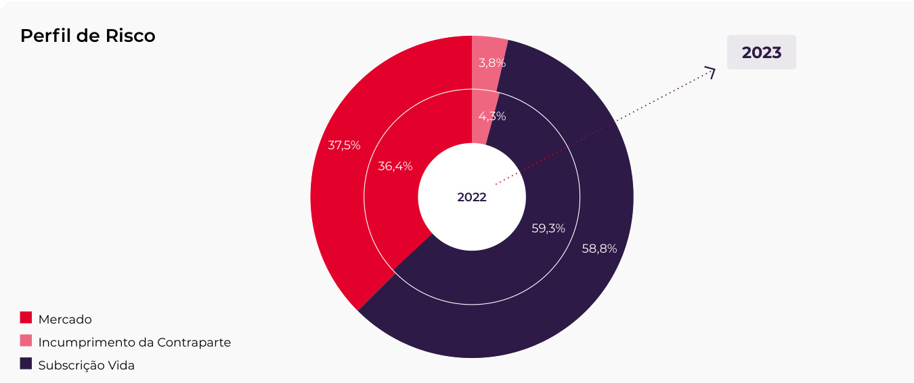
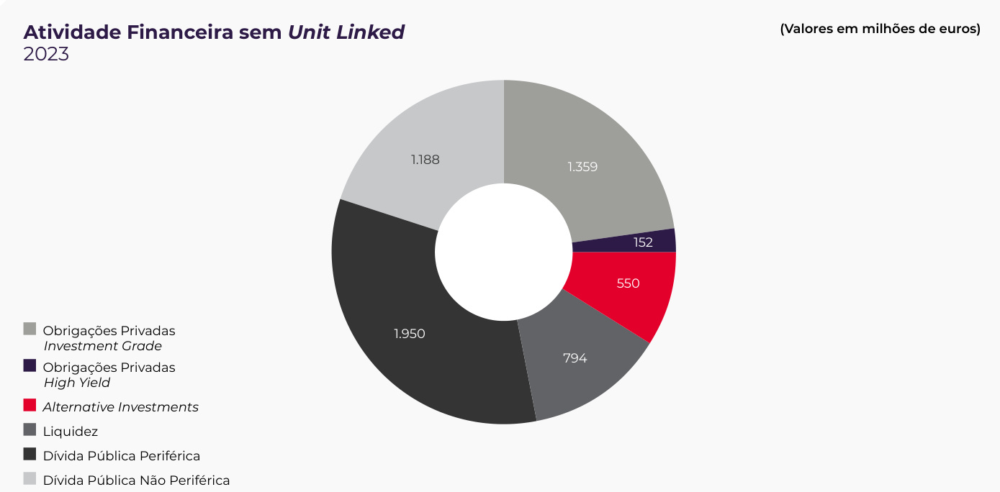
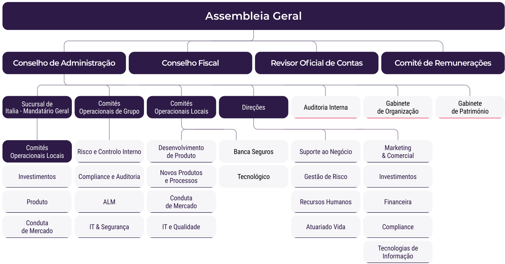
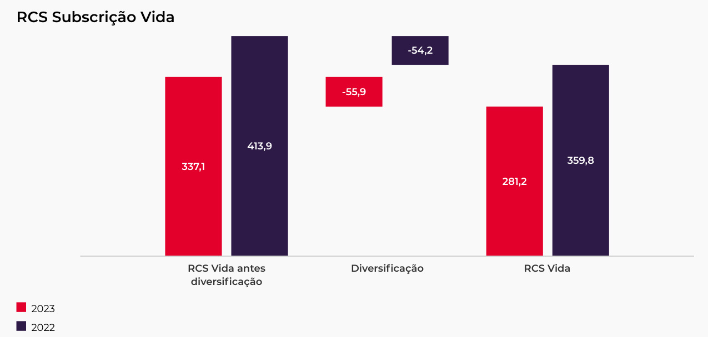
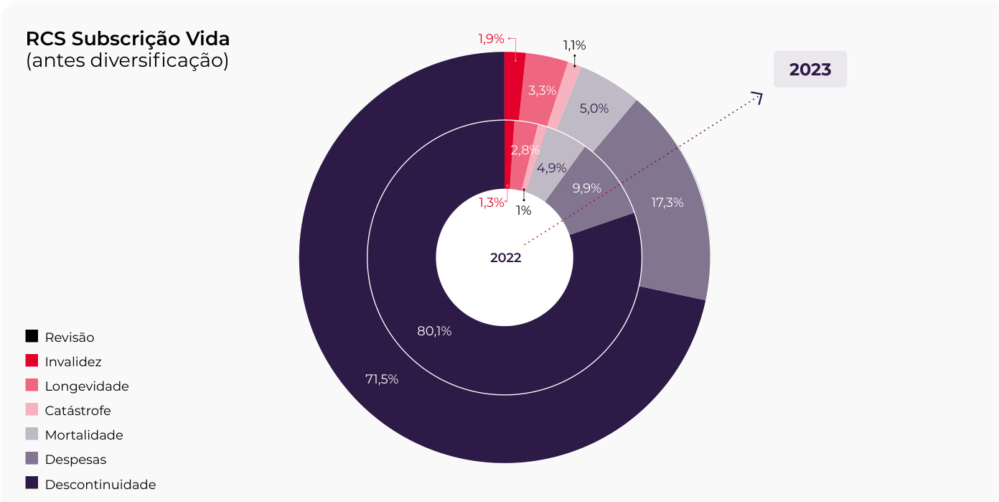
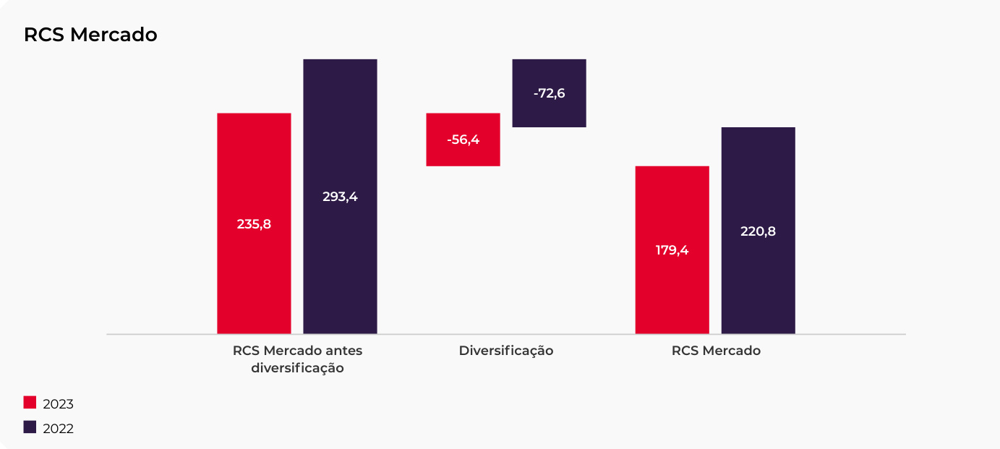
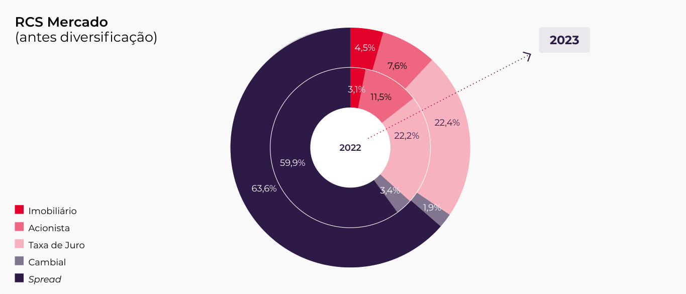
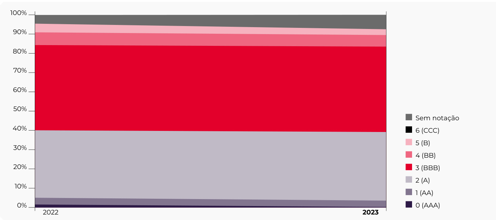
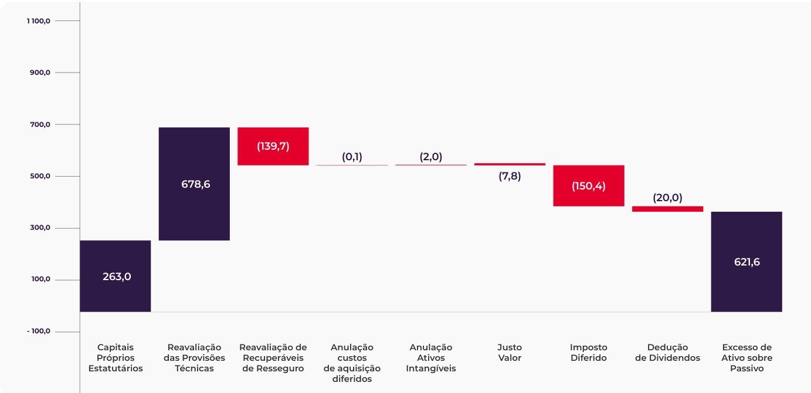
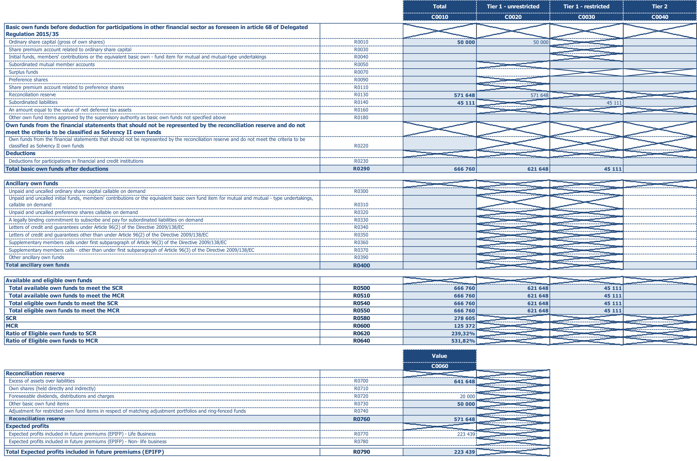

GamaLife   
Relatório Anual   
sobre a Solvência   
e a Situação   
Financeira   
RSSF  

ÍNDICE  

Sumário  

A.1. Atividades . .   
A.2. Desempenho da subscrição 9   
A.3. Desempenho dos investimentos 11   
A.4. Desempenho de outras atividades 14   
A.5. Eventuais informações adicionais 17  

# B Sistema de Governação 18  

# B.1. Informações Gerais sobre o Sistema de Governação   . . . . . . .  19  

B.1.1 Estrutura organizacional 19   
B.1.2. Informação sobre a Política de Remunerações  dos membros dos Órgãos Sociais . 25   
B.1.3. Informação sobre a Política de Remunerações dos colaboradores que exercem funções-chave e restantes   
colaboradores   . 26   
B.1.4. Transações materiais com o acionista 28  

# B.2. Requisitos de Qualifcação e Idoneidade   . . . . . . 29  

B.2.1. Princípios gerais da política de Fit and Proper 29   
B.2.2. Metodologia da política de Fit and Proper 29  

# C Perfl de Risco 38  

# C.1. Risco específco de seguros . . 40  

C.1.1. Subscrição e tarifação . 40   
C.1.2. Riscos Biométricos 40   
C.1.3. Riscos de descontinuidade 40   
C.1.4. Provisionamento 41   
C.1.5. Resseguro 41   
C.1.6. Quantifcação do requisito de capital do risco de subscrição vida . 41  

# C.2. Risco de mercado 43  

C.2.1. Sensibilidades 46  

# ÍNDICE  

C.3. Risco de crédito 47   
C.4. Risco de liquidez . . 48   
C.5. Risco operacional . . 48   
C.6. Outros riscos materiais . . 49   
C.7. Eventuais informações adicionais 49  

# D Avaliação para Efeitos de Solvência  . . 50  

# D.1. Ativos 52  

D.1.1. Ativos intangíveis e despesas diferidas 52   
D.1.2. Imóveis, instalações e equipamento para uso próprio 52   
D.1.3. Investimentos 52   
D.1.4. Recuperáveis de resseguro . 52   
D.1.5. Impostos diferidos . 53   
D.1.6. Caixa e seus equivalentes . 53   
D.1.7. Devedores por operações de seguro direto, de resseguro e outros 53   
D.1.8. Acréscimos e diferimentos  . 53  

# D.2. Provisões Técnicas . 54  

D.2.1. Metodologia de Cálculo das Provisões Técnicas 54   
D.2.2. Nível de Incerteza das Provisões Técnicas   . 54   
D.2.3. Provisões Técnicas  . 55   
D.2.4. Diferença entre as Provisões Técnicas e as demonstrações fnanceiras 56   
D.2.5.Impacto da medida de transição sobre as Provisões Técnicas   . 56   
D.2.6. Impacto do ajustamento de volatilidade nas Provisoes Técnicas . 57   
D.2.7. Provisões Económicas de Resseguro cedido   . 57  

# D.3. Outras Responsabilidades . 58  

D.3.1. Obrigações de benefícios dos empregados   . 58   
D.3.2. Credores por operações de seguro direto, de resseguro e outros . 58   
D.3.3. Passivos subordinados   . 58   
D.3.4. Acréscimos e diferimentos . 58   
D.3.5. Outras provisões 58   
D.3.6. Passivos por impostos diferidos 58  

# D.4. Métodos alternativos de avaliação . . . 59  

D.5. Eventuais informações adicionais   . . . . 59  

# E Gestão de Capital 60  

E.1. Fundos Próprios 61 E.1.1. Estrutura, montante e qualidade dos fundos próprios . 61 E.1.2. Diferenças entre os capitais próprios, tal como constam das demonstrações fnanceiras da empresa, e o excesso do ativo sobre o passivo, calculado para efeitos de solvência . .   63  

# GamaLife  

ÍNDICE  

E.1.3. Fundos Próprios Elegíveis 64  

E.2. Requisito de capital de solvência e requisito de capital mínimo . 65   
E.3. Utilização do submódulo de risco acionista baseado na duração para calcular o requisito de capital de solvência . . . . . . 67   
E.4. Diferenças entre a fórmula-padrão e qualquer modelo interno utilizado . . . . 67   
E.5. Incumprimento do requisito de capital mínimo e incumprimento do requisito de capital de solvência . . . 67   
E.6. Eventuais informações adicionais   . . . . 67  

Anexo 01 Certificação do Atuário Responsável  . . . 68   
Anexo 02 Certifcação pelo Revisor Ofcial de Contas 72   
Anexo 03 Informação Quantitativa  . . . 73  

SUMÁRIO  

# Sumário  

De acordo com o regime de Solvência II, as companhias de seguros e de resseguros devem divulgar publicamente e numa base anual, informação relativa à sua solvência e situação fnanceira, através do presente relatório - Relatório anual sobre a Solvência e a Situação Financeira (“RSSF”), que é publicado pela GamaLife – Companhia de Seguros de Vida, SA (que ao longo do documento aparece igualmente designada por GamaLife ou Companhia) para o exercício terminado em 31 de dezembro de 2023.  

Em dezembro de 2022, foi adquirida, através de uma sucursal constituida em Itália, uma carteira de apólices (cerca de 180.000 apólices de Vida e Pensões) à Zurich Investments Life S.p.A. (que incluiu também a transferência de ativos, passivos e colaboradores), sendo que esta sucursal irá ser progressivamente integrada na estrutura organizacional e de governação da GamaLife.  

A Companhia no exercício da sua atividade em Portugal, comercializa seguros essencialmente através das redes bancárias do Grupo Novo Banco (Novo Banco, Novo Banco dos Açores e Banco BEST), enquanto que o portfólio adquirido em Itália incorpora múltiplos distribuidores. A Companhia explora o ramo vida, comercializando seguros de capitalização, PPR (Planos Poupança Reforma) e seguros de Vida Risco.  

Os prémios registados pela GamaLife em 2023 são provenientes da sua atividade em Portugal, que mantém como objetivo primordial a adequação da sua carteira de produtos às necessidades dos clientes através do desenvolvimento e venda de novos produtos, e da sua sucursal em Itália que adquiriu uma carteira de produtos atualmente não abertos à comercialização, mas com entregas extraordinárias nos contratos existentes e planos para reabrir a novo negócio logo que tal seja operacionalmente possível.  

No que diz respeito à atividade em Portugal, o volume de negócios da Companhia, em 2023, atingiu 339,8 milhões de euros, o que corresponde a um aumento de $54,4\%$ face ao ano anterior, sendo que este aumento resulta dum aumento, face ao 2022, de mais de $100\%$ nos PPR.  

De salientar que ao nível da sucursal em Itália, os prémios registados durante 2023 representam cerca de $33\%$ do total sendo exclusivamente provenientes de prémios suplementares em produtos de investimento e de poupança para a reforma.  

A atual estrutura organizacional e de governação operacional foi aprovada em 16 de novembro de 2023, com objetivo de integrar a estrutura organizacional da sucursal da Companhia em Itália, bem como proceder a algumas alterações ao nível dos comités de suporte ao governo da GamaLife.  

O sistema de gestão de riscos implementado na Companhia é transversal a toda a estrutura organizacional, estando devidamente integrado no processo de tomada de decisão e é suportado por um conjunto de políticas, procedimentos, limites e alertas que representam o quadro para a gestão do risco.  

# GamaLife  

SUMÁRIO  

O perfl de risco da Companhia, incluindo a sucursal italiana, mantém-se estável, com o risco de subscrição vida a assumir o maior peso seguido do risco de mercado:  

  

Em 31 de dezembro de 2023 o Requisito de Capital de Solvência regulamentar (RCS) da GamaLife é de 278,6 milhões de euros, o que representa uma diminuição de 31,2 milhões de euros face ao Requisito de Capital de Solvência do ano anterior. Esta diminuição deveu-se ao decréscimo dos riscos de subscrição vida, de mercado e incumprimento da contraparte.  

Os rácios de solvência calculados entre os fundos próprios elegíveis (após a dedução da distribuição proposta de dividendos de 20 milhões de euros em 2023) e os requisitos de capital ascendiam, no fnal de 2023 e 2022, a:  

Valores em milhões de euros   

<html><body><table><tr><td>RaciosdeCobertura</td><td>2023</td><td>2022</td></tr><tr><td>FundosPropriosElegiveis para cobrir o RCS</td><td>666,8</td><td>615,0</td></tr><tr><td>Requisito de Capital de Solvencia (RCS)</td><td>278,6</td><td>309,8</td></tr><tr><td>RaciodeCoberturadoRCS</td><td>239,3%</td><td>198,5%</td></tr><tr><td>Fundos Proprios Elegiveis para cobrir o RCM</td><td>666,8</td><td>615,0</td></tr><tr><td>RequisitodeCapital Minimo (RCM)</td><td>125,4</td><td>139,4</td></tr><tr><td>RaciodeCoberturadoRCM</td><td>531,8%</td><td>441,1%</td></tr></table></body></html>  

Verifca-se uma subida nos rácios de cobertura do RCS e do RCM motivado principalmente pela diminuição do Requisito de Capital de Solvência, bem como o aumento dos Fundos Próprios Elegíveis.  

# Cap. A Atividades & Desempenho  

ATIVIDADES E DESEMPENHO  

# A.1. Atividades  

O capital Social da GamaLife é de 50.000.000 euros, representado por 50.000.000 ações com valor nominal de €1,00 (Um euro) cada.  

Em 10 de outubro de 2022, a Companhia abriu uma sucursal em Itália com o Registo Comercial de Milão Monza Brianze Lodi, registada com o código fscal e número de registo 12582180969.  

Em 19 de dezembro de 2022, a Companhia procedeu ao reembolso de uma emissão de dívida subordinada (prazo inicial de 20 anos), no montante de 45 milhões de euros, e mantém uma emissão de dívida subordinada sem prazo, no montante de 45 milhões de euros, cotada na Euronext Lisboa.  

A autoridade de supervisão é a ASF – Autoridade de Supervisão de Seguros e Fundos de Pensões, com sede na Avenida da República, 76, 1600-205 Lisboa. Adicionalmente e por força da existência de valores mobiliários admitidos à negociação, a GamaLife é igualmente supervisionada pela CMVM – Comissão do Mercado de Valores Mobiliários, com sede na Rua Laura Alves, 4, 1050-138 Lisboa.  

A conduta de mercado, o controlo de distribuição e o branqueamento de capitais da sucursal italiana, são supervisionados pela IVASS – Instituto per la Vigilanza Sulle Assicurazioni, com sede em Via del Quirinale, 21, 00187 Roma, Itália. Adicionalmente, a COVIP – Commissione di Vigilanza sui Fondi Pensione, com sede em Piazza Augusto Imperatore, 27 – 00186 Roma, é responsável pela supervisão dos produtos de pensões.  

O revisor ofcial de contas é a Ernst & Young, Audit & Associados, Sociedade de Revisores Ofciais de Contas, S.A. com sede na Avenida da Índia, 10 – Piso 1, 1349-066 Lisboa.  

A GBIG Portugal, S.A. é acionista único, detendo os 50 milhões de ações representativas do capital social da Companhia.  

A GamaLife exerce a sua atividade em Portugal e em Itália, comercializando seguros do ramo vida, mantendo alguns contratos antigos em Espanha em regime de livre prestação de serviços.  

A informação divulgada nos pontos seguintes está relatada em conformidade com as demonstrações fnanceiras da Companhia e respetivas Notas, com referência a 31 de dezembro de 2023.  

# A.2. Desempenho da subscrição  

A Companhia no exercício da sua atividade em Portugal, comercializa seguros essencialmente através das redes bancárias do Grupo Novo Banco (Novo Banco, Novo Banco dos Açores e Banco BEST), enquanto que o portfólio adquirido em Itália incorpora múltiplos distribuidores. A Companhia explora o ramo vida, comercializando seguros de capitalização, PPR (Planos Poupança Reforma) e seguros de Vida Risco.  

Os prémios registados pela GamaLife em 2023 são provenientes da sua atividade em Portugal, que mantém como objetivo primordial a adequação da sua carteira de produtos às necessidades dos clientes através do desenvolvimento e venda de novos produtos, e da sua sucursal em Itália que adquiriu uma carteira de produtos atualmente não abertos à comercialização, mas com entregas extraordinárias nos contratos existentes e planos para reabrir a novo negócio logo que tal seja operacionalmente possível.  

No que diz respeito à atividade em Portugal, o volume de negócios da Companhia, em 2023, atingiu 339,8 milhões de euros, o que corresponde a um aumento de $54,4\%$ face ao ano anterior, sendo que este aumento resulta dum aumento, face ao 2022, de mais de $100\%$ nos PPR.  

De salientar que ao nível da sucursal em Itália, os prémios registados durante 2023 representam cerca de $33\%$ do total sendo exclusivamente provenientes de prémios suplementares em produtos de investimento e de poupança para a reforma.  

# GamaLife  

ATIVIDADES E DESEMPENHO  

Apresenta-se no quadro abaixo a evolução dos prémios brutos emitidos:   
Valores em milhares de euros   

<html><body><table><tr><td rowspan="2">ProducaoTotal</td><td colspan="4">2023</td></tr><tr><td>Portugal Italia</td><td>Total</td><td>Portugal</td><td>Italia*</td></tr><tr><td>Total</td><td>339775</td><td>167 462 507236</td><td>220085</td><td>50484</td><td>2022 Total 270 569</td></tr><tr><td>PPR</td><td>239850</td><td>O</td><td>239850</td><td>66343 0</td><td>66343</td></tr><tr><td>ProdutosdeCapitalizacao</td><td>42579</td><td>107681</td><td>150260</td><td>95730</td><td>40453 136183</td></tr><tr><td>ProdutosdeRisco</td><td>57346</td><td>12686</td><td>70032</td><td>58012</td><td>1842 59854</td></tr><tr><td>OutrosProdutosTradicionais</td><td></td><td>47095</td><td>47095</td><td>O</td><td>8189 8189</td></tr></table></body></html>

Nota \* : 1 mês apenas  

A GamaLife registou um volume de prémios de 340 milhões de euros e uma quota de mercado de $6.7\%$ (em comparação com os $3,7\%$ em 2022), subindo duas posições no ranking das seguradoras Vida, ocupando agora a $5^{\circ}$ posição. É importante destacar a evolução positiva dos “seguros não ligados a fundos de investimento”, que alcançaram um volume de prémios de 295 milhões de euros, representando um crescimento de $182\%$ e uma quota de mercado de $7\%$ (em comparação com os $3{,}6\%$ em 2022). No entanto, nos “seguros ligados a fundos de investimento”, a produção foi de 45 milhões de euros, sofrendo uma redução de $67\%$ em relação a 2022, com uma quota de mercado de $3,7\%$ $(3,7\%$ em 2022).  

O quadro abaixo apresenta a evolução dos prémios brutos emitidos por tipo de contrato:  

Valores em milhares de euros   

<html><body><table><tr><td rowspan="2">Premios Brutos Emitidos por tipo de contrato</td><td colspan="5">2023</td></tr><tr><td>Portugal</td><td>Italia</td><td>Total</td><td>Portugal</td><td>2022 Italia* Total</td></tr><tr><td>Total</td><td>339 775</td><td>167462</td><td>507236</td><td>220085</td><td>50484 270 569</td></tr><tr><td>Contratos de Seguro</td><td>114444</td><td>167 462</td><td>281 906</td><td>96784 50484</td><td>147 268</td></tr><tr><td>Rendas Vitalicias</td><td>154</td><td>12 686</td><td>128 840</td><td>434</td><td>1842 2 276</td></tr><tr><td>RestantesProdutosRisco</td><td>57 191</td><td>0</td><td>57192</td><td>57578</td><td>0 57579</td></tr><tr><td>OutrosProdutos Tradicionais</td><td>0</td><td>47095</td><td>47095</td><td>0</td><td>8189 8189</td></tr><tr><td>Produtos de Capitalizacao</td><td>4109</td><td>107681</td><td>111790</td><td>13 113</td><td>40453 53566</td></tr><tr><td>PPR</td><td>52990</td><td>0</td><td>52990</td><td>25 659</td><td>0 25 659</td></tr><tr><td>ContratosdeInvestimento</td><td>225 330</td><td>0</td><td>225 330</td><td>123 301</td><td>0 123301</td></tr><tr><td>Produtos de Capitalizacao</td><td>38470</td><td>0</td><td>38470</td><td>82617</td><td>0 82617</td></tr><tr><td>PPR</td><td>186 860</td><td>0</td><td>186 860</td><td>40684</td><td>0 40684</td></tr></table></body></html>

Nota \* : 1 mês apenas  

Numa visão mais detalhada por tipo de produto centrada em Portugal, considerando de forma agregada os contratos de seguro e os contratos de investimento, verifca-se que:  

Os produtos PPR, registaram um aumento superior a $700\%$ face a 2022, acima da média do mercado que decresceu $77,5\%$ face ao ano anterior; • Os produtos de Capitalização, registaram uma quebra de $55,5\%$ face a 2022. Esta variação, apresenta uma performance mais negativa que a média do mercado, que registou uma diminuição de $20{,}4\%$ .  

A Companhia celebra tratados de resseguro para limitar a sua exposição a risco. O principal objetivo do resseguro é mitigar grandes sinistros individuais em que os limites de indemnização sejam elevados, bem como o impacto de múltiplos sinistros desencadeados por uma única ocorrência. Salienta-se nesta vertente o contrato de resseguro para proteção da retenção (eventos catastrófcos) celebrado no fnal de 2021 com a Suisse Re, que entrou em vigor em 1 de janeiro de 2022, e que complementou a proteção existente.  

# A.3. Desempenho dos investimentos  

O ano de 2023 apresentou um acréscimo na atividade fnanceira líquida relativamente ao ano anterior, devido essencialmente aos rendimentos que aumentaram face ao ano anterior cerca de 162 milhões de euros, é de notar que o valor de rendimentos registado em 2022 apenas considerava um mês de rendimentos tendo em conta a criação da sucursal em Itália e aquisição de parte do negócio da Zurich Itália em dezembro de 2022. A atividade fnanceira também foi positivamente infuenciada pelo crescimento dos ganhos líquidos de ativos e passivos ( $^{+69}$ milhões de euros em relação a 2022), embora com comportamentos dispares entre ativos e passivos mensurados ao justo valor através de ganhos e perdas $^{(+97,9}$ milhões de euros face a 2022) $\ominus$ ativos $\ominus$ passivos não mensurados ao justo valor através de ganhos e perdas (-22,7 milhões de euros relativamente a 2022) com um comportamento diferente em Portugal e Itália. Em contrapartida as diferenças de câmbio diminuíram para 13,1 milhões de euros face a 17,6 milhões de euros em 2022.  

Valores em milhares de euros   

<html><body><table><tr><td rowspan="2">Atividade Financeira Liquida</td><td colspan="5">2023 2022</td></tr><tr><td>Portugal</td><td>Italia</td><td>Total</td><td>Portugal</td><td>Italia Total</td></tr><tr><td>Total</td><td>40572</td><td>204798</td><td>245370</td><td>19888</td><td>(8 031) 11857</td></tr><tr><td>Rendimentos</td><td>46953</td><td>166 625</td><td>213 578</td><td>37569 13993</td><td>51562</td></tr><tr><td>Gastos financeiros</td><td>0</td><td>0</td><td>0</td><td>0</td><td>0 0</td></tr><tr><td>Ganhos liquidos de ativos e passivos financeiros nao mensurados ao justo valor através ganhoseperdas</td><td>(5 401)</td><td>(25 224)</td><td>(30 626)</td><td>(9 031)</td><td>1162 (7 869)</td></tr><tr><td>Ganhos liquidos de ativos e passivos financeiros valorizados aojusto valor através ganhos e perdas</td><td>8015</td><td>34253</td><td>42268</td><td>(27 763)</td><td>(21 909) (49 673)</td></tr><tr><td>Diferencas de cambio</td><td>(15 182)</td><td>28304</td><td>13 122</td><td>18 877</td><td>(1277) 17600</td></tr><tr><td>Ganhos liquidos de ativos nao financeiros que nao estejam classificados como ativos nao correntes e de unidades</td><td>4 491</td><td>0</td><td>4 491</td><td>462</td><td>0 462</td></tr><tr><td>operacionais descontinuadas Perdas deimparidade (liquidas reversao)</td><td>1696</td><td>840</td><td>2 536</td><td>(226)</td><td>0 (226)</td></tr></table></body></html>  

Por classe de ativos, a evolução dos rendimentos totais de investimentos (reconhecidos em ganhos e perdas) foi a seguinte:  

Valores em milhares de euros   

<html><body><table><tr><td rowspan="2">GanhosePerdas</td><td colspan="3">2023</td><td colspan="2">2022</td></tr><tr><td>Portugal</td><td>Italia</td><td>Total</td><td>Portugal Italia</td><td>Total</td></tr><tr><td>ClassedeAtivos</td><td>148703</td><td>211 683</td><td>360385</td><td>(169 006)</td><td>(8 537) (177544)</td></tr><tr><td>Obrigacoes</td><td>51272</td><td>143650</td><td>194923</td><td>(17 739) 13496</td><td>(4 243)</td></tr><tr><td>Acoes</td><td>6486</td><td>23566</td><td>30052</td><td>(3 518)</td><td>(3394) (6 911)</td></tr><tr><td>Imoveis</td><td>5 671</td><td></td><td>5 671</td><td>6393</td><td>0 6393</td></tr><tr><td>Outros</td><td>85273</td><td>44466</td><td>129740</td><td>(154 142)</td><td>(18 640) (172 782)</td></tr></table></body></html>  

Na conta de ganhos e perdas em 2023, em ações, foram reconhecidos $+30$ milhões de euros em ganhos (-6,9 milhões de euros no ano anterior) na sua grande maioria na carteira Unit Linked tanto em Portugal como Itália, acompanhando a performance positiva do mercado acionista ao longo do ano de 2023. O portfólio não Unit Linked, ao longo de 2023 em Portugal, não esteve investido no segmento acionista, e em Itália na carteira não Unit Linked a exposição residual existente no ano anterior foi alienada tendo  

# GamaLife  

# ATIVIDADES E DESEMPENHO  

sido obtido um ganho de 6 milhões de euros em 2023. No segmento de Obrigações, o rendimento reconhecido de juros em 2023 foi de 192,1 milhões de euros (41,3 milhões de euros no ano anterior) e em valias realizadas de 2,84 milhões de euros (-45,6 milhões de euros no ano anterior). O crescimento do rendimento de juros em 2023 deve-se principalmente à inclusão da carteira de obrigações da sucursal de Itália em dezembro de 2022, mas também ao reinvestimento dos ativos efetuado com taxas de rendimento mais elevadas ao longo de 2023. A Companhia continuou a sua estratégia de redução de risco no seu portfólio não Unit Linked ao longo de 2023 que, apesar de um comportamento globalmente positivo do mercado de obrigações, com uma redução das taxas de juro no último trimestre de 2023 face aos níveis de 2022 $\ominus$ maior parte de 2023, levou a um reconhecimento nestas carteiras de valias negativas de cerca de -10,1 milhões de euros. As carteiras Unit Linked ao longo de 2023 obtiveram $^{+72,9}$ milhões de euros em valias na classe de obrigações. A componente Outros é representada sobretudo por valias positivas em fundos de investimento mobiliário e em derivados nas carteiras Unit Linked em Portugal $(+76,6$ milhões de euros) e também Itália $(+40,7$ milhões de euros) devido ao comportamento positivo da globalidade do mercado em 2023. Na classe de Imobiliário, a GamaLife continuou a sua estratégia de redução de risco, tendo por isso vendido alguns ativos que levaram à realização de valias positivas de 0,1 milhões de euros aliado a uma valorização da carteira imobiliária de 4,3 milhões de euros, sendo o contributo desta classe de ativos  de $+5.7$ milhões de euros (6,4 milhões de euros no ano anterior).  

Por classe de ativos, a evolução dos rendimentos totais de investimentos (reconhecidos em reservas de justo valor) foi a seguinte:  

Valores em milhares de euros   

<html><body><table><tr><td rowspan="2">ReservadeJustoValor</td><td colspan="3">2023</td><td colspan="3">2022</td></tr><tr><td>Portugal</td><td>Italia</td><td>Total</td><td>Portugal</td><td>Italia</td><td>Total</td></tr><tr><td>ClassedeAtivos</td><td>(97 476)</td><td>381</td><td>(97096)</td><td>(202 029)</td><td>(181 890)</td><td>(383919)</td></tr><tr><td>Obrigacoes</td><td>(97 476)</td><td>381</td><td>(97 096)</td><td>(204580)</td><td>(181151)</td><td>(385 731)</td></tr><tr><td>Acoes</td><td></td><td>O</td><td>0</td><td>112</td><td>(2 716)</td><td>(2 604)</td></tr><tr><td>Imoveis</td><td></td><td>O</td><td>O</td><td>O</td><td>O</td><td>O</td></tr><tr><td>Outros</td><td>O</td><td>O</td><td></td><td>2439</td><td>1977</td><td>4416</td></tr></table></body></html>  

Em 2023, ocorreu uma variação positiva da Reserva de Justo Valor $^{+286,8}$ milhões de euros face a 2022. Esta variação positiva advém principalmente da redução das taxas de juro no mercado ao longo de 2023. Esta variação das taxas de juro, acompanhado por uma diminuição dos spreads de crédito teve um impacto nas Reservas de Justo Valor de Obrigações em 2023 de $+288.6$ milhões de euros, $+707,$ 1 milhões de euros em Portugal e +181,5 milhões de euros na sucursal em Itália. Note-se que esta variação das taxas de juro teve um efeito em sentido oposto no valor de mercado das provisões matemáticas.  

A GamaLife detinha a 31/12/2023, nas carteiras em que o risco é assumido pelo tomador do seguro, os seguintes investimentos em titularizações:  

Valores em euros   

<html><body><table><tr><td>Designacao Ativo</td><td>ISIN</td><td>Rating</td><td>2023</td><td>2022</td></tr><tr><td>TAGSTA1ENGYMTG/2009-12/05/2025</td><td>PTTGUAOMOOO5</td><td>Aa2</td><td>461919</td><td>850756</td></tr><tr><td>Total</td><td></td><td></td><td>461919</td><td>850756</td></tr></table></body></html>  

A GamaLife continuou a reduzir o risco de crédito na carteira tanto em Portugal como em Itália, continuando a estratégia de investimento do ano anterior, tendo continuado a redução da exposição aos nomes “high yield” (com um “credit quality step” a partir do nível 4 (notação de rating equivalente a BB)) e alguns emitentes “investment grade” (com um “credit quality step” até ao nível 3 (notação de rating equivalente a BBB)), assim como a redução da exposição ao mercado acionista. A liquidez resultante da redução de alguns investimentos de risco foi reinvestida em títulos do tesouro de curto prazo, que,  

# GamaLife  

# ATIVIDADES E DESEMPENHO  

continuaram a apresentar um rendimento francamente positivo. Simultaneamente, ao contrário do ano anterior, tendo em conta o valor alto das yields, a Companhia encetou algumas estratégias de extensão de duração em dívida de governos europeus principalmente não periféricos e a exposição a dívida governamental periférica foi drasticamente reduzida durante o ano.  

Atualmente a dívida de empresas “investment grade” representa $22,7\%$ da carteira não garantida $\ominus2,5\%\ominus$ investido em emissores corporativos “high yield” e dívida subordinada de emissores corporativos “investment grade”. A exposição a dívida pública de países periféricos diminuiu cerca de $-27.1\%$ e a dívida pública de países não periféricos aumentou $15,6\%$ . Na carteira total, esta classe de ativos representa $65.7\%$ da carteira de investimentos $(59,7\%$ no ano anterior), $12.7\%$ da exposição são Bilhetes do Tesouro (dívida de curto prazo na sua grande maioria a países não periféricos).  

  

A exposição a ações negociadas no mercado regulamentado é muito reduzida e no fnal de 2023 cingia-se praticamente a carteiras Unit Linked e de acordo com as políticas de investimento em vigor. Nas carteiras não Unit Linked, geridas diretamente pela Companhia, não existe exposição ao mercado acionista na carteira da GamaLife, tendo sido dada continuidade à estratégia dos anos anteriores de redução a esta classe de ativos, tendo em conta a volatilidade do mercado acionista e o eventual impacto nos rácios de solvência.  

Relativamente às carteiras Unit Linked, a GamaLife contratou um conjunto de gestores para a gestão adequada dos seus portfólios de acordo com as políticas de investimento defnidas. Os acordos existentes, por serem anteriores à Lei n.º 50/2020 de 25 de agosto, não incluem explicitamente os requisitos do Artigo 251.º-C número 2, alíneas a), b), c) e d). No entanto, tendo em conta que as políticas de investimento defnidas têm em consideração o perfl de risco dos passivos, pelo cumprimento da política de investimento o gestor de ativos alinha a sua estratégia de investimento aos interesses da GamaLife e dos seus clientes. Os acordos com gestores de ativos são renovados anualmente, podendo ser cancelados com pré-aviso de 3 meses.  

# A.4. Desempenho de outras atividades  

Os custos de exploração líquidos da GamaLife apresentam um aumento de cerca de $72,8\%$ face ao ano anterior. De referir que em termos globais os dois períodos não são diretamente comparáveis, pelo facto de 2022 apenas representar um mês de custos em Itália. No que diz respeito a Portugal, registou-se um aumento de $4{,}0\%$ face ao período homologo, essencialmente devido ao aumento dos custos com comissões decorrente do aumento do volume da produção, bem como ao aumento das amortizações e depreciações de ativos intangíveis na sequência da conclusão de projetos críticos e estratégicos.  

O quadro abaixo apresenta os custos alocados por função:  

Valores em milhões de euros   

<html><body><table><tr><td rowspan="2">Custos e Gastos de Exploracao</td><td colspan="3">2023</td><td colspan="3">2022</td></tr><tr><td>Portugal</td><td>Italia</td><td>Total</td><td>Portugal</td><td>Italia*</td><td>Total</td></tr><tr><td>Total</td><td>(37,8)</td><td>(41,1)</td><td>(78,9)</td><td>(36,3)</td><td>(9,3)</td><td>(45,6)</td></tr><tr><td>CustosdeAquisicao</td><td>(18,6)</td><td>(25,1)</td><td>(43,7)</td><td>(16,9)</td><td>(3,2)</td><td>(20,1)</td></tr><tr><td>CustosAdministrativos</td><td>(8,5)</td><td>(11,0)</td><td>(19,6)</td><td>(9,6)</td><td>(5,4)</td><td>(15,1)</td></tr><tr><td>CustoscomSinistros</td><td>(1,4)</td><td>0,0</td><td>(1,4)</td><td>(1,5)</td><td>0.0</td><td>(1,5)</td></tr><tr><td>CustoscomInvestimentos</td><td>(9,2)</td><td>(4,9)</td><td>(14,2)</td><td>(8,3)</td><td>(0,6)</td><td>(9,0)</td></tr></table></body></html>

Nota \* : 1 mês apenas  

Decorrente da adoção da norma IFRS 17 os custos são classifcados entre custos atribuíveis $\ominus$ não atribuíveis a contratos de seguros de acordo com determinados critérios.  

• Custos diretamente atribuíveis: Estes custos estão diretamente ligados aos contratos de seguro e são classifcados em duas categorias:  

ݕ Custos de Aquisição: Associados ao início, venda ou subscrição incluindo comissões pagas aos distribuidores.   
ݕ Custos Administrativos: Relacionados com a manutenção contínua das apólices.  

• Custos não diretamente atribuíveis: Estes custos não estão diretamente ligados a contratos de seguro.  

Na GamaLife em 2023 os custos diretamente atribuíveis a contratos de seguro representam $77,\!3\%$ do total dos Custos de Exploração..  

Valores em milhões de euros  

Nota \* : 1 mês apenas   

<html><body><table><tr><td rowspan="2">Custos deExploracao</td><td colspan="5">2023</td></tr><tr><td>Portugal</td><td>Italia</td><td>Total</td><td>Portugal</td><td>2022 Italia* Total</td></tr><tr><td>Total</td><td>(37,8)</td><td>(41,1)</td><td>(78,9)</td><td>(36,3)</td><td>(9,3) (45,6)</td></tr><tr><td>CustosAtribuiveisaContratosdeSeguro</td><td>(16,3)</td><td>(40,0)</td><td>(56,2)</td><td>(17,2) (5,6)</td><td>(22,8)</td></tr><tr><td>CustosNaoAtribuiveis</td><td>(21,5)</td><td>(1,1)</td><td>(22,6)</td><td>(19,2)</td><td>(3,7) (22,9)</td></tr></table></body></html>  

# GamaLife  

ATIVIDADES E DESEMPENHO  

Apresentam-se no quadro seguinte os Gastos Gerais por Natureza:   
Valores em milhões de euros   

<html><body><table><tr><td rowspan="2">Gastos por Natureza</td><td colspan="3">2023</td><td colspan="3">2022</td></tr><tr><td>Portugal</td><td>Italia</td><td>Total</td><td>Portugal</td><td>Italia*</td><td>Total</td></tr><tr><td>Total</td><td>(37,8)</td><td>(41,1)</td><td>(78,9)</td><td>(36,3)</td><td>(9,3)</td><td>(45,6)</td></tr><tr><td>Gastos Operacionais</td><td>(13,5)</td><td>(14,9)</td><td>(28,4)</td><td>(13,4)</td><td>(6,3)</td><td>(8'6L)</td></tr><tr><td>Gastos com pessoal</td><td>(5,2)</td><td>(2,8)</td><td>(8,0)</td><td>(5,5)</td><td>(0,2)</td><td>(5,7)</td></tr><tr><td>Fornecimentos e servicos externos</td><td>(7,4)</td><td>(12,0)</td><td>(19,4)</td><td>(10,2)</td><td>(2,4)</td><td>(12,6)</td></tr><tr><td>Impostos e taxas</td><td>(0,3)</td><td>(0,1)</td><td>(0,4)</td><td>2,4</td><td>(3,7)</td><td>(1,3)</td></tr><tr><td>Depreciacoes e amortizacoes</td><td>(0,6)</td><td>(0.0)</td><td>(0,6)</td><td>(0,1)</td><td>(0,0)</td><td>(0,1)</td></tr><tr><td>Outros gastos de natureza financeira</td><td>(22,7)</td><td>(26,2)</td><td>(48,9)</td><td>(20,3)</td><td>(3,0)</td><td>(23,3)</td></tr><tr><td>Jurossuportados</td><td>(3,0)</td><td>0,0</td><td>(3,0)</td><td>(2,6)</td><td>0.0</td><td>(2,6)</td></tr><tr><td>Comissoes</td><td>(2,5)</td><td>(1,1)</td><td>(3,6)</td><td>(2,5)</td><td>0.0</td><td>(2,5)</td></tr><tr><td>Remuneracoes de mediacao</td><td>(17,2)</td><td>(25,1)</td><td>(42,3)</td><td>(15,3)</td><td>(3,0)</td><td>(18,2)</td></tr><tr><td>Outrasprovisoes</td><td>(1,5)</td><td>0,0</td><td>(1,5)</td><td>(2,6)</td><td>0,0</td><td>(2,6)</td></tr></table></body></html>

Nota \* : 1 mês apenas  

Os Custos e Gastos por Natureza em termos globais, registaram um aumento de cerca de $72,8\%$ face ao ano anterior. Os dois períodos não são diretamente comparáveis pois 2022 apenas apresenta um mês de custos em Itália.  

de seguida a evolução dos custos por natureza, por unidade de  

# Portugal  

Em Portugal, os Gastos por Natureza registaram um aumento $4{,}0\%$ comparativamente com o período homólogo. Esta evolução, deve-se essencialmente ao aumento dos gastos de natureza fnanceira (juros da divida subordinada e comissões) e ao aumento das depreciações e amortizações resultantes da conclusão de projetos críticos e estratégicos específcos (ex: IFRS 17), dando início à depreciação do respetivo ativo intangível.  

De salientar a estabilização dos custos com fornecimentos e serviços externos. Esta rubrica em 2022 foi impactada por custos de implementação de projetos críticos e estratégicos, nomeadamente a aquisição da sucursal em Itália e a implementação das normas internacionais de relato fnanceiro IFRS 17 e 9.  

Em 2022 procedeu-se à reclassifcação de custos do ano anterior relativos à taxa de IMI agravada aplicável à carteira imobiliária da GamaLife em Portugal na sequência das alterações incluídas no Orçamento do Estado para 2021, tendo passado da rubrica de “Gastos de natureza operacional” para a de “Outras provisões”.  

# GamaLife  

# ATIVIDADES E DESEMPENHO  

# Itália  

Os custos da sucursal em Itália em 2023 refetem o custo de 12 meses, enquanto em 2022 apenas refetem 1 mês, não sendo, portanto, comparáveis.  

De referir, no entanto, que os gastos operacionais de 2023 da sucursal estão a ser infuenciados por projetos estruturais decorrentes de custos de migração de IT.  

Quando expressamos os Custos e Gastos por Natureza (operacionais, de natureza fnanceira e outros) em função da totalidade dos ativos/passivos fnanceiros, verifcamos um aumento em 2023, decorrente do aumento dos custos em Itália, como se pode constatar no quadro seguinte:  

<html><body><table><tr><td rowspan="2">Custos por Natureza Ativos&PassivosFinanceiros</td><td colspan="5">2023</td></tr><tr><td>Portugal</td><td>Italia</td><td>Total</td><td>Portugal</td><td>2022 Italia Total</td></tr><tr><td>Total</td><td>1,3%</td><td>0,8%</td><td>1,0%</td><td>1,3%</td><td>0,2% 0,5%</td></tr><tr><td>Gastosde Natureza Operacional</td><td>0,5%</td><td>0,4%</td><td>0,4%</td><td>0,5% 0,1%</td><td>0,2%</td></tr><tr><td>GastosdeNaturezaFinanceira</td><td>0,7%</td><td>0,5%</td><td>0,6%</td><td>0,6%</td><td>0,1% 0,2%</td></tr><tr><td>OutrosGastos</td><td>0,2%</td><td>0,0%</td><td>0,1%</td><td>0,2% 0,0%</td><td>0,1%</td></tr></table></body></html>  

O quadro seguinte espelha a evolução de passivos/(ativos) de contratos de seguro/resseguro e passivos fnanceiros:  

Valores em milhões de euros   

<html><body><table><tr><td rowspan="2">Passivos /(Ativos)</td><td colspan="5">2023</td></tr><tr><td>Portugal</td><td>Italia</td><td>Total</td><td>Portugal</td><td>2022 Italia Total</td></tr><tr><td>Total</td><td>2867,4</td><td>4971,9</td><td>7839,3</td><td>2 797,5</td><td>5805,9 8 603,5</td></tr><tr><td>Passivos /(Ativos) contratos Seguro/Resseguro</td><td>1 221,9</td><td>4 971,9</td><td>6193,8</td><td>1310,4 5805,9</td><td>7116,4</td></tr><tr><td>PassivosFinanceiros</td><td>1645,5</td><td>0.0</td><td>1645,5</td><td>1487,1</td><td>0,0 1487,1</td></tr></table></body></html>  

# GamaLife  

ATIVIDADES E DESEMPENHO  

O aumento dos passivos fnanceiros face ao ano anterior resulta do relançamento dos produtos garantidos em Portugal tirando partido da conjuntura de taxas de juro mais elevadas.  

O quadro seguinte apresenta a evolução de ativos e passivos dos contratos de seguro da GamaLife, incluindo a sucursal em Itália adquirida em 1 de dezembro de 2022.  

<html><body><table><tr><td rowspan="2">Passivos /(Ativos) contratos Seguro/ Resseguro</td><td colspan="5">2023 2022</td></tr><tr><td>Portugal</td><td>Italia</td><td>Total</td><td>Portugal</td><td>Italia* Total</td></tr><tr><td>Total</td><td>1 221,9</td><td>4 971,9</td><td>6193,8</td><td>1310,4</td><td>5 805,9 7116,4</td></tr><tr><td>Ativosdecontratosderesseguro doramoVida</td><td>8,7</td><td>0,0</td><td>8,7</td><td>0,0</td><td>0,0 0,0</td></tr><tr><td>ServicosFuturos</td><td>1 221,2</td><td>4967,2</td><td>6188,4</td><td>1293,4 5 797,8</td><td>7091,2</td></tr><tr><td>ServicosPassados</td><td>1159,5</td><td>4 874,6</td><td>6 034,1</td><td>1239,8 5 685,3</td><td>6 925,0</td></tr><tr><td>Ativos de contratos de seguro do ramo Vida</td><td>61,8</td><td>92,6</td><td>154,3</td><td>53,6</td><td>112,5 166,2</td></tr><tr><td>Passivosdecontratosdeseguro doramoVida</td><td>(8,0)</td><td>4,7</td><td>(3,3)</td><td>17,0</td><td>8,2 25,2</td></tr><tr><td>Servicos Futuros</td><td>(18,6)</td><td>4,5</td><td>(14,1)</td><td>5,6</td><td>8,1 13,7</td></tr><tr><td>ServicosPassados</td><td>10,6</td><td>0,2</td><td>10,8</td><td>11,4</td><td>0,0 11,5</td></tr></table></body></html>

Nota \* : 1 mês apenas  

# A.5. Eventuais informações adicionais  

Nada a referir.  

# Cap. B Sistema de Governação  

# B.1. Informações Gerais sobre o Sistema de Governação  

# B.1.1 Estrutura organizacional  

A atual estrutura organizacional e de governação operacional foi aprovada em 16 de novembro de 2023, com objetivo de integrar a estrutura organizacional da sucursal da Companhia em Itália, bem como proceder a algumas alterações ao nível dos comités de suporte ao governo da GamaLife.  

Em dezembro de 2022, foi adquirida, através de uma sucursal constituída em Itália, uma carteira de apólices (cerca de 180.000 apólices de Vida e Pensões) à Zurich Investments Life S.p.A. (que incluiu também a transferência de ativos, passivos e colaboradores), sendo que esta sucursal irá ser progressivamente integrada na estrutura organizacional e de governação da GamaLife. Importa referir que foi assinado entre a GamaLife e a Zurich Investments Life S.p.A. um acordo de transição (Transition Service Agreement -TSA), cujo principal objetivo foi de assegurar a transição segura e equilibrada entre as duas companhias de um conjunto de serviços e processos, que serão, de forma gradual e progressiva, internalizados pela GamaLife em Itália, num espaço temporal previsto de pelo menos um ano.  

Com base neste novo modelo organizacional, foram alterados os seguintes pelouros ao nível da Administração: Gonçalo de Castro Pereira – pelouro do Gabinete de Organização (anteriormente com Alistair Wallace Bell).  

Em abril de 2023 verifcou-se a substituição do responsável da Direção de Investimentos, cujo antecessor cessou as suas funções em junho de 2023, tendo até à data da substituição esta função sido assegurada pelo administrador do pelouro, Matteo Castelvetri.  

Durante outubro de 2023 verifcou-se a substituição do responsável da Direção de Recursos Humanos, cujo antecessor cessou as suas funções nessa mesma data.  

Com a nova organização aprovada, os Comités de apoio ao governo da Companhia foram revistos, e segregados entre comités comuns às estruturas da sede e da sucursal de Itália, e comités locais, devendo esta nova estrutura ser aplicável a partir de 1 de janeiro de 2024. Abaixo indicamos as funções de cada comité, bem como indicação se se trata de um comité comum a ambas as estruturas, ou um comité local.  

Em conformidade com a Norma Regulamentar $\mathsf{n}^{\circ}$ 7/2022-R, de 7 de junho, foi criada a nova função autónoma responsável pela Conduta de Mercado, tendo sido aprovada pelo Conselho de Administração no dia 13 de janeiro de 2023. Esta função encontra-se integrada na Direção de Suporte ao Negócio, em acumulação com a função autónoma de gestão de reclamações, baseada no princípio da proporcionalidade.  

Foi substituído o Atuário Responsável no decorrer de 2023, tendo sido aprovado pela ASF, o registo do novo Atuário Responsável, Javier Muñoz, em 23 de janeiro de 2024.  

Durante 2023, dando cumprimento à Norma Regulamentar n.º4/2022-R, de 26 de abril, foi instituído em 17 de maio de 2023, através de aprovação na Assembleia Geral de Acionistas, o Comité de Remunerações, sido o mesmo constituído pelo membros efetivos do Conselho Fiscal em funções.  

# GamaLife  

B SISTEMA DE GOVERNAÇÃO  

O organigrama abaixo representa o último organigrama formalmente aprovado pela Companhia, que representa a sua estrutura de funcionamento à data do presente relatório.  

  
Comités que reportam ao Conselho de Administração Funções que reportam ao Conselho de Administração Comités com participantes do Distribuidor  

A estrutura organizativa segue o princípio da segregação e independência das principais áreas-chave, nomeadamente a independência da Direção de Gestão de Risco, Direção de Compliance, Direção de Auditoria Interna e Direção de Atuariado Vida. As descrições de funções dos titulares destas áreas-chave encontram-se nas secções B.3 a B.6 do presente relatório.  

O atual Conselho de Administração é composto por quatro elementos, todos eles com funções executivas e reúne-se, preferencialmente, de forma mensal. O Conselho não pode deliberar sem que esteja presente ou representada a maioria dos seus membros.  

As seguintes matérias deverão necessariamente ser discutidas e aprovadas por deliberação do Conselho de Administração da GamaLife:  

• Aprovação de contratos com terceiros cujos valores/ responsabilidades excedam em $10\%$ as despesas totais anuais da Sociedade (excluindo despesas com comissões e partilha de lucros);   
• Concessão de fnanciamentos, depósitos, ou prestação de garantias acima do valor de um milhão de euros;   
• Aquisição, oneração ou alienação de bens imóveis por valor superior a 5 milhões de euros, desde que os bens imóveis sejam utilizados na gestão corrente da Sociedade;   
• Solicitação de fnanciamentos ou criação de passivo acima dos dez milhões de euros (por transação);   
• Licenciamento ou concessão de direitos sobre a propriedade intelectual ou industrial da Sociedade;   
• Alargamento ou redução da atividade social ou modifcação do objeto da Sociedade;   
• Aprovação do Balanço e contas da Companhia e todos os documentos legais de prestação de contas da Sociedade;   
• Aprovação de proposta de aplicação de resultados;   
• Emissão de obrigações.  

B SISTEMA DE GOVERNAÇÃO  

Por proposta do acionista, foi aprovada em 25 de março de 2022, em Assembleia Geral Anual da Companhia, a recondução de Matteo Castelvetri (executivo), Gonçalo Colaço de Castro Pereira (executivo), Alistair Wallace Bell (executivo), Filomena Teresa Mil-Homens Ferreira Santos (executivo), que acumulará funções com as que atualmente desempenha ao nível da direção técnica da Direção de Atuariado Vida em Portugal, e a partir de novembro de 2023, também na Direção de Atuariado Vida em Itália.  

No mesmo dia, por deliberação do Conselho de Administração, foi eleito Matteo Castelvetri, para desempenhar o cargo de Presidente do Conselho de Administração e Gonçalo Colaço de Castro Pereira para desempenhar o cargo de Vice-Presidente do Conselho de Administração.  

A Gestão da Sociedade é assim assegurada por um Conselho de Administração composto por 4 Administradores designados para o triénio de 2022-2024, tendo os mesmos sido reconduzidos por eleição em Assembleia Geral ocorrida em 25 de março de 20221. Estes administradores assumiram funções executivas, com os poderes de gestão diária e corrente da GamaLife, que por lei são delegáveis, com exceção dos previstos no artigo 407.º, número 4 do Código das Sociedades Comerciais e das matérias que, nos termos do artigo 21.º, n.º 3 do contrato de sociedade, devam necessariamente ser discutidas e aprovadas por deliberação do Conselho de Administração.  

O Conselho Fiscal é composto por um presidente, dois membros efetivos e um membro suplente, reunindo-se ordinariamente pelo menos uma vez em cada três meses e sempre que o presidente o entender ou algum dos restantes membros o solicitar. Foram reconduzidos, para o triénio de 2022- 2024, em Assembleia Geral de Acionistas ocorrida no dia 25 de março de 2022, o seu Presidente António Andrade Gonçalves, os dois membros efetivos João José Barragàn Pires e Paulo Guilherme Marques, e o membro suplente Paulo Ribeiro da Silva.  

Os membros do Conselho Fiscal devem exercer uma fscalização conscienciosa e imparcial, dar conhecimento à administração das verifcações, fscalizações e diligências que tenham feito e do resultado das mesmas e ainda emitir os relatórios e pareceres obrigatórios por lei.  

A fscalização externa da Companhia é assegurada pelo Revisor Ofcial de Contas e Auditor Externo da GamaLife, a Ernst & Young, Audit & Associados, SROC, S.A., nomeados em Assembleia Geral de Acionistas no dia 17 de maio de 2023, por um período de três anos (2023-2025), bem como pelas entidades de supervisão a que a GamaLife está sujeita.  

A Mesa da Assembleia Geral é composta por um Presidente e um secretário, tendo sido reeleitos respetivamente para esses cargos, na Assembleia Geral de Acionistas no dia 17 de maio de 2023, para o mandato de 2023, Mário Lino Dias e José Miguel de Seabra Lopes Marcão.  

Desde 28 de dezembro de 2022, que Raffaele Agrusti se encontra autorizado pela ASF, como mandatário geral da Sucursal, em Itália, da GamaLife – Companhia de Seguros de Vida, S.A..  

Foi criado a 17 de maio de 2023, o Comité de Remunerações, para os quais foram nomeados António Andrade Gonçalves, João José Barragàn Pires e Paulo Guilherme Marques. Este Comité tem como funções prestar apoio ao órgão de administração na defnição da política de remuneração da Companhia, preparar decisões e recomendações sobre remuneração, rever anualmente a política de remuneração e a sua implementação e funcionamento.  

Está igualmente previsto o funcionamento de órgãos multidisciplinares (Comités) sobre diversos temas transversais. A organização e funcionamentos desses comités, conforme referido acima, foi revista em 16 de novembro de 2023. É de referir que foi efetuado um esforço pela Companhia para que estes comités se reunissem de forma regular, ainda que alguns não se tenham reunido com a frequência prevista.  

B SISTEMA DE GOVERNAÇÃO  

# Comités Comuns (Portugal & Itália):  

# Comité ALM  

O Comité reúne mensalmente. As atribuições do Comité são a monitorização de ativo/passivo, da performance dos investimentos, da execução da política de investimentos e dos riscos de mercado, dos rácios de cobertura do requisito de capital de solvência, do apetie ao risco e da adequação dos fuxos de caixa. O organizador do Comité é a Direção de Gestão de Risco da GamaLife, sendo os seus membros permanentes os membros do Conselho de Administração e os responsáveis das Direções de Investimentos, Atuariado Vida, Financeira e Compliance.  

# Comité de Risco e Controlo Interno  

O Comité de Risco e Controlo Interno reúne semestralmente e tem como funções analisar e avaliar riscos operacionais, incluindo a sua identifcação, avaliação, quantifcação e monitorização. É também responsável por analisar e avaliar a efetividade da implementação da Política de Subcontratação e acompanhar o controlo das atividades de subcontratação, em particular, as consideradas críticas ou importantes. O organizador do Comité é a Direção de Gestão de Risco, sendo os seus membros permanentes os membros do Conselho de Administração, o Responsável da Função Atuarial, o responsável da Direção de Compliance, da Direção de Atuariado Vida, da Direção Financeira, de forma ad hoc os Diretores das Direções relevantes relativos às matérias em discussão. O Conselho Fiscal pode ser convidado.  

# Comité de Compliance e Auditoria Interna  

O Comité reúne semestralmente. As atribuições do Comité são:  

• Rever regularmente o Código de Conduta e demais políticas de compliance em vigor e monitorizar o seu cumprimento;   
• Monitorização da política antifraude e das medidas de controlo adotadas para prevenção da fraude;   
• Informar o Comité caso o órgão de administração ou alguma direção no âmbito das suas competências, não seguir ou implementar uma recomendação feita pelo Comité, no exercício das suas funções de monitorização e análise, relativamente às matérias acima mencionadas, referindo as razões que a motivaram;   
• Informar o Comité da realização e dos resultados das auditorias internas levadas a cabo pela função de auditoria interna;   
• Monitorização das recomendações de compliance e auditoria interna.  

O organizador do Comité é a Direção de Compliance, sendo os seus membros permanentes os membros do Conselho de Administração, o responsável da Direção de Gestão do Risco, o responsável da Direção de Suporte ao Negócio, o responsável da Direção Financeira, o responsável da Direção de Investimentos, o responsável da Direção de Tecnologias de Informação, o responsável da Direção de Atuariado Vida, o responsável da Direção de Marketing e Comercial, o responsável da Direção de Recursos Humanos e o Encarregado de Proteção de Dados (DPO). O Conselho Fiscal pode ser convidado.  

# Comité IT e Segurança  

O Comité reúne semestralmente. As atribuições do Comité são o acompanhamento dos projetos informáticos e dos serviços prestados. Monitorização e avaliação da Segurança da Informação e da Segurança Física e propor novas políticas e controlos para aumentar a segurança das pessoas, bens e informação. O organizador do Comité é a Direção de Tecnologias de Informação, sendo os seus membros permanentes os membros do Conselho de Administração, e os responsáveis das Direções de Marketing e Comercial, Suporte ao Negócio, Gestão de Risco, Compliance e Recursos Humanos, e de forma ad hoc, o responsável da Direção de Atuariado Vida, de Investimentos e da Financeira.  

B SISTEMA DE GOVERNAÇÃO  

# Comités Locais (Portugal):  

# Comité Bancasseguros  

O Comité reúne mensalmente. As atribuições do Comité são a defnição da oferta de produtos a comercializar na rede de balcões do Grupo Novo Banco, bem como as ações comerciais a implementar, a análise dos resultados comerciais e redefnição de estratégias comerciais para o cumprimento do Orçamento anual de vendas. O organizador do Comité é a Direção de Marketing e Comercial (DMC) da GamaLife, sendo os seus membros permanentes os membros do Conselho de Administração da GamaLife e do Novo Banco com os pelouros da área do Marketing e Comercial, e as equipas de Marketing e Comercial do Banco e da Companhia.  

# Comité Tecnológico  

O Comité reúne semestralmente. As atribuições do Comité são a defnição da estratégia tecnológica e apresentação de propostas de investimento em Tecnologias de Informação em articulação com o Novo Banco enquanto canal de distribuição. O organizador do Comité é a Direção de Tecnologias de Informação, sendo os seus membros permanentes os membros do Conselho de Administração da GamaLife e do Novo Banco com os pelouros da área de Sistemas de Informação, Marketing e Comercial, o Responsável do Suporte ao Negócio, e as equipas de Tecnologias de Informação.  

# Comité de Novos Produtos e Processos (NPP)  

Este Comité não tem periodicidade defnida, reunindo sempre que se pretenda lançar ou restruturar produtos e/ou serviços. As atribuições do Comité são a validação de todos os requisitos, procedimentos e processos referentes à implementação e lançamento de novos produtos e atividades, por parte de representantes de várias funções da Empresa. O organizador do Comité é a Direção de Compliance (DCOMPL) da GamaLife, sendo os seus membros permanentes os membros do Conselho de Administração da GamaLife com os pelouros da área do Compliance, Marketing e Comercial, Suporte ao Negócio, Atuariado Vida e Gestão de Risco, e os responsáveis das Direções: Gestão de Risco, Marketing e Comercial, Suporte ao Negócio, Atuariado Vida, Tecnologias de Informação e Financeira.  

# Comité Conduta de Mercado  

O Comité reúne semestralmente. Este comité tem como responsabilidades a supervisão do risco de conduta no mercado, com especial incidência no nível de serviço ao cliente, nas queixas dos clientes e no comportamento dos distribuidores. O organizador do Comité é a Direção de Suporte ao Negócio (DSN) da GamaLife, sendo os seus membros permanentes os membros do Conselho de Administração da GamaLife e os responsáveis das Direções: Marketing e Comercial, Suporte ao Negócio, o responsável pela função Conduta de Mercado, e de forma ad hoc, os responsáveis das Direções de Atuariado Vida, Tecnologias de Informação, Gestão de Risco, Compliance e Financeira.  

# Comité de Desenvolvimento de Produto  

O Comité reúne sempre que necessário, no mínimo pelo menos duas vezes por ano. As atribuições do Comité são a coordenação do lançamento de novos produtos, assegurar o alinhamento com a estratégia da Companhia, com as orientações e com o apetite ao risco defnido. O organizador do Comité é a Direção de Marketing e Comercial, sendo os seus membros permanentes os membros do Conselho de Administração, e um representante de cada uma das direções da Companhia (Tecnologias de Informação, Atuariado Vida, Gestão de Risco, Compliance, Investimentos, Financeira e Suporte ao Negócio).  

B SISTEMA DE GOVERNAÇÃO  

# Comités Locais (Itália):  

# Comité de Investimentos  

O Comité reúne trimestralmente. As atribuições do Comité são de acompanhamento das carteiras Unit Linked e da Gestione Separate, com destaque para a cobertura, o desempenho dos investimentos, o processo de reequilíbrio dos Unit Linked, a execução da política de investimento e os riscos de mercado. O organizador do Comité é a Direção de Investimentos da sucursal da GamaLife, sendo os seus membros permanentes o Presidente do Conselho de Administração, o Mandatário Geral da Sucursal, e o responsável da Direção Financeira.  

# Comité de Produto  

O Comité reúne sempre que necessário, no mínimo pelo menos quatro vezes por ano. As atribuições do Comité são o aprofundamento da carteira de produtos existentes, avaliação comparativa regular em relação aos produtos da concorrência, coordenação do lançamento da campanha de reforço e de novas iniciativas comerciais, proft testing, garantia de alinhamento com as diretrizes estratégicas da empresa, a apetência pelo risco e os requisitos regulamentares. O organizador do Comité é o Mandatário Geral da Sucursal, sendo os seus membros permanentes o Presidente do Conselho de Administração, o Mandatário Geral da Sucursal, e os responsáveis da Direção Financeira, de Compliance, da Distribuição, de Operações, Risco e Atuarial, e de forma ad hoc o responsável pela Tecnologia de Informação.  

# Comité Conduta de Mercado  

O Comité reúne trimestralmente. Este comité tem como responsabilidades Supervisão do risco de conduta no mercado, com especial incidência no nível de serviço ao cliente, nas queixas dos clientes e no comportamento dos distribuidores. O organizador do Comité é a Direção de Compliance da sucursal da GamaLife, sendo os seus membros permanentes o Presidente do Conselho de Administração, o Mandatário Geral da Sucursal e os responsáveis das Direções: Compliance, Distribuição, Operações e de forma ad hoc, o responsável da Direção de Tecnologias de Informação.  

# B.1.2.  Informação sobre a Política de Remunerações dos membros dos Órgãos Sociais  

A Política de Remuneração dos Orgãos Sociais da GamaLife foi revista pela Direção de Recursos Humanos e aprovada em Conselho de Administração em dezembro de 2023, estando prevista a sua aprovação na próxima Assembleia Geral de Acionistas.  

A Política de Remunerações traça as orientações gerais e princípios-chave a que obedece o plano remuneratório dos membros da Mesa da Assembleia Geral, do Conselho de Administração, do Conselho Fiscal, Diretores, colaboradores que exercem funções-chave, bem como dos demais colaboradores (com funções comerciais e não comerciais), estabelecendo também as linhas de governação desta Política.  

A Política de Remunerações da GamaLife encontra-se plenamente alinhada com:  

• a Missão e interesses da Companhia a longo prazo, incluindo a mitigação dos riscos em matéria de ESG – Environmental, Social and Governance;   
• a estratégia da Companhia, designadamente, com as prioridades-chave de otimização do desempenho e compromisso dos colaboradores:   
• a promoção de uma gestão de risco ponderada evitando a assunção de risco para lá dos níveis toleráveis defnidos pelo órgão de gestão e evitando igualmente potenciais confitos de interesse;   
• e obedece aos limites previstos nos Estatutos da Companhia;  

A abordagem da Companhia compreende uma vertente social e humana, sustentada por um projeto económico a longo prazo. Consiste, portanto, na conjugação de um ideal de bem-estar social com um esquema de pagamentos que encoraje e promova o desempenho individual e coletivo, através de uma abordagem abrangente da remuneração.  

Esta abrangente Política de Remunerações compreende 5 objetivos:  

• Remuneração justa para o desempenho individual e coletivo;   
• Regime remuneratório competitivo;   
• Apoio a planos de carreira e ao desenvolvimento dos colaboradores;   
• Garantia de uma política social adequada;   
• Controlo das despesas do empregador e otimização dos benefícios dos colaboradores.  

Através da sua ampla Política de Remunerações, a Companhia aborda diversas problemáticas:  

• Uma questão estratégica, baseada em regras que visam reconhecer o desempenho individual e coletivo, encorajando o envolvimento e empenho da força de trabalho;   
• Uma problemática económica, relacionada com o aumento dos custos salariais e outros benefícios, e com alterações, atuais e futuras, na regulamentação social e fscal;   
• Uma questão social e de recursos humanos, com a oferta aos colaboradores de um plano salarial amplo e adequado que atenda às expetativas e que encoraje a mobilidade interna, enquanto aumenta a fexibilidade do plano salarial;   
Uma questão de desenvolvimento comercial, em linha com a estratégia da Companhia de estabelecer relações de confança e de ir ao encontro dos objetivos do cliente.  

A Política de Remunerações da Companhia abrange os membros da Mesa da Assembleia Geral, do Conselho de Administração, do Conselho Fiscal, Diretores, colaboradores que exercem funções-chave, bem como dos demais colaboradores (com funções comerciais e não comerciais).  

A Política de Remunerações não se aplica a mediadores de seguros.  

B SISTEMA DE GOVERNAÇÃO  

# Membros do Conselho de Administração  

Os membros do Conselho de Administração que exerçam funções não executivas não são, em princípio, remunerados pela Companhia.  

Os membros do Conselho de Administração que exerçam funções executivas benefciam de uma remuneração fxa e variável.  

A remuneração fxa é estabelecida pela Assembleia Geral, tal como defnido pelo $A r t^{\circ}22$ do Contrato da Sociedade da GamaLife – Companhia de Seguros Vida, S.A.  

# Limites à indemnização a pagar por destituição sem justa causa do órgão de administração  

A eventual indemnização por destituição sem justa causa de um membro do órgão de administração não deve ser paga se a mesma resultar de um inadequado desempenho do membro cessante.  

# Órgãos de Fiscalização  

# Conselho Fiscal  

Os membros do Conselho Fiscal benefciam de uma remuneração fxa, aprovada e fxada pela mesma Assembleia Geral, tal como defnido pelo Artº28 do Contrato da Sociedade da GamaLife – Companhia de Seguros Vida, S.A..  

# Revisor Ofcial de Contas  

O Revisor Ofcial de Contas será remunerado de acordo com as condições defnidas na legislação aplicável. Os respetivos honorários deverão ser propostos pelo Revisor Ofcial de Contas e aprovados pelo Conselho de Administração, após parecer do Conselho Fiscal.  

# Membros da Mesa da Assembleia Geral  

A Mesa da Assembleia Geral é, nos termos previstos no Artigo 13.º dos Estatutos da Companhia, constituída por um Presidente e um Secretário.  

# B.1.3.  Informação sobre a Política de Remunerações dos colaboradores que exercem funções-chave e restantes colaboradores  

A Política de Remunerações também é aplicável aos Colaboradores da Companhia que, não sendo membros dos respetivos órgãos de administração ou de fscalização, aufram uma remuneração variável e exerçam a sua atividade no âmbito das funções-chave ou outra atividade que possa ter impacto material no perfl de risco da instituição.  

De acordo com o aí defnido, esta Política de Remunerações de Colaboradores com Funções-Chave, aplica-se:  

• Aos Colaboradores que exercem funções no âmbito dos sistemas de Gestão de Riscos, Controlo Interno, Compliance e Auditoria Interna;   
• Aos Colaboradores que exercem funções no âmbito da Função Atuarial;   
• Aos Colaboradores com cargos de chefa de 1.º nível (Diretores), independentemente da área em que exerçam atividade, por se entender que, à margem dos titulares dos órgãos sociais e dos restantes descritos anteriormente, estes profssionais representam os colaboradores que possuem um acesso regular a informação privilegiada, participam nas decisões sobre a gestão e estratégia negocial da instituição e desenvolvem uma atividade profssional cujo desempenho pode ter um impacto material sobre o perfl de risco da Companhia.  

B SISTEMA DE GOVERNAÇÃO  

Considerando a adequação e transversalidade dos princípios presentes nesta política de remuneração, eles são igualmente aplicáveis em relação aos restantes colaboradores da Companhia não considerados nos critérios atrás defnidos, salvo decisão, em contrário, aprovada pelo Conselho de Administração.  

A Política de Remuneração dos “Colaboradores com Funções-Chave” é avaliada e aprovada pelo Conselho de Administração.  

Nos termos da Lei e dos Estatutos, a fxação da remuneração dos “Colaboradores com Funções-Chave” da GamaLife incumbe ao Conselho de Administração, no âmbito da gestão da sua política de pessoal e da política de incentivos, tendo em vista a prossecução dos objetivos estratégicos da Companhia.  

# Composição da remuneração  

# Remuneração Fixa  

A remuneração de todos os colaboradores é composta por um montante fxo, estabelecido no contrato individual de trabalho. Este montante é organizado por escalões salariais, defnidos de conformidade: (i) com as práticas internas da Companhia (consistência interna); (ii) com o Instrumento de Regulamentação Coletiva de trabalho aplicável; e (iii) com as referências de mercado para funções equivalentes (“benchmarking”).  

O processo de defnição dos aumentos salariais individuais, realiza-se uma vez por ano, normalmente em abril, após a conclusão do Processo de Avaliação de Desempenho.  

Todas as decisões neste âmbito serão feitas de acordo com o princípio de Meritocracia, visando reconhecer o desempenho em termos de consistência da performance individual e encorajando o envolvimento, empenho e dedicação de todos os colaboradores com a estratégia da Companhia.  

Este processo pode não ocorrer caso a situação fnanceira da Companhia ou um contexto económicofnanceiro de estrita condicionalidade assim o justifque.  

# Remuneração Individual Variável  

A Remuneração Individual Variável visa o reconhecimento individual e/ou coletivo do desempenho anual e o comprometimento individual de cada colaborador para com a Companhia. Está dependente de objetivos defnidos anualmente, em função da linha de estratégia seguida pela Companhia e da sua política de controlo de risco, estando também ligado ao nível de responsabilidade, criticidade da função, desempenho individual e à dedicação, empenho, compromisso e conduta para com a Companhia.  

A Remuneração Individual Variável não constitui um direito e é defnida anualmente de acordo com as orientações estratégicas respeitantes ao ano em questão e com os princípios de gestão atuais, não devendo, no seu todo, ser superior a $20\%$ da remuneração total anual de toda a estrutura organizativa. Não obstante, poderão existir exceções, devidamente justifcadas pela estratégia organizacional.  

Excecionalmente, poderá haver lugar a ajustamentos em baixa da Remuneração Individual Variável, se a situação fnanceira da Companhia ou um contexto económico-fnanceiro de estrita condicionalidade assim o justifque, sendo os tipos de ajustamento avaliados em função do cenário concretamente verifcado, podendo no limite não existir pagamento de remuneração individual variável se a situação fnanceira da Companhia assim o exigir, nomeadamente em caso de deterioração relevante do desempenho da empresa ou em caso de incumprimento ou risco de incumprimento do requisito de capital de solvência pela empresa.  

A Remuneração Individual Variável é defnida de forma a evitar a introdução de incentivos geradores de confitos de interesses (designadamente, entre colaboradores e clientes), ou o incumprimento das regras de boa conduta (a proteção do consumidor, as normas internas da Companhia e as regras éticas).  

Por fm, a atribuição da Remuneração Individual Variável não pode constituir uma ameaça à capacidade de a Companhia manter uma base de fundos próprios adequada.  

B SISTEMA DE GOVERNAÇÃO  

# Benefícios Sociais  

Entre vários benefícios cuja consulta está disponível na intranet da Companhia, são implementados na Companhia regimes de proteção social complementar (seguros de vida, saúde e reforma), em linha com o estabelecido no Instrumento de Regulamentação Coletiva do Trabalho aplicável.  

Os pagamentos em caso de cessação do contrato de trabalho são regulados, para todas as categorias de pessoal, pela lei e pelas cláusulas contratuais aplicáveis.  

# Limites e equilíbrio na remuneração  

A parte variável, caso venha ser atribuída, não deverá exceder, em média, $20\%$ da Remuneração Total Anual para a totalidade dos colaboradores da Companhia, sendo que o valor máximo individualmente considerado não deverá exceder $40\%$ do valor total da remuneração anual.  

Tal situação adequa-se às recomendações $\ominus$ às melhores práticas que favorecem uma percentagem elevada da componente remuneratória fxa em relação à componente variável da remuneração.  

Em caso de atribuição, o montante da remuneração variável anual (RVA) terá os limites defnidos pelo Conselho de Administração. A RVA refere-se ao desempenho de curto prazo, oscilando o seu valor exato, em cada ano, em função do grau de cumprimento dos principais objetivos anuais corporativos e individuais (quantitativos e qualitativos), tendo como referência o modelo de Avaliação de Desempenho da GamaLife.  

Tendo presente as características inerentes à estrutura de remuneração em vigor, os valores máximos considerados e os níveis de tolerância ao risco defnidos, não foi considerado necessário aplicar o diferimento de uma eventual remuneração variável (RVA).  

Assim, caso venha a ser atribuída, a RVA será paga de uma só vez, na sequência da sua aprovação, no período imediatamente a seguir à data de referência dos resultados.  

De igual modo, tendo presente o facto dos títulos da Companhia não serem cotados em mercados regulamentados, a possibilidade de uma parte da RVA consistir na atribuição de opções sobre ações da Empresa não foi considerada na presente política de remuneração.  

# B.1.4. Transações materiais com o acionista  

Não são conhecidas transações materiais entre a Companhia e o seu acionista único (GBIG Portugal, S.A.), ou com outras sociedades no âmbito do Grupo Gomes TopHoldings, S.à R.L., com exceção de acordos relativos a despesas de auditoria e de prestação de serviços e da distribuição de dividendos aprovada em Assembleia Geral.  

# B.2. Requisitos de Qualifcação e Idoneidade  

Os requisitos de qualifcação e idoneidade em vigor na Companhia são apresentados no presente Capítulo.  

A existência de princípios e regras de competência e idoneidade e o seu cumprimento pelos colaboradores que dirijam efetivamente a empresa ou que nela sejam responsáveis por outras funções essenciais é um princípio basilar de boa governação e da gestão de risco da GamaLife.  

As pessoas assumem um papel central na gestão de risco, podendo a ausência de adequadas competências e idoneidade colocar em causa os princípios e regras estabelecidos e, consequentemente, potenciar a existência de riscos indesejados e de perdas inesperadas para a organização.  

A Política de Fit & Proper da GamaLife foi revista pela Direção de Recursos Humanos e aprovada em Conselho de Administração em dezembro de 2023, estando prevista a sua aprovação na próxima Assembleia Geral de Acionistas.  

Esta Política defne um conjunto de princípios e regras que deve estar presente em toda a organização, em particular para os membros dos órgãos de administração e fscalização, dos diretores de topo, dos responsáveis e das pessoas que exercem funções-chave.  

# B.2.1.  Princípios gerais da política de Fit and Proper  

A Política de Fit and Proper da GamaLife foi desenvolvida com base nos seguintes princípios gerais:  

1. A existência e o cumprimento dos princípios de ft and proper é um elemento base da gestão de risco da Companhia. Não obstante, é objetivo da Companhia garantir que todos os colaboradores dispõem das competências e idoneidade necessárias para desempenhar corretamente a sua função.  

A presente Política aplica‐se aos colaboradores que dirigem efetivamente a Companhia ou nela são responsáveis por funções essenciais.  

2. A identifcação das funções essenciais deve ser efetuada com base no princípio da prevalência da substância sobre a forma, sendo realizada com base na importância que a função tem para a gestão efetiva da Companhia, independentemente da posição que ocupe em termos organizacionais. De entre as funções essenciais destacam‐se as funções‐chave estabelecidas no âmbito da Diretiva de Solvência II (Gestão de Risco, Compliance, Auditoria Interna e Atuariado). No caso das funções essenciais serem desenvolvidas em regime de outsourcing os princípios estabelecidos serão igualmente aplicados.  

3.  A Companhia deve dispor de um processo de monitorização regular do cumprimento dos requisitos, competindo, porém, aos colaboradores, comunicar quaisquer situações que possam condicionar o cumprimento dos requisitos de ft and proper estabelecidos. Quaisquer comunicações deste âmbito devem ser prontamente analisadas, com o objetivo de defnir um plano de ação associado às mesmas.  

# B.2.2. Metodologia da política de Fit and Proper  

A metodologia seguida pela Companhia em matéria de ft and proper assenta nas seguintes fases:  

# Identifcação  

Esta fase do processo visa garantir a identifcação das funções e dos responsáveis abrangidos pela política e das respetivas matrizes de competência e integridade.  

B SISTEMA DE GOVERNAÇÃO  

Tal signifca que, para além dos responsáveis máximos pela administração da Companhia (membros do Conselho de Administração) e dos responsáveis pelas funções‐chave de acordo com a regulamentação de Solvência II (Gestão de Risco, Auditoria Interna, Compliance e Atuariado), devem ser igualmente considerados, para este efeito, outras funções essenciais na Companhia (funções com acesso regular a informação privilegiada, que participem nas decisões sobre a gestão e estratégia negocial da Companhia e/ou que desenvolvam atividades com impacto material no perfl de risco da mesma).  

# Documentação  

Esta fase visa a recolha da informação necessária para a avaliação do nível de ft and proper dos colaboradores, nomeadamente:  

• Curriculum Vitae;   
Certifcado de Registo Criminal (aquando da nomeação/recrutamento do colaborador para uma função essencial na Companhia);   
• Declaração anual de idoneidade;   
• Relatório de avaliação individual.  

# Avaliação e monitorização  

Com base na informação recolhida, a avaliação deve contemplar tanto a dimensão individual da função como a dimensão coletiva, no que diz respeito aos requisitos mínimos a cumprir pelo órgão de direção, administração e supervisão.  

O cumprimento dos requisitos de competência e de idoneidade da Companhia é também extensível ao processo de recrutamento e seleção de pessoas que sejam contratadas para desempenhar estas funções na organização. Em caso de incumprimento de algum dos critérios estabelecidos em matéria de ft and proper, o recrutamento da pessoa em causa deverá ser justifcado, devendo igualmente ser defnido um plano de ação para suprir eventuais carências da mesma em matéria de competência (quando tal seja adequado).  

As validações acima referidas deverão estar devidamente documentadas e arquivadas.  

Adicionalmente, é responsabilidade dos colaboradores da Companhia comunicarem quaisquer inibições ou indícios que possam indicar constrangimentos e limitações ao nível do cumprimento dos princípios de ft and proper estabelecidos. As situações que sejam identifcadas serão objeto de análise.  

tivo podem dar origem à comunicação acima referida as segui  

• Imposições ou limitações de uma entidade reguladora/de supervisão (Ex.: inibição do colaborador para desempenhar funções ou suspensão de determinada pessoa dos títulos de atribuições técnicas, inibições emitidas por parte da ordem profssional ou qualifcações retiradas pela entidade de supervisão/ordem profssional);   
• Imposições legais (Ex.: processos judiciais que coloquem em causa os requisitos de idoneidade);   
• Outras situações previstas no Código de Conduta da Companhia.  

# Reporte  

De forma a garantir um efetivo acompanhamento dos requisitos de ft and proper da Companhia, foi defnido o seguinte reporte:  

• Comunicação externa – processo de notifcação formal ao regulador das pessoas que desempenham funções essenciais na Companhia e respetivas alterações (de acordo com os requisitos a estabelecer pela ASF).  

# B.3. Sistema de gestão de riscos com inclusão da autoavaliação do risco e da solvência  

O sistema de gestão de riscos em vigor na Companhia é apresentado no presente Capítulo. A sucursal italiana continuará a ser progressivamente incluída.  

O sistema de gestão de riscos implementado na GamaLife é transversal a toda a estrutura organizacional, estando devidamente integrado no processo de tomada de decisão e é suportado por um conjunto de políticas, procedimentos, limites e alertas que representam o enquadramento para a gestão do risco.  

A Direção de Gestão de Risco é responsável por assegurar que existem e se encontram implementados processos de identifcação e avaliação dos principais riscos incorridos bem como processos de monitorização da sua evolução. Adicionalmente assegura que existem políticas, metodologias e procedimentos de controlo e mitigação e que os resultados obtidos são devidamente reportados ao Órgão de Administração e à Auditoria.  

Na identifcação dos principais riscos são consideradas fontes internas e externas, das quais se destacam:  

Relatórios de auditoria interna e externa Relatório do Atuário Responsável Opiniões atuariais Indicadores de performance Evolução dos mercados fnanceiros  

A integração da gestão de riscos na atividade da Companhia e nos processos de tomada de decisão desenrola-se através dos vários Comités, tal como descrito no ponto B.1., que reúnem periodicamente e que abrangem diversas áreas de atividade, integrando também a gestão de risco inerente a essas atividades. As atividades de gestão de risco estão organizadas de acordo com o modelo das “três linhas de defesa” através do qual é integrada a gestão de risco na organização tendo em conta diferentes níveis de controlo e meios para escalonamento caso seja necessário.  

A GamaLife incorre em riscos pertencentes às seguintes categorias: Financeiros, Específcos de Seguros Vida, Operacionais e Outros Riscos, que serão abordados com mais detalhe de seguida.  

# Riscos Financeiros  

Os Riscos Financeiros dividem-se em: Risco de Mercado, Risco de Incumprimento da Contraparte e Risco de Liquidez.  

A gestão de Risco de Mercado é reportada mensalmente no Comité ALM. Encontra-se defnido um conjunto de regras de investimento que visam assegurar uma aplicação diversifcada dos ativos e em linha, com o perfl de risco da Companhia. Estas regras defnem as bandas, habitualmente mínimos e máximos de exposição, onde a gestão pode atuar livremente. Periodicamente, em sede de Comité, é efetuada a monitorização do cumprimento dessas regras de investimento. As regras de investimento defnidas abrangem alocação de ativos, contrapartes, risco de crédito e de concentração, geografa e equilíbrio de ativo passivo, em termos de sensibilidade ao risco de taxa de juro.  

O Risco de Incumprimento da Contraparte decorre, essencialmente, da liquidez em intermediários fnanceiros, da exposição a resseguradores e a contrapartes de derivados transacionados fora de bolsa.  

O Risco de Liquidez, defnido em termos da capacidade de satisfazer os passivos exigíveis, sem incorrer em perdas signifcativas, é também acompanhado ao nível do Comité de ALM, numa vertente de médio e longo prazo através do acompanhamento de indicadores específcos como gaps anuais de liquidez, em situação de “run-off”, ou seja, não considerando produção futura. Num horizonte mais curto é igualmente monitorizado o volume esperado e realizado de resgates.  

B SISTEMA DE GOVERNAÇÃO  

# Riscos Específcos de Seguros Vida  

No âmbito dos Riscos Específcos de Seguros Vida, os produtos da GamaLife encontram-se essencialmente expostos aos seguintes riscos:  

• Resgate (nos produtos fnanceiros), nomeadamente, pela alteração do volume esperado de resgates, em função de alterações do comportamento dos clientes derivado da evolução de variáveis fnanceiras ou reputacionais;   
• Longevidade, Mortalidade e Invalidez;   
• Descontinuidade (nos produtos de risco), resultante de um aumento do volume de anulações po pressões competitivas ou reputacionais.  

A Política de Resseguro estabelecida visa principalmente proteger os Fundos Próprios da Companhia de eventos sistémicos ou excecionais, visando reduzir a volatilidade dos resultados.  

Os riscos de subscrição vida são inicialmente abordados no Comité de Desenvolvimento de Produtos, o qual deve avaliar o risco/retorno relacionado com o lançamento de novos produtos e/ou atividades.  

# Riscos Operacionais  

O Risco Operacional traduz-se, genericamente, na existência de falhas na prossecução de procedimentos internos, de comportamentos das pessoas ou de sistemas informáticos, ou ainda, a ocorrência de eventos externos à organização que originam situações de perdas, potenciais ou efetivas. Quando os controlos falham, os riscos operacionais podem causar ainda problemas reputacionais, legais, regulatórios, para além de perdas fnanceiras diretas. A Companhia não espera poder eliminar todos os riscos operacionais, mas com base no trabalho desenvolvido, de identifcação, mitigação ou eliminação das fontes de risco, pensa ser possível ir reduzindo a exposição a este tipo de risco.  

A primeira responsabilidade na gestão do risco operacional está atribuída a cada responsável de Direção que deve assegurar a existência e aplicação dos procedimentos defnidos e a gestão diária do risco operacional. Igualmente relevante na gestão do risco operacional é a função desempenhada pelo Compliance, na verifcação da conformidade com a legislação e regulamentos em vigor, pela Auditoria Interna no teste de efcácia dos controlos em vigor para fazer face aos riscos identifcados e na identifcação de ações de melhoria e, ainda pela Organização no âmbito da continuidade de negócio.  

O Comité de Risco e Controlo Interno reúne semestralmente e tem como função analisar e decidir sobre os riscos operacionais, incluindo a sua identifcação, avaliação, quantifcação e monitorização.  

# Outros Riscos  

O risco estratégico pode ser defnido como o risco do impacto atual e futuro nos proveitos ou no capital que resulta de decisões de negócio inadequadas, implementação imprópria de decisões ou falta de capacidade de resposta às alterações ocorridas no mercado. Na gestão deste tipo de risco a Companhia defne objetivos estratégicos de alto nível, aprovados e supervisionados ao nível do seu Órgão de Administração, sendo assegurada uma comunicação a toda a estrutura organizacional dos objetivos. As decisões estratégicas devem ser devidamente suportadas e avaliadas de um ponto de vista risco/retorno, levando em consideração a exigência de custos e capital necessário à sua prossecução.  

O risco de reputação pode ser defnido como o risco de a Companhia incorrer em perdas resultantes da deterioração ou posição no mercado devido a uma perceção negativa da sua imagem entre os clientes, contrapartes, ou do público em geral. Este risco, para além de risco autónomo, pode ser igualmente considerado como um risco que resulta da ocorrência de outros riscos.  

B SISTEMA DE GOVERNAÇÃO  

# B.3.1. Processo de autoavaliação do risco e da solvência  

O processo anual de autoavaliação do risco e da solvência, ORSA, faz parte dos processos de tomada de decisão da Companhia, com um envolvimento ativo por parte do Conselho de Administração garantindo que os resultados obtidos em termos de necessidades de capital refetem o planeamento estratégico defnido. Este processo culmina na elaboração do relatório ORSA onde são espelhadas todas as conclusões e é aprovado pelo Conselho de Administração e enviado ao regulador no prazo de 15 dias após a sua aprovação.  

O processo do ORSA é realizado, pelo menos anualmente e, sempre que for identifcada uma alteração signifcativa na envolvente económica ou no perfl de risco. Nesse caso deverá ser iniciado um processo de ORSA ‘não regular’ em que são reportadas as alterações mais signifcativas.  

Através do exercício de avaliação interna do risco e da solvência, são projetados o risco e capital para um horizonte temporal de cinco anos tendo em consideração a estratégia contemplada no plano da Companhia. Os cálculos do requisito de capital de solvência têm por base a fórmula padrão. No Capítulo C é abordado com maior detalhe os riscos fnanceiros, o risco específco de seguros vida bem como o risco operacional.  

As necessidades de capital são avaliadas numa perspetiva de cenário base, em que são projetados os riscos e o capital tendo em conta o plano estratégico da Companhia a cinco anos. Neste cenário, os rácios projetados revelam posições de solvência bastante confortáveis mesmo sem a Medida de Transição para as Provisões aprovada pelo regulador. Adicionalmente, os limites internos defnidos no que diz respeito ao Apetite ao Risco, são igualmente cumpridos.  

Além do cenário base, as projeções de risco e capital são elaboradas tendo em conta cenários de stress de forma a avaliar a resiliência da Companhia tendo em conta cenários extremos, mas plausíveis em que são analisadas possíveis necessidades de capital, bem como a elaboração de planos de ação de gestão sempre que se justifque.  

# B.4. Sistema de Controlo Interno  

O sistema de Controlo Interno em vigor na Companhia é apresentado no presente Capítulo. A sucursal italiana continuará a ser progressivamente incluída.  

A Política de Controlo Interno foi revista e aprovada pelo Conselho de Administração em novembro de 2023.  

Durante 2023, e de acordo com a Framework de Controlo Interno defnida e aprovada, foi realizada a monitorização anual do sistema de Controlo Interno que incluiu:  

• Preenchimento de um Questionário Anual de Monitorização de Riscos e Controlos pelas diversas Direções;   
• Atualização dos Manuais de Controlo Interno das Direções com a inclusão de novos processos, atividades, riscos e controlos;   
• Monitorização das Oportunidades de Melhoria identifcadas, em anos anteriores, internamente e pela Auditoria Externa no Comité de Risco e Controlo Interno;   
• Elaboração do relatório de Controlo Interno com as conclusões do processo de monitorização anual pela Direção de Gestão de Risco incluindo os eventos de Risco Operacional reportados pelas áreas ao longo do ano, bem como as novas Oportunidades de Melhoria emitidas no âmbito da monitorização anual;   
• Envio do relatório ao Conselho de Administração e aos Gestores de Topo.  

A Gestão de Topo deve assegurar que todos os colaboradores compreendem a importância do sistema de Controlo Interno da Companhia, garantindo que as suas atividades diárias têm em consideração a implementação e efetividade contínua dos controlos, que podem ser preventivos ou detetivos, manuais ou automáticos, como por exemplo reconciliações, revisões, segregação de funções, aprovações, entre outros. Devem ser efetuados testes aos controlos existentes de forma a mitigar os riscos e, caso seja necessário, devem ser identifcados planos de ação de melhoria bem como a defnição do respetivo plano de implementação.  

No âmbito do Solvência II deverá ser parte do sistema de controlo interno em vigor uma função de verifcação do cumprimento, em cumprimento com o estipulado a GamaLife atribuiu essa função-chave à Direção de Compliance.  

A função de verifcação da conformidade (Compliance), tem como principal missão assegurar, de forma independente, permanente e efetiva, em todas as vertentes de negócio e jurisdições da empresa, que os membros dos seus Órgãos Sociais, os seus Diretores e os seus Colaboradores, conhecem o enquadramento legal das mesmas, bem como as suas obrigações legais, no âmbito da atividade, nomeadamente mas não se limitando às exigências legais, estatutárias, operacionais, tutelares, éticas e de conduta que, a cada momento, lhes são aplicáveis.  

A Direção de Compliance é uma unidade autónoma que desempenha as suas funções de forma independente face às diferentes áreas funcionais, reportando hierarquicamente, direta e exclusivamente, ao Conselho de Administração, através do Administrador do respetivo pelouro. A Função Compliance, para além do reporte via administrador de pelouro, ao Órgão de Administração, têm acesso direto e sem qualquer impedimento a este como um todo, bem como reporta funcionalmente e regularmente ao Órgão de Fiscalização, para que cada um dos Órgãos cumpra cabalmente com as suas responsabilidades legalmente instituídas em matéria de controlo interno.  

É assegurada à Direção de Compliance que a mesmo exerce as suas funções de modo independente, permanente, efetivo e com autonomia decisória necessária a tal exercício, e que tem acesso irrestrito e atempado a toda a informação interna relevante para o exercício da função.  

B SISTEMA DE GOVERNAÇÃO  

Fazem parte da missão do Compliance a avaliação dos possíveis impactos de quaisquer alterações no contexto legal e regulatório na atividade e operações da Companhia, identifcação e avaliação de riscos de Compliance, a promoção e divulgação do cumprimento do código de conduta, contacto e promoção de relações de confança e entendimento com as autoridades de supervisão, a gestão dos assuntos legais da Companhia, aconselhando o Conselho de administração e as unidades operacionais no desenvolvimento das suas atuais atividades e operações, controlo do cumprimento das obrigações em matéria de proteção de dados pessoais, proceder à defnição e controlo de Politicas e Procedimentos em matérias de prevenção do branqueamento de capitais e fnanciamento do terrorismo, da corrupção e da fraude para a Companhia.  

# B.5. Função de Auditoria Interna  

A Função Auditoria Interna é, desde dia 14 de outubro de 2020, assegurada pela empresa Deloitte & Associados, SROC S.A. (Deloitte), que assim coadjuvará no desempenho daquela função de Auditoria Interna o Responsável Interno pela função. Com esta decisão a Companhia considera que assegura que a função será desempenhada, entre Responsável Interno e empresa subcontratada, por uma equipa experiente, com capacidade multidisciplinar e que, será certamente uma mais-valia que permitirá, no curto prazo, ter um sistema de controlo e governação mais efcaz e abrangente.  

A Direção de Auditoria Interna tem por missão proteger e acrescentar valor à organização, através da avaliação independente, objetiva e baseada no risco dos seus processos de gestão de risco, de controlo interno e de governação, assegurando e melhorando a sua efcácia, efciência e adequação.  

A missão, autoridade e independência da Função Auditoria Interna da GamaLife encontra-se formalizada em regulamento próprio (Política de Auditoria Interna).  

A Direção de Auditoria Interna da GamaLife reporta hierarquicamente ao Presidente do Conselho de Administração da Companhia, e funcionalmente ao Conselho de Administração, garantindo-se desta forma a independência necessária para o desempenho das suas funções. Adicionalmente, os auditores internos não têm autoridade e/ou responsabilidade operacional sobre as atividades auditadas. Desta forma, não podem implementar controlos, defnir procedimentos, instalar sistemas, preparar registos ou desenvolver qualquer atividade que possa afetar o seu julgamento. No âmbito do processo de registo de funções essenciais e de direção de topo junto da ASF foi nomeado um responsável interno da função de auditoria interna (que acumula funções com a função de verifcação da conformidade) que faz a ligação com a Deloitte.  

As competências da Direção de Auditoria Interna têm um caráter coadjuvante do controlo exercido pelas chefas operacionais e são suportadas pelos seguintes princípios gerais:  

• A Função Auditoria Interna atua, numa abordagem periódica e baseada no risco, como órgão adjuvante do Conselho de Administração, na verifcação independente da adequação dos sistemas de gestão de risco, de controlo interno e de governação;   
• A atividade da Função Auditoria Interna é extensiva a todas as sucursais, unidades orgânicas, estruturas, processos, rotinas informáticas ou funcionais, operações e procedimentos que integrem o universo da GamaLife, podendo aquelas, mediante a abordagem periódica e baseada no risco atrás referida, ser incluídas no âmbito de auditorias a levar a cabo;   
• Os auditores internos, no exercício das suas funções, têm acesso ilimitado a toda a documentação e informação utilizada ou produzida pelas estruturas ou processos auditados, seja qual for o seu suporte, assim como, sempre que solicitada, é-lhes devida colaboração com vista à otimização da execução da atividade de auditoria.  

Durante o ano de 2023 foram efetuadas 7 missões em diferentes direções da Companhia (Recursos Humanos, Organização – Plano de Continuidade de Negócio, DTI – Gestão de Incidentes, Problemas e Backups, Planeamento e Controlo de Gestão, Gestão de Risco, Compliance – Prevenção do Branqueamento de Capitais e Conduta de Mercado) em Portugal, bem como um follow up das recomendações de auditorias anteriores e duas missões na sucursal de Itália (Conduta de Mercado).  

B SISTEMA DE GOVERNAÇÃO  

# B.6. Função atuarial  

Na GamaLife a função atuarial é assegurada por um conjunto de atuários com conhecimentos em matemática atuarial e fnanceira e com competências adequadas à natureza e complexidade dos riscos presentes na carteira da Companhia. O responsável pela função-chave atuarial é um atuário sénior da equipa de atuários da Direção de Atuariado Vida.  

As principais tarefas e responsabilidades da Função Atuarial são as seguintes:  

• Coordenar o cálculo das Provisões Técnicas;   
• Assegurar a adequação das metodologias, modelos de base e pressupostos utilizados no cálculo das Provisões Técnicas;   
• Avaliar a sufciência e qualidade dos dados utilizados no cálculo das Provisões Técnicas;   
• Comparar os pressupostos usados no cálculo da melhor estimativa com os valores efetivamente observados;   
• Emitir parecer sobre a política global de subscrição;   
• Emitir parecer sobre os acordos de resseguro;   
• Contribuir para a aplicação efetiva do sistema de gestão de risco, nomeadamente no que diz respeito à modelização do risco para cálculo do requisito;   
• Cálculo do requisito de capital de solvência (RCS) e do requisito de capital mínimo (RCM).  

Todas as tarefas da função atuarial relativas a Provisões Técnicas e cálculo de RCS e RCM são revistas anualmente por consultores externos (atuário responsável e revisor ofcial de contas). Anualmente, é enviado à Administração da Companhia, o relatório da função atuarial com a análise dos pontos anteriormente mencionados.  

# B.7. Subcontratação  

A Política de Subcontratação em vigor na GamaLife foi revista e aprovada pelo Conselho de Administração em dezembro de 2023. A sucursal italiana continuará a ser progressivamente incluída.  

A subcontratação diz respeito a qualquer acordo entre a GamaLife e um prestador de serviços, onde o segundo realiza, diretamente ou por subcontratação, processos, serviços ou atividades que de outra forma seriam realizadas internamente. Não constitui subcontratação a mera prestação de serviços relativa a atividades não usualmente levadas a cabo por uma seguradora ou, não diretamente relacionadas com a atividade seguradora.  

Uma subcontratação é considerada essencial ou importante quando é prestada de forma permanente, confere acesso a dados confdenciais e uma falha do prestador pode ter um efeito prejudicial na Companhia, ou nos serviços por ela prestados, considerado material.  

A subcontratação assenta nos seguintes princípios:  

• A subcontratação de funções ou de atividades operacionais não pode ser efetuada de modo que possa prejudicar a qualidade do sistema de governação;   
• A subcontratação de funções ou atividades operacionais fundamentais ou importantes não pode aumentar indevidamente o risco operacional;   
• A capacidade das autoridades de supervisão de verifcar o cumprimento, pela GamaLife, das suas obrigações deve ser salvaguardada no momento da subcontratação do serviço ou atividade;   
• A subcontratação de funções ou atividades operacionais não pode afetar a prestação continuada de serviços satisfatórios aos tomadores de seguros, segurados ou benefciários.  

# GamaLife  

B SISTEMA DE GOVERNAÇÃO  

A GamaLife tem, à data de 31 de dezembro de 2023, em regime de subcontratação as seguintes atividades, classifcadas como essenciais ou importantes:  

• Gestão fnanceira dos diferentes fundos autónomos com diversas entidades, com sede e localização em Portugal, no Luxemburgo e nos Países Baixos; • Fornecimento e prestação de serviços de tecnologias e sistemas de informação, incluindo computação em nuvem, com entidades com sede e localização em Portugal e no Reino Unido; • Função-chave de Auditoria Interna, com uma entidade com sede e localização em Portugal; • Serviço de arquivo documental, com uma entidade com sede e localização em Portugal; • Serviço de gestão documental, com uma entidade com sede e localização em Itália.  

# B.8. Eventuais informações adicionais  

A Companhia considera que o seu sistema de governação é adequado à natureza, dimensão e complexidade dos riscos inerentes à sua atividade.  

# Cap. C Perfl de Risco  

# GamaLife  

PERFIL DE RISCO  

O sistema de gestão de riscos implementado na Companhia é apresentado no presente Capítulo.   
A sucursal italiana continuará a ser progressivamente incluída.  

A Companhia apresenta um sistema de gestão de riscos transversal a toda a estrutura organizacional, estando devidamente integrado no processo de tomada de decisão e é suportado por um conjunto de políticas, procedimentos, limites e alertas que representam o quadro para a gestão do risco.  

Os principais riscos a que a GamaLife se encontra exposta são de natureza de subscrição vida, fnanceira e operacionais. A Companhia avalia regularmente as necessidades de capital para mitigar os principais riscos tendo em conta as seguintes análises:  

• Diariamente são estimados, através de indicadores, a evolução do requisito de capital de solvência assim como a evolução dos fundos próprios existentes para o cobrir;   
• Numa base mensal, os requisitos de capital são calculados através da aplicação da fórmula padrão. No âmbito do ORSA estes riscos são igualmente avaliados de forma prospetiva tendo em conta o plano estratégico esperado da Companhia para os próximos anos;   
• Regularmente são realizadas análises de sensibilidade de forma a aferir o impacto no rácio de solvência provocado por alguns cenários como por exemplo movimento adverso nos mercados fnanceiros, alteração de taxas de juro ou alterações nos resgates;   
• No exercício do ORSA são também avaliados os impactos no rácio de solvência através da aplicação de cenários de stress que espelhem os riscos específcos da GamaLife de forma a avaliar a resiliência da Companhia a tais cenários.  

Encontram-se defnidas um conjunto de regras de investimento que visam assegurar uma adequada diversifcação dos ativos e, desta forma, uma aplicação prudente dos ativos. Essas regras incluem limitações ao nível de alocação a determinadas classes de ativos, limitações defnidas por contraparte, rating, geografa e por tipo de ativo. Inclui adicionalmente regras específcas sobre riscos de mercado como, por exemplo, risco cambial e de taxa de juro.  

O conjunto destes limites, dirigidos principalmente às carteiras que representam provisões que benefciam de garantias fnanceiras e às carteiras que representam fundos próprios da Companhia, visam evitar a dependência excessiva das carteiras de uma única fonte de risco, procurando desta forma evitar riscos inaceitáveis de concentração e proteger os diversos stakeholders da Companhia.  

Estas regras visam, igualmente, assegurar a adequação dos ativos à natureza e duração dos elementos do passivo, situação monitorizada através de indicadores como, por exemplo, o gap de duração.  

A utilização de derivados é especialmente monitorizada, sendo os mesmos utilizados para cobertura de riscos ou para gestão efcaz da carteira, nomeadamente, utilizando-os para a réplica, sem alavancagem, de determinadas exposições.  

O perfl de risco da Companhia, incluindo a sucursal italiana, mantém-se estável, com o risco de subscrição vida a assumir o maior peso seguido do risco de mercado:  

  

PERFIL DE RISCO  

# C.1. Risco específco de seguros  

O risco específco da atividade seguradora no ramo vida refete o facto de, no momento da subscrição da apólice, não ser possível estimar com certeza o custo real efetivo dos sinistros futuros, bem como o momento em que ocorrerão. O risco de subscrição Vida inclui os riscos de mortalidade, longevidade, invalidez, descontinuidade (resgates/anulações), despesas e de catástrofe.  

A Companhia gere o risco específco dos seguros através da combinação de políticas de subscrição, de tarifação, de provisionamento e de resseguro. A Direção de Atuariado Vida é responsável por avaliar e gerir o risco específco de seguros no contexto das políticas e diretrizes defnidas, bem como envolver outras direções ou parceiros de negócio relevantes no que respeita às políticas de subscrição, pricing, provisionamento e resseguro dos produtos.  

# C.1.1. Subscrição e tarifação  

A Companhia tem como objetivo defnir prémios sufcientes e adequados que permitam fazer face a todos os compromissos por si assumidos (sinistros a pagar, despesas e custo do capital).  

Em termos de viabilidade económica do produto, a adequabilidade da tarifa é testada, a priori, através de técnicas de projeção de cash-fows e, a posteriori, a rentabilidade de cada produto ou de um grupo de produtos é monitorizada anualmente aquando do cálculo do Embedded Value.  

Quanto à subscrição de riscos, existem normas que estabelecem as regras a verifcar de forma a adequar o melhor possível o preço ao risco. A informação disponibilizada pelos Resseguradores da Companhia é igualmente tida em conta e as políticas de subscrição são defnidas por segmento de negócio.  

# C.1.2.  Riscos Biométricos  

Os riscos biométricos incluem o risco de longevidade, de mortalidade e invalidez.  

O risco de longevidade é gerido através do preço, da política de subscrição e duma revisão regular das tabelas de mortalidade usadas para defnir os preços e constituir as provisões em conformidade.  

O risco de mortalidade e invalidez é mitigado através das políticas de subscrição, revisão regular das tábuas de mortalidade usadas e através de contratos de resseguro.  

A sensibilidade da carteira aos riscos biométricos é monitorizada através do modelo de projeção de cashfows (Embedded Value) o qual permite avaliar os riscos da carteira.  

# C.1.3.  Riscos de descontinuidade  

O risco de descontinuidade tem várias origens tais como a anulação precoce de seguros de risco e aumento ou diminuição da taxa de resgates dos produtos fnanceiros. A taxa de resgate e de anulações é monitorizada regularmente de forma a acompanhar o impacto das mesmas na carteira da Companhia e à semelhança dos outros riscos, é monitorizado o seu impacto através de análises de sensibilidade à taxa de resgate e anulação por via da projeção de cash-fows (modelo do Embedded Value).  

# GamaLife  

PERFIL DE RISCO  

# C.1.4.  Provisionamento  

Em termos gerais, a Política de Provisionamento da Companhia é de natureza prudencial e utiliza métodos atuariais reconhecidos cumprindo o normativo em vigor. O objetivo principal da política de provisionamento é constituir provisões adequadas e sufcientes de forma a que a Companhia cumpra todas as suas responsabilidades futuras. Para cada linha de negócio, a Companhia constitui provisões no âmbito dos seus passivos para sinistros futuros nas apólices e segrega ativos para representar estas provisões. A constituição de provisões obriga à elaboração de estimativas e ao recurso a pressupostos que podem afetar os valores reportados para os ativos e passivos em exercícios futuros. Tais estimativas e pressupostos são avaliados regularmente, nomeadamente através de análises estatísticas de dados históricos internos e/ou externos.  

# C.1.5.  Resseguro  

A Companhia celebra tratados de resseguro para limitar a sua exposição ao risco. O principal objetivo do resseguro é mitigar grandes sinistros individuais em que os limites das indemnizações são elevados, bem como o impacto de múltiplos sinistros desencadeados por uma única ocorrência.  

Em 2013, foi realizada uma operação de monetização sobre grande parte da carteira de produtos de Vida Risco. Essa operação resultou na transferência total dos riscos inerentes dessa carteira para a New Reinsurance Company, uma subsidiária da Munich Re, uma das maiores resseguradoras mundiais, mantendo-se, no entanto, a gestão dos contratos e o relacionamento com os clientes (tratado de resseguro é um quota-parte a $700\%$ ) sem qualquer alteração.  

# C.1.6.  Quantifcação do requisito de capital do risco de subscrição vida  

O risco de subscrição  vida, calculado utilizando a fórmula padrão, em 2023, após diversifcação, é de 281,2 milhões de euros (359,8 milhões de euros em 2022). Este valor não considera a capacidade de absorção das Provisões Técnicas. Considerando os valores antes de diversifcação o valor é de 337,1 milhões de euros (413,9 milhões de euros em 2022).  

  

# GamaLife  

PERFIL DE RISCO  

O gráfco abaixo apresenta o detalhe do risco de subscrição vida:  

  

Como se observa, o risco mais relevante continua a ser em 2023 o de descontinuidade, sendo igual a 241,1 milhões de euros (331,7 milhões de euros em 2022) e representando $77.5\%$ do risco de subscrição vida, antes de diversifcação.  

Os riscos de mortalidade, longevidade e despesas evoluíram de acordo com a atual carteira (Portugal e Itália).  

O quadro seguinte apresenta a evolução anual do requisito de subscrição vida, antes de diversifcação, por risco.  

Valores em milhões de euros   

<html><body><table><tr><td rowspan="2">Evolucao do Risco de Subscricao de Vida</td><td>2023</td><td>2022</td></tr><tr><td>Valor</td><td>% Valor % </td></tr><tr><td>Total</td><td>337,1 100 %</td><td>413,9 100%</td></tr><tr><td>Mortalidade</td><td>16,7 5,0 %</td><td>20,3 4,9 %</td></tr><tr><td>Longevidade</td><td>11,1 3,3 %</td><td>11,5 2,8 %</td></tr><tr><td>Invalidez</td><td>6,4 1,9 %</td><td>5,3 1,3 %</td></tr><tr><td>Descontinuidade</td><td>241,1 71,5 %</td><td>331,7 80,1 %</td></tr><tr><td>Despesas</td><td>58,2 17,3 %</td><td>41,0 9,9 %</td></tr><tr><td>Revisao</td><td>0,0 0,0 %</td><td>0,0 0,0 %</td></tr><tr><td>Catastrofe</td><td>3,6 1,1 %</td><td>4,1 1,0 %</td></tr></table></body></html>  

# Recuperáveis de resseguro  

As regras de avaliação de recuperáveis de resseguro são apresentadas no Capítulo D.  

# GamaLife  

PERFIL DE RISCO  

# C.2. Risco de mercado  

O risco de mercado representa genericamente a eventual perda resultante de uma alteração adversa do valor de um instrumento fnanceiro como consequência da variação de taxas de juro, spreads de risco de crédito, taxas de câmbio e preços de ações e imóveis.  

No fnal de 2023 o requisito de capital para risco de mercado, calculado de acordo com a fórmula padrão, após diversifcação, ascende a 179,4 milhões de euros (220,8 milhões de euros em 2022), conforme ilustrado no gráfco abaixo (em milhões de euros). Este valor não considera a capacidade de absorção das Provisões Técnicas:  

  

Em 2023 o risco mais representativo é o risco de spread, seguido do risco de taxa de juro e do risco acionista. Os restantes riscos assumem pouca relevância no perfl de risco de mercado da Companhia com o risco de concentração a ter um peso nulo. O gráfco abaixo ilustra o perfl de risco de mercado da Companhia:  

  

PERFIL DE RISCO  

De seguida são apresentados com maior detalhe cada um dos riscos que constituem o risco de mercado da Companhia.  

# Risco de spread  

O risco de spread corresponde essencialmente ao risco de alteração da valorização dos instrumentos de taxa emitidos por empresas (obrigações e empréstimos) derivado da subida ou descida da componente de risco de crédito, incluída na valorização. Em função da perceção pelo mercado de um maior ou menor risco de crédito associado a determinado emitente, o respetivo spread tende a variar, conferindo volatilidade aos fundos próprios. Quanto maior a duração do instrumento e menor a qualidade creditícia do emitente maior o efeito sobre a valorização. No ponto C.3. é fornecida informação adicional sobre este risco.  

O requisito de capital ascende a aproximadamente 150,1 milhões de euros (175,8 milhões de euros no ano anterior). Os ativos sujeitos a risco de spread são maioritariamente “investment grade” ( $92\%$ dos ativos), sendo que face a 2022 a exposição em ativos com um credit quality step de 1 (o que equivale a uma notação de rating AA) duplicou de $75.7\%$ para $30{,}8\%$ , em detrimento dos ativos com um credit quality step de 3 (o que equivale a uma notação de rating BBB) que diminuíram de $59.4\%$ para $45,3\%$ .  

# Risco de concentração  

O risco de concentração é o risco que resulta de uma elevada exposição a determinadas fontes de risco, como categorias de ativos ou exposições individuais com potencial de perda sufciente para afetar signifcativamente a Companhia. Este risco está intimamente relacionado com outros riscos como, por exemplo, o risco de crédito.  

Para mitigar este risco a Companhia privilegia a aplicação de limites de exposição.  

Em 2023, a Companhia não está sujeita a risco de concentração, tal como no ano anterior.  

# Risco acionista  

A exposição ao mercado acionista, com o objetivo de capturar os prémios de risco historicamente apresentados por estes mercados, tem associado um elevado risco de volatilidade nas valorizações e, consequentemente nos fundos próprios.  

A exposição da Companhia ao mercado acionista diminuiu, com um requisito de capital correspondente a 17,9 milhões de euros (33,6 milhões de euros em 2022).  

# Risco imobiliário  

Decorrente da exposição a imobiliário visando a obtenção de níveis de rendimento adicionais, a Companhia fca sujeita ao risco de volatilidade das valorizações dos imóveis, decorrente de alterações macroeconómicas, do mercado imobiliário e diversos outros fatores, apesar de ser geralmente reconhecida a sua baixa correlação com outras classes de ativos.  

Durante o ano de 2023 a exposição a imobiliário aumentou ligeiramente conduzindo a uma subida do nível deste risco, cujo requisito de capital em 2023 é de 10,5 milhões de euros (9,0 milhões de euros em 2022).  

# GamaLife  

PERFIL DE RISCO  

# Risco de taxa de juro  

O risco de taxa de juro corresponde ao risco de alteração da valorização dos instrumentos de taxa (obrigações e empréstimos) derivado de subida ou descida das taxas de juro. Numa Companhia de Seguros Vida que comercializa produtos fnanceiros, este risco está intrinsecamente ligado aos passivos, existindo uma clara interação entre ativos e passivos.  

Uma descida de taxas de juro afeta adversamente o rendimento obtido na carteira de obrigações com impacto potencial signifcativo nos resultados se, por exemplo, a carteira existente não tiver um nível de rendimento sufciente para cobrir as garantias de taxa já emitidas. Do mesmo modo, uma subida de taxas pode provocar uma aceleração das taxas de resgate dos clientes forçando a necessidade de vendas de ativos que, em virtude da subida de taxas, apresentam perdas para a Companhia, com impacto direto nos resultados.  

Para mitigar este risco a Companhia privilegia o controlo do duration gap entre o ativo e o passivo.  

O requisito de capital para risco de taxa de juro é de aproximadamente 52,9 milhões de euros, sendo o risco relevante o de subida de taxas de juro (65,0 milhões de euros em 2022, sendo o risco relevante o risco de subida de taxas de juro).  

# Risco cambial  

As responsabilidades da Companhia encontram-se expressas em euros e a maioria dos ativos detidos pela Companhia é em euros. Contudo, com o objetivo de otimizar a relação risco/retorno das suas carteiras, a Companhia assume por vezes risco cambial que consiste, essencialmente, na detenção de ativos em moeda não euro, sem efetuar a cobertura cambial integralmente. Daqui resulta que variações das taxas de câmbio possam afetar negativamente os fundos próprios.  

Para o ano de 2023 o requisito de capital para o risco cambial desceu para cerca de 4,4 milhões de euros (9,9 milhões de euros em 2022).  

O quadro seguinte apresenta o detalhe da evolução do requisito de mercado, antes do efeito de diversifcação:  

Valores em milhões de euros   

<html><body><table><tr><td rowspan="2">Evolucao do Risco de Mercado</td><td colspan="2">2023</td><td>2022</td></tr><tr><td>Valor</td><td>% </td><td>Valor %</td></tr><tr><td>Total</td><td>235,8</td><td>100%</td><td>293,4 100 %</td></tr><tr><td>Spread</td><td>150,1</td><td>63,6 %</td><td>175,8 59,9 %</td></tr><tr><td>Acionista</td><td>17,9</td><td>7,6 %</td><td>33,6 11,5 %</td></tr><tr><td>Concentracao</td><td>0,0</td><td>0,0 %</td><td>0,0 0,0 %</td></tr><tr><td>Imobiliario</td><td>10,5</td><td>4,5 %</td><td>9,0 3,1 %</td></tr><tr><td>Taxa de juro</td><td>52,9</td><td>22,4 %</td><td>65,0 22,2 %</td></tr><tr><td>Cambial</td><td>4,4</td><td>1,9 %</td><td>9,9 3,4 %</td></tr></table></body></html>  

# GamaLife  

PERFIL DE RISCO  

# C.2.1.  Sensibilidades  

A Companhia realiza análises de sensibilidade aos principais fatores de risco de mercado identifcados (acionista, imobiliário, spread e taxa de juro) e, ainda, ao risco de seguro através de alterações das taxas de resgate. Os impactos verifcados para cada uma das sensibilidades, em termos de Fundos Próprios, e do Requisito de Capital de Solvência, são apresentados no quadro abaixo:  

Valores em milhões de euros   

<html><body><table><tr><td>Sensibilidade</td><td>Efeitosobreos Fundos Proprios</td><td>EfeitosobreoRCS RaciodeSolvencia</td><td>Variacao do Racio de Solvencia</td></tr><tr><td>Cenario Base</td><td></td><td>239,3%</td><td></td></tr><tr><td>-10%mercado acionista</td><td>-0,2</td><td>-0,1 239,3%</td><td>0,0 p.p.</td></tr><tr><td>-10% mercado imobiliario</td><td>-3,1</td><td>-0,4 238,6%</td><td>-0,7 p.p.</td></tr><tr><td>+50 pb spreads *</td><td>-37,4</td><td>-4,3 229,5%</td><td>-9,8 p.p.</td></tr><tr><td>+100 pb curva taxa de juro sem risco</td><td>-20,6</td><td>3,2 229,3%</td><td>-10,0 p.p.</td></tr><tr><td>-100 pb curva taxa de juro sem risco</td><td>-22,0</td><td>1,2 230,4%</td><td>-8,9 p.p.</td></tr><tr><td>-10% taxa de resgates</td><td>9,1</td><td>0,0 242,6%</td><td>3,3 p.p.</td></tr><tr><td>+10%taxaderesgates</td><td>-10,7</td><td>0,0 235,5%</td><td>-3,8 p.p.</td></tr></table></body></html>

\* aplicável a ativos sujeitos a risco de spread de acordo com a fórmula padrão de cálculo do capital  

A sensibilidade mais penalizadora para a Companhia corresponde a um cenário em que a curva de taxa de juro sem risco aumenta 100 p.b. o que se traduz numa diminuição do rácio de solvência de 10,0 p.p. Neste cenário, os Fundos Próprios diminuem cerca de 20,6 milhões de euros.  

PERFIL DE RISCO  

# C.3. Risco de crédito  

O risco de crédito pode resultar da variação da componente de risco de crédito incluída na valorização de instrumentos de dívida, caso em que se denomina normalmente risco de spread, ou, da possibilidade de ocorrência de perdas fnanceiras efetivas decorrentes de incumprimento de contrapartes relativamente às suas obrigações contratuais.  

Com o intuito de limitar as potenciais perdas decorrentes de risco de crédito, a seleção de ativos, respeitando um princípio de prudência (princípio do gestor prudente), procura uma diversifcação adequada evitando excessiva concentração num único ativo, entidade ou grupo, bem como num único setor ou região geográfca específca. O princípio do gestor prudente é implementado, nomeadamente, através da aplicação de um conjunto de limites de exposição.  

O risco de crédito presente nas carteiras é capturado, na aplicação da fórmula padrão, através do risco de spread (integrado no cálculo do risco de mercado) e do risco de incumprimento da contraparte. Este último risco abrange os depósitos à ordem, contratos de mitigação de riscos, designadamente acordos de resseguro e instrumentos derivados, valores a receber de intermediários e as outras posições em risco decorrentes de créditos não abrangidos pelo risco de spread.  

O risco de spread presente na carteira de ativos deriva, principalmente, de obrigações de dívida corporativa, empréstimos, nomeadamente pela aplicação da abordagem baseada na transparência e depósitos a prazo.  

No cálculo do requisito de capital, a Companhia recorre à avaliação do risco crédito efetuada por entidades externas (agências de rating). Quando existem diferentes classifcações de rating, é considerada a segunda melhor classifcação.  

A repartição da carteira de ativos sujeitos a risco de spread, pelos diferentes níveis de notação é a seguinte:  

  

Considerando as características das carteiras de Portugal e da sucursal italiana, observa-se que a exposição em ativos considerados “investment grade”, ou seja com um “credit quality step” até ao nível 3 (notação de rating equivalente a BBB) se manteve estável e representa cerca de $83,5\%$ dos investimentos (84,4% em 2022), onde se verifca uma diminuição nos investimentos com rating AAA $(0,\!3\%$ em 2023 e $1,\!6\%$ em 2022). Desta forma, observa-se também uma estabilidade nos investimentos considerados “high yield”, ou seja, com um “credit quality step” a partir do nível 4 (notação de rating equivalente a BB), onde se verifca um ligeiro aumento nos investimentos sem notação de rating, correspondentes a cerca de $7.4\%$ $4,7\%$ em 2022).  

# GamaLife  

PERFIL DE RISCO  

O risco de incumprimento de contraparte abrange essencialmente os depósitos à ordem junto de instituições fnanceiras e outros intermediários fnanceiros, bem como a exposição a resseguradores.  

O requisito de capital para o risco de incumprimento de contraparte diminuiu para 18,0 milhões de euros no fnal de 2023 face a 2022 (25,8 milhões de euros).  

# C.4. Risco de liquidez  

O risco de liquidez advém da incapacidade de satisfazer as responsabilidades exigidas nas datas devidas, sem assumir perdas signifcativas na liquidação dos seus ativos. A GamaLife monitoriza o risco de liquidez através de duas vertentes:  

• Numa perspetiva de longo prazo, é verifcada mensalmente a adequação dos vencimentos dos ativos com as melhores estimativas de exigibilidade das responsabilidades, através da identifcação de gaps de liquidez que possam originar situações de stress para a Companhia. Para o efeito a Companhia calcula, mensalmente, o perfl de vencimento dos seus ativos e, utilizando o modelo interno, obtém as melhores estimativas de cash-fows para as suas responsabilidades. Os gaps de liquidez das carteiras são analisados mensalmente no Comité de ALM; • Regularmente é efetuada a monitorização do nível de resgates face aos pressupostos incorporados na melhor estimativa do passivo, permitindo aferir eventuais desvios signifcativos e incorporar essa informação na gestão de liquidez.  

A mitigação deste risco começa logo na própria seleção dos ativos que compõem as carteiras de investimento, respeitando regras e limites, privilegiando investimentos facilmente liquidáveis (negociados em mercado regulamentado) e assumindo princípios de diversifcação. Periodicamente é efetuada a monitorização do nível de ativos menos líquidos existentes em carteira face aos limites defnidos.  

Nas projeções realizadas foram considerados “lucros esperados incluídos nos prémios futuros” que correspondem ao valor atual esperado dos fuxos de caixa futuros resultante da inclusão nas Provisões Técnicas dos prémios referentes aos contratos de seguro e de resseguro existentes, que devam ser recebidos no futuro, mas que possam não ser recebidos por qualquer outra razão que não a ocorrência dos eventos segurados, independentemente dos direitos legais ou contratuais do tomador de seguro de cessar a apólice. Em 31 de dezembro de 2023, os lucros esperados incluídos nos prémios futuros eram de 223,4 milhões de euros (240,0 milhões de euros em 2022). Estes lucros estão líquidos de resseguro.  

# C.5. Risco operacional  

O risco operacional, tal como referido no ponto B.3., traduz-se, genericamente, na existência de falhas que originam situações de perdas, potenciais ou efetivas. Tal como aí referido, é efetuado o acompanhamento em diversos fóruns das situações identifcadas de forma a serem tomadas as correspondentes medidas de mitigação.  

O cálculo do requisito de capital para risco operacional foi efetuado através da aplicação da fórmulapadrão, correspondente no fnal de 2023 a cerca de 25,5 milhões de euros, inferior ao valor do fnal de 2022 (27,8 milhões de euros). Este decréscimo decorre da diminuição das provisões (variável que afeta o cálculo do requisito de capital na fórmula padrão).  

PERFIL DE RISCO  

# C.6. Outros riscos materiais  

Tendo em conta o seu modelo de distribuição, que se baseia na utilização da rede de distribuição bancária, a GamaLife é especialmente sensível a fatores que afetem o canal de distribuição, sejam eles reputacionais, de posição competitiva, ou quaisquer outros. Nesse sentido, a Companhia considera igualmente relevante o risco reputacional, associado a uma perceção negativa da sua imagem entre clientes, contrapartes ou, mesmo, público em geral, procurando sistematicamente mitigar esse risco através do escrupuloso cumprimento das leis e regulamentos aplicáveis ao nível corporativo e promovendo ao nível dos seus colaboradores o respeito integral pelo Código de Conduta aprovado.  

Adicionalmente, a GamaLife tem em consideração o risco estratégico que pode ser defnido como o risco do impacto atual e futuro nos proveitos ou no capital da Companhia que resulta de decisões de negócio inadequadas, da implementação imprópria de decisões ou da falta de capacidade de resposta às alterações ocorridas no mercado.  

# C.7. Eventuais informações adicionais  

Nada a referir.  

# Avaliação para Efeitos de Solvência  

# GamaLife  

# D AVALIAÇÃO PARA EFEITOS DE SOLVÊNCIA  

Este capítulo contém informações sobre a avaliação dos itens do balanço, descrevendo para cada classe as bases, métodos e principais pressupostos utilizados na avaliação para efeitos de solvência e, quando relevante, uma explicação das diferenças para os valores constantes das demonstrações fnanceiras.  

O quadro abaixo apresenta a comparação entre as demonstrações fnanceiras estatutárias e os valores utilizados no balanço de solvência. Nas demonstrações fnanceiras estatutárias os ativos detidos no quadro de contratos em que o risco é do tomador do seguro são apresentados pela sua natureza enquanto no quadro abaixo foram reclassifcados para uma rubrica única (Ativos detidos no quadro de contratos ligados a índices e a unidades de participação).  

Valores em milhões de euros   

<html><body><table><tr><td>Valor Estatutario vs Solvencia Il</td><td>Valor Estatutario 2023</td><td>Ajustamento</td><td>Valor Solvencia 12023</td><td>Valor Solvencia I2022</td></tr><tr><td>ATIVOS</td><td></td><td></td><td></td><td></td></tr><tr><td>Custos de aquisicao diferidos</td><td>L'o</td><td>(0,1)</td><td>0.0</td><td>0.0</td></tr><tr><td>Ativos Intangiveis</td><td>2,0</td><td>(2,0)</td><td>0,0</td><td>0.0</td></tr><tr><td>Ativos por impostos diferidos</td><td>73,7</td><td>(73,7)</td><td>0.0</td><td>0.0</td></tr><tr><td>Excedente de prestacoes de pensao</td><td>2,8</td><td>0.0</td><td>2,8</td><td>3.0</td></tr><tr><td>Imoveis, Instalacoes e equipamento para uso proprio</td><td>4,8</td><td>2,5</td><td>7,3</td><td>4,2</td></tr><tr><td>Investimentos (que nao ativos detidos no quadro de contratos ligados a indices e a unidades de participacao)</td><td>5 875,5</td><td>0,2</td><td>5 875,7</td><td>6260,7</td></tr><tr><td>Ativos detidos no quadro de contratos ligados a indices e a unidades de participacao</td><td>1935,9</td><td>0.0</td><td>1935,9</td><td>1985,2</td></tr><tr><td>Empréstimos e hipotecas</td><td>158,7</td><td>(10,5)</td><td>148,2</td><td>147,8</td></tr><tr><td>Montantesrecuperaveis de contratos deresseguro</td><td>(3,3)</td><td>(139,7)</td><td>(142,9)</td><td>(162,7)</td></tr><tr><td>Depositos em cedentes</td><td>0.0</td><td>0.0</td><td>0.0</td><td>0.0</td></tr><tr><td>Valores a receber de operacoes de seguro e mediadores</td><td>39,4</td><td>0.0</td><td>39,4</td><td>32,7</td></tr><tr><td>Valores a receber a titulo de operacoes de resseguro</td><td>0,7</td><td>0,0</td><td>0,7</td><td>0,7</td></tr><tr><td>Valores a receber (de operacoes comerciais, nao de seguro)</td><td>135,3</td><td>0.0</td><td>135,3</td><td>127,1</td></tr><tr><td>Caixa e equivalentes de caixa</td><td>56,7</td><td>0.0</td><td>56,7</td><td>359,9</td></tr><tr><td>Quaisquer outros ativos, nao incluidos nos outros elementos do balanco</td><td>1,1</td><td>0.0</td><td>1,1</td><td>1,5</td></tr><tr><td>ATIVOSTOTAIS</td><td>8 283,3</td><td>(223,1)</td><td>8 060,2</td><td>8 760,0</td></tr><tr><td>PASSIVOS</td><td></td><td></td><td></td><td></td></tr><tr><td>Provisoes técnicas - vida (excluindo os seguros ligados a indicese a unidades departicipacao</td><td>5908,7</td><td>(614,6)</td><td>5 294,1</td><td>5 843,2</td></tr><tr><td>Provisoes técnicas- contratos ligados a indices e a unidades de participacao</td><td>1936,5</td><td>(63,9)</td><td>1872,5</td><td>1 955,1</td></tr><tr><td>Provisoes que nao provisoes técnicas</td><td>12,9</td><td>0,0</td><td>12,9</td><td>19,6</td></tr><tr><td>Obrigacoes de prestacao de pensoes</td><td>0.0</td><td>0.0</td><td>0.0</td><td>0.0</td></tr><tr><td>Depositos de resseguradores</td><td>4,5</td><td>0.0</td><td>4,5</td><td>8,1</td></tr><tr><td>Passivos por impostos diferidos</td><td>19,3</td><td>76,8</td><td>96,1</td><td>121,7</td></tr><tr><td>Derivados</td><td>0.0</td><td>0.0</td><td>0.0</td><td>0.0</td></tr><tr><td>Valores a pagar de operacoes de seguro e mediadores</td><td>29,2</td><td>0,0</td><td>29,2</td><td>18,3</td></tr><tr><td>Valores a pagar a titulo de operacoes de resseguro</td><td>6,6</td><td>0.0</td><td>6,6</td><td>5,9</td></tr><tr><td>Valores a pagar (de operacoes comerciais, nao de seguro)</td><td>27,8</td><td>0.0</td><td>27,8</td><td>137,1</td></tr><tr><td>Passivos subordinados</td><td>45,1</td><td>0.0</td><td>45,1</td><td>45,1</td></tr><tr><td>PassivossubordinadosnaoclassificadoscomoFPB</td><td>0.0</td><td>0.0</td><td>0.0</td><td>0,0</td></tr><tr><td>PassivossubordinadosclassificadosnosFPB</td><td>45,1</td><td>0.0</td><td>45,1</td><td>45,1</td></tr><tr><td>Quaisquer outros passivos, nao incluidos noutros elementos do balanco</td><td>29,8</td><td>0.0</td><td>29,8</td><td>21,1</td></tr><tr><td>TOTALDOSPASSIVOS</td><td>8020,3</td><td>(601,8)</td><td>7418,5</td><td>8 175,1</td></tr><tr><td>EXCEDENTEDOATIVOSOBREOPASSIVO</td><td>263,0</td><td>378,7</td><td>641,6</td><td>584,9</td></tr></table></body></html>  

# D.1. Ativos  

# D.1.1.  Ativos intangíveis e despesas diferidas  

Os ativos intangíveis são ativos não monetários identifcáveis sem substância física. Os custos de aquisição diferidos consistem na parte atribuível a exercícios futuros dos montantes pagos a intermediários e custos internos de aquisição, decorrentes da repartição das despesas por fnalidade pretendida e despendida no ano em curso. Os ativos intangíveis e os custos de aquisição diferidos são avaliados a zero no balanço de solvência.  

# Imóveis, instalações e equipamento para uso p  

Os imóveis, instalações e equipamento para uso próprio são constituídos por terrenos, edifícios e equipamentos e acessórios utilizados pela empresa no âmbito da sua atividade, ou seja, produção ou fornecimento de bens e serviços, tarefas administrativas. Engloba essencialmente a área do imóvel usado para serviço próprio, equipamento informático e equipamento administrativo. Com exceção do imóvel, para os restantes ativos não existe uma referência de mercado para apurar o justo valor e como o ativo raramente é vendido, o seu justo valor é assumido como o custo deduzido das amortizações acumuladas.  

# D.1.3.  Investimentos  

A valorização dos instrumentos fnanceiros é idêntica à valorização constante das demonstrações fnanceiras, a qual está totalmente ao justo valor de acordo com as regras contabilísticas.  

O justo valor é baseado em preços de cotação em mercado, quando disponíveis, e quando na ausência de cotação é determinado com base na utilização de preços de transações recentes, semelhantes e realizadas em condições de mercado ou com base em metodologias de avaliação, baseadas em técnicas de fuxos de caixa futuros descontados considerando as condições de mercado, o efeito do tempo, a curva de rentabilidade e fatores de volatilidade. Estas metodologias podem requerer a utilização de pressupostos ou julgamentos na estimativa do justo valor.  

O justo valor dos ativos fnanceiros cotados é o seu preço de compra corrente (“bid-price”). Na ausência de cotação, a Companhia estima o justo valor utilizando:  

• Metodologias de avaliação, tais como a utilização de preços de transações recentes, semelhantes e realizadas em condições de mercado, técnicas de fuxos de caixa descontados e modelos de avaliação de opções customizados de modo a refetir as particularidades e circunstâncias do instrumento, e;   
• Pressupostos de avaliação baseados em informações de mercado.  

A mensuração de instrumentos fnanceiros com base em inputs/ valores de oferta/ procura (bid/ask prices), é feita em função do valor mais representativo dentro do intervalo bid/ask, mediante as circunstâncias do instrumento.  

A Companhia classifca como propriedades de investimento os imóveis detidos para arrendamento ou para valorização do capital ou ambos. As propriedades de investimento são valorizadas ao seu justo valor, obtido através de avaliações efetuadas anualmente por peritos avaliadores externos.  

# D.1.4. Recuperáveis de resseguro  

As regras de avaliação de recuperáveis de resseguro são apresentadas são apresentadas no ponto D.2.   
relativo às Provisões Técnicas.  

# D AVALIAÇÃO PARA EFEITOS DE SOLVÊNCIA  

# D.1.5.  Impostos diferidos  

Os impostos diferidos são calculados sobre as diferenças temporárias entre os valores contabilísticos dos ativos e passivos e a sua base fscal, utilizando as taxas de imposto em vigor e que se espera virem a ser aplicadas quando as diferenças temporárias se reverterem.  

Os impostos diferidos ativos são reconhecidos apenas na medida em que seja expectável que existam lucros tributáveis futuros capazes de absorver as diferenças temporárias.  

# D.1.6.  Caixa e seus equivalentes  

A caixa e seus equivalentes englobam os valores de caixa e as disponibilidades em instituições de crédito. Como se trata de ativos de curto prazo, considera-se como uma estimativa razoável para o seu justo valor o saldo de balanço.  

# D.1.7.  Devedores por operações de seguro direto, de resseguro e outros  

Tendo em conta que se trata normalmente de ativos de curto prazo, considera-se como uma estimativa razoável para o seu justo valor o saldo de balanço das várias rubricas, à data do balanço.  

# D.1.8. Acréscimos e diferimentos  

Tendo em conta que se trata normalmente de ativos de curto prazo, considera-se como uma estimativa razoável para o seu justo valor o saldo de balanço das várias rubricas, à data do balanço.  

# D.2. Provisões Técnicas  

# D.2.1.  Metodologia de Cálculo das Provisões Técnicas  

Esta secção descreve em termos gerais a metodologia de cálculo das Provisões Técnicas.  

As Provisões Técnicas correspondem à soma da Melhor Estimativa e da Margem de Risco.  

Melhor Estimativa: A metodologia seguida no cálculo da Melhor Estimativa, tanto do seguro direto, resseguro aceite ou resseguro cedido, baseia-se na projeção de cash fows futuros através de métodos estocásticos ou determinísticos conforme os contratos tenham, ou não, opções. De forma a capturar as opções nos produtos fnanceiros com garantias, os únicos onde estas existem, são usadas projeções estocásticas sendo a Melhor Estimativa a média dessas projeções. Quanto aos restantes produtos assim como para o resseguro cedido, o valor das Provisões Técnicas baseia-se na projeção determinística de cash-fows futuros. As projeções de ativos e passivos são granulares usando-se apenas agregações quando estas se aplicam ou então, para fns de reporte.  

Quanto às fronteiras dos contratos a projeção de prémios é feita de acordo com as condições contratuais sendo que no caso dos produtos de risco, a quase totalidade da carteira, tem projeção de prémios até ao termo.  

Margem de Risco: A margem de risco é determinada usando o método de custo de capital que segundo a legislação em vigor é de $6\%$ . A margem de risco baseia-se no requisito de capital de solvência (RCS) determinado para o risco de seguro, risco operacional $\ominus$ risco de contraparte para os contratos de resseguro.  

Quanto às hipóteses atuariais das projeções, estas são estudadas anualmente pela Companhia de forma a refetir a expectativa mais recente sobre a evolução futura dos vários fatores de risco. A curva usada para desconto dos cash-fows é a estrutura temporal sem risco com ajustamento de volatilidade publicada pela EIOPA (European Insurance and Occupational Pensions Authority).  

# D.2.2. Nível de Incerteza das Provisões Técnicas  

As Provisões Técnicas apresentam um nível de incerteza baixo pois:  

• O nível de representatividade de ativos e passivos no modelo é elevado;   
• Não existem simplifcações na parametrização de todos os produtos de seguro direto;   
• O custo das opções existentes nos contratos está incluído no cálculo;   
• O custo com as garantias futuras, nomeadamente com taxas garantidas, está incluído no cálculo sem qualquer simplifcação;   
• A margem de risco refete todos os riscos não fnanceiros e é adequada à sua natureza e complexidade;   
• Foram verifcadas por uma entidade externa não conduzindo a qualquer alteração.  

# GamaLife  

# D AVALIAÇÃO PARA EFEITOS DE SOLVÊNCIA  

# D.2.3. Provisões Técnicas  

O quadro seguinte apresenta, por linha de negócio, o valor das Provisões Técnicas para efeitos de solvência, a 31 de dezembro de 2023, calculadas com a curva enunciada no ponto D.2.1. (curva EIOPA com ajustamento de volatilidade) e sem Medida de Transição sobre as Provisões Técnicas.  

Valores em milhões de euros   
1 Sem medida de transição   

<html><body><table><tr><td rowspan="2">ProvisoesTecnicas</td><td>2023</td><td></td><td></td></tr><tr><td>MelhorEstimativa</td><td>Margem de Risco</td><td>Total</td></tr><tr><td>Total</td><td>7244,8</td><td>94,7</td><td>7339,5</td></tr><tr><td>ContratoscomParticipacaonosResultados</td><td>5264,8</td><td>54,3</td><td>5 319,1</td></tr><tr><td>ContratosUnitLinked</td><td>1845,6</td><td>14,1</td><td>1859,7</td></tr><tr><td>OutrosSegurosdeVida</td><td>114,7</td><td>26,3</td><td>141,0</td></tr><tr><td>ResseguroAceite</td><td>19,7</td><td>0,0</td><td>19,7</td></tr><tr><td>Total2022</td><td>7 881,3</td><td>109,0</td><td>7990,3</td></tr></table></body></html>  

As Provisões Técnicas para efeitos de solvência são, em 31 de dezembro de 2023, 7 339,5 milhões de euros (7 990,3 milhões de euros em 31 de dezembro de 2022). O quadro seguinte mostra a evolução anual por linha de negócio de solvência.  

Valores em milhões de euros   

<html><body><table><tr><td rowspan="2">ProvisoesTecnicas</td><td colspan="3">EvolucaoAnual</td></tr><tr><td>2023</td><td>2022</td><td>Variacao</td></tr><tr><td>Contratos com Participacao nos Resultados</td><td>5 319,1</td><td>6048,0</td><td>(728,9)</td></tr><tr><td>ContratosUnitLinked</td><td>1859,7</td><td>1940,7</td><td>(81,0)</td></tr><tr><td>OutrosSegurosdeVida</td><td>141,0</td><td>(20,6)</td><td>161,7</td></tr><tr><td>ResseguroAceite</td><td>19,7</td><td>22,3</td><td>(2,6)</td></tr><tr><td>Total</td><td>7339,5</td><td>7990,3</td><td>(650,9)</td></tr></table></body></html>  

Face ao ano anterior, as Provisões Técnicas diminuíram 650,9 milhões de euros, consequência do volume de resgates ocorridos no primeiro semestre na carteira de Itália, como referido anteriormente.  

# GamaLife  

AVALIAÇÃO PARA EFEITOS DE SOLVÊNCIA  

# D.2.4. Diferença entre as Provisões Técnicas e as demonstrações fnanceiras  

As Provisões Técnicas, sem a medida de transição sobre as Provisões Técnicas, são, em dezembro de 2023, inferiores às Provisões Estatutárias em – 505,7  milhões de euros.  

Valores em milhões de euros   

<html><body><table><tr><td rowspan="2">Comparacao Provisoes Técnicas eEstatutarias</td><td colspan="3">2023</td></tr><tr><td>Provisoes Técnicas</td><td>ProvisoesEstatutarias</td><td>Diferenca</td></tr><tr><td>Total</td><td>7 339,5</td><td>7845,2</td><td>(505,7)</td></tr><tr><td>Contratos comParticipacao nos Resultados</td><td>5 319,1</td><td>5 531,3</td><td>(212,2)</td></tr><tr><td>ContratosUnitLinked</td><td>1859,7</td><td>1936,5</td><td>(76,8)</td></tr><tr><td>OutrosSegurosdeVida</td><td>141,0</td><td>357,4</td><td>(216,4)</td></tr><tr><td>ResseguroAceite</td><td>19,7</td><td>20,0</td><td>(0,3)</td></tr><tr><td>Total2022</td><td>7990,3</td><td>8 857,5</td><td>(867,1)</td></tr></table></body></html>  

Conforme já verifcado no ano passado, em dezembro de 2023, todas as linhas de negócio apresentam provisões técnicas inferiores às provisões estatutárias. Relativamente aos produtos fnanceiros, este facto está relacionado com as taxas de juro sem risco (curva EIOPA), que apesar de terem descido em 2023, se terem mantido superiores às taxas médias garantidas aos segurados. Quanto à linha de negócio Outros Seguros de Vida, onde estão incluídos os produtos de risco, as provisões técnicas são inferiores às estatutárias uma vez que se trata de produtos rentáveis.  

# D.2.5. Impacto da medida de transição sobre as Provisões Técnicas  

O quadro seguinte compara as provisões para efeitos de solvência com e sem medida de transição sobre as Provisões Técnicas. Importa referir que a medida de transição sobre Provisões Técnicas, recalculada a 1 de janeiro de 2019, foi aplicada a todos os produtos fnanceiros com garantias da carteira de Portugal.  

Valores em milhões de euros   

<html><body><table><tr><td rowspan="2">ImpactodaMedida Transitoria sobreasProvisoesTecnicas</td><td colspan="3">ProvisoesTecnicas2023</td></tr><tr><td>Sem Medida de Transicao</td><td>Com Medida de Transicao</td><td>Diferenca</td></tr><tr><td>Total</td><td>7339,5</td><td>7166,6</td><td>(172,9)</td></tr><tr><td>ContratoscomParticipacaonosResultados</td><td>5 319,1</td><td>5 244,3</td><td>(74,8)</td></tr><tr><td>ContratosUnitLinked</td><td>1859,7</td><td>1859,7</td><td></td></tr><tr><td>OutrosSegurosdeVida</td><td>141,0</td><td>49,2</td><td>(91,8)</td></tr><tr><td>ResseguroAceite</td><td>19,7</td><td>13,5</td><td>(6,2)</td></tr><tr><td>Total 2022</td><td>7990,3</td><td>7798,2</td><td>(192,1)</td></tr></table></body></html>  

# GamaLife  

AVALIAÇÃO PARA EFEITOS DE SOLVÊNCIA  

# D.2.6. Impacto do ajustamento de volatilidade nas Provisões Técnicas  

O quadro seguinte apresenta o impacto do ajustamento de volatilidade nas Provisões Técnicas para efeitos de solvência em 31 de dezembro de 2023.  

O impacto do ajustamento de volatilidade representa, em 2023, uma diminuição de 26,8 milhões de euros nas Provisões Técnicas.  

<html><body><table><tr><td rowspan="2">ImpactodoAjustamento deVolatilidade</td><td colspan="3">Provis0esTecnicas 2023</td></tr><tr><td>Sem Ajustamento Volatilidade</td><td>ComAjustamento Volatilidade</td><td>Diferenca</td></tr><tr><td>Total</td><td>7366,3</td><td>7339,5</td><td>(26,8)</td></tr><tr><td>ContratoscomParticipacaonosResultados</td><td>5 347,1</td><td>5 319,1</td><td>(28,0)</td></tr><tr><td>ContratosUnitLinked</td><td>1859,7</td><td>1859,7</td><td>(0,0)</td></tr><tr><td>OutrosSegurosdeVida</td><td>139,8</td><td>141,0</td><td>1,2</td></tr><tr><td>ResseguroAceite</td><td>19,7</td><td>19,7</td><td>(0,0)</td></tr><tr><td>Total2022</td><td>8 020,8</td><td>7990,3</td><td>(30,5)</td></tr></table></body></html>  

# D.2.7. Provisões Económicas de Resseguro cedido  

A Provisão para efeitos de solvência de Resseguro Cedido, calculada de acordo com a metodologia descrita no ponto D.2.1., é de - 142,9 milhões de euros, refetindo o facto de, na atividade ressegurada, o valor dos sinistros a receber ser inferior ao volume de prémios, gerando um valor líquido a pagar pela Companhia.  

Valores em milhões de euros   

<html><body><table><tr><td rowspan="2">Provisao de Resseguro Cedido</td><td colspan="3">2023</td></tr><tr><td>ProvisoesTecnicas</td><td>ProvisoesEstatutarias</td><td>Diferenca</td></tr><tr><td>Total</td><td>(142,9)</td><td>(3,3)</td><td>(139,7)</td></tr><tr><td>Total2022</td><td>(162,7)</td><td>13,1</td><td>(175,8)</td></tr></table></body></html>  

# D.3. Outras Responsabilidades  

# D.3.1.  Obrigações de benefícios dos empregados  

A GamaLife adotou a avaliação de Obrigações do IAS 19 porque esta norma prevê um método de avaliação consistente com uma avaliação económica.  

As obrigações reconhecidas ao abrigo dos planos de benefícios defnidos são apresentadas líquidas do valor justo dos ativos do plano.  

# D.3.2. Credores por operações de seguro direto, de resseguro e outros  

Tendo em conta que estes são geralmente passivos de curto prazo, considera-se como uma estimativa razoável do seu justo valor o valor de balanço dos vários itens, na data do balanço.  

# D.3.3.  Passivos subordinados  

Os passivos subordinados correspondem à dívida subordinada emitida em 2002 e, que é considerada nos fundos próprios de solvência, conforme indicado no ponto E.1.  

Para efeito de solvência, os passivos subordinados devem ser avaliados, pelo montante porque podem ser transferidos ou liquidados entre partes informadas agindo de livre vontade numa transação em condições normais de mercado, não podendo, contudo, na referida avaliação serem efetuados ajustamentos destinados a ter em conta a qualidade de crédito da seguradora.  

# D.3.4.  Acréscimos e diferimentos  

Tendo em conta que se trata normalmente de passivos de curto prazo, considera-se como uma estimativa razoável para o seu justo valor o saldo de balanço das várias rubricas, à data do balanço.  

# D.3.5.  Outras provisões  

São reconhecidas provisões quando a Companhia tem uma obrigação presente, legal ou construtiva, seja provável que o seu pagamento venha a ser exigido e quando possa ser feita uma estimativa fável do valor dessa obrigação. A respetiva mensuração é efetuada com base nos processos e a avaliação de probabilidade de condenação com base na informação dos Advogados que acompanham o processo, quer se trate de processos judiciais quer se trate de provisões gerais.  

# D.3.6.  Passivos por impostos diferidos  

Os impostos diferidos são calculados sobre as diferenças temporárias entre os valores apurados e a sua base fscal e/ou contabilística, utilizando as taxas de imposto em vigor e que se espera virem a ser aplicadas quando essas diferenças temporárias se reverterem.  

# GamaLife  

# D.4. Métodos alternativos de avaliação  

A descrição dos métodos de avaliação é efetuada no ponto D.1.  

# D.5. Eventuais informações adicionais  

Nada a referir.  

Cap. E Gestão de Capital  

E GESTÃO DE CAPITAL  

# E.1. Fundos Próprios  

Os principais objetivos da Companhia no processo de gestão de capital são:  

• Cumprimento dos requisitos regulamentares de solvência numa base imediata e prospetiva;   
• Manutenção de um excedente, adequado ao seu perfl de risco, sobre os requisitos de solvência tal como previsto na política de apetite ao risco;   
• Otimização do custo dos fundos utilizados.  

A Companhia monitoriza numa base regular a evolução dos seus fundos próprios, tendo em conta, por um lado, estimativas diárias e por outro lado, os valores estimados mensalmente e as projeções realizadas no âmbito do exercício de projeção de risco e capital para um horizonte temporal de 5 anos. Qualquer alteração que coloque em risco a qualidade dos seus fundos próprios será alvo de avaliação.  

No quadro seguinte são apresentados os Fundos Próprios Elegíveis antes e após a dedução da distribuição proposta de dividendos de 20 milhões de euros em 2023:  

Valores em milhões de euros   

<html><body><table><tr><td>FundosProprios sElegiveis</td><td>2023</td><td>2022</td></tr><tr><td>Fundos Propios Elegiveis (antes da deducao de dividendos)</td><td>686,8</td><td>630,0</td></tr><tr><td>DividendosEsperados</td><td>20,0</td><td>15,0</td></tr><tr><td>FundosPropiosElegiveis(aposdeducaodedividendos)</td><td>666,8</td><td>615,0</td></tr></table></body></html>  

# E.1.1.  Estrutura, montante e qualidade dos fundos próprios  

No âmbito de Solvência II o capital é classifcado em três níveis de acordo com a qualidade de cada uma das suas componentes. A GamaLife classifca os seus fundos próprios em níveis de acordo com a seguinte metodologia:  

Nível 1: não restrito: excesso de ativo sobre passivo Nível 1: restrito: dívida subordinada classifcada como Nível 1 Nível 2: dívida subordinada classifcada como Nível 2 Nível 3: Imposto diferido do ativo líquido  

A distribuição dos Fundos Próprios Disponíveis (após dedução da distribuição proposta de dividendos de 20 milhões de euros em 2023) de acordo com os níveis de classifcação é apresentada na tabela seguinte:  

Valores em milhões de euros   

<html><body><table><tr><td>Composicao Fundos Proprios Disponiveis</td><td>2023</td><td>2022</td></tr><tr><td>Total</td><td>666,8</td><td>615,0</td></tr><tr><td>Nivell-naorestrito</td><td>621,6</td><td>569,9</td></tr><tr><td>Nivell-restrito</td><td>45,1</td><td>45,1</td></tr><tr><td>Nivel2</td><td>0,0</td><td>0,0</td></tr><tr><td>Nivel3</td><td>0,0</td><td>0,0</td></tr></table></body></html>  

Os Fundos Próprios Disponíveis incluem o efeito da utilização do ajustamento de volatilidade na estrutura temporal das taxas de juro sem risco para a totalidade da carteira em Portugal e para os produtos garantidos em Itália e da aplicação da medida relativa à dedução transitória e às Provisões Técnicas, na carteira de Portugal, para os grupos homogéneos de risco (i) Produtos de capital e taxa garantida com participação nos resultados e (ii) Produtos de capital e taxa garantida sem participação nos resultados.  

# GamaLife  

E GESTÃO DE CAPITAL  

A dedução transitória relativa às Provisões Técnicas, aplicada na carteira de Portugal, foi inicialmente calculada a 1 de janeiro de 2016 tendo, por determinação da ASF, sido recalculada a 1 de janeiro de 2019. O valor recalculado, nessa data, foi de 249,8 milhões de euros, estando esse valor sujeito a um plano de amortização linear a terminar em 1 de janeiro de 2032.  

A não aplicação da medida transitória relativa às Provisões Técnicas, para os grupos de risco acima identifcados, determinaria assim, em 31 de dezembro de 2023, a redução do excesso de ativo sobre passivo em 126,6 milhões de euros (140,7 milhões de euros em 2022).  

A não utilização do ajustamento de volatilidade na estrutura temporal das taxas de juro, determinaria, em 31 de dezembro de 2023, a redução do excesso de ativo sobre passivo em 10,6 milhões de euros (8,8 milhões de euros em 2022).  

A classifcação da dívida subordinada em Nível 1 decorre do regime transitório aplicável aos fundos próprios previsto na legislação que prevê, caso os empréstimos subordinados, anteriormente aceites para o cálculo da margem de solvência, não cumpram totalmente as características que determinam a sua classifcação num dos níveis dos fundos próprios, poderão ser classifcados transitoriamente até, no máximo 1 de janeiro de 2026, no nível indicado.  

O detalhe da Dívida Subordinada é o seguinte:  

<html><body><table><tr><td>Nivel</td><td>Designacao do Empréstimo</td><td>Moeda</td><td>Valor Nominal</td><td>Data de Emissao</td><td>Data de maturidade</td><td>Remuneracao atual</td><td>Cotado</td></tr><tr><td>Nivel 1</td><td>TranquilidadeVidaSubordinadas2002Perp.</td><td>EUR</td><td>45,0</td><td>19/12/2002</td><td>Perpetuo</td><td>+3,50%</td><td>Euronext Lisboa</td></tr></table></body></html>  

O detalhe da variação do Excesso de Ativo sobre Passivo, face ao ano anterior é sistematizado no quadro abaixo.  

<html><body><table><tr><td>ExcessodeAtivosobrePassivo</td><td>2023</td><td>2022</td></tr><tr><td>ExcessodeAtivosobrePassivo</td><td>641,6</td><td>584,9</td></tr><tr><td>CapitalSocial</td><td>50,0</td><td>50,0</td></tr><tr><td>ReservadeReconciliacao</td><td>571,6</td><td>519,9</td></tr><tr><td>Dividendosadistribuir</td><td>20,0</td><td>15,0</td></tr></table></body></html>  

E GESTÃO DE CAPITAL  

# E.1.2.  Diferenças entre os capitais próprios, tal como constam das demonstrações fnanceiras da empresa, e o excesso do ativo sobre o passivo, calculado para efeitos de solvência  

A diferença entre os capitais próprios, tal como constam das demonstrações fnanceiras e o excesso de ativo sobre passivo calculado para efeitos de solvência é decomposto nos seguintes itens:  

• Anulação dos custos de aquisição diferidos: Os custos de aquisição diferidos consistem na parte atribuível a exercícios futuros dos montantes pagos a intermediários e custos internos de aquisição, decorrentes da repartição das despesas por fnalidade pretendida e despendida no ano em curso;   
• Anulação de ativos intangíveis, na medida, em que são ativos não monetários sem valor de realização;   
• Justo valor dos investimentos e Valores a receber: reclassifcação e colocação de todos os ativos a justo valor, nomeadamente aqueles que estão considerados como ativos mensurados ao custo amortizado ou são ativos de serviço próprio ou ativos não correntes detidos para venda;   
• Reavaliação de recuperáveis de resseguro: Os contratos em resseguro com quota-parte de $100\%$ têm um volume maior de prémios a pagar do que sinistros a receber pelo que representam uma responsabilidade da empresa. Por outro lado, importa referir que, tendo em conta as condições contratuais dos contratos, a quase totalidade destes são projetados até à data termo da apólice pelo que a diferença entre as provisões estatutárias e os recuperáveis de resseguro é bastante expressiva;   
• Reavaliação de Provisões Técnicas: As Provisões Técnicas para efeitos de solvência são calculadas de acordo com os princípios enunciados no ponto D.2, incluindo a utilização do ajustamento de volatilidade na estrutura temporal das taxas de juro sem risco para a totalidade da carteira em Portugal $\ominus$ para os produtos garantidos em Itália e a aplicação da medida relativa à dedução transitória às Provisões Técnicas, na carteira de Portugal, para os grupos homogéneos de risco (i) Produtos de capital e taxa garantida com participação nos resultados e (ii) Produtos de capital e taxa garantida sem participação nos resultados. A reavaliação das Provisões Técnicas de acordo com o acima descrito resultou num decréscimo das mesmas face às Provisões Estatutárias.  

Sobre os ajustamentos acima enunciados foi calculado o respetivo imposto diferido.  

O quadro abaixo representa os movimentos acima descritos de forma a explicar a evolução dos Capitais Próprios Estatutários até ao excesso de ativo sobre passivo em Solvência II (incluindo a dedução da distribuição proposta de dividendos de 20 milhões de euros):  

  

E GESTÃO DE CAPITAL  

# E.1.3. Fundos Próprios Elegíveis  

Os fundos próprios elegíveis para cobertura do RCS são obtidos, no contexto de Solvência II, tendo em conta os seguintes limites (expressos como percentagem do RCS):  

$50\%$ como mínimo em Nível 1   
$50\%$ como máximo de Nível 2 $^+$ Nível 3   
$75\%$ como máximo em Nível 3  

Neste sentido, a evolução da composição dos Fundos Próprios Elegíveis para cobrir o RCS é apresentada na tabela seguinte (após a dedução da distribuição proposta de dividendos de 20 milhões de euros em 2023):  

Valores em milhões de euros   

<html><body><table><tr><td>Composicao Fundos Proprios Elegiveis</td><td>2023</td><td>2022</td></tr><tr><td>Total</td><td>666,8</td><td>615,0</td></tr><tr><td>Nivell-naorestrito</td><td>621,6</td><td>569,9</td></tr><tr><td>Nivell-restrito</td><td>45,1</td><td>45,1</td></tr><tr><td>Nivel2</td><td>0,0</td><td>0,0</td></tr><tr><td>Nivel3</td><td>0,0</td><td>0,0</td></tr></table></body></html>  

No ano de 2023, tal como no ano anterior, não existe diferença entre os Fundos Próprios Disponíveis e Elegíveis para cobrir o RCS sendo todos os fundos próprios considerados elegíveis.  

Em relação ao cumprimento do Requisito de Capital Mínimo, os montantes elegíveis dos elementos de Nível 2 estão sujeitos aos seguintes limites:  

• O montante elegível dos elementos de Nível 1 não é inferior a $80\,\%$ do requisito de capital mínimo; • Os montantes elegíveis dos elementos de Nível 2 não são superiores a $20\,\%$ do requisito de capital mínimo.  

Neste sentido, em termos da composição dos Fundos Próprios Elegíveis para cobrir o RCM não diferem dos Fundos Próprios Elegíveis para cobrir o RCS. Na tabela abaixo são apresentados os Fundos Próprios Elegíveis para cobrir o RCM:  

Valores em milhões de euros   

<html><body><table><tr><td>Composicao Fundos Proprios Elegiveis (para cobrir o RCM)</td><td>2023</td><td>2022</td></tr><tr><td>Total</td><td>666,8</td><td>615,0</td></tr><tr><td>Nivell-naorestrito</td><td>621,6</td><td>569,9</td></tr><tr><td>Nivell-restrito</td><td>45,1</td><td>45,1</td></tr><tr><td>Nivel2</td><td>0,0</td><td>0,0</td></tr></table></body></html>  

E GESTÃO DE CAPITAL  

# E.2. Requisito de capital de solvência e requisito de capital mínimo  

O Requisito de Capital de Solvência regulamentar (RCS) é determinado na GamaLife através da aplicação da fórmula padrão de Solvência II, não sendo utilizadas simplifcações nem recorrendo a parâmetros específcos da Companhia.  

A curva de taxa de juro utilizada corresponde à curva divulgada periodicamente pela autoridade europeia EIOPA (European Insurance and Occupational Pensions Authority) e incorpora um ajustamento para risco de crédito (– 10 pontos base) e o ajustamento de volatilidade ( $^{\dagger}+$ 20 pontos base).  

Em 31 de dezembro de 2023 o Requisito de Capital de Solvência regulamentar (RCS) da GamaLife é de 278,6 milhões de euros o que representa uma diminuição de 31,2 milhões de euros face ao Requisito de Capital de Solvência do ano anterior. Esta diminuição deveu-se ao decréscimo dos riscos de Subscrição Vida, de Mercado e de Incumprimento da Contraparte.  

O quadro abaixo mostra as principais alterações ocorridas entre o RCS calculado no fnal de 2023 e 2022, decomposto pelos diferentes módulos:  

Valores em milhões de euros   

<html><body><table><tr><td>Requisito de Capital de Solvencia</td><td>2023</td><td>2022</td></tr><tr><td>Requisito de Capital de Solvencia (RCS)</td><td>278,6</td><td>309,8</td></tr><tr><td>RiscoOperacional</td><td>25,5</td><td>27,8</td></tr><tr><td>Ajust.Cap.Absorcao de perdas dasProv.Técnicas</td><td>(74,4)</td><td>(140,7)</td></tr><tr><td>Ajust. Cap.Absorcao de perdas dos Impostos Diferidos</td><td>(47,8)</td><td>(52,8)</td></tr><tr><td>Requisito de Capital de Solvencia de Base (RCSB)</td><td>375,4</td><td>475,5</td></tr><tr><td>RiscodeMercado</td><td>179,4</td><td>220,8</td></tr><tr><td>RiscodeIncumprimentodaContraparte</td><td>18,0</td><td>25,8</td></tr><tr><td>RiscodeSubscricaoVida</td><td>281,2</td><td>359,8</td></tr><tr><td>Diversificacao</td><td>(103,2)</td><td>(130,9)</td></tr></table></body></html>  

No cálculo do requisito de capital de solvência a 31 de dezembro de 2023 foi considerada a capacidade de absorção de perdas dos impostos diferidos, resultante exclusivamente de uma redução nos passivos por impostos diferidos. Este ajustamento é referente apenas à sucursal de Itália e representa os impostos diferidos associados a uma perda instantânea do valor do requisito de capital calculados à taxa de imposto legalmente aplicável em Itália e que é de $24\%$ .  

O Requisito de Capital Mínimo (RCM) ascende a 125,4 milhões de euros, inferior ao requisito de capital mínimo calculado no ano anterior.  

O RCM é obtido através de uma relação linear entre várias variáveis e sujeito a limites máximos e mínimos. O RCM aplicado corresponde ao valor apurado pela aplicação do limite máximo, conforme detalhado no quadro abaixo:  

<html><body><table><tr><td>Requisito de Capital Minimo</td><td>2023</td><td>2022</td></tr><tr><td>Requisito de Capital Minimo (RCM)</td><td>125,4</td><td>139,4</td></tr><tr><td>RCM Linear</td><td>166,6</td><td>173,7</td></tr><tr><td>RCS</td><td>278,6</td><td>309,8</td></tr><tr><td>LimitesuperiordoRCM</td><td>125,4</td><td>139,4</td></tr><tr><td>LimiteinferiordoRCM</td><td>69,7</td><td>77,5</td></tr><tr><td>RCMCombinado</td><td>125,4</td><td>139,4</td></tr><tr><td>LimiteinferiorabsolutodoRCM</td><td>4,0</td><td>4,0</td></tr></table></body></html>  

# GamaLife  

E GESTÃO DE CAPITAL  

As variáveis utilizadas no cálculo do RCM linear assumem os seguintes valores:   
Valores em milhões de euros   

<html><body><table><tr><td rowspan="2">Variaveis do RCM</td><td colspan="2">2023</td><td colspan="2">2022</td></tr><tr><td>Valor liquido (de contratos de resseguro/ EOET) da melhor estimativa e PT calculadas como um todo</td><td>Valor liquido (de contratos deresseguro/ EOET) do capital em risco total</td><td>Valor liquido (de contratos de resseguro/ EOET) da melhor estimativa e PT calculadas como um todo</td><td>Valor liquido (de contratos de resseguro/ EOET) do capital em risco total</td></tr><tr><td>Total do capital em risco para todas as responsabilidades de (re)seguro do ramo vida</td><td></td><td>5 311,4</td><td></td><td>4 937,5</td></tr><tr><td>Responsabilidades com participacao nos lucros- beneficios garantidos</td><td>5 135,5</td><td></td><td>5 825,0</td><td></td></tr><tr><td>Responsabilidades com participacao nos lucros - beneficios discricionarios futuros</td><td>838,8</td><td></td><td>1063,7</td><td></td></tr><tr><td>Responsabilidades de seguros ligados a indices e a unidades de participacao</td><td>1844,4</td><td></td><td>1269,6</td><td></td></tr><tr><td>Outras responsabilidades de (re)seguro dos ramos vida e acidentes e doenca</td><td>171,2</td><td></td><td>53,9</td><td></td></tr></table></body></html>  

Os rácios de solvência calculados entre os fundos próprios elegíveis, após a dedução da distribuição proposta de dividendos de 20 milhões de euros em 2023, e os requisitos de capital ascendiam, no fnal de 2023 e 2022 a:  

Valores em milhões de euros   

<html><body><table><tr><td>RaciosdeCobertura</td><td>2023</td><td>2022</td></tr><tr><td>Fundos Proprios Elegiveis para cobrir o RCS</td><td>666,8</td><td>615,0</td></tr><tr><td>RequisitodeCapital deSolvencia(RCS)</td><td>278,6</td><td>309,8</td></tr><tr><td>RaciodeCoberturadoRCS</td><td>239,3%</td><td>198,5%</td></tr><tr><td>Fundos Proprios Elegiveis para cobrir o RCM</td><td>666,8</td><td>615,0</td></tr><tr><td>Requisito de Capital Minimo (RCM)</td><td>125,4</td><td>139,4</td></tr><tr><td>RaciodeCoberturadoRCM</td><td>531,8%</td><td>441,1%</td></tr></table></body></html>  

Verifca-se uma subida nos rácios de cobertura do RCS e do RCM motivada principalmente pela diminuição do Requisito de Capital de Solvência, bem como o aumento dos Fundos Próprios Elegíveis.  

Para a cobertura do Requisito de Capital Mínimo (RCM) não existe diferença entre os Fundos Próprios Disponíveis e os Fundos Próprios Elegíveis.  

E GESTÃO DE CAPITAL  

# E.3. Utilização do submódulo de risco acionista baseado na duração para calcular o requisito de capital de solvência  

Não aplicável.  

# E.4. Diferenças entre a fórmula-padrão e qualquer modelo interno utilizado  

A Companhia não utiliza modelos internos.  

# E.5. Incumprimento do requisito de capital mínimo e incumprimento do requisito de capital de solvência  

A Companhia não incumpriu durante o ano de 2023 o requisito de capital de solvência nem o requisito mínimo de solvência.  

# E.6. Eventuais informações adicionais  

Nada a referir.  

# Anexo 01  

Certificação do Atuário Responsável  

5 de Junho de 2024  

# Relatório de Certificação Atuarial GamaLife, Companhia de Seguros de Vida, S.A.  

# 1. Introdução  

Este Relatório de Certificação Atuarial (ou “Relatório”) abrange os resultados de solvência da GamaLife, Companhia de Seguros de Vida, S.A., uma Seguradora portuguesa (ou “Companhia”) regulamentada pela Autoridade de Supervisão de Seguros e Fundos de Pensões (ASF).  

No âmbito do Atuário Responsável e tal como é definido pela regulamentação portuguesa, Norma Regulamentar n.º 2/2017-R, de 24 de março (ou “NR”), a Milliman Consultants and Actuaries, S.L.U. (ou “Milliman”) foi contratada pela Companhia para rever certos aspetos dos seus resultados de solvência em 31 de dezembro de 2023.  

Os resultados de solvência da Companhia, obtidos em 31 de dezembro de 2023 apresentam-se no seu Relatório sobre a Solvência e a Situação Financeira (“SFCR”), são os seguintes:  

Provisões Técnicas de EUR 7,166.6 milhões. As Provisões Técnicas da Companhia incluem uma dedução transitória de EUR 172.9 milhões e incluem a aplicação do ajustamento de volatilidade.   
· Montantes Recuperáveis de Contratos de Resseguro de EUR 142.9 milhões negativas.   
• Fundos Próprios Elegíveis para a cobertura do Requisito de Capital de Solvência (SCR) de EUR 666.8 milhões e Fundos Próprios Elegíveis para a cobertura do Requisito de Capital Mínimo (MCR) de EUR 666.8 milhões. Capital de Solvência (SCR) de EUR 278.6 milhões e Requisito de Capital Mínimo (MCR) de EUR 125.4 milhões.  

# 2. Âmbito  

Este Relatório abrange a verificação da aplicação das especificações regulamentares e técnicas relacionadas com o Solvência IIi no que respeita ao cálculo dos seguintes elementos divulgados no relatório sobre a solvência e a situação financeira (SFCR):  

• Das Provisões Técnicas, incluindo a aplicação da dedução transitória e do ajustamento de volatilidade.   
Dos montantes Recuperáveis de Contratos de Resseguro.   
• Dos módulos de risco específico de seguros de vida. Do ajustamento para a capacidade de absorção de perdas das provisões técnicas do requisito de capital de solvência.  

# 3. Responsabilidades  

Este Relatório foi elaborado nos termos da Norma Regulamentar n.º 2/2017-R, de 24 de março. A responsabilidade da aprovação do SFCR é do órgão de administração ou governação da Companhia.   
• O Atuário Responsável é o responsável por emitir um parecer independente de natureza atuarial sobre os itens estabelecidos no ponto anterior (Âmbito). No que respeita a este documento, a Milliman e o Atuário(s) Responsável(s) não pretendem favorecer nem assumem qualquer obrigação ou responsabilidade para com outras partes. As nossas conclusões tiveram em conta as conclusões do Revisor Oficial de Contas da Companhia.  

# 4. Opinião  

A nossa opinião baseia-se no âmbito do Atuário Responsável nos termos previstos na Norma Regulamentar n.º 2/2017-R, de 24 de março. Verificámos que os seguintes pontos foram calculados pela Companhia em coerência com as especificações regulamentares e técnicas do Solvência IIii e ficámos satisfeitos com o resultado da análise: Provisões Técnicas; Recuperáveis de Contratos de Resseguro; SCR do risco específico de seguros de vida; Ajustamento para a capacidade de absorção de perdas das provisões técnicas do requisito de capital de solvência.  

As nossas conclusões são baseadas, entre outras, em condições económicas, financeiras, bem como em obrigações para com os clientes existentes na Companhia em 31 de dezembro de 2023.  

Estas conclusões não preveem perdas para eventos futuros extraordinários, ou perdas para eventos não suficientemente representados nos dados fornecidos, ou que não são ainda quantificáveis.  

Os dados, parâmetros e pressupostos utilizados pela Companhia permitem-nos chegar aos mesmos resultados e as nossas conclusões não foram para isso ajustadas.  

Baseámo-nos em dados e informações, quer verbais quer por escrito, no que se refere à metodologia e pressupostos, bem como no processo de validação utilizado pela Companhia para os elementos do âmbito do nosso trabalho.  

Como resultado da sua opinião, a Milliman não pretende favorecer nem assume qualquer obrigação ou responsabilidades para com outras partes.  

# Anexo 02 Certifcação pelo Revisor Ofcial de Contas  

# Relatório do Revisor Oficial de Contas sobre o relatório anual sobre a solvência e a situação financeira nos termos da alínea a) do n.º 1 do artigo 3.º da Norma Regulamentar n.º 2/2017-R, de 24 de março, da Autoridade de Supervisão de Seguros e Fundos de Pensões  

Ao Conselho de Administração da GamaLife – Companhia de Seguros de Vida, S.A.  

# Introdução  

Nos termos da alínea a) do n.º 1 do artigo 3.º da Norma Regulamentar n.º 2/2017-R, de 24 de março, da Autoridade de Supervisão de Seguros e Fundos de Pensões (“ASF”) (“Norma Regulamentar”), fomos contratados pelo Conselho de Administração da GamaLife – Companhia de Seguros de Vida, S.A. (“Companhia”) para a realização de um trabalho de garantia de fiabilidade sobre o relatório anual sobre a solvência e a situação financeira (“Relatório”), previsto na alínea a) do artigo 26.º da Norma Regulamentar n.º 4/2023-R, de 11 de julho, da ASF, incluindo a informação quantitativa a divulgar em conjunto com esse Relatório, conforme estabelecida no artigo 3.º do Regulamento de Execução (UE) n.º 2023/895, da Comissão, de 4 de abril de 2023 (“Informação quantitativa”) da Companhia, com referência a 31 de dezembro de 2023.  

O nosso relatório compreende o relato das seguintes matérias:  

A. Relato sobre os ajustamentos entre a demonstração da posição financeira estatutária e a constante do balanço para efeitos de solvência, classificação, disponibilidade e elegibilidade dos fundos próprios e o cálculo do requisito de capital de solvência e do requisito de capital mínimo;   
B. Relato sobre a implementação e efetiva aplicação do sistema de governação; e   
C. Relato sobre a restante informação divulgada no Relatório Anual sobre a Solvência e a Situação Financeira, incluindo a Informação quantitativa conjuntamente divulgada.  

A. Relato sobre os ajustamentos entre a demonstração da posição financeira estatutária e a constante do balanço para efeitos de solvência, classificação, disponibilidade e elegibilidade dos fundos próprios e o cálculo do requisito de capital de solvência e do requisito de capital mínimo  

# Responsabilidades do Conselho de Administração  

É da responsabilidade do Conselho de Administração da Companhia o cálculo dos ajustamentos entre a respetiva demonstração da posição financeira estatutária e a constante do balanço para efeitos de solvência, classificação e avaliação da disponibilidade e elegibilidade dos fundos próprios e o cálculo do requisito de capital de solvência e do requisito de capital mínimo submetido à ASF, em conformidade com o Regulamento Delegado (UE) n.º 2015/35, da Comissão, de 10 de outubro de 2014, que completa a Diretiva n.º 2009/138/CE, do Parlamento Europeu e do Conselho, de 25 de novembro de 2009, relativa ao acesso à atividade de seguros e resseguros e ao seu exercício, na sua redação atual (“Regulamento Delegado”).  

# Responsabilidades do Revisor Oficial de Contas  

A nossa responsabilidade, conforme definido na alínea a) do n.º 1 do artigo 4.º da Norma Regulamentar, consiste em emitir um relatório de garantia razoável de fiabilidade, profissional e independente, sobre os ajustamentos entre a demonstração da posição financeira estatutária e a constante do balanço para efeitos de solvência, classificação, disponibilidade e elegibilidade dos fundos próprios e o cálculo do requisito de capital de solvência e do requisito de capital mínimo, baseado nos procedimentos realizados e especificados abaixo.  

O nosso trabalho foi efetuado de acordo com a Norma Internacional sobre Trabalhos de Garantia de Fiabilidade que Não Sejam Auditorias ou Revisões de Informação Financeira Histórica – (ISAE) 3000 (Revista), emitida pelo International Auditing and Assurance Standards Board da International Federation of Accountants e cumprimos as demais normas e orientações técnicas da Ordem dos Revisores Oficiais de Contas (“OROC”), as quais exigem que o nosso trabalho seja planeado e executado com o objetivo de obter garantia razoável de fiabilidade sobre se os ajustamentos entre a demonstração da posição financeira estatutária e a constante do balanço para efeitos de solvência, classificação, disponibilidade e elegibilidade dos fundos próprios e o cálculo do requisito de capital de  

solvência e do requisito de capital mínimo, estão isentos de distorções materiais, são completos e fiáveis e, em todos os aspetos materialmente relevantes, são apresentados de acordo com os requisitos legais e regulamentares aplicáveis.  

Para tanto o referido trabalho consistiu nos seguintes procedimentos  

(i) revisão da reconciliação da informação base utilizada para o cálculo dos ajustamentos do balanço para efeitos de solvência com os sistemas de informação da Companhia e a respetiva demonstração da posição financeira estatutária em 31 de dezembro de 2023 objeto de revisão legal de contas, e sobre a qual foi emitida Certificação Legal das Contas sem reservas e sem ênfases, datada de 31 de maio de 2024;   
(ii) revisão de acontecimentos subsequentes ocorridos entre a data da Certificação Legal das Contas e a data deste relatório;   
(iii) entendimento dos critérios adotados;   
(iv) recálculo dos ajustamentos efetuados pela Companhia entre a demonstração da posição financeira estatutária e a constante do balanço para efeitos de solvência, exceto os referidos no parágrafo seguinte que estão excluídos do âmbito do nosso trabalho;   
(v) a revisão, em base de amostragem, da correta classificação, disponibilidade e elegibilidade dos fundos próprios de acordo com os requisitos do Regulamento Delegado;   
(vi) revisão da reconciliação da informação base utilizada para os cálculos dos requisitos de capital de solvência e de capital mínimo em 31 de dezembro de 2023, com o balanço para efeitos de solvência, os registos contabilísticos e demais informação mantida nos sistemas da Companhia com referência à mesma data;   
(vii) revisão, em base de amostragem, da correta classificação e caracterização dos ativos de acordo com os requisitos do Regulamento Delegado;   
(viii) revisão dos cálculos dos requisitos de capital de solvência e de capital mínimo em 31 de dezembro de 2023, efetuados pela Companhia; e   
(ix) leitura da documentação preparada pela Companhia para dar cumprimento aos requisitos do Regulamento Delegado.  

Conforme previsto no n.º 2 do artigo 3.º da Norma Regulamentar, o trabalho realizado não compreendeu a verificação da adequação às disposições legais, regulamentares e técnicas aplicáveis dos ajustamentos efetuados ao nível das provisões técnicas e dos montantes recuperáveis de contratos de resseguro, nem a verificação do cálculo dos requisitos de capital que, conforme definido no artigo 7.º da Norma Regulamentar, são incluídos no âmbito da certificação do atuário responsável da Companhia.  

Relativamente aos ajustamentos efetuados pela Companhia ao nível de impostos diferidos decorrentes dos ajustamentos acima referidos, o trabalho realizado apenas compreendeu a validação do impacto em impostos diferidos, tomando por base os referidos ajustamentos.  

Os procedimentos efetuados dependem do nosso julgamento profissional, incluindo os procedimentos relativos à avaliação do risco de distorção material na informação objeto de análise, resultantes de fraude ou erro. Na avaliação de risco tivemos em consideração o controlo interno relevante para a preparação e apresentação da referida informação, com o objetivo de planearmos e executarmos os procedimentos considerados apropriados nas circunstâncias.  

Consideramos que os procedimentos efetuados proporcionam uma base aceitável para a expressão da nossa conclusão.  

# Qualidade e independência  

Aplicamos a Norma Internacional de Gestão de Qualidade ISQM 1, a qual requer que seja desenhado, implementado e mantido um sistema de gestão de qualidade abrangente que inclui políticas e procedimentos sobre o cumprimento de requisitos éticos, normas profissionais e requisitos legais e regulamentares aplicáveis.  

Cumprimos com os requisitos de independência e ética do código de ética (incluindo as Normas Internacionais de Independência) emitido pelo International Ethics Standards Board for Accountants (IESBA) e do código de ética da OROC.  

# Conclusão  

A nossa conclusão foi formada com base nas matérias e sujeita aos termos descritos neste relatório.  

Com base no trabalho efetuado, é nossa opinião que os ajustamentos entre a demonstração da posição financeira estatutária e a constante do balanço para efeitos de solvência, classificação, disponibilidade e elegibilidade dos fundos próprios e o cálculo do requisito de capital de solvência e do requisito de capital mínimo, indicados no Relatório com referência a 31 de dezembro de 2023, estão isentos de distorções materiais, são completos e fiáveis e, em todos os aspetos materialmente relevantes, são apresentados de acordo com os requisitos legais e regulamentares aplicáveis.  

sobre a implementação e efetiva aplicação do sistema de gov  

# Responsabilidades do Conselho de Administração  

É da responsabilidade do Conselho de Administração da Companhia:  

A preparação do Relatório e da informação a prestar à ASF para efeitos de supervisão, nos termos exigidos pela Norma Regulamentar n.º 4/2023-R, de 11 de julho, da ASF; e A definição, aprovação, revisão periódica e documentação das principais políticas, estratégias e processos que definem e regulamentam o modo como a Companhia é dirigida, administrada e controlada, incluindo os sistemas de gestão de riscos e de controlo interno (“Sistema de governação”), os quais devem ser descritos no capítulo B do Relatório, tendo em conta o previsto no artigo 294.º do Regulamento Delegado.  

# Responsabilidades do Revisor Oficial de Contas  

A nossa responsabilidade, conforme definido na alínea b) do n.º 1 do artigo 4.º da Norma Regulamentar, consiste em emitir um relatório de garantia limitada de fiabilidade, profissional e independente, sobre a implementação e efetiva aplicação do sistema de governação, baseado nos procedimentos realizados e especificados abaixo.  

O nosso trabalho foi efetuado de acordo com a Norma Internacional sobre Trabalhos de Garantia de Fiabilidade que Não Sejam Auditorias ou Revisões de Informação Financeira Histórica - (ISAE) 3000 (Revista), emitida pelo International Auditing and Assurance Standards Board da International Federation of Accountants e cumprimos as demais normas e orientações técnicas da Ordem dos Revisores Oficiais de Contas (OROC), as quais exigem que o nosso trabalho seja planeado e executado com o objetivo de obter garantia limitada de fiabilidade de que nada chegou ao nosso conhecimento que nos leve a concluir que o conteúdo do capítulo “Sistema de governação” do Relatório não reflete, em todos os aspetos materialmente relevantes, a descrição da implementação e efetiva aplicação do Sistema de governação da Companhia em 31 de dezembro de 2023.  

Para tanto o referido trabalho consistiu nos seguintes procedimentos:  

(i) a apreciação da informação contida no Relatório, sobre o Sistema de governação da Companhia quanto aos seguintes principais aspetos: informações gerais; requisitos de qualificação e de idoneidade; sistema de gestão de riscos com inclusão da autoavaliação do risco e da solvência; sistema de controlo interno; função de auditoria interna; função atuarial; subcontratação e eventuais informações adicionais; e   
(ii) a leitura e apreciação da documentação que sustenta as principais políticas, estratégias e processos descritos no Relatório, que regulamentam o modo como a Companhia é dirigida, administrada e controlada e obtenção de prova corroborativa sobre a sua implementação.  

Os procedimentos executados dependem do nosso conhecimento sobre o cumprimento com os requisitos estabelecidos pela Norma Regulamentar e pelo Regulamento Delegado e de outras circunstâncias relacionadas com o trabalho, e da consideração de áreas onde é provável que possam surgir distorções materialmente relevantes.  

Os procedimentos realizados num trabalho de garantia limitada de fiabilidade são diferentes na natureza, oportunidade e extensão, sendo mais limitados que aqueles executados num trabalho de garantia razoável de fiabilidade. Consequentemente, o nível de segurança obtido num trabalho de garantia limitada de fiabilidade é substancialmente inferior à segurança que poderia ser obtida caso um trabalho de garantia razoável de fiabilidade tivesse sido realizado.  

Consideramos que os procedimentos efetuados proporcionam uma base aceitável para a expressão da nossa conclusão.  

# Qualidade e independência  

Aplicamos a Norma Internacional de Gestão de Qualidade ISQM 1, a qual requer que seja desenhado, implementado e mantido um sistema de gestão de qualidade abrangente que inclui políticas e procedimentos sobre o cumprimento de requisitos éticos, normas profissionais e requisitos legais e regulamentares aplicáveis.  

Cumprimos com os requisitos de independência e ética do código de ética (incluindo as Normas Internacionais de Independência) emitido pelo International Ethics Standards Board for Accountants (IESBA) e do código de ética da OROC.  

# Conclusão  

A nossa conclusão foi formada com base nas matérias e sujeita aos termos descritos neste relatório.  

Com base no trabalho efetuado, nada chegou ao nosso conhecimento que nos leve a concluir que, o conteúdo do capítulo “Sistema de governação” do Relatório, não reflete, em todos os aspetos materialmente relevantes, a descrição da implementação e efetiva aplicação do Sistema de governação da Companhia em 31 de dezembro de 2023.  

# C. Relato sobre a restante informação divulgada no relatório sobre a solvência e a situação financeira, incluindo a Informação quantitativa conjuntamente divulgada  

# Responsabilidades do Conselho de Administração  

É da responsabilidade do Conselho de Administração da Companhia a preparação do Relatório e a informação a prestar à ASF para efeitos de supervisão, nos termos exigidos pela Norma Regulamentar n.º 4/2023-R, de 11 de julho, da ASF, incluindo a informação quantitativa a divulgar em conjunto com esse Relatório, conforme estabelecida no artigo 3.º do Regulamento de Execução (UE) n.º 2023/895, da Comissão, de 4 de abril de 2023.  

# Responsabilidades do Revisor Oficial de Contas  

A nossa responsabilidade, conforme definido na alínea c) do n.º 1 do artigo 4.º da Norma Regulamentar, consiste em emitir um relatório de garantia limitada de fiabilidade, profissional e independente, sobre se a restante informação divulgada no Relatório, incluindo a Informação quantitativa conjuntamente divulgada, é concordante com a informação examinada e com o conhecimento obtido durante a realização do nosso trabalho baseado nos procedimentos realizados e especificados abaixo.  

O nosso trabalho foi efetuado de acordo com a Norma Internacional sobre Trabalhos de Garantia de Fiabilidade que Não Sejam Auditorias ou Revisões de Informação Financeira Histórica - (ISAE) 3000 (Revista), emitida pelo International Auditing and Assurance Standards Board da International Federation of Accountants e cumprimos as demais normas e orientações técnicas da Ordem dos Revisores Oficiais de Contas (OROC), as quais exigem que o nosso trabalho seja planeado e executado com o objetivo de obter garantia limitada de fiabilidade de que nada chegou ao nosso conhecimento que nos leve a concluir que a restante informação divulgada no Relatório, incluindo a informação quantitativa conjuntamente divulgada, não está isenta, em todos os aspetos materialmente relevantes, de distorções face à informação examinada e ao conhecimento obtido durante a realização do nosso trabalho.  

Para tanto, o referido trabalho consistiu na leitura integral do Relatório e na avaliação da concordância dos seus conteúdos com a informação examinada, descrita nas secções anteriores do nosso relatório.  

Os procedimentos executados dependem do nosso conhecimento sobre o cumprimento com os requisitos estabelecidos pela Norma Regulamentar e pelo Regulamento Delegado e de outras circunstâncias relacionadas com o trabalho, e da consideração de áreas onde é provável que possam surgir distorções materialmente relevantes.  

Os procedimentos realizados num trabalho de garantia limitada de fiabilidade são diferentes na natureza, oportunidade e extensão, sendo mais limitados que aqueles executados num trabalho de garantia razoável de fiabilidade. Consequentemente, o nível de segurança obtido num trabalho de garantia limitada de fiabilidade é substancialmente inferior à segurança que poderia ser obtida caso um trabalho de garantia razoável de fiabilidade tivesse sido realizado.  

Consideramos que os procedimentos efetuados proporcionam uma base aceitável para a expressão da nossa conclusão.  

# Qualidade e independência  

Aplicamos a Norma Internacional de Gestão de Qualidade ISQM 1, a qual requer que seja desenhado, implementado e mantido um sistema de gestão de qualidade abrangente que inclui políticas e procedimentos sobre o cumprimento de requisitos éticos, normas profissionais e requisitos legais e regulamentares aplicáveis.  

Cumprimos com os requisitos de independência e ética do código de ética (incluindo as Normas Internacionais de Independência) emitido pelo International Ethics Standards Board for Accountants (IESBA) e do código de ética da OROC.  

# Conclusão  

A nossa conclusão foi formada com base nas matérias e sujeita aos termos descritos neste relatório.  

Com base no trabalho realizado, nada chegou ao nosso conhecimento que nos leve a concluir que a restante informação divulgada no Relatório, incluindo a informação quantitativa conjuntamente divulgada, não está isenta, em todos os aspetos materialmente relevantes, de distorções face à informação examinada e ao conhecimento obtido durante a realização do nosso trabalho.  

# D. Outras matérias  

Tendo em conta a normal dinâmica de qualquer sistema de controlo interno, as conclusões apresentadas relativamente ao sistema de governação da Companhia não deverão ser utilizadas para efetuar qualquer projeção para períodos futuros, na medida em que poderão existir alterações nos processos e controlos analisados e no seu grau de eficácia. Por outro lado, dadas as limitações inerentes ao sistema de controlo interno, irregularidades, fraudes ou erros podem ocorrer sem que sejam detetados.  

Lisboa, 6 de junho de 2024  

Ernst & Young Audit & Associados – SROC, S.A. Sociedade de Revisores Oficiais de Contas Representada por:  

Ricardo Nuno Lopes Pinto - ROC n.º 1579   
Registado na CMVM com o n.º 20161189  

# Anexo 03 Informação Quantitativa  

# Balance sheet  

Entity:  S2_GNBSV - GamaLife - Companhia de Seguros de Vida S.A. Scenario:  2023SOL2   
Period:  Annual   
Currency:  EUR -  Euro   
EIOPA QRT:  S.02.01  

# Balance Sheet  

<html><body><table><tr><td colspan="3">Solvency II value</td></tr><tr><td>Assets Goodwil</td><td>R0010</td><td>C0010</td></tr><tr><td>Deferred acquisitioncosts</td><td>R0020</td><td></td></tr><tr><td>Intangible assets</td><td>R0030</td><td></td></tr><tr><td>Deferred tax assets</td><td>R0040</td><td></td></tr><tr><td>Pension benefit surplus</td><td>R0050</td><td>2847</td></tr><tr><td>Property, plant &equipment held for own use</td><td>R0060</td><td>7327</td></tr><tr><td>Investments(other than assetsheld forindex-linked andunit-linked</td><td></td><td></td></tr><tr><td>contracts)</td><td></td><td>R0070 5875684</td></tr><tr><td>Property(other than forown use)</td><td></td><td>R0080 35014</td></tr><tr><td>Holdings in related undertakings, including participations</td><td></td><td>R0090 198373</td></tr><tr><td>Equities</td><td></td><td>R0100 115</td></tr><tr><td>Equities-listed</td><td></td><td>R0110 0</td></tr><tr><td>Equities - unlisted</td><td></td><td>R0120 115</td></tr><tr><td>Bonds</td><td></td><td>R0130 5464631</td></tr><tr><td>Government Bonds</td><td></td><td>R0140 4 012774</td></tr><tr><td>CorporateBonds</td><td>R0160</td><td>R0150 1 451 857</td></tr><tr><td>Structured notes</td><td></td><td>0</td></tr><tr><td>Collateralised securities CollectiveInvestmentsUndertakings</td><td></td><td>R0170</td></tr><tr><td>Derivatives</td><td></td><td>R0180 164850 R0190</td></tr><tr><td>Deposits other than cash equivalents</td><td></td><td>0 R0200 12700</td></tr><tr><td>Other investments</td><td></td><td>R0210</td></tr><tr><td>Assets held forindex-linked andunit-linked contracts</td><td>R0220</td><td>1935931</td></tr><tr><td>Loans andmortgages</td><td>R0230</td><td>148196</td></tr><tr><td>Loansonpolicies</td><td></td><td>R0240 1 112</td></tr><tr><td>Loans andmortgages to individuals</td><td></td><td>R0250 147084</td></tr><tr><td>Otherloansandmortgages</td><td></td><td>R0260</td></tr><tr><td>Reinsurancerecoverablesfrom:</td><td></td><td>R0270 -142948</td></tr><tr><td>Non-life and health similar to non-life Non-life excluding health</td><td></td><td>R0280</td></tr><tr><td>Health similar to non-life</td><td></td><td>R0290</td></tr><tr><td>Life and health similarto life,excluding health and index-linked andunit-linked</td><td>R0310</td><td>R0300</td></tr><tr><td>Health similar to life</td><td></td><td>-142948 R0320</td></tr><tr><td>Life excluding health and index-linked and unit-linked</td><td></td><td>R0330 -142 948</td></tr><tr><td>Life index-linked and unit-linked</td><td></td><td>R0340</td></tr><tr><td>Deposits to cedants</td><td></td><td>R0350</td></tr><tr><td>Insurance and intermediariesreceivables</td><td>R0360</td><td>39426</td></tr><tr><td>Reinsurance receivables</td><td>R0370</td><td>658</td></tr><tr><td>Receivables (trade,not insurance)</td><td></td><td>R0380 135285</td></tr><tr><td>Own shares (held directly)</td><td></td><td>R0390</td></tr><tr><td></td><td>R0400</td><td></td></tr><tr><td>Cash and cash equivalents</td><td>R0410</td><td>56656</td></tr><tr><td>Any other assets, not elsewhere shown Totalassets</td><td>R0420</td><td>1096</td></tr><tr><td></td><td>R0500</td><td>8060158</td></tr><tr><td>Liabilities</td><td></td><td></td></tr><tr><td>Technicalprovisions-non-life</td><td></td><td>R0510</td></tr><tr><td>Technical provisions-non-life(excludinghealth)</td><td></td><td>R0520 R0530</td></tr><tr><td>Technical provisions calculated as a whole</td><td></td><td>R0540</td></tr><tr><td>Best Estimate Riskmargin</td><td></td><td>R0550</td></tr><tr><td>Technical provisions-health(similarto non-life)</td><td></td><td>R0560</td></tr><tr><td>Technical provisions calculated as a whole</td><td></td><td>R0570</td></tr><tr><td>Best Estimate Risk margin</td><td></td><td>R0580 R0590</td></tr><tr><td></td><td></td><td></td></tr><tr><td>Technical provisions-life(excludingindex-linkedandunit-linked)</td><td></td><td>R0600 5294053 R0610</td></tr><tr><td>Technicalprovisions-health(similar tolife) Technical provisions calculated as a whole</td><td></td><td>R0620</td></tr><tr><td>Best estimate</td><td></td><td>R0630</td></tr><tr><td>Riskmargin</td><td></td><td>R0640</td></tr><tr><td>Technical provisions-life(excluding health and index-linked and unit- linked)</td><td></td><td>R0650 5294053</td></tr><tr><td>Technical provisionscalculated asawhole</td><td></td><td>R0660</td></tr><tr><td>Best Estimate Riskmargin</td><td></td><td>R0670 5 215 782 R0680</td></tr><tr><td></td><td></td><td>78272</td></tr><tr><td>Technical provisions-index-linked and unit-linked</td><td></td><td>R0690 1872523</td></tr><tr><td>Technical provisions calculated as a whole Best Estimate</td><td></td><td>R0700</td></tr><tr><td>Riskmargin</td><td></td><td>R0710 1858458 R0720 14065</td></tr><tr><td>Other technicalprovisions</td><td></td><td>R0730</td></tr><tr><td>Contingent liabilities</td><td></td><td>R0740</td></tr><tr><td>Provisions other than technical provisions</td><td></td><td>R0750 12912</td></tr><tr><td>Pension benefit obligations</td><td></td><td>R0760</td></tr><tr><td>Depositsfromreinsurers</td><td></td><td>R0770 4490</td></tr><tr><td>Deferred taxliabilities</td><td></td><td>R0780 96078</td></tr><tr><td>Derivatives</td><td></td><td>R0790</td></tr><tr><td>Debts owed to credit institutions</td><td></td><td>R0800</td></tr><tr><td>Financial liabilities other than debts owed to credit institutions</td><td></td><td>R0810</td></tr><tr><td>Insurance & intermediaries payables</td><td></td><td>R0820 29152</td></tr><tr><td>Reinsurance payables</td><td>R0830</td><td>6585</td></tr><tr><td>Payables（trade,notinsurance)</td><td>R0840</td><td>27795</td></tr><tr><td>Subordinated liabilities Subordinated liabilities not in Basic Own Funds</td><td>R0850</td><td>45111</td></tr><tr><td>Subordinated liabilities in Basic Own Funds</td><td>R0860 R0870</td><td>45 111</td></tr><tr><td>Any other liabilities, not elsewhere shown</td><td>R0880</td><td>29803</td></tr><tr><td></td><td></td><td></td></tr><tr><td>Total liabilities</td><td></td><td>R0900</td></tr><tr><td></td><td></td><td>7418510</td></tr><tr><td></td><td></td><td>641648</td></tr><tr><td></td><td></td><td></td></tr><tr><td></td><td>R1000</td><td></td></tr><tr><td></td><td></td><td></td></tr><tr><td></td><td></td><td></td></tr><tr><td></td><td></td><td></td></tr><tr><td></td><td></td><td></td></tr><tr><td></td><td></td><td></td></tr><tr><td></td><td></td><td></td></tr><tr><td></td><td></td><td></td></tr><tr><td></td><td></td><td></td></tr><tr><td></td><td></td><td></td></tr><tr><td></td><td></td><td></td></tr><tr><td></td><td></td><td></td></tr><tr><td></td><td></td><td></td></tr><tr><td></td><td></td><td></td></tr><tr><td></td><td></td><td></td></tr><tr><td></td><td></td><td></td></tr><tr><td>Excess of assets overliabilities</td><td></td><td></td></table></body></html>  

# Premiums, claims and expenses by country  

Entity:  S2_GNBSV - GamaLife - Companhia de Seguros de Vida S.A. Scenario:  2023 Solvencia II - Pilar 3   
Period:  Annual   
Category:  Solvency II: Statutory Account   
Currency:  EUR -  Euro   
EIOPA QRT:  S.04.05.21  

<html><body><table><tr><td colspan="2">suranceobligations</td><td>Homecountry</td></tr><tr><td colspan="2"></td><td>C0010</td></tr><tr><td colspan="2">R0010</td><td>Portugal(PT)</td></tr><tr><td>Premiums written(gross)</td><td></td><td></td></tr><tr><td>Gross Written Premium (direct)</td><td>R0020</td><td></td></tr><tr><td>GrossWrittenPremium(proportionalreinsurance)</td><td>R0021</td><td></td></tr><tr><td>GrossWrittenPremium(non-proportionalreinsurance)</td><td>R0022</td><td></td></tr><tr><td>Premiums earned (gross)</td><td></td><td></td></tr><tr><td>Gross Earned Premium (direct)</td><td>R0030</td><td></td></tr><tr><td>GrossEarnedPremium(proportionalreinsurance)</td><td>R0031</td><td></td></tr><tr><td>Gross Earned Premium (non-proportional reinsurance)</td><td>R0032</td><td></td></tr><tr><td>Claimsincurred(gross)</td><td></td><td></td></tr><tr><td>Claims incurred (direct)</td><td>R0040</td><td></td></tr><tr><td>Claimsincurred（proportionalreinsurance)</td><td>R0041</td><td></td></tr><tr><td>Claimsincurred (non-proportional reinsurance)</td><td>R0042</td><td></td></tr><tr><td>Expensesincurred(gross)</td><td></td><td></td></tr><tr><td>GrossExpensesIncurred (direct)</td><td>R0050</td><td></td></tr><tr><td>GrossExpensesIncurred（proportionalreinsurance)</td><td>R0051</td><td></td></tr><tr><td>GrossExpensesIncurred(non-proportionalreinsurance)</td><td>R0052</td><td></td></tr></table></body></html>  

<html><body><table><tr><td colspan="2"></td><td>Homecountry</td><td colspan="3">Top5countries:life andhealthSLT</td></tr><tr><td></td><td></td><td>C0030</td><td>C0040</td><td>C0040</td><td>C0040</td></tr><tr><td>R1010</td><td></td><td>Portugal(PT)</td><td>Italy (IT)</td><td>San Marino(SM)</td><td>Spain (ES)</td></tr><tr><td>GrossWrittenPremium</td><td>R1020</td><td>339732</td><td>167024</td><td>437</td><td>42</td></tr><tr><td>GrossEarnedPremium</td><td>R1030</td><td>339705</td><td>167 024</td><td>437</td><td>41</td></tr><tr><td>Claims incurred</td><td>R1040</td><td>349055</td><td>1235268</td><td>6 155</td><td>68</td></tr><tr><td>GrossExpensesIncurred</td><td>R1050</td><td>35801</td><td>21033</td><td>55</td><td></td></tr></table></body></html>  

<html><body><table><tr><td rowspan="2"></td><td rowspan="2"></td><td colspan="8">Line ef Businesis foer: Iife insurance obligations Life reinssrance cbligations Annuities stemming from non</td><td rowspan="2">Total</td></tr><tr><td>Health insurance</td><td>Insurance with profit participation</td><td>Index-linked and unit-linked insurance</td><td>Other ife insurance</td><td>Annuities stemming from non Efe insurance contracts and relating to healthirsurance suoebgqo</td><td>tfeinsurance contractsand relating to insurance obllgations other than health</td><td>Health reinsurance</td><td>Life reinsurance</td></tr><tr><td>Premiums written</td><td></td><td>C0210</td><td>C0220</td><td>C0230</td><td>C0240</td><td>C0250</td><td>insurance obllgatiors C0260</td><td>C0270</td><td>C0280</td><td>C0300</td></tr><tr><td>Gross</td><td>R5450 R3420</td><td></td><td>187 869 15</td><td>64550</td><td>254 817 29 030</td><td>0 口</td><td>0</td><td>D</td><td>207</td><td>507 443</td></tr><tr><td>Net</td><td>R1500</td><td></td><td>187 854</td><td>64550</td><td>225787</td><td></td><td></td><td></td><td>207</td><td>478 398 29 045</td></tr><tr><td>Semiums rrk Gross</td><td>R1530</td><td></td><td>187 944</td><td>055 v9</td><td>254 714</td><td>0</td><td>0</td><td></td><td>207</td><td>507415</td></tr><tr><td>Rsnoeter' shiare Net</td><td>R1520 RI6DO</td><td></td><td>15</td><td>64550</td><td>000 6Z 225684</td><td></td><td>0</td><td>0</td><td>207</td><td>478370 29 045</td></tr><tr><td>Dlaims incurred GrOSE</td><td>R3530</td><td></td><td></td><td>231 034</td><td>47 963 7 246</td><td>口</td><td></td><td></td><td>3913</td><td>6SP 155 T</td></tr><tr><td>Reinues'shiare Net</td><td>R5620 R17D0 R1900</td><td></td><td>1 307 774</td><td>HED TEE 16 267</td><td>40 717 15 298</td><td></td><td></td><td></td><td>3013</td><td>1 583 438 11 021</td></tr><tr><td>Balance - other tuchnical cepenies/incema Eiperses incined</td><td>R2510 R2600</td><td></td><td></td><td></td><td></td><td></td><td></td><td></td><td></td><td>68995 17 633</td></tr><tr><td>Tota tecMicalegevses Totalamownt a sumendens</td><td>R2700</td><td></td><td></td><td>175 142</td><td>28 514</td><td></td><td></td><td></td><td></td><td>784143 74 521</td></tr></table></body></html>  

<html><body><table><tr><td colspan="2"></td><td>Index-linked and unt-inked insurance rsnce wth proft perticpstion Contrads without options and guarantees 1 260 877</td><td>Othe ife insurance Contriadsi with options or guirartees Contrichs without options ind guasntees 83 815 178 670 0</td><td>Annuties stemming frore non- Me ince cs and Total (Life other than heslth Helth isnce (let busies) Annuitiens stemming from nom- Contricts with ogfisns ot relating to insurence obligetion Accepted reinsuranoe Insurance, including Unit- We insurance contradts and relsting to heath insurance Heslith reinsuranoe (reinsurance Total (Health similar to life guerinfees other than health iniurince Linked) Conrads without options and guarinfees Confradsi with optiors or guatanteeri obligetiots accepted) insurance) obligetiors C0210</td></tr><tr><td>Technical provisions calculated as awhole Total Reooverables fhon reinsuranoe/SPV and Finite Re aner the adjustment for espt asa whole</td><td>C0020 R0010</td><td>C0030 CO040 C0050 584 727</td><td>C0060 C0070 CO080 C0090 C0100 C0150 C0160 C0170 C0180 C0190 C0200 0 0</td></tr><tr><td>Technical prgvisionscalculated asa sum of BEandRH Best Estimate TotalReelur/deetdefd Gross Best Estimate Bestesinstemnisreoveroblesfontensuranoy9VandFreeRe Risk Marglas Technical previsions - tetal</td><td>R0020 R0030 5 264 824 R0090 4814 R0090 5 260 010 R0100 5 244 262 Z 95 14 050 R0200 1 859 654</td><td>1 260 877 594 727 26 323 49 210</td><td>0 -147 761 63 946 178 670 01 19 661 7 244 812 -1.42 948 0 19661 7 387 759 0 31 7 166 577 94 679 13 451</td></tr></table></body></html>  

# Impact of long term guarantees measures and transitionals  

Entity:  S2_GNBSV - GamaLife - Companhia de Seguros de Vida S.A. Scenario:  2023 Solvencia II - Pilar 3   
Period:  Annual   
Category:  Default Original Amount   
Currency:  EUR -  Euro   
EIOPA QRT:  S.22.01  

Impact of long term guarantees measures and transitionals   

<html><body><table><tr><td rowspan="2"></td><td rowspan="2"></td><td>AmountwithLongTerm Guaranteemeasuresand transitionals</td><td>Impact of transitionalon technical</td><td>Impactof transitionalon interestrate</td><td>Impactof volatility adjustmentset</td><td>Impactofmatching adjustmentsetto zero</td></tr><tr><td>C0010</td><td>C0030</td><td>C0050</td><td>C0070</td><td>C0090</td></tr><tr><td>Technicalprovisions</td><td>R0010</td><td>7166577</td><td>172 914</td><td></td><td>26830</td><td></td></tr><tr><td>Basicownfunds</td><td>R0020</td><td>666760</td><td>-126 610</td><td></td><td>-10 621</td><td></td></tr><tr><td>EligibleownfundstomeetSolvencyCapitalRequirement</td><td>R0050</td><td>666 760</td><td>-126 610</td><td></td><td>-10 621</td><td></td></tr><tr><td>SolvencyCapitalRequirement</td><td>R0090</td><td>278605</td><td>639</td><td></td><td>56</td><td></td></tr><tr><td>EligibleownfundstomeetMinimumCapitalRequirement</td><td>R0100</td><td>666 760</td><td>-127588</td><td></td><td>-14 505</td><td></td></tr><tr><td>MinimumCapitalRequirement</td><td>R0110</td><td>125 372</td><td>288</td><td></td><td>25</td><td></td></tr></table></body></html>  

# Own funds  

Entity:  S2_GNBSV - GamaLife - Companhia de Seguros de Vida S.A. Scenario:  2023 Solvencia II - Pilar 3   
Period:  Annual   
Category:  Default Original Amount   
Currency:  EUR -  Euro   
EIOPA QRT:  S.23.01  

# Own funds  

  

# Solvency Capital Requirement - for undertakings on Standard Formula  

Entity:  S2_GNBSV - GamaLife - Companhia de Seguros de Vida S.A. Scenario:  2023 Solvencia II - Pilar 3   
Period:  Annual   
Category:  Solvency II: Solo Purpose   
Currency:  EUR -  Euro   
EIOPA QRT:  S.25.01  

<html><body><table><tr><td colspan="2"></td><td>Grosssolvency capital requirement</td></tr><tr><td></td><td></td><td>C0110</td></tr><tr><td>Market risk</td><td>R0010</td><td>179380</td></tr><tr><td>Counterpartydefaultrisk</td><td>R0020</td><td>18036</td></tr><tr><td>Lifeunderwritingrisk</td><td>R0030</td><td>281 181</td></tr><tr><td>Healthunderwritingrisk</td><td>R0040</td><td></td></tr><tr><td>Non-life underwriting risk</td><td>R0050</td><td></td></tr><tr><td>Diversification</td><td>R0060</td><td>-103 180</td></tr><tr><td>Intangibleassetrisk BasicSolvencyCapitalRequirement</td><td>R0070 R0100</td><td>375417</td></tr></table></body></html>  

Calculation of Solvency Capital Requirement   

<html><body><table><tr><td>Operationalrisk</td><td>R0130</td><td>C0100 25 465</td></tr><tr><td>Loss-absorbingcapacityoftechnicalprovisions</td><td>R0140</td><td>-74435</td></tr><tr><td>Loss-absorbingcapacityofdeferredtaxes</td><td>R0150</td><td>-47 842</td></tr><tr><td>CapitalrequirementforbusinessoperatedinaccordancewithArt.4ofDirective2003/41/EC</td><td>R0160</td><td></td></tr><tr><td>SolvencyCapitalRequirementexcludingcapitaladd-on</td><td>R0200</td><td>278605</td></tr><tr><td>Capitaladd-onsalreadyset</td><td></td><td></td></tr><tr><td></td><td>R0210</td><td></td></tr><tr><td>ofwhich,capitaladd-onsalreadyset-Article37（1)Typea</td><td>R0211</td><td></td></tr><tr><td>ofwhich,capital add-ons already set-Artidle 37(1)Type b</td><td>R0212</td><td></td></tr><tr><td>ofwhich,capital add-ons already set-Article37(1)Type c</td><td>R0213</td><td></td></tr><tr><td>of which, capital add-ons already set-Article 37 (1) Type d</td><td>R0214</td><td></td></tr><tr><td>ConsolidatedGroupSCR</td><td>R0220</td><td>278605</td></tr><tr><td>OtherinformationonSCR</td><td></td><td></td></tr><tr><td>Capitalrequirementforduration-basedequityrisksub-module TotalamountofNotionalSolvencyCapitalRequirementsforremainingpart</td><td>R0400</td><td></td></tr><tr><td>TotalamountofNotionalSolvencyCapitalRequirementsforring-fencedfunds</td><td>R0410</td><td></td></tr><tr><td>TotalamountofNotionalSolvencyCapitalRequirementsformatchingadjustmentportfolios DiversificationeffectsduetoRFFnSCRaggregationforarticle304</td><td>R0420 R0430 R0440</td><td></td></tr></table></body></html>  

<html><body><table><tr><td></td><td></td><td>Yes/No</td></tr><tr><td></td><td></td><td>C0109</td></tr><tr><td>Approachbased on average taxrate</td><td>R0590</td><td></td></tr></table></body></html>  

Calculation of loss absorbing capacity of deferred taxes   

<html><body><table><tr><td colspan="2">LACD C0130</td></tr><tr><td>LAC DT</td><td>R0640 -47842</td></tr><tr><td>LACDTjustifiedbyreversionofdeferredtaxliabilities</td><td>R0650 -47 842</td></tr><tr><td>LACDTjustified byreference toprobablefuture taxableeconomicprofit</td><td>R0660 0</td></tr><tr><td>LAC DT justified by carryback,currentyear</td><td>R0670 0</td></tr><tr><td>LAC DT justified by carry back,future years Maximum LACDT</td><td>R0680 0 R0690 -47 842</td></tr></table></body></html>  

# Minimum Capital Requirement - Only life or only non-life insurance or reinsurance activity  

Entity:  S2_GNBSV - GamaLife - Companhia de Seguros de Vida S.A. Scenario:  2023 Solvencia II - Pilar 3   
Period:  Annual   
Category:  Solvency II: Solo Purpose   
Currency:  EUR -  Euro   
EIOPA QRT:  S.28.01  

Minimum Capital Requirement - Only life or only non-life insurance or reinsurance activity  

<html><body><table><tr><td colspan="2">MCRcalculationNon Life bestestimate and TP calculated asawhole</td><td colspan="2">Non-life activities Net(ofreinsurance/Spv) Net(ofreinsurance)</td></tr><tr><td colspan="2">R0020</td><td>C0020</td><td>written premiumsin the last12months C0030</td></tr><tr><td colspan="2">Medical expense insurance and proportional reinsurance Income protectioninsurance and proportionalreinsurance</td><td></td><td></td></tr><tr><td></td><td>R0030</td><td></td><td></td></tr><tr><td>Workers' compensation insurance and proportional reinsurance</td><td>R0040</td><td></td><td></td></tr><tr><td>Motorvehideliabilityinsuranceandproportionalreinsurance</td><td>R0050</td><td></td><td></td></tr><tr><td>Othermotorinsuranceandproportional reinsurance</td><td>R0060</td><td></td><td></td></tr><tr><td>Marine, aviation and transport insurance and proportional reinsurance</td><td>R0070</td><td></td><td></td></tr><tr><td>Fire and other damage to property insurance and proportional reinsurance</td><td>R0080</td><td></td><td></td></tr><tr><td>General liability insurance and proportional reinsurance</td><td>R0090</td><td></td><td></td></tr><tr><td>Credit and suretyship insurance and proportional reinsurance</td><td>R0100</td><td></td><td></td></tr><tr><td>Legal expenses insurance and proportionalreinsurance</td><td>R0110</td><td></td><td></td></tr><tr><td>Assistance and proportional reinsurance</td><td>R0120</td><td></td><td></td></tr><tr><td>Miscellaneous financial loss insuranceandproportional reinsurance</td><td>R0130</td><td></td><td></td></tr><tr><td>Non-proportionalhealthreinsurance</td><td>R0140</td><td></td><td></td></tr><tr><td>Non-proportional casualty reinsurance</td><td>R0150</td><td></td><td></td></tr><tr><td>Non-proportional marine, aviation and transport reinsurance</td><td>R0160</td><td></td><td></td></tr><tr><td>Non-proportional property reinsurance</td><td>R0170</td><td></td><td></td></tr></table></body></html>  

<html><body><table><tr><td rowspan="2" colspan="3">MCRcalculationLife Obligations with profit participation-guaranteed benefits R0210 Obligations with profitparticipation-future discretionarybenefits Index-linked and unit-linked insurance obligations Other life (re)insurance and health （re)insurance obligations Totalcapitalatriskfor all life（re)insurance obligations</td><td colspan="2">Lifeactivities</td></tr><tr><td>Net(ofreinsurance/SPV) bestestimateandTP calculatedasawhole C0050 5 135 476 R0220 838 766 R0230 1 844 393 R0240 171213 R0250</td><td>Net（ofreinsurance/Spv) totalcapitalatrisk C0060 5 311 278</td></tr></table></body></html>  

<html><body><table><tr><td colspan="2"></td><td>Non-lifeactivities</td><td>Lifeactivities</td></tr><tr><td colspan="2">MCRNLResult R0010</td><td>C0010</td><td>C0040</td></tr><tr><td colspan="2">MCRL Result</td><td></td><td>166 621</td></tr><tr><td colspan="2">R0200</td><td></td><td></td></tr><tr><td>OverallMCRcalculation</td><td></td><td colspan="3">C0070</td></tr><tr><td>Linear MCR</td><td>R0300</td><td rowspan="6"></td><td>166 621</td></tr><tr><td>SCR</td><td>R0310</td><td>278 605</td></tr><tr><td>MCR cap</td><td>R0320</td><td>125 372</td></tr><tr><td>MCR floor</td><td>R0330</td><td>69 651</td></tr><tr><td>Combined MCR</td><td>R0340</td><td>125 372</td></tr><tr><td rowspan="2">Absolutefloorofthe MCR Minimum Capital Requirement</td><td rowspan="2">R0350</td><td rowspan="2">4 000</td></tr><tr><td rowspan="3"></td></tr><tr><td></td><td>C0070</td></tr><tr><td>R0400</td><td>125372</td></tr></table></body></html>  

GamaLife  