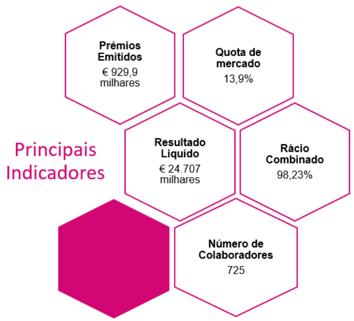
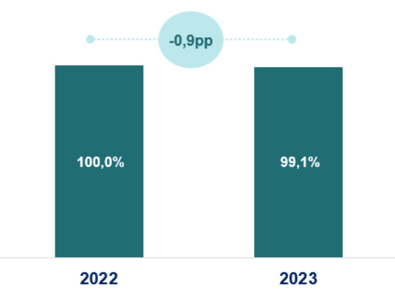
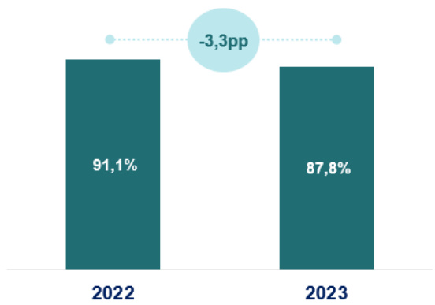
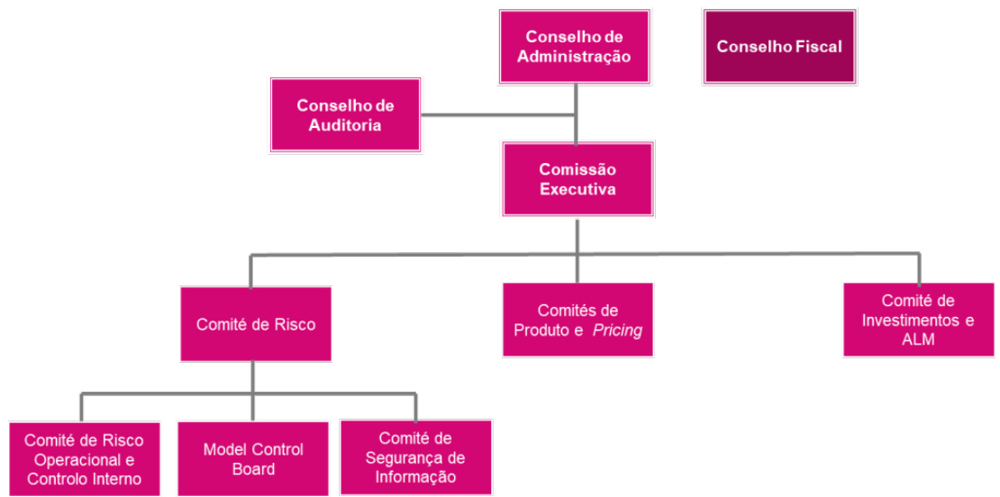

Relatório sobre a Solvência e a Situação Financeira (SFCR)  

31 de dezembro de 2023  

# Índice  

Executive summary ... 7   
A. Business and performance ... . 7   
B. Risk profile ... .. 13   
C. Capital management . .. 15   
D. Valuation for solvency purpose .. . 17   
Sumário executivo . .... 18   
A. Atividade e desempenho . .... 18   
B. Sistema de governação . .... 20   
C. Perfil de risco .. .. 25   
D. Avaliação para efeitos de Solvência . ... 26   
E. Gestão do capital.. . 28   
A. Atividade e desempenho ... .. 31   
1. Atividades . .... 31   
1.1. Estrutura acionista . .... 31   
1.2. Organização do negócio ... 32   
1.3. Desafios atuais e futuros .... ... 33   
1.4. Sustentabilidade.. . 35   
1.4.1. A sustentabilidade como prioridade ... ... 35   
1.5. Numero de colaboradores a tempo inteiro.... ..... 36   
1.6. Detalhe por zona geográfica .. ... 36   
1.7. Atividades ou eventos significativos ocorridos no ano ..... ..... 37   
2. Desempenho da subscrição . ... 37   
2.1. Prémio .... ... 37   
2.2. Resultado Operacional .. ..... 38   
2.3. Custos administrativos ... .... 39   
3. Desempenho dos investimentos . .. 40   
3.1. Rendimentos e despesas decorrentes de investimentos . .... 40   
3.2. Ganhos e perdas reconhecidos diretamente em ações .. ..... 40   
3.3. Investimentos em titularizações .. ..... 40   
4. Desempenho de outras atividades . ... 40   
5. Eventuais informações adicionais . ... 40   
5.1. Informação qualitativa e quantitativa nas transações intra-grupo .............. 40   
5.1.1. Contrato de resseguro – programa apollo .. .... 41   
5.2. Eventos subsequentes ... . 41   
5.3. Adoção das IFRS 9 – Instrumentos financeiros e IFRS 17 – Contratos de   
seguro . . 41   
B. Sistema de governação . 42   
Informações gerais sobre o sistema de governaçã 42   
1.1. Assembleia geral de acionistas . . 42   
1.2. Estrutura da administração . . 42   
1.2.1. Conselho de administração ..... .... 43   
1.2.2. Comissao executiv... .. 45   
1.2.3. Comités especializados . . 47   
1.2.4. Vinculação e representação . .. 48   
1.3. Fiscalização ........ ... 48   
1.3.1. Conselho fiscal . .. 48   
1.3.2. Revisor oficial de contas . . 49   
1.3.3. Conselho de auditoria .. ... 49   
1.4. Secretário da sociedade .. ... 49   
1.5. Processo de tomada de decisão . ..... 50   
1.5.1. Gestão de risco . ... 50   
1.5.2. Compliance ........ ... 50   
1.5.3. Auditoria interna .. .... 50   
1.5.4. Função atuarial ... .. 50   
1.5.5. Atuário responsável . .. 51   
1.6. Princípios de conduta profissional ... ...... 51   
1.7. Normativo interno .. ... 53   
1.8. Política de remunerações ... 53   
2. Requisitos de qualificação e idoneidade.. . 65   
Descrição da política de seleção e avaliação da adequação ..... ....... 65   
2.2. Requisitos de qualificação e idoneidade ......... ... 67   
3. Sistemas de gestão de riscos e informação sobre a autoavaliação do risco e da   
solvência (ORSA) ... ..... 69   
3.1. Estratégias, processos e procedimentos de prestação de informações .... 69   
3.2. Estrutura de gestão de riscos ......... ...... 71   
3.3. Organização e governação de riscos ...... ........ 71   
3.4. Autoavaliação do risco e da solvência (ORSA) .. ...... 75   
3.5. Gestão de capital . .... 76   
4. Sistema de controlo interno ...... .. 78   
4.1. Descrição do sistema de controlo interno ........ .... 78   
4.2. Avaliação anual do sistema de controlo interno.... .... 79   
4.3. Descrição da implementação da função de compliance .. .. ........ 80   
5. Função de auditoria interna ...... .... 81   
5.1. Descrição sobre a implementação da função de auditoria interna ............. 81   
5.2. Descrição de como a auditoria interna mantém a independência e   
objetividade ................ ... 82   
6. Função atuarial .... ... 82   
7. Subcontratação .... ...... 83   
8. Eventuais informações adicionais .... ....... 84   
8.1. Informação adicional sobre o sistema de governação societária . ..... 84   
C. Perfil de risco .... ........ 85   
1. Risco específico de seguros .... ... 86   
1.1. Risco específico de seguros de não-vida . ...... 87   
1.1. Risco específico de seguros de acidentes e doença . . 90   
1.2. Resseguro .... .. 92   
1.3. Sensibilidades ..... .... 93   
2. Risco de mercado . ..... 94   
2.1. Sensibilidade ao risco ...... ... 98   
2.2. Princípio do gestor prudente . ..... 99   
2.3. Análise da adequação das avaliações de crédito externas .. ..... 100   
3. Risco de crédito . ... 101   
4. Risco de liquidez ... ... 104   
5. Risco operacional ... ..... 106   
6. Outros riscos ... ..... 108   
7. Eventuais informações adicionais . ..... 110   
7.1. Exposições extrapatrimoniais . ...... 110   
7.2. Análises de sensibilidade . ... 111   
D. Avaliação para efeitos de solvência .... ....... 112   
1. Ativos .. ..... 112   
1.1. Ativos intangiveis e goodwi. ...... 113   
1.2. Ativos financeiros e Propriedades de investimento . .... 113   
1.3. Outros ativos tangíveis .. .... 115   
1.4. Recuperáveis de resseguro......... ..... 116   
1.5. Outros ativos .... ..... 116   
1.6. Impostos diferidos .. .... 117   
2. Provisões técnicas . ... 117   
2.1. Provisões técnicas de não-vida e de acidentes e doença (aspetos gerais)   
119   
2.1.1. Pressupostos não-económicos ... ... 119   
2.1.1.1. Granularidade . ...... 119   
2.1.1.2. Projeção de fluxos de caixa para provisões de sinistros..... ...... 119   
2.1.1.3. Mortalidade / Longevidade ... .. 120   
2.1.1.4. Montantes recuperáveis de resseguro .... .... 120   
2.1.1.5. Despesas .. ... 121   
2.1.1.6. Inflação .. .... 121   
2.1.1.7. Limites dos contratos ...... ...... 122   
2.1.1.8. Opções e garantias / comportamento dos tomadores de seguros .... 122   
2.1.1.9. Ações de gestão ... ...... 122   
2.1.1.10. Parecer especializado (expert judgement) . ......... 122   
2.1.2. Pressupostos económicos . ..... 123   
2.1.2.1. Alocação de ativos .. .... 123   
2.1.2.2. Taxa de referência e de desconto .... ...... 123   
2.1.3. O nível de incerteza no montante da melhor estimativa ... ..... 123   
2.2. Margem de risco . .... 124   
2.3. Explicação das diferenças mais significativas entre base, métodos e   
pressupostos utilizados no cálculo das provisões técnicas no âmbito de solvência   
II e de acordo com as regras contabilísticas locais . .. 125   
2.4. Diferenças significativas nos pressupostos relevantes tomados no cálculo   
das provisões técnicas comparando com o último período de reporte ............... 125   
2.5. Impacto da redução do ajustamento de volatilidade para zero ..... .... 126   
2.6. Impacto das medidas de transição: medida transitória para as provisões   
técnicas ...... ..... 127   
2.7. Impacto de outras medidas de longo prazo ........... ...... 127   
2.8. Uso de simplificações.... ..... 127   
3. Outras responsabilidades .. .... 128   
4. Métodos alternativos de avaliação .... 129   
5. Eventuais informações adicionais . .... 130   
E. Gestão de capital ... .... 131   
1. Fundos próprios .... .... 131   
1.1. Gestão dos fundos próprios ... ... 131   
1.2. Estrutura, montante e qualidade dos fundos próprios... ...... 132   
1.3. Explicação quantitativa das diferenças entre o capital próprio incluído nas   
demonstrações financeiras e o excesso de ativos sobre passivos, calculados em   
ambiente SII ..... .... 133   
1.4. Fundos próprios disponíveis e elegíveis para cobertura do SCR e MCR 134   
2. Requisito de capital de solvência e requisito de capital mínimo . ...... 135   
2.1. Informação quantitativa do SCR por módulo de risco ... ....... 136   
2.2. Informação quantitativa do MCR ... .... 137   
3. Eventuais informações adicionais .... .. 138   
3.1. Utilização do submódulo de risco acionista baseado na duração para   
calcular o requisito de capital de solvência . .. 138   
3.2. Diferenças entre a fórmula-padrão e qualquer modelo interno utilizado .. 138   
3.3. Incumprimento do requisito de capital mínimo e incumprimento do requisito   
de capital de solvência. . 138   
3.4. Uso de métodos simplificados . .. 138   
3.5. Parâmetros específicos da entidade . 138   
3.6. Acréscimo do requisito de capital de solvência . 138   
Anexos - Informação quantitativa . .. 139   
Anexos – Certificação atuário responsável . ... 150   
Anexos – Certificação do revisor oficial de contas . .. 153   
Conselho de administração ..... ... 161  

# Executive summary  

In line with the Law no. 147/2015 of 9th of September, which transposed the Solvency II directive to the Portuguese legislation, insurance and reinsurance companies are required to disclose publicly, on an annual basis, a report on their solvency and financial condition, leading to this document - the Solvency and Financial Condition Report (SFCR), focusing on qualitative and quantitative information.  

The following chapters summarize the full report of Ageas Portugal – Companhia de Seguros, S.A. (Ageas Seguros):  

# A. Business and performance  

The current legal structure of Ageas Portugal includes two holding companies:  

Ageas Portugal Holdings, SGPS, S.A. (wholly owned by Ageas Group, namely by Ageas Insurance International, NV); and   
Millenniumbcp Ageas, Grupo Segurador, SGPS, S.A. ( $51\%$ owned by Grupo Ageas and $49\%$ by Banco Comercial Português, S.A, hereinafter “Millenniumbcp”, representing the partnership established for Bancassurance).  

Considering the different operations of insurance and pension funds management activities, Ageas Portugal is composed by five companies:  

Ageas Portugal – Companhia de Seguros, S.A. Ageas Portugal – Companhia de Seguros de Vida, S.A. Ocidental – Companhia Portuguesa de Seguros de Vida, S.A. ■ Ageas – Sociedade Gestora de Fundos de Pensões, S.A. Médis – Companhia Portuguesa de Seguros de Saúde, S.A.  

As for Ageas Seguros, the company is owned totally, since 2016, by Ageas Portugal Holding, SGPS, S.A. (having Millenniumbcp just one share). The chart below contains the ownership structure:  

  

Ageas Portugal also integrates Ageas Portugal Services, A.C.E., a complementary grouping of companies with the purpose of ensuring complementary tasks to the exercise of the insurance activity pursued by the members, namely at the level of acquisition of goods and services from third parties.  

  

The premiums written in the Non-Life sector reached 929.9 million euros in 2023, representing a growth of $12.6\%$ compared to the previous year, above the growth seen in the insurance market. The Ageas Seguros market share grew by 0.3 pp, reaching $13.9\%$ , occupying 3rd position in the Non-Life production ranking. (Source: ASF, Direct Insurance Premiums 2023– January 2024). New business grew by around $18\%$ , while renewals grew by around $1\,1\%$ .  

The combined ratio, in accordance with IFRS 17, was $98.23\%$ in 2023, registering a slight decrease of 0.4 p.p., compared to the previous year. Regarding its composition, the claims ratio was maintained compared to 2022, with an increase in the Expense ratio $_{(+0.8}$ p.p.) offset by Reinsurance (-1.2 p.p.).  

Administrative Costs reached 123.4 million euros in 2023, representing an increase of $6\%$ compared to the same period last year. This increase is explained by personnel expenses, which increased by $7.8\%$ $_{+3.4}$ million euros) essentially resulting from salary increases in 2023 in line with the inflation recorded in the year.  

# System of governance  

The Operational Model described in this document is composed by a Governance Model based in three levels: Board of Directors (composed of executive and non-executive members), Executive Committee (composed of executive members) and Specialized Committees (composed of executive members and Top Management). The Governance Model is aligned, as far as possible, with respect to the term of office and the members appointed, ensuring the harmonisation of strategy across all business units, but also taking into consideration all the companies integrated in Ageas corporate structure.  

# General shareholders meeting  

The General Shareholders Meeting (General Assembly), apart from the competences stated out in the law, is responsible for the appointment of the General Assembly Board, the members of both Board of Directors and Board of Auditors and the Statutory Auditor, as well as defining the remunerations and supplementary benefits of the members on these statutory bodies.  

# Board of directors  

The Board of Directors (Board) is the ultimate decision-making body, with exception of the matters that are legally or statutorily within General Shareholders Meeting’ competences and without prejudice of the delegation of powers provided to an Executive Committee. As a matter of fact, Non-Executive members of the Board of Directors perform a supervision duty over the Executive Committee, namely over the exercise by of the powers and competences that were delegated to it.  

On 31st December 2023, the Board of Directors was composed by: President (Hans Jozef Josephina De Cuyper),  Vice-President (Antonio Cano Y Bosque), both non-executive members, three non-executive member (Ben Coumans, Sonali Asit Chandmal and Yvonne Suzanne Lang Ketterer) and eight executive members (Stefan Georges Leon Braekeveldt, Christophe Ghislain F. Vandeweghe, Eduardo Manuel Carmona e Silva Consiglieri Pedroso, Gustavo Nuno Fernandes Coelho Fagundes Barreto, Nelson Ricardo Bessa Machado, José António Soares Augusto Gomes, Pedro Miguel da Conceição Silva Duarte António and Vanda Sofia Peixoto da Costa Vieira Mesquita Antunes). In addition, the same members are appointed in all these companies wholly controlled by Grupo Ageas, as a way of ensuring alignment.  

# Executive Committee  

According to the Board of Directors’ resolution, it is delegated in the Executive Committee all its management competences and powers, enabling the Committee to practice all acts required for the regular operation of the companies, excluding the matters that are, under legal terms or according to the By-Laws, reserved to the Board of Directors or to the General Shareholders Meeting.  

With a maximum limit of eight members, on $31\,{\mathrm{st}}$ December 2023 the Executive Committee was composed of eight members: Stefan Georges Leon Braekeveldt (as Chief Executive Officer of Ageas Portugal), Christophe Ghislain F. Vandeweghe (as Chief Financial Officer), Eduardo Manuel Carmona e Silva Consiglieri Pedroso (as Chief Healthcare Ecosystem Officer), Gustavo Nuno Fernandes Coelho Fagundes Barreto (as Chief Commercial Officer), Nelson Ricardo Bessa Machado (as Chief Bancassurance & Pensions Officer), José António Soares Augusto Gomes (as Chief Operations Officer), Pedro Miguel da Conceição Silva Duarte António (as Chief Future Officer), and Vanda Sofia Peixoto da Costa Vieira Mesquita Antunes (as Chief Risk Officer).  

# Specialized Committees  

In accordance with Board of Directors resolution, the Executive Committee may create support structures that it deems useful to assist in the execution of its duties, approving, with the respective constitution, composition, competences and functioning of those support structures. Currently the decision-making process includes the Risk Committee, the ALM & Investments Committee, the Cost Committee, the Real Estate Investment Committee, the People & Organization Committee, the IT Committee, and the Product & Price Committee.  

# Audit Committee  

It is also foreseen an Audit Committee that shall be composed by three members from the Board of Directors without executive functions, and one of them will be the Vice-Chairman of the Board of Directors, that will assume the function of President of the Audit Commitee. The competences, functioning rules and requirements applicable to the composition of this Audit Commitee (namely in terms of its independence and qualification) are defined in the Terms of Reference approved by the Board of Directors.  

# Decision Making Process  

As part of the decision-making process there are several statutory bodies, committees and units elected by the General Shareholders Meeting or appointed by the Management, who co-operate with the Board of Directors and the Executive Committee, ensuring the separation between business and operational areas. Regarding this topic, it must be pointed out the following: Risk Management, Compliance, Internal Audit, Actuarial Function and Responsible Actuary. These structures benefit from the transversal alignment across all Ageas Portugal entities.  

# Business Conduct Principles  

The members of the Board of Directors, namely the executive members, must align their conducts with specific requirements. Besides legal and statutory framework applicable, the Board of Directors approved the Ageas Portugal Code of Conduct, applicable to all legal entities, setting out the principles of business conduct, such as specific functioning and individual behaviour rules to be applied to all Employees and to the members of Board of Directors and Executive Committee in the performance of their roles.  

The Code of Conduct also includes rules to be observed regarding conflict of interest and private investments.  

# Internal Rules  

Ageas Portugal has an internal system for preparation, approval and disclosure of internal rules that has been approved by the Executive Committee, within its competences, which is generally known by all Employees. This system states that those internal rules are categorized in Policies (establish general principles or rules, as well as the necessary actions to reach goals and objectives), Regulations (define the specific rules of concrete activities) or Procedures (define practical aspects related to, for instance, circuits of information circulation, processes and deadlines and other levels of service to be adopted by each company or organic unit of Ageas Portugal).  

Some of those structural policies in force on Ageas Portugal are worth to point out, namely those linked to its corporate governance, such as: the Remuneration Policy, the Anti-Bribery Policy, the Policy to prevent and Combat Harassment at Work, the Integrity Policy, the Anti-Money Laundering and Counter Terrorism Financing Policy, the Country Risk Index Policy, and the Fit & Proper Policy.  

# Fit & Proper Requirements  

As legally required, all Ageas Portugal entities have in force a Fit & Proper Policy, ensuring a sound and prudent management, adding value to the companies, to Ageas Portugal and to all its stakeholders, and having in mind the safeguard of the interests of policyholders, insured persons and beneficiaries.  

# Risk management and internal control systems  

The fundamental principle underlying Ageas Seguros’s risk strategy is to maximize the shareholder value, within the defined risk appetite limits, and considering the best interest and protection of policyholders, insured persons and beneficiaries. To this end, risk acceptance is directed towards businesses that present attractive amounts of risk-adjusted return.  

Ageas Seguros has implemented systematic processes for identifying and monitoring risks, which are assessed both qualitatively and quantitatively.  

Risks are defined through a risk taxonomy whose objective is to guarantee a consistent and comprehensive approach to identifying, evaluating, monitoring, and managing the risks applicable to Ageas Seguros. The risk taxonomy is divided into four main categories: Financial Risks, Insurance Risks, Operational Risks and Strategic and Business Risks.  

On a quarterly basis, Ageas Seguros assesses and reports the relevant risks (existing and emerging) that could jeopardize the achievement of the Company’ strategic objectives – Key Risk Reporting. All areas of the risk taxonomy are considered when identifying risks, using a consistent methodology, in line with risk appetite.  

Those risks to the implementation of Ageas Seguros’s strategy must then be mitigated, through process’ improvements, or through a combination of process improvements and capital holding. Capital needs to mitigate the main Solvency II risks are determined using a decision tree:  

Risks for which a Solvency Capital Requirement (SCR) is measured using the standard formula are considered pillar 1 risks: such risks are measured on a current basis every quarter and reported to Risk Committee through the quarterly risk reports; Risks that are not adequately covered in standard formula are considered pillar 2 risks, and the assessment of capital needs is performed accordingly with the internal vision of Group Ageas (SCRAgeas).  

For the Own Risk and Solvency Assessment (ORSA), pillar 1 and pillar 2 risks are also assessed on a forward-looking basis during the strategic plan and multi-year budget cycle.  

To guarantee that all material risks are understood and managed effectively, Ageas Seguros has an Enterprise Risk Management (ERM) framework that:  

Ensures that risks affecting the achievement of objectives are identified, assessed, monitored and managed;   
Defines the risk appetite to ensure that the risk of insolvency remains within the risk appetite, in all moments, in acceptable levels and the risk profile remains within risk appetite;   
Supports the decision-making process by ensuring that the information of risk is consistent, reliable and timely and is available for who takes the decisions;   
Promotes a culture of risk so that each employee performs his function with the awareness of the risks inherent in its activities, to manage them properly and to report them in a transparent way.  

ERM framework is defined in 4 risk management dimensions: Policies; Governance; Models; and Reporting.  

Risk Management is inherent to insurance business and, as such, is part of the activities of all businesses and employees of the company. The activities of risk management in Ageas Seguros are incorporated into existing management bodies, with specific risk committees and functions been created, whose principles are set out in the established Risk Policy.  

In the scope of risk management processes, stands out the Own Risk and Solvency Assessment (ORSA) which main objective is to ensure that Ageas Seguros assesses all risks inherent to its business and depending on its strategy, determines its capital needs. ORSA is directly incorporated into Company’s strategy and its strategic planning process and multi-year budget. It is also embedded in governance processes and decision-making process, being defined as one of the responsibilities of the Executive Committee and the Board of Directors.  

In addition, the purpose of the Internal Control System is to provide management with reasonable assurance that the Company is operating properly, supporting the realization of strategic and business objectives.  

The internal control adequacy assessment (INCA) is carried out during the year and the overall view is reported in the annual INCA report, which is transversal to all Ageas Portugal Group companies. This report includes the results of the self-assessment by each organizational area and the opinion of the second and third lines of defense, ensuring that the risks existing in the processes are under control or that action plans are defined, and that appropriate follow-up is carried out on the weaknesses identified.  

# B. Risk profile  

As described in the section B. System of governance, chapter 3, Ageas Seguros has implemented a systematic process of risk identification and monitoring, comprising quantitative and qualitative assessments.  

Based on the qualitative assessment carried out through the Key Risk Reporting (KRR) process, were identified the following risks with level of concern equal to or greater than 4, i.e., residual risk not acceptable, to monitor and actions to reduce the risk exposure during the MYB period (2024-2027):  

Risk of inflationary pressure on costs and repricing; Information security – providers and external entities; Geo-political instability & economic uncertainty Digital transformation, raise of Artificial Intelligence and Big Data.  

The company has implemented control and mitigation actions of the risks, which are followed and quarterly reported to the Risk Committee, Executive Committee and Ageas Group.  

Based on the quantitative risk assessment using the standard formula, the overall risk profile on 31st December of 2023 is illustrated on the figure below.  

  

Compared with last year, non-life underwriting risk continues to be the largest exposure of Ageas Seguros. It is possible to observe that, market risk increased is weight on overall SCR, mainly related with the higher equity risk following the increase of exposure in equity.  

# C. Capital management  

The main objective of the capital management process is to optimize the structure, composition, and allocation of company’s capital, to support profitable future growth and ensure the sustainability of the dividends policy in place.  

The composition of eligible own funds of Ageas Seguros on $31^{\mathrm{st}}$ December of 2023 is the following:  

in thousand euros   

<html><body><table><tr><td></td><td>31.12.2023</td><td>31.12.2022</td><td>Var.</td><td>Var. %</td></tr><tr><td>EligibleOwnFunds</td><td>234,437</td><td>229,272</td><td>5,165</td><td>2.3%</td></tr><tr><td>Tier1-unrestricted</td><td>190,137</td><td>184,972</td><td>5,165</td><td>2.8%</td></tr><tr><td>Tier1-restricted</td><td>11,000</td><td>11,000</td><td>0</td><td></td></tr><tr><td>Tier2</td><td>33,300</td><td>33,300</td><td>0</td><td></td></tr><tr><td>Tier3</td><td>0</td><td>0</td><td>0</td><td></td></tr></table></body></html>

\* The Own Funds are deducted of expected dividends  

The Company was authorized from the regulator to consider as integral part of own funds tier 1 (unrestricted tier 1), the amount of 11,000 thousand euros, based on transitional regime provided for in Law 147/2015, corresponding to a subordinated liability without term. There are also three other subordinated liabilities amounting to 33,300 thousand euros in which the ASF considers that the characteristics determining its classification in tier 2 of the original own funds are met. The detail of subordinated liabilities is in the table below:  

in thousand euros   

<html><body><table><tr><td></td><td>Dataofissue</td><td>Maturity</td><td>Value</td></tr><tr><td>FixedmaturitySubordinateddebt</td><td>04/12/2014</td><td>04/12/2024</td><td>11,000</td></tr><tr><td>Perpetualsubordinateddebt2014</td><td>04/12/2014</td><td>Perpetual</td><td>11,000</td></tr><tr><td>FixedmaturitySubordinateddebt</td><td>28/12/2015</td><td>28/12/2025</td><td>19,600</td></tr><tr><td>Perpetualsubordinateddebt2015</td><td>28/12/2015</td><td>Perpetual</td><td>2,700</td></tr></table></body></html>

Total   
44,300  

Ageas Seguros monitors on a regular basis the evolution of its own funds, considering the solvency quarterly values and the strategic plan (5 years’ time horizon). Any change that put in risk the own funds quality will be subject to an evaluation and respective correction.  

Comparatively with last year, the level of eligible own funds, after expected dividends distribution, registered an increase of 10,387 thousand euros $(5.91\%)$ .  

According to the Capital Management Policy, dividend distribution is decided on the basis of net profit for the year, but the amount payable is dependent on the target solvency ratio ( $175\%$ of SCRAgeas).  

in thousand euros   

<html><body><table><tr><td></td><td>31.12.2023</td><td>31.12.2022</td><td>Var.</td><td>Var. %</td></tr><tr><td>EligibleOwnFundswithoutdeductionofexpecteddividends</td><td>251,677</td><td>249.672</td><td>2,005</td><td>1%</td></tr><tr><td>Expecteddividends</td><td>17,240</td><td>20,400</td><td>-3,160</td><td>-15%</td></tr><tr><td>EligibleOwnFundswithdeductionofexpecteddividends</td><td>234,437</td><td>229,272</td><td>5,165</td><td>2%</td></tr></table></body></html>  

In 2023, the Company considered as future dividends the amount of 17,240 thousand of euros.  

In the scope of Solvency II capital adequacy, the following measures are applicable:  

The Minimum Capital Requirement (MCR) – the MCR is the level of capital that represents the minimum acceptable that can lead to an extreme Supervisor Intervention in case of non-compliance (e.g., do not allow the subscription of new business). The MCR is calculated through a combined linear function, limited to a maximum of the $45\%$ of SCR and a minimum of $25\%$ of the SCR. Where eligible own funds fall below the MCR or there is a risk of non-compliance with the MCR in the subsequent three months, a short-term financing plan has to be defined and submitted to the Supervisor;  

The Solvency Capital Requirement (SCR) is the amount of capital to cover the capital requirements calculated from standard formula (designated ‘pillar 1’). When the eligible own funds fall below the SCR or there is risk of non-compliance with the SCR, a recovery plan should be defined and submitted to the Supervisory.  

The SCR coverage ratio, after expected dividends, decreased 3.3 pp between $31^{\mathrm{st}}$ December of 2022 and 31st December of 2023, due to the increase of the SCR $(3.9\%)$ , mainly due to both market risk and non-life underwriting risk evolution.  

in thousand euros   

<html><body><table><tr><td></td><td>31.12.2023</td><td>31.12.2022</td><td>Var. %</td></tr><tr><td>EligibleOwnFundstocoverSCR</td><td>234,437</td><td>229,272</td><td>2.3%</td></tr><tr><td>SolvencyCapitalRequirement(SCR)</td><td>116,916</td><td>112,474</td><td>3.9%</td></tr><tr><td>RatioofEligibleOwnFundstoSCR</td><td>201%</td><td>204%</td><td>-3.3pp</td></tr><tr><td>EligibleOwnFundstocoverMCR</td><td>211,037</td><td>204,840</td><td>3.0%</td></tr><tr><td>Minimum Capital Requirement (MCR)</td><td>49,502</td><td>44,339</td><td>11.6%</td></tr><tr><td>RatioofEligibleOwnFundstoMCR</td><td>426%</td><td>462%</td><td>-35.7pp</td></tr></table></body></html>

\* The Eligible Own Funds are deducted of expected dividends  

The MCR coverage ratio decreased 36 pp, in line with the evolution of SCR presented in the table below.  

in thousand euros   

<html><body><table><tr><td></td><td>31.12.2023</td><td>31.12.2022</td><td>Var.</td><td>Var. %</td></tr><tr><td>SolvencyCapitalRequirement</td><td>116,916</td><td>112,474</td><td>4,442</td><td>3.9%</td></tr><tr><td>LAC-DT</td><td>-33,155</td><td>-30,562</td><td>-2,593</td><td>8.5%</td></tr><tr><td>OperationalRisk</td><td>27,049</td><td>24,301</td><td>2,748</td><td>11.3%</td></tr><tr><td>BasicSolvencyCapital Requirement</td><td>123,022</td><td>118,735</td><td>4,287</td><td>3.6%</td></tr><tr><td>Diversification</td><td>-61,276</td><td>-58,696</td><td>-2,580</td><td>4.4%</td></tr><tr><td>MarketRisk</td><td>51,806</td><td>37,300</td><td>14,507</td><td>38.9%</td></tr><tr><td>CounterpartyDefaultRisk</td><td>16,207</td><td>34,249</td><td>-18,042</td><td>-52.7%</td></tr><tr><td>HealthUnderwritingRisk</td><td>42,999</td><td>39,451</td><td>3,548</td><td>9.0%</td></tr><tr><td>Non-LifeUnderwritingRisk</td><td>73,286</td><td>66,432</td><td>6,854</td><td>10.3%</td></tr></table></body></html>  

# D. Valuation for solvency purpose  

The Solvency II balance sheet valuation is based on fair value, that is the amount for which an asset could be exchanged, a liability settled, or a granted equity instrument exchanged between knowledgeable, willing parties in an arm’s length transaction.  

The most significant differences from local financial statements valuation concern mainly to:  

Technical provisions and reinsurance recoverable follow the rules defined in the Solvency II regime, not fully aligned with local accounting standards; the investment in property and the value of holdings in property investment companies are revalued at fair value; Derecognition of deferred acquisition costs and intangibles assets, if any.  

The table below summarises the valuation differences between the balance sheet with accounting rules and Solvency II:  

in thousand euros   

<html><body><table><tr><td>31.12.2023</td><td>Solvency</td><td>Statutory accounts</td><td>Var.</td></tr><tr><td>Totalassets</td><td>1,286,273</td><td>1,301,435</td><td>-15,162</td></tr><tr><td>Totalliabilities</td><td>1,078,896</td><td>1,152,539</td><td>-73,642</td></tr><tr><td>Excessofassetsoverliabilities</td><td>207,377</td><td>148,897</td><td>58,480</td></tr></table></body></html>  

The value of technical provisions under Solvency II is equal to the sum of the best estimate of the liabilities and the risk margin. The best estimate is the expected value of future cash flows, weighted by their probability of occurrence, considering the time value of money, based on the time structure of interest rates without relevant risk. The risk margin represents the capital costs of the nonhedgeable risks included in the best estimate.  

In the preparation of this report, it has been considered the long-term measure volatility adjustment (VA) and the transitional measure for technical provisions, both approved by the Supervisory Authority (ASF).  

The impact of considering the long-term measure volatility adjustment in the available own funds and in the respective solvency II ratio are:  

in thousand euros   

<html><body><table><tr><td>31.12.2023</td><td>BaseCase</td><td>WithoutVolatility Adjustment</td><td>Impact</td></tr><tr><td>TechnicalProvisions</td><td>728,906</td><td>737,605</td><td>8,700</td></tr><tr><td>BasicOwnFunds</td><td>234,437</td><td>229,161</td><td>-5,276</td></tr><tr><td>EligibleOwnFundstocoverSCR</td><td>234,437</td><td>229,161</td><td>-5,276</td></tr><tr><td>SolvencyCapitalRequirement(SCR)</td><td>116,916</td><td>115,756</td><td>-1,161</td></tr><tr><td>RatioofEligibleOwnFundstoSCR</td><td>201%</td><td>198%</td><td>-3pp</td></tr><tr><td>EligibleOwnFundstocoverMCR</td><td>211,039</td><td>205,814</td><td>-5,225</td></tr><tr><td>MinimumCapital Requirement(MCR)</td><td>49,502</td><td>49,756</td><td>255</td></tr><tr><td>RatioofEligibleOwnFundstoMCR</td><td>426%</td><td>414%</td><td>-13pp</td></tr></table></body></html>

\* The Eligible Own Funds are deducted of expected dividends  

Regarding the transitional measure for technical provisions, the impacts on the coverage ratio of the SCR and MCR are the following:  

in thousand euros   

<html><body><table><tr><td>31.12.2023</td><td>BaseCase</td><td>WithoutTransitional Measure</td><td>Impact</td></tr><tr><td>TechnicalProvisions</td><td>728,906</td><td>768,896</td><td>39,990</td></tr><tr><td>BasicOwnFunds</td><td>234,437</td><td>206,044</td><td>-28,393</td></tr><tr><td>EligibleOwnFundstocoverSCR</td><td>234,437</td><td>206,044</td><td>-28,393</td></tr><tr><td>SolvencyCapitalRequirement(SCR)</td><td>116,916</td><td>116,916</td><td>0</td></tr><tr><td>RatioofEligibleOwnFundstoSCR</td><td>201%</td><td>176%</td><td>-24 pp</td></tr><tr><td>EligibleOwnFundstocoverMCR</td><td>211,039</td><td>180,982</td><td>-30,057</td></tr><tr><td>MinimumCapitalRequirement(MCR)</td><td>49,502</td><td>50,048</td><td>546</td></tr><tr><td>RatioofEligibleOwnFundstoMCR</td><td>426%</td><td>362%</td><td>-65pp</td></tr></table></body></html>

\* The Eligible Own Funds are deducted of expected dividends  

# Sumário executivo  

De acordo com a Lei n.º 147/2015 de 9 de setembro, que transpôs a diretiva de Solvência II para a legislação portuguesa, as companhias de seguros e resseguradoras deverão publicar, numa base anual, informação qualitativa bem com quantitativa, sobre a sua Solvência e a Situação Financeira, originando este relatório – o Relatório sobre a Solvência e a Situação Financeira (SFCR), focalizado em informação qualitativa e quantitativa.  

Os capítulos seguintes, apresentados abaixo, contêm em detalhe o resumo de todo o relatório da Ageas Portugal – Companhia de Seguros S.A. (Ageas Seguros):  

# A. Atividade e desempenho  

A atual estrutura jurídica da Ageas Portugal compreende duas sociedades gestoras de participações sociais:  

Ageas Portugal Holdings, SGPS, S.A. (totalmente detida pelo Grupo Ageas, mais concretamente a Ageas Insurance International, NV) e   
Millenniumbcp Ageas, Grupo Segurador, SGPS, S.A. (detida em $51\%$ pelo Grupo Ageas e em $49\%$ pelo Banco Comercial Português, S.A., adiante designado Millenniumbcp, representando a parceria instituída para Bancassurance).  

Em termos operativos, relativamente às atividades seguradora e de gestão de fundos de pensões, a Ageas Portugal compreende as seguintes cinco sociedades:  

Ageas Portugal – Companhia de Seguros, S.A.   
Ageas Portugal – Companhia de Seguros de Vida, S.A.   
Ocidental – Companhia Portuguesa de Seguros de Vida, S.A.   
Ageas – Sociedade Gestora de Fundos de Pensões, S.A.   
Médis – Companhia Portuguesa de Seguros de Saúde, S.A.  

No que toca à Ageas Seguros, esta é detida totalmente, desde 2016, pela Ageas Portugal Holdings, SGPS, S.A. (mantendo o Millenniumbcp apenas uma ação).  

Esquematicamente a estrutura de participações é a seguinte:  

  

A Ageas Portugal integra ainda a Ageas Portugal Services, A.C.E., um agrupamento complementar de empresas com a finalidade de assegurar tarefas complementares ao exercício da atividade seguradora prosseguida pelos membros, designadamente ao nível da aquisição de bens e serviços a terceiros.  

  

Os Prémios Emitidos do ramo Não Vida atingiram, em 2023, 929,9 milhões de euros, representando um crescimento de $12{,}6\%$ relativamente ao ano anterior, acima do crescimento verificado no mercado segurador. A quota de mercado da Ageas Seguros cresceu 0,3 pp atingindo $13{,}9\%$ , ocupando a $3^{\mathtt{a}}$ posição do ranking da produção de Não Vida. (Fonte: ASF, Prémios de Seguro Direto 2023– janeiro 2024). O negócio novo apresentou um crescimento de cerca de $18\%$ , enquanto as renovações cresceram cerca de $1\,1\%$ .  

O rácio combinado, de acordo com a IFRS 17, foi de $98,23\%$ no ano de 2023, registando um ligeiro decréscimo de 0,4 p.p., relativamente ao ano anterior. Relativamente à sua composição, o rácio de sinistros manteve-se relativamente a 2022, tendo-se verificado um aumento no rácio de Despesa $^{(+0,8}$ p.p.) compensado pelo Resseguro (-1,2 p.p.).  

Os Custos Administrativos atingiram os 123,4 milhões de euros em 2023, representando um aumento de $6\%$ face ao período homólogo. Este aumento $\acute{\circ}$ explicado pelas Despesas com Pessoal que apresentaram um aumento de $7,8\%$ ( $^{+3,4}$ milhões de euros) essencialmente proveniente dos aumentos salariais praticados em 2023 alinhados com a inflação registada no ano.  

# B. Sistema de governação  

O Modelo Operacional, descrito neste documento, traduz-se num Modelo de Governação baseado em três níveis: o Conselho de Administração (composto por membros executivos e não executivos), a Comissão Executiva (naturalmente composta por membros executivos) e Comités especializados (compostos por membros da Comissão Executiva e diretores de topo). Este Modelo de Governo está tão alinhado quanto possível no que diz respeito aos seus membros, garantindo a harmonização da estratégia entre todas as unidades de negócio, levando em consideração todas as empresas presentes no Grupo Ageas Portugal.  

Assembleia geral de acionistas  

À Assembleia Geral compete, para além do disposto na lei e em especial, eleger a respetiva mesa, eleger os membros do Conselho de Administração, eleger os membros do órgão de fiscalização e fixar as remunerações dos membros dos órgãos sociais e bem assim os esquemas de segurança social e de outras prestações complementares.  

# Conselho de Administração  

O Conselho de Administração (Board) é o órgão soberano no processo de decisão empresarial, excetuando as competências que se encontrem reservadas estatutária ou legalmente à Assembleia Geral e sem prejuízo da possibilidade de delegação da gestão corrente numa Comissão Executiva. Com efeito, os Administradores não-executivos exercem um dever de vigilância sobre a Comissão Executiva, nomeadamente sobre o exercício dos poderes e competências que foram nesta delegados.  

Em 31 de dezembro de 2023, o Conselho de Administração era constituído por um Presidente (Hans Jozef Josephina De Cuyper), um Vice-Presidente (Antonio Cano Y Bosque) e onze vogais, sendo três não-executivos (Ben Coumans, Sonali Asit Chandmal e Yvonne Suzanne Lang Ketterer) e oito executivos (Stefan Georges Leon Braekeveldt, Christophe Ghislain F. Vandeweghe, Eduardo Manuel Carmona e Silva Consiglieri Pedroso, Gustavo Nuno Fernandes Coelho Fagundes Barreto, Nelson Ricardo Bessa Machado, José António Soares Augusto Gomes, Pedro Miguel da Conceição Silva Duarte António e Vanda Sofia Peixoto da Costa Vieira Mesquita Antunes). Acresce que estão nomeados os mesmos membros em todas essas sociedades totalmente detidas pelo Grupo Ageas, como forma de assegurar o alinhamento.  

# Comissão Executiva  

Mediante decisão do Conselho de Administração, é delegada na Comissão Executiva $(E x C O)$ toda a sua competência de gestão da sociedade, ficando a mesma incumbida de praticar todos os atos necessários ao seu regular funcionamento, com exceção das matérias que ficam reservadas ao Conselho de Administração ou à Assembleia Geral nos termos da lei e dos Estatutos e sem prejuízo da possibilidade de preparação e de proposição ao Conselho de Administração de projetos de deliberação respeitantes a essas matérias reservadas.  

Tendo o limite máximo de oito membros, em 31 de dezembro de 2023 a Comissão Executiva era integrada por oito membros: Stefan Georges Leon Braekeveldt (na qualidade de Chief Executive Officer), Nelson Ricardo Bessa Machado (na qualidade de Chief Bancassurance & Pensões Officer), Christophe Ghislain F. Vandeweghe (na qualidade de Chief Financial Officer), Eduardo Manuel Carmona e Silva Consiglieri Pedroso (na qualidade de Chief Healthcare Ecosystem Officer), Gustavo Nuno Fernandes Coelho Fagundes Barreto (na qualidade de Chief Commercial Officer), José António Soares Augusto Gomes (na qualidade de Chief Operations Officer), Pedro  

Miguel da Conceição Silva Duarte António (na qualidade de Chief Future Officer) e Vanda Sofia Peixoto da Costa Vieira Mesquita Antunes (na qualidade de Chief Risk Officer).  

# Comités Especializados  

De acordo com a deliberação do Conselho de Administração, a Comissão Executiva pode criar estruturas de apoio que considere úteis para auxiliar na execução das suas competências, aprovando, com a respetiva constituição, a composição, o modo de funcionamento e as funções dessas estruturas de apoio. Atualmente fazem parte do processo de tomada de decisão o Comité de Risco, o Comité de Investimentos e ALM, o Comité de Custos, o Comité de Investimentos Imobiliários, o Comité de Pessoas e Organização, o Comité de IT e o Comité de Produto e Preço.  

# Conselho de Auditoria  

Está ainda previsto que o Conselho de Auditoria seja composto por três membros do Conselho de Administração sem funções executivas, um dos quais será o Vice-Presidente do Conselho de Administração, que assumirá as funções de Presidente do Conselho de Auditoria. As funções detalhadas, o funcionamento e os requisitos aplicáveis à composição deste Conselho de Auditoria (no nível de independência e qualificação) são definidos nos Termos de Referência aprovados pelo Conselho de Administração.  

# Processo de Tomada de Decisão  

No quadro do processo de decisão empresarial existem várias funções, comissões específicas e unidades orgânicas que, sendo eleitas pela Assembleia Geral ou designadas pelo órgão de Administração, coadjuvam o Conselho de Administração e a Comissão Executiva no exercício das suas funções, assegurando a segregação entre as áreas de negócio e as áreas de operações. A este propósito, salientamos: Gestão de Risco, Compliance, Auditoria Interna, Função Atuarial e Atuário Responsável. Estas estruturas beneficiam do alinhamento transversal de todas as entidades do Grupo Ageas Portugal.  

# Princípios da Conduta Profissional  

Os membros do Conselho de Administração, nomeadamente os membros executivos, devem alinhar a sua conduta com requerimentos específicos. A par das disposições legais e estatutárias que sejam aplicáveis, O Conselho de Administração aprovou um Código Deontológico que incorpora os Princípios de Conduta Profissional, estabelecendo regras de funcionamento e de comportamento individual, abrangendo nomeadamente colaboradores e membros do Conselho de Administração e da Comissão Executiva, no exercício das respetivas funções.  

O Código Deontológico sistematiza ainda as regras a observar em matéria de conflito de interesses e investimentos pessoais.  

# Normativo Interno  

A Ageas Portugal tem um sistema interno de preparação, aprovação e divulgação de normativos internos, o qual é do conhecimento geral de todos os Colaboradores, tendo sido aprovado pela Comissão Executiva, enquanto órgão executivo de administração. Este sistema prevê que o normativo seja categorizado em Políticas (estabelecem princípios ou regras gerais, bem como as ações necessárias para atingir metas e objetivos), Regulamentos (definem as regras específicas de atividades concretas) ou Procedimentos (definem aspetos práticos relativos a, nomeadamente, competências, circuitos de circulação de informação, processos e prazos de conclusão e outros níveis de serviço a adotar por cada empresa ou unidade orgânica da Ageas Portugal).  

São exemplos de normativos em vigor na Ageas Portugal, designadamente em matéria da sua governação societária, o Código Deontológico, a Política de Conflito de Interesses, a Política de Remunerações, a Política Anticorrupção, a Política de Tratamento de Clientes, a Política de Prevenção e Combate ao Assédio no Trabalho, a Política de Integridade, a Política de Prevenção do Branqueamento de Capitais e do Financiamento do Terrorismo, a Política de Sanções e a Política de Seleção e Avaliação da Adequação.  

# Requisitos de qualificação e idoneidade  

Como legalmente requerido as entidades da Ageas Portugal têm em vigor Política de Seleção e Avaliação da Adequação, assegurando uma gestão sã e prudente, adicionando valor às companhias, ao Grupo Ageas Portugal e aos seus acionistas, tendo em vista, de modo particular, a salvaguarda dos interesses dos tomadores de seguros, segurados e beneficiários.  

# Sistemas de gestão de riscos e controlo interno  

O princípio fundamental subjacente à estratégia de risco da Ageas Seguros é maximizar o valor para o acionista, dentro dos limites de apetite de risco definidos, e tendo em conta o melhor interesse e a proteção dos tomadores de seguros, segurados e beneficiários. Para este efeito, a aceitação de risco é direcionada para negócios que apresentem montantes atrativos de retorno ajustado ao risco.  

A Ageas Seguros tem implementados processos sistemáticos de identificação e monitorização de riscos, avaliados tanto de forma qualitativa como quantitativa.  

Os riscos são definidos através de uma taxonomia de risco cujo objetivo é garantir uma abordagem consistente e abrangente na identificação, avaliação, monitorização e gestão dos riscos aplicáveis à Ageas Seguros. A taxonomia de risco encontra-se dividida em quatro grandes categorias: Riscos Financeiros, Riscos de Seguros, Riscos Operacionais e Riscos Estratégicos e de Negócio.  

Trimestralmente, a Ageas Seguros avalia e reporta os riscos relevantes (existentes e emergentes) que possam comprometer a realização dos objetivos estratégicos da Companhia – Key Risk Reporting. Todas as áreas da taxonomia de risco são consideradas na identificação dos riscos, sendo utilizada uma metodologia consistente, em linha com o apetite ao risco.  

Esses riscos para a concretização da estratégia da Ageas Seguros devem então ser mitigados, através da introdução de melhorias aos processos, ou através de uma combinação de melhorias aos processos e realização de capital, quando apropriado. As necessidades de capital para mitigar os principais riscos de Solvência II, são apuradas utilizando uma árvore de decisão:  

Riscos para os quais o Requisito de Capital de Solvência (SCR) é medido utilizando a fórmula-padrão são considerados riscos de pilar 1: tais riscos são medidos trimestralmente e reportados ao Comité de Risco através de relatórios de risco trimestrais;   
Riscos que não são se encontram refletidos na fórmula-padrão são considerados riscos de pilar 2 e a avaliação das necessidades de capital é calculada de acordo com a visão interna do Grupo Ageas (SCRAgeas).  

No âmbito do processo de Autoavaliação do Risco e da Solvência (ORSA), os riscos de pilar 1 e de pilar 2 são também avaliados prospectivamente para o horizonte temporal do plano estratégico e do orçamento plurianual (MYB).  

Para garantir que todos os riscos materiais são entendidos e geridos de forma eficaz, a Ageas Seguros dispõe de uma estrutura de Enterprise Risk Management (ERM) que:  

Assegura que os riscos que afetam a concretização dos objetivos são identificados, avaliados, monitorizados e geridos;   
Define um apetite ao risco de modo a assegurar que o risco de insolvência permanece, em todos os momentos, em níveis aceitáveis e que o perfil de risco $\acute{\circ}$ mantido dentro do apetite ao risco;   
Suporta o processo de tomada de decisão, assegurando que a informação de risco é consistente, fiável e atempada e está disponível a quem toma as decisões;   
Promove uma cultura de risco, para que cada colaborador desempenhe a sua função com a consciência dos riscos inerentes às suas atividades, de forma a geri-los adequadamente e a reportá-los de forma transparente. A estrutura de ERM está articulada em torno de 4 dimensões de gestão de risco: Políticas;   
Governação; Modelos e Reporte.  

A Gestão de Riscos é parte integrante do negócio de seguros e, como tal, faz parte das atividades de todos os negócios e colaboradores da empresa. As atividades de gestão de riscos da Ageas  

Seguros encontram-se incorporadas nos órgãos de gestão existentes, tendo sido criados comités e funções específicas de risco, cujos princípios se encontram definidos na política de risco estabelecida.  

No âmbito dos processos de gestão de riscos, destaca-se o processo de Autoavaliação do Risco e da Solvência (ORSA), cujo objetivo é assegurar que a Ageas Seguros avalia todos os riscos inerentes ao seu negócio e, em função da sua estratégia, determina as suas necessidades de capital. O ORSA está diretamente incorporado na estratégia e no processo de planeamento estratégico e orçamento plurianual (MYB) da Companhia. Está também incorporado nos processos de governação e tomada de decisão, sendo definido como uma das responsabilidades da Comissão Executiva e do Conselho de Administração.  

Adicionalmente, o sistema de controlo interno tem como objetivo fornecer à gestão razoável segurança de que a Companhia está a funcionar de forma adequada, suportando a concretização dos objetivos estratégicos e de negócio.  

A avaliação da adequação do controlo interno (INCA) é realizada durante o ano e a visão global é reportada através do relatório anual do INCA, transversal a todas as empresas do Grupo Ageas Portugal. Este relatório inclui os resultados da autoavaliação por cada área organizacional e a opinião da segunda e terceira linha de defesa, assegurando que os riscos existentes nos processos estão sob controlo ou que são definidos planos de ação, e que é realizado o acompanhamento adequado das fragilidades identificadas.  

# C. Perfil de risco  

Conforme descrito no capítulo 3 da secção B Sistema de Governação, a Ageas Seguros tem implementado um processo de avaliação de riscos que combina avaliações qualitativas e quantitativas.  

Com base na avaliação qualitativa realizada através do processo de Key Risk Reporting (KRR), foram identificados os seguintes riscos com um nível de preocupação igual ou superior a 4, ou seja, um risco residual não aceitável, e que exigem a monitorização e ações para reduzir a exposição ao risco durante o período do MYB (2024-2027):  

Risco de pressão inflacionária sobre os custos e repricing;   
Segurança da informação - fornecedores e entidades externas;   
Instabilidade geopolítica e incerteza económica;   
Transformação digital, aumento da Inteligência Artificial e Big Data.  

A Companhia tem implementadas ações de controlo e mitigação dos riscos, as quais são seguidas e reportadas trimestralmente ao Comité de Risco, à Comissão Executiva e ao Grupo Ageas.  

Com base na avaliação quantitativa dos riscos através da fórmula-padrão, o perfil de risco global da Ageas Seguros, a 31 de dezembro de 2023 é ilustrado na figura abaixo.  

  

Comparativamente ao ano anterior, o risco específico de não vida continua a ser o mais relevante para a Ageas Seguros. No entanto, observando todos riscos a que a Ageas Seguros está exposta, é possível verificar que o risco de mercado aumentou a sua relevância no perfil de risco da Companhia.  

# D. Avaliação para efeitos de Solvência  

A avaliação do balanço de Solvência II é baseada no justo valor, que é o montante pelo qual um ativo pode ser negociado ou um passivo liquidado entre partes conhecedoras e com interesse no negócio, numa transação em condições normais de mercado.  

As diferenças entre o capital próprio nas demonstrações financeiras, obtido de acordo com as regras contabilísticas locais (GAAP local), e o excesso de ativos sobre passivos apurados em ambiente de Solvência II (fundos próprios) são maioritariamente explicadas por:  

As provisões técnicas e os recuperáveis de resseguros seguem as regras definidas no regime de Solvência II. Desta metodologia resulta um valor diferente de ativos e passivos de seguros face ao reconhecimento de acordo com as normas contabilísticas locais; O valor dos imóveis e das participações em empresas de investimento imobiliário são reavaliados ao justo valor;   
Não reconhecimento dos custos de aquisição diferidos e dos ativos intangíveis, se existirem.  

No quadro abaixo é apresentado o resumo das diferenças de avaliação entre o balanço com regras contabilísticas e o balanço Solvência II:  

em milhares de euros   

<html><body><table><tr><td>31.12.2023</td><td>Solvenciall</td><td>ContasLocais Estatutarias</td><td>Var.</td></tr><tr><td>Totalativos</td><td>1.286.273</td><td>1.301.435</td><td>-15.162</td></tr><tr><td>Totalpassivos</td><td>1.078.896</td><td>1.152.539</td><td>-73.642</td></tr><tr><td>Excessodeativossobrepassivos</td><td>207.377</td><td>148.897</td><td>58.480</td></tr></table></body></html>  

O valor das provisões técnicas em Solvência II é igual à soma da melhor estimativa das responsabilidades e da margem de risco. A melhor estimativa corresponde ao valor esperado dos fluxos de caixa futuros, ponderados pela sua probabilidade de ocorrência, tendo em conta o valor temporal do dinheiro, com base na estrutura temporal das taxas de juro sem risco relevante. A margem de risco representa o custo de capital associado aos riscos não suscetíveis de cobertura (“non-hedgeable”) incluídos no cálculo da melhor estimativa.  

Na avaliação das provisões técnicas, foi considerado o ajustamento de volatilidade à estrutura temporal das taxas de juro sem risco relevante (VA) e a medida transitória das provisões técnicas, ambos aprovados pela Autoridade de Supervisão de Seguros e Fundos de Pensões (ASF).  

O impacto ajustamento de volatilidade nos fundos próprios da Companhia bem como nos requisitos de capital e respetivos rácios de cobertura, é apresentado no quadro abaixo.  

em milhares de euros   

<html><body><table><tr><td>31.12.2023</td><td>Cenariobase</td><td>SemAjustamentode Volatilidade</td><td>Impacto</td></tr><tr><td>ProvisoesTecnicas</td><td>728.906</td><td>737.605</td><td>8.700</td></tr><tr><td>FundosPropriosdeBase</td><td>234.437</td><td>229.161</td><td>-5.276</td></tr><tr><td>Fundos Proprios Elegiveis para cobrir o SCR*</td><td>234.437</td><td>229.161</td><td>-5.276</td></tr><tr><td>Requisito de Capital deSolvencia (SCR)</td><td>116.916</td><td>115.756</td><td>-1.161</td></tr><tr><td>RaciodeCoberturadoSCR</td><td>201%</td><td>198%</td><td>-3pp</td></tr><tr><td>Fundos Proprios Elegiveis para cobrir o MCR</td><td>211.039</td><td>205.814</td><td>-5.225</td></tr><tr><td>RequisitodeCapital Minimo(MCR)</td><td>49.502</td><td>49.756</td><td>255</td></tr><tr><td>RaciodeCoberturadoMCR</td><td>426%</td><td>414%</td><td>-13pp</td></tr></table></body></html>

\* Os Fundos Próprios Elegíveis estão deduzidos dos dividendos esperados  

Quanto à medida transitória das provisões técnicas, o impacto nos fundos próprios elegíveis e na situação de Solvência da Ageas Seguros é o seguinte:  

em milhares de euros   

<html><body><table><tr><td>31.12.2023</td><td>Cenariobase</td><td>Semmedidade transicao</td><td>Impacto</td></tr><tr><td>ProvisoesTecnicas</td><td>728.906</td><td>768.896</td><td>39.990</td></tr><tr><td>FundosPropriosdeBase</td><td>234.437</td><td>206.044</td><td>-28.393</td></tr><tr><td>Fundos Proprios Elegiveis para cobrir o SCR</td><td>234.437</td><td>206.044</td><td>-28.393</td></tr><tr><td>RequisitodeCapital deSolvencia(SCR)</td><td>116.916</td><td>116.916</td><td>0</td></tr><tr><td>RaciodeCoberturadoSCR</td><td>201%</td><td>176%</td><td>-24pp</td></tr><tr><td>Fundos Proprios Elegiveis para cobrir o MCR</td><td>211.039</td><td>180.982</td><td>-30.057</td></tr><tr><td>RequisitodeCapital Minimo(MCR)</td><td>49.502</td><td>50.048</td><td>546</td></tr><tr><td>RaciodeCoberturadoMCR</td><td>426%</td><td>362%</td><td>-65 pp</td></tr></table></body></html>

\* Os Fundos Próprios Elegíveis estão deduzidos dos dividendos esperados  

# E. Gestão do capital  

O principal objetivo do processo de gestão de capital é otimizar a estrutura, composição e afetação do capital da Companhia, financiar o crescimento rentável, garantir a viabilidade e a rentabilidade e financiar os dividendos.  

A composição dos fundos próprios da Ageas Seguros em 31 de dezembro de 2023 é a seguinte:  

em milhares de euros   

<html><body><table><tr><td></td><td>31.12.2023</td><td>31.12.2022</td><td>Var.</td><td>Var. %</td></tr><tr><td>FundosProprios Elegiveis</td><td>234.437</td><td>229.272</td><td>5.165</td><td>2,3%</td></tr><tr><td>Tier1-unrestricted</td><td>190.137</td><td>184.972</td><td>5.165</td><td>2,8%</td></tr><tr><td>Tier1-restricted</td><td>11.000</td><td>11.000</td><td>0</td><td></td></tr><tr><td>Tier 2</td><td>33.300</td><td>33.300</td><td>0</td><td></td></tr><tr><td>Tier3</td><td>0</td><td>0</td><td>0</td><td></td></tr></table></body></html>

\* Os Fundos Próprios Elegíveis estão deduzidos dos dividendos esperados  

A Ageas Seguros foi autorizada pela ASF a considerar parte integrante dos fundos próprios de base de nível 1 (unrestricted tier 1) o valor de 11.000 milhares de euros, com base no regime transitório previsto na Lei n.º 147/2015, correspondente a um empréstimo subordinado sem prazo fixo. Existem ainda outros três empréstimos subordinados no montante de 33.300 milhares de euros em que a ASF considera que se encontram cumpridas as características que determinam a sua classificação no tier 2 dos fundos próprios de base.  

O detalhe dos empréstimos subordinados encontra-se no quadro seguinte:  

em milhares de euros   

<html><body><table><tr><td></td><td>Datadeemissao</td><td>Maturidade</td><td>Valor</td></tr><tr><td>Emprestimosubordinadoprazofixo</td><td>04/12/2014</td><td>04/12/2024</td><td>11.000</td></tr><tr><td>Emprestimosubordinado2014perpetuo</td><td>04/12/2014</td><td>Perpetuo</td><td>11.000</td></tr><tr><td>Emprestimosubordinadoprazofixo</td><td>28/12/2015</td><td>28/12/2025</td><td>19.600</td></tr><tr><td>Emprestimosubordinado2015perpetuo</td><td>28/12/2015</td><td>Perpetuo</td><td>2.700</td></tr></table></body></html>

44.300  

A Ageas Seguros monitoriza numa base regular a evolução dos seus fundos próprios, tendo em consideração quer os valores trimestrais calculados, quer as projeções do seu planeamento estratégico (horizonte temporal de 5 anos). Qualquer alteração que ponha em risco a qualidade dos seus fundos próprios será alvo de avaliação e respetiva correção.  

Relativamente ao exercício de 2023, ao nível dos fundos próprios elegíveis, deduzidos dos dividendos esperados, registou-se um decréscimo de 5.165 milhares de euros.  

De acordo com a política de gestão de capital, a distribuição de dividendos é decidida em função do resultado operacional líquido, mas o valor a pagar é dependente do rácio de solvência objetivo $(175\%\ S C R_{A g e a s})$ .  

em milhares de euros   

<html><body><table><tr><td></td><td>31.12.2023</td><td>31.12.2022</td><td>Var.</td><td>Var. %</td></tr><tr><td>FundosPropriosElegiveissemdeducaodosdividendosesperados</td><td>251.677</td><td>249.672</td><td>2.005</td><td>1%</td></tr><tr><td>DividendosEsperados</td><td>17.240</td><td>20.400</td><td>-3.160</td><td>-15%</td></tr><tr><td>FundosPropriosElegiveiscom deducaodosdividendosesperados</td><td>234.437</td><td>229.272</td><td>5.165</td><td>2%</td></tr></table></body></html>  

Em 2023, a Companhia considerou como dividendos esperados referentes ao exercício de 2023, o montante de 17.240 milhares de euros.  

No âmbito da adequação de capital em Solvência II, as seguintes medidas são aplicáveis:  

O Requisito de Capital Mínimo (MCR) é o nível de capital que representa o montante de fundos próprios de base elegíveis abaixo do qual os tomadores de seguros, os segurados e os beneficiários ficam expostos a um nível de risco inaceitável e que pode levar a uma intervenção extrema por parte do Supervisor no caso de incumprimento (por exemplo, não autorização de subscrição de novo negócio). O MCR é calculado pela aplicação de uma fórmula linear combinada, limitada a um máximo de $45\%$ do SCR e um mínimo de $25\%$ do SCR. Quando os fundos próprios elegíveis descem abaixo do MCR ou existe risco de incumprimento do MCR nos três meses subsequentes, tem de ser definido e submetido ao Supervisor um plano de financiamento a curto prazo;  

O Requisito de Capital de Solvência (SCR) é o montante de capital a deter para cobrir os requisitos de capital calculados pela fórmula-padrão (designada de ‘pilar 1’). Quando os fundos próprios elegíveis descem abaixo do SCR ou existe risco de incumprimento do SCR, tem de ser definido e submetido ao Supervisor um plano de recuperação.  

O rácio de cobertura do SCR, após distribuição de dividendos esperados, diminuiu 3.3 pp entre 31 de dezembro de 2022 e 31 de dezembro de 2023, explicado pelo aumento registado no SCR  

$(3.9\%)$ , principalmente devido à evolução do risco de mercado e do risco específico de seguro não vida.   
em milhares de euros   

<html><body><table><tr><td></td><td>31.12.2023</td><td>31.12.2022</td><td>Var.</td></tr><tr><td>FundosPropriosElegiveisparacobriroSCR</td><td>234,437</td><td>229,272</td><td>2,3%</td></tr><tr><td>RequisitodeCapitaldeSolvencia(SCR)</td><td>116,916</td><td>112,474</td><td>3,9%</td></tr><tr><td>RaciodeCoberturadoSCR</td><td>201%</td><td>204%</td><td>-3,3 pp</td></tr><tr><td>Fundos Proprios Elegiveis para cobrir o MCR*</td><td>211,037</td><td>204,840</td><td>3,0%</td></tr><tr><td>Requisito de Capital Minimo (MCR)</td><td>49,502</td><td>44,339</td><td>11,6%</td></tr><tr><td>RaciodeCoberturadoMCR</td><td>426%</td><td>462%</td><td>-35,7 pp</td></tr></table></body></html>

\* Os Fundos Próprios Elegíveis estão deduzidos dos dividendos esperados  

O rácio de cobertura do MCR desceu 36 pp, em linha com a evolução do SCR apresentada no quadro seguinte.  

em milhares de euros   

<html><body><table><tr><td rowspan="2"></td><td>31.12.2023</td><td>31.12.2022</td><td>Var.</td><td>Var.%</td></tr><tr><td></td><td></td><td></td><td></td></tr><tr><td>SCR</td><td>116.916</td><td>112.474</td><td>4.442</td><td>3,9%</td></tr><tr><td>Ajustamentos por impostos diferidos (LAC-DT)</td><td>-33.155</td><td>-30.562</td><td>-2.593</td><td>8,5%</td></tr><tr><td>RiscoOperacional</td><td>27.049</td><td>24.301</td><td>2.748</td><td>11,3%</td></tr><tr><td>BSCR</td><td>123.022</td><td>118.735</td><td>4.287</td><td>3,6%</td></tr><tr><td>Diversificacao</td><td>-61.276</td><td>-58.696</td><td>-2.580</td><td>4,4%</td></tr><tr><td>RiscodeMercado</td><td>51.806</td><td>37.300</td><td>14.507</td><td>38,9%</td></tr><tr><td>RiscodeIncumprimentodeContraparte</td><td>16.207</td><td>34.249</td><td>-18.042</td><td>-52,7%</td></tr><tr><td>RiscoEspecificodeAcidenteseDoenca</td><td>42.999</td><td>39.451</td><td>3.548</td><td>9,0%</td></tr><tr><td>RiscoEspecificodeNaoVida</td><td>73.286</td><td>66.432</td><td>6.854</td><td>10,3%</td></tr></table></body></html>  

# A. Atividade e desempenho  

# 1. Atividades  

A Ageas Portugal – Companhia de Seguros, S.A. (doravante também designada como Ageas Seguros ou “Companhia”) é uma sociedade representativa da presença do Grupo Ageas em Portugal, um grupo com mais de 190 anos de história e que integra a lista das 20 maiores seguradoras europeias.  

Conforme descrito adiante, a Ageas Seguros encontra-se focada na oferta de seguros Não Vida, explorando a distribuição no canal de Agentes e Corretores.  

Nesse âmbito, é supervisionada pela Autoridade de Supervisão de Seguros e Fundos de Pensões (ASF) com sede na Av. Da República $\mathsf{n}^{\mathsf{Q}}\,76$ , 1600-205 Lisboa, tendo ainda como auditor externo a PricewaterhouseCoopers & Associados (SROC), com sede no Palácio Sottomayor, Rua Sousa Martins, 1 – 3º, 1069-316 Lisboa, Portugal.  

# 1.1. Estrutura acionista  

A Ageas Seguros integra a estrutura jurídica da Ageas Portugal, a qual atualmente compreende duas sociedades gestoras de participações sociais, a Ageas Portugal Holdings, SGPS, S.A. (totalmente detida pelo Grupo Ageas, mais concretamente a Ageas Insurance International, NV) e a Millenniumbcp Ageas, Grupo Segurador, SGPS, S.A. (detida em $51\%$ pelo Grupo Ageas e em $49\%$ pelo Banco Comercial Português, S.A., adiante designado Millenniumbcp, representando a parceria instituída para Bancassurance).  

Em termos operativos, relativamente às atividades seguradora e de gestão de fundos de pensões, a Ageas Portugal compreende as seguintes cinco sociedades:  

Ageas Portugal – Companhia de Seguros, S.A. Ageas Portugal – Companhia de Seguros de Vida, S.A. Ocidental – Companhia Portuguesa de Seguros de Vida, S.A. ■ Ageas – Sociedade Gestora de Fundos de Pensões, S.A. Médis – Companhia Portuguesa de Seguros de Saúde, S.A.  

Esquematicamente a estrutura de participações é a seguinte:  

  

No âmbito deste enquadramento genérico, a Ageas Seguros é totalmente detida, desde 2016, pela Ageas Portugal Holdings, SGPS, S.A (mantendo o Millenniumbcp apenas uma ação).  

Faz ainda parte da Ageas Portugal a Ageas Portugal Services, A.C.E., um agrupamento complementar de empresas com a finalidade de assegurar tarefas complementares ao exercício da atividade seguradora prosseguida pelos membros, designadamente ao nível da aquisição de bens e serviços a terceiros. Todas as sociedades acima referidas, incluindo a Ageas Seguros, são membros deste agrupamento.  

# 1.2. Organização do negócio  

O Modelo Operacional implementado na Ageas Portugal demonstra, ainda, uma segregação de entidades legais por linhas de negócio e/ou canais de distribuição. Sem prejuízo, e com o objetivo de agilizar o processo de tomada de decisão, garantir um maior foco no cliente e promover a sustentabilidade como um todo, tem vindo a ser progressivamente implementada uma simplificação do Modelo Operacional, quer em termos governativos, quer em termos de simplificação das estruturas legais.  

Assim, operando no Ramo Não Vida, a Ageas Portugal - Companhia de Seguros, S.A. (a qual absorveu a Ocidental Companhia Portuguesa de Seguros, S.A. através de uma fusão por incorporação com efeito a 1 de janeiro de 2022) desenvolve a sua atividade numa multiplicidade de canais, abrangendo agentes e corretores, parcerias e ainda o canal de Bancassurance. A Médis – Companhia Portuguesa de Seguros de Saúde, S.A. encontra-se focada na oferta de Saúde, explorando uma distribuição multicanal e em regime de parcerias. A Ageas Portugal – Companhia de Seguros de Vida, S.A. e Ocidental - Companhia Portuguesa de Seguros de Vida, S.A. operam no Ramo Vida estando, respetivamente, focadas no canal tradicional de agentes e corretores e no canal de Bancassurance. Por fim, a Ageas - Sociedade Gestora de Fundos de Pensões, S.A. dedica-se à gestão de fundos de pensões, atuando principalmente ao nível do atuando principalmente ao nível do segmento de empresas  

# 1.3. Desafios atuais e futuros  

O ano de 2024 adivinha-se desafiante, envolvendo incertezas quer ao nível do desempenho da atividade económica, quer ao nível social e político.  

Como principais riscos de natureza estrutural e conjuntural, destacam-se:  

as tensões geopolíticas internacionais, verificando-se nesta fase diversos conflitos militares com impactos significativos ao nível da economia mundial, para além das suas dramáticas consequências humanas e sociais;   
as incertezas que decorrem do próprio contexto político nacional, com eleições marcadas para março de 2024;   
incertezas que decorrem do desempenho macroeconómico internacional, em especial das economias europeias, algumas das quais em risco real de entrar em recessão, arrastando potencialmente economias periféricas como a portuguesa;   
a volatilidade dos mercados, com potenciais desvalorizações dos ativos de magnitude imprevisível, podendo traduzir-se num aumento dos prémios de risco, transversal a toda a tipologia de ativos (ações, obrigações, imobiliário, …) com impacto em termos de imparidades;   
as alterações climáticas e a transição para uma economia sustentável e de baixo carbono, que encerra riscos de governação, reputacionais, legais e tecnológicos, bem como desafios ao nível a alocação de capital e da gestão de riscos relacionados com o clima;   
os riscos cibernéticos, em função da massificação do processo de digitalização e crescente conectividade (ex.: 5G), e da maior dependência de soluções remotas, digitais e com recurso a inteligência artificial.  

Pese embora os riscos referidos, as previsões do Banco de Portugal para a economia Portuguesa em 2024 são moderadamente positivas, destacando-se:  

a estimativa do crescimento de $1,\!2\%$ do Produto Interno Bruto (PIB);   
a previsão do crescimento económico, traduz-se numa manutenção da taxa de desemprego em níveis relativamente baixos, que se irá situar próximo dos $7\%$ ; a expectativa de abrandamento das pressões inflacionistas, projetando-se um aumento anual dos preços de $2{,}9\%$ , uma evolução muito influenciada pela componente energética / matérias-primas e dos bens intermédios;   
a aplicação dos fundos do plano de recuperação e resiliência, que tem o triplo objetivo de contribuir para uma sociedade mais resiliente do ponto de vista social, do potencial produtivo e da competitividade territorial.  

Neste contexto, perspetiva-se a continuação do crescimento da produção de Não Vida, muito dependente da conjuntura económica, e uma pressão acrescida ao nível dos resultados, pese embora não sejam de considerar impactos materialmente relevantes em termos da sinistralidade.  

As crescentes desigualdades e vulnerabilidades, agravadas pela pandemia, e o contexto macroeconómico, irão exigir uma oferta mais inclusiva. Neste sentido, a diversidade e inclusão serão dois dos temas mais relevantes a merecerem o nosso foco, bem como a plena integração da sustentabilidade numa vertente transversal a todo o negócio.  

Em 2024 a Ageas Seguros manterá o objetivo da rentabilidade, do crescimento em linhas de negócio estratégicas, e de uma cultura fortemente orientada para assegurar um serviço de excelência aos Mediadores e aos Clientes.  

Neste sentido, a nossa estratégia “Impact24 Grupo Ageas Portugal" tem 5 áreas de foco:  

Proporcionar uma experiência de cliente relevante e humana que permita a criação de ligações emocionais;   
Apresentar ao mercado soluções holísticas que impulsionam o crescimento, para benefício e deleite de mais pessoas;   
Construir uma cultura ágil, focada na aprendizagem, que permita transformações constantes e crie um sentimento de pertença;   
Explorar tecnologias & dados para estimular a humanidade, a inovação e o alcance; Promover ações positivas que cativem as pessoas e que amplifiquem o nosso impacto nas comunidades e no planeta.  

A ambição da Ageas Seguros é ser a empresa preferida dos nossos Mediadores e Clientes!  

# 1.4. Sustentabilidade  

# 1.4.1. A sustentabilidade como prioridade  

No Grupo Ageas Portugal entendemos a sustentabilidade como uma abordagem sistémica que abre portas à inovação social e cria valor partilhado entre o negócio e a sociedade. Proteger as pessoas faz parte do nosso ADN, por isso somos um dos setores mais impactantes e impactados pelos desafios sociais e ambientais. Estamos comprometidos em:  

contribuir para uma sociedade mais saudável;   
promover a resiliência climática;   
fomentar a inclusão na nossa cultura e no nosso negócio.  

Em 2021 iniciámos o novo ciclo estratégico - Impact24, que se encontra atualmente em vigor até 2024. Esta nova estratégia expandiu as ambições da Connect21, definindo combinar a performance com o humanismo, numa visão de longo-prazo até 2030. Aborda cinco áreas de foco nos próximos três anos, que têm associadas 11 iniciativas a ser implementadas o período do ciclo estratégico. A Sustentabilidade desempenha um papel central na estratégia e o plano de ação definido neste âmbito evidencia a crescente relevância desta dimensão no Grupo Ageas Portugal.  

A partir de uma reflexão interna foram definidas três ambições de longo prazo até 2030 e seis grandes objetivos corporativos até 2024, que refletem os nossos compromissos com as práticas de governação na Organização, a gestão de pessoas, a revisão de processos, o desenvolvimento da oferta, o nosso papel enquanto investidor institucional e o contributo que damos à comunidade. As três ambições de longo prazo espelham os nossos compromissos com o desenvolvimento sustentável até 2030 e são encaradas numa dupla perspetiva. Internamente, estamos preocupados com a saúde e bem-estar dos nossos Colaboradores, em reduzir a nossa pegada ambiental e em garantir uma cultura interna inclusiva, que respeite e valorize as características e competências de cada uma das nossas pessoas.  

Externamente, contribuir para uma Sociedade mais saudável significa, para nós, endereçar as necessidades mais prementes dos nossos Clientes, apostando na prevenção e promoção de estilos de vida saudáveis e no desenvolvimento de soluções acessíveis. Promover a resiliência climática passa por trabalharmos com Fornecedores que adotem práticas ambientais responsáveis e garantirmos que as nossas atividades de subscrição e gestão de ativos se pautam por critérios ambientais rigorosos.  

Por último, fomentar a inclusão significa garantir que os nossos Clientes são tratados com respeito e se sentem devidamente representados, procurar novas soluções e garantir que temos um impacto social positivo na Sociedade.  

Destaques principais em 2023:  

Publicação do Relatório de Sustentabilidade 2022; Continuação do projeto de reforço do programa de ética, incluindo a revisão do Código Deontológico, com a participação dos Colaboradores e do canal interno de denúncias (2022/2023); Iniciativas internas com Colaboradores no âmbito do Future of Work Initiative, um projeto que tem como missão refletir sobre o futuro do trabalho; Realização de várias iniciativas internas para promover a Diversidade & Inclusão junto de colaboradores, a destacar-se a criação das Comunidades D&I, seis grupos voluntários para promover a inclusão no local de trabalho – deficiência e neurodiversidade, etnia, género, LGBTQIA+, idade e vida (conciliação trabalho e vida pessoal); Menção honrosa na categoria Bem-Estar e Cidades Sustentáveis, no Prémio Nacional de Sustentabilidade, promovido pelo Jornal de Negócios com o projeto "Novos edifíciossedes do Grupo Ageas Portugal: multifuncionais, mais sustentáveis e mais inclusivos."; $1^{\circ}$ lugar na $9^{\mathtt{a}}$ Edição do Reconhecimento de Práticas de Responsabilidade Social e Sustentabilidade, promovido pela Associação Portuguesa de Ética Empresarial (APEE) à Estratégia de Sustentabilidade do Grupo Ageas Portugal, no eixo I – Responsabilidade Social, categoria Governação Organizacional; Integração de critérios de sustentabilidade no desenvolvimento da oferta não vida; Lançamento da $3^{\mathtt{a}}$ edição do Prémio Inovação na Prevenção em parceria com a Ordem dos Economistas e o ISQ, com objetivo de premiar e promover as práticas mais inovadoras em prevenção e segurança; Lançamento de estudo sobre a Micromobilidade nos Centros Urbanos - Lisboa e Porto - para identificar as necessidades da população portuguesa neste tipo de transportes; Parceria entre UVE (Associação de Utilizadores de Veículos Elétricos) e a marca Seguro Directo.  

O impacto positivo que queremos ter no planeta e nas pessoas é, simultaneamente, um objetivo e uma consequência da nossa estratégia e atuação. Inserido no foco da sustentabilidade, a ambição da Ageas Seguros é ser pioneiros nesta área e uma voz precursora de mudanças positivas!  

# 1.5. Número de colaboradores a tempo inteiro  

No final do exercício de 2023 o número total de colaboradores (média) a trabalhar na Companhia era de 728 colaboradores, que compara com 736 colaboradores em 2022.  

# 1.6. Detalhe por zona geográfica  

Os elementos apresentados neste documento não foram divididos por zona geográfica, uma vez que a Companhia apenas exerce a sua atividade em Portugal.  

# 1.7. Atividades ou eventos significativos ocorridos no ano  

As atividades ou eventos significativos que ocorreram durante o ano com impacto material na Companhia foram divulgadas no ponto 5. Eventuais Informações Adicionais.  

# 2. Desempenho da subscrição  

# 2.1. Prémio  

Os Prémios Emitidos do ramo Não Vida atingiram, em 2023, 929,9 milhões de euros, representando um crescimento de $12{,}6\%$ relativamente ao ano anterior, acima do crescimento verificado no mercado segurador. A quota de mercado da Ageas Seguros cresceu $0{,}300$ atingindo $13{,}9\%$ , ocupando a $3^{\mathtt{a}}$ posição do ranking da produção de Não Vida. (Fonte: ASF, Prémios de Seguro Direto 2023– janeiro 2024). O negócio novo apresentou um crescimento de cerca de $18\%$ , enquanto as renovações cresceram cerca de $1\,1\%$ .  

Em quase todas as principais linhas de negócio Não Vida os crescimentos foram alcançados com base na execução comercial, que geriu esforços contínuos de reavaliação em resposta a pressões inflacionistas e ao aumento da frequência de sinistros, tendo os contratos já existentes contribuído para este valor registado. Face a esta situação, foram tomadas várias medidas para fazer face a estes acontecimentos, e que consequentemente pretendiam proteger a rentabilidade entre as quais o repricing de vários produtos.  

Ao nível dos principais ramos destacou-se o crescimento do Saúde, que representa $37\%$ da carteira de prémios, de $16\%$ ( $^{+46,6}$ milhões de euros) explicado pelo negócio de particulares $(+14\%)$ bem como, de empresas $(+19\%)$ . O ramo Automóvel (incluindo Proteção Jurídica), com um peso de $25\%$ na carteira de prémios Não Vida, apresentou um crescimento de $10\%$ (cerca de 26 milhões de euros) face ao ano anterior. O ramo de Incêndio e Outros Danos, com um peso de $16\%$ na carteira de prémios Não Vida, aumentou a produção em $12\%$ (mais 17 milhões de euros). O ramo de Acidentes de Trabalho, representando $1\,1\,\%$ dos prémios Não Vida, registou um crescimento de $12\%$ (mais 11 milhões de euros).  

  

# 2.2. Resultado Operacional  

O rácio combinado, de acordo com a IFRS 17, foi de $98,23\%$ no ano de 2023, registando um ligeiro decréscimo de 0,2 p.p., relativamente ao ano anterior, onde foi registado um valor de $98,49\%$ . Relativamente $\grave{\mathbf{a}}$ sua composição, o rácio de Sinistros registou um ligeiro aumento, situando-se nos $58,52\%$ em 2023, ao invés dos $58,35\%$ registados em 2022. O mesmo aconteceu no rácio do Resseguro, que registou um decréscimo de 9,41p.p., passando de $13{,}34\%$ em 2022 para $12{,}08\%$ em 2023. Já o rácio de Despesa registou um aumento de $^{+3,2}$ p.p., passando de $26,81\%$ em 2022 para $27,\!62\%$ em 2023.  

No que concerne os principais ramos, o Saúde registou um decréscimo no rácio combinado impulsionado pelo Resseguro assim como as Despesas, parcialmente compensado pelos sinistros que registaram um incremento no ano de 2023 devido ao aumento da utilização do mesmo. No ramo Automóvel o rácio combinado situou-se nos $106,1\%$ um aumento de 4,7 p.p. face ao ano 2022, verificando-se um aumento das despesas. O ramo de Incêndio e Outros Danos apresentou uma diminuição de 3,3 p.p. face a 2022, resultando numa taxa de $87,8\%$ , impactada pela diminuição verificada nos sinistros assim como nas despesas neste ramo. No ramo Acidentes de Trabalho também o rácio combinado reduziu 9,0 p.p. para $97.5\%$ , em sequência do aumento dos prémios permitindo uma melhoria da margem deste ramo.  

  
Saude   
Incendio e Outros Danos  

  
Automovel   
Acidentes Trabalho  

  

  

# 2.3. Custos administrativos  

  

Os Custos Administrativos, excluindo as amortizações do exercício, atingiram os 123,4 milhões de euros em 2023, representando um aumento de $6\%$ face ao período homólogo. Este aumento é explicado pelas Despesas com Pessoal que apresentaram um aumento de $7,8\%$ $^{+3,4}$ milhões de euros) essencialmente proveniente dos aumentos salariais praticados em 2023 alinhados com a inflação registada no ano.  

Nos Fornecimentos e Serviços Externos, que representam $55\%$ do total dos gastos administrativos, também se verificou um incremento na ordem dos $2,7\%$ (1,8 milhões de euros), justificado por um aumento de prestações de serviços $^{+5,6}$ milhões de euros) nomeadamente devido ao aumento de custos relacionados com o contact center e com a gestão de sinistros. De relevar também um incremento com as rendas com imóveis em $^{+0,6}$ milhões de euros) decorrente de ter sido o primeiro ano completo nos edifícios sede de Lisboa e Porto.  

Por fim, a rubrica de outros custos administrativos apresentou um incremento de $79,4\%$ $^{(+1,5}$ milhões de euros), como resultado do aumento dos custos com juros relacionados com o empréstimo subordinado.  

Em 2023, em sequência da evolução das componentes atrás enunciadas, o resultado técnico situou-se nos 32,9 milhões de euros, correspondente a um aumento de $10{,}8\%$ , em particular influenciada pelos ramos Acidentes de Trabalho e Incêndio e Outros Danos.  

# 3. Desempenho dos investimentos  

# 3.1. Rendimentos e despesas decorrentes de investimentos  

A carteira de investimento registou em 2023 os seguintes rendimentos e despesas:  

<html><body><table><tr><td rowspan="2">Classe de ativos</td><td>Juros</td><td>Dividendos</td><td>Rendas</td><td>Total</td><td>Total</td></tr><tr><td colspan="4">31/12/2023</td><td>31/12/2022</td></tr><tr><td>Depositos</td><td></td><td></td><td></td><td>1</td><td>-58</td></tr><tr><td>Acoes</td><td></td><td>2025</td><td></td><td>2025</td><td>103 247</td></tr><tr><td>Fundos deInvestimentos</td><td></td><td>7</td><td>478</td><td>7 478</td><td>985</td></tr><tr><td>Imobiliario</td><td>13 155</td><td></td><td></td><td>13 155</td><td>14193</td></tr><tr><td>Divida Publica</td><td>3278</td><td></td><td></td><td>3278</td><td>1385</td></tr><tr><td>Divida deEmpresas ProdutosEstruturados</td><td>0</td><td></td><td></td><td>0</td><td>90</td></tr><tr><td>Emprestimos</td><td>1092</td><td></td><td></td><td>1092</td><td>686</td></tr><tr><td>Titularizacoes</td><td></td><td></td><td></td><td></td><td></td></tr><tr><td>Derivados</td><td></td><td></td><td></td><td></td><td></td></tr><tr><td>CustosdeInvestimento</td><td></td><td></td><td></td><td></td><td></td></tr><tr><td>Total</td><td>17528</td><td>2032</td><td>478</td><td>20038</td><td>17631</td></tr></table></body></html>  

Esta carteira registou um aumento de rendimentos de cerca 2,4 milhões de EUR, face ao ano anterior, explicado em larga medida pela subida das taxas de juro e por um aumento dos rendimentos em ações diretas.  

3.2. Ganhos e perdas reconhecidos diretamente em ações  

Durante o ano foram realizados ganhos em ações de 219 mil EUR.  

3.3. Investimentos em titularizações  

A empresa detinha a 31 de dezembro 4,5 milhões de EUR em titularizações.  

4. Desempenho de outras atividades  

Não aplicável  

# 5. Eventuais informações adicionais  

# 5.1. Informação qualitativa e quantitativa nas transações intra-grupo  

A Companhia utiliza o resseguro como um método para garantir que o risco proveniente das responsabilidades com contratos é mantido dentro dos níveis de apetite ao risco e otimizado de um ponto de vista de risco/retorno e capital. Para além da transferência e mitigação de risco, o  

resseguro contém ainda um conjunto de outros benefícios, como a otimização do capital, a melhoria de fluxos de caixa e os serviços adicionais fornecidos pelos resseguradores (incluindo o conhecimento, o apoio na definição do preço, nova informação de mercado, etc.).  

# 5.1.1. Contrato de resseguro – programa apollo  

Na Ageas Seguros, para 2023 concretizámos um tratado proporcional Quota Share, com uma cessão de $40\%$ para todas as linhas de negócio dos ramos Não-Vida com o ressegurador Ageas SA NV.  

Este contrato de resseguro é aplicado aos valores líquidos de resseguro, ou seja, à retenção líquida final após a aplicação dos outros programas de Resseguro. Como resultado, se a retenção líquida aumentar por "default" de algum ressegurador, também estará coberto por este tratado Quota Share.  

O contrato será estabelecido para 2023.  

O ressegurador Ageas SA NV tem rating A pela agência Standard & Poors.  

Para este contrato, a Ageas Seguros teve o suporte de um corretor de resseguro internacional, de forma a obter as melhores condições de mercado possível para executar esta transferência de risco.  

Este contrato de resseguro permitem melhorar o rácio de solvência da companhia.  

# 5.2. Eventos subsequentes  

Tendo em conta o disposto no IAS 10, até à data de autorização para emissão destas demonstrações financeiras, não foram identificados eventos subsequentes que impliquem ajustamentos ou divulgações adicionais.  

# 5.3. Adoção das IFRS 9 – Instrumentos financeiros e IFRS 17 – Contratos de seguro  

Em 1 de janeiro de 2023, a Companhia, fez a adoção simultânea das IFRS 9 – Instrumentos financeiros e a IFRS 17 – Contratos de seguro. Optou pela possibilidade dada às Seguradoras de adiar a aplicação da IFRS 9, uma vez que a implementação combinada com a IFRS 17 minimizaria a distorção de resultados. A aplicação inicial da IFRS 17 e IFRS 9 exige informação comparativa. Assim sendo, a Companhia fez o exercício da transição a 01 de janeiro de 2022. Informação adicional da Transição para as IFRS 9/17 a essa data, está divulgada no Relatório e Contas.  

# B. Sistema de governação  

# 1. Informações gerais sobre o sistema de governação  

Para além do cumprimento da legislação e dos regulamentos vigentes em cada momento, o cumprimento das recomendações e boas práticas de governação são características importantes da Companhia.  

O Modelo Operacional, descrito no capítulo A, traduz-se num Modelo de Governação baseado em três níveis: o Conselho de Administração (composto por membros executivos e não executivos), a Comissão Executiva (naturalmente composta por membros executivos) e os Comités especializados (compostos por membros da Comissão Executiva e diretores de topo). Este Modelo de Governo está tão alinhado quanto possível no que diz respeito aos seus membros, garantindo a harmonização da estratégia entre todas as unidades de negócio, mas também leva em consideração a parceria com o Millenniumbcp.  

# 1.1. Assembleia geral de acionistas  

A Assembleia Geral das sociedades da Companhia é composta pelos respetivos detentores de capital social e a sua participação e voto encontram-se sujeitos às previsões estatutárias e legais.  

No que concerne à identificação dos detentores de capital, conforme descrito no capítulo A, a Ageas Seguros é detida pela Ageas Portugal Holdings, SGPS, S.A. na totalidade do seu capital social, com exceção de uma ação que é detida pelo Millenniumbcp. Mais acresce que as ações são nominativas, revestindo forma escritural e estando registadas junto do próprio emitente, sem a atuação de intermediários financeiros.  

A Assembleia Geral reúne, ordinariamente, uma vez por ano para aprovação do relatório de gestão e das contas e, extraordinariamente, sempre que convocada por quem tiver essa competência legal ou estatutária, e aplicando-se os termos legais e estatutários ao funcionamento do órgão. A Mesa da Assembleia Geral é composta por um Presidente, um VicePresidente e um Secretário, eleitos por três anos e reelegíveis por uma ou mais vezes.  

À Assembleia Geral, além do disposto na lei, compete, em especial, eleger a respetiva mesa, eleger os membros do Conselho de Administração, eleger os membros do órgão de fiscalização e fixar as remunerações dos membros dos órgãos sociais e bem assim os esquemas de segurança social e de outras prestações complementares.  

# 1.2. Estrutura da administração  

Com a redefinição do Modelo de Governo, a gestão das sociedades que compõem a Ageas Portugal consiste no Conselho de Administração, na Comissão Executiva (a quem foi delegada  

a gestão corrente) e nos Comités Especializados (que tem como um dos seus pilares a agilização do processo de tomada de decisão), com as características que passamos a apresentar.  

# 1.2.1. Conselho de administração  

# Função e responsabilidades  

O Conselho de Administração é o órgão soberano no processo de decisão empresarial, excetuando as competências que se encontrem reservadas estatutária ou legalmente à Assembleia Geral e sem prejuízo da possibilidade de delegação da gestão corrente numa Comissão Executiva. Com efeito, os Administradores não-executivos exercem um dever de vigilância sobre a Comissão Executiva, bem como o exercício desta quanto aos poderes e competências que lhe foram delegados.  

Entre as matérias reservadas ao Conselho de Administração encontram-se temas como:  

os projetos ou propostas de fusão, cisão, divisão de ativos, transformação e ainda de alteração do pacto social;   
a adoção e alteração de margens de solvência, sem prejuízo da necessária observância dos limites mínimos de solvência legais e regulamentares;   
a alienação ou oneração de ações representativas do capital social da Sociedade ou das sociedades suas participadas ou ainda de ativos que tenham valor igual ou superior a $30\%$ do valor dos ativos não relacionados com a cobertura de provisões de seguros; a constituição de sociedades e a aquisição ou alienação de participações sociais dentro de determinados parâmetros previstos estatutariamente;   
a participação em joint-ventures ou outros acordos de parceria entre empresas; a concessão de licenças de utilização ou de quaisquer outros direitos sobre a propriedade intelectual das empresas;   
a celebração de contratos com valor superior a um determinado limite;   
a concessão de financiamento ou prestação de garantias, a aquisição ou alineação ou oneração de imóveis, o pedido de financiamento ou constituição de dívidas e a aprovação de investimentos que excedam em valor $10\%$ do requisito de capital de solvência;   
a designação ou destituição de auditores externos;   
a definição dos termos e condições da delegação de poderes na Comissão Executiva.  

Pelo menos uma vez por ano, o Conselho de Administração discute a estratégia, o orçamento e os principais riscos do negócio, em conformidade com os resultados da avaliação decorrente dos sistemas internos de controlo e risco e previamente validados pela Comissão Executiva.  

No exercício das suas competências o Conselho de Administração é coadjuvado pelas unidades transversais que, a nível da governação societária, contribuem para o processo de decisão e empresarial.  

# Composição  

Quanto à sua composição, o Conselho de Administração é integrado por um mínimo de três e um máximo de treze membros. Os membros do Conselho de Administração são eleitos pela Assembleia Geral, por um período de três anos e reelegíveis uma ou mais vezes, que designa, de entre os membros, os respetivos Presidente e Vice-Presidente.  

Em 31 de dezembro de 2023, o Conselho de Administração da Ageas Portugal era constituído por um Presidente (Hans Jozef Josephina De Cuyper), um Vice-Presidente (Antonio Cano Y Bosque) e onze vogais, sendo três não-executivos (Ben Coumans, Sonali Asit Chandmal e Yvonne Suzanne Lang Ketterer) e oito executivos (Stefan Georges Leon Braekeveldt, Christophe Ghislain F. Vandeweghe, Eduardo Manuel Carmona e Silva Consiglieri Pedroso, Gustavo Nuno Fernandes Coelho Fagundes Barreto, Nelson Ricardo Bessa Machado, José António Soares Augusto Gomes, Pedro Miguel da Conceição Silva Duarte António e Vanda Sofia Peixoto da Costa Vieira Mesquita Antunes). Acresce que estão nomeados os mesmos membros em todas essas sociedades totalmente detidas pelo Grupo Ageas, como forma de assegurar o alinhamento.  

# Funcionamento  

O Conselho de Administração reúne, sempre que convocado pelo seu Presidente ou por outros dois Administradores, no mínimo uma vez a cada trimestre. Em regra, as reuniões são realizadas presencialmente, sem prejuízo de poderem ser realizadas por meios telemáticos ou passadas procurações para representação através de outros Administradores. As apresentações ao Conselho são geralmente realizadas pelos membros da Comissão Executiva ou convidados desta.  

As deliberações são tomadas por maioria simples dos membros presentes ou representados, com exceção das matérias reservadas ao Conselho de Administração que não podem ter o voto desfavorável ou abstenção de mais de dois membros (salvo se aprovadas por uma maioria qualificada em Assembleia Geral). O Conselho de Administração opera numa base colegial, funcionando de forma a alcançar, sempre que possível, o consenso na tomada de deliberações. Esta constatação não prejudica, contudo, o exercício livre do direito de voto que assiste aos membros deste órgão social, os quais expressam livre e oportunamente as suas opiniões e argumentos sobre os temas suscitados ou submetidos à deliberação e dos quais fica registo em ata da reunião  

# 1.2.2. Comissão executiva  

# Função e responsabilidades  

A Comissão Executiva é constituída por deliberação do Conselho de Administração, nos termos da lei e dos Estatutos, que fixa nessa mesma deliberação a respetiva composição e indicação do Presidente, os limites da delegação e o modo de funcionamento do órgão.  

Mediante decisão do Conselho de Administração, é delegada na Comissão Executiva toda a sua competência de gestão da sociedade, ficando a mesma incumbida de praticar todos os atos necessários ao seu regular funcionamento, com exceção das matérias que ficam reservadas ao Conselho de Administração ou à Assembleia Geral nos termos da lei e dos Estatutos e sem prejuízo da possibilidade de preparação e de proposição ao Conselho de Administração de projetos de deliberação respeitantes a essas matérias reservadas.  

Em particular, a Comissão Executiva é responsável pelas seguintes atividades, reportando ao Conselho de Administração:  

desenvolver propostas para o Conselho de Administração relacionadas com a estratégia e o desenvolvimento de negócio, incluindo planos de negócio e orçamentos plurianuais, recomendações sobre a possível celebração, revisão ou rescisão de parcerias, cisões ou fusões, aquisições e desinvestimentos;  

desenvolver propostas para o Conselho de Administração de políticas de gestão financeira, gestão de risco, conduta comercial ou qualquer outra questão sobre a qual o Conselho de Administração ou a Comissão Executiva considerem que o primeiro deve estabelecer uma política;  

assegurar a liderança da Companhia e sua Administração geral, dentro das diretrizes estratégicas e de acordo com o normativo estabelecido pelo Conselho de Administração, incluindo:  

desenvolvimento e implementação de políticas e diretrizes em todas as áreas que considere relevantes e dentro dos limites da sua competência;  

no dia-a-dia, acompanhar as operações para assegurar partilha das melhores práticas e experiências (relativamente a operações, desenvolvimento de produtos, vendas, marketing, etc.), capturando sinergias quando relevante e otimizando estruturas e custos, mantendo operações eficientes de modo a assegurar os serviços com custos reduzidos e de alta qualidade;  

monitorização do desempenho da Companhia como um todo, e das unidades de negócios em particular, comparativamente com metas estratégicas, planos e orçamentos conforme aprovado pelo Conselho de Administração;  

monitorização dos principais alertas identificados pela função de gestão de risco e outros comités e acompanhamento dessas recomendações; garantir a preparação e divulgação atempada das demonstrações financeiras, bem como outros relatórios financeiros e não financeiros; implementação de sistemas de controlo interno adequados dentro da Ageas Portugal e monitorização da sua eficácia; supervisionar as funções de suporte relevantes ou de controlo, e seus relatórios sobre assuntos como recursos humanos, jurídicos, fiscalidade, Compliance, etc.. Organizar o sistema de controlo interno e de gestão de riscos; Assegurar comunicações adequadas com todas as partes interessadas externas relevantes.  

# Composição e Funcionamento  

A Comissão Executiva tem como limite máximo oito membros.  

Tendo o limite máximo de oito membros, em 31 de dezembro de 2023 a Comissão Executiva era integrada por oito membros: Stefan Georges Leon Braekeveldt (na qualidade de Chief Executive Officer), Nelson Ricardo Bessa Machado (na qualidade de Chief Bancassurance & Pensões Officer), Christophe Ghislain F. Vandeweghe (na qualidade de Chief Financial Officer), Eduardo Manuel Carmona e Silva Consiglieri Pedroso (na qualidade de Chief Healthcare Ecosystem Officer), Gustavo Nuno Fernandes Coelho Fagundes Barreto (na qualidade de Chief Commercial Officer), José António Soares Augusto Gomes (na qualidade de Chief Operations Officer), Pedro Miguel da Conceição Silva Duarte António (na qualidade de Chief Future Officer) e Vanda Sofia Peixoto da Costa Vieira Mesquita Antunes (na qualidade de Chief Risk Officer).  

A Comissão Executiva tem um Presidente, com as atribuições abaixo previstas.  

À semelhança do Conselho de Administração, também a Comissão Executiva opera numa base colegial, funcionando de forma a alcançar, sempre que possível, o consenso na tomada de deliberações. Esta constatação não prejudica, contudo, o exercício livre do direito de voto que assiste aos membros deste órgão social, os quais expressam livre e oportunamente as suas opiniões e argumentos sobre os temas suscitados ou submetidos à deliberação e dos quais fica registo em ata da reunião. Por norma, a Comissão Executiva reúne duas vezes por mês.  

# Presidente da Comissão Executiva  

O Presidente da Comissão Executiva, que é designado pelo Conselho de Administração e corresponde à função de Chief Executive Officer, deve assegurar que seja prestada a informação relevante aos demais membros do Conselho de Administração relativamente à atividade e às deliberações da Comissão Executiva e assegurar o cumprimento dos limites da delegação de competências, da estratégia aprovada para as sociedades e para a Companhia e dos deveres de colaboração perante o Conselho de Administração.  

# 1.2.3. Comités especializados  

# Funções e responsabilidades  

De acordo com a deliberação do Conselho de Administração, a Comissão Executiva pode criar estruturas de apoio que considere úteis para auxiliar na execução das suas competências, aprovando, com a respetiva constituição, a composição, o modo de funcionamento e as funções dessas estruturas de apoio.  

Com o processo de reestruturação do Modelo Operacional levado a cabo em 2021, que teve como um dos pilares a agilização do processo de tomada de decisão, passaram a fazer parte do Modelo de Governação da Ageas Portugal os seguintes Comités especializados:  

a) O Comité de Risco, com a missão de garantir que os riscos são geridos de maneira eficaz;   
b) O Comité de Investimentos e ALM, com foco na recomendação da estratégia de Alocação de Ativos Estratégicos, bem como na decisão e monitorização da respetiva implementação dentro dos seus limites de competência;   
c) O Comité de Custos, com foco na monitorização e controlo orçamental dos custos operacionais, identificando desvios e propondo medidas corretivas e na aprovação - dentro dos limites definidos - de custos não incluídos no exercício orçamental anual;   
d) O Comité de Investimentos Imobiliários, com foco na estratégia de investimento imobiliário, monitorizando a respetiva implementação, avaliando novas oportunidades de investimento e acompanhando o desempenho dos investimentos imobiliários;   
e) O Comité de Pessoas e Organização, que acompanha temas essenciais em matéria de gestão de pessoas, tais como, os planos de ação emergentes dos Estudos de Clima e Compromisso Organizacional, criação de novas funções, a análise e emissão de recomendações em questões cruciais em matéria de gestão de talento e aprovação de políticas de recursos humanos que estejam dentro do seu nível de competência;   
f) O Comité de IT, que acompanha as questões que impactam as atividades de IT, podendo decidir em caso de conflitos decorrentes do planeamento e priorização dessas mesmas atividades dentro dos limites do orçamento anual aprovado;   
g) O Comité de Produto e Preço, com foco principal na revisão e aprovação de propostas de Produto e Preço, dentro dos níveis e competências que lhe estão atribuídas (seguindo o Processo de Aprovação de Produtos, conforme definido na respetiva Política), revendo igualmente o desempenho dos produtos em vigor, podendo propor e aprovar alterações sempre que necessário.  

# Composição e Funcionamento  

Todos os Comités são compostos, como regra geral e sem prejuízo de exceções devidamente justificadas, por um mínimo de quatro e um máximo de sete membros com direito de voto. O Presidente e o Vice-Presidente de cada Comité devem ser membros da Comissão Executiva.  

Para que os Comités validamente reúnam e deliberem é necessário que estejam presentes, ou representados (nos casos dos membros da Comissão Executiva), a maioria dos seus membros, devendo estar sempre presentes dois membros da Comissão Executiva (sendo um deles o Presidente ou o Vice-Presidente). O Comité poderá ainda reunir para discutir e propor recomendações à Comissão Executiva se, além da maioria dos membros conforme acima referido, estiver presente pelo menos um membro da Comissão Executiva (tratando-se do Presidente ou do Vice-Presidente do Comité).  

As decisões são tomadas por maioria de votos, competindo ao Presidente (ou Vice-Presidente, na sua ausência) o voto de desempate. Sem prejuízo, qualquer membro da Comissão Executiva que esteja presente no Comité, em caso de discordar com o sentido da decisão, poderá comunicar a sua oposição e fazer escalar a mesma para o âmbito da reunião da Comissão Executiva imediatamente subsequente. Os membros da Comissão Executiva poderão ainda solicitar a pronuncia da Comissão Executiva quanto a decisões tomadas no âmbito dos Comités especializados assim que tomem conhecimento das mesmas (designadamente aquando da partilha da ata conforme processo abaixo previsto), sem prejuízo de eventuais efeitos externos que já possam ter tido lugar.  

# 1.2.4. Vinculação e representação  

As empresas da Ageas Portugal ficam vinculadas pela intervenção de dois membros do Conselho de Administração ou um membro do Conselho de Administração e um procurador ou dois procuradores (nos termos do mandato conferido), sendo admissível a intervenção de apenas um membro do Conselho de Administração ou procurador para atos de mero expediente.  

Sem prejuízo, para assegurar questões relacionadas com a gestão diária foi transversalmente aprovada uma Política de Vinculação e Autorizações de Encargos que, para assuntos específicos elencados no próprio documento e dentro dos limites estabelecidos pelo Conselho de Administração, confere poderes de vinculação a colaboradores da Ageas Portugal.  

# 1.3. Fiscalização  

# 1.3.1. Conselho fiscal  

O Conselho Fiscal é composto por três membros efetivos e um suplente, que são eleitos, pelo período de três anos, pela Assembleia Geral que também designa o respetivo Presidente. A maioria dos seus membros é independente, em conformidade com os critérios legais que definem o requisito de independência.  

O Conselho Fiscal reúne nos prazos estabelecidos na lei e extraordinariamente sempre que convocado pelo seu Presidente, pela maioria dos seus membros ou pelo Conselho de Administração. Atualmente este órgão tem reunido com uma periodicidade trimestral. Os membros do Conselho Fiscal, sempre que o julguem conveniente, poderão assistir às reuniões do Conselho de Administração.  

# 1.3.2. Revisor oficial de contas  

A Fiscalização da atividade $\acute{\circ}$ igualmente exercida por um Revisor Oficial de Contas ou uma Sociedade de Revisores Oficiais de Contas, eleito pela Assembleia Geral, pelo período de três anos, não podendo ser eleito um membro do Conselho Fiscal. Sempre que o julgue conveniente, poderá assistir às reuniões do Conselho de Administração.  

# 1.3.3. Conselho de auditoria  

Sem prejuízo da competência do Conselho Fiscal ou do Revisor Oficial de Contas, a Assembleia Geral, nos termos dos Estatutos, pode designar um Conselho de Auditoria para a verificação das contas da sociedade e assistir o Conselho de Administração no que respeita, em geral, a funções de controlo interno, tendo sido constituído este órgão.  

O Conselho de Auditoria é composto por três membros do Conselho de Administração sem funções executivas, um dos quais será o Vice-Presidente do Conselho de Administração, que assumirá as funções de Presidente do Conselho de Auditoria. As funções detalhadas, o funcionamento e os requisitos aplicáveis à composição deste Conselho de Auditoria (no nível de independência e qualificação) são definidos nos Termos de Referência aprovados pelo Conselho de Administração.  

O Presidente do Conselho de Auditoria submete ao Conselho de Administração, na reunião seguinte, um reporte sintético dos temas que foram discutidos em sede do Conselho de Auditoria. Este Conselho de Auditoria pode ainda emitir opiniões, pareceres ou recomendações dirigidas ao Conselho de Administração em matérias que estejam sob as suas responsabilidades.  

# 1.4. Secretário da sociedade  

Encontra-se designado o Secretário da Sociedade, com um membro Efetivo e um Suplente, com as funções que resultam da lei e que compreendem, designadamente, o apoio aos órgãos sociais, o secretariado das reuniões dos órgãos sociais, a conservação e atualização das atas e do livro de registo de ações, a expedição de convocatórias legais para as reuniões de todos os órgãos sociais, a certificação de assinaturas dos membros dos órgãos sociais apostas nos documentos oficiais e a satisfação das solicitações formuladas pelos acionistas no exercício do direito à informação, bem como da informação solicitada aos membros dos órgãos sociais que exercem funções de Fiscalização sobre deliberações do Conselho de Administração ou da Comissão Executiva.  

A designação dos membros do Secretário da Sociedade compete ao Conselho de Administração.   
Em tudo o demais é aplicado o regime legal que resulta do Código das Sociedades Comerciais.  

# 1.5. Processo de tomada de decisão  

No quadro do processo de decisão empresarial existem várias funções, comissões específicas e unidades orgânicas que, sendo eleitas pela Assembleia Geral ou designadas pelo órgão de Administração, coadjuvam o Conselho de Administração e a Comissão Executiva no exercício das suas funções, assegurando a segregação entre as áreas de negócio e as áreas de operações.  

# 1.5.1. Gestão de risco  

Decorrente da imposição legal resultante do regime legal de Solvência II, encontra-se implementado um sistema de governação da gestão de risco na Ageas Portugal. As atividades de gestão de risco da Ageas Portugal encontram-se incorporadas nos órgãos de gestão existentes, tendo sido criados comités especializados de risco, tais como o Comité de Risco, o Comité de Investimentos e ALM e o Comité de Produto e Preço.  

# 1.5.2. Compliance  

O Compliance tem por função estimular, monitorizar e controlar a observação das leis, regulamentos, regras internas e padrões éticos relevantes para a integridade e, consequentemente, para a reputação da Ageas Portugal. No contexto das boas práticas de governação, o Compliance visa proporcionar razoável garantia de que as empresas da Ageas Portugal e os seus Colaboradores cumprem aquelas leis, regulamentos, regras internas e padrões éticos.  

# 1.5.3. Auditoria interna  

A Auditoria Interna apoia o Conselho de Auditoria e a Comissão Executiva e outros órgãos de gestão no desempenho dos seus deveres, proporcionando razoável garantia acerca dos processos de governação, risco e controlo, incluindo relatórios periódicos e declarações anuais sobre a efetividade do controlo interno.  

# 1.5.4. Função atuarial  

No âmbito da Ageas Portugal encontra-se implementada uma função atuarial eficaz, que tem as competências previstas no regime jurídico da atividade, assegurando, entre outras tarefas, a adequação das provisões técnicas; a adequação das metodologias; modelos de base e pressupostos utilizados no seu cálculo; a avaliação da suficiência e qualidade dos dados utilizados no cálculo das provisões técnicas; a comparação do montante da melhor estimativa das provisões técnicas com os valores efetivamente observados; a informação ao órgão de Administração sobre o grau de fiabilidade e adequação do cálculo das provisões técnicas; a emissão de parecer sobre a política global de subscrição; a emissão de parecer sobre a adequação dos acordos de resseguro e, de um modo geral, a contribuição para aplicação efetiva do sistema de gestão de riscos.  

A Ageas Portugal cumpre ainda o imperativo legal quanto às pessoas que exercem a função atuarial, na medida em que são devidamente ponderados os seus conhecimentos de matemática atuarial e financeira considerando a natureza, dimensão e complexidade dos riscos inerentes à atividade e ainda a sua experiência relativamente às normas aplicáveis.  

# 1.5.5. Atuário responsável  

No âmbito da Ageas Portugal é ainda assegurada a nomeação de um atuário responsável, para efeitos de certificação, entendendo-se por tal a emissão de uma opinião de índole atuarial, independente face a funções operacionais, em especial face à função atuarial, sobre a adequação às disposições legais, regulamentares e técnicas aplicáveis do cálculo das provisões técnicas, dos montantes recuperáveis de contratos de resseguro e de entidades com objeto específico de titularização de riscos de seguros e das componentes do requisito de capital de solvência relacionadas com esses itens.  

Nos termos legais, competirá ao atuário responsável apresentar ao órgão de Administração o relatório de certificação, devendo incluir a formulação de recomendações para a eventual melhoria da adequação referida no número anterior e, sempre que detete situações de incumprimento ou inexatidão materialmente relevantes, propor àquele órgão medidas que permitam regularizar tais situações, devendo o atuário responsável ser informado das medidas adotadas na sequência da sua proposta.  

Esta função está sujeita à prévia autorização da Autoridade de Supervisão de Seguros e Fundos de Pensões, devendo ser cumpridos os requisitos quanto à adequação dos sujeitos, quer quanto à sua formação e experiência profissional, mas ainda quanto à sua capacidade, destacando-se as situações de incompatibilidade ou conflito de interesses aplicáveis (como, por exemplo, o facto de o atuário responsável não poder ter ligações enquanto membro de órgão social ou pertencer ao quadro de pessoal ou de colaboradores do regulador, nem tão pouco pertencer aos órgãos sociais de uma seguradora ou deter uma participação qualificada numa seguradora).  

# 1.6. Princípios de conduta profissional  

A reputação da Ageas Portugal como parceiro de confiança é um ativo de grande importância, devendo ser mantida e reforçada pela conduta adequada. A Ageas Portugal espera que todos os intervenientes internos, qualquer que seja a posição que ocupem, adiram e observem corretamente princípios de conduta profissional. Além disso, espera dos primeiros responsáveis um comportamento exemplar que ativamente motive os Colaboradores a observar permanentemente estes princípios, reagindo a Ageas Portugal eficazmente a casos de negligência ou violação desses princípios, caso elas ocorram.  

No caso do Conselho de Administração, a conduta dos seus membros pauta-se por alguns princípios específicos, que se traduzem no seguinte:  

Contratos paralelos: os membros não executivos não podem, direta ou indiretamente, celebrar acordos com a Ageas Portugal para a prestação de serviços remunerados (como consultoria, aconselhamento financeiro ou legal), exceto se autorizado pelo Conselho de Administração e tendo o Presidente do Conselho o dever de esclarecer se se trata de uma exceção passível de autorização ou não;  

Seguros próprios: qualquer seguro oferecido pela Ageas Portugal aos membros do Conselho de Administração só será concedido se respeitar os termos comerciais conformes às práticas de mercado correntes;  

Conflito de Interesses: todos os Administradores devem evitar qualquer ação, posição ou interesse que conflitue ou pareça entrar em conflito com o interesse da Ageas Portugal, compreendendo designadamente os interesses ou relações financeiras e não financeiras, presentes ou passadas, dos Administradores, dos seus familiares próximos e dos seus afins interfiram ou sejam suscetíveis de interferir com a capacidade de desempenharem as suas funções com independência e imparcialidade ou com o cumprimento dos deveres de ética profissional a que se encontram sujeitos, independentemente da respetiva natureza pessoal, institucional, financeira, comercial, política ou outra. Quando confrontados com um potencial conflito de interesses, os membros do Conselho devem notificar o respetivo Presidente prontamente. Os Administradores devem abster-se de discutir ou participar numa decisão do Conselho que interfira com os seus interesses pessoais, comerciais ou profissionais, não podendo votar sobre assuntos em que tenham um conflito de interesse. Todos os membros do órgão de administração estão vinculados ao cumprimento da Política de Conflito de Interesses bem como às regras sobre esta matéria contidas na Política de Seleção e Avaliação da Adequação, que se encontrem em vigor;  

Interações com gestores: os membros não executivos do Conselho de Administração podem estabelecer contactos com qualquer gestor da estrutura da Ageas Portugal, que não seja membro executivo do Conselho, no entanto deve demonstrar que esse contacto se proporcionou por questões operacionais relacionadas com o exercício do seu mandato, sendo que deverá contactar previamente o Chief Executive Officer;  

Interações externas: os membros do Conselho de Administração e da Comissão Executiva devem apoiar, tanto em público como em privado, a posição defendida pelo órgão colegial em relação à estratégia, políticas e ações da Ageas Portugal;  

Confidencialidade: para facilitar a discussão aberta nas reuniões do Conselho de Administração e da Comissão Executiva, os membros do Conselho comprometem-se a manter a confidencialidade das informações e deliberações, de acordo com os requisitos legais.  

Independentemente destas regras específicas e ainda do quadro legal e regulamentar aplicável às sociedades comerciais em geral e às empresas de seguros e sociedades gestoras de fundos de pensões em particular, o Conselho de Administração aprovou um Código Deontológico que incorpora os Princípios de Conduta Profissional, estabelecendo regras de funcionamento e de comportamento individual, abrangendo nomeadamente colaboradores e membros do Conselho de Administração e da Comissão Executiva, no exercício das respetivas funções.  

O Código Deontológico sistematiza ainda as regras a observar em matéria de conflito de interesses e investimentos pessoais.  

# 1.7. Normativo interno  

A Ageas Portugal tem um sistema interno de preparação, aprovação e divulgação de normativos internos, o qual é do conhecimento geral de todos os Colaboradores, tendo sido aprovado pela Comissão Executiva, enquanto órgão executivo de administração. Este sistema prevê que o normativo seja categorizado em Políticas (estabelecem princípios ou regras gerais, bem como as ações necessárias para atingir metas e objetivos), Regulamentos (definem as regras específicas de atividades concretas) ou Procedimentos (definem aspetos práticos relativos, nomeadamente, competências, circuitos de circulação de informação, processos e prazos de conclusão e outros níveis de serviço a adotar por cada empresa ou unidade orgânica da Ageas Portugal).  

Sem prejuízo de outras temáticas de relevância sectorial, são exemplos de normativos em vigor na Ageas Portugal, algumas das Políticas estruturais já acima mencionadas, aqui destacando, a título meramente exemplificativo, Código Deontológico, a Política de Conflito de Interesses, a Política de Remunerações, a Política Anticorrupção, a Política de Tratamento de Clientes, a Política de Prevenção e Combate ao Assédio no Trabalho, a Política de Integridade, a Política de Prevenção do Branqueamento de Capitais e do Financiamento do Terrorismo, a Política de Sanções e a Política de Seleção e Avaliação da Adequação.  

# 1.8. Política de remunerações  

Apresenta-se infra a informação essencial sobre as Remunerações dos Órgãos de Administração e Fiscalização e dos Colaboradores em vigor na Política de Remunerações.  

# Política de Remuneração dos Órgãos de Administração e Fiscalização  

# Objetivo da Política de Remuneração  

O objetivo da Política de Remuneração do Grupo Ageas Portugal é definir, implementar e monitorizar uma filosofia de estrutura global de remuneração no Grupo Ageas Portugal em linha com os requisitos da Política de Remuneração do Grupo Ageas a nível internacional e, bem assim, dos requisitos regulamentares em vigor em Portugal, estabelecendo os princípios e os procedimentos que permitam alcançar esse desiderato, a todo o momento, com total transparência e idoneidade e sem prejudicar ou, por qualquer forma comprometer, a essência da competitividade de mercado e da posição que o Grupo Ageas Portugal pretende atingir.  

Mais especificamente, a Política destina-se a:  

Assegurar a adoção de práticas remuneratórias sãs e prudentes;   
Recompensar os Colaboradores de forma justa e competitiva, garantindo a capacidade da organização de atrair, motivar e reter talentos;   
Promover o cumprimento de metas de desempenho e crescimento sustentável de longo prazo.;   
Instituir mecanismos de diferenciação da remuneração consoante o desempenho face a objetivos pré-estabelecidos (de grupo, empresa e individuais);   
Procurar a criação de valor de longo prazo e o alinhamento com os interesses dos acionistas;   
Contribuir para a mobilidade sustentada dentro do Grupo;   
Observar princípios sólidos de governo corporativo, de conduta empresarial responsável e de cumprimento de requisitos legais;   
promover uma gestão de risco sólida e eficaz e não deve incentivar a assunção de riscos que excedam os limites de tolerância face ao risco da empresa.  

Esta Política é assim estabelecida e implementada em alinhamento com a estratégia de negócio e gestão de risco do Grupo Ageas Portugal, com os seus objetivos e, bem assim, com os seus interesses e desempenho de longo prazo.  

A Política de Remuneração obedece aos princípios da justiça, equidade e proporcionalidade, sendo desenhada por forma a ter em conta a organização interna da Companhia, bem como a dimensão, natureza e complexidade dos riscos inerentes à sua atividade.  

A presente Política assegura ainda que, em matéria remuneratória, os acordos celebrados com os prestadores de serviços não incentivam a assunção de riscos excessivos face à estratégia de gestão de riscos do Grupo Ageas Portugal e aos limites de tolerância de riscos estabelecidos.  

A Política e as práticas internas relativas as remunerações devem:  

Incentivar a progressão pessoal e profissional, a igualdade de oportunidades e fomentar o desenvolvimento e progressão individuais;   
Estar em linha com a estratégia, a tolerância ao risco, as metas anuais, os valores dos KPI’s e os interesses de longo prazo do Grupo Ageas Portugal;   
Ser coerentes com os princípios relativos à proteção de clientes e investidores; Incluir medidas que evitem conflitos de interesses;   
Estar em conformidade com os regulamentos internacionais e locais;   
Ser divulgados, executados, implementados e revistos na organização de forma adequada e com total transparência.  

Em linha com o Grupo Ageas, a Política de Remuneração será aplicada de forma a garantir a inexistência de discriminação, nomeadamente em função de ascendência, idade, sexo, orientação sexual, identidade de género, estado civil, situação familiar, situação económica, instrução, origem ou condição social, património genético, capacidade de trabalho reduzida.  

# Remuneração de Membros dos órgãos de administração e de fiscalização  

A Política de Remuneração é aplicável aos membros do Conselho de Administração e do órgão de fiscalização e é estruturada de forma a assegurar o equilíbrio entre a performance anual das Sociedades e a contribuição dos membros daqueles órgãos para essa mesma performance, sem desconsiderar os interesses a médio e longo prazo das Sociedades e do Grupo Ageas Portugal.  

A presente Política é revista anualmente para garantir consistência e coerência com os objetivos de cada Sociedade e do Grupo Ageas Portugal, para evitar conflitos de interesses e tendo em conta a política de gestão de riscos e controlo interno de cada Sociedade.  

A remuneração dos membros do órgão de fiscalização e dos membros não executivos do Conselho de Administração comporta apenas uma componente fixa, a qual será alvo de uma recomendação emitida pelo Comité de Remunerações, destinada à Assembleia Geral.  

A remuneração dos membros executivos do Conselho de Administração é materializada numa componente fixa de remuneração, a qual será alvo de recomendação emitida pelo Comité de Remunerações destinada à Assembleia Geral, e numa componente variável, cuja determinação depende de uma avaliação do desempenho, realizada pelos órgãos competentes, de acordo com critérios mensuráveis predeterminados. Nos objetivos de desempenho relevantes para efeitos da atribuição de remuneração variável estão incluídos critérios e objetivos ESG, proporcionais ao tipo de atividade exercida.  

A componente variável, quando atribuída em função dos critérios estabelecidos na presente Política de Remuneração, será exclusivamente paga através de benefícios pecuniários e não sob a forma de participação nos lucros da Sociedade, exceto se o Comité de Remunerações assim o vier a recomendar à Assembleia Geral, tendo em conta a dimensão e a estrutura acionista de cada Sociedade. Não está prevista a existência de planos de atribuição de instrumentos financeiros ou de opções da sua aquisição sobre as próprias Sociedades, podendo, no entanto, ser aplicado um plano de atribuição de ações do Grupo Ageas, sendo nessa matéria aplicável a própria Política do Grupo quanto a Long Term Incentives (nomeadamente performance shares).  

A atribuição da componente variável da remuneração está dependente do resultado da avaliação do membro executivo, a realizar nos termos da presente Política de Remuneração, assim como de os resultados evidenciarem um desempenho positivo da Sociedade no último exercício, sendo expectável que no exercício em curso assim se mantenha (nomeadamente no que diz respeito aos limites impostos pelo controlo interno e pela solvabilidade da Sociedade).  

# Componentes da Remuneração dos Administradores Executivos  

A remuneração dos membros executivos do Conselho de Administração, conforme vier a ser definido pelo Comité Remunerações e desenvolvido em Regulamento Interno, é constituída pelas seguintes componentes:  

remuneração fixa mensal, cuja definição terá por base o posicionamento competitivo face ao universo de empresas de referência nacional, podendo, quando se trate de Administradores que também exercem funções noutras sociedades do mesmo Grupo, ser considerado o seu enquadramento global nessas Sociedades, nomeadamente o nível remuneratório;   
remuneração variável anual eventual, paga, em regra, após a aprovação das contas anuais em Assembleia Geral, cuja fixação tem por referência as práticas dos players de referência nos mercados em que o Grupo Ageas tem presença, sendo que a remuneração variável anual do conjunto dos administradores executivos não deve exceder $2\%$ dos resultados das empresas que integram o Grupo Ageas Portugal, antes de amortização de VOBA (Value of Business Acquired) ou Goodwill, no exercício a que diga respeito.  

A remuneração variável anual não poderá exceder os $30\%$ da remuneração fixa anual individual salvo, em casos justificados e sempre enquadrados nos Princípios Gerais estabelecidos na presente Política, no entanto nunca poderá exceder $50\%$ da remuneração fixa anual individual.  

# A remuneração variável diferida é condicional, porquanto:  

(i) o seu pagamento fica dependente de critérios de desempenho futuro, medidos com base em critérios ajustados ao risco, que atendam aos riscos associados à atividade da qual resulta a sua atribuição, de tal forma que o mesmo possa não ser efetuado quando o colaborador contribua para a deterioração relevante do desempenho da empresa em qualquer ano do período de diferimento;  

(ii) o seu pagamento fica condicionado à continuação do desempenho positivo da Sociedade ao longo do período de deferimento e à sua sustentabilidade à luz da situação financeira da Sociedade e, bem assim, à verificação dos pressupostos plurianuais definidos para a atribuição da componente variável da remuneração;  

(iii) pode ser objeto de reversão ou de redução se o membro executivo do Conselho de Administração em causa participou ou foi responsável por uma atuação que resultou em incumprimento de políticas do Grupo Ageas Portugal e/ou resultou em danos para a sustentabilidade social ou ambiental nos investimentos ou ativos sob gestão, ao longo do ano em curso; e ainda  

(iv) poderá ser sujeita a redução ou reversão – em nome da liquidez, viabilidade e sustentabilidade do Grupo Ageas Portugal - mediante proposta do Comité de Remunerações aprovada pela Assembleia Geral.  

# Critérios de Avaliação dos Administradores Executivos  

A avaliação do desempenho dos membros executivos do Conselho de Administração é feita pelos Acionistas, conforme modelo e estrutura hierárquica definida internamente no Grupo Ageas Portugal e sem prejuízo dos princípios enunciados, podendo ser solicitado parecer do órgão de fiscalização, se necessário.  

O desempenho dos membros executivos do Conselho de Administração é avaliado tendo em consideração os seguintes critérios financeiros e não financeiros, adequadamente equilibrados entre si:  

o grau de realização dos objetivos considerados no Business Plan de médio e longo prazo, que é aprovado pelo Conselho de Administração de cada Sociedade;   
o desempenho individual de cada um (produtividade e contribuição para o desenvolvimento do negócio e capacidade de análise e resolução de problemas); o real crescimento da Sociedade e a riqueza efetivamente criada para os acionistas; a proteção dos interesses dos tomadores de seguros, segurados, participantes e beneficiários;   
a sustentabilidade da Sociedade a longo prazo;   
o cumprimento de critérios e objetivos de sustentabilidade ambiental, social e de governação.   
cumprimento das regras aplicáveis à atividade da Sociedade.  

O processo de avaliação de desempenho individual tem por referência um quadro plurianual, a fim de assegurar que o mesmo se baseia num desempenho de longo prazo.  

A decisão de atribuição da componente variável da remuneração depende, para além do grau de cumprimento do orçamento anual, da solidez financeira da própria Sociedade, dos níveis de solvência e de rating, e da própria envolvente económica e competitiva.  

# Outros Benefícios  

Os membros executivos do Conselho de Administração poderão ainda receber outros benefícios adicionais, pecuniários ou não pecuniários, desde que relativos ao exercício das suas funções e conforme vier a ser determinado pelo Comité de Remunerações.  

Pelo exercício das suas funções, os membros executivos do Conselho de Administração poderão ainda beneficiar de contribuições para regimes complementares de pensões ou de reforma antecipada, e conforme vier a ser determinado pelo Comité de Remunerações, em termos de valores e modalidades dessas contribuições.  

# Compensações: novos membros, situações de destituição ou cessação de funções  

Compete ao Comité de Remunerações recomendar à Assembleia Geral o montante máximo de todas as compensações a pagar aos membros cessantes do Conselho de Administração ou do órgão de fiscalização em virtude da cessação de funções, observando o seguinte:  

a) salvo acordo expresso em contrário, em caso de destituição ou cessação antecipada de funções de qualquer membro do Conselho de Administração ou do órgão de fiscalização, não haverá lugar ao pagamento de qualquer outra indemnização ou compensação para além do previsto nas disposições legais aplicáveis;   
b) salvo em caso de demonstrado interesse da sociedade, e sempre tendo em conta a sua solvabilidade e liquidez, não deverá haver lugar ao diferimento de compensações;   
c) as compensações devem ser determinadas, tendo por base o respetivo montante e o desempenho demonstrado e salvaguardando que a forma como é assegurado o pagamento em causa não recompensa o insucesso.  

A compensação eventualmente acordada com os membros do Conselho de Administração - para casos de destituição sem justa causa ou para casos de acordo resultante de um inadequado desempenho de funções - não é devida, e não deve ser paga, se a cessação de funções resultar de um inadequado desempenho do membro cessante.  

A eventual remuneração visando a compensação de qualquer novo membro do Conselho de Administração ou do órgão de fiscalização pela cessação do exercício de funções anteriores deverá ser proposta pelo Comité de Remunerações para aprovação da Assembleia Geral, e ter em consideração os interesses de longo prazo do Grupo Ageas Portugal, incluindo a aplicação de regras relativas a desempenho, indisponibilidade mediante retenção, diferimento e mecanismos de redução e de reversão.  

# Comité de Remunerações  

Os Acionistas, em sede de Assembleia Geral, deliberam a constituição de um Comité de Remunerações, que será composto por um mínimo de 2 (dois) e um máximo de 5 (cinco) membros, um dos quais será designado seu Presidente, eleitos pela Assembleia Geral para mandatos com a duração de 3 (três) anos alinhados com a duração do mandato dos órgãos sociais.  

O Comité de Remunerações deve ser composto por membros do Conselho de Administração sem funções executivas, por membros do órgão de fiscalização ou por peritos externos, devendo ser assegurado que é composto por uma maioria de membros independentes, de modo que possa formular juízos informados e independentes sobre a Política de Remuneração e a sua supervisão.  

Para efeitos do parágrafo anterior, considera-se independente a pessoa que não esteja associada a qualquer grupo de interesses específicos na sociedade nem se encontre em alguma circunstância suscetível de afetar a sua isenção de análise ou de decisão, nomeadamente em virtude de:  

a) Ser titular ou atuar em nome ou por conta de titulares de participação qualificada igual ou superior a $2\%$ do capital social da sociedade; ou b) Ter sido reeleita por mais de dois mandatos, de forma contínua ou intercalada.  

Os membros do Comité de Remunerações devem possuir, a nível coletivo, qualificação profissional adequada ao exercício das suas funções, detendo, em particular conhecimentos e experiência profissional na área da gestão de riscos e do controlo interno e, especialmente, em matéria de alinhamento da Política de Remuneração com a estratégias global de negócios, a política de gestão de riscos e os limites de tolerância ao risco e o sistema de governação, incluindo a gestão de conflitos de interesses.  

O Comité de Remunerações deve informar anualmente a Assembleia Geral sobre o exercício das suas funções, incluindo o envio de um parecer fundamentado sobre a adequação da Política de Remuneração e de eventuais alterações à mesma que considere necessárias, e deve estar presente nas reuniões de Assembleia Geral em que a Política de Remuneração conste da ordem de trabalhos, bem como prestar a informação que lhe for solicitada pela Assembleia Geral.  

# Remuneração de Colaboradores com Funções-Chave e Colaboradores com Funções Relevantes  

A Política autonomiza o regime remuneratório aplicável aos Colaboradores com Funções-Chave e Colaboradores com Funções Relevantes (face aos demais Colaboradores) tendo em conta a importância e impacto das funções pelos mesmos desempenhadas na estrutura e organização do Grupo Ageas Portugal e, nomeadamente, pela relevância de tais funções na tomada de decisões, na atividade e execução do negócio e na gestão de riscos do Grupo.  

Nas situações em que seja aplicável, ou venha a ser, um instrumento de regulamentação coletiva às relações com os Colaboradores com Funções-Chave e Colaboradores com Funções Relevantes, a estrutura e composição remuneratórias, serão ajustadas ao que se mostre necessário para que, em cada momento, seja dado cumprimento a esse instrumento contratual. O mesmo princípio e ajustamento será feito para os eventuais benefícios que possam decorrer desse mesmo instrumento contratual, como imperativos aplicáveis.  

# Componentes da Remuneração dos Colaboradores com Funções-Chave e Colaboradores com Funções Relevantes  

A remuneração fixa dos Colaboradores com Funções-Chave e Colaboradores com Funções Relevantes é estabelecida tendo em conta os seguintes critérios:  

o tipo e modo de execução do trabalho;   
a função e o respetivo peso e preponderância na estrutura organizacional no Grupo Ageas Portugal;   
a eventual evolução ou promoção do Colaborador com Função-Chave ou Colaborador com Funções Relevantes, com respetivo realinhamento salarial;   
o posicionamento competitivo no mercado, considerando a mediana do benchmark de mercado escolhido e pré-definido, considerando ainda as circunstâncias específicas de mercado para a função em causa;   
as bandas salariais internas, no caso de virem a ser estabelecidos sistemas salariais internos, que estabeleçam mínimos salariais para categorias e tipos de função; e os mínimos previstos em instrumento de regulamentação coletiva, caso aplicável.  

A remuneração variável é atribuída por deliberação do Conselho de Administração, sob proposta do Comité de Remunerações, e a sua determinação depende de uma avaliação do desempenho realizada anualmente, de acordo com critérios mensuráveis predeterminados.  

Os direitos à aquisição e ou ao pagamento da componente variável da remuneração poderão ainda ser suspensos, no caso de serem imputados ao Grupo Ageas Portugal, em processo judicial, quaisquer responsabilidades que decorram de conduta do Colaborador com FunçõesChave ou do Colaborador com Funções Relevantes em causa, mantendo‐se tal suspensão até ao apuramento das imputações e responsabilidades em causa, caducando aqueles direitos automaticamente no caso de as imputações ao Grupo Ageas Portugal serem consideradas procedentes e imputáveis ao Colaborador em causa.  

São nulos quaisquer acordos – seja sob que forma ou com que conteúdo for - celebrados entre os entre os Colaboradores com Funções-Chave ou os Colaboradores com Funções Relevantes e as Sociedades, que tenham por objetivo ou efeito mitigar o risco inerente à variabilidade da remuneração que lhes for fixada.  

# Outros Benefícios  

Por política interna, e considerando as práticas de mercado que se verifiquem em cada momento e os objetivos do Grupo Ageas Portugal, poderão ser estabelecidos benefícios discricionários (fringe benefits), a atribuir aos Colaboradores com Funções-Chave ou Colaboradores com Funções Relevantes, devendo essa atribuição considerar a categoria, funções e responsabilidades desempenhadas.  

Estes benefícios constituem, em regra, uma componente complementar e discricionária do pacote de remuneração, podendo os critérios de atribuição dos mesmos ser alterados e/ou revogados a qualquer momento pelo Grupo Ageas Portugal, devendo sempre e em qualquer caso ser comunicados aos trabalhadores previamente ao período abrangido pelo processo de avaliação.  

O montante anual de remuneração pago pela Ageas Portugal aos membros dos órgãos de administração e de fiscalização no exercício de 2023, de forma agregada e individual, é o seguinte:  

<html><body><table><tr><td colspan="2"></td><td>Total2022</td><td>Remuneracao Fixa2023</td><td>RemuneracaoVariavele Outrosbeneficios2023</td><td>Total2023</td></tr><tr><td rowspan="2">ConselhodeAdministracao</td><td>StefanGeorgesLeonBraekeveldt</td><td>822.717</td><td>624.664</td><td>204.164</td><td>828.828</td></tr><tr><td>GustavoNunoFernandesCoelhoFagundesBarreto</td><td>280.145</td><td>304.089</td><td>90.539</td><td>394.627</td></tr><tr><td rowspan="4">ConselhoFiscal</td><td>JoaoAlbinoAugusto(Presidente）</td><td>9.000</td><td>9.000</td><td>NaoAplicavel</td><td>9.000</td></tr><tr><td>Egidio dos Reis(Vogal)*</td><td>NaoAplicavel</td><td>4.667</td><td>NaoAplicavel</td><td>4.667</td></tr><tr><td>JoseCarlosBrites(Vogal)</td><td>6.000</td><td>6.667</td><td>NaoAplicavel</td><td>6.667</td></tr><tr><td>MariaRosa Almas Rodrigues (Vogal)</td><td>6.000</td><td>2.000</td><td>NaoAplicavel</td><td>2.000</td></tr><tr><td colspan="2"></td><td>Total 1.123.862</td><td>951.086</td><td>294.703</td><td>1.245.789</td></tr></table></body></html>

Valores en Eurns  

# Política de remuneração dos Colaboradores  

A Política de Remuneração aplicável aos colaboradores vinculados por contrato de trabalho e com funções não incluídas no ponto anterior, é estruturada de forma a assegurar o equilíbrio entre a performance anual da Sociedade e a contribuição dos Colaboradores para essa mesma performance, sem desconsiderar os interesses de médio e longo prazo da Sociedade e do Grupo Ageas Portugal.  

A remuneração dos Colaboradores é materializada numa componente fixa de remuneração e numa eventual componente variável, a atribuir e determinar em conformidade com o disposto na presente Política de Remuneração.  

Em termos gerais, fica estabelecido que:  

A componente fixa da remuneração representa uma proporção suficientemente elevada da remuneração total, a fim de permitir a aplicação de uma política plenamente flexível  

sobre a componente variável da remuneração, incluindo a possibilidade de não pagamento de qualquer componente variável da remuneração;   
A componente variável, a existir, não é objeto de qualquer diferimento, mas a remuneração variável anual individual não poderá exceder $25\%$ da remuneração fixa anual individual, salvo em casos justificados e sempre enquadrados nos Princípios Gerais estabelecidos na presente Política.  

# Componentes da Remuneração dos Colaboradores  

A remuneração dos Colaboradores é constituída pelas seguintes componentes:  

Remuneração fixa mensal, correspondente à remuneração base do nível previsto em instrumento de regulamentação coletiva de trabalho, mas que pode ter uma diferenciação individual, através de complemento retributivo, que varia em função da evolução da carreira profissional, do nível retributivo, da especificidade e exigência da função, do grau de senioridade, do mérito individual e nível de responsabilidade atribuído.  

A Remuneração Fixa é constituída pela remuneração base, margem livre, suplementos diversos e outras rúbricas que sejam contrapartida do tipo e modo de trabalho prestado e é estabelecida tendo em conta os seguintes critérios:  

Os mínimos previstos na lei e no Acordo Coletivo de Trabalho do Grupo Ageas; O tipo e modo de execução do trabalho, tendo em consideração os subsídios específicos previstos na lei e no Acordo Coletivo de Trabalho do Grupo Ageas Portugal;   
Peso da função: a determinação da remuneração base, da margem livre e dos suplementos diversos, tem como base o peso / preponderância da função, que se poderá basear numa análise objetiva efetuada por consultor de Recursos Humanos externo; Banda salarial interna: poderão ser estabelecidos sistemas salariais internos, que estabeleçam mínimos salariais para categorias / tipos de função;   
Posicionamento competitivo no mercado: o salário-alvo será posicionado na mediana do benchmark de mercado escolhido e pré-definido. Exceções ao posicionamento mediano podem ser feitas para funções específicas ou em condições de mercado específicas (por exemplo, necessidade de vantagem competitiva para novos mercados);   
Eventual evolução / promoção do Colaborador com respetivo realinhamento salarial, tendo em conta o previsto no Acordo Coletivo de Trabalho do Grupo Ageas Portugal e, bem assim, a banda salarial interna.   
Circunstâncias de mercado: em circunstâncias específicas de mercado (por exemplo, escassez de perfis devido a grandes projetos de mercado), pode ser necessário exceder o salário da banda salarial interna para certas funções.   
Remuneração variável anual eventual, a determinar em função do resultado da avaliação do desempenho da Sociedade bem como do desempenho individual do próprio Colaborador.  

A componente variável, a existir, será atribuída em função de critérios objetivos proporcionais ao tipo de funções exercidas e ainda os critérios sustentabilidade definidos para o Grupo Ageas Portugal, e exclusivamente paga através de benefícios pecuniários e não sob a forma de participação nos lucros da Sociedade, exceto se o Conselho de Administração assim o vier a deliberar, tendo em conta a dimensão e a estrutura acionista de cada Sociedade. Não está prevista a existência de planos de atribuição de instrumentos financeiros ou de opções da sua aquisição sobre as próprias Sociedades, podendo, no entanto, ser aplicado um plano de atribuição de ações do Grupo Ageas, sendo nessa matéria aplicável a própria Política do Grupo quanto a LTI - Long Term Incentives (nomeadamente performance shares).  

A atribuição da componente variável da remuneração está dependente do resultado da avaliação de cada Colaborador, a realizar nos termos da presente Política, assim como de os resultados evidenciarem um desempenho positivo da Sociedade no último exercício, sendo expectável que no exercício em curso assim se mantenha (nomeadamente no que diz respeito aos limites impostos pelo controlo interno e pela solvabilidade da Sociedade).  

Compete ao Conselho de Administração deliberar, anualmente, sobre a atribuição e, a ser o caso, o montante da componente variável anual, tomando por referência as práticas dos players de referência nos mercados em que estão presentes. A remuneração variável anual do conjunto dos Colaboradores não deve, em qualquer circunstância, exceder $5\%$ dos resultados das empresas que integram o Grupo Ageas Portugal, antes de amortização de VOBA (Value of Business Acquired) ou Goodwill, no exercício a que diga respeito.  

O pagamento da componente variável da remuneração, quando atribuída, por regra, terá lugar após o apuramento das contas de cada exercício económico e só em casos excecionais será atribuído durante esse exercício.  

A atribuição de componente variável da remuneração, em determinado ano a um determinado Colaborador, independentemente do valor ou do regime de atribuição, não constitui um direito adquirido, nem pode ser reclamada com tal natureza para efeitos futuros.  

# Critérios de Avaliação dos Colaboradores  

A avaliação do desempenho dos Colaboradores é materializada pelo Departamento de Pessoas e Organização, em conformidade com as diretrizes e o modelo de avaliação que sejam definidos pelo Conselho de Administração de cada uma das Sociedades.  

O desempenho dos Colaboradores é avaliado tendo em conta:  

i. o grau de cumprimento dos objetivos das Sociedades, que são definidos numa base anual pelo órgão de Administração das mesmas;   
ii. o desempenho individual do Colaborador, conforme objetivos definidos anualmente pelo mesmo com a sua chefia;  

iii. o cumprimento dos critérios e objetivos de sustentabilidade ambiental, social e de governação.  

A decisão de atribuição da componente variável da remuneração, em resultado da avaliação do desempenho do Colaborador, depende, para além do grau de cumprimento do orçamento anual já referido, da solidez financeira da própria Sociedade, dos níveis de solvência e de rating, e da própria envolvente económica e competitiva.  

# aplicáveis a Colaboradores intervenientes na distribuição  

Nos termos do previsto na Lei $\mathsf{n}^{\mathsf{o}}~7/201\,\mathsf{9}$ , de 16 de Janeiro, e regulamentação conexa, a remuneração dos Colaboradores intervenientes na atividade de distribuição de seguros e os seus objetivos comerciais deverão ser estabelecidos de modo a não colidir com o dever de agir de acordo com os melhores interesses dos Clientes, em particular não recorrendo a mecanismos de remuneração, de objetivos de vendas ou de outro tipo, suscetíveis de constituir um incentivo à recomendação de um determinado produto de seguros a um Cliente, que não seja coincidente com o produto de seguros que melhor corresponda às necessidades desse Cliente.  

Devem ser tidos em consideração os seguintes critérios:  

o incentivo ou regime de incentivos não deverá ser suscetível de induzir os Colaboradores da empresa de seguros a propor ou a recomendar um determinado produto de seguros ou um determinado serviço ao Cliente, não obstante o facto de poderem propor um produto ou serviço de seguros diferente que corresponda melhor às necessidades desse Cliente; o incentivo ou regime de incentivos não deve basear-se exclusiva ou essencialmente em critérios comerciais quantitativos, devendo ter em consideração critérios qualitativos adequados, nomeadamente que reflitam o cumprimento das normas e procedimentos internos, a regulamentação aplicável, a qualidade dos serviços prestados aos Clientes e a satisfação do Cliente; o equilíbrio entre o valor do incentivo pago ou recebido em relação ao valor do produto e dos serviços prestados; se o incentivo é inteiro ou principalmente pago no momento da celebração do contrato de seguro ou se prolonga durante toda a vigência do contrato; a existência de um mecanismo adequado para a restituição do incentivo, caso o produto tenha sido resgatado numa fase inicial, ou caso os interesses do Cliente tenham sido lesados; a existência de qualquer tipo de patamar variável ou condicional ou qualquer outro tipo de acelerador de valor desencadeado na consecução de um objetivo com base no volume ou valor das vendas.  

# 2. Requisitos de qualificação e idoneidade  

# 2.1. Descrição da política de seleção e avaliação da adequação  

Na Ageas Portugal encontra-se em vigor a Política de Seleção e Avaliação da Adequação, tendo sido aprovada transversalmente e em conformidade com a legislação e regulamentação aplicáveis, nomeadamente o Regime Jurídico de Acesso e Exercício da Atividade Seguradora e Resseguradora, o Código das Sociedades Comerciais, o Regime Jurídico da Supervisão de Auditoria, as Orientações relativas ao Sistema de Governação e a regulamentação da Autoridade de Supervisão de Seguros e Fundos de Pensões.  

Nos termos desta Política, são submetidos ao processo de avaliação:  

os membros do órgão de Administração;   
as demais pessoas que dirijam efetivamente a empresa, que não estejam nomeadas   
como membros do órgão de Administração;   
os membros do órgão de Fiscalização e o Revisor Oficial de Contas a quem compete   
emitir a certificação legal de contas;   
os Diretores de Topo, considerando-se como tal as pessoas singulares que, não   
fazendo parte do órgão de Administração, constituem a primeira linha hierárquica   
responsável pela gestão da empresa;   
as pessoas responsáveis por funções-chave ou que exercem funções-chave,   
considerando-se como tal: Auditoria Interna; $\checkmark$ Compliance; $\checkmark$ Gestão de Riscos; $\checkmark$ Função Atuarial.  

Para contextualização, apresentamos esquematicamente o enquadramento das funções-chave dentro da organização, considerando a sua linha de reporte.  

  

A Política de Seleção e Avaliação da Adequação aplica-se ainda, nos termos legais e com as necessárias adaptações, ao Atuário Responsável e aos membros da equipa deste (sendo que por membros da equipa deve considerar-se todas as pessoas que exerçam a sua atividade sob direção ou orientação do Atuário Responsável e que exerçam funções em áreas ligadas às matemáticas atuariais ou financeiras), às pessoas diretamente envolvidas na atividade de distribuição de seguros ou de resseguros, às pessoas que intervenham na gestão dos processos relativos a reclamações e às pessoas responsáveis pela conduta de mercado, às pessoas subcontratadas que correspondam a uma das funções incluídas na listagem acima e às pessoas que, não sendo enquadradas em nenhuma das situações mencionadas acima, sejam nomeadas como membros permanentes e com direito de voto de um dos Comités especializados.  

Com este enquadramento, são estabelecidos mecanismos que permitam promover e avaliar a verificação dos requisitos legais de adequação dos indivíduos abrangidos pela Política de Seleção e Avaliação da Adequação, valorizando a demonstração de elevados padrões éticos, comportamentais e de competência compatíveis com os padrões exigidos ao exercício da atividade seguradora.  

Para efeitos de avaliação da adequação, a presente Política prevê:  

Os requisitos de adequação exigidos (idoneidade, qualificação profissional, independência, disponibilidade e capacidade); A identificação dos responsáveis na empresa pela avaliação da adequação (compete ao órgão de Administração, excetuando-se a sua própria avaliação e a avaliação do Revisor Oficial de Contas, para a qual compete o órgão de Fiscalização, sendo que as áreas do Secretariado da Sociedade, de Pessoas e Organização e de Compliance são chamadas a apoiar estes órgãos nas tarefas de avaliação, nos termos descritos na Política, abrangendo a instrução dos processos); Os procedimentos de avaliação adotados (que têm ligeiras diferenças consoante se trate de um membro de órgão estatutário ou de outro indivíduo abrangido pela  

Política, sendo que, se se tratar de uma avaliação individual relativa a membro de um órgão colegial é ainda exigida a apreciação coletiva para verificar se o órgão, considerando a sua composição, reúne qualificação profissional e disponibilidade suficientes para cumprir as respetivas funções legais e estatutárias em todas as áreas relevantes de atuação);   
As regras sobre prevenção, comunicação e sanação de conflitos de interesses; e Os meios de formação profissional disponibilizados.  

Nesta Política encontra-se ainda previsto um procedimento anual de certificação de todos os indivíduos abrangidos pela mesma, associado ao procedimento de reavaliação da adequação, sempre que, ao longo do respetivo exercício de funções, ocorram circunstâncias supervenientes que possam determinar o não preenchimento dos requisitos exigidos.  

# 2.2. Requisitos de qualificação e idoneidade  

A Política de Seleção e Avaliação da Adequação foca-se, essencialmente, na verificação da capacidade de os sujeitos impactados assegurarem, em permanência, a gestão sã e prudente das empresas que compõem a Ageas Portugal, tendo em vista, de modo particular, a salvaguarda dos interesses dos tomadores de seguros, segurados e beneficiários.  

e adequação avaliados nos termos e para os efeitos desta Polít  

Idoneidade;   
Qualificação profissional;   
Independência, Disponibilidade e Capacidade.  

A qualificação profissional é avaliada através da habilitação académica, da formação especializada e da experiência profissional. Na avaliação da habilitação académica e da formação especializada é especialmente valorizada a obtenção de conhecimentos no domínio segurador e financeiro em geral ou qualquer outro domínio relevante para a atividade a desempenhar (v.g., banca, finanças, gestão, economia, matemática, direito). Na avaliação da experiência profissional é confrontada a natureza, dimensão e complexidade das atividades previamente exercidas com as que vão ser exercidas, dando-se especial atenção ao tempo de serviço, à natureza e complexidade das funções exercidas, ao poder de decisão e demais responsabilidades e ainda ao número de colaboradores a gerir.  

No caso concreto dos Diretores de Topo, implicando cargos de gestão com reporte direto ao órgão de Administração executivo, destaca-se, como experiência profissional requerida, um período de experiência prévio de 5 anos.  

Já no caso de funções-chave são requeridas as seguintes qualificações profissionais:  

<html><body><table><tr><td></td><td>Habilitacao Academica Licenciatura</td><td>Formacao Especializada</td><td>Experiencia Profissional</td></tr><tr><td>Auditoria Interna (Responsavel)</td><td>Gestao de Empresas, Economia, Auditoria ou area similar</td><td>Formacao continua, promovida através da Business Academy, com o objetivo de desenvolver competencias técnicas e comportamentais para a execucao da funcao.</td><td>10 anos de experiencia em auditoria, 5 dos quais em funcoes de gestao.</td></tr><tr><td>Auditoria Interna (Elemento da equipa)</td><td>Licenciatura em Economia, Gestao, Financas ou similar</td><td>Formacao continua, promovida através da Business Academy, com o objetivo de desenvolvercompetenciastecnicase comportamentais para a execucao da funcao.</td><td>3 anosdeexperiencia minima na area ou similar, sendo que dependedafuncao especifica que o colaboradorestiver a exercer.</td></tr><tr><td>Compliance (Responsavel)</td><td>Licenciatura em Direito</td><td>Formacao continua, promovida através da Business Academy, com o objetivo de desenvolver competencias tecnicas e comportamentaispara aexecucao da funcao.E ainda valorizada Mestrado em Economia, Gestao ou areas similares.</td><td>10 anos de experiencia na area ou similar.</td></tr><tr><td>Compliance (Elemento da equipa)</td><td>Licenciatura em Direito, Gestao, Economia ou area similar</td><td>Formacao continua, promovida através da Business Academy, com o objetivo de desenvolver competencias tecnicas e comportamentaisparaaexecucaoda funcao.E aindavalorizadoMestradoem Economia,Gestao ou areas similares,ou em Compliance.</td><td>3 anosdeexperiencia na area ou similar, sendo que depende da funcao especifica que o colaborador estiver a exercer.</td></tr><tr><td>Gestao de Riscos (Responsavel)</td><td>Formacao superior em Matematica, Atuariado, Economia, Estatistica ou similar</td><td>Formacao continua,promovida através da Business Academy,com o objetivo de desenvolver competencias tecnicas e comportamentaispara aexecucao da funcao.E ainda valorizada experiencia previa em atuariado,modelos atuariais e corporate, bem como conhecimentos tecnicos de seguros.</td><td>10 a 15 anos de experiencia.</td></tr><tr><td>Gestao de Riscos (Elemento da equipa)</td><td>Formacao superior em Matematica, Atuariado, Economia, Estatistica ou similar</td><td>Formacao continua,promovida através da Business Academy, com o objetivo de desenvolver competencias tecnicas e comportamentaispara aexecucaoda funcao.E ainda valorizada experiencia previaem atuariado,modelosatuariais e corporate, bem como conhecimentos tecnicos de seguros.</td><td>2 anos de experiencia minima, sendo que depende dafuncao especifica que o colaborador estiver a exercer.</td></tr><tr><td>Funcao Atuarial (Responsavel)</td><td>Formacao superior em Matematica, Atuariado, Economia ou Estatistica</td><td>Formacao continua, promovida atraves da Business Academy,com o objetivo de desenvolver competenciastecnicase comportamentaispara aexecucao da funcao. E ainda valorizado Mestrado em Ciencias Atuariais.</td><td>10 anos de experiencia em atuariado.</td></tr><tr><td>Funcao Atuarial (Elemento da equipa)</td><td>Formacao superior em Matematica ou Estatistica</td><td>Formacao continua,promovida através da BusinessAcademy,com oobjetivo de desenvolvercompetenciastecnicase comportamentais para a execucao da funcao.E ainda valorizado mestrado em Ciencias Atuariais.</td><td>1 ano de experiencia profissional minima, sendo que depende da funcao especifica que o colaborador estiveraexercer.</td></tr></table></body></html>  

Quanto aos membros dos órgãos de Administração e de Fiscalização estes devem possuir, coletivamente, qualificação, experiência e conhecimentos apropriados, pelo menos, em mercados de seguros e financeiros, estratégia de negócio e modelo de negócio, sistema de governação, análise financeira e atuarial e enquadramento regulamentar e requisitos aplicáveis.  

Em complemento, é particularmente valorizada no processo de avaliação a demonstração de elevados princípios éticos, valores e comportamentos compatíveis com os padrões exigidos às empresas de seguros, a sua cultura de risco, bem como a sua capacidade para exercer um juízo crítico, ponderado, construtivo e independente.  

# 3. Sistemas de gestão de riscos e informação sobre a autoavaliação do risco e da solvência (ORSA)  

# 3.1. Estratégias, processos e procedimentos de prestação de informações  

O princípio fundamental subjacente à estratégia de risco da Ageas Seguros é maximizar o valor para o acionista, dentro dos limites de apetite de risco definidos, e tendo em conta a proteção dos tomadores de seguros. Para este efeito, a aceitação de risco é direcionada para negócios que apresentem montantes atrativos de retorno ajustado ao risco.  

A Ageas Seguros apenas assume riscos:  

que sejam muito bem compreendidos;   
que possam ser adequadamente avaliados e geridos, tanto do ponto de vista individual, como ao nível global da carteira;   
que sejam aceitáveis (ou seja, dentro do apetite ao risco);   
que apresentem um balanceamento adequado de retorno versus risco.  

A incorporação da estratégia de risco ocorre no ciclo de gestão da performance, articulado em torno dos processos de planeamento estratégico anual, do orçamento plurianual (MYB) e de autoavaliação do risco e de solvência (ORSA), suportados por relevantes abordagens de modelização. Estas últimas são uma parte intrínseca da recolha de informação que é fundamental para a adequada realização de previsões e projeções baseadas em eventos específicos e parâmetros (que por sua vez são incorporados, entre outros, em indicadores chave de desempenho e em propostas de preços).  

Os principais objetivos da gestão riscos são:  

A aceitação de risco é consistente com a estratégia e dentro do apetite ao risco; Existem incentivos adequados para promover uma visão comum da nossa cultura de risco;   
Estão disponíveis informações apropriadas, precisas e atempadas, para permitir a tomada de decisões estratégicas adequadas;   
Existe uma governação de risco adequada e eficaz e pode ser evidenciada;   
Uma estrutura de políticas ERM (Enterprise Risk Management), incluindo limites e requisitos mínimos, e essa estrutura é compreendida e incorporada nas atividades do negócio;  

Os processos de risco são de qualidade elevada e são eficientes, facilitando reportes de risco precisos que reforçam o processo de tomada de decisão.  

A Ageas Seguros tem implementados processos sistemáticos de identificação e monitorização de riscos, avaliados tanto de forma qualitativa como quantitativa.  

Os riscos são definidos através de uma taxonomia de risco cujo objetivo é garantir uma abordagem consistente e abrangente na identificação, avaliação, monitorização e gestão dos riscos aplicáveis ao Grupo Ageas. A taxonomia de risco encontra-se dividida em quatro grandes categorias:  

  

Trimestralmente, a Ageas Seguros reporta os seus principais riscos (atuais e emergentes), respetivos controlos e planos de ação associados através do processo de Key Risk Reporting (KRR). Todas as áreas da taxonomia de risco são consideradas na identificação dos riscos, sendo utilizada uma metodologia consistente, em linha com o apetite ao risco.  

Estes riscos para alcançar a estratégia delineada para a Ageas Seguros devem então ser mitigados através da melhoria de processos ou através de uma combinação de melhoria de processos e realização de capital, quando apropriado. A Ageas Seguros avalia as necessidades de capital para mitigar os principais riscos:  

Riscos para os quais o Requisito de Capital de Solvência (SCR) é medido utilizando a fórmula-padrão são considerados riscos de pilar 1: tais riscos são medidos trimestralmente e reportados ao Comité de Risco através de relatórios de risco trimestrais;  

Riscos que não se encontram refletidos na fórmula-padrão são considerados riscos de pilar 2 e a avaliação das necessidades de capital é calculada de acordo com a visão interna do Grupo Ageas ( $S C R_{A g e a s})$ .  

No âmbito do ORSA, estes riscos são também avaliados prospectivamente para o horizonte temporal do plano estratégico e orçamento plurianual (MYB).  

# 3.2. Estrutura de gestão de riscos  

Para garantir que todos os riscos materiais são entendidos e geridos de forma eficaz, a Ageas Seguros dispõe de uma estrutura de gestão de riscos ERM (Enterprise Risk Management) que:  

Assegura que os riscos que afetam a concretização dos objetivos são identificados, avaliados, monitorizados e geridos;   
Define um apetite ao risco de modo a assegurar que o risco de insolvência permanece, em todos os momentos, em níveis aceitáveis e que o perfil de risco $\acute{\circ}$ mantido dentro do apetite ao risco;   
Suporta o processo de tomada de decisão, assegurando que a informação de risco é consistente, fiável e atempada e está disponível a quem toma as decisões;   
Promove uma cultura de risco, para que cada colaborador desempenhe a sua função com a consciência dos riscos inerentes às suas atividades, de forma a geri-los adequadamente e a reportá-los de forma transparente.  

A estrutura de ERM está articulada em torno de quatro dimensões de gestão de risco: Políticas; Governação; Modelos e Reporte. De acordo com a estrutura ERM, a gestão do risco na Ageas Seguros ocorre através das seguintes etapas:  

Identificação: De forma a garantir uma abordagem sólida e abrangente ao processo de identificação de riscos, a taxonomia de risco é regularmente analisada tendo em conta fatores do ambiente interno/externo assim como de estratégia empresarial (incluindo o apetite ao risco), com vista à identificação dos riscos materiais e relevantes;   
Avaliação: A avaliação dos riscos pode ser efetuada pela avaliação do seu impacto quantitativo em termos de resultados, solvência, etc., mas também em termos de impactos qualitativos (como a reputação, os aspetos operacionais e jurídicos);   
Gestão: Descrição das ações de gestão (evitar, transferir, manter, etc.), determinação do impacto das ações de gestão sobre a situação financeira e exposição global ao risco da empresa;   
Monitorização: São tomadas medidas para evitar, transferir ou mitigar riscos identificados para os quais a empresa não tem qualquer (ou parcial) tolerância ao risco; Reporte: Relatórios de risco e ORSA para relatar os principais riscos e seguir planos de ação propostos para evitar, reduzir ou mitigar esses riscos.  

# 3.3. Organização e governação de riscos  

Gestão de Riscos e Governação são parte integrante do negócio de seguros e, como tal, fazem parte das atividades de todos os negócios e colaboradores da empresa. As atividades de gestão de riscos da Ageas Seguros encontram-se incorporadas nos órgãos de gestão existentes, tendo sido criados comités e funções específicas de risco, cujos princípios se encontram definidos na  

Política de Risco estabelecida. O número de órgãos de governo está estabelecido de modo a garantir que a estrutura global de ERM seja sustentada eficazmente.  

  
Dentro da organização, no âmbito da gestão de riscos, encontra-se em vigor a seguinte estrutura:  

O Conselho de Administração tem a responsabilidade final de assegurar a existência e efetividade do Sistema de Gestão de Riscos e por todas as atividades relacionadas com a gestão de risco. O Conselho de Administração é o órgão máximo de decisão da Companhia, com exceção das questões reservadas para a Assembleia Geral de acionistas definida pela lei ou estatutos da sociedade. O Conselho de Administração define o apetite ao risco e os limites globais de tolerância ao risco, bem como aprova as principais estratégias e políticas de gestão de riscos. Entre outras matérias, aprova as estruturas adequadas para a gestão de riscos e controlos, supervisiona o desempenho das auditorias internas e externas e monitoriza o desempenho da Companhia face aos objetivos estratégicos, planos, perfis de risco e orçamentos;  

A responsabilidade da Comissão Executiva $(E x C O)$ para com o Conselho de Administração é assegurar que os órgãos relevantes da Companhia tomam as decisões adequadas no que diz respeito a estruturas, riscos e execução, bem como garantem que existem as estruturas adequadas e que estão totalmente operacionais. Na execução das suas funções, a ExCo é aconselhada pelo Comité de Risco em tópicos relacionados com o risco;  

O Conselho de Auditoria do Conselho de Administração tem uma função consultiva para o Conselho de Administração. Assiste o Conselho de Administração realizando a supervisão e monitorização de responsabilidades no que diz respeito ao controlo interno no seu sentido mais amplo, dentro das Companhias, incluindo o controlo interno sobre o reporte financeiro e de risco. O Conselho de Auditoria elabora recomendações ao Conselho de Administração, no entanto, só o Conselho de Administração tem o poder para tomar decisões;  

O Comité de Risco (RC) é o órgão operacional cujo papel é supervisionar o perfil de risco global e aconselhar e emitir recomendações à Comissão Executiva e ao Conselho de  

Administração, tendo ainda atribuídos poderes de decisão sobre tópicos relacionados com risco. O Comité de Risco $\acute{\circ}$ apoiado pelos seguintes subcomités:  

O Comité de Risco Operacional e Controlo Interno (ORICC), cuja função é apoiar o RC em todos os temas relacionados com o risco operacional e o controlo interno, com particular enfoque no risco de evento;  

O Model Control Board (MCB) que supervisiona a governação dos modelos usados na Companhia ou das partes desses modelos que são adjudicados a terceiros, assim como da sua utilização. Adicionalmente, tem poder de decisão em cada passo no desenvolvimento ou alteração de um modelo, controlando a totalidade do ciclo de vida dos modelos;  

O Comité de Segurança de Informação tem como missão apoiar e aconselhar a Comissão Executiva na tomada de decisões sobre a estratégia de Segurança da Informação de forma a proteger ativos de informação críticos.  

O Comité de Produto e Preço valida e aprova as propostas sobre produtos e atribuição de preços relativamente aos ramos Vida (seguindo a política de aprovação de produtos). Não obstante ter como foco principal a revisão de propostas de produtos e de atribuição de preços (novo negócio e renovações) desenvolvidas pelas áreas técnica e oferta e de marketing, é igualmente responsável pela avaliação das tendências de mercado, numa base regular, e proceder a recomendações que devem ser consideradas em futuras propostas de produtos e atribuição de preços, contribuindo para o crescimento e aumento da rendibilidade do negócio, em linha com os planos de negócio da empresa. Sempre que um determinado tópico em discussão levanta questões de natureza da gestão de risco, as mesmas deverão ser enviadas para apreciação do Comité de Risco;  

O Comité de Investimentos & ALM monitoriza a implementação da estratégia de investimento, orienta a alocação tática de ativos, avalia novas oportunidades de investimento e monitoriza o desempenho dos investimentos, dentro dos limites de risco estabelecidos pela Comissão Executiva, seguindo as recomendações do Comité de Risco.  

As atividades de Gestão de Risco estão organizadas de acordo com o modelo das ‘três linhas de defesa’. O modelo das ‘três linhas de defesa’ incorpora a integração da gestão de risco e a consciência do risco na organização. Adicionalmente realça que existem diferentes níveis de controlo e meios para escalonamento, caso necessário.  

# 1ª Linha de defesa – Linhas de negócio  

As Linhas de Negócio têm a responsabilidade primária de assegurar que a Companhia não é afetada por eventos imprevistos, sendo responsáveis por gerir a taxonomia total de riscos que estão dentro das suas áreas. Devem ter uma cultura de risco robusta e uma consciência do risco em todos os processos até aos níveis mais baixos da sua organização, e são responsáveis por assegurarem que os processos e controlos apropriados estão em vigor e corretamente implementados. Deverão ter uma cultura sólida e consciencialização de risco, em linha com a Estrutura de Gestão de Risco (ERM) estabelecida na Companhia.  

# 2ª Linha de defesa – Risco e compliance  

A função de Gestão de Risco assegura elevados padrões de gestão de risco por toda a organização através do desenvolvimento da Estrutura de Risco e mais especificamente, através de orientações e políticas específicas para cada tipo de risco. A Função de Risco coordena a implementação de iniciativas de risco e aumenta a consciência da gestão de topo em relação ao risco e ao desempenho económico a nível consolidado. Dá ainda suporte à Comissão Executiva, e / ou ao Conselho de Administração na otimização do apetite global ao risco, dos limites de risco, do perfil de risco / retorno e da utilização da capacidade de assumir riscos. Adicionalmente tem a responsabilidade de comunicar e incorporar a estratégia de risco, de promover a sensibilização para os riscos e a gestão de riscos dentro de toda a organização, de assegurar que os processos e os controlos estão alinhados com os requisitos relacionados com o risco e de dar a opinião no seu desenho e desenvolvimento, identificando qualquer deficiência ou problema.  

A função de Controlo Interno, integrada na Direção de Gestão de Risco, reforça o ambiente operacional interno da empresa, aumentando assim a sua capacidade para lidar com eventos externos (e internos) e de identificar possíveis falhas e deficiências de processos e de estruturas. Consequentemente, a estrutura de avaliação do controlo interno, dá suporte à realização dos objetivos da empresa (estratégia) identificando os riscos que possam comprometer a sua realização, implementando controlos para mitigá-los e realizando atividades de monitorização. Tem como responsabilidades desafiar, apoiar e acompanhar a implementação da Política de Controlo Interno, nomeadamente dos requisitos de documentação e de monitorização dos controlos.  

A função de Compliance, conforme descrito no ponto 4, assume uma posição independente na organização transversal, estimula, monitoriza e controla o cumprimento da lei, regulamentação, regras internas, regulamentos e padrões éticos relevantes para a integridade e, consequentemente, para a reputação da Companhia. No contexto de Governação Societária, a função Compliance assegura com razoabilidade que os colaboradores cumprem essas leis, regulamentações, regras internas e padrões éticos e aconselham o Órgão de Administração na forma de assegurar esse cumprimento. A missão do Compliance inclui também uma avaliação do possível impacto de quaisquer alterações no contexto legal, nas operações da Companhia e na identificação e avaliação do risco de Compliance. Adicionalmente, a função de Compliance desenvolve uma relação de confiança e entendimento com as autoridades de supervisão no que diz respeito a Compliance (ver ponto 4.3 abaixo).  

A função Atuarial tem a responsabilidade de coordenar o cálculo das provisões técnicas assegurando a adequação das metodologias, dados e pressupostos usados para estes mesmos cálculos. Tem ainda de reportar o nível de adequação destas provisões para os órgãos de gestão. A função Atuarial tem também a responsabilidade de emitir um parecer sobre a política de subscrição e a adequação dos tratados de resseguro. Contribui também para o sistema de gestão de risco, em particular através da modelização dos riscos de subscrição (ver ponto 6 abaixo).  

# 3ª Linha de defesa – Auditoria interna  

A Auditoria Interna proporciona segurança sobre o adequado desenvolvimento e implementação da estrutura de gestão de riscos e cumprimento das regras, políticas e processos. avalia a adequação e eficácia do sistema de controlo interno e outros elementos do sistema de governo de risco. Fornece garantia sobre esses sistemas e recomendações para a sua melhoria, de forma independente e regida pelo seu charter (ver ponto 5 abaixo).  

O sistema de Governo de Risco inclui ainda as seguintes funções-chave e / ou relevantes:  

A função Jurídica gere de uma forma integrada os assuntos legais da Companhia, aconselhando legalmente o Conselho Executivo e as unidades de negócio no desenvolvimento das suas atuais atividades e assegurando uma proteção judicial quando necessário. Da perspetiva da gestão de risco, a função Jurídica analisa as leis, regulamentações e requisitos administrativos que podem ter impacto no sistema de governo de risco e aconselha os órgãos de administração e de gestão da Companhia. Acompanha os desenvolvimentos do contexto legal e de qualquer litígio a nível local que possa afetar o sistema de governo de risco. A função Jurídica acompanha qualquer litígio no qual a Companhia esteja envolvida.  

O Atuário Responsável, com qualificações profissionais certificadas pelo Supervisor (ASF), é responsável por emitir uma opinião de índole atuarial, independente face a funções operacionais, em especial face à função atuarial, sobre a adequação às disposições legais, regulamentares e técnicas aplicáveis do cálculo das provisões técnicas, dos montantes recuperáveis de contratos de resseguro e das componentes do requisito de capital de solvência relacionadas com esses itens.  

# 3.4. Autoavaliação do risco e da solvência (ORSA)  

O objetivo principal do Processo de Autoavaliação do Risco e da Solvência (ORSA) é assegurar que a Ageas Seguros avalia todos os riscos inerentes ao seu negócio e, em função de sua estratégia, determina as suas necessidades de capital.  

O ORSA cobre todos os riscos materiais descritos na taxonomia de risco, abrangendo tanto os riscos quantificáveis quanto os não quantificáveis. O ORSA está diretamente incorporado na estratégia e no processo de planeamento estratégico e orçamento plurianual (MYB) da Companhia. Está também incorporado nos processos de governação e tomada de decisão, sendo definido como uma das responsabilidades da Comissão Executiva e do Conselho de Administração.  

A Ageas Seguros realiza anualmente o seu processo ORSA regular, uma vez que está ligado ao MYB que é realizado inteiramente numa base anual. O ORSA está completo quando o relatório ORSA é validado e as decisões estratégicas finais são tomadas pela Comissão Executiva.  

A frequência com que o ORSA é executado tem em consideração o perfil de risco da empresa e a volatilidade das suas necessidades globais de solvência relativamente à sua posição de capital. Contudo, em caso de qualquer alteração significativa/material no perfil de risco, deverá ser iniciado um processo de ORSA ‘não regular’, sendo apenas reportadas as alterações mais significativas. A função de Gestão de Risco tem a responsabilidade de identificar alterações materiais que possam potencialmente iniciar este processo.  

Após concluída a avaliação é submetido o relatório ORSA ao Supervisor. A avaliação é considerada como concluída assim que o relatório ORSA estiver aprovado pela Comissão Executiva e ratificado pelo Conselho de Administração. Os resultados de qualquer ORSA não regular são reportados ao Supervisor, após aprovação da Comissão Executiva.  

A Comissão Executiva e o Conselho de Administração da Ageas Seguros orientam o ORSA, nomeadamente definindo como as avaliações devem ser executadas, o seu âmbito, desafiando os resultados, tirando conclusões e assegurando que os planos de ação e respetivo acompanhamento são adequadamente transmitidos pela gestão e efetivamente implementados.  

Operacionalmente, estes órgãos são assistidos pela função de Gestão de Risco, pela função Financeira (incluindo Capital Management & Performance Management), Estratégia e função Atuarial.  

As informações contidas nos relatórios ORSA devem ser consistentes com as informações encontradas noutros relatórios fornecidos ao Comité de Risco, Comissão Executiva e Conselho de Administração, bem como ao supervisor.  

# 3.5. Gestão de capital  

Em Solvência II, a Ageas Seguros usa a fórmula-padrão para calcular requisito de capital de solvência (SCR) de pilar 1. Adicionalmente, de acordo com a visão interna do Grupo Ageas, a Ageas Seguros ajusta o rácio de cobertura do requisito de capital de solvência para medir as suas necessidades de capital de pilar 2 (designado por $S C R_{A g e a s})$ . A visão interna baseia-se no cálculo da fórmula-padrão com as seguintes alterações:  

SCR para o risco de spread: o Exclusão do risco de spread não-fundamental para dívida corporate com base nos inputs da EIOPA para calibração do ajustamento de volatilidade; o Inclusão do risco de spread fundamental para dívida pública, com base nas cargas de capital da fórmula-padrão para dívida corporate excluindo o risco de spread não-fundamental referido para a dívida corporate.   
SCR para os riscos específicos de seguros não vida e de acidentes e doença   
semelhantes a não vida (NSLT): o Consideração da metodologia interna desenvolvida pelo Grupo Ageas, exceto para a linha de negócios de Acidentes de Trabalho.   
Ajustamento de volatilidade à estrutura temporal das taxas de juro sem risco relevante: o Ajustamento de volatilidade baseado na composição da carteira de ativos específica da Companhia (CEVA).   
Exclusão das medidas transitórias.  

O SCRAgeas consiste no Valor em Risco (VaR), a um ano, medido para os Capitais Próprios de Solvência II. Este $S C R_{A g e a s}\,\hat{\mathbf{e}}$ então comparado com os fundos próprios elegíveis para determinar a adequação do capital.  

A adequação de capital é avaliada:  

Através de relatórios trimestrais de risco, que permitem ao Conselho de Administração garantir a contínua adequação do capital; Através do processo de autoavaliação do risco e da solvência, que se encontra incorporado no processo de planeamento e estratégico, através do qual o Conselho de Administração avalia e orienta proactivamente a adequação de capital numa base plurianual, tendo conta a estratégia e a projeção do negócio e os pressupostos de risco.  

As necessidades de capital de Solvência II são medidas para os seguintes riscos:  

Riscos financeiros;   
Riscos específicos de seguros;   
Riscos operacionais.  

Estes riscos serão abordados na secção C. Perfil de risco.  

# 4. Sistema de controlo interno  

# 4.1. Descrição do sistema de controlo interno  

O sistema de controlo interno implementado na Ageas Seguros encontra-se desenvolvido em conformidade com o quadro da referência do COSO Enterprise Risk Management, cujos princípios se encontram definidos na Política de Controlo Interno. O objetivo deste sistema é fornecer à Comissão Executiva e ao Conselho de Administração uma razoável segurança de que os riscos enfrentados pela Ageas Seguros, ao longo dos processos, estão sob controlo, de forma a suportar a concretização dos objetivos estratégicos e de negócio.  

O controlo interno reforça o ambiente operacional interno da Ageas Seguros, aumentando assim a sua capacidade para lidar com eventos externos (e internos) e revelar eventuais falhas e deficiências nos processos e estruturas. Consequentemente, a estrutura de avaliação de controlo interno contribui para dar suporte à concretização dos objetivos estratégicos e de negócio, através da identificação de riscos que possam comprometer a sua realização, implementando controlos para mitigação dos mesmos e desenvolvendo atividades de monitorização contínua da adequação e eficácia desses controlos.  

O sistema de controlo interno baseia-se nos seguintes elementos, os quais se encontram relacionados entre si:  

um ambiente de controlo que incentive a integridade, valores éticos, consciência de risco e uma atitude positiva em relação ao controlo;   
a identificação e avaliação de riscos que possam comprometer a realização de objetivos; o desenvolvimento de atividades de controlo para mitigar os riscos;   
o estabelecimento de sistemas de informação e comunicação que assegurem a disponibilização, a partilha e a obtenção das informações necessárias para a realização das responsabilidades de controlo interno no suporte à realização dos objetivos; monitorização e avaliação periódica das medidas tomadas.  

Um sistema de controlo interno compreende um conjunto de estratégias, políticas, sistemas, processos e procedimentos definidos a vários níveis da Companhia para responder aos riscos que ameaçam a concretização dos objetivos estratégicos e de negócio.  

A Política de Controlo Interno, transversal ao Grupo Ageas Portugal, tem como objetivo definir o conjunto de princípios a serem seguidos na conceção e na implementação da estrutura de controlo interno na Ageas Seguros.  

Os princípios podem ser agrupados em três categorias:  

Objetivos Operacionais: conduta do negócio bem organizada e pautada pela transparência, uso efetivo e eficiente de recursos, salvaguarda de ativos e continuidade de Negócio, gestão e controlo dos riscos, capital e posição de solvência, prevenção e deteção de fraude e erros; Objetivos de Reporte: a existência de informação financeira e de gestão (externa e interna) pertinente, completa, fiável e apropriada de suporte à decisão; Objetivos de Compliance: respeito e aplicabilidade pelas disposições legais e regulamentares, bem como políticas, regulamentos e procedimentos internos.  

A avaliação do sistema de controlo interno constitui uma abordagem sistemática pela qual todas os responsáveis avaliam os seus processos e controlos, com o objetivo de melhorar o nível geral de controlo interno implementado, através da identificação dos riscos associados aos principais processos, avaliação e teste aos controlos existentes para reduzir ou mitigar os riscos e implementação de plano de ação, sempre que o nível residual de risco revele preocupação.  

# 4.2. Avaliação anual do sistema de controlo interno  

Anualmente é realizada a autoavaliação do sistema de controlo interno para fornecer “confiança razoável” à gestão, de que os riscos enfrentados ao longo dos processos estão sob controlo ou que estão definidos planos de ação para colmatar as fragilidades identificadas, bem como o respetivo acompanhamento é efetuado. Os resultados da autoavaliação anual estão refletidos no relatório de Avaliação da Adequação do Controlo Interno (INCA), o qual é aprovado em Comité de Risco e na Comissão Executiva, reportado ao Conselho de Administração e partilhado com o Grupo Ageas.  

Os papéis e responsabilidades encontram-se definidos e as correspondentes estruturas de governação e linhas de reporte estão em vigor dentro da estrutura de controlo para garantir a concretização dos objetivos.  

A avaliação do sistema de controlo interno constitui uma abordagem sistemática pelo qual todas os responsáveis avaliam os seus processos e controlos, com o objetivo de melhorar o nível geral de controlo interno implementado, através da identificação dos riscos associados aos principais processos, avaliação e teste aos controlos existentes para reduzir ou mitigar os riscos e implementação de planos de ação, sempre que o nível de risco residual revele preocupação.  

A Comissão Executiva e, em particular, o CEO da Ageas Seguros, são os responsáveis, em última instância, pelo sistema de Controlo Interno, conforme evidenciado através da declaração anual de gestão sobre o controlo (MCS - Management Control Statement) emitida pelo CEO, na qual expressa a sua confiança nas estruturas de controlo. O MCS é o elemento de conclusão formal do processo de identificação e monitorização contínua dos riscos e controlos das áreas de negócio e de suporte.  

Relativamente ao exercício de 2023, foi emitido o relatório INCA (Avaliação da Adequação do Controlo Interno), que descreve a avaliação do controlo interno realizada em 2023 e que vai de encontro à exigência da Diretiva de Solvência II, artigo 46º, transposta em Portugal pela Lei 147/2015 de 9 de setembro, que estabelece que as empresas de Seguros e Resseguros devem ter em vigor um sistema de controlo interno eficaz. Este relatório, com os resultados da autoavaliação realizada, foi reportado ao Conselho de Administração e partilhado com o Grupo Ageas.  

Todas as áreas da Ageas Seguros foram avaliadas através de um questionário dirigido a todos os gestores de topo, avaliando todas as etapas do Controlo Interno, para compreender as alterações que ocorreram em relação ao ano anterior, nomeadamente no ambiente de controlo, novos riscos, novos controlos, e o estado das ações para reduzir o risco residual. Além disso, foram selecionados os processos críticos, com o objetivo de promover uma análise aprofundada e detalhada, com identificação e avaliação dos principais riscos, avaliação da efetividade dos controlos instituídos e a definição de planos de ação para os riscos classificados acima ou igual a 3 com "alguma preocupação".  

A autoavaliação do controlo interno realizada pela $1^{\mathtt{a}}$ linha de defesa demonstra confiança das diferentes áreas, na robustez do sistema de controlo interno. A maioria dos responsáveis dos processos classificou o seu sistema de controlo interno como satisfatória, assegurando uma garantia razoável de que os riscos enfrentados pela Ageas Seguros, ao longo dos seus processos estão sob controlo não comprometendo o alcance dos objetivos estratégicos. As oportunidades de melhoria identificadas serão monitorizadas no decorrer no ano 2024.  

# Descrição da implementação da função de complia  

Cumprindo os requisitos do regime Solvência II que impõem que as empresas de seguros devem dispor de um sistema de controlo interno eficaz, do qual deve fazer parte uma função de verificação do cumprimento, o sistema de governo da Ageas Não Vida inclui a função de Compliance, que é considerada uma função-chave e consequentemente fundamental ou importante, sendo parte do sistema de controlo interno.  

A Ageas Não Vida aprovou e tem em vigor uma Política de Compliance de acordo com a política do Grupo Ageas. A Política de Compliance define o âmbito, missão, responsabilidades e estrutura organizacional da função de Compliance dando cumprimento às obrigações legais.  

Com efeito, a função de Compliance é uma função independente de controlo, de segunda linha de defesa, que tem como objetivo proporcionar razoável garantia de que a Ageas Não Vida e os seus colaboradores cumprem as leis, regulamentos, políticas e normas internas e padrões éticos. A missão do Compliance é a de estimular, monitorizar e controlar o cumprimento das leis, regulamentos, regras internas e políticas, bem como os padrões éticos relevantes para a integridade e, consequentemente, para a reputação do Grupo Ageas. O responsável da função de Compliance reporta hierarquicamente ao Chief Risk Officer e funcionalmente ao Group Compliance Director do Grupo Ageas.  

O âmbito da função de Compliance é definido através de uma abordagem baseada em regras e numa abordagem baseada no risco. A abordagem baseada em regras consiste em assegurar que as leis (analisadas através de um processo de monitorização), normas, regulamentos ou políticas são adequadamente transpostos para instruções e procedimentos claros e precisos e que os controlos de primeira linha de defesa estão implementados e são corretamente aplicados, sendo a legislação em preparação também essencial nesta abordagem. A abordagem baseada no risco consiste em identificar e avaliar os riscos de Compliance e assegurar que são tomadas as medidas razoáveis (incluindo instruções, procedimentos, programas informáticos, métodos de monitorização, ações de formação e sensibilização e estabelecimento de objetivos e sanções, entre outros), no sentido de evitar ou reduzir a ocorrência dos riscos de Compliance identificados e minimizar os danos caso os riscos se materializem. As ações de correção devem também ser monitorizadas.  

No âmbito da sua missão o Compliance tem a responsabilidade de assegurar o resultado final na adequação dos controlos estabelecidos quanto aos tópicos de Compliance. Não obstante, a responsabilidade primária pela implementação dos procedimentos de correção no sentido do cumprimento legal e regulamentar cabe a cada área envolvida.  

A função de Compliance emite Recomendações de Compliance ou “Compliance Statements”, devidamente documentadas. As Recomendações de Compliance, juntamente com o seguimento do “Compliance Universe”, são a base para o estabelecimento do Plano de Compliance, o qual é definido numa perspetiva trienal, com revisão anual. O plano é baseado numa metodologia de análise de risco e é aprovado pelo órgão de administração.  

As responsabilidades da função de Compliance (verificação do cumprimento) constam da Norma Regulamentar $\mathsf{n}^{\circ}\,\,4/2022\!-\!\mathsf{R}$ (Sistema de Governação das Empresas de Seguros e Resseguros) que define as responsabilidades detalhando o regime estabelecido no RJASR e no Regulamento Delegado.  

# 5. Função de auditoria interna  

# 5.1. Descrição sobre a implementação da função de auditoria interna  

A função de Auditoria Interna $\acute{\circ}$ uma função independente na estrutura organizacional da Ageas Portugal e representa a terceira linha de defesa no modelo implementado de governo, gestão de riscos e controlo interno. Na Ageas Portugal, a Auditoria Interna apoia o Conselho de Auditoria, Comissão Executiva e outras comissões de gestão na efetiva execução das suas atribuições, proporcionando segurança razoável sobre a qualidade dos processos de governo, gestão de riscos e controlo interno, que incluem o reporte da gestão sobre o controlo interno e gestão de riscos e as declarações anuais da gestão sobre a efetividade do controlo interno.  

O responsável da Auditoria Interna gere a função de auditoria de acordo com os princípios, limitações e condições descritas em regulamento e tem a obrigação de informar o CEO e o Conselho de Auditoria de qualquer assunto relevante (ação, evento, decisão, fator de bloqueio, falta de recursos, etc.) que limite ou possa limitar o âmbito da Auditoria Interna.  

# 5.2. Descrição de como a auditoria interna mantém a independência e objetividade  

A função de Auditoria Interna da Ageas Portugal é regida por um regulamento que define o seu papel, missão, posicionamento, reporte, deveres e estrutura operacional da Auditoria Interna. Este regulamento está em conformidade com a regulamentação em matéria de controlo interno e de auditoria interna e com a regulamentação de Solvência II e faz parte do modelo de governo da Ageas Portugal.  

O Conselho de Administração da Ageas Portugal garante à Auditoria Interna um estatuto que preserva a sua autonomia, independência funcional, objetividade e autoridade necessárias para cumprir o seu papel e missão. A Auditoria Interna documenta as suas prioridades num plano de auditoria anual que é submetido ao Conselho de Auditoria para aprovação, após apreciação do CEO. A função de auditoria tem igualmente o dever profissional de preservar a sua objetividade e imparcialidade. Portanto, o quadro de pessoal da auditoria não pode ser envolvido em atividades operacionais ou na implementação de qualquer medida de controlo interno, incluindo a execução de monitorização de controlos. A Auditoria Interna opera dentro das práticas profissionais internacionais estabelecidas pelo Instituto de Auditores Internos (IIA) e dentro das diretrizes estabelecidas pelas autoridades reguladoras.  

# 6. Função atuarial  

A Função Atuarial coordena o cálculo das provisões técnicas e avalia a adequação e suficiência das provisões contabilizadas face às responsabilidades futuras. Assegura que as metodologias usadas para o cálculo das estimativas futuras, os modelos de base e os pressupostos utilizados são adequados. Reporta a informação ao órgão de Administração sobre o grau de fiabilidade e adequação do cálculo das provisões técnicas, emite parecer sobre a política global de subscrição e, de um modo geral, a contribuição para aplicação efetiva do sistema de gestão de riscos.  

A Função Atuarial deverá ser desempenhada por pessoas que tenham fortes conhecimentos atuariais, compatíveis com a natureza, dimensão e complexidade inerente à atividade da Companhia.  

# Responsabilidades  

Coordenar o cálculo das provisões técnicas;   
Assegurar a adequação das metodologias, modelos de base e pressupostos utilizados no cálculo das provisões técnicas;   
Avaliar a suficiência e qualidade dos dados utilizados no cálculo das provisões técnicas;   
Comparar o montante da melhor estimativa das provisões técnicas com os valores efetivamente observados;   
Informar o órgão de administração sobre o grau de fiabilidade e adequação do cálculo das provisões técnicas;   
Emitir parecer sobre a política global de subscrição;   
Emitir parecer sobre a adequação dos acordos de resseguro;   
Contribuir para a aplicação efetiva do sistema de gestão de riscos, em especial no que diz respeito à modelização do risco em que se baseia o cálculo do requisito de capital de solvência e do requisito de capital mínimo, bem como à autoavaliação do risco e da solvência.  

# 7. Subcontratação  

A Companhia recorre à externalização de serviços (outsourcing) pela contratação de outras entidades para o fornecimento de determinados serviços, ou processos auxiliares destinados a suportar a prestação de serviços que são parte do negócio.  

A Companhia tem em vigor a Política de Outsourcing, através da qual se pretende dar cumprimento dos requisitos legais que visam reforçar as exigências de boas práticas de governo societário, nomeadamente em matéria de subcontratação, tendo em vista a salvaguarda dos interesses dos tomadores de seguro, dos segurados e dos beneficiários, garantindo que os prestadores de serviços cumprem os mesmos requisitos legais aplicáveis às empresas de seguros. Nessa medida, a política define os princípios, as regras e o processo que deve ser seguido em caso de subcontratação.  

Na aplicação dessas orientações, deverão ser tidos em conta elementos específicos tais como materialidade, outsourcing externo versus outsourcing intra-grupo e requisitos legais. Adicionalmente, assume importância a distinção entre o outsourcing de funções fundamentais ou importantes e o outsourcing de funções não fundamentais ou importantes, com diferentes requisitos e procedimentos na contratação.  

A Política de Outsourcing não constitui uma estratégia de outsourcing da Companhia e não determina quais as atividades que deverão estar em regime de outsourcing. A decisão da estratégia de outsourcing, assim como as atividades que deverão estar em regime de outsourcing, são da responsabilidade total da Comissão Executiva e deverá ser baseada na estratégia de negócio, nos pressupostos económicos e no respeito pelos princípios éticos e valores fundamentais da Companhia.  

A Comissão Executiva da Companhia é responsável pelo controlo adequado dos processos de negócio, quer sejam estabelecidos em regime de outsourcing ou não. Parte deste controlo consiste em avaliações (contínuas) de risco, medidas e atividades de monitorização adequadas. Genericamente, para todos os contratos de outsourcing é necessária uma análise detalhada prévia à contratação, que inclui um business case e uma avaliação de risco, uma seleção cuidadosa e prudente do prestador, a existência de contrato escrito, entre outros requisitos, de forma a assegurar o cumprimento das obrigações legais decorrentes designadamente do art. $^{274^{\circ}}$ do Regulamento Delegado (EU) 2015/35 da Comissão, de 10 de outubro de 2014.  

Quando a Comissão Executiva aprova a proposta de outsourcing, as áreas de Compliance, Jurídica e de Gestão de Risco são informadas e envolvidas em todas as etapas seguintes do chamado Processo de Outsourcing, bem como quando existem ajustamentos aos acordos/contratos de outsourcing existentes.  

Em função do exposto, passam a indicar-se as funções consideradas fundamentais ou importantes que se encontraram subcontratadas durante o ano de 2023:  

<html><body><table><tr><td>Atividadesubcontratada</td><td>Localizacao do prestador</td></tr><tr><td>Contrato de prestacao de servicos (eresseguro)</td><td>Portugal</td></tr></table></body></html>  

# 8. Eventuais informações adicionais  

# 8.1. Informação adicional sobre o sistema de governação societária  

ugal reavalia a adequação do seu Sistema de Governação a vá  

A revisão mais operacional é realizada pela gestão de topo, sempre que ocorrem circunstâncias excecionais que o justifiquem, como no caso de alterações organizacionais ou legislativas, ou ainda na sequência de relatórios produzidos pela Auditoria Interna ou pelo Compliance sobre diligências tomadas no âmbito da respetiva intervenção e das quais resultam recomendações para a gestão.  

Em termos institucionais compete ainda clarificar que o Grupo Ageas emite diretrizes globais, que são posteriormente implementadas localmente, designadamente pela Companhia, que refletem as melhores práticas em termos de modelo governativo.  

Por fim, a Assembleia Geral faz, nos termos legais, uma apreciação geral sobre a Administração e Fiscalização.  

# Perfil de risco  

Conforme descrito no capítulo 3 da secção B. Sistema de governação, a Ageas Seguros tem implementado um processo de avaliação de riscos que combina avaliações qualitativas e quantitativas.  

Com base na avaliação qualitativa realizada através do processo de Key Risk Reporting (KRR), foram identificados os seguintes riscos com um nível de preocupação igual ou superior a 4, ou seja, um risco residual não aceitável, que exigem a monitorização e ações para reduzir a exposição ao risco durante o período do MYB (2024-2027):  

Risco de pressão inflacionária sobre os custos e repricing;   
Segurança da informação - fornecedores e entidades externas;   
Instabilidade geopolítica e incerteza económica;   
Transformação digital, aumento da Inteligência Artificial e Big Data.  

A Companhia tem implementadas ações de controlo e mitigação dos riscos, as quais são seguidas e reportadas trimestralmente ao Comité de Risco, à Comissão Executiva e ao Grupo Ageas.  

Com base na avaliação quantitativa dos riscos através da fórmula-padrão, o perfil de risco global a 31 de dezembro de 2023 é ilustrado na figura abaixo.  

  

Comparativamente ao ano anterior, o risco específico de não vida continua a ser o mais relevante para a Ageas Seguros. No entanto, observando todos riscos a que a Ageas Seguros está exposta, é possível verificar que o risco de mercado aumentou a sua relevância no perfil de risco da Companhia.  

Nas secções seguintes são apresentadas com maior detalhe as exposições aos riscos da Ageas Seguros.  

# 1. Risco específico de seguros  

Os riscos específicos de seguros ou riscos de subscrição referem-se a todos os riscos de subscrição devidos a desvios nos sinistros causadas pela incerteza e momento de ocorrência dos mesmos, bem como dos desvios face aos pressupostos subjacentes no momento da subscrição das apólices, incluindo despesas e anulações.  

Os riscos de seguros são geridos através de uma combinação de políticas de subscrição, de aprovação de produtos, de reservas, de gestão de sinistros e de resseguro, não sendo transferidos riscos para entidades com objeto específico.  

Existe particular atenção em garantir que o segmento de clientes que compra o produto é consistente com as hipóteses subjacentes assumidas aquando do lançamento do produto, nomeadamente na projeção do preço.  

As políticas de subscrição são adotadas como parte integrante da gestão global do risco de seguros e são revistas por equipas atuariais, que analisam a experiência com sinistros. Um conjunto de indicadores e ferramentas de análise estatística são utilizados para melhorar as regras de subscrição a fim de melhorar a sinistralidade e / ou garantir que o preço é ajustado.  

A Ageas Seguros procura definir os preços num nível que garanta que os prémios recebidos mais o rendimento dos investimentos excede os sinistros totais, os custos de gestão de sinistros e as despesas de exploração. A adequação de tarifas é testada e seguida no Comité de Produto e Preço, tanto a priori como a posteriori, usando várias técnicas e indicadores chave de desempenho adequados à linha de negócio em causa.  

Os fatores considerados aquando da definição do preço variam por produto de acordo com a cobertura e benefícios garantidos. Em geral, estes incluem:  

Sinistros esperados e cadência de pagamentos esperada;   
Nível e natureza da variabilidade associada aos benefícios esperados. Isto inclui a análise das estatísticas de sinistros, bem como a consideração da evolução da jurisprudência, das condições económicas e da tendência demográfica;   
Outros custos de produção do produto, tais como distribuição, marketing, gestão da apólice e os custos de gestão de sinistros;   
Condições financeiras, refletindo o valor temporal do dinheiro;   
Requisitos de capital de solvência;   
Objetivos dos níveis de rentabilidade;  

Condições do mercado de seguros, nomeadamente preços de produtos similares oferecidos por concorrentes.  

Na exposição aos riscos acima mencionados, a Ageas Seguros beneficia da diversificação entre as diferentes linhas de negócio exploradas e até mesmo entre os diferentes fatores de risco, não se encontrando assim exposta a concentrações significativas de riscos de seguros.  

Adicionalmente, a Companhia suporta-se em medidas de mitigação específicas com o objetivo de minimizar as suas exposições ao risco. No quadro seguinte apresentam-se os pesos das diferentes linhas de negócio em termos de prémios e provisões.  

<html><body><table><tr><td>31.12.2023</td><td>Ranking</td><td>Prémios</td><td>Ranking</td><td>Provisoes Técnicas</td></tr><tr><td>Seguro automovel-responsabilidade civil</td><td>2.9</td><td>22,1%</td><td>2.9</td><td>22,8%</td></tr><tr><td>Seguroautomovel-outrosramos</td><td>1.9</td><td>29,3%</td><td>4.9</td><td>5,1%</td></tr><tr><td>Seguro maritimo, aereo e transportes</td><td>7.9</td><td>0,4%</td><td>8.0</td><td>0,2%</td></tr><tr><td>Seguro de incendio e outros danos</td><td>3.0</td><td>20,8%</td><td>5.9</td><td>4,9%</td></tr><tr><td>Seguroderesponsabilidadecivil</td><td>6.9</td><td>3,1%</td><td>6.9</td><td>3,7%</td></tr><tr><td>Seguro de crédito e caucao</td><td>11.9</td><td>0,0%</td><td>10.9</td><td>0,0%</td></tr><tr><td>Segurodeassistencia</td><td>9.9</td><td>0,2%</td><td>11.9</td><td>0,0%</td></tr><tr><td>Perdasfinanceirasdiversas</td><td>8.9</td><td>0,3%</td><td>12.9</td><td>0,0%</td></tr><tr><td>Segurodedespesasmedicas</td><td>10.9</td><td>0,1%</td><td>9.9</td><td>0,1%</td></tr><tr><td>Segurodeprotecaoderendimentos</td><td>5.9</td><td>3,9%</td><td>7.9</td><td>1,3%</td></tr><tr><td>SegurodeacidentesdetrabalhoNSLT</td><td>4.9</td><td>19,6%</td><td>3.9</td><td>5,8%</td></tr><tr><td>SegurodeacidentesdetrabalhoSLT</td><td></td><td></td><td>1.9</td><td>56,1%</td></tr></table></body></html>

1 Prémios brutos emitidos líquidos de resseguro 2 Provisões técnicas de solvência II liquidas de recuperáveis de resseguro  

# 1.1. Risco específico de seguros de não-vida  

Os riscos específicos de seguros de não vida incluem os riscos de reservas, prémios, de catástrofes e de descontinuidade. O risco de reservas está relacionado com os sinistros em curso, enquanto o risco de prémios está relacionado com sinistros futuros excluindo sinistros catastróficos. O risco de catástrofe está relacionado com os sinistros decorrentes de eventos catastróficos (catástrofes naturais ou eventos de natureza humana) e o risco de descontinuidade está relacionado com a perda de lucros associada a mais anulações de apólices do que o esperado. Estes riscos serão descritos neste ponto (subpontos A a C), seguindo-se uma visão geral da forma como são geridos na Ageas Seguros (subponto D).  

A 31 de dezembro de 2023, o requisito de capital de solvência para os riscos específicos de seguros de não vida, avaliados pela fórmula-padrão, ascendem a 73.286 milhares de euros, superior em $10\%$ ao registado no ano anterior (66.432 milhares de euros em 31 de dezembro de 2022).  

O perfil de risco da Ageas Seguros quanto aos sub-riscos específicos de seguros de não vida resume-se de acordo com o apresentado no gráfico seguinte:  

  

Dos vários riscos específicos de seguros de não vida existentes na Ageas Seguros, os mais significativos são o risco de prémios e o risco de reservas.  

# A. Risco de prémios e reservas  

O risco de prémios é o risco de que os prémios não sejam suficientes para cobrir todas as responsabilidades, incluindo sinistros e despesas resultantes de flutuações na frequência, na gravidade dos sinistros, no momento das liquidações dos sinistros ou de alterações adversas nas despesas.  

Os custos com sinistros podem diferir do resultado esperado devido a vários motivos. As análises de sinistros efetuadas são diferenciadas entre sinistros de curto prazo e os de longo prazo. Os sinistros de curto prazo, tais como sinistros de danos materiais de automóvel ou de seguros patrimoniais, são geralmente participados no espaço de alguns dias ou semanas e são resolvidos pouco depois da participação. A resolução de sinistros de longo prazo, tais como lesões corporais ou sinistros de responsabilidade civil, pode demorar anos. No caso de sinistros de longo prazo, a informação relacionada com o evento, tal como o tratamento médico necessário, pode, devido à sua natureza particular, não ser rapidamente obtida. A análise de sinistros de longo prazo é também mais difícil, necessita de um trabalho mais detalhado e está sujeita a incertezas significativas, comparando com a análise de sinistros de curto prazo.  

A Ageas Seguros tem em conta a experiência de casos semelhantes e tendências históricas, tais como padrões das reservas, aumento da exposição, pagamentos efetuados, níveis pendentes de sinistros por pagar, bem como decisões judiciais e condições económicas.  

Para mitigar o risco associado a sinistros, a Ageas Seguros adota políticas de seleção e subscrição baseadas na experiência e na modelização dos sinistros. Isso é feito por segmento de negócio e tipo de cliente com base no conhecimento ou expectativa futura de frequência e gravidade dos sinistros. A Ageas Seguros também beneficia dos efeitos de diversificação por explorar uma vasta gama de seguros não vida. Isso não reduz a média de sinistros, mas reduz significativamente a variação no número total de sinistros e, portanto, o risco. O risco de sinistros graves não expectáveis é contido pelos limites da apólice, pela gestão de risco de concentração e pelo resseguro.  

Por sua vez, o risco de reservas associado a sinistros em curso, representa o risco de uma alteração adversa no valor das responsabilidades, resultante de flutuações no montante dos benefícios e das despesas de gestão desses sinistros.  

A 31 de dezembro de 2023, o requisito de capital de solvência para o risco de prémios e reservas, calculado através de fórmula-padrão, é avaliado em 65.169 milhares de euros (58.371 milhares de euros a 31 de dezembro de 2022), registando um acréscimo de $12\%$ , face ao período homólogo.  

# B. Risco de descontinuidade  

O risco de descontinuidade está relacionado com os prémios futuros incluídos na provisão para prémios onde se prevê um lucro futuro. O risco de descontinuidade é o risco que ocorrerem mais anulações do que o esperado, gerando menos lucro do que previsto.  

A 31 de dezembro de 2023, o requisito de capital de solvência para o risco de descontinuidade, avaliado através de fórmula-padrão, é de 3.448 milhares de euros (3.720 milhares de euros a 31 de dezembro de 2022), registando um decréscimo de $7\%$ , face ao período homólogo.  

# C. Risco de catástrofe  

O risco de catástrofe está relacionado com sinistros gerados por eventos catastróficos, catástrofes naturais como sismos ou eventos de natureza humana tais como ataques terroristas ou explosões.  

A 31 de dezembro de 2023, o requisito de capital de solvência para o risco de catástrofe, avaliado através de fórmula-padrão, é de 20.821 milhares de euros (20.123 milhares de euros a 31 de dezembro de 2022), registando um acréscimo de $3\%$ , face ao período homólogo.  

# D. Gestão do risco específico de seguros de não vida  

A gestão dos riscos específicos de seguros não vida na Ageas Seguros segue os princípios e orientações definidas nas políticas internas. Estas incluem, entre outros aspetos, regras de  

aceitação de risco, orientações de gestão de sinistros relativas à avaliação dos custos e alocação de fundos, e gestão do resseguro.  

Estão em vigor uma série de reportes relacionados com a gestão das atividades acima mencionadas, como por exemplo, monitorização e reporte de KPI’s.  

# 1.1. Risco específico de seguros de acidentes e doe  

O risco específico de seguros de acidentes e doença reflete o risco decorrente da subscrição de seguros de acidentes e doença, os quais podem ser subscritos numa base técnica semelhante aos seguros de vida $(S L7)$ ou aos seguros de não vida (NSLT). Assim, as componentes do risco de Acidentes e Doença dividem-se de acordo com o tipo de responsabilidades.  

Se são semelhantes a não vida ou modelizadas de forma similar, os riscos são os identificados no ponto 1.1 relativo aos riscos específicos de seguros de não vida. Para as responsabilidades semelhantes a vida ou modelizadas com técnicas similares aos passivos de vida associadas aos seguros de acidentes de trabalho, os riscos de subscrição são compostos principalmente pelos riscos de longevidade, de despesas e de revisão. Estes riscos serão descritos neste ponto (subpontos A a C), seguindo-se uma visão geral da forma como estes são geridos na Ageas Seguros (subponto D).  

O requisito de capital de solvência para os riscos específicos de acidentes e doença avaliados pela fórmula-padrão em 31 de dezembro de 2023 ascendem a 42.999 milhares de euros (39.451 milhares de euros a 31 de dezembro de 2022). No gráfico abaixo estão apresentados os resultados por sub-risco.  

  

# A. Risco de longevidade  

O risco da longevidade é o risco de perda ou de uma alteração adversa no valor dos passivos de seguros, resultante de alterações no nível, tendência ou volatilidade das taxas de mortalidade, sempre que uma diminuição da taxa de mortalidade conduza a um aumento do valor dos referidos passivos. Este risco $\acute{\circ}$ gerido através da análise anual da mortalidade da carteira, por comparação da mortalidade real com a mortalidade esperada. Quando se verifique que a mortalidade real tem uma tendência crescente face à assumida na tábua de mortalidade, são tomadas várias medidas para garantir a adequação dos pressupostos de mortalidade assumidos. Estas medidas podem passar por constituição de provisões adicionais e ajustamento do preço para novos produtos.  

O risco de longevidade é o risco de perda ou de alteração adversa no valor dos passivos de seguros, resultante de alterações no nível, tendência ou volatilidade das taxas de mortalidade, sempre que uma diminuição da taxa de mortalidade conduza a um aumento do valor dos referidos passivos. Este risco é gerido através da análise anual da mortalidade da carteira, por comparação da mortalidade real com a mortalidade esperada. Quando se verifique que a longevidade real tem uma tendência crescente face à assumida na tábua de mortalidade, são tomadas várias medidas para garantir a adequação dos pressupostos de mortalidade assumidos. Estas medidas podem passar por constituição de provisões adicionais e ajustamento do preço para novos produtos.  

A 31 de dezembro de 2023, o requisito de capital de solvência para o risco de longevidade, avaliado através de fórmula-padrão, é de 14.930 milhares de euros (15.113 milhares de euros a 31 de dezembro de 2022), registando um decréscimo de $1\%$ , face ao período homólogo.  

# B. Risco de despesas  

O risco de despesas consiste no risco de perda ou de uma alteração adversa no valor dos passivos de seguros, resultante de flutuações no nível, tendência ou volatilidade das despesas de gestão dos contratos de seguros ou de resseguro. O risco de despesas surge quando as despesas estimadas são insuficientes para cobrir os custos reais.  

A 31 de dezembro de 2023, o requisito de capital de solvência para o risco de despesas, avaliado através de fórmula-padrão, é de 807 milhares de euros (761 milhares de euros a 31 de dezembro de 2022), registando um acréscimo de $6\%$ , face ao período homólogo.  

# C. Risco de revisão  

O risco de revisão é o risco de perda ou de uma alteração adversa no valor das responsabilidades, resultante de flutuações no nível, tendência ou volatilidade das taxas de revisão aplicado às anuidades, devido a alterações no estado de saúde da pessoa segura ou alterações legais.  

A 31 de dezembro de 2023, o requisito de capital de solvência para o risco de revisão, avaliado através de fórmula-padrão, é de 9.280 milhares de euros (8.760 milhares de euros a 31 de dezembro de 2022), registando um acréscimo de $6\%$ , face ao período homólogo.  

# D. Gestão dos riscos de acidentes e doença SLT  

A gestão dos riscos específicos de seguros de acidentes e doença SLT segue as instruções e orientações emitidas a nível do Grupo relativas à subscrição e aceitação de riscos. Estas incluem, entre outros aspetos, regras de aceitação de risco, orientações de gestão de sinistros relativas à avaliação dos custos e alocação de fundos, e gestão do resseguro.  

Estão em vigor uma série de reportes relacionadas com a gestão das atividades acima mencionadas, como por exemplo, monitorização e reporte de KPI’s.  

# 1.2. Resseguro  

Quando se revela adequado, a Ageas Seguros contrata resseguro para limitar a sua exposição a perdas. O resseguro pode ser feito numa base apólice a apólice (por risco), ou numa base global (por evento) quando as exposições individuais estão dentro de determinados limites, mas a acumulação de sinistros se encontra num nível inaceitável (risco de catástrofe). Os resseguradores são selecionados com base nos preços e no risco de contraparte. A gestão de risco de contraparte está integrada na gestão global de risco de crédito.  

As principais utilizações do resseguro incluem a mitigação do impacto de desastres naturais, sinistros individuais graves e múltiplos sinistros decorrentes de um único evento.  

Os tratados de resseguro são a principal técnica de mitigação de risco usada pela Ageas Seguros, sendo utilizado como método para garantir que o risco específico de seguros é mantido dentro dos níveis de apetite ao risco e é otimizado do ponto de vista de risco / retorno e de capital. Neste sentido, o resseguro traz outros benefícios para além da transferência de risco: otimização de capital, melhoraria dos fluxos de caixa e serviços adicionais que os resseguradores fornecem (incluindo conhecimento, suporte nos preços, informações sobre o mercado, etc.).  

Apesar do objetivo principal do resseguro ser reduzir o risco para a seguradora, este pode também introduzir outros riscos de inadequada ou insuficiente transferência de risco devido a:  

Preço: risco de o preço pago pelo resseguro ser desproporcionado em relação à mitigação de riscos que proporciona;   
Programa: risco de conceção inadequada do esquema de resseguro, ou seja, o âmbito e o nível de cobertura;   
Risco operacional: relacionado com a redação dos contratos, relacionado com falhas na comunicação de sinistros ou no seguimento dos procedimentos corretos de comunicação de sinistros cobertos, etc.;   
Risco de incumprimento pela contraparte: risco de falência das empresas de resseguro antes ou após o sinistro.  

A Ageas Seguros tem em vigor uma política de resseguro, que define os princípios e orientações aplicados à atividade de resseguro, os processos de resseguro e os mecanismos de controlo para mitigar os riscos decorrentes da atividade de resseguro. Abrange também os papéis e as responsabilidades relativamente ao resseguro dentro da organização.  

Para monitorizar e controlar a atividade de resseguro e os riscos provenientes desta atividade, encontram-se estabelecidos os seguintes procedimentos:  

A Direção de Resseguro reporta o programa de resseguro ao Comité de Risco, Comissão Executiva e aos stakeholders internos e externos apropriados (incluindo a Companhia de Resseguro do Grupo Ageas: Ageas NV); A Direção de Resseguro deve confirmar anualmente que todos os contratos de resseguro estão assinados e documentados adequadamente de acordo com os prazos definidos. É necessário um follow-up se este não for o caso; A Direção de Resseguro deve recolher dados que permitam o backtesting e análises futuras do valor e da rentabilidade do programa de resseguro; A Direção de Resseguro deve elaborar um relatório anual do desempenho do programa de resseguro (incluindo dados históricos que permitam uma visão multianual) com a parte de informação relevante deste relatório a ser incluída no Relatório Atuarial.  

A Ageas Seguros não recorre à transferência do risco para entidades com objeto específico (SPV – Special Purpose Vehicle).  

# 1.3. Sensibilidades  

De forma complementar, a Ageas Seguros realiza análises de sensibilidade aos principais riscos específicos de seguros. Os sub-módulos de risco de prémios e reservas, nomeadamente a componente relativa a prémios foi identificada como sendo aquela em que a companhia está mais exposta ao risco. Neste sentido, a 31 de dezembro de 2023, foi testado o impacto, nos fundos próprios e no requisito de capital de solvência, de um aumento de $10\%$ dos prémios projetados para os próximos 12 meses.  

<html><body><table><tr><td colspan="2"></td><td>Fundos Proprios</td><td>SCR</td><td>Raciode Solvencia</td><td>△Base(pp)</td></tr><tr><td>Base</td><td>Q42023</td><td>234.437</td><td>116.916</td><td>201%</td><td></td></tr><tr><td>Sensibilidade</td><td>Aumentode10%nospremiosprojectadosparaosproximos12meses</td><td>233.984</td><td>119.714</td><td>195%</td><td>-5pp</td></tr></table></body></html>  

Após aplicação da sensibilidade referida, verificou-se uma diminuição de 5pp no rácio de solvência, mantendo-se assim em níveis confortáveis.  

# 2. Risco de mercado  

O risco de mercado reflete o risco de perda ou de alteração desfavorável na situação financeira como resultado, direta ou indiretamente, das flutuações no nível e na volatilidade dos preços de mercado dos ativos, passivos e instrumentos financeiros. É composto pelos seguintes sub-riscos:  

A. Risco de taxa de juro;   
B. Risco acionista;   
C. Risco de spread;   
D. Risco cambial;   
E. Risco imobiliário;   
F. Risco de concentração.  

De acordo com a avaliação efetuada pela fórmula-padrão a 31 de dezembro de 2023, o requisito de capital de solvência para o risco de mercado situa-se em 51.806 milhares de euros. Comparando com o período homólogo verifica-se um aumento de $39\%$ , explicado por uma maior exposição ao risco acionista, explicado por um maior investimento em ações.  

  

# A. Risco de taxa de juro  

O risco de taxa de juro existe para todos os ativos, responsabilidades e instrumentos financeiros sensíveis a alterações na estrutura temporal das taxas de juros ou na volatilidade das taxas de juro. Isto aplica-se tanto a estruturas temporais reais como nominais. As alterações no risco das taxas de juro podem também afetar os tipos de produtos que as companhias de seguros comercializam, como por exemplo, através de garantias prestadas, participação nos resultados e valor dos investimentos. Este risco surge como resultado de um desfasamento na sensibilidade às variações das taxas de juro entre os ativos e passivos.  

A Ageas Seguros avalia, monitoriza e controla o seu risco de taxa de juro através de um conjunto de indicadores, que incluem análise de desfasamento de fluxos de caixa e testes de stress. As políticas de investimento geralmente exigem o matching entre ativos e passivos, salvo se aprovado o contrário. Para as responsabilidades de longo prazo pode ser difícil combinar ativos devido à falta de disponibilidade de ativos adequados. A estratégia de matching será determinada tendo em conta o apetite ao risco, a disponibilidade de ativos (de longo prazo), as taxas de mercado atuais e futuras e os níveis de garantia. Os derivados são por vezes utilizados para cobrir o risco de taxa de juro. O risco de taxa de juro tem sido um ponto de atenção durante o processo ORSA.  

As responsabilidades de seguros tipicamente longas e a falta de ativos de longo prazo implicam um gap negativo para as maturidades mais longas e um gap positivo para horizontes mais curtos da curva.  

Os cenários de risco de taxa de juro avaliados através da fórmula-padrão a 31 de dezembro de 2023 demonstram que o cenário de descida das taxas de juro tem um impacto negativo para a Ageas Seguros. Assim, a 31 de dezembro de 2023, o requisito de capital de solvência para o risco de taxa de juro, calculado através da fórmula-padrão, é de 6.169 milhares de euros (5.868 milhares de euros a 31 de dezembro de 2022), representado um acréscimo de $5\%$ face o período homólogo, resultado este explicado essencialmente pelo aumento das taxas de juro.  

# B. Risco acionista  

O risco acionista decorre da sensibilidade dos ativos, responsabilidades e instrumentos financeiros a mudanças no nível ou na volatilidade dos preços de mercado das ações ou do seu rendimento.  

Este risco é controlado através da definição de limites baseados no apetite ao risco e por políticas de investimento que exigem a implementação de uma série de controlos, incluindo medidas a tomar em caso de diminuição significativa do valor das ações. Uma gestão proactiva deste risco resulta numa rápida redução da exposição ao risco de ações através de vendas e no uso de instrumentos de cobertura. Todas estas questões irão ajudar na limitação de perdas potenciais, garantindo que a Companhia continuará solvente mesmo durante um período de crise financeira.  

Para efeitos de gestão do risco, a Ageas Seguros define a sua exposição a ações com base na realidade económica dos ativos subjacentes e nos respetivos riscos.  

A 31 de dezembro de 2023, o requisito de capital de solvência para o risco acionista, calculado através da fórmula-padrão, é de 21.382 milhares de euros (8.670 milhares de euros em 31 de dezembro de 2022), representando um acréscimo $147\%$ face ao período homólogo. O aumento do risco acionista resulta principalmente de um maior investimento em ações.  

# C. Risco de spread  

O risco de spread resulta da sensibilidade do valor do valor dos elementos do ativo e passivo e dos instrumentos financeiros a alterações no nível ou na volatilidade dos spreads de crédito sobre a estrutura temporal da taxa de juro sem risco. Note-se que este aspeto é também conhecido como spread não fundamental.  

Uma parte significativa dos passivos da Companhia é relativamente ilíquida. Deste modo, para cumprir em qualquer momento com as obrigações daí decorrentes, a Ageas Seguros procura deter os ativos para cobertura dessas responsabilidades até à maturidade, o que limita em grande medida o impacto que poderia ocorrer pelo alargamento dos spreads de crédito num determinado momento, caso fosse necessário proceder a vendas antecipadas.  

Embora a volatilidade de curto prazo possa ser importante, é altamente improvável que a Ageas Seguros Vida seja forçada a vender ativos a preços baixos, no entanto pode optar por vender se considerar ser esta a melhor opção. Este é o motivo pelo qual é usada uma medida interna do risco de spread fundamental, que considera apenas a parte do risco de spread que pode levar a uma perda real, relacionando o default e downgrade dos ratings de crédito. Esta evolução está alinhada com o conceito de ajustamento de volatilidade em Solvência II, que ignora a volatilidade de curto prazo, resultando na não realização de perdas.  

A 31 de dezembro de 2023, o risco de spread, avaliado através da fórmula-padrão, é de 11.248 milhares de euros (8.005 milhares de euros em 31 de dezembro de 2022), registando um acréscimo de $41\%$ , face ao período homólogo. O aumento resulta da maior exposição em obrigações corporate em carteira.  

# D. Risco cambial  

O risco cambial resulta da sensibilidade dos ativos, responsabilidades e instrumentos financeiros a alterações no nível ou na volatilidade de taxas de câmbio relevantes sempre que exista incompatibilidade entre as moedas relevantes dos ativos e das responsabilidades. Neste caso são incluídas as situações em que a Ageas Seguros possui ativos (de participações e investimentos) que não sejam denominados em Euros.  

A política de investimento da Ageas Seguros limita este risco, obrigando que o desfasamento cambial entre ativos e passivos seja minimizado e, na maioria dos casos, seja totalmente eliminado.  

A 31 de dezembro de 2023, a Ageas Seguros não está exposta a este tipo de risco (sem alteração face a 2022).  

# E. Risco imobiliário  

O risco imobiliário surge como resultado da sensibilidade dos ativos, responsabilidades e investimentos financeiros ao nível ou volatilidade dos preços de mercado do imobiliário, ou do seu rendimento.  

Para efeitos de gestão de risco, a Ageas Seguros estabelece a exposição ao mercado imobiliário com base no valor de mercado desses ativos, incluindo os que são para uso próprio. Isto difere da exposição reportada nas demonstrações financeiras, que exclui mais-valias não realizadas.  

A 31 de dezembro de 2023, o requisito de capital de solvência para o risco imobiliário, calculado através de fórmula-padrão, é de 21.215 milhares de euros (21.147 milhares de euros em 31 de dezembro de 2022), tendo permanecido praticamente constante face ao ano anterior $(0,\!3\%)$ .  

# F. Concentração do risco de mercado  

O risco de concentração consiste nos riscos adicionais decorrentes da falta de diversificação da carteira de ativos ou de grandes exposições ao risco de incumprimento por parte de um único emitente de títulos ou de um grupo de emitentes relacionados entre si.  

O risco de concentração pode surgir devido a grandes exposições numa única contraparte ou a um conjunto de exposições agregadas a um número de contrapartes positivamente correlacionadas entre si (ou seja, tendência para o incumprimento em circunstâncias semelhantes) com potencial de provocar um montante significativo de imparidades devido a falência ou falha no pagamento.  

Evitar a concentração a um determinado número de contrapartes é, portanto, fundamental para a estratégia de risco de crédito/incumprimento da Companhia, que tem como principal objetivo manter uma carteira de ativos líquida e diversificada. A Ageas Seguros é responsável por definir os seus limites de exposição e técnicas de monitorização, tendo em conta a sua situação particular bem como quaisquer requisitos do Grupo. Os relatórios periódicos permitem verificar esses limites e monitorizar a posição geral de forma contínua.  

Para gerir a concentração do risco de crédito, os limites de investimento da Ageas Seguros visam a distribuição do risco de crédito entre diferentes setores e países. A Ageas Seguros monitoriza as suas maiores exposições em entidades individuais, grupos de empresas (Total One Obligor) e outras eventuais concentrações, nomeadamente setores de atividades e áreas geográficas, para assegurar uma diversificação adequada e a identificação de risco de concentração significativo.  

A 31 de dezembro de 2023, a Ageas Seguros tem 824.720 milhares de euros de ativos expostos ao risco de concentração (748.823 milhares de euros em 2022). Contudo, devido à monitorização implementada, o risco de concentração, calculado pela fórmula-padrão, é nulo (sem alteração face a 2022).  

# 2.1. Sensibilidade ao risco  

A gestão do risco de mercado combina políticas de investimento, limites de exposição ao risco, testes de stress e monitorização regular de modo a controlar a natureza e o nível dos riscos financeiros, bem como garantir que os riscos assumidos são adequados e devidamente remunerados, tanto para o cliente, como para o acionista.  

A composição global da carteira de ativos é determinada com base em estudos para identificar os ativos estratégicos mais apropriados, na sua adequação numa perspetiva de ALM e no acompanhamento regular da situação dos mercados e nos cenários para decisão na alocação tática. O processo de decisão para chegar a um objetivo de alocação ótima procura equilibrar o apetite ao risco, os requisitos de capital, os riscos de longo prazo e retorno, as expectativas dos tomadores de seguros, os requisitos de participação nos resultados, as questões fiscais e de liquidez. A missão da função Gestão de Risco inclui a monitorização do apetite ao risco que cobre os riscos financeiros e o trabalho com as áreas de negócio para desenvolver as políticas e melhores práticas, as quais devem ser aprovadas pelo Conselho de Administração para assegurar que passem a fazer parte da atividade regular.  

Anualmente, a Ageas Seguros realiza análises de sensibilidade aos principais riscos de mercado. Em 31 de dezembro de 2023, foram testadas as seguintes sensibilidades:  

<html><body><table><tr><td>Taxa de Juro</td><td>·Choqueparalelode+50bpsnaestrutura temporal dastaxasdejuro ·Choqueparalelode-50 bpsna estrutura temporal das taxas de juro ·Inclinacao na estrutura temporal das taxas de juro(Steepening)</td></tr><tr><td>Accionista</td><td>·Descidade25%novalor dos investimentos das acoes</td></tr><tr><td>Imobiliario</td><td>·Descidade10%novalordosinvestimentosemimobiliario</td></tr><tr><td>Spreads</td><td>·Subidade50bpsemobrigacoescorporate ·Subidade50bpsemobrigacoesdedividapublica</td></tr><tr><td>Downgrade</td><td>·Descidade1-notchdasobrigacoescorporate ·DowngradedeBBBparaBBdasobrigacoescorporate</td></tr><tr><td>Inflacao</td><td>·Choqueparalelode50 bps na curva de inflacao ·Inflacaoelevadaduranteumperiodoprolongado</td></tr></table></body></html>  

O impacto de cada um dos cenários acima expostos no rácio de solvência encontra-se ilustrado no quadro abaixo, sendo que os cenários com maior impacto para a Ageas Seguros são os cenários de alargamento de spread da dívida pública e o de elevada inflação durante um período prolongado. Contudo, os rácios de cobertura mantêm-se em níveis confortáveis.  

<html><body><table><tr><td colspan="2"></td><td>Fundos Proprios</td><td>SCR</td><td>Racio de Solvencia</td><td>△Base(pp)</td></tr><tr><td>Base</td><td>Q42023</td><td>234.437</td><td>116.916</td><td>201%</td><td></td></tr><tr><td rowspan="10">Sensibilidades</td><td>Choqueparalelode-50bpsnastaxasdejuro</td><td>232.678</td><td>117.685</td><td>198%</td><td>-3pp</td></tr><tr><td>Choqueparalelode+50bpsnastaxas dejuro</td><td>235.945</td><td>116.315</td><td>203%</td><td>2 pp</td></tr><tr><td>Inclinacaodastaxasdejuro</td><td>244.050</td><td>117.622</td><td>207%</td><td>7 pp</td></tr><tr><td>Descidade25%novalordosinvestimentosdasacoes</td><td>224.619</td><td>112.999</td><td>199%</td><td>-2pp</td></tr><tr><td>Subidade50bpsemobrigacoescorporate</td><td>234.895</td><td>116.595</td><td>201%</td><td>1pp</td></tr><tr><td>Subidade50bpsemobrigacoesdedividapublica</td><td>228.749</td><td>116.774</td><td>196%</td><td>-5pp</td></tr><tr><td>Descidade10%novalordosinvestimentosemimobiliario</td><td>228.412</td><td>115.936</td><td>197%</td><td>-4 pp</td></tr><tr><td>Descidade1-notchdasobrigacoescorporate</td><td>234.437</td><td>117.360</td><td>200%</td><td>-1pp</td></tr><tr><td>DowngradedeBBBparaBBdasobrigacoescorporate</td><td>234.437</td><td>117.721</td><td>199%</td><td>-1pp</td></tr><tr><td>Choqueparalelode+50bpsnataxadeinflacao</td><td>228.887</td><td>117.235</td><td>195%</td><td>-5pp</td></tr><tr><td>Elevadainflacaoduranteumperiodoprolongado</td><td></td><td>228.401 117.322</td><td>195%</td><td>-6 pp</td></tr></table></body></html>  

# 2.2. Princípio do gestor prudente  

A política de investimentos em vigor menciona claramente a necessidade de agir como um gestor prudente, na medida em que os investimentos devem ser feitos com ponderação e cuidado (segundo as circunstâncias que prevalecem à data), por pessoas reconhecidas por exercer prudência, discrição e discernimento na gestão dos seus assuntos. Isto significa, no que diz respeito a investimentos, tomar em consideração a probabilidade de salvaguardar capital, bem como a probabilidade do retorno daí decorrente.  

Dentro das fronteiras estabelecidas pelos limites de exposições ao risco, os gestores de investimentos devem adotar uma abordagem prudente na seleção de investimentos. Devem ter em conta toda a informação disponível (para além dos limites de risco) para identificar oportunidades de investimento adequadas.  

As oportunidades de investimento são ponderadas sob uma perspetiva de aversão ao risco, sendo selecionada a oportunidade de investimento menos arriscada para um certo nível de retorno. A Ageas Seguros seleciona apenas ativos e instrumentos cujos riscos possam ser corretamente identificados, avaliados, monitorizados, geridos, controlados e reportados, bem como ser devidamente avaliados em termos de sua solvência global.  

Os ativos devem ser suficientemente diversificados de forma a evitar a dependência excessiva de qualquer ativo, emitente ou grupo de empresas, ou a área geográfica e a acumulação excessiva de risco da carteira como um todo. Os ativos que não sejam admitidos à negociação num mercado regulamentado devem ser mantidos em níveis prudentes.  

Todos os ativos, em particular os que cobrem o requisito de capital mínimo e o requisito de capital de solvência, devem ser investidos de forma a garantir a segurança, a qualidade, a liquidez e a rentabilidade da carteira como um todo. Além disso, a localização desses ativos deverá garantir a sua disponibilidade.  

Os ativos detidos para cobertura das provisões técnicas também devem ser investidos de forma adequada à natureza e à duração dos passivos de seguros e resseguros. Esses ativos devem ser investidos no melhor interesse de todos os segurados e beneficiários, tendo em conta qualquer política objetivo divulgada.  

No caso de um conflito de interesses, a Ageas Seguros, ou a entidade que gere a sua carteira de ativos, deve assegurar que o investimento é feito no melhor interesse dos segurados e beneficiários.  

O uso de instrumentos derivados é possível na medida em que contribuam para uma redução de riscos ou facilitem a gestão eficiente da carteira. No final de 2023, a Ageas Seguros não detinha qualquer exposição a instrumentos derivados.  

# 2.3. Análise da adequação das avaliações de crédito externas  

No caso de investimento em instrumentos de crédito, é realizada uma análise de crédito por uma equipa dedicada dentro da função de Investimentos, com monitorização pela função Gestão de Risco, ou por um gestor de ativos profissional que tenha essa competência e que seja confirmada por um processo de due diligence.  

As classificações fornecidas por entidades externas podem ser usadas se nenhuma classificação estiver disponível, desde que a equivalência com ECAI possa ser demonstrada. A Ageas Seguros não confia exclusivamente em entidades externas e tem processos para realizar reavaliações de crédito, quando apropriado.  

Quando existam várias classificações de rating de crédito, é considerada a segunda melhor classificação.  

# 3. Risco de crédito  

O risco de incumprimento ou default refere-se ao risco de perda ou de alteração adversa da situação financeira da Companhia, causada por flutuações no rating de crédito dos emissores de títulos, contrapartes e quaisquer devedores de operações de seguros ou de resseguro. A Companhia realiza regularmente, no âmbito do seu ORSA regular, testes de stress sobre cenários de incumprimento de emitentes soberanos.  

O risco de crédito é composto por dois sub-riscos:  

A. Risco de incumprimento dos investimentos;   
B. Risco de incumprimento pelas contrapartes.  

# A. Risco de incumprimento do investimento  

O risco de incumprimento de investimentos inclui o risco de default efetivo dos investimentos da Ageas Seguros, bem como as potenciais perdas indiretas sobre a carteira de investimentos que possam resultar de um evento de default em ativos de investimento. De realçar que este aspeto também é conhecido como risco de spread fundamental. As flutuações de valor devido à volatilidade de curto prazo do mercado são cobertas no risco de mercado. O risco de default dos investimentos não inclui os contratos cobertos pelo risco de default da contraparte (ver ponto B abaixo).  

Este risco é gerido através de limites que têm em conta o tipo de exposição, a qualidade do crédito e, quando necessário, a maturidade, bem como uma monitorização regular e sistemas de alerta antecipado (early warning).  

As exposições são monitorizadas através de um relatório trimestral de incumprimento dos limites, os quais se baseiam no justo valor baseado na classificação dos ativos. Os limites são definidos pelas seguintes categorias:  

Obrigações Soberanas:  

Limites macro, definidos em percentagem do produto interno bruto (PIB), dívida pública e ativos de investimento;   
Limites Total One Obligor, definidos como exposição máxima a um emitente com base em ratings de crédito;  

Restrições de (re-)investimento: novos investimentos em dívida soberana com rating BBB ou inferior estão sujeitos à aprovação do Comité de Investimentos & ALM. O aumento da exposição a países da zona Euro classificados como BBB só é permitido na condição de existir uma perspetiva de estabilidade.  

# Obrigações Corporate:  

Exposição total como percentagem da carteira;   
Limites em função do capital de solvência exigido para o risco de spread;   
Limites por sector com base nas notações de crédito;   
Monitorização da exposição a instituições financeiras com base em ratings de crédito;   
Total One Obligor.  

A Ageas Seguros considera também no apetite ao risco um cenário de stress de default, segundo o qual o maior evento de default soberano e o maior evento de default corporate, devem permanecer dentro dos orçamentos do apetite ao risco e de solvência.  

Os investimentos em ações são permitidos quando os indicadores permanecem dentro dos limites do apetite ao risco.  

O risco de default dos investimentos é avaliado no âmbito do sub-módulo de risco de spread, tanto na fórmula-padrão como na medida interna $S C R_{A g e a s}$ .  

# B. Risco de incumprimento pelas contrapartes  

O risco de incumprimento pela contraparte reflete potenciais perdas causadas pelo incumprimento inesperado, ou pela deterioração da qualidade de crédito (rating) de contrapartes e/ou devedores. O âmbito da categoria de risco de incumprimento de contraparte inclui contratos de mitigação de risco (tais como tratados de resseguro, securitizações ou instrumentos derivados), valores a receber de intermediários, bem como outras exposições de crédito não cobertas noutro contexto.  

O risco de incumprimento pelas contrapartes pode ocorrer devido à compra de resseguro, outros instrumentos de mitigação de risco e ‘outros ativos’. A mitigação deste risco é efetuada através de políticas para a seleção de contrapartes, requisitos de colaterais e diversificação.  

Na Ageas Seguros, esse risco é mitigado através da monitorização contínua das posições de crédito em aberto, bem como diversificando as suas posições, minimizando a exposição a contrapartes com avaliações de rating baixas, e exigindo a colocação de colateral nos negócios em que participa.  

O reconhecimento da imparidade acontece se existir evidência objetiva de que a Companhia não conseguirá receber os montantes contratualmente estabelecidos. O montante da imparidade é a diferença entre o valor contabilizado e o valor recuperável. No caso de valores mobiliários negociados no mercado, a quantia recuperável é o justo valor. As imparidades são baseadas nas estimativas mais recentes dos montantes recuperáveis e representam a perda que a Ageas Seguros considera ir incorrer. As condições de anulação podem ser a conclusão do processo de falência do devedor sem valores mobiliários disponíveis, a insolvência do devedor $\mathsf{e}/\mathsf{o u}$ fiadores, o esgotamento de todos os esforços de recuperação normal ou atingir o período de perda económica (ou seja, o período dentro do qual todas as despesas irão exceder a quantia recuperável).  

No gráfico abaixo apresentamos a evolução do risco de incumprimento pela contraparte:  

  

A 31 de dezembro de 2023, o requisito de capital de solvência para o risco de incumprimento pela contraparte, avaliado através da fórmula-padrão, é de 16.207 milhares de euros (34.249 milhares de euros em 31 de dezembro de 2022), representando um decréscimo de $53\%$ face ao período homologo, resultado de uma menor exposição a contrapartes de tipo 1 e tipo 2.  

Atualmente, o risco de incumprimento pela contraparte da Ageas Seguros incide sobre quatro tipos de exposições (Depósitos, Resseguro, Empréstimos hipotecários e Contas a receber) que se decompõem da seguinte forma:  

  

# 4. Risco de liquidez  

O risco de liquidez é o risco de incapacidade em liquidar investimentos ou outros ativos para cumprir as obrigações financeiras quando estas se vencem. Por exemplo, este é o risco de não poder satisfazer os pagamentos esperados aos beneficiários e outros titulares de contratos, sem sofrer perdas ou pôr em causa a continuidade do negócio devido a restrições na liquidação de ativos. Essas restrições podem ser estruturais ou devidas a perturbação de mercado. O risco de liquidez também cobre o risco de qualquer prémio de liquidez (ajuste de volatilidade), usado para avaliar passivos ilíquidos, não se concretizar.  

A Ageas Seguros tem implementada uma política de liquidez, cujo objetivo passa por um lado, fornecer padrões mínimos de gestão do risco de liquidez e, por outro, definir os reportes a realizar e as funções e as responsabilidades de cada área no âmbito da liquidez.  

De acordo com a política de liquidez as causas deste risco podem ser divididas em dois grupos:  

Elementos que podem criar um aumento repentino das necessidades de caixa; Elementos que podem reduzir inesperadamente a disponibilidade dos recursos esperados para cobrir as necessidades de caixa.  

Os diferentes tipos de risco de liquidez são:  

  

Cada área de negócio garante que pode fazer face a todos os requisitos de liquidez através da identificação e monitorização do risco de liquidez, no sentido de conhecer e compreender as circunstâncias em que problemas de liquidez podem surgir (ou seja, alteração no perfil das responsabilidades, redução do novo negócio, mudança na classificação de ratings, etc.), bem como a capacidade para responder a esses problemas (ou seja, a liquidez dos ativos em situação de crise).  

A gestão de risco de liquidez é realizada através de limites, que indicam a posição líquida de liquidez. Esses limites são definidos com base nos rácios entre ativos líquidos e passivo líquidos para diferentes horizontes temporais (3 meses e 1 ano) de acordo com os eventos de risco de liquidez. Na definição destes limites, são ainda consideradas as circunstâncias sob as quais a liquidez é avaliada (stress vs. condições normais), assumindo-se o cenário de stress previsto na fórmula-padrão para o risco catastrófico. Os níveis mínimos destes rácios de $100\%$ são considerados como limites utilizados ativamente na gestão do risco de liquidez.  

O risco de liquidez é assim monitorizado utilizando a seguinte informação de gestão:  

Projeção dos cash-flows;   
Alocação de ativos e perfil de maturidades   
Perfil de run-off das responsabilidades, em condições de mercado normais e cenário de stress;   
Resultados de teste de cenários.  

A Ageas Seguros monitoriza regularmente o nível de liquidez disponível para garantir que este está em linha com as expetativas, estando atenta a alterações materiais no perfil de risco de liquidez atual ou futuro. Neste sentido, são tomadas as medidas necessárias para assegurar que o risco de liquidez é identificado, medido, monitorizado e controlado adequadamente.  

Trimestralmente é seguido em Comité de Risco um reporte de liquidez completo, onde a posição de liquidez atual e a evolução trimestral são apresentadas. Em caso de quebra de algum limite, são tomadas as medidas necessárias para reduzir a exposição ao risco de liquidez.  

Os rácios de liquidez a 31 de dezembro de 2023 estão acima do limite mínimo de $100\%$ em ambos os cenários, base e stress, e para os horizontes temporais analisados.  

Nas projeções efetuadas, foram considerados “lucros esperados incluídos nos prémios futuros” (EPIFP – expected profit included in future premiums) correspondentes ao valor atual dos lucros esperados resultantes da inclusão nas provisões técnicas dos prémios referentes aos contratos de seguro existentes, que devam ser recebidos no futuro, não são recebidos por qualquer outra razão que não a ocorrência dos eventos segurados, independentemente dos direitos legais ou contratuais do tomador do seguro de cessar a apólice. O montante de EPIFP a 31 de dezembro de 2023 é de 21.397 milhares de euros (21.227 milhares de euros em 31 de dezembro de 2022).  

# 5. Risco operacional  

A Ageas Seguros está exposta – tal como qualquer outra instituição financeira – a riscos operacionais, entendidos como os riscos de perdas decorrentes de processos internos inadequados ou com falhas, de pessoas ou de sistemas, ou de eventos externos.  

A Ageas Seguros tem implementados processos para gerir os riscos operacionais, os quais são parte integrante do sistema de gestão de riscos. A gestão do risco operacional assenta em políticas e processos que visam a identificação, avaliação, gestão, mitigação, monitorização e reporte dos riscos operacionais. Alguns destes processos incluem:  

Gestão da continuidade do negócio (GCN);   
Gestão do risco de fraude;   
Avaliação do risco de serviços de outsourcing críticos/fundamentais;   
Avaliação do risco das tecnologias de informação e comunicação (TIC);   
Avaliação de risco nos novos projetos, produtos e sistemas;   
Base de dados de perdas (BDP);   
Adequação do controlo interno (INCA);   
Identificação dos principais riscos (KRR);   
Monitorização do perfil de risco operacional;   
Análise de cenários para justificar a adequação da alocação de carga de capital baseado na fórmula-padrão para risco operacional.  

No âmbito da Gestão de Continuidade de Negócio foram revistos e atualizados em 2023, todos os Planos de Continuidade de Negócio e realizados exercícios de continuidade pelas diferentes componentes de resposta (emergência de evacuação, negócio e tecnológica) com propósito de assegurar a capacidade da Ageas Seguros para operar numa base contínua e minimizar as possíveis perdas operacionais, na eventualidade de uma perturbação grave tendo demonstrando a resiliência operacional da sua atividade. Os resultados foram monitorizados e reportados trimestralmente no Comité de Risco Operacional e Controlo Interno (ORICC). Adicionalmente, a implementação de recomendações regulamentares e emitidas internamente pelas áreas de Compliance e Auditoria Interna é também monitorizada no referido Comité. Anualmente é ainda revista a Política e Regulamento de Continuidade de Negócio, a qual incorpora a dimensão relativa a ativos de informação e ativos de TIC (Tecnologias da Informação e Comunicação).  

Anualmente é realizada uma avaliação a todos os outsourcings considerados críticos. Os riscos e respetivos planos de ação são acompanhados e reportados regularmente em comité. O responsável do outsourcing critico é convidado a apresentar no ORICC, os resultados da avaliação, nomeadamente a monitorização dos planos de mitigação para redução do nível de preocupação. Adicionalmente, numa base anual, é solicitada a cada outsourcing crítico, a revisão do respetivo Plano de Continuidade de Negócio, de forma a assegurar uma eficaz e eficiente resposta a incidentes de interrupção/disrupção do serviço, ação também monitorizada no mesmo comité.  

Todos os colaboradores são incentivados a registar, numa ferramenta interna “Base de Dados de Perdas”, os eventos que resultam em perda financeira real ou potencial e / ou danos ao cliente devido a inadequação ou falhas nos processos internos, pessoas, sistemas ou devido a eventos externos. Os incidentes são associados aos processos de controlo interno, avaliados, monitorizados e apresentados de forma regular no ORICC.  

A gestão do risco das tecnologias de informação e comunicação (TIC) e da segurança da informação faz parte do sistema global de gestão do risco operacional do Grupo Ageas Portugal e é realizada de forma contínua ao longo das fases do processo de gestão do risco, dando cumprimento à Norma Regulamentar $\mathsf{n}^{\mathsf{o}}~\,6/2022$ , de 7 de junho. Os requisitos de proteção relacionados com a segurança da informação (confidencialidade, integridade e disponibilidade) de processos e atividades de negócio suportados por ativos de informação e ativos de TIC são continuamente avaliados e monitorizados através da realização de testes regulares e de ferramentas de monitorização.  

A estratégia de mitigação de riscos operacionais da Ageas Seguros passa por identificar e avaliar potenciais riscos operacionais, com consequente identificação de ações de controlo, com o propósito de minimizar seus impactos nas operações do negócio evitando prejudicar a sua reputação e / ou incorrer em perdas financeiras. A formação contínua e iniciativas de consciencialização de risco, de modo a garantir que os colaboradores têm uma compreensão adequada de seus papéis e responsabilidades na gestão dos riscos.  

A Ageas Seguros aplica a fórmula-padrão para calcular o requisito de capital de solvência para o risco operacional. Paralelamente, utiliza uma abordagem baseada em cenários, assente em julgamentos especializados e em dados internos e externos, para estimar perdas operacionais.  

Os resultados desta análise, permitem aferir se o requisito de capital de solvência para o risco operacional, calculado pela fórmula-padrão, é suficiente para cobertura dos principais riscos operacionais.  

A 31 de dezembro de 2023, o requisito de capital de solvência para o risco operacional, avaliado pela fórmula-padrão, é de 27.050 milhares de euros (24.301 milhares de euros em 31 de dezembro de 2022), registando um acréscimo de $1\,1\%$ face ao período homólogo.  

# 6. Outros riscos  

Outros riscos abrangem fatores internos e externos que podem afetar a capacidade da Ageas Seguros de cumprir o seu atual plano de negócios e posicionar-se para atingir o crescimento contínuo e a criação de valor. Estão abrangidas aqui alterações no enquadramento externo, incluindo regulamentar, económico, cenário competitivo ou o modo como as pessoas (clientes ou colaboradores) se comportam. Pode também ocorrer devido a deficiências no processo de gestão e tomada de decisões ou como resultado de perda de reputação e valor do negócio.  

Tais riscos, incluídos na taxonomia de riscos da Ageas Seguros, são geridos no âmbito do processo KRR acima descrito que visa a sua identificação, avaliação, gestão, mitigação, monitorização e reporte. Esses riscos são os seguintes:  

# Risco de alterações regulamentares  

Regulamentação que diz respeito a características permitidas para produtos, regras de negócio, práticas de subscrição, garantias, participação nos resultados, regras de recursos humanos, processos de reserva, regras de solvência, é passível de afetar o volume ou quantidade de novas vendas ou a rentabilidade do negócio em carteira.  

Relativamente à regulamentação aplicável à atividade seguradora, a Ageas Seguros implementou as medidas necessárias para a implementação das regras de Solvência II, contudo, atendendo às incertezas que ainda subsistem e às expectáveis alterações à fórmula-padrão, trata-se de um risco que, apesar de não ser considerado chave no âmbito do KRR, é acompanhado com proximidade.  

# Risco de concorrência  

O risco de concorrência surge devido a mudanças no cenário competitivo como um todo ou no posicionamento de mercado da Companhia, e pode incluir:  

Rivalidade com concorrentes existentes (por exemplo, guerras de preços);   
Produtos concorrentes/substitutos;   
Novos operadores no mercado;   
Poder de negociação do cliente (por exemplo, crescente sofisticação dos clientes);  

Poder de negociação dos stakeholders (por exemplo, disponibilidade de resseguro)  

# Risco de distribuição  

O risco de distribuição é o risco de uma perda devido a desvios nos planos de distribuição em relação às expectativas. Este tipo de risco estratégico foi alvo de particular atenção devido à importância da distribuição no modelo de negócio das Companhias e à dependência de entidades e parcerias externas para a distribuição. O risco de distribuição pode decorrer de várias causas, incluindo falta de alinhamento de incentivos, deficiente gestão da relação contratual ou falta de suficiente poder de negociação na relação contratual.  

# Risco de reputação  

O risco de reputação é o risco de perda pelo decréscimo do número de transações e oportunidades de financiamento, decorrentes da perceção desfavorável da imagem da Companhia por parte de clientes e diferentes stakeholders. Este risco pode ter um impacto significativo no valor atual da Companhia pelo potencial aumento do número de anulações, podendo ainda pôr em causa a capacidade de criação de valor futura ao reduzir a sua habilidade em atrair e manter novos clientes, parceiros de distribuição e colaboradores.  

# Risco do país  

O risco do país refere-se ao risco de investimento num país devido a alterações no ambiente de negócios, que possam afetar negativamente os lucros operacionais ou o valor dos ativos de uma empresa. Por exemplo, controlo à saída de capital do país, desvalorização de moeda, alterações de regulamentação ou outros fatores de instabilidade como motins, guerras civis e outro tipo de eventos.  

# Risco de ambiente económico  

O risco de ambiente económico é o risco de evolução desfavorável no ambiente económico com impacto no enquadramento geral dos negócios, comportamento dos clientes, etc. Inclui o risco de inflação que resulta da sensibilidade do valor dos ativos e responsabilidades decorrentes de alterações nas expectativas de inflação. As condições gerais do mercado, tais como taxas de câmbio, spreads ou taxas de juro, não são cobertas pelo risco de ambiente económico, mas sim pelo risco de mercado.  

# Outros riscos de enquadramento  

Os riscos de enquadramento cobrem uma série de alterações no enquadramento externo que não tenham sido já cobertas pelas categorias acima, incluindo:  

Enquadramento geopolítico, que pode ter impacto na capacidade de a Companhia desenvolver negócios nos diferentes países onde opera;  

Mudanças tecnológicas como a vulgarização da internet e o impacto que isto pode ter no comportamento de consumo do cliente e na necessidade de desenvolver estratégias tecnológicas adequadas;   
Outros riscos emergentes são os eventos de maior escala ou circunstâncias para além da capacidade direta de controlo, que impactam de um modo difícil de imaginar atualmente, tais como potenciais sinistros como a nano-tenologia ou alteração de padrões climatéricos;   
Riscos de contágio - uma forma extrema de risco de concentração que surge quando fatores de risco normalmente não relacionados podem afetar-se mutuamente, tornandose altamente correlacionados - ligados a níveis maiores de conectividade em todo o mundo e, consequentemente, nos nossos mercados e tipo de riscos.  

# Risco de ativos intangíveis  

O risco de ativos intangíveis é o risco de perda, ou alteração desfavorável no valor dos ativos intangíveis (como direitos ao serviço de propriedades ou plataformas de software), devido a uma variação nos benefícios futuros esperados do ativo intangível.  

A Companhia não está exposta a este risco.  

# Risco estratégico  

Risco estratégico é o risco do impacto, atual e futuro, sobre os lucros ou sobre o capital, decorrente de decisões de negócio desfavoráveis, incorreta implementação das decisões, ou falta de capacidade de resposta às mudanças da indústria. O risco estratégico $\acute{\circ}$ uma função da compatibilidade dos objetivos estratégicos da empresa, da estratégia de negócios desenvolvido para alcançar esses objetivos, dos recursos mobilizados para alcançar esses objetivos e da qualidade da implementação.  

Em resumo, o risco estratégico é um risco que é 'cultivado em casa': as perdas são decorrentes de ações ou decisões tomadas pela Gestão.  

# 7. Eventuais informações adicionais  

# 7.1. Exposições extrapatrimoniais  

A Ageas Seguros não está exposta a riscos materiais decorrentes de posições extrapatrimoniais.  

# 7.2. Análises de sensibilidade  

Anualmente, no âmbito do exercício anual de autoavaliação dos riscos e da solvência (ORSA), a Companhia realiza, para além das análises de sensibilidade aos principais riscos de mercado apresentadas no ponto 2 acima, testes de esforço que complementam a avaliação dos riscos efetuada para o cenário base. Em 2023, foram realizados os seguintes cenários:  

<html><body><table><tr><td>Cenario</td><td>Descricao</td><td>TaxonomiadeRisco</td></tr><tr><td>Spreaddividapublicaportuguesa</td><td>Aumentode300bpse310bps(countryspecificVA) TestedeesforcomacroeconomicodoFundoMonetarioInternacional,</td><td>Financeiros Financeiros</td></tr><tr><td>Testedeesforcomacroeconomico</td><td>incluindo2cenariosespecificosdeseguros:1)riscode aospremios,despesasesinistros.</td><td>Inflacao/pressaonoscustos/repricing Instabilidadegeo-politica</td></tr><tr><td>Alteracoesclimaticas</td><td>detransicaoemtresatuacoesgovernamentais(Earlyaction;Late action;eNoAdditionalAction)paradeterminadoshorizontestemporais (2026;2032;2050;2100). Adicionalmenteforamefetuadasanalisesrelativasaosimpactosdas</td><td>Eventosnaturais Riscocatastroficoesismico Sustentabilidade</td></tr><tr><td>Cenariodeeventosismico</td><td>alteracoesclimaticasnasresponsabilidadesdeseguro. AvaliaroimpactodeumeventosismicoemPortugal,correspondente aRiscocatastroficoesismico umeventode1em100OEP.</td><td></td></tr><tr><td>RevisaoSCRriscodetaxadejuro</td><td>AvaliaroimpactodarevisaopropostapelaElOPAparaoriscodetaxa de juro.</td><td>Alteracoesregulatorias</td></tr></table></body></html>  

Os cenários quantitativos testados permitiram concluir que a situação de solvência da companhia não fica comprometida.  

# D. Avaliação para efeitos de solvência  

A principal metodologia de avaliação do balanço de Solvência II é baseada no valor justo, que é o valor pelo qual um ativo poderia ser trocado, um passivo liquidado ou um instrumento de património concedido trocado entre partes conhecedoras e com interesse no negócio, numa transação em condições normais de mercado.  

As diferenças de avaliação entre as demonstrações financeiras e Solvência II mais significativas são:  

As provisões técnicas e os recuperáveis de resseguros seguem as regras definidas no regime de Solvência II, não completamente correspondentes ao reconhecimento de acordo com as normas contabilísticas locais;   
O valor dos imóveis e das participações em empresas de investimento imobiliário são reavaliados ao justo valor;   
Não reconhecimento dos custos de aquisição diferidos e dos ativos intangíveis, se existirem.  

Nos pontos seguintes são detalhados as bases, os métodos e os principais pressupostos usados na valorização nas rubricas específicas de Balanço (ativo e passivo) e simultaneamente as comparações e justificações entre valores em Solvência II e os valores das demonstrações financeiras locais.  

O total do ativo e do passivo são apresentados no quadro seguinte:  

em milhares de euros  

<html><body><table><tr><td>31.12.2023</td><td>Solvenciall</td><td>ContasLocais Estatutarias</td><td>Var.</td></tr><tr><td>Totalativos</td><td>1.286.273</td><td>1.301.435</td><td>-15.162</td></tr><tr><td>Totalpassivos</td><td>1.078.896</td><td>1.152.539</td><td>-73.642</td></tr><tr><td>Excessodeativossobrepassivos</td><td>207.377</td><td>148.897</td><td>58.480</td></tr></table></body></html>  

# 1. Ativos  

As avaliações dos ativos são analisadas pelas seguintes classes:  

1.1)  Ativos intangíveis e goodwill;   
1.2)  Ativos financeiros e propriedades de investimento   
1.3)  Outros ativos tangíveis;   
1.4)  Recuperáveis de resseguro;   
1.5)  Outros ativos;  

1.6) Impostos diferidos  

O valor dos ativos da Companhia à data de 31 de dezembro de 2023 era o seguinte:   
em milhares de euros   

<html><body><table><tr><td></td><td>SolvenciaIl</td><td>ContasLocaisEstatutarias(*)</td><td>Variacao</td></tr><tr><td>Ativos</td><td>1286273</td><td>1301435</td><td>-15 162</td></tr><tr><td>Ativosfinanceiros</td><td>840886</td><td>831835</td><td>9051</td></tr><tr><td>Propriedadesdeinvestimento</td><td>12449</td><td>5839</td><td>6610</td></tr><tr><td>Ativosintangiveisegoodwill</td><td>0</td><td>33955</td><td>-33955</td></tr><tr><td>Outrosativostangiveis</td><td>3238</td><td>3238</td><td>0</td></tr><tr><td>Recuperaveisderesseguro</td><td>244657</td><td>291968</td><td>-47 311</td></tr><tr><td>Impostosdiferidos</td><td>30184</td><td>25277</td><td>4.907</td></tr><tr><td>Ativosporbeneficiospos-empregoeoutros beneficiosdelongoprazo</td><td>5429</td><td>5429</td><td>0</td></tr><tr><td>Outros ativos (**)</td><td>149430</td><td>103895</td><td>45535</td></tr></table></body></html>

(\*) inclui reclassificacoes para efeitos de Solvencia Il; $(^{\ast\ast})$ a variacao decorre dos valores incluidos para efeitos das contas locais, nas responsabilidades de contratos de seguro (de acordo com a IFRS17)  

# 1.1. Ativos intangíveis e goodwill  

De acordo com as regras de Solvência II, os ativos intangíveis são valorizados a zero. Sob GAAP local, a Companhia valoriza os seus ativos intangíveis pelo custo amortizado (se prazo de vida finito) ou pelo custo histórico menos qualquer imparidade (se prazo de vida indefinido).  

<html><body><table><tr><td>Tipo</td><td>Marktomodel</td><td>Base,metodoseprincipaispressupostosutilizados</td></tr><tr><td>Ativosintangiveis goodwill</td><td>Sim</td><td>valorizadosazero</td></tr></table></body></html>  

# 1.2. Ativos financeiros e Propriedades de investimen  

Na tabela seguinte são apresentados os ativos financeiros, dividido por classe de ativos: quer para o balanço económico quer para as contas estatutárias.  

em milhares de euros   

<html><body><table><tr><td></td><td>SolvenciaIl</td><td>ContasLocaisEstatutarias *</td><td>Variacao</td></tr><tr><td>AtivosfinanceiroseEmprestimos</td><td>840886</td><td>831835</td><td>9.051</td></tr><tr><td>Acoes</td><td>30111</td><td>36721</td><td>-6 610</td></tr><tr><td>DividaPubiica</td><td>454802</td><td>454802</td><td>0</td></tr><tr><td>Obrigacoes</td><td>215162</td><td>215162</td><td>0</td></tr><tr><td>Emprestimos</td><td>42240</td><td>42240</td><td>0</td></tr><tr><td>FundosdeInvestimentos</td><td>9039</td><td>9039</td><td>0</td></tr><tr><td>Investimentoemsubsidiarias</td><td>77082</td><td>68030</td><td>9051</td></tr><tr><td>PropriedadesdeInvestimentos</td><td>12449</td><td>5839</td><td>6610</td></tr></table></body></html>

\* inclui reclassificacoes para efeitos de Solvencia Il  

Nas propriedades de investimento e no que se refere às contas estatutárias, os imóveis estão valorizados ao custo histórico amortizado, enquanto em Solvência II os mesmos estão ao valor do mercado, originando um ajuste de 6.610 milhares de euros. Também os Investimentos em subsidiárias apresentam um ajuste de 9.051 milhares de euros, relacionado com a participação financeira em empresas de investimento imobiliário, estando esse ajuste associado ao justo valor do imóvel subjacente. Para as restantes rubricas, não foram identificadas diferenças entre o valor estatutário e o valor no balanço económico.  

A metodologia base de avaliação no balanço do Solvência II tem por base o justo valor, que é o montante pelo qual um ativo pode ser negociado ou um passivo liquidado entre partes conhecedoras e com interesse no negócio, numa transação em condições normais de mercado.  

A valorização ao justo valor fundamenta-se em um dos níveis apresentados de seguida:  

Nível 1: valorizados de acordo com valores obtidos em mercados cotados ou fornecidos por ‘providers’;   
Nível 2: valorizados com modelos de avaliação, suportados por variáveis de mercado observáveis;   
Nível 3: valorizados com modelos de avaliação, cujas variáveis não são passíveis de ser suportadas por evidência de mercado, tendo estas um peso significativo na valorização obtida.  

<html><body><table><tr><td></td><td>emmilharesdeeuros</td></tr><tr><td></td><td></td></tr><tr><td>Total</td><td>840886</td></tr><tr><td>Nivel 1</td><td>723504</td></tr><tr><td>Nivel2</td><td>115046</td></tr><tr><td>Nivel3</td><td>2336</td></tr></table></body></html>  

A classificação dos ativos financeiros depende do modelo de negócio seguido pela Empresa na gestão dos ativos financeiros (recebimento dos fluxos de caixa ou apropriação de variações de justo valor) e os termos contratuais dos fluxos de caixa a receber.  

Alterações à classificação dos ativos financeiros só podem ser efetuadas quando o modelo de negócio seja alterado, exceto quanto aos ativos financeiros ao justo valor através de outro rendimento integral, que constituem instrumentos de capital próprio, os quais nunca poderão ser reclassificados para outra categoria.  

Os ativos financeiros podem ser classificados nas seguintes categorias de mensuração:  

- Ativos financeiros ao custo amortizado: inclui os ativos financeiros que correspondem apenas ao pagamento do valor nominal e de juros e cujo modelo de negócio seguido pela gestão é o do recebimento dos fluxos de caixa contratuais;  

- Ativos financeiros ao justo valor através de outro rendimento integral: esta categoria pode incluir ativos financeiros que qualificam como instrumentos de dívida (obrigação contratual de entregar fluxos de caixa) ou instrumentos de capital próprio (interesse residual numa entidade);  

A. Quando se trate de instrumentos de dívida, esta categoria inclui os ativos financeiros que correspondem apenas ao pagamento do valor nominal e de juros, para os quais o modelo de negócio seguido pela gestão é o do recebimento dos fluxos de caixa contratuais ou pontualmente o da sua venda;  

B. Quando se trate de instrumentos de capital próprio, esta categoria inclui a percentagem de interesse detido em entidades sobre as quais a Empresa não exerce controlo, controlo conjunto ou influência significativa, e que a Empresa optou, de forma irrevogável, na data do reconhecimento inicial designar ao justo valor através do outro rendimento integral;  

- Ativos financeiros ao justo valor através dos resultados: inclui os ativos que não cumprem com os critérios de classificação como ativos financeiros ao custo amortizado ou ao justo valor através de outro rendimento integral, quer se refiram a instrumentos de dívida ou instrumentos de capital que não foram designados ao justo valor através de outro rendimento integral.  

A tabela abaixo resume por classe material de ativo a base, os métodos e os principais pressupostos utilizados na valorização de ativos financeiros em ambiente de Solvência II. Em termos do balanço de solvência da Companhia, remete-se a informação para o template de reporte quantitativo SE.02.01.16 que acompanha em anexo o presente documento.  

<html><body><table><tr><td>od</td><td>Mark-to-Model</td><td>Base, metodos e principais pressupostos utilizados</td></tr><tr><td>Acoes(nao-listadas)</td><td>Sim</td><td>Justovalor(valor demercado) UtilizacaodeummodeloMark-to-Modelquandonaoexistam precosdemercadodisponiveisedadosobservaveisem mercadosativos(nivel2)oudadosdemercadonao- observaveis (nivel 3).</td></tr><tr><td>Obrigacoescorporativas ObrigacoesDividaPublica FundosdeInvestimento</td><td>Sim, se nao for possivelometodo Mark-to-Market</td><td>Justovalor(valordemercado) UtilizacaodoMark-to-Marketcombaseemprecosdecotacao emmercadosativosouMark-to-Modelquandonaoexistam precosdemercadodisponiveisedadosobservaveisem mercadosativos(nivel2)oudadosdemercadonao- observaveis (nivel 3).</td></tr></table></body></html>  

# 1.3. Outros ativos tangíveis  

O justo valor dos outros ativos tangíveis, mensurados ao custo amortizado, é analisado como se segue:  

em milhares de euros   

<html><body><table><tr><td></td><td>Solvenciall</td><td>ContasLocaisEstatutarias</td><td>Variacao</td></tr><tr><td>Outrosativostangiveis</td><td>3238</td><td>3238</td><td>0</td></tr><tr><td>Materialtransporte</td><td>918</td><td>918</td><td>0</td></tr><tr><td>Outroequipamento</td><td>19</td><td>19</td><td>0</td></tr><tr><td>EquipamentoInformatco</td><td>1575</td><td>1575</td><td>0</td></tr><tr><td>Outrosativostangiveis</td><td>291</td><td>291</td><td>0</td></tr><tr><td>Edificio</td><td>436</td><td>436</td><td>0</td></tr></table></body></html>

\* inclui reclassificacoes para efeitos de Sovencia I  

Para as restantes rubricas, não foram identificadas diferenças entre o valor estatutário e o valor no balanço económico uma vez que ambos estão valorizados ao custo amortizado para as rubricas apresentadas.  

# 1.4. Recuperáveis de resseguro  

O valor dos recuperáveis dos contratos de Resseguro, considerado no balanço económico em ambiente de Solvência II são os seguintes:  

em milhares de euros   

<html><body><table><tr><td></td><td>Solvencia</td><td>ContasLocaisEstatutarlas</td><td>Variacao</td></tr><tr><td>Recuperaveisderesseguro</td><td>244657</td><td>291968</td><td>-47311</td></tr><tr><td>NaoVida</td><td>151373</td><td>166646</td><td>-15272</td></tr><tr><td>AcidenteseDoencaNSTV</td><td>71635</td><td>103040</td><td>-31405</td></tr><tr><td>AcidenteseDoenca aSTV</td><td>21649</td><td>22282</td><td>-633</td></tr></table></body></html>

\* inclui reclassificacoes para efeitos de Solvencia I  

As diferenças no montante dos recuperáveis de resseguro são devidas à aplicação do método da melhor estimativa para as contas a receber do resseguro. O montante dos recuperáveis seguiu a mesma metodologia adotada no cálculo das provisões técnicas tendo em conta a probabilidade de ruína do ressegurador.  

# 1.5. Outros ativos  

O justo valor dos outros ativos mensurados ao custo amortizado é analisado como se segue:   
em milhares de euros   

<html><body><table><tr><td></td><td>Solvenciall</td><td>ContasLocaisEstatutarias (*</td><td>Variacao</td></tr><tr><td>Devedoresporoperacaodesegurodireto, resseguroeoutros (**)</td><td>85447</td><td>39912</td><td>45535</td></tr><tr><td>Outrosdevedores</td><td>39298</td><td>39298</td><td>0</td></tr><tr><td>Outrosativos</td><td>24685</td><td>24685</td><td>0</td></tr></table></body></html>

\* a variacao decorre dos valores incluidos para efeitos das contas locais, nas responsabilidades de contratos de seguro (de acordo com a IFRS17) \*\* inclui reclassificacoes para efeitos de Sovencia ll  

Na rubrica de Caixa e disponibilidades a variação face ao valor das contas estatutárias deve-se a uma reclassificação de um saldo das disponibilidades para a rubrica de Outros Devedores e Credores. Para as restantes rubricas não foram identificadas diferenças entre o valor estatuário e o valor de balanço económico uma vez que ambos estão considerados ao custo amortizado. Contudo, as diferenças resultam de reclassificações dos valores de devedores relacionados com os contratos, para junto das responsabilidades de contratos de seguro de acordo com a IFRS 17, nas contas estatutárias.  

<html><body><table><tr><td colspan="3">od Mark-to-Model Base,metodos e principais pressupostos utilizados</td></tr><tr><td>Caixa e disponibilidade Devedorespor operacoes de seguro direto,resseguro e outros</td><td>Nao</td><td>Justovalor(valordemercado) utilizadoometododocustoamortizadodevido imaterialidadedadiferencaentreocustoamortizadoeojusto valorpelocurtoprazodestesativos.Seapropriado,éaplicado ometododamelhorestimativapara ascontasareceberde resseguro.Caixaeseusequivalentestemumprazomenordo que tres meses. Outros ativos incluem,entre outros,os impostos correntes areceber.</td></tr><tr><td>Ativosporbeneficiospos- empregoeoutros beneficios de longo</td><td>Sim</td><td>Justovalor(valor de mercado) A valorizacao tem por base a lAs 19,utilizando o metodo da unidade de credito projetada no caso de Planos de Beneficio Definido.</td></tr><tr><td>Acrescimosediferimentos</td><td>Nao</td><td>Justovalor Eutilizadoometododocusto amortizadodevidoa imaterialidadedadiferencaentreocustoamortizadoeo justovalorpelo curtoprazo destespagamentos.</td></tr></table></body></html>  

# 1.6. Impostos diferidos  

De acordo com Solvência II, a valorização segundo o balanço económico é baseada na diferença entre o valor dos ativos e passivos subjacentes no balanço económico, entre contas estatutárias e solvência II e a base fiscal do balanço.  

Os princípios da IAS 12 são aplicados na valorização dos impostos diferidos. Apenas será considerado como imposto diferido se a probabilidade de obter lucros futuros compensar estes valores.  

# 2. Provisões técnicas  

O valor das provisões técnicas em Solvência II é igual à soma da melhor estimativa das responsabilidades e da margem de risco. A melhor estimativa das responsabilidades corresponde à média ponderada pela probabilidade de ocorrência do valor esperado de todos os fluxos de caixa futuros com base na curva de taxas de juro sem risco, enquanto a margem de risco representa o custo de capital associado aos riscos não suscetíveis de cobertura (“nonhedgeable”) incluídos no cálculo da melhor estimativa.  

Remete-se esta informação para os templates de reporte quantitativo SE.02.01.16 (balanço), S.12.01.01 (provisões técnicas Vida) e S.17.01.01 (provisões técnicas Não Vida) que acompanham o presente documento.  

em milhares de euros   

<html><body><table><tr><td>31.12.2023</td><td>Solvencia Il</td><td>Contas Locais Estatutarias (*)</td><td>Var.</td></tr><tr><td>Provisoes tecnicas</td><td>728,906</td><td>849,973</td><td>-121,068</td></tr><tr><td>Nao Vida</td><td>344,029</td><td>386,782</td><td>-42,753</td></tr><tr><td>Melhorestimativa</td><td>332,107</td><td></td><td>332,107</td></tr><tr><td>Margemderisco</td><td>11,922</td><td></td><td>11,922</td></tr><tr><td>AcidentesedoenqaNSTV</td><td>109,185</td><td>145,469</td><td>-36,284</td></tr><tr><td>Melhorestimativa</td><td>102,773</td><td></td><td>102,773</td></tr><tr><td>Margemderisco</td><td>6,412</td><td></td><td>6,412</td></tr><tr><td>AcidentesedoencaSTV</td><td>275,691</td><td>317,722</td><td>-42,031</td></tr><tr><td>Melhorestimativa</td><td>268,469</td><td></td><td>268,469</td></tr><tr><td>Margemderisco</td><td>7,223</td><td></td><td>7,223</td></tr></table></body></html>

\* inclui reclassificações para efeitos comparativos  

A melhor estimativa é reconhecida bruta de resseguro, ou seja, sem dedução dos montantes recuperáveis de contratos de resseguro. Os montantes recuperáveis de resseguro são reconhecidos separadamente.  

O desconto dos fluxos de caixa é efetuado para todas as entradas e saídas relevantes de fluxos de caixa, por exemplo prémios e pagamentos de sinistros. De modo a simplificar o processo, espera-se que os fluxos de caixa apareçam no meio do ano. Este processo é realizado trimestralmente sobre dados anualizados, sendo o desconto efetuado com base nas curvas de taxa de juro sem risco incluindo um ajustamento de volatilidade (VA) publicada pela EIOPA.  

O negócio da Companhia é gerido de um modo mais granular do que as linhas de negócio de Solvência II, sendo também os pressupostos utilizados definidos a um nível mais granular.  

Todas as despesas a incorrer devido ao serviço das responsabilidades de seguros e resseguros são consideradas. Elas incluem despesas operacionais diretas e despesas gerais da atividade. As despesas associadas à gestão dos contratos de resseguro e de sociedades de propósito especial (SPE’s) são incluídas no cálculo bruto da melhor estimativa, quando existentes.  

Os pressupostos de inflação são consistentes com os restantes pressupostos económicos tomados. Isto implica que a taxa de inflação depende do prazo e é definida em relação aos instrumentos de inflação disponíveis. As taxas de inflação são justificáveis quando forem comparadas com fontes de informação externas, tais como os Índices de Preços do Consumidor ou do Produtor.  

O total das comissões alocadas representa as comissões reais do exercício reportado e abrangem as comissões de aquisição, renovação, bónus e claw-back de comissões não adquiridas em caso de anulação.  

Remete-se esta informação para o template de reporte quantitativo SE.02.01.16 (balanço) que acompanha o presente documento.  

# 2.1. Provisões técnicas de não-vida e de acidentes e doença (aspetos gerais)  

As provisões técnicas de não vida e de acidentes e doença desagregam-se de acordo com a seguinte classificação:  

Provisões para sinistros: fluxos de caixa projetados relacionados com sinistros que ocorreram antes ou à data da valorização, ou seja, se os sinistros decorrentes destes eventos tiverem ocorrido (quer já tenham sido declarados ou não); Provisões para prémios: fluxos de caixa relacionados com sinistros e despesas projetadas considerando as apólices em vigor, de acordo com os limites definidos nos pontos seguintes. Margem de risco: margem adicional ao valor atual esperado dos cash-flows das responsabilidades necessários para gerir o negócio numa base contínua.  

# 2.1.1. Pressupostos não-económicos  

# 2.1.1.1. Granularidade  

A melhor estimativa da provisão para sinistros e da provisão para prémios é calculada separadamente, com um desdobramento entre fluxos de caixa brutos e fluxos de caixa relacionados com resseguro. O nível mínimo de segmentação considerado corresponde aos grupos homogéneos de risco utilizados para efeitos de avaliação, sendo o nível mínimo as linhas de negócio de Solvência II.  

2.1.1.2. Projeção de fluxos de caixa para provisões de sinistros  

# A provisão para sinistros inclui:  

Entrada de fluxos de caixa:  

Montantes recuperáveis por direitos de salvados e sub-rogação;   
Montantes recuperáveis de contratos de resseguros.  

# Saída de fluxos de caixa:  

Pagamentos de sinistros devidos aos tomadores de seguros ou beneficiários;   
Despesas de gestão de sinistros.  

# A provisão para prémios inclui:  

Entrada de fluxos de caixa:  

Prémios a emitir antes do final do contrato (prémios futuros); Reembolsos de sinistros; Montantes recuperáveis de contratos de resseguros.  

# Saída de fluxos de caixa:  

Pagamentos de benefícios aos tomadores de seguros ou aos beneficiários de sinistros ocorridos desde a data de valorização até ao final do contrato; Comissões a serem pagas desde a data de valorização até ao termo do contrato e outras despesas de aquisição; Prémios de resseguro; Despesas de gestão de sinistros até à sua liquidação; Outras despesas administrativas necessárias à gestão dos contratos durante o período de valorização.  

# 2.1.1.3. Mortalidade / Longevidade  

Na avaliação das responsabilidades decorrentes de contratos de Acidentes e Doença – base técnica semelhante a Vida, relativas a pensões de Acidentes de Trabalho, a Ageas Seguros considera pressupostos de mortalidade obtidos com base no histórico de mortalidade da carteira em comparação com a tábua de mortalidade considerada como adequada para modelizar a respetiva mortalidade.  

Para avaliação das pensões não obrigatoriamente remíveis e dos encargos com assistência vitalícia, são consideradas as tábuas de mortalidade INE $2018{\cdot}2020+{\sf T V}88/90$ ( $_{>=85}$ anos) por género.  

No caso das pensões obrigatoriamente remíveis, são considerados os pressupostos legalmente definidos no cálculo dos capitais de remissão (Tábua de Mortalidade: TD 88/90 e Taxa de juro: $5.25\%$ .  

# 2.1.1.4. Montantes recuperáveis de resseguro  

Os montantes recuperáveis dos contratos de resseguro são reconhecidos e valorizados de acordo com os princípios de valorização dos prémios e provisões para sinistros e apresentados separadamente do lado ativo do balanço económico. O método de cálculo utilizado no apuramento destes montantes é o dos fluxos de caixa descontados pela taxa de juro sem risco relevante. Além disso, os recuperáveis de resseguro são ajustados pelas perdas esperadas devido ao incumprimento da contraparte.  

As despesas com processos internos relacionadas com resseguro (despesas administrativas e de gestão) são contabilizadas na parte de despesas que compõe o montante bruto da melhor estimativa.  

# 2.1.1.5. Despesas  

Os pressupostos utilizados no cálculo da componente de despesas da melhor estimativa sustentam-se através de uma análise histórica e pelos valores considerados no processo do orçamento plurianual. Quaisquer tendências observadas ou eventos pouco frequentes, como catástrofes naturais, são analisadas numa base probabilística de modo a serem incluídas em futuras projeções. A este respeito, as despesas passadas que tenham sido de ocorrência única podem ser mais ou menos ajustadas. O montante de despesas é calculado numa base contínua.  

# Comissões  

Os pressupostos das comissões futuras são apenas considerados para a parte das provisões de prémios referentes a prémios não subscritos. Estes pressupostos são geralmente expressos em percentagem dos prémios subscritos.  

# Despesas de aquisição  

Os custos de aquisição futuros são considerados quando se trata de fluxos de caixa relacionados com a provisão para prémios e considerados de diferentes formas consoante o prémio já tenha sido emitido ou não. Para a parte da provisão constituída pelo prémio já emitido, não é projetado qualquer custo de aquisição, uma vez que todas as despesas são consideradas como tendo sido pagas na conceção do contrato. No que toca a renovações, não são considerados os custos de aquisição uma vez que estas se referem apenas ao novo negócio.  

# Gestão e custos operacionais  

As despesas relacionadas com a gestão corrente das apólices em vigor e custos operacionais (incluindo custos de resseguro) são alocadas às provisões para prémios.  

# Despesas com sinistros  

As despesas com a gestão de sinistros que estejam relacionadas com sinistros que já tenham ocorrido antes da data de cálculo da melhor estimativa, são consideradas nos fluxos de caixa relacionados com a provisão para sinistros. Por outro lado, as despesas relacionadas com sinistros que irão ocorrer no período coberto pelos prémios em vigor são consideradas nos fluxos de caixa relacionados com a provisão para prémios.  

# 2.1.1.6. Inflação  

A inflação é considerada ao projetar os fluxos de caixa, sendo os fluxos de caixa potencialmente influenciados por este fator os seguintes:  

Custos com sinistros; Prémios (quando o prémio é dependente de informação salarial ou quando são indexados de acordo com índices pré-definidos); Despesas (a maior parte das despesas são salários que irão evoluir ao longo do tempo); Inflação aplicada a sinistros, chamada “inflação de sinistros”.  

Os pressupostos usados no cálculo da melhor estimativa são consistentes com outros usados na inflação de sinistros.  

# 2.1.1.7. Limites dos contratos  

A consideração de prémios futuros na melhor estimativa para prémios depende dos limites dos contratos de seguros. Os limites dos contratos definem-se, segundo as especificações técnicas da EIOPA, como:  

A. Quando a empresa de seguros ou de resseguros tem o direito unilateral de rescindir o contrato ou de rejeitar os prémios devidos ao abrigo do contrato ou uma capacidade ilimitada para alterar os prémios ou as prestações devidas no âmbito do contrato em algum momento no futuro, quaisquer obrigações relativas às coberturas de seguros ou de resseguros deixam de ser exigíveis no âmbito do contrato existente;   
B. Quando a empresa de seguros ou de resseguros tem o direito unilateral de rescindir o contrato ou de rejeitar os prémios ou uma capacidade ilimitada para alterar os prémios ou os benefícios relativos a uma parte do contrato, o mesmo princípio definido acima deve ser aplicado a esta parte;   
C. Todas as outras obrigações relacionadas com os termos e condições do contrato pertencem ao contrato.  

O balanço de Solvência II exclui todos os prémios esperados para novos negócios ainda não subscritos à data e os prémios futuros esperados de contratos existentes em que a companhia tem o direito unilateral de terminar o contrato, e / ou rejeitar os prémios ou fazer o repricing completo dos mesmos.  

# 2.1.1.8. Opções e garantias / comportamento dos tomadores de seguros  

A Companhia não inclui opções e/ou garantias no seu portefólio de seguros.  

# 2.1.1.9. Ações de gestão  

Atualmente a Companhia não tem em vigor nenhum plano de ações de gestão, assim como as apólices que estão em vigor não incluem qualquer característica de participação discricionária nos resultados.  

# 2.1.1.10. Parecer especializado (expert judgement)  

As áreas de Não Vida onde o parecer especializado (expert judgement) é normalmente aplicado são:  

“Fator de cauda”, uma vez que este afeta linearmente toda a carteira de sinistros contidos num triângulo, sendo habitualmente considerado como um item de elevada materialidade;  

▪ Taxa de sinistralidade, uma vez que afetam anos específicos pela ocorrência de variáveis mais difíceis de prever e com impactos maiores (este rácio é determinante para a provisão para prémios);   
Impacto de alterações legislativas.  

2.1.2. Pressupostos económicos  

# 2.1.2.1. Alocação de ativos  

Os ativos são divididos entre os que suportam os fundos próprios da Companhia e os que suportam as provisões técnicas, tal como estabelecido na Política da Estrutura de Investimentos.  

# 2.1.2.2. Taxa de referência e de desconto  

A Companhia tem usado a estrutura de taxas de juro sem risco de referência, em conformidade com os parâmetros definidos pela EIOPA. Em cima disto, aplica ainda o ajustamento de volatilidade (VA), que se deriva de acordo com especificações técnicas da EIOPA.  

A curva de taxas de juro sem risco é obtida pela curva forward de instrumentos de mercado sem cupão, sendo depois linearmente reduzida em 10 pontos base até 35 pontos base de spread de crédito até ao chamado “último ponto líquido”. Esta última curva é obtida a partir da curva swap observável no mercado, que disponibiliza as taxas de juro até 20 anos para o Euro. Para as taxas de juro além desta maturidade, é usado o método de extrapolação Smith-Wilson para convergir do último ponto líquido disponível em mercado para uma taxa futura incondicional de longo prazo.  

Neste âmbito, a Companhia aplica um período de convergência de 40 anos para alinhar com o recomendado pelas diretrizes de Solvência II e que é aplicado pelos seus pares.  

# 2.1.3. O nível de incerteza no montante da melhor estimativa  

Devido à incerteza dos eventos futuros, qualquer modelização de fluxos de caixa futuros (implícita ou explicitamente contida na metodologia de avaliação) será necessariamente imperfeita, levanto a um certo grau de imprecisão e imprecisão na medida (ou erro de modelo). Uma avaliação anual do modelo é realizada, a fim de rever qualquer potencial recurso de modelização que esteja a faltar no modelo e possa ser significativo para a determinação da melhor estimativa.  

Tal avaliação do modelo de erro pode ser realizada por julgamento de especialistas ou por abordagens mais sofisticadas, por exemplo:  

Análise de sensibilidade no enquadramento do modelo aplicado: isto significa variação dos parâmetros e/ou dos dados, observando assim o intervalo onde se pode situar a melhor estimativa; Comparação com os resultados de outros métodos: a aplicação de diferentes métodos fornece intuições sobre possíveis erros de modelo. Estes métodos não precisarão de ser necessariamente mais complexos; Estatística descritiva: em alguns casos o modelo aplicado permite a derivação de estatística descritiva sobre o erro de estimação contido na estimação; Back-testing: comparando os resultados da estimação contra a experiência pode ajudar a identificar desvios sistémicos, os quais são devido a deficiências da modelização; Cenário de avaliação quantitativa como benchmarking.  

# 2.2. Margem de risco  

A margem de risco (RM) é definida como o custo do risco non-hedgeable, i.e., a margem adicional ao valor atual esperado dos cash-flows das responsabilidades necessários para gerir o negócio numa base contínua. Em geral, a maioria dos riscos específicos de seguros são considerados riscos non-hedgeable.  

A margem de risco para os riscos non-hedgeable é calculada utilizando a metodologia do custo de capital com uma taxa de $6\%$ , conforme previsto no n.º 1 do artigo 37 do Regulamento Delegado.  

A margem de risco a 31 de dezembro de 2023 foi calculada de forma global. A alocação da margem de risco global às classes de negócio é efetuada em proporção da contribuição proporcional de cada classe de negócio para o requisito de capital de solvência utilizado no cálculo dessa margem de risco.  

Remete-se esta informação para o template de reporte quantitativo SE.02.01.16 (balanço) que acompanha o presente documento.  

# 2.3. Explicação das diferenças mais significativas entre base, métodos e pressupostos utilizados no cálculo das provisões técnicas no âmbito de solvência II e de acordo com as regras contabilísticas locais  

As provisões técnicas calculadas no âmbito de Solvência II são sujeitas aos requisitos de valorização presentes nos Atos Delegados da EIOPA, pelos quais “o valor das provisões deve ser igual à soma das melhores estimativas e de uma margem de risco” e “a melhor estimativa deve corresponder à probabilidade média dos fluxos de caixa futuros, tendo em conta o valor temporal da moeda (...)”. Estes princípios não são os mesmos que os considerados nas regras contabilísticas locais (GAAP local).  

As principais diferenças entre as duas formas de cálculo resumem-se pelos pontos seguintes:  

Segmentação: os requisitos de reporte em GAAP local são diferentes do regime Solvência II;   
Limites dos contratos: em GAAP local não são reconhecidos os prémios futuros; Estrutura temporal das taxas de juro: em Solvência II todos os fluxos de caixa futuros são descontados de acordo com a curva de taxa de juro sem risco com ajustamento de volatilidade, em GAAP local consideram-se as curvas de taxa de juro sem risco com spread específico por carteiras de ativos afetos;   
Margem de risco: a margem de prudência nas reservas calculadas de acordo com GAAP local – Ajustamento ao Risco – é derivada com o nível de confiança de acordo com o apetite da Companhia, já a Margem de Risco segue os requisitos de Solvência II exigindo que a mesma seja calculada pela consideração do custo de capital de $6\%$ associado aos riscos não-transferíveis no balanço da Companhia.  

Remete-se esta informação para o template de reporte quantitativo SE.02.01.16 (balanço) que acompanha o presente documento.  

# 2.4. Diferenças significativas nos pressupostos relevantes tomados no cálculo das provisões técnicas comparando com o último período de reporte  

Todos os pressupostos não económicos são atualizados anualmente com base na experiência e são aprovados em Comité de Risco, podendo ser atualizados mais frequentemente caso ocorram alterações materiais que o justifiquem. Os pressupostos não económicos usados para o cálculo de 31 de dezembro de 2023 foram apurados segundo a mesma metodologia do ano anterior.  

Não existe nenhuma alteração material nos pressupostos de 2023 das provisões técnicas comparando com o último período de reporte.  

# 2.5. Impacto da redução do ajustamento de volatilidade para zero  

Como investidor de longo prazo, a Ageas Seguros está, em princípio não economicamente, exposta à volatilidade dos spreads de curto prazo. O regime de Solvência II reconheceu este princípio e definiu um ajustamento de volatilidade (VA) para compensar a falta de liquidez dos passivos de seguros nos fundos próprios. Valorizar o balanço sob o pressuposto de que qualquer prémio de liquidez (ajuste de volatilidade) usado para avaliar os passivos ilíquidos não se concretizará, permite ter uma visão sobre o impacto desta falta de liquidez do passivo.  

Em Portugal, a utilização do ajustamento de volatilidade está sujeita à aprovação do Supervisor. A Ageas Seguros recebeu em 29 de abril de 2016 autorização da Autoridade de Supervisão de Seguros e de Fundos de Pensões (ASF) para utilizar o ajustamento de volatilidades no cálculo das provisões técnicas.  

À semelhança dos anos anteriores, também se calculou o SCR considerando uma redução do ajustamento de volatilidade para zero, tendo-se verificado um aumento das provisões técnicas em 8.700 milhares de euros, representando um impacto líquido negativo, sobre os fundos próprios, de 5.276 milhares de euros e de 1.161 milhares de euros no SCR, conforme apresentado no QRT S.22.01.21.  

O impacto no rácio de cobertura do SCR é de 3 pp, enquanto no rácio de cobertura do MCR o impacto é de -13 pp:  

em milhares de euros   

<html><body><table><tr><td>31.12.2023</td><td>Cenariobase</td><td>SemAjustamentode Volatilidade</td><td>Impacto</td></tr><tr><td>ProvisoesTecnicas</td><td>728.906</td><td>737.605</td><td>8.700</td></tr><tr><td>FundosPropriosdeBase</td><td>234.437</td><td>229.161</td><td>-5.276</td></tr><tr><td>FundosProprios Elegiveispara cobriroSCR*</td><td>234.437</td><td>229.161</td><td>-5.276</td></tr><tr><td>RequisitodeCapitaldeSolvencia(SCR)</td><td>116.916</td><td>115.756</td><td>-1.161</td></tr><tr><td>RaciodeCoberturadoSCR</td><td>201%</td><td>198%</td><td>-3pp</td></tr><tr><td>Fundos Proprios Elegiveis para cobrir o MCR</td><td>211.039</td><td>205.814</td><td>-5.225</td></tr><tr><td>RequisitodeCapital Minimo(MCR)</td><td>49.502</td><td>49.756</td><td>255</td></tr><tr><td>RaciodeCoberturadoMCR</td><td>426%</td><td>414%</td><td>-13pp</td></tr></table></body></html>

\* Os Fundos Próprios Elegíveis estão deduzidos dos dividendos esperados  

Embora o ajustamento de volatilidade seja um bom ponto de partida, este pode não ser apropriado para a situação específica de cada empresa de seguros. Uma vez que o ajustamento de volatilidade divulgado pela EIOPA é calibrado com base no perfil de uma seguradora europeia, a Ageas considera que um ajustamento de volatilidade mais apropriado pode ser obtido com base em ativos próprios e nas características específicas dos passivos de cada entidade, utilizando esse ajustamento para efeitos de avaliação pela medida interna (SCRAgeas).  

# 2.6. Impacto das medidas de transição: medida transitória para as provisões técnicas  

A Ageas Seguros utiliza a medida transitória para as provisões técnicas (doravante designada de TTP) para Acidentes de Trabalho – similar a Vida, de acordo com a aprovação da ASF.  

A utilização da medida TTP visa garantir uma maior flexibilidade em termos da gestão de capital da Companhia, sobretudo pela redução (linearmente decrescente) do impacto do ajustamento da valorização das provisões técnicas em balanço de solvência versus a posição estatutária por um período de 16 anos, ou seja, com data-fim no ano de 2032. Assim, garante-se uma transição mais gradual para o regime de Solvência II.  

Conforme apresentado no modelo quantitativo S.22.01.21 (em anexo), o impacto da medida transitória nas provisões técnicas é de 39.990 milhares de euros (dos quais 33.221 se referem à melhor estimativa e 6.769 à margem de risco), representando um impacto líquido nos fundos próprios elegíveis de -28.393 milhares de euros.  

O impacto no rácio de cobertura do SCR é de -24 pp e no rácio de cobertura do MCR o impacto é de -65 pp.  

em milhares de euros   

<html><body><table><tr><td>31.12.2023</td><td>Cenariobase</td><td>Semmedidade transicao</td><td>Impacto</td></tr><tr><td>ProvisoesTécnicas</td><td>728.906</td><td>768.896</td><td>39.990</td></tr><tr><td>FundosPropriosdeBase</td><td>234.437</td><td>206.044</td><td>-28.393</td></tr><tr><td>FundosProprios Elegiveispara cobriroSCR</td><td>234.437</td><td>206.044</td><td>-28.393</td></tr><tr><td>Requisito de Capital de Solvencia (SCR)</td><td>116.916</td><td>116.916</td><td>0</td></tr><tr><td>RaciodeCoberturadoSCR</td><td>201%</td><td>176%</td><td>-24 pp</td></tr><tr><td>Fundos Proprios Elegiveis para cobrir o MCR</td><td>211.039</td><td>180.982</td><td>-30.057</td></tr><tr><td>RequisitodeCapital Minimo (MCR)</td><td>49.502</td><td>50.048</td><td>546</td></tr><tr><td>RaciodeCoberturadoMCR</td><td>426%</td><td>362%</td><td>-65 pp</td></tr></table></body></html>

\* Os Fundos Próprios Elegíveis estão deduzidos dos dividendos esperados  

# 2.7. Impacto de outras medidas de longo prazo  

Para além do ajustamento de volatilidade, a Ageas Seguros não aplica outras medidas de longo prazo, designadamente o ajustamento de congruência e a medida transitória relativa às taxas de juro sem risco.  

# 2.8. Uso de simplificações  

Foram assumidas as seguintes simplificações no cálculo das provisões técnicas:  

Recuperáveis de resseguro: correspondem aos montantes registados nas demonstrações financeiras sem qualquer ajustamento;   
Margem de risco: a margem de risco global foi calculada pela projeção do requisito de capital de solvência dos riscos non-hedgeable usando uma simplificação similar ao método número 2 proposto pela EIOPA.  

# 3. Outras responsabilidades  

O justo valor dos outros passivos mensurados ao custo amortizado é analisado como se segue:   
em milhares de euros   

<html><body><table><tr><td></td><td>Solvencial</td><td>ContasLocaisEstatutarias (*</td><td>Variacao</td></tr><tr><td>Devedorespor operacäode segurodireto, resseguroeoutros</td><td>85447</td><td>39912</td><td>45535</td></tr><tr><td>Outrosdevedores</td><td>39298</td><td>39298</td><td>0</td></tr><tr><td>Outrosativos</td><td>24685</td><td>24685</td><td>0</td></tr></table></body></html>

\* a variacao decorre dos valores incluidos para efeitos das contas locais, nas responsabilidades de contratos de seguro (de acordo com a IFRS17) \*\* inclui reclassificacoes para efeitos de Sovencia Il  

De acordo com o regime de Solvência II, a valorização segundo o balanço económico é baseada na diferença entre o valor dos ativos e passivos subjacentes no balanço económico, entre contas estatutárias e solvência II e a base fiscal do balanço. Os ajustes verificados decorrem apenas dos impostos diferidos de correm dos ajustes de justo valor. Contudo, as variações nos Outros credores e Outros Passivos decorrem das reclassificações dos valores de devedores relacionados com os contratos, para junto das responsabilidades de contratos de seguro de acordo com a IFRS 17 ao nível das contas estaturárias.  

<html><body><table><tr><td>Tipo</td><td>Marktomodel</td><td>Base,metodos e principais pressupostos utilizados</td></tr><tr><td>Impostos diferidos</td><td>Sim</td><td>Justovalor(valordemercado) AvalorizacaodoBalancoEconomico(MCBS)temcomobase as diferencas entre os ativos epassivos subjacentes ao balanco easua basefiscal.Noentanto,osprincipios demedicaoda/AS 12saoaplicadosnavalorizacaodeativos por impostos diferidos.</td></tr><tr><td>Contas a pagar por outras operacoes</td><td>Sim</td><td>Justo valor (valor de mercado) utilizadoometododocustoamortizadodevidoa imaterialidadedadiferencaentreocustoamortizadoeojusto valorpelocurtoprazodestespagamentos.</td></tr><tr><td>Outrasprovisoes</td><td>Sim</td><td>Justovalor Avalorizacaodestespassivosbaseia-senometododamelhor estimativa (ao abrigo da /AS 37),em conjunto com a componente de expert judaemente a opiniao de consultores legaisefiscais.</td></tr><tr><td>Contas a pagar por operacoesdesegurodireto</td><td>Nao</td><td>Justovalor Eutilizadoometododocusto amortizadodevidoa imaterialidadedadiferencaentreocustoamortizadoeojusto</td></tr><tr><td>Acrescimosediferimentos</td><td>Nao</td><td>valorpelo curtoprazo destespagamentos. Justovalor Eutilizadoometododocustoamortizadodevidoa imaterialidadedadiferencaentreocustoamortizadoeojusto valorpelo curtoprazo destespagamentos.</td></tr></table></body></html>  

# 4. Métodos alternativos de avaliação  

O justo valor de ativos e passivos que não são transacionados em mercados ativos é estimado da seguinte forma:  

Usando serviços especializados de avaliação externos e independentes; ou Usando técnicas de valorização.  

A. Inexistência de mercado Ativo: utilização de serviços de preço externo  

Os serviços especializados de avaliação externos podem ser fornecidos por sociedades gestoras de ativos em casos de investimentos não consolidados em fundos ou por brokers nos restantes casos. A utilização destes serviços tem como objetivo obter uma avaliação, do ativo ou passivo, que reflita o seu justo valor.  Os fornecedores externos de preço, face à inexistência ou ao reduzido número de transações observáveis, podem recorrer à utilização de uma grande variedade de pressupostos.  

B. Inexistência de mercado Ativo: uso de técnicas de valorização  

O objetivo das técnicas de valorização é obter uma avaliação capaz de representar devidamente os diferentes fatores que afetam a estrutura de remuneração do produto, aproveitando ao máximo os dados de mercado e pela qual uma determinada transação pode ser efetuada entre participantes de mercado (entre um comprador e um vendedor de boa-fé) na data de valorização.  

Os modelos de técnicas de valorização, dividem-se em:  

Modelos de mercado: utilizando preços recentes e outra informação relevante gerada por transações de mercado envolvendo ativos / passivos substancialmente similares; Modelos de rendibilidade: utilizando a análise dos cash-flows descontados ou outras técnicas de valor atual de cash-flows futuros;   
Modelos de custo: utilizando os valores pelos quais um bem pode ser construído ou substituído.   
As técnicas de valorização podem ser utilizadas:   
Quando existe uma amostra reduzida de preços de transação como característica inerente ao mercado em que se transacionam;   
Quando as avaliações disponíveis pelos fornecedores externos de preço são muito dispersas;   
Ou quando as condições de mercado são tão difíceis que levam a que sejam necessários ajustamentos significativos para encontrar o justo valor.   
As técnicas de valorização são subjetivas por natureza e envolvem julgamentos significativos na determinação do justo valor, podem incluir transações recentes em ativos semelhantes (acordadas entre partes conhecedoras e atuando de boa-fé), ter em consideração taxas de juro, correlações, volatilidades, taxas de default e outros fatores.  

Para a avaliação dos instrumentos de capital não cotados é utilizado o cruzamento de informação de empresas similares em conjunto com a utilização da técnica de desconto dos cash-flows associados ao excesso do ativo sobre o passivo. A utilização de pressupostos e técnicas de valorização pode conduzir a estimativas diferentes do justo valor. Contudo, as avaliações são determinadas utilizando modelos geralmente aceites (desconto de cash-flows, modelo de Black & Scholes, etc) recorrendo a dados diretamente observáveis e ajustando as valorizações tendo em consideração a liquidez e o risco de crédito  

# 5. Eventuais informações adicionais  

Durante o período abrangido por este relatório não existiram alterações significativas das bases de reconhecimento, avaliação ou de estimativas.  

# E. Gestão de capital  

# 1. Fundos próprios  

# 1.1. Gestão dos fundos próprios  

A abordagem de gestão de capital deve estar claramente definida para garantir uma implementação eficiente e eficaz. Esta abordagem deve equilibrar as necessidades e os requisitos das partes interessadas, incluindo acionistas, supervisores, colaboradores e clientes.  

Os objetivos da Ageas Seguros no que respeita à gestão de capital são para ser alcançados através de um processo que é regido por políticas claramente definidas, que vincula claramente o perfil de risco com as necessidades de capital e tem como objetivo a criação de valor.  

O principal objetivo do processo de gestão de capital é otimizar a estrutura, composição e alocação do capital da Companhia, de modo a suportar um crescimento futuro rentável e garantindo a viabilidade da política de dividendos corrente.  

A Ageas Seguros tem em vigor uma política de gestão de capital que define um conjunto de regras, visando assegurar a disciplina necessária ao desenvolvimento das seguintes dimensões:  

Planeamento de Capital – o nível de capital que a Companhia deverá reter, o qual será função dos seguintes aspetos: requisitos legais ou de alinhamento com a política de apetite ao risco em vigor, ambição de crescimento futuro, ou pela antecipação da alteração de determinadas variáveis exógenas que possam pôr em causa a sua solvência;   
Alocação de Capital – otimização da função risco-retorno tendo em conta os limites de exposição ao risco definidos na política de apetite ao risco e o retorno objetivo, em paralelo com a análise da performance histórica dos potenciais investimentos a serem realizados;   
Política de dividendos.  

A Ageas Seguros monitoriza numa base regular a evolução dos seus fundos próprios, tendo em consideração, quer os valores trimestrais calculados, quer as projeções do seu planeamento estratégico (horizonte temporal de 5 anos). Qualquer alteração que ponha em risco a qualidade dos seus fundos próprios será alvo de avaliação e respetiva correção.  

De acordo com a política de gestão de capital, a distribuição de dividendos é decidida em função dos resultados líquidos do exercício, mas o valor a pagar é dependente do rácio de solvência objetivo ( $175\%$ SCRAgeas).  

Relativamente ao exercício de 2023, a Companhia deliberou em Assembleia Geral, a distribuição de dividendos no valor de 17.240 milhares de euros.  

em milhares de euros   

<html><body><table><tr><td></td><td>31.12.2023</td><td>31.12.2022</td><td>Var.</td><td>Var.%</td></tr><tr><td>FundosPropriosElegiveissemdeducaodosdividendosesperados</td><td>251.677</td><td>249.672</td><td>2.005</td><td>1%</td></tr><tr><td>DividendosEsperados</td><td>17.240</td><td>20.400</td><td>-3.160</td><td>-15%</td></tr><tr><td>FundosPropriosElegiveiscomdeducaodosdividendosesperados</td><td>234.437</td><td>229.272</td><td>5.165</td><td>2%</td></tr></table></body></html>  

# 2. Estrutura, montante e qualidade dos fundos própr  

O principal objetivo do capital é a proteção contra perdas inesperadas. Os recursos elegíveis para cobrir as necessidades de capital são determinados tendo em conta a sua capacidade de absorver perdas de forma contínua e no caso em que a Companhia se encontra financeiramente em esforço.  

A disponibilidade dos Fundos Próprios depende da sua classificação em níveis, denominados de ‘tiers’, ou seja, o capital é classificado de acordo com a qualidade de cada uma das suas componentes, como definido no regime de Solvência II.  

A metodologia corrente da Ageas Seguros é a seguinte:  

Tier 1: Todos os outros itens não considerados nos pontos abaixo;   
Tier 2: Empréstimos subordinados com uma determinada maturidade;   
Tier 3: Impostos diferidos ativos.  

A composição dos fundos próprios da Ageas Seguros a 31 de dezembro de 2023 é a seguinte:   
em milhares de euros   

<html><body><table><tr><td></td><td>31.12.2023</td><td>31.12.2022</td><td>Var.</td><td>Var.%</td></tr><tr><td>FundosPropriosElegiveis</td><td>234.437</td><td>229.272</td><td>5.165</td><td>2,3%</td></tr><tr><td>Tier 1-unrestricted</td><td>190.137</td><td>184.972</td><td>5.165</td><td>2,8%</td></tr><tr><td>Tier 1-restricted</td><td>11.000</td><td>11.000</td><td>0</td><td></td></tr><tr><td>Tier2</td><td>33.300</td><td>33.300</td><td>0</td><td></td></tr><tr><td>Tier3</td><td>0</td><td>0</td><td>0</td><td></td></tr></table></body></html>

\* Os Fundos Próprios Elegíveis estão deduzidos dos dividendos esperados  

Comparativamente com o ano anterior, o nível de fundos próprios elegíveis, após a dedução de dividendos esperados, revela um aumento de 5.165 milhares de euros $(2,\!3\%)$ .  

# 1.3. Explicação quantitativa das diferenças entre o capital próprio incluído nas demonstrações financeiras e o excesso de ativos sobre passivos, calculados em ambiente SII  

As diferenças entre o capital próprio nas demonstrações financeiras, obtido de acordo com as regras contabilísticas locais (GAAP local) e os fundos próprios disponíveis apurados em ambiente de Solvência II podem ser explicadas maioritariamente devido a:  

# Ajustamento de Ativos  

Não reconhecimento dos ativos intangíveis; Ajustamento do valor dos imóveis e das participações em empresas de investimento imobiliário, ao custo nas demonstrações financeiras, para o valor de mercado; Ajustamento dos montantes recuperáveis de resseguro de forma a corresponder à melhor estimativa acrescida de um ajustamento para perdas esperadas por incumprimento da contraparte, de acordo com as regras de Solvência II.  

# Ajustamento de Passivos  

Ajustamento das provisões técnicas de forma a corresponder à soma da melhor estimativa das responsabilidades e da margem de risco, de acordo com as regras de Solvência II.  

A explicação destas diferenças de valorização encontra-se em maior detalhe no Capítulo D.  

No esquema abaixo é possível verificar essas diferenças de valorização que impactam o montante dos fundos próprios a 31 de dezembro de 2023.  

  

O detalhe dos valores dos fundos próprios elegíveis para cobertura dos requisitos de capital de solvência pode ser observado no mapa S.23.01.01 em anexo.  

# 1.4. Fundos próprios disponíveis e elegíveis para cobertura do SCR e MCR  

No âmbito da adequação de capital em regime de Solvência II, as seguintes medidas são aplicáveis:  

O Requisito de Capital Mínimo (MCR) – O MCR é o nível de capital que representa o montante de fundos próprios de base elegíveis abaixo do qual os tomadores de seguros, os segurados e os beneficiários ficam expostos a um nível de risco inaceitável e que pode levar a uma intervenção extrema por parte do Supervisor no caso de incumprimento (não autorização de subscrição de novo negócio). O MCR $\acute{\circ}$ uma fórmula linear combinada limitada a um máximo de $45\%$ do SCR e um mínimo de $25\%$ do SCR. Quando os fundos próprios elegíveis descem abaixo do MCR ou existe risco de incumprimento do MCR nos três meses subsequentes, tem de ser definido e submetido ao Supervisor um plano de financiamento a curto prazo;   
O Requisito de Capital de Solvência (SCR) é o montante de capital a deter para cobrir os requisitos de capital calculados pela fórmula-padrão. Quando os fundos próprios elegíveis descem abaixo do SCR tem de ser definido e submetido ao Supervisor um plano de recuperação.  

Existem limites de elegibilidade para os Fundos Próprios. No tocante ao cumprimento do SCR, os montantes de fundos elegíveis estão sujeitos aos seguintes limites quantitativos (expressos em percentagem do SCR):  

$15\%$ como máximo em Tier 3;   
$50\%$ como mínimo em Tier 1;   
$50\%$ como máximo na soma de Tier 2 + Tier 3.  

E relativamente ao cumprimento do MCR, os montantes de fundos elegíveis estão sujeitos aos seguintes limites quantitativos (expressos em percentagem do MCR):  

$80\%$ como mínimo em Tier 1;   
$20\%$ como máximo em Tier 2;   
$0\%$ como Tier 3.  

O detalhe da composição dos fundos próprios elegíveis para cobertura do requisito de capital pode ser consultado no template de reporte quantitativo S.23.01.01 apresentado em anexo.  

Dando cumprimento aos limites de elegibilidade acima referidos, a situação de cumprimento do SCR e MCR é apresentada no quadro abaixo.  

em milhares de euros   

<html><body><table><tr><td></td><td>31.12.2023</td><td>31.12.2022</td><td>Var.</td></tr><tr><td>Fundos Proprios Elegiveis para cobrir o SCR*</td><td>234.437</td><td>229.272</td><td>2,3%</td></tr><tr><td>RequisitodeCapitaldeSolvencia(SCR)</td><td>116.916</td><td>112.474</td><td>3,9%</td></tr><tr><td>RaciodeCoberturadoSCR</td><td>201%</td><td>204%</td><td>-3,3pp</td></tr><tr><td>Fundos Proprios Elegiveis para cobrir o MCR*</td><td>211.037</td><td>204.840</td><td>3,0%</td></tr><tr><td>Requisito de Capital Minimo (MCR)</td><td>49.502</td><td>44.339</td><td>11,6%</td></tr><tr><td>RaciodeCoberturadoMcR</td><td>426%</td><td>462%</td><td>-35,7pp</td></tr></table></body></html>

\* Os Fundos Próprios Elegíveis estão deduzidos dos dividendos esperados  

O rácio de cobertura do SCR diminuiu 3.3 pp entre 31 de dezembro de 2022 e 31 de dezembro de 2023, explicado pelo aumento registado no requisito de capital de solvência $(3,9\%)$ . No mesmo sentido, o rácio de cobertura do MCR diminuiu 35,7 pp, decorrente do aumento no MCR ser superior ao registado pelos fundos próprios elegíveis.  

# 2. Requisito de capital de solvência e requisito de capital mínimo  

O cálculo do requisito de capital de Solvência II da Ageas Seguros é efetuado de acordo com a fórmula-padrão. O resultado é apresentado no quadro abaixo.  

<html><body><table><tr><td></td><td>31.12.2023</td><td>31.12.2022</td><td>Var.</td><td>Var. %</td></tr><tr><td>SCR</td><td>116.916</td><td>112.474</td><td>4.442</td><td>3,9%</td></tr><tr><td>Ajustamentosporimpostos diferidos (LAC-DT)</td><td>-33.155</td><td>-30.562</td><td>-2.593</td><td>8,5%</td></tr><tr><td>RiscoOperacional</td><td>27.049</td><td>24.301</td><td>2.748</td><td>11,3%</td></tr><tr><td>BSCR</td><td>123.022</td><td>118.735</td><td>4.287</td><td>3,6%</td></tr><tr><td>Diversificacao</td><td>-61.276</td><td>-58.696</td><td>-2.580</td><td>4,4%</td></tr><tr><td>RiscodeMercado</td><td>51.806</td><td>37.300</td><td>14.507</td><td>38,9%</td></tr><tr><td>RiscodeIncumprimentodeContraparte</td><td>16.207</td><td>34.249</td><td>-18.042</td><td>-52,7%</td></tr><tr><td>RiscoEspecificodeAcidenteseDoenca</td><td>42.999</td><td>39.451</td><td>3.548</td><td>9,0%</td></tr><tr><td>RiscoEspecificodeNaoVida</td><td>73.286</td><td>66.432</td><td>6.854</td><td>10,3%</td></tr></table></body></html>  

Sem consideração do ajustamento para a capacidade de absorção de perdas (LAC DT), o rácio de cobertura do SCR, seria de $156\%$ , o que se traduz num impacto de -44 pp.  

em milhares de euros   

<html><body><table><tr><td></td><td>31.12.2023</td><td>31.12.2022</td></tr><tr><td>FundosPropriosElegiveis</td><td>234.437</td><td>229.272</td></tr><tr><td>RequisitodeCapitaldeSolvencia</td><td>150.072</td><td>143.037</td></tr><tr><td>RaciodeSolvenciall</td><td>156%</td><td>160%</td></tr></table></body></html>

\* Os Fundos Próprios Elegíveis estão deduzidos dos dividendos esperados  

O reconhecimento do LAC-DT pela Ageas Seguros tem como base os seguintes princípios:  

O montante de LAC-DT é apurado em conformidade com a IAS 12 e as regras fiscais aplicáveis;  

Apenas os lucros futuros não necessários ao reconhecimento dos impostos diferidos ativos (DTA) nas Demonstrações Financeiras podem ser usados para reconhecer LACDT;   
Os lucros futuros remanescentes são ajustados para fazer face à incerteza pós-choque; As perdas instantâneas podem ser compensadas por reavaliações efetuadas na construção do Balanço Económico;   
Quando da perda instantânea resulta numa diminuição do imposto diferido passivo $(D T L)$ , não são necessários lucros futuros para reconhecê-lo como LAC-DT;   
As ações de gestão futuras após a perda instantânea podem ser assumidas se os requisitos regulamentares forem cumpridos.  

A Ageas Seguros utiliza assim, uma abordagem baseada num balanço económico pós-choque considerando tanto os ajustamentos económicos (diferenças entre IFRS e valorização de Solvência II de ativos e passivos) como as perdas instantâneas. Esta abordagem considera também uma análise de recuperação fiscal onde os lucros futuros considerados refletem de um modo adequado e prudente a amplitude das perdas instantâneas e o seu impacto na situação financeira atual e futura da Companhia.  

Nos modelos quantitativos S.25.01.21 e S.28.01.01 (em anexo) é apresentado maior detalhe relativamente ao cálculo do SCR e do MCR a 31 de dezembro de 2023.  

# 2.1. Informação quantitativa do SCR por módulo de  

No quadro abaixo, apresenta-se o detalhe da evolução do SCR:  

  

O aumento do SCR em 4.442 milhares de euros $(4\%)$ , entre 31 de dezembro de 2022 e 31 de dezembro de 2023, é explicado pelos seguintes efeitos:  

O risco de mercado subiu 14.507 milhares de euros $(39\%)$ , resultante essencialmente de um aumento no sub-módulo do risco acionista em $147\%$ , devido à maior exposição ativos desse tipo na carteira;   
Diminuição do requisito de capital para o risco de incumprimento da contraparte em 18.042 milhares de euros $(-53\%)$ resultante de uma menor exposição a contrapartes de tipo 1 e tipo 2;   
Aumento do risco de específico de não vida em 6.854 milhares de euros $(10\%)$ devido ao aumento dos prémios projetados;   
O risco de específico de acidentes e doença aumentou em 3.538 milhares de euros $(9\%)$ , resultante do aumento dos prémios.   
Acréscimo do risco operacional, registando um aumento de 2.748 milhares de euros $(1\,1\,\%)$ .  

# 2.2. Informação quantitativa do MCR  

No final do ano de 2023, o MCR fixou-se em 49.502 milhares de euros, o que representa um aumento de 5.163 milhares de euros $(12\%)$ .  

<html><body><table><tr><td></td><td>31.12.2023</td><td>31.12.2022</td><td>Var.</td><td>Var. %</td></tr><tr><td>MCRLinear</td><td>49.502</td><td>44.339</td><td>5.163</td><td>12%</td></tr><tr><td>MCRcap(45%SCR)</td><td>52.612</td><td>50.613</td><td>1.999</td><td>4%</td></tr><tr><td>MCRfloor(25%SCR)</td><td>29.229</td><td>28.119</td><td>1.110</td><td>4%</td></tr><tr><td>MCR Combinado=min[max(MCR Linear;MCR floor);MCR cap]</td><td>49.502</td><td>44.339</td><td>5.163</td><td>12%</td></tr><tr><td>Limiteinferiorabsoluto</td><td>4.000</td><td>4.000</td><td>0</td><td>0%</td></tr><tr><td>MCR</td><td>49.502</td><td>44.339</td><td>5.163</td><td>12%</td></tr></table></body></html>  

O MCR linear resulta da soma das componentes da fórmula linear relativas às responsabilidades de seguros Não Vida e de seguros de Vida, calculados de acordo com os artigos 250.º e 251.º do Regulamento Delegado (UE) 2015/35 da Comissão com base nos prémios brutos emitidos líquidos de resseguro e na melhor estimativa das provisões técnicas líquida de resseguro por linha de negócio.  

3. Eventuais informações adicionais  

3.1. Utilização do submódulo de risco acionista baseado na duração para calcular o requisito de capital de solvência  

Sem informação a acrescentar.  

3.2. Diferenças entre a fórmula-padrão e qualquer modelo interno utilizado A Ageas Seguros não utiliza modelo interno.  

3.3. Incumprimento do requisito de capital mínimo e incumprimento do requisito de capital de solvência  

Não aplicável.  

3.4. Uso de métodos simplificados A Ageas Seguros não utiliza métodos simplificados.  

3.5. Parâmetros específicos da entidade Não aplicável.  

3.6.  Acréscimo do requisito de capital de solvência Não aplicável.  

# Anexos - Informação quantitativa  

<html><body><table><tr><td colspan="2">SE.02.01.16 -Balango</td><td>em milhares de euros ValorSolvencia II</td></tr><tr><td colspan="2"></td><td>C0010</td></tr><tr><td colspan="2">ATIVOS</td><td></td></tr><tr><td>Goodwill</td><td>R0010</td><td></td></tr><tr><td>Custos de aquisicao diferidos</td><td>R0020</td><td></td></tr><tr><td>Ativos intangiveis</td><td>R0030</td><td>0</td></tr><tr><td>Ativos porimpostos diferidos</td><td>R0040</td><td>30 184</td></tr><tr><td>Excedente de prestacoes de pensao</td><td>R0050</td><td>5429</td></tr><tr><td>Imoveis,instalacoeseequipamentopara usoproprio</td><td>R0060</td><td>3238</td></tr><tr><td>Investimentos(quenaoativosdetidosnoquadrodecontratosligadosa indicese aunidadesdeparticipacao)</td><td>R0070</td><td>811095</td></tr><tr><td>Imoveis(que nao para uso proprio)</td><td>R0080</td><td>12 449</td></tr><tr><td>Interesses_emempresasrelacionadas,induindoparticipacoes</td><td>R0090</td><td>77082</td></tr><tr><td>Titulosdefundosproprios</td><td>R0100</td><td>42560</td></tr><tr><td>Acoes-cotadasem bolsa</td><td>R0110</td><td>40224</td></tr><tr><td>Acoes-nao cotadasem bolsa</td><td>R0120</td><td>2336</td></tr><tr><td>Obrigacoes</td><td>R0130</td><td>669965</td></tr><tr><td>Obrigacoes de divida publica</td><td>R0140</td><td>454 802</td></tr><tr><td>Obrigacoes de empresas</td><td>R0150</td><td>210 658</td></tr><tr><td>Titulos dedivida estruturados</td><td>R0160</td><td>0</td></tr><tr><td>Titulos dedivida_garantidoscom colateral</td><td>R0170</td><td>4504</td></tr><tr><td>Organismosdeinvestimento coletivo</td><td>R0180</td><td>9039</td></tr><tr><td>Derivados</td><td>R0190</td><td>0</td></tr><tr><td>Depositosquenaoequivalentesanumerario</td><td>R0200</td><td>0</td></tr><tr><td>Outrosinvestimentos</td><td>R0210</td><td>0</td></tr><tr><td>Ativos detidos no quadro de contratos ligados a indices e a unidades de participacao</td><td>R0220</td><td>0</td></tr><tr><td>Emprestimosehipotecas</td><td>R0230</td><td>42240</td></tr><tr><td>Emprestimossobreapolicesdeseguro</td><td>R0240</td><td>0</td></tr><tr><td>Emprestimosehipotecasaparticulares</td><td>R0250</td><td></td></tr><tr><td>Outrosemprestimosehipotecas</td><td>R0260</td><td>0 42240</td></tr><tr><td>Montantesrecuperaveisdecontratosderessegurodosramos:</td><td>R0270</td><td>244657</td></tr><tr><td>Nao-vidaeacidentese doencacombases tecnicas semelhantesasdoramonao-vida</td><td>R0280</td><td>223008</td></tr><tr><td>Nao-vida,exduindosegurosdeacidentesedoenca</td><td>R0290</td><td>151373</td></tr><tr><td>Acidentese doenga com bases tecnicas semelhantesas doramo nao-vida</td><td>R0300</td><td>71 635</td></tr><tr><td>Vida eacidentes e doenca combases tecnicas semelhantesas doramovida,exduindo</td><td></td><td></td></tr><tr><td>sequros de acidentese doencae contratosligados aindices e aunidades_departicipacao</td><td>R0310</td><td>21649</td></tr><tr><td>Acidentes e doenga com bases tecnicas semelhantes as do ramo vida Vida,excluindo seguros deacidentes e doenca e contratos ligados a indices ea</td><td>R0320</td><td>21649</td></tr><tr><td>unidades departicipacao Vida,ligadoa indicese a unidadesdeparticipacao</td><td>R0330</td><td>0</td></tr><tr><td>Depositos em cedentes</td><td>R0340</td><td>0</td></tr><tr><td>Valoresareceberdeoperacoesdeseguroemediadores</td><td>R0350</td><td>0</td></tr><tr><td>Valoresareceberatitulodeoperacoesderesseguro</td><td>R0360</td><td>56 769</td></tr><tr><td></td><td>R0370</td><td>15659</td></tr><tr><td>Valores areceber（deoperacoescomerciais,naodeseguro)</td><td>R0380</td><td>13018</td></tr><tr><td>Acoesproprias(detidas diretamente)</td><td>R0390</td><td>0</td></tr><tr><td>Montantes devidosa ttulo deelementos dosfundosproprios ou dosfundos iniciais</td><td></td><td></td></tr><tr><td>mobilizadosmasaindanaorealizados Caixa e equivalentes de caixa</td><td>R0400 R0410</td><td>0</td></tr><tr><td>Quaisquer outros ativos, nao incluidos noutros elementos dobalanco</td><td>R0420</td><td>39298 24 685</td></tr><tr><td></td><td></td><td></td></tr><tr><td>ATIVOSTOTAIS</td><td>R0500</td><td>1286273</td></tr></table></body></html>  

em milhares de euros   

<html><body><table><tr><td>Provisoestecnicas-nao-vida</td><td>R0510</td><td>453215</td></tr><tr><td></td><td>R0520</td><td>344029</td></tr><tr><td>Provisoestecnicas-nao-vida(excluindoacidentesedoenca)</td><td></td><td></td></tr><tr><td>PT calculadas no seu todo</td><td>R0530</td><td>0</td></tr><tr><td>MelhorEstimativa</td><td>R0540 R0550</td><td>332 107</td></tr><tr><td>Margem derisco Provisoes tecnicas acidentesedoenca(combasestecnicassemelhantesasdo</td><td></td><td>11922</td></tr><tr><td>ramo nao-vida)</td><td>R0560</td><td>109185</td></tr><tr><td>PTcalculadasno seu todo</td><td>R0570</td><td>0</td></tr><tr><td>MelhorEstimativa Margem de risco</td><td>R0580 R0590</td><td>102 773 6412</td></tr><tr><td>Provisoestecnicas -vida (exdluindo osseguros ligados a indices e a unidades</td><td></td><td></td></tr><tr><td>departicipacao) Provisoes tecnicas- acidentesedoenca(combasestecnicassemelhantesasdo</td><td>R0600</td><td>275691</td></tr><tr><td>ramovida)</td><td>R0610</td><td>275691</td></tr><tr><td>PT calculadas no seu todo Melhor Estimativa</td><td>R0620 R0630</td><td>0 268469</td></tr><tr><td>Margem de risco</td><td>R0640</td><td>7223</td></tr><tr><td>Provisoestecnicas-vida(excluindo osseguros de acidentese doenca e</td><td></td><td></td></tr><tr><td>contratosligadosaindiceseaunidadesdeparticipacao) PTcalculadas no seu todo</td><td>R0650 R0660</td><td>0</td></tr><tr><td>Melhor Estimativa</td><td>R0670</td><td>0</td></tr><tr><td>Margem de risco</td><td>R0680</td><td>0 0</td></tr><tr><td>Provisoestecnicas-contratosligadosaindicesea unidadesdeparticipacao</td><td>R0690</td><td>0</td></tr><tr><td>PT calculadas no seu todo</td><td>R0700</td><td>0</td></tr><tr><td>MelhorEstimativa</td><td>R0710</td><td>0</td></tr><tr><td>Margem_de risco</td><td>R0720</td><td>0</td></tr><tr><td>OutrasProvisoes tecnicas</td><td>R0730</td><td></td></tr><tr><td>Passivoscontingentes</td><td>R0740</td><td>0</td></tr><tr><td></td><td></td><td></td></tr><tr><td>Provisoesquenaoprovisoestecnicas</td><td>R0750</td><td>1090</td></tr><tr><td>Obrigacoesatitulo de_prestacoesdepensao</td><td>R0760</td><td>674</td></tr><tr><td>Depositos de resseguradores</td><td>R0770</td><td>15 949</td></tr><tr><td>Passivos_porimpostos diferidos</td><td>R0780</td><td>42696</td></tr><tr><td>Derivados</td><td>R0790</td><td>0</td></tr><tr><td>Dividas a instituicoes de credito</td><td>R0800</td><td>0</td></tr><tr><td>Passivosfinanceiros_guenaosejamdividasainstituicoesdecredito</td><td>R0810</td><td>1378</td></tr><tr><td>Valores apagar de operacoes de seguro e mediadores</td><td>R0820</td><td>36502</td></tr><tr><td>Valoresapagara titulodeoperacoesderesseguro</td><td>R0830</td><td>57 415</td></tr><tr><td>Valores apagar(de operacoescomerciais,naodeseguro)</td><td>R0840</td><td>117 104</td></tr><tr><td>Passivos subordinados</td><td>R0850</td><td>44300</td></tr><tr><td>Passivos subordinadosnao dassificadosnosfundosproprios debase(FPB)</td><td>R0860</td><td>0</td></tr><tr><td>Passivos subordinados dassificados nosfundosproprios de base(FpB)</td><td>R0870</td><td>44 300</td></tr><tr><td>Quaisquer outros passivos nao induidos noutros elementos do balango</td><td>R0880</td><td>32 883</td></tr><tr><td>TOTALDOSPASSIVOS</td><td>R0900</td><td>1078896</td></tr><tr><td></td><td>R1000</td><td>207377</td></tr><tr><td colspan="3">EXCEDENTEDOATIVOSOBREOPASSIVO</td></tr></table></body></html>  

<html><body><table><tr><td colspan="2" rowspan="2"></td><td colspan="9">Classe de negocio: responsabilidades de seguro e de resseguro nao-vida (atividade direta e resseguro proporcional aceite)</td></tr><tr><td>Seguro de despesas medicas</td><td>Seguro de protecaodo rendimento</td><td>Seguro de acidentesde trabalho</td><td>Seguro de responsabili dadecivil automovel</td><td>Outros segurosdo ramo automovel</td><td>Seguro maritimo, da aviacaoe dos transportes</td><td>Seguro de incendioe outros danos</td><td>Seguro de responsabili dade civil geral</td><td>Seguro de creditoe caucao</td></tr><tr><td></td><td></td><td>C0010</td><td>C0020</td><td>C0030</td><td>C0040</td><td>C0050</td><td>C0060</td><td>C0070</td><td>C0080</td><td>06000</td></tr><tr><td>Premiosemitidos</td><td></td><td></td><td></td><td></td><td></td><td></td><td></td><td></td><td></td><td></td></tr><tr><td>Valor bruto-Atividadedireta Valor bruto-Resseguro</td><td>R0110</td><td>329.624</td><td>37.152</td><td>101 433</td><td>122.129</td><td>162.007</td><td>2.501</td><td>152 012</td><td>20814</td><td>355</td></tr><tr><td>proporcionalaceite</td><td>R0120</td><td>0</td><td>0</td><td>0</td><td>0</td><td>0</td><td>0</td><td>0</td><td>0</td><td>0</td></tr><tr><td>Valor bruto-Resseguro nao proporcionalaceite</td><td>R0130</td><td></td><td></td><td></td><td></td><td></td><td></td><td></td><td></td><td></td></tr><tr><td>Parte dos ressequradores</td><td>R0140</td><td>329 537</td><td>24930</td><td>41 486</td><td>54695</td><td>72554</td><td>1151</td><td>88494</td><td>11 258</td><td>234</td></tr><tr><td>Valorliquido</td><td>R0200</td><td>86</td><td>12222</td><td>59947</td><td>67434</td><td>89453</td><td>1 351</td><td>63518</td><td>9556</td><td>121</td></tr><tr><td>Premiosadquiridos</td><td></td><td></td><td></td><td></td><td></td><td></td><td></td><td></td><td></td><td></td></tr><tr><td>Valorbruto_-Atividade direta</td><td>R0210</td><td>324120</td><td>32 799</td><td>100_983</td><td>116 949</td><td>155 136</td><td>2.486</td><td>146668</td><td>20581</td><td>317</td></tr><tr><td>Valorbruto-Resseguro proporcional aceite</td><td>R0220</td><td>0</td><td></td><td>0</td><td>0</td><td>0</td><td>0</td><td>0</td><td>0</td><td>0</td></tr><tr><td>Valor bruto-Resseguro nao</td><td></td><td></td><td></td><td></td><td></td><td></td><td></td><td></td><td></td><td></td></tr><tr><td>proporcional aceite</td><td>R0230</td><td></td><td></td><td>41306</td><td>53140</td><td>70492</td><td>1143</td><td>85356</td><td></td><td></td></tr><tr><td>Parte dos resseguradores</td><td>R0240 R0300</td><td>336253 -12133</td><td>8645 24154</td><td>59677</td><td>63809</td><td>84645</td><td>1342</td><td>61312</td><td>11091 9490</td><td>222 96</td></tr><tr><td>Valorliquido Encargos com sinistros</td><td></td><td></td><td></td><td></td><td></td><td></td><td></td><td></td><td></td><td></td></tr><tr><td>Valor bruto-Atividadedireta</td><td>R0310</td><td>235 294</td><td>1878</td><td>26 981</td><td>73.425</td><td>97401</td><td>836</td><td>56916</td><td>4313</td><td>23</td></tr><tr><td>Valor bruto—Resseguro</td><td>R0320</td><td>0</td><td>0</td><td>0</td><td>0</td><td>0</td><td>0</td><td>0</td><td>0</td><td>0</td></tr><tr><td>proporcionalaceite Valorbruto-Resseguronao</td><td></td><td></td><td></td><td></td><td></td><td></td><td></td><td></td><td></td><td></td></tr><tr><td>proporcional aceite</td><td>R0330</td><td></td><td></td><td></td><td></td><td>36015</td><td>443</td><td></td><td></td><td></td></tr><tr><td>Parte dos resseguradores</td><td>R0340</td><td>236 443 -1 149</td><td>3207 -1329</td><td>12287 14694</td><td>27150 46275</td><td>61385</td><td>393</td><td>33943 22973</td><td>2949 1363</td><td>20 4</td></tr><tr><td>Valorliquido</td><td>R0400 R0550</td><td>-1 954</td><td>5 435</td><td>22008</td><td>28834</td><td>27646</td><td>890</td><td>23300</td><td>4285</td><td>126</td></tr><tr><td>Despesas suportadas Saldo-outras</td><td></td><td></td><td></td><td></td><td></td><td></td><td></td><td></td><td></td><td></td></tr><tr><td>despesas/receitastecnicas</td><td>R1200</td><td></td><td></td><td></td><td></td><td></td><td></td><td></td><td></td><td></td></tr><tr><td>Despesas totais</td><td>R1300</td><td></td><td></td><td></td><td></td><td></td><td></td><td></td><td></td><td></td></tr></table></body></html>  

5.05.01.02 - Premios, sinistros e despesas por classe de negocio (Nao-Vida) (cont.)   

<html><body><table><tr><td rowspan="2"></td><td rowspan="2"></td><td colspan="3"></td><td colspan="4">Classe de negocio:resseguro nao proporcional aceite</td><td rowspan="2">Total</td></tr><tr><td>Seguro de protecao juridica</td><td>Assistencia</td><td>Perdas pecuniarias diversas</td><td>Acidentese doenca</td><td>Acidentes</td><td>Maritimo, da aviacao e dos transportes</td><td>Imobiliario</td></tr><tr><td></td><td></td><td>C0100</td><td>C0110</td><td>C0120</td><td>C0130</td><td>C0140</td><td>C0150</td><td>C0160</td><td>C0200</td></tr><tr><td>Premiosemitidos</td><td></td><td></td><td></td><td></td><td></td><td></td><td></td><td></td><td></td></tr><tr><td>Valorbruto-Atividadedireta Valor bruto-Resseguro</td><td>R0110</td><td>0</td><td>1330</td><td>550</td><td></td><td></td><td></td><td></td><td>929906</td></tr><tr><td>proporcionalaceite</td><td>R0120</td><td>0</td><td>0</td><td>0</td><td></td><td></td><td></td><td></td><td>0</td></tr><tr><td>Valor bruto-Resseguro nao proporcionalaceite</td><td>R0130</td><td></td><td></td><td></td><td>0</td><td>_0</td><td>01</td><td>0</td><td>0</td></tr><tr><td>Parte dos resseguradores</td><td>R0140</td><td>0</td><td>723</td><td>-512</td><td>0</td><td>0</td><td>0</td><td>0</td><td>624549</td></tr><tr><td rowspan="2">Valorliquido Premios adguiridos</td><td>R0200</td><td>0</td><td>606</td><td>1062</td><td>0</td><td>0</td><td>0</td><td>0</td><td>305357</td></tr><tr><td></td><td></td><td></td><td></td><td></td><td></td><td></td><td></td><td></td></tr><tr><td>Valorbruto-Atividadedireta Valor bruto—Resseguro</td><td>R0210</td><td>0</td><td>1094</td><td>515</td><td></td><td></td><td></td><td></td><td>901649</td></tr><tr><td>proporcionalaceite</td><td>R0220</td><td>0</td><td>0</td><td>0</td><td></td><td></td><td></td><td></td><td>0</td></tr><tr><td>Valor bruto-Resseguronao proporcionalaceite</td><td>R0230</td><td></td><td></td><td></td><td>0</td><td>0</td><td>0</td><td>0</td><td>0</td></tr><tr><td>Parte dos resseguradores</td><td>R0240</td><td>0</td><td>827</td><td>439</td><td>0</td><td>0</td><td>0</td><td>0</td><td>608914</td></tr><tr><td>Valor liquido</td><td>R0300</td><td>0</td><td>267</td><td>76</td><td>0</td><td>0</td><td>0</td><td>0</td><td>292734</td></tr><tr><td>Encargoscomsinistros</td><td></td><td></td><td></td><td></td><td></td><td></td><td></td><td></td><td></td></tr><tr><td>Valorbruto-Atividadedireta Valor bruto-Resseguro</td><td>R0310</td><td>0</td><td>88</td><td>36</td><td></td><td></td><td></td><td></td><td>497191</td></tr><tr><td>proporcional aceite Valor bruto-Resseguro nao</td><td>R0320</td><td>0</td><td>0</td><td></td><td></td><td></td><td></td><td></td><td>0</td></tr><tr><td>proporcional aceite_</td><td>R0330</td><td></td><td></td><td></td><td>0</td><td>0</td><td>0</td><td>0</td><td>0</td></tr><tr><td>Parte dos resseguradores</td><td>R0340</td><td>0</td><td>74</td><td>30</td><td>0</td><td>0</td><td>0</td><td>0</td><td>352561</td></tr><tr><td>Valor liquido</td><td>R0400</td><td>0</td><td>14</td><td>6</td><td>0 0</td><td>0</td><td>0</td><td>0</td><td>144630</td></tr><tr><td>Despesas suportadas Saldo-outras</td><td>R0550</td><td>0</td><td>473</td><td>195</td><td></td><td>o</td><td>0</td><td>0</td><td>111238</td></tr><tr><td>despesas/receitastecnicas Despesas totais</td><td>R1200 R1300</td><td></td><td></td><td></td><td></td><td></td><td></td><td></td><td>0 111238</td></tr></table></body></html>  

  
5.05.01.02 - Premios, sinistros e despesas por classe de negocio (Vida)  

<html><body><table><tr><td colspan="2" rowspan="2"></td><td rowspan="2">Seguros com oesedpued SOU resultados</td><td colspan="3">Seguros ligados a indices e unidades de participagao</td><td colspan="3">Outros seguros de vida</td><td rowspan="2">Anuidades decorrentes de contratos de op nbas nao-vida relacionadas com outras responsabidades de seguro que nao</td><td rowspan="2">Resseguro aceite</td><td rowspan="2">Total (Vida exoeto seguros de acidentese doenga, incluindo contratos ligados a unidades de</td></tr><tr><td></td><td>Contratos sem opcoes garantias</td><td>Contratos com opcoes ou garantias</td><td></td><td>Contratos sem opcoes nem garantias</td><td>Contratos com opcoes OU garantias</td></tr><tr><td>Provisoestecnicas calculadas como um</td><td></td><td>C0020</td><td>C0030</td><td>C0040</td><td>C0050</td><td>C0060</td><td>C0070 C0080</td><td>de acidentes e doenca C0090</td><td>C0100</td><td></td><td>participagao) C0150</td></tr><tr><td>todo Total dosMontantes recuperaveis de</td><td>R0010</td><td>0</td><td>0</td><td></td><td></td><td>D</td><td></td><td></td><td>0</td><td>0</td><td>0</td></tr><tr><td rowspan="3">contratos de resseguro/EI e Resseguro Finito apos ajustamento para perdas esperadas por incumprimento da contraparte associado as PTcalculadascomoum todo</td><td rowspan="3">R0020</td><td></td><td></td><td></td><td></td><td></td><td></td><td></td><td></td><td></td><td></td></tr><tr><td></td><td>D</td><td></td><td></td><td></td><td></td><td></td><td></td><td></td><td></td></tr><tr><td>ProvisoestecnicascalculadascomoasomadaME</td><td></td><td></td><td></td><td></td><td></td><td></td><td></td><td></td><td></td></tr><tr><td>e da MR MelhorEstimativa</td><td></td><td></td><td></td><td></td><td></td><td></td><td></td><td></td><td></td><td></td><td></td><td></td></tr><tr><td>Melhor Estimativa bruta Total dos Montantes recuperaveis de contratos de resseguro/EI e Resseguro Finito</td><td>R0030</td><td>0</td><td></td><td></td><td>0</td><td>0</td><td></td><td>0</td><td>0</td><td>0</td><td>0</td><td>0</td></tr><tr><td>apos ajustamento para perdas esperadas por incumprimento da contraparte Melhor estimativa menos montantes recuperaveis de contratos de resseguro/EI e</td><td>R0080</td><td></td><td></td><td></td><td></td><td></td><td></td><td>0</td><td>0</td><td></td><td></td><td></td></tr><tr><td>Resseguro finito Margem de Risco</td><td>R0090</td><td>0 0</td><td></td><td></td><td>0</td><td></td><td>0</td><td></td><td>0</td><td>0 0</td><td>0 0</td><td></td></tr><tr><td>Provisoestecnicas-Total</td><td>R0100</td><td>0</td><td>0</td><td></td><td></td><td></td><td>0</td><td></td><td></td><td>0</td><td>0</td><td>0</td></tr><tr><td></td><td>R0200</td><td></td><td></td><td></td><td></td><td></td><td></td><td></td><td></td><td></td><td></td><td></td></tr></table></body></html>  

S.12.01 - Provisoes Tecnicas Vida e Acidentes e Doenga STV (cont.)   

<html><body><table><tr><td rowspan="3"></td><td colspan="4">Seguro de doenga(seguro direto)</td><td rowspan="3">Seguro</td><td rowspan="3">de doenga (resseguro aceite)</td><td rowspan="3">TOTAL (Segurosde wooe5uaop bases tecnicas semelhantes as dos seguros do ramo vida)</td></tr><tr><td></td><td>Contratos sem opcoes</td><td>Contratos com opgbes</td><td>Anuidades decorrentes de contratos de seguro do ramo nao-vida relacionadas com</td></tr><tr><td></td><td>nem garantias</td><td>ou garantias</td><td>de seguro de acidentes e doenga</td></tr><tr><td rowspan="2">Provisoesteanicascalculadascomoumtodo TotaldosMontantes recuperaveis de contratos de resseguro/EIe ResseguroFinito apos</td><td></td><td>C0160 0</td><td>C0170</td><td>C0180</td><td>C0190</td><td>C0200 0</td><td>C0210</td></tr><tr><td>R0010</td><td></td><td></td><td></td><td></td><td></td><td>D</td></tr><tr><td rowspan="2">ajustamento para perdas esperadas por incumprimento da contraparte associado as PT calculadas como um todo ProvisoestecnicascalculadascomoasomadaMEedaMR</td><td>R0020</td><td>0</td><td></td><td></td><td></td><td></td><td></td></tr><tr><td></td><td></td><td></td><td></td><td></td><td></td><td></td></tr><tr><td rowspan="2">MelhorEstimativa MelhorEstimativabruta</td><td>R0030</td><td></td><td></td><td>D</td><td></td><td>0</td><td></td></tr><tr><td></td><td></td><td>0</td><td></td><td>301 690</td><td></td><td>301690</td></tr><tr><td rowspan="2">Total dos Montantes recuperaveis de contratos de resseguro/EI e Resseguro Finito apos ajustamentoparaperdasesperadas_porincumprimentoda contraparte Melhor estimativa menos montantes recuperaveis de contratos de resseguro/EI e Resseguro finito</td><td>R0080</td><td></td><td>0</td><td>0</td><td>21 649</td><td>0</td><td>21649</td></tr><tr><td>R0090</td><td></td><td>0</td><td>0</td><td>280041</td><td>0</td><td>280 041</td></tr><tr><td>MargemdeRisco</td><td>R0100</td><td>0</td><td></td><td></td><td>13 992</td><td>0</td><td>13992</td></tr><tr><td>Provisoestecnicas-Total</td><td>R0200</td><td>0</td><td></td><td></td><td>275691</td><td>0</td><td>275691</td></tr></table></body></html>  

S.17.01.02 - Provises Tecnicas de Nao-Vida   

<html><body><table><tr><td colspan="2" rowspan="2"></td><td rowspan="2">Seguro de</td><td colspan="10">Atividade direta e resseguro proporcional aceite Seguro de Seguro de Seguro de Outros</td><td rowspan="2">Perdas</td><td colspan="3"></td></tr><tr><td>despesas medicas</td><td>protecao do</td><td>acidentes de</td><td>responsabilid ade civil automdvel</td><td>seguros do ramo automdvel</td><td>Seguro maritimo, da aviacilo e dos</td><td></td><td>Seguro de Incendioe outros danes</td><td>Seguro de responsabilid ade civil</td><td>Seguro de creditoe caucio</td><td>Seguro de protecao Juridica</td><td>Assistencia</td><td>pecunlarias</td></tr><tr><td>Provisoes tecnicas calculadas como</td><td></td><td></td><td>CO020</td><td>CO030</td><td>C00-40</td><td>CO050</td><td>C0060</td><td>transportes C0070</td><td></td><td>CO080</td><td>geral CO090</td><td>C0100</td><td>C0110</td><td>C0120</td><td></td><td>diversas C0130</td></tr><tr><td>um todo Total dos Montantes recuperaveis de</td><td></td><td>R0010</td><td>0</td><td>0</td><td>0</td><td></td><td>0</td><td>0</td><td>0</td><td>0</td><td></td><td>0</td><td>0</td><td>0</td><td>0</td><td>0</td></tr><tr><td>contratos de resseguro/EI e Resseguro Finito apos ajustamento para perdas esperadas por</td><td></td><td></td><td></td><td></td><td></td><td></td><td></td><td></td><td></td><td></td><td></td><td></td><td></td><td></td><td></td><td></td></tr><tr><td>incumprimento da contraparte associados as PT calculadas como</td><td></td><td></td><td></td><td></td><td></td><td></td><td></td><td></td><td></td><td></td><td></td><td></td><td></td><td></td><td></td><td></td></tr><tr><td>umtodo Provisdes tecnicas calculadas pela</td><td></td><td>R0050</td><td>0</td><td></td><td>0</td><td></td><td>0</td><td>0</td><td></td><td>0</td><td></td><td>0</td><td>0</td><td>0</td><td>0</td><td></td></tr><tr><td>soma da ME e da MR Melhor estimativa</td><td></td><td></td><td></td><td></td><td></td><td></td><td></td><td></td><td></td><td></td><td></td><td></td><td></td><td></td><td></td><td></td></tr><tr><td>Provisoes parapremios</td><td></td><td>R0060</td><td>1325</td><td>8645</td><td>-7804</td><td></td><td></td><td></td><td></td><td></td><td></td><td></td><td></td><td></td><td></td><td></td></tr><tr><td>Valor bruo Total do Montante recuperavel de</td><td></td><td></td><td></td><td></td><td></td><td></td><td>54645</td><td>27750</td><td>378</td><td>17928</td><td></td><td>21</td><td>44</td><td>0</td><td>45</td><td></td></tr><tr><td>contratos de resseguro/EI e Resseguro</td><td>Finito apos o ajustamento para perdas</td><td></td><td></td><td></td><td></td><td></td><td></td><td></td><td></td><td></td><td></td><td></td><td></td><td></td><td></td><td></td></tr><tr><td>esperadas por incumprimento da contrapsrte-.</td><td>Valor liquido da Melhor Estimativa das</td><td>R0140</td><td>2.454</td><td>5728</td><td>-1121</td><td></td><td>26053</td><td>14755</td><td>283</td><td>12185</td><td></td><td>6</td><td>48</td><td>0</td><td>47</td><td></td></tr><tr><td>Provisles para Prdmios</td><td></td><td>R0150</td><td>-1 130</td><td>2916</td><td>-6 684</td><td></td><td>28592</td><td>12 994</td><td>95</td><td>5742</td><td></td><td>15</td><td>-3</td><td>0</td><td>-2</td><td>-19</td></tr><tr><td>Provisoes para Sinistros Valor bruto</td><td></td><td>R0160</td><td>51590</td><td>6396</td><td>42623</td><td></td><td>145344</td><td>19571</td><td>1064</td><td>34700</td><td>30188</td><td></td><td>289</td><td>0</td><td>76</td><td>87</td></tr><tr><td>Total do Montante recuperavel de</td><td>contratos de resseguro/EI e Resseguro</td><td></td><td></td><td></td><td></td><td></td><td></td><td></td><td></td><td></td><td></td><td></td><td></td><td></td><td></td><td></td></tr><tr><td>Finito apds o ajustamento para perdas</td><td>esperadas por incumprimento da</td><td>R0240</td><td>50 699</td><td>3 023</td><td>10851</td><td></td><td>60621</td><td>7498</td><td>418</td><td>17 093</td><td></td><td></td><td>154</td><td>0</td><td>5</td><td>53</td></tr><tr><td></td><td>Valor liqudo da Melhar Estimativa das</td><td>R0250</td><td>891</td><td>3 373</td><td>31771</td><td></td><td>84723</td><td>12073</td><td>646</td><td>17608</td><td>18028</td><td>12160</td><td></td><td></td><td>72</td><td>34</td></tr><tr><td>s  ss Total da Melhor Estimativa - Valor</td><td></td><td></td><td></td><td>15041</td><td></td><td></td><td></td><td></td><td></td><td></td><td></td><td></td><td>135</td><td></td><td></td><td></td></tr><tr><td>bruto Total da Melhor Estimativa - valor</td><td></td><td>R0260</td><td>52914</td><td></td><td>34818</td><td></td><td>199989</td><td>47321</td><td>1442</td><td>52628</td><td>30209</td><td></td><td>333</td><td>0</td><td>121</td><td>64</td></tr><tr><td>liquido Margem de risco</td><td></td><td>R0270 R0280</td><td>-239 646</td><td>6290 539</td><td>25088 5227</td><td></td><td>113 315 6421</td><td>25067 1611</td><td>741 64</td><td>23350 2274</td><td></td><td>18043 1467</td><td>132 27</td><td>0 0</td><td>70 5</td><td>16 54</td></tr><tr><td>Provisoes tecnicas-Total Provisoes tecnicas-Total</td><td></td><td>R0320</td><td>53560</td><td>15580</td><td>40045</td><td></td><td>206410</td><td>48 932</td><td>1 506</td><td>54902</td><td></td><td>31 676</td><td>360</td><td>0</td><td>126</td><td>119</td></tr><tr><td>Montante recuperavel de Resseguro Finito ap6s o ajustamento para perdas</td><td>contratos de resseguro/EI e</td><td></td><td></td><td></td><td></td><td></td><td></td><td></td><td></td><td></td><td></td><td></td><td></td><td></td><td></td><td></td></tr><tr><td>contraparte-total</td><td>esperadas por incumprimento da</td><td>R0330</td><td>53 153</td><td>8751</td><td></td><td>9730</td><td>86674</td><td>22253</td><td>701</td><td>29278</td><td></td><td>12166</td><td>201</td><td>0</td><td>51</td><td>49</td></tr><tr><td>Provisoes tecnicas menos contratos de resseguro/EI e Resseguro Finito-total</td><td>montantes recuperaveis de</td><td>R0340</td><td>407</td><td>6829</td><td>30315</td><td></td><td>119736</td><td>26679</td><td>804</td><td>25624</td><td>19510</td><td></td><td>159</td><td>0</td><td>75</td><td>70</td></tr></table></body></html>  

S.17.01.02-Provis0esTecnicas de Nao-Vida(cont.)   

<html><body><table><tr><td rowspan="3"></td><td colspan="4">Resseguro nao proporcional aceite</td><td></td></tr><tr><td>Resseguro nao proporcional de acidentese</td><td>Resseguro nao proporcionalde acidentes</td><td>Resseguro nao proporcional aviagaoedos</td><td>Resseguro nao proporcional de danos patrimoniais</td><td>Total de responsabilidades Nao-Vida</td></tr><tr><td>C0140</td><td>C0150</td><td>transportes C0160</td><td>C0170</td><td></td></tr><tr><td>Provisoes tecnicas calculadas como um todo</td><td>R0010</td><td>0</td><td>0</td><td>0</td><td>0</td><td>C0180 0</td></tr><tr><td>Total dos Montantes recuperaveis de contratos de resseguro/EI e Resseguro Finito apos ajustamento para perdas esperadas por</td><td></td><td></td><td></td><td></td><td></td><td></td></tr><tr><td>incumprimento da contraparte associados as PT calculadas como</td><td></td><td></td><td></td><td></td><td></td><td></td></tr><tr><td>umtodo Provisoes tecnicas calculadas pela soma da MEe da MR</td><td>R0050</td><td>0</td><td>0</td><td>0</td><td>0</td><td>0</td></tr><tr><td></td><td></td><td></td><td></td><td></td><td></td><td></td></tr><tr><td>Melhorestimativa Provisoesparapremios</td><td></td><td></td><td></td><td></td><td></td><td></td></tr><tr><td>Valorbruto</td><td>R0060</td><td>0</td><td>0</td><td>0</td><td>0</td><td>102 953</td></tr><tr><td>Total do Montante recuperivel de contratos de resseguro/EI e</td><td></td><td></td><td></td><td></td><td></td><td></td></tr><tr><td>Resseguro Finito apos o ajustamento para perdas esperadas por incumprimento da contraparte</td><td>R0140</td><td>0</td><td>0</td><td>0</td><td>0</td><td>60434</td></tr><tr><td>Valorliquido daMelhor Estimativa das Provisoes paraPremios</td><td>R0150</td><td>0</td><td>0</td><td>0</td><td>0</td><td>42519</td></tr><tr><td>Provisoes para Sinistros</td><td></td><td></td><td></td><td></td><td></td><td></td></tr><tr><td>Total do Montante recuperavel de contratos de resseguro/EI e</td><td>R0160</td><td>0</td><td>0</td><td>0</td><td>0</td><td>331927</td></tr><tr><td>Resseguro Finito apos o ajustamento para perdas esperadas por</td><td></td><td></td><td></td><td></td><td></td><td></td></tr><tr><td>incumprimento da contraparte Valor liquido da Melhor Estimativa das Provisoes para Sinistros</td><td>R0240</td><td>0 0</td><td>0 0</td><td>0 0</td><td>0</td><td>162574</td></tr><tr><td>Total daMelhorEstimativa-valorbruto</td><td>R0250</td><td>0</td><td>0</td><td>0</td><td>0</td><td>169 354</td></tr><tr><td>Total daMelhorEstimativa-valorliquido</td><td>R0260</td><td></td><td>0</td><td>0</td><td>0</td><td>434881</td></tr><tr><td></td><td>R0270</td><td>0 0</td><td>0</td><td>0</td><td>0</td><td>211873</td></tr><tr><td>Margem de risco</td><td>R0280</td><td></td><td></td><td></td><td>0</td><td>0</td></tr><tr><td>Provisoestecnicas-Total</td><td></td><td></td><td>0</td><td>0</td><td></td><td></td></tr><tr><td>Provisoes tecnicas-Total Montante recuperavel de contratos de resseguro/EI e</td><td>R0320</td><td>0</td><td></td><td></td><td>0</td><td>0</td></tr><tr><td>Resseguro Finito apos o ajustamento para perdas esperadas porincumprimentoda contraparte—total</td><td>R0330</td><td>0</td><td>0</td><td>0</td><td>0</td><td>453 215</td></tr><tr><td>Provisoes tecnicas menos montantes recuperaveis de contratos deressequro/EIe Res equroFinito-total</td><td>R0340</td><td>0</td><td>0</td><td>0</td><td>0</td><td>223008</td></tr></table></body></html>  

  

S.22.01 - Impacto das medidas de garantia de longo prazo e das medidas transitorias   
em milhares de euros   

<html><body><table><tr><td colspan="3"></td><td>Montantecom Impacto das medidas as garantias a transitorias longoprazoe aoniveldas provisoes tecnicas</td><td>Impacto das medidas transitorias aonivel da taxa dejuro</td><td>Impactodo ajustamento para a volatilidade definidocomo zero</td><td>Impactodo ajustamentode congruencia definidocomo zero</td></tr><tr><td colspan="3">Provisoestecnicas</td><td>C0030</td><td>C0050</td><td>C0070</td><td>C0090</td></tr><tr><td rowspan="2">Fundospropriosdebase</td><td>R0010</td><td>as medidas transitorias C0010 728906</td><td>39990</td><td>0</td><td>8700</td><td>0</td></tr><tr><td>R0020</td><td>234 437</td><td>-28393</td><td>0</td><td>-5 276</td><td>0</td></tr><tr><td></td><td></td><td></td><td></td><td></td><td></td><td></td></tr><tr><td rowspan="2">FundosproprioselegiveisparacumprimentodoRequisito deCapitaldeSolvencia RequisitodeCapitaldeSolvencia</td><td>R0050</td><td>234 437</td><td>-28393</td><td>0</td><td>-5 276</td><td>0</td></tr><tr><td>R0090</td><td>116 916</td><td>0</td><td>0</td><td>-1 161</td><td>0</td></tr><tr><td>FundosproprioselegiveisparacumprimentodoRequisito</td><td></td><td></td><td></td><td></td><td></td><td></td></tr><tr><td>deCapitalMinimo Requisitodecapitalminimo</td><td>R0100 R0110</td><td>211 037 49502</td><td>-30056 546</td><td>0 0</td><td>-5 276 0</td><td>0 0</td></tr></table></body></html>  

# S.23.01 - Fundos proprios  

<html><body><table><tr><td colspan="3" rowspan="2"></td><td>TOTAL</td><td>Nivel1 semrestricoes</td><td>Nivel1- comrestricoes</td><td>Nivel2</td><td>Nivel3</td></tr><tr><td>C0010</td><td>C0020</td><td>C0030</td><td>C0040</td><td>C0050</td></tr><tr><td>Fundospropriosdebaseantesdadeducaoporparticipacoesnoutrossetores</td><td></td><td></td><td></td><td></td><td></td><td></td><td></td></tr><tr><td>financeiroscomoprevistonoartigo68.odoRegulamentoDelegado2015/35 Capital emacoes ordinarias（sem deducaodas acoes proprias)</td><td>R0010</td><td>7500</td><td></td><td>7500</td><td></td><td>0</td><td></td></tr><tr><td>Conta de_premios de emissaorelacionados com o capital emacoes ordinarias</td><td>R0030</td><td></td><td>0</td><td>0</td><td></td><td>0</td><td></td></tr><tr><td>Fundos iniciais,contribuicoes dosmembros ou elemento dos fundos proprios debase</td><td></td><td></td><td></td><td></td><td></td><td></td><td></td></tr><tr><td>equivalente para as mutuas e sociedades sob a forma mutua</td><td>R0040</td><td></td><td>0</td><td>0</td><td></td><td>0</td><td></td></tr><tr><td>Contas subordinadas dos associados demutuas</td><td>R0050</td><td></td><td>0</td><td></td><td>0</td><td>0</td><td>0</td></tr><tr><td>Fundos excedentarios</td><td>R0070</td><td></td><td>0</td><td></td><td></td><td></td><td></td></tr><tr><td>Accoespreferenciais</td><td>R0090</td><td></td><td>0</td><td></td><td>0</td><td>0</td><td>0</td></tr><tr><td>Contadepremiosdeemissaorelacionadoscomacoespreferenciais</td><td>R0110</td><td></td><td>0</td><td>182637</td><td>0</td><td>0</td><td>0</td></tr><tr><td>Reservadereconciliacao Passivos subordinados</td><td>R0130</td><td>182637 44300</td><td></td><td></td><td>11000</td><td>33300</td><td>0</td></tr><tr><td>Montanteigualaovalorliquidodosativosporimpostosdiferidos</td><td>R0140 R0160</td><td></td><td>0</td><td></td><td></td><td></td><td>0</td></tr><tr><td>Outros elementos dosfundospropriosaprovadospela autoridade de supervisao como fundos proprios de base, nao especificados anteriormente</td><td>R0180</td><td></td><td>0</td><td>0</td><td>0</td><td>0</td><td>0</td></tr><tr><td>Fundosproprios constantesdas demonstracoesfinanceirasque nao devem ser considerados na reserva dereconciliagaoe nao cumpremos criterios de classificacao</td><td></td><td></td><td></td><td></td><td></td><td></td><td></td></tr><tr><td>comofundos propriosnostermos da DiretivaSolvencia II</td><td></td><td></td><td></td><td></td><td></td><td></td><td></td></tr><tr><td>reserva de reconciliacao e nao cumprem os criterios de classificacao como fundos proprios nos termos da Diretiva Solvencia II</td><td>R0220</td><td></td><td>0</td><td></td><td></td><td></td><td></td></tr><tr><td>Deducoes Deducoes por participacoes em instituicoes financeiras e instituicoes de credito</td><td></td><td></td><td></td><td></td><td></td><td></td><td></td></tr><tr><td>TOTALDOSFUNDOSPROPRIOSDEBASEAPOSDEDUCOES</td><td>R0230 R0290</td><td>0 234437</td><td></td><td>0 190137</td><td>0 11000</td><td>0 33300</td><td>0 0</td></tr><tr><td colspan="10"></td></tr><tr><td>Fundosproprioscomplementares</td><td></td><td></td><td></td><td></td><td></td><td></td><td></td></tr><tr><td>Capitalnaorealizadoenaomobilizadoemacoesordinarias,mobilizaveismediantepedido Fundos iniciais,quotizacoes dosassociados ou elemento dosfundos proprios debase</td><td>R0300</td><td></td><td>0</td><td></td><td></td><td>0</td><td></td></tr><tr><td>equivalente para as mutuas e as sociedades sob a forma mutua, nao realizados nem mobilizados</td><td>R0310</td><td></td><td></td><td></td><td></td><td></td><td></td></tr><tr><td>masmobilizaveis mediantepedido</td><td></td><td></td><td>0</td><td></td><td></td><td>0</td><td></td></tr><tr><td>Acoespreferenciaisnaorealizadas nemmobilizadas masmobilizaveismediante_pedido</td><td>R0320</td><td></td><td>0</td><td></td><td></td><td>0</td><td>0</td></tr><tr><td>_mediantepedido</td><td>R0330</td><td></td><td>0</td><td></td><td></td><td>0</td><td>0</td></tr><tr><td>Cartas de creditoe qarantias nos termos do artigo96.0,n.02, da Diretiva 2009/138/CE</td><td>R0340 R0350</td><td></td><td>0 0</td><td></td><td></td><td>0</td><td></td></tr><tr><td>Cartas de creditoe qarantiasnao abranqidas pelo artigo96.o,n.02,da Diretiva 2009/138/CE Reforcos de quotizacao dos membros nos termos do artiqo 96.o,n.o3,primeiro paraqrafo,da</td><td>R0360</td><td></td><td></td><td></td><td></td><td>0</td><td>0</td></tr><tr><td>Diretiva2009/138/CE Reforcos de quotizacao dos membros—nao abranqidos pelo artiqo 96.o,n.o3,primeiro</td><td></td><td></td><td>0</td><td></td><td></td><td>0</td><td></td></tr><tr><td>paragrafo,daDiretiva2009/138/CE</td><td>R0370</td><td></td><td>0</td><td></td><td></td><td>0</td><td>0</td></tr><tr><td>Outrosfundos proprios complementares TOTALDOSFUNDOSPROPRIOSCOMPLEMENTARES</td><td>R0390</td><td></td><td>0</td><td></td><td></td><td>0 0</td><td>0</td></tr><tr><td></td><td>R0400</td><td></td><td>0</td><td></td><td></td><td></td><td>0</td></tr></table></body></html>  

S.23.01-Fundos proprios(cont.)   

<html><body><table><tr><td>Fundospropriosdisponiveiseelegiveis</td><td></td><td></td><td></td><td></td><td></td><td></td></tr><tr><td>TotaldosfundospropriosdisponiveisparacumprimentodoRcs</td><td>R0500</td><td>234437</td><td>190137</td><td>11000</td><td>33300</td><td></td></tr><tr><td>TotaldosfundospropriosdisponiveisparacumprimentodoRCM</td><td>R0510</td><td>234437</td><td>190137</td><td>11000</td><td>33300</td><td></td></tr><tr><td>TotaldosfundosproprioselegiveisparacumprimentodoRcs</td><td>R0540</td><td>234437</td><td>190137</td><td>11000</td><td>33300</td><td></td></tr><tr><td>TotaldosfundosproprioselegiveisparacumprimentodoRcM</td><td>R0550</td><td>211037</td><td>190137</td><td>11000</td><td>9900</td><td></td></tr><tr><td>RCS</td><td>R0580</td><td>116916</td><td></td><td></td><td></td><td></td></tr><tr><td>RCM</td><td>R0600</td><td>49502</td><td></td><td></td><td></td><td></td></tr><tr><td>RacioentreosFundosproprioselegiveiseoRcs</td><td>R0620</td><td>201,00%</td><td></td><td></td><td></td><td></td></tr><tr><td>RacioentreosFundosproprioselegiveiseoRcM</td><td>R0640</td><td>426.00%0</td><td></td><td></td><td></td><td></td></tr></table></body></html>  

<html><body><table><tr><td></td><td></td><td>00060</td><td></td></tr><tr><td>Reservadereconciliacao</td><td></td><td></td><td></td></tr><tr><td>Excedentedoativosobreopassivo</td><td>R0700</td><td>207377</td><td></td></tr><tr><td>Agoesproprias（detidasdiretaeindiretamente)</td><td>R0710</td><td>0</td><td></td></tr><tr><td>Dividendos,distribuigoeseencargosprevisiveis</td><td>R0720</td><td>17 240</td><td></td></tr><tr><td>Outroselementosdosfundospropriosdebase Ajustamentosdoselementosdosfundosproprioscomrestricoesemrelacao</td><td>R0730</td><td>7500</td><td></td></tr><tr><td>comcarteirasdeajustamentodecongruenciaefundoscircunscritosparafins especificos</td><td>R0740</td><td></td><td></td></tr><tr><td>Reservadereconciliacao</td><td>R0760</td><td>182637</td><td></td></tr><tr><td>LucrosEsperados</td><td></td><td></td><td></td></tr><tr><td>Lucrosesperadosincluidosnospremiosfuturos(EPIFP)-Ramovida</td><td>R0770</td><td>0</td><td></td></tr><tr><td>LucrosEsperadosincluidosnospremiosfuturos(EPIFP)-Ramonao-vida</td><td>R0780</td><td>21397</td><td></td></tr><tr><td>TotaldosLucrosEsperadosincluidosnospremiosfuturos（EPIFP)</td><td>R0790</td><td>21397</td><td></td></tr></table></body></html>  

<html><body><table><tr><td colspan="2"></td><td>Requisitodecapital desolvenciabruto</td><td>ParametroEspecifico da Empresa(PEE)</td><td>Simplificacoes</td></tr><tr><td></td><td></td><td>C0110</td><td>000000</td><td>C0120</td></tr><tr><td>Riscodemercado</td><td>R0010</td><td>51806</td><td></td><td>0</td></tr><tr><td>Riscodeincumprimentopelacontraparte</td><td>R0020</td><td>16207</td><td></td><td></td></tr><tr><td>Riscodesubscricaodesequrosdevida</td><td>R0030</td><td>0</td><td></td><td></td></tr><tr><td>Riscodesubscricaodesegurosdeacidentesedoenca</td><td>R0040</td><td>42999</td><td>0</td><td>0</td></tr><tr><td>Riscodesubscricaodesegurosnaovida</td><td>R0050</td><td>73286</td><td>0</td><td>0</td></tr><tr><td>Diversificacao</td><td>R0060</td><td>-61276</td><td></td><td></td></tr><tr><td>Riscodeativosintangiveis RequisitodeCapitaldeSolvenciadeBase</td><td>R0070 R0100</td><td>0 123022</td><td></td><td></td></tr></table></body></html>  

<html><body><table><tr><td>CalculodoRequisitodeCapital deSolvencia</td><td></td><td>C0100</td></tr><tr><td>Risco operacional</td><td>R0130</td><td>27 049</td></tr><tr><td>Capacidadedeabsorcaodeperdasdasprovisoestecnicas</td><td>R0140</td><td>0</td></tr><tr><td>Capacidadedeabsorcaodeperdasdosimpostosdiferidos</td><td>R0150</td><td>-33155</td></tr><tr><td>Requisitodecapitalparaatividadesexercidasnostermosdoartigo4.odaDiretiva 2003/41/CE</td><td>R0160</td><td>0</td></tr><tr><td>Requisitodecapitaldesolvenciaexcluindoacrescimosdecapital</td><td>R0200</td><td>116916</td></tr><tr><td>Acrescimosdecapitaljadecididos</td><td>R0210</td><td>0</td></tr><tr><td>Dos quais, acrescimos dos requisitos de capital ja estabelecidos -artigo37.0,n.0 1,Tipoa)</td><td>R0211</td><td>0</td></tr><tr><td>Dosquais,acrescimosdosrequisitosdecapitaljaestabelecidos -artigo 37.0,n.0 1,Tipob)</td><td>R0212</td><td>0</td></tr><tr><td>1,Tipoc)</td><td>R0213</td><td>0</td></tr><tr><td>Dos quais,acrescimosdosrequisitos decapitaljaestabelecidos-artigo37.o,n.0 1,Tipo d)</td><td>R0214</td><td>0</td></tr><tr><td>Requisitodecapitaldesolvencia</td><td>R0220</td><td>116916</td></tr><tr><td>OutrasinformacoessobreoRcs</td><td></td><td></td></tr><tr><td>Requisitodecapitalparaosubmoduloderiscoacionistabaseadonaduracao</td><td>R0400</td><td>0</td></tr><tr><td>MontantetotaldoRequisitodeCapitaldeSolvenciaNocionalparaaparteremanescente</td><td>R0410</td><td>0</td></tr><tr><td>MontantetotaldoRequisitodeCapitaldeSolvenciaNocionalparaosfundos circunscritosparafinsespecificos</td><td>R0420</td><td>0</td></tr><tr><td>Montante total doRequisitode Capital deSolvencia Nocionalparaas carteiras de ajustamentodecongruencia</td><td>R0430</td><td>0</td></tr><tr><td>EfeitosdediversificacaodevidosaagregacäoRCSldosFCFEparaefeitos doartigo 304.0</td><td>R0440</td><td>0</td></tr></table></body></html>  

<html><body><table><tr><td colspan="2"></td><td>Antesdostress</td><td>Depoisdostress</td></tr><tr><td>Calculationoflossabsorbingcapacityofdeferredtaxes</td><td></td><td>C0110</td><td>C0120</td></tr><tr><td>DTA</td><td>R0600</td><td>30184</td><td>61427</td></tr><tr><td>DTAdevidosareporteparaexerciciosfuturos</td><td>R0610</td><td>25277</td><td>52486</td></tr><tr><td>DTAdevidosadiferencastemporariasdedutiveis</td><td>R0620</td><td>4907</td><td>8941</td></tr><tr><td>DTL</td><td>R0630</td><td>42696</td><td>42696</td></tr></table></body></html>  

<html><body><table><tr><td colspan="2"></td><td>Sim/Nao</td></tr><tr><td rowspan="2">Abordagembaseadanataxamediadeimposto</td><td></td><td>C0109</td></tr><tr><td>R0590</td><td></td></tr></table></body></html>  

<html><body><table><tr><td colspan="2"></td><td>LACDT C0130</td></tr><tr><td>LAC DT</td><td></td><td>-33155</td></tr><tr><td>LACDTjustificadapelareversaodepassivosporimpostosdiferidos</td><td>R0640 R0650</td><td>-28859</td></tr><tr><td>LACDTjustificadaporreferenciaaosprovaveislucroseconomicostributaveisfuturos</td><td>R0660</td><td></td></tr><tr><td>LACDTjustificadapeloreporteparaexerciciosanteriores,anoemcurso</td><td>R0670</td><td>-4 296</td></tr><tr><td>LACDTjustificadapeloreporteparaexerciciosanteriores,anosfuturos</td><td>R0680</td><td></td></tr><tr><td>LACDTmaxima</td><td>R0690</td><td>-33 155</td></tr></table></body></html>  

<html><body><table><tr><td colspan="2">Componentedaformulalinearrelativaasresponsabilidadesdeseguroederesseguronao-vida</td><td>Valorliquido(decontratosde resseguro/EOET)damelhor estimativaePTcalculadas comoumtodo</td><td>Valorliquido(de contratosderesseguro) dospremiosemitidos nosiltimos12meses</td></tr><tr><td>Seguro dedespesasmedicaseresseguroproporcional</td><td></td><td>C0020</td><td>C0030</td></tr><tr><td></td><td>R0020</td><td>0</td><td>308</td></tr><tr><td>Segurodeprotecaoderendimentoseresseguro_proporcional</td><td>R0030</td><td>6290</td><td>12000</td></tr><tr><td>Segurodeacidentesdetrabalhoeresseguroproporcional</td><td>R0040</td><td>25088</td><td>59947</td></tr><tr><td>Seguroeresseguroproporcionaldeautomovel-responsabilidadecivil</td><td>R0050</td><td>113315</td><td>67434</td></tr><tr><td>Seguroeressequroproporcionaldeautomovel-outrosramos</td><td>R0060</td><td>25.067</td><td>89 453</td></tr><tr><td>Seguromaritimo,daaviacaoedostransporteseresseguroproporcional</td><td>R0070</td><td>741</td><td>1351</td></tr><tr><td>Seguroeresseguroproporcionaldeincendioeoutrosdanospatrimoniais</td><td>R0080</td><td>23350</td><td>63518</td></tr><tr><td>Seguroeresseguroproporcionalderesponsabilidadecivilgeral</td><td>R0090</td><td>18043</td><td>9556</td></tr><tr><td>Seguroeresseguroproporcionaldecreditoecaucao</td><td>R0100</td><td>132</td><td>121</td></tr><tr><td>Seguroeresseguroproporcionaldeprotecaojuridica</td><td>R0110</td><td>0</td><td>0</td></tr><tr><td>Assistenciaeresseguroproporcional</td><td>R0120</td><td>70</td><td>606</td></tr><tr><td>Seguroeresseguroproporcionaldeperdasfinanceirasdiversas</td><td>R0130</td><td>16</td><td>1062</td></tr><tr><td>Ressegurodeacidentesedoencanaoproporcional</td><td>R0140</td><td>0 0</td><td>0</td></tr><tr><td>Ressegurodeacidentesnaoproporcional</td><td>R0150</td><td>0</td><td>0</td></tr><tr><td>Resseguronaoproporcionalmaritimo,daaviacaoedostransportes</td><td>R0160</td><td></td><td>0</td></tr><tr><td>Ressegurodedanospatrimoniaisnaoproporcional</td><td>R0170</td><td>0</td><td>0</td></tr></table></body></html>  

<html><body><table><tr><td colspan="2">Componentedaformulalinearrelativaasresponsabilidadesdeseguroederessegurodevida</td><td>Valorliquido（decontratosde resseguro/EOET)damelhor estimativaePTcalculadas comoum todo</td><td>Valorliquido(de contratosde resseguro/EoET)do capitalemriscototal</td></tr><tr><td></td><td></td><td>C0050</td><td>C0060</td></tr><tr><td>Responsabilidadescomparticipacaonoslucros-beneficiosgarantidos</td><td>R0210</td><td></td><td></td></tr><tr><td>Responsabilidadescomparticipacaonoslucros-beneficiosdiscricionariosfuturos</td><td>R0220</td><td>Q</td><td rowspan="3"></td></tr><tr><td>Responsabilidadesdesequrosliqadosaindiceseaunidadesdeparticipacao</td><td>R0230</td><td></td></tr><tr><td>Outrasresponsabilidadesde（re)segurodosramosvidaeacidentesedoenca</td><td>R0240</td><td>254042</td></tr><tr><td>Totaldocapitalemriscoparatodasasresponsabilidadesde（re)sequrodoramovida</td><td>R0250</td><td></td><td></td></tr></table></body></html>  

<html><body><table><tr><td colspan="3">AtividadesNao-Vida</td><td rowspan="2">AtividadesVida C0040</td></tr><tr><td></td><td>R0010</td><td>C0010 44167</td></tr><tr><td>ResultadodeRCMNL ResultadodeRCML</td><td>R0200</td><td></td><td>5335</td></tr></table></body></html>  

# Anexos – Certificação atuário responsável  

Exmos. Senhores   
Ageas Portugal - Companhia de Seguros, S.A. Edificio Ageas Tejo   
Praca Principe Perfeito,   
N° 2, 1990-278 Lisboa   
Portugal  

Lisboa, 28 de junho de 2024  

Exmos. Senhores,  

Certificagao atuarial do relatorio sobre a solvencia e a situagao financeira e da informacao a prestar a AsF para efeitos de supervisao reportado a 31 de dezembro de 2023  

# 1. Introducao  

A Towers Watson de Espania, S.A. ("WTW") foi nomeada pela Ageas Portugal - Companhia de Seguros, S.A. ('Ageas Seguros") para a elaboragao da certificacao atuarial do relatorio sobre a solvencia e a situagao financeira e da informagao a prestar a Autoridade de Supervisao de Seguros e Fundos de Pensbes ("AsF") para efeitos de supervisao reportado a 31 de dezembro de 2023 (a \*informagao sobre Solvencia Il), de acordo com a Norma Regulamentar N. 2/2017-R, de 24 de margo.  

A elaboragao da presente certificagao foi realizada por Miguel Romo e Julien Vergues, consultores da WTW e certificados pela AsF como atuarios responsaveis.  

Na Tabela 1 apresenta-se a informacao global sobre Solvencia ll a data de 31 de dezembro de 2023 preparada pela Ageas Seguros.  

Tabela 1: Informagao sobre Solvencia ll reportada a 31 de dezembro 2023 (Valores em milhares de Euros)  

<html><body><table><tr><td></td><td>31dedezembrode2023</td></tr><tr><td>Provisoestecnicas</td><td>728.906</td></tr><tr><td>Montantesrecuperaveis</td><td>244.657</td></tr><tr><td>Fundospropriosdisponiveis</td><td>234.437</td></tr><tr><td>Fundos proprios elegiveis para a cobertura do SCR(1)</td><td>234.437</td></tr><tr><td>Fundos proprios elegiveis para a cobertura do McR(2)</td><td>211.037</td></tr><tr><td>SCR(1)</td><td>116.916</td></tr><tr><td>MCR(2)</td><td>49.502</td></tr></table></body></html>

(1)  Requisito de capital de solvencia (2)  Requisito de capital minimo  

# 2. Ambito  

A certificagao abrange a verificagao da adequagio as disposigoes legais, regulamentares e tecnicas aplicaveis no calculo dos seguintes elementos da informagao sobre Solvencia Il:  

Das provisoes tecnicas, incluindo a aplicagao do ajustamento de volatilidade e dos regimes transitorios previstos;  

Dos montantes recuperaveis de contratos de resseguro;  

Dos modulos de risco especifico de seguros nao vida e de risco especifico de seguros de acidentes e doenga, divulgados no relatorio sobre a solvencia e a situapao financeira.  

A informagao sobre Solvencia ll reportada a 31 de dezembro de 2023 foi preparada pela Ageas Seguros e os atuarios responsaveis realizaram a revisio da metodologia e dos pressupostos utilizados pela Ageas Seguros no calculo dos elementos descritos anteriormente em relagao aos requisitos das disposigoes legais, regulamentares e tecnicas aplicaveis.  

Os atuarios responsaveis tambem realizaram uma analise de razoabilidade aos resultados dos calculos da informagao sobre Solvencia ll, mas nao procederam a verificagoes detalhadas dos modelos e processos envolvidos.  

3. Responsabilidades  

Este relatorio encontra-se elaborado em conformidade com o disposto na Norma Regulamentar n.° 2/2017- R, de 24 de margo.  

O orgao de administragao da Ageas Seguros e responsavel pela aprovagao do relatorio sobre a solvencia e a situagao financeira.  

E fungao dos atuarios responsaveis a emissao de uma opiniao de indole atuarial, independente, sobre os elementos referidos no numero anterior. Para as suas conclusoes foram tomadas em consideracao as conclusoes do revisor oficial de contas, incluindo, se aplicavel, eventuais inconformidades por este detetadas.  

A Ageas Seguros e responsavel pela completude e exatidio dos dados necessarios para produzir a informacio sobre Solvencia ll. Os atuarios responsaveis nao procederam a quaisquer testes de verificacao a informagao facultada e foram infommados que os responsaveis de Diregao da Ageas Seguros nao tem conhecimento de nenhuma outra informagao, a que os atuarios responsdveis nao tenham tido acesso que poderia ter afetado o seu parecer.  

4. 0piniao  

Os atuarios responsaveis concluiram que a metodologia e os pressupostos utilizados para a determinacao das provisoes tecnicas, dos montantes recuperaveis de contratos de resseguro e dos modulos de risco especifico de seguros nao vida e de risco especifico de seguros de acidentes e doenga, encontram-se em conformidade com as disposigoes legais, regulamentares e tecnicas aplicaveis, correspondentes as alineas de 1.3 a 1.21 e de 2.11 a 2.23 do Anexo ll, Capitulo Il, Secgio Il da Norma Regulamentar N.9 2/2017-R, de 24 de margo. Os atuarios responsaveis consideram que as questoes encontradas nao tem impacto material na informagao sobre Solvencia ll analisada.  

De acordo com a nossa analise de razoabilidade, os resultados dos calculos nao revelaram nenhuma questio que sugerisse uma distorgao material referente as provisoes tecnicas, aos montantes recuperaveis de contratos de resseguro e aos modulos de risco especifico de seguros nao vida e de nisco especifico de seguros de acidentes e doenga.  

# 5. Credibilidade e limitagoes  

Para estas conclusoes os atuarios responsaveis basearam-se nos dados e nas informagoes disponibilizadas pela Ageas Seguros. O presente parecer é efetuado unicamente para uso da Ageas Seguros de acordo com os termos do nosso ambito do trabalho. Nos limites maximos permitidos pela lei aplicavel, a WTW nao aceita ou assume qualquer responsabiidade, dever ou pedidos de indemnizagao de outra entidade que nao a Ageas Seguros em relagao a revisio, opiniao ou qualquer afirmagao constante neste parecer.  

Varios pressupostos foram assumidos sobre a experiencia futura, incluindo a experiencia economica e de investimentos, custos, rescisbes de contratos e sinistralidade. Estes pressupostos assumidos foram determinados com base em estimativas razoaveis. No entanto, é provavel que a experiencia real futura seja diferente destes pressupostos devido a flutuagoes aleatorias, alteragoes no contexto operacional e outros fatores incluindo acontecimentos imprevisiveis repentinos como a pandemia CoviD-19 e o ambiente inflacionario que poderao ter repercussoes importantes ao nivel da atividade economica e no negocio da Ageas Seguros.  

Estamos atualmente a viver um ambiente de inflacao elevada a nivel mundial. lsto tem sido impulsionado por uma serie de fatores emergentes, incluindo o conflito entre a Ruissia e a Ucrania que comegou em fevereiro de 2022, o conflito palestino-israelense e as press6es inflacionistas inicialmente causadas pela rutura das cadeias de abastecimento pela CoViD-19. Estes elevados niveis de inflagao representam um desafio para as seguradoras de Nao-Vida em diferentes areas com a estimativa do impacto da inflagio futura. Como indicado na Circular N. 1/2023, de 24 de janeiro, da ASF, as companhias de seguros devem identificar os pressupostos de inflagao subjacentes assumidos e descrever as adaptagoes metodologicas e alteragao de pressupostos realizadas na sequencia da atual conjuntura economica.  

O ambiente inflacionario podera ter um impacto material inesperado nas nossas conclusoes. O nivel de incerteza das nossas conclusbes e a volatilidade subjacente da experiencia real futura sao acrescidos devido ao surgimento e a evolugao do ambiente inflacionario.  

Com os melhores cumprimentos,  

  

  
Julien Vergues  

Miguel Romo  

WTW  

WTW  

# Ageas Seguros-Companhia de Seguros,S.A.  

Relatorio do Revisor Oficial de Contas sobre o relatorio anual sobre a solvencia e a situagao financeira nos termos da alinea a) do n.° 1 do artigo 3.° da Norma Regulamentar n.° 2/2017-R, de 24 de marco, da Autoridade de Supervisao de Seguros e Fundos de Pensoes  

31 de dezembro de 2023  

# RelatoriodoRevisorOficialdeContassobreorelatorioanualsobre a solvencia e a situagäo financeira nos termos da alinea a) do n.° 1 do artigo 3.° da Norma Regulamentarn.°2/2017-R, de24 de marco,da Autoridade de Supervisäo de Seguros e Fundos de Pensoes  

Ao Conselho de Administracäo da Ageas Portugal - Companhia de Seguros, S.A.  

# Introducao  

Nos termos da alinea a) do n.° 1 do artigo 3.° da Norma Regulamentar n.° 2/2017-R, de 24 de marco, da Autoridade deSupervisao de Segurose Fundos dePensoes (ASF) (Norma Regulamentar),fomos contratados pelo Conselho de Administracäo da Ageas Portugal - Companhia de Seguros, S.A.(a Entidade) para arealizacao de um trabalho de garantia de fiabilidade sobre orelatorio anual sobre a solvencia e a situacao financeira (Relatorio), previsto na alinea a) do artigo 26.° da Norma Regulamentar n.° 4/2023-R, de 11 de julho, da ASF, incluindo a informacao quantitativa a divulgar em conjunto com esse Relatorio, conforme estabelecida no artigo 3.° do Regulamento de Execucäo (UE) n.° 2023/895, da Comissao, de 4 de abril de 2023 (Informac?o quantitativa) da Entidade, com referencia a 31 de dezembro de 2023.  

Onossorelatoriocompreendeorelatodasseguintesmaterias:  

A Relatosobreos ajustamentosentre a demonstracaodaposicaofinanceiraestatutariae a constante do balango para efeitos de solvencia, classificacao, disponibilidade e elegibilidade dosfundosproprioseo calculodorequisitodecapital de solvenciaedorequisito decapital minimo;  

B. Relato sobre a implementacao e efetiva aplicacao do sistema de govemacao; e  

C. Relato sobre a restante informacao divulgada no relatorio sobre a solvencia e a situacao financeira, incluindo a Informacao quantitativa conjuntamente divulgada.  

A.Relatosobre osajustamentosentre ademonstracaodaposicaofinanceira estatutaria e a constante do balancopara efeitos de solvencia, classificacao, disponibilidadeeelegibilidadedosfundosproprioseocalculodorequisitode capitaldesolvenciaedorequisitodecapitalminimo  

ResponsabilidadesdoConselhodeAdministracao E da responsabilidade do Conselho de Administrac?o da Entidade o calculo dos ajustamentos entre a respetiva demonstrac?o da posic?o financeira estatutaria e a constante do balanco para efeitos de solvencia, classificacao e avaliacao da disponibilidade e elegibilidade dos fundos proprios e o calculo do requisito de capital de solvencia e do requisito de capital minimo submetido a AsF, em conformidade com o Regulamento Delegado (UE) n.° 2015/35, da Comissao, de 10 de outubro de 2014,quecompletaaDiretivan.°2009/138/CE,doParlamentoEuropeuedoConselho,de25de  

novembro de 2009, relativa ao acesso a atividade de seguros e resseguros e ao seu exercicio, na sua redacäo atual (Regulamento Delegado).  

# ResponsabilidadesdoRevisorOficialdeContas  

A nossa responsabilidade, conforme definido na alinea a) do n.° 1 do artigo 4.° da Norma Regulamentar,consisteememitirumrelatoriodegarantiarazoavel defiabilidade,profissional e independente, sobre os ajustamentos entre a demonstracäo da posicäo financeira estatutaria e a constante do balango para efeitos de solvencia, classificacäo, disponibilidade e elegibilidade dos fundos proprios e o calculo do requisito de capital de solvencia e do requisito de capital minimo, baseado nos procedimentos realizados e especificados abaixo.  

Onossotrabalhofoiefetuadode acordocoma Norma IntermacionalsobreTrabalhosdeGarantiade Fiabilidade que NaoSejam Auditorias ou Revisoes de InformacäoFinanceira Historica-(ISAE) 3000 (Revista), emitida pelo International Auditing and Assurance Standards Board da Intermational Federation of Accountants e cumprimos as demais normas e orientac?es tecnicas da Ordem dos Revisores Oficiais de Contas ("OROc"), as quais exigem que o nosso trabalho seja planeado e executado com o objetivo de obter garantia razoavel de fiabilidade sobre se os ajustamentos entre a demonstrag?o da posic?o financeira estatutaria e a constante do balanco para efeitos de solvencia, classificacäo, disponibilidade e elegibilidade dos fundos proprios e o calculo do requisito de capital de solvencia e do requisito de capital minimo, estäo isentos de distorc?es materiais, säo completos e fiaveis e, em todos os aspetos materialmente relevantes, säo apresentados de acordo com os requisitos legais e regulamentares aplicaveis.  

Para tanto o nosso trabalho consistiu nos seguintes procedimentos:  

(a) revisäo da reconciliacäo da informacao base utilizada para o calculo dos ajustamentos do balanco para efeitos de solvencia com os sistemas de informac?o da Entidade e a respetiva demonstracao da posic?o financeira estatutaria em 31 de dezembro de 2023 objeto de revisao legal de contas, e sobre a qual foi emitida Certificac?o Legal das Contas sem reservas e sem enfases, datada de 23 de maio de 2024;   
(b) a revisäo de acontecimentos subsequentes ocomidos entre a data da Certificacäo Legal das Contas e a data deste relatorio;   
(c) 0 entendimento dos criterios adotados;   
(d) 0 recalculo dos ajustamentos efetuados pela Entidade entre a demonstrac?o da posic?o financeira estatutaria e a constante do balanco para efeitos de solvencia, exceto os referidos no paragrafo seguinte que estäo excluidos do ambito do nosso trabalho;   
(e) a revis?o, em base de amostragem, da coreta classificacäo, disponibilidade e elegibilidade dos fundos proprios de acordo com os requisitos do Regulamento Delegado;   
(f) revisäo da reconciliacäo da informac?o base utilizada para os calculos dos requisitos de capital de solvencia e de capital minimo em 31 de dezembro de 2023, com o balanco para efeitos de solvencia, os registos contabilisticos e demais informag?o mantida nos sistemas da Entidade com referencia a mesma data;   
(g) a revisao em base de amostragem, da correta classificac?o e caracterizac?o dos ativos de acordo com os requisitos do Regulamento Delegado;   
(h) a revisao dos calculos dos requisitos de capital de solvencia e de capital minimo em 31 de dezembro de 2023, efetuados pela Entidade; e   
(#) a leitura da documentac?o preparada pela Entidade para dar cumprimento aos requisitos do Regulamento Delegado.  

Conforme previsto no $n.02$ do artigo 3.° da Nomma Regulamentar, o trabalho realizado nao compreendeu a verificag?o da adequacäo as disposic?es legais, regulamentares e tecnicas aplicaveis dos ajustamentos efetuados ao nivel das provis?es tecnicas e dos montantes recuperaveis de contratos de resseguro, nem a verificacäo do calculo dos requisitos de capital que, conforme definido no artigo 7.° da Norma Regulamentar, säo incluidos no ambito da certificacäo do atuario responsavel da Entidade.  

Relativamente aos ajustamentos efetuados pela Entidade ao nivel de impostos diferidos decorrentes dos ajustamentos acima referidos, o trabalho realizado apenas compreendeu a validac?o do impacto em impostos diferidos, tomando por base os referidos ajustamentos.  

Os procedimentos efetuados dependem do nosso julgamento profissional, incluindo os procedimentos relativos a avaliacäo do risco de distorg?o material na informagao objeto de analise, resultantes de fraude ou erro. Na avaliac?o de risco tivemos em consideracäo o controlo intemo relevante para a preparac?o e apresentac?o da referida infomacao, com o objetivo de planearmos e executarmos os procedimentos considerados apropriados nas circunstancias.  

Consideramos que os procedimentos efetuados proporcionam uma base aceitavel para a express?o da nossa conclusao.  

# Qualidadeeindependencia  

Aplicamos a Norma Intermacional de Gestäo de Qualidade ISQM 1, a qual requer que seja desenhado, implementado e mantido um sistema de gestäo de qualidade abrangente que inclui politicas e procedimentos sobre o cumprimento de requisitos eticos, normas profissionais e requisitos legais e regulamentares aplicaveis.  

Cumprimos comosrequisitosde independenciae etica docodigo deetica(incluindo asNormas Intemacionais de Independencia) emitido pelo International Ethics Standards Board for Accountants (IESBA) e do codigo de ética da OROC.  

# Conclusäo  

A nossa conclusäo foi formada com base nas materias e sujeita aos termos descritos neste relatorio.  

Com base no trabalho efetuado, é nossa opiniao que os ajustamentos entre a demonstracao da posicäo financeira estatutaria e a constante do balango para efeitos de solvencia, classificac?o, disponibilidade e elegibilidade dos fundos proprios e o calculo do requisito de capital de solvencia e do requisito de capital minimo, indicados no Relatorio com referencia a 31 de dezembro de 2023,  

Relatorio do Revisor Oficial de Contas sobre o relatorio anual sobre a solvencia e a situacao financeira nos temos da alinea a) do n.° 1 do artigo 3.° da Norma Regulamentar n.° 2/2017-R, de 24 de marco, da Autoridade de Supervisao de Seguros e Fundos de Pensoes 31 de dezembro de 2023  

estäo isentos de distorc?es materiais, säo completos e fiaveis e, em todos os aspetos materialmente relevantes, sao apresentados de acordo com os requisitos legais e regulamentares aplicaveis.  

# B.Relato sobre a implementagao e efetiva aplicagäo do sistema de governagäo  

ResponsabilidadesdoConselhodeAdministracao  

E da responsabilidade do Conselho de Administracäo da Entidade:  

A preparac?o do Relatorio e da informacäo a prestar a AsF para efeitos de supervisäo, nos termos exigidos pela Norma Regulamentar n.° 4/2023-R, de 11 de julho, da ASF; e A definic?o, aprovac?o, revis?o periodica e documentac?o das principais politicas, estrategias e processos que definem e regulamentam o modo como a Entidade é dirigida, administrada e controlada, incluindo os sistemas de gestäo de riscos e de controlo intemo (Sistema de governacäo), os quais devem ser descritos no capitulo B do Relatorio, tendo em conta o previsto no artigo 294.° do Regulamento Delegado.  

# ResponsabilidadesdoRevisorOficialdeContas  

A nossa responsabilidade, conforme definido na alinea b) do n.° 1 do artigo 4.° da Norma Regulamentar, consiste em emitir um relatorio de garantia de fiabilidade, profissional e independente, sobre a implementac?o e efetiva aplicac?o do sistema de govemac?o, baseado nos procedimentos realizados e especificados abaixo.  

O nosso trabalho foi efetuado de acordo com a Norma Intemacional sobre Trabalhos de Garantia de Fiabilidade que Nao Sejam Auditorias ou Revis?es de Informacäo Financeira Historica - (ISAE) 3000 (Revista),emitida pelo International Auditing and AssuranceStandardsBoard da Intermational Federation of Accountants e cumprimos as demais normas e orientag?es tecnicas da Ordem dos Revisores Oficiais de Contas (OROC), as quais exigem que o nosso trabalho seja planeado e executado com o objetivo de obter garantia limitada de fiabilidade de que nada chegou ao nosso conhecimento que nos leve a concluir que o conteuido do capitulo "Sistema de govemac?o" do Relatorio nao reflete, em todos os aspetos materialmente relevantes, a descric?o da implementac?o e efetiva aplicac?o do Sistema de govemac?o da Entidade em 31 de dezembro de 2023.  

Para tanto o referido trabalho realizado consistiu nos seguintes procedin (a) a apreciacäo da informacao contida no Relatorio sobre o Sistema de govermagäo da Entidade quanto aos seguintes principais aspetos: informac?es gerais; requisitos de qualificac?o e de idoneidade; sistema de gestao de riscos com inclusao da autoavaliacao do risco e da solvencia; sistema de controlo intemo; funcäo de auditoria interma; fung?o atuarial; subcontratac?o e eventuais informac?es adicionais; e  

(b) a leitura e apreciacao da documentacäo que sustenta as principais politicas, estrategias e processos descritos no Relatorio que regulamentam o modo como a Entidade é dirigida, administrada e controlada e obteng?o de prova corroborativa sobre a sua implementac ?o.  

Os procedimentos executados dependem do nosso conhecimento sobre o cumprimento com os requisitos estabelecidos pela Norma Regulamentar e pelo Regulamento Delegado e de outras circunstancias relacionados com o trabalho, e da consideragäo de areas onde é provavel que possam surgir distorg?es materialmente relevantes.  

Os procedimentos realizados num trabalho de garantia limitada de fiabilidade säo diferentes na natureza, oportunidade e extensäo, sendo mais limitados que aqueles executados num trabalho de garantia razoavel de fiabilidade. Consequentemente, o nivel de seguranca obtido num trabalho de garantia limitada de fiabilidade é substancialmente inferior a seguranca que poderia ser obtida caso um trabalho de garantia razoavel de fiabilidade tivesse sido realizado.  

Consideramos que os procedimentos efetuados proporcionam uma base aceitavel para a expressäo da nossa conclusao.  

# Qualidadeeindependencia  

Aplicamos a Norma Intermacional de Gestao de Qualidade ISQM 1, a qual requer que seja desenhado, implementado e mantido um sistema de gestäo de qualidade abrangente que inclui politicas e procedimentos sobre o cumprimento de requisitos eticos, normas profissionais e requisitos legais e regulamentares aplicaveis.  

Cumprimos com os requisitos de independencia e etica do codigo de etica (incluindo as Normas Internacionais de Independencia) emitido pelo International Ethics Standards Board for Accountants (IESBA) e do codigo de ética da OROC.  

# Conclusao  

A nossa conclusao foi formada com base nas materias e sujeita aos termos descritos neste relatorio.  

Com base no trabalho efetuado, nada chegou ao nosso conhecimento que nos leve a concluir que 0 conteuido do capitulo "Sistema de govermacäo" do Relatorio näo reflete, em todos os aspetos materialmente relevantes, a descric?o da implementac?o e efetiva aplicac?o do Sistema de govermac?o da Entidade em 31 de dezembro de 2023.  

# Outras materias  

Tendo em conta a normal dinamica de qualquer sistema de controlo interno, as conclusoes apresentadas relativamente ao sistema de govemacao da Entidade nao deverao ser utilizadas para efetuar qualquer projec?o para periodos futuros, na medida em que poder?o existir alterac?es nos processos e controlos analisados e no seu grau de eficacia. Por outro lado, dadas as limitacoes inerentes ao sistema de controlo intermo, irregularidades, fraudes ou erros podem ocorrersemquesejam detetados.  

A nossa conclusao nao é modificada em relac?o a esta materia.  

# C. Relatosobrea restante informagao divulgada norelatoriosobre a solvenciae a situagao financeira,incluindoa Informagao quantitativa conjuntamente divulgada  

# ResponsabilidadesdoConselhodeAdministracao  

E da responsabilidade do Conselho de Administracao da Entidade a preparac?o do Relatorio e a informac?o a prestar a AsF para efeitos de supervisao, nos termos exigidos pela Norma Regulamentar n.° 4/2023-R, de 11 de julho, da ASF, incluindo a informacao quantitativa a divulgar em conjunto com esse Relatorio, conforme estabelecida no artigo 3.° do Regulamento de Execuc?o (UE) n.° 2023/895, da Comissao, de 4 de abril de 2023.  

# ResponsabilidadesdoRevisorOficial deContas  

A nossa responsabilidade, conforme definido na alinea c) do n.° 1, do artigo 4.° da Norma Regulamentar, consiste em emitir um relatorio de garantia limitada de fiabilidade, profissional e independente,sobrese a restante informacäodivulgada noRelatorio,incluindoa Informacäo quantitativa conjuntamente divulgada, é concordante com a informac?o examinada e com o conhecimento obtido durante a realizac?o do nosso trabalho baseado nos procedimentos realizados e especificados abaixo.  

Onosso trabalho foi efetuado de acordo com a Norma Intemacional sobre Trabalhos de Garantia de Fiabilidade que Nao Sejam Auditorias ou Revisoes de Informacäo Financeira Historica"- (ISAE) 3000 (Revista),emitidapeloInternationalAuditingandAssuranceStandardsBoarddaIntermational Federation of Accountants e cumprimos as demais normas e orientac?es tecnicas da Ordem dos Revisores Oficiais de Contas (ORoC), as quais exigem que o nosso trabalho seja planeado e executadocomoobjetivodeobtergarantialimitadadefiabilidadedequenadachegouaonosso conhecimentoque nos leve a concluir que a restante informacäo divulgada noRelatorio,incluindo a informag ?o quantitativa conjuntamente divulgada, nao esta isenta, em todos os aspetos materialmenterelevantes,de distorcoesface a informacäoexaminadae aoconhecimento obtido durante a realizag ao do nosso trabalho.  

Para tanto, o referido trabalho consistiu na leitura integral do Relatorio e na avaliac?ao da concordancia dos seus conteuidos com a informac?o examinada, descrita nas secc?es anteriores do nosso relatorio.  

Os procedimentos executados dependem do nosso conhecimento sobre o cumprimento com os requisitos estabelecidos pela Norma Regulamentar e pelo Regulamento Delegado e de outras circunstancias relacionadas com o trabalho, e da considerac?o de areas onde é provavel que possam surgir distorg?es materialmente relevantes.  

Os procedimentos realizados num trabalho de garantia limitada de fiabilidade säo diferentes na natureza, oportunidade e extensäo, sendo mais limitados que aqueles executados num trabalho de garantia razoavel de fiabilidade. Consequentemente, o nivel de seguranca obtido num trabalho de garantia limitada de fiabilidade é substancialmente inferior a seguranca que poderia ser obtida caso um trabalho de garantia razoavel de fiabilidade tivesse sido realizado.  

Consideramos que os procedimentos efetuados proporcionam uma base aceitavel para a express?o da nossa conclusao.  

Relatorio do Revisor Oficial de Contas sobre o relatorio anual sobre a solvenciaeasituacaofinanceiranostermosdaalineaa)don.°1do artigo 3.° da Norma Regulamentar n.° 2/2017-R, de 24 de margo, da Autoridade de Supervisao de Seguros e Fundos de Pensoes 31 de dezembro de 2023  

Ageas Portugal - Companhia de Seguros, S.A. PwC 6de7  

# Qualidade eindependencia  

Aplicamos a Norma Internacional de Gestao de Qualidade ISQM 1, a qual requer que seja desenhado, implementado e mantido um sistema de gestäo de qualidade abrangente que inclui politicas e procedimentos sobre o cumprimento de requisitos éticos, normas profissionais e requisitos legais e regulamentares aplicaveis.  

Cumprimos com os requisitos de independencia e ética do codigo de etica (incluindo as Normas Internacionais de Independencia) emitido pelo International Ethics Standards Board for Accountants (IESBA) e do codigo de ética da OROC.  

# Conclusao  

Anossaconclusaofoiformadacombasenasmateriasesujeitaaostermosdescritosneste relatorio.  

Com base no trabalho realizado, nada chegou ao nosso conhecimento que nos leve a concluir que a restante informac?o divulgada no Relatorio, incluindo a informac äo quantitativa conjuntamente divulgada, n?o esta isenta, em todos os aspetos materialmente relevantes, de distorc?es face a informag äo examinada e ao conhecimento obtido durante a realizagao do nosso trabalho.  

# 25 de junho de 2024  

Carlos Manuel Sim Sim Maia, ROC n. 1138   
Registado na CMVM com 0 n.°20160750  

Vanda Antunes  