# Relatorio  

# Relatório sobre a Solvência e Situação Financeira (SCFR)  

  

MAPFRE – Seguros Gerais, S.A. 31 de dezembro de 2023  

# Índice  

# Resumo Executivo 4  

A. Atividade e resultados . 4   
B. Sistema de governo .. 5   
C. Perfil de risco 6   
D. Avaliação para efeitos de solvência .   
E. Gestão do capital .... 8   
A.1. Atividade .... .. 10   
A.2. Resultados em termos de subscrição . 18   
A.3. Desempenho dos Investimentos . .. 25   
A.4. Resultados de outras atividades .... .. 27   
A.5. Outras informações . 28   
B.1. Informação geral sobre o Sistema de Governo . 29   
B.2. Requisitos de aptidão e idoneidade . .. 34   
B.3. Sistema de gestão de riscos, incluída a autoavaliação de riscos e de solvência . 35   
B.4. Sistema de Controlo Interno ..... .... 40   
B.5. Função da Auditoria Interna ... .. 41   
B.6. Função Atuarial ..... .. 42   
B.7. Subcontratação . . 43   
B.8. Informações Adicionais .. . 44  

# C. Perfil de risco . 45  

C.1. Risco de Subscrição . . 46   
C.2. Risco de Mercado .. . 48   
C.3. Risco de Contraparte .... ... 50   
C.4. Risco de Liquidez .... ... 52   
C.5. Risco Operacional .. .. 53   
C.6. Outros riscos relevantes . .. 54   
C.7. Outras informações . .. 60  

# D. Avaliação para efeitos de solvência . 62  

D.1 Informação sobre a avaliação dos ativos... .. 62   
D.2. Provisões técnicas .... .. 66   
D.3 Informação sobre a avaliação de outros passivos . ... 74   
D.4. Métodos de avaliação alternativos ... .. 76   
D.5. Informações adicionais ... . 76   
D.6. Anexos .... . 77   
E. Gestão de capital . . 83   
E.1. Informação sobre os Fundos Próprios .. 83   
E.2. Capital de Solvência Obrigatório e Capital Mínimo Obrigatório .. .. 89   
E.3. Uso do submódulo de risco de ações baseado na duração no cálculo do Capital de Solvência Obrigatório ...... 94   
E.4. Diferenças entre a fórmula-padrão e qualquer modelo interno utilizado .... 94   
E.5 Incumprimento do Capital Mínimo Obrigatório e do Capital de Solvência Obrigatório ... 94   
E.6. Informações adicionais ... .. 94   
ANEXO I . . Erro! Marcador não definido.  

# Resumo Executivo  

O presente Relatório sobre a Solvência e a Situação Financeira foi preparado pela MAPFRE Seguros, relativo ao exercício de 2023 e de acordo a Lei n.º 147/2015, de 9 de setembro, que aprovou o novo regime jurídico de acesso e exercício da atividade seguradora e resseguradora (RJASR) e cuja estrutura e conteúdo se encontram definidos no Regulamento Delegado (UE) n.º 2015/35, da Comissão, de 10 de outubro.  

O Relatório comporta informações quantitativas e qualitativas, complementadas por modelos quantitativos anuais definidos pelo Regulamento de Execução (UE) n.º 2015/2452, da Comissão, de 2 de dezembro de 2015, bem como as Certificações emitidas pelo Revisor Oficial de Contas e pelo Atuário Responsável, de acordo com a Norma Regulamentar nº2/2017-R, publicada pela Autoridade de Supervisão de Seguros e Fundos de Pensões (ASF) em março de 2017.  

A informação de natureza quantitativa e qualitativa é disponibilizada no portal da Companhia (www.MAPFRE.pt) e submetida também ao supervisor por via de upload no portal da ASF.  

Esses aspetos podem influenciar o comportamento do consumidor, causando uma diminuição na procura e contratação de produtos e serviços de seguros, especialmente aqueles destinados à poupança.  

# A. Atividade e resultados  

A MAPFRE Seguros Gerais, S.A. (doravante, a Entidade ou a MAPFRE Seguros) é uma companhia de seguros dedicados ao negócio de Não Vida, cobrindo os riscos legalmente associados às seguintes linhas de negócio, estabelecidas na normativa vigente de Solvência II:  

· Seguros de Acidentes e Doença   
· Seguros de Incêndio e Outros Danos   
· Seguros Automóveis Seguros Marítimos e Transportes   
· Seguros de Mercadorias Transportadas   
· Seguros de Responsabilidade Civil Seguros Diversos  

A MAPFRE Seguros Gerais, S.A., é uma das sociedades do Grupo MAPFRE, que desenvolve a sua atividade em Portugal e é detida a $100\%$ pela MAPFRE España, S.A. e por fim, esta última, é detida pela MAPFRE, S.A., empresa matriz do Grupo.  

O resultado líquido do exercício cifrou-se em 2,971,15 milhares de euros, $40\%$ acima do ano anterior, embora deva ter-se em conta que o normativo contabilístico se alterou com a implementação, este ano, das IFRS 9 e 17, sendo que a nova metodologia de estimação das responsabilidades com sinistros incorridos (na terminologia anglo saxónica LIC – Liability for Incurred Claims) tende a beneficiar o resultado ao diminuir o custo associado em comparação com o normativo anterior.  

Mantendo o critério de distribuição de dividendos adotado nos últimos anos, será apresentada em Assembleia Geral uma proposta de pagamento de cerca de 2.376,92 milhares de euros à acionista única MAPFRE España.  

Este resultado foi acompanhado de uma subida, também significativa, da rentabilidade dos fundos próprios que se fixou em $5{,}2\%$ por cima do ano anterior em 1,6 pontos percentuais.  

Durante o exercício de 2023 o volume de prémios emitidos de seguro direto foi de 136.392.69 milhares de euros (107.625,63 em 2022), com um excelente crescimento de $26,7\%$ , que se apresenta como um dos maiores da história da Companhia.  

O rácio combinado subiu 2,8 pontos percentuais para $^{100,4\%}$ , especialmente derivado do comportamento menos favorável de um conjunto de ramos onde se incluem os Multiriscos Habitação, Comércio e Industria que no pós-pandemia têm sofrido um aumento da sinistralidade decorrente de fenómenos climatéricos mais intensos, da subida dos custos de reparação muito acima da inflação média e também do aumento da própria frequência.  

No que se refere à rentabilidade da carteira de investimentos, obteve-se um rácio de $2,7\%$ em linha com o do ano anterior e não houve realizações extraordinárias geradoras de mais valias.  

Ainda que a taxa global praticamente não tenha oscilado em relação ao ano anterior, verificaram-se variações consoante o tipo de ativos subjacentes. No caso, a taxa associada a títulos de rendimento variável subiu para $2.6\%$ ( $1,\!4\%$ no ano anterior) e nos depósitos a prazo, inexistentes no ano anterior, obteve-se uma rentabilidade média de $2,1\%$ , enquanto que em relação aos títulos de rendimento fixo a taxa se situou em $3,1\%$ , por cima da média dos últimos 5 anos.  

# B. Sistema de governo  

A Entidade conta com os seguintes órgãos para o seu governo individual: Assembleia de Acionistas, Conselho de Administração e Conselho Fiscal. Para além da situação descrita, a Entidade é supervisionada pelo Comité de Direção Regional Ibéria, Área Regional do Grupo MAPFRE, na qual a Entidade se insere e sobre o qual recai a supervisão direta das Unidades de Negócio na região.  

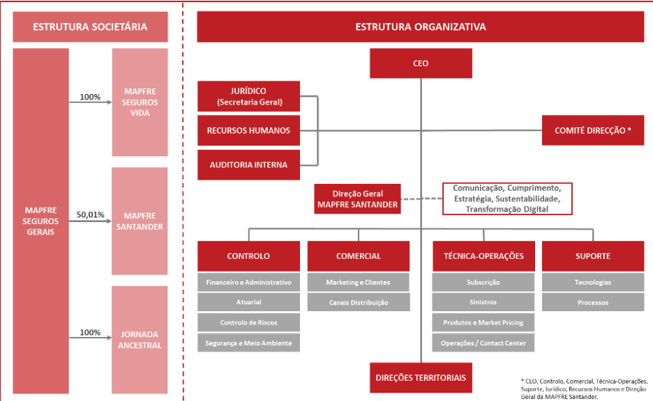  

Estes órgãos de governo permitem a adequada gestão estratégica, comercial e operativa e permite dar a resposta de forma adequada em tempo e forma a qualquer eventualidade que possa manifestar-se nos diferentes níveis da organização e/ou na sua envolvente de negócios e corporativo.  

Com o objetivo de garantir que o sistema de governo da Entidade conte com uma estrutura adequada, a Entidade, dispõe de uma série de políticas que regulam as funções-chave (Gestão de riscos, Compliance, Auditoria interna e Atuarial) e asseguram que essas funções seguem os requisitos impostos pelo regulador e, são fiéis às linhas de governo estabelecidas pelo Grupo MAPFRE.  

O Conselho de Administração da MAPFRE Seguros é o último responsável por garantir a eficácia do Sistema de Gestão de Riscos, de estabelecer o perfil de risco e os limites de tolerância, assim como de aprovar as principais estratégias e políticas de gestão de riscos dentro do quadro gestão de riscos estabelecido pelo Grupo. Relativamente ao Sistema de Gestão de Riscos adotou-se o modelo das três linhas de defesa.  

Neste quadro a MAPFRE Seguros apresenta uma estrutura composta por áreas que, nos seus respetivos âmbitos de competência, executam de forma independente atividades de supervisão dos riscos assumidos.  

# C. Perfil de risco  

A MAPFRE Seguros calcula o Capital de Solvência Obrigatório (doravante RCS ou SCR), de acordo com os requisitos da metodologia estabelecida pela referida normativa para o cálculo dos capitais de solvência requeridos, da fórmula-padrão, metodologia estabelecida pela diretiva de Solvência II.  

Seguidamente, mostramos a composição do perfil de risco da Entidade, baseado nos riscos recolhidos pela fórmula-padrão e a percentagem do capital regulatório requerido para cada um desses mesmos riscos:  

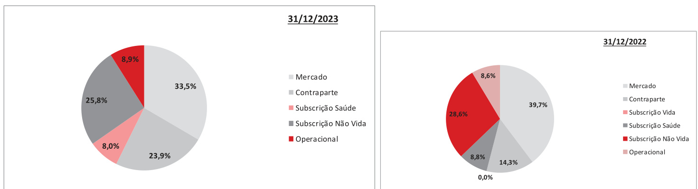  
Capital de Solvência Requerido por categoria de risco  

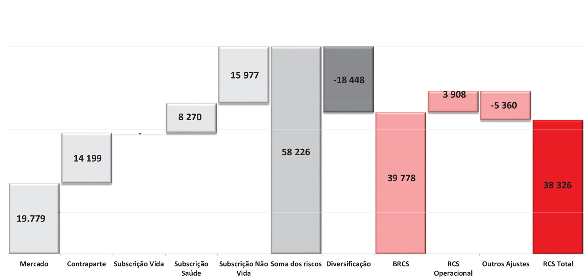  
Unidade: milhares de Euros  

O valor total do RCS da Entidade, a 31 de dezembro de 2023 ascende a 38.326 milhares de euros, sendo que a 31 de dezembro de 2022 era de 29.981 milhares.  

Na rúbrica “Outros ajustes“ apresenta-se a capacidade de absorção de perdas por Impostos Diferidos.  

de perdas do imposto diferido atinje 5.360 milhares de e  

O valor do Capital Mínimo Obrigatório (doravante MCR ou RCM, "Minimum Capital Requirement") da Entidade, a 31 de dezembro de 2023, ascende a 11.253 milhares de euros, sendo que a 31 de dezembro de 2022 era de 10.896 milhares de euros.  

Para o cálculo do RCS a entidade não utilizou nem simplificações nem parâmetros específicos.  

Em 2023, não se produziram alterações significativas em relação às medidas utilizadas para avaliar os principais riscos dentro da Entidade.  

Foi ainda incluído, no ponto C.6, Outros Riscos, os quais a MAPFRE Seguros considera como parte do seu perfil de risco e que não estão incluídos na fórmula-padrão e que são identificados no processo ORSA. Geralmente, são riscos de carácter qualitativo.  

Além disso, a Entidade realiza análises de sensibilidade do rácio de solvência em relação a determinados eventos, cujos resultados mostram que a Entidade continuaria a cumprir os requisitos de capital de solvência mesmo em circunstâncias adversas.  

O Conselho de Administração da MAPFRE Seguros é o último responsável por garantir a eficácia do Sistema de Gestão de Riscos, de estabelecer o perfil de risco e os limites de tolerância, assim como de aprovar as principais estratégias e políticas de gestão de riscos dentro do quadro gestão de riscos estabelecido pelo Grupo.  

seguinte mostramos a evolução do rácio de solvência resu  

<html><body><table><tr><td></td><td>Real 2023</td><td>Previsto2024</td><td>Previsto2025</td><td>Previsto2026</td></tr><tr><td>RaciodeSolvencia</td><td>147,9%</td><td>171,6%</td><td>178,4%</td><td>189,8%</td></tr></table></body></html>  

Tendo em conta os resultados obtidos das provas de resistência desenvolvidas no processo $^{\prime}0\mathsf{R S A^{\prime\prime}}$ , a Entidade continuaria com fundos próprios suficientes para cumprir com o RCS. O rácio de solvência manterse-ia em todo o momento em valores aceitáveis sem por em causa a solvência da Entidade. Por outro lado, a Entidade realiza uma análise de sensibilidade do Rácio de Solvência em relação a determinados eventos cujos resultados mostram que continuaria a cumprir com os requisitos de capital de solvência inclusivamente em circunstâncias adversas.  

# D. Avaliação para efeitos de solvência  

O valor total dos ativos, segundo a Normativa de Solvência II, ascende a 242.578 milhares de euros (220.765 em 2022), enquanto a efetuada segundo a normativa contabilística, é de 232.905 milhares de euros (225.923 em 2022).  

Esta diferença corresponde, principalmente, a intangíveis, e aos investimentos não avaliados a valor de mercado.  

O valor total dos passivos, segundo Solvência II, ascende a 183.508 milhares de euros (156.235 em 2022) em relação aos 175.227 milhares de euros, segundo a normativa contabilística.  

A principal diferença, entre ambas as normativas, produz-se nas provisões técnicas, dado que segundo Solvência II as mesmas são avaliadas seguindo um critério económico de mercado. No ponto D.2 detalha-se esta informação em relação às metodologias atuariais e as hipóteses utilizadas nos cálculos das provisões técnicas, a melhor estimativa e a margem de risco.  

<html><body><table><tr><td colspan="2">31/12/2023</td><td colspan="2">31/12/2022</td></tr><tr><td rowspan="2">AtivosSll 242.578</td><td>Exesso ativos sobre passivos Sll 59.070</td><td rowspan="2">AtivosSll 220 765</td><td>Exesso ativos sobre passivos Sll 64530</td></tr><tr><td>Passivos Sil 183.508</td><td>Passivos Sll 156 235</td></tr></table></body></html>

Unidade: milhares de Euros  

O excesso total de ativos sobre passivos ascende a 59.070 milhares de euros (64.530 em 2022) segundo Solvência II.  

Durante o presente exercício não houve alterações significativas nos critérios de avaliação dos ativos e passivos.  

# E. Gestão do capital  

A MAPFRE Seguros mantém os níveis de solvência dentro dos limites estabelecidos pela normativa e pelo apetite de risco da própria Entidade dispondo de um plano de gestão de capital a médio prazo.  

O quadro seguinte detalha o rácio de solvência da Entida  

<html><body><table><tr><td></td><td>31/12/2023</td><td>31/12/2022</td></tr><tr><td>Capital de Solvencia Obrigatorio (RCS)</td><td>38.326</td><td>29981</td></tr><tr><td>Fundos proprios admissiveis para cobrir RCS</td><td>56.693</td><td>62834</td></tr><tr><td>Ratio de solvencia (cobertura do RCS)</td><td>147,9%</td><td>209,6%</td></tr></table></body></html>

Unidade: milhares de Euros  

A 31 de dezembro de 2023 os Fundos próprios admissíveis para cobrir o RCS ascende a 56.693 milhares de euros (62.834 em 2022), sendo de qualidade nível 1 não restringido.  

O rácio de solvência ascende a $147,9\%$ $(209,6\%$ em 2022) e mede a relação entre os Fundos próprios admissíveis e o RCS. Este mostra a elevada capacidade da Entidade para absorver as perdas extraordinárias derivadas de um cenário adverso e encontra-se dentro do Apetite de Risco estabelecido para a Entidade e aprovado pelo Conselho de Administração.  

Os principais factores da variação registada foi a redução do valor das participações bem como o aumento do risco de contraparte, por via do risco catastrófico associado.  

Para o cálculo do rácio de solvência a Entidade aplicou o ajustamento por volatilidade e a medida transitória sobre provisões técnicas previstas na normativa.  

No quadro seguinte compara-se o rácio de solvência da Entidade com o que se obteria no caso de não se ter aplicado o ajuste por volatilidade, a medida transitória e os ajustes. Em ambos os casos a Entidade continuaria dispondo de fundos próprios admissíveis para cobrir o RCS:  

<html><body><table><tr><td>Racio de solvencia 31/12/2023</td><td>147,9%</td></tr><tr><td>Impacto de transitoria de p provisoes tecnicas</td><td>-4.5 dd</td></tr><tr><td>Totalraciosemmedidastransitorias</td><td>143,4%</td></tr></table></body></html>  

<html><body><table><tr><td>Racio de solvencia 31/12/2023</td><td>147,9%</td></tr><tr><td>Impacto de ajuste eporvolatilidade</td><td>-3,9p dd</td></tr><tr><td>Totalracio sem ajustesporvolatilidade</td><td>144,0%</td></tr></table></body></html>

p.p.: pontos percentuais  

O regulamento estabelece um RCM que é configurado como o nível mínimo de segurança abaixo do qual os recursos financeiros da Entidade não devem descer. Este RCM é de 11.253 milhares de euros (10.896 em 2022) e os fundos próprios admissíveis para a sua cobertura são 56.693 milhares de euros (62.834 em 2022), assim sendo o rácio de cobertura do RCM é de $^{503,8\%}$ . A totalidade dos fundos próprios é de qualidade nível 1.  

# A. Atividades e Desempenho  

As projeções que constam no presente relatório estão alinhadas com a planificação estratégica realizada no final de 2023. A atividade e o desempenho foram marcados por um aumento global da inflação, o que levou a uma reação dos bancos centrais, aumentando os níveis das taxas de juros. O impacto que estas subidas das taxas poderiam ter na desejada descida da inflação é ainda incerto, tal como o impacto potencial no crescimento económico e no poder de compra das famílias. Tais impactos podem influenciar o comportamento na demanda por produtos e serviços de seguros.  

Durante o período abrangido pelo presente relatório, não ocorreram atividades ou outros eventos significativos, com impacto material na Companhia.  

Não obstante, ao longo do presente capítulo são apresentadas comparações com as informações incluídas no relatório relativo a 2023.  

Os dados desta secção provêm das contas anuais da Entidade que foram elaboradas de acordo com o PCES – Plano Contabilístico das Empresas de Seguros.  

# A.1. Atividade  

# A.1.1. Atividades da Entidade  

A MAPFRE Seguros Gerais, S.A., foi constituída por escritura, a 30 de Dezembro de 1997, considerada formalmente sociedade anónima de seguros pela Norma $\mathsf{n}^{\mathsf{o}}\,2/98$ da Autoridade de Supervisão de Seguros e Fundos de Pensões, tendo iniciado a sua atividade a 1 de Abril de 1998.  

A MAPFRE Seguros Gerais, S.A., exerce a sua atividade na área de seguros Não Vida e emitiu, no ano de 2023, prémios aproximadamente de 136,39 milhões de euros, com um excelente crescimento de $26,7\%.$ , superior a 28 milhões de euros, que se apresenta como um dos maiores da história da Companhia.  

Uma análise por ramos revela um extraordinário crescimento de $56,6\%$ do ramo de Incendio e Outros Danos, percentagem idêntica à que se verificou no grupo que denominamos “Resto de Ramos”, no qual assume maior peso o ramo de Responsabilidade Civil, em ambos os casos alavancados pela captação de um programa de seguros de um importante cliente do setor da energia já mencionado em comentários anteriores.  

O ramo de Acidentes de Trabalho apresentou um crescimento mais moderado, mas consolidou a retoma encetada no ano anterior após vários anos de aplicação de um processo de saneamento para por fim às perdas de exploração que se verificavam. Esta moderação é, precisamente, fruto da manutenção de políticas tarifárias e de seleção de risco bastante rigorosas, portanto, menos agressivas comercialmente, no sentido de evitar o regresso ao desequilíbrio técnico.  

Por sua vez, o ramo Automóvel não foi além de um avanço residual de $0{,}2\%$ , limitado por um contexto de mercado competitivo e, tal como no caso de Acidentes de Trabalho, pela opção de preservação do rácio combinado.  

O seu domicílio social encontra-se em Miraflores, na Rua Doutor António Loureiro Borges, 9, Edifício Zenith – Miraflores, 1495-131 ALGÉS Portugal.  

A MAPFRE Seguros Gerais, S.A. (doravante MAPFRE Seguros ou Entidade), é uma das sociedades do Grupo MAPFRE, que desenvolve a sua atividade em Portugal e é detida a $100\%$ pela MAPFRE ESPAÑA, S.A., que por sua vez, é detida a $100\%$ pela MAPFRE, S.A., empresa matriz do Grupo.  

A última Sociedade dominante é a FUNDACIÓN MAPFRE, Sociedade sem fins lucrativos, cujo domicílio é em Madrid, Paseo de Recoletos $\mathsf{n}^{\mathsf{o}}\,23$ , Espanha.  

O quadro seguinte, reflete as pessoas singulares ou coletivas, com participações qualificadas diretas ou indiretas da Entidade:  

<html><body><table><tr><td>Nome/ Denominacao</td><td>Forma juridica</td><td>Tipo de participacao</td><td>Localizacao</td><td>Percentagem de Direitos de Voto</td></tr><tr><td>MAPFREEspana</td><td>S.A.</td><td>Direta</td><td>Espanha</td><td>100%</td></tr></table></body></html>  

Em baixo, apresenta-se um organigrama simplificado no qual se pode observar a posição que ocupa a Entidade dentro da estrutura jurídica do Grupo:  

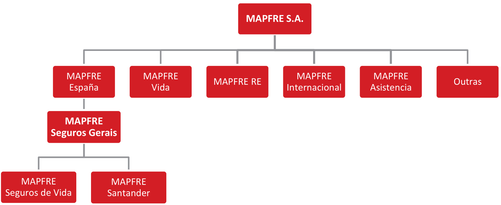  

O Grupo MAPFRE optou por apresentar um relatório para efeitos consolidados e relatórios para as várias companhias de seguros e resseguros.  

# Supervisão da Entidade  

A Autoridade de Supervisão de Seguros e Fundos de Pensões (ASF) é a autoridade nacional responsável pela regulação e supervisão, quer prudencial, quer comportamental, da atividade seguradora, resseguradora, dos fundos de pensões e respetivas entidades gestoras e da mediação de seguros, cuja missão passa por assegurar o bom funcionamento do mercado segurador e fundos de pensões em Portugal, de forma a contribuir para a garantia da proteção dos tomadores de seguro, pessoas seguras, participantes e beneficiários.  

A ASF tem sede na Av. Da República 76, 1600-205 Lisboa, e os seus contactos são:  

Telefone: 21 790 3100 Email: asf@asf.com.pt Website: www.asf.com.pt  

A “Dirección General de Seguros y Fondos de Pensiones” (DGSFP) é a autoridade de supervisão do Grupo MAPFRE, dado que a holding do Grupo está sediada em Espanha.  

# Auditoria externa  

A KPMG & Associados - Sociedade de Revisores Oficiais de Contas, S.A., emitiu em 17 de abril de 2024 a Certificação Legal de Contas, onde atesta que as demonstrações financeiras da MAPFRE Seguros Gerais, S.A. apresentam de forma verdadeira e apropriada, em todos os aspetos materiais, a posição financeira da mesma em 31 de dezembro de 2023 e o seu desempenho financeiro e fluxos de caixa relativos ao ano findo naquela data, de acordo com os princípios contabilísticos geralmente aceites em Portugal para o sector Segurador, estabelecidos pela Autoridade de Supervisão de Seguros e Fundos de Pensões (ASF).  

# Linhas de Negócio  

As principais linhas de negócio identificadas pela Entidade, utilizando a relação estabelecida nos atuais regulamentos de Solvência II, são as seguintes:  

Seguros de Acidentes e Doença • Seguros de Acidentes de Trabalho • Seguros de Acidentes Pessoais • Seguros de Saúde • Entre outros Seguros de Incêndio e Outros Danos • Seguros de Multirriscos Habitação • Seguros de Multirriscos Comerciantes • Seguros de Multirriscos Industriais • Entre outros Seguros Automóveis • Seguros de Responsabilidade Civil de Veículos • Seguros de Pessoas Transportadas • Entre outros Seguros Marítimos e Transportes Seguros de Mercadorias Transportadas Seguros de Responsabilidade Civil - Seguros Diversos • Seguros de Caução • Seguros de Proteção Jurídica • Entre outros  

# Áreas geográficas  

Não existem áreas geográficas além do território nacional.  

# A.1.2. Eventos com repercussão significativa  

# Eventos relacionados com o negócio  

O resultado líquido do exercício cifrou-se em 2,97 milhões de euros, $40\%$ acima do ano anterior, embora deva ter-se em conta que o normativo contabilístico se alterou com a implementação, este ano, das IFRS 9 e 17, sendo que a nova metodologia de estimação das responsabilidades com sinistros incorridos (na terminologia anglo saxónica LIC – Liability for Incurred Claims) tende a beneficiar o resultado ao diminuir o custo associado em comparação com o normativo anterior.  

Mantendo o critério de distribuição de dividendos adotado nos últimos anos, será apresentada em Assembleia Geral uma proposta de pagamento de cerca de 2,4 milhões de euros à acionista única MAPFRE España.  

Este resultado foi acompanhado de uma subida, também significativa, da rentabilidade dos fundos próprios que se fixou em $5{,}2\%$ por cima do ano anterior em 1,6 pontos percentuais.  

Durante o exercício de 2023 o volume de prémios emitidos de seguro direto foi de 136.392.685,10 milhares de euros (107.625,63 em 2022), com um excelente crescimento de $26,7\%$ , que se apresenta como um dos maiores da história da Companhia.  

O rácio combinado subiu 2,8 pontos percentuais para $100{,}4\%$ , especialmente derivado do comportamento menos favorável de um conjunto de ramos onde se incluem os Multiriscos Habitação, Comércio e Industria que no pós-pandemia têm sofrido um aumento da sinistralidade decorrente de fenómenos climatéricos mais intensos, da subida dos custos de reparação muito acima da inflação média e também do aumento da própria frequência.  

No que se refere à rentabilidade da carteira de investimentos, obteve-se um rácio de $2,7\%$ em linha com o do ano anterior e não houve realizações extraordinárias geradoras de mais valias.  

Ainda que a taxa global praticamente não tenha oscilado em relação ao ano anterior, verificaram-se variações consoante o tipo de ativos subjacentes. No caso, a taxa associada a títulos de rendimento variável subiu para $2.6\%$ ( $1,\!4\%$ no ano anterior) e nos depósitos a prazo, inexistentes no ano anterior, obteve-se uma rentabilidade média de $2,1\%$ , enquanto que em relação aos títulos de rendimento fixo a taxa se situou em $3,1\%$ , por cima da média dos últimos 5 anos.  

# Aspetos de mercado e regulamentar  

De acordo com os dados da APS – Associação Portuguesa de Seguradores1, o volume de vendas do setor segurador como um todo situou-se em torno dos 11.800 milhões de euros, decrescendo $1,\%$ , um recuo que, ainda que menos pronunciado, se verifica pelo segundo ano consecutivo, tendo o segmento Não Vida quebrado a tradicional preponderância assumida pela área de Vida ao atingir uma representatividade de $56,4\%$ que só encontra paralelo histórico em meados dos anos 90.  

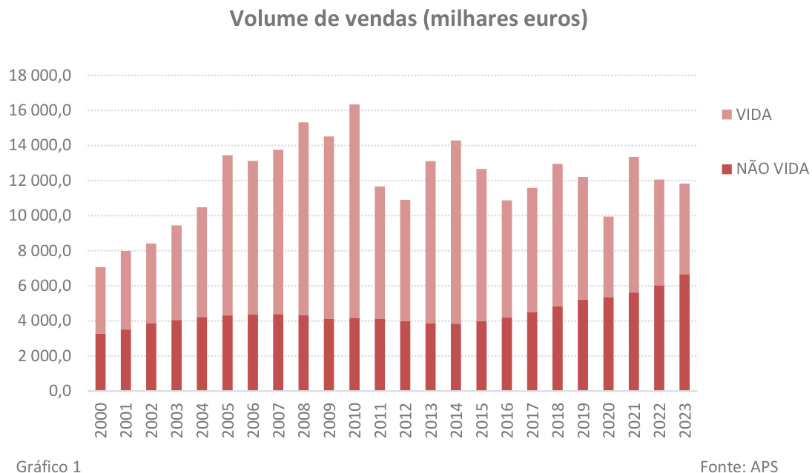  

Com efeito, o segmento Não Vida apresentou um crescimento de $10{,}4\%$ , incorporando os efeitos da inflação e da realidade económica e social.  

Destaca-se o ramo de Saúde que se vem revelando bastante dinâmico e voltou a crescer de forma acentuada $(16,8\%)$ , não apenas em razão da componente inflacionária que, naturalmente, se refletiu em subidas tarifárias, mas, também, por via do aumento do número de pessoas seguras, a que não será alheia a resposta cada vez mais deficitária do setor publico.  

Um crescimento também bastante relevante $(11,1\%)$ , observou-se no ramo de Acidentes de Trabalho, principalmente devido à subida da massa salarial sobre a qual incidem os prémios, algo que se apresenta como consequência natural do aumento generalizado dos salários e do emprego.  

Evolução análoga verificou-se no conjunto dos ramos Multiriscos (Habitação, Comércio e Industria), enquanto no ramo Automóvel o desempenho foi mais moderado, com um avanço de $7\%$ , associado essencialmente às coberturas de Danos Próprios, uma vez que na cobertura base e obrigatória de Responsabilidade Civil o crescimento não conseguiu sequer compensar o nível de inflação.  

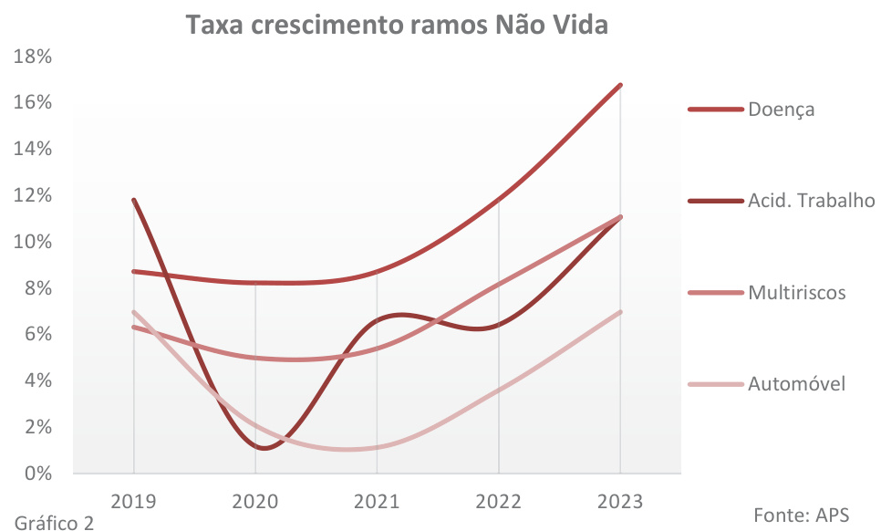  

No que concerne à taxa de sinistralidade, calculada a prémios emitidos e bruta de resseguro, os dados preliminares disponibilizados pela Autoridade de Supervisão de Seguros e Fundos de Pensões (ASF)2 apontam para uma redução global em relação ao ano anterior.  

No ramo Automóvel, o mais representativo da carteira Não Vida, registou-se uma redução de 3,8 pontos percentuais, situando-se em $65,7\%$ , bem abaixo dos níveis pré Covid (tinha sido de $74,7\%$ no ano 2019).  

Na mesma linha se comportou o ramo de Acidentes de Trabalho, apresentando uma redução de 4,4 pontos percentuais de $60{,}6\%$ para $56,2\%$ , comparando também e ainda mais favoravelmente com os 89, $1\%$ do ano 2019.  

No ramo de Doença a taxa de sinistralidade situou-se em $69{,}4\%$ , com uma diminuição implícita de 2,4 pontos percentuais que, embora mais moderada quando comparada com a dos ramos anteriores, não deixa de ser relevante e demonstrativa que o setor conseguiu absorver a pressão derivada do aumento da utilização dos benefícios das suas apólices por parte dos clientes.  

Já nos ramos Multiriscos a evolução não foi tão favorável. Se no referente à Habitação houve uma melhoria de 2,2 pontos percentuais para $47,8\%$ , no caso da Industria situou-se em $46,5\%$ , ligeiramente acima do ano anterior, e no segmento do Comércio teve um agravamento com algum significado de 3,2 pontos, terminando em $49{,}4\%$ . Nota também para o facto de todos estes rácios se encontrarem a um nível substancialmente mais elevado do que se verificava antes do período pandémico. Uma maior consciência dos tomadores em relação às coberturas contratadas, o incremento dos custos de reparação e as intempéries cada vez mais intensas, poderão ser as razões desta evolução.  

Passando agora para uma análise ao desempenho do segmento Vida, o que transparece é que se terá ressentido da subida generalizada dos preços e das taxas de juro.  

Esse movimento ascendente poderá ter exercido uma pressão sobre os orçamentos familiares, retirando espaço à disponibilidade de fundos para aplicar em poupanças, levando mesmo muitos agregados a recorrer ao resgate dos produtos de poupança reforma (PPR) a coberto da norma especial de isenção de penalização quando destinados à amortização do crédito à habitação.  

Por outro lado, o incremento das taxas de juro permitiu a oferta de rentabilidades mais atrativas nos tradicionais depósitos a prazo por parte das entidades bancárias, captando, assim, em maior escala, a fatia que subsistiu para poupança, em detrimento dos produtos indexados a rendimentos variáveis, tipo Unit Linked, que tiveram nos últimos anos um grande protagonismo e que se tornaram agora menos interessantes.  

O gráfico 3 parece confirmar estas considerações, na medida em que evidencia claramente não só a redução generalizada das taxas de crescimento, mas sobretudo a performance bastante negativa dos produtos ligados a fundos de investimento.  

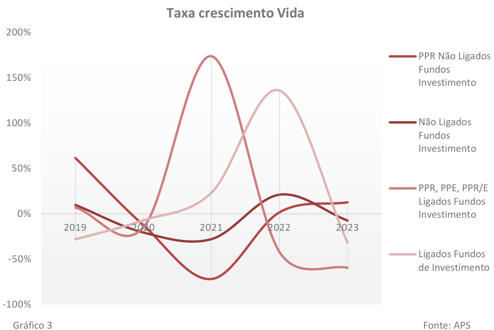  

Este comportamento débil das vendas, associado à dinâmica normal dos fluxos de saída referentes a entregas de anos anteriores, por via de vencimentos e resgates, estes últimos possivelmente alavancados pela flexibilidade permitida pela introdução da isenção de penalização em determinados casos, teve como consequência uma descida continua do volume de carteira sob gestão das seguradoras bem patente na imagem do gráfico 4.  

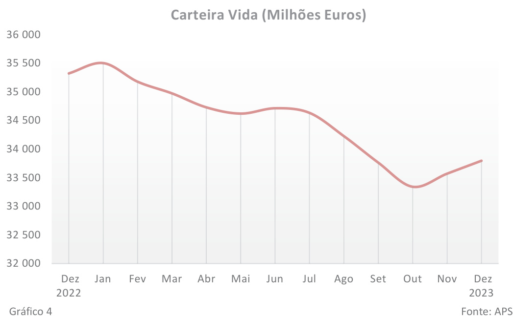  

Importa completar a abordagem à evolução do setor no ano 2023 com uma referência à rentabilidade traduzida pelos Resultados Líquidos.  

Desde logo, há que assinalar uma alteração de paradigma contabilístico pela entrada em vigor da norma IRFS 17 que o supervisor decidiu adotar na sua integralidade. Esta norma, além de incorporar uma maior complexidade e uma componente mais elevada de juízo de valor nas projeções das responsabilidades, acarreta níveis de resultados necessariamente diferentes em comparação com o passado.  

De acordo com os dados disponibilizados pela $\mathsf{A P S}^{3}$ , ao fecho do semestre o setor acumulava um resultado líquido próximo dos 314 milhões de euros, não muito diferente do ano anterior, embora se deva ressalvar a limitação decorrente de serem provisórios e de carecerem de carecerem de calibrações decorrentes da evolução no processo de implementação da nova norma, as quais podem impactar a fotografia que venha a ser obtida no encerramento do exercício. Também à semelhança do ano anterior, ambos os segmentos – Vida e Não Vida – situam-se em terreno positivo, cabendo a maior fatia ao negócio Vida com cerca de 272 milhões de euros.  

Por fim, recorrendo mais uma vez aos dados disponibilizados pela APS4, fazemos uma referencia ao nível de Solvência, o qual se situava em $203,4\%$ ao fecho do terceiro trimestre, ligeiramente acima do mesmo período e do fecho do ano anterior, continuando a revelar uma excelente robustez do setor, não sendo de esperar alterações muito significativas no apuramento do final do ano.  

De acordo com os estudos da MAPFRE Economics, as estimativas de crescimento global apontam para um entorno de desaceleração económica em consequência da transmissão à economia real dos mecanismos de política monetária implementados pelos diversos bancos centrais.  

Este desempenho mais débil da economia tenderá a induzir menores crescimentos no volume de negócio do setor segurador, em especial no caso das linhas de negócio reconhecidamente mais dependentes dos ciclos económicos e do crédito concedido, como são os casos dos ramos Automóvel, Habitação e Vida Risco.  

Não obstante, é expectável uma melhoria da rentabilidade na medida em que se consolidem as revisões tarifárias de ajustamento à inflação dos últimos anos, se moderem os crescimentos dos custos pelo abrandamento previsto da inflação e se incrementem os rendimentos financeiros pelas subidas das taxas de juro.  

Por outro lado, esta subida das taxas de juro poderá contribuir para uma maior atratividade dos produtos de poupança e de rendas vitalícias que, assim, terão boas perspetivas de aumento do volume de negócio, em contraponto com os produtos de poupança Unit Linked, em que o tomador assume o risco do investimento, os quais poderão continuar a ver-se afetados pela menor valorização dos ativos subjacentes acompanhada de um aumento da volatilidade.  

Quanto à Solvência, se é certo que as correções em baixa dos mercados financeiros poderiam afetar os rácios de cobertura, o alto nível de capitalização e a apurada estrutura de gestão de riscos, evidenciados pelos reportes das autoridades de supervisão, parecem permitir absorver esses impactos sem colocar em causa a solidez do setor como, aliás, já ficou demonstrado em situações anteriores de contextos económicos adversos.  

# A.1.3. Informação sobre as filiais da Entidade  

A Entidade detém, a 31 de dezembro de 2023, $100\%$ da MAPFRE Seguros de Vida e $50,\!1\%$ da MAPFRE Santander Portugal – Companhia de Seguros, S.A.  

Durante o ano de 2023 foi adquirida uma entidade não financeira a $100\%$ , Jornada Ancestral SA  

# A.2. Resultados em termos de subscrição  

Os prémios emitidos evoluíram favoravelmente, com um crescimento superior a 28 milhões de euros em relação ao ano anterior, correspondente a aproximadamente $26,7\%$ , cifrando-se em 136,39 milhões de euros,  

Uma análise por ramos revela um extraordinário crescimento de $56,6\%$ do ramo de Incendio e Outros Danos, percentagem idêntica à que se verificou no grupo que denominamos “Resto de Ramos”, no qual assume maior peso o ramo de Responsabilidade Civil, em ambos os casos alavancados pela captação de um programa de seguros de um importante cliente do setor da energia já mencionado em comentários anteriores.  

O ramo de Acidentes de Trabalho apresentou um crescimento mais moderado, mas consolidou a retoma encetada no ano anterior após vários anos de aplicação de um processo de saneamento para por fim às perdas de exploração que se verificavam. Esta moderação é, precisamente, fruto da manutenção de políticas tarifárias e de seleção de risco bastante rigorosas, portanto, menos agressivas comercialmente, no sentido de evitar o regresso ao desequilíbrio técnico.  

Por sua vez, o ramo Automóvel não foi além de um avanço residual de $0{,}2\%$ , limitado por um contexto de mercado competitivo e, tal como no caso de Acidentes de Trabalho, pela opção de preservação do rácio combinado.  

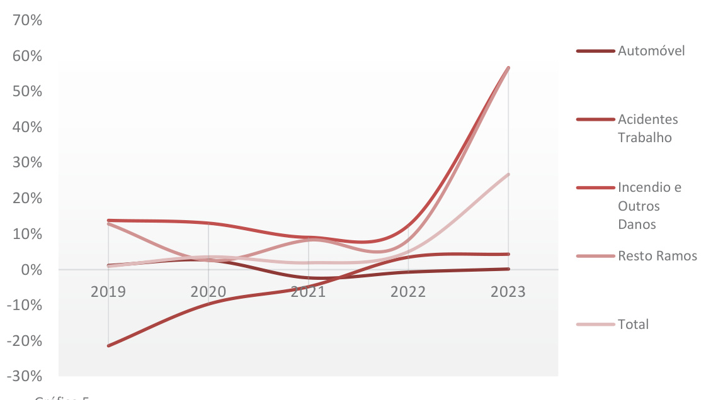  
Taxa crescimento vendas ramos Não Vida  

O referido incremento nos grupos de “Incendio e Outros Danos” e “Restantes Ramos” teve um impacto significativo na composição da carteira de prémios de tal forma de os ramos obrigatórios de Automóvel e Acidentes de Trabalho passaram a representar, em conjunto, menos de $50\%$ do total.  

Esta evolução encaixa na estratégia de diversificação da carteira e de redução da tradicional dependência dos ramos obrigatórios, mais expostos à competitividade do mercado e mais sujeitos aos humores do entorno económico.  

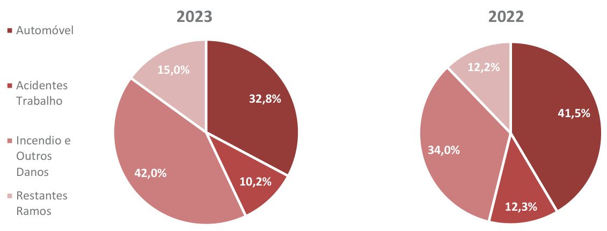  
Gráfico 6  

O rácio combinado subiu 2,8 pontos percentuais para $100{,}4\%$ , especialmente derivado do comportamento menos favorável de um conjunto de ramos onde se incluem os Multiriscos Habitação, Comércio e Industria que no pós-pandemia têm sofrido um aumento da sinistralidade decorrente de fenómenos climatéricos mais intensos, da subida dos custos de reparação muito acima da inflação média e também do aumento da própria frequência.  

Para corrigir este fenómeno, está já em marcha um plano específico para atuar sobre as tarifas pois urge fazer com que o nível de prémios acompanhe a nova realidade.  

No ramo Automóvel, verificou-se um incremento de 1,2 pontos percentuais, situando-se o rácio em $98{,}2\%$ , ainda assim inferior ao ano de referencia de 2019, anterior à pandemia, para o que contribuiu essencialmente o investimento que tem sido feito no desenvolvimento de modelos tarifários sofisticados e na ampliação da rede de oficinas de reparação convencionadas.  

Por sua vez, o rácio de Acidentes de Trabalho, após a performance excecional no ano anterior, subiu 3,4 pontos percentuais, mas terminou nos $92,2\%$ , um ano mais em excelente nível, o que demonstra uma sólida e consistente suficiência técnica.  

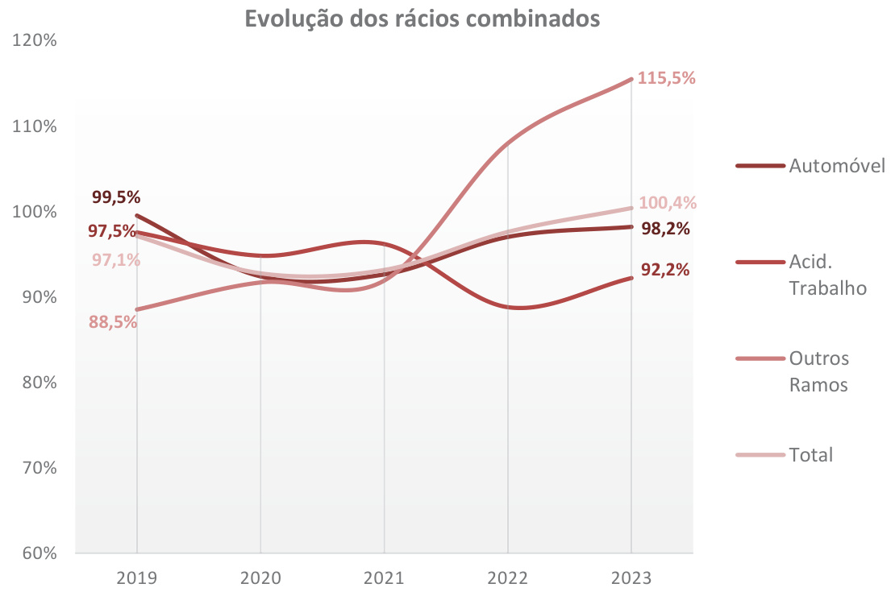  
Gráfico 7  

Informação Qualitativa a 31/12/2023   

<html><body><table><tr><td>Total</td><td>107 626 2022</td><td></td><td>41 771 t58 59 70 457 966S9</td><td>106 456 129 003</td><td></td><td>D 40 604</td><td>258 S9</td><td>35 724</td><td>7 814 27 910 27 465</td><td></td><td>S00 371</td><td>。</td><td></td><td>1005 371</td><td>29 710 98 30921 265</td><td rowspan="13">29 796 31 186</td></tr><tr><td>Perdas pecuniarias</td><td>2023 136 393 2022</td><td></td><td>m</td><td></td><td></td><td>87 E9 3</td><td>m</td><td>65 043</td><td></td><td></td><td>15</td><td></td><td></td><td>15 166</td><td></td></tr><tr><td></td><td>2023</td><td>4 437</td><td>4 435 N</td><td>3343</td><td></td><td></td><td>N</td><td></td><td></td><td></td><td>4</td><td></td><td></td><td>。 0</td><td></td></tr><tr><td>Assistencia</td><td>2022 2023</td><td></td><td></td><td></td><td></td><td></td><td></td><td></td><td></td><td></td><td></td><td></td><td></td><td></td><td></td></tr><tr><td>oaod ap ona juridica</td><td>2022</td><td>899</td><td></td><td>899 S49 648</td><td></td><td></td><td>。 648</td><td>2</td><td></td><td>D -16 12</td><td></td><td>-18 2</td><td></td><td>-18 2</td><td>1 253 1 238</td></tr><tr><td>Seguro de credito e</td><td>2023 2022</td><td>634 91</td><td>6</td><td>E9 忆 95</td><td></td><td></td><td>25</td><td>9</td><td></td><td>7</td><td></td><td>-146</td><td></td><td>-146</td><td>-21</td></tr><tr><td>ogSnes (aeedodonassaaeapapee euonassaonaspspeesudsauaupas responsabilidade civil apoungas</td><td>2023 2022</td><td>3 085 96</td><td>28 925</td><td>5 575</td><td>16</td><td></td><td>19 。 2 283 3292</td><td>90T- 1 425</td><td></td><td>439</td><td>-49 986</td><td></td><td></td><td></td><td>Z8- 1 457</td></tr><tr><td></td><td>2023 7 782</td><td>0</td><td>4 472 28 925</td><td>OTEE SS9 L</td><td>35 205</td><td></td><td>T66 m 27 846</td><td>186 3 402</td><td></td><td>6SE O2E I-</td><td>621 4 732</td><td>1 149</td><td></td><td>1 149</td><td>1 613 5 075</td></tr><tr><td>Seguro de incendio e outros danos</td><td>085 96 2023</td><td></td><td>49 611</td><td>069 L</td><td>51 789</td><td></td><td>44 279</td><td>7 359 7 510</td><td></td><td></td><td>5 274</td><td></td><td>234</td><td>234</td><td>5918</td></tr><tr><td>Seguromaritimo,da sopa oe</td><td>2022 s</td><td>378 512</td><td>687 419</td><td>9</td><td>363 458</td><td></td><td></td><td>84</td><td></td><td></td><td>m 46 m</td><td></td><td>守 中</td><td></td><td>13</td></tr><tr><td>Outros seguros do ramo</td><td>2023 2022 automovel</td><td>17 505 17 740</td><td></td><td>14 116 14 356</td><td>17 837 17 602</td><td></td><td>3 464</td><td>14 373 8 240 14 294 8 832</td><td></td><td></td><td>2 486 2860</td><td></td><td></td><td></td><td>7273 7 313</td></tr><tr><td>responsabilidade civil</td><td>2023 2022 2023</td><td>27 166 27 002 0</td><td>2 215 2796</td><td>24 951 24207</td><td></td><td>27 049</td><td>2 215 25 122 2796 24254</td><td>19 465 17 927</td><td></td><td>4 151 3 514</td><td>15 314 14 413</td><td></td><td></td><td></td><td>10 324 9982</td></tr><tr><td>Seguro de acidentes de</td><td>2022</td><td>13 292</td><td>166 13 126</td><td>13 206</td><td></td><td></td><td>166 13 041</td><td>514 99</td><td></td><td>D</td><td>514</td><td></td><td></td><td></td><td></td></tr><tr><td></td><td>2023 2022</td><td>13 867</td><td>13 684 361 1 425</td><td>13 845 1 790</td><td></td><td></td><td>13 662 1428</td><td>09E</td><td></td><td>E9 361</td><td></td><td></td><td></td><td>898</td><td></td></tr><tr><td>Seguro de protegio do rendimento</td><td>1 787 1 881 2023</td><td></td><td>447 1 434</td><td></td><td>1 913</td><td></td><td>362 1 465</td><td>229</td><td></td><td></td><td>229</td><td></td><td></td><td>80S 478</td><td></td></tr><tr><td>sesadsap ap oungas medicas</td><td colspan="2">4 385 2022 5 224</td><td></td><td></td><td>4 333 L90 S</td><td></td><td>3 891 442</td><td>2 264 3 561</td><td></td><td></td><td>226</td><td>78</td><td>18</td><td>-20 988</td><td></td></tr><tr><td>Premios, sinistros e despesas por classe de negcio</td><td colspan="2">2023 Valor bruto — Resseguro proporcional aceite Valor bruto — Atividade direta Premios emitidos</td><td>4 697 Valor bruto — Resseguro nao proporcional aceite Parte dos resseguradores</td><td colspan="2">Valor bruto — Atividade direta Premios adquiridos</td><td colspan="2">4 556 Valor bruto — Resseguro nao proporcional aceite aae reuoodd onassag  onq roe</td><td colspan="2">512 Parte dos resseguradores Sinistros incorridos Valor liquido</td><td>Alteragbes noutras provisbes tecnicas Valor bruto — Atividade direta Valor liquido</td><td>3 205 9SE tae euoodod ogu unassag onq soe Parte dos resseguradores</td><td></td><td></td><td>aae eoodd ogu nass -onq oe</td><td></td><td></td><td>Parte dos resseguradores Despesas suportadas Total das despesas Outras despesas</td></tr></table></body></html>  

A seguir apresenta-se a informação quantitativa em relação à atividade e aos resultados de subscrição duranto 2023.  

Durante o período analisado, não foram observadas mudanças relevantes nas principais áreas de negócio em que a Entidade atua. Portanto, somente as áreas de negócio em que a Entidade está envolvida foram apresentadas nos quadros acima, com a exclusão das colunas correspondentes às áreas em que a Entidade não atua.  

A MAPFRE Seguros encerrou o exercício com prémios líquidos de seguro direto de 65.936 milhares de euros (65.854 milhares de euros em 2022).  

A sinistralidade líquida ascendeu a 27.465 milhares de euros (27.910 milhares de euros em 2022).  

O desempenho das principais linhas de negócio foi o seguinte:  

Incêndio e Outros danos: O volume de negócios ascendeu a 57.301 milhares euros, com um aumento de $56,6\%$ em relação ao ano anterior, muito impulsionado pelo negócio de Fronting, pelo que 49.611 milhares de euros foi cedido.  

Ao nível da taxa de sinistralidade, o rácio do ramo estava nos $146\%$ .  

# A.3. Desempenho dos Investimentos  

# A.3.1. Informação sobre os rendimentos, ganhos e gastos decorrentes de investimentos  

Na tabela seguinte, apresenta-se as informações quantitativas sobre os rendimentos e ganhos líquidos dos investimentos imobiliários, da carteira de activos, bem como outros investimentos:  

<html><body><table><tr><td colspan="2">RendimentoseGanhosdeInvestimentos</td><td>2023</td><td>2022</td></tr><tr><td colspan="2">RENDIMENTOSDEJUROS,DIVIDENDOSESIMILARES</td><td></td><td></td></tr><tr><td>ActivosFinanceirosMensuradosCustoAmortizado</td><td></td><td>72,95</td><td>39,00</td></tr><tr><td>ActivosFinanceirosMensuradosJVReservas</td><td></td><td>2.200,36</td><td>3.339,40</td></tr><tr><td>ActivosFinanceirosMensuradosJVP&L</td><td></td><td>713,81</td><td>0,00</td></tr><tr><td>TOTALRENDIMENTOS</td><td>2.987,12</td><td></td><td>3.378,40</td></tr><tr><td colspan="2">GANHOSEPERDAS</td><td></td><td></td></tr><tr><td>Activos Financeiros Mensurados Custo Amortizado</td><td>44,48</td><td></td><td>0,00</td></tr><tr><td>ActivosFinanceirosMensuradosJVReservas</td><td>-495,48</td><td></td><td>-393,06</td></tr><tr><td>ActivosFinanceirosMensuradosJVP&L</td><td>3 959,12</td><td></td><td>-21564,16</td></tr><tr><td>TOTALGANHOSEPERDAS</td><td>3 508,12</td><td></td><td>-21 957,22</td></tr></table></body></html>

Unidade: milhares de Euros  

A carteira de maior preponderância, corresponde aos rendimentos provenientes da carteira mensurada a justo valor através de reservas, com um montante de 2.200,36 milhares de euros (3.339,40 em 2022).  

Na tabela a seguir, apresentamos informações quantitativas sobre os gastos de investimentos, da carteira mensurada em reservas e de outros gastos de investimentos:  

<html><body><table><tr><td>GastosdeInvestimentos</td><td>2023</td><td>2022</td></tr><tr><td colspan="3">GASTOSDEINVESTIMENTOS</td></tr><tr><td>ActivosFinanceirosMensuradosJVReservas</td><td>277,57</td><td>339,60</td></tr><tr><td>Outrosgastosfinanceiros</td><td>0</td><td>926,03</td></tr><tr><td>TOTALGASTOS</td><td>277.57</td><td>1.265,63</td></tr></table></body></html>

Unidade: milhares de Euros  

Por sua vez, a carteira que envolveu maiores gastos com os investimentos financeiros foi a carteira mensurada através de reservas, com uma quantia de 277,57 milhares de euros (339,60 em 2022).  

# A.3.2 Informações sobre as variações do justo valor reconhecidos em capital próprio:  

O quadro seguinte demonstra o desempenho geral dos investimentos da Entidade, discriminados de acordo com os investimentos apresentados nas Demonstrações Financeiras:  

<html><body><table><tr><td>Investimentos</td><td>Rendimento</td></tr><tr><td>Investimentosimobiliarios</td><td>35,55</td></tr><tr><td>Investimentosfinanceiros</td><td>2.914,17</td></tr><tr><td>-ActivosFinanceirosMensuradosJVReservas</td><td>2.914,17</td></tr><tr><td>- Activos Financeiros Mensurados JV P&L</td><td>0,00</td></tr><tr><td>Outrosinvestimentos</td><td>37,40</td></tr><tr><td>Rendimentoglobal</td><td>2.987,12</td></tr></table></body></html>

Unidade: milhares de Euros  

O total dos rendimentos dos investimentos durante o ano ascendeu a 2.987,12 milhares de euros (3.378,40 em 2022), o que representa em $4,53\%$ (5, $13\%$ em 2022) dos Prémios de seguro líquidos de resseguro Cedido.  

Apresentamos a rentabilidade geral dos investimentos da Entidade, discriminados abaixo, de acordo com os investimentos registrados nas Demonstrações Financeiras:  

<html><body><table><tr><td>Investimentos</td><td>Rentabilidade</td></tr><tr><td>InvestimentosImobiliarios</td><td>2,1%</td></tr><tr><td>Instrumentosdecapitalefundosdeinvestimento</td><td>2,6%</td></tr><tr><td>Titulosdedivida</td><td>3,1%</td></tr><tr><td>Total daRentabilidade</td><td>2,7%</td></tr></table></body></html>

xa anualizada, calculada em função do investimento médio sem incluir valias  

A rentabilidade total dos investimentos do ano situou-se em $2,7\%$ .  

No que respeita à rentabilidade, verificou-se uma ligeira melhoria na mesma com subida na renda variável $(2,6\%\;2023\;\mathrm{e}\;1,4\%$ em 2022) bem como no rendimento fixo onde se atingiu a taxa de $3,1\%$ , valor acima da média dos últimos 5 anos.  

Em seguida, prestamos informação quantitativa sobre as variações do justo valor diretamente reconhecidos em capital próprio decorrente dos investimentos em milhares de euros relativamente aos 2 últimos anos:  

<html><body><table><tr><td rowspan="2">Investimentos</td><td colspan="2">Ganhosreconhecidos</td><td colspan="2">Perdasreconhecidas</td><td colspan="2">DiferencaLiquida</td></tr><tr><td>2023</td><td>2022</td><td>2023</td><td>2022</td><td>2023</td><td>2022</td></tr><tr><td>Investimentosfinanceiros</td><td>881,47</td><td>0,00</td><td>0,00</td><td>26.637,90</td><td>687,96</td><td>-26.637,90</td></tr><tr><td rowspan="3">ActivosFinanceirosMensuradosJVReservas Instrumentosdecapitalefundosdeinvestimento</td><td>881,47</td><td>0,00</td><td>0,00</td><td>26.637,90</td><td>479.18</td><td>-26.637,90</td></tr><tr><td>208,79</td><td>0,00</td><td>0,00</td><td>1.238,63</td><td>672,68</td><td>-1.238,63</td></tr><tr><td>672,69</td><td>0,00</td><td>0,00</td><td>25.399,27</td><td>208,79</td><td>-25.399,27</td></tr><tr><td>Titulosdedivida Rendimentoglobal</td><td>881,47</td><td>0,00</td><td>0.00</td><td>26.637,90</td><td>687,96</td><td>-26.637,90</td></tr></table></body></html>

Unidade: milhares de Euros  

Decorrente da variação do justo valor dos investimentos com reconhecimento em capital próprio, verifica-se um ganho líquido no valor de 687,96 milhares de euros (face à perda liquida de -26.637,90 milhares de euros em 2022).  

# A.4. Resultados de outras atividades  

# A.4.1 Outros rendimentos e gastos  

Durante este ano, a Entidade obteve as seguintes receitas e despesas, distintas dos rendimentos e gastos produzidos pela atividade de seguros e rendimentos sobre investimentos:  

<html><body><table><tr><td></td><td>Exercicio 2023</td><td>Exercicio 2022</td></tr><tr><td>Outros Rendimentos</td><td>1.138,43</td><td>461,33</td></tr><tr><td>Outrosgastos</td><td>422,03</td><td>226,26</td></tr></table></body></html>

Unidade: milhares de Euros  

Os outros rendimentos mais significativos que não sejam derivados da atividade de subscrição e dos investimentos, produzidos no ano correspondem 1.138,43, no entanto tem incluído um valor extraordinário de 557,80.  

# A.4.2 Contratos de arrendamento  

Locações Financeiras  

A Entidade não dispõe de qualquer tipo de arrendamento financeiro.  

# Locações Operacionais  

São classificados como locações operacionais, as locações em que o locador mantém uma parte significativa dos riscos e benefícios da propriedade.  

Os contratos de locação que a Entidade mantém, dizem respeito a locações operacionais, vulgo “Renting”. As locações são relativas a viaturas automóveis, sendo que cada contrato tem uma duração de 4 anos, existindo 13 contratos vigentes á data de 31.12.2023. A Entidade tem em vigor até ao ano de 2027, fluxos futuros contratualizados no valor de 183,86 milhares de euros, que se demonstram por exercício no quadro abaixo:  

<html><body><table><tr><td rowspan="2">Conceito</td><td colspan="4">Fluxos futuros contratualizados</td></tr><tr><td>2024</td><td>2025</td><td>2026</td><td>>2027</td></tr><tr><td>Leasing goperacional comviaturas</td><td>81,99</td><td>57,63</td><td>33,75</td><td>10,49</td></tr></table></body></html>  

Unidade: milhares de Euros  

# A.5. Outras informações  

Não existe outra informação material que deva ser incluída no presente relatório.  

# B. Sistema de Governo  

# B.1. Informação geral sobre o Sistema de Governo  

A Entidade dispõe de um documento que descreve os Princípios Institucionais Empresariais e Organizacionais, assim como de um documento sobre os Conselhos de Administração das Sociedades Filiais da MAPFRE, aprovados pelo Conselho de Administração da MAPFRE S.A. que, junto com seus estatutos sociais definem a estrutura, a composição e funções que devem ter os seus órgãos de governo.  

De forma complementar à estrutura do Grupo, em que a Entidade se encontra integrada, esta detém uma série de órgãos para o seu governo individual.  

Os órgãos de governo, que a seguir se apresentam em pormenor, (i) permitem uma gestão estratégica, comercial e operacional adequada da Entidade, (ii) dão uma resposta adequada em tempo útil a qualquer eventualidade que se possa tornar evidente aos diferentes níveis da organização e do seu ambiente negócios e corporativo, e (iii) são considerados adequados no que diz respeito à natureza, volume e complexidade dos riscos inerentes à sua atividade.  

As políticas derivadas das normas de Solvência II são revistas anualmente, ainda que se possam alterações nas mesmas ou no resto das normas internas a qualquer momento, quando se julgar apropriado.  

Mencionar que no ano de 2023 não se registaram alterações significativas no Sistema de Governo.  

# B.1.1 Sistema de Governo  

Em traços gerais, a estrutura de governo incorpora, dentro do possível e tendo em conta a dimensão da Seguradora, os modernos princípios e recomendações sobre transparência e eficiência do governo societário contidos, nomeadamente, nas alterações ao Código das Sociedades Comerciais, através do Decreto-Lei n.º 185/2009 de 12 de Agosto, no Decreto-Lei n.º 2/2009, de 5 de Janeiro, na Norma Regulamentar n.º 5/2010 de 1 de Abril e na Circular n.º 5/2009, de 19 de Fevereiro, todas da Autoridade de Supervisão de Seguros e Fundos de Pensões (ASF).  

Neste âmbito adota uma estrutura de administração e fiscalização que compreende os seguintes órgãos:  

· Assembleia Geral - Cuja mesa é composta por um Presidente e um Secretário;   
· Conselho de Administração - Composto por quatro a dezoito membros eleitos pela Assembleia Geral para mandatos de quatro anos, renováveis, que designam o seu Presidente e um VicePresidente, sendo que os poderes de gestão delegável, nos termos da lei, são atribuídos a um Administrador Delegado por ata do próprio Conselho de Administração. Conselho Fiscal - Composto por três membros efetivos, um dos quais é o Presidente, e um Suplente, sendo que pelo menos um dos membros efetivos possui um curso superior adequado ao exercício das suas funções, tem conhecimentos em auditoria ou contabilidade e é independente, nos termos definidos no Código das Sociedades Comerciais. Revisor Oficial de Contas - Função confiada a uma sociedade de Revisores Oficiais de Contas, eleita pela Assembleia Geral sob proposta do Conselho Fiscal.  

Eventuais alterações estatutárias são sujeitas à aprovação em Assembleia Geral sob proposta do Conselho de Administração.  

De acordo com os estatutos da Sociedade, compete ao Conselho de Administração deliberar sobre qualquer assunto da administração da sociedade e nomeadamente:  

a) Cooptação de administradores;   
b) Pedido de convocação de assembleias-gerais;   
c) Relatórios e contas anuais;   
d) Aquisição, alienação e oneração de bens imóveis;   
e) Prestação de cauções e garantias pessoais ou reais pela Entidade;   
f) Abertura ou encerramento de estabelecimentos ou de partes importantes destes;   
g) Extensões ou reduções importantes da atividade da Entidade;   
h) Modificações importantes na organização da Entidade;   
i) Estabelecimento ou cessação de cooperação duradoura e importante com outras empresas;   
j) Projetos de fusão, de cisão e de transformação da Entidade;   
k) Qualquer outro assunto sobre o qual algum administrador requeira deliberação do conselho.  

O Conselho de Administração reúne obrigatoriamente uma vez por trimestre e, delega a gestão dos negócios correntes da Sociedade num Administrador Delegado, encontrando-se expressos em ata os poderes delegados, bem como os poderes de gestão corrente.  

Comité de Direção: A Entidade tem constituído um Comité de Direção, órgão responsável pela supervisão direta da gestão da companhia, assim como de todos os projetos globais. Informa regularmente o Conselho de Administração da Entidade e o Comité Executivo da MAPFRE sobre as suas propostas, atuações e decisões.  

A Entidade dispõe de um modelo de direção, determinado por um rigoroso controlo e supervisão a todos os níveis: local, regional e global; e, que por sua vez, permite uma ampla delegação na execução e desenvolvimento das competências alocadas às equipas e aos seus responsáveis. Não obstante, as decisões mais relevantes, em qualquer categoria, são analisadas com rigor, antes e após a sua execução, pelo conjunto das equipas diretivas.  

# B.1.2. Funções Chave  

Com o objetivo de garantir que o sistema de governo tenha uma estrutura adequada a Entidade dispõe de políticas que regulam as funções-chave (Gestão de Riscos, Cumprimento, Auditoria Interna e Atuarial) e asseguram que ditas funções seguem os requisitos definidos pelo regulador e são fiéis às linhas de governo estabelecidas pela Entidade e pelo Grupo MAPFRE. O órgão de administração da Entidade aprovou as politicas Atuarial, de Gestão de Riscos, de Cumprimento e de Auditoria Interna na sua reunião celebrada em 8 de junho de 2020, a partir da qual entrou em vigor e foi modificada pela última vez em 20 de junho de 2023. Estas políticas são revistas anualmente.  

As funções-chave atuam com a independência operativa, o que significa que, no exercício de suas responsabilidades, estão livres de qualquer influência, controlo, incompatibilidade ou limitação indevido ou inapropriado.  

As funções-chave reportam ao Conselho de Administração, o que lhes confere a autoridade necessária para desempenharem as suas funções (mais informações são fornecidas nas seções relativas a cada uma delas). O Conselho de Administração é informado, pelo menos anualmente, pelas áreas da Entidade responsáveis pela sua realização. Os nomes dos responsáveis pelas funçõeschave foram comunicados à ASF.  

As funções chave dispõem de recursos necessários para o bom desempenho das funções que lhes foram adstritas nas suas respetivas políticas.  

Em virtude de um acordo existente entre a Entidade e as empresas do Grupo MAPFRE, a função de Gestão de Riscos é realizada pela MAPFRE Seguros de Vida.  

A estrutura organizativa da Entidade:  

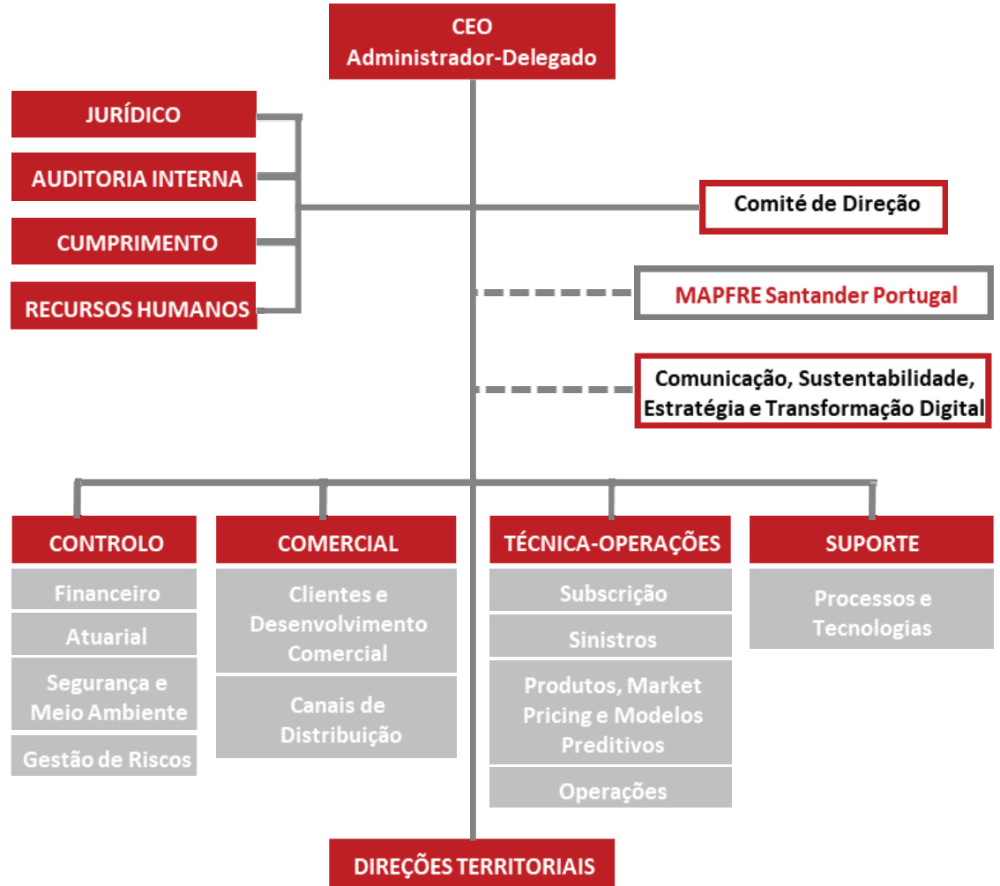  

B.1.3. Acordos relevantes da Assembleia Geral de Acionistas e do órgão de administração relacionadas com o sistema de governo  

Não houve alterações significativas no sistema de governo durante o ano de 2023.  

# B.1.4. Saldos e remunerações aos conselheiros e funcionários  

A remuneração dos membros do órgão da administração e funcionários da Entidade é determinado em conformidade com o estabelecido na normativa vigente e na política de remunerações da Entidade, aprovado em Conselho de Administração em 8 de junho de 2020, a partir da qual entrou em vigor e foi modificada pela última vez em 20 de junho de 2023.  

Esta política visa adequar a remuneração de acordo com a função, posto de trabalho e o respetivo desempenho, e atuar como elemento motivador e de satisfação que permita alcançar os objetivos marcados e cumprir com a estratégia da Entidade, promovendo ao mesmo tempo a gestão adequada e eficaz dos riscos, desencorajando a assunção de riscos que excedam os limites de tolerância da Entidade, assim como os conflitos de interesses. Os princípios gerais são os seguintes:  

Baseia-se na função/posto de trabalho e incorpora medidas para evitar os conflitos de interesse que possam surgir.   
Tem em conta o mérito, conhecimentos técnicos, competências profissionais e desempenho. Não discriminação por motivos de género, raça ou ideologia, remuneração igual para postos de igual valor.   
Transparência, a ser conhecida pelos seus destinatários.   
Flexibilidade na estrutura e adaptabilidade aos distintos grupos e circunstâncias do mercado. Proporção adequada dos componentes fixos e variáveis para evitar a dependência dos componentes variáveis.   
Alinhar-se à estratégia do Grupo e com seu perfil de risco, objetivos, práticas de gestão do risco e interesses. Em relação a isso, entre os riscos a serem considerados pela MAPFRE, serão incluídos os riscos de sustentabilidade (ambientais, sociais e de governança) a longo prazo.   
Competitividade, em relação ao mercado.  

A remuneração dos trabalhadores, conforme a dita política, é composta por cinco elementos:  

  

a) Retribuição fixa: em todos os casos é definida, de acordo com o posto de trabalho e perfil profissional, sendo paga mensalmente e conhecidas antecipadamente.   
b) Retribuição variável/incentivos: essa retribuição, cujo montante exato não se pode conhecer previamente, uma vez que o seu pagamento está condicionado à realização de determinadas atividades, com vista ao cumprimento dos objetivos da entidade. A proporção da retribuição variável é determinada pela posição que ocupa na companhia e pela avaliação, sendo maior nos níveis hierárquicos superiores.   
c) Programas de reconhecimento: destinados a reconhecer formalmente o contributo dos trabalhadores na implementação da estratégia, bem como compensar as contribuições de qualidade, a difusão da cultura, dos valores da MAPFRE, e ainda a inovação.   
d) Benefícios sociais: Produtos, serviços ou ajudas com os quais a entidade remunera os seus trabalhadores, decorrentes de um acordo coletivo do setor segurador (ACT ou CCT) ou de acordo individual com o empregado.   
e) Complementos: Ajuda económica concedida ao empregado em função do posto de trabalho que ocupa (por exemplo: utilização de veículo, habitação, etc.).  

O sistema de remuneração dos Administradores não executivos reúne as seguintes características:  

É transparente na informação das retribuições dos conselheiros.   
É incentivador retribuir a sua dedicação, qualificação e responsabilidade, sem que constitua um obstáculo para o seu dever de lealdade.   
Consiste numa atribuição fixa por pertencer ao Conselho de Administração e, se for o caso, à Comissão e Comités Delegados, podendo ser superiores para as pessoas que ocupem cargos no seio do próprio Conselho ou desempenhem a Presidência dos Comités Delegados. Ditas atribuições complementar-se-ão com outras compensações não monetárias (seguros de Vida ou doença, bonificações em produtos comercializados pelas empresas do Grupo MAPFRE, etc.) que estejam estabelecidas, com carácter geral, para o pessoal da Entidade.   
Não incorpora componentes variáveis ou vinculados ao valor da ação.   
Compensa-se aos conselheiros as despesas de viagem, deslocação e outros que realizem para assistir às reuniões da Entidade ou para o desempenho das suas funções.  

O sistema de remuneração dos conselheiros que desempenham funções executivas rege-se pelos seguintes critérios:  

As retribuições pelo desempenho de funções executivas estabelecem-se de conformidade com as funções, nível de responsabilidade e perfil profissional, conforme os critérios utilizados em relação com a equipa diretiva do Grupo MAPFRE.   
Ditas retribuições, apresentam uma relação equilibrada entre os componentes fixos e componentes variáveis, e  orientação para o desempenho a longo prazo.   
Os conselheiros executivos não podem receber a remuneração atribuída aos conselheiros. A retribuição dos conselheiros executivos configura-se com uma visão de médio e longo prazo, que impulsiona sua atuação em termos estratégicos, além da consecução de resultados em curto e a longo prazo.   
O sistema de remuneração é coerente com a estratégia, interesses e sustentabilidade de longo prazo da Entidade e do seu Grupo.   
Tem em consideração as tendências do mercado, e posiciona-se em frente ao mesmo, de acordo com a abordagem estratégica da Entidade, sendo efetivo para atrair e reter os melhores profissionais.  

Os Conselheiros Executivos, na qualidade de membros da equipa de gestão do Grupo, são beneficiários de (i) compromissos de pensões de contribuição definida para cobrir as contingências de reforma, invalidez permanente e morte, compromissos externalizados através de seguro de vida e (ii) a determinados benefícios sociais e prestações estabelecidas para a alta direção da Entidade. As condições de contribuição e consolidação dos direitos financeiros a seu favor, bem como os benefícios sociais e subsídios estão detalhadas nos seus respetivos contratos. Além disso, os Conselheiros executivos, assim como os demais funcionários da Entidade, são beneficiários do Plano de Previdência do Sistema de Emprego da MAPFRE, do seguro de poupança e do seguro de poupança mista e dos benefícios sociais e outros benefícios, cujas principais características estão incluídas no Acordo Coletivo.  

Informação adicional disponível no Relatório Conta 2023.  

Durante o ano de 2023, não ocorreu qualquer transação material com acionistas, pessoas com influência significativa e membros dos órgãos de administração e fiscalização.  

A politica retributiva está, portanto, orientada à geração de valor, procurando o alinhamento com os interesses dos acionistas, com uma gestão prudente do risco e com o estrito cumprimento da normativa vigente em matéria de remunerações de conselheiros.  

# B.1.5. Informação adicional  

Não há outra informação adicional relevante digna de menção no presente relatório.  

# B.2. Requisitos de aptidão e idoneidade  

A Entidade tem uma política de Aptidão e Integridade, aprovada e revista anualmente pelo Conselho de Administração em 8 de junho de 2020, a partir da qual entrou em vigor e foi modificada pela última vez em 20 de junho de 2023, que estabelece os requisitos de aptidão e integridade aplicáveis ao pessoal relevante de acordo com o seguinte detalhe:  

· Coletivamente: qualificações, experiência e conhecimentos especializados, pelo menos sobre Seguros e Mercados Financeiros, Estratégias e Modelos de Negócio, Sistema de Governo, Análise Financeira e Atuarial, e enquadramento regulamentar.   
Numa base individual: formação de um nível e perfil adequados, em particular na área dos seguros e serviços financeiros, e experiência prática de ocupações anteriores durante períodos de tempo suficientes.  

De igual modo, os membros do Conselho de Administração da Entidade têm:  

Ao nível coletivo: qualificações, experiência profissional e conhecimentos suficientes, pelo menos ao que diz respeito aos seguintes temas:  

a. Seguros e Mercados financeiros b. Estratégias e Modelos de Negócio c. Sistema de Governação d. Análise Financeira e Atuarial e. Normas regulamentares  

A nível individual: formação e perfil adequados, nomeadamente na área de seguros e serviços financeiros, e experiência profissional.  

Integridade pessoal, profissional e comercial:  

a) Trajetória pessoal de respeito às leis comerciais e demais legislações que regulamentam a atividade económica e a vida corporativa, bem como às boas práticas comerciais, financeiras e de seguros.   
b) Ausência de antecedentes criminais por crimes contra o património, branqueamento de capitais, contra a ordem socioeconómica e contra a Autoridade Tributária e a Segurança Social e de sanções por infração das normas reguladoras do exercício da atividade bancária, de seguros, do mercado de valores ou de proteção ao consumidor.   
c) Ausência de investigações relevantes e fundamentadas, tanto no âmbito penal como no administrativo, sobre algum dos fatos mencionados na seção b) supra.   
d) Não estar impedido de exercer cargos públicos ou de administração ou direção de entidades financeiras ou seguradoras.   
e) Não estar impedido conforme as normas de insolvência portuguesas vigentes ou equivalentes em outras jurisdições.  

Capacidade e compatibilidade  

a. Não estar envolvido em casos de incompatibilidade, incapacidade ou proibição previstos pela legislação vigente e pela norma interna.   
b. Não estar envolvido em uma situação insolúvel de conflito de interesses, conforme a legislação vigente e a norma interna.   
c. Não ter participações acionistas significativas ou prestar serviços profissionais a entidades concorrentes da entidade ou de qualquer entidade do Grupo, nem desempenhar funções como funcionário, diretor ou administrador dessas entidades, a menos que obtenha autorização expressa do próprio Conselho de Administração, no caso da MAPFRE S.A., e dos órgãos de governo competentes da entidade em questão, no caso de suas filiais.   
d. Não ter se envolvido em circunstâncias que resultem em sua nomeação ou participação no órgão de administração da entidade que possa colocar em risco os interesses da entidade.  

Além disso, os Recursos-chave e, se for o caso, os Recursos Externos, estão dotados de uma boa reputação, pessoal, profissional e comercial, comprovada com base em informações fidedignas sobre a sua conduta pessoal, sua conduta profissional e reputação, incluindo quaisquer questões criminais, financeiras e de supervisão que sejam relevantes para este fim.  

No caso das funções que estejam externalizadas, a Entidade adota todas as medidas necessárias para garantir que as pessoas responsáveis, que desempenhem estas funções, cumprem todos os requisitos de aptidão e idoneidade aplicáveis.  

# Processo de nomeação:  

Pessoas cuja nomeação é proposta para exercerem os cargos de Recursos-chave, assinam uma declaração prévia, onde se comprometem com a veracidade das informações acerca das suas circunstâncias pessoais, familiares, profissionais ou empresariais pertinentes. Esta declaração deve ser redigida em conformidade com um modelo estipulado pela MAPFRE.  

Durante o desempenho do cargo, as pessoas acima referidas, têm a obrigação de manter permanentemente atualizado o conteúdo da sua prévia declaração, devendo, por conseguinte, comunicar qualquer alteração relevante, bem como atualizá-lo periodicamente quando tal lhes for solicitado pelos órgãos competentes da Entidade.  

# B.3. Sistema de gestão de riscos, incluída a autoavaliação de riscos e de solvência  

# B.3.1 Quadro de governação  

O Sistema de Gestão de Riscos está integrado na estrutura organizacional da Entidade de acordo com o modelo de três linhas de defesa, conforme o descrito no Ponto B.4.1 do presente relatório por forma a que todo o pessoal da organização tem alocadas responsabilidades para o cumprimento dos objetivos de controlo.  

O Conselho de Administração da MAPFRE Seguros de Gerais é o último responsável por garantir a eficácia do sistema de Gestão de Riscos, estabelecendo o perfil de risco e limites de tolerância, assim como de aprovar as principais estratégias e políticas de gestão de riscos, no âmbito da de gestão de riscos estabelecida pelo Grupo.  

Neste contexto, a Entidade tem uma estrutura que compreende áreas que, no seu respetivo âmbito de competência, realizam de forma independente atividades de supervisão dos riscos assumidos.  

Para o desenvolvimento das suas funções em relação ao Sistema de Gestão de Riscos, o Conselho de Administração da MAPFRE Seguros de Gerais apoia-se no Comité de Direção e este por sua vez na Comissão de Gestão de Risco e Solvência.  

Complementarmente a esta estrutura individual da Entidade, a partir da Direção Corporativa de Riscos do Grupo, são tratados todos os aspetos significativos relacionados com a gestão de riscos correspondentes às diferentes entidades legais pertencentes ao Grupo, definindo diretrizes que são assumidas pelo Órgão de Administração da Entidade, com as adaptações que sejam necessárias.  

A Função de Gestão de Riscos da MAPFRE Seguros de Gerais encontra-se externalizada na MAPFRE Seguros de Vida, existindo um responsável da função na Entidade que zela pelo correto funcionamento da mesma (as condições segundo as quais a MAPFRE Seguros de Vida presta o referido serviço (externalização) encontram-se no ponto B.7). No desenvolvimento das suas funções, coordena o conjunto de estratégias, processos e procedimentos necessários para identificar, medir, monitorar, gerir e notificar continuamente os riscos presentes e emergentes a que a Entidade está ou podem esta exposto, assim como as suas interdependências.  

# B.3.2 Objetivos, política e processos de gestão de riscos  

O Sistema de Gestão de Riscos tem como principais objetivos:  

Promover uma cultura sólida e um sistema eficaz de gestão de riscos. Certificar-se que as análises dos potenciais riscos façam parte do processo de tomada de decisões da Entidade. Preservar a solvência e a solidez financeira da Entidade.  

O Sistema de Gestão de Riscos considera a gestão integrada de todos e de cada processo de negócio, e, na adequação do nível de risco aos objetivos estratégicos estabelecidos.  

Para garantir uma gestão eficaz dos riscos, a MAPFRE Seguros, desenvolveu um conjunto de políticas de Gestão de Riscos, alinhadas com os requisitos de Solvência II. Uma destas é a política de Gestão de Riscos, serve como guia para a gestão dos riscos e, por sua vez, para o desenvolvimento de políticas sobre riscos específicos:  

Estabelecem as orientações gerais, os princípios básicos e o quadro geral de ação para cada tipo de risco, assegurando uma aplicação coerente na Entidade.  

Atribuem as responsabilidades, estratégias, processos e procedimentos de informação necessários para a identificação, medição, vigilância, gestão e notificação dos riscos que recaem no seu âmbito. Estabelecem os deveres de comunicação de acordo com a área responsável do risco em questão.  

Na Política de Apetite ao Risco, aprovada pelo Conselho de Administração, a Entidade estabelece o nível de risco que está disposta a assumir para realizar seus objetivos de negócios sem desvios relevantes, mesmo em situações adversas. Para garantir o cumprimento destes limites, o capital é geralmente estabelecido numa base estimada com base nos orçamentos do ano seguinte e é revisto periodicamente ao longo do ano, em função da evolução dos riscos.  

Os Órgãos de Governo da MAPFRE Seguros Gerais, recebem informações sobre a quantificação dos principais riscos a que a Entidade está exposta e os recursos de capital disponíveis para lidar com esses riscos, assim como informações sobre o cumprimento dos limites estabelecidos no Apetite ao Risco.  

O Conselho de Administração decide as ações a adotar perante os riscos identificados e é informado de imediato sobre qualquer risco que:  

Devido à sua evolução, ultrapasse os limites de risco estabelecidos;   
Podem resultar em perdas iguais ou superiores aos limites de risco estabelecidos; Ou,   
Possam comprometer o cumprimento dos requisitos de solvência ou a continuidade do funcionamento da Entidade.  

As políticas de gestão de riscos específicas, após a sua aprovação pelo Conselho de Administração da MAPFRE Seguros, prevalecerão sobre esta política geral no que diz respeito ao seu âmbito.  

Com base na avaliação dos riscos, o detalhe dos processos de identificação, medição, gestão, acompanhamento e notificação por tipo de risco, apresenta-se na tabela abaixo:  

<html><body><table><tr><td>Tipo de Risco</td><td>Medicao e gestao</td><td>Acompanhamento e notificacao</td></tr><tr><td>Risco de Subscricao Inclui os riscos de: Prémios Reserva Despesas Descontinuidade Catastrofico Mitigacao do Resseguro</td><td>Formula-padrao</td><td>Trimestral</td></tr><tr><td>Risco deMercado Inclui os riscos de: Taxa de juro Acoes Imobiliario Spread Concentracao Moeda</td><td>Formula-padrao</td><td>Trimestral</td></tr></table></body></html>  

<html><body><table><tr><td>Tipo de Risco</td><td>Medicao e gestao</td><td>Acompanhamento e notificacao</td></tr><tr><td>Risco de Crédito Reflete as perdas possiveis devido ao incumprimento inesperado das contrapartes e dos devedores.</td><td>Formula-padrao</td><td>Trimestral</td></tr><tr><td>Risco Operacional Inclui os riscos de perdas resultantes da   inadequacao no falhas em processos s internos, pessoas ou sistemas, ou de eventos externos (nao inclui os riscos decorrentes de decisoes estratégicas ou riscos de reputacao). Risco de Liquidez</td><td>Formula-padrao Analise qualitativa dinamica dos riscos por processos (Riskm@p). Sistema de Registos e monitoramento de eventos de Risco Operacional.</td><td>Trimestral Anual Continuo</td></tr><tr><td>E o risco de a empresa nao deter ativos com liquidez suficiente, que permita realizar investimentos e outros ativos, para fazer face aosrequisitos necessarios ao cumprimento das suas obrigacoes financeiras a medida que elas se vencam.</td><td>Posicao de liquidez. Indicadores de liquidez</td><td>Continuo</td></tr><tr><td>Risco de Incumprimento E o risco de perdas resultantes de sancoes legais/regulatorias ou perdas de reputacao por incumprimento das leis e regulamentos, internos e/ou externos, e requisitos administrativos aplicaveis.</td><td>Monitorizacao e registo dos eventos significativos</td><td>Trimestral</td></tr><tr><td>Riscos Estratégicos e de Governo Corporativo Inclui os riscos de: Etica empresarial e de bom governo corporativo Estrutura organizada Aliancas, fusoes e aquisicoes Concorrencia no mercado</td><td>Aplicacao dos Principios Institucionais, Empresarias e Organizacionais  do Grupo MAPFRE</td><td>Continuo</td></tr></table></body></html>  

Cada um desses riscos conta com uma política escrita específica para a gestão e controlo de cada risco, que possui as seguintes características:  

Delimita de forma clara o seu âmbito de aplicação e é acompanhada por uma descrição precisa dos riscos aos quais se aplica.   
Atribui as responsabilidades, estratégias, processos e procedimentos de informação necessários para a identificação, medição, vigilância, gestão e notificação dos riscos que correspondem ao seu âmbito.   
Estabelece os deveres de comunicação face à área responsável pelo risco aos quais estão submetidas as diferentes Áreas e Departamentos da Unidade de Negócio.  

Quando é possível a realização de testes de stress para o risco em questão, é estabelecida a sua frequência e o seu conteúdo.  

Caso ocorra uma alteração do perfil de risco ou perante qualquer alteração significativa, todos os cálculos derivados da fórmula-padrão são atualizados, sendo nestes casos, informado o Conselho de Administração sobre os riscos aos quais a Entidade se encontra sujeita.  

# B.3.3 Avaliação interna dos riscos e da solvência  

A Avaliação Interna de Riscos e Solvência (doravante denominada ORSA), está integrada e faz parte do Sistema de Gestão de Riscos. A mesma tem processos para identificar, medir, monitorar, gerir e relatar os riscos, a curto e longo prazo, da Entidade durante o período previsto no plano estratégico, assim como medir a adequação de recursos de capital próprio, em conformidade com o entendimento das necessidades reais de solvência. Para o efeito, contempla todos os riscos significativos ou potenciais fontes de risco a que a Entidade está exposta e, facilita a implementação de iniciativas destinadas à sua gestão e mitigação.  

Adicionalmente, a Área de Risco coordena a elaboração do Relatório ORSA, prepara a proposta do relatório que será submetido para aprovação do Conselho de Administração, e canaliza as diferentes contribuições das Áreas ou Departamentos envolvidos no processo.  

O relatório ORSA é produzido uma vez por ano, a menos que ocorram certos eventos relevantes que exijam avaliações internas adicionais durante o ano (ORSA extraordinária), atualizando-se nesses casos as seções afetadas pelas alterações no perfil de risco, as quais mantêm o mesmo processo de aprovação.  

A avaliação interna de Riscos e Solvência é realizada em coordenação com o processo de planeamento estratégico, sendo parte integrante da estratégia de negócio e tida em conta nas decisões estratégicas por forma a garantir o vínculo entre a estratégia de negócio e as necessidades globais de solvência. Para o efeito, o ORSA considera que: i) sejam tidos em conta os resultados dos procedimentos de identificação dos riscos significativos e emergentes e de controlo dos riscos; e ii) sejam desenvolvidas projeções das necessidades globais de solvência e testes de stress que possam representar um risco para a realização dos objetivos estratégicos ou de solvência da entidade. A Direção Corporativa de Risco coordena os testes de esforço para verificar o nível de perdas dos riscos a que o Grupo pode estar exposto, sem prejuízo da Função de Risco da Entidade que executa os testes de esforço que considera apropriados para o seu negócio.  

A Área de Gestão de Riscos é responsável pela elaboração e submissão para aprovação pelo Conselho de Administração da Entidade do Plano de Gestão de Capital de Médio Prazo, dentro do qual são considerados os resultados das projeções do ORSA.  

A informação pormenorizada sobre a gestão de capitais está incluída no ponto E.1.1 do presente relatório.  

# B.4. Sistema de Controlo Interno  

# B.4.1. Controlo Interno  

Desde julho de 2008, a MAPFRE tem uma política escrita de Controlo Interno aprovada e revista anualmente pelo Conselho de Administração da MAPFRE S.A., a qual estabelece os princípios gerais para o desenvolvimento do quadro comum de ação em Controlo Interno.  

A implementação do Sistema de Controlo Interno na MAPFRE baseou-se na aplicação ampla e exaustiva da norma $\mathsf{C O S O}^{5}$ , segundo a qual existe uma relação direta entre os objetivos que a entidade pretende atingir, os componentes do sistema de controlo interno (que representam o que a organização necessita para atingir os objetivos), e a sua estrutura organizacional (unidades operacionais, entidades jurídicas, etc.).  

Pela sua essência, o Controlo Interno envolve todas as pessoas, independentemente do nível profissional que ocupam na organização, que em conjunto contribuem para proporcionar uma segurança razoável em alcançar os objetivos estabelecidos, principalmente no que diz respeito a:  

Objetivos operativos: Eficácia e eficiência das operações, diferenciando as operações próprias da atividade seguradora (principalmente subscrição, sinistros, resseguro e investimentos), das operações e as funções de suporte (recursos humanos, administração, comercial, legal, tecnologia, etc.).   
· Objetivo de informação: Confidencialidade da informação (financeira e não financeira, e tanto interna como externa), bem como a sua fiabilidade, oportunidade ou transparência, entre outros.   
· Objetivos de Compliance: Verificação do cumprimento das leis e normas aplicáveis.  

A integração do Sistema de Controlo Interno na estrutura organizativa realiza-se segundo o modelo das três linhas de defesa, alocando responsabilidades em relação ao cumprimento dos objetivos de controlo interno. De acordo com esse modelo:  

1. Uma “primeira linha de defesa”, constituída pelos empregados, a direção e as áreas operativas, de negócio e de suporte, que são responsáveis pela manutenção de um controlo efetivo das atividades que desenvolvem como parte inerente do seu trabalho de dia-a-dia. São, por isso, os que assumem os riscos e os responsáveis de desenhar e aplicar os mecanismos para garantir que os riscos não ultrapassem os limites estabelecidos.   
2. Uma “segunda linha de defesa”, composta pelas funções chave de Gestão de Risco, Atuarial e Compliance e outras funções que assegurem o funcionamento de controlo interno.   
3. Uma “terceira linha de defesa”, constituída pela Auditoria Interna, que realiza a avaliação independente sobre a adequação, e eficácia do sistema de controlo interno e que de forma oportuna, comunica eventuais deficiências às partes responsáveis para que apliquem medidas corretivas, incluindo a Direção e Órgãos de Governo conforme se aplique.  

O Sistema de Controlo Interno da Entidade está integrado e organizado em torno de cinco componentes: Ambiente de Controlo, Avaliação de Riscos, Atividades de Controlo, Informação e Comunicação, e Atividades de Supervisão e consiste em mecanismos e controlos que estão presentes em todas as atividades da organização, estando totalmente integrados na estrutura organizacional da Entidade.  

# B.4.2. Função de Compliance  

A Função de Compliance tem como objetivo que a Entidade opere dentro do quadro de cumprimento normativo, a fim de conseguir um ambiente global de cumprimento. Para tal, assume a responsabilidade de assessorar o órgão de administração sobre o cumprimento das disposições legais, regulamentares e administrativas que afetam a Entidade, assim como o cumprimento das normas internas. Também realiza a identificação e avaliação do impacto de qualquer modificação do ambiente legal nas operações da Entidade e a identificação e avaliação do risco de incumprimento.  

A estrutura organizativa da Função de Compliance é estruturada de acordo com os requisitos normativos específicos aplicáveis, assim como o princípio da proporcionalidade considerando o volume de negócios, a natureza e a complexidade dos riscos assumidos pela entidade, desenhando a sua própria estratégia para a implementação e desenvolvimento da Função, de acordo com os critérios de referência impostos pela Direção Corporativa de Compliance.  

Na Política da Função de Compliance da Entidade, aprovada pelo Conselho de Administração em 7 de março 2016 e na sua última atualização a 20 de junho de 2023, são apresentadas em detalhe a estrutura, as responsabilidades atribuídas, assim como procedimentos de informação estabelecidos. A gestão dos riscos legais e de não conformidade é levada a cabo conforme a metodologia comum definida pela Direção Corporativa de Compliance.  

# B.5. Função da Auditoria Interna  

Auditoria Interna constitui a “terceira linha de defesa” do modelo de Gestão de Riscos, devendo fornecer uma garantia independente sobre a eficácia do Sistema de Controlo Interno e de outros elementos do Sistema de Governação.  

Com este objetivo, a Área Corporativa da Auditoria Interna do Grupo MAPFRE depende funcionalmente do Conselho de Administração da MAPFRE S.A., através do Comité de Auditoria y Cumplimiento e, em particular, da sua Presidência. A Direção dos Serviços e Unidades de Auditoria depende (funcionalmente e hierarquicamente) do Diretor Geral de Auditoria Interna. Isso permite que a função de Auditoria Interna mantenha a sua independência e objetividade perante as atividades auditadas.  

A Política de Auditoria Interna, aprovada e atualizada pelo Conselho de Administração, estabelece a missão, funções e atribuições da Área de Auditoria Interna no Grupo MAPFRE, bem como os princípios em que se baseia a sua estrutura.  

Complementarmente, o Estatuto de Auditoria Interna do Grupo, estabelece o quadro das relações entre a Área de Auditoria Interna do Grupo MAPFRE e o Comité de Auditoria e Cumprimento, a Presidência, a Alta Direção e as Direções das Unidades de Negócio, as Áreas Regionais, as Áreas Corporativas, as funções de garantia e os auditores externos. Inclui também os direitos e obrigações dos auditores internos e o seu Código de Ética, que estabelece as regras de conduta dos auditores com base na integridade e idoneidade, objetividade, confidencialidade e aptidão.  

Um dos principais objetivos do Estatuto é também comunicar as principais atividades de auditoria interna, o tratamento dos relatórios de auditoria e as suas recomendações e qualquer outra circunstância geral relacionada com a atividade de auditoria interna, que deve ser realizada exclusivamente pelos Serviços e Unidades de Auditoria Interna do Grupo MAPFRE.  

A política de Auditoria Interna e o Estatuto são revistos anualmente. Todas as alterações a estas revisões são aprovadas pelo Comité de Auditoria y Cumplimiento da MAPFRE S.A. e pelo seu Conselho de Administração.  

# B.6. Função Atuarial  

A Área Atuarial é responsável pelos cálculos matemáticos, atuariais, estatísticos e financeiros que permitem determinar as tarifas e as provisões técnicas. Participa também na modelização do risco em que se baseia o cálculo dos requisitos de capital nas empresas seguradoras, em estreita colaboração com a Direção de Riscos. Adicionalmente a área Atuarial tem a cargo a função Atuarial.  

O responsável pela Área Atuarial da MAPFRE Seguros, nomeado pelo Conselho de Administração, é o máximo responsável pela função Atuarial dentro desta Unidade de Negócio, nomeadamente por, entre outras, todas as tarefas definidas no regulamento aplicável de Solvência II.  

A Função Atuarial realiza as seguintes atividades:  

Coordena o cálculo das provisões técnicas.   
Assegura a adequação das metodologias e modelos básicos utilizados, bem como as premissas utilizadas no cálculo das provisões técnicas.   
Avalia a suficiência e qualidade dos dados utilizados no cálculo das provisões técnicas.   
Compara as melhores estimativas com a experiência anterior.   
Informa o órgão de administração, direção ou a supervisão sobre a fiabilidade e a adequação do cálculo de provisões técnicas.   
Supervisiona o cálculo das aproximações utilizadas na avaliação de provisões técnicas, nos casos em que não há dados suficientes de qualidade adequada para aplicar um método atuarial confiável.   
Pronuncia-se sobre a política de subscrição e adequação de acordos de resseguro.   
Contribui para a efetiva implementação do Sistema de Gestão de Riscos, em especial no que diz respeito à modelagem de risco na qual se baseia o cálculo dos requisitos capital.  

A dependência do Responsável da Direção Atuarial de MAPFRE Seguros é dupla, por um lado, do seu superior hierárquico na entidade e, por outro lado, funcionalmente da Direção Corporativa Atuarial do Grupo.  

Em 31 de dezembro de 2023, o Responsável da Área Atuarial da MAPFRE Seguros dependia do Diretor de Controlo da MAPFRE Seguros.  

A Direção Corporativa Atuarial do Grupo MAPFRE é responsável pelo estabelecimento de princípios e diretrizes gerais de ação que levam em conta as melhores práticas estatísticas e atuariais no Grupo MAPFRE, com o objetivo de coordenar e homogeneizar as quantificações atuariais dentro do Grupo.  

Da mesma forma, a partir da Direção Corporativa Atuarial, é assegurado o cumprimento dos princípios gerais e diretrizes de desempenho em valorizações atuariais. Deste modo, poderá promover ações corretivas naqueles casos em que, ou se detetam irregularidades em certas quantificações, ou em que não se seguem as orientações gerais definidas pela mesma.  

Considerando o exposto, a Direção Atuarial Corporativa em colaboração com os responsáveis Atuariais Regionais dá suporte aos Departamentos Atuariais das Unidades de Negócio que requerem a sua colaboração para o cumprimento das responsabilidades que lhes correspondem individualmente.  

# B.7. Subcontratação  

A Entidade conta com uma Política de Subcontrataçãode funções e/ou atividades de seguros aprovada e atualizada pela última vez em 20 de junho de 2023, pelo seu órgão de administração, o que está de acordo com a Politica de Externalização aprovada pelo Conselho de Administração da MAPFRE S.A. Esta política estabelece os princípios gerais, tarefas, processos e atribuição de responsabilidades no caso de ser acordada a externalização de uma função e/ou atividade crítica ou importante.  

O Princípio básico que a Política de Externalização da Entidade institui é que a entidade continuará a ser plenamente responsável pelo cumprimento de todas as obrigações decorrentes das funções ou atividades que possam ser subcontratadas, da mesma maneira como se fossem realizadas internamente na Entidade.  

Conforme o estabelecido na citada Política de Externalização, o Conselho de Administração da Entidade concordou em subcontratar a Função de Gestão de Riscos à MAPFRE Seguros de Vida, procedendo, também ao processo de nomeação dos Responsáveis pelo seguimento desta atividade subcontratada.  

Da mesma forma, a Entidade concordou com a subcontratação da atividade de investimento de ativos e gestão de carteiras de investimento à MAPFRE ASSET MANAGEMENT, S.G.I.I.C. S.A, entidade localizada em Espanha e pertencente ao Grupo MAPFRE. Esta Entidade gere as carteiras de investimentos financeiros, com um nível de eficiência que permite gerir os riscos adequadamente, e quando necessário adaptar a gestão às especificidades do negócio.  

Em conformidade com citada Política de Externalização, o Responsável pelo seguimento das funções e/ou atividade subcontratada, informa anualmente ao Conselho sobre o desempenho e os resultados da prestação de serviços pelo fornecedor relativamente às obrigações confiadas, de acordo com a norma interno da empresa que regula a função fundamental e/ou atividade crítica ou importante subcontratada.  

A estrutura de governo existente, garante que a Entidade mantém um nível de controlo suficiente sobre as funções e/ou atividades críticas ou relevantes, que foram subcontratadas, nos termos estabelecidos na normativa de Solvência II.  

# B.8. Informações Adicionais  

Não existe outra informação significativa sobre o sistema de governo não incluída nos pontos anteriores.  

# C. Perfil de risco  

A Entidade calcula o Capital de Solvência Obrigatório (doravante RCS), em conformidade com os requisitos da Fórmula-padrão, calculo este que se explica no ponto E.2 do presente relatório. Este RCS total e para as principais categorias de risco são considerados uma boa medida de exposição ao risco já que reconhece o custo de capital correspondente aos grandes riscos (tais como os riscos de subscrição, de mercado, contraparte e operacional).  

Como se explica mais à frente, nos pontos C.4 e C.6, a exposição da Entidade em relação aos riscos não incluídos no cálculo do RCS da Fórmula-padrão (como por exemplo o risco de liquidez) não é considerado significativo, uma vez que a Entidade aplica medidas eficazes para a sua gestão e mitigação.  

<html><body><table><tr><td></td><td>Capital de Solvencia Obrigatorio Bruto 2023</td><td>Capital deSolvencia Obrigatorio Bruto 2022</td></tr><tr><td>Mercado</td><td>19.779</td><td>18867</td></tr><tr><td>Contraparte</td><td>14.199</td><td>8094</td></tr><tr><td>SubscricaoVida</td><td>0</td><td>0</td></tr><tr><td>SubscricaoSaude</td><td>8.270</td><td>7684</td></tr><tr><td>SubscricaoNaoVida</td><td>15.977</td><td>15 122</td></tr><tr><td>Diversificacao</td><td>-18.448</td><td>-15794</td></tr><tr><td>AtivosIntangiveis</td><td>0</td><td>0</td></tr><tr><td>Capital deSolvencia Obrigatorio</td><td>39.778</td><td>33974</td></tr></table></body></html>  

<html><body><table><tr><td></td><td></td><td></td></tr><tr><td>Operacional</td><td>3.908</td><td>3194</td></tr><tr><td></td><td></td><td></td></tr><tr><td>BSCR+ Operacional</td><td>43.686</td><td>37168</td></tr></table></body></html>

Unidade: milhares de Euros  

Os seguintes gráficos mostram a composição do RCS da entidade para os diferentes módulos de risco a 31 de dezembro de 2023 e 2022:  

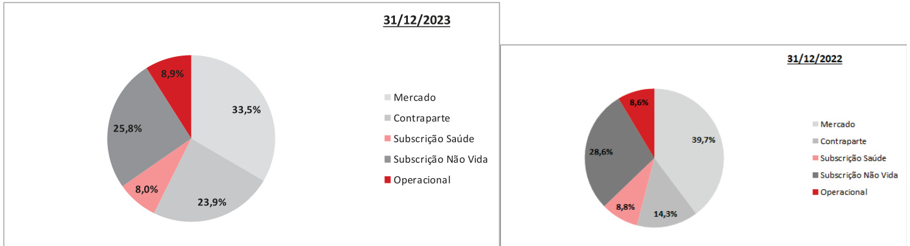  

Como pode observar-se em 2023, os principais riscos a que a Entidade está sujeita, são o Risco de Subscrição com um capital de 24.247 milhares de euros (22.806 em 2022), sendo 15.977 milhares de euros referente Risco específico dos seguros de não vida e 8.270 milhares de euros ao Risco específico dos seguros de acidentes e doença. A seguir a este risco, por ordem de importância, surge o Risco de Mercado, devido ao grande volume da carteira de ativos e passivos que a Entidade gere por 19.779 milhares de euros (18.867 em 2022) e por último do Risco de Crédito com um capital de 14.199 milhares de euros (8.094 em 2022) milhares de euros.  

Em 2023, não se produziram alterações significativas em relação às medidas utilizadas para avaliar os principais riscos dentro da Entidade.  

Por outro lado, a Entidade considera que também não se produziram alterações materiais nos riscos a que está exposta, sujeitas às condicionantes por um aumento global da inflação, cujo detalhe se inclui no ponto C.6.  

Seguidamente, descreve-se o grau de exposição risco a risco, bem como as técnicas de redução e mitigação que a Entidade aplica para a sua minimização.  

# C.1. Risco de Subscrição  

Risco de subscrição é o risco de perda ou de provocar alteração no valor das obrigações decorrentes da atividade seguradora, devido à inadequação dos pressupostos de tarifas e constituição de provisões.  

# Exposição  

O Risco de Subscrição, a 31 de dezembro de 2023, supõe $33,7\%$ $(37,4\%$ em 2022) da soma dos módulos de risco incluídos no RCS, cujo detalhe por módulos e as alterações em relação ao ano anterior são apresentadas nos gráficos seguintes:  

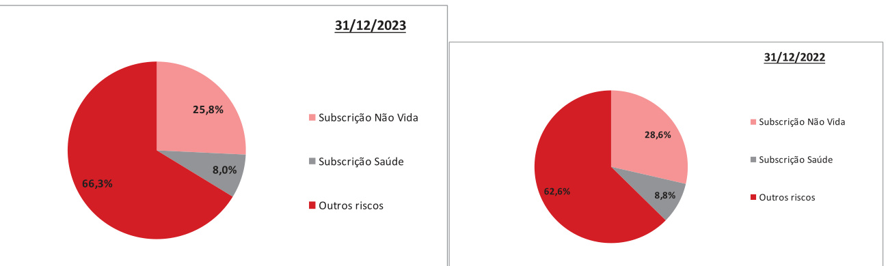  

Seguidamente apresenta-se os resultados do RCS para as principais subcategorias do risco. Note-se que a exposição às diferentes subcategorias de risco não inclui a diversificação obtida a nível de categoria de riscos, nem na determinação do RCS total.  

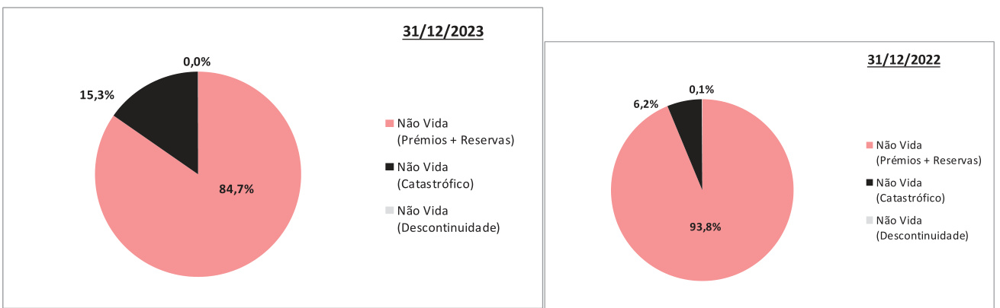  

A principal exposição corresponde ao risco de prémios e reservas que representa $84,7\%$ $[93,8\%$ em 2022) do RCS do Risco de Subscrição e $37,1\%$ do RCS total (diversificado).  

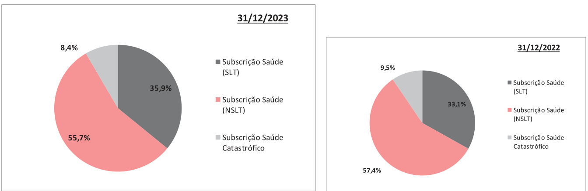  
C.1.2 Sub-risco de Subscrição de Saúde  

A maior exposição é o risco de Subscrição de Saúde-NSLT que supõe $55,7\%$ do RCS do Risco de Subscrição, seguido pelo risco Subscrição de Saúde-SLT.  

# Técnicas de gestão e mitigação  

A Entidade minimiza o risco de subscrição, através de uma série de medidas:  

· Estabelece diretrizes, limites e exclusões na subscrição de riscos: A Entidade estipula uma série de diretrizes, limites de autorização e exclusões nos seus manuais ou políticas para reduzir o risco de Subscrição indesejada e a exposição máxima aceitável para concentrações especificas. Garantir um prémio suficiente: A adequação dos prémios é um elemento relevante e a sua determinação é suportada por aplicações de software específico de cálculos atuariais. Dotação adequada de provisões técnicas: A adequada gestão das prestações, assim como a suficiência das provisões técnicas, são os princípios básicos da gestão seguradora. As provisões são calculadas pela área operativa Atuarial da Entidade e o seu valor é validada pela Função Atuarial e certificado pelo atuário externo responsável, o qual não participou nos cálculos. Utilização de resseguro: A Entidade, através do seu Departamento de Resseguro, é responsável por identificar adequadamente o nível de transferência do risco apropriado em relação aos seus limites de risco previamente definidos e desenhar que tipos de acordos de resseguro são os mais adequados tendo em conta o seu perfil e apetite de risco, contando para tal com a assessoria técnica proporcionada pela MAPFRE RE. A Entidade, após determinadas as suas necessidades de resseguro e comunica-as à MAPFRE RE, para estabelecer de forma conjunta a estrutura condições ótimas dos contratos de cessão.  

Deve-se contratar a cobertura de resseguro específica para mitigar o risco catastrófico para o qual a Entidade está exposta. As Entidades devem basear-se em relatórios especializados sobre a exposição catastrófica, geralmente executados por peritos independentes, que estimam a extensão das perdas em caso de ocorrência de um evento catastrófico. A subscrição dos riscos catastróficos é realizada com base nesta informação, o capital económico disponível para a empresa que subscreve e da capacidade de resseguro que decide contratar para a sua mitigação.  

Com periodicidade anual, a Área Atuarial da Entidade analisa os contratos de resseguro em vigor e pronuncia-se sobre a adequação da cobertura contratada.  

# Concentração  

A Entidade aplica limites que lhe permitem controlar o nível de concentração do risco de subscrição e utiliza contratos de resseguro para reduzir o risco de subscrição, derivado de concentrações ou acumulações de garantias superiores aos níveis máximos aceitáveis.  

As maiores exposições ao risco de subscrição provêm de catástrofes naturais ou causados pelo homem. Para mitigar o risco catastrófico, contratam-se coberturas específicas de resseguro, dispondo de relatórios especializados de exposição catastrófica, geralmente realizados por peritos independentes, que estimam a extensão das perdas em caso de ocorrência de um evento catastrófico. A subscrição de riscos catastróficos é realizada com base nesta informação, do capital económico disponível para a empresa que as subscreve e à capacidade de resseguro que é determinada a contratar para a sua mitigação.  

# C.2. Risco de Mercado  

O Risco de Mercado é o risco de perda ou de alteração adversa da situação financeira resultante, de forma direta ou indiretamente, decorrente de flutuações no nível e na volatilidade dos preços de mercado dos ativos, passivos e instrumentos financeiros.  

# Exposição  

A estratégia de investimento da Entidade segue uma política de investimento prudente, caracterizada por uma carteira de títulos de rendimento fixo em maior proporção, tendo estas um elevado rating de crédito.  

A seguir é apresentada uma análise detalhada dos investimentos da Entidade por categorias de ativos após a aplicação da abordagem de transparência6 aos organismos de investimento coletivo e outras formas de investimento em fundos:  

<html><body><table><tr><td>Investimentos</td><td>Investimentosa 31/12/2023</td><td>% Investimentos</td><td>Investimentosa 31/12/2022</td><td>% Investimentos</td></tr><tr><td>Investimentosimobiliarios</td><td>10454</td><td>6,31%</td><td>10996</td><td>6,90%</td></tr><tr><td>Investimentosfinanceiros</td><td>155 124</td><td>93,69%</td><td>149265</td><td>93,10%</td></tr><tr><td>TitulosdeRendimentoFixo</td><td>76827</td><td>46,40%</td><td>84089</td><td>52,50%</td></tr><tr><td>TitulosdeRendimentoVariavel</td><td>2 749</td><td>1,66%</td><td>2931</td><td>1,80%</td></tr><tr><td>Outros</td><td>69302</td><td>41,85%</td><td>50657</td><td>31,60%</td></tr><tr><td>OrganismosdeInvestimentoColetivo</td><td>6 245</td><td>3,77%</td><td>11 587</td><td>7,20%</td></tr><tr><td>Depositosconstituidosporresseguro aceites</td><td>0</td><td>0,00%</td><td>0</td><td>0,00%</td></tr><tr><td>Derivadosdecobertura</td><td>0</td><td>0,00%</td><td>0</td><td>0,00%</td></tr><tr><td>Outrosinvestimentos</td><td>0</td><td>0,00%</td><td>0</td><td>0,00%</td></tr><tr><td>Total</td><td>165578</td><td>100,00%</td><td>160260</td><td>100,00%</td></tr></table></body></html>

Unidade: milhares de Euros  

A 31 de dezembro de 2023, a percentagem de investimentos em rendimento fixo $\acute{\in}$ de $52,5\%$ $(52,5\%$ em 2022) dos quais 88, $85\%$ $(81,9\%$ em 2022) corresponde à Dívida Soberana e o restante a títulos de Dívida Corporate, com qualificação adequada (essencialmente superior ao nível 3 - adquado).  

Em baixo, apresenta-se a tabela com os resultados do RCS para as principais subcategorias deste risco. Este risco de Mercado inclui o Risco de Contraparte dos investimentos, que, na fórmula-padrão, é valorado dentro das subcategorias de risco de “spread” (diferencial) e risco de concentração. Deve ser considerado que a exposição a diferentes subcategorias de risco não inclui a diversificação que se obtém a nível das categorias de riscos, nem na determinação do RCS total.  

O risco de mercado em 31 de dezembro de 2023 representa $33,5\%$ ( $39,7\%$ em 2022) da soma dos módulos de risco incluídos no RCS, e os gráficos seguintes mostram a sua variação em relação ao ano anterior:  

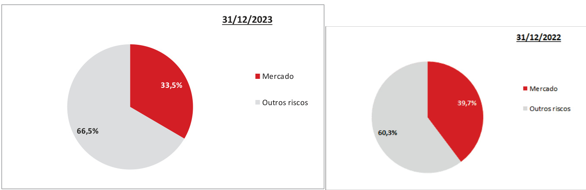  

# Técnicas de gestão e mitigação  

A Entidade mitiga a sua exposição aos riscos de mercado através de: (i) uma gestão de investimentos prudente, caracterizada por uma grande proporção de títulos de rendimento fixo de elevada qualidade creditícia; (ii) e pelo estabelecimento de limites, tanto genéricos, como específicos, em caso de exposição. Estes limites estão estabelecidos no Plano de Investimentos, aprovado pelo Conselho de Administração, o qual é revisto, no mínimo, anualmente.  

Na gestão das carteiras de investimento realiza-se uma gestão ativa e apenas condicionada pelas normas legais e pelas limitações internas do risco em que um certo grau de risco de mercado é assumido, conforme ao estabelecido em baixo:  

A duração modificada é uma variável de gestão de risco da taxa de juros. A duração modificada, a qual depende dos limites estabelecidos no Plano de Investimento pelo Conselho da Administração para as sociedades de autogestão, assim como na duração modificada dos passivos no caso em que existem contratos de longo prazo para com os segurados. O risco de diferencial e de concentração é mitigado pela elevada proporção de títulos de rendimento fixo com rating de crédito classificadas como grau de investimento e através da diversificação por emitentes. Os investimentos em ações estão sujeitos a um limite máximo da carteira de investimentos e aos limites por emissor. No caso do Risco Imobiliário, $96,28\%$ da carteira de imóveis pelo valor de mercado é destinado a escritórios próprios. O património imobiliário tem a dupla função de apoio administrativo e vendas, bem como gerador de receitas de investimento e diversificação de investimento. As limitações de risco são determinadas em termos quantitativos medidos com base em variáveis facilmente observáveis. No entanto, realiza-se também uma análise de risco em termos probabilísticos em função das volatilidades e correlações em termos históricos.  

# Concentração  

A maior concentração de investimentos é na Dívida Pública Europeia.  

# C.3. Risco de Contraparte  

O Risco de Contraparte é o risco de perda ou de modificação adversos da situação financeira, resultante de flutuações de solvência dos emissores de valores, as contrapartes e devedores eventuais, a que estão expostas as seguradoras e resseguradoras, como o risco de incumprimento das contrapartes, risco de diferencial ou concentração de risco de mercado.  

O Risco de Contraparte incluído no cálculo do RCS da fórmula-padrão recolhe:  

· Como Risco de spread e concentração, inserido no Ponto C.4, Risco de Mercado.   
· Como Risco de incumprimento de contraparte. Neste módulo existem dois tipos de exposições: o Exposições do tipo 1: onde as entidades geralmente contam com classificação creditícia e inclui contratos de resseguro e de efetivo em bancos. o Exposições de tipo 2: inclui as contas a receber de intermediários e os débitos dos tomadores de seguros, entre outros.  

# Exposição  

O risco de Incumprimento da Contraparte a 31 de dezembro de 2023 atinge $23,9\%$ da soma dos módulos de risco incluídos no RCS, apresentando-se nos gráficos seguintes as alterações referentes ao ano anterior:  

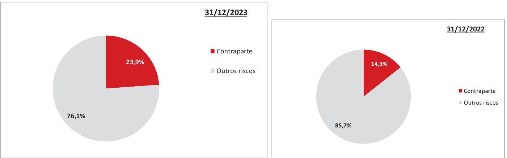  

Por outro lado, a evolução da composição de cada um dos tipos de exposição é representada nos gráficos seguintes:  

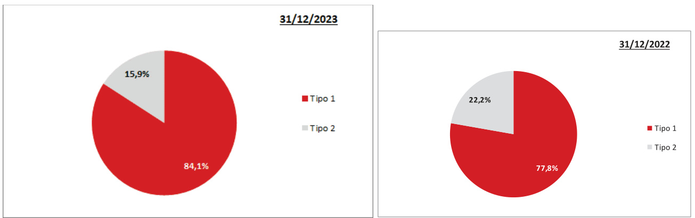  

A alteração desta configuração prende-se com o volume dos depósitos bancários cujo saldo se situa em 11.134 milhares de euros em 2023 face a 10.703 milhares de euros em 2022, bem como maior incidência de resseguradoras no tipo 2.  

A somar ao descrito, existe um maior volume de exposição, em função do aumento de riscos, o que em si mesmo provoca um aumento neste risco.  

# Técnicas de gestão e mitigação  

A Política de Gestão de Risco de Crédito estabelece os limites de acordo com o perfil de risco da contraparte ou do instrumento de investimento, bem como os limites de exposição em relação ao rating da contraparte assim como um sistema de monitorização e comunicação da exposição a este risco.  

Quanto ao Risco de Contraparte em relação a investimentos, a Política da Entidade baseia-se em aplicar critérios de prudência com base na solvência do emissor. Os investimentos em rendimento fixo estão sujeitos a limites por emissor e, procura-se um grau elevado de correspondência geográfica entre os emitentes dos ativos e os compromissos.  

No caso das contrapartes resseguradoras, a estratégia da Entidade é a de ceder negócio a resseguradores com capacidade financeira comprovada. Geralmente, é ressegurado em entidades com um rating de solvência financeira, não inferior a “Alto” (nível de qualidade creditícia 2). A monotorização destas exposições é realizada pelo Comité de Security do Grupo.  

Os princípios básicos, de cumprimento obrigatório, que inspiram a gestão do uso de resseguro e outras técnicas de mitigação de riscos são:  

Otimização do consumo de capital.   
Otimização das condições.   
Solvência das contrapartes.   
Transferência eficaz do risco.   
Adequação do nível de transferência do risco.  

# Concentração  

As maiores exposições ao risco de incumprimento da contraparte encontram-se em entidades financeiras e de resseguro, estabelecendo-se limites relacionados com a qualidade creditícia das contrapartes e realiza-se uma monotorização sobre sua evolução.  

Em relação ao o resseguro a maior concentração encontra-se na sua totalidade em resseguradores do Grupo que por sua vez, possuem um amplo quadro diversificado de resseguradores.  

# C.4. Risco de Liquidez  

Risco de Liquidez é o risco das entidades de seguros e resseguros não terem capacidade para realizar investimentos e outros ativos a fim de cumprir as suas obrigações financeiras na data de vencimento.  

# Exposição  

O risco de liquidez não se inclui no cálculo do RCS da fórmula-padrão. A exposição ao risco de liquidez considera-se baixa, tendo em conta a estratégia de investimento prudente conforme o estipulado na Política de Investimento, que se caracteriza por uma elevada proporção de valores de rendimento fixo de elevada qualidade creditícia cotizados em mercados líquidos.  

# Técnicas de gestão e mitigação  

A Entidade dispõe de uma Política de Gestão de Risco de Liquidez e uma Política de Gestão de Ativos e Passivos que representam o quadro de ação neste âmbito.  A Política de Gestão de Risco de Liquidez estabelece que se deve dispor, a qualquer momento, um volume de ativos líquidos de grande qualidade, linhas de crédito disponíveis e entradas previstas de caixa suficientes para cobrir as saídas de efetivo esperadas para cada um dos seguintes 30 dias.  

O desempenho geral baseia-se na manutenção de saldos de tesouraria suficientes para cobrir com folga os compromissos decorrentes das suas obrigações com os segurados e os credores. Assim, de acordo com as contas anuais, a 31 de dezembro de 2023, o saldo de caixa e outros ativos líquidos equivalentes totalizaram 11.134 milhares de euros (10.703 no ano anterior), o equivalente a $7,34\%$ do total de investimentos financeiros e de tesouraria.  

Além disso, a maioria dos investimentos em renda fixa têm um rating de crédito elevado e são negociáveis em mercados organizados, o que dá uma grande capacidade de ação antes de potenciais tensões de liquidez. A Entidade está confiante de que sua posição de liquidez permitirá que ela resista às pressões de liquidez que podem ocorrer nos próximos meses.  

Por último, o risco de liquidez associado a eventos extremos é minimizado pela utilização do resseguro como técnica para reduzir as concentrações de risco de subscrição e à seleção de resseguradores de elevada qualidade creditícia.  

# Concentração  

Não se identificaram concentrações de risco em relação ao risco de liquidez.  

# Benefícios esperados incluídos nos prémios futuros  

No cálculo da melhor estimativa das provisões técnicas foram tidos em conta os resultados esperados incluídos nos prémios futuros (no caso de ser positivo, como o menor valor da melhor estimativa, ou, o de maior valor em caso de perdas esperadas). A 31 de dezembro de 2023, o montante destes resultados esperados foi de 2.646 milhares de euros (líquidas de resseguro).  

# C.5. Risco Operacional  

O Risco Operacional é o risco de perda consequente de processos internos inadequados ou deficientes, dos funcionários ou sistemas, ou de eventos externos.  

# Exposição  

O risco operacional, a 31 de dezembro de 2023, representa $8,9\%$ $^{8,6\%}$ em 2022) da soma dos módulos de risco incluídos no RCS, apresentando-se, nos gráficos seguintes as alterações com respeito ao exercício anterior:  

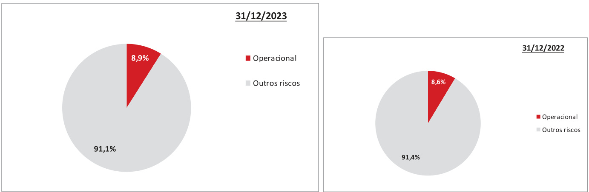  

# Técnicas de gestão e mitigação  

O modelo de gestão de risco operacional estabelecido é baseado numa análise qualitativa e dinâmica dos processos, para que os gestores de cada área ou departamento identifiquem e avaliem os potenciais riscos que afetam tanto os processos de negócio como os de suporte ao negócio.  

Esta análise considera a autoavaliação de riscos, a documentação de manuais de controlos internos nos quais se identificam os controlos associados a riscos, a avaliação da efetividade dos mesmos e a gestão das medidas corretivas estabelecidas para mitigar ou reduzir os riscos e/ou melhorar o ambiente de controlo.  

Além disso, a Entidade implementou o procedimento de comunicação e registo de eventos de perda operacional para a categorização e monotorização, através do qual os colaboradores da primeira linha de defesa informam a Área de Gestão de Riscos dos eventos ou incidentes de risco operacional ocorridos na Entidade. A Área de Gestão de Riscos das Entidades mantêm um registo dos eventos ocorridos, coordenam com as áreas responsáveis os planos de ação necessários para a sua gestão e reportam trimestralmente à Direção de Risco Corporativo. A Direção de Risco Corporativo reporta trimestralmente ao Comité de Risco e Sustentabilidade, assegurando que a informação relevante sobre os riscos operacionais é comunicada aos órgãos sociais do Grupo.  

A Entidade conta com sistemas para a monitorização e controlo do risco operacional, no entanto a possibilidade de sofrer perdas operacionais não pode ser excluída dada a dificuldade de previsão e quantificação deste tipo de riscos.  

# Concentração  

Não foram identificadas concentrações de risco em relação ao risco operacional, com exceção dos sistemas informáticos que a Entidade utiliza para a gestão e subscrição das suas apólices de seguro.  

A indisponibilidade prolongada destes sistemas poderia ter um impacto negativo nas operações, mas esta possibilidade é considerada remota, uma vez que existem mecanismos comprovados de continuidade de negócios em vigor para a mitigar.  

# C.6. Outros riscos relevantes  

Para além do tratamento quantitativo dos riscos de Solvência II, e no âmbito do processo anual de identificação de riscos, no início de cada ano a Área de Gestão de Riscos promove entre as principais áreas ou departamentos a identificação de riscos relevantes que possam afetar o progresso da Entidade ao longo do período contemplado no seu plano de negócios,  bem como os riscos emergentes que tanto o setor de seguros quanto a MAPFRE podem enfrentar a longo prazo (5-10 anos).  

# C.6.1. Riscos Materiais  

Relativamente aos principais riscos que foram identificados no início de 2024 como riscos que a Entidade enfrenta no período contemplado no seu plano de negócios e que podem afetar significativamente os resultados do negócio, destacam-se os seguintes:  

# Inflação  

O atual período de inflação elevada iniciou-se na primavera de 2021, em consequência das tensões do lado da oferta decorrentes do conflito na Ucrânia (com especial destaque para o impacto direto através da componente energética e da falta de componentes que alimentam o problema da produção), atingindo níveis de inflação nunca vistos nos últimos 30 anos. A repercussão dos custos de produção nos preços e salários produz efeitos de segunda ordem, levando a um prolongamento do período inflacionista, cuja intensidade e duração são ainda incertas.  

Com o objetivo de reverter essa situação, o Banco adota uma seleção criteriosa e uma tarifação prudente dos riscos, juntamente com uma política de investimentos que inclui uma parcela de rendimentos fixos com retornos ligados à inflação local ou à taxa de juros oficial dos bancos centrais. Isso garante recursos suficientes para atender aos segurados, mesmo em cenários de inflação inesperada.  

Do ponto de vista do sector dos seguros, o risco de inflação advém de níveis de inflação imprevistos que se repercutem num aumento das despesas de gestão necessárias e num aumento das despesas com sinistros para os produtos não vida, fazendo com que os prémios cobrados sejam insuficientes para cobrir os sinistros e as despesas conexas. Em algumas linhas de negócio e mercados, o processo de ajustamento dos prémios é mais lento, exigindo algum tempo para recuperar a rentabilidade técnica dos produtos.  

Além disso, um aumento da inflação significa uma perda de poder de compra das famílias, pelo que o seu impacto pode afetar a subscrição de novos produtos, tanto do ramo vida como do ramo não vida.  

Com o objetivo de reverter essa situação, o Banco adota uma seleção criteriosa e uma tarifação prudente dos riscos, juntamente com uma política de investimentos que inclui uma parcela de rendimentos fixos com retornos ligados à inflação local ou à taxa de juros oficial dos bancos centrais. Isso garante recursos suficientes para atender aos segurados, mesmo em cenários de inflação inesperada.  

# Rutura de Alianças e Acordos de Distribuição  

Ao longo dos últimos anos foram desenvolvidas parcerias de distribuição que foram ganhando um peso muito significativo no total das vendas anuais da Entidade:  

Risco de redução dessas mesmas parcerias em volume.  

O elevado volume que esta concentração deverá ser objeto de um especial seguimento. Assim sendo, propuseram-se uma série de medidas de gestão para a elevada concentração detetada:  

Plano crescimento em todos os canais e possíveis aquisições e novas parcerias.  

Estas concentrações deverão ser objeto de um maior acompanhamento. Assim sendo, propuseramse uma série de medidas de gestão para a elevada concentração detetada:  

A companhia introduziu iniciativas no seu plano estratégico, destacando-se o aumento da rede própria e específica Criação de uma estrutura dedicada ao negócio de empresas, conforme o estabelecido no já citado Plano de Desenvolvimento de Negócio   
Plano de Crescimento  

# Mudanças na tendência do envelhecimento populacional  

Com a tendência de envelhecimento populacional, leva ao aumento da esperança de vida e à necessidade de uma nova abordagem económica, conhecida como Economia do Envelhecimento. Isso é acompanhado pelo déficit do sistema de previdência pública, pela falta de poupança, ao aumento da procura por serviços sociais de saúde, dependência e pensões, assim como à reforma s. Diante desse cenário, a reforma da geração Baby Boom torna-se cada vez mais urgente.  

A sustentabilidade social pode desempenhar um papel fundamental na redução das lacunas de seguro entre os grupos mais vulneráveis. Um exemplo disso são os idosos, que enfrentam uma diminuição significativa na cobertura de seguro saúde devido ao aumento dos prémios e à redução da renda após a reforma. Para lidar com essa questão, a MAPFRE S,A. está a explorar várias opções, como a implementação de prémio nivelados que criem reservas para a velhice e evitem aumentos de preço devido à idade.  

# Risco de cibersegurança  

O volume e a sofisticação da atividade cibernética maliciosa aumentaram substancialmente, representando um grande desafio à manutenção dos níveis de segurança dos dados e sistemas críticos da Entidade. A computação em nuvem traz consigo riscos elevados devido à concentração e acumulação de informações. De um ponto de vista operacional, existem riscos de ciberataques que podem resultar na perda prolongada da disponibilidade de serviços prestados a terceiros, bem como em fraudes maciças de clientes utilizando informações sensíveis de clientes que podem ter sido previamente comprometidas.  

Além disso, a alteração dos hábitos dos clientes, a digitalização e os modelos de autosserviço aumentaram a procura de sistemas de identificação e autenticação, a utilização de identificadores biométricos e a utilização múltipla de identificadores que, por sua vez, aumentam o risco de fraude de phishing ou mesmo de roubo de dados. Ao mesmo tempo, existe uma ameaça crescente de ciberataques organizados de países ou nações, especialmente no atual ambiente geopolítico turbulento, onde hackers atacam infraestruturas críticas, roubam dados valiosos ou informações confidenciais de empresas.  

Os riscos de cibersegurança ou riscos cibernéticos são são aqueles relacionados com a atividade empresarial, incluindo a gestão e o controlo de dados, num ambiente digital ou "cibernético". São riscos decorrentes da utilização, tratamento e transmissão de dados eletrónicos através de sistemas de informação, redes de comunicações e da própria Internet, de potenciais danos causados por ataques, bem como de fraudes cometidas pela utilização inadequada ou indevida de dados. A crescente adoção de métodos de trabalho híbridos (presencial e remoto) alarga os meios de acesso aos recursos informáticos da Entidade, o que torna necessário dispor de medidas técnicas e organizativas específicas para permitir o acesso de forma segura e garantir também a proteção nas interações com os tomadores de seguros.  

Diante do aumento dos ataques cibernéticos e a crescente procura de proteção e cibersegurança por parte dos clientes tem-se refletido no desenvolvimento de produtos e serviços, adaptando os produtos comercializados à cobertura de perdas causadas por cibercrime e ameaças digitais, bem como à prestação de apoio e aconselhamento aos clientes na gestão dos riscos cibernéticos.  

O Grupo MAPFRE, por meio da Diretoria Corporativa de Segurança, possui recursos avançados destinadas a protegê-lo contra CyberRisks e a aumentar a resiliência digital da empresa. Para isso, conta com um Centro de Controlo Geral (CCG-CERT), integrado na rede FIRST e no grupo CSIRT.es, que funciona como um Centro Global de Operações de Segurança (SOC) e permite a monitorização contínua (24 horas, 7 dias) tanto da situação de segurança da plataforma tecnológica da MAPFRE como da sua informação proprietária acessível em sistemas de terceiros, possibilitando a deteção precoce de possíveis Incidentes Cibernéticos e uma resposta rápida aos mesmos. O CCG-CERT está certificado nas normas ISO 9001, ISO 27001 e ISO 22301.  

A MAPFRE S.A. conta com uma Apólice de Seguro de Cibersegurança que cobre diversos Riscos de Cibersegurança para todas as Entidades do Grupo.  

# Ambiente macroeconómico  

O atual período de inflação elevada obrigou os bancos centrais aumentarem drasticamente as taxas de juro para níveis que não se registavam há 15 anos ou mais. O nível máximo das taxas de juro dependerá da medida em que este aumento for suficiente para aliviar as pressões inflacionistas. Estes aumentos das taxas de juro estão a afetar os rendimentos dos investimentos, não só nas carteiras de rendimento fixo, mas também a aumentar a volatilidade nos mercados de ações e imobiliário. Por sua vez, a subida das taxas de juro está a aumentar os custos de financiamento das empresas e das famílias, afetando negativamente as perspetivas económicas.  

Essa situação pode ter impacto também nas companhias de seguros, que podem ser afetadas tanto pela desvalorização de suas carteiras de investimento por uma menor valorização das carteiras de investimento detidas, como pelo poder de compra das empresas e das famílias para contratarem produtos de seguros.  

Para lidar com essa realidade,o Banco aplica uma seleção de riscos e uma tarifação prudentes, assim como uma política de investimentos que prioriza rendimentos fixos com rendimentos ligados à inflação local ou à taxa de rendimento oficial dos bancos centrais, que garante recursos suficientes para servir os tomadores de seguros, mesmo em situações inflacionistas imprevistas.  

# C.6.2. Riscos  Emergentes  

Os riscos emergentes constituem riscos esperados ou potenciais, ou alterações no perfil de risco atual devido a eventos futuros cujos impactos são desconhecidos ou sujeitos a grande incerteza. Embora tanto a posição de solvência como os Sistemas de Controlo Interno e Gestão de Riscos da Entidade sejam sólidos, tendo em conta que o panorama de risco está em constante evolução, é importante i) identificar os fatores que tanto a indústria seguradora como a Entidade podem enfrentar a mais longo prazo (5-10 anos); ii) conhecer o nível de preparação disponível; e (iii) ser capaz de se adaptar aos objetivos e ao sucesso nos resultados do negócio.  

Os principais riscos emergentes são detalhados abaixo, com uma descrição de seus possíveis impactos nos negócios da Entidade e as medidas que estão a ser tomadas para responder a esses riscos:  

# Risco de Alterações Climáticas  

O risco de mudança climática é o risco decorrente da mudança de longo prazo nos padrões climáticos médios que moldaram os climas locais, regionais e globais da Terra. Este risco manifestar-se-ia principalmente em fenómenos meteorológicos extremos (ciclones tropicais, inundações, incêndios florestais, etc.), na incerteza económica devido a várias alterações (regulamentares, tecnológicas, sociais, etc.), na transição para uma economia hipocarbónica e em reclamações de responsabilidade ambiental quando os riscos climáticos não são prevenidos, mitigados ou divulgados.  

Nesta linha, as ações realizadas em 2023 centraram-se, fundamentalmente, em aumentar a nossa compreensão do maior perigo catastrófico derivado das alterações climáticas e melhorar a gestão das exposições através de:  

- A incorporação do clima na tomada de decisão da estratégia comercial.   
- Conhecimento detalhado dos riscos segurados (como sua geolocalização e a característica de seus ativos), a fim de fazer uma cobertura correta e seleção de proteção catastrófica.   
- Gestão e controle adequados de clusters para otimizar o uso do capital.   
- Máxima colaboração e transparência entre o segurado e a seguradora para facilitar a melhor avaliação de risco e tarifação.  

# Produtos e Serviços  

Em função da constante volatilidade da sociedade e da sua velocidade na transformação, existe o risco da oferta  não estar em consonância com a procura dos serviços ou bens oferecidos, o que provocará uma queda nos resultados com as consequências inerentes a tal facto.  

Assim, é visto como factir decisivo o “atender” ás necessidades do cliente, ajustando constantemente a oderta de bens e serviços ás necessidades de procura.  

# Instabilidade de Recursos  

Nos últimos anos temos assistido a um sem número de conflitos cuja origem tem muito por base, ainda que possa não ser o único motivo, o controlo dos recursos naturais.  

Com efeito, tem-se assistido a uma agregação cada vez maior pela detenção dos recursos naturais, sendo que tal concentração pode levar ao controlo de preços e consequentes flutuações que não sejam ajustadas ás regras de mercado, o que terá o seu implacto ao nível dos resultados das entidades, nomeadamente se tais acções anteriormente descritas tiverem influência nos mercados e respectivas taxas de juro.  

# Futuras decisões de gestão  

As hipóteses pertinentes sobre futuras decisões de Gestão estão recolhidas no ponto D.2.5 Outra informação sobre Provisões técnicas.  

# Operações intragrupo  

A Entidade, forma parte do Grupo MAPFRE, e desenvolve essencialmente as operações de Resseguro com outras entidades do Grupo.  

Informação Qualitativa a 31/12/2023   

<html><body><table><tr><td rowspan="6">Tecnologico Dimensoes da sustentabilidade Medidas Impacto Riscoecontexto</td><td>caracteristicas de seus ativos), a fim de fazer</td><td></td><td>×</td><td></td></tr><tr><td>Social Ambiental Meio</td><td></td><td>×</td><td>×</td></tr><tr><td></td><td></td><td></td><td>×</td></tr><tr><td>Geopolitico Economico eas</td><td>文</td><td></td><td>× ×</td></tr><tr><td>tomada de decisoes da estrategia de negocio. Um conhecimento mais detalhado dos riscos foram</td><td>Maximacolaboracaoetransparenciaentre seguradoeseguradoraparafacilitaramelhor Vigilancia continua de novas tendencias dos Contratacao de coberturas de resseguro. para otimizaro uso do capital. avaliacao e tarifacao. catastrofica. aspetos</td><td>acelerar os processos de inovacao, transformacao dos canais de distribuicao para atendimento ao cliente e criacao de aliancas industria seguradorae principais mercados em Identificar os aspectos que podem afetar o com Start-Upse Hubs que o Grupo opera. clientes, esons u afetar anbo</td><td>estabelecida, implementandomecanismos de alertaprecoce variaveis macroeconomicas e financeiras, com especial enfase em seu impacto no setor de seguros e na solidez financeira do Grupo ea industria principais estrategia e de monitorizacao se seguradora. Monitorar Grupo, conflitos podem resultarem perdas diretas devido arestricoesanegociacao.</td></tr><tr><td>identificados de acordo com as categorias desse impactos SO seguradora, tipo de risco: Enquanto O risco de mudanca climatica é o risco decorrente saped sou ozed ouol ap esuepnw ep climaticos medios que moldaram os climas locais, regionaise globais daTerra.Esterisco manifestar- Alteracoes climaticas se-ia</td><td>decorrentesdoaumentodaintensidadee de mercado): a reducäo da preferenciase novos habitos dos consumidores. (inclui frequencia defenomenos extremos. dereputacaoe diminuicaodas receitas devido transicao Risco regulatorios, procura dos MEDIO fenomenos incerteza economica devido a varias alteracoes transicao para uma economia hipocarbonica e em reclamacoesderesponsabilidadeambiental quandoos riscos das alteracoes climaticas naosao prevenidos,mitigados ou divulgados.Os riscos tropicais, etc.)，na (regulamentares, tecnologicas，sociais， etc.),na decorrentesdas alteracoes climaticas dividem-se em duas grandes categorias:riscos fisicose riscos (ciclones florestais, em meteorologicosextremos principalmente incendios inundacoes, de transicao.</td><td>Perda de carteiraeimpacto nosresultados devido u anb sopenbapeun soas a sonpond e A entrada de grandes empresas de tecnologia, negativamente a estabilidade financeira, satisfazem as necessidades dos clientes. pode concorrentes especifica, regulamentacao comonovos MEDIO-ALTO regulamentacoes, conflitos, surgimento de novos A altavolatilidade e a velocidade das mudancas no ambiente,na sociedade e nos mercados em que envelhecimento, novas nos comportamentos dos clientesemudancas na cidades, exemplo, grandes Produtos e Servicos (por digitalizacao, procura. opera</td><td>Os resultados podem ser alterados por flutuacoes anbsonp sexenseuoeisodxaeuseuepn podem reduzir a contratacao de produtos (vida, poupanca), a rendibilidade dos investimentos, bem como na suficiencia das provisoes tecnicase 0 aumento do indice de custos e perdas. Além paracompetirnaaquisicaodeclientes.. MEDIO-ALTO devidoa Agravamento e multiplicacao de conflitos entre recursosnaturais (agua potavel), e aumento de autoritarismos e Instabilidade e crises financeiras conflitoseescassezderecursos paisespelocontrolode populismos.</td></tr></table></body></html>  

# C.7. Outras informações  

# C.7.1. Análise de Sensibilidade dos riscos significativos  

A Entidade realiza análise de sensibilidade do rácio de solvência a determinadas variáveis macroeconómicas, das quais destacamos as seguintes:  

Taxas de Juro (subida ou descida) · UFR – Ultimate Forward Rate7 (diminuição) Avaliação dos títulos de rendimento variável (diminuição) Diferenciais (Spreads) corporate e soberanos  

No quadro seguinte é apresentado a sensibilidade do rácio de solvência a alterações destas variáveis:  

<html><body><table><tr><td></td><td>31/12/2023</td><td>Variacao em pontos percentuais</td></tr><tr><td>RaciodeSolvencia(Rs)</td><td>147,9%</td><td></td></tr><tr><td>RSemcasodesubidadataxadejuroem1o0pontosbase</td><td>148,0%</td><td>0 01 p.p.</td></tr><tr><td>RSemcasodedescidadataxadejuroem1o0pontosbase</td><td>148,3%</td><td>0,04 p.p.</td></tr><tr><td>RSnocasodoUFR(UltimateForwardRate)3,25%</td><td>147,8%</td><td>-0,01 p.p.</td></tr><tr><td>RS em caso de caida dosinvestimentos emrendimento variavel de 25%</td><td>147,5%</td><td>-0,04 p.p.</td></tr><tr><td>RSnocasode aumentodosSpreadscorporatede50pontosbase</td><td>163,3%</td><td>15,40 p.p.</td></tr><tr><td>RS no caso de aumento dos Spreads corporate e soberanos de 50pontosbase</td><td>156,9%</td><td>9,00 p.p.</td></tr></table></body></html>

p.p.: pontos percentuais  

Além disso, são efetuadas análises de sensibilidade sobre o rácio de solvência devido à não aplicação das medidas transitórias de provisões técnicas e de mercado, das ações, e devido à não aplicação de ajustes de correspondência e volatilidade. A técnica da correspondência é uma medida eficaz e uma boa prática para a mitigação do risco de taxa de juro.  

O método aplicado para a obtenção dos resultados consiste em:  

· Estabelecer a uma determinada data uma situação de partida referida no balanço económico, capital de solvência obrigatório (RCS) e rácio de solvência.   
· Selecionar as variáveis iniciais que se veriam afetadas pela aplicação das hipóteses stressadas que foram definidas paras as distintas provas e cenários.   
· Determinar o efeito final na solvência da Entidade, através dos novos valores das variáveis afetadas.  

Os resultados destas sensibilidades demonstram que a Entidade continuaria cumprindo com os requisitos de capital de solvência nas situações analisadas.  

Em 31 de dezembro de 2023, os impactos acumulados das medidas transitórias e dos ajustes aplicados no cálculo do rácio de solvência são:  

<html><body><table><tr><td>Racio de solvencia 31/12/2023</td><td>147,9%</td></tr><tr><td>Impacto de transitoria de provisoes técnicas</td><td>-4.5 dd</td></tr><tr><td>Totalracio semmedidas transitorias</td><td>143,4%</td></tr></table></body></html>  

<html><body><table><tr><td>Racio de solvencia 31/12/2023</td><td>147,9%</td></tr><tr><td>Impacto de ajuste porvolatilidade</td><td>-3,9p pp</td></tr><tr><td>Totalracio: sem ajustes porvolatilidade</td><td>144,0%</td></tr></table></body></html>

p.p.: pontos percentuais  

A fim de analisar a sensibilidade da solvência da Entidade em relação a riscos e eventos significativos, foram realizados vários testes de stress e de stress inverso, sendo os principais:  

Aumento da sinistralidade.   
Deterioração das variáveis macroeconómicas.  

Os resultados destas sensibilidades demonstram que a Entidade continuaria cumprindo com os requisitos de capital de solvência nas situações analisadas.  

# C.7.2. Outras questões  

# Posições extrapatrimoniais  

Não existem exposições significativas aos riscos acima decorrentes de posições fora do balanço.  

Relações de dependência entre os módulos e submódulos de risco  

Foram utilizadas as correlações estabelecidas para o cálculo da fórmula-padrão para determinar as relações de dependência entre os módulos e submódulos de risco.  

# D. Avaliação para efeitos de solvência  

# D.1 Informação sobre a avaliação dos ativos  

# Avaliação dos ativos para efeitos de Solvência II  

O modelo de balanço apresentado, a 31 de dezembro de 2023 apresentado, é ajustado ao de Solvência II. Para tal, foi necessário reclassificar os dados da coluna “Valor Contabilístico”, ao apresentarmos os diferentes modelos de estruturas de balanço. Como consequência disto, produzem-se diferenças de classificação, em algumas rubricas, entre os dados incluídos nas contas anuais e os incluídos na coluna “Valor Contabilístico”.  

<html><body><table><tr><td>Ativos</td><td>Valor Solvencia Il 2023</td><td>Valor Contabilistico 2023</td></tr><tr><td>Goodwill</td><td></td><td>0</td></tr><tr><td>Custos de aquisicaodiferidos</td><td></td><td>o</td></tr><tr><td>Ativos intangiveis</td><td>0</td><td>8989</td></tr><tr><td>Ativosporimpostos diferidos</td><td>0</td><td>0</td></tr><tr><td>Excedente de prestacoes de pensao</td><td>0</td><td>0</td></tr><tr><td>Ativos fixos tangiveisparausoproprio</td><td>9312</td><td>7 264</td></tr><tr><td>Investimentos(quenao ativos detidos noquadro de contratosligados aindicese a unidades de participacao)</td><td>151 605</td><td>132 572</td></tr><tr><td>Imoveis (que nao para uso proprio)</td><td>1142</td><td>637</td></tr><tr><td>Interessesemempresasrelacionadas,incluindoparticipacoes Acoes e outros titulos representativos de capital</td><td>64642</td><td>46 114</td></tr><tr><td></td><td>2 749</td><td>2 749</td></tr><tr><td>Acoes e outros titulosrepresentativos de capital-cotadas em bolsa</td><td>2 749</td><td>2 749</td></tr><tr><td>Acoese outros titulos representativos de capital-nao cotadas em bolsa</td><td>0</td><td>0</td></tr><tr><td>Obrigacoes</td><td>76 827</td><td>76 827</td></tr><tr><td>Obrigacoes de divida publica</td><td>68 262</td><td>68 262</td></tr><tr><td>Obrigacoes de empresas</td><td>8565</td><td>8565</td></tr><tr><td>Titulos de divida estruturados</td><td>0</td><td>0</td></tr><tr><td>Valorescomgarantiareal</td><td></td><td>0</td></tr><tr><td>Organismosdeinvestimentocoletivo</td><td>6 245</td><td>6 245</td></tr><tr><td>Derivados</td><td>0</td><td>0</td></tr><tr><td>Depositos diferentes dos equivalentes de caixa Outros investimentos</td><td>0</td><td>0</td></tr><tr><td>Ativos mantidos para efeitos de contratos ligados a indices e Ativos detidos no quadro de</td><td></td><td></td></tr><tr><td>contratos ligados a indices e a unidades de participacao</td><td>0</td><td>0</td></tr><tr><td>Emprestimos e hipotecas Emprestimos sobre apolices de seguro</td><td></td><td>0</td></tr><tr><td>Emprestimose hipotecas a particulares</td><td></td><td>0</td></tr><tr><td>Outrosempréstimosehipotecas</td><td>0</td><td>0</td></tr><tr><td>Montantesrecuperaveis de contratos deresseguro dosramos:</td><td>0</td><td>0</td></tr><tr><td>Nao Vida e acidentes e doenca com bases técnicas semelhantes as dos ramos Nao Vida</td><td>51 206</td><td>60 742</td></tr><tr><td></td><td>51 206</td><td>60 742</td></tr><tr><td>NaoVida excluindo acidentese doenca AcidentesedoencacombasestécnicassemelhantesasdosramosNaoVida</td><td>50 905</td><td>60 742</td></tr><tr><td>Vidae acidentese doenca com basestécnicas semelhantes as do ramo Vida,excluindo</td><td>302</td><td>0</td></tr><tr><td>acidentesedoencaecontratosligados aindiceseaunidades departicipacao</td><td>0</td><td>0</td></tr><tr><td>AcidentesedoencacombasestecnicassemelhantesasdoramoVida</td><td>0</td><td>0</td></tr><tr><td>Vida excluindo acidentes e doenca e contratos ligados a indices e a unidades de participa Vida ligado a indices e a unidades de participacao</td><td>0</td><td>0</td></tr><tr><td>Depositosem cedentes</td><td>0</td><td>0</td></tr><tr><td>Valores a receberde operacoes de seguro e mediadores</td><td></td><td>0</td></tr><tr><td></td><td>0</td><td>0</td></tr><tr><td>Valores areceberde contratos deresseguro</td><td>0</td><td>0</td></tr><tr><td>Valores a receber(de operacoes comerciais,nao de seguro) Acoes proprias (diretamente detidas)</td><td>19087</td><td>11 970</td></tr><tr><td>Montantes devidosa titulodeelementos dosfundospropriosoudofundoinicial</td><td></td><td>0</td></tr><tr><td>mobilizadosmasaindanaorealizados</td><td>0</td><td>0</td></tr><tr><td>Caixa e equivalentes de caixa</td><td>11 134</td><td>11 134</td></tr><tr><td>Quaisqueroutros ativos,naoincluidos noutros elementos</td><td>233</td><td>233</td></tr><tr><td>TOTALATIVO</td><td>242578</td><td>232 905</td></tr></table></body></html>

Unidade: milhares de Euros  

Seguidamente, detalham-se as avaliações de ativos, mais significativos, segundo o Solvência II, assim como as explicações qualitativas das principais diferenças de avaliação entre os critérios de Solvência II e as resultantes da elaboração das contas anuais a 31 de dezembro de 2023. A avaliação correspondente a rúbricas que não apresentam diferenças entre os critérios contabilísticos e de Solvência II encontram-se detalhadas nas contas anuais da Entidade a 31 de dezembro de 2023.  

# Ativos intangíveis  

Segundo a normativa estabelecida no PCES, os ativos intangíveis são avaliados pelo seu custo deduzido das amortizações acumuladas e, se existirem, das imparidades.  

# Custos de aquisição diferidos  

Para efeitos de balanço económico de Solvência II, a epígrafe de Custos de aquisição diferidos é valorada a zero, dado que os fluxos considerados na valoração das provisões técnicas incluem a totalidade dos gastos associados aos contratos de seguro, incluindo os derivados dos custos de aquisição. Desta forma, as valorações económicas dos fluxos associados aos custos de aquisição formam parte das provisões técnicas.  

# Ativos intangíveis  

Para efeitos de balanço económico de Solvência II, os ativos intangíveis diferentes do Goodwill, devem ser reconhecidos com valor diferente de zero, unicamente no caso em possam ser vendidos de forma separada e se possa demostrar a existência de um valor de mercado para ativos iguais ou similares. A Entidade apresenta nesta rubrica, basicamente, aplicações informáticas, para as quais se considera que não se cumprem com as condições estabelecidas na normativa de solvência antes mencionada, para registar-se a valor de mercado, motivo pelo qual se apresentam com valor zero.  

Segundo a normativa estabelecida no PCES, os ativos intangíveis são avaliados pelo seu custo deduzido das amortizações acumuladas e, se existirem, das imparidades.  

# Ativos por impostos diferidos  

Segundo a normativa de Solvência II, reconhecem-se e valorizaram-se inicialmente os impostos diferidos diferentes dos ativos e passivos por impostos diferidos derivados da compensação de créditos fiscais não utilizados e de perdas fiscais não utilizadas, procedentes de exercícios anteriores, como a diferença entre os valores alocados aos ativos e passivos a efeitos de solvência, os valores alocados a ativos e passivos segundo se reconheçam e avaliem para efeitos fiscais.  

Segundo a normativa estabelecida no PCES, os impostos diferidos são registados para as diferenças temporárias que são postas em manifesto como consequência das diferenças existentes entre a avaliação fiscal dos ativos e passivos e os seus valores contabilísticos. A compensação de ativos e passivos por impostos diferidos não se contempla segundo PCES, a diferença da valoração conforme o Solvência II.  

Metodologia utilizada para a determinação da probabilidade de resultados fiscais futuros.  

Na determinação dos resultados fiscais futuros, com os quais se podem compensar as diferenças temporais reconhecidas como parte dos impostos diferidos, a Entidade aplicou a metodologia prevista na normativa de Solvência II.  

# Ativos fixos tangíveis para uso próprio  

De acordo com os critérios de Solvência II, os Ativos fixos tangíveis para uso próprio devem ser avaliados a justo valor. Para efeitos de determinação do justo valor dos bens para uso próprio, o valor de mercado é considerado como o correspondente às avaliações efetuadas periodicamente por organismos de avaliação independentes autorizados, tal como estabelecido pelos organismos de supervisão. Outros ativos fixos que não sejam bens imóveis, instalações e equipamento são avaliados ao custo de aquisição ajustado pela depreciação acumulada e, quando aplicável, pelo montante acumulado das perdas por imparidade.  

Segundo a normativa estabelecida pelo PCES, os Ativos fixos tangíveis para uso próprio registam-se pelo custo de aquisição ou produção corrigido pelas amortizações acumuladas e se for o caso, pelo valor acumulado das perdas por deterioração.  

De acordo com a norma IFRS 16 de arrendamento, que entrou em vigor em janeiro de 2019, existe uma alteração significativa nos critérios de mensuração de ativos e passivos no balanço económico para refletir o impacto da aplicação desta norma.  

Por este motivo, a diferença de valores entre os dois critérios supõe um reconhecimento de um maior valor dos imóveis no balanço de Solvência II, pela importância de 2.553 milhares de euros a 31 de dezembro de 2023, em comparação com o valor contabilístico.  

# Interesses em empresas relacionadas, incluindo participações  

De acordo com o estabelecido no artigo $212^{\circ}$ da diretiva de 2009/138 (solvência II), consideram-se como participadas e subsidiárias todas aquelas empresas relacionadas que sejam ou filiais ou as que disponham de uma participação ou uma relação que possa ser considerada como influência dominante ou significativa.  

Para efeitos do balanço económico de Solvência II, as participações em entidades vinculadas avaliamse, sempre que possível, a preço de cotação em mercados ativos. No entanto, devido à ausência de preços cotados em mercados ativos, as participações e subsidiárias são avaliadas seguindo o método da participação ajustada, tendo em consideração as especificidades valorativas a efeitos de solvência em cada participação ou subsidiária.  

Segundo a normativa estabelecida no PCES, os investimentos em património de entidades vinculadas são avaliados pelo seu custo deduzido de eventuais perdas por imparidade. Consequência disto, é um impacto positivo na avaliação das participações no balanço económico de Solvência II pelo valor de 13.421 milhares de euros, respeitante ao estipulado segundo o PCES.  

# Montantes recuperáveis de contratos de resseguro  

Para efeitos do balanço económico de Solvência II, o cálculo dos recuperáveis de resseguro é ajustado com o disposto para o cálculo das provisões técnicas do seguro direto, o que significa que essas importâncias serão registadas pela sua melhor estimativa, tendo em conta adicionalmente a diferença temporal entre os reembolsos e pagamentos diretos, assim como as perdas por incumprimento das contrapartes.  

No momento de determinar o valor das importâncias a recuperar de resseguro procedentes das importâncias consideradas nas provisões técnicas foram tidos em conta os seguintes aspetos:  

· Valor esperado dos potenciais incobráveis do ressegurador em função da sua qualidade creditícia e o horizonte temporal dos padrões de pagamentos esperados.   
Padrão esperado de cobranças de resseguro em função da experiência histórica posta em manifesto.  

Para as recuperáveis de resseguro que se estendem, para além do período de vigência dos contratos de resseguro atualmente em vigor, foi considerado uma renovação das condições contratuais em vigor sem modificação substancial das mesmas, nem em custo, nem nas coberturas.  

Tanto as classificações dos diferentes negócios de resseguro, como o desenvolvimento da sinistralidade, baseiam-se em hipóteses realizadas para o seguro direto respeitante às provisões técnicas.  

O valor de recuperáveis de resseguro originadas como consequência das provisões técnicas de seguro direto está diretamente relacionado com estimativas e projeções sobre fluxos que podem estar submetidos a numerosos fatores de incerteza, principalmente os seguintes:  

· Desenvolvimento sinistralidade do seguro direto, ao qual se encontram vinculados os contratos de resseguro.   
· Possibilidade de fazer frente a pagamentos futuros.   
· Padrão de pagamentos do resseguro.  

Para efeitos do PCES, as provisões técnicas pelas cessões a resseguradores apresentam-se no ativo do balanço, e são calculados em função dos contratos de resseguro subscritos e segundo os mesmos critérios que são utilizados para o seguro direto que serão abordados mais adiante no presente relatório.  

# Outros ativos, não divulgados noutras partidas  

Para efeitos do balanço da Solvência II, esta rubrica inclui os ativos não incluídos noutras secções anteriores e que tenham sido mensurados de acordo com as IFRS pelo justo valor. A avaliação estabelecida pelo PCES coincide com a estabelecida ao abrigo da Solvência II, pelo que não existem diferenças de avaliação.  

# D.2. Provisões técnicas  

# Valor das Provisões Técnicas segundo Solvência II  

De seguida, é detalhada a avaliação das provisões técnicas, de acordo com os critérios de Solvência II (denominadas “Provisões de Solvência II”), por grupo homogéneo de risco, bem como as explicações qualitativas das principais diferenças de avaliação entre os critérios de Solvência II e os utilizados para a elaboração das contas anuais (Provisões Contabilísticas – coluna “Valor Contabilístico”), a 31 de dezembro de 2023.  

<html><body><table><tr><td>Provisoes tecnicas</td><td>ValorSolvenciaIl 2023</td><td>Valor Contabilistico 2023</td></tr><tr><td>Provisoes técnicas - nao vida</td><td>105287</td><td>107558</td></tr><tr><td>Provisoes técnicas-naovida(excluida doenca)</td><td>100833</td><td>97912</td></tr><tr><td>PT calculadas como um todo</td><td>0</td><td></td></tr><tr><td>Melhor estimativa (ME)</td><td>98378</td><td></td></tr><tr><td>Margem de risco (MR)</td><td>2455</td><td></td></tr><tr><td>Provisoestecnicas-doenca(similaranaovida)</td><td>4 454</td><td>9646</td></tr><tr><td>PT calculadas comoum todo</td><td>0</td><td></td></tr><tr><td>Melhor estimativa (ME)</td><td>4226</td><td></td></tr><tr><td>Margem de risco (MR)</td><td>228</td><td></td></tr><tr><td>Provisoes tecnicas-vida (excluindo contratos ligados a indices e a unidades de participacao)</td><td>53341</td><td>47728</td></tr><tr><td>Provisoes tecnicas - acidentes e doenca (com bases tecnicas semelhantes as do ramo Vida)</td><td>53341</td><td>47728</td></tr><tr><td>PT calculadas comoum todo</td><td>0</td><td></td></tr><tr><td>Melhor estimativa (ME)</td><td>50 156</td><td></td></tr><tr><td>Margem de risco (MR)</td><td>3185</td><td></td></tr><tr><td>Provisoes tecnicas-Vida (excluindo acidentes e doenca e contratos ligados a indices e a unid</td><td>0</td><td>0</td></tr><tr><td>PTcalculadascomoumtodo</td><td>0</td><td></td></tr><tr><td>Melhor estimativa (ME)</td><td>0</td><td></td></tr><tr><td>Margem de risco (MR)</td><td>0</td><td></td></tr><tr><td>Provisoes tecnicas-contratosligadosa indicesea unidadesdeparticipacao</td><td>0</td><td>0</td></tr><tr><td>PT calculadas como um todo</td><td>0</td><td></td></tr><tr><td>Melhor estimativa (ME)</td><td>0</td><td></td></tr><tr><td>Margem de risco (MR)</td><td>0</td><td></td></tr><tr><td>Outras provisoes tecnicas</td><td></td><td>0</td></tr><tr><td>TOTALPROVISOESTECNICAS</td><td>158628</td><td>155286</td></tr></table></body></html>

Unidade: milhares de Euros  

Em resumo, a principal diferença entre estas análises deve-se à obrigação do critério sob o qual está enquadrado cada regulamento. Assim, enquanto no âmbito do Solvência II as provisões técnicas são calculadas sob critérios económicos do mercado, na abordagem de contas anuais estas são calculadas de acordo com as normas contabilísticas.  

# D.2.1. A melhor estimativa e a margem de risco  

# Melhor estimativa  

A melhor estimativa das responsabilidades BEL (Best Estimate Liabilities) do negócio “Não Vida” e “Acidentes e Doença similar a técnicas Não Vida (NSLT)” devem ser calculados separadamente, no que diz respeito a provisões para sinistros pendentes e a provisão de prémios.  

a) Melhor estimativa da provisão para sinistros pendentes  

O cálculo da “melhor estimativa” da provisão para sinistros pendentes baseia-se nos seguintes princípios:  

· Diz respeito a sinistros ocorridos até à data de cálculo, independentemente de terem, ou não, sido declarados à companhia de seguros.   
· Calcula-se como o valor atual dos fluxos de caixa esperados, associados às obrigações de seguro anteriormente identificadas. Estes fluxos de caixa projetados, incluem tanto os pagamentos de prestações, como os gastos associados: gastos de gestão de sinistros e gastos de gestão de investimentos.   
· No caso de existirem obrigações transferíveis para uma contraparte, realizar-se-á um ajuste ao montante recuperável, por forma a ter em conta as perdas esperadas por falta de pagamento desta.   
· A melhor estimativa tem em conta o valor temporal do dinheiro baseando-se na contabilização das entradas e saídas de sinistros. Desde o ponto de vista metodológico, determina-se como a diferença entre a estimativa do custo último dos sinistros ocorridos e os pagamentos efetivamente realizados, líquidos de reembolsos e recuperações.  

A provisão para sinistros pendentes, calculada para efeitos de contas anuais, compreende: a provisão para prestações pendentes de liquidação e pagamento (RBNS – Reported but not Settled); a provisão para sinistros pendentes de declarar (IBNR – Incurred but not Reported); e a provisão para gastos internos de liquidação de sinistros (ULAE – Unallocated Loss Adjustment Expenses). A provisão para sinistros pendentes é calculada de acordo com métodos estatísticos e inclui tanto os sinistros pendentes de liquidação como os sinistros pendentes de declarar. Com relação à provisão para gastos internos de liquidação de sinistros o cálculo realiza-se mediante a aplicação da metodologia determinada que permita a melhor quantificação deste tipo de risco.  

Como conclusão, podemos indicar que a melhor estimativa das provisões para sinistros pendentes, calculada conforme os critérios estabelecidos em Solvência II, apresenta as seguintes diferenças relativamente às Provisões para sinistros calculada conforme as normas contabilísticas:  

Em Solvência II as provisões técnicas são valoradas segundo um critério económico de mercado. As provisões registadas nas contas anuais são calculadas segundo a normativa contabilística.   
· No cálculo, segundo Solvência II, são consideradas todas as origens de fluxos de caixa.   
· É efetuado o ajuste por risco de crédito nos montantes recuperáveis de resseguro.   
· É realizado o desconto financeiro dos fluxos de caixa.  

b) Melhor estimativa da provisão de prémios  

O cálculo da “melhor estimativa” da provisão de prémios baseia-se nos seguintes princípios:  

· Diz respeito a sinistros futuros, ou seja, ocorridos após a data de avaliação das responsabilidades, correspondentes ao período remanescente de vigência das apólices. Calcula-se como o valor atual dos fluxos de caixa esperados, associados à carteira em vigor e ao negócio futuro, de acordo com os limites do contrato. Os fluxos referidos incluem pagamentos de prestações e gastos: gestão de apólices, gestão de sinistros e gestão de investimentos. São também projetados os prémios futuros dos contratos considerados, limitados ao mesmo espaço temporal, bem como os correspondentes gastos de aquisição. No caso de existirem obrigações transferíveis para uma contraparte, realizar-se-á um ajuste ao montante recuperável, por forma a ter em conta as perdas esperadas por falta de pagamento desta.   
· A melhor estimativa tem em conta o valor temporal do dinheiro a partir da consideração dos fluxos de entrada e saída dos sinistros.  

O calculo desta provisão é constituída pelos fluxos gerados por duas carteiras:  

Carteira em Vigor, que compreende os seguintes itens:  

-  Sinistralidade esperada. Para o cálculo do valor atual dos pagamentos por prestações podem ser utilizadas duas metodologias distintas: § Método Frequência e Custo médio: a sinistralidade é calculada como o produto da exposição pelas hipóteses de frequência e custo médio último. § Método de rácio de sinistralidade: a sinistralidade esperada resulta da aplicação, à PPNA um rácio de sinistralidade último. Gastos imputáveis à carteira em vigor: aquisição (excluindo comissões), gestão de apólices, gestão de sinistros, gestão de investimentos e outros custos técnicos.   
-  Prémios a receber sobre apólices em carteira na data de avaliação.   
Negócio Futuro, que compreende os seguintes itens: Prémios respeitantes a apólices que ainda não tenham sido renovadas, mas sobre as quais existe o compromisso por parte da companhia de as renovar (é o caso das renovações tácitas ou de apólices plurianuais com pagamentos de prémio anuais garantidos). São ainda considerados os recibos futuros das apólices já renovadas, dentro do limite da anuidade em vigor. Neste cálculo é necessário ter em conta o comportamento futuro dos tomadores de seguro, mediante a aplicação de uma probabilidade estimada de anulações. A sinistralidade esperada que corresponde aos prémios futuros anteriormente indicados. Poder-se-ão utilizar as mesmas metodologias indicadas na carteira em vigor. Gastos imputáveis aos prémios futuros: aquisição (incluindo comissões), gestão de apólices, gestão de sinistros, gestão de investimentos e outros gastos técnicos.  

No âmbito das normas contabilísticas esta provisão é reconhecida em parte pela provisão para prémios não adquiridos, cujo cálculo se realiza apólice a apólice, refletindo o prémio de tarifa imputável a exercícios seguintes. A segunda componente refere-se à provisão para riscos em curso, que é calculada ramo a ramo, sempre que o rácio combinado do ramo seja deficitário, constituindo uma provisão para fazer face à insuficiência de prémios futuros para os riscos futuros já assumidos.  

# Limites do contrato  

Tal como determinado na Diretiva de Solvência II, para poder considerar prémios futuros estabelecidos nos contratos, ao calcular a melhor estimativa de Solvência II, é necessário ter em conta os limites dos contratos. Isto implica, em alguns casos, a inclusão de prémios futuros derivados dos compromissos em vigor. Se os contratos subscritos são rentáveis, os fluxos de entrada correspondentes a estes prémios serão maiores que os fluxos de saída (pagamentos e gastos), e gerar-se-á uma BEL negativa. Desta forma, em função da rentabilidade do produto, a inclusão dos limites de contrato gerará uma redução da melhor estimativa caso as apólices sejam rentáveis, ou um aumento da mesma se não o forem.  

Considera-se que as obrigações que se derivam do contrato, incluindo as correspondentes ao direito unilateral da empresa de seguros a renovar, ou ampliar os limites do contrato e os correspondentes prémios, formarão parte do contrato, excetuando o seguinte:  

· As obrigações proporcionadas pela Entidade após a data em que tem o direito unilateral de: -  Cancelar o contrato.  

Recusar prémios futuros em virtude do contrato. Modificar os prémios ou prestações a pagar em virtude do contrato, para que os mesmos reflitam plenamente os riscos. Todas as obrigações que não correspondam a prémios já pagos, exceto quando seja possível obrigar o tomador de seguro a pagar o prémio futuro, e sempre e quando o contrato: -  Não estabeleça uma indemnização por sucesso incerto especificado que afete adversamente a pessoa segura; -  Não inclua uma garantia financeira das indemnizações.  

Como conclusão, podemos indicar que a melhor estimativa das provisões de prémios, calculadas conforme os critérios estabelecidos em Solvência II, apresentam as seguintes diferenças com relação às calculadas conforme o requerido nas contas anuais:  

· A consideração de todas as fontes de fluxos de caixa. Em geral, segundo Solvência II, para a carteira em vigor, no caso de produtos rentáveis, a provisão de prémios será inferior à provisão para prémios não adquiridos (PPNA) das contas anuais. Em caso de insuficiência de prémio, a provisão de prémios será comparável com a PPNA adicionada da provisão para riscos em curso que lhe corresponda (sem ter em conta o efeito do desconto). Para o negócio futuro, no caso de produtos rentáveis, a provisão de prémios de Solvência II será negativa.   
· O ajuste por risco de crédito nos montantes recuperáveis de resseguro.   
· O desconto financeiro dos fluxos de caixa.  

c) Melhor estimativa de Acidentes e Doença - SLT  

É definido como o valor total dos compromissos pendentes, derivados de incidentes ocorridos até a data da avaliação. A melhor estimativa das perdas conhecidas foi calculada caso a caso. Os fluxos de caixa de benefícios futuros foram calculados, para anuidades de vida, com base em uma mortalidade realista até a extinção de responsabilidades. Foi determinada uma estimativa dos sinistros ocorridos, mas não declarados, e seu padrão de pagamento foi considerado igual à resultante daqueles já declarados. As despesas de administração de sinistros foram calculadas como uma percentagem dos fluxos de benefícios, das despesas registradas em anos anteriores, considerando uma inflação anual.  

# Margem de Risco  

A margem de risco, conceptualmente, equivale ao custo da disponibilização de um montante de fundos próprios admissíveis, igual ao RCS necessário para suportar as obrigações de seguro e resseguro durante toda a sua vigência e até ao momento da sua liquidação definitiva. A taxa utilizada na determinação deste custo designa-se de taxa de custo de capital. Foi utilizada a taxa de $6\%$ fixada pela normativa de Solvência II.  

Existem diversas simplificações para o cálculo dos !"#\$ futuros utilizados na margem de risco:  

Nível 1: detalha como aproximar os riscos de subscrição, de contraparte e de mercado;   
Nível 2: baseia-se na hipótese de que os !"#\$ futuros são proporcionais à melhor estimativa das provisões técnicas para o ano em questão;   
Nível 3: consiste em utilizar a duração modificada dos passivos para calcular os !"#\$ atuais e futuros num único passo;  

Nível 4: calcula a margem de risco como uma percentagem da melhor estimativa das provisões técnicas líquidas de resseguro.  

Nem sempre existe uma linha clara de separação entre os níveis de hierarquia expostos. Como é o caso, por exemplo, a distinção entre as simplificações pertencentes aos níveis 1 e 2. Dado que a Entidade utiliza um método proporcional aplicando a cada módulo o submódulo relevante para o cálculo dos Capitais Obrigatórios de Solvência Futuros, pode-se considerar que se realizam os cálculos da Margem de Risco utilizando simplificações pertencentes aos níveis 1 ou 2.  

# Metodologias atuariais e hipóteses utilizadas no cálculo das provisões técnicas  

As principais metodologias atuariais utilizadas pela Entidade no cálculo das provisões técnicas de Solvência II são as que se indicam seguidamente:  

• Combinações de técnicas deterministas, geralmente aceites para a determinação da sinistralidade última a partir de uma seleção de fatores para o desenvolvimento de frequências e custos médios.   
• Técnicas estocásticas para a determinação da sinistralidade, assumindo uma função de distribuição da probabilidade.  

Na opinião da Entidade, estas metodologias utilizadas são adequadas, aplicáveis e pertinentes.  

As principais hipóteses utilizadas no cálculo das provisões técnicas são de dois tipos:  

Hipóteses Económicas, as quais se comparam com indicadores financeiros e macroeconómicos   
disponíveis, que consistem em:   
-  Estrutura de taxas de juro por moeda nas quais se denominam as responsabilidades;   
-  Taxas de câmbio;   
-  Evolução dos mercados e variáveis financeiras.   
Hipóteses não económicas, as quais se obtêm principalmente da análise dos dados da MAPRE   
Seguros Gerais, do Grupo MAPFRE, ou informação obtida no mercado: Gastos realistas de gestão, investimentos, aquisição, gestão de sinistros e outros gastos técnicos, nos quais se incorrerá ao longo do período de vigência das responsabilidades;   
-  Taxa de Anulações;   
- Mortalidade e Longevidade;   
Frequência e severidade dos sinistros, com base na informação histórica; Alterações legislativas.  

Adicionalmente, cabe destacar que, segundo o PCES as ações da Direção e o comportamento dos tomadores das apólices não são recolhidas no cálculo das provisões técnicas, enquanto em Solvência II, as entidades podem estabelecer um plano integral de futuras decisões tendo em conta o tempo necessário da sua implementação para poder calcular a sua melhor estimativa, incluindo uma análise da probabilidade de que os tomadores das apólices possam exercer algum direito sobre a sua apólice de seguros.  

A Entidade conta com uma função atuarial efetiva que garante a adequação e coerência das metodologias e os modelos subjacentes utilizados, assim como das hipóteses utilizadas nos cálculos.  

# Nível de incerteza associado ao valor das provisões técnicas  

O valor das provisões técnicas está diretamente relacionado com estimativas e projeções sobre fluxos futuros que podem estar sujeitos a inúmeros fatores de incerteza, dos quais destacamos:  

· Probabilidade de materializar-se a obrigação de ter de fazer face aos fluxos futuros;   
· Momento no qual se materializará essa obrigação;   
· Valor potencial desses fluxos;   
· Taxas livres de risco.  

Os três primeiros fatores estimam-se, geralmente, com base na experiência própria da entidade, relativamente a sinistralidade, longevidade, gastos e frequência de anulações, ou na sua ausência, com dados de mercado.  

Estes fatores são geralmente estimados com base de opiniões de especialistas na área ou em dados de mercado, e a sua derivação e impacto nas disposições técnicas e os procedimentos são devidamente documentados. Contudo, é provável que a experiência futura real seja diferente e afete as avaliações do Solvência II.  

# D.2.2. Pacote de Medidas para o tratamento de garantias de longo prazo  

A Entidade solicitou a aplicação de medidas transitórias de para o tratamento das garantias a longo prazo previstas na normativa de Solvência II, as quais foram aprovadas pelo Supervisor.  

O cálculo da solvência da Entidade segundo Solvência II com data a 31 de dezembro de 2023 efetuouse considerando a respetiva medida transitória ao nível das provisões técnicas.  

Ainda assim as provisões da Entidade consideram o ajustamento de Volatilidade.  

Apresentamos, seguidamente a informação quantitativa relativa ao impacto das medidas de garantias a longo prazo e as medidas transitórias:  

<html><body><table><tr><td></td><td>Montantecomas garantiasalongo prazoeasmedidas transitorias</td><td>Impactodasmedidas transitoriasaonivel dasprovisoestecnicas</td><td>Impactodo ajustamentoparaa volatilidadedefinido comozero</td></tr><tr><td>ProvisoesTecnicas</td><td>158 628,24</td><td>-1 937,35</td><td>-1 656,17</td></tr><tr><td>FundosPropriosdebase</td><td>56 693,29</td><td>1530,50</td><td>-1 192,01</td></tr><tr><td>FundosproprioselegiveiscumprimentodoRequisitodeCapitaldeSolvencia</td><td>56693,29</td><td>1 530,50</td><td>1 184,91</td></tr><tr><td>RequisitodeCapitaldeSolvencia</td><td>38325,97</td><td>-137,58</td><td>-211,41</td></tr><tr><td>FundosproprioselegiveisparacumprimentodoRequisitodeCapitalMinimo</td><td>56693,29</td><td>1530,50</td><td>1 184,91</td></tr><tr><td>RequisitodeCapitalMinimo</td><td>11 252,95</td><td>0,00</td><td>-48,02</td></tr></table></body></html>

Unidade: milhares de Euros  

# D.2.2.a. Ajustamento de Congruência  

A Entidade não utilizou este ajustamento.  

# D.2.2.b. Ajustamento por volatilidade  

A Entidade utilizou o Ajustamento por Volatilidade. Este ajustamento foi devidamente aprovado pela Autoridade de Supervisão.  

A aplicação do ajustamento à volatilidade das taxas de juro sem risco baseia-se na diferença entre a taxa de juro obtida numa carteira de ativos de uma moeda e a estrutura básica pertinente das taxas de juro sem risco para os diferentes prazos para essa moeda, de acordo com o estipulado no artigo 77º-D da Diretiva 2009/138/CE do Parlamento Europeu e do Conselho, de 25 de novembro de 2009.  

A aplicação do ajustamento de volatilidade das taxas de juro sem risco teve um impacto de 1.656 mil euros nas Provisões Técnicas.  

# D.2.2.c. Estrutura temporal transitória das taxas de Juro sem risco  

A Entidade não utilizou a estrutura temporal transitória das taxas de juro sem risco.  

# D.2.2.d. Dedução transitória sobre as provisões  

A Entidade utilizou a respetiva medida transitória, a qual foi aprovada pela Autoridade de Supervisão.  

A dedução das provisões técnicas é aplicada ao nível dos grupos de risco homogéneo e corresponde a uma parte da diferença entre as provisões técnicas em Solvência II e as provisões técnicas em IFRS. Esta dedução pode ser aplicada durante 16 anos, mas apenas no primeiro ano pela sua totalidade, reduzindo a proporção aplicável no início de cada ano futuro.  

Caso esta medida não tivesse sido aplicada, a companhia continuaria a ter Fundos Próprios para cobrir o Requisito de Capital Mínimo (RCM) assim como o Requisito de Capital de Solvência (RCS).  

O recálculo da dedução transitória a 30/09/2023 foi efetuado com pressupostos e metodologias mais atuais pelo que permitem refletir de forma mais adequada a natureza das responsabilidades. O montante das provisões técnicas das responsabilidades que foram objeto de aprovação à data de 31 de dezembro de 2015 e que ainda estão em carteira, é o seguinte por grupo homogéneo de risco:  

<html><body><table><tr><td rowspan="2">Classesde negocio/ GruposHomogeneos deRisco</td><td colspan="3">ProvisoesTecnicasBrutas</td><td colspan="2">Recuperaveis deResseguro</td><td rowspan="2">Diferenca</td></tr><tr><td>Solvencial</td><td>SolvenciallcomVA Melhor</td><td>Margem de</td><td>Solvencia</td><td>Solvenciall comVA</td></tr><tr><td>GHR12-SaudeSLT</td><td>31065</td><td>Estimativa 31934</td><td>Risco 2428</td><td>0</td><td>0</td><td>3297</td></tr><tr><td>Total</td><td>31065</td><td>31934</td><td>2428</td><td>0</td><td>0</td><td>3297</td></tr></table></body></html>

Unidade: milhares de Euros  

Da aplicação das metodologias e pressupostos acima descritos, o recálculo da dedução transitória a em 2023 não prevê alteração do valor a utilizar em 2023, ou seja, o montante será de 1.945 milhares de euros para as responsabilidades de Acidentes e Doença Similar a Técnicas Vida.  

<html><body><table><tr><td rowspan="2">Classesdenegocio/ GruposHomogeneosdeRisco</td><td>DeducaoTransitoria a 01/01/2016</td><td colspan="3">DeducaoTransitoriaa01/01/2023</td></tr><tr><td>Total</td><td>MelhorEstimativa</td><td>MargemdeRisco</td><td>Total</td></tr><tr><td>GHR12-SaudeSLT</td><td>3459</td><td>1.937</td><td>8</td><td>1.945</td></tr><tr><td>Total</td><td>3459</td><td>1.937</td><td>8</td><td>1.945</td></tr></table></body></html>

Unidade: milhares de Euros  

A não aplicação da medida transitória teria um impacto na melhor estimativa de Solvência II de 1.937 mil euros.  

# nificativas nas hipóteses empregadas no cálculo das  

Não se produziram alterações significativas em relação às hipóteses empregues no cálculo das provisões técnicas, para além das derivadas da aplicação do conjunto de garantias de longo prazo (descrito na epígrafe D.2.2.).  

# D.3 Informação sobre a avaliação de outros passivos  

# Descrição das valorações de outros passivos para efeitos de Solvência II  

No quadro abaixo mostra-se separadamente para cada classe de outros passivos o valor dos mesmos, bem como uma comparação com o valor registado segundo critérios de contabilidade utilizados nas contas anuais de MAPFRE Seguros Gerais, a 31 de dezembro de 2023, que têm sido os estabelecidos no Plano de Contas para as Empresas de Seguros. Mais se adianta que a avaliação correspondente às rubricas que não apresentam diferenças entre o PCES e Solvência II, a mesma está detalhada nas contas anuais da Entidade.  

Unidade: milhares de Euros   

<html><body><table><tr><td>Outros Passivos</td><td>Valor Solvencia Il 2023</td><td>Valor Contabilistico 2023</td></tr><tr><td>Total provisoes tecnicas</td><td>158628</td><td>155286</td></tr><tr><td>Passivos contingentes</td><td>0</td><td>0</td></tr><tr><td>Provisoes distintas dasprovisoes técnicas</td><td>0</td><td>0</td></tr><tr><td>Responsabilidades a titulo de prestacoes de pensao</td><td>0</td><td></td></tr><tr><td>Depositosderesseguradores</td><td>0</td><td>0</td></tr><tr><td>Passivosporimpostosdiferidos</td><td>2260</td><td>1890</td></tr><tr><td>Derivados</td><td>0</td><td>0</td></tr><tr><td>Dividas a instituicoes de crédito</td><td>0</td><td>0</td></tr><tr><td>Passivos financeiros que nao sejam dividas a instituicoes de crédito</td><td>1514</td><td>1514</td></tr><tr><td>Valores a pagar de operacoes de seguro e mediadores</td><td>0</td><td>0</td></tr><tr><td>Valores a pagar a titulo de operacoes de resseguro</td><td>4569</td><td>0</td></tr><tr><td>Valores a pagar (de operacoes comerciais, nao de seguro)</td><td>11 278</td><td>11 278</td></tr><tr><td>Passivossubordinados</td><td>0</td><td>0</td></tr><tr><td></td><td>0</td><td>0</td></tr><tr><td>Passivos subordinados incluidosnosFundosProprios deBase</td><td>0</td><td>0</td></tr><tr><td>Quaisquer outros ativos, nao incluidos noutros elementos</td><td>5259</td><td>5259</td></tr><tr><td>TOTALPASSIVO</td><td>183508</td><td>175227</td></tr><tr><td>EXCEDENTEDOSATIVOSSOBREOSPASSIVOS</td><td>59070</td><td>57678</td></tr></table></body></html>  

# Passivos por impostos diferidos  

Os passivos por impostos diferidos são avaliados de forma análoga à indicada no ponto sobre os ativos por impostos diferidos. A Entidade reconheceu, passivos por impostos diferidos por um “valor contabilístico” de 2.260 milhares de euros em 2023.  

A diferença entre o valor de Solvência II e o valor contabilístico dos passivos por impostos diferidos explica-se principalmente pelos diversos critérios de valoração das provisões técnicas, Participação na MAPFRE Seguros de Vida e Imóveis.  

Dada a natureza dos Passivos por impostos diferidos, não existe uma data de expiração específica para estas obrigações.  

# sivos financeiros distintos das dívidas com entidades de  

Segundo a normativa estabelecida no PCES, os impostos diferidos reconhecem-se para as diferenças temporárias que se põem em manifesto como consequência das diferenças existentes entre a avaliação fiscal dos ativos e passivos e os seus valores contabilísticos. A compensação de ativos e passivos por impostos diferidos não se contemplam de acordo com o PCES a diferença do que está contemplado no balanço de acordo com o Solvência II.  

A diferença entre o valor de Solvência II e o valor contabilístico de passivos por impostos diferidos é explicada, principalmente, pelas seguintes partidas do balanço:  

· Imobilizado intangível   
· Imóveis   
· Participações   
· Recuperáveis de resseguro   
· Provisões técnicas  

# Quaisquer outros passivos, não incluídos noutros elementos  

Nesta rúbrica estão reconhecidos os valores de qualquer outro passivo não incluído nas rúbricas anteriores do balanço económico e cuja avaliação já tenha sido mencionada anteriormente.  

Para efeitos de balanço económico de Solvência II as Comissões e outros custos de aquisição diferidos do resseguro cedido consideram-se na valoração das provisões técnicas a incluir a totalidade dos custos associados, pelo qual não figuram neste ponto.  

Pelo contrario, segundo o PCES este ponto recolhe principalmente ditas comissões e outros custos de aquisição diferida de resseguro cedido, em contraposição ao critério de valoração de solvência II.  

Por outro lado, este ponto recolhe os valores de qualquer outro passivo não incluído em outras partidas de balanço económico, cujo valor a efeitos de solvência II coincide com o indicado pelo PCES.  

As diferenças entre os valores considerados em ambas as avaliações devem-se basicamente à eliminação, segundo Solvência II das comissões e outros custos de aquisição diferidos do resseguro cedido que se consideram na avaliação das provisões técnicas, ao incluir a totalidade dos custos associados. Segundo as regras estabelecidas no PCES, tais itens são consignados nesta conta.  

# D.4. Métodos de avaliação alternativos  

A Entidade utiliza métodos alternativos de avaliação principalmente para valorizar determinados ativos financeiros não líquidos e alguns passivos, no entanto, considera-se que a utilização é limitada em termos gerais e, não tem um impacto relevante nos valores do ativo e do passivo tomado no seu conjunto.  

As técnicas de avaliação alternativa ou "mark-to-model" são contrastadas de forma periódica com valores de mercado passados líquidos (back-testing), e na sua aplicação maximiza-se a utilização de inputs observáveis e segue-se de uma forma geral a metodologia e o detalhado na IFRS 13.  

A metodologia utilizada corresponde ao desconto de fluxos futuros à taxa livre de risco incrementada por um diferencial estabelecido em base ao risco derivado das probabilidades de incumprimento do emissor, e se for o caso, falta de liquidez do instrumento.  

Estes diferenciais fixam-se por comparação com a cotação de derivados de crédito ou emissões líquidas similares. A Entidade considera que esta metodologia, de aceitação generalizada e aplicação no mercado, recolhe adequadamente os riscos inerentes a este tipo de instrumentos financeiros na medida em que os mesmos não possuem derivados implícitos.  

# D.5. Informações adicionais  

Durante o exercício não se produziram alterações significativas nos critérios de avaliação de ativos e passivos.  

# Princípios contabilísticos não aplicados  

Na preparação das demonstrações financeiras individuais não foi esquecido nenhum princípio de contabilidade de acordo com o PCES, por esse motivo, as avaliações para efeitos de solvência foram realizadas considerando esses mesmos princípios.  

Não foram identificados passivos contingentes.  

# D.6. Anexos  

A) Ativos Informação quantitativa de ativos a 31 de dezembro de 2023 e 31 de dezembro de 2022:  

<html><body><table><tr><td>Ativo</td><td>Valor Solvencia Il 2023</td><td>Valor Solvencia Il 2022</td></tr><tr><td>Ativos intangiveis</td><td>0</td><td>0</td></tr><tr><td>Ativos por impostos diferidos</td><td>0</td><td>9194</td></tr><tr><td>Excedente de prestacoes de pensao</td><td></td><td>0</td></tr><tr><td>Ativos fixos tangiveis para uso proprio</td><td>0</td><td>9857</td></tr><tr><td>Investimentos (que nao ativos detidos no quadro de contratos ligados a indices e a unidades</td><td>9312</td><td></td></tr><tr><td>de participacao)</td><td>151 605</td><td>150 404</td></tr><tr><td>Imoveis (que nao para uso proprio)</td><td>1 142</td><td>1139</td></tr><tr><td>Interesses em empresas relacionadas, incluindo participacoes</td><td>64642</td><td>50 657</td></tr><tr><td>Acoes e outros titulos representativos de capital</td><td>2 749</td><td>2931</td></tr><tr><td>Acoes e outros titulos representativos de capital -cotadas em bolsa</td><td>2749</td><td>2931</td></tr><tr><td>Acoes e outros titulos representativos de capital - nao cotadas em bolsa</td><td>0</td><td>0</td></tr><tr><td>Obrigacoes</td><td>76827</td><td>84089</td></tr><tr><td>Obrigacoes de divida publica</td><td>68262</td><td>68868</td></tr><tr><td>Obrigacoes de empresas Titulos de divida estruturados</td><td>8565</td><td>11 418</td></tr><tr><td>Valores com garantia real</td><td>0</td><td>3802</td></tr><tr><td>Organismos de investimento coletivo</td><td>0</td><td>0</td></tr><tr><td>Derivados</td><td>6 245</td><td>11 587</td></tr><tr><td>Depositos diferentes dos equivalentes de caixa</td><td>0</td><td>0</td></tr><tr><td>Outrosinvestimentos</td><td>0</td><td>0</td></tr><tr><td>Ativos mantidos para efeitos de contratos ligados a indices e Ativos detidos no quadro de</td><td>0</td><td>0</td></tr><tr><td>contratos ligados a indices e a unidades de participacao</td><td>0</td><td>0</td></tr><tr><td>Empréstimos e hipotecas Empréstimos sobre apolices de seguro</td><td>0</td><td>0</td></tr><tr><td>Empréstimos e hipotecas a particulares</td><td>0</td><td>0</td></tr><tr><td>Outros empréstimos ehipotecas</td><td>0</td><td>0</td></tr><tr><td>Montantesrecuperaveisdecontratosderesseguro dosramos:</td><td>0</td><td>0</td></tr><tr><td>Nao Vida e acidentes e doenca com bases técnicas semelhantes as dos ramos Nao Vida</td><td>51206</td><td>32603</td></tr><tr><td>Nao Vida excluindo acidentes e doenca</td><td>51206</td><td>32603</td></tr><tr><td>Acidentes e doenca com bases técnicas semelhantes as dos ramos Nao Vida</td><td>50905</td><td>32438</td></tr><tr><td>Vida e acidentes e doenca com bases técnicas semelhantes as do ramo Vida, excluindo</td><td>302</td><td>166</td></tr><tr><td>acidentes e doenca econtratos ligados a indicese a unidadesdeparticipacao</td><td></td><td>0</td></tr><tr><td>Acidentes e doenca com bases técnicas semelhantes as do ramo Vida</td><td>0</td><td>0</td></tr><tr><td>Vida excluindo acidentes e doenca e contratos ligados a indices e a unidades de participacao</td><td>0</td><td>0</td></tr><tr><td>Vida ligado a indices e a unidades de participacao</td><td>0</td><td>0</td></tr><tr><td>Depositos em cedentes</td><td>0</td><td>0</td></tr><tr><td>Valores a receber de operacoes de seguro e mediadores</td><td>0</td><td>6961</td></tr><tr><td>Valoresareceberdecontratosderesseguro</td><td>0</td><td>1087</td></tr><tr><td>Valores a receber (de operacoes comerciais, nao de seguro)</td><td>19 087</td><td>7099</td></tr><tr><td>Acoes proprias (diretamente detidas)</td><td>0</td><td>0</td></tr><tr><td>Montantes devidos a titulo de elementos dos fundos proprios ou do fundo inicial mobilizados</td><td></td><td></td></tr><tr><td>mas ainda nao realizados</td><td>0</td><td>0</td></tr><tr><td>Caixa e equivalentes de caixa Quaisqueroutrosativos,naoincluidosnoutroselementos</td><td>11 134 233</td><td>10 703 1131</td></tr><tr><td>TOTALATIVO</td><td>242578</td><td>220765</td></tr></table></body></html>

Unidade: milhares de Euros / Template: S.02.01.01  

# B) Provisões técnicas  

Informação quantitativa de provisões técnicas a 31 de dezembro de 2023 e 31 de dezembro de 2022:  

Unidade: milhares de Euros/ Template: S.02.01.02   

<html><body><table><tr><td>Provisoes Tecnicas</td><td>ValorSolvencia</td><td>ValorSolvencia</td></tr><tr><td>Provisoes técnicas-naovida</td><td>2023 105 287</td><td>2022 83239</td></tr><tr><td>Provis?estécnicas-naovida(excluidadoenca)</td><td>100833</td><td>79819</td></tr><tr><td>PTcalculadas como um todo</td><td>0</td><td>0</td></tr><tr><td>Melhorestimativa (ME)</td><td></td><td></td></tr><tr><td>Margem de risco (MR)</td><td>98378</td><td>77553</td></tr><tr><td>Provisoestecnicas-doenca(similaranaovida)</td><td>2 455</td><td>2266</td></tr><tr><td>PTcalculadas comoumtodo</td><td>4 454</td><td>3420</td></tr><tr><td>Melhorestimativa (ME)</td><td>0</td><td>0</td></tr><tr><td>Margem de risco (MR)</td><td>4226</td><td>3224</td></tr><tr><td>Provisoes tecnicas-vida(excluindo contratosligados aindicese aunidades departicipacao)</td><td>228</td><td>196</td></tr><tr><td>Provisoestecnicas-acidentesedoenca(combases tecnicassemelhantesasdoramoVida)</td><td>53341</td><td>49039</td></tr><tr><td>PTcalculadascomoumtodo</td><td></td><td></td></tr><tr><td>Melhorestimativa (ME)</td><td>50 156 3185</td><td>46203</td></tr><tr><td>Margem derisco (MR)</td><td>0</td><td>2836 0</td></tr></table></body></html>  

$\circledast$   
  
  

<html><body><table><tr><td>Total (Acidentes e doenca semelhantes as do ramo combasestecnicaas</td><td></td><td>0 0</td><td>52093</td><td></td><td>0 0</td><td></td><td>52093 0</td><td>3194 0</td><td>0</td><td></td><td>-1 937</td><td>53341 0 0</td></tr><tr><td>Resseguro de acidentes e doenca (resseguro aceite)</td><td>0</td><td>0</td><td></td><td></td><td>0</td><td></td><td>3194</td><td></td><td>0 0</td><td>0 -1 937</td><td>8</td><td></td></tr><tr><td>Anuiaaaesaecorrentesae contratos de seguro do ramonao-vida</td><td>relacionadascom garantias</td><td></td><td></td><td>52093 0</td><td>0</td><td>52093 0</td><td></td><td></td><td></td><td>0</td><td></td><td>53341</td></tr><tr><td colspan="2">Contratos com opcoes ou Seguros de acidentes e doenca (atividade direta)</td><td></td><td></td><td>0</td><td>0</td><td></td><td>0</td><td></td><td></td><td></td><td>0</td><td></td></tr><tr><td></td><td>Contratos sem opcoesnem garantias</td><td>0</td><td></td><td></td><td></td><td></td><td></td><td>0</td><td></td><td>0</td><td></td><td>0 0</td></tr><tr><td colspan="2"></td><td>0 0</td><td></td><td>0</td><td>0</td><td></td><td>0</td><td>0</td><td></td><td>0</td><td>0</td><td>0 0</td></tr><tr><td colspan="2">Total(Vida excetoseguros incluindo contratos ligados eded apsapepne de acidentes e doenca, </td><td></td><td></td><td></td><td></td><td></td><td></td><td></td><td></td><td></td><td></td><td></td><td></td></tr><tr><td>ProvisoesTecnicasVidaeAcidenteseDoencasSTV</td><td rowspan="2"></td><td rowspan="2">TotaldosMontantesrecuperaveis decontratos de</td><td rowspan="2">perdasesperadasporincumprimentodacontraparte</td><td rowspan="2">ProvisoestecnicascalculadaspelasomadaMEedaMR</td><td rowspan="2">MelhorEstimativaemValorBruto MelhorEstimativa</td><td rowspan="2">TotaldoMontante recuperavel de contratosde</td><td rowspan="2">incumprimentodacontraparte</td><td rowspan="2">MelhorEstimativamenosmontanterecuperavelde</td><td rowspan="2"></td><td rowspan="2"></td><td rowspan="2">MargemdeRisco</td><td rowspan="2">MontantedadeducaotransitoriaasProvisoesTecnicas Provisoes tecnicascalculadas como umtodo</td><td rowspan="2">Provisoestecnicas-total MelhorEstimativa</td><td rowspan="2">MargemdeRisco</td></tr><tr><td>Provisoestecnicascalculadascomoumtodo</td></tr></table></body></html>  

<html><body><table><tr><td rowspan="10"></td><td>Responsabili</td><td>pecuniarias diversas</td><td></td><td>D</td><td></td><td></td><td></td><td>25 507</td><td>5717</td><td>19 803</td><td></td><td>960</td><td>45588</td><td>31 595</td><td>102 603</td><td>51397</td><td>2684</td><td></td><td></td><td></td><td></td><td></td><td></td><td>105 287</td><td>51 206</td><td></td><td>54 081</td></tr><tr><td colspan="3">Perdas</td><td></td><td></td><td></td><td></td><td></td><td></td><td>12</td><td></td><td></td><td></td><td></td><td></td><td></td><td>9</td><td>4</td><td></td><td></td><td></td><td></td><td>0</td><td></td><td>5</td><td>2</td><td></td><td></td></tr><tr><td colspan="3">Assistenci</td><td></td><td></td><td>0</td><td></td><td></td><td></td><td>563</td><td></td><td>563</td><td></td><td>0 201</td><td></td><td>201</td><td>0</td><td>0</td><td>0</td><td></td><td></td><td></td><td>0</td><td>0 0</td><td></td><td></td><td>0</td><td>783</td></tr><tr><td colspan="3">Segurode</td><td colspan="7">protecao juridica</td><td>9 -75</td><td>1 057</td><td>770</td><td></td><td>299</td><td>1072</td><td>225</td><td>5</td><td></td><td></td><td>0</td><td></td><td>0</td><td></td><td>783 1097</td><td>847</td><td></td><td>250</td></tr><tr><td colspan="3"></td><td>Segurodecredito osnen a</td><td></td><td></td><td></td><td></td><td></td><td>155</td><td></td><td></td><td></td><td></td><td></td><td></td><td></td><td></td><td></td><td></td><td></td><td></td><td></td><td></td><td></td><td></td><td></td><td></td></tr><tr><td colspan="3">proporcional aceite Seguro de Seguro de</td><td>responsabilid ade civil geral 0</td><td>0</td><td></td><td></td><td></td><td>390</td><td>-317</td><td></td><td>707</td><td></td><td>4592</td><td>2715</td><td>1896</td><td>4983</td><td>2603</td><td>166</td><td></td><td>0</td><td></td><td></td><td>0</td><td>5 149</td><td>2379</td><td></td><td>2770</td></tr><tr><td colspan="3">incendio e beresseguro maritimo, da Seguro direto Seguro</td><td>outrosdanos</td><td>0</td><td></td><td></td><td></td><td>11 139</td><td>5 591</td><td></td><td>559 5</td><td></td><td>36446</td><td>32 357</td><td>4 115</td><td>47585</td><td>9674</td><td>789</td><td></td><td></td><td></td><td></td><td>0</td><td></td><td>48 374</td><td>37911</td><td>10 463</td></tr><tr><td colspan="3"></td><td>aviacaoe de transportes</td><td></td><td></td><td></td><td></td><td>6</td><td>8</td><td></td><td>5</td><td></td><td>123</td><td></td><td>3</td><td>189</td><td>6</td><td>7</td><td></td><td></td><td></td><td></td><td></td><td></td><td>196</td><td>3</td><td>103</td></tr><tr><td>Outrosseguros de veiculos</td><td colspan="3"></td><td></td><td></td><td></td><td></td><td>4810</td><td>715</td><td></td><td>4095</td><td></td><td>1812</td><td></td><td>1812</td><td>6621</td><td></td><td>906S</td><td></td><td></td><td></td><td></td><td>0</td><td></td><td>7002</td><td>715</td><td>287 6</td><td></td></tr><tr><td>responsabilid Segurode</td><td colspan="3">automovel ade civil</td><td>0</td><td></td><td></td><td></td><td>6806</td><td></td><td>1</td><td>9029 6</td><td></td><td>28 072</td><td>0668 8</td><td></td><td>19 110</td><td>37 111</td><td>28139</td><td>1065</td><td></td><td></td><td>0</td><td>0</td><td></td><td></td><td>38176</td><td>8971</td><td>29 204</td></tr><tr><td>acidentesde Seguro de</td><td colspan="3">trabalho</td><td colspan="3">0</td><td></td><td></td><td>-563</td><td></td><td>-465</td><td></td><td>3823 197</td><td></td><td>0</td><td>3823</td><td>3259</td><td>3357</td><td>225</td><td></td><td></td><td>0</td><td></td><td>0</td><td></td><td>3484</td><td>86-</td><td>8582 3</td><td></td></tr><tr><td colspan="3">Seguro de protecao rendimen de ProvisoesTecnicasdoramoNaoVida</td><td colspan="6">contraparte incumprimento da MR MEedo por opo esperadas um como recuperaveisde como perdas calculadas calculadas tecnicas stecnicas Provisoest Provisoes</td><td colspan="6">1 contraparte aposoajustamentopara perdas esperadas porincumprimento da premios para provisoes sep estimativa melhor Provisoesparapremios Provisoes para sinistros Melhorestimativa Valorliquido da Valorbruto</td><td>asinistros para provisoes sep estimativa melhor Valorliquido da Valorbruto</td><td>197</td><td>208 Melhorestimativatotal-valorbruto</td><td>261 Melhor estimativatotal-valorliquido</td><td>1 risco Margemde</td><td>sep Montante</td><td>medidas transitorias nasprovisoestecnicas comoum todo calculadas tecnicas Provisoes</td><td></td><td>estimativa Melhor</td><td></td><td>Margemderisco</td><td>Provisoestecnicas-total</td><td>210 Provisoes tecnicas-total</td><td>3</td><td>262 sdecontratos deresseguro/EOETe ajustamento para perdas esperadas porincumprimento da contraparte-total recuperaveis montantes Provisoes tecnicas menos ResseguroFinito-total</td></tr></table></body></html>  

# Outros passivos  

Informação quantitativa relativa a outros passivos a 31 de dezembro de 2023 e 31 de dezembro de 2022:  

<html><body><table><tr><td>Passivo</td><td>ValorSolvencia</td><td>ValorSolvencia</td></tr><tr><td></td><td>2023</td><td>2022</td></tr><tr><td>ProvisoesTecnicas Passivos contingentes</td><td>158628</td><td>132278</td></tr><tr><td>Provisoesdistintas dasprovisoestecnicas</td><td>0 0</td><td>0 159</td></tr><tr><td>Responsabilidadesa titulodeprestacoesdepensao</td><td></td><td>0</td></tr><tr><td>Depositosderesseguradores</td><td>0</td><td>11</td></tr><tr><td>Passivosporimpostosdiferidos</td><td>0</td><td></td></tr><tr><td>Derivados</td><td>2260</td><td>4553</td></tr><tr><td>Dividasainstituicoesdecredito</td><td>0 0</td><td>0 0</td></tr><tr><td>Passivosfinanceirosquenaosejamdividasainstituicoesdecredito</td><td>1514</td><td></td></tr><tr><td>Valoresapagardeoperacoesdeseguroemediadores</td><td></td><td>1956</td></tr><tr><td>Valores a pagara titulo de operacoes de resseguro</td><td>0</td><td>5393</td></tr><tr><td>Valores apagar(de operac?es comerciais,nao de seguro)</td><td>4569</td><td>3293</td></tr><tr><td>Passivos subordinados</td><td>11278</td><td>3800</td></tr><tr><td>Passivos subordinados naoincluidos nos Fundos Proprios de Base</td><td>0 0</td><td>0</td></tr><tr><td>Passivos subordinados incluidos nosFundos Proprios de Base</td><td>0</td><td>0</td></tr><tr><td>Quaisquer outros ativos, näo incluidos noutros elementos</td><td>5259</td><td>0</td></tr><tr><td>TOTALDOSPASSIVOS</td><td>183508</td><td>4793</td></tr><tr><td>EXCEDENTEDOSATIVOSSOBREOSPASSIVOS</td><td>59070</td><td>156235 64530</td></tr></table></body></html>

Unidade: milhares de Euros/ Template: S.02.01.01  

# E. Gestão de capital  

# E.1. Informação sobre os Fundos Próprios  

# E.1.1 Objetivos políticas e processos na gestão de fundos próprios  

Os principais objetivos relativamente à gestão e vigilância dos seus fundos próprios e do capital da Entidade são:  

Comprovar que o capital admissível cumpre de forma contínua com os requerimentos normativos aplicáveis e com o Apetite de Risco.   
Assegurar que as projeções de capital admissível consideram o cumprimento contínuo dos requerimentos de capitais aplicáveis durante todo o período.   
Estabelecer um processo de identificação e documentação de fundos de disponibilidade limitada e as circunstâncias em que o capital elegível pode absorver perdas.   
Assegurar-se de que a Entidade possui um plano de Gestão de Capital a Médio Prazo.   
A gestão de capital terá em conta os resultados da Avaliação Interna de Riscos e Solvência (ORSA) e as conclusões extraídas durante este processo.   
No âmbito do plano de gestão de capital a médio prazo, no caso em que se preveja a necessidade de obter novos recursos, deverá ser comprovado que os novos instrumentos de capital que se emitam cumprem com os requisitos de incorporação, dentro do nível de qualidade do capital admissível desejado.  

No caso de se identificar a possibilidade de que o Capital Admissível resulte insuficiente durante o período considerado nas projeções, cujo horizonte temporal é de três anos, a Área de Gestão de Riscos proporá medidas de gestão futuras a considerar para corrigir essa insuficiência e manter os níveis de solvência dentro de níveis estabelecidos na normativa pertinente e na Política de Apetite de Risco.  

Por outro lado, a Área de Gestão de Riscos prepara o Plano de Gestão de Capital a Médio Prazo e submete-o ao Conselho de Administração para aprovação. O Plano tem em consideração pelo menos os seguintes elementos:  

a) O cumprimento da normativa de Solvência aplicável ao longo do período de projeção considerado, prestando especial atenção às alterações normativas futura conhecidas, e a manutenção de níveis de solvência compatível com o estabelecido no Apetite ao Risco;   
b) Toda emissão de prevista de instrumentos de Capital Admissível;   
c) Os reembolsos, tanto contractuais ao vencimento, como aqueles que seja possível realizar de forma discricionária antes do vencimento, em relação aos elementos de Capital Admissível;   
d) O resultado das projeções na Avaliação Interna de Riscos e Solvência (ORSA);   
e) Os dividendos previstos e o seu efeito no Capital Admissível, com base em uma análise minuciosa e criteriosa da situação da Entidade para não comprometer sua solvência futura ou a proteção dos interesses dos segurados e segurados, e no contexto das recomendações dos supervisores sobre o assunto.  

A Entidade utilizou a medida transitória sobre provisões técnicas, prevista na normativa de Solvência. Neste sentido avaliou a existência de capital admissível para cobrir o RCS durante o período transitório, considerando todos regimes transitório aplicados.  

A Área de Gestão de Riscos submeterá o Plano de Gestão de Capital a Médio Prazo ao Conselho de Administração para a sua aprovação. Este plano formará parte do relatório ORSA. O período de projeção é de 3 anos, estando assim alinhado com o enfoque utilizado no Grupo MAPFRE para a elaboração dos orçamentos.  

# E.1.2 Estrutura, valores e qualidade dos Fundos Próprios  

Seguidamente, apresenta-se a estrutura, valores e qualidade dos fundos próprios assim como os rácios de cobertura da Entidade, isto é:  

· Rácio de solvência, ou seja, o rácio entre fundos próprios e o RCS; · Rácio entre Fundos próprios e Capital Mínimo Obrigatório (RCM)  

<html><body><table><tr><td>Fundos Proprios</td><td colspan="2">Total</td><td colspan="2">Nivel 1 - sem restricoes</td></tr><tr><td>Fundos proprios de base antes da deducao por participacoes noutros</td><td>2023</td><td>2022</td><td>2023</td><td>2022</td></tr><tr><td>setores financeiros como previsto no artigo 68.: do Regulamento Delegado 2015/35</td><td></td><td></td><td></td><td></td></tr><tr><td>Capital em acoes ordinarias (sem deducao das acoes proprias) Conta de prémios de emissao relacionadas com o capital em acoes</td><td>33109</td><td>33109</td><td>33109</td><td>33109</td></tr><tr><td>ordinarias Fundos iniciais, contribuicoes dos membros ou elemento dos fundos</td><td>2980</td><td>2980</td><td>2980</td><td>2 980</td></tr><tr><td>proprios de base equivalente para as mutuas e sociedades sob a forma mutua</td><td>0</td><td>0</td><td>0</td><td>0</td></tr><tr><td>Contas subordinadas dos membros de mutuas</td><td>0</td><td>0</td><td></td><td></td></tr><tr><td>Fundosexcedentarios</td><td>0</td><td>0</td><td></td><td></td></tr><tr><td>Acoes preferenciais</td><td>0</td><td>0</td><td></td><td></td></tr><tr><td>Conta de prémios de emissao relacionadas com acoes preferenciais</td><td>0</td><td>0</td><td></td><td></td></tr><tr><td>Reservadereconciliacao</td><td>20 605</td><td>26 745</td><td>20 605</td><td>26 745</td></tr><tr><td>Passivossubordinados</td><td>0</td><td>0</td><td></td><td></td></tr><tr><td>Montante igual ao valor liquido dos ativos por impostos diferidos Outros elementos dos fundos proprios aprovados pela autoridade de</td><td>0</td><td>0</td><td></td><td></td></tr><tr><td>supervisao como fundos proprios de base, nao especificados acima Fundos proprios das demonstracoes financeiras que nao devem ser consideradas na reserva de reconciliacao e nao cumprem os criterios</td><td>0</td><td>0</td><td>0</td><td>0</td></tr><tr><td>para serem classificados como fundos proprios nos termos da Solvencia Il Fundos proprios das demonstracoes financeiras que nao devem ser consideradas na reserva de reconciliacao e nao cumprem os critérios para</td><td></td><td></td><td></td><td></td></tr><tr><td>serem classificados como fundos proprios nos termos da Solvencia Il</td><td></td><td>0</td><td></td><td></td></tr><tr><td>Deducoes Deducoes por participacoes em instituicoes financeiras e instituicoes de</td><td></td><td></td><td></td><td></td></tr><tr><td>crédito</td><td></td><td>0</td><td>0</td><td>0</td></tr><tr><td>Total dos fundos proprios de base apos deducoes</td><td>56693</td><td>62 834</td><td>56693</td><td>62834</td></tr></table></body></html>

Unidade: milhares de Euros/ Template: S.23.01.01  

<html><body><table><tr><td>Fundos proprios complementares</td><td colspan="2">Total</td><td colspan="2">Nivel 1 - sem restricoes</td></tr><tr><td>(continuacao)</td><td colspan="2">2023 2022</td><td colspan="2">2023 2022</td></tr><tr><td>Fundos proprios complementares</td><td></td><td></td><td></td><td></td></tr><tr><td>Capital nao realizado e nao mobilizado em acoes ordinarias, mobilizaveis mediante pedido</td><td>0</td><td>0</td><td></td><td></td></tr><tr><td>Fundos iniciais nao realizados e nao mobilizados, contribuicoes dos membros ou elemento dos fundos proprios de base equivalente para as mutuas e as sociedades sob a forma mutua, mobilizaveis mediante pedido</td><td>0</td><td>0</td><td></td><td></td></tr><tr><td>Acoes preferenciais nao realizadas e nao mobilizadas, mobilizaveis mediante pedido</td><td>0</td><td>0</td><td></td><td></td></tr><tr><td>Um compromisso juridicamente vinculativo de subscricao e pagamento dos passivos subordinados mediante pedido</td><td>0</td><td>0</td><td></td><td></td></tr><tr><td>Cartas de crédito e garantias nos termos do artigo 96.9, n.?2, da Diretiva 2009/138/CE</td><td>0</td><td>0</td><td></td><td></td></tr><tr><td>Cartas de crédito e garantias nao abrangidas pelo artigo 96.9, n.92, da Diretiva2009/138/CE</td><td>0</td><td>0</td><td></td><td></td></tr><tr><td>Reforcos de quotizacao dos membros nos termos do artigo 96.9, n.93, primeiro paragrafo, da Diretiva 2009/138/CE</td><td>0</td><td>0</td><td></td><td></td></tr><tr><td>Reforcos de quotizacao dos membros - nao abrangidos pelo artigo 96., n.93, primeiro paragrafo, da Diretiva 2009/138/CE</td><td>0</td><td>0</td><td></td><td></td></tr><tr><td>Outros fundos proprios complementares</td><td>0</td><td>0</td><td></td><td></td></tr><tr><td>Total dos fundos proprios complementares</td><td>0</td><td>0</td><td></td><td></td></tr><tr><td>Fundos proprios disponiveis e elegiveis</td><td></td><td></td><td></td><td></td></tr><tr><td>Fundos proprios totais disponiveis para satisfazer o RCS</td><td>56 693</td><td>62 834</td><td>56 693</td><td>62834</td></tr><tr><td>Fundos proprios totais disponiveis para satisfazer o RCM</td><td>56 693</td><td>62834</td><td>56 693</td><td>62834</td></tr><tr><td>Fundos proprios totais elegiveis para satisfazer o RCS</td><td>56 693</td><td>62834</td><td>56 693</td><td>62 834</td></tr><tr><td>Fundos proprios totais elegiveis para satisfazer o RCM</td><td>56 693</td><td>62834</td><td>56 693</td><td>62 834</td></tr><tr><td>RCS</td><td>38326</td><td>29981</td><td></td><td></td></tr><tr><td>RCM</td><td>11253</td><td>10896</td><td></td><td></td></tr><tr><td>Racio de fundos proprios elegiveis para o RCS</td><td>148%</td><td>210%</td><td></td><td></td></tr><tr><td>Racio de fundos proprios elegiveis para o RcM</td><td>504%</td><td>577%</td><td></td><td></td></tr></table></body></html>

Unidade: milhares de Euros/ Template: S.23.01.01  

<html><body><table><tr><td></td><td>2023</td><td>2022</td></tr><tr><td>Reservadereconciliacao</td><td></td><td></td></tr><tr><td>Excedentedoativosobreopassivo</td><td>59070</td><td>64530</td></tr><tr><td>Acoesproprias(detidasdiretaeindiretamente)</td><td>0</td><td>0</td></tr><tr><td>Dividendosprevisiveis,distribuicoeseencargos</td><td>2377</td><td>1696</td></tr><tr><td>Outros elementos dos fundos proprios de base</td><td>36088</td><td>36088</td></tr><tr><td>Ajustamentos para elementos dos fundos proprios com restricoes em relacaocomcarteirasde ajustamentodecongruenciaefundos circunscritos para fins especificos</td><td></td><td></td></tr><tr><td>Reservadereconciliacao</td><td>20605</td><td>26745</td></tr><tr><td>LucrosEsperados</td><td></td><td></td></tr><tr><td>Lucros Esperadosincluidos nos prémios futuros (EPlFP)-Ramo vida</td><td>0</td><td>0</td></tr><tr><td>Lucros Esperadosincluidos nos prémios futuros (EPlFP)-Ramo nao-vida</td><td>2646</td><td>3776</td></tr><tr><td>TotaldosLucrosEsperadosincluidosnospremiosfuturos(EPiFP)</td><td>2646</td><td>3776</td></tr></table></body></html>

Unidade: milhares de Euros/ Template: S.23.01.01  

# Valor admissível dos fundos próprios para cobertura do RCS, classificado por níveis  

A Entidade possui 56.693 milhares de euros de fundos próprios admissíveis a 31 de dezembro de 2023 (62.834 em 2022).  

Tal como estabelece a normativa dos Fundos Próprios, estes podem classificar-se em Fundos próprios básicos e complementares. Por sua vez, os Fundos próprios classificam-se em níveis (nível 1, nível 2 o nível 3), na medida que possuem certas características que determinam sua disponibilidade para absorver perdas.  

A 31 de dezembro de 2023 a Entidade, possui na sua maioria Fundos próprios básicos de Nível 1 não restringidos por uma importância de 56.693 milhares de euros. Estes Fundos próprios possuem a máxima capacidade para absorver perdas, cumprindo os requisitos exigidos de disponibilidade permanente, subordinação e duração suficiente e estão compostos por:  

Capital social ordinário desembolsado, Reserva de reconciliação.  

Nos quadros incluídos no início desta epígrafe apresenta-se a estrutura, valor e qualidade dos fundos próprios e apresenta-se as rúbricas essenciais que foram tidas em conta para determinar a reserva de reconciliação a partir do valor do excedente dos ativos respeitantes aos passivos para efeitos de Solvência II.  

O valor deste excedente ascende a 59.070 milhares de euros. Para determinar a reserva de reconciliação deduziu-se a rúbrica - outros elementos dos Fundos próprios básicos - pelo valor de 36.326 milhares de euros e 2.377 milhares de euros relativos a Dividendos previsíveis, distribuições e encargos.  

A reserva de reconciliação recolhe a componente potencialmente mais volátil dos fundos próprios cujas variações se veem determinadas pela gestão dos ativos e passivos que realiza a Entidade.  

# Cobertura do RCS  

O Capital de Solvência obrigatório (RCS) corresponde aos fundos próprios que a Entidade deve possuir para limitar a probabilidade de falência a um caso para cada 200 ou o que é o mesmo, que a Entidade ainda está em condições de cumprir as suas obrigações perante os Segurados e beneficiários de seguros nos doze meses seguintes, com uma probabilidade de $99,5\%$ .  

A normativa determina que os Fundos próprios aptos para cumprir com o RCS, são todos os fundos próprios básicos do nível 1 não restringidos. Além disso, é admissível cobrir o RCS todos os fundos próprios básicos do nível 3 e o conjunto dos fundos próprios complementares do nível 2.  

Os Fundos Próprios da Entidade são Fundos próprios básicos de Nível 1 não restringidos pelo qual não existem limitações à sua admissibilidade para cobrir o Capital de Solvência Obrigatório (RCS) e o Capital Mínimo Obrigatório.  

A Entidade não possui Fundos próprios disponíveis não admissíveis para cobrir o RCS.  

O Rácio de Solvência da Entidade ascende a $148\%$ ( $210\%$ em 2022) e mede a relação entre os Fundos Próprios Admissíveis e o Capital de Solvência Obrigatório (RCS) calculado através da aplicação da fórmula-padrão. Demonstra a elevada capacidade da Entidade para absorver as perdas extraordinárias decorrentes de um cenário adverso e está dentro do Apetite de Risco estabelecido para a Entidade e aprovado pelo seu Conselho de Administração.  

Este agravamento do rácio de Solvência advém primordialmente da diminuição dos fundos próprios admissíveis, o qual se deveu a uma redução do valor dos ativos provocado pela subida das taxas de juro.  

Nenhuns dos elementos que compõem os Fundos próprios requereram a aprovação do supervisor, segundo o estabelecido na normativa vigente.  

A normativa determina os fundos próprios adequados para cobrir o RCS, segundo a qual todos os fundos próprios básicos do nível 1 não restringidos são admissíveis para a sua cobertura.  

# Cobertura do RCM  

O Capital Mínimo Obrigatório (RCM) é o nível de capital que se configura como nível mínimo de segurança abaixo do qual não devem descer os recursos financeiros. Assim sendo, corresponde ao valor dos fundos próprios básicos admissíveis abaixo dos quais os tomadores e beneficiários estariam expostos a um nível de risco inaceitável, no caso em que a Entidade continue com a sua atividade.  

No que diz respeito à cobertura, todos os fundos próprios básicos não restritos de nível 1 são admissíveis. Além disso, são admissíveis a totalidade dos fundos próprios básicos de nível 2.  

O rácio entre os fundos admissíveis e RCM equivale a $504\%$ em 2023 $.577\%$ em 2022).  

Diferença entre Património Líquido das demonstrações financeiras e excedente de ativos em relação a passivos para efeitos de Solvência II  

Na avaliação dos ativos e passivos para efeitos de Solvência II, são utilizados outros critérios que não os utilizados na elaboração de demonstrações financeiras para algumas rúbricas relevantes. Estas diferenças nos critérios de avaliação resultam em diferenças entre os ativos líquidos das demonstrações financeiras e o excedente de ativos no que respeita ao passivo a efeitos da Solvência II.  

A 31 de dezembro 2023, o excedente de ativos no que respeita ao passivo para efeitos de Solvência II ascende a 59.070 milhares de euros, enquanto o património líquido a valor contabilístico ascende a 57.678 milhares de euros. Seguidamente, podem-se apreciar os principais ajustamentos que surgem a partir da reconciliação entre o património líquido em PCES e os fundos próprios de Solvência II.  

<html><body><table><tr><td></td><td>2023</td><td>2022</td></tr><tr><td>Patrimonioliquido（valorcontabilistico)</td><td>57678</td><td>47402</td></tr><tr><td>Variacaodeativos</td><td>9673</td><td>5 158</td></tr><tr><td>ImpostosDiferidos</td><td>0</td><td>0</td></tr><tr><td>Comissoesantecipadaseoutrosgastosdeaquisicao</td><td>0</td><td>-7753</td></tr><tr><td>AtivosIntangiveis</td><td>-8989</td><td>-9 284</td></tr><tr><td>Imoveis</td><td>19033</td><td>2 278</td></tr><tr><td>Outrosajustes</td><td>370</td><td>9601</td></tr></table></body></html>  

<html><body><table><tr><td>(continuacao)</td><td>2023</td><td>2022</td></tr><tr><td>Variacaodepassivos</td><td>8 281</td><td>22 286</td></tr><tr><td>Provisoestecnicas</td><td>3342</td><td>-25082</td></tr><tr><td>Outrospassivos</td><td>0</td><td>-1 757</td></tr><tr><td>ImpostosDiferidos</td><td>370</td><td>4553</td></tr><tr><td>Outrosajustes</td><td>4569</td><td>0</td></tr><tr><td>Excedenteativossobrepassivos(ValorSolvencia Il)</td><td>59070</td><td>64530</td></tr></table></body></html>

Unidade: milhares de Euros / Template: S.02.01.02  

As explicações qualitativas e quantitativas estão descritas nos pontos D.1 Ativos, D.2 Provisões Técnicas e D.3 Outros passivos deste relatório.  

# E.1.3. Informação sobre impostos diferidos  

A Entidade apresenta Activos líquidos por impostos diferidos por importe de 2.260 milhares de euros.  

As projeções, de benefícios futuros, realizadas são consistentes com as hipóteses utilizadas no cálculo da melhor estimativa de provisões. A Entidade definiu hipóteses, para o novo negócio, referentes a rácios de sinistralidade, rácios de gastos de administração, rácios de aquisição e de cessão de riscos ao resseguro, entre outros.  

# E.1.4. Outra informação  

# Partidas essenciais para a reserva de reconciliação  

A reserva de reconciliação inclui o componente potencialmente mais volátil dos Fundos Próprios, cujas variações são determinadas pela Gestão dos Ativos e Passivos realizadas pela Entidade.  

Nos quadros, incluídos no início no ponto E.1.2 recolhe-se informação da estrutura, valor e qualidade dos fundos próprios e também das rubricas essenciais que foram consideradas para determinar a reserva de reconciliação, partindo do valor do excedente dos ativos em relação aos passivos para efeitos de Solvência II, o qual ascende a 59 070 milhares de euros.  

# Partidas deduzidas dos Fundos Próprios  

A Entidade não deduziu rubricas para o cômputo dos fundos próprios.  

# Medidas Transitórias  

u elementos dos fundos próprios aos quais tenha aplicado  

# Fundos Próprios emitidos e instrumentos resgatados  

Durante o exercício, a Entidade, não emitiu instrumentos de fundos próprios nem realizou nenhum resgate dos mesmos.  

# Mecanismo de Absorção de Perdas principal  

A Entidade não possui elementos dos Fundos Próprios que possuam mecanismos de absorção de perdas para o cumprimento do estabelecido no artigo 71, ponto 1, alínea e) do Regulamento Delegado(EU) 2015/35.  

# Distribuição realizada aos acionistas  

Para o cálculo dos Fundos Próprios a 31 de dezembro de 2023 foi necessário reduzir o montante de 2.864 milhares de euros para dividendos.  

# E.2. Capital de Solvência Obrigatório e Capital Mínimo Obrigatório  

# E.2.1. Capitais de Solvência Obrigatórios  

# RCS e RCM  

Seguidamente detalha-se o Capital de Solvência Obrigatório (RCS) por módulos de risco, calculado mediante a aplicação da fórmula-padrão:  

<html><body><table><tr><td>S.25.01.21</td><td>Requisito capital solvenciabruto</td><td>PSU</td><td>Simplificacoes</td></tr><tr><td>RiscodeMercado</td><td>19 779</td><td></td><td></td></tr><tr><td>Riscodeincumprimentopelacontraparte</td><td>14 199</td><td></td><td></td></tr><tr><td>Risco especifico dos seguros devida</td><td>0</td><td></td><td></td></tr><tr><td>Risco especifico dos seguros de acidentes e doenca</td><td>8270</td><td></td><td></td></tr><tr><td>Risco especifico dos seguros de nao-vida</td><td>15 977</td><td></td><td></td></tr><tr><td>Diversificacao</td><td>-18 448</td><td></td><td></td></tr><tr><td>Riscodeativosintangiveis</td><td>0</td><td></td><td></td></tr><tr><td>RequisitodeCapitaldeSolvenciadeBase</td><td>39778</td><td></td><td></td></tr></table></body></html>

Unidade: milhares de Euros  

<html><body><table><tr><td>Calculo do Requisito de Capital de Solvencia</td><td></td></tr><tr><td>Risco operacional</td><td>3.908</td></tr><tr><td>Capacidadedeabsorcaodeperdasdasprovisoestecnicas</td><td>0</td></tr><tr><td rowspan="2">Capacidadedeabsorcaodeperdasdosimpostosdiferidos Requisito de capital para atividades exercidas nos termos do artigo 4.9daDiretiva2003/41/CE</td><td>-5 360</td></tr><tr><td>0</td></tr><tr><td>Requisito de capital de solvencia excluindo acrescimos de capital</td><td>38326</td></tr><tr><td>Acréscimosdecapital ja decididos</td><td>0</td></tr><tr><td>Requisitos de capital de solvencia</td><td>38326</td></tr><tr><td>OutrasinformacoessobreoRcS</td><td>0</td></tr><tr><td>Requisito de capital para osubmodulo de risco acionistabaseado na duracao</td><td>0</td></tr><tr><td>Montante total do Requisito de Capital de Solvencia Nocional para a parteremanescente</td><td>0</td></tr></table></body></html>  

<html><body><table><tr><td>Montante totaldoRequisitodeCapital deSolvenciaNocionalparaos fundos circunscritos para fins especificos</td><td>O</td></tr><tr><td>carteirasdeajustamentodecongruencia</td><td>O</td></tr><tr><td>Efeitos de diversificacao devidos a agregacao RCS1 dos FCFE Epara efeitosdoartigo304.</td><td>O</td></tr></table></body></html>

Unidade: milhares de Euros/ Template: S.25.01.01  

O quadro seguinte apresenta a decomposição do RCS, sobre o qual deu-se a informação na Seção C do presente relatório.  

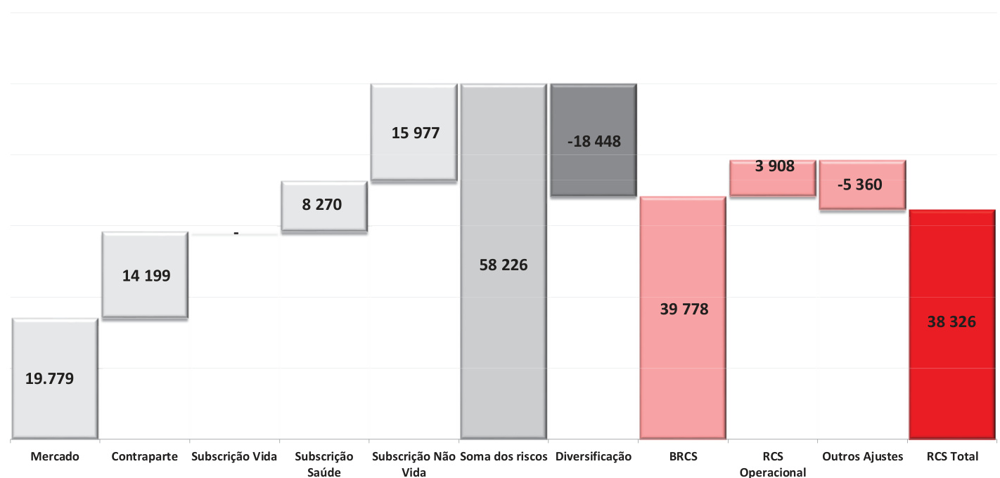  
Unidade: milhares de Euros  

O valor total do RCS da Entidade, a 31 de dezembro de 2023 ascende a 38.326 milhares de euros, sendo que a 31 de dezembro de 2022 era de 29.981 milhares de euros.  

Na rúbrica “Outros ajustes “, apresenta-se, de forma conjunta, a capacidade de absorção por Impostos Diferidos.  

A capacidade de absorção de perdas do imposto diferido ascende a -5.360 milhares de euros (-7.186 em 2022).  

O valor do RCM da Entidade, a 31 de dezembro de 2023, ascende a 11.253 milhares de euros, sendo que a 31 de dezembro de 2022 era de 10.896 milhares de euros.  

Para o cálculo do RCS a entidade não utilizou nem simplificações nem parâmetros específicos.  

Na tabela seguinte mostra-se o valor do RCM da Entidade e os distintos elementos que se utilizam para o seu cálculo, que são para as distintas linhas de negócio:  

- Melhor estimativa líquida (de resseguro e SPV) e Provisões Técnicas calculadas como um todo;   
- Prémios adquiridos líquidos (de resseguro) nos últimos 12 meses;  

Capital em risco total líquido neto (de resseguro e de SPV).  

<html><body><table><tr><td>relativa as responsabilidades de</td><td colspan="3"></td></tr><tr><td>seguro e de resseguro nao-vida Resultado de RCM (NL)</td><td>10.159</td><td colspan="2"></td></tr><tr><td colspan="2"></td><td>Valor liquido (de contratos de resseguro/EOET) da melhor estimativa e PT</td><td>Valor liquido (de contratos de resseguro) dos premios emitidos nos ultimos 12 meses</td></tr><tr><td>Seguro de despesas médicas e</td><td rowspan="10"></td><td>calculadas como um todo 305</td><td>527</td></tr><tr><td>resseguro proporcional Seguro de protecao de rendimentos</td><td>261</td><td>1.434</td></tr><tr><td>e resseguro proporcional Seguro de acidentes de trabalho e</td><td>3.357</td><td>13.684</td></tr><tr><td>resseguro proporcional Seguro e resseguro proporcional de automovel - responsabilidade civil</td><td>28.139</td><td>24.207</td></tr><tr><td>Seguro e resseguro proporcional de</td><td>5.906</td><td>14.357</td></tr><tr><td>automovel - outros ramos Seguro maritimo, da aviacao e dos</td><td>96</td><td>93</td></tr><tr><td>transportes e resseguro proporcional Seguro e resseguro proporcional de incendio e outros danos patrimoniais</td><td>9.674</td><td>7.690</td></tr><tr><td>Seguro e resseguro proporcional de responsabilidade civil geral</td><td>2.603</td><td>3.310</td></tr><tr><td>Seguro e resseguro proporcional de crédito e caucao</td><td>225</td><td>-1</td></tr><tr><td>Seguro e resseguro proporcional de</td><td>764</td><td>634</td></tr><tr><td>protecao juridica Assistencia e resseguro proporcional</td><td>0</td><td>0</td></tr><tr><td>Seguro e resseguro proporcional de perdas financeiras diversas</td><td>66</td><td>2</td></tr><tr><td>Resseguro de acidentes e doenca nao profissional</td><td>0</td><td>0</td></tr><tr><td>Resseguro de acidentes nao profissional</td><td>0</td><td>0</td></tr><tr><td>Resseguro nao proporcional maritimo, da aviacao e dos</td><td>0</td><td>0</td></tr><tr><td>transportes Resseguro de danos patrimoniais nao proporcional</td><td>0</td><td>0</td></tr></table></body></html>  

<html><body><table><tr><td>Componentedaformulalinear relativa as responsabilidades de seguro e de resseguro vida</td><td rowspan="2"></td><td colspan="2" rowspan="2"></td></tr><tr><td>Resultado de RCM(L)</td><td>1.094 Valor liquido (de contratos</td></tr><tr><td></td><td></td><td>de resseguro/EOET) da melhor estimativa e PT calculadas como um todo</td><td>Valor liquido (de contratos de resseguro/EOET) do capital em risco total</td></tr><tr><td>Responsabilidades com participacoes nos lucros - beneficios garantidos</td><td></td><td>0</td><td>0</td></tr><tr><td>Responsabilidades com participacoes nos lucros - beneficios discricionarios futuros</td><td></td><td>0</td><td>0</td></tr><tr><td>Responsabilidades de seguros ligados a indices e a unidades de participacao</td><td></td><td>0</td><td>0</td></tr><tr><td>Outras responsabilidades de (re)seguro dos ramos vida e acidentes e doenca</td><td></td><td>52.093</td><td>0</td></tr><tr><td>Total do capital em risco para todas as responsabilidades de (re)seguro do ramo vida</td><td></td><td>0</td><td>0</td></tr></table></body></html>  

<html><body><table><tr><td>Calculo do RCM global</td><td></td></tr><tr><td>RCMLinear</td><td>11 253</td></tr><tr><td>RCS</td><td>38057</td></tr><tr><td>Limite superior doRCM</td><td>17126</td></tr><tr><td>Limite inferior do RCM</td><td>9 514</td></tr><tr><td>RCM combinado</td><td>11 253</td></tr><tr><td>LimiteinferiorabsolutodoRCM</td><td>4.000</td></tr></table></body></html>

Unidade: milhares de Euros/ Template: S.28.01.01  

O RCM linear é de 11.253 milhares de euros. Este RCM linear obtém-se aplicando os fatores correspondentes aos dados que se utilizam para o seu cálculo e que se recolhem nas tabelas anteriores. O RCM combinado é de 11.253 milhares de euros. Este RCM combinado é resultado da aplicação dos limites máximo e mínimo ao RCM linear.  

Como o RCM combinado está por acima limite inferior absoluto do RCM (que é de 4.000 milhares de euros), o valor RCM combinado considera-se como valor do Capital Mínimo Obrigatório, que é, portanto, de 11.253 milhares de euros.  

E.2.2. Informação relativa ao Capital de solvência obrigatório e ao Capital mínimo obrigatório  

O cálculo da capacidade de absorção de perdas de impostos diferidos (LAC DT) sob os seguintes pressupostos é detalhado abaixo:  

<html><body><table><tr><td></td><td>LAC DT</td></tr><tr><td>LACDT</td><td>9 118</td></tr><tr><td>LAC DT justificada pela reversao de passivos por impostos diferidos</td><td>2 260</td></tr><tr><td>LAC DT justificada por referencia aos provaveis lucros economicos tributaveis futuros</td><td>3100</td></tr><tr><td>LAC DT justificada pelo reporte para exercicios anteriores, ano em curso</td><td></td></tr><tr><td>LAC DT justificada pelo reporte para exercicios anteriores, anos futuros</td><td></td></tr><tr><td>LACDTmaxima</td><td>5360</td></tr></table></body></html>

Unidade: milhares de Euros  

A Entidade ajustou o seu capital de solvência obrigatório, tendo em conta a capacidade de absorção de perdas por impostos diferidos, em 5.360 milhares de euros.  

Para tal a Entidade efetuou um teste de recuperabilidade dos ativos por impostos diferidos que surgem após uma perda instantânea igual ao $\mathsf{R C S}^{8}$ . Nesse teste, a Entidade considerou:  

- Passivos líquidos por impostos diferidos, com um valor de 2.260 milhares de euros. Estes passivos líquidos foram gerados por diferenças temporárias nas seguintes rubricas em milhares de euros:  

<html><body><table><tr><td>Rubrica</td><td>Valor</td></tr><tr><td>OriginalmenteexpressosemIFRS17IFRS17</td><td>-1 890</td></tr><tr><td>AjustamentosdeProvisoestecnicas</td><td>2 704</td></tr><tr><td>AjustamentosdeAtivosIntangiveiseGoodwill</td><td>1888</td></tr><tr><td>Imoveis</td><td>-536</td></tr><tr><td>Partecipacoes</td><td>-3891</td></tr><tr><td>OutrosPassivoseActivos</td><td>-535</td></tr><tr><td>ValorSolvencia</td><td>-2260</td></tr></table></body></html>  

- Benefícios prováveis imponíveis futuros por um valor de 9.118 milhares de euros.  

As projeções, de benefícios futuros, realizadas são consistentes com as hipóteses utilizadas no cálculo da melhor estimativa de provisões. Para este efeito a Entidade definiu hipóteses, para o novo negócio, referentes a rácios de sinistralidade, rácios de gastos de administração, rácios de aquisição e de cessão de riscos ao resseguro, entre outros.  

A Entidade aplicou hipóteses mais prudentes que as utilizadas na justificação dos ativos fiscais diferidos no balanço, em concreto:  

· A Entidade separou o resultado procedente das renovações das apólices em carteira das que procedem do novo negócio. No caso de renovações a Entidade considera 5 anos de renovações. No caso das vendas de novos negócios, a Entidade considerou 3 anos de projeção,  

de acordo com a duração do plano de negócios aprovado pela Entidade. Além disso, aplicou um fator de redução no volume de vendas. A curva de juros livre de risco utilizada para o cálculo das provisões técnicas, o retorno dos investimentos para a carteira de vendas de novos negócios e renovações da carteira atual é aquela correspondente ao cenário envolvendo um ônus de capital sobre o risco de taxa de juros. Os ativos que suportam as Provisões Técnicas no balanço foram reduzidos pela perda instantânea equivalente à Exigência de Capital de Solvência.  

Unidade: milhares de Euros  

# E.3. Uso do submódulo de risco de ações baseado na duração no cálculo do Capital de Solvência Obrigatório  

tidade não utilizou esta opção na avaliação para fins de so  

E.4. Diferenças entre a fórmula-padrão e qualquer modelo interno utilizado  

A Entidade não utiliza Modelos Internos nos seus cálculos das necessidades de Solvência, rege-se pela fórmula-padrão do Solvência II.  

# E.5 Incumprimento do Capital Mínimo Obrigatório e do Capital de Solvência Obrigatório  

A 31 de dezembro de 2023, a Entidade mantém uma adequada cobertura do Capital de Solvência Obrigatório e do Capital Mínimo Obrigatório com Fundos Próprios admissíveis, por tal motivo não foi necessário considerar a adoção de nenhum tipo de medidas corretivas para tal efeito.  

Não foram identificados riscos que sejam razoavelmente previsíveis de incumprimento do RCM nem do RCS da Entidade, pelo que não se considerou necessário desenvolver planos adicionais aos já estabelecidos de controlo e vigilância para manter o cumprimento de ambos.  

O Conselho de Administração monitoriza continuamente as ramificações financeiras e de solvência da pandemia de coronavírus. Foram introduzidas medidas no melhor interesse dos segurados e para proteger a posição de solvência da Companhia nestes tempos sem precedentes. A Companhia continuará a tomar todas as medidas necessárias no contexto do desenvolvimento da situação económica, financeira e regulamentar.  

# E.6. Informações adicionais  

Não existe outra informação material sobre a gestão de capital que não esteja incluída em capítulos anteriores.  

# ANEXOI  

Em continuidade, se anexa informacao dependentes  

<html><body><table><tr><td rowspan="2">Denominacao</td><td rowspan="2">Pais</td><td rowspan="2">Forma Juridica</td><td rowspan="2">Actividade</td><td colspan="2">Partecipacao</td></tr><tr><td>op% capital</td><td>%dosdireitos devoto</td></tr><tr><td>MAPFRESegurosVida</td><td>PRT</td><td>SocAnonima</td><td>Seguros</td><td>100%</td><td>100%</td></tr><tr><td>MAPFRESANTANDER</td><td>PRT</td><td>SocAnonima</td><td>Seguros</td><td>50.01%</td><td>50,01%</td></tr><tr><td>JomadaAncestral</td><td>PRT</td><td>Soc Anonima</td><td>Gestaolmoveis</td><td>100%</td><td>100%</td></tr></table></body></html>  

Lisboa, 09 de julho 2024  

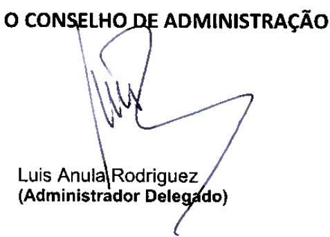  