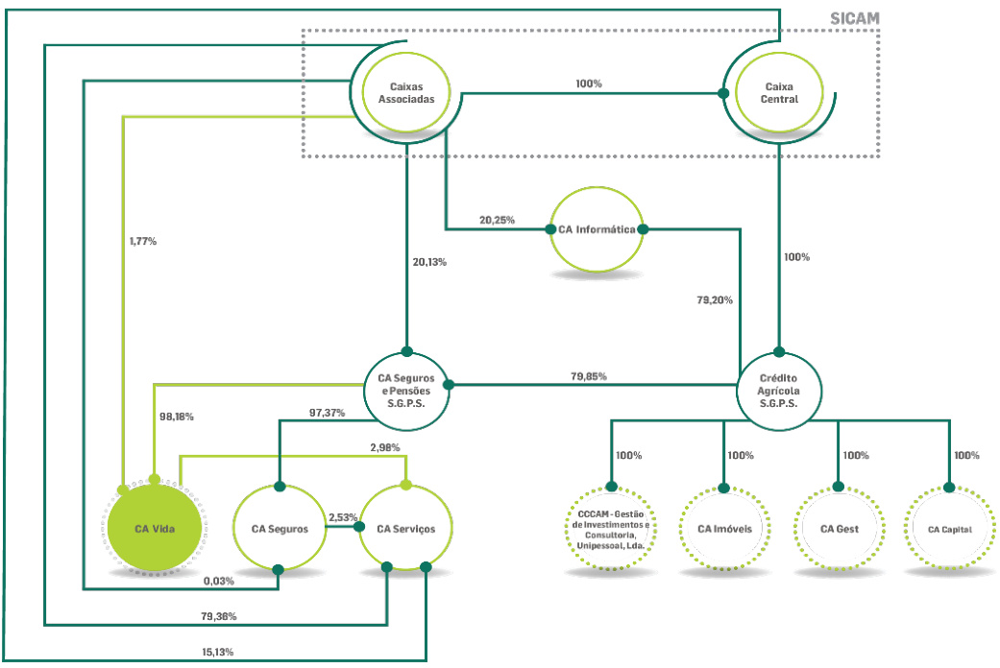

# 2023  

# RELATÓRIO SOBRE A SOLVÊNCIA E A SITUAÇÃO FINANCEIRA  

# ÍNDICE  

SÍNTESE .  

# A. ATIVIDADE E DESEMPENHO 8  

A.1 ATIVIDADE 8   
A.2 DESEMPENHO DA SUBSCRIÇÃO . 11   
A.3 DESEMPENHO DOS INVESTIMENTOS . 14   
A.4 DESEMPENHO DE OUTRAS ACTIVIDADES. . 17   
A.5 EVENTUAIS INFORMAÇÕES ADICIONAIS . . 17  

# B. SISTEMA DE GOVERNAÇÃO 18  

B.1 INFORMAÇÕES GERAIS SOBRE O SISTEMA DE GOVERNAÇÃO . 18   
B.2 REQUISITOS DE QUALIFICAÇÃO E DE IDONEIDADE . . 26   
B.3 SISTEMA DE GESTÃO DE RISCOS . . 28   
B.4 SISTEMA DE CONTROLO INTERNO . . 36   
B.5 FUNÇÃO DE AUDITORIA INTERNA . 39   
B.6 FUNÇÃO ATUARIAL. . 39   
B.7 SUBCONTRATAÇÃO . 40   
B.8 EVENTUAIS INFORMAÇÕES ADICIONAIS 41  

# C. PERFIL DE RISCO .  

C.1 RISCO ESPECÍFICO DE SEGUROS 42   
C.2 RISCO DE MERCADO . . 45   
C.3 RISCO DE CRÉDITO .. . 49   
C.4 RISCO DE LIQUIDEZ . . 49   
C.5 RISCO OPERACIONAL . .. 51   
C.6 OUTROS RISCOS MATERIAIS . 52   
C.7 EVENTUAIS INFORMAÇÕES ADICIONAIS . 52  

# D. AVALIAÇÃO PARA EFEITOS DE SOLVÊNCIA 53  

D.1 ATIVOS . 53   
D.2 PROVISÕES TÉCNICAS . 58   
D.3 OUTRAS RESPONSABILIDADES. . 65   
D.4 MÉTODOS ALTERNATIVOS DE AVALIAÇÃO . . 67  

D.5 EVENTUAIS INFORMAÇÕES ADICIONAIS. 67  

# E. GESTÃO DO CAPITAL. 68  

E.1 FUNDOS PRÓPRIOS .. 68 E.2 REQUISITOS DE CAPITAL DE SOLVÊNCIA E DE CAPITAL MÍNIMO . 71 E.3 UTILIZAÇÃO DO SUBMÓDULO DE RISCO ACIONISTA BASEADO NA DURAÇÃO PARA CALCULAR O REQUISITO DE CAPITAL DE SOLVÊNCIA ... .... 73 E.4 DIFERENÇAS ENTRE A FÓRMULA-PADRÃO E QUALQUER MODELO INTERNO UTILIZADO ... .... 73 E.5 INCUMPRIMENTO DO REQUISITO DE CAPITAL MÍNIMO E INCUMPRIMENTO DO REQUISITO DE CAPITAL DE SOLVÊNCIA .. . 73 E.6 EVENTUAIS INFORMAÇÕES ADICIONAIS. 73  

# F. ANEXOS .  

F.1 S.02.01.02 - BALANÇO . 74 F.2 S.05.01.02 – PRÉMIOS, SINISTROS E DESPESAS POR CLASSE DE NEGÓCIO . 76 F.3 S.12.01.02 – PROVISÕES TÉCNICAS VIDA E ACIDENTES E DOENÇA STV ....... 77 F.4 S.22.01.21 – IMPACTO DAS MEDIDAS LONGO PRAZO E DAS MEDIDAS TRANSITÓRIAS .. .. 78 F.5 S.23.01.01 – FUNDOS PRÓPRIOS . . 79 F.6 S.25.01.21 – REQUISITO DE CAPITAL DE SOLVÊNCIA – PARA AS EMPRESAS QUE UTILIZAM A FÓRMULA-PADRÃO . 81 F.7 S.28.01.01 – REQUISITO DE CAPITAL MÍNIMO – ATIVIDADES DE SEGURO E DE RESSEGURO EXCLUSIVAMENTE DO RAMO VIDA OU DO RAMO NÃO-VIDA ..... 82 F.8 RELATÓRIO DE CERTIFICAÇÃO ATUARIAL .. .. 83 F.9 RELATÓRIO DO REVISOR OFICIAL DE CONTAS .. 86  

# SÍNTESE  

O presente relatório é elaborado com base no Regime Jurídico de Acesso e Exercício da Atividade Seguradora e Resseguradora (RJASR), que entrou em vigor a 1 de Janeiro de 2016 e cuja transposição para a ordem jurídica interna foi efetuada através da Lei $\mathsf{n}^{\mathsf{o}}\,\mathsf{1}47/2015$ , de 9 de Setembro. O regime estabelece que seja reportada publicamente informação anual relativa à solvência e à situação financeira da Seguradora.  

A informação a divulgar no âmbito deste relatório anual sobre a solvência e situação financeira encontra-se prevista no capítulo XII da secção 1 do Regulamento Delegado (EU) 2015/35 da Comissão, de 10 de Outubro de 2014.  

De acordo com o definido no artigo 292º deste Regulamento Delegado, é apresentada em seguida uma síntese do conteúdo deste relatório.  

# ATIVIDADES E DESEMPENHO  

A Crédito Agrícola Vida - Companhia de Seguros, S.A. (CA Vida), com o Identificador de Entidade Jurídica (LEI) 2138001N7EHU4AA68408, exerce a atividade de comercialização de seguros de vida e fundos de pensões, em Portugal. A Companhia é detida maioritariamente pela Crédito Agrícola – Seguros e Pensões, S.G.P.S., S.A., a holding de seguros do Grupo Crédito Agrícola, que detém 98, $18\%$ do seu capital social, comercializando os seus produtos exclusivamente através rede comercial do Grupo Crédito Agrícola.  

O ano da CA Vida em números pode resumir-se como se segue:  

  

Em 2023, assistiu-se a uma desaceleração da economia global, num período caracterizado por uma contração da inflação nas principais economias mundiais, o que contribuiu para um discurso mais moderado por parte dos bancos centrais e para a expectativa quanto ao fim do atual ciclo restritivo de política monetária. As obrigações soberanas registaram ganhos moderados centrados maioritariamente nos últimos dois meses do ano.  As valorizações verificadas nas carteiras de investimentos permitiram registar um aumento no rácio de solvência.  

Conscientes dos riscos que o caminho digital apresenta, a CA Vida reiterou e reforçou a sua preocupação com temas como o risco cibernético, com a análise e implementação de medidas de segurança informática, procurando desta forma evitar impactos em dados e informações da Companhia e do Grupo CA.  

Considerando os valores e cultura do Grupo Crédito Agrícola, e com vista a responder às necessidades de aforro dos Clientes Crédito Agrícola, a CA Vida reforçou o seu posicionamento na oferta de produtos de poupança com a disponibilização, num período de comercialização limitado, de seguros de capitalização com capital garantido e taxa garantida, uma segurança valorizada pelos Clientes.  

A CA Vida tem na sua principal missão, o propósito de responder clara e objetivamente às necessidades de proteção e investimento dos Clientes do Grupo Crédito Agrícola, tendo ao longo dos 25 anos de atividade conquistado $20,\!0\%$ do total de Clientes do Grupo. Um número expressivo, mas também revelador do potencial que ainda há para conquistar durante os próximos anos em parceria com as mais de 600 Agências bancárias da rede CA.  

Embora atenuando o decréscimo verificado no ano anterior, o Mercado Segurador registou 11,8 mil milhões de euros de produção de seguro direto, apresentando um decréscimo homólogo de $2,\!0\%$ . O Ramo Vida foi o principal potenciador desta descida, com uma variação negativa de $14,3\%$ face ao ano anterior. Em oposição, o crescimento dos últimos anos no segmento Não Vida, traduziu-se numa distribuição de quota de mercado de $56,3\%$ para este segmento. A performance da CA Vida atuou em linha com o sector, registando em 2023 uma quebra de produção face ao período homólogo.  

No decurso de 2023, registou-se uma quebra em produção nova no canal de distribuição na ordem de $54,6\%$ . O segmento dos produtos de capitalização, com uma variação negativa de $56,2\%$ , foi o principal responsável por esta quebra, visto a oferta deste tipo de produtos não ter estado disponível ao longo de todo o ano, como se verificou no período homólogo. Embora menos expressivo, também os fundos de pensões e os produtos de risco registaram uma variação negativa face a 2022, na ordem de $12,5\%\in2,6\%,$ , respetivamente.  

O montante sob gestão de fundos de pensões apresentou um crescimento de $4,1\%$ em relação a 2022, o equivalente a 29,5 milhões de euros, totalizando 119,1 milhões de euros, resultante da valorização dos ativos em carteira.  

O resultado líquido, no exercício de 2023, em base IFRS 17 e IFRS 9, foi de 6,6 milhões de euros. A produção total foi de 139 milhões de euros, representando um decréscimo de $44\%$ face ao mesmo período do ano anterior.  

# SISTEMA DE GOVERNAÇÃO  

A estrutura organizativa da CA Vida foi concebida com base em princípios de flexibilidade, abertura e de fácil comunicação, garantindo deste modo uma maior adequação à estratégia da Companhia e à constante necessidade de adaptação às exigências do mercado e Acionistas. A estrutura organizativa é de desenho claro privilegiando a horizontalidade, como veículo facilitador da comunicação ascendente e descendente e assenta na criação de processos de decisão fáceis e de reação rápida.  

A Companhia possui uma estrutura organizativa onde estão definidas as funções-chave de Gestão de Riscos, Auditoria Interna, Verificação da Conformidade (Compliance) e Função Atuarial. A gestão é apoiada por um conjunto de comités que constituem um nível intermédio de análise que faculta uma abordagem técnica adequada relativamente a alguns temas relevantes para a atividade da Companhia, com o intuito de emitir pareceres técnicos e assessoria no processo de tomada de decisão do Conselho de Administração Executivo.  

A Companhia possui políticas internas que definem princípios que devem ser respeitados de forma a garantir uma gestão sã e sólida dos riscos a que a CA Vida se encontra exposta.  

O Sistema de Gestão de Riscos da Companhia permite assegurar com considerável nível de segurança que os riscos a que esta se encontra exposta são identificados e geridos de forma eficaz e eficiente. De facto, o trabalho desenvolvido ao nível dos processos e procedimentos no âmbito da gestão de riscos, tem permitido a implementação de uma cultura de risco que se revela fundamental na eficácia e eficiência deste sistema.  

# PERFIL DE RISCO  

A gestão de riscos é parte integrante das principais atividades da CA Vida, assegurando-se desta forma que os objetivos estratégicos são alcançados. A função de Gestão de Riscos dinamiza a identificação, avaliação, gestão e monitorização dos riscos, existindo também um Comité de Gestão de Riscos que constitui um fórum multidisciplinar de debate e análise das temáticas de Gestão de Riscos.  

A quantificação dos requisitos de capital de solvência é efetuada considerando a fórmula-padrão. Relativamente ao ano de 2023, o cálculo do requisito de capital de solvência da CA Vida decompõe-se da seguinte forma:  

U: Milhares de euros  

  
Composição do Requisito de Capital de Solvência 2023  

Em comparação com o período anterior verifica-se que o risco específico de seguros se mantém como o tipo de risco com maior expressão em termos de requisitos de capital de solvência.  

Relativamente aos riscos que não se encontram refletidos na fórmula-padrão, são efetuadas análises dos mesmos no processo de Autoavaliação do Risco e da Solvência da Companhia.  

# AVALIAÇÃO PARA EFEITOS DE SOLVÊNCIA  

Neste capítulo são detalhadas as metodologias e os pressupostos utilizados na avaliação para efeitos de solvência, bem como efetuadas reconciliações com os valores que constam nas demonstrações financeiras. Relativamente ao ano de 2023, esta informação resume-se da seguinte forma:  

U: Milhares de euros   

<html><body><table><tr><td></td><td>Solvenciall</td><td>IFRS</td><td>Diferenca</td><td>Solvenciali anoanterior</td></tr><tr><td>Ativos</td><td>773.698</td><td>838.327</td><td>-64.629</td><td>734.654</td></tr><tr><td>Provisoestecnicas</td><td>551.843</td><td>591.027</td><td>-39.184</td><td>517.164</td></tr><tr><td>Outrasresponsabilidades</td><td>94.560</td><td>91.041</td><td>3.519</td><td>98.461</td></tr></table></body></html>  

No cálculo das Provisões Técnicas para efeitos de solvência, a CA Vida utiliza o regime transitório aplicável às provisões técnicas e o ajustamento de volatilidade à estrutura temporal de taxas de juro sem risco relevante, previstos nos artigos 25º e 98º da Lei n.º 147/2015, de 9 de Setembro, respetivamente. Neste capítulo são também discriminados os impactos decorrentes da aplicação das medidas referidas.  

Relativamente aos montantes recuperáveis de resseguro, são apresentados os valores para efeitos de solvência e os valores relativos às demonstrações financeiras e detalhadas as metodologias utilizadas no cálculo dos montantes para efeitos de solvência. Os montantes relativos a 2023 são os seguintes:  

U: Milhares de euros   

<html><body><table><tr><td></td><td>Solvenciall</td><td>IFRS</td><td>Revalorizacao</td><td>Solvenciall anoanterior</td></tr><tr><td>Montantesrecuperaveis</td><td></td><td></td><td></td><td></td></tr><tr><td>decontratosderesseguro</td><td>5.919</td><td>5.073</td><td>846</td><td>5.412</td></tr></table></body></html>  

# GESTÃO DO CAPITAL  

Relativamente à componente de Gestão do Capital é apresentada a constituição detalhada dos fundos próprios disponíveis, incluindo informação sobre a estrutura, montante e qualidade dos mesmos. É efetuada uma reconciliação com os montantes que constam nas demonstrações financeiras. Relativamente ao exercício de 2023 e 2022 a informação resumida é a seguinte:  

U: Milhares de euros   

<html><body><table><tr><td>FundosProprios</td><td>2023</td><td>2022</td></tr><tr><td>Nivel1-semrestricoes</td><td></td><td></td></tr><tr><td>Capitalemacoesordinarias(semdeducaodasacoes proprias)</td><td>35.000</td><td>35.000</td></tr><tr><td>Reservadereconciliacao</td><td>68.679</td><td>80.025</td></tr><tr><td>Nivel1-comrestricoes</td><td></td><td></td></tr><tr><td>Passivossubordinados</td><td>40.071</td><td>40.067</td></tr><tr><td>Nivel 2 FundosPropriosquenaodevemserincluidos</td><td>-912</td><td>-894</td></tr><tr><td>Total</td><td>142.837</td><td>154.198</td></tr></table></body></html>  

Os montantes relativos ao requisito de capital de solvência, ao requisito de capital mínimo e dos respetivos rácios de cobertura nos exercícios de 2023 e 2022 são os seguintes:  

U: Milhares de euros   

<html><body><table><tr><td></td><td>2023</td><td>2022</td></tr><tr><td>RequisitodeCapital deSolvencia(RCS)</td><td>76.372</td><td>84.970</td></tr><tr><td>Requisito deCapital Minimo(RCM)</td><td>27.953</td><td>26.828</td></tr><tr><td>FundosPropriosElegiveisparacoberturadoRCS</td><td>154.293</td><td>154.198</td></tr><tr><td>FundosPropriosElegiveisparacoberturadoRCM</td><td>134.048</td><td>148.029</td></tr><tr><td>RaciodecoberturadoRCS</td><td>202%</td><td>181%</td></tr><tr><td>RaciodecoberturadoRCM</td><td>480%</td><td>552%</td></tr></table></body></html>  

O rácio de solvência da CA Vida, a 31 de Dezembro de 2023, situa-se em $202\%,$ , com um excesso de fundos próprios sobre o requisito de capital de solvência de 77.921 milhares de euros.  

A integração do sistema de riscos no sistema de governação da CA Vida permite alcançar uma gestão sã e prudente, de forma a assegurar a continuidade e o cumprimento dos objetivos estratégicos da Companhia.  

O nível de desenvolvimento e integração dos sistemas de gestão de riscos e de governação permite concluir que a CA Vida cumpre com os requisitos definidos pelo regime de Solvência II de forma efetiva e contínua.  

O presente relatório foi validado em sede de Comité de Gestão de Riscos e aprovado pelo Conselho de Administração Executivo no dia 22 de Março de 2024.  

Conselho de Administração Executivo  

António João Alberto Castanho  

Nelson Fernando Ferreira Maurício  

Ana Cristina Teixeira Guedes Pestana de Aguiar  

# A. ATIVIDADE E DESEMPENHO  

# A.1 ATIVIDADE  

# APRESENTAÇÃO DA COMPANHIA  

A CA Vida foi constituída por escritura pública, celebrada em 30 de Novembro de 1998, sob a forma jurídica de Sociedade Anónima, exercendo a atividade de comercialização de seguros de vida e fundos de pensões, em Portugal. A Companhia tem como principais Acionistas a Crédito Agrícola – Seguros e Pensões, S.G.P.S., S.A., a holding de seguros do Grupo Crédito Agrícola, que detém 98, $18\%$ do seu capital social e as Caixas de Crédito Agrícola Mútuo do Sistema Integrado do Crédito Agrícola Mútuo (SICAM), com uma participação de $1,77\%$ .  

# NOME E CONTACTOS DA ENTIDADE DE SUPERVISÃO  

A Autoridade de Supervisão de Seguros e Fundos de Pensões (ASF) é a autoridade nacional responsável pela regulação e supervisão, quer prudencial, quer comportamental, da atividade seguradora, resseguradora, dos fundos de pensões e respetivas entidades gestoras e da mediação de seguros.  

A ASF poderá ser contactada através de:  

Morada: Av. da República, 76, 1600-205 Lisboa  

Telefone: $(+351)$ 217 903 100  

Linha Informativa: 217 983 983  

# NOME E CONTACTOS DO REVISOR OFICIAL DE CONTAS  

O Revisor Oficial de Contas da CA Vida é a PricewaterhouseCoopers & Associados - Sociedade de Revisores Oficiais de Contas, Lda. representada por José Manuel Henriques Bernardo.  

O Revisor Oficial de Contas poderá ser contactado através de:  

Morada: Palácio Sottomayor, Rua Sousa Martins, 1 - 3º, 1069-316 Lisboa  

Telefone: $(+351)$ ) 213 599 000  

Fax: $(+351)$ 213 599 999  

# ACIONISTAS DA COMPANHIA COM PARTICIPAÇÕES QUALIFICADAS  

A CA Vida é detida maioritariamente pela Crédito Agrícola – Seguros e Pensões, S.G.P.S., S.A., a holding de seguros do Grupo Crédito Agrícola, que detém 98, $18\%$ do seu capital social.  

  

# CLASSES DE NEGÓCIO E ZONAS GEOGRÁFICAS DE ATIVIDADE  

A Companhia exerce atividade no ramo Vida do sector segurador e atua em todo o território nacional.  

# ATIVIDADES DESENVOLVIDAS DURANTE O PERÍODO DE REPORTE  

O ano de 2023 ficou fortemente marcado por uma conjuntura económica em que a incerteza, a taxa de inflação e o aumento das taxas de juro foram os principais fatores a condicionar a economia, afetando também a atividade seguradora, à qual acresceu ainda o desafio da entrada em vigor da nova regulamentação contabilística IFRS 17 – Contratos de Seguro e IFRS 9 – Instrumentos Financeiros.  

Embora atenuando o decréscimo verificado no ano anterior, o Mercado Segurador registou 11,8 mil milhões de euros de produção de seguro direto, apresentando um decréscimo homólogo de $2,\!0\%$ . O Ramo Vida foi o principal potenciador desta descida, com uma variação negativa de $14,3\%$ face ao ano anterior. Em oposição, o crescimento dos últimos anos no segmento Não Vida, traduziu-se numa distribuição de quota de mercado de $56,3\%$ para este segmento. A performance da CA Vida atuou em linha com o sector, registando em 2023 uma quebra de produção face ao período homólogo.  

Considerando os valores e cultura do Grupo Crédito Agrícola, e com vista a responder às necessidades de aforro dos Clientes Crédito Agrícola, a CA Vida reforçou o seu posicionamento na oferta de produtos de poupança com a disponibilização, num período de comercialização limitado, de seguros de capitalização com capital garantido e taxa garantida, uma segurança valorizada pelos Clientes.  

A competitividade no sector levou a CA Vida a sentir a necessidade de reestruturar a sua estratégia de pricing, iniciando o ano com o reposicionamento do preço dos seus produtos. Tanto ao nível do Cliente particular, como empresarial, melhorou-se a proposta de valor aos Clientes, ao redefinir-se a estratégia de negócio com um ajuste da tarifação dos produtos core, essencialmente para os targets mais jovens, e seu alinhamento ao nível das companhias a operar em canal Bancassurance, oferecendo aos novos Clientes uma boa relação do binómio qualidade/preço.  

2023, mais do que um ano de celebração pelo $25^{\circ}$ aniversário da CA Vida, representou para a Companhia, um ano de continuidade na incorporação dos princípios ESG (Environmental, Social and Governance) na estratégia corporativa da empresa. A Sustentabilidade é trabalhada com uma abordagem holística que considera as dimensões Ambiental, Social e de Governança, reconhecendo que todas devem ser consideradas em conjunto para que se atinja o ambicionado Desenvolvimento Sustentável, garantindo a par, a competitividade da organização.  

Para o efeito foi criado um Comité de Sustentabilidade, que teve como primeiro projeto de atuação, o desenvolvimento do Plano de Ação para o triénio 2023-2025 em matéria de sustentabilidade. Um plano que concilia a melhoria do desempenho da Companhia, a integração de temas emergentes e incontornáveis para o setor e a clarificação do seu papel na promoção da mudança de comportamentos junto da sociedade.  

A transformação digital no setor tem uma evolução constante, e a CA Vida acompanha as novas tecnologias e soluções que potenciam métodos mais ágeis e flexíveis de contactar e comunicar com os seus Clientes, bem como acompanhando a modernização dos canais digitais do Grupo Crédito Agrícola, a CA Vida disponibilizou, em 2023, consultas e documentos dos seguros de vida aos Clientes CA.  

A Omnicanalidade é um grande objetivo da Companhia, avançando-se de acordo com as melhores práticas de estrutura, acessos e segurança para a integração dos sistemas legacy, assim como integração com os Resseguradores e outros fornecedores e aplicativos.  

As infraestruturas informáticas da CA Vida, que são a base de sustentação dos sistemas de informação, foram atualizadas e melhoradas, com vista à sua otimização. A flexibilização e modernização da infraestrutura tecnológica utilizada na Companhia, tanto On-Premises, como Cloud-based, tem evoluído no sentido de suportar a transformação digital em curso, assegurando, assim, uma aproximação alinhada com os interesses dos Clientes.  

A Segurança Informática assume um posicionamento de destaque com a evolução e transformação para o digital. Com a crescente exposição das empresas ao Mundo, os riscos cibernéticos aumentam consideravelmente e têm de ser mitigados, com procedimentos e ferramentas adequados para o efeito. Nesse sentido, estão a ser estudadas as melhores soluções para a CA Vida cumprir com as orientações e regulamentação já emitidas pela European Insurance and Occupational Pensions Authority (EIOPA).  

A Companhia investiu também num novo ambiente de Disaster Recovery, que assegure o funcionamento da empresa e do seu negócio em caso de desastre nas instalações de produção, com fácil acesso e com funcionamento responsável e funcional.  

A Companhia mantém o foco em temas como a prevenção do branqueamento de capitais e do financiamento do terrorismo, a prevenção da fraude em seguros, a proteção de dados, a transformação digital e os riscos cibernéticos, a sustentabilidade e responsabilidade corporativa e a subcontratação, entre outros temas de relevo com impacto na atividade seguradora.  

De referir também os diversos projetos de âmbito regulatório, destacando as Normas Internacionais de Reporte Financeiro, IFRS 9 - Instrumentos Financeiros e IFRS 17 - Contratos de Seguro, a qual tem representado um investimento significativo em recursos financeiros e humanos.  

A informação apresentada nos capítulos relativos ao Desempenho foi preparada com base nas demonstrações financeiras estatutárias da Companhia.  

uma quebra na sua quota de mercado, fechando o ano com $2,7\%$ de quota no Ramo Vida.  

# A.2 DESEMPENHO DA SUBSCRIÇÃO  

# ANÁLISE DE DESEMPENHO GLOBAL DA SUBSCRIÇÃO  

Apesar da diminuição da inflação comparativamente com o ano anterior, o elevado valor da mesma continuou a pesar no orçamento familiar, condicionando, necessariamente, a aquisição de produtos vida.  

Tendo presente a confiança depositada na Companhia pelos seus Clientes, a comercialização de produtos de capitalização foi gerida com o intuito de preservar o valor dos investimentos realizados, privilegiando-se a fidelização dos Clientes com a disponibilização de soluções de investimento com período de comercialização definido, que permitissem ao Cliente potenciar os seus rendimentos em produtos de capital garantido, sendo que alguns dos produtos proporcionaram ainda a garantia da de taxa de remuneração.  

A diminuição do poder de compra conjugada com o aumento das taxas associadas ao crédito à habitação dificultou o crescimento deste, com impacto direto nos produtos vida associados a esta tipologia de empréstimo.  

Em 2023, a CA Vida alinhou as suas iniciativas com o Plano de Campanhas do Grupo CA, com vista a potenciar a promoção dos seguros vida. Não obstante, aproveitando a sensibilização da população para os fatores de risco e a necessidade de proteção, a CA Vida implementou cirurgicamente algumas ações comerciais, essencialmente focadas nos produtos de risco, com vista a alavancar a recuperação da carteira destes produtos e promover um maior dinamismo comercial na rede bancária do Crédito Agrícola.  

No decurso de 2023, registou-se uma quebra em produção nova no canal de distribuição na ordem de $54,6\%$ . O segmento dos produtos de capitalização, com uma variação negativa de $56,2\%$ , foi o principal responsável por esta quebra, visto a oferta deste tipo de produtos não ter estado disponível ao longo de todo o ano, como se verificou no período homólogo. Embora menos expressivo, também os fundos de pensões e os produtos de risco registaram uma variação negativa face a 2022, na ordem de $12,5\%$ e $2,\!6\%$ , respetivamente. Consequentemente, verifica-se na CA Vida  

# INDICADORES DE DESEMPENHO DA SUBSCRIÇÃO  

O volume de negócios da Companhia, em 2023, ascendeu a 138,9 milhões de euros, tendo-se verificado um decréscimo de $44\%$ face ao período homólogo.  

Para esta realidade contribuíram todos os segmentos de negócio, com exceção para os produtos de risco. Neste segmento, a CA Vida obteve um volume de prémios brutos emitidos de 47,2 milhões de euros, registando um crescimento de $1\%$ face ao ano anterior.  

U: Milhares de euros   

<html><body><table><tr><td>Producao</td><td>2023</td><td>2022</td><td>Var. 2023/2022</td></tr><tr><td>Contratos de Seguros</td><td></td><td></td><td></td></tr><tr><td>- Produtos de risco</td><td>47.218</td><td>46.759</td><td>1%</td></tr><tr><td>- Produtos de capitalizacao</td><td></td><td></td><td></td></tr><tr><td>Nao ligados a fundos de</td><td>37.513</td><td>62.844</td><td>-40%</td></tr><tr><td>investimento - PPR</td><td></td><td></td><td></td></tr><tr><td>Nao ligados a fundos de</td><td>53.715</td><td>136.774</td><td>-61%</td></tr><tr><td>investimento</td><td></td><td></td><td></td></tr><tr><td>Total</td><td>138.445</td><td>246.376</td><td>-44%</td></tr><tr><td>ContratosdeInvestimento</td><td></td><td></td><td></td></tr><tr><td>-Produtos de capitalizacao Nao ligados a fundos de</td><td></td><td></td><td></td></tr><tr><td>investimento</td><td></td><td></td><td></td></tr><tr><td>Ligados a fundos de investimento</td><td>55</td><td>1.128</td><td>-95%</td></tr><tr><td>Total</td><td>55</td><td>1.128</td><td>-95%</td></tr><tr><td>Total</td><td>138.998</td><td>247.504</td><td>-44%</td></tr></table></body></html>  

No ano de 2023, $33\%$ da produção da Companhia dizia respeito a produtos PPR, $23\%$ a produtos de capitalização, sendo o peso da produção de risco no volume de negócios de $29\%$ . Face ao ano anterior, destaca-se o aumento do peso relativo aos produtos de risco na estrutura de produção da CA Vida, com um crescimento de 12 p.p..  

  
Estrutura de Produção (Volume de negócios)   
Nota: Na rubrica capitalização inclui-se a produção realizada em seguros classificados como contratos de investimento.  

Os custos com sinistros relativos a contratos de seguro e indemnizações em contratos de investimento ascenderam a 114,4 milhões de euros, registando um aumento de 14,4 milhões de euros em relação ao ano anterior, correspondente a $14\%$ , devido ao aumento do volume de vencimentos e resgates nos produtos de capitalização e PPR não ligados a fundos de investimento.  

U: Milhares de euros   

<html><body><table><tr><td>Custos comSinistrosePassivosFinanceiros</td><td>2023</td><td>2022</td><td>Var. 2023/2022</td></tr><tr><td>ContratosdeSeguros</td><td></td><td></td><td></td></tr><tr><td>-Produtos de risco</td><td>15.296</td><td>11.953</td><td>28%</td></tr><tr><td>- Produtos de capitalizacao</td><td></td><td></td><td></td></tr><tr><td>Nao ligados afundos de investimento</td><td>63.189</td><td>37.858</td><td>67%</td></tr><tr><td>- PPR</td><td></td><td></td><td></td></tr><tr><td>Naoligadosafundosdeinvestimento</td><td>35.574 114.059</td><td>25.532 75.342</td><td>39%</td></tr><tr><td>Total ContratosdeInvestimento</td><td></td><td></td><td>51%</td></tr><tr><td></td><td></td><td></td><td></td></tr><tr><td>- Produtos de capitalizacao Nao ligados afundos de investimento</td><td>14</td><td>24.417</td><td>-100%</td></tr><tr><td>Ligados afundosdeinvestimento</td><td>37</td><td>32</td><td>17%</td></tr><tr><td>Total</td><td>387</td><td>24.734</td><td>-98%</td></tr><tr><td></td><td>114.446</td><td></td><td></td></tr><tr><td>Total</td><td></td><td>100.077</td><td>14%</td></tr></table></body></html>  

Para gerir o risco associado ao negócio, a CA Vida tem parte do capital seguro da sua carteira de produtos de risco coberto por Resseguro, com base em tratados efetuados com quatro resseguradores de renome internacional – a Swiss Re, a Munich Re, a RGA e a SCOR.  

O saldo de resseguro cedido em 2023, à semelhança dos anos anteriores, foi favorável aos resseguradores embora com uma acentuada diminuição devido ao aumento dos custos com sinistros.  

U: Milhares de euros   

<html><body><table><tr><td></td><td>2023</td><td>2022</td></tr><tr><td>Premios</td><td>10.338</td><td>10.304</td></tr><tr><td>Comissoeseparticipacaonosresultados</td><td>-2.033</td><td>-5.071</td></tr><tr><td>Custoscomsinistros</td><td>-7.182</td><td>-3.322</td></tr><tr><td>Saldoderessegurocedido</td><td>1.123</td><td>1.912</td></tr></table></body></html>  

# A.3 DESEMPENHO DOS INVESTIMENTOS  

A política de investimento da CA Vida está definida de forma a permitir atingir o equilíbrio entre a geração de retorno e a minimização de riscos. A proteção da posição de solvência da Companhia é um fator de extrema importância neste contexto.  

O montante de investimentos sob gestão, no final de 2023, totalizava 815 milhões de euros.  

U: Milhares de euros   

<html><body><table><tr><td>ClassedeAtivos</td><td>2023</td><td>2022 (Reexpresso)*</td></tr><tr><td>Titulosdedivida</td><td>770.606</td><td>745.835</td></tr><tr><td>Instrumentosdecapitaleunidadesdeparticipacao</td><td>28.402</td><td>27.365</td></tr><tr><td>DepositosemInstituicoesdeCredito</td><td>16.230</td><td>24.615</td></tr><tr><td>Total</td><td>815.238</td><td>798.815</td></tr></table></body></html>

\*Reexpressão das contas de 2022 em IAS 39 segundo a adoção da IFRS9.  

O resultado dos investimentos ascendeu a 14,7 milhões de euros, representando um aumento de 21,9 milhões de Euros comparativamente com o exercício anterior. Esta variação é justificada, em parte, pelas alterações no justo valor de obrigações de empresas e unidades de participação nos montantes de 10,9 milhões de Euros e 5,5 milhões de euros. Por outro lado, o aumento do resultado financeiro deveu-se também à alienação de dívida soberana que gerou um aumento das valias realizadas no montante aproximado de 6 milhões de euros.  

A estrutura da Carteira de Investimentos é a apresentada no seguinte gráfico:  

  
Estrutura da carteira de Investimentos  

U: Milhares de euros   

<html><body><table><tr><td>ResultadoFinanceiro</td><td>2023</td><td>2022</td><td>Var. 2023/2022</td></tr><tr><td>Rendimentos</td><td>9.323</td><td>8.999</td><td>4%</td></tr><tr><td>Gastosfinanceiros*</td><td>-1.606</td><td>-379</td><td>324%</td></tr><tr><td>Ganhosliquidos</td><td>3.730</td><td>-15.813</td><td>124%</td></tr><tr><td>Perdasdeimparidade(liquidasdereversao)</td><td>-72</td><td>-1</td><td>5.507%</td></tr><tr><td>Total</td><td>14.731</td><td>-7.192</td><td>305%</td></tr></table></body></html>

\* Sem custos por natureza imputados.  

# NDICADORES DE DESEMPENHO DOS INVESTIMENTOS  

Os rendimentos por categoria de ativos financeiros decompõem-se da seguinte forma:   
U: Milhares de euros   

<html><body><table><tr><td></td><td>2023</td><td>2022 (Reexpresso)*</td></tr><tr><td>Dejurosdeativosfinanceirosnaovalorizadosaojustovalorporviadeganhoseperdas</td><td></td><td></td></tr><tr><td>Ativosfinanceirosmensuradosaojustovaloratravesdereservas</td><td>8.077</td><td>4.867</td></tr><tr><td>Juros</td><td>4.775</td><td>4.163</td></tr><tr><td>Amortizacäosegundoataxaefetivadetitulosdedivida</td><td>3.301</td><td>704</td></tr><tr><td>Ativosfinanceirosmensuradosaocustoamortizado</td><td>1.868</td><td>1.799</td></tr><tr><td>Juros</td><td>1.564</td><td>1.534</td></tr><tr><td>Amortizacaosegundoataxaefetivadetitulosdedivida</td><td>304</td><td>265</td></tr><tr><td>Caixaeseusequivalentesedepositosaordem</td><td></td><td>22</td></tr><tr><td>Juros</td><td>15 15</td><td>22</td></tr><tr><td>Outros</td><td></td><td></td></tr><tr><td>Ativosfinanceirosmensuradosaojustovaloratravesdeganhoseperdas</td><td>2.969</td><td>3.280</td></tr><tr><td>Juros</td><td>2.817</td><td>3.184</td></tr><tr><td>Rendimentosdeunidadesdeparticipacaoemfundosdeinvestimentomobiliarioeimobiliario</td><td>152</td><td>96</td></tr><tr><td>Total</td><td>12.928</td><td>9.968</td></tr></table></body></html>

\*Reexpressão das contas de 2022 em IAS 39 segundo a adoção da IFRS 9.  

Os gastos financeiros por categoria de ativos financeiros decompõem-se da seguinte forma:   
U: Milhares de euros   

<html><body><table><tr><td></td><td>2023</td><td>2022 (Reexpresso)*</td></tr><tr><td>Dejurosdeativosfinanceirosnaovalorizadosaojustovalorporviadeganhoseperdas</td><td></td><td></td></tr><tr><td>Ativosfinanceirosmensuradosaojustovaloratravesdereservas</td><td>1.909</td><td>1.257</td></tr><tr><td>Custoamortizadopelataxaefetiva</td><td>1.909</td><td>1.257</td></tr><tr><td>Ativosfinanceirosmensuradosaocustoamortizado</td><td>90</td><td>91</td></tr><tr><td>Custoamortizadopelataxaefetiva</td><td>90</td><td>91</td></tr><tr><td>Dejurosdepassivosfinanceirosnaovalorizadosaojustovalorporviadeganhoseperdas Total</td><td>1.999</td><td>-164 1.184</td></tr></table></body></html>

\*Reexpressão das contas de 2022 em IAS 39 segundo a adoção da IFRS 9.  

Os ganhos líquidos de ativos financeiros mensurados ao justo valor através de reservas são analisados como se segue:   

<html><body><table><tr><td rowspan="2">Ganhosliquidosdeativosepassivosfinanceirosnaovalorizadosaojustovalor atravesdeganhoseperdas</td><td colspan="3">2023</td></tr><tr><td>Ganhos</td><td>Perdas</td><td>Total</td></tr><tr><td>Ativosfinanceirosmensuradosaojustovaloratravesdereservas</td><td>2.595</td><td>-1.593</td><td>1.002</td></tr><tr><td>Obrigacoeseoutrostitulosderendimentofixo</td><td>2.595</td><td>-1.593</td><td>1.002</td></tr><tr><td>Deemissorespublicos</td><td>2.361</td><td>-1.370</td><td>991</td></tr><tr><td>Deoutrosemissores</td><td>234</td><td>-223</td><td>11</td></tr><tr><td>Total</td><td>2.595</td><td>-1.593</td><td>1.002</td></tr></table></body></html>

\*Reexpressão das contas de 2022 em IAS 39 segundo a adoção da IFRS 9.  

U: Milhares de euros   

<html><body><table><tr><td colspan="3">2022</td></tr><tr><td>Ganhos</td><td>Perdas</td><td>(Reexpresso)* Total</td></tr><tr><td>5.675</td><td>-10.699</td><td>-5.024</td></tr><tr><td>5.675</td><td>-10.699</td><td>-5.024</td></tr><tr><td>5.002</td><td>-10.283</td><td>-5.281</td></tr><tr><td>673</td><td>-415</td><td>258</td></tr><tr><td>5.675</td><td>-10.699</td><td>-5.024</td></tr></table></body></html>  

U: Milhares de euros   

<html><body><table><tr><td colspan="3">2022(Reexpresso)*</td></tr><tr><td>Ganhos</td><td>Perdas</td><td>Total</td></tr><tr><td>3.139</td><td></td><td></td></tr><tr><td>1.716</td><td>-1.485</td><td>1.654</td></tr><tr><td>63</td><td>-1.470</td><td>246</td></tr><tr><td>1.653</td><td>-97</td><td>-34</td></tr><tr><td>1.423</td><td>-1.373</td><td>280</td></tr><tr><td rowspan="7">746</td><td>-15</td><td>1.408</td></tr><tr><td>-12.443</td><td>-12.443</td></tr><tr><td>-9.392</td><td>-9.392</td></tr><tr><td>-535</td><td>-535</td></tr><tr><td>-8.857</td><td>-8.857</td></tr><tr><td>-3.051</td><td>-3.051</td></tr><tr><td>-220</td><td>526</td></tr><tr><td>746</td><td>-220</td><td>526</td></tr><tr><td>3.885</td><td>-14.149</td><td>-10.263</td></tr></table></body></html>  

Os ganhos líquidos de ativos financeiros valorizados ao justo valor através de ganhos e perdas são analisados como se segue:   

<html><body><table><tr><td rowspan="2">Ganhosliquidosdeativosepassivosfinanceirosvalorizadosaojustovaloratravesdeganhoseperdas</td><td colspan="3"></td></tr><tr><td>Ganhos</td><td>Perdas</td><td>2023 Total</td></tr><tr><td>Ativosfinanceirosvalorizadosaojustovaloratravesdeganhoseperdas</td><td></td><td></td><td></td></tr><tr><td>Ganhoseperdasrealizados</td><td>5</td><td>-767</td><td>-761</td></tr><tr><td>Obrigacoes e outros titulos rendimento fixo</td><td>5</td><td>-767</td><td>-761</td></tr><tr><td>De emissores publicos</td><td>2</td><td>-350</td><td>-348</td></tr><tr><td>Deoutrosemissores</td><td>3</td><td>-417</td><td>-414</td></tr><tr><td>Unidadesdeparticipacaoemfundosdeinvestimento</td><td></td><td></td><td></td></tr><tr><td>Ganhoseperdaspotenciais</td><td>1.168</td><td>2.322</td><td>3.490</td></tr><tr><td>Obrigacoeseoutrostitulosrendimentofixo</td><td>189</td><td>2.339</td><td>2.529</td></tr><tr><td>De emissorespublicos</td><td>114</td><td>354</td><td>468</td></tr><tr><td>Deoutrosemissores</td><td>75</td><td>1.986</td><td>2.061</td></tr><tr><td>Unidadesdeparticipacaoemfundosdeinvestimento</td><td>979</td><td>-18</td><td>961</td></tr><tr><td>Passivosfinanceiros classificados noreconhecimentoinicialaojustovalor atraves deganhoseperdas Variacoes de justo valor de passivos financeiros de contratos de seguros considerados para efeitos</td><td>195</td><td>-454</td><td>-260</td></tr><tr><td>contabilisticoscomocontratosdeinvestimento</td><td>195</td><td>-454</td><td>-260</td></tr><tr><td>Total</td><td>1.368</td><td>1.100</td><td>2.468</td></tr></table></body></html>

\*Reexpressão das contas de 2022 em IAS 39 segundo a adoção da IFRS 9.  

Em 2023, a variação da reserva de reavaliação apresenta-se da seguinte forma:   
U: Milhares de euros   

<html><body><table><tr><td></td><td>2023</td><td>2022 (Reexpresso)*</td></tr><tr><td>Ativosfinanceirosmensuradosaojustovaloratravesdereservas</td><td>-59.936</td><td>-86.720</td></tr><tr><td>Variacaodejustovalor</td><td></td><td></td></tr><tr><td>Obrigacoeseoutrostitulosderendimentofixo</td><td>-59.936</td><td>-86.720</td></tr><tr><td>Titulos de dividapublica</td><td>-55.590</td><td>-78.002</td></tr><tr><td>Deoutrosemissorespublicos</td><td>-385</td><td>-648</td></tr><tr><td>De outrosemissores</td><td>-3.961</td><td>-8.071</td></tr><tr><td></td><td></td><td>322</td></tr><tr><td>Provisäoparaperdasdecredito Obrigacoeseoutrostitulosderendimentofixo</td><td>253 253</td><td>322</td></tr><tr><td>Titulos de divida publica</td><td>146</td><td>182</td></tr><tr><td>Deoutrosemissorespublicos</td><td>6</td><td>7</td></tr><tr><td>De outrosemissores</td><td>101</td><td>133</td></tr><tr><td>Saldo dareserva de reavaliacao por ajustamentos nojusto valor</td><td>-59.683</td><td>-86.398</td></tr></table></body></html>

\*Reexpressão das contas de 2022 em IAS 39 segundo a adoção da IFRS  

# A.4 DESEMPENHO DE OUTRAS ACTIVIDADES  

Não existem outras atividades desempenhadas pela Companhia com relevância material para efeitos de divulgação no presente relatório.  

# A.5 EVENTUAIS INFORMAÇÕES ADICIONAIS  

Não existem outras informações materiais relativas à atividade e ao desempenho da Companhia.  

# B. SISTEMA DE GOVERNAÇÃO  

# B.1 INFORMAÇÕES GERAIS SOBRE O SISTEMA DE GOVERNAÇÃO  

Ao nível do sistema de Governação, a CA Vida apresenta um Conselho Geral e de Supervisão, um Conselho de Administração Executivo e uma Sociedade de Revisores Oficiais de Contas, à qual compete a fiscalização dos atos do Conselho de Administração Executivo. A CA Vida dispõe também de uma Comissão de Remunerações e de uma estrutura de sete comités, aos quais são endereçados diferentes temas e riscos.  

A estrutura organizativa da CA Vida foi concebida com base em princípios de flexibilidade, abertura e de fácil comunicação garantindo deste modo uma maior adequação à estratégia da Companhia e à constante necessidade de adaptação às necessidades e exigências do mercado e Acionistas. A estrutura organizativa é de desenho claro, consistente no perfil da Função das Áreas de Responsabilidade. A estrutura definida privilegia a horizontalidade, como veículo facilitador da comunicação ascendente e descendente e assenta na criação de processos de decisão fáceis e de reação rápida. A estrutura contém ainda as funções-chave estabelecidas pelo regime de Solvência II. A Companhia dispõe de manuais de estrutura orgânica onde estão definidas as responsabilidades de cada órgão de estrutura que, em conjunto com a norma de delegação de poderes, asseguram uma adequada segregação de funções e responsabilidades.  

O organograma da Companhia é o seguinte:  

  

# CONSELHO GERAL E DE SUPERVISÃO  

O Conselho Geral e de Supervisão é um órgão composto por cinco membros eleitos em Assembleia Geral de Acionistas para mandatos de três anos. Tem como principais competências:  

Designar os membros do Conselho de Administração Executivo e definir e fixar as suas remunerações;   
Conceder ou negar o consentimento à transmissão de ações da sociedade; Emitir parecer relativamente a emissões de obrigações e de outros títulos de dívida propostas pelo Conselho de Administração Executivo;   
Dar o seu consentimento à aquisição, alienação e oneração de imóveis, sob proposta do Conselho de Administração Executivo;   
Aprovar as linhas estratégicas da sociedade, objetivos qualitativos e quantitativos, orçamentos e planos de atividades de cada uma das áreas de negócio, propostos pelo Conselho de Administração Executivo;   
Zelar pela correta aplicação das regras legais e estatutárias e das deliberações da Assembleia Geral.  

O Conselho Geral e de Supervisão reúne mensalmente com o Conselho de Administração Executivo, cooperando com este e com os demais órgãos e corpos sociais na defesa dos interesses da Companhia. As reuniões mensais com o Conselho de Administração Executivo têm como objetivo promover a discussão e avaliação de decisões estratégicas bem como acompanhar a evolução do negócio e controlo orçamental.  

Paralelamente ao Conselho Geral e de Supervisão, encontra-se constituída a Comissão para as Matérias Financeiras, a qual é composta por três membros do Conselho Geral e de Supervisão. Esta comissão tem como objetivo a análise de temas relacionados com práticas contabilísticas, gestão de ativos e gestão da Companhia nas vertentes económica e financeira.  

# CONSELHO DE ADMINISTRAÇÃO EXECUTIVO  

O Conselho de Administração Executivo tem como principal função a definição e implementação da estratégia segundo princípios que assegurem uma criação sustentável de valor, não só para a Companhia, mas para todo o Grupo Crédito Agrícola. O Conselho de Administração Executivo é assessorado por uma estrutura interna de Quadros altamente qualificados cujas competências específicas garantem os objetivos a alcançar.  

As principais responsabilidades do Conselho de Administração Executivo são as seguintes:  

Promover uma gestão sã e prudente;   
Definir os objetivos, estratégia, políticas, planos e orçamentos e investimentos; Dinamizar a “qualidade” como valor estratégico, estabelecendo o seu nível e monitorizando a sua evolução;   
Definir, aprovar e rever a estrutura da Companhia e os poderes a delegar;   
Fixar o nível de subcontratação das componentes integradoras do serviço e respetivas condições;   
Definir, aprovar e rever as políticas, procedimentos e controlos que integram a gestão de riscos e o controlo interno;   
Elaborar e emitir instruções ou circulares de serviço que visem à organização interna da Companhia, que se poderão consubstanciar em manuais;   
Definir, aprovar e rever as políticas de recursos humanos, o seu desenvolvimento e a política remuneratória;   
Assegurar que os Diretores de Topo implementam as orientações e políticas aprovadas e as orientações dadas;   
Dinamizar e controlar a gestão operacional no âmbito dos planos e orçamentos; Desenvolver e assegurar relações internacionais;   
Conceptualizar um quadro de comunicação interna e externa compatível com a estratégia da Companhia e a sua implementação, assumindo como da sua responsabilidade a comunicação interna aos Colaboradores e as relações com os media de âmbito nacional, nomeadamente com os meios de informação financeira; Definir a imagem corporativa e as ações de divulgação a desenvolver neste contexto;   
A liquidação de Sinistros Ex-Gratia;   
Manter uma relação de natureza institucional com os Acionistas, com a ASF, com a Associação Portuguesa de Seguradores (APS) e outras entidades públicas e privadas, nomeadamente congéneres;   
Gerir e acompanhar a Gestão de Continuidade de Negócio (GCN) nomeando para tal um responsável com assento no Comité de Continuidade de Negócio e no Comité de Gestão de Crise do Grupo Crédito Agrícola.  

O Conselho de Administração Executivo é constituído por três membros, designados pelo Conselho Geral e de Supervisão para mandatos de três anos, e reúne no mínimo uma vez por mês. Para além das responsabilidades acima elencadas, os membros do Conselho de Administração Executivo participam nos diversos Comités da Companhia. De forma a assegurar uma efetiva segregação de responsabilidades e uma correta operacionalização da estratégia definida, são atribuídos pelouros a cada membro do Conselho de Administração Executivo.  

A CA Vida obriga-se de acordo com os seus estatutos, no mínimo, pelas assinaturas de:  

Dois membros do Conselho de Administração Executivo; Um ou mais mandatários, nos termos e âmbitos dos respetivos poderes de representação.  

# COMISSÃO DE REMUNERAÇÕES  

A Comissão de Remunerações tem por incumbência fixar as remunerações e a política remuneratória dos membros do Conselho Geral e de Supervisão.  

A Comissão de Remunerações é igualmente constituída por três membros, designados por mandatos de três anos pela Assembleia Geral.  

# REVISOR OFICIAL DE CONTAS  

A Companhia dispõe de uma Sociedade de Revisores Oficiais de Contas, a PriceWaterhouseCoopers & Associados - Sociedade de Revisores Oficiais de Contas, Lda..  

O Revisor Oficial de Contas é designado pela Assembleia Geral, sob proposta da Comissão para as Matérias Financeiras.  

# COMITÉS  

Os comités criados dentro da estrutura orgânica da CA Vida constituem um nível intermédio de análise que faculta uma abordagem técnica adequada relativamente a alguns temas relevantes para a atividade da Companhia, com o intuito de emitir pareceres técnicos e prestar assessoria no processo de tomada de decisão do Conselho de Administração Executivo.  

# COMITÉ DE GESTÃO DE RISCOS  

Este comité visa apoiar o Conselho de Administração Executivo em todos os temas relacionados com a gestão de riscos e que não são devidamente endereçados por outros comités, como por exemplo, o risco de mercado que é analisado no âmbito do Comité de Investimentos. Este comité reúne no mínimo quatro vezes por ano.  

O Comité de Gestão de Riscos tem as seguintes responsabilidades:  

Dinamização do tema de Gestão de Riscos na Companhia;   
Validação de novas políticas e respetivos planos de implementação;   
Validação das revisões e alterações às políticas existentes na Companhia;   
Validação da matriz de riscos identificados e dos respetivos planos de mitigação;   
Análise dos reportes internos relativos ao tema de Gestão de Riscos;   
Validação de reportes regulamentares;   
Validação de decisões no âmbito da Gestão de Riscos;   
Validação de planos de implementação ou de ação no âmbito da Gestão de Riscos;   
Monitorização do apetite ao risco e da evolução do capital regulamentar;   
Apoio na execução do exercício de Autoavaliação do Risco e da Solvência (ORSA).  

# COMITÉ DE PRODUTOS  

Trata-se de um comité que visa a análise dos principais temas relacionados com produtos, tanto no desenvolvimento de novos produtos como no acompanhamento dos produtos existentes, da sua performance e dos seus riscos. Este comité reúne no mínimo duas vezes por ano.  

O Comité de Produtos tem as seguintes responsabilidades:  

Definição das condições de novos produtos a comercializar;   
Identificação de potenciais riscos derivados do início da comercialização de novos produtos ou de alterações aos existentes;   
Validação dos resultados da análise de rentabilidade de novos produtos ou de alterações aos existentes;   
Garantir a correta operacionalização da comercialização de novos produtos, mitigando desta forma os riscos operacionais associados à introdução ou alteração de procedimentos relativos à comercialização dos mesmos;   
Garantir a correta disseminação da informação na organização.  

# COMITÉ DE INVESTIMENTOS  

No Comité de Investimentos são endereçados, monitorizados e discutidos os principais temas relacionados com os investimentos da Companhia. Este comité reúne mensalmente.  

O Comité de Investimentos tem as seguintes responsabilidades:  

Discussão e validação da estratégia de investimentos da Companhia; Discussão e validação dos mandatos de investimento para os diferentes portfólios/pools de ativos existentes; Validação da Política de Investimentos e promoção das subsequentes revisões; Monitorização dos mandatos de investimento para os diferentes portfólios/pools de ativos existentes; Monitorização, análise e reporte mensal do cumprimento dos limites estabelecidos na estratégia de investimentos da Companhia; Análise dos riscos relativos a qualquer acontecimento de natureza ambiental, social ou de governação com impacto nos investimentos realizados, nas reuniões mensais, e proposta de mitigação dos mesmos; Validação e avaliação da realização de investimentos não habituais, garantindo que todos os requisitos associados aos mesmos são cumpridos; Análise e avaliação dos riscos inerentes à utilização de derivados; Apreciação e decisão quanto ao não cumprimento de limites definidos nos mandatos de gestão, designadamente limites sectoriais, de rating, concentração por emitente, entre outros.  

# COMITÉ ESTRATÉGICO  

O Comité Estratégico é um órgão de acompanhamento de projetos que consubstanciam a estratégia da Companhia e é composto pelos responsáveis de cada Direção, Subdireção ou Gabinete. Este comité reúne no mínimo duas vezes por ano.  

# COMITÉ DE AUDITORIA INTERNA  

O Comité de Auditoria Interna tem como missão contribuir para a integridade e eficácia do sistema de controlo interno da CA Vida, a melhoria da qualidade e fiabilidade da informação contabilística e dos indicadores de gestão e a realização dos objetivos fixados. Tem igualmente como missão acompanhar a execução dos planos de atividade das auditorias internas, avaliando as conclusões e respetivas ações de auditoria, pronunciando-se sobre quaisquer matérias de controlo interno. Este comité reúne no mínimo duas vezes por ano.  

# COMITÉ DE SUSTENTABILIDADE  

O Comité de Sustentabilidade tem como missão apoiar o Conselho de Administração Executivo na integração de princípios de sustentabilidade transversalmente no processo de gestão da CA Vida, designadamente através da definição e acompanhamento de iniciativas que permitam assegurar a execução do Plano de Ação de Sustentabilidade da Companhia nos seus vários eixos estratégicos. Este comité reúne no mínimo duas vezes por ano.  

# COMITÉ DE REMUNERAÇÕES  

O Comité de Remuneração é composto por membros do Conselho Geral e de Supervisão, devendo a maioria dos seus membros ser independente, na aceção do $\mathsf{n}^{\mathsf{Q}\mathsf{E}}$ do artigo 414º do Código das Sociedades Comerciais, de modo que possa formular juízos informados e independentes sobre a política de remuneração e a sua supervisão. Este comité reúne com uma periodicidade mínima anual.  

# FUNÇÕES-CHAVE  

A Companhia assegura também a existência das funções-chave na sua estrutura, nomeadamente, as Funções de Gestão de Riscos, Verificação do Cumprimento, Auditoria Interna e Atuarial.  

A Função de Gestão de Riscos tem como missão assegurar a correta implementação do sistema de Gestão de Riscos da Companhia. Esta função atua de forma independente e reporta diretamente ao Conselho de Administração Executivo. Tem um papel fundamental na implementação de uma cultura de risco na Companhia e assegura o acompanhamento periódico dos riscos a que a CA Vida se encontra exposta sendo responsável pelo reporte regulamentar regular ao Supervisor. Esta função encontra-se atribuída à Direção de Gestão de Riscos.  

A Função de Verificação do Cumprimento garante o cumprimento de toda a legislação, regulamentação e normativos internos, processos e procedimentos sendo responsável pela assessoria nesse âmbito a toda a Companhia. Esta função encontra-se atribuída ao Gabinete de Compliance.  

A Função de Auditoria Interna tem um papel fiscalizador e é responsável por avaliar os processos e procedimentos da Companhia numa lógica de continuidade. Esta função encontra-se atribuída ao Gabinete de Auditoria Interna, sendo desempenhada de forma objetiva e independente, verificando o cumprimento, a eficácia e a otimização dos controlos internos, dos processos de governação e ajudando ao cumprimento dos seus objetivos.  

A Função Atuarial assume o papel mais técnico, assegurando o desenvolvimento de processos e metodologias de cálculo das provisões técnicas e é responsável pela definição do preço dos produtos. Contribui também para uma implementação efetiva e eficaz do sistema de Gestão de Riscos da Companhia. Esta função encontra-se atribuída ao Gabinete de Gestão Atuarial.  

# ALTERAÇÕES MATERIAIS NO SISTEMA DE GOVERNAÇÃO QUE TENHAM OCORRIDO DURANTE O PERÍODO  

Não se verificaram alterações materiais no Sistema de Governação durante o período em referência.  

# POLÍTICA DE REMUNERAÇÕES  

# ÓRGÃOS SOCIAIS  

Os membros do Conselho de Administração Executivo devem desempenhar as suas funções de forma diligente e criteriosa, no interesse da CA Vida, tendo em conta a sua atividade e os interesses dos seus Acionistas e Colaboradores, sendo para isso importante que sejam estabelecidos parâmetros de remuneração adequados que motivem o elevado desempenho individual e coletivo e que permitam estabelecer, e serem atingidas, elevadas metas de crescimento da sociedade, com bons resultados para os seus Acionistas no quadro de uma cuidada gestão de risco, integração de considerações ambientais, sociais e de governação, atentos aos diferentes interesses que a Seguradora deve respeitar.  

A remuneração dos membros do Conselho de Administração Executivo, a fixar pelo Conselho Geral e de Supervisão, deve consistir na atribuição de um valor fixo mensal, pago catorze vezes por ano e por uma componente variável, não garantida contratualmente, que depende da avaliação individual e coletiva do órgão de administração e da aplicação de critérios predeterminados.  

A componente fixa mensal deve visar, fundamentalmente, a remuneração do esforço desenvolvido ao longo de cada exercício do respetivo mandato, devendo ter em linha de conta, designadamente, a relevância das áreas de gestão executiva de cada um dos membros Conselho de Administração Executivo, a sua experiência curricular e o nível de remunerações praticado noutras empresas congéneres.  

Por sua vez, a componente da remuneração variável visa, fundamentalmente, premiar o desempenho de cada um dos membros do Conselho de Administração Executivo no ano civil anterior à obtenção da mesma, tendo em consideração critérios quantitativos e qualitativos avaliados pelo Comité de Remuneração, através de objetivos e competências definidos, tendo esta avaliação de ser devidamente documentada, podendo, ainda, ser alvo de ajustamentos de acordo com os Mecanismos de Ajustamento pelo Risco existentes em cada momento na Companhia, quer de redução (malus), quer de reversão (claw-back).  

Tendo em atenção a natureza e a estrutura do Grupo Crédito Agrícola, de que a CA Vida faz parte, não existe qualquer tipo de plano de atribuição de ações ou opções de aquisição de ações aos membros do Conselho de Administração Executivo.  

Relativamente às remunerações dos membros do Conselho Geral e de Supervisão, esta consiste numa remuneração mensal, paga doze vezes por ano, pela participação em reuniões do órgão a que pertencem, em reuniões de outros órgãos da Sociedade na qual a sua presença seja legal, regulamentar ou estatutariamente solicitada e ainda pela participação em atos institucionais de outras naturezas em que a sua presença seja requerida em representação da Sociedade ou do seu Órgão de Fiscalização.  

Quanto aos membros da Mesa da Assembleia Geral, estes são remunerados através da atribuição de “senhas de presença”, pela participação nas Assembleias Gerais da Companhia definida em base trienal.  

No que respeita à Sociedade Revisora Oficial de Contas da CA Vida, a sua remuneração é assegurada por via de um contrato de prestação de serviços de revisão de contas, estando a sua remuneração em linha com as práticas do mercado.  

# COLABORADORES  

A política de remuneração dos Colaboradores da Companhia é definida pelo Conselho de Administração Executivo e revista anualmente.  

A remuneração dos Colaboradores é composta por uma componente fixa, adequada ao grau de responsabilidade da função e às competências inerentes à mesma, e por uma componente variável. A determinação da componente variável da remuneração depende da verificação de determinadas condições e objetivos e não se encontra contratualmente garantida.  

A remuneração variável é atribuída aos Colaboradores de acordo com o desempenho do Colaborador e da Companhia no ano civil anterior à obtenção da mesma, tendo em consideração critérios quantitativos e qualitativos avaliados pelas chefias diretas e posteriormente pelos membros do órgão de administração, através de objetivos e competências previamente definidos, tendo esta avaliação de ser devidamente documentada.  

A remuneração variável dos colaboradores assumirá a categoria de prémio e não poderá exceder $100\%$ da componente de remuneração fixa anual de cada colaborador. A mesma não será sujeita a pagamento diferido.  

A remuneração dos Colaboradores Identificados, (responsáveis de 1ª linha, as pessoas responsáveis por funções-chave ou que exercem funções-chave e os colaboradores que tenham impacto no perfil de risco da Companhia de acordo com a aplicação de critérios qualitativos objetivos previamente definidos), é composta por uma componente fixa, adequada ao grau de responsabilidade da função e às competências inerentes à mesma, e por uma componente variável. A determinação da componente variável da remuneração depende da verificação de determinadas condições e objetivos, não estando contratualmente garantida e podendo ser alvo de ajustamentos de acordo com os Mecanismos de Ajustamento pelo Risco existentes em cada momento na Companhia, quer de redução (malus), quer de reversão (claw-back).  

A remuneração variável é atribuída aos Colaboradores Identificados de acordo com o desempenho do colaborador e da Companhia no ano civil anterior à obtenção da mesma, tendo em consideração critérios quantitativos e qualitativos avaliados pelo órgão de administração, através de objetivos e competências previamente definidos, tendo esta avaliação de ser devidamente documentada. Os critérios de atribuição de remuneração variável dos Colaboradores Identificados titulares de funções-chave não estão relacionados com a performance das atividades que monitorizam e controlam, nem ser definida de modo a poder levar a um comprometimento da objetividade e independência do trabalho por eles desenvolvido.  

A remuneração variável dos Colaboradores Identificados assumirá a categoria de prémio e não poderá exceder $100\%$ da componente de remuneração fixa anual de cada colaborador. A mesma poderá ser sujeita a pagamento diferido e poderá ser alvo de ajustamentos de acordo com os critérios estabelecidos pelos “Mecanismos de Ajustamento pelo Risco”.  

A remuneração variável atribuída às pessoas que exercem funções-chave deve atender à prossecução dos objetivos associados às respetivas funções, independentemente do desempenho das unidades operacionais e áreas sob o seu controlo.  

Quando o valor da remuneração variável for superior a cinquenta mil euros, a remuneração variável é sujeita a diferimento, o correspondente a $40\%$ , ao longo de um período de 3 anos e paga um terço em cada um dos 3 anos subsequentes, na data de pagamento das remunerações variáveis dos anos seguintes, com o pagamento a ser feito em numerário. A componente não diferida da remuneração variável corresponde a $60\%$ da mesma podendo ser paga de imediato. Quando o valor do Prémio for igual ou inferior a cinquenta mil euros, este será pago na totalidade aquando do pagamento do prémio dos restantes colaboradores.  

A remuneração variável poderá, ainda, ser alvo de ajustamentos de acordo com os Mecanismos de Ajustamento pelo Risco.  

A remuneração variável poderá não ser atribuída em casos excecionais, nomeadamente se, se concluir não existir capacidade para constituir, de forma atempada, Fundos Próprios suficientes para cobrir os Requisitos de Capital de Solvência, ou fazer face a todos os tipos de riscos, atuais e futuros, com impacto material na solvência; assim como nos anos em que a Companhia registe resultados líquidos negativos.  

# TRANSAÇÕES COM PARTES RELACIONADAS  

A CA Vida comercializa seguros de vida e fundos de pensões exclusivamente através das Agências da Caixa Central de Crédito Agrícola Mútuo e das Caixas de Crédito Agrícola Mútuo, seguindo uma estratégia de aproveitamento de sinergias de distribuição das atividades bancária e seguradora.  

A Companhia adquire alguns serviços a empresas do Grupo, designadamente serviços bancários de cobranças e de gestão de carteiras de investimento. Comercializa também produtos do Ramo Vida com outras empresas do Grupo, sendo o peso desta transação no volume de negócios da CA Vida muito reduzido.  

Durante o ano de 2023, a Companhia efetuou pagamento de dividendos aos Acionistas. A informação detalhada sobre as transações com partes relacionadas encontra-se divulgada nas Notas Integrantes às Demonstrações Financeiras (Nota 33) do Relatório e Contas de 2023 da CA Vida.  

# PLANO DE BENEFÍCIOS PÓS-EMPREGO  

De acordo com o n.º 1 da cláusula 50ª do Acordo Coletivo entre as Seguradoras signatárias e o Sindicato dos Trabalhadores da Atividade Seguradora (STAS) e outro (adiante também designado por ACT), ao qual a CA Vida aderiu, publicado no BTE $\mathsf{n}^{\mathsf{Q}}4$ de 29 de Janeiro de 2016, “todos os trabalhadores no ativo em efetividade de funções, com contratos de trabalho por tempo indeterminado, beneficiarão de um plano individual de reforma, em caso de reforma por velhice ou por invalidez concedida pela Segurança Social o qual integrará e substituirá quaisquer outros sistemas de atribuição de pensões de reforma previstos em anteriores instrumentos de regulamentação coletiva de trabalho aplicáveis à Companhia.  

O plano de pensões é financiado através de uma adesão coletiva ao fundo de pensões aberto CA Reforma Garantida.  

# B.2 REQUISITOS DE QUALIFICAÇÃO E DE IDONEIDADE  

Encontram-se sujeitas a avaliação da adequação ao exercício, as seguintes funções ou cargos (em conjunto designado por “Coletivo Identificado”) da CA Vida:  

Membros do Conselho de Administração Executivo e demais pessoas que dirijam efetivamente a Companhia;   
Membros do Conselho Geral e de Supervisão;   
Revisor Oficial de Contas (ROC), a quem compete emitir a certificação legal de contas;   
Diretores de Topo;   
Responsáveis por funções-chave;   
Pessoas que exercem funções-chave;   
Atuário Responsável.  

A avaliação da adequação ao exercício da função ocorre:  

Previamente ao exercício da função (avaliação inicial); No decurso do exercício da função (reavaliação, ordinária ou por facto superveniente).  

A adequação prende-se com a capacidade de assegurar a gestão sã e prudente da CA Vida, com vista a salvaguardar os interesses dos tomadores de seguro, segurados e beneficiários.  

A avaliação do Coletivo Identificado obedece ao princípio da proporcionalidade, considerando entre outros fatores, a natureza, a dimensão e a complexidade da atividade da CA Vida e as exigências e responsabilidades associadas às funções concretas a desempenhar.  

O requisito de qualificação profissional pressupõe a posse de qualificação profissional adequada para garantir uma gestão sã e prudente da CA Vida.  

Na avaliação da qualificação profissional, presume-se que esta é adequada quando a pessoa em causa demonstre deter as competências e qualificações necessárias ao exercício das suas funções, adquiridas através de:  

Habilitação académica ou de formação especializada apropriadas ao cargo a exercer;   
Experiência profissional cuja duração, bem como a natureza, grau de responsabilidade e competência das funções exercidas, esteja em consonância com as características e seja proporcional à natureza, dimensão e complexidade da atividade da CA Vida.  

A avaliação do cumprimento dos requisitos de adequação necessários para o exercício dos respetivos cargos ou funções do Coletivo Identificado é feita por duas Comissões de Avaliação distintas, sendo uma destinada a avaliar a adequação dos membros do Conselho de Administração Executivo, do Conselho Geral e de Supervisão e do ROC e outra destinada a avaliar a adequação dos Diretores de Topo, responsáveis por Funções-Chave e Atuário Responsável.  

Na avaliação da idoneidade é tido em conta o modo como a pessoa gere habitualmente os negócios, profissionais ou pessoais, ou exerce a profissão, em especial nos aspetos que revelem a sua capacidade para decidir de forma ponderada e criteriosa, ou a sua tendência para cumprir pontualmente as suas obrigações ou para ter comportamentos compatíveis com a preservação da confiança do mercado, tomando em consideração todas as circunstâncias que permitam avaliar o comportamento profissional para as funções em causa.  

Na apreciação individual da idoneidade do candidato tem-se em consideração, pelo menos, as seguintes circunstâncias que permitem avaliar o comportamento profissional para as funções em causa:  

Indícios de que a pessoa não agiu de forma transparente ou cooperante nas suas relações com quaisquer autoridades de supervisão ou regulação nacionais ou estrangeiras; Recusa, revogação, cancelamento ou cessação de registo, autorização, admissão ou licença para o exercício de uma atividade comercial, empresarial ou profissional, por autoridade de supervisão, ordem profissional ou organismo com funções análogas, ou destituição do exercício de um cargo por entidade pública; As razões que motivaram um despedimento, a cessação de registo de um vínculo ou a destituição de um cargo que exija uma especial relação de confiança;  

Proibição, por autoridade judicial, autoridade de supervisão, ordem profissional ou organismo com funções análogas, de agir na qualidade de administrador ou gerente de uma sociedade civil ou comercial ou de nela desempenhar funções;   
Inclusão de menções de incumprimento na central de responsabilidades de crédito ou em quaisquer outros registos de natureza análoga, por parte da autoridade competente para o efeito;   
Resultados obtidos, do ponto de vista financeiro ou empresarial, por entidades geridas pela pessoa em causa ou em que esta tenha sido, ou seja, titular de uma participação qualificada, tendo especialmente em conta quaisquer processos de recuperação, insolvência ou liquidação, e a forma como contribuiu para a situação que conduziu a tais processos;   
Declaração de insolvência pessoal, independentemente da respetiva qualificação; Ações cíveis, processos administrativos ou processos criminais, bem como quaisquer outras circunstâncias que, atento o caso concreto, possam ter um impacto significativo sobre a solidez financeira da pessoa em causa.  

Considera-se verificada a idoneidade das pessoas que se encontrem registadas junto do Banco de Portugal ou da Comissão do Mercado de Valores Mobiliários, quando esse registo esteja sujeito a condições de idoneidade, a menos que factos supervenientes à data do referido registo conduzam a ASF a pronunciar-se em sentido contrário.  

De acordo com o definido na Política de Avaliação da Companhia, são efetuadas reavaliações da adequação das funções em causa pelo menos, uma vez antes de decorridos cinco anos ou quando, durante o exercício das respetivas funções, se verifiquem alterações aos factos constantes do último questionário sobre a adequação, submetido à ASF. Para este efeito, a Companhia definiu que as pessoas designadas devem comunicar à Comissão de Avaliação quaisquer factos supervenientes à designação ou ao registo que alterem o conteúdo da declaração que lhes é exigida.  

# B.3 SISTEMA DE GESTÃO DE RISCOS  

A CA Vida entende que o risco é parte integrante do seu modelo de negócio e, como tal, desempenha um papel determinante na sua capacidade de gerar lucros, mas também perdas, por via da materialização dos riscos existentes. Neste sentido, procura incutir em todos os Colaboradores uma forte cultura e consciência dos riscos inerentes à sua atividade, definindo, em cada uma das unidades orgânicas, responsabilidades claras neste âmbito.  

O Sistema de Gestão de Riscos acrescenta valor à Companhia através da identificação dos riscos que afetam os objetivos estratégicos e das respetivas ações de mitigação, da definição do perfil de risco e do apetite ao risco, assim como do apoio no processo de tomada de decisão e da criação de uma cultura organizacional consciente do importante papel que a gestão do risco desempenha na CA Vida.  

O Sistema de Gestão de Riscos tem por base o Processo de Gestão dos Riscos da Companhia, o qual é apresentado em seguida:  

  

O Sistema de Gestão de Riscos é dinamizado pela função de Gestão de Riscos que tem as seguintes responsabilidades:  

Reportar ao Conselho de Administração Executivo;   
Cumprir com o disposto no artigo 269.º do Regulamento Delegado (EU) 2015/35 da Comissão, de 10 de Outubro de 2014, e restante legislação no que respeita à Função de Gestão de Riscos;   
Assistir o Conselho de Administração Executivo e outras funções no âmbito do funcionamento eficaz do sistema de gestão de riscos;   
Monitorizar o sistema de gestão de riscos;   
Monitorizar o perfil de risco geral da empresa como um todo, garantindo a emissão atempada do reporte no âmbito de Solvência;   
Comunicar informações pormenorizadas sobre exposições ao risco e aconselhamento ao Conselho de Administração Executivo em matéria de gestão de riscos, incluindo no atinente a questões estratégicas, como a estratégia empresarial, fusões e aquisições e grandes projetos e investimentos;   
Identificar e avaliar os riscos emergentes;   
Cooperar estreitamente com a Gestão Atuarial;   
Apoiar o Conselho de Administração Executivo no estabelecimento duma cultura que privilegia a qualidade total como valor estratégico, discutindo e propondo medidas de carácter estrutural e de natureza permanente que motivem toda a empresa para a sua prática;   
Análise e controlo dos riscos inerentes ao sector de atividade, propondo ações e metodologias para o controlo dos riscos;   
Elaborar políticas e manuais de procedimentos com incidência em tarefas da sua responsabilidade;   
Apreciar de forma periódica os relatórios de auditoria interna e propor medidas corretivas, se for o caso;   
Propor ao Conselho de Administração Executivo as medidas consideradas necessárias para a realização de uma gestão sã e prudente da empresa.  

# ESTRATÉGIA DE GESTÃO DE RISCO  

A Estratégia de Gestão de Risco da CA Vida é definida pelo Conselho de Administração Executivo e encontra-se alinhada com a estratégia de negócio da Companhia.  

A análise do perfil de risco e a definição do apetite ao risco visam compreender e definir os limites de risco dentro do qual a Companhia deve operar para alcançar os seus objetivos estratégicos.  

A estratégia de Gestão de Riscos contribui de forma decisiva para o cumprimento das necessidades globais de solvência identificadas no processo de avaliação interna do risco e da solvência, dos requisitos de capital regulamentares e dos limites de tolerância face ao risco da Companhia.  

Neste âmbito, a Companhia define o seu Perfil de Risco de um modo que permita maximizar a relação risco-retorno inerente ao seu negócio. Desta forma, a CA Vida evita exposições indesejadas ao risco, assumindo apenas os riscos que consegue concretamente avaliar. Os riscos tomados devem ser enquadrados dentro do Apetite ao Risco e do Perfil de Risco definido pelo Conselho de Administração Executivo.  

A definição do Perfil de Risco tem por base a identificação dos principais objetivos estratégicos e de negócio que a Companhia ambiciona atingir com a limitação da exposição ao risco que está disposta a aceitar.  

# IDENTIFICAÇÃO  

Para assegurar a eficácia e eficiência do Sistema de Gestão de Riscos, está definido um processo que permite identificar os principais riscos, atuais e emergentes, a que a Companhia está, ou pode vir a estar, exposta, bem como as causas e efeitos que lhes estão associados.  

Esta identificação pode ser efetuada por qualquer uma das unidades orgânicas da CA Vida, podendo decorrer da atividade diária respetiva, de exercícios de autoavaliação, da realização de reuniões de trabalho sobre os processos ou de análises qualitativas e quantitativas acerca de eventos efetivos ou potenciais.  

Uma vez que existe uma grande variedade de riscos, o processo de identificação dos mesmos é robusto e detalhado, permitindo identificar e agregar os principais riscos por tipo e área de cobertura. Neste sentido, depois de identificar os principais riscos e analisar as suas causas e efeitos, a CA Vida cataloga-os de acordo com as categorias e subcategorias de risco definidas na sua taxonomia de riscos. Posteriormente, toda a informação relativa aos referidos riscos é registada numa base de dados específica para o efeito.  

Relativamente à sua taxonomia de riscos, a Companhia seguiu as orientações da ASF nesta matéria, podendo os riscos ser classificados de acordo com as categorias e subcategorias de risco expostas na figura seguinte:  

  

# AVALIAÇÃO  

# Probabilidade e impacto do risco  

Após a identificação dos riscos a que a Companhia se encontra exposta, procede-se de seguida à sua avaliação. Neste sentido, a unidade orgânica que identificou um determinado risco é responsável por avaliar a sua probabilidade de ocorrência, bem como o impacto potencial que o mesmo poderá provocar. Para este efeito é definido um cenário de ocorrência do respetivo risco e a sua avaliação é efetuada tendo em consideração as matrizes de risco definidas na Política de Gestão de Riscos.  

# Análise de cenários  

Para que seja possível avaliar a probabilidade de um determinado risco acontecer e medir o seu impacto, é necessário definir cenários de ocorrência de risco. Estes cenários são definidos sempre que uma determinada unidade orgânica procede à avaliação dos riscos que identificou. Os cenários de ocorrência de risco terão de ser plausíveis, por forma a identificar qual o ponto de perda máxima potencial (em termos de impacto) e qual a probabilidade de ocorrência.  

# Classificação do risco  

Após definir o cenário é essencial que a unidade orgânica responsável pela identificação do referido risco proceda à classificação destas duas variáveis - probabilidade e impacto - de acordo com as matrizes de risco definidas pela Companhia.  

As matrizes de risco são definidas pela Direção de Gestão de Riscos, validadas pelo Comité de Gestão de Risco e aprovadas pelo Conselho de Administração Executivo.  

As matrizes de risco são atualizadas sempre que ocorrem alterações que possam vir a ter impacto nas mesmas.  

# Definição e classificação de controlos  

Um controlo é definido como uma atividade ou procedimento que é efetuado para reduzir o impacto ou a probabilidade da ocorrência de um evento de risco, podendo ser classificado como preventivo (que visa reduzir a probabilidade de ocorrência), ou detectivo (que visa mitigar o impacto da ocorrência). Os controlos preventivos são os que alteram a distribuição da frequência, ao passo que os controlos detectivos alteraram a distribuição do impacto, o que por sua vez afeta a distribuição do aglomerado de perdas.  

Assim, é essencial garantir que os principais riscos a que a CA Vida está exposta tenham associados determinados controlos. Como tal, as unidades orgânicas que identificam riscos são responsáveis por proceder à definição de controlos que permitam a sua mitigação.  

# MITIGAÇÃO  

Uma vez identificados e avaliados os riscos, são conhecidas as suas causas e efeitos, o que permite definir ações e medidas de prevenção ou correção das possíveis falhas detetadas.  

Estas ações/medidas deverão ser definidas sempre que as unidades orgânicas da Companhia detetem a existência de um determinado risco, sendo posteriormente executadas no decorrer da sua atividade.  

Em seguida apresentam-se os riscos considerados no sistema de Gestão de Riscos, bem como um breve resumo das medidas/ações de mitigação realizadas:  

# Risco Estratégico  

O risco estratégico resulta de decisões de negócio inadequadas, implementação imprópria de decisões ou falta de capacidade de resposta às alterações ocorridas no mercado.  

Como medida de gestão do risco estratégico da CA Vida são efetuadas reuniões regulares do Comité Estratégico, nas quais é analisado o desempenho da Companhia em diversas vertentes. Entre as vertentes analisadas incluem-se normalmente as vertentes Comercial, Técnica, Financeira, Operacional e Marketing. As reuniões de acompanhamento têm como objetivo dar a conhecer a todos os Colaboradores qual a estratégia da Companhia e envolver todos nos processos de negócio da mesma. Nestas reuniões são também abordadas todas as situações que possam ser fontes de risco e são discutidas quais as soluções a seguir.  

# Risco Específico de Seguros  

Risco inerente à comercialização de contratos de seguros, associado ao desenho de produtos e respetiva tarifação, ao processo de subscrição e de provisionamento das responsabilidades e à gestão dos sinistros e do resseguro.  

Neste âmbito, a Companhia definiu uma política de subscrição criteriosa assente em tarifas construídas atuarialmente e revistas regularmente.  

Nos casos de risco de aceitação condicionada, a subscrição é efetuada centralmente, havendo evidência das condições e do responsável pela decisão.  

O provisionamento é acompanhado mensalmente, com principal enfoque nas provisões para sinistros.  

O resseguro é também uma importante medida de mitigação do risco específico de seguros, sendo que a Companhia possui contratos com as principais resseguradoras a nível internacional.  

Para efeitos de monitorização deste risco, anualmente são desenvolvidos estudos de taxas de mortalidade, de taxas de anulações de apólices e de despesas, sendo possível analisar se existem variações significativas relativamente aos pressupostos considerados no desenho inicial dos produtos. Previamente ao lançamento de cada produto, são realizados estudos de análise de rentabilidade de forma a garantir que o mesmo se encontra corretamente desenhado e que irá criar valor para a Companhia sendo os resultados destes estudos analisados em Comité de Produtos.  

# Risco de Mercado  

Os riscos de mercado englobam vários riscos que refletem a perda potencial em resultado de alterações de taxas de juro, de câmbio e/ou de preços.  

A carteira de títulos é gerida na sua totalidade pela entidade gestora de ativos do Grupo Crédito Agrícola, estando definido um benchmark de investimento de acordo com o risco que se pretende assumir e a rentabilidade desejada.  

A referida carteira é valorizada diariamente.  

No que respeita à gestão do risco de mercado da carteira de títulos, a CA Vida efetua os seguintes controlos:  

São efetuados contactos permanentes com a Entidade Gestora, no sentido de avaliar a evolução da carteira;   
São elaborados relatórios de análise de risco pela Entidade Gestora com periodicidade mensal, sendo efetuada a respetiva análise no Comité de Investimentos;   
O Comité de Investimentos reúne mensalmente e, sempre que necessário, redefine-se o perfil de risco associado, embora sempre numa ótica conservadora; A Companhia efetua o cálculo dos requisitos de capital de solvência mensalmente.  

Com base nos resultados apurados relativamente à posição de solvência em cada período e no limite de tolerância definido, a Companhia pode decidir alterar a estratégia de investimento.  

# Risco de Crédito  

A Companhia encontra-se exposta ao risco de crédito, o qual consiste na probabilidade de uma contraparte entrar em incumprimento. As principais áreas nas quais a Companhia está exposta ao risco de crédito são:  

Montantes devidos de resseguradoras devido a indemnizações que já foram pagas pela Companhia;   
Montantes devidos de clientes;   
Risco de crédito de títulos de dívida em carteira;   
Risco de contraparte devido a transações com derivados.  

A Companhia define os níveis de risco de crédito aceitáveis estabelecendo limites à sua exposição a uma única contraparte ou à contraparte no todo, bem como a segmentos geográficos e de sector de atividade. Estes riscos estão sujeitos a uma revisão anual ou a uma supervisão mais frequente. Os limites dos níveis de risco de crédito por categoria e território são aprovados anualmente pelo Conselho de Administração Executivo.  

O resseguro é um meio de gerir o risco específico de seguro. No entanto, como primeiro intermediário, a Companhia continua exposta a este risco. No caso de incumprimento por parte do ressegurador, a Companhia continua obrigada a pagar ao cliente. Desta forma, como medida de mitigação deste risco, a qualidade de crédito do ressegurador é observada numa base anual, sendo a sua condição financeira analisada antes da finalização dos contratos.  

Exposições a entidades de forma individual e a entidades do mesmo sector de atividade ou geográfico fazem parte da monitorização contínua dos controlos associados aos investimentos, existindo limites de diversificação definidos na política de investimentos da Companhia. A análise financeira das entidades a que a Companhia se encontra exposta através dos títulos de dívida emitidos por estas é efetuada através de ratings de entidades externas independentes.  

# Risco de Concentração  

O risco de concentração representa o risco da Companhia, na ocorrência de um único evento, sofrer perdas significativas pelo facto de ter uma exposição muito elevada a um determinado fator de risco. A Companhia encontra-se exposta aos seguintes fatores de risco:  

Clientes   
Classes de ativos   
Contrapartes e Prestadores de serviços  

Relativamente ao risco de concentração de clientes, a Companhia aplica o cálculo de cúmulos de capital que permitem a identificação do valor do capital total em risco para cada cliente.  

No que diz respeito ao risco de concentração por classes de ativos, a política de investimentos da Companhia tem definidos limites por repartição sectorial, repartição geográfica, por emitente ou grupo de emitentes ligados entre si por relações de domínio ou de grupo, assim como exposição a uma única contraparte.  

# Risco de Liquidez  

O risco de liquidez é o risco de uma instituição não dispor de fundos necessários para fazer face, em cada momento, às suas obrigações de pagamentos.  

A tesouraria da CA Vida é acompanhada numa base diária. Para o efeito, são realizados controlos diários dos saldos existentes e dada a orientação necessária para que sejam cumpridas as necessidades de liquidez junto das várias Instituições.  

A gestão prudente do risco de liquidez implica a manutenção de dinheiro ou instrumentos financeiros líquidos suficientes e a possibilidade de fechar posições de mercado. São monitorizadas previsões atualizadas da reserva de liquidez com base nos fluxos de caixa esperados, tendo em consideração a maturidade contratual remanescente dos passivos financeiros e das obrigações com contratos de seguro.  

Especificamente no que respeita às carteiras de investimento, a Entidade Gestora faz a gestão diária da sua tesouraria, tendo em consideração os fluxos de entrada e saída de dinheiro, por um lado, e as liquidações das transações realizadas sobre valores mobiliários, por outro. Adicionalmente, faz parte da política de investimentos a aquisição privilegiada de valores mobiliários transacionados em mercados regulamentados.  

# Risco Operacional  

O risco operacional representa o impacto gerado por eventuais perdas originadas por falhas na prossecução de procedimentos internos, pelos comportamentos das pessoas ou dos sistemas informáticos, ou ainda, por eventos externos à organização. Quando os controlos falham, os riscos operacionais podem causar problemas reputacionais, legais, implicações com o regulador e, por vezes, conduzir a perdas financeiras.  

A Companhia tem definidos procedimentos de controlo, reporte e registo de riscos operacionais. Quando são detetadas insuficiências nos controlos existentes, são apresentadas sugestões de melhoria aos procedimentos, sistemas ou organização.  

A mitigação do risco operacional é efetuada através do Sistema de Controlo Interno da Companhia, detalhado no próximo capítulo.  

# Risco Reputaciona  

O risco reputacional representa as perdas resultantes da deterioração ou posição no mercado devido a uma perceção negativa da sua imagem entre os Clientes, Contrapartes, Acionistas ou Autoridades de Supervisão, assim como do público em geral.  

Para contrariar este risco, a Companhia envida esforços no sentido de garantir a satisfação permanente de todos os seus stakeholders.  

O processo de Gestão de Reclamações da CA Vida assume-se com um importante instrumento de mitigação do risco reputacional pois permite monitorizar de forma eficaz eventuais eventos associados a este tipo de risco. O processo implementado tem permitido manter um nível de reclamações significativamente baixo, o que indica a eficiência e eficácia deste na mitigação do risco reputacional.  

# MONITORIZAÇÃO E REPORTE  

A monitorização e reporte fecham o ciclo da gestão de risco e são o garante de que todos os riscos materiais a que a Companhia se encontra exposta se mantêm monitorizados e são reportados.  

# Monitorização  

Com o objetivo de assegurar o cumprimento dos níveis de tolerância ao risco e das políticas e procedimentos de gestão de risco estabelecidos (bem como garantir a sua eficácia e adequação face à atividade desenvolvida na Companhia), a CA Vida definiu mecanismos para a monitorização da sua atividade de gestão de risco. Na verdade, para além de identificar falhas e/ou fragilidades do processo de gestão do risco, os referidos mecanismos permitem a obtenção de uma perspetiva abrangente da situação da Companhia e proporcionam ao Órgão de Administração e aos Diretores de Topo informação relevante para os diferentes processos de tomada de decisão.  

O cumprimento das medidas e planos de mitigação estabelecidos no decurso da avaliação dos riscos materiais a que a Companhia se encontra exposta é também alvo de monitorização contínua.  

# Reporte  

A CA Vida definiu um conjunto de diferentes tipos de reporte, sendo que todas as políticas de risco dispõem de uma componente de reporte, sendo estes relevantes para o sistema de reporte interno.  

Autoavaliação do Risco e da Solvência  

O processo de Autoavaliação do Risco e da Solvência visa garantir que a CA Vida realiza análises quantitativas e qualitativas abrangentes sobre os principais riscos a que se encontra exposta ou que poderá vir a estar de acordo com a sua estratégia de negócio. O objetivo passa por um lado, por assegurar que estes riscos são geridos adequadamente face ao capital disponível e por outro, por avaliar a solidez da posição de solvência da Companhia numa ótica prospetiva. Para atingir este objetivo, a Companhia definiu, através da sua Política de Autoavaliação do Risco e da Solvência:  

Princípios gerais a ter em consideração na execução do processo de Autoavaliação do Risco e da Solvência;   
Processos e procedimentos a seguir na execução da Autoavaliação do Risco e da Solvência;   
Informação a considerar na execução da Autoavaliação do Risco e da Solvência; Metodologias a considerar na execução da Autoavaliação do Risco e da Solvência; Funções e responsabilidades na execução de Autoavaliação do Risco e da Solvência; Modelo de reporte e documentação dos resultados obtidos na Autoavaliação do Risco e da Solvência;   
Processo de integração dos resultados obtidos na Autoavaliação do Risco e da Solvência nos processos de decisão da Companhia;   
Frequência de execução da Autoavaliação do Risco e da Solvência.  

A informação a considerar na execução da Autoavaliação do Risco e da Solvência assume particular importância incluindo a avaliação do perfil de risco atual e futuro, uma consideração sobre a natureza, dimensão e complexidade dos riscos a que a Companhia se encontra exposta, a identificação de eventuais cenários críticos e de stress, a estratégia de negócio definida para o horizonte temporal de planeamento e o apetite ao risco definido pela Companhia.  

Adicionalmente, o processo de Autoavaliação do Risco e da Solvência apoia o desenvolvimento de uma cultura baseada no risco, como componente do seu sistema de gestão de riscos, consensualizando os elementos com responsabilidades de gestão para os riscos associados ao negócio da CA Vida, e de como estes devem ser geridos adequadamente e reportados de forma transparente.  

A CA Vida realiza anualmente a Autoavaliação do Risco e da Solvência, de significativa relevância para a Companhia, que tem em conta a estratégia definida para os três anos seguintes e permite projetar o Requisito de Capital de Solvência calculado de acordo com a fórmula-padrão, com base em risk drivers. Desta forma, é possível avaliar e concluir se a estratégia, materializada no orçamento definido, é adequada com base nas decisões estratégicas implícitas. A metodologia usada conta ainda com a identificação e implementação de um conjunto de stress tests que procuram traduzir os impactos no capital provenientes da materialização de riscos identificados pela Companhia e não captados, ou não suficientemente captados, pela fórmula-padrão.  

Um dos objetivos pretendidos com a Autoavaliação do Risco e da Solvência é que seja um processo dinâmico, e que as principais conclusões obtidas sejam tidas em consideração na tomada de decisão por parte dos Órgãos de Gestão da CA Vida. Pretende-se também que os resultados das análises de adequação de capital e risco sejam considerados e que, quando necessário, possam dar origem a um conjunto de decisões e ações de acompanhamento, como por exemplo, ajuste do nível de Capital/Fundos Próprios, ajuste do perfil de risco da Companhia, alteração da estratégia de negócio da Companhia, implementação de medidas de mitigação do risco.  

Paralelamente à Autoavaliação do Risco e da Solvência, é efetuado um acompanhamento mensal da posição de solvência da Companhia, permitindo desta forma proceder a eventuais ajustes de perfil de risco ou a alterações de estratégia de negócio de forma atempada.  

O Conselho de Administração Executivo está envolvido e acompanha o processo, não apenas ao nível da estratégia e tradução no orçamento plurianual, mas também na discussão e desafio das metodologias e resultados obtidos. A execução do exercício de Autoavaliação do Risco e da Solvência requer a cooperação entre as áreas de Gestão de Riscos, Financeira e Gestão Atuarial.  

# Relatório de Autoavaliação do Risco e da Solvência  

O relatório de Autoavaliação do Risco e da Solvência realizado no ano de 2023 foi aprovado pelo Conselho de Administração Executivo e foi posteriormente remetido à ASF. Neste relatório pode concluir-se que a Companhia possui Capital suficiente para cumprir com a estratégia definida para o horizonte temporal de planeamento, incluindo para fazer face a eventuais cenários de stress, cumprindo continuamente com a sua Política de Apetite ao Risco.  

# B.4 SISTEMA DE CONTROLO INTERNO  

A metodologia seguida pela CA Vida em matéria de controlo interno assenta em 5 fases distintas:  

  

# PLANEAMENTO  

Nesta primeira fase, é elaborada e comunicada ao Comité de Gestão de Riscos uma listagem que contém a identificação dos processos mais relevantes para a Companhia. Um processo é considerado relevante sempre que seja regular e crítico para o correto funcionamento da CA Vida.  

Para uma eficaz identificação deste tipo de processos, a Companhia consulta a sua cadeia de valor, na qual se encontram definidos os principais processos de negócio.  

# REVISÃO E DOCUMENTAÇÃO  

O sistema de controlo interno da CA Vida está assente no princípio de que cada processo considerado relevante tem a si associados riscos e controlos. Assim, nesta segunda fase procede-se não só à documentação de novos processos, mas também à  

revisão e documentação dos processos e controlos já existentes, de modo a garantir que os mesmos se encontram atualizados.  

Para tal, devem seguir-se 4 etapas distintas:  

# Processos  

A primeira etapa visa detalhar os novos processos selecionados (i.e. processos identificados como sendo relevantes), com a documentação dos fluxos de atividades, incluindo as ligações e interdependências que possam existir.  

# Objetivos  

Nesta etapa são identificados/atualizados os objetivos inerentes a cada um dos novos processos selecionados como sendo relevantes, ou seja, é identificada/atualizada a razão de ser de cada um dos processos.  

# Riscos  

A terceira etapa consiste na identificação e avaliação do impacto e da severidade dos riscos associados às atividades dos novos processos selecionados. São identificados e avaliados todos os riscos que possam comprometer os objetivos estabelecidos por cada um dos processos em questão.  

# Controlos  

Por último, são definidos/atualizados os controlos que permitem mitigar os riscos identificados.  

Os controlos a implementar ao longo do fluxo do processo podem ser classificados como:  

Preventivos: procuram diminuir a frequência de ocorrência de eventos adversos. Como tal, devem ser implementados em fases do processo que consigam prevenir a ocorrência desses mesmos eventos. Detectivos: visam fornecer uma segurança razoável de que os erros e irregularidades são descobertos e corrigidos a tempo e procuram mitigar a severidade dos eventos ocorridos. Costumam ser aplicados após uma atividade ou processamento ter ocorrido e são especialmente importantes num ambiente em que os controlos preventivos são fracos ou ineficientes.  

Em suma, nesta última etapa, para além de se estabelecer/atualizar os controlos sobre os riscos identificados, classificam-se também os diferentes controlos estabelecidos, define-se uma frequência para a realização dos mesmos e identificam-se os seus responsáveis.  

# AVALIAÇÃO  

Nesta fase, procede-se à avaliação do desenho dos processos e dos controlos existentes, bem como à identificação de oportunidades de melhoria.  

A avaliação do desenho dos processos e dos controlos visa verificar se os mesmos estão bem definidos e são efetivos, ou se, porventura, há lugar para melhorias. Existem várias técnicas para realizar esta avaliação, das quais se salientam as seguintes:  

Observação: consiste na análise dos processos, aplicação de julgamento crítico e observação do desempenho do controlo com vista à identificação de possíveis gaps; Verificação: compreende a verificação dos registos e restantes evidências que suportem a efetividade operacional do controlo em análise; Entrevistas/Questionários: consiste em questionar um conjunto de Colaboradores sobre a efetividade do controlo em análise, procurando detetar eventuais incoerências.  

Os resultados da avaliação do desenho devem ser classificados em diferentes categorias que, por sua vez, podem dar lugar à identificação e implementação de oportunidades de melhoria.  

# TESTES  

A quarta fase procura testar o desenho e a efetividade dos controlos estabelecidos e detetar a existência de eventuais deficiências.  

Caso sejam detetadas deficiências nos controlos testados, as mesmas devem ser objeto de ações de melhoria.  

# REPORTE  

Com o objetivo de assegurar o cumprimento das políticas e dos procedimentos estabelecidos, bem como garantir a sua eficácia e adequação face à atividade desenvolvida, a CA Vida definiu mecanismos para a monitorização do seu sistema de controlo interno. O processo de monitorização é efetuado de forma contínua no decurso das operações normais da Companhia. Não obstante, este pode ser complementado por avaliações periódicas e/ou extraordinárias realizadas pela função de Auditoria Interna.  

De forma a garantir um efetivo acompanhamento do sistema de controlo interno, a CA Vida dispõe de um conjunto de reportes que a seguir se indicam:  

  

Os relatórios elaborados no âmbito da função de Auditoria Interna e da função de Verificação do Cumprimento visam, entre outros aspetos, emitir um parecer acerca do desempenho do sistema de controlo interno da Companhia.  

Por último, o Reporte Externo é anual, de cariz regulamentar e a enviar à ASF no âmbito da Lei nº 147/2015.  

# FUNÇÃO DE VERIFICAÇÃO DO CUMPRIMENTO (COMPLIANCE)  

O principal objetivo da Função de Verificação do Cumprimento é o de proporcionar uma razoável garantia de que a Companhia e os seus Colaboradores cumprem as leis, regulamentos internos e externos, assim como padrões éticos e de conduta estabelecidos no Código de Ética e Conduta do Grupo Crédito Agrícola.  

São quatro os vetores fundamentais em que assenta a metodologia e o processo seguidos pela Função de Verificação do Cumprimento da CA Vida, a saber:  

Governo e Cultura; • Políticas, Processos e Procedimentos; Pessoas; Monitorização, Teste e Reporte.  

O vetor Governo e Cultura pressupõe a definição clara das responsabilidades da Função de Verificação do Cumprimento no Modelo de Governo da Companhia, bem como a existência de uma estratégia e cultura de cumprimento positiva e efetiva. Para além disso, deve ser claramente evidenciado o compromisso e envolvimento dos Órgãos de Gestão na monitorização do risco de incumprimento e no cumprimento dos requisitos a que a Companhia se encontra exposta nesta matéria.  

No que respeita ao vetor Políticas, Processos e Procedimentos, este envolve a documentação dos principais processos associados à área de intervenção da Função de Verificação do Cumprimento, incluindo o desenvolvimento e manutenção da Política de Compliance. É também assegurado que nos diversos processos e procedimentos existentes na Companhia se encontram refletidos todos os aspetos com impacto ao nível do risco de incumprimento.  

A definição de Políticas, Processos e Procedimentos tem como objetivo definir e clarificar todas as atividades, atribuições, responsabilidades e obrigações aplicáveis em termos de gestão de risco de incumprimento, assim como promover um adequado ambiente de controlo.  

Quanto ao vetor Pessoas, constitui um fator crítico o facto de a Função de Verificação do Cumprimento estar dotada com as competências adequadas, para poder responder às diferentes exigências e desafios que se colocam à função.  

Constitui também uma preocupação que os restantes Colaboradores da Companhia tenham os conhecimentos necessários e adequados ao desempenho das suas funções, considerando os diversos requisitos de cumprimento aplicáveis. Definir um plano de formação adequado e que considere os requisitos de cumprimento em vigor e aplicáveis às diferentes áreas e processos é um instrumento relevante para assegurar a divulgação de conhecimento nesta matéria e o reforço de uma cultura de cumprimento.  

Por último, o vetor Monitorização, Teste e Reporte engloba os procedimentos de monitorização implementados pela Função de Verificação do Cumprimento com vista a detetar possíveis situações de incumprimento das obrigações legais e dos normativos da Companhia. Os procedimentos de monitorização incluem a inspeção pontual às atividades/controlos implementados na Companhia para fazer face ao risco de incumprimento. O objetivo será sempre o de corrigir situações anómalas identificadas, apoiando na definição de planos de ação para colmatar as referidas deficiências.  

A componente de Reporte reveste-se também de particular importância. A Função de Verificação do Cumprimento, sempre que necessário, elabora relatórios para o Órgão de Administração sobre assuntos que considere serem relevantes nesta matéria, designadamente, indícios ou situações concretas de incumprimento de legislação, normativos internos, regras de conduta no relacionamento com os clientes e sobre as situações em que a Companhia possa ser alvo de processos transgressionais ou coimas.  

Assim, através desta abordagem integrada, os quatro vetores acima mencionados facilitam a implementação e as mudanças internas e externas em matéria de cumprimento na Companhia.  

A função de Verificação do Cumprimento está presente no Comité Estratégico e em todos os comités cujos temas em análise justifiquem o seu contributo.  

# B.5 FUNÇÃO DE AUDITORIA INTERNA  

A função de Auditoria Interna é desempenhada de forma objetiva e independente, garantindo que a execução das ações de auditoria, bem como a avaliação e comunicação dos respetivos resultados não está sujeita a nenhuma influência por parte do Órgão de Administração que seja passível de prejudicar a sua independência e imparcialidade.  

Todas as opiniões emitidas pela função de Auditoria Interna no âmbito do seu trabalho devem estar baseadas na análise objetiva dos factos e suportadas por evidências documentais objetivas, obtidas com base em critérios e metodologias definidas.  

A função de Auditoria Interna tem, no exercício das suas funções, total e livre acesso à informação necessária para executar as suas atividades. É, no entanto, respeitada a confidencialidade da informação recebida e é garantido que a mesma não é divulgada sem a devida autorização, exceto nos casos em que exista a obrigação legal ou profissional de o fazer.  

O conjunto de ações realizadas pela função de Auditoria Interna tem como objetivo emitir uma opinião relativa a um sistema de negócio, processo, operação, função, atividade ou outro assunto. As ações de auditoria realizadas podem ser programadas, ou seja, incluídas no Plano Anual de Atividade ou não programadas, tendo resultado de uma necessidade específica identificada. Na definição e priorização das ações de auditoria a realizar neste âmbito são utilizados critérios objetivos de análise de risco. A principal missão da Auditoria Interna é criar valor e melhorar os processos internos, procurando aumentar a eficácia e eficiência das operações, salvaguardando o património e aumentando a confiança nos relatórios emitidos.  

As normas e princípios a que deve obedecer a função de Auditoria Interna encontramse definidos na Política de Auditoria Interna e no Código de Ética da Auditoria Interna da Companhia, bem como nos Procedimentos Internos do Gabinete de Auditoria Interna.  

A independência, imparcialidade e objetividade da função de Auditoria Interna são asseguradas da seguinte forma:  

A função de Auditoria Interna não participa em qualquer atividade ou relação que prejudique ou que se presuma que possa prejudicar o seu julgamento imparcial;  

Inexistência de responsabilidade operacional e de autoridade sobre qualquer dos sistemas, processos e atividades auditadas;   
A função de Auditoria Interna reporta diretamente ao Presidente do Conselho de Administração Executivo;   
A função de Auditoria Interna documenta todo o processo de auditoria e elabora o devido relatório assegurando que o mesmo é disseminado pelos responsáveis das áreas auditadas via Comité de Auditoria Interna e por todos os membros do Conselho de Administração Executivo.  

Por último, a função de Auditoria Interna é responsável pela produção do Relatório Anual de Auditoria Interna, que contém uma análise do cumprimento do Plano Anual de Auditoria, identifica o trabalho realizado e apresenta um resumo das conclusões obtidas e recomendações publicadas. O Relatório Anual de Auditoria é submetido ao CAE para análise e aprovação.  

# B.6 FUNÇÃO ATUARIAL  

A Função Atuarial tem como principais responsabilidades o desenvolvimento das seguintes tarefas:  

Cumprir com o disposto nos artigos 76.º da Lei $\mathsf{n}^{\underline{{0}}}\ 147/2015$ , de 9 de Setembro, e 272.º do Regulamento Delegado (EU) 2015/35 da Comissão, de 10 de Outubro de 2014, e restante legislação no que respeita à Função Atuarial;   
Cooperar com a Gestão de Riscos, com particular relevo para a validação do correto cálculo dos requisitos de capital;   
Recomendar políticas de Resseguro no contexto da estratégia definida;   
Avaliar a adaptabilidade dos sistemas, dos métodos operativos e da infraestrutura tecnológica, dentro do contexto das estratégias definidas;   
Analisar de forma periódica e à luz da informação disponível, a situação da Companhia face à concorrência e recomendar as medidas a adotar ou as inflexões nos objetivos, estratégias e políticas;   
Coordenar tecnicamente o cálculo das provisões técnicas;   
Elaborar estudos técnicos no âmbito da Função Atuarial; Proceder à gestão técnica dos contratos de resseguro, elaborando para o efeito estudos técnicos necessários ao acompanhamento dos contratos de resseguro; Participação na definição dos produtos comercializados pela Companhia, de modo a garantir o alinhamento com a estratégia definida e a respetiva política de apetite ao risco;   
Implementação das políticas de gestão de risco definidas no âmbito da sua atividade, como por exemplo, política de conceção e aprovação de produtos, de subscrição e provisionamento e de resseguro.  

De acordo com as responsabilidades acima definidas, a Função Atuarial é relevante para a implementação efetiva do sistema de gestão de riscos através dos seus contributos na definição dos produtos a comercializar, ou em comercialização pela Companhia, na definição e implementação da política de subscrição e provisionamento da Companhia, a qual prevê a existência de tratados de resseguro como instrumentos de mitigação de riscos de subscrição.  

A Função Atuarial é desempenhada por uma pessoa com conhecimentos sólidos e profundos de matemática financeira e atuarial, proporcionais à natureza, escala e complexidade dos riscos existentes no negócio da CA Vida.  

Esta função encontra-se presente no Comité de Produtos, no Comité de Gestão de Riscos e no Comité Estratégico.  

A independência da Função Atuarial é assegurada através do acesso direto e sem restrições a toda a informação relevante no âmbito do exercício das suas competências. Esta função reporta diretamente ao Conselho de Administração Executivo.  

Por último, a Função Atuarial é responsável pela produção do Relatório da Função Atuarial, que contém uma análise do cálculo das provisões técnicas e contabilísticas da Companhia, do seu grau de fiabilidade e adequação, assim como da suficiência e qualidade dos dados utilizados no cálculo e da adequação das metodologias e pressupostos utilizados no mesmo. Contém ainda uma análise do Resseguro, da Política de Subscrição e da autoavaliação do risco e da solvência. O Relatório é submetido ao CAE para análise e aprovação.  

# B.7 SUBCONTRATAÇÃO  

Entende-se como subcontratação o acordo entre uma empresa de seguros e um prestador de serviços, nos termos do qual o prestador de serviços realiza, diretamente ou por subcontratação, um processo, serviço ou atividade que de outra forma seria realizada pela própria empresa de seguros.  

A subcontratação ocorre sempre que a CA Vida encarrega outra entidade do fornecimento de uma base estrutural de bens, serviços ou instalações, que são parte do negócio ou processos auxiliares destinados a suportar a prestação de serviços ou atividades que são expectáveis de serem realizadas pela empresa de seguros, ou seja, funções ou atividades fundamentais ou importantes.  

Neste sentido, não são consideradas subcontratações:  

Prestação de serviços de consultoria e outros serviços que não fazem parte da atividade seguradora da companhia de seguros, como aconselhamento jurídico, formação de colaboradores e segurança de pessoas e instalações;   
Uma função que legalmente deva ser desempenhada por um prestador de serviços, como a revisão legal de contas;   
Compra de serviços padrão, incluindo serviços de informações de mercado e o fornecimento de preços de mercado;   
Prestação de apoio logístico, como limpeza, manutenção das instalações, ou serviços de utilidade pública (por exemplo, água, eletricidade, linha telefónica); Suporte ao nível de recursos humanos, como por exemplo o recrutamento de colaboradores temporários e processamento de salários.  

A distribuição através do modelo de bancassurance também não é considerada subcontratação.  

A subcontratação destas atividades em nada diminui a responsabilidade da Companhia perante as entidades de supervisão ou perante os clientes. Para mitigar os riscos associados à subcontratação, a CA Vida define na Política de Subcontratação os procedimentos a seguir nos casos de subcontratação de funções ou atividades fundamentais ou importantes.  

A Política de Subcontratação da CA Vida tem como principais objetivos:  

Estabelecer o âmbito das funções ou atividades abrangidas pela política;   
Definir os princípios gerais que devem ser observados sempre que a Companhia contrate ou operacionalize funções ou atividades fundamentais ou importantes em regime de subcontratação;   
Definir os critérios para determinar se a função ou atividade subcontratada é fundamental ou importante;   
Descrever a forma de seleção de um prestador de serviços de qualidade adequada e as modalidades e frequência com que se avalia o seu desempenho e os seus resultados;   
Definir os elementos que devem constar nos contratos de subcontratação; Definir planos de contingência incluindo estratégias de saída para as funções ou atividades fundamentais ou importantes a funcionar em regime de subcontratação; Definir um modelo de monitorização e reporte que permita o acompanhamento das funções ou atividades fundamentais ou importantes a funcionar em regime de subcontratação;   
Definir as responsabilidades inerentes a cada uma das áreas intervenientes na gestão dos temas relacionados com a contratação de funções ou atividades em regime de subcontratação.  

Desta forma a política de subcontratação da CA Vida obedece aos seguintes princípios gerais:  

i. A Companhia deve realizar uma análise cuidada e detalhada das funções ou atividades fundamentais ou importantes a subcontratar;  

ii. A Companhia deve dispor de uma metodologia e de um processo de subcontratação;   
iii. A seleção do prestador de serviços deve ser realizada com base na análise de um conjunto de critérios previamente definidos;   
iv. Deve existir um acordo escrito entre a Companhia e o prestador de serviços;   
v. As funções ou atividades fundamentais ou importantes em regime de subcontratação devem ser monitorizados de forma regular;   
vi. A Companhia, o seu auditor externo e as autoridades de supervisão devem ter acesso a todas as informações relacionadas com as funções ou atividades subcontratadas, bem como o direito de realizar inspeções nas instalações do prestador de serviços;   
vii. A Companhia e o prestador de serviços dispõem de um plano de contingência que assegura a continuidade das funções ou atividades desenvolvidas em regime de subcontratação.  

A CA Vida, através do seu Conselho de Administração Executivo, definiu a lista de funções ou atividades operacionais fundamentais. Dessas, apenas estão em regime de subcontratação a atividade de Gestão de Ativos, a gestão de infraestruturas de sistemas de informação e telecomunicações e o fornecimento e gestão da aplicação core de seguros, serviços estes prestados por entidades com sede em Portugal.  

# B.8 EVENTUAIS INFORMAÇÕES ADICIONAIS  

Não existem outras informações materiais relativas ao sistema de governação da Companhia.  

# C. PERFIL DE RISCO  

A gestão de riscos é parte integrante das principais atividades da CA Vida. A Companhia aplica uma metodologia de gestão de riscos integrada, assegurando desta forma que os objetivos estratégicos são alcançados. Os principais objetivos estratégicos são os interesses dos clientes, a solidez financeira da Companhia e a eficiência e eficácia dos processos de negócio. A metodologia aplicada permite atingir o equilíbrio entre retorno e risco e, ao mesmo tempo, garante que são cumpridos os compromissos assumidos com os Acionistas e outros Stakeholders.  

# C.1 RISCO ESPECÍFICO DE SEGUROS  

É o risco inerente à comercialização de contratos de seguro e está associado ao desenho de produtos e respetiva tarifação, ao processo de subscrição e de provisionamento das responsabilidades e à gestão dos sinistros e do resseguro.  

O risco específico de seguros reflete a impossibilidade de, no momento da subscrição da apólice, se estimar o custo real efetivo de sinistros futuros, sendo este composto pelos riscos de mortalidade, invalidez, longevidade, descontinuidade e despesas.  

A CA Vida gere o risco específico de seguros através de uma combinação de políticas de subscrição, de provisionamento e de resseguro.  

Relativamente à política de subscrição, são definidas tarifas adequadas, que proporcionem à Companhia resultados positivos, depois de cobertas todas as responsabilidades associadas aos contratos, as quais incluem sinistros a pagar, custos administrativos, custo do capital, entre outros. A política de subscrição define também o processo de subscrição que deve ser executado na aceitação de novos contratos, assegurando desta forma a existência de manuais de subscrição detalhados e das respetivas regras de aceitação.  

# Risco de Mortalidade  

O risco de mortalidade encontra-se relacionado com a possibilidade de aumento da taxa de mortalidade e, consequentemente, do aumento do custo efetivo dos sinistros futuros. O aumento da taxa de mortalidade esperada é aplicado às responsabilidades da Companhia que incluem coberturas em caso de morte das pessoas seguras. O requisito de capital para este risco é calculado como sendo a variação nos fundos próprios da Companhia derivada de um aumento permanente de $15\%$ nas taxas de mortalidade consideradas no cálculo das melhores estimativas.  

# Risco de Longevidade  

O risco de longevidade está relacionado com o possível decréscimo nas taxas de mortalidade das pessoas seguras. O requisito de capital associado a este risco é calculado através da aplicação de uma diminuição permanente de $20\%$ nas taxas de mortalidade consideradas no cálculo das melhores estimativas. A diminuição das taxas de mortalidade é aplicada nas apólices onde esta diminuição represente um aumento do valor das melhores estimativas.  

# Risco de Invalidez/Morbilidade  

O risco de invalidez/morbilidade representa o risco associado ao aumento das taxas de invalidez/morbilidade, nas apólices que garantem o pagamento de capitais em caso de invalidez/morbilidade da pessoa segura. O requisito de capital associado a este risco é calculado através da aplicação de um aumento de $35\%$ nas taxas de invalidez/morbilidade estimadas para o próximo ano, seguido de um aumento de $25\%$ nos anos seguintes. É ainda aplicada uma diminuição de $20\%$ nas taxas de recuperação estimadas.  

# Risco de Descontinuidade  

O risco de descontinuidade encontra-se associado à anulação de apólices, a qual pode ocorrer por cessação de pagamento de prémios, por extinção da apólice ou por transferência da apólice para outra Companhia. O requisito de capital relativo ao risco de descontinuidade equivale à maior das variações nos capitais próprios da Companhia derivadas de um aumento permanente de $50\%$ na taxa de anulação de apólices, uma diminuição permanente de $50\%$ na taxa de anulação de apólices ou de um evento de anulação em massa ( $40\%$ de todas as apólices individuais ou $70\%$ das apólices associadas a fundos de pensões coletivos).  

# Risco de Despesas  

O risco de despesas encontra-se associado a variações nas despesas da Companhia. A CA Vida tem definida uma estrutura de custos que é utilizada na tarifação dos produtos. A estrutura de custos é acompanhada regularmente, sendo realizadas análises de sensibilidade à variação das despesas. O requisito de capital associado a este risco é calculado aplicando um aumento permanente nos pressupostos de despesas consideradas no cálculo das melhores estimativas, que consiste na aplicação de um aumento de $10\%$ nas despesas futuras da Companhia associado a um aumento na taxa de inflação de $1\%$ por ano.  

# Risco de Catástrofe  

O risco de catástrofe está relacionado com eventos extremos que não estão incluídos nos restantes riscos específicos de seguros, como por exemplo, as pandemias. O requisito de capital associado a este risco é calculado aplicando um aumento de $1,5\%_{0}$ às taxas de mortalidade estimadas. Este requisito de capital é calculado para as apólices onde um aumento nas taxas de mortalidade originem um aumento no valor das melhores estimativas.  

# GESTÃO DO RISCO ESPECÍFICO DE SEGUROS  

De forma a reduzir a exposição da CA Vida ao risco específico de seguros, são celebrados tratados de resseguro. O resseguro pode ser realizado apólice a apólice (resseguro facultativo), nomeadamente quando o nível de cobertura exigido pelo segurado excede os limites internos de subscrição, ou com base na carteira (resseguro por tratado), em que as exposições individuais dos segurados estão dentro dos limites internos, mas em que existe um risco de acumulação de sinistros.  

O principal objetivo do resseguro é mitigar grandes sinistros individuais em que os limites das indemnizações são elevados, bem como o impacto de múltiplos sinistros desencadeados por uma única ocorrência. Para mitigar este risco, a CA Vida recorre a critérios de seleção e políticas de subscrição baseadas na experiência histórica de perdas, refinados pelo conhecimento ou expectativas da evolução futura da frequência e gravidade dos sinistros.  

O requisito de capital de solvência relativo ao risco específico de seguros de vida é constituído da seguinte forma:  

U: Milhares de euros  

  

No quadro abaixo apresenta-se a comparação com os valores do ano anterior:   

<html><body><table><tr><td></td><td>2023</td><td>2022</td></tr><tr><td>RiscodeMortalidade</td><td>9.810</td><td>11.365</td></tr><tr><td>RiscodeLongevidade</td><td>130</td><td>94</td></tr><tr><td>RiscodeInvalidez/Morbilidade</td><td>6.883</td><td>7.839</td></tr><tr><td>RiscodeDescontinuidade</td><td>38.494</td><td>38.920</td></tr><tr><td>RiscodeDespesas</td><td>11.186</td><td>12.330</td></tr><tr><td>RiscodeCatastrofico</td><td>165</td><td>165</td></tr><tr><td>Efeitosdediversificacao</td><td>-18.141</td><td>-20.153</td></tr><tr><td>RiscoEspecificodeSegurosdeVida</td><td>48.527</td><td>50.560</td></tr></table></body></html>  

Comparativamente ao ano de 2022, o requisito de capital de solvência relativo ao risco específico de seguros de vida sofreu um decréscimo, provocado essencialmente pela redução generalizada de todos os subriscos desta categoria. Esta redução deve-se essencialmente à revisão anual de pressupostos e à evolução da carteira dos produtos de risco.  

No quadro seguinte apresentam-se os impactos das sensibilidades aos principais riscos específicos de seguros:  

<html><body><table><tr><td>Tipoderisco</td><td>Requisitosde Capitalde Solvencia</td><td>FundosElegiveis</td><td>Raciode Solvencia</td></tr><tr><td>Aumentode1o%nastaxasdemortalidade</td><td>-2,32%</td><td>-2,60%</td><td>-0,56 p.p.</td></tr><tr><td>Aumentode1o%nastaxasdedescontinuidade</td><td>-2,49%</td><td>-3,24%</td><td>-1,56 p.p.</td></tr><tr><td>Aumentode1o%nasdespesas</td><td>-0,58%</td><td>-3,44%</td><td>-5,80 p.p.</td></tr></table></body></html>  

# CONCENTRAÇÃO DE RISCO  

A CA Vida dispõe de uma carteira de seguros diversificada, que compreende produtos financeiros e produtos de risco. A repartição de responsabilidades e de produção permite alcançar um equilíbrio que é possível observar na distribuição dos requisitos de capital de solvência relativos ao risco específico de seguro. Os tratados de resseguro em vigor na Companhia conjugados com a aplicação de cúmulos de capital seguro permitem mitigar a exposição da CA Vida a este tipo de risco.  

# C.2 RISCO DE MERCADO  

O risco de mercado está associado à volatilidade dos preços de mercado dos ativos e à exposição a movimentos em variáveis financeiras como o preço das ações, taxas de juro, taxas de câmbio ou preços de commodities. Inclui ainda a exposição de produtos derivados a variações do preço do ativo subjacente, encontrando-se também fortemente relacionado com o risco de disparidade entre ativos e passivos.  

Os vários tipos de risco de mercado apresentados nesta secção são os seguintes:  

Risco de taxa de juro Risco imobiliário • Risco acionista Risco cambial • Risco de spread Risco de concentração  

A carteira de títulos é gerida na sua totalidade pela CA Gest, estando definido um benchmark de investimento de acordo com o risco que se pretende assumir e a rentabilidade desejada. A referida carteira é valorizada diariamente.  

No que respeita à gestão do risco de mercado, a CA Vida efetua os seguintes controlos:  

São efetuados contactos permanentes com a Entidade Gestora, no sentido de se avaliar a evolução da carteira; Mensalmente são elaborados relatórios de gestão e de risco pela Entidade Gestora, sendo efetuada a respetiva análise no Comité de Investimentos; São realizadas reuniões regulares do Comité de Investimentos, com periodicidade mensal e sempre que as condições e perspetivas de evolução de mercado o recomendem, redefinindo-se os perfis de risco das carteiras caso seja necessário; A Companhia efetua o cálculo dos requisitos de capital de solvência mensalmente.  

De acordo com a IFRS 13, os ativos financeiros podem encontrar-se valorizados ao justo valor de acordo com um dos seguintes níveis:  

Nível 1 – Justo valor determinado diretamente com referência a um mercado oficial ativo.  

Nível 2 – Justo valor determinado utilizando técnicas de valorização suportadas em preços observáveis em mercados correntes transacionáveis para o mesmo instrumento financeiro.  

Nível 3 – Justo valor determinado utilizando técnicas de valorização não suportadas em preços observáveis em mercados correntes transacionáveis para o mesmo instrumento financeiro.  

No caso de obrigações com derivados embutidos são utilizados modelos de avaliação geralmente aceites para determinação do valor do tipo de instrumento financeiro em causa, que avalia separadamente o valor de cada componente da estrutura do instrumento financeiro e incorpora nos seus pressupostos e metodologia toda a informação relevante sobre o emitente, os ativos subjacentes e o mercado.  

A valorização contabilística dos ativos financeiros por níveis, a 31 de Dezembro de 2023 e 2022 é analisada como se segue:  

U: Milhares de euros  

<html><body><table><tr><td>2023</td><td>Nivel 1</td><td>Nivel2</td><td>Nivel3</td><td>Total</td></tr><tr><td>Caixaeseusequivalentesedepositosaordem</td><td>16.219</td><td></td><td></td><td>16.219</td></tr><tr><td>Ativosfinanceirosmensuradosaojustovalor atravésdeganhoseperdas</td><td>65.822</td><td></td><td>24.087</td><td>89.909</td></tr><tr><td>Ativosfinanceirosmensuradosaojustovalor atravesdereservas</td><td>401.174</td><td></td><td></td><td>401.174</td></tr><tr><td>Ativosfinanceirosmensuradosaocustoamortizado</td><td>307.936</td><td></td><td></td><td>307.936</td></tr><tr><td>Total</td><td>791.151</td><td></td><td>24.087</td><td>815.238</td></tr></table></body></html>  

U: Milhares de euros   

<html><body><table><tr><td>2022(Reexpresso)*</td><td>Nivel 1</td><td>Nivel2</td><td>Nivel3</td><td>Total</td></tr><tr><td>Caixaeseusequivalentesedepositosaordem</td><td>25.615</td><td></td><td></td><td>25.615</td></tr><tr><td>Ativosfinanceirosmensuradosaojustovalor atravésdeganhoseperdas</td><td>69.904</td><td></td><td>22.950</td><td>92.854</td></tr><tr><td>Ativosfinanceirosmensuradosaojustovalor atravesdereservas</td><td>372.627</td><td></td><td></td><td>372.627</td></tr><tr><td>Ativosfinanceirosmensuradosaocustoamortizado</td><td>307.719</td><td></td><td></td><td>307.719</td></tr><tr><td>Total</td><td>775.865</td><td></td><td>22.950</td><td>798.815</td></tr></table></body></html>

\*Reexpressão das contas de 2022 em IAS 39 segundo a adoção da IFRS 9  

# Risco de Taxa de Juro e de Spread  

O risco de taxa de juro resulta da possibilidade de flutuação do valor dos fluxos de caixa de um instrumento financeiro, originada por alterações nas taxas de juro, incluindo alterações nas curvas de rendimento. As aplicações e disponibilidades em instituições financeiras, obrigações e outros títulos de rendimento fixo e derivados de taxa de juro estão sujeitos a esta natureza de risco.  

Na CA Vida este risco é monitorizado diariamente, sendo observado o diferencial entre o montante de ativos e de passivos que estão sujeitos a refixação de taxa de juro com base em intervalos temporais pré-definidos.  

A exposição, em termos de valores de mercado, ao risco de taxa de juro da CA Vida em 31 de Dezembro de 2023 e 2022 resume-se da seguinte forma:  

U: Milhares de euros   

<html><body><table><tr><td></td><td></td><td>2022</td></tr><tr><td>ATIVOS</td><td>2023</td><td></td></tr><tr><td>Obrigacoes</td><td></td><td></td></tr><tr><td>Obrigacoes de dividapublica</td><td>554.179</td><td>497.612</td></tr><tr><td>Obrigacoesdeempresas</td><td>139.918</td><td>150.515</td></tr><tr><td>Total</td><td>694.097</td><td>648.128</td></tr></table></body></html>  

O risco de spread está associado à eventual alteração da qualidade creditícia (rating) dos emitentes de valores mobiliários e à consequente desvalorização dos instrumentos financeiros expostos a este risco.  

A exposição, em termos de valores de mercado, ao risco de spread da CA Vida em 31 de Dezembro de 2023 e 2022 apresenta-se da seguinte forma:  

U: Milhares de euros  

<html><body><table><tr><td></td><td>2023</td><td>2022</td></tr><tr><td>ATIVOS</td><td></td><td></td></tr><tr><td>Obrigacoes</td><td></td><td></td></tr><tr><td>Obrigacoesdeempresas</td><td>139.918</td><td>150.515</td></tr><tr><td>Total</td><td>139.918</td><td>150.515</td></tr></table></body></html>  

# RISCO ACIONISTA E IMOBILIÁRIO  

O risco de preço das ações, imóveis e unidades de participação deriva das flutuações de preço deste tipo de ativos, podendo estas afetar um emitente específico ou um conjunto de ativos semelhantes transacionados no mercado.  

A CA Vida gere estes riscos através da aplicação dos limites definidos nas respetivas políticas de investimentos.  

Apesar da Companhia não deter de forma direta imóveis ou ações, a CA Vida encontra-se exposta a estes riscos através da detenção de unidades de participação em Fundos de Investimento Imobiliário e através de títulos cujo preço varia em função de alterações nos mercados de ações.  

A exposição ao risco acionista e imobiliário da CA Vida em 31 de Dezembro de 2023 e 2022 resume-se da seguinte forma:  

U: Milhares de euros  

<html><body><table><tr><td></td><td>2023</td><td>2022</td></tr><tr><td>RiscoAcionista</td><td>9.159</td><td>9.690</td></tr><tr><td>RiscoImobiliario</td><td>12.581</td><td>11.934</td></tr></table></body></html>  

# RISCO CAMBIAL  

O risco cambial decorre da variação do valor de ativos e passivos detidos pela Companhia resultante de oscilações nas taxas de câmbio das moedas em que esses ativos e passivos se encontram expressos.  

A Companhia não se encontra exposta a risco cambial a 31 de Dezembro de 2023, uma vez que todos os ativos e passivos se encontram denominados em Euros.  

# RISCO DE CONCENTRAÇÃO  

O risco de concentração tem origem no excesso de exposição a um emissor ou a um grupo de emissores ligados entre si. A CA Vida gere o risco de concentração através da aplicação de limites definidos nas respetivas políticas de investimento, designadamente limites máximos de exposição por entidade, país, sector de atividade e classes de ativos. O Comité de Investimentos da CA Vida analisa e monitoriza regularmente o cumprimento destes limites.  

O requisito de capital de solvência relativo aos riscos de mercado desagrega-se da seguinte forma:  

  

No quadro abaixo apresenta-se a comparação com os valores do ano anterior:   
U: Milhares de euros   

<html><body><table><tr><td></td><td>2023</td><td>2022</td></tr><tr><td>RiscodeTaxadeJuro</td><td>35.251</td><td>31.704</td></tr><tr><td>RiscodeSpread</td><td>13.928</td><td>16.195</td></tr><tr><td>RiscodeAcoes</td><td>4.596</td><td>4.455</td></tr><tr><td>RiscoCambial</td><td></td><td></td></tr><tr><td>RiscoImobiliario</td><td>2.953</td><td>2.820</td></tr><tr><td>RiscodeConcentracao</td><td>1.624</td><td>1.028</td></tr><tr><td>DiversificacaodoRiscodeMercado</td><td>-18.021</td><td>-17.873</td></tr><tr><td>RiscodeMercado</td><td>40.331</td><td>38.327</td></tr></table></body></html>  

Verifica-se que não existem variações significativas no requisito de capital de solvência relativas aos riscos de mercado de 2022 para 2023. Destacam-se o aumento do risco de juro e a diminuição do risco de spread. O risco de taxa de juro aumenta devido ao aumento da exposição a obrigações de dívida pública e o risco de spread diminui devido à diminuição da exposição a obrigações de empresas.  

No quadro seguinte apresentam-se os impactos das sensibilidades aos principais riscos de mercado:   

<html><body><table><tr><td>Tipoderisco</td><td>RequisitosdeCapital deSolvencia</td><td>FundosElegiveis</td><td>RaciodeSolvencia</td></tr><tr><td>Aumentodetaxajuro+100bps</td><td>-4,59%</td><td>-24,22%</td><td>-41,57 p.p.</td></tr><tr><td>Alargamentodespreads+100bps1</td><td>-2,42%</td><td>-15,44%</td><td>-26,95p.p.</td></tr><tr><td>Desvalorizacaodosimoveisem10%</td><td>-0,08%</td><td>-0,91%</td><td>-1,68 p.p.</td></tr></table></body></html>  

# CONCENTRAÇÃO DE RISCO  

A CA Vida diversifica a exposição a riscos de mercado nas carteiras de investimento e, para tal, avalia e gere regularmente a exposição do risco de mercado. As políticas de investimento em vigor na Companhia, têm definidos limites de exposição geográficos, qualidade creditícia, sector de atividade e classes de ativos.  

Devido à natureza dos produtos financeiros, o risco de mercado está sobretudo concentrado em ativos de rendimento fixo. Dentro da classe de ativos de rendimento fixo, a CA Vida apresenta uma exposição de $47\%$ a títulos de Portugal, Espanha e Itália.  

# APLICAÇÃO DO PRINCÍPIO DO $^{\prime}G$ ESTOR PRUDENTE”  

A atividade de investimentos da CA Vida é realizada tendo em conta uma segregação clara de funções entre a fase de definição da estratégia, respetiva implementação e monitorização e controlo. Aquando da operacionalização destas etapas é garantida uma segregação de responsabilidades e a sua execução é efetuada por pessoas com adequado nível de conhecimento e experiência.  

A definição da estratégia de investimentos tem em conta limites concretos de exposição estabelecidos ao nível regulamentar, assim como limites internos de tolerância ao risco (nos termos da Política de Apetite ao Risco em vigor) e posição de solvência atual e futura da Companhia.  

A gestão dos investimentos da Companhia é realizada por entidades que exercem a sua atividade com prudência e discernimento, integrando no seu processo de tomada de decisão o equilíbrio entre gerar retorno e risco e o capital associado a determinada estratégia. De acordo com o princípio do gestor prudente, a Companhia garante também que a sua carteira é composta apenas por títulos cujo risco é passível de ser identificado, quantificado, monitorizado e gerido adequadamente, devendo qualquer investimento ser avaliado previamente e de forma clara pelo gestor de ativos.  

No âmbito da prudência, importa ainda referir que a gestão de ativos realizada por entidades externas está igualmente sujeita ao cumprimento dos princípios e requisitos estabelecidos na Política de Subcontratação da Companhia.  

A política de investimentos da CA Vida, enquanto instrumento baseado em princípios que orientam a gestão de investimentos da Companhia, inclui os princípios de Solvência II, designadamente o do gestor prudente.  

Com base nestes princípios, garante-se através de um acompanhamento regular, a atividade da gestão de investimentos, com base em relatórios de atividade e reuniões regulares, ao longo do ano.  

# ESTRATÉGIA DE INVESTIMENTO DOS INVESTIDORES INSTITUCIONAIS  

A estratégia de investimentos da CA Vida garante uma abordagem clara e sistemática ao investimento, apoiada pelas melhores práticas do sector. O processo definido assegura uma análise integrada do risco inerente às Sociedades Participadas, no âmbito do qual terá em conta os vários fatores de risco correspondentes, considerando designadamente os riscos estratégicos, riscos de negócio, riscos financeiros, riscos operacionais, riscos de governo das sociedades e riscos ligados à sustentabilidade ambiental e social. A política de investimentos definida pela CA Vida tem por princípio que as atividades de investimento devem ser realizadas de forma a maximizar a rentabilidade, tendo em conta o matching de ativos e passivos e as necessidades de liquidez. Os contratos definidos com a entidade que gere os investimentos da Companhia têm previstos objetivos e limites de exposição por classes e tipos de ativos, mercados, zonas geográficas, sectores de atividade, níveis de risco de crédito e intervalos de duração dos ativos, com o objetivo de otimizar o trinómio rentabilidade/risco/capital. Os contratos estabelecidos com a entidade que gere os investimentos têm duração indeterminada, prevendo a possibilidade de resolução dos mesmos mediante notificação escrita.  

# C.3 RISCO DE CRÉDITO  

O risco de crédito é definido como o risco de perda, ou de evolução desfavorável da situação financeira, decorrente de variações da qualidade de crédito dos emitentes de valores mobiliários, contrapartes e devedores, a que está exposta a empresa de seguros ou de resseguros, sob a forma de risco de incumprimento pela contraparte.  

As principais áreas nas quais a CA Vida se encontra exposta ao risco de crédito são:  

Montantes devidos por resseguradores referentes a indemnizações que já foram pagas;   
Risco de crédito de títulos de dívida em carteira.  

A Companhia define os níveis de risco de crédito aceitáveis estabelecendo limites à sua exposição a uma única contraparte ou à contraparte no todo, e a segmentos geográficos e de sector. Estes riscos estão sujeitos a uma revisão anual ou a uma supervisão mais frequente. Os limites dos níveis de risco de crédito por categoria e território são aprovados anualmente pelo Conselho de Administração Executivo.  

O resseguro constitui um meio para a CA Vida gerir o risco específico de seguro, no entanto, como primeira intermediária, a Companhia continua exposta ao mesmo. Em caso de incumprimento por parte do ressegurador, a Companhia terá mesmo assim que indemnizar o cliente. A qualidade de crédito do ressegurador é observada numa base anual, sendo a sua condição financeira analisada antes da finalização dos contratos.  

Os outros ativos financeiros que compõem a classe devedores englobam maioritariamente valores a receber de clientes e outros devedores, sendo estes saldos de curto prazo e de valor reduzido, pelo que a CA Vida não utiliza nenhum sistema de aferição de risco de crédito, com exceção dos montantes a receber de resseguradores, cuja análise de risco de crédito é efetuada conforme a política já descrita.  

A CA Vida está exposta ao risco de incumprimento pela contraparte do tipo 1 através de depósitos bancários e de montantes relativos a recuperáveis de resseguro e do tipo 2 através de valores a receber de operações de seguro e mediadores, valores a receber a título de operações de resseguro e valores a receber (de operações comerciais, não de seguro).  

O requisito de capital de solvência relativo ao risco de incumprimento pela contraparte apresenta-se da seguinte forma:  

U: Milhares de euros   

<html><body><table><tr><td></td><td>2023</td><td>2022</td></tr><tr><td>Riscodotipo1</td><td>1.142</td><td>3.899</td></tr><tr><td>Riscodotipo2</td><td>106</td><td>80</td></tr><tr><td>Efeitosdediversificacao</td><td>-25</td><td>-20</td></tr><tr><td>RiscodeIncumprimentopelaContraparte</td><td>1.223</td><td>3.959</td></tr></table></body></html>  

A descida do requisito de capital de solvência relativo ao risco de incumprimento pela contraparte deve-se à redução do montante de títulos expostos a este tipo de risco, nomeadamente depósitos à ordem.  

# C.4 RISCO DE LIQUIDEZ  

O risco de liquidez representa o risco de exposição a perdas na eventualidade dos ativos destinados a cumprir os pagamentos das responsabilidades perante os tomadores de seguros e outros credores serem insuficientes.  

A tesouraria da CA Vida é acompanhada numa base diária, existindo controlos dos saldos bancários e sendo dada a orientação necessária para que sejam cumpridas as necessidades de liquidez.  

A gestão prudente do risco de liquidez implica a manutenção de dinheiro ou instrumentos financeiros suficientemente líquidos e a possibilidade de fechar posições de mercado. A Companhia monitoriza previsões atualizadas da reserva de liquidez considerando os fluxos de caixa esperados, tendo por base uma análise da maturidade contratual remanescente dos passivos financeiros e das suas obrigações com contratos de seguro e a data esperada dos inflows dos ativos financeiros.  

Especificamente no que respeita às carteiras de investimento, a Entidade Gestora faz a gestão diária da tesouraria, tendo em consideração os fluxos de entrada e saída de dinheiro, e as liquidações das transações realizadas sobre valores mobiliários.  

Adicionalmente, faz parte da política de investimentos a aquisição privilegiada de valores mobiliários transacionados em mercados regulamentados.  

Em 31 de Dezembro de 2023 e 2022 o desenvolvimento dos instrumentos financeiros em função da maturidade ou data de refixação é apresentado no quadro seguinte:   
U: Milhares de euros   

<html><body><table><tr><td>2023</td><td>Avista</td><td>Ate3meses</td><td>De3meses a 1 ano</td><td>De1a3anos</td><td>De3a5anos</td><td>Maisde 5anos</td><td>Total</td></tr><tr><td>Ativo</td><td>16.219</td><td></td><td></td><td></td><td></td><td></td><td>16.219</td></tr><tr><td>Caixaeseusequivalentesedepositosaordem Ativosfinanceirosvalorizadosaojustovaloratravesdeganhoseperdas</td><td></td><td>6.162</td><td>4.818</td><td>15.418</td><td>21.159</td><td>13.939</td><td>61.496</td></tr><tr><td></td><td></td><td>21.128</td><td>34.026</td><td>47.927</td><td>34.758</td><td>263.336</td><td>401.174</td></tr><tr><td>Ativosfinanceirosvalorizadosaojustovaloratravesdereservas Ativosfinanceirosvalorizadosaocustoamortizado</td><td></td><td>29.960</td><td></td><td></td><td>14.369</td><td>263.607</td><td>307.936</td></tr><tr><td></td><td>16.219</td><td>57.250</td><td>38.844</td><td>63.344</td><td>70.287</td><td>540.881</td><td>786.825</td></tr></table></body></html>  

U: Milhares de euros   

<html><body><table><tr><td>2022(Reexpresso)*</td><td>Avista</td><td>Até3meses</td><td>De3meses a 1ano</td><td>De1a3anos</td><td>De3a5anos</td><td>Mais de 5anos</td><td>Total</td></tr><tr><td>Ativo</td><td></td><td></td><td></td><td></td><td></td><td></td><td>25.615</td></tr><tr><td>Caixaeseusequivalentesedepositosaordem</td><td>25.615</td><td></td><td></td><td>20.938</td><td>13.074</td><td>21.958</td><td>65.489</td></tr><tr><td>Ativosfinanceirosmensuradosaojustovaloratravesdeganhoseperdas</td><td></td><td>9.519 32.029</td><td>46.918</td><td>53.870</td><td>30.803</td><td>209.007</td><td>372.627</td></tr><tr><td>Ativosfinanceirosmensuradosaojustovaloratravesdereservas Ativosfinanceirosmensuradosaocustoamortizado</td><td></td><td>29.960</td><td></td><td></td><td>14.374</td><td>263.385</td><td>307.719</td></tr><tr><td></td><td>25.615</td><td>71.508</td><td>49.918</td><td>74.808</td><td>58.252</td><td>494.349</td><td>771.450</td></tr></table></body></html>

\*Reexpressão das contas de 2022 em IAS 39 segundo a adoção da IFRS 9  

# Divulgação dos ganhos esperados incluídos nos prémios futuros  

De acordo com o definido no $\mathsf{n}^{\mathsf{o}}\ 2$ do artigo 260º do Regulamento Delegado 2015/35 da Comissão de 10 de Outubro de 2014, a CA Vida calcula o montante dos ganhos esperados incluídos nos prémios futuros como a diferença entre as provisões técnicas sem uma margem de risco calculada em conformidade com o disposto no artigo 77º. da Diretiva 2009/138/CE e um cálculo das provisões técnicas sem uma margem de risco no pressuposto de que os prémios referentes aos contratos de seguro e de resseguro existentes, que devam ser recebidos no futuro, não são recebidos por qualquer outra razão que não a ocorrência dos eventos segurados, independentemente dos direitos legais ou contratuais do tomador de seguro de cessar a apólice.  

O montante relativo a ganhos esperados incluídos nos prémios futuros, calculados com data referência a 31 de Dezembro de 2023 e 2022 é o seguinte:  

U: Milhares de euros  

<html><body><table><tr><td></td><td>2023</td><td>2022</td></tr><tr><td>Ganhosesperadosincluidosnosprémiosfuturos</td><td>85.708</td><td>88.591</td></tr></table></body></html>  

# C.5 RISCO OPERACIONAL  

O risco operacional refere-se à possibilidade de ocorrerem perdas resultantes da inadequação ou falha nos procedimentos internos, pessoas, sistemas ou eventos externos. Este risco encontra-se associado a eventos como fraudes, falhas de sistemas e ao não cumprimento de normas e regras estabelecidas. Inclui ainda, por exemplo, o risco resultante de falhas na governação da sociedade, nos sistemas, nos contratos de prestação de serviços em outsourcing e no plano de continuidade do negócio.  

A mitigação do risco operacional é efetuada através do Sistema de Controlo Interno da Companhia. A metodologia de abordagem ao Sistema de Controlo Interno adotado compreende as seguintes fases:  

Identificação das unidades de negócio e dos processos relevantes;   
Documentação dos processos significativos onde se incluem os objetivos, as principais atividades, riscos e controlos associados;   
Avaliação do desenho dos controlos;   
Realização de testes de efetividade sobre os controlos identificados, confirmação das deficiências existentes e elaboração de um plano de correções.  

De forma a gerir eficazmente o risco operacional, a Companhia tem implementados sistemas onde se encontram parametrizados os processos mais relevantes existentes na Companhia bem como os respetivos riscos e controlos associados.  

O Sistema de Controlo Interno é suportado pela estrutura organizativa que se encontra formalmente definida e onde constam os responsáveis e as competências de cada direção e gabinete da CA Vida.  

Para garantir a correta execução das operações, a Companhia possui procedimentos formais a seguir nos diferentes processos de negócio. Neste contexto, foram definidos os responsáveis dos processos, que têm como principal função assegurar um nível de robustez suficiente que permita minimizar a ocorrência de perdas financeiras.  

A Companhia tem definido um plano de continuidade de negócio e um plano de Disaster Recovery, integrados nos planos globais do Grupo Crédito Agrícola.  

De acordo com os eventos de risco operacional registados na Companhia, é possível concluir que o risco operacional da CA Vida é eficazmente gerido e mitigado.  

Os montantes de requisito de capital de solvência associado ao risco operacional em 2023 e 2022 são os seguintes:  

U: Milhares de euros   

<html><body><table><tr><td></td><td>2023</td><td>2022</td></tr><tr><td>Risco Operacional</td><td>5.549</td><td>12.962</td></tr></table></body></html>  

Relativamente ao ano anterior, verificou-se uma diminuição no requisito de capital de solvência associado ao risco operacional devido à diminuição da produção do ano de 2023 em relação ao ano de 2022.  

# C.6 OUTROS RISCOS MATERIAIS  

De acordo com o definido na Política de Gestão de Riscos da Companhia e no âmbito do processo de Autoavaliação do Risco e da Solvência, a CA Vida identifica riscos que não se encontram abrangidos pela fórmula-padrão. Os riscos identificados pela CA Vida são os seguintes:  

# Risco de Reputação  

O risco de reputação representa o risco da Companhia incorrer em perdas resultantes da deterioração ou posição no mercado devido a uma perceção negativa da sua imagem entre os Clientes, Contrapartes, Acionistas ou Autoridades de Supervisão, assim como do público em geral.  

Para mitigar este risco, a CA Vida tem definidos processos de comunicação interna e externa que asseguram o acompanhamento eficaz e eficiente da sua imagem. Relativamente aos processos de comunicação com os clientes, a Companhia participa também no Índice da Melhor Experiência do Cliente – Prémio BECX (Best European Consumer Experience), uma distinção atribuída pelos Clientes, que avaliam a capacidade desta em proporcionar uma experiência de excelência ao longo do customer journey. O Prémio BECX é um upgrade do estudo ECSI, no qual a CA Vida já havia participado em edições anteriores e com sucesso na liderança no Ramo Vida durante diversos anos consecutivos. A Companhia considera que este risco está adequadamente mitigado.  

# Risco Estratégico  

O risco estratégico pode ser definido como o risco do impacto atual e futuro nos proveitos ou capital resultante de decisões de negócio inadequadas, implementação imprópria de decisões ou falta de capacidade de resposta às alterações ocorridas no mercado. De forma a mitigar este risco, a Companhia tem definidos processos de acompanhamento do planeamento estratégico, nomeadamente ao nível do Comité Estratégico. Este Comité, constituído pelo Conselho de Administração Executivo e pelos responsáveis de todas as áreas, tem por objetivo garantir a implementação da estratégia e definir planos de mitigação para eventuais riscos que possam surgir ou ser identificados. Considera-se, portanto, que este risco está adequadamente mitigado.  

# Risco Legal  

O risco legal representa o risco a que a Companhia se encontra exposta por ocorrência de impactos negativos nos resultados ou no capital da CA Vida decorrentes de violações ou do incumprimento de leis, regulamentos, que se materializem em sanções de carácter legal ou regulamentar e/ou em prejuízos financeiros ou de reputação. De forma a mitigar este risco, a Companhia tem definidos procedimentos de acompanhamento regular da regulamentação. Não obstante os procedimentos instituídos, considerando o atual quadro de alteração regulamentar, considera-se que este risco pode tornar-se material. Por este motivo, a Companhia tem desenvolvido novos procedimentos de acompanhamento e implementação das novas exigências regulamentares, nomeadamente criando sinergias dentro do Grupo Crédito Agrícola, de maneira a garantir uma eficaz e eficiente utilização dos recursos do Grupo. A CA Vida recorre ainda a recursos externos especializados em diversas áreas como, por exemplo, fiscal ou jurídica de forma a garantir uma eficaz mitigação deste risco.  

# C.7 EVENTUAIS INFORMAÇÕES ADICIONAIS  

Não existem outras informações materiais a mencionar.  

# D. AVALIAÇÃO PARA EFEITOS DE SOLVÊNCIA D.1 ATIVOS  

Apresenta-se em seguida a componente de ativo do balanço da CA Vida:  

U: Milhares de euros   

<html><body><table><tr><td>ATIVOS</td><td>2023</td><td>2022</td></tr><tr><td>Custosdeaquisicaodiferidos</td><td></td><td></td></tr><tr><td>Ativosintangiveis</td><td></td><td></td></tr><tr><td>Ativos porimpostos diferidos</td><td>34.363</td><td>30.149</td></tr><tr><td>Excedentedeprestacoesdepensao</td><td></td><td></td></tr><tr><td></td><td></td><td></td></tr><tr><td>Imoveis,instalacoese equipamento para usoproprio</td><td>2.033</td><td>1.994</td></tr><tr><td>Investimentos(que naoativosdetidosno quadro decontratos ligados a indicese aunidades departicipacao)</td><td>709.776</td><td>664.866</td></tr><tr><td>Imoveis (que nao para uso proprio) Interesses emempresasrelacionadas,incluindoparticipacoes</td><td></td><td></td></tr><tr><td>Titulos de fundos proprios</td><td></td><td></td></tr><tr><td>Acoes—cotadas em bolsa</td><td></td><td></td></tr><tr><td>Acoes—nao cotadas em bolsa</td><td></td><td></td></tr><tr><td>Obrigacoes</td><td>681.518</td><td>637.608</td></tr><tr><td>Obrigacoesdedividapublica</td><td>547.243</td><td>493.227</td></tr><tr><td>Obrigacoes de empresas</td><td>134.275</td><td>144.382</td></tr><tr><td>Titulos de divida estruturados</td><td></td><td></td></tr><tr><td>Titulos de divida garantidos com colateral</td><td></td><td></td></tr><tr><td>Organismos deinvestimento coletivo</td><td>28.258</td><td>27.258</td></tr><tr><td>Derivados</td><td></td><td></td></tr><tr><td>Depositosquenaoequivalentesanumerario</td><td></td><td></td></tr><tr><td>Outros investimentos</td><td></td><td></td></tr><tr><td>Ativosdetidosnoquadrodecontratosligadosaindicesea unidadesdeparticipacao</td><td>4.489</td><td>4.083</td></tr><tr><td>Emprestimos ehipotecas</td><td></td><td></td></tr><tr><td>Emprestimos sobre apolices deseguro</td><td></td><td></td></tr><tr><td>Emprestimosehipotecasaparticulares</td><td></td><td></td></tr><tr><td>Outrosemprestimosehipotecas</td><td></td><td></td></tr><tr><td>Montantesrecuperaveis de contratos deressegurodosramos:</td><td>5.919</td><td>5.412</td></tr><tr><td>Nao-vidaeacidentesedoencacombasestécnicassemelhantesasdoramonao-vida</td><td></td><td></td></tr><tr><td>Nao-vida,excluindo seguros de acidentes e doenca</td><td></td><td></td></tr><tr><td>Acidentesedoencacombasestecnicassemelhantesasdoramonao-vida</td><td></td><td></td></tr><tr><td>Vidaeacidentese doencacombases tecnicas semelhantesas doramovida,excluindo seguros de acidentese doencae contratosligadosa indiceseaunidades departicipacao</td><td></td><td>5.412</td></tr><tr><td>AcidentesedoencacombasestecnicassemelhantesasdoramoVida</td><td>5.919</td><td></td></tr><tr><td>Vida,excluindo seguros de acidentese doencaecontratosligados a indicesea unidades departicipacao</td><td>5.919</td><td>5.412</td></tr><tr><td>Vida,ligado a indicese a unidades de participacao</td><td></td><td></td></tr><tr><td>Depositosemcedentes</td><td></td><td></td></tr><tr><td>Valoresareceberdeoperacoesdeseguroemediadores</td><td>0</td><td>125</td></tr><tr><td>Valoresareceberatitulodeoperacoesderesseguro</td><td>0</td><td>1.767</td></tr><tr><td>Valoresareceber(deoperacoescomerciais,naodeseguro) Acoesproprias(detidas diretamente)</td><td>539</td><td>570</td></tr><tr><td>Montantes devidos a titulo de elementos dos fundos proprios ou dos fundos iniciais mobilizados, mas ainda naorealizados</td><td></td><td></td></tr><tr><td></td><td></td><td>25.273</td></tr><tr><td>Caixae equivalentes de caixa Quaisqueroutrosativos,naoincluidosnoutroselementosdobalanco</td><td>16.038</td><td>413</td></tr><tr><td>TotaldosAtivos</td><td>540 773.698</td><td>734.654</td></tr></table></body></html>  

# ATIVOS INTANGÍVEIS  

Os ativos intangíveis são avaliados a zero para efeitos de Solvência II. Os ativos intangíveis (exceto goodwill) podem, contudo, ser reconhecidos no balanço económico com um valor diferente de zero, quando:  

Sejam identificáveis;   
A Companhia possa obter os benefícios económicos futuros resultantes do ativo;   
Tenham um valor disponível num mercado ativo.  

# ATIVOS POR IMPOSTOS DIFERIDOS  

Os impostos diferidos são reconhecidos e valorizados no balanço contabilístico de acordo com a IAS 12. Especificamente, impostos diferidos reconhecidos no balanço económico são o resultado de:  

Diferenças temporárias (decorrentes, nomeadamente, da aplicação do justo valor) entre o valor económico e o valor do imposto de ativos e passivos, Créditos fiscais não utilizados e prejuízos fiscais.  

Um ativo por impostos diferidos é reconhecido na medida em que seja provável que a Companhia tenha lucros tributáveis disponíveis (além dos já tidos em conta no balanço económico) contra os quais estas diferenças temporárias, prejuízos fiscais e créditos fiscais não utilizados possam ser usados.  

# IMÓVEIS, INSTALAÇÕES E EQUIPAMENTO PARA USO PRÓPRIO  

As propriedades detidas para uso próprio são constituídas por terrenos, edifícios, equipamentos e acessórios utilizados pela Companhia no âmbito da sua atividade, ou seja, produção ou fornecimento de bens e serviços.  

A CA Vida detém apenas equipamento para uso próprio. Os valores apresentados incluem ativos fixos tangíveis e ativos sob direito de uso. Os ativos fixos tangíveis encontram-se contabilizados ao respetivo custo histórico de aquisição sujeito a depreciação e testes de imparidade. Os ativos relativos ao direito de uso são mensurados inicialmente ao custo, correspondendo ao valor inicial do passivo de locação, ajustado por eventuais pagamentos ocorridos até à data de início, adicionado de quaisquer custos diretos iniciais incorridos e uma estimativa de custos para desmontar e remover o ativo subjacente ou para restaurar o ativo subjacente ou o local no qual está localizado, deduzido de quaisquer incentivos de locação recebidos.  

Posteriormente o ativo de direito de uso é depreciado usando o método linear, desde a data de início até ao fim da vida útil do ativo de direito de uso ou o término do prazo da locação. Adicionalmente, o ativo do direito de uso é periodicamente reduzido por perdas por imparidade, se aplicável, e ajustado caso sejam efetuadas remensurações ao passivo de locação. Periodicamente, são realizados testes de imparidade aos ativos de direito de uso, reduzindo o seu valor em situações de perdas por imparidade.  

# INSTRUMENTOS FINANCEIROS  

Os investimentos das companhias de seguros são apresentados por natureza no balanço económico (imóveis detidos para uso próprio, propriedades de investimento, ações, obrigações, fundos de investimento, empréstimos, ativos alocados a contratos unit-linked, …).  

No balanço IFRS, a apresentação dos investimentos reflete o modelo de negócio da Companhia para gerir os ativos financeiros e as características contratuais em termos de fluxo de caixa do ativo financeiro.  

Assim, existem três possíveis modelos de negócio  

Modelo de negócio cujo objetivo se prende com a recolha dos cash-flows contratuais (hold-to-collect). Neste caso os ativos são classificados como ativos financeiros mensurados ao custo amortizado. Modelo de negócio cujo objetivo é recolha dos cash-flows contratuais e venda de instrumentos financeiros (hold to collect and sell). Neste caso os ativos são classificados como ativos financeiros mensurados ao justo valor através de reservas Modelo de negócio cujo objetivo se prende com o reconhecimento das variações do justo valor (trading). Neste caso os ativos são classificados ativos financeiros valorizados ao justo valor através de ganhos e perdas.  

No caso dos ativos financeiros ao custo amortizado, a Companhia mensura inicialmente os ativos financeiros ao justo valor, adicionados dos custos de transação diretamente atribuíveis à aquisição do ativo financeiro, para os ativos financeiros que não são mensurados ao justo valor através dos resultados. Os custos de transação de ativos financeiros ao justo valor através dos resultados são registados em resultados do exercício quando incorridos. Subsequentemente, são valorizados de acordo com o método da taxa de juro efetiva e deduzidos de perdas de imparidade.  

Os ativos financeiros ao justo valor através de outro rendimento integral são mensurados subsequentemente ao justo valor com as variações de justo valor reconhecidas por contrapartida de outro rendimento integral, à exceção das variações respeitantes ao, rendimentos de juros e ganhos/(perdas) por diferenças cambiais, as quais são reconhecidas em resultados do exercício. Adicionalmente, estes ativos estão sujeitos a imparidade cujo impacto é reconhecido na provisão para perdas de crédito previstas em instrumentos de dívida mensurados ao justo valor através de reservas por contrapartida de resultados.  

Os ativos financeiros ao justo valor através de ganhos e perdas são mensurados subsequentemente ao justo valor com as variações de justo valor reconhecidas resultados.  

O justo valor dos ativos financeiros cotados difere de acordo com a sua natureza. As ações, os direitos autónomos de subscrição ou de atribuição de ações e os exchange traded funds são valorizados ao preço oficial de fecho ou equiparado do mercado organizado com maior volume de transação médio, formado e divulgado na data a que respeita a valorização ou, caso não se tenha formado nessa data, em data anterior, que não diste da data a que se refere a avaliação mais de 15 dias de calendário. Caso o preço oficial de fecho ou equiparado do mercado de referência seja formado em momento posterior ao de referência da valorização, é adotado o último preço de transação efetuado nesse mercado, na data a que se reporta a valorização, divulgado até ao momento de referência da valorização. Os fundos de investimento são valorizados ao respetivo valor patrimonial.  

No caso de instrumentos de capital próprio, a entidade pode optar irrevogavelmente por apresentar em outro rendimento integral as alterações subsequentes no justo valor de um investimento num instrumento de capital próprio, desde que este não seja detido para negociação nem retribuição contingente reconhecida por um adquirente numa concentração de atividades empresariais à qual se aplique a IFRS 3. Se a entidade escolher a opção enunciada, deve reconhecer em resultados os dividendos provenientes desse investimento. As alterações subsequentes no justo valor devem ser reconhecidas em Outro Rendimento Integral, não podendo ser transferidas para resultados aquando do desreconhecimento do instrumento de capital próprio. A CA Vida optou por não exercer a opção irrevogável de classificar qualquer instrumento de capital próprio em outro rendimento integral, pelo que se encontram valorizadas como ativos financeiros valorizados ao justo valor através de ganhos e perdas.  

Nas obrigações, o preço de valorização corresponde ao último preço de transação, divulgado até ao momento de referência da valorização, correspondente ao último preço divulgado para essa data, exceto se tal preço não possa ser considerado representativo. Sempre que não exista mercado de referência ou, existindo, nas datas em que nele não se realizem transações, bem como naquelas em que o último preço formado não possa ser considerado representativo, o preço de valorização é determinado de acordo com os critérios aplicáveis a obrigações e outros títulos de dívida não admitidos à negociação em mercado regulamentado. No caso de obrigações, certificados e instrumentos de dívida com ativos subjacentes, direitos ou instrumentos derivados incorporados não admitidos à negociação em mercado regulamentado, o preço de referência é constituído pelo último valor de compra do Composite Bloomberg Bond Trader (CBBT), formado na data e divulgado até ao momento de referência da valorização, pela Bloomberg. Caso não exista um preço CBBT, o preço de valorização corresponderá à média das duas ofertas de compra firmes a melhor preço de intermediários financeiros qualificados. Na ausência de cotação, a Companhia estima o justo valor utilizando (i) metodologias de avaliação, tais como a utilização de preços de transações recentes, semelhantes e realizadas em condições de mercado, técnicas de fluxos de caixa descontados e modelos de avaliação de opções parametrizados de modo a refletir as particularidades e circunstâncias do instrumento, recorrendo para o efeito, caso necessário, a entidades especializadas e (ii) pressupostos de avaliação baseados em informações de mercado.  

As seguintes atualizações são, assim, feitas com base na classificação dos ativos financeiros utilizados para as demonstrações financeiras consolidadas em IFRS:  

Os ativos detidos pelo justo valor no balanço IFRS (justo valor através de reservas e justo valor através de resultados): esses ativos, que já são mensurados ao justo valor, não são atualizados.   
Ativos contabilizados pelo custo no balanço IFRS (ao custo amortizado, empréstimos e recebimentos): estes investimentos contabilizados em IFRS pelo custo histórico ou custo efetivo menos quaisquer provisões para o risco da contraparte são reavaliados ao seu valor económico.  

# ATIVOS DETIDOS NO QUADRO DE CONTRATOS LIGADOS A ÍNDICES E A UNIDADES DE PARTICIPAÇÃO  

Nesta rúbrica incluem-se todos os ativos financeiros afetos a contratos de investimento em que o risco de investimento é do tomador de seguro (unit-linked).  

# MONTANTES RECUPERÁVEIS DE RESSEGURO  

O montante relativo a recuperáveis de resseguro é calculado considerando a melhor estimativa dos fluxos de caixa futuros originados pelos contratos de resseguro em vigor, deduzida do risco de contraparte, e adicionado do montante de ativos de contratos de resseguro de serviços passados. O montante relativo a recuperáveis de resseguro corresponde a um valor de 5.918.585 euros.  

O detalhe do cálculo do montante relativo aos recuperáveis de resseguro é apresentado na tabela seguinte:  

U: Milhares de euros   

<html><body><table><tr><td></td><td>2023</td><td>2022</td></tr><tr><td>Melhorestimativadosfluxosdecaixafuturos</td><td>846</td><td>1.850</td></tr><tr><td>Ativosdecontratosderessegurodeservicospassados</td><td>5.073</td><td>3.562</td></tr><tr><td>Recuperaveisderesseguro</td><td>5.919</td><td>5.412</td></tr></table></body></html>  

Relativamente a alterações nos pressupostos relevantes utilizados no cálculo das provisões técnicas, não se verificaram alterações materiais nos mesmos, sendo que os pressupostos de mortalidade e invalidez considerados no período anterior mantiveram-se inalterados e apenas os pressupostos de descontinuidade e de despesas foram atualizados de forma a ter em consideração a informação mais recente.  

# VALORES A RECEBER  

Estas rubricas incluem valores a receber de clientes, de resseguradores no âmbito dos contratos em vigor e de operações comerciais (não de seguro), as quais incluem os ativos por impostos correntes. Tratando-se de ativos de curto prazo, considera-se que o seu valor de balanço à data de reporte é próximo do respetivo justo valor.  

# CAIXA E EQUIVALENTES DE CAIXA  

No balanço económico, caixa e equivalentes de caixa são contabilizados ao justo valor.  

Caixa compreende o dinheiro em caixa e depósitos à ordem. Os equivalentes de caixa consistem em investimentos de curto prazo, de alta liquidez, que são prontamente convertíveis num montante conhecido de caixa e que envolvem um risco pouco significativo de alterações de valor.  

Na prática, dada a natureza de curto prazo desses instrumentos, o justo valor e o custo amortizado são geralmente considerados similares.  

Não há reavaliação entre o balanço IFRS e o balanço económico.  

A reconciliação entre o valor de Solvência II e as demonstrações financeiras é apresentada no quadro seguinte:  

U: Milhares de euros   

<html><body><table><tr><td></td><td>Valor Solvencia Il</td><td>IFRS</td><td>Revalorizacao</td></tr><tr><td>ATIVOS</td><td></td><td></td><td></td></tr><tr><td>Ativos intangiveis</td><td>0</td><td>2.952</td><td>-2.952</td></tr><tr><td>Ativos por impostos diferidos</td><td>34.363</td><td>11.952</td><td>22.411</td></tr><tr><td>Imoveis,instalacoeseequipamentoparausoproprio</td><td>2.033</td><td>2.033</td><td>0</td></tr><tr><td>Investimentos (que nao ativos detidos no quadro de</td><td>709.776</td><td>794.710</td><td>-84.935</td></tr><tr><td>contratos ligados a indices e a unidades de participacao) Obrigacoes</td><td>681.518</td><td>766.453</td><td>-84.935</td></tr><tr><td>Organismos de investimento coletivo</td><td>28.258</td><td>28.258</td><td></td></tr><tr><td>Derivados</td><td>0</td><td>0</td><td></td></tr><tr><td>Ativos detidos no quadro de contratos ligados a indices e</td><td>4.489</td><td>4.489</td><td></td></tr><tr><td>a unidades de participacao Montantes recuperaveis de contratos de resseguro</td><td>5.919</td><td>5.073</td><td>846</td></tr><tr><td>Valores a receber de operacoes de seguro e mediadores</td><td></td><td></td><td></td></tr><tr><td>Valores a recebera titulo de operacoes deresseguro</td><td></td><td></td><td></td></tr><tr><td>Valores a receber (de operacoes comerciais, nao de seguro)</td><td>539</td><td>539</td><td></td></tr><tr><td>Caixa e equivalentes de caixa</td><td>16.038</td><td>16.038</td><td></td></tr><tr><td>Quaisqueroutrosativos,naoincluidosnoutros elementos dobalanco</td><td>540</td><td>540</td><td></td></tr><tr><td>ACTIVOSTOTAIS</td><td>773.698</td><td>838.327</td><td>-64.629</td></tr></table></body></html>  

# D.2 PROVISÕES TÉCNICAS  

# VALOR DAS PROVISÕES TÉCNICAS, COM BASE EM PRINCÍPIOS ECONÓMICOS  

O valor das provisões técnicas corresponde à soma do valor da melhor estimativa e da margem de risco. O valor da melhor estimativa inclui o valor intrínseco e o valor das opções e garantias. No grupo de risco homogéneo relativo a outros produtos com opções e garantias estão incluídos os produtos considerados como contratos de investimento. No grupo de risco homogéneo relativo a outros produtos sem opções e garantias estão incluídos os contratos de seguros em caso de morte.  

Os valores relativos a 31 de Dezembro de 2023 são os seguintes:   
U: Milhares de euros   

<html><body><table><tr><td></td><td>Melhor estimativa</td><td>Margemde Risco</td><td>Provisoes tecnicas calculadas comoumtodo</td><td>Total</td></tr><tr><td>Produtoscomparticipacaonos resultados</td><td>594.686</td><td>4.346</td><td></td><td>599.032</td></tr><tr><td>ProdutosUnit-Linked</td><td></td><td></td><td>4.489</td><td>4.489</td></tr><tr><td>Outrosprodutoscomopcoesegarantias Outrosprodutossemopcoesegarantias</td><td>-68.940</td><td>17.262</td><td></td><td>-51.678</td></tr><tr><td>Total</td><td>525.747</td><td>21.608</td><td>4.489</td><td>551.843</td></tr></table></body></html>  

Os valores relativos a 31 de Dezembro de 2022 são os seguintes:   

<html><body><table><tr><td></td><td>Melhor estimativa</td><td>Margemde Risco</td><td>Provisoes tecnicas calculadas comoumtodo</td><td>Total</td></tr><tr><td>Produtoscomparticipacaonos resultados</td><td>561.494</td><td>6.817</td><td></td><td>568.311</td></tr><tr><td>ProdutosUnit-Linked</td><td></td><td></td><td>4.083</td><td>4.083</td></tr><tr><td>Outrosprodutoscomopcoesegarantias</td><td>-75.276</td><td>20.047</td><td></td><td>-55.230</td></tr><tr><td>Outrosprodutossemopcoesegarantias Total</td><td>486.218</td><td>26.863</td><td>4.083</td><td>517.164</td></tr></table></body></html>  

A comercialização de produtos com participação nos resultados contribuiu para a subida do montante de provisões técnicas deste tipo de produtos.  

# METODOLOGIA DE CÁLCULO DAS PROVISÕES TÉCNICAS (MELHOR ESTIMATIVA)  

O valor intrínseco da melhor estimativa corresponde ao valor dos fluxos de caixa descontados dos contratos em carteira. Para este efeito são projetados todos os fluxos de caixa associados aos contratos como por exemplo, valores a pagar por vencimentos, indemnizações, responsabilidades com participações nos resultados, despesas e a deduzir consideram-se o valor dos prémios futuros contratados.  

Estes fluxos de caixa são estimados considerando pressupostos de mortalidade, invalidez, morbilidade, taxas de anulação dos contratos, despesas e inflação. Quando aplicável, são também projetados os fluxos de caixa relativos a eventuais direitos de participação nos resultados.  

Os fluxos de caixa projetados são descontados utilizando a estrutura temporal de taxas de juro sem risco (incluindo o ajustamento de volatilidade) de acordo com o definido na regulamentação relativa ao Solvência II para a valorização de provisões técnicas. O custo de opções e garantias é calculado utilizando técnicas estocásticas no que diz respeito aos cenários de estruturas temporais de taxas de juro sem risco.  

# METODOLOGIA DE CÁLCULO DA MELHOR ESTIMATIVA DO VALOR DAS OPÇÕES E GARANTIAS  

No cálculo da melhor estimativa do valor das opções e garantias associado a contratos de produtos relativos a seguros em caso de Vida com participação nos resultados, foi utilizada uma metodologia estocástica. Para este efeito, adquiriu-se um conjunto de 2.000 cenários económicos gerados com base numa avaliação assente em probabilidades neutrais. Esses cenários incluem variáveis relativas à estrutura temporal das taxas de juro e variáveis relativas ao retorno esperado das ações.  

O modelo de calibração das variáveis relativas à estrutura temporal das taxas de juro foi parametrizado de maneira que os cenários económicos gerados fossem consistentes com a estrutura temporal de taxas de juro fornecida pela EIOPA.  

Os testes realizados aos deflatores permitiram concluir da consistência dos cenários com a estrutura temporal de taxas de juro base.  

Relativamente à parametrização da volatilidade implícita nas taxas de juro, foram utilizadas como input as volatilidades implícitas nos contratos de Swaption de taxas de juro existentes no mercado em 31 de Dezembro de 2023.  

No processo de calibração das variáveis relativas ao retorno esperado das ações foram utilizadas como input as volatilidades implícitas nos contratos de Call e Put Options sobre o índice Eurostoxx 50.  

Os testes efetuados permitiram concluir que os cenários fornecidos também eram consistentes com os dados de mercado.  

O cálculo da melhor estimativa do valor das opções e garantias corresponde à diferença entre a média ponderada dos 2.000 resultados gerados pelos fluxos de caixa futuros considerando os cenários económicos acima descritos e os resultados gerados pelos fluxos de caixa futuros considerando o cenário “central” (estrutura temporal de taxas de juro fornecida pela EIOPA).  

# METODOLOGIA DE CÁLCULO DAS PROVISÕES TÉCNICAS (MARGEM DE RISCO)  

A Margem de Risco é calculada aplicando o método do Custo de Capital, considerando uma taxa de custo de capital de $6\%.$ , de acordo com o definido no Regulamento Delegado 2015/35 da Comissão Europeia. A taxa de custo de capital é aplicada ao requisito de capital de solvência de uma entidade de referência, considerando também a duração modificada das responsabilidades da Companhia.  

# METODOLOGIA DE CÁLCULO DAS PROVISÕES TÉCNICAS (COMO UM TODO)  

No caso dos produtos Unit-Linked, as provisões técnicas são calculadas como um todo, ou seja, o valor das provisões técnicas destes produtos é determinado com base no valor de mercado dos instrumentos financeiros que reproduzem com fiabilidade os fluxos de caixa associados a estes contratos.  

# PRESSUPOSTOS UTILIZADOS  

Ao nível de pressupostos utilizados no cálculo da melhor estimativa das provisões técnicas foram considerados os seguintes:  

# Taxa de desconto dos fluxos de caixa  

A taxa de desconto utilizada no desconto dos fluxos de caixa corresponde à curva de taxas de juro derivada pela EIOPA relativamente a 31 de Dezembro de 2023, incluindo o ajustamento à volatilidade das taxas de juro sem risco.  

# Mortalidade  

Os pressupostos de mortalidade utilizados na projeção dos fluxos de caixa foram definidos considerando dados de mercado e dados da Companhia. Na análise das taxas de mortalidade da Companhia, foram considerados os dados de sinistralidade verificada na Companhia no período compreendido entre 2013 e 2023. Para este efeito efetuaram-se análises que compararam a mortalidade estimada com a mortalidade verificada e em função dos resultados obtidos foram definidos os pressupostos de mortalidade a considerar na projeção dos fluxos de caixa.  

# Invalidez  

Da mesma forma que são definidos os pressupostos de mortalidade, os pressupostos de invalidez/morbilidade a considerar na projeção dos fluxos de caixa resultam de análises efetuadas às taxas de invalidez verificadas nos anos em que existe informação disponível e suficiente para a elaboração de conclusões.  

# Despesas  

Os pressupostos de despesas utilizados nas projeções dos fluxos de caixa são definidos anualmente considerando as despesas verificadas no ano de referência.  

As despesas que se encontram definidas ao nível do produto são introduzidas diretamente no modelo sem ser necessário qualquer tipo de tratamento, como por exemplo:  

Comissões sobre prémios ou sobre provisões matemáticas;   
Taxa sobre prémios para a ASF.  

Relativamente às despesas que não se encontram definidas ao nível dos produtos, é realizado um estudo de imputação por natureza com base numa matriz de imputação.  

As despesas a imputar por natureza são as despesas incluídas nas seguintes rubricas:  

Gastos com o Pessoal; • Fornecimentos e Serviços Externos; Impostos e Taxas; Depreciações e Amortizações do Exercício; Outras Provisões; Juros suportados; Comissões.  

Após a imputação de despesas por natureza, as mesmas são agrupadas e alocadas aos respetivos produtos.  

# Descontinuidade  

Os pressupostos de descontinuidade são definidos através de estudos elaborados anualmente. As análises efetuadas variam em função do tipo de produto. Desta forma, na definição dos pressupostos de descontinuidade as metodologias utilizadas são as seguintes:  

No caso dos produtos pertencentes à linha de negócio “Outros produtos sem opções e garantias” são analisados os números de apólices anuladas em função do número de apólices em vigor em cada momento. Os resultados obtidos são tratados por ano de emissão do contrato, ano de duração do contrato e produto.  

No caso dos produtos pertencentes às linhas de negócio “Outros produtos com opções e garantias” e “Produtos com participação nos resultados” são analisados os montantes de reservas matemáticas relativos a apólices descontinuadas em função dos montantes de reservas matemáticas de apólices em vigor em cada momento.  

Relativamente aos produtos pertencentes às linhas de negócio “Outros produtos com opções e garantias” e “Produtos com participação nos resultados” foram considerados pressupostos de descontinuidade para as seguintes situações:  

• Resgate Total; Transferência;  

Para os produtos pertencentes à linha de negócio “Outros produtos sem opções e garantias” foram considerados pressupostos de descontinuidade para todas as situações que originem a anulação do contrato.  

# Prémios Futuros  

No caso dos produtos de risco temporários anuais renováveis, para os contratos iniciados a partir de 01 de Maio de 2019, a projeção de prémios é efetuada até à data da próxima renovação. Para os restantes contratos e produtos, a projeção de prémios é efetuada até à maturidade contratada.  

# Inflação Futura  

Na projeção dos fluxos de caixa futuros foi considerada uma taxa anual de inflação futura de acordo com o indicado na tabela abaixo indicada.  

<html><body><table><tr><td colspan="11"></td></tr><tr><td>Ano Taxa de</td><td>2023</td><td>2024</td><td>2025</td><td>2026</td><td>Projecaode2023 2027</td><td>2028</td><td>2029</td><td>2030</td><td>2031</td><td>>=2032</td></tr><tr><td>inflacao</td><td>5,40%</td><td>2,70%</td><td>2,10%</td><td>1,90%</td><td>1,90%</td><td>1,90%</td><td>1,90%</td><td>1,90%</td><td>1,90%</td><td>1,90%</td></tr><tr><td></td><td colspan="10"></td></tr><tr><td></td><td></td><td></td><td></td><td></td><td>Projecaode2022</td><td></td><td></td><td></td><td></td><td></td></tr><tr><td>Ano</td><td>2022</td><td>2023</td><td>2024</td><td>2025</td><td>2026</td><td>2027</td><td>2028</td><td>2029</td><td>2030</td><td>>=2031</td></tr><tr><td>Taxa de inflacao</td><td>8,40%</td><td>6,30%</td><td>3,40%</td><td>2,30%</td><td>2,30%</td><td>2,30%</td><td>2,30%</td><td>2,30%</td><td>2,30%</td><td>2,30%</td></tr></table></body></html>  

# NÍVEL DE INCERTEZA  

A CA Vida identifica duas fontes de incerteza relativamente ao nível das provisões técnicas, o risco de modelo e o risco de processo. Os riscos identificados podem ser mitigados da seguinte forma:  

# Risco de processo  

Foram desenvolvidos processos de reconciliação e verificação ao longo de todo o processo de cálculo para assegurar que este risco é mitigado.  

# Risco de modelo  

O processo de certificação pela Atuária Responsável garante que o modelo de cálculo é revisto regularmente e que os valores apresentados não contêm desvios materiais ou omissões.  

# PROVISÕES TÉCNICAS  

Na tabela abaixo, é apresentada a reconciliação entre o valor das provisões técnicas para efeitos de Solvência II e IFRS:  

U: Milhares de euros   

<html><body><table><tr><td>2023</td><td>Solvenciall</td><td>IFRS</td><td>Revalorizacao</td></tr><tr><td>Produtos comparticipacao nos resultados</td><td>599.032</td><td>635.549</td><td>-36.516</td></tr><tr><td>Unit-Linked</td><td>4.489</td><td>4.489</td><td></td></tr><tr><td>Outrosprodutoscomopcoesegarantias</td><td></td><td></td><td></td></tr><tr><td>Outrosprodutossemopcoesegarantias</td><td>-51.678</td><td>-39.878</td><td>-11.799</td></tr><tr><td>Total</td><td>551.843</td><td>600.159</td><td>-48.316</td></tr></table></body></html>  

Para efeitos de IFRS, dependendo do tipo de contrato de seguro, os valores das provisões técnicas são mensurados através dos três modelos de mensuração previstos na IFRS17: i) o Modelo geral de mensuração – ou “General measurement model” $\mathsf{\Gamma}^{\prime\prime}\mathsf{G M M}^{\prime\prime})$ ; ii) a Abordagem de imputação dos prémios – ou “Premium allocation approach” (“PAA”); e iii) a Abordagem da comissão variável – ou “Variable fee approach” (“VFA”).  

A norma estabelece que o Modelo Geral de Mensuração (GMM) é o modelo que se aplica, por defeito, na mensuração dos contratos de empresas de seguros. No momento do reconhecimento inicial, a mensuração de grupos de contratos de acordo com este modelo tem por base os seguintes elementos, os fluxos de caixa ligados ao cumprimento dos contratos, que compreendem as estimativas de fluxos de caixa futuros esperados ao longo do período de cobertura do contrato, um ajustamento que reflita o valor temporal do dinheiro e os riscos financeiros relacionados com os fluxos de caixa futuros e um ajustamento de risco para risco não financeiro. O outro elemento é a margem de serviços contratuais (CSM), a qual representa o lucro não realizado do grupo de contratos. A mensuração subsequente deve corresponder à soma das responsabilidades por serviços futuros (LRC) e responsabilidades por serviços passados (LIC).  

A Abordagem da Comissão Variável (VFA) é uma adaptação do modelo geral obrigatória para contratos de seguro com características de participação direta. A norma prevê explicitamente que o VFA não se aplica na mensuração de contratos de resseguro. A abordagem da comissão variável representa uma metodologia mais adequada para a mensuração de contratos com características de participação direta, em comparação com a metodologia que está subjacente ao modelo geral, uma vez que contratos com participação direta nos resultados incluem uma componente de investimento significativa. São contratos ao abrigo dos quais as empresas de seguros providenciam ao tomador serviço investment-related, tendo em conta um conjunto de ativos subjacente e cobrando uma comissão variável (que varia com o justo valor dos ativos subjacentes).  

A Abordagem de Imputação dos Prémios (PAA) corresponde a uma simplificação prevista na norma para a mensuração de grupos de contratos de seguro. Entre as principais vantagens do método simplificado, em termos contabilísticos, destaca-se o facto desta abordagem não requerer a identificação separada das componentes do modelo geral até que um sinistro ocorra. Esta abordagem traduz-se num resultado contabilístico análogo ao que resulta da abordagem do prémio não adquirido, que era considerada tradicionalmente para contratos de curta duração ao abrigo da IFRS 4. A adoção do modelo PAA é opcional para cada grupo de contratos de seguro que atenda aos critérios de elegibilidade considerados na norma.  

A CA Vida aplica o Modelo GMM à maioria da sua carteira de responsabilidades, o Modelo PAA para o produto CA Proteção Fundo de Pensões e o Modelo VFA para os contratos de investimento com características de participação discricionária elegíveis como contratos de seguro com características de participação direta à luz dos critérios definidos na norma.  

Para efeitos de Solvência II, o valor das provisões técnicas corresponde à soma da melhor estimativa mais a margem de risco, com aplicação da medida de transição sobre as provisões técnicas e do ajustamento de volatilidade.  

A melhor estimativa representa a estimativa mais precisa dos compromissos para com os tomadores, sendo calculada:  

De forma consistente com a informação de mercado disponível na data de avaliação; Com base numa abordagem objetiva e fiável; Em conformidade com o quadro regulamentar em vigor localmente.  

A melhor estimativa bruta de resseguro é calculada como o valor presente dos fluxos de caixa futuros decorrentes de pagamentos aos segurados e dos custos de gestão incorridos na administração desses compromissos até ao vencimento, e deduzindo os prémios contratualizados nas apólices em carteira.  

A margem de risco é o valor da provisão para além da melhor estimativa, calculada de tal modo que o montante total das provisões divulgado no balanço corresponda ao que uma entidade de referência exigiria para honrar as obrigações da Companhia. A margem de risco é calculada diretamente líquida de resseguro.  

Considerando a diferença de metodologias e de pressupostos utilizados no cálculo das provisões técnicas, geram-se diferenças entre as provisões técnicas para efeitos de Solvência II e as provisões técnicas para efeitos de IFRS.  

# IMPACTO DO AJUSTAMENTO DE VOLATILIDADE  

A CA Vida aplica o ajustamento de volatilidade às taxas de juro sem risco que são utilizadas no cálculo do valor descontado dos fluxos de caixa considerados na determinação do valor da melhor estimativa e na determinação do requisito de capital.  

# IMPACTO DA APLICAÇÃO DA MEDIDA DE DEDUÇÃO SOBRE AS PROVISÕES TÉCNICAS  

A CA Vida aplica a medida de dedução sobre as provisões técnicas.  

mpactos da utilização das medidas acima indicadas relativamente a 2023 e 2022 são os seguintes:  

U: Milhares de euros  

<html><body><table><tr><td>Impactosrelativamentea2023</td><td>Montantecomasgarantiasalongoprazoe asmedidastransitorias</td><td>Impactodasmedidastransitorias aoniveldasprovisoestecnicas</td><td>sImpactodoajustamentoparaavolatilidade definidocomozero</td></tr><tr><td>Provisoestecnicas</td><td>551.843</td><td>11.271</td><td>6.315</td></tr><tr><td>Fundospropriosdebase</td><td>164.703</td><td>-8.397</td><td>-4.665</td></tr><tr><td>FundosproprioselegiveisparacumprimentodoRequisitodeCapitaldeSolvencia</td><td>154.293</td><td>-11.271</td><td>-6.347</td></tr><tr><td>RequisitodeCapitaldeSolvencia</td><td>76.372</td><td></td><td>-572</td></tr><tr><td>FundosproprioselegiveisparacumprimentodoRequisitodeCapitalMinimo</td><td>134.048</td><td>-14.089</td><td>-7.771</td></tr><tr><td>Requisitodecapitalminimo</td><td>27.953</td><td></td><td>280</td></tr></table></body></html>  

U: Milhares de euros   

<html><body><table><tr><td>Impactosrelativamentea2022</td><td>Montantecomasgarantiasalongoprazoe asmedidastransitorias</td><td>Impactodasmedidastransitorias aoniveldasprovisoestecnicas</td><td>sImpactodoajustamentoparaavolatilidade definidocomozero</td></tr><tr><td>Provisoestecnicas</td><td>517.164</td><td>12.524</td><td>7.777</td></tr><tr><td>Fundospropriosdebase</td><td>154.198</td><td>-9.330</td><td>-5.743</td></tr><tr><td>FundosproprioselegiveisparacumprimentodoRequisitodeCapitaldeSolvencia</td><td>154.198</td><td>-9.330</td><td>-5.743</td></tr><tr><td>RequisitodeCapitaldeSolvencia</td><td>84.970</td><td></td><td>397</td></tr><tr><td>FundosproprioselegiveisparacumprimentodoRequisitodeCapitalMinimo</td><td>148.029</td><td>-14.269</td><td>-9.571</td></tr><tr><td>Requisitodecapitalminimo</td><td>26.828</td><td></td><td>327</td></tr></table></body></html>  

# D.3 OUTRAS RESPONSABILIDADES  

Apresenta-se em seguida a reconciliação da avaliação de outros passivos para efeitos de Solvência II com os respetivos valores considerados nas demonstrações financeiras.  

U: Milhares de euros   

<html><body><table><tr><td>PASSIVOS</td><td>Solvencia Il</td><td></td><td>IFRSRevalorizacao</td></tr><tr><td>Passivos contingentes</td><td></td><td></td><td></td></tr><tr><td>Provisoes que nao provisoes técnicas</td><td></td><td></td><td></td></tr><tr><td>Obrigacoes a titulo de prestacoes de pensao</td><td>58</td><td>58</td><td></td></tr><tr><td>Depositos de resseguradores</td><td></td><td></td><td></td></tr><tr><td>Passivos por impostos diferidos</td><td>12.497</td><td>0</td><td>12.497</td></tr><tr><td>Derivados</td><td></td><td></td><td></td></tr><tr><td>Dividas a instituicoes de crédito Passivosfinanceiros que naosejam dividas a</td><td></td><td></td><td></td></tr><tr><td>instituicoesdecrédito</td><td></td><td></td><td></td></tr><tr><td>Valores a pagar de operacoes de seguro e mediadores</td><td>7.540</td><td>7.540</td><td></td></tr><tr><td>Valores a pagar a titulo de operacoes de resseguro Valores a pagar (de operacoes comerciais, nao de</td><td>1.669</td><td></td><td></td></tr><tr><td>seguro)</td><td>31.124</td><td>31.124</td><td></td></tr><tr><td>Passivos subordinados Passivos subordinados nao classificados nos fundos</td><td>40.071</td><td>40.071</td><td></td></tr><tr><td>proprios de base (FPB) Passivos subordinados classificados nos fundos</td><td></td><td></td><td></td></tr><tr><td>proprios de base (FPB) Quaisquer outros passivos naoincluidos noutros</td><td>40.071</td><td>40.071</td><td></td></tr><tr><td>elementos</td><td>1.601</td><td>1.601</td><td></td></tr><tr><td>TOTAL</td><td>94.560</td><td>80.394</td><td>12.497</td></tr></table></body></html>

Os princípios contabilísticos aplicados a outras responsabilidades baseiam-se nos princípios definidos nas IFRS.  

# VALORES A PAGAR  

Os valores a pagar de operações de seguro e mediadores, resseguros e comerciais (não de seguro), tendo em conta que estes são geralmente passivos de curto prazo, considera-se como uma estimativa razoável do seu justo valor o valor de balanço.  

# PASSIVOS POR IMPOSTOS DIFERIDOS  

A CA Vida calcula impostos diferidos sobre todos os ajustamentos efetuados no balanço de Solvência II, face ao balanço estatutário, sendo estes ajustamentos os seguintes:  

Ativos intangíveis, não incluídos no balanço de Solvência II Diferença entre os ativos e passivos de contratos de seguro de âmbito IFRS e as melhores estimativas de Solvência II Provisões de resseguro cedido e os recuperáveis de resseguros de Solvência II  

A taxa de imposto utilizada nesse cálculo corresponde à que a Companhia utiliza nas suas demonstrações financeiras, que corresponde às taxas de imposto aprovadas ou substancialmente aprovadas à data de balanço $(2023;25,5\%)$ ).  

# DÍVIDAS A INSTITUIÇÕES DE CRÉDITO  

Em 2023, a CA Vida contraiu dois empréstimos com maturidades inferiores a 1 ano, sendo que a 31 de Dezembro de 2023 já se encontravam amortizados.  

# PASSIVOS SUBORDINADOS  

A Companhia realizou no dia 22 de Dezembro de 2015 uma emissão de obrigações perpétuas subordinadas no montante de 40.000.000 de euros, correspondente a 40.000 obrigações com valor nominal de 1.000 euros cada uma, destinada exclusivamente às Caixas de Crédito Agrícola Mútuo pertencentes ao Sistema Integrado do Crédito Agrícola Mútuo (SICAM), sendo realizada através de oferta particular e direta.  

O passivo subordinado emitido tem as seguintes características relativamente à duração e condições de reembolso:  

Não é estabelecida data de vencimento para as Obrigações, as quais não poderão ser reembolsadas, no todo ou em parte, antes de decorridos cinco anos após a data de emissão e sem aprovação prévia da ASF;   
O reembolso poderá ocorrer entre cinco e dez anos a contar da data de emissão se o requisito de capital de solvência da empresa for excedido por uma margem adequada tendo em conta a situação em termos de solvência da empresa, incluindo o plano de gestão do capital a médio prazo da empresa; O reembolso das Obrigações será suspenso caso se verifique o incumprimento do requisito de capital de solvência ou caso o reembolso conduza a tal incumprimento, até que a CA Vida cumpra o requisito de capital de solvência e o reembolso ou o resgate não implique o incumprimento do requisito de capital de solvência, a menos que: i. A ASF autorize, a título excecional, o reembolso das Obrigações; ii. O empréstimo obrigacionista tenha sido substituído ou convertido noutro elemento de fundos próprios de nível 1 com, pelo menos, qualidade idêntica;   
iii. O requisito de capital mínimo esteja cumprido após o reembolso ou o resgate.  

A referência ao requisito de capital de solvência acima deve ser entendida como referência ao requisito de capital mínimo no caso de o incumprimento do requisito de capital mínimo ocorrer antes do incumprimento do requisito de capital de solvência.  

# D.4 MÉTODOS ALTERNATIVOS DE AVALIAÇÃO  

# D.5 EVENTUAIS INFORMAÇÕES ADICIONAIS  

Não são aplicados métodos alternativos de avaliação.  

De acordo com o definido nos termos do artigo 18º do Regulamento Delegado (EU) $\mathsf{n}^{\mathsf{o}}\,2015/35$ da Comissão, de 10 de Outubro de 2014, todas as responsabilidades relacionadas com o contrato, nomeadamente as responsabilidades relativas aos direitos unilaterais da empresa de seguros para renovar ou alargar o âmbito do contrato e as responsabilidades relativas aos prémios pagos, fazem parte desse mesmo contrato. Dispõe o mesmo artigo que as responsabilidades relativas a uma cobertura de seguro concedida pela Companhia após a data futura em que a Companhia tem o direito unilateral de alterar os prémios ou os benefícios a pagar ao abrigo do contrato, de modo que os prémios reflitam integralmente os riscos, não fazem parte do contrato.  

Considerando o acima disposto, é entendimento da ASF que as responsabilidades dos produtos Temporários Anuais Renováveis, só são parte integral do contrato até à data de renovação do mesmo, exceto quando a Companhia renuncie formalmente ao direito de rescindir, alterar tarifas ou rejeitar prémios. Assim sendo e considerando o histórico da CA Vida que nunca procedeu a nenhuma das situações anteriormente descritas, decidiu a CA Vida renunciar formalmente ao direito de rescindir, alterar tarifas ou rejeitar prémios nos contratos relativos a produtos Temporários Anuais Renováveis de contratos iniciados até 30 de Abril de 2019. Desta forma, são consideradas responsabilidades destes contratos, todas as responsabilidades até à data termo dos mesmos e não apenas até à data da próxima renovação.  

Caso a Companhia decidisse não abdicar do direito de rescindir, alterar tarifas ou rejeitar prémios nas apólices em vigor a 31 de Dezembro de 2023 de produtos Temporários Anuais Renováveis os impactos nos Requisitos de Capital de Solvência (RCS), em Fundos Próprios Elegíveis para cobertura do RCS e no respetivo Rácio de Cobertura do RCS seriam os seguintes:  

<html><body><table><tr><td></td><td>Impacto</td></tr><tr><td>Requisitos de Capital de Solvencia (RCS)</td><td>-42%</td></tr><tr><td>FundosPropriosElegiveis</td><td>-63%</td></tr><tr><td>RaciodeCoberturadoRCS</td><td>-72 p.p.</td></tr></table></body></html>  

# E. GESTÃO DO CAPITAL  

# E.1 FUNDOS PRÓPRIOS  

A Política de Gestão de Capital da CA Vida está assente num conjunto de princípios gerais previamente estabelecidos e que foram definidos de acordo com a estrutura, estratégia e objetivos da Companhia.  

A Política de Gestão de Capital obedece aos seguintes princípios gerais:  

a) A Companhia deve compreender claramente o quadro legal aplicável à Gestão de Capital;   
b) A Companhia gere o seu capital de modo a maximizar a criação de valor para os Acionistas;   
c) A alocação de capital deve ser realizada com base na análise do binómio risco-retorno;   
d) O apetite ao risco definido pela Companhia tem em consideração o seu objetivo de capital disponível;   
e) A Companhia deve manter um nível de capital suficiente;   
f) A taxa de retorno exigida sobre o Capital Próprio deve ser sempre considerada ao longo de todo o processo de Gestão de Capital;   
g) A Companhia deve cumprir os requisitos fixados referentes ao retorno do Capital garantido.  

A metodologia de Gestão do Capital da Companhia é composta por três fases:  

# Quantificação  

A primeira fase da metodologia estabelecida pela CA Vida em matéria de Gestão do Capital consiste na quantificação do capital necessário à atividade da Companhia.  

O principal objetivo desta fase é o de identificar o nível de Capital que a Companhia deverá deter de modo a:  

Maximizar o valor criado para os Acionistas;   
Respeitar o Capital Mínimo Regulamentar;   
Alcançar a taxa de retorno exigida sobre o Capital Próprio.  

Para tal, a CA Vida monitoriza e reporta o Capital Mínimo Regulamentar (que inclui o Requisito de Capital Mínimo e o Requisito de Capital de Solvência), o Capital Mínimo Aceitável, o Objetivo de Capital Disponível e o Capital Disponível.  

Por sua vez, o principal objetivo do processo de Autoavaliação do Risco e da Solvência é proporcionar aos órgãos de administração e direção da CA Vida uma visão abrangente acerca da sua estrutura de Capital, bem como de todos os riscos materiais a que a Companhia está exposta. Este processo é efetuado anualmente (no mínimo), sendo os seus objetivos alcançados através da realização do exercício e do respetivo relatório ORSA. O processo de Autoavaliação do Risco e da Solvência baseia-se numa abordagem prospetiva do risco e capital ao longo de um horizonte temporal no mínimo de três anos. Durante a realização destas projeções, são tomados em consideração os Limites de Apetite ao Risco definidos internamente, a estratégia de investimento da Companhia e as suas perspetivas de crescimento.  

# Monitorização  

A segunda etapa do processo a seguir pela CA Vida no âmbito da Gestão do Capital consiste na monitorização. Este é o processo através do qual o órgão de decisão da CA Vida determina como deverá ser realizada a alocação de Capital ao plano de negócio da Companhia, tendo sempre em consideração o Capital que será necessário para sustentar o crescimento do volume de negócios projetado no plano em questão,  

bem como o Capital que será necessário para sustentar o crescimento global da Companhia. Enquanto componente fundamental do processo de alinhamento dos objetivos estratégicos com os processos de planeamento financeiro e as decisões de gestão que são tomadas diariamente, a alocação de Capital deve procurar:  

Melhorar as medidas de desempenho da Companhia ajustando-as ao risco; Contribuir para a definição de objetivos e procedimentos de controlo para diferentes cenários em termos de retorno e Capital.  

# Gestão  

A fase de gestão do Capital descreve os procedimentos que deverão ser adotados caso exista necessidade de emitir fundos próprios ou, caso se opte na Companhia, por distribuir dividendos. No âmbito da política (e com o objetivo de assegurar o cumprimento das leis, regulamentos e normativos internos vigentes em matéria de Gestão de Capital), a CA Vida analisa e projeta as necessidades de capital no âmbito do processo de Autoavaliação do Risco e da Solvência.  

# CLASSIFICAÇÃO DOS FUNDOS PRÓPRIOS EM NÍVEIS  

De acordo com o definido no artigo 111.º da Lei n.º 147/2015, de 9 de Setembro, a CA Vida classifica os Fundos Próprios em três níveis. Os critérios de classificação dos fundos próprios em cada nível dependem da verificação cumulativa das seguintes características:  

<html><body><table><tr><td>Nivel 1</td><td>Nivel 2</td><td>Nivel 3</td></tr><tr><td>· Subordinacao Ausencia de caracteristicas quecausemou acelerema insolvencia Disponibilidadeimediatapara absorverperdas Absorcao de perdas pelo menos quando orequisito de capitaldesolvenciaestaem incumprimento</td><td>·Subordinacao Ausenciadecaracteristicas quecausem ou acelerema insolvencia Disponibilidade para absorver perdas Perpetua ou a maturidade originalédepelomenos10 anos A primeira oportunidade de reembolso ou resgate devera</td><td>· Subordinacao ·Ausencia de caracteristicas quecausem ou acelerema insolvencia · Disponibilidade para absorver perdas Perpetua ou a maturidade original é de pelo menos 5 anos ·Nao inclui call options ·Incentivoslimitados ao resgate e sem condicoes de</td></tr><tr><td>Perpetua</td><td>A primeira oportunidadede reembolsoou resgatedevera sersuperiora5anos Sem incentivosaoresgate e anulacao semcondicoesdeanulacao Suspensao do reembolso ou resgate em caso de incumprimento do requisito</td><td>ser superiora5 anos Incentivoslimitados ao anulacao resgate e sem condicoesde Suspensao do reembolso ou resgateemcasode Suspensaodoreembolsoou incumprimentodorequisito resgate emcasode do capital de solvencia incumprimento do requisito ·Diferimento depagamentos</td></tr><tr><td>solvencia Reembolsavel apenas coma aprovacao do supervisor Isento de onus</td><td>docapitaldesolvencia Anulacao de pagamentos em caso de incumprimento do requisito de capital de ·Flexibilidadetotal durante os pagamentos</td><td>docapitaldesolvencia em caso de incumprimento Diferimento de pagamentos do requisito de capital em caso de incumprimento minimo dorequisito de capital de ·Reembolsavel apenas com a solvencia aprovacao do supervisor Reembolsavel apenas com a ·Isento de onus aprovacao do supervisor Isento deonus</td></tr></table></body></html>  

De acordo com o definido no artigo $69^{\circ}$ do Regulamento Delegado 2015/35 da Comissão de 10 de Outubro de 2014, os Fundos Próprios da CA Vida são compostos por elementos de Nível 1. Os Fundos Próprios da CA Vida são todos elegíveis para satisfazer o Requisito de Capital de Solvência e o Requisito de Capital Mínimo.  

A desagregação dos Fundos Próprios Disponíveis da Companhia apresenta-se da seguinte forma:  

U: Milhares de euros   

<html><body><table><tr><td>FundosPropriosDisponiveis</td><td>2023</td><td>2022</td></tr><tr><td>Nivel1-semrestricoes</td><td></td><td></td></tr><tr><td>Capitalemacoesordinarias(semdeducaodasacoesproprias)</td><td>35.000</td><td>35.000</td></tr><tr><td>Reservadereconciliacao</td><td>68.679</td><td>80.025</td></tr><tr><td>Nivel1-comrestricoes</td><td></td><td></td></tr><tr><td>Passivossubordinados</td><td>40.071</td><td>40.067</td></tr><tr><td>FundosPropriosquenaodevemserincluidos</td><td>-912</td><td>-894</td></tr><tr><td>Total</td><td>142.837</td><td>154.198</td></tr></table></body></html>  

A reserva de reconciliação a 31 de Dezembro de 2023 e 2022 é constituída pelos seguintes elementos:  

U: Milhares de euros   

<html><body><table><tr><td>Reservadereconciliacao</td><td>2023</td><td>2022</td></tr><tr><td>Excedentedoativosobreopassivo</td><td>127.295</td><td>119.029</td></tr><tr><td>Acoesproprias(detidasdiretaeindiretamente)</td><td></td><td></td></tr><tr><td>Dividendosprevisiveis,distribuicoeseencargos</td><td>1.750</td><td>4.004</td></tr><tr><td>Outroselementosdosfundospropriosdebase Ajustamentosparaelementosdosfundosproprioscomrestricoesem</td><td>56.866</td><td>35.000</td></tr><tr><td>relacaocomcarteirasdeajustamentodecongruenciaefundos circunscritosparafinsespecificos</td><td></td><td></td></tr><tr><td>Total</td><td>68.679</td><td>80.025</td></tr></table></body></html>  

A desagregação dos Fundos Próprios Elegíveis para cobertura do Requisitos de Capital de Solvência (RCS) apresenta-se da seguinte forma:  

U: Milhares de euros   

<html><body><table><tr><td>FundosPropriosElegiveisparacoberturadoRCS</td><td>2023</td><td>2022</td></tr><tr><td>Nivel 1</td><td>128.458</td><td>142.663</td></tr><tr><td>Nivel2</td><td>14.379</td><td>11.535</td></tr><tr><td>Nivel3</td><td>11.456</td><td></td></tr><tr><td>Total</td><td>154.293</td><td>154.198</td></tr></table></body></html>  

A desagregação dos Fundos Próprios Elegíveis para cobertura do Requisito de Capital Mínimo (RCM) apresenta-se da seguinte forma:  

U: Milhares de euros   

<html><body><table><tr><td>FundosPropriosElegiveisparacoberturadoRCM</td><td>2023</td><td>2022</td></tr><tr><td>Nivel 1</td><td>128.458</td><td>142.663</td></tr><tr><td>Nivel2</td><td>5.591</td><td>5.366</td></tr><tr><td>Nivel3</td><td></td><td></td></tr><tr><td>Total</td><td>134.048</td><td>148.029</td></tr></table></body></html>  

Apresenta-se em seguida a reconciliação do excedente dos ativos sobre os passivos para efeitos de Solvência II com os respetivos valores considerados nas demonstrações financeiras.  

U: Milhares de euros  

A reconciliação relativamente a 31 de Dezembro de 2023 é a seguinte:   

<html><body><table><tr><td></td><td>Solvenciall</td><td>IFRS</td><td>Revalorizacao</td></tr><tr><td>Ativos</td><td>773.698</td><td>838.327</td><td>-64.629</td></tr><tr><td>ProvisoesTecnicas</td><td>551.843</td><td>600.005</td><td>-48.162</td></tr><tr><td>Outrasresponsabilidades</td><td>94.560</td><td>82.063</td><td>12.497</td></tr><tr><td>Excedentedoativosobreopassivo</td><td>127.295</td><td>156.259</td><td>-28.965</td></tr></table></body></html>  

# E.2 REQUISITOS DE CAPITAL DE SOLVÊNCIA E DE CAPITAL MÍNIMO  

# REQUISITO DE CAPITAL DE SOLVÊNCIA E REQUISITO DE CAPITAL MÍNIMO  

O requisito de capital de solvência de base da Companhia resulta da agregação dos requisitos de capital de solvência relativos aos riscos específicos de seguros de vida, riscos de mercado e risco de incumprimento pela contraparte à qual se subtrai o valor relativo aos efeitos de diversificação entre as várias classes de risco. Para se obter o requisito de capital de solvência final é necessário adicionar o montante relativo ao requisito de capital de solvência associado ao risco operacional e deduzir o montante relativo à capacidade de absorção das provisões técnicas. O montante relativo à capacidade de absorção das provisões técnicas representa o efeito de mitigação do risco proporcionado pelo efeito dos benefícios discricionários futuros dos contratos de seguro, quando uma redução de tais benefícios possa ser utilizada para cobrir perdas inesperadas.  

O requisito de capital de solvência da CA Vida relativamente a 31 de Dezembro de 2023 e 2022 resume-se da seguinte forma:  

<html><body><table><tr><td colspan="3">U:Milharesdeeuros</td></tr><tr><td></td><td>2023</td><td>2022</td></tr><tr><td>RiscodeMercado</td><td>40.331</td><td>38.327</td></tr><tr><td>RiscoEspecificodeSegurosdeVida</td><td>48.527</td><td>50.560</td></tr><tr><td>RiscodeIncumprimentopelaContraparte</td><td>1.223</td><td>3.959</td></tr><tr><td>Efeitosdediversificacao</td><td>-19.258</td><td>-20.834</td></tr><tr><td>RiscoOperacional</td><td>5.549</td><td>12.962</td></tr><tr><td>Capacidadedeabsorcaodeperdasdasprovisoestécnicas</td><td>0</td><td>-4</td></tr><tr><td>RequisitodeCapitaldeSolvencia</td><td>76.372</td><td>84.970</td></tr></table></body></html>  

# UTILIZAÇÃO DE SIMPLIFICAÇÕES DE CÁLCULO OU PARÂMETROS ESPECÍFICOS DA EMPRESA  

A CA Vida não utiliza simplificações de cálculo nem parâmetros específicos da empresa na aplicação da fórmula-padrão do requisito do capital de solvência.  

# CÁLCULO DO REQUISITO DE CAPITAL MÍNIMO  

Os elementos utilizados no cálculo do requisito de capital mínimo da CA Vida relativamente a 31 de Dezembro de 2023 são os seguintes:  

<html><body><table><tr><td colspan="3">U:Milharesdeeuros Valorliquido(decontratosde</td></tr><tr><td></td><td>resseguro/EOET)damelhor estimativae provisoes tecnicascalculadascomoum todo</td><td>Valorliquido(decontratos deresseguro/EOET)do capitalemriscototal</td></tr><tr><td>Responsabilidadescomparticipacaonos lucros—beneficiosgarantidos</td><td colspan="2">599.032</td></tr><tr><td>Responsabilidadescomparticipacaonos lucros—beneficiosdiscricionariosfuturos</td><td rowspan="3">4.489</td><td rowspan="3">8.225.270</td></tr><tr><td>Responsabilidadesdesegurosligadosa</td></tr><tr><td>indiceseaunidadesdeparticipacao Outrasresponsabilidadesdesegurodos ramosVidaeacidentesedoenca Totaldocapitalemriscoparatodasas responsabilidadesdesegurodoramoVida</td></tr></table></body></html>  

Os elementos utilizados no cálculo do requisito de capital mínimo da CA Vida relativamente a 31 de Dezembro de 2022 são os seguintes:  

U: Milhares de euros   

<html><body><table><tr><td></td><td>Valorliquido(decontratosde resseguro/EOET)damelhor estimativaeprovisoes tecnicascalculadascomoum todo</td><td>Valorliquido(decontratosde resseguro/EOET)docapital emriscototal</td></tr><tr><td>Responsabilidadescomparticipacao noslucros—beneficiosgarantidos</td><td>568.196</td><td></td></tr><tr><td>Responsabilidadescomparticipacao noslucros—beneficios discricionarios futuros</td><td>115</td><td></td></tr><tr><td>Responsabilidadesdesegurosligadosa indiceseaunidadesdeparticipacao Outrasresponsabilidadesdesegurodos</td><td>4.083</td><td></td></tr><tr><td>ramosVidaeacidentesedoenca Totaldocapitalemriscoparatodasas responsabilidadesdesegurodoramo Vida</td><td></td><td>8.260.370</td></tr></table></body></html>  

O requisito de capital mínimo (RCM) da CA Vida relativamente a 31 de Dezembro de 2023 e 2022 apresenta-se da seguinte forma:  

# ALTERAÇÕES MATERIAIS AO REQUISITO DE CAPITAL DE SOLVÊNCIA E AO REQUISITO DE CAPITAL MÍNIMO  

Relativamente ao período anterior, verifica-se um ligeiro aumento no requisito de capital mínimo. Este aumento está relacionado com o aumento no montante de benefícios garantidos associados a responsabilidades de contratos de produtos com características de participação nos lucros. No que respeita à variação no requisito de capital de solvência, verifica-se uma diminuição originada pela diminuição do montante de requisito de capital de solvência associado ao risco operacional. Esta diminuição no requisito de capital de solvência associado ao risco operacional é consequência da diminuição da produção registada no ano de 2023.  

<html><body><table><tr><td></td><td>31/12/2023</td><td>31/12/2022</td></tr><tr><td>RCMlinear</td><td>27.953</td><td>26.828</td></tr><tr><td>Requisito de Capital de Solvencia</td><td>76.372</td><td>84.970</td></tr><tr><td>LimitesuperiordoRCM</td><td>34.367</td><td>38.237</td></tr><tr><td>LimiteinferiordoRCM</td><td>19.093</td><td>21.243</td></tr><tr><td>RCMcombinado</td><td>27.953</td><td>26.828</td></tr><tr><td>LimiteinferiorabsolutodoRCM</td><td>4.000</td><td>4.000</td></tr><tr><td>REQUISITODECAPITALMINIMO(RCM)</td><td>27.953</td><td>26.828</td></tr></table></body></html>  

# E.3 UTILIZAÇÃO DO SUBMÓDULO DE RISCO ACIONISTA BASEADO NA DURAÇÃO PARA CALCULAR O REQUISITO DE CAPITAL DE SOLVÊNCIA  

A CA Vida não utiliza o submódulo de risco acionista baseado na duração para calcular o requisito de capital de solvência.  

# E.4 DIFERENÇAS ENTRE A FÓRMULA-PADRÃO E QUALQUER MODELO INTERNO UTILIZADO  

A Companhia calcula o seu requisito de capital recorrendo apenas às metodologias subjacentes ao modelo da fórmula-padrão, não usando, portanto, um modelo interno para o efeito.  

# E.5 INCUMPRIMENTO DO REQUISITO DE CAPITAL MÍNIMO E INCUMPRIMENTO DO REQUISITO DE CAPITAL DE SOLVÊNCIA  

A CA Vida cumpre integralmente com o requisito de capital mínimo e requisito de capital de solvência.  

# E.6 EVENTUAIS INFORMAÇÕES ADICIONAIS  

Não existe qualquer tido de informação adicional a divulgar.  

# F. ANEXOS  

Informação quantitativa  

# F.1 S.02.01.02 - BALANÇO  

<html><body><table><tr><td>ATIVOS</td><td>R0030 R0040</td><td></td></tr><tr><td>Ativosintangiveis</td><td></td><td>34.363</td></tr><tr><td>Ativos porimpostos diferidos</td><td></td><td></td></tr><tr><td>Excedente debeneficios de pensao</td><td>R0050</td><td></td></tr><tr><td>Ativos tangiveispara usoproprio</td><td>R0060</td><td>2.033</td></tr><tr><td>Investimentos(que nao ativos detidos noquadro de contratosligados aindices e a unidades departicipacao)</td><td>R0070</td><td>709.776</td></tr><tr><td>Imoveis(que nao para uso proprio)</td><td>RO080</td><td></td></tr><tr><td>Interesses emempresasrelacionadas,incluindoparticipac?es</td><td>R0090</td><td></td></tr><tr><td>Acoes</td><td>R0100</td><td></td></tr><tr><td>Acoes—cotadasembolsa</td><td>R0110</td><td></td></tr><tr><td>Acoes—nao cotadas</td><td>R0120</td><td></td></tr><tr><td>Obrigacoes</td><td>R0130</td><td>681.518</td></tr><tr><td>Obrigacoes de dividapublica</td><td>R0140</td><td>547.243</td></tr><tr><td>Obrigacoes de empresas</td><td>R0150</td><td>134.275</td></tr><tr><td>Titulos de divida</td><td>R0160</td><td></td></tr><tr><td>Valoresmobiliarios garantidos</td><td></td><td></td></tr><tr><td>Organismos deinvestimento coletivo</td><td>R0170</td><td>28.258</td></tr><tr><td>Derivados</td><td>R0180 R0190</td><td></td></tr><tr><td>Depositos diferentesdosequivalentesanumerario</td><td>R0200</td><td></td></tr><tr><td>Outros investimentos</td><td>R0210</td><td>4.489</td></tr><tr><td>Ativosdetidosnoquadrodecontratosligadosaindiceseaunidadesdeparticipacao</td><td>R0220</td><td></td></tr><tr><td>Emprestimosehipotecas</td><td>R0230</td><td></td></tr><tr><td>Empréstimossobreapolicesdeseguro</td><td>R0240</td><td></td></tr><tr><td>Emprestimosehipotecasaparticulares</td><td>R0250</td><td></td></tr><tr><td>Outros emprestimosehipotecas</td><td></td><td>5.919</td></tr><tr><td>Montantesrecuperaveis de contratos deresseguro dosramos:</td><td>R0260</td><td></td></tr><tr><td>Nao-Vidaeacidentesedoencacombasestécnicassemelhantesasdoramonao-Vida</td><td>R0270 R0280</td><td></td></tr><tr><td>Nao-Vida,excluindo seguros de acidentese doenca</td><td>R0290</td><td></td></tr><tr><td>Acidentesedoencacombasestecnicassemelhantesasdoramonao-Vida</td><td>R0300</td><td>5.919</td></tr><tr><td>Vidaeacidentese doenca combases tecnicas semelhantesas doramoVida,excluindosegurosde acidentesedoencae contratosligadosa indiceseaunidades departicipacao</td><td>R0310</td><td></td></tr><tr><td>AcidentesedoencacombasestecnicassemelhantesasdoramoVida Vida,excluindo acidentese doencae contratosligadosaindicese aunidades departicipacao</td><td></td><td>5.919</td></tr><tr><td></td><td>R0320</td><td></td></tr><tr><td>Vida,ligado a indices e a unidades de participacao</td><td>R0330</td><td></td></tr><tr><td>Depositosemcedentes</td><td>R0340</td><td></td></tr><tr><td>Valoresareceberdeoperacoesdeseguroemediadores</td><td>R0350</td><td></td></tr><tr><td>Valoresareceberatitulodeoperacoesderesseguro</td><td>R0360</td><td>539</td></tr><tr><td>Valoresareceber(de operacoes comerciais,naodeseguro)</td><td>R0370</td><td></td></tr><tr><td>Acoesproprias(detidas diretamente)</td><td>R0380</td><td></td></tr><tr><td>Montantes devidosa titulodeelementosdosfundospropriosou dosfundosiniciaismobilizadosmas aindanaorealizados</td><td>R0390</td><td></td></tr><tr><td></td><td>R0400</td><td></td></tr><tr><td>Caixaeequivalentesde caixa Quaisquer outros ativos,naoincluidos noutros elementos TOTALDOSATIVOS</td><td>R0410 R0420 R0500</td><td>16.038 540 773.698</td></tr></table></body></html>  

<html><body><table><tr><td>Provisoes técnicas—nao-Vida</td><td>R0510</td></tr><tr><td>Provisoestecnicas—nao-Vida(excluindo acidentese doenca)</td><td>R0520</td></tr><tr><td>Provisoes tecnicascalculadascomo um todo</td><td>R0530 R0540</td></tr><tr><td>Melhor Estimativa</td><td></td></tr><tr><td>Margem de risco</td><td>R0550</td></tr><tr><td>Provisoes tecnicas—acidentese doenca(com bases tecnicas semelhantes as do ramo nao-Vida)</td><td>R0560</td></tr><tr><td>Provisoes tecnicascalculadas como um todo</td><td>R0570</td></tr><tr><td>Melhor Estimativa</td><td>R0580</td></tr><tr><td>Margem de risco</td><td>R0590</td></tr><tr><td>Provisoes tecnicas —Vida(excluindo os seguros ligados a indices e a unidades de participacao)</td><td>R0600 547.354</td></tr><tr><td>Provisoes tecnicas—acidentese doenca(combasestecnicassemelhantes as doramoVida)</td><td>R0610</td></tr><tr><td>Provisoes tecnicascalculadascomo um todo</td><td>R0620</td></tr><tr><td>Melhor Estimativa</td><td>R0630</td></tr><tr><td>Margem de risco</td><td>R0640</td></tr><tr><td>Provisoes tecnicas —Vida (excluindo acidentes e doenca e contratos ligados a indices e a unidades de participacao)</td><td>R0650 547.354</td></tr><tr><td>Provisoes tecnicas calculadas como um todo</td><td>R0660</td></tr><tr><td>Melhor Estimativa</td><td>R0670 525.747</td></tr><tr><td>Margem de risco</td><td>R0680 21.608</td></tr><tr><td>Provisoes técnicas—contratos ligados a indices e a unidades de participacao</td><td>R0690 4.489</td></tr><tr><td>Provisoes tecnicascalculadas como um todo</td><td>R0700 4.489</td></tr><tr><td>Melhor Estimativa</td><td>R0710</td></tr><tr><td>Margem de risco</td><td>R0720</td></tr><tr><td>Passivoscontingentes</td><td>R0740</td></tr><tr><td>Provisoes que naoprovisoes técnicas</td><td>R0750</td></tr><tr><td>Responsabilidades de planos de pensoes</td><td>R0760 58</td></tr><tr><td>Depositos deresseguradores</td><td>R0770</td></tr><tr><td>Passivos por impostos diferidos</td><td>R0780 12.497</td></tr><tr><td>Derivados</td><td>R0790</td></tr><tr><td>Dividas a instituicoes de credito</td><td>R0800</td></tr><tr><td>Passivosfinanceiros quenao sejamdividas ainstituicoes de credito</td><td>R0810</td></tr><tr><td>Valores a pagar de operacoes de seguro emediadores</td><td>R0820 7.540</td></tr><tr><td>Valores apagarde contratos deresseguro</td><td>R0830 1.669</td></tr><tr><td>Valores a pagar(de operacoes comerciais,nao de seguro)</td><td>R0840</td></tr><tr><td>Passivos subordinados</td><td>31.124 R0850 40.071</td></tr><tr><td>Passivos subordinados nao incluidos nos fundos proprios de base</td><td>R0860</td></tr><tr><td>Passivos subordinados incluidos nosfundos proprios de base</td><td>R0870</td></tr><tr><td>Quaisqueroutrospassivos,naoincluidosnoutroselementos</td><td>R0880</td></tr><tr><td>TOTALDOSPASSIVOS</td><td>R0900</td></tr><tr><td>EXCEDENTEDOATIVOSOBREOPASSIVO</td><td>40.071 1.601 646.403 R1000 127.295</td></tr></table></body></html>  

F.2 S.05.01.02 – PRÉMIOS, SINISTROS E DESPESAS POR CLASSE DE NEGÓCIO   
U: Milhares de euros   

<html><body><table><tr><td></td><td colspan="7">Classe de negocio:ResponsabilidadesdeSeguro de Vida Anuidades</td><td colspan="2">Responsabilidadesderessegurode Vida</td><td>TOTAL</td></tr><tr><td></td><td>acidentes e participacäo nos doenca</td><td>Seguros deSeguros com</td><td>resultados</td><td>Seguros ligados a indices e unidades de participacao</td><td>Outros Seguros deVida</td><td colspan="2">decorrentes de Anuidadesdecorrentesde contratosdeseguro contratos de seguro doramo doramo nao vida naovidarelacionadas com relacionadas com outrasresponsabilidadesde responsabilidadesdeseguroquenaode acidentese</td><td>Resseguro de eacidentesedoenca</td><td>Resseguro de vida</td><td></td></tr><tr><td>Premios emitidos</td><td></td><td>C0210</td><td>C0220</td><td>C0230</td><td>C0240</td><td>seguro de acidentes e doenca C0250</td><td>doenca C0260</td><td>C0270</td><td>C0280</td><td>C0300</td></tr><tr><td>Valorbruto</td><td></td><td></td><td></td><td></td><td>47.218</td><td></td><td></td><td></td><td></td><td></td></tr><tr><td>Parte dos resseguradores</td><td>R1410 R1420</td><td></td><td>91.228</td><td>552</td><td>10.338</td><td></td><td></td><td></td><td></td><td>138.998</td></tr><tr><td>Valor liquido</td><td>R1500</td><td></td><td>91.228</td><td>552</td><td>36.880</td><td></td><td></td><td></td><td></td><td>10.338</td></tr><tr><td>Premios adquiridos</td><td></td><td></td><td></td><td></td><td></td><td></td><td></td><td></td><td></td><td>128.660</td></tr><tr><td>Valor bruto</td><td>R1510</td><td></td><td>91.228</td><td>552.430</td><td>47.177</td><td></td><td></td><td></td><td></td><td></td></tr><tr><td>Partedosresseguradores</td><td>R1520</td><td></td><td></td><td></td><td>10.284</td><td></td><td></td><td></td><td></td><td>138.957</td></tr><tr><td>Valorliquido</td><td>R1600</td><td></td><td>91.228</td><td>552.430</td><td>36.893</td><td></td><td></td><td></td><td></td><td>10.284 128.673</td></tr><tr><td>Encargoscomsinistros</td><td></td><td></td><td></td><td></td><td></td><td></td><td></td><td></td><td></td><td></td></tr><tr><td>Valorbruto</td><td>R1610</td><td></td><td>98.763</td><td>373</td><td>15.296</td><td></td><td></td><td></td><td></td><td>114.432</td></tr><tr><td>Parte dos resseguradores</td><td>R1620</td><td></td><td></td><td></td><td>7.182</td><td></td><td></td><td></td><td></td><td>7.182</td></tr><tr><td>Valor liquido</td><td>R1700</td><td></td><td>98.763</td><td>373</td><td>8.115</td><td></td><td></td><td></td><td></td><td>107.250</td></tr><tr><td>Despesassuportadas</td><td>R1900</td><td></td><td>10.446</td><td>31</td><td>21.383</td><td></td><td></td><td></td><td></td><td>31.860</td></tr><tr><td>Saldo-outrasdespesas/receitastecnicasR2500</td><td></td><td></td><td></td><td></td><td></td><td></td><td></td><td></td><td></td><td>2.394</td></tr><tr><td>Despesastotais</td><td>R2600</td><td></td><td></td><td></td><td></td><td></td><td></td><td></td><td></td><td>34.254</td></tr><tr><td>Totaldomontantederesgates</td><td>R2700</td><td></td><td>23.492</td><td>334</td><td></td><td></td><td></td><td></td><td></td><td>23.825</td></tr></table></body></html>  

F.3 S.12.01.02 – PROVISÕES TÉCNICAS VIDA E ACIDENTES E DOENÇA STV   
U: Milhares de euros   

<html><body><table><tr><td rowspan="3"></td><td rowspan="3">Seguros com</td><td colspan="2">Seguros ligados a indices e unidades de participacao</td><td colspan="2">OutrosSegurosdeVida</td><td rowspan="3">Anuidades decorrentesde contratosdeseguro do ramo nao vida relacionadas com outras sresponsabilidadesde acidentese doenca</td><td rowspan="3">Resseguro aceite seguroquenaode</td><td rowspan="3">Total (Vida exceto seguros de acidentes e doenca, incluindo contratosligados a unidades de participacao) C0150 4.489</td></tr><tr><td>participacao</td><td>Contratos</td><td>Contratos Contratos no garantias</td></tr><tr><td>nos resultados CO020</td><td>semopcoescomopcoes nem garantias CO030 CO040</td><td>sem opcoes C0060 C0070</td><td>Contratos com opcoes nem ou garantias garantias CO080</td></tr><tr><td colspan="9">CO050 CO090 C0100 Provisoestecnicascalculadascomoumtodo R0010 4.489</td></tr><tr><td colspan="9">Total dosMontantesrecuperaveisdecontratos deresseguro/Ele ResseguroFinito apos ajustamentoparaperdasesperadaspor R0020 incumprimentodacontraparteassociadoasPTcalculadascomo</td></tr><tr><td colspan="9">um todo</td></tr><tr><td colspan="9">ProvisoestecnicascalculadascomoasomadaMEedaMR Melhor Estimativa -68.940</td></tr><tr><td colspan="9">MelhorEstimativaemValorBruto R0030 605.958 TotaldosMontantesrecuperaveisdecontratosde</td></tr><tr><td colspan="9">resseguro/EleResseguroFinitoaposajustamentopara R0080</td></tr><tr><td colspan="9">perdasesperadasporincumprimentodacontraparte Melhor estimativa menos montantes recuperaveis de</td></tr><tr><td colspan="9">R0090 605.958 contratosderesseguro/EleRessegurofinito MargemdeRisco R0100 4.346</td></tr><tr><td colspan="9">Montantedasmedidastransitoriasnasprovisoestecnicas</td></tr><tr><td colspan="9">Provisoestecnicascalculadascomoumtodo R0110</td></tr><tr><td colspan="9">Melhor estimativa</td></tr><tr><td>MargemdeRisco R0130 PROVISOESTECNICAS-TOTAL R0200</td><td>R0120 -11.271 4.489</td><td>599.032</td><td></td><td>17.262 -51.678</td><td>5.919 -74.858</td><td></td><td></td></tr><tr><td colspan="6"></td><td></td><td>551.843</td><td>537.018 5.919 531.099 21.608 -11.271</td></tr></table></body></html>  

U: Milhares de euros   

<html><body><table><tr><td colspan="2"></td><td rowspan="2">Montantecomas garantiasalongo prazoeasmedidas</td><td rowspan="2">Impactodasmedidas transitorias aoniveldasprovisoes tecnicas C0030</td><td rowspan="2">Impactodasmedidas transitorias aoniveldataxade juro C0050</td><td rowspan="2">Impactodafixacaodo ajustamentode volatilidadeemzero</td><td rowspan="2">Impactodafixacao doajustamentode congruenciaem zero</td></tr><tr><td></td><td>transitorias CO010</td></tr><tr><td>Provisoestecnicas</td><td>R0010</td><td>551.843</td><td>11.271</td><td></td><td>C0070 6.315</td><td>CO090</td></tr><tr><td>Fundospropriosdebase</td><td>R0020</td><td>164.703</td><td>-8.397</td><td></td><td>-4.665</td><td></td></tr><tr><td>Fundosproprioselegiveispara cumprimento doRequisito de Capitalde Solvencia</td><td>R0050</td><td>154.293</td><td>-11.271</td><td></td><td>-6.347 -572</td><td></td></tr><tr><td>RequisitodeCapitaldeSolvencia</td><td>R0090</td><td>76.372 134.048</td><td>-14.089</td><td></td><td>-7.771</td><td></td></tr><tr><td>FundosproprioselegiveisparacumprimentodoRequisitodeCapitalMinimo RequisitodeCapitalMinimo</td><td>R0100 R0110</td><td>27.953</td><td></td><td></td><td>280</td><td></td></tr></table></body></html>  

# F.5 S.23.01.01 – FUNDOS PRÓPRIOS  

U: Milhares de euros   

<html><body><table><tr><td colspan="2">S.23.01.01.01 - Fundos Pr6prios</td><td>TOTAL CO010 R0010 35.000 R0030 R0040 R0050 R0070 R0090 R0110 R0130 68.679 R0140 40.071 R0160 21.866 R0180 912 164.703 164.703 142.837 154.293 134.048 76.372 27.953 202% 480%</td><td>Nivel 1 sem restricoes C0020 35.000 68.679 102.766 102.766 102.766 102.766 102.766</td><td>Nivel 1 - com restricoes C0030 40.071 40.071 40.071 40.071 25.692 25.692</td><td>Nivel 2 CO040 14.379 5.591</td><td>Nivel 3 CO050 21.866 21.866 21.866 11.456</td></tr><tr><td colspan="9">Fundospropriosdebase antesdadeducaoporparticipacoes noutrossetoresfinanceiroscomoprevistono artigo 68.doRegulamentoDelegado(EU)</td></tr><tr><td colspan="9">2015/35</td></tr><tr><td colspan="9">Capital em acoes ordinarias (em valor bruto das acoes proprias)</td></tr><tr><td colspan="9">Conta de premios de emissao relacionados com o capital em acoes ordinarias</td></tr><tr><td colspan="9">Fundos iniciais,quotizacoes dosassociados ou elemento dosfundospropriosdebase equivalentepara asmutuase sociedades sobaformamutua</td></tr><tr><td colspan="9">Contassubordinadasdosassociadosdemutuas</td></tr><tr><td colspan="9"></td></tr><tr><td colspan="9">Fundosexcedentarios</td></tr><tr><td colspan="9">Acoespreferenciais Contadepremiosdeemissaorelacionadoscomacoespreferenciais</td></tr><tr><td colspan="9">Reservadereconciliacao</td></tr><tr><td colspan="9">Passivossubordinados</td></tr><tr><td colspan="9">Montanteigualaovalorliquidodos ativosporimpostosdiferidos</td></tr><tr><td colspan="9">Outroselementosdosfundospropriosaprovadospelaautoridadedesupervisaocomofundospropriosdebase,naoespecificadosanteriormente Fundospropriosconstantesdasdemonstracoesfinanceirasquenaodevemserconsideradosnareservadereconciliacaoenaocumpremoscriteriosde</td></tr><tr><td colspan="9">classificacaocomofundospropriosnostermosdaDiretivaSolvenciall R0220 R0230 R0290 R0300 R0310 R0320</td></tr><tr><td colspan="9">Fundospropriosconstantesdasdemonstracoesfinanceirasquenaodevemserconsideradosnareservadereconciliacaoenaocumpremoscriteriosde</td></tr><tr><td colspan="9">classificacaocomofundospropriosnostermosdaDiretivaSolvenciall</td></tr><tr><td colspan="9">Deducoes</td></tr><tr><td colspan="9">Deducao por participacoes em instituicoes financeiras e instituicoes de crédito</td></tr><tr><td colspan="9">TOTALDOSFUNDOSPROPRIOSDEBASEAPOSDEDUCOES Fundosproprioscomplementares</td></tr><tr><td colspan="9">Capitalemacoesordinariasnaorealizadonemmobilizadomasmobilizavelmediantepedido</td></tr><tr><td colspan="9"></td></tr><tr><td colspan="9">Fundosiniciais,quotizacoes dos associadosou elemento dosfundospropriosdebaseequivalentepara as mutuase associedades sobaforma mutua,nao</td></tr><tr><td colspan="9">realizadosnemmobilizadosmasmobilizaveismediantepedido</td></tr><tr><td colspan="9">Acoespreferenciaisnaorealizadasnemmobilizadasmasmobilizaveismediantepedido</td></tr><tr><td colspan="9">Compromisso juridicamente vinculativo de subscricaoe pagamento de passivossubordinados mediante pedido R0330</td></tr><tr><td colspan="9">Cartasdecréditoegarantias abrangidaspeloartigo96.9,n.92,daDiretiva2009/138/CE R0340</td></tr><tr><td colspan="9">Cartas decrédito egarantias nao abrangidas pelo artigo96.9,n.°2, daDiretiva 2009/138/CE R0350</td></tr><tr><td colspan="9">Reforcosdequotizacaodosassociadosabrangidospelo artigo96.9,n.°3,primeiroparagrafo,daDiretiva2009/138/CE R0360 R0370</td></tr><tr><td colspan="9">Outrosfundosproprioscomplementares R0390 R0400 R0500 R0510 R0540 R0550 R0580 R0600 R0620 R0640</td></tr><tr><td colspan="9">TOTALDOSFUNDOSPROPRIOSCOMPLEMENTARES</td></tr><tr><td colspan="9">Fundospropriosdisponiveiseelegiveis</td></tr><tr><td colspan="9">TotaldosfundospropriosdisponiveisparacumprimentodoRCS</td></tr><tr><td colspan="9">TotaldosfundospropriosdisponiveisparacumprimentodoRCM</td></tr><tr><td colspan="9">TotaldosfundosproprioselegiveisparacumprimentodoRCS</td></tr><tr><td colspan="9">TotaldosfundosproprioselegiveisparacumprimentodoRCM</td></tr><tr><td colspan="9"></td></tr><tr><td colspan="9">RCS</td></tr><tr><td colspan="9">RCM</td></tr><tr><td colspan="9"></td></tr><tr><td colspan="9">RacioentreosFundosproprioselegiveiseoRCS</td></tr><tr><td colspan="9">RacioentreosFundosproprioselegiveiseoRCM</td></tr><tr><td colspan="9"></td></tr></table></body></html>  

S.23.01.01.02 - Reserva de reconciliação   

<html><body><table><tr><td>Reservadereconciliacao</td><td>C0060 127.295</td></tr><tr><td>Excedentedoativosobreopassivo</td><td>R0700</td></tr><tr><td>Acoesproprias(detidasdiretaeindiretamente)</td><td>R0710</td></tr><tr><td>Dividendos,distribuicoeseencargosprevisiveis</td><td>R0720</td></tr><tr><td>Outroselementosdosfundospropriosdebase</td><td></td></tr><tr><td>Ajustamentosdoselementosdosfundosproprioscomrestricoesemrelacaocomcarteirasdeajustamentodecongruenciaefundoscircunscritosparafinsespecificos</td><td>R0730 R0740</td></tr><tr><td>Reservadereconciliacao</td><td>R0760</td><td>0 1.750 56.866 68.679</td></tr><tr><td>LucrosEsperados</td><td></td><td></td></tr><tr><td>LucrosEsperadosincluidosnospremiosfuturos(EPiFP)-RamoVida</td><td>R0770</td><td>85.708</td></tr><tr><td>LucrosEsperadosincluidosnospremiosfuturos(EPiFP)-RamonaoVida</td><td>R0780</td><td></td></tr><tr><td>TotaldosLucrosEsperadosincluidosnospremiosfuturos(EPiFp)</td><td>R0790</td><td>85.708</td></tr></table></body></html>  

F.6 S.25.01.21 – REQUISITO DE CAPITAL DE SOLVÊNCIA – PARA AS EMPRESAS QUE UTILIZAM A FÓRMULA-PADRÃO   

<html><body><table><tr><td></td><td>Requisitodecapital desolvenciabruto</td><td></td><td>ParametroEspecificodaEmpresa (PEE)</td><td>Simplificacoes</td></tr><tr><td></td><td></td><td>C0110</td><td>CO090</td><td>C0120</td></tr><tr><td>Riscodemercado</td><td>R0010</td><td>40.331</td><td></td><td></td></tr><tr><td>Riscodeincumprimentopelacontraparte</td><td>RO020</td><td>1.223</td><td></td><td></td></tr><tr><td>RiscoespecificodesegurosdeVida</td><td>R0030</td><td>48.527</td><td></td><td></td></tr><tr><td>Riscoespecificodesegurosdeacidentesedoenca</td><td>RO040</td><td></td><td></td><td></td></tr><tr><td>Riscoespecificodesegurosnao-Vida</td><td>R0050</td><td></td><td></td><td></td></tr><tr><td>Diversificacao</td><td>R0060 R0070</td><td>-19.258</td><td></td><td></td></tr><tr><td>Riscodeativosintangiveis RequisitodeCapitaldeSolvenciadeBase</td><td>R0100</td><td>70.823</td><td></td><td></td></tr></table></body></html>  

U: Milhares de euros  

Cálculo do Requisito de Capital de Solvência   

<html><body><table><tr><td></td><td></td><td>C0100</td><td>5.549</td></tr><tr><td>Riscooperacional Capacidadedeabsorcaodeperdasdasprovisoestecnicas</td><td>R0130 R0140</td><td></td><td></td></tr><tr><td>Capacidadedeabsorcaodeperdasdosimpostosdiferidos</td><td>R0150</td><td></td><td></td></tr><tr><td>Requisitodecapitalparaasatividadesexercidasnostermosdoartigo4.9daDiretiva2003/41/CE</td><td></td><td></td><td></td></tr><tr><td></td><td>R0160</td><td></td><td>76.372</td></tr><tr><td>RequisitodeCapitaldeSolvenciaexcluindoacrescimosdosrequisitosdecapital</td><td>R0200</td><td></td><td></td></tr><tr><td>Acrescimosdecapitaljadecididos</td><td>R0210</td><td></td><td></td></tr><tr><td>REQUISITODECAPITALDESOLVENCIA</td><td>R0220</td><td></td><td>76.372</td></tr><tr><td>OutrasinformacoessobreoRCS</td><td></td><td></td><td></td></tr><tr><td>Requisitodecapitalparaosubmoduloderiscoacionistabaseadonaduracao</td><td>R0400</td><td></td><td></td></tr><tr><td>TotaldomontantedosRequisitosdeCapitaldeSolvenciaNocionaisparaaparteremanescente</td><td>R0410</td><td></td><td></td></tr><tr><td>TotaldomontantedosRequisitosdeCapitaldeSolvenciaNocionaisparaosfundoscircunscritosparafinsespecificos</td><td>R0420</td><td></td><td></td></tr><tr><td>TotaldomontantedosRequisitosdeCapitaldeSolvenciaNocionaisparaascarteirasdeajustamentodecongruencia</td><td>R0430</td><td></td><td></td></tr><tr><td>EfeitosdediversificacaodevidosaagregacaodosRCSndosFCFEparaefeitosdoartigo304.</td><td>R0440</td><td></td><td></td></tr></table></body></html>  

# F.7 S.28.01.01 – REQUISITO DE CAPITAL MÍNIMO – ATIVIDADES DE SEGURO E DE RESSEGURO EXCLUSIVAMENTE DO RAMO VIDA OU DO RAMO NÃO-VIDA  

S.28.01.01.03 – Componente da fórmula linear relativa às responsabilidades de seguro e de resseguro de vida  

<html><body><table><tr><td colspan="3">CO040 ResultadodeRCML R0200 27.953</td></tr><tr><td colspan="3"></td></tr><tr><td>S.28.01.01.04-Total docapitalemriscopara todasasresponsabilidades de(res)segurodoramovida</td><td>Valorliquido(decontratosde resseguro/El)damelhorestimativae</td><td>U:Milharesdeeuros Valorliquido(decontratosde resseguro/El)docapitalemrisco</td></tr><tr><td></td><td>PTcalculadascomoumtodo C0050 599.032</td><td>total C0060</td></tr><tr><td>Responsabilidadescomparticipacaonoslucros—beneficiosgarantidos</td><td>R0210</td><td></td></tr><tr><td>Responsabilidadescomparticipacäonoslucros-beneficiosdiscricionariosfuturos</td><td>R0220</td><td></td></tr><tr><td>Responsabilidadesdesegurosligadosaindiceseaunidadesdeparticipacao</td><td>R0230</td><td>4.489</td></tr><tr><td>Outras responsabilidades de(re)seguro dosramosvidae acidentese doenca Totaldocapitalemriscoparatodasasresponsabilidadesde(re)segurodoramovida R0250</td><td>R0240</td><td>8.225.270</td></tr></table></body></html>  

U: Milhares de euros  

S.28.01.01.05 – Cálculo do RCM Global   

<html><body><table><tr><td>RCMlinear</td><td>R0300</td></tr><tr><td>RCS R0310</td><td>27.953 76.372</td></tr><tr><td>LimitesuperiordoRCM</td><td>R0320 34.367</td></tr><tr><td>LimiteinferiordoRCM</td><td>R0330 19.093</td></tr><tr><td>RCMcombinado R0340</td><td></td></tr><tr><td>LimiteinferiorabsolutodoRCM</td><td>27.953 4.000</td></tr><tr><td>REQUISITODECAPITALMINIMO</td><td>R0350 R0400 27.953</td></tr></table></body></html>  

# 1.Introducao  

Noambito daNormaRegulamentarn.2/2017-R,de24demarco daASF,efetuamosumtrabalho de validacaoindependente,tendoporobjetivodeprovidenciarumaopiniaodefiabilidaderazoavel sobreoselementos dorelatorio anualsobrea solvencia ea situacaofinanceiradaCreditoAgricola Vida-Companhia deSegurosS.A,adata de31dedezembro de2023,reportadosaAutoridade de Supervisao deSeguroseFundos dePensoes,cuja certificacao cabe aoAtuarioResponsavel.  

Orelatorio anualsobreasolvenciaeasituacaofinanceiradaCompanhiaadatade31dedezembro de2023,acimamencionado,apresentaosseguintesvalores:  

Credito Agricola Vida-CompanhiadeSeguros S.A  

Situacaoa31 de dezembro de2023  

# Relatorio de Certificacao Atuarial  

Um totalde551.843.379,14EdeProvis0esTecnicas,compostospor530.235.645,88Ede MelhorEstimativa doPassivo e 21.607.73326EdeMargem deRisco   
5.918.585,31demontantesrecuperaveisderesseguroedeentidadescomobjetoespecifico de titularizacao deriscos de seguros,   
164.702.980,40defundospropriosdisponiveisparaacoberturadorequisitodecapitalde solvencia, 142.836.880,60defundosproprisdisponiveisparaacoberturadorequisitodecapital minimo, 154.292.661,81defundosproprioselegiveisparaacoberturadorequisitodecapitale solvencia,   
134.048.358,49 Edefundosproprioselegiveispara a cobertura do requisitodecapitalminimo,   
76.371.874,71derequisitodecapital desolvencia,   
27.953.301,65derequisito de capitalminimo.  

# 2.Ambito  

Oexameaque procedemos abrangeaverificacao da adequacaoas disposicoes legais, regulamentaresetecnicasaplicaveisdocalculodosseguinteselementos:  

Provisoestecnicas,incluindo aaplicacao do ajustamento devolatilidadeea deducao transitoriaasprovisoestecnicas,previstano artigo25.daLein.147/2015,de9desetembro;   
Montantesrecuperaveisdecontratosderesseguroedeentidadescomobjeto especificode titulanizacaoderiscosdeseguros;   
Modulosderisco especificodesegurosdevida,edoajustamentopara acapacidade de absorcaodeperdasdasprovisoestecnicasdorequisitodecapitaldesolvencia,divulgadosno relatorio sobreasolvenciaea situacaofinanceira.  

Relativamenteadeducao transitoria as provisoes tecnicas,o trabalho realizado apenas compreendeuaverificacaoda aplicacaodamesma.  

Otrabalhofoidesenvolvido deacordo comosprocedimentosdescritosnoCapitulolldoAnexollda NormaRegulamentarN.2/2017-R,de24demarg0,comaLei147/2015de9deSetembro,com0 RegulamentoDelegado2015/35de10 deoutubro de2014,ecomoconjuntodeOrientacoes da EIOPA,relativasaavaliacaodasprovisoestecnicaseaaplicacaodosmodulosderiscoespecificode seguros.  

Credito Agricola Vida-Companhia deSeguros S.A.  

Entendemosqueoexameefetuadoproporciona umabaseaceitavelparaaexpressaodanossa opiniao.  

# 3.Responsabilidades  

Orelatorioencontra-seelaboradoemconformidadecomodispostonaNormaRegulamentar n.2/2017-R,de24demarco;   
EdaresponsabidadedoOrgaodeAdministracaoaaprovacaodorelatoriosobreasolvencia easituacaofinanceira;   
EdaresponsabilidadedoAtuarioResponsavelaemissaodeumaopiniaodeindoleatuarial, independente,sobreoselementosreferidosnonumero anterior(Ambito); Asnossasconclusoesforam tomadasem consideracao comasconclusoesdorevisoroficial decontasincluindoseaplicaveleventuaisnconfrmidadesporestedetetadas  

# 4.Opiniao  

Combasenoexameefetuado,emnossaopiniaoocalculodasprovisoestecnicas,dosmontantes recuperaveisdecontratosderesseguroedeentidadescom objetoespecifico detitularizacao de riscosdeseguros,edascomponentesdorequisitodecapitaldesolvenciarelacionadascomesses itens,abaixoilustrados,adequamseasdisposicoeslegais,regulamentaresetecnicasaplicaveis apresentamdeformaverdadeiraeapropriada,emtodososaspetosmaterialmenterelevantes,a posicaodaCreditoAgricolaVida-CompanhiadeSegurosS.A,a31de dezembrode2023:  

(\*) Da capacidade de absorglo de perdas das provisdes sicnicas   

<html><body><table><tr><td>ProvisoesTecnicas</td><td>551843379,14 530235645.88</td><td></td></tr><tr><td></td><td>MelhorEstimativa Margem de Risco 21607733,26</td><td></td></tr><tr><td>Recuperaveisderesseguro</td><td>5918585.31</td><td></td></tr><tr><td>Requisitodecapitaldesovencia</td><td>Liquido(")</td><td>Bruto</td></tr><tr><td>Risco especifico deseguros devida</td><td>48526579.39</td><td>48526579,39</td></tr><tr><td>Ajustamentopara acapacidade de absorcaode perdasdasprovisoestecnkcas</td><td>OE</td><td></td></tr></table></body></html>  

  
Lisboa4deabrilde024  

# CreditoAgricolaVida-CompanhiadeSeguros,S.A.  

Relatorio doRevisor Oficial de Contas sobre o relatorio anual sobre a solvencia e a situacäo financeira nos termos da alinea a) do n.°1 do artigo 3.°da Norma Regulamentar n.°2/2017-R, de 24 de marco, da Autoridade de Supervisäo de Seguros e Fundos de Pensoes  

31 de dezembro de 2023  

# RelatoriodoRevisorOficialdeContassobreorelatorio anualsobre a solvenciaea situacaofinanceira nostenmos da alinea a)don.°1do artigo 3.° da NormaRegulamentarn.°2/2017-R,de24demarco,daAutoridadede SupervisaodeSeguroseFundosdePensoes  

Ao Conselho de Administragao Executivo da Credito Agricola Vida - Companhia de Seguros, S.A.  

# Introducao  

Nos termos da alinea a) do n.° 1 do artigo 3.9 da Norma Regulamentar n.° 2/2017-R, de 24 de Margo (\*Norma Regulamentar'). da Autoridade de Supervisao de Seguros e Fundos de Pensoes (ASF"). analisamos o relatorio anual sobre a solvencia e a situacao financeira ('Relatorio°). previsto na alinea a) do artigo 26.°da Norma Regulamentar n.°4/2023-R, de 11 de julho, da ASF, incluindo a informacao quantitativa a divulgarem conjunto com esse Relatoro, conforme estabelecida no artigo 3.° do Regulamento de Execucao (UE) n.° 2023/895, da Comissao, de 4 de abril de 2023 (Informacao quantitativa). da Credito Agricola Vida - Companhia de Seguros, S.A. (Entidade), com referencia a 31de dezembro de 2023.  

O nosso relatorio compreende o relato das seguintes materias:  

A. Relato sobre os ajustamentos entre a demonstracao da posicao financeira estatutaria e a constante do balango para efeitos de solvencia e sobre a classificacao, disponibilidade e elegibiidade dos fundos proprios e sobre o calculo do requisito de capital de solvencia e do requisito de capital minimo;  

B Relato sobre a implementacäo e efetiva aplicacao do sistema de govemacao; e  

C.Relato sobre a restante informacao divulgada no relatorio sobre a solvencia e a situacao financeira e na Informacao quantitativa conjuntamente divulgada.  

A.Relato sobre os ajustamentos entre a demonstracäo daposicäo financeira estatutaria e a constante do balancopara efeitos de solvencia e sobre a classificacao, disponibilidadeeelegibilidadedosfundospropriose sobre ocalculodorequisitode capitaldesolvenciaedorequisitodecapitalminimo  

# Responsabilidades do orgao de gestao  

EdaresponsabidadedoConselhdeAdministracaExeutivodaEntidadecalculodos ajustamentos entre a respetiva demonstracao da posic?o financeira estatutaria e a constante do balango para efeitos de solvencia e a classificacao e avaliacao da disponibilidade e elegibilidade dos fundos proprios e o calculo do requisito de capital de solvencia e do requisito de capital minimo submetido a ASF, em conformidade com o Regulamento Delegado (UE) n.9 2015/35, da Comisso. de 10 de outubro de 2014, que completa a Diretiva n.° 2009/138/CE, do Parlamento Europeu e do Conselho, de 25 de novembro de 2009, relativa 30 acesso a atividade de seguros eresseguros e 30 seu exercicio, e subsequentes alteracoes (Regulamento Delegado).  

# ResponsabilidadesdoRevisorOficialdeContas  

A nossa responsabilidade, conforme definido na alinea a) do n.°9 1 do artigo 4.° da Norma Regulamentar, consiste em expressar, com base no trabalho efetuado, uma conclusao com garantia razoavel de fiabilidade, sobre se os ajustamentos entre a demonstracao da posipao financeira estatutaria e a constante do balanco para efeitos de solvencia, a classificacao, disponibilidade e elegibilidade dos fundos proprios e o calculo do requisito de capital de solvencia e do requisito de capital minimo, estao isentos de distorgoes materiais, sao completos e fiaveis e, em todos os aspetos materialmente relevantes, sao apresentados de acordo com os requisitos legais e regulamentares aplicaveis.  

De acordo com o n.° 2 do artigo 3.° da Norma Regulamentar, nao é da nossa responsabilidade a verificacao da adequacao as disposicoes legais, regulamentares etecnicas aplicaveis do calculo dos elementos incluidos no ambito da certificacao pelo atuario responsavel da Entidade, definido no artigo 7.° da mesma Noma Regulamentar.  

# Ambito do trabalho  

O nosso trabalho foi efetuado de acordo com a Norma Internacional de Trabalhos de Garantia de Fiabilidade (ISAE) 3000 (Revista) \*Trabalhos de Garantia de Fiabilidade que Nao Sejam Auditorias ou Revisoes de Informacao Financeira Histonica', e outras orientacoes tecnicas e normas eticas aplicaiveis da Ordem dos Revisores Oficiais de Contas ("OROC\*) e consistiu na obtengaio de prova suficiente e apropriada que permita, com seguranca razoavel, concluir que os ajustamentos entre a demonstracao da posicao financeira estatutarnia e a constante do balango para efeitos de solvencia. que a classificagao, disponibilidade e elegibilidade dos fundos proprios e que o cilculo do requisito de capital de solvencia e do requisito de capital minimo, estao isentos de distorcoes materiais, s30 completos e fiaveis e, em todos os aspetos materialmente relevantes, sao apresentados de acordo com os requisitos legais e regulamentares aplicaiveis.  

O trabalho realizado incluiu, entre outros procedimentos, os seguintes:  

(0) a reconciliagao da informagao base utilizada para o calculo dos ajustamentos com os sistemas de informagao da Entidade e a respetiva demonstrapao da posipao financeira estatutaria em 31 de dezembro de 2023 objeto de revisao legal de contas, e sobre a qual foi emitida Certificacao Legal das Contas sem reservas e sem enfases, datada de 12 de margo de 2024;  

(i) a revisao de acontecimentos subsequentes ocorridos entre a data da Certificacio Legal das Contas e a data deste relatorio;  

(ii) o entendimento dos criterios adotados;  

(iv) o recilculo dos ajustamentos efetuados pela Entidade, exceto os referidos no paragrafo seguinte que estao excluidos do ambito desta certificacao;  

(v). a reconciliacao da informapao base utilizada para os cilculos dos requisitos de capital de solvencia e de capital minimo em 31 de dezembro de 2023, com o balango para efeitos de solvencia. os registos contabilisticos e demais informagaio mantida nos sistemas da Entidade, com referencia 3 mesma data;  

(vi)  a revisao em base de amostragem, da correta classificacao e caracterizacao dos ativos de acordo com os requisitos do Regulamento Delegado;  

(vi)  a revisao dos calculos dos requisitos de capital de solvencia e de capital minimo em 31 de dezembro de 2023, efetuados pela Entidade; e  

(vili) a leitura da documentacao preparada pela Entidade para dar cumprimento aos requisitos do Regulamento Delegado.  

O trabalho realizado nao compreendeu a certificacao dos ajustamentos efetuados ao nivel das provisoes tecnicas e dos montantes recuperaveis de contratos de resseguro, nem a verificacao do calculo dos requisitos de capital que, conforme definido no artigo 7. da Norma Regulamentar, sa0 incluidos no ambito da certificagao do atuario responsavel da Entidade.  

Relativamente aos ajustamentos efetuados ao nivel de impostos diferidos decorrentes dos ajustamentos acima referidos, o trabalho realizado apenas compreendeu a verificagao do impacto em impostos diferidos, tomando por base os referidos ajustamentos efetuados pela Entidade.  

A selecao dos procedimentos efetuados depende do nosso julgamento profissional, incluindo os procedimentos relativos a avaliagaio do risco de distorgao material na informapaio objeto de anilise, resultantes de fraude ou erro. Ao efetuar essas avaliacoes de risco consideramos o controlo intemo relevante para a preparapao e apresentagaio da referida informacao, a fim de planear e executar os procedimentos apropriados nas circunstancias.  

Aplicamos a Noma Intemacional de Gestao de Qualidade ISQM 1, a qual requer que seja desenhado, implementado e mantido um sistema de gestao de qualidade abrangente que inclui politicas e procedimentos sobre o cumprimento de requisitos eticos, normas profissionais e requisitos legais e regulamentares aplicaveis.  

Entendemosque a prova obtida  suficiente eapropriada para proporcionar uma base aceitavel para 3 expressao da nossa conclusto.  

# Conclusao  

Com base nos procedimentos realizados e incluidos na secgao precedente \*Ambito do trabalho". que foram planeados e executados com o objetivo de obterum grau de seguranga razoavel, concluimos que os ajustamentos entre a demonstracao da posicao financeira estatutaria e a constante do balanco para efeitos de solvencia, que a classificacao, disponibilidade e elegibilidade dos fundos proprios e que o calculo do requisito de capital de solvencia e do requisito de capital minimo, a data a que se refere o Relatorio (31 de dezembro de 2023), estao isentos de distorgoes materiais, s3o completos e fiaveis e, em todos os aspetos materialmente relevantes, sao apresentados de acordo com os requisitos legais e regulamentares aplicaveis  

elato sobre a implementacao e efetiva aplicacao do sistema de gov  

Responsabilidades do orgao de gestao  

E da responsabiidade do Conselho de Administrago Executivo da Entidade  

Credlto Agricola Vida - Companhla de Seguros, S.A. PwC 3de6  

A preparacao do Relatorio e da informacao a prestar a ASF para efeitos de supervisao, nos termos exigidos pela Norma Regulamentar n.° 4/2023-R, de 11 de julho, da ASF; e A definicao, aprovacao, revisao periodica e documentacao das principais politicas, estrategias e processos que definem e regulamentam o modo como a Entidade e dirigida, administrada e controlada, incluindo os sistemas de gestao de riscos e de controlo interno ("Sistema de govermagao"), os quais devem ser descritos no capitulo B do Relatorio, tendo em conta o previsto no artigo 294.0 do Regulamento Delegado.  

# Responsabilidades doRevisor Oficial de Contas  

A nossa responsabilidade, conforme definido na alinea b) do n.° 1 do artigo 4.° da Norma Regulamentar, consiste em expressar, com base no trabalho efetuado, uma conclusao com garantia limitada de fiabilidade sobre a implementacao e efetiva aplicacao do sistema de governapio.  

# Ambito do trabalho  

O nosso trabalho foi efetuado de acordo com a Norma Internacional de Trabalhos de Garantia de Fiabilidade (ISAE) 3000 (Revista) \*Trabalhos de Garantia de Fiabilidade que Nao Sejam Auditorias ou Revisoes de Informacao Financeira Historica e outras orientapoes tecnicas e normas eticas aplicaveis da ORoC e consistiu na obtengao de prova suficiente e apropriada que permita concluir. com seguranca moderada, sobre se o conteudo do capituloSistema de govemacao' do Relatorio. reflete, em todos os aspetos materialmente relevantes, a descric?o da implementagao e efetiva aplicagao do Sistema de govermagaio da Entidade em 31 de dezembro de 2023.  

O trabalho realizado incluiu, entre outros procedimentos, os seguintes:  

(i) a apreciagao da informacao contida no relatorio sobre o sistema de governacao da Entidade quanto aos seguintes principais aspetos: informacoes gerais; requisitos de qualificacao e de idoneidade; sistema de gestao de riscos com inclusao da autoavaliacao do risco e da solvencia; sistema de controlo interno; fungao de auditoria interna; funcao atuarial; subcontratagao e eventuais informagoes adicionais:  

(i) a leitura e apreciagao da documentacao que sustenta as principais politicas, estrategias e processos descritos no Relatorio que regulamentam o modo como a Entidade e dirigida, administrada e controlada e obtengao de prova corroborativa sobre a sua implementacao;  

a discussao das conclusoes com os responsaveis da Entidade.  

Os procedimentos efetuados foram mais limitados do que seriam num trabalho de garantia razoavel de fiabilidade e por conseguinte, foi obtida menor seguranga do que num trabalho de garantia razoivel de fiabilidade.  

A selegao dos procedimentos efetuados depende do nosso julgamento profissional, incluindo os procedimentos relativos a avaliacao do risco de distorc?o material na informacao objeto de analise. resultantes de fraude ou erro. Ao efetuar essas avaliacoes de risco consideramos o controlo interno relevante para a preparacao e apresentacao da referida informagao, a fim de planeare executar os procedimentos apropriados nas circunstanci3s.  

Aplicamos a Noma Intermacional de Gestao de Qualidade ISQM 1, a qual requer que seja desenhado, implementado e mantido um sistema de gestao de qualidade abrangente que inclui politicas e procedimentos sobre o cumprimento de requisitos eticos, normas profissionais e requisitos legais e regulamentares aplicaveis.  

Entendemos que a prova obtida e suficiente e apropriada para proporcionar uma base aceitavel para a expressao da nossa conclusao.  

# Conclusao  

Com base nos procedimentos realizados e descritos na secgao precedente “Ambito do trabalho'. que foram planeados e executados com o objetivo de obterum grau de seguranga moderada, nada chegou ao nosso conhecimento que nos leve a concluir que, data a que se refere o Relatorio(31 de dezembro de 2023), o conteudo do capitulo \*Sistema de governap?o\* nao reflete, em todos os aspetos materiais, a descricao da implementacao e efetiva aplicacao do Sistema de govermacao da Entidade.  

C.Relato sobre a restanteinformacaodivulgada norelatoriosobrea solvenciaea situacaofinanceiraealnformacaoquantitativaconjuntamentedivulgada  

Responsabilidades do orgao de gestao  

Eda responsabiidade do Conselho de Administracao Executivo da Entidade a preparacaodo Relatorio e da informacao a prestar a ASF para efeitos de supervisao, nos termos exigidos pela Norma Regulamentarn.° 4/2023-R, de 11 de julho, da ASF,incluindo a infomacao quantitativa a divulgar em conjunto com esse Relatorio, conforme estabelecida no artigo 3. do Regulamento de Execucao (UE) n.° 2023/895, da Comissäo, de 4 de abril de 2023.  

# Responsabilidades doRevisor Oficial de Contas  

A nossa responsabilidade, confome definido na alinea c) do n.° 1, do artigo 4.° da Norma Regulamentar, consiste em expressar, com base no trabalho efetuado, uma conclusao com garantia limitadadefabiliade sobresearestanteinfomacaodivulgadanoRelatonoenalInfmaco quantitativa conjuntamente divulgada, e concordante com a informagao que foi objeto do nosso trabalho e com o conhecimento que obtivemos durante a realizapao do mesmo.  

# Ambito do trabalho  

O nosso trabalho foi efetuado de acordo com a Norma Internacional de Trabalhos de Garantia de Fiabilidade (ISAE) 3000 (Revista) \*Trabalhos de Garantia de Fiabilidade que Nao Sejam Auditorias ou Revisoes de Informagao Financeira Historica' e outras orientapoes tecnicas e normas eticas aplicaveis da OROC e consistiu na obtengao de prova suficiente e apropriada que pemita concluir. com seguranca moderada, sobre se a restante infomacao divulgada no Relatonio e concordante com a informacao objeto do trabalho do revisor oficial de contas e com o conhecimento obtido durante o processo de certificagao  

O trabalho realizado incluiu, entre outros procedimentos, a leitura integral do referido relatorio e a avaliagao da concordancia conforme acima referida.  

Credito Agricola Vida - Companhla de Seguros, S.A. PwC 4 de6  

Credlto Agricola Vida - Companhla de Seguros, S.A PwC 5de6  

Os procedimentos efetuados foram mais limitados do que seriam num trabalho de garantia razoavel de fiabilidade e, por conseguinte, foi obtida menor seguranga do que num trabalho de garantia razoavel de fiabilidade.  

A seleg?o dos procedimentos efetuados depende do nosso julgamento profissional, incluindo os procedimentos relativos a avaliacao do risco de distorcao material na informagao objeto de analise. resultantes de fraude ou erro. Ao efetuar essas avaliacoes de risco consideramos o controlo intemo relevante para a preparapao e apresentagao da referida informagao, a fim de planear e executar os procedimentos apropriados nas circunstanci3s.  

Aplicamos a Noma Intermacional de Gestao de Qualidade ISQM 1, a qual requer que seja desenhado, implementado e mantido um sistema de gestao de qualidade abrangente que inclui politicas e procedimentos sobre o cumprimento de requisitos eticos, normas profissionais e requisitos legais e regulamentares aplicaveis.  

Entendemos que a prova obtida e suficiente e apropriada para proporcionar uma base aceitavel para a expressao da nossa conclusao.  

# Conclusao  

Com base nos procedimentos realizados e descritos na secgao precedente \*Ambito do trabalho\* que foram planeados e executados com o objetivo de obter um grau de seguranga moderada, nada chegou 3o nosso conhecimento que nos leve a concluir que, a data a que se refere o Relatorio (31 de dezembro de 2023), a informacao divulgada no Relatorio nao e concordante com a informacao que foi objeto do nosso trabalho e com o conhecimento que obtivemos durante a realizagaio do mesmo.  

# D. Outras materias  

Tendo em conta a normal dinamica de qualquer sistema de controlo interno,as conclusoes apresentadas relativamente ao sistema de govermacao da Entidade nao deverao ser utilizadas para efetuar qualquer projeg?o para periodos futuros, na medida em que poderao existir alteracoes nos processos e controlos analisados e no seu grau de eficaicia. Por outro lado, dadas as limitagoes inerentes ao sistema de controlo intermo, irregularidades, fraudes ou erros podem ocorrer sem que sejam detetados.  

# 18 de abril de 2024  

  