# Santander Totta Seguros  

Companhia de Seguros de Vida, S.A.  

# Relatório sobre a Solvência e Situação Financeira 2023  

  

Relatório sobre a Solvência e Situação Financeira  

2023  

Santander Totta Seguros Companhia de Seguros de Vida, S.A.  

# Índice  

A.1 Atividade ... .. 15   
A.2 Desempenho da Subscrição . . 21   
A.3 Desempenho dos Investimentos . 25   
A.4 Desempenho de Outras Atividades . . 27   
A.5 Informações Adicionais .. . 27  

# B - Sistema de Governação . 29  

B.1 Informações Gerais sobre o Sistema de Governação . 29   
B.2 Requisito de Qualificação e de Idoneidade . . 38   
B.3 Sistemas de Gestão de Risco com Inclusão de Autoavaliação do Risco e da Solvência . ... 40   
B.4 Sistema de Controlo Interno .. . 42   
B.5 Função de Verificação do Cumprimento... 45   
B.6 Função de Auditoria Interna .... . 46   
B.7 Função Atuarial .. 48   
B.8 Subcontratação ........ ... 48   
B.9 Avaliação do Sistema de Governação . .. 50   
B.10 Eventuais Informações Adicionais . .. 51  

# C – Perfil de Risco . 52  

C.1 Risco de Mercado ... .... 53   
C.2 Risco Específico de Seguros .... 57   
C.3 Risco de Crédito ..... .. 61   
C.4 Risco de Liquidez . . 63   
C.5 Risco Operacional . . 66   
C.6 Outros Riscos Materiais . . 68   
C.7 Volume e natureza da carteira de empréstimos . 69   
C.8 Eventuais Informações Adicionais . . 69  

# D - Avaliação para Efeitos de Solvência .. 70  

D.1 Ativo ... 71   
D.2 Passivos . . 79   
D.3 Métodos Alternativos de Avaliação . . 89   
D.4 Eventuais Informações Adicionais . . 89  

# E - Gestão do Capital . 90  

E.1 Fundos Próprios .. 90 E.2 Requisito de Capital de Solvência e Requisito de Capital Mínimo .. 94 E.3 Utilização do Submódulo de Risco Acionista baseado na Duração para calcular o Requisito de Capital de Solvência .... . 96  

E.4 Diferenças entre a Fórmula-Padrão e qualquer Modelo Interno utilizado . 96   
E.5 Incumprimento do Requisito de Capital Mínimo e incumprimento do Requisito de Capital de   
Solvência .... ... 97   
E.6 Eventuais Informações Adicionais ... ... 97   
Anexos - Informação Quantitativa ........ ..... 98   
S.02.01 - Balanço ....... ... 99   
S.05.01 - Prémios, Sinistros e despesas por classe de negócio .. 101   
S.12.01 - Provisões Técnicas Vida e Acidentes e Doença STV . . 103   
S.22.01 - Medidas Transitórias e de Longo Prazo . . 105   
S.23.01 - Fundos Próprios ...... . 106   
S.25.01.21 - Requisito de Capital de Solvência . .. 108   
S.28.01.01 - Requisito de Capital Mínimo ... .. 109   
Certificação pelo Atuário Responsável ..... . 110   
Certificação pelo Revisor Oficial de Contas .. 111  

# Índice de Tabelas  

Tabela 1 – Volume de negócios Santander Totta Seguros ........ ....... 22   
Tabela 2 – Custos com Sinistros e montantes pagos ....... ...... 24   
Tabela 3 – Rendimento dos investimentos da Santander Totta Seguros por classe de Ativos ........ ..... 26   
Tabela 4 – Custos com gestão de investimento ............ ...... 27   
Tabela 5 - Funções ou Atividades importantes subcontratadas da Santander Totta Seguros ........ ........ 50   
Tabela 6 – Posição de Solvência da Santander Totta Seguros ........... ........ 53   
Tabela 7 – Risco de Mercado da Santander Totta Seguros .... ........ 54   
Tabela 8 – Taxas de resgate (em %) ................... .......... 56   
Tabela 9 – Alargamento das yields .................. .......... 57   
Tabela 10 - Requisito Capital Solvência do Risco de Específico de Seguros Vida ..... ....... 59   
Tabela 11 – Risco de Incumprimento da Contraparte ......... ....... 62   
Tabela 12 – Exposição ao Risco de Crédito por rating da Santander Totta Seguros ........... ....... 62   
Tabela 13 - Análise das Maturidades dos Ativos e Passivos Financeiros da Santander Totta Seguros .......... ....... 65   
Tabela 14 – Montante total dos lucros esperados nos Prémios futuros .............. ....... 66   
Tabela 15 – Requisito de Capital de Solvência referente ao Risco Operacional ....... ...... 67   
Tabela 16 – Composição do Balanço Económico e estatutário para a Santander Totta Seguros .............. .. 70   
Tabela 17 – Ativos financeiros para efeitos de Solvência II e Demonstrações Financeiras da Santander Totta Seguros ............. 72   
Tabela 18 – Interesses em empresas relacionadas, incluindo participações de Solvência e Demonstrações Financeiras .......... 72   
Tabela 19 – Ativos imobiliários para efeitos de Solvência II e Demonstrações Financeiras ............................ ......... 74   
Tabela 20 – Vida útil estimada para o cálculo das taxas de depreciação anuais .................. ........ 75   
Tabela 21 – Recuperáveis de Resseguro para efeitos de Solvência e a sua avaliação nas Demonstrações Financeiras da   
Santander Totta Seguros .....................   
Tabela 22 - Outros Ativos para efeitos de Solvência e Demonstrações Financeiras da Santander Totta Seguros ....................... 77   
Tabela 23 - Ativos por Impostos Diferidos para efeitos de Solvência e Demonstrações Financeiras da Santander Totta Seguros   
................... 78   
Tabela 24 - Provisões Técnicas brutas de resseguro para efeitos de Solvência e sua avaliação nas Demonstrações Financeiras   
da Santander Totta Seguros ................ ............. 80   
Tabela 25 – Taxas de inflação ............... ............... 83   
Tabela 26 – Provisões Técnicas Vida por classe de negócio para efeitos de Solvência .......... ....... 84   
Tabela 27 – Impacto da aplicação do Ajustamento de Volatilidade na Santander Totta Seguros .... ...... 87   
Tabela 28 – Outras Responsabilidades para efeitos de Solvência da Santander Totta Seguros .......... ..... 88   
Tabela 29 – Passivos por Impostos Diferidos para efeitos de Solvência e a sua avaliação nas Demonstrações Financeiras da   
Santander Totta Seguros .............. .................. 89   
Tabela 30 – Capital disponível em Solvência II da Santander Totta Seguros .......... ....... 92   
Tabela 31 - Reserva de Reconciliação da Santander Totta Seguros ........ ...... 92   
Tabela 32 – Adequação da decomposição do Capital de Solvência da Santander Totta Seguros .... ...... 93   
Tabela 33 – Requisito de Capital da Santander Totta Seguros........... ..... 94   
Tabela 34 – Componentes do Requisito de Capital Mínimo da Santander Totta Seguros ...... ............ 95  

# Índice de Figuras  

Figura 1 – Estrutura de Participações Financeiras a 31 de dezembro de 2023 ... ... 16   
Figura 2 – Principais indicadores de subscrição em 2023 ...... ..... 21   
Figura 3 – Distribuição da carteira total de investimentos ..... .... 25   
Figura 4 – Estrutura de Governo da Santander Totta Seguros a 31 de dezembro 2023 .. ...... 30   
Figura 5 - Perfil de Risco da Santander Totta Seguros a 31 de dezembro de 2022 e 2023 . ..... 53   
Figura 6 – Sensibilidades Risco de Mercado ......... .......... 57   
Figura 7 – Sensibilidades dos Riscos Específicos de Seguros de Vida ...... ....... 61   
Figura 8 – Sensibilidades Risco de Contraparte ..... ...... 63   
Figura 9 – Processo de Gestão de Liquidez . ...... 64   
Figura 10 – Gestão de Capital...... ...... 90   
Figura 11 – Evolução do Requisito de Capital de Solvência da Santander Totta Seguros .. ....... 95   
Figura 12 – Evolução do Requisito de Capital Mínimo da Santander Totta Seguros .... ........ 96  

# Síntese  

A Santander Totta Seguros – Companhia de Seguros S.A., doravante designada por “Santander Totta Seguros” ou “Sociedade” foi constituída a 19 de março de 2001, e tem por objeto o exercício da atividade de seguro direto e de resseguro cedido, do Ramo Vida, para a qual tem a devida autorização da ASF. Em 2007, a Sociedade obteve autorização para operar no Ramo Não Vida – acidentes pessoais, tendo deixado de explorar este ramo a partir de 1 de janeiro de 2015. A Santander Totta Seguros encontra-se sediada na Rua da Mesquita, n.º 6 - Torre A - 2º andar, em Lisboa.  

Em 21 de dezembro de 2023, no contexto da reorganização das seguradoras do Grupo Santander sob uma única holding, com o objetivo de aumentar o valor oferecido aos clientes e colaboradores, conferindo maior visibilidade e reconhecimento da marca e reputação do negócio segurador no Santander, a Santander Totta Seguros foi vendida à Santander Insurance, S.L. pela Santander Totta S.G.P.S., S.A. O Capital Social da Santander Totta Seguros é detido na totalidade pela Santander Insurance, S.L., a qual $\dot{\mathbf{e}}$ diretamente dominada pelo Banco Santander, S.A., que nela detém uma percentagem de $99,99\%$ .  

A Santander Totta Seguros detém participações em outras 3 seguradoras: Aegon Santander Portugal Vida – Companhia de Seguros de Vida, S.A., doravante designada “Aegon Santander Vida” e Aegon Santander Portugal Não Vida – Companhia de Seguros, S.A., doravante designada “Aegon Santander Não Vida”, ambas detidas a $49\%$ e a Mapfre Santander Portugal – Companhia de Seguros, S.A., doravante designada por “Mapfre Santander”, detida a $49.99\%$ .  

O Relatório sobre a Solvência e a Situação Financeira da Santander Totta Seguros, referente ao exercício de 2023 foi elaborado ao abrigo da Lei n.º 147/2015, de 9 de setembro, que aprovou o novo regime jurídico de acesso e exercício da atividade seguradora e resseguradora (RJASR) e cuja estrutura e conteúdo se encontram definidos no Regulamento Delegado (UE) n.º 2015/35, da Comissão, de 10 de outubro.  

O presente Relatório contém informações quantitativas e qualitativas, de acordo com o definido pelo Regulamento de Execução (UE) n.º 2023/895, da Comissão, de 4 de abril de 2023, bem como as Certificações emitidas pelo Revisor Oficial de Contas e pelo Atuário Responsável, de acordo com a Norma Regulamentar $\mathsf{n}^{\circ}2/2077\mathrm{-}\mathsf{R}_{\mathrm{_{\r{i}}}}$ , publicada pela Autoridade de Supervisão de Seguros e Fundos de Pensões, doravante designada por ASF, em março de 2017.  

# A. Atividade e Desempenho  

A 1 de outubro de 2018, a Santander Totta Seguros incorporou por fusão a Eurovida, com efeitos económicos a 1 de janeiro de 2018, tendo, por conseguinte, assumido todos os direitos e obrigações da extinta Eurovida. Desta forma, a Santander Totta Seguros recebeu a atividade de gestão de Fundos de Pensões e passou a deter $700\%$ da Popular Seguros – Companhia de Seguros, S.A. sociedade anónima constituída em 30 de agosto de 2006 com o objeto exclusivo do exercício da atividade de seguro direto e de resseguro do Ramo Não Vida.  

No âmbito da parceria existente entre o Grupo Santander Totta e a Aegon Spain Holding B.V., e tendo presente a operação de aquisição e fusão da Eurovida na Santander Totta Seguros, procedeu-se durante o ano de 2018 à negociação da venda do ramo autónomo de negócio Vida Risco da Eurovida, à Aegon Santander Vida, e da venda do ramo autónomo de negócio de seguros do Ramo Não Vida da Popular Seguros (totalmente detida pela Santander Totta Seguros), à Aegon Santander Não Vida, conforme direito de preferência outorgado a estas entidades no acordo parassocial (Alliance and Shareholders Agreement) assinado com a Aegon Spain Holding B.V., em 2014.  

Assim, no dia 21 de dezembro de 2018, a Santander Totta Seguros assinou adendas aos contratos existentes. O closing (execução dos contratos) das operações ocorreu ainda durante o ano de 2019 com a migração das apólices vendidas da plataforma tecnológica da extinta Eurovida e Popular Seguros para a plataforma tecnológica da Aegon Santander Portugal Vida e não Vida, respetivamente.  

No dia 13 de outubro de 2020, o Conselho de Administração da ASF deliberou não se opor à aquisição, pela Mapfre Seguros Gerais, da participação qualificada direta correspondente a $50.07\%$ das ações representativas do capital social e dos direitos de voto da Popular Seguros – Companhia de Seguros S.A., e autorizou a transferência parcial de carteira correspondente à carteira de Risco Vida remanescente da extinta Eurovida.  

Assim, a 14 de outubro de 2020, decorrente da joint-venture criada entre a Seguradora Mapfre Seguros e o Grupo Santander, a Mapfre Seguros Gerais, S.A. passou a deter uma participação qualificada direta correspondente a $50.07\%$ das ações representativas do capital social e dos direitos de voto da Popular Seguros – Companhia de Seguros, S.A., mantendo a Santander Totta Seguros, a propriedade do capital social remanescente, i.e. de $49.99\%$ . Nesse mesmo dia foi aprovado em Assembleia Geral de Acionistas da Popular Seguros a alteração da denominação social da Popular Seguros - Companhia de Seguros, S.A, para Mapfre Santander.  

Individualmente, a companhia concentra a sua atividade no desenvolvimento, alargamento e diversificação da sua oferta de produtos orientada à satisfação das necessidades de poupança a médio e longo prazo e da reforma, complementada com um conjunto de coberturas adicionais que aumentam o valor acrescentado e percebido da sua oferta, e de planeamento financeiros das famílias e empresas, dotando o seu mediador Banco Santander em Portugal de uma oferta universal e competitiva nesta gama de produtos.  

A Santander Totta Seguros mantém ainda uma carteira de Vida Risco que se encontra sem nova produção, dada a alteração do perímetro de atuação ocorrida em 31 de dezembro de 2014, após transferência para a Aegon Santander Vida, à luz da parceria com a Aegon, da carteira subscrita a partir de 1 de julho 2012 e do novo negócio de Vida Risco distribuído nas redes do Banco Santander Totta.  

Em 2023 a estratégia da Santander Totta Seguros, manteve-se focada em Seguros Financeiros, essencialmente nos contratos de investimento, quer em Unit-Linked de risco tomador, quer em seguros de capitalização garantidos, emitidos no último trimestre do ano aproveitando o novo contexto de taxas de juro. A atividade comercial do ano, contribuiu para o crescimento da quota de mercado, sustentada na produção no private banking durante todo o ano e, de forma mais concentrada no último trimestre do ano, no segmento de mass-market.  

Relativamente ao contexto de natureza regulamentar e legal, o ano de 2023 revelou-se bastante exigente, mantendo a tendência de aumento da complexidade regulatória no setor segurador.  

A STS continuou focada no objetivo de assegurar o cumprimento dos requisitos referentes às Normas Regulamentares da ASF publicadas em 2022, destacando-se a norma referente ao Sistema de Governação $\mathsf{n}^{\mathsf{o}}$ 4-2022-R da ASF, bem como a Norma Regulamentar nº 7-2022-R da ASF relativa à Conduta de Mercado e Tratamento de Reclamações.  

Sem prejuízo de se tratar de regulamentação legal em vigor desde há vários anos, mantemos o destaque para a continuidade do cumprimento do Regulamento Geral de Proteção de Dados, bem como da normativa referente à Prevenção do Branqueamento de Capitais, e ainda da Diretiva de Distribuição de Seguros, esta última no plano do relacionamento com o Agente de Seguros da Santander Totta Seguros, uma vez que o cumprimento destas normativas é objeto de acompanhamento regular nos órgãos competentes da entidade.  

Para além destes temas, a Santander Totta Seguros implementou atempadamente e adequadamente os requisitos da norma de relato financeiro relativa a contratos de seguro (IFRS 17), que entrou em vigor a 1 de janeiro de 2023.  

Em termos conjunturais, manteve-se o destaque para o cumprimento dos requisitos relativos ao reembolso (excecional) dos Planos de Poupança Reforma, à luz da Lei $\mathsf{n}^{\circ}\,79/2022$ , de 21 de outubro, que foi muito presente em 2023, e que se vai manter para 2024, com o respetivo valor aumentado.  

Referência deve ainda ser feita para a Norma Regulamentar n.º 9/2023-R de 3, de outubro, no âmbito da qual a ASF definiu as condições para registo prévio dos gestores no exercício funções reguladas, os quais devem ser “qualificados, idóneos, disponíveis e independentes”. As Normas Regulamentar n.º 4/2023-R e n.º 5/2023-R vieram atualizar as regras de “Prestação de informação para efeitos de supervisão à ASF”, concretizando os múltiplos reportes a efetuar.  

A Norma Regulamentar n.º 8/2023-R, de 28 de setembro, regulamentou o registo central de contratos de seguro de vida, contratos de seguro de acidentes pessoais e operações de capitalização com beneficiários em caso de morte do segurado ou do subscritor, a qual também tem aplicabilidade à STS.  

Destaca-se, já no final do ano de 2023, o Inquérito enviado pela ASF às empresas de seguros que exploram seguros do ramo Vida, designadamente seguros associados ao crédito à habitação e aos consumidores, para aferir o grau de cumprimento da Lei n.º 75/2021, de 18 de novembro (Lei do Santander Totta Seguros, Companhia de Seguros de Vida S.A. – Relatório de Autoavaliação Prospetiva de Riscos 2023 Esquecimento) e as práticas configuráveis como “boas práticas” nesta matéria, o qual terá seguramente impacto em 2024, exigindo um acompanhamento desta temática na STS.  

Prevê-se igualmente um impacto futuro significativo, no setor dos seguros financeiros, da regulamentação relativa à Diretiva Retail Investment Strategy (e futura MiFID III), a partir de final de 2024 e anos seguintes, apesar dos estudos iniciais terem sido despoletados já em 2023. Esta regulamentação irá ter reflexos no modelo de comercialização dos produtos financeiros do mediador/agente de seguros, impactando no momento prévio do desenho dos produtos de seguros financeiros.  

O Regulamento europeu relativo a Resiliência Operacional Digital – DORA -, terá impacto no plano da harmonização das regras mínimas que dizem respeito à segurança das redes e sistemas de informação.  

Cumpre ainda referir o contexto de regulação ESG no Setor Segurador, o qual terá igualmente impacto relevante, nomeadamente à luz do Regulamento (EU) 2019/2088 relativo à Sustainable Finance Disclosure Regulation (SFDR), bem como do Regulamento (EU) 2020/852, relativo à Taxonomia, e da Diretiva (EU) 2022/2464 - Corporate Sustainability Reporting Directive (CSRD).  

# B. Sistema de Governação  

No que respeita ao sistema de governação, um dos temas basilares do Regime de Solvência II, a Santander Totta Seguros continua comprometida com altos padrões de Governance corporativo e o respetivo sistema está definido de modo a permitir prosseguir com a estratégia de risco e negócio adotada, tendo uma cadeia clara de responsabilização, com uma total independência na tomada de decisões da Gestão de Riscos e tendo sempre presente todos os aspetos da taxonomia de risco.  

O Conselho de Administração da Santander Totta Seguros, foi eleito para o mandato 2022-2024, após a aprovação por parte da ASF, e processo interno de avaliação da idoneidade, qualificação profissional, independência, disponibilidade e capacidade, (fit & proper) é composto conforme se segue:  

Inês Oom Ferreira de Sousa 1– Presidente, sem funções executivas;   
Armindo Alberto Bordalo Escalda – Vogal, sem funções executivas;   
Francisco del Cura Ayuso – Vogal, sem funções executivas;   
Manuela Vieira Marinho - Vogal, com funções executivas;   
Isadora Correia Ribeiro Vicente Martins - Vogal, com funções executivas;   
Paulo Alexandre Timóteo Dias - Vogal, com funções executivas.  

De acordo com a legislação em vigor, a Santander Totta Seguros efetuou o exercício de Autoavaliação do Risco e da Solvência, doravante designado ORSA, com data de referência a 31 dezembro de 2023, cujos resultados foram analisados e comunicados à ASF em janeiro de 2023.  

# C. Perfil de Risco  

No que respeita ao Perfil de Risco, após definir o seu Apetite por Risco e os seus níveis de tolerância, materializando-os nos limites para o Rácio de Solvência, a Santander Totta Seguros avaliam trimestralmente os consumos de Capital face aos limites definidos.  

O Risco de Mercado e o Risco Específico de Vida são os riscos com maior relevância no Perfil de Risco da Santander Totta Seguros. Tanto o processo de definição como de monitorização encontram-se devidamente instituídos e contribuem para uma adequada gestão de Capital, garantindo que a qualquer momento são cumpridos os Requisitos de Capital.  

A Santander Totta Seguros realiza diferentes análises de sensibilidade com o objetivo de avaliar a sua situação de Solvência diante da ocorrência de determinados cenários desfavoráveis. Na maioria dos cenários, a Santander Totta Seguros apresenta uma posição de Solvência confortável.  

A avaliação global dos riscos assumidos pela Santander Totta Seguros e a estrutura de governação existente permitem concluir que a Santander Totta Seguros cumpre e tem a capacidade para cumprir com todos os Requisitos do Regime de Solvência II, de forma efetiva e continuada.  

# D. Avaliação para efeitos de Solvência  

As Provisões Técnicas incluem a Melhor Estimativa das responsabilidades e a Margem de Risco conforme os artigos 75.º a 86.º da Diretiva de Solvência II. Para o cálculo da sua Melhor Estimativa, à data de referência, a Santander Totta Seguros aplicou a medida de longo prazo relativa ao ajustamento de volatilidade à estrutura temporal de taxas de juro sem risco.  

Tal como previsto, a Santander Totta Seguros avaliou os seus Ativos e Passivos de acordo com as regras e critérios de Solvência II. Analisou e apresentou as principais diferenças face aos valores estatutários, que se verificaram principalmente nas rúbricas de Ativos intangíveis, Recuperáveis de Resseguro, Provisões Técnicas e Impostos Diferidos.  

Em relação aos ativos, são descritas as bases, métodos e principais pressupostos usados na sua avaliação para efeitos de Solvência, bem como a sua comparação com aquela que é usada nas Demonstrações Financeiras. Esta informação é segmentada por Ativos Financeiros, Ativos imobiliários e outros Ativos.  

São também apresentados os montantes Recuperáveis de contrato de Resseguro.  

Em relação às Provisões Técnicas, são descritas as bases, métodos e principais pressupostos usados na sua avaliação para efeitos de Solvência e a sua comparação com aquela que é usada nas Demonstrações Financeiras. Esta informação é apenas segmentada por Vida.  

Na comparação dos valores para efeitos de Solvência, entre 2023 e 2022, as diferenças refletem a evolução da atividade da Sociedade no período abrangido pelo presente relatório não tendo ocorrido alterações nas bases e métodos utilizados na avaliação dos Ativos para efeitos de Solvência.  

# E. Gestão de Capital  

O valor dos Fundos Próprios elegíveis da Santander Totta Seguros face ao Requisito de Capital regulamentar permitiu determinar um Rácio de Solvência de $274\%$ , verificando-se um decréscimo de 15 pontos percentuais face ao ano anterior ( $229\%$ em 2022).  

A análise referente ao exercício de 2023 permitiu concluir que a Santander Totta Seguros, para além de cumprir todos os requisitos legais e regulamentares, mantêm um Rácio de Solvência superior ao limite estabelecido na Política de Apetite por Risco $(725\%)$ garantindo um adequado retorno aos seus acionistas.  

Em contexto de Solvência II, os Fundos Próprios estão atribuídos ao Capital de Tier 1 Unrestricted, refletindo assim a elevada qualidade e disponibilidade dos mesmos.  

Com base na avaliação realizada, foi revelada uma adequada decomposição dos Fundos Próprios disponíveis para cobrir o Requisito de Capital de Solvência $(^{u}\mathsf{R C S}^{\prime\prime})$ e Requisito de Capital Mínimo $\mathsf{\Gamma}^{(\prime\prime}\mathsf{R C M}^{\prime\prime})$ , garantindo a absorção de perdas significativas numa base de continuidade. Dada a composição dos Fundos Próprios, estes foram considerados na sua totalidade para cobrir os requisitos de Capital de Solvência.  

OpresenteRelatoriofoiaprovadopeloConselhodeAdministracaoem8deAbrilde2024.  

Lisboa,8deAbril de2024  

Vogal Executivo  

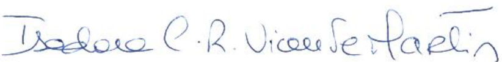  

Isadora CorreiaRibeiroVicenteMartins  

Vogal Executivo  

  

PauloAlexandreTimoteoDias  

Vogal Executivo  

# A - Atividade e Desempenho  

No presente capítulo, apresenta-se a atividade, o desempenho da subscrição, dos investimentos e de outras atividades da Santander Totta Seguros.  

# A.1 Atividade  

A Santander Totta Seguros foi constituída a 19 de março de 2001, e tem por objeto o exercício da atividade de seguro direto e de resseguro cedido, do Ramo Vida, para a qual tem a devida autorização da ASF. Em 2007, a Sociedade obteve autorização para operar no Ramo Não Vida – acidentes pessoais, tendo deixado de explorar este ramo a partir de 1 de janeiro de 2015. A Santander Totta Seguros encontra-se sediada na Rua da Mesquita, n.º 6 - Torre A - 2º andar, em Lisboa.  

Em 21 de dezembro de 2023, no contexto da reorganização das seguradoras do Grupo Santander sob uma única holding, com o objetivo de aumentar o valor oferecido aos clientes e colaboradores, conferindo maior visibilidade e reconhecimento da marca e reputação do negócio segurador no Santander, a Santander Totta Seguros foi vendida à Santander Insurance, S.L. pela Santander Totta S.G.P.S., S.A. O Capital Social da Santander Totta Seguros é detido na totalidade pela Santander Insurance, S.L., a qual é diretamente dominada pelo Banco Santander, S.A., que nela detém uma percentagem de $99,99\%$ .  

As ações representativas do Capital são todas da mesma espécie e categoria, conferindo iguais direitos aos respetivos titulares, incluindo o direito de voto e o de participação nos lucros. Não há, consequentemente, ações privilegiadas de nenhum tipo. Do mesmo modo, não existem restrições de qualquer natureza à transmissibilidade das ações, que é totalmente livre.  

A Santander Totta Seguros detém participações em outras 3 seguradoras: a Aegon Santander Vida e Aegon Santander Não Vida ambas detidas a $49.00\%$ e a Mapfre Santander, detida a $49.99\%$ .  

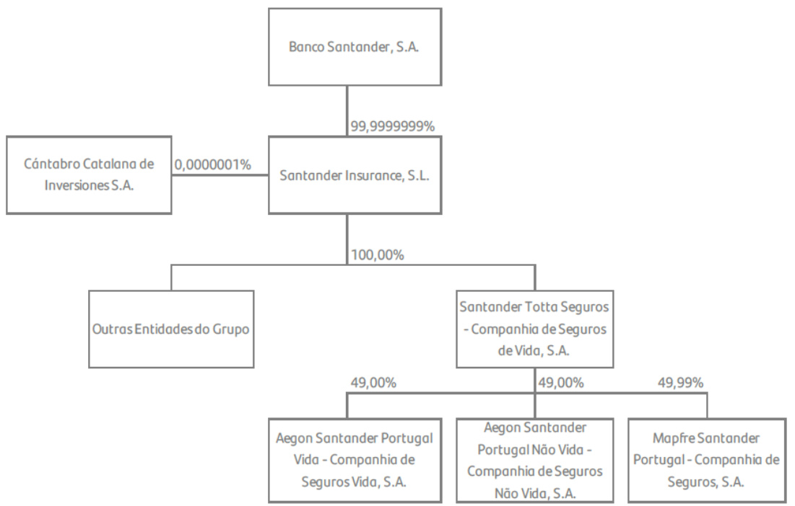  
Figura 1 – Estrutura de Participações Financeiras a 31 de dezembro de 2023  

A 19 de julho de 2012, foi celebrado um acordo de resseguro (“Sella”) com a Abbey Life Assurance, filial do Deutsche Bank. No âmbito do acordo, a Santander Totta Seguros cedeu $700\%$ do risco da carteira Vida em vigor a 30 de junho de 2012. O Sella produziu efeitos económicos a 1 de abril de 2012, não ocorrendo qualquer alteração da relação comercial com os clientes, nem nos produtos contratados. Associado a este Tratado de Resseguro, existe um acordo de retrocessão, por parte da Abbey Life, a $700\%$ com a Canada Life.  

No final de 2014, e no âmbito da parceria e aliança estratégica existente entre o Grupo Santander e a Aegon Spain Holding B.V., a Santander Totta Seguros recebeu autorização da ASF para a constituição de duas seguradoras: Aegon Santander Vida e Aegon Santander Não Vida. Neste contexto, no final de 2014 a Santander Totta Seguros vendeu $57\%$ de cada uma das seguradoras ao Grupo Aegon.  

A Aegon Santander Vida e a Aegon Santander Não Vida são Sociedades anónimas constituídas ambas a 16 de dezembro de 2014, tendo a primeira como objeto exclusivo o exercício da atividade de seguro direto e de resseguro do Ramo Vida e a segunda como objeto exclusivo o exercício da atividade de seguro direto e de resseguro do Ramo Não Vida. Ambas as empresas têm a sua sede social na Rua da Mesquita, n.º 6 - Torre $\mathsf{A}-2^{\mathsf{o}}$ andar, em Lisboa.  

A 1 de outubro de 2018, a Santander Totta Seguros incorporou por fusão a Eurovida, com efeitos económicos a 1 de janeiro de 2018, tendo, por conseguinte, assumido todos os direitos e obrigações da extinta Eurovida. Desta forma, a Santander Totta Seguros recebeu a atividade de gestão de Fundos de Pensões e passou a deter $700\%$ da Popular Seguros – Companhia de Seguros, S.A. sociedade anónima constituída em 30 de agosto de 2006 com o objeto exclusivo do exercício da atividade de seguro direto e de resseguro do Ramo Não Vida.  

No âmbito da parceria existente entre o Grupo Santander Totta e a Aegon Spain Holding B.V., e tendo presente a operação de aquisição e fusão da Eurovida na Santander Totta Seguros, procedeu-se durante o ano de 2018 à negociação da venda do ramo autónomo de negócio Vida Risco da Eurovida, à Aegon Santander Vida, e da venda do ramo autónomo de negócio de seguros do Ramo Não Vida da Popular Seguros (totalmente detida pela Santander Totta Seguros), à Aegon Santander Não Vida, conforme direito de preferência outorgado a estas entidades no acordo parassocial (Alliance and Shareholders Agreement) assinado com a Aegon Spain Holding B.V., em 2014.  

Assim, no dia 21 de dezembro de 2018, a Santander Totta Seguros assinou adendas aos contratos existentes. O closing (execução dos contratos) das operações ocorreu ainda durante o ano de 2019 com a migração das apólices vendidas da plataforma tecnológica da extinta Eurovida e Popular Seguros para a plataforma tecnológica da Aegon Santander Portugal Vida e não Vida, respetivamente.  

No dia 13 de outubro de 2020, o Conselho de Administração da ASF deliberou não se opor à aquisição, pela Mapfre Seguros Gerais, da participação qualificada direta correspondente a $50.07\%$ das ações representativas do capital social e dos direitos de voto da Popular Seguros – Companhia de Seguros S.A., e autorizou a transferência parcial de carteira correspondente à carteira de Risco Vida remanescente da extinta Eurovida.  

Assim, a 14 de outubro de 2020, decorrente da joint-venture criada entre a Seguradora Mapfre Seguros e o Grupo Santander, a Mapfre Seguros Gerais, S.A. passou a deter uma participação qualificada direta correspondente a $50.07\%$ das ações representativas do capital social e dos direitos de voto da Popular Seguros – Companhia de Seguros, S.A., mantendo a Santander Totta Seguros, a propriedade do capital social remanescente, i.e. de $49.99\%$ . Nesse mesmo dia foi aprovado em Assembleia Geral de Acionistas da Popular Seguros a alteração da denominação social da Popular Seguros - Companhia de Seguros, S.A, para Mapfre Santander Portugal – Companhia de Seguros, S.A. (“Mapfre Santander”). A Mapfre Santander tem a sua sede na Rua Doutor António Loureiro Borges $\mathsf{n}^{\mathsf{o}}$ 9-9ª 8 Edifício Zenith Arquiparque em Algés.  

Enquanto grupo segurador, a Santander Totta Seguros continua a desenvolver toda a gama de produtos de Risco Vida e não Vida, orientada a complementar a oferta de seguros do seu mediador Banco Santander Totta, através das suas 3 participadas e com parcerias com entidades estratégicas com expertise nestes negócios.  

A construção das parcerias anteriormente referidas e a opção pelo desenvolvimento dos negócios de Risco Vida e Não Vida através das suas participadas em conjunto com um parceiro estratégico de seguros, levaram à redefinição da estratégica individual da Santander Totta Seguros.  

Individualmente, a companhia concentra a sua atividade no desenvolvimento, alargamento e diversificação da sua oferta de produtos orientada à satisfação das necessidades de poupança a médio e longo prazo e da reforma, complementada com um conjunto de coberturas adicionais que aumentam o valor acrescentado e percebido da sua oferta, e de planeamento financeiros das famílias e empresas, dotando o seu mediador Banco Santander em Portugal de uma oferta universal e competitiva nesta gama de produtos.  

A Santander Totta Seguros mantém ainda uma carteira de Vida Risco que se encontra sem nova produção, dada a alteração do perímetro de atuação ocorrida em 31 de dezembro de 2014, após transferência para a Aegon Santander Vida, à luz da parceria com a Aegon, da carteira subscrita a partir de 1 de julho 2012 e do novo negócio de Vida Risco distribuído nas redes do Banco Santander Totta.  

Em 2023 a estratégia da Santander Totta Seguros, manteve-se focada em Seguros Financeiros, essencialmente nos contratos de investimento, quer em Unit-Linked de risco tomador, quer em seguros de capitalização garantidos, emitidos no último trimestre do ano aproveitando o novo contexto de taxas de juro. A atividade comercial do ano, contribuiu para o crescimento da quota de mercado, sustentada na produção no private banking durante todo o ano e, de forma mais concentrada no último trimestre do ano, no segmento de mass-market.  

A quota de mercado total de Seguros Financeiros atingiu, no fim de 2023, $70.8\%$ , versus $70\%$ no final de 2022, marcando o valor mais elevado dos últimos 10 anos, com a particularidade de se manter centrada nos Seguros Financeiros de Risco Tomador, família de produtos de maior valor acrescentado no longo prazo para os clientes, menos onerosos para a companhia em termos de custo de capital e onde detém uma quota de $77.3\%$ . Nos Seguros Financeiros Risco Companhia, a Santander Totta Seguros incrementou ligeiramente a sua quota para $4.7\%$ com a emissão dos produtos Santander Valor Duplo no último trimestre do ano. Outro dos fatores que contribuiu para o aumento da quota foi o menor impacto dos resgates de produtos PPR na Santander Totta Seguros, comparativamente ao mercado, na sequência do regime excecional previsto na Lei n.º 19/2022, de resgates sem penalização fiscal.  

No decurso do ano de 2023, foram desenvolvidas diversas ações e projetos, das quais se destacam as seguintes:  

Continuação do projeto de melhoria dos processos de qualidade dos dados; Revisão anual das Políticas de Solvência II tendo em consideração os Regulamentos (EU) 2021/1256, 2021/1257, Norma Regulamentar $\mathsf{n}^{0}4{-}2022{-}\mathsf{R}$ e Norma Regulamentar $\mathsf{n}^{\mathsf{o}}7$ - 2022-R; Desenvolvimento do processo de monitorização sistemática e periódica do cumprimento dos limites de Apetite por Risco, promovendo o alinhamento do plano estratégico de negócio com as dimensões de risco e Capital; Quantificação regular da posição de Solvência; Realização do exercício de Autoavaliação de Risco (ORSA); ? Continuação do projeto de melhoria dos controlos efetuados pela segunda linha de defesa.  

Relativamente ao contexto de natureza regulamentar e legal, o ano de 2023 revelou-se bastante exigente, mantendo a tendência de aumento da complexidade regulatória no setor segurador.  

A STS continuou focada no objetivo de assegurar o cumprimento dos requisitos referentes às Normas Regulamentares da ASF publicadas em 2022, destacando-se a norma referente ao Sistema de Governação $\mathsf{n}^{\mathsf{o}}$ 4-2022-R da ASF, bem como a Norma Regulamentar $\mathsf{n}^{\mathsf{o}}$ 7-2022-R da ASF relativa à Conduta de Mercado e Tratamento de Reclamações.  

Sem prejuízo de se tratar de regulamentação legal em vigor desde há vários anos, mantemos o destaque para a continuidade do cumprimento do Regulamento Geral de Proteção de Dados, bem como da normativa referente à Prevenção do Branqueamento de Capitais, e ainda da Diretiva de Distribuição de Seguros, esta última no plano do relacionamento com o Agente de Seguros da Santander Totta Seguros, uma vez que o cumprimento destas normativas é objeto de acompanhamento regular nos órgãos competentes da entidade.  

Para além destes temas, a STS concretizou o projeto de implementação atempada e adequada dos requisitos da norma de relato financeiro relativa a contratos de seguro (IFRS 17), que entrou em vigor a 1 de janeiro de 2023.  

Em termos conjunturais, mantemos o destaque para o cumprimento dos requisitos relativos ao reembolso (excecional) dos Planos de Poupança Reforma, à luz da Lei $\mathsf{n}^{\circ}\,79/2022$ , de 21 de outubro, que foi muito presente em 2023, e que se vai manter para 2024, com o respetivo valor aumentado.  

Referência deve ainda ser feita para a Norma Regulamentar n.º 9/2023-R de 3, de outubro, no âmbito da qual a ASF definiu as condições para registo prévio dos gestores no exercício funções reguladas, os quais devem ser “qualificados, idóneos, disponíveis e independentes”. As Normas Regulamentar n.º 4/2023-R e n.º 5/2023-R vieram atualizar as regras de “Prestação de informação para efeitos de supervisão à ASF”, concretizando os múltiplos reportes a efetuar.  

A Norma Regulamentar n.º 8/2023-R, de 28 de setembro, regulamentou o registo central de contratos de seguro de vida, contratos de seguro de acidentes pessoais e operações de capitalização com beneficiários em caso de morte do segurado ou do subscritor, a qual também tem aplicabilidade à STS.  

Destacamos, já no final do ano de 2023, o inquérito enviado pela ASF às empresas de seguros que exploram seguros do ramo Vida, designadamente seguros associados ao crédito à habitação e aos consumidores, para aferir o grau de cumprimento da Lei n.º 75/2021, de 18 de novembro (Lei do Esquecimento) e as práticas configuráveis como “boas práticas” nesta matéria, o qual terá seguramente impacto em 2024, exigindo um acompanhamento desta temática na STS.  

Prevê-se igualmente um impacto futuro significativo, no setor dos seguros financeiros, da regulamentação relativa à Diretiva Retail Investment Strategy (e futura MiFID III), a partir de final de 2024 e anos seguintes, apesar dos estudos iniciais terem sido despoletados já em 2023. Esta regulamentação irá ter reflexos no modelo de comercialização dos produtos financeiros do mediador/agente de seguros, impactando no momento prévio do desenho dos produtos de seguros financeiros.  

O Regulamento europeu relativo a Resiliência Operacional Digital – DORA -, terá impacto no plano da harmonização das regras mínimas que dizem respeito à segurança das redes e sistemas de informação.  

Cumpre ainda referir o contexto de regulação ESG no Setor Segurador, o qual terá igualmente impacto relevante, nomeadamente à luz do Regulamento (EU) 2019/2088 relativo à Sustainable Finance Disclosure Regulation (SFDR), bem como do Regulamento (EU) 2020/852, relativo à Taxonomia, e da Diretiva (EU) 2022/2464 - Corporate Sustainability Reporting Directive (CSRD).  

Os principais objetivos e estratégias estabelecidos, para o ano de 2024, são:  

Continuar o processo de reposicionamento da Santander Totta Seguros, conforme estabelecido no Plano Estratégico 2024 a 2026, como especialista de produtos de poupança a médio e longo prazo e de reforma, complementada com um conjunto de coberturas adicionais de forma a aumentar o valor acrescentado e percebido da sua oferta, estruturando para isso uma oferta de valor diversificada; Promoção de uma cultura de riscos dentro da companhia através da aplicação da Política de Gestão de Risco e Política de Apetite por Risco que permita uma gestão sã, prudente adequada dos mesmos e a permanente otimização do consumo de capital; Manutenção do um processo contínuo de monitorização, controlo e gestão dos riscos, através do cumprimento dos limites de exposição ao risco, de uma gestão prudente de carteiras de ativos e de um nível adequado de liquidez e solvência garantam a capacidade de cumprir e honrar com todas as suas responsabilidades, mesmo em cenários extremos, mas possíveis; Gestão e desenvolvimento de parcerias com outros operadores de seguros que permitam complementar a oferta de seguro Vida e Não Vida disponibilizados aos balcões do Banco Santander em Portugal; Otimização e automatização dos processos relativos à implementação da Norma de Relato Financeiro Internacional aplicável a contratos de seguros (IFRS 17); Desenvolvimento de uma cultura “digital” através da automatização e otimização de processos e maior eficiência de estruturas, mantendo o cliente como ponto focal das operações.  

# Classes de negócio  

A Santander Totta Seguros exerce a sua atividade em seguros do Ramo Vida, nas seguintes classes de negócio:  

Seguros de Vida Risco (seguros em caso de morte);  

Seguros de Capitalização (em que o Risco de investimento é da responsabilidade da Sociedade, nomeadamente Planos Poupança Reforma); Seguros ligados a fundos de investimento em que o Risco de investimento é do Tomador de Seguro (Unit-Linked e Planos Poupança Reforma); • Seguros Mistos; • Seguros de Rendas; • Fundos de Pensões.  

# A.2 Desempenho da Subscrição  

Os principais indicadores da Santander Totta Seguros em 2023 são os seguintes:  

Figura 2 – Principais indicadores de subscrição em 2023   

<html><body><table><tr><td rowspan="2">2023 10,8%(3,4 mil M∈) 2022 10,0%(3,4 mil M∈) QuotadeMercado (Volumessobgestao)</td><td colspan="2">2023-SegurosFinanceiros</td><td rowspan="2">2023 287mil 2022 306mil</td></tr><tr><td>RiscoTomador Risco Companhia</td><td>17,3% (2,9 mil M∈) 4,1%(0,7 mil ME) QuotadeMercado</td></tr><tr><td>2023 2022</td><td>495 mil 2023 533mil 2022 nr.Apolices</td><td>142,8ME(IFRS17) 148,2ME(IFRS17) CapitalProprio</td><td>nr.Clientes 2023 36,6M 2022 39,1M ComissoesdeIntermediacaoPagas</td></tr><tr><td>2023 214%</td><td>2023</td><td>3824M</td><td>2023 28,1ME(IFRS17)</td></tr><tr><td>2022 229% RaciodeSolvencia</td><td>2022</td><td>3600M Investimentos (Solvencia)</td><td>2022 22,4ME (IFRS17) ResultadoLiquido</td></tr></table></body></html>  

Na estratégia de negócios da Santander Totta Seguros manteve-se o foco em Seguros Financeiros, essencialmente em contratos de investimento (Unit-Linked), mantendo a quota de mercado neste segmento específico de seguros.  

A quota de mercado total de Seguros Financeiros atingiu, no fim de 2023, $70.8\%$ , vs $70\%$ no final de 2022, marcando o valor mais elevado dos últimos 10 anos, com a particularidade de se manter centrada nos Seguros Financeiros de Risco Tomador, família de produtos de maior valor acrescentado no longo prazo para os clientes, menos onerosos para a companhia em termos de custo de capital e onde detém uma quota de $77.3\%$ . Nos Seguros Financeiros Risco Companhia, a Santander Totta Seguros incrementou ligeiramente a sua quota para $4.7\%$ com a emissão dos produtos Santander Valor Duplo no último trimestre do ano. Outro dos fatores que contribuiu para o aumento da quota foi o menor impacto dos resgates de produtos PPR na Santander Totta Seguros, comparativamente ao mercado, na sequência do regime excecional previsto na Lei n.º 19/2022, de resgates sem penalização fiscal.  

Considerando a atividade de seguro direto, a Santander Totta Seguros termina o ano 2023 com um total de 287 mil clientes (contra 306 mil clientes em 2022) e 495 mil apólices em vigor (contra 533 mil apólices em 2022).  

A Santander Totta Seguros atingiu um Resultado Líquido de 28,1 milhões de euros de acordo com os requisitos da norma IFRS17, apresentando um aumento de $25.7\%$ face ao período homólogo.  

O total de comissões de seguros pagas ao mediador ligado referentes ao negócio vida, ascendeu a 36,6 milhões de euros em 2023 significando uma diminuição de $6.3\%$ relativamente ao ano anterior.  

O total de investimentos em Solvência aumentou para 3 824 milhões de euros, representando um aumento de $6\%$ face ao período homólogo, mantendo a Política de Investimentos, os critérios de dispersão, liquidez e segurança dos ativos. O valor de 2023 inclui 51,9 milhões de euros (valorizados pelos métodos de Solvência II) relativos às participações de $49.00\%$ na Aegon Santander Vida e Aegon Santander Não Vida e $49.99\%$ na Mapfre Santander.  

Em 2023 o Capital Próprio da Companhia totalizava 142,8 milhões de Euros, registando-se uma diminuição de 5,4 milhões de euros face a 2022, fundamentalmente explicada pelo efeito da maior diminuição da Reserva da componente financeira dos contratos de seguro relativamente ao aumento da Reserva de Reavaliação dos Ativos, líquida de impostos, no valor de -7,0 milhões de euros. A destacar ainda a distribuição de 26,3 milhões de euros de dividendos ao acionista durante 2023.  

O montante de Fundos Próprios elegíveis da Santander Totta Seguros ascendeu no final de 2023 a 163,4 milhões de euros.  

A Santander Totta Seguros apresenta um Rácio de Solvência de $274\%$ , verificando-se um decréscimo de 15 pontos percentuais face ao período homólogo.  

# Prémios emitidos e contribuições  

Tabela 1 – Volume de negócios Santander Totta Seguros   

<html><body><table><tr><td>(emmilharesdeeuros)</td><td>2023</td><td>2022</td><td>A</td></tr><tr><td>ContratosdeSeguros</td><td>243,4</td><td>209,9</td><td>+16,0%</td></tr><tr><td>SegurosdeVidaRisco</td><td>54,0</td><td>59,2</td><td>-8,7%</td></tr><tr><td>SegurosPoupanca(exclui PPR/E)</td><td>174,1</td><td>133,1</td><td>+30,8%</td></tr><tr><td>PPR/E</td><td>15,2</td><td>17,6</td><td>-13,5%</td></tr><tr><td>ContratosdeInvestimento</td><td>187,0</td><td>87,7</td><td>+113,3%</td></tr><tr><td>SegurosPoupanca(exclui PPR/E)</td><td>146,8</td><td>48,8</td><td>+201,1%</td></tr><tr><td>PPR/E</td><td>40,2</td><td>38,9</td><td>+3,3%</td></tr><tr><td>Total</td><td>430,4</td><td>297,5</td><td>+44,6%</td></tr></table></body></html>  

O segmento de Vida alcançou em 2023 o montante de 430 milhões de euros representando um crescimento de $44.6\%$ relativamente a 2022. Com a entrada da IFRS17 deu-se uma alteração na classificação de produtos da STS sendo que os produtos Financeiros com uma componente de risco, passaram, por esta não poder ser dissociada da componente financeira, a ser considerados como contratos de Seguros e não como contratos de investimento (esta alteração incrementou o montante de contratos de seguro em 126,7 milhões de euros).  

O volume de prémios da atividade de risco, em 2023, atingiu os 54,9 milhões de euros o que, representa uma diminuição de $8.7\%$ em relação a 2022, em linha com a redução observada em 2022 face a 2021. Esta redução está associada ao run-off normal das carteiras de Risco Vida.  

A emissão de produtos financeiros ao longo do ano alcançou o valor de 376,4 milhões de euros, um aumento de $57.9\%$ relativamente ao ano anterior, com o principal acréscimo a ser nos contratos de investimento.  

Nos produtos financeiros, a Santander Totta Seguros promoveu em estreita colaboração com o Mediador, o Banco Santander Totta, a continuação da diversificação da sua oferta, respondendo por um lado a um enquadramento de subida das taxas de juro, e por outro, à necessidade de dotar a Seguradora de uma oferta completa e universal para servir os diferentes segmentos de clientes do mediador, criando simultaneamente as bases de sustentabilidade para o crescimento futuro do negócio e focando-se na sua missão de ser o veículo privilegiado da poupança a médio e longo prazo e da reforma dentro do grupo Santander em Portugal.  

É cada vez mais visível a notável diversificação da carteira em várias classes de produtos e segmentos, iniciada pela alteração estratégica levada a cabo desde 2016 de diversificação da oferta com novas linhas de produtos. A sustentabilidade da carteira e permanência de recursos de clientes é hoje em dia um desafio para o qual a Companhia se encontra melhor posicionada face a esta realidade.  

Estas iniciativas em particular permitiram consolidar a posição dominante no mercado nacional com uma quota de mercado de carteira de produtos Unit-Linked de $77.3\%$ .  

Em simultâneo, continuou-se a desenvolver durante o ano de 2023 a oferta de Planos de Pensões, enquadrado na estratégia da Santander Totta Seguros de se especializar na poupança a médio e longo prazo e na reforma, e com o objetivo de dotar o seu mediador Banco Santander em Portugal de uma oferta universal e competitiva nesta gama de produtos.  

A estratégia seguida para o desenvolvimento deste negócio, está assente em 2 pilares distintos e complementares: por um lado as transferências de mercado, com especial foco para os fundos de pensões fechados de média e grande dimensão, que financiam sobretudo planos de benefício definido e, por outro lado, a constituição de novos planos de pensões de empresas, sobretudo planos de contribuição definida, totalmente desenhados à medida das necessidades de cada empresa,  para a qual existe uma oferta desenhada e em comercialização desde o final do ano 2020, vocacionada sobretudo para $\mathsf{P M E^{\prime}S^{2}}$ , através de 3 fundos de pensões abertos de comercialização conjunta, com perfis de investimento distintos, que permite, entre outras, uma gestão do investimento flexível e diferenciada, assente na estratégia de “ciclo-de-vida”, estipulação e ainda um modelo misto.  

Por forma a garantir o sucesso da estratégia seguida, apostou-se na formação das redes do Banco Santander Totta, através de uma abordagem prática e multisetorial e no aumento das funcionalidades do site institucional de pensões, disponível a todos os aderentes de planos e fundos de pensões sob gestão da Seguradora.  

A Santander Totta Seguros termina o ano 2023 com um crescimento efetivo nos principais indicadores do negócio de Fundos de Pensões, conforme quadro abaixo, culminando no aumento da sua quota de mercado em $+22,2\%$ .  

Em 2024 prevê-se manter a estratégia de oferta e crescimento de carteira de Seguros Financeiros e Fundos de Pensões utilizada em 2023, aproveitando o atual contexto de taxas de juro no mercado que já permitem oferecer valor, a prazo, ao cliente.  

# Custos com Sinistros  

Custos Com sinistros (CS) / Montantes Pagos (CI)   
Tabela 2 – Custos com Sinistros e montantes pagos   

<html><body><table><tr><td>(emmilharesdeeuros)</td><td>2023</td><td>2022</td><td>A</td></tr><tr><td>VidaRisco</td><td>10563</td><td>16034</td><td>-34,1%</td></tr><tr><td>Rendas</td><td>2515</td><td>2142</td><td>+17,4%</td></tr><tr><td>Capitalizacao</td><td>31010</td><td>18287</td><td>+69,6%</td></tr><tr><td>PlanosPoupancaReforma</td><td>131354</td><td>117729</td><td>+11,6%</td></tr><tr><td>UnitLinked</td><td>211507</td><td>304739</td><td>-30,6%</td></tr><tr><td>Total</td><td>386949</td><td>458932</td><td>-15,7%</td></tr></table></body></html>  

No último ano a Santander Totta Seguros apresentou um valor de custos com sinistros de 387 milhões de euros o que representa um decréscimo de cerca de $75.7\%$ , face ao período homólogo.  

Os Custos com Sinistros de Seguros de Vida Risco decresceram em 2023 para 10,6 milhões de euros (16 milhões de euros em 2022), representando um decréscimo igual a $34\%$ . A taxa de sinistralidade antes de resseguro dos contratos de vida risco foi de $79.8\%$ (decréscimo de 8,5 p.p. face a 2022).  

Nos seguros financeiros, em que o risco de investimento é suportado pela Sociedade, os montantes pagos ascendem a 164,9 milhões de euros e dizem respeito a resgates e vencimentos em Seguros de Capitalização, com cerca de 31 milhões de euros, em Planos Poupança Reforma, cerca de 131,3 milhões de euros, e a pagamentos de Rendas Vitalícias cerca de 2,5 milhões de euros.  

Em 2023, registaram-se ainda, relativamente aos produtos Unit-Linked, montantes pagos no valor de 211,5 milhões de euros (304,7 milhões de euros em 2022), verificando-se, assim, um decréscimo de $30.6\%$ face ao ano anterior, justificado pela redução do montante de vencimentos.  

# A.3 Desempenho dos Investimentos  

A atividade de Gestão de Investimentos é efetuada com base no princípio do Gestor Prudente que promove a obtenção de um nível de diversificação adequado, tanto ao nível dos emitentes como por setores de atividade e qualidade creditícia.  

A Política de Investimentos aplicada pela Santander Totta Seguros incorpora os desafios que atualmente se apresentam à atividade seguradora, nomeadamente:  

O ambiente de elevada volatilidade das taxas de juro com o ajustamento à subida expressiva dos níveis de inflação que, enquanto proporciona novas oportunidades de investimento com yields nominais positivos, não deixa de no curto prazo oferecer taxas reais negativas permitindo, no entanto, um alívio do nível de reinvestimento de produtos com taxa técnica elevada. Assegurar a manutenção de um adequado nível de risco continua a ser uma preocupação central; Necessidade de otimizar a estrutura de Capital, de acordo com o enquadramento existente no âmbito do Regime Solvência II.  

Em termos de dimensão, a carteira de investimentos total da Santander Totta Seguros (incluindo UnitLinked), ascendeu em 31 de dezembro de 2023 a 3 824 milhões de euros, o que representa um decréscimo de $6\%$ face ao ano anterior (3 600 milhões de euros), mantendo-se a Política de Investimentos os critérios de dispersão, liquidez e segurança dos Ativos.  

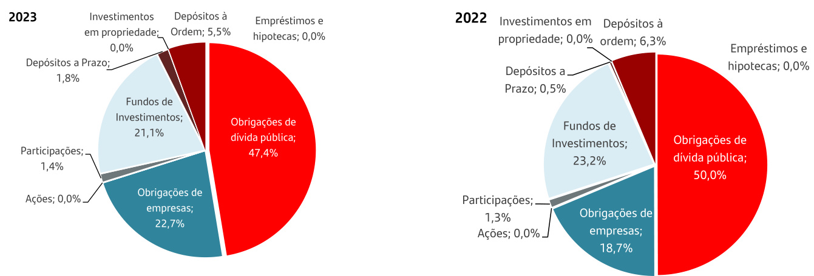  
A composição da carteira de investimentos total para a Santander Totta Seguros em 2023 e 2022 era:   
Figura 3 – Distribuição da carteira total de investimentos  

A carteira encontra-se maioritariamente exposta a obrigações de emissores de dívida pública, privada e fundos de investimento, cujos montantes ascendem a 1 812 milhões de euros, 869 milhões de euros e 806 milhões de euros respetivamente. O montante total das participações situa-se em 51,9 milhões de euros, representando $7.4\%$ do total de investimentos.  

O montante de Depósitos à Ordem reduziu-se cerca de 7 pontos percentuais face ao ano anterior, cujo montante a 31 dezembro de 2023 era de 211 210 milhares de euros (226 602 milhares de euros em  

2022). Durante o exercício de 2023, a Santander Totta Seguros manteve um nível satisfatório de liquidez para fazer face às suas necessidades financeiras no curto, médio e longo prazo.  

# Rendimentos e despesas dos investimentos por classes de Ativos  

Os rendimentos da Santander Totta Seguros provenientes das carteiras de investimentos em 31 de dezembro de 2023 e 2022 estão distribuídos de acordo com os quadros seguintes:  

2023   

<html><body><table><tr><td>(em mithares de euros)</td><td colspan="3">Rendimentos</td><td colspan="3">GanhosePerdas</td></tr><tr><td>Categoria Ativos</td><td>Dividendos</td><td>Juros Rendas</td><td>Total</td><td>Ganhos e perdas realizados</td><td>Ganhos e perdas nao realizados</td><td>Total</td></tr><tr><td>Ramo Vida</td><td></td><td></td><td></td><td></td><td></td><td></td></tr><tr><td>Obrigacoes de divida publica</td><td>0</td><td>36634</td><td>0 36634</td><td>(146 540)</td><td>176 118</td><td>29578</td></tr><tr><td>Obrigacoes de empresas</td><td>0</td><td>13 144</td><td>0 13144</td><td>(63 212)</td><td>93873</td><td>30662</td></tr><tr><td>Acoes</td><td>(3)</td><td>0</td><td>0 (3)</td><td>(0)</td><td>0</td><td>(0)</td></tr><tr><td>Investimentoscoletivos</td><td>2265</td><td>0</td><td>0 2265</td><td>(39 191)</td><td>137 113</td><td>97921</td></tr><tr><td>Caixa e depositos a prazo</td><td>0</td><td>2 919</td><td>0 2919</td><td>(335)</td><td>0</td><td>(335)</td></tr><tr><td>Emprestimos e hipotecas</td><td>0</td><td>167</td><td>0 167</td><td>(224)</td><td>101</td><td>(123)</td></tr><tr><td>Futuros</td><td>0</td><td>0</td><td>0 0</td><td>(1880)</td><td>0</td><td>(1880)</td></tr><tr><td>Call Options</td><td>0</td><td>0</td><td>0 0</td><td>0</td><td>0</td><td>0</td></tr><tr><td>Swaps</td><td>0</td><td>11335</td><td>0 11335</td><td>4617</td><td>0</td><td>4617</td></tr><tr><td>Put Options</td><td>0</td><td>0</td><td>0</td><td>(1811)</td><td>(560)</td><td>(2 372)</td></tr><tr><td>Total</td><td>2262</td><td>64199</td><td>0 66461</td><td>(248576)</td><td>406644</td><td>158068</td></tr><tr><td>Nao Afetos</td><td></td><td></td><td></td><td></td><td></td><td></td></tr><tr><td>Obrigacoes de divida publica</td><td>0</td><td>826</td><td>0 826</td><td>(6)</td><td>0</td><td>(6)</td></tr><tr><td>Obrigacoes de empresas</td><td>0</td><td>190</td><td>0 190</td><td>0</td><td>0</td><td>0</td></tr><tr><td>Acoes</td><td>15 928</td><td>0</td><td>0 15928</td><td>6994</td><td>6</td><td>7000</td></tr><tr><td>Investimentoscoletivos</td><td>10</td><td>0</td><td>0 10</td><td></td><td>32 37</td><td>69</td></tr><tr><td>Caixa e depositos a prazo</td><td>0</td><td>477</td><td>0</td><td></td><td>0</td><td>0</td></tr><tr><td>Emprestimos e hipotecas</td><td>0</td><td>81</td><td>477 81</td><td>0 (31)</td><td>27</td><td>(4)</td></tr><tr><td>Total</td><td>15938</td><td>1575</td><td>0 0 17 512</td><td>6985</td><td>70</td><td>7056</td></tr><tr><td></td><td></td><td></td><td></td><td></td><td></td><td></td></tr><tr><td>2022 (em milhares de euros)</td><td></td><td>Rendimentos</td><td></td><td></td><td>Ganhos e Perdas</td><td></td></tr><tr><td>Categoria Ativos</td><td>Dividendos</td><td>Juros Rendas</td><td>Total</td><td>Ganhos e perdas realizados</td><td>Ganhos e perdas nao realizados</td><td>Total</td></tr><tr><td>Ramo Vida</td><td></td><td></td><td></td><td></td><td></td><td></td></tr><tr><td>Obrigacoes de divida publica</td><td>0</td><td>36 901</td><td>0 36 901</td><td>(51 200)</td><td>(104 641)</td><td>(155 841)</td></tr><tr><td>Obrigacoes de empresas</td><td>0</td><td>9716</td><td>0 9716</td><td>(33 173)</td><td>(56 221)</td><td>(89 394)</td></tr><tr><td>Acoes</td><td>47</td><td>0</td><td>0 47</td><td>3</td><td>(127)</td><td>(124)</td></tr><tr><td>Investimentoscoletivos</td><td>1805</td><td>0</td><td>0 1805</td><td>(47 785)</td><td>(104110)</td><td>(151 895)</td></tr><tr><td>Caixa e depositos a prazo</td><td>0</td><td>213</td><td>0 213</td><td>1159</td><td>(849)</td><td>310</td></tr><tr><td>Emprestimose hipotecas</td><td>0</td><td>159</td><td>0 159</td><td>(209)</td><td>(112)</td><td>(321)</td></tr><tr><td>Futuros</td><td>0</td><td>0</td><td>0 0</td><td>(11 536)</td><td>0</td><td>(11536)</td></tr><tr><td>Call Options</td><td>0</td><td>0</td><td>0 0</td><td>297</td><td>19</td><td>317</td></tr><tr><td>Swaps</td><td>0</td><td>4507</td><td>0 4507</td><td>16 152</td><td>0</td><td>16152</td></tr><tr><td>Put Options</td><td>0</td><td>0</td><td>0 0</td><td>(108)</td><td>273</td><td>165</td></tr><tr><td>Total</td><td>1852</td><td>51 496</td><td>0 53349</td><td>(126 401)</td><td>(265 768)</td><td>(392 169)</td></tr><tr><td>Nao Afetos</td><td></td><td></td><td></td><td></td><td></td><td></td></tr><tr><td>Obrigacoes de divida publica</td><td>0 0</td><td>236</td><td>0 236</td><td></td><td>0</td><td>0 0</td></tr><tr><td>Obrigacoes de empresas</td><td></td><td>752</td><td>0 752</td><td>31</td><td>(0)</td><td>31</td></tr><tr><td>Acoes</td><td>11994</td><td>0</td><td>0 11994</td><td>0</td><td>(6)</td><td>(6)</td></tr><tr><td>Investimentoscoletivos</td><td>1</td><td>0</td><td>0 1</td><td>(271)</td><td>293</td><td>22</td></tr><tr><td>Caixa e depositos a prazo</td><td>0</td><td>4</td><td>0 4</td><td></td><td>0</td><td>0 0</td></tr><tr><td>Emprestimos e hipotecas</td><td>0</td><td>(81)</td><td>0 (81)</td><td></td><td>0</td><td>(31) (31)</td></tr><tr><td>Total</td><td>11995</td><td>911</td><td>0 12 907</td><td></td><td>(239)</td><td>256 17</td></tr></table></body></html>

Tabela 3 – Rendimento dos investimentos da Santander Totta Seguros por classe de Ativos  

Relativamente aos custos de gestão dos investimentos, que correspondem a comissões de gestão da carteira, custódia e operação de títulos, os valores são apresentados na tabela seguinte:   

<html><body><table><tr><td>(emmilhares deeuros)</td><td>2023</td><td>2022</td></tr><tr><td>CustosdeGestaodeinvestimentos</td><td>4218</td><td>5272</td></tr><tr><td>Tabela4-Custoscomg</td><td>gestao de investimento</td><td></td></tr></table></body></html>  

# A.4 Desempenho de Outras Atividades  

No âmbito do desempenho de Outras Atividades, a Santander Totta Seguros considera que não existem informações adicionais relevantes.  

# A.5 Informações Adicionais  

A atividade económica global, em 2023, foi dominada pelo contexto de inflação elevada e pela posterior normalização da política monetária.  

Em 2022, a inflação atingiu máximos de mais de 3 décadas (acima dos $70\%$ na zona euro e nos EUA), em resultado da combinação dos vários choques que afetaram a economia mundial, nomeadamente a pandemia e subsequentes respostas de política económica (estímulos monetários e orçamentais), posteriormente agravados pela guerra na Ucrânia, na sequência da invasão pela Federação Russa.  

Para combater os riscos inflacionistas, os principais bancos centrais executaram um processo de subida das taxas de juro de referência que consubstanciou um dos ciclos monetários mais pronunciados e rápidos desde o início dos anos 1980.  

Este substancial endurecimento da política monetária, combinados com os efeitos de base relacionados com a recuperação pós-pandémica e com a guerra ainda em curso, contribuiu para uma desaceleração da economia mundial, embora de forma diferenciada entre os principais blocos económicos.  

Observou-se, assim, uma dinâmica diferenciada entre economias avançadas e em desenvolvimento e, mesmo dentro das primeiras, o ciclo económico evoluiu de forma diferenciada, com a zona euro a ser mais afetada pelo contexto de guerra.  

Por outro lado, a atividade registou dinâmicas distintas nos dois semestres de 2023, com uma maior resiliência no decurso do primeiro semestre, beneficiando da evolução no setor dos serviços e, em particular, do turismo. A reabertura plena das economias, que ocorreu gradualmente ao longo de 2022, assim como a alteração dos padrões de consumo, em favor dos serviços, permitiu que estes retomassem a tendência pré-pandémica, assim sustentando a atividade económica global.  

No segundo semestre, já foram mais visíveis os efeitos do significativo endurecimento das condições monetárias entretanto implementado pelos bancos centrais. Esses efeitos foram, também, diferenciados, com maior impacto na zona euro.  

Esta evolução económica está materializada na atualização de janeiro de 2024 das estimativas do Fundo Monetário Internacional.  

Apesar de, em 2023 a economia mundial ter desacelerado face a 2022 (por dissipação de efeitos da recuperação pós-pandémica), o crescimento foi mais forte do que o antecipado, com a exceção da zona euro. A economia mundial terá, assim, crescido cerca de $3.7\%$ , abaixo da sua tendência de longo prazo, mas com uma revisão em alta de 0,1 p.p. face ao cenário de outubro de 2023, e que foi similar para as economias avançadas e para as economias em desenvolvimento. Contudo, e como referido, houve diferenças entre as economias desenvolvidas.  

Por outro lado, o processo de desinflação ocorreu mais rapidamente, com a inflação a desacelerar significativamente no segundo semestre de 2023, em reação à intervenção dos bancos centrais, assim como à correção dos preços da energia, embora permanecendo ainda acima do objetivo de $2\%$ definido pelos principais bancos centrais (EUA, zona euro e Reino Unido).  

Durante o quarto trimestre de 2023, a Santander Totta Seguros realizou o seu exercício de autoavaliação do risco e da Solvência $(^{\prime\prime}0\mathsf{R S A^{\prime\prime}})$ , tendo sido definidos cenários de esforço com maior impacto e menor probabilidade e que retratam os efeitos da atual conjuntura económica. Foram considerados dois cenários de esforço, duas análises de sensibilidade e dois reverse stress tests, dos quais se destacam um cenário com impacto mais significativo, nomeadamente a combinação do efeito combinado do alargamento das yields de títulos de dívida, redução do valor de mercado das sociedades participadas, aumento das taxas de resgate, redução de nova produção e incremento da inflação.  

# B - Sistema de Governação  

No presente capítulo, apresenta-se o sistema de Governação da Santander Totta Seguros.  

# B.1 Informações Gerais sobre o Sistema de Governação  

# B.1.1 Sistema de Governo da Santander Totta Seguro  

A Estrutura Organizacional está comprometida com altos padrões de Governance corporativo e está definida de modo a permitir prosseguir com a estratégia de risco e negócio adotada, tendo uma cadeia clara de responsabilização, com uma total independência na tomada de decisões da Gestão de Riscos.  

# Estrutura do Órgão de Direção, Administração ou Supervisão  

O objetivo do sistema de Governação da Santander Totta Seguros é garantir uma gestão sã e prudente da sua atividade assegurando a sua continuidade, sustentabilidade e o cumprimento dos objetivos estratégicos da Companhia.  

A cadeia de responsabilidades da Santander Totta Seguros e as funções das direções que a integram encontram-se definidas e materializadas através do estabelecimento da Estrutura Organizacional e dos estatutos orgânicos das direções, encontrando-se os mesmos disponíveis a todos os colaboradores.  

São Órgãos Sociais: a Assembleia Geral, o Conselho de Administração, o Conselho Fiscal, existindo ainda um Revisor Oficial de Contas ou uma Sociedade de Revisores Oficiais de Contas autónomo do Conselho Fiscal, em cumprimento do disposto no art. $^{\circ}3^{\circ}$ , $\mathsf{n}^{\mathsf{o}}\,\mathsf{\tau}_{\mathsf{n}}$ da Lei $\mathsf{n}^{\circ}\,748/207\,5$ , de 9 de setembro, com referência ao art.º 3º, al. h) do mesmo diploma e ao art. 278º, $\mathsf{n}^{\mathsf{o}}$ 1, al. a) do Código das Sociedades Comerciais.  

Compete à Assembleia Geral ou a uma comissão de vencimentos por aquela nomeada, fixar as remunerações dos membros dos órgãos sociais.  

A adoção de estruturas consultivas de apoio ao Conselho de Administração visa aumentar o compromisso da Sociedade no sentido do alinhamento com a lei e com as boas práticas internacionais. Nesta medida o Conselho de Administração é apoiado por uma estrutura de Comités, composta pelo Comité de Cumprimento e Conduta, Comité de Qualidade, Comité de Riscos, Comité de Controlo Interno, Comité de Investimentos e pelo Comité de Aprovação de Produtos, tal como representado no seguinte organograma.  

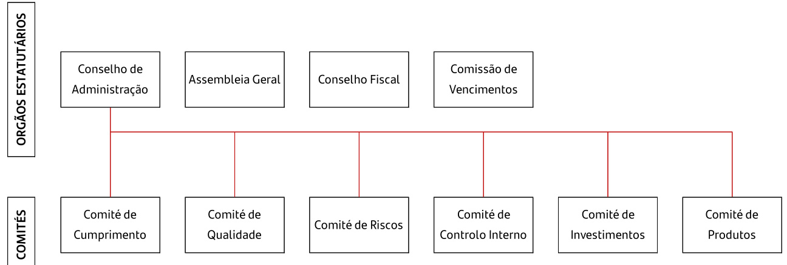  
Figura 4 – Estrutura de Governo da Santander Totta Seguros a 31 de dezembro 2023  

# Conselho de Administração  

Quanto à sua composição, o Conselho de Administração é composto de três a sete membros eleitos em Assembleia Geral, por um período de três anos e reelegíveis uma ou mais vezes, dos quais um ou mais poderão ser designados Vice-Presidentes e administradores-delegados e designarão entre si o Presidente.  

Em 2022 foram nomeados os membros do Conselho de Administração para o mandato de 2022 - 2024, sendo que em 31 de dezembro de 2023 o Conselho de Administração da Sociedade era composto pelo Presidente não executivo (Inês Oom Ferreira de Sousa3) e cinco vogais, sendo dois nãoexecutivos (Armindo Alberto Bordalo Escalda e Francisco del Cura Ayuso) e três executivos (Manuela Vieira Marinho, Isadora Correia Ribeiro Vicente Martins e Paulo Alexandre Timóteo Dias).  

O Conselho de Administração, enquanto Órgão de Governo, tem os mais amplos poderes de gestão e representação da Sociedade, competindo-lhe, sem prejuízo das demais atribuições que lhe conferem a lei, a responsabilidade de garantir que a Estrutura Organizacional permite o estabelecimento de mecanismos de governação adequados à dimensão, natureza e complexidade da sua atividade. Cabe assim ao Conselho de Administração:  

Definir, aprovar e rever a Estrutura Organizacional da Sociedade de forma a garantir o seu devido enquadramento no âmbito da implementação dos sistemas de Gestão de Riscos e de Controlo Interno, estabelecendo as cadeias de responsabilidades e de autoridade, os procedimentos de tomada de decisão apropriados e uma segregação adequada de deveres, tanto ao nível individual como entre funções; • Definir, aprovar e rever as políticas de recursos humanos e garantir a sua suficiência e adequabilidade; Selecionar os diretores de topo ou os responsáveis por funções-chave e assegurar que estes possuem, individual e coletivamente, competência, conhecimento, integridade, prudência e experiência adequados para o preenchimento da respetiva posição;  

• Definir as responsabilidades e deveres dos diretores de topo e dos responsáveis por funçõeschave; Definir e aprovar, sempre que conveniente, códigos de conduta;   
? Assegurar a existência de sistemas de informação e de canais de comunicação continuamente adequados à atividade e aos riscos da Sociedade; Assegurar que a adequação da estrutura da Sociedade à sua atividade é sujeita a revisões periódicas.  

Compete ainda ao Conselho de Administração, de acordo com o Contrato de Sociedade, e sem prejuízo das demais atribuições legais e estatutárias:  

Gerir todos os negócios sociais e efetivar todas as operações relativas ao objeto social observando as normas prudenciais, as diretrizes emanadas das entidades de Supervisão e as regras de conduta das empresas de seguros; Representar a Sociedade, em juízo e fora dele, propor e contestar quaisquer ações, transigir e desistir das mesmas e comprometer-se em arbitragens, podendo delegar estes poderes num só mandatário; Aprovar o orçamento e plano da empresa e apresentar à Assembleia Geral o relatório de gestão e as contas nos termos em que forem exigidos por lei; Adquirir, alienar e onerar ou locar quaisquer bens imóveis ou móveis, incluindo ações, quinhões, quotas, obrigações e quaisquer outros instrumentos de aplicação financeira; Deliberar que a Sociedade se associe com outras pessoas, nos termos do artigo quarto do Contrato de Sociedade; Designar quaisquer outras pessoas, individuais ou coletivas, para o exercício de cargos sociais noutras empresas ou para representar a Sociedade na celebração de determinados atos ou contratos.  

As reuniões do Conselho de Administração têm lugar, pelo menos, uma vez de três em três meses.  

A circunstância da Sociedade ser totalmente dominada pela Santander Insurance, S.L. e estar por essa via integrada no Grupo Santander, implica a necessária coerência das respetivas políticas corporativas, as quais por sua vez, atenta a natureza global do Grupo, respeitam as regulamentações internacionais na matéria.  

# Assembleia Geral  

A Mesa da Assembleia Geral é constituída por um Presidente e uma Secretária, eleitos por um mandato de três anos (2022 – 2024):  

António Maria Vieira de Castro Pinto Leite - Presidente;   
Cristina Isabel Cristovam Braz Vaz Serra - Secretário.  

A Assembleia Geral tem por principais competências, entre as legalmente definidas:  

Eleger os Órgãos Sociais;   
• Alterar o contrato de Sociedade;   
? Deliberar sobre o Relatório de Gestão, as contas do exercício e a distribuição de resultados, bem como proceder à avaliação da Política de Remuneração respeitante aos membros do órgão de administração e de fiscalização e da Política de Seleção e Avaliação da Adequação das pessoas que dirigem efetivamente a empresa, a fiscalizam, são responsáveis por funçõeschave ou exercem funções-chave em vigor na Sociedade e aprovação das que devam vigorar no exercício seguinte; Efetuar uma apreciação geral anual da Administração e do Conselho Fiscal.  

# Conselho Fiscal  

O Conselho Fiscal tem como principais competências, entre as que estão legalmente definidas, verificar a exatidão dos documentos de prestação de contas, verificar se as políticas contabilísticas e os critérios valorimétricos adotados pela Sociedade conduzem a uma correta avaliação do património e dos resultados, elaborar anualmente o relatório sobre a sua ação fiscalizadora e dar parecer sobre o relatório e contas e propostas apresentadas pela Administração.  

O Conselho Fiscal é composto por três membros, eleitos trianualmente. A suportar este Órgão na fiscalização da Sociedade, está a Sociedade de Revisores Oficiais de Contas igualmente eleita em Assembleia Geral trianualmente.  

Em 2021 foram nomeados os membros do Conselho Fiscal para o mandato de 2021- 2023, sendo que em 31 de dezembro de 2023 este era composto por um Presidente (Afonso Pereira Barbosa) e dois vogais efetivos (Jorge Filipe Alves Gaspar e José António Nogueira Veloso). Em 2022, foi eleito o suplente do Conselho Fiscal (José Duarte Assunção Dias) para o mandato em curso 2021-2023.  

# Comissão de Vencimentos  

Compete à Comissão de Vencimentos deliberar sobre as remunerações dos membros dos órgãos de administração e de fiscalização.  

O mandato dos membros da Comissão de Vencimentos coincide com o mandato do Conselho de Administração (2022 – 2024), tendo a seguinte composição:  

Manuel António Amaral Franco Preto – Presidente;   
Sara Eusébio da Fonseca 4– Vogal;   
Natália Maria Castanheira Cardoso Ribeiro Ramos – Vogal.  

# Comités  

A Santander Totta Seguros possui políticas, processos e procedimentos adequados à sua estratégia de negócio e às suas operações, garantindo uma gestão sã e prudente da sua atividade. Destacam-se múltiplos Comités de base interdisciplinar que fazem o seguimento e controlo de toda a atividade da Companhia.  

Apresentam-se em seguida as competências e poderes de cada um dos Comités presentes na Estrutura de Governo da Sociedade.  

Comité de Cumprimento e Conduta: procede ao seguimento de qualquer assunto que respeite ao cumprimento, pela Sociedade, de quaisquer normativos a que esteja sujeita, bem como de códigos de conduta a que esteja vinculada;   
Comité de Qualidade: com foco na análise dos diversos indicadores de Controlo Interno de Qualidade das principais áreas da Sociedade. Identifica pontos de melhoria, dinamizando eventuais projetos de melhoria de qualidade, promovendo o seu seguimento, acompanhando, ainda, todos os temas relacionados com a gestão das reclamações;   
Comité de Riscos: procede ao seguimento e fiscalização das Políticas de Gestão de Riscos cumprindo-lhe, no exercício das suas competências, atuar em conformidade com as leis e regulamentos aplicáveis e com as regras, princípios e objetivos fixados pelo Conselho de Administração;   
Comité de Controlo Interno: monitoriza o cumprimento do normativo interno e externo. Identifica falhas no Modelo de Controlo Interno e propõe ações corretivas promovendo um ambiente de controlo e cumprimento, acompanhando a implementação das recomendações da Auditoria;   
Comité de Investimentos: monitoriza a gestão das carteiras de investimento, em função da estratégia de alocação de ativos definida, limites e Política de Investimentos. Promove a otimização da gestão financeira e da rendibilidade dos capitais próprios;   
Comité de Produtos: aprova produtos, verificando a adequação das orientações corporativas do Grupo Santander e assegurando que os produtos aprovados cumprem integralmente as exigências legais e regulatórias aplicáveis e reúnem todas as condições para poderem ser adequadamente tratados, em todos os aspetos que envolvam as diversas fases relevantes: pré-comercialização, aprovação, comercialização e seguimento.  

Todas as recomendações tomadas em Comités, no âmbito das atividades previstas, são registadas em atas. O Presidente dos Comités envia, sempre que solicitado pelo Conselho de Administração, as informações que recaem sob as suas responsabilidades.  

O Conselho de Administração poderá criar Comités na organização interna da Sociedade, compostos ou não exclusivamente por Administradores. Poderão ser criados Comités ao nível do Conselho de  

Administração, determinados por imposição legal ou por aprovação expressa do Conselho de Administração.  

A Santander Totta Seguros adotou o Código Geral de Conduta e o Código de Conduta na Relação com os seus Clientes do Grupo Santander, que fixa os princípios éticos e procedimentos que presidem à atuação das pessoas sujeitas e privilegiam a prevenção e resolução de conflitos de interesses.  

# Funções-Chave  

Como entidade sujeita ao abrigo do Regime de Solvência II, a companhia apresenta na sua estrutura as quatro Funções-Chave, nomeadamente: Gestão de Risco, Verificação do Cumprimento, Auditoria Interna e Atuarial com uma clara atribuição de responsabilidades e tarefas, cujas responsabilidades se encontram adiante definidas.  

# Atuário Responsável  

O Atuário Responsável tem a responsabilidade pela certificação, através da emissão de opinião de índole atuarial e independente face a funções operacionais (em especial, à Função Atuarial), da adequação às disposições legais, regulamentares e técnicas aplicáveis do cálculo das Provisões Técnicas, dos montantes Recuperáveis de contratos de Resseguro e de entidades com objeto específico de titularização de riscos de seguros e das componentes do Requisito de Capital de Solvência relacionadas com esses itens.  

O Atuário Responsável reporta diretamente ao Conselho de Administração através do relatório de certificação, que deve incluir recomendações de melhoria no âmbito das Provisões Técnicas e, sempre que sejam detetadas situações de incumprimento, propor e monitorizar a implementação de medidas.  

O Atuário Responsável da Santander Totta Seguros, é o Dr. Julien Charles-Marie Vergues, em substituição do Dr. Júlio Henrique Botelho Teixeira de Melo Koch, da empresa Willis Towers Watson, certificado pela ASF, ao abrigo do artigo $77^{\circ}\,{\mathsf{n}}.^{\circ}\,{5}$ da Lei $\mathsf{n}^{\circ}\,^{747}/207\,^{5}$ , de 9 de setembro.  

# Revisor Oficial de Contas  

O Revisor Oficial de Contas permite assegurar a total transparência e fiabilidade da informação contabilística e do seu controlo financeiro interno. Cabe-lhe a responsabilidade de conferir se todas as contas estão em conformidade com o estipulado pelas normas técnicas aprovadas ou reconhecidas pela Ordem dos Revisores de Contas (OROC), emitindo após a revisão ou auditoria de contas uma certificação legal das mesmas, documentando a sua opinião sobre a situação financeira, os resultados das operações e os fluxos de caixa da Santander Totta Seguros.  

A Sociedade de Revisores Oficiais de Contas da Santander Totta Seguros é a PricewaterhouseCoopers & Associados – Sociedade de Revisores Oficiais de Contas, Lda., representada por Fernando Manuel Miguel Henriques (eleito para o mandato 2021-2023).  

No Regime de Solvência II, o Revisor Oficial de Contas emite opinião sobre o Relatório de Solvência e Situação Financeira e sobre a informação quantitativa de acordo com o definido na Norma Regulamentar $\mathsf{n}^{\circ}\,2/20\,7\,7\!-\!\mathsf{R},$ de 24 de março da ASF.  

# Estrutura Organizacional  

Os Diretores de Topo são responsáveis por assegurar o cumprimento das estratégias, políticas, objetivos e orientações definidas pelo Conselho de Administração em cada um dos Departamentos. Na sua gestão regular, a estrutura da Sociedade integra ainda os seguintes cinco departamentos:  

Departamento Financeiro;   
Departamento de Negócio e Operações;   
Departamento de Resseguro, de Solvência e Capital;   
Departamento de Controlo Gestão, Gestão Riscos, Atuarial e Controlo Interno;   
Departamento de Cumprimento e Conduta.  

# Modelo das três linhas de defesa  

O modelo de funcionamento da gestão e controlo dos riscos da Santander Totta Seguros tem como base a adequada articulação entre os diversos intervenientes que de algum modo se relacionam com a identificação e gestão do risco. Neste sentido, a gestão e controlo dos riscos dentro da Santander Totta Seguros assenta no modelo das 3 linhas de defesa que desenvolvem três funções distintas:  

Gestão de Riscos desde a sua criação;   
Controlo e consolidação dos riscos, supervisionando a sua gestão;   
Revisão independente da atividade de riscos.  

As três linhas de defesa da Sociedade têm um adequado nível de segregação e independência para não comprometer a eficácia do esquema geral. Sem prejuízo desta independência, as três linhas de defesa atuam de forma conjunta para maximizar a sua eficiência e potenciar a sua efetividade.  

# Primeira Linha de Defesa: Gestão do Risco  

A primeira linha de defesa é constituída pelas Unidades de Negócio e de suporte ou atividades que geram a exposição ao risco. A criação de risco na primeira linha de defesa deve ser ajustada aos limites e ao Apetite por Risco definidos. Para cumprir com a função, a primeira linha de defesa deve dispor dos meios necessários para identificar, avaliar, gerir e reportar os riscos assumidos.  

A responsabilidade da primeira linha de defesa está estruturada em quatro áreas de ação:  

Identificação de todos os riscos que podem ter um impacto material, a avaliação recorrente dos riscos existentes, a disponibilidade de informação sobre os riscos e os respetivos eventos de perdas;   
Implementação de mecanismos de monitorização e controlo dos riscos, mantendo o Perfil de Risco dentro dos níveis estabelecidos pelo Apetite por Risco e restantes limites, adotando medidas corretivas e de mitigação em conformidade com os objetivos definidos;   
Envolvimento de todos os colaboradores na gestão do risco de acordo com a cultura, os objetivos, os papéis e responsabilidades de cada um. Deste modo, devem conhecer as suas responsabilidades enquadradas na gestão dos riscos, recebendo a formação necessária, incorporando objetivos relacionados com a gestão de risco, nos processos de avaliação do desempenho;   
Adequação do perfil e dos modelos de gestão de risco às necessidades e oportunidades decorrentes da evolução do ambiente em que se desenvolvem os negócios e atividades da Sociedade, propondo a adequação e desenvolvimento de novas políticas de risco.  

# Segunda Linha de Defesa: Controlo e Supervisão de riscos  

A segunda linha de defesa é a última responsável pela identificação, avaliação e reporte dos riscos assumidos de forma independente do negócio, sem prejuízo da necessidade da primeira linha para a sua correta gestão. Nesta integram equipas especializadas no controlo e na supervisão da gestão dos riscos, zelando por um controlo dos mesmos de acordo com o nível de Apetite por Risco definido pelo Conselho de Administração.  

A responsabilidade da segunda linha de defesa é estruturada em torno de quatro áreas de ação:  

Controlar a implementação dos modelos de Gestão de Riscos, o cumprimento das políticas e dos limites estabelecidos. Tem como objetivo assegurar que a Santander Totta Seguros não está exposta a perdas que podem ameaçar a sua Solvência. Neste sentido, é realizada uma revisão sistemática da exposição aos diferentes riscos, assegurando que os níveis de risco assumidos cumprem com os objetivos e limites previamente fixados; Supervisionar a gestão dos riscos assumidos, emitindo opinião sobre os mesmos e questionando, sempre que oportuno, a abordagem da primeira linha de defesa. Na sua função de supervisão é essencial assegurar que a segunda linha de defesa coloca à disposição do Conselho de Administração e dos responsáveis de cada um dos Departamentos da Sociedade, os elementos necessários para o entendimento dos perfis de risco e da rentabilidade dos diferentes negócios e atividades; Facilitar a visão consolidada dos riscos para todos os Departamentos da Sociedade apoiandoas no controlo de risco e na análise do Perfil de Risco em diferentes níveis de agregação, e na  

realização de avaliação crítica dos mesmos, identificando possíveis cenários adversos ou riscos emergentes não classificados anteriormente;   
Desenvolver propostas sobre a natureza e níveis de tolerância ao risco, recomendando a introdução de limites e sugerindo as políticas e procedimentos adequados para a gestão dos mesmos.  

A Função de Gestão de Risco é uma função chave que integra a segunda linha de Defesa, colaborando estritamente com a Função Atuarial e a Função de Verificação do Cumprimento.  

A Função de Gestão de Risco é exercida pelo responsável de Riscos do Banco Santander Totta, que no quadro corporativo exerce igualmente a função na Santander Totta SGPS e tem como principais objetivos:  

Contribuição para a efetiva implementação e adoção da Política e Cultura de Gestão do Risco e da Estratégia de Gestão de Risco do Grupo;   
Identificação dos principais riscos atuais, emergentes e previstos a que o Grupo, está, ou pode vir a estar exposto, bem como das causas e efeitos que lhes estão associados;   
Realização do exercício ORSA, de reuniões de trabalho sobre os processos do Grupo ou de análises qualitativas e quantitativas acerca de eventos de risco efetivos ou potenciais; Monitorização contínua do Sistema de Gestão de Riscos, da Estratégia de Gestão de Risco, proporcionando ao Órgão de Administração e aos diretores de topo informação relevante para os diferentes processos de tomada de decisão;   
Monitorizar o Perfil de Risco para assegurar que este se mantém dentro do Apetite por Risco definido e aprovado, dando seguimento a qualquer violação do Apetite por Risco.  

O exercício da Função de Verificação do Cumprimento está fundamentalmente estruturado na Área de Cumprimento e Conduta, organicamente integrada no Banco Santander Totta, que no quadro corporativo exerce transversalmente a função nas entidades do Grupo Santander em Portugal direta ou indiretamente dependentes da Santander Totta SGPS. Esta função encontra-se referida mais em detalhe no capítulo B.5., tendo como responsável de apoio à função, o Departamento de Cumprimento e Conduta da Sociedade.  

A Função Atuarial desempenha igualmente um papel relevante, na forma como o Sistema de Gestão de Riscos é integrado nos processos de tomada de decisão do Grupo e encontra-se integrada no Departamento de Controlo de Gestão, Gestão de Riscos, Atuarial e Controlo Interno da Santander Totta Seguros. Esta função encontra-se referida mais em detalhe no capítulo B.7.  

# Terceira Linha de Defesa: Auditoria Interna  

A Auditoria Interna, na sua função de último nível de controlo, avalia regularmente que as políticas, os métodos e os procedimentos são adequados e comprova que estão efetivamente implementados na gestão. Esta função encontra-se referida mais em detalhe no capítulo B.6.  

Não ocorreram alterações materiais no Sistema de Governação anteriormente apresentado.  

# Política e Práticas de Remuneração  

A Política de Remunerações dos membros dos Órgãos de Administração e de Fiscalização da Santander Totta Seguros em vigor no exercício de 2023 foi proposta pela Comissão de Vencimentos e aprovada pela Assembleia Geral de 21 de julho de 2023.  

Na presente política encontra-se contemplada a atribuição de remuneração com a componente fixa a todos os seus colaboradores e a componente variável a determinadas funções do Grupo. A remuneração fixa é a principal componente de cada função e é o meio que garante a estabilidade remuneratória a cada colaborador. A remuneração variável é uma componente que visa premiar o cumprimento de objetivos do Grupo.  

A Política de Remunerações das Funções-Chave da Santander Totta Seguros em vigor no exercício de 2023 foi aprovada no Conselho de Administração de 12 de julho de 2023, e enquadra-se na política do Grupo Santander. Não existe qualquer componente de remuneração dos colaboradores associada às vendas da Santander Totta Seguros.  

Esta política aplica-se aos seguintes dirigentes da Santander Totta Seguros:  

Responsáveis por Funções-Chave; Outros colaboradores, que venham a ser identificados como tal pela Santander Totta Seguros, cuja remuneração total os coloque no mesmo escalão de remuneração que o previsto para as categorias referidas nas alíneas antecedentes, desde que as respetivas atividades profissionais tenham um impacto material no Perfil de Risco do Grupo.  

Anualmente é submetida pela Comissão de Vencimentos uma declaração sobre a Política de Remuneração dos membros do Conselho de Administração e do Conselho Fiscal da Sociedade à apreciação e aprovação da Assembleia Geral.  

# B.2 Requisito de Qualificação e de Idoneidade  

A Santander Totta Seguros reconhece o papel determinante dos titulares de funções essenciais para a geração de valor para a Companhia, os seus clientes e demais contrapartes, bem como dos seus colaboradores.  

Neste sentido e em conformidade com a Lei 147/2015 de 9 de setembro (Regime Jurídico de Acesso e Exercício da Atividade Seguradora e Resseguradora), complementado pela Norma Regulamentar $\mathsf{n}^{\mathsf{o}}$  

4/2022-R, da ASF, foi aprovada a Política Interna de Seleção e Avaliação. De acordo com os requisitos legais, a política define:  

Os responsáveis na empresa pela avaliação da adequação; Os procedimentos de avaliação adotados;   
· Os requisitos de adequação exigidos;   
• Regras sobre prevenção, comunicação e sanação de conflitos de interesses; Meios de formação profissional disponibilizados.  

A referida Política estabelece um conjunto de princípios base de gestão de risco e de boa governação, e como tal extensíveis a toda a Sociedade, tendo por objetivo o estabelecimento dos procedimentos de seleção e avaliação da idoneidade, qualificação profissional, independência, disponibilidade e capacidade nos termos previstos nos artigos $67^{\circ}$ a $70^{\circ}$ da Lei 147/2015, de 9 de setembro, dos membros dos órgãos de Administração e Fiscalização, dos responsáveis das funções-chave, dos Diretores de Topo e de outros elementos relevantes do pessoal não sujeitos aos requisitos previstos no artigo $42^{\circ}$ da Diretiva Solvência II, tal como estes são definidos na legislação aplicável e tendo em consideração a Política da mesma natureza aplicada no Grupo Santander.  

Os requisitos de adequação e os procedimentos de seleção e avaliação estabelecidos na Política serão aplicados sem prejuízo de quaisquer outras normas substantivas ou procedimentais de carácter legal, estatutário, de governo societário ou convencional que regulem a capacidade, as obrigações e os requisitos das pessoas afetadas pela Política para serem nomeadas e permanecerem nos cargos respetivos.  

A Política procura valorizar, em complemento aos requisitos estabelecidos na lei, o processo de seleção e avaliação, regras sobre prevenção, comunicação e sanação de conflitos de interesses, meios de formação profissional disponibilizados e a demonstração de elevados princípios éticos e de acordo com os padrões exigidos.  

A Santander Totta Seguros desenvolve, implementa e mantém mecanismos que permitem a monitorização do cumprimento dos requisitos em questão por parte das pessoas que desempenham os cargos ou as funções. Esta monitorização é efetuada de forma contínua e no decurso da atividade da Sociedade podendo ser complementada por avaliações periódicas e/ou extraordinárias.  

Não obstante a existência dos mecanismos acima mencionados, é responsabilidade de quem exerce cargos e funções sujeitos a avaliação, comunicar de forma imediata à Área de Pessoas e Cultura a ocorrência de qualquer facto ou circunstância que possa afetar a avaliação da sua adequação para o exercício do cargo ou função, nos termos em que estes requisitos se configuram na Política e na legislação aplicável.  

A Sociedade cumpre os requisitos e normativos legais no que respeita ao registo junto da ASF de cargos e funções sujeitos à avaliação, recolhendo a informação e emitindo a documentação necessária ao processo.  

# B.3 Sistemas de Gestão de Risco com Inclusão de Autoavaliação do Risco e da Solvência  

O modelo de Gestão de Riscos contém as regras básicas aplicáveis à gestão e ao controlo dos riscos que afetam a atividade seguradora. O presente documento é aplicável a toda a atividade seguradora realizada pela Sociedade.  

# Monitorização e Reporte  

A Gestão de Risco tem na monitorização e reporte um dos seus pilares fundamentais. A monitorização e controlo devem ser realizados pelas unidades no âmbito da sua atividade e de forma independente pela Função de Gestão de Risco. A monitorização e controlo é um processo regular que envolve diferentes instrumentos criados pela Santander Totta Seguros para apoiar a Gestão de Risco (p.ex. limites, políticas, cálculos de Capital atual e prospetivo, Stress Tests, Back Testing, acompanhamento das medidas e ações de mitigação, entre outros).  

O processo de monitorização e controlo é apoiado por um processo de reporte de informação adequado, atempado e consistente que permita apoiar o processo de tomada de decisão quer ao nível interno como externo.  

Os principais instrumentos para a realização do processo de Gestão de Riscos são o Perfil de Risco e o Apetite por Risco, através dos quais se determina a quantidade e o tipo de riscos que o Conselho de Administração julga razoável assumir na execução da sua estratégia de negócios. Ambos os instrumentos são descritos pela Santander Totta Seguros na Política de Apetite por Risco.  

# B.3.1. Autoavaliação do Risco e da Solvência  

# Descrição do Processo  

O Processo de Autoavaliação do Risco e da Solvência, doravante designado ORSA, tem como principal objetivo efetuar a autoavaliação dos riscos e das necessidades de capital da Sociedade. Neste sentido, foi realizado o exercício do ORSA da Santander Totta Seguros, durante o quarto trimestre de 2023, com data de referência a 30 de setembro de 2023, de modo a avaliar as suas necessidades globais de solvência para o cenário base e respetivos cenários de stress, considerando o horizonte de temporal de 2024 a 2026.  

O processo ORSA encontra-se formalizado na Política interna do ORSA da Santander Totta Seguros. O Processo é constituído por quatro fases distintas, que no seu conjunto visam assegurar a adequação e concretização atempada do processo e o seu reporte ao supervisor:  

  

# Recolha de Inputs  

A primeira fase do processo do ORSA inicia-se com um exercício de Autoavaliação interna da Santander Totta Seguros tendo como objetivo a identificação dos principais eventos de risco a que a mesma se encontra exposta. De seguida, procede-se à análise da metodologia de cálculo do Requisito de Capital de Solvência no ano atual e prospetivo, baseado no Orçamento Plurianual.  

O processo é iniciado através da preparação e recolha dos inputs necessários para a realização do exercício do ORSA, sendo um dos principais inputs deste exercício o Risk Register. Este exercício consiste em mapear, junto de todos Departamentos da Santander Totta Seguros, os principais riscos e definir cenários que cubram uma análise de impacto dos fatores de risco identificados de acordo com a distribuição da carteira à data.  

# Exercício ORSA  

A segunda fase do processo do ORSA contempla a realização do próprio exercício de quantificação prospetiva de risco e capital, assim como a definição e aplicação de stress tests em cada exercício. Adicionalmente, é realizada uma análise dos níveis de risco e capital de acordo com os limites de Apetite por Risco.  

As fases inerentes ao Exercício do ORSA são realizadas de acordo com as seguintes atividades:  

Projeção do risco e Capital;   
Definição e validação dos stress tests;   
Aplicação dos stress tests;   
Análise do cumprimento dos limites de Apetite por Risco.  

# Outputs do ORSA  

A terceira fase do processo ORSA corresponde à obtenção dos outputs do processo que permitem concluir acerca do alinhamento entre a estratégia de negócio do Grupo refletida nos seus Orçamentos e a Estratégia de risco, nomeadamente ao nível do Rácio de Solvência, tendo em conta requisitos regulamentares e objetivos internos.  

De entre os principais outputs, destacam-se:  

? Níveis de Capital, Risco e Posição de Solvência atuais e projetados; Impacto dos stress tests; Avaliação dos desvios entre o Perfil de Risco e os pressupostos subjacentes ao cálculo do Requisito de Capital de Solvência; Avaliação da adequação de capital e risco;   
· Avaliação do cumprimento contínuo dos requisitos relativos às Provisões Técnicas; Avaliação da necessidade de definição de medidas de acompanhamento.  

# Reporte do ORSA  

O Reporte do ORSA é realizado através do Relatório do ORSA submetido ao Regulador com uma periocidade mínima anual e no período de duas semanas após a conclusão do mesmo que ocorre com a aprovação pelo Conselho de Administração.  

De acordo com o disposto a nível regulamentar é exigido que o Grupo Segurador e a Santander Totta Seguros estejam preparados para realizar um processo do ORSA não regular caso determinados triggers, relacionados com mudança no Perfil de Risco, presentes na política o despoletem.  

# B.4 Sistema de Controlo Interno  

O Sistema de Controlo Interno da Santander Totta Seguros tem como principal objetivo a promoção de uma cultura orientada para o Controlo Interno, a identificação de oportunidades de melhoria que contribuam para a redução do risco e a promoção da qualidade e eficiência das práticas existentes.  

A Santander Totta Seguros definiu a metodologia do Modelo de Controlo Interno nos termos indicados no Procedimento de Avaliação de Controlo Interno do Banco Santander Totta. Este procedimento regula o processo de avaliação do Modelo de Controlo Interno através da identificação e certificação de processos chave e controlos associados.  

Nos pontos seguintes são apresentados os principais processos que fazem parte do sistema de controlo interno, nomeadamente a identificação e gestão do risco operacional, incluindo o respetivo processo de registo de perdas e plano de continuidade de negócio.  

# Identificação e Gestão do Risco Operacional  

O risco operacional consiste no risco de incorrer em perdas como consequência de deficiências ou falhas de processos internos, recursos humanos ou sistemas ou derivado de eventos externos. Inclui eventos que podem surgir devido ao risco legal ou regulatório, ao risco de modelo e ao risco de crime financeiro e conduta e pode ser classificado nas seguintes categorias:  

Fraude Interna: atos que, de forma intencional pretendem defraudar, apropriar-se indevidamente de ativos propriedade da Sociedade ou ultrapassar os seus regulamentos e/ou normas; Fraude Externa: Atos cometidos por pessoas alheias à Sociedade, com intenção de defraudarem e apropriarem-se indevidamente de ativos de sua propriedade e desrespeitar as leis; Práticas de Emprego, Saúde e Segurança no Trabalho: Atos inconsistentes com as leis ou acordos de segurança e saúde no trabalho, dos quais resultem reclamações por danos pessoais ou reclamações relacionadas com a discriminação ou falta de diversidade laboral; Práticas com Clientes, Produtos e de Negócio: Falhas não intencionais ou negligentes que impedem a satisfação de uma obrigação profissional para com os Clientes ou que decorrem de situações inerentes à própria natureza ou desenho dos produtos; Danos em Ativos Físicos: Perdas ou danos em ativos físicos, devido a desastres naturais ou outros eventos;   
? Interrupção do Negócio e Falhas nos Sistemas: São todas as interrupções ou danos devidos a motivos tecnológicos e falhas nos sistemas; Execução, Entrega e Gestão dos Processos: Falhas no processamento das transações ou na gestão dos processos, assim como nas relações com outras instituições financeiras ou fornecedores.  

O ciclo de Risco Operacional abrange a Identificação, Avaliação, Gestão e Reporte.  

O Modelo de Gestão de Risco Operacional do Grupo Santander é baseado nos seguintes princípios de Risco Operacional:  

Responsabilidade direta de todos os funcionários dentro do seu campo de ação, sendo assegurados níveis adequados de empenho e formação neste domínio; Compreensão da gestão e controlo do Risco Operacional envolvendo planeamento, processos de identificação e avaliação de riscos, monitorização do risco, aplicação e acompanhamento de medidas de mitigação, disponibilização de informações, reporte, comunicação de aspetos pertinentes e escalonamento a nível superior quando necessário; Identificação e avaliação do Risco Operacional; Uso extensivo de técnicas de mitigação a aplicar aos riscos estabelecendo planos de contingência periódicos e de continuidade de negócio para permitir à entidade manter a sua atividade e limitar as perdas em caso de interrupções de negócio graves. São implementados planos de ação e atividades mínimas para mitigar e gerir cada risco específico; • Recorrência na gestão e controlo do Risco Operacional;  

Inclusão do Risco Operacional na tomada de decisões;   
Utilização de ferramentas comuns, taxonomias e métricas que facilitam a aplicação e transposição das melhores práticas, para permitir que o Risco Operacional possa ser efetivamente gerido e controlado;   
Adaptação da gestão e controlo às diferentes categorias do Risco Operacional.  

Os principais processos de gestão e controlo de Risco Operacional são suportados por um sistema de ferramentas de gestão e controlo. Do mesmo modo, com o objetivo de favorecer uma visão homogénea e uma cobertura total do Perfil de Risco, foram desenvolvidos sistemas tecnológicos de Risco Operacional que são utilizados pelas três linhas de defesa.  

O Apetite por Risco é outro dos elementos fundamentais da estratégia de Risco Operacional encontrando-se tratado no âmbito da Política de Apetite por Risco da Santander Totta Seguros, revista e aprovada anualmente pelo Conselho de Administração. Com base no Apetite por Risco e limites definidos, serão identificadas as estratégias necessárias para assegurar que o Perfil de Risco se mantém dentro dos limites estabelecidos.  

A Sociedade é responsável pela elaboração dos orçamentos de perdas, para que sejam apresentados e aprovados nos seus Órgãos de governo. Adicionalmente, realiza-se um acompanhamento contínuo para que, perante desvios significativos relativamente ao orçamento, solicitar as medidas de mitigação necessárias.  

Com o objetivo de quantificar os impactos das perdas resultantes de Risco Operacional e de forma a poder realizar análises estatísticas, os eventos de Risco Operacional são registados numa base de dados de perdas.  

# Plano de Continuidade de Negócio  

O Sistema de Gestão de Continuidade de Negócio é um processo de gestão holístico em que se identificam os acontecimentos que podem resultar num maior impacto para a Santander Totta Seguros, e onde se estabelece uma estrutura de atuação para garantir a sua resiliência e uma capacidade de resposta eficaz. Este sistema permite minimizar o impacto de uma eventual interrupção do funcionamento do negócio e proteger a reputação e imagem de marca, assim como, salvaguardar os interesses das principais partes interessadas da Sociedade.  

A Política de Continuidade de Negócio foi desenvolvida tendo em consideração as orientações do Grupo Santander, os aspetos regulamentares e as especificidades de negócio da Sociedade.  

# B.5 Função de Verificação do Cumprimento  

A Função de Verificação do Cumprimento é uma das Funções-Chave integradas na segunda linha de defesa do modelo de governação da Sociedade. Esta função é desempenhada pelo Responsável de Cumprimento e Conduta (Chief Compliance Officer), organicamente integrada no Banco Santander Totta, que no quadro corporativo exerce transversalmente a função nas entidades do Grupo Santander em Portugal, apoiando-se no trabalho do Departamento de Cumprimento e Conduta. Esta função tem como principal objetivo promover uma cultura orientada para o cumprimento das obrigações legais e regulamentares na Sociedade, com vista a minimizar o Risco de incorrer em sanções legais ou regulamentares, financeiras ou de reputação.  

A abordagem da Santander Totta Seguros à Função de Verificação do Cumprimento é baseada nas regras e nos riscos. A primeira consiste em verificar se as leis, os regulamentos e as regras têm uma adequada transposição e aplicação no Grupo. A abordagem baseada nos riscos consiste na identificação e avaliação dos riscos inerentes à função, bem como na verificação da razoabilidade das medidas levadas a cabo para evitar ou mitigar a ocorrência dos mesmos ou das suas consequências (incluindo instruções, procedimentos, tecnologias de informação, processos de monitorização, ações de prevenção e de formação, estabelecimento de objetivos, medidas de impedimento e sanções).  

Entre as principais responsabilidades desta função, destacamos:  

? Elaborar a Política de Cumprimento e promover a respetiva implementação; Aconselhar os Órgãos de Administração e Fiscalização e os diferentes Departamentos no que respeita a Risco de Cumprimento e Conduta; Providenciar a atempada informação de todas as alterações normativas e outras vinculativas para a Sociedade;   
? Identificar as necessidades para dar satisfação aos requisitos normativos aplicáveis e impulsionar o correspondente suprimento; Elaborar normas de conduta e assegurar a divulgação das que, com origem no exterior, sejam vinculativas para as Sociedades; Propor o que se tiver por apropriado em ordem à adequada gestão de Risco de Cumprimento, prevenindo a ocorrência de desconformidades; Acompanhar as reclamações de clientes que possam revelar ou indiciar a existência de práticas contrárias aos normativos aplicáveis; Monitorizar e acompanhar as deficiências que ocorram com relação ao Risco de Cumprimento e promover a adoção das medidas de mitigação e superação apropriadas; Informar prontamente o Órgão de Administração das desconformidades detetadas, designadamente quando requeiram a respetiva intervenção;   
• Assegurar que se satisfazem os requisitos normativos de Prevenção de Branqueamento de Capitais e de Financiamento do Terrorismo; Acompanhar e coordenar as ações das Sociedades no âmbito de procedimentos de inspeção ou supervisão desencadeados por quaisquer entidades competentes; Elaborar planos de ação a aplicar na Sociedade relativo ao Risco de Cumprimento e acompanhar e dinamizar a sua execução;   
• Elaborar o relatório anual da Função de Verificação do Cumprimento caso se justifique; Acompanhar eventuais processos contraordenacionais ou outros instaurados contra a Sociedade; Exercer todas as demais competências, no âmbito da Função de Verificação do Cumprimento que resultem de normas aplicáveis à Sociedade.  

Ao nível da prevenção da fraude e do branqueamento de capitais e de Financiamento do Terrorismo, a Santander Totta Seguros tem uma Política Antifraude que estabelece um conjunto de regras e procedimentos que permitem mitigar os riscos associados a estas atividades e ao cumprimento das orientações da ASF.  

A Política de Cumprimento encontra-se de acordo com a regulamentação aplicável e com o Manual de Prevenção do Branqueamento de Capitais e de Financiamento do Terrorismo do Banco Santander Totta.  

O Modelo instituído de Prevenção e Branqueamento de Capitais é o definido corporativamente, e assegurado totalmente em estreita colaboração com o Departamento de Prevenção e Branqueamento de Capitais do Banco Santander Totta em cumprimento do protocolo existente.  

# B.6 Função de Auditoria Interna  

A Auditoria Interna é uma função de terceira linha de defesa cuja atividade encontra-se adaptada à dimensão, natureza e complexidade do Grupo Segurador existindo uma colaboração constante com a Auditoria Externa.  

A Função de Auditoria Interna está materializada na Área de Auditoria Interna organicamente integrada no Banco Santander Totta, que no quadro corporativo exerce transversalmente a função nas entidades do Grupo Santander em Portugal, como é o caso da Santander Totta Seguros e a sua autoridade procede diretamente do Conselho de Administração.  

A Auditoria Interna é uma função permanente e independente de qualquer outra função ou unidade, que tem como missão proporcionar ao Conselho de Administração e à Alta Direção garantia independente sobre a qualidade e eficácia dos processos e sistemas de Controlo Interno, de gestão dos riscos (atuais ou emergentes) e de governo, contribuindo assim para a proteção do valor da organização, da sua Solvência e reputação. Para isso, a Auditoria Interna avalia:  

A eficácia e a eficiência dos processos e sistemas supracitados; O cumprimento das normas aplicáveis e os requisitos dos supervisores; A fiabilidade e integridade da informação financeira e operacional; e, A integridade patrimonial.  

A Função de Auditoria Interna caracteriza-se por ter uma ação objetiva, imparcial, íntegra e independente.  

Nas situações em que seja preciso, fundamentalmente pela necessidade de contar com especialistas ou conhecimentos externos, a Auditoria Interna poderá externalizar a realização de determinados trabalhos ou tarefas específicas, conservando sempre o controlo da sua planificação, execução e a responsabilidade do seu conteúdo.  

No que respeita à Sociedade, são integralmente aplicáveis as funções básicas da Auditoria Interna:  

Supervisionar o cumprimento, eficácia e eficiência do Sistema de Controlo Interno, assim como a fiabilidade e qualidade da informação contabilística. Para tal, verifica que os riscos inerentes à atividade estão adequadamente cobertos, em particular, os riscos contabilístico, de mercado (que inclui Risco de Taxa de Juro e de câmbio), estrutural de Balanço (que inclui o Risco de Liquidez), de crédito, operativo, (incluindo o adequado lançamento dos produtos), de prevenção e branqueamento de capitais, regulatório e reputacional; Verificar que as Unidades responsáveis por exercer os controlos sobre os Riscos cumprem com as suas responsabilidades e respeitam as políticas determinadas pela Administração, os procedimentos e a normativa interna e externa que sejam aplicáveis. Realizar todos os relatórios das unidades auditadas e comunicar-lhes as recomendações emitidas como resultado das auditorias, estabelecendo um calendário de implementação e realizar um seguimento para verificar a implementação de tais recomendações.  

O responsável pela Função de Auditoria tem todos os poderes necessários ao desempenho das suas funções de um modo independente, com livre acesso a toda a informação relevante.  

Em 2023 foram realizadas auditorias, algumas transversais ao Banco com impacto na atividade da Santander Totta Seguros, tendo sido cumprido o Plano de Auditoria previsto para o ano.  

A avaliação do risco e identificação de fragilidades, assim como os requisitos corporativos ou legais determinaram a definição do referido plano. Relativamente às recomendações emitidas, bem como aos pontos passíveis de melhoria, foram identificados planos de ação e responsáveis pela sua implementação. Bimestralmente no Comité de Controlo Interno é monitorizado o grau de cumprimento e implementação dos planos de ação acordados, sendo a comprovação da implementação das recomendações da Auditoria Interna.  

# B.7 Função Atuarial  

A Função Atuarial é identificada como uma das funções que faz parte da segunda linha de defesa do modelo de governação, e está integrada no Departamento de Controlo de Gestão, Gestão de Riscos, Atuarial e Controlo Interno.  

A implementação da Função Atuarial teve em consideração a necessidade de se garantir a independência entre as atividades operacionais de subscrição, resseguro e provisionamento realizadas ao nível da primeira linha de defesa e as funções de controlo a serem desenvolvidas no âmbito de uma segunda linha de defesa. Para o desempenho desta função, foi assegurado que o seu titular detinha conhecimentos de matemática atuarial e financeira.  

De acordo com os requisitos de Solvência II o responsável pela Função Atuarial emite um parecer sobre a adequação das Provisões Técnicas e sobre a Política de Subscrição e Resseguro. Adicionalmente, tem as seguintes responsabilidades:  

Validar o cálculo das Provisões Técnicas; Garantir a adequação das metodologias, dos modelos e pressupostos utilizados no cálculo das Provisões Técnicas;   
. Apreciar a adequação e qualidade dos dados usados para o cálculo das Provisões Técnicas; Comparar as melhores estimativas com as observações empíricas;   
• Emitir parecer sobre a Política de Subscrição e sobre a adequação das medidas tomadas em matéria de Resseguro; Contribuir para a implementação efetiva do sistema de Gestão de Riscos, incluindo a autoavaliação do risco e da Solvência; Informar a Administração da fiabilidade e adequação do cálculo das Provisões Técnicas.  

# B.8 Subcontratação  

Na Santander Totta Seguros a atividade de subcontratação é fundamental na medida em que a mesma é essencial ao funcionamento da Sociedade e, sem essa função ou atividade, esta possa ficar impossibilitada de prestar os seus serviços aos tomadores de seguros.  

A Santander Totta Seguros dispõe de uma Política de Subcontratação, revista e aprovada pelo Conselho de Administração anualmente, que define as regras a considerar no processo de avaliação e adjudicação de serviços prestados por entidades externas.  

O objetivo da Política de Subcontratação é assegurar, através de um conjunto de procedimentos e controlos, o respeito pelos princípios que regulamentam o regime de subcontratação e a monitorização e o controlo sobre as funções ou atividades subcontratadas, de forma a reduzir o risco associado a esta prática, em particular, nos casos em que as funções subcontratadas sejam críticas ou importantes para o desenvolvimento da atividade da Santander Totta Seguros.  

A Sociedade assume os seguintes princípios gerais no que respeita à Subcontratação:  

• Avaliação e análise relativa à subcontratação são realizadas com base no princípio da proporcionalidade, isto é, considerando, entre outros fatores, a natureza, a dimensão e a complexidade da atividade ou função a desempenhar, da empresa de seguros e as exigências e responsabilidades associadas;   
• Realização de uma análise cuidada e detalhada das funções ou atividades a subcontratar, que contemple, no mínimo: i) a descrição detalhada da função ou atividades; ii) o impacto esperado da subcontratação dessa função ou atividade, incluindo uma análise custo/benefício; iii) a avaliação detalhada dos riscos inerentes a essas funções ou atividades, bem como das medidas de controlo necessárias; Dispõe de uma metodologia, baseada em tomadas de decisão e regras, para a contratação e implementação de funções ou atividades em regime de subcontratação;   
• Seleção do prestador de serviços com base na análise de um conjunto de critérios previamente definidos, garantindo que o prestador de serviços reúne todas as condições necessárias para fornecer um serviço de qualidade. Neste sentido, encontram-se estabelecidos um conjunto de critérios de seleção do mesmo, nomeadamente a apresentação uma situação financeira robusta, ter as capacidades técnicas e operacionais requeridas, respeitar os padrões de qualidade existentes, ter boa reputação e ter colaboradores competentes. Tem ainda que estar devidamente licenciado (sempre que tal seja aplicável) e fornecer total garantia de que os requisitos de continuidade de negócio serão cumpridos. Caso o prestador de serviços seja autorizado a subcontratar (situação excecional, que sujeita a autorização expressa pela Sociedade e especificada no contrato de subcontratação), os critérios acima mencionados serão impostos ao seu subcontratado; Existência de um acordo escrito entre a Sociedade e o prestador de serviços, no qual são definidos os direitos e obrigações dos diferentes intervenientes, em particular a inclusão de cláusulas referentes ao cumprimento da Política de Tratamento e Proteção de Dados da Sociedade;   
• Monitorização regular das funções ou atividades em regime de subcontratação;   
• Desenvolvimento, implementação e manutenção de mecanismos que permitem monitorizar e avaliar o desempenho adequado dos deveres dos prestadores de serviço e a qualidade das funções ou atividades subcontratadas, bem como gerir os riscos associados à subcontratação, em particular o risco de cibersegurança;   
• Acesso a todas as informações relacionadas com as funções ou atividades subcontratadas, bem como o direito de realizar inspeções nas instalações do prestador de serviços, por parte da Sociedade, do seu auditor externo e das autoridades de Supervisão;  

Garantia do acesso total, em qualquer altura, à sua organização e às funções ou atividades em regime de subcontratação, por parte de entidades internas (Auditoria Interna e Compliance) e externas (regulador e auditor externo) das Sociedades, de forma a permitir que estes cumpram os respetivos deveres, abrangendo igualmente o acesso efetivo a dados relacionados com as funções ou atividades a funcionar em regime de subcontratação e ao local de trabalho do prestador de serviços;  

Existência de um plano de contingência que assegure, não só a continuidade das funções ou atividades desenvolvidas em regime de subcontratação, assim como a recuperação, no caso de existência de um desastre.  

Estes princípios refletem e traduzem as orientações corporativas do Grupo Santander em matéria de contração e homologação de fornecedores e prestadores de serviços.  

No quadro seguinte apresentam-se as entidades externas identificadas como essenciais e que fazem parte deste processo de monitorização:   
Tabela 5 - Funções ou Atividades importantes subcontratadas da Santander Totta Seguros   
As jurisdições dos prestadores destes serviços localizam-se em Portugal e Espanha.   

<html><body><table><tr><td></td><td>Prestador</td><td>Funcao/Atividade Subcontratada</td></tr><tr><td>1.</td><td>SantanderAssetManagementSGFIM,S.A.</td><td>Gestao,execucao,valorizacao,controlo eback-office das carteiras de ativos daSantanderTottaSeguros</td></tr><tr><td>2.</td><td>SantanderGlobalTech&Operations</td><td>Infraestrutura de tecnologia,reconciliacoes bancarias e processos deback-office</td></tr><tr><td>3.</td><td>AEGON Santander</td><td>Gestao de Cliente, apolices, sinistros e processos judiciais relativos a carteira do Neqocio Vida Risco da STS</td></tr><tr><td>4.</td><td>Willis Towers Watson, pelo atuario registado Julien Vergues</td><td>Atuarioresponsavel Santander Totta Seguros</td></tr><tr><td>5.</td><td>Contisystems -Tecnologias de informacao, S.A.</td><td>Printing andfinishing e gestao documental/custodia digital</td></tr><tr><td>6.</td><td>GADSA-Arquivo e Depositos,S.A.</td><td>Gestaodocumental/custodiafisica</td></tr><tr><td>7.</td><td>Teleperformance Portugal</td><td>Contactcenter</td></tr><tr><td>8.</td><td>Inetum CLSW -Software Portugal, S.A.</td><td>ManutencaoedesenvolvimentodosistemaGIS</td></tr><tr><td>9.</td><td>Newspring</td><td>Apoio a Area Operacional na Gestao de Reclamacoes</td></tr><tr><td>10.</td><td>DeloitteProcessos</td><td>Apoiofinanceiro/contabilisticoaSantanderTottaSeguros</td></tr></table></body></html>  

# B.9 Avaliação do Sistema de Governação  

A Santander Totta Seguros considera que o seu sistema de governação se encontra adequado à natureza, dimensão e complexidade dos riscos inerentes à sua atividade, cumprindo com os requisitos regulamentares do Regime de Solvência II. A Sociedade dispõe de mecanismos e processos que lhe permitem uma gestão prudente e sã, assegurando o cumprimento dos objetivos em linha com o plano estratégico de negócio.  

Adicionalmente a Sociedade possui políticas aprovadas pelo Conselho de Administração que contêm um conjunto de diretrizes aplicáveis às diferentes áreas, cuja revisão é efetuada periodicamente, sendo divulgadas transversalmente a todos os colaboradores.  

# B.10 Eventuais Informações Adicionais  

A Santander Totta Seguros, no âmbito da sua atividade, procede ao tratamento de dados pessoais de Clientes no âmbito da preparação e execução dos contratos que celebra, em cumprimento de Obrigações legais e na prossecução de interesses legítimos e assegura a confidencialidade e proteção dos dados pessoais dos seus Clientes.  

O Regulamento Geral de Proteção de Dados (Regulamento (UE) 2016/679 do Parlamento Europeu e do Conselho de 27 de abril de 2016), que veio reforçar as regras relativas à proteção das pessoas singulares no tratamento dos seus dados pessoais, abrange todas as entidades que tratam dados de cidadãos europeus.  

Encontra-se assim designado um Encarregado de Proteção de Dados (DPO – Data Protection Officer) que é responsável por controlar a conformidade com os requisitos legais de proteção de dados, informar e aconselhar o responsável pelo tratamento, cooperar com a CNPD e assegurar o contacto com os Titulares dos Dados. O Encarregado de Proteção de Dados exerce as suas funções com autonomia e independência, devendo ser envolvido em todas as matérias de proteção de dados. O DPO é simultaneamente DPO da Santander Totta Seguros e do Banco Santander Totta.  

O responsável do Departamento de Cumprimento e Conduta da Sociedade, em alinhamento com o Encarregado de Proteção de Dados, acompanha a conformidade da Santander Totta Seguros com os requisitos legais de proteção de dados, informando e aconselhando o responsável pelo tratamento, assim como a execução dos pedidos dos Titulares dos Dados.  

Encontram-se implementadas as obrigações decorrentes deste Regulamento na Sociedade, além de estarem aprovados os documentos internamente com o objetivo de agregar, num único normativo, os procedimentos relativos à temática da proteção de dados pessoais e exercício de direitos associados, monitorizando-se regularmente em Comité Cumprimento ou de Riscos, o ponto de situação dos indicadores relativos ao tema.  

# C – Perfil de Risco  

A política de Apetite por Risco define o Perfil de Risco da Santander Totta Seguros e faz parte do processo de definição e implementação da sua estratégia, bem como a determinação dos riscos assumidos em relação à sua capacidade de aceitação de risco.  

O modelo de Apetite por Risco encontra-se alinhado com o plano de negócios, com o desenvolvimento da estratégia, com o planeamento de Capital e de remuneração da Sociedade, englobando métricas e limites de Apetite por Risco, assim como mecanismos de implementação, monitorização e reporte.  

A formalização do modelo de Apetite por Risco visa facilitar a integração transversal do Apetite por Risco na Sociedade, assim como:  

Reforçar e alargar a visibilidade do Conselho de Administração da Santander Totta Seguros sobre os principais riscos;   
Melhorar a ligação do risco com as decisões de negócio;   
Contribuir para o alinhamento contínuo entre o processo de tomada de decisão do dia-a-dia e a estratégia e objetivos de negócio;   
Satisfazer expectativas das partes interessadas relevantes, requisitos regulamentares e proteger o tomador de seguro, segurado ou beneficiários garantindo que a exposição ao risco das Sociedades está limitada ao seu Apetite por Risco.  

O objetivo do Conselho de Administração da Sociedade é manter o Perfil de Risco num nível baixo, que corresponde a manter um Rácio de Solvência superior a $725\%$ . É da sua responsabilidade rever os limites estabelecidos, com periodicidade mínima anual, ou quando se verificar uma alteração significativa no Perfil de Risco da Santander Totta Seguros.  

Foram definidas métricas específicas para o Risco de Crédito e Risco Operacional, que têm como objetivo controlar quer as linhas de investimento, quer acompanhar numa base mensal o fator de risco operacional e reportar quaisquer incidências ou desvios às áreas, funções e órgãos internos pertinentes, obtendo das áreas de execução da Sociedade os respetivos planos de regularização ou mitigação e monitorizando a implementação e eficácia dos mesmos.  

A Sociedade executa um processo de monitorização do cumprimento dos limites e níveis de alerta das métricas de Apetite por Risco estabelecidas. Durante este exercício podem ser identificadas necessidades de ajustes aos limites ou redefinição da estratégia de risco e negócio ao longo do ano.  

# Método de Cálculo  

Como já referido anteriormente a Santander Totta Seguros é composta pelas suas participadas a Aegon Santander Vida e Aegon Santander Não Vida a $49.00\%$ , e pela Mapfre Santander a $49.99\%$ .  

A Santander Totta Seguros calcula o Capital de Solvência de acordo com os requisitos da metodologia estabelecida pela referida normativa para o cálculo dos capitais de Solvência requeridos, segundo a fórmula-padrão estabelecida pela diretiva de Solvência II.  

Na tabela seguinte encontra-se representada a posição de Solvência da Santander Totta Seguros:   
Tabela 6 – Posição de Solvência da Santander Totta Seguros   

<html><body><table><tr><td>(emmilharesdeeuros)</td><td>2023</td><td>2022</td></tr><tr><td>FundosProprios</td><td>163362</td><td>195441</td></tr><tr><td>RequisitodeCapitaldeSolvencia (SCR)</td><td>76474</td><td>85268</td></tr><tr><td>Racio fundos proprios elegiveis para SCR</td><td>+214%</td><td>+229%</td></tr></table></body></html>  

Face a 2022, o Rácio de Solvência desceu 15 pontos percentuais justificados por um decréscimo do montante de fundos próprios mais acentuado do que o decréscimo do Requisito de Capital de Solvência, devido à revisão dos pressupostos relativos às taxas de mortalidade, invalidez, descontinuidade, inflação e despesas e alteração da curva de taxa de juro sem risco da EIOPA. O rácio de 2023 inclui a distribuição dividendos prevista de 26,3 milhões de euros.  

O Perfil de Risco da Santander Totta Seguros encontra-se representado no seguinte gráfico:  

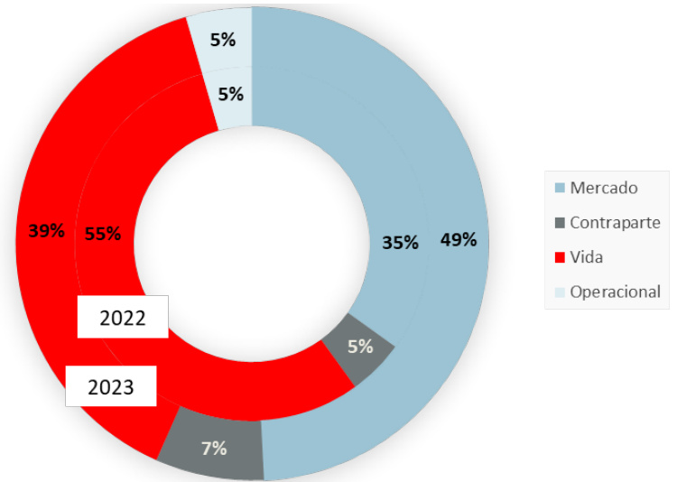  
Figura 5 - Perfil de Risco da Santander Totta Seguros a 31 de dezembro de 2022 e 2023  

# C.1 Risco de Mercado  

O Risco de Mercado representa genericamente a eventual perda resultante de uma alteração adversa do valor de um instrumento financeiro como consequência da variação de taxas de juro, taxas de câmbio, preços de ações e outros.  

No Risco de Mercado estão incluídos o Risco de Taxa de Juro, o Risco Acionista, o Risco Imobiliário, o Risco de Spread, o Risco Cambial, o Risco de Concentração e os Riscos associados ao uso de instrumentos financeiros derivados:  

Risco de Taxa de Juro: Resulta da exposição ao risco de flutuações nas taxas de juro das operações na medida em que os ativos geradores de juros (incluindo os investimentos) e os passivos geradores de juros apresentam maturidades desfasadas no tempo ou de diferentes montantes; Risco Acionista: Proveniente do risco de perda ou de ocorrência de alterações adversas na situação financeira da Sociedade resultante de flutuações do nível ou da volatilidade dos preços de mercado de capitais; Risco Imobiliário: Originado pela volatilidade dos preços do mercado imobiliário; ? Risco Spread: Resulta da sensibilidade do valor dos ativos a alterações no nível ou volatilidade dos spreads de crédito ao longo da curva de taxas de juro sem risco, cuja monitorização é realizada periodicamente; Risco Cambial: Decorre do risco da variação do valor de ativos/passivos detidos pela Sociedade decorrente de oscilações nas taxas de câmbio das moedas em que esses ativos/passivos estão expressos. A atual exposição cambial da carteira de investimentos consolidada é incipiente, sendo esta na sua totalidade respeitante a seguros em que o risco do investimento é do tomador do seguro; Risco de Concentração: Encontra-se associado à volatilidade adicional existente em carteiras muito concentradas num emissor específico e às perdas parciais ou permanentes pelo incumprimento deste, por falta de diversificação de contrapartes de crédito, por qualquer relação empresarial ou concentração em setores de negócio ou regiões geográficas.  

O Risco de Mercado também é o risco mais relevante para a Santander Totta Seguros. O Risco Mercado da Santander Totta Seguros por módulo de risco tem a seguinte decomposição:  

<html><body><table><tr><td>(em milhares deeuros)</td><td>2023</td><td>2022</td><td>A</td></tr><tr><td>RiscodeTaxadeJuro</td><td>14 614</td><td>19593</td><td>-25%</td></tr><tr><td>RiscodeAcionista</td><td>17469</td><td>14462</td><td>+21%</td></tr><tr><td>Riscolmobiliario</td><td>92</td><td>130</td><td>-29%</td></tr><tr><td>RiscodeSpread</td><td>11031</td><td>7990</td><td>+38%</td></tr><tr><td>RiscoCambial</td><td>20</td><td>16</td><td>+26%</td></tr><tr><td>RiscodeConcentracao</td><td>32078</td><td>13109</td><td>+145%</td></tr><tr><td>DiversificacaodoRisco</td><td>(26517)</td><td>(17238)</td><td></td></tr><tr><td>Total</td><td>48787</td><td>38061</td><td>+28%</td></tr></table></body></html>

Tabela 7 – Risco de Mercado da Santander Totta Seguros  

A Santander Totta Seguros apresentou um Requisito de Capital para o Risco de Mercado de 48,8 milhões de euros $49\%$ do Requisito de Capital de Solvência), sendo o Risco de Concentração o mais representativo com 32,1 milhões de euros. O aumento do Requisito de Capital relativo ao Risco de Concentração deve-se ao início da comercialização dos produtos da série Valor Duplo, no último trimestre do ano, que são produtos com um prazo de 5 anos com um pagamento intercalar a 1 ano e taxa garantida a todo o momento, cujos ativos associados são depósitos a prazo e obrigações cobertas pelo Banco Santander Totta.  

O Risco de Acionista aumentou $27\%$ face ao período homólogo devido essencialmente ao incremento da valorização dos montantes referentes às participadas que servem de base ao cálculo de risco acionista, onde o valor passou de 45,5 milhões de euros em 2022 para 51,9 milhões de euros em 2023, representando um aumento de $72\%$ justificado fundamentalmente pelo incremento do negócio das participadas Aegon Santander.  

No Risco de Taxa de Juro observou-se uma redução de $25\%$ face a 2022, 14,6 milhões de euros em 2023 que compara com 19,6 milhões de euros em 2022, devido à diferença da duração dos ativos e dos passivos combinando com a aplicação da curva de desconto do final do ano de 2023 e também devido à alteração dos pressupostos aplicáveis ao passivo.  

O Risco de Spread aumentou cerca de $38\%$ face ao período homólogo, devido ao início da comercialização dos produtos da série Valor Duplo, que se materializa no incremento da exposição a depósitos a prazo e obrigações cobertas do Banco Santander Totta.  

A Santander Totta Seguros possui políticas e limites para gerir o Risco de Mercado definindo a sua alocação estratégica de Ativos de acordo com os mesmos, tendo sempre presente uma visão integral do Balanço Económico.  

# Gestão e Controlo  

O Risco de Mercado tem diferentes origens e naturezas, envolvendo dimensões como o desfasamento de cash-flows entre ativos e passivos, risco de desvalorização imobiliária e do mercado acionista, risco de aumento dos spreads das obrigações e variações de taxa de juro, risco de concentração dos ativos em emitentes, entre outros.  

Neste sentido a Sociedade definiu princípios qualitativos e quantitativos na Política de Investimentos analisada pelo Comité de Investimentos e aprovada pelo Conselho de Administração, cumprindo o previsto no sistema de governação. Estes princípios seguem o previsto no artigo 149.º da Lei 147/2015 referente ao princípio do gestor prudente.  

A referida Política incorpora um mandato de gestão de investimentos atribuído à entidade Santander Asset Management que executa as transações, determina, analisa e reporta regularmente à Sociedade indicadores de controlo e monitorização. A responsabilidade pela atividade, análise e revisão de estratégias é da Santander Totta Seguros.  

Os Ativos são geridos com o objetivo de construir uma carteira diversificada, que maximize a rentabilidade ajustada pelo consumo de Capital Económico, sujeita aos limites e restrições do Apetite por Risco aprovado e do Plano de Negócios.  

Adicionalmente, o Comité de Riscos da Sociedade integra nas suas responsabilidades a análise da adequação da estratégia de investimentos à atividade e ao Apetite por Risco. É também verificada a conformidade das decisões operativas tomadas, a evolução da carteira de investimentos e monitorizada a atividade relacionada com a sua gestão.  

Por último, os níveis de risco de mercado são controlados com base na definição e implementação de ações de mitigação caso se verifique necessário.  

# Análises de Sensibilidade  

Sendo o Risco de Mercado um dos mais relevantes para Santander Totta Seguros foram realizadas as seguintes análises de sensibilidade:  

• Redução e aumento paralelo de 50 pontos base ao longo de toda a curva de taxas de juro sem risco;  

Cenário combinado que contém os seis seguintes fatores:  

Incremento das taxas de resgate face ao estimado no plano de negócio conforme a seguinte tabela:  

Tabela 8 – Taxas de resgate $(\mathsf{e m\,}\%)$   

<html><body><table><tr><td>TaxasdeResgate</td><td>Taxas de Resgate até Dez 2023 (%)</td><td>Taxas de resgate do Plano de Negocio (%) 2024</td><td>Taxas de resgate do Plano de Negocio (%) 2025</td><td>Taxas de resgate do Plano de Negocio (%) 2026</td><td>Taxasde resgate (%) aplicadasa 2024</td><td>Taxasde resgate (%) aplicadas a 2025</td><td>Taxasde resgate (%) aplicadasa 2026</td></tr><tr><td>UnitLinkedFechado</td><td>4%</td><td>3%</td><td>3%</td><td>2%</td><td>5%</td><td>5%</td><td>5%</td></tr><tr><td>PPR'sFechados</td><td>5%</td><td>4%</td><td>4%</td><td>3%</td><td>10%</td><td>10%</td><td>10%</td></tr><tr><td>UL'sAbertosRede</td><td>9%</td><td>%6</td><td>9%</td><td>8%</td><td>15%</td><td>15%</td><td>15%</td></tr><tr><td>PPR'sAbertos</td><td>11%</td><td>11%</td><td>11%</td><td>12%</td><td>15%</td><td>15%</td><td>15%</td></tr><tr><td>MasterApolice</td><td>6%</td><td>5%</td><td>5%</td><td>5%</td><td>10%</td><td>10%</td><td>10%</td></tr><tr><td>SPA's</td><td>3%</td><td>2%</td><td>2%</td><td>2%</td><td>10%</td><td>10%</td><td>10%</td></tr><tr><td>PPRGarantidosRefixing</td><td>14%</td><td>14%</td><td>13%</td><td>14%</td><td>18%</td><td>18%</td><td>18%</td></tr><tr><td>PPRGarantidosTxFixa</td><td>13%</td><td>13%</td><td>12%</td><td>12%</td><td>18%</td><td>18%</td><td>18%</td></tr><tr><td>GarantiasDiscretas</td><td>10%</td><td>9%</td><td>9%</td><td>9%</td><td>15%</td><td>15%</td><td>15%</td></tr><tr><td>Outros</td><td>19%</td><td>17%</td><td>17%</td><td>16%</td><td>20%</td><td>20%</td><td>20%</td></tr></table></body></html>  

Redução da nova produção, nomeadamente a redução de $50\%$ na Master Apólice e $50\%$ nos PPR’s Fechados face ao considerado no plano de negócio e para os restantes produtos manter apenas as entregas já contratualizadas;   
Dados de inflação de $2.8\%$ em 2024, $-0.5\%$ em 2025 e $-0.4\%$ em 2026;   
Redução do valor das participadas em $6\%$ ;   
Alargamento das yields dos títulos de dívida, em conformidade com a tabela:  

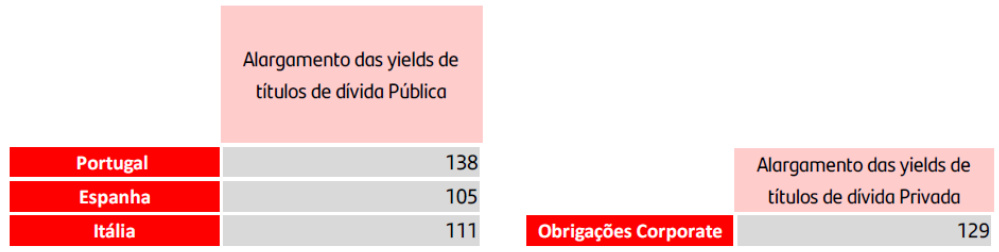  
Na figura seguinte são apresentadas as análises de sensibilidade relativas ao cenário combinado e ao spread.  

Decréscimo de $22\%$ do valor de mercado das ações e de $3\%$ no valor de mercado dos Fundos de Investimento Mobiliário e Imobiliário.  

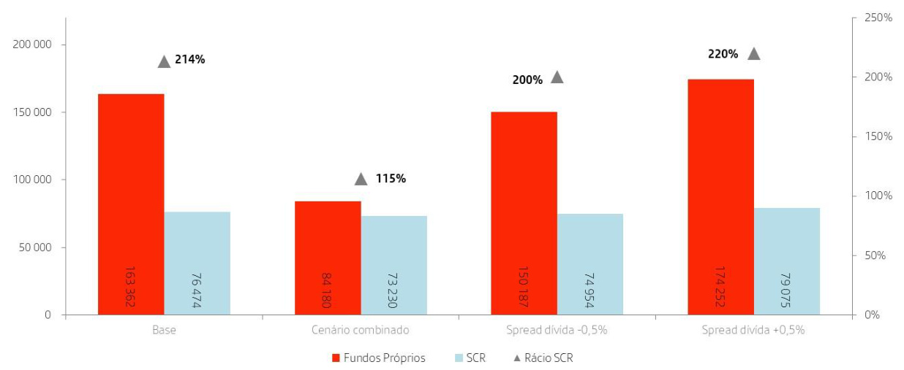  
Figura 6 – Sensibilidades Risco de Mercado  

Tendo em consideração a natureza da carteira da Sociedade e a subida das curvas de desconto, verificase que o cenário combinado é o que apresenta o rácio de solvência mais baixo, dada a severidade do cenário.  

# C.2 Risco Específico de Seguros  

O Risco Específico de Seguros engloba todos os riscos inerentes à atividade seguradora, que pela sua natureza, no caso da Santander Totta Seguros estão relacionados com o Risco Específico de Subscrição de Vida.  

A Santander Totta Seguros gere o Risco Específico dos Seguros através da combinação da Política de Subscrição, Provisionamento e da Política de Resseguro.  

O Risco Específico de Seguros engloba os riscos inerentes à comercialização de contratos de seguro, associados ao desenho de produtos e respetiva tarifação, ao processo de subscrição e de provisionamento das responsabilidades e à gestão dos sinistros e do resseguro. É aplicável a todos os ramos de atividade e pode subdividir-se em diferentes subriscos.  

# Risco Específico de Subscrição de Vida  

Os riscos a que a Santander Totta Seguros se encontra exposta, pela sua natureza e atividade, estão relacionados com os seguintes riscos biométricos:  

• Risco de Mortalidade: cobre a incerteza das perdas efetivas resultantes das pessoas seguras viverem menos do que o esperado. Encontra-se atualmente mitigado através de uma adequada Política de Subscrição, procedimentos de gestão de Sinistros e Política de Resseguro; Risco de Longevidade: ocorre quando um decréscimo inesperado das taxas de mortalidade conduz a aumentos de sinistros (no pagamento de rendas) superiores aos esperados. É gerido através do pricing da Política de Subscrição e de uma revisão regular das tabelas de mortalidade usadas para definir os prémios e constituir as provisões; O Risco de Invalidez: cobre a incerteza das perdas resultantes das taxas de invalidez serem superiores às esperadas, para a sua mitigação, é efetuada uma revisão regular dos pressupostos de invalidez e de subscrição de tratados de resseguro; Risco de Descontinuidade: resulta do risco de cessação do pagamento de prémios e do risco de anulações antecipadas de contratos. Este risco mede as variações no exercício do direito de resgate por parte dos tomadores de seguros, bem como das opções de contribuições extraordinárias e/ou suspensão de contribuições. Tendo em consideração as características da carteira em vigor, este risco tem um peso importante para a Santander Totta Seguros. A Sociedade acompanha a taxa de anulação, nos produtos de risco e financeiros e o seu impacto no valor da carteira; Risco de Despesa: representa o risco associado a variações nas despesas. A Sociedade tem implementado um modelo de repartição de custos por produtos. Os eventuais desvios entre os valores reais e os assumidos nas tarifas dos produtos são acompanhados regularmente;   
• Risco Catastrófico: decorre de eventos extremos ou irregulares cujos efeitos não são suficientemente capturados nos outros Riscos Específicos de Seguros. Decorrem normalmente de um evento específico com impacto em diversos tomadores de seguros, devido a um acréscimo dos diferentes fatores de risco em resultado de um evento de contágio, por um curto período de tempo. É mitigado/gerido com recurso ao Resseguro.  

A composição dos submódulos de Risco de Subscrição Vida é a seguinte:   
Risco Específico de Seguros de Vida   

<html><body><table><tr><td>(emmilharesdeeuros)</td><td>2023</td><td>2022</td><td>A</td></tr><tr><td>RiscodeMortalidade</td><td>396</td><td>424</td><td>-7%</td></tr><tr><td>RiscodeLongevidade</td><td>2310</td><td>2100</td><td>+10%</td></tr><tr><td>RiscodeInvalidez</td><td>11</td><td>12</td><td>%6-</td></tr><tr><td>RiscodeDespesa</td><td>6735</td><td>6632</td><td>+2%</td></tr><tr><td>RiscodeDescontinuidade</td><td>33974</td><td>56218</td><td>-40%</td></tr><tr><td>RiscoCatastrofico</td><td>205</td><td>303</td><td>-32%</td></tr><tr><td>DiversificacaodoRisco</td><td>(5081)</td><td>(5 204)</td><td></td></tr><tr><td>Total</td><td>38550</td><td>60486</td><td>-36%</td></tr></table></body></html>

Tabela 10 - Requisito Capital Solvência do Risco de Específico de Seguros Vida  

A 31 de dezembro de 2023, o Requisito de Capital do Risco Específico de Seguros de Vida era de 38,6 milhões de euros.  

Analisando-se os submódulos que compõem este risco, verifica-se que o Risco de Descontinuidade é o mais expressivo e encontra-se relacionado essencialmente com o risco de resgate associado aos contratos de Capitalização. A descida observada está associada ao efeito conjunto entre a evolução da carteira de passivos, à alteração dos pressupostos e à aplicação da taxa de juro sem risco da EIOPA.  

O segundo submódulo mais significativo é o Risco de Despesa, devido ao impacto deste risco nos seguros Unit-Linked e de Capitalização. No decorrer do ano de 2023 foi também efetuada a revisão dos pressupostos relativos às despesas e à inflação.  

O Risco de Longevidade está associado à carteira de seguros em caso de vida como as Rendas Vitalícias. Foi efetuada também a revisão das taxas de sobrevivência por forma refletir a melhor estimativa da análise histórica da carteira da Sociedade.  

De seguida, surgem os submódulos Risco de Mortalidade e Risco Catastrófico que resultam do peso significativo de capitais seguros associados aos contratos de Vida Risco, cuja descida face ao período homólogo está relacionada a revisão das taxas de mortalidade.  

Por último, o Risco de Invalidez tem um peso pouco relevante e é proveniente da cobertura de invalidez nos contratos de seguros Vida Risco. A descida do Requisito de Capital deste risco face a 2022 está também relacionada com a revisão das taxas de invalidez.  

# Risco Específico de Seguros de Acidente e Doença  

O Risco Específico de Seguros de Acidentes e Doença consiste nos riscos anteriormente mencionados, mas avaliados a nível dos ramos de Acidentes e Doença, compreendendo os riscos referentes aos ramos de Acidentes e Doença Similar a Não Vida e Acidentes Doença Similar a Vida, incluindo ainda o Risco Catastrófico de Acidentes e Doença.  

Os riscos relacionados com as coberturas complementares de Morte por Acidente, Morte por Acidente de Circulação, Doenças Graves foram durante o ano de 2022 alocadas ao segmento de responsabilidades de natureza Vida e a Cobertura de Desemprego encontra-se ressegurada a $700\%$ . Neste sentido, a Santander Totta Seguros deixou de estar exposta ao Risco Específico de Seguros de Acidente e Doença.  

# Gestão e Controlo  

A gestão do Risco Específico de Seguros é efetuada através da combinação das Políticas de Subscrição e Provisionamento e Política de Resseguro:  

A Política de Subscrição e Provisionamento formaliza os princípios e os processos de subscrição de forma a controlar os riscos provenientes das operações de subscrição, permitindo assegurar que a Sociedade mantém um Perfil de Risco de Subscrição consistente com o Perfil de Risco definido pelos seus Órgãos de Administração, assim como tem por objetivo a constituição de provisões adequadas e suficientes que permitam cumprir todas as responsabilidades futuras, incluindo os controlos definidos para assegurar a suficiência de reservas relacionadas com o Risco Específico de Seguros; Política de Resseguro tem por objetivo definir os princípios e as orientações a aplicar à atividade de resseguro da Sociedade.  

# Análises de Sensibilidade  

O Risco Específico de Subscrição de Vida é o segundo risco com maior expressão no Perfil de Risco da Sociedade justificado essencialmente pelos submódulos de Descontinuidade e de Despesa associado ao volume de produtos financeiros em carteira e à estratégia de negócio definida pela Sociedade.  

A exposição associada ao Risco de Invalidez é baixa uma vez que a carteira Vida Risco se encontra praticamente toda ressegurada.  

Assim foram efetuadas as seguintes análises de sensibilidade para o Risco Específico de Subscrição de Vida do Grupo Segurador:  

Spread $+/-75\%$ na taxa de Mortalidade;   
Spread $+/.$ - $70\%$ no Risco de Despesas;   
Spread na taxa de Anulação de $+/-20\%$ .  

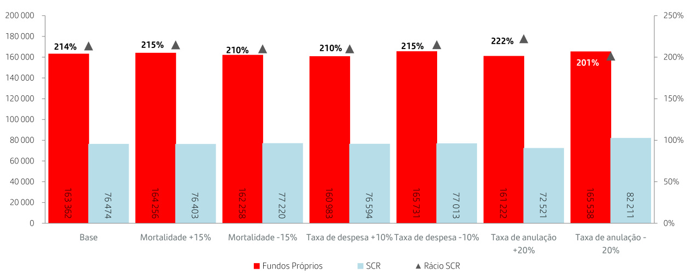  
No gráfico seguinte são apresentadas sensibilidades relativas ao Risco Específico de Subscrição de Vida:   
Figura 7 – Sensibilidades dos Riscos Específicos de Seguros de Vida  

Pela análise do gráfico verificamos que os choques adicionais na taxa de anulação e na taxa de mortalidade, são os que têm mais impacto no Rácio de Solvência, à semelhança das análises apresentadas no ano anterior. Verifica-se que, o aumento da taxa de anulação, ao reduzir a duração dos passivos, reduz o SCR em maior proporção do que a redução observada nos fundos próprios resultando assim num melhor rácio.  

# C.3 Risco de Crédito  

O Risco de Crédito surge essencialmente nos títulos de dívida onde o risco do emissor está representado no spread de crédito. De um modo geral são definidos limites em função do rating da emissão/emissor, das responsabilidades existentes e dos prazos, em Euros e para o conjunto das carteiras da Santander Totta Seguros.  

Desta forma o Risco de Contraparte ou de Crédito resulta da possibilidade de ocorrência de perdas financeiras decorrentes do incumprimento do cliente ou contraparte relativamente às obrigações contratuais. O Risco de Crédito está essencialmente presente nas dívidas a receber resultantes de cobranças e resseguro e também nos Depósitos à Ordem expostos a Risco de Crédito.  

Este tipo de risco pode ser decomposto em dois submódulos de risco:  

Tipo 1: inclui exposições a resseguradores, depósitos bancários e a contrapartes em instrumentos financeiros e derivados. Habitualmente são exposições não diversificadas e com rating de crédito disponível;   
Tipo 2: inclui outras exposições, como por exemplo, dívidas de intermediários ou de tomadores de seguros. Habitualmente são exposições diversificadas e sem rating de crédito disponível.  

O módulo de Risco de Incumprimento pela contraparte representa o terceiro maior risco no conjunto dos riscos avaliados pela Santander Totta Seguros. Analisando este risco por tipologia, o risco Tipo 1 é o que apresenta maior valor devido, essencialmente, ao peso relevante do valor de Depósitos à Ordem no Banco Santander Totta combinado com o rating desta entidade.  

A decomposição deste risco por tipo de contraparte é a seguinte:   
Tabela 11 – Risco de Incumprimento da Contraparte   

<html><body><table><tr><td>(em milharesde euros)</td><td>2023</td><td>2022</td><td>A</td></tr><tr><td>RiscodeContrapartedoTipol</td><td>6986</td><td>5168</td><td>+35%</td></tr><tr><td>RiscodeContrapartedoTipoIl</td><td>517</td><td>553</td><td>-7%</td></tr><tr><td>DiversificacaäodoRisco</td><td>(121)</td><td>(126)</td><td></td></tr><tr><td>Total</td><td>7382</td><td>5595</td><td>+32%</td></tr></table></body></html>  

O aumento do Requisito de Capital do risco de Contraparte do Tipo I foi de aproximadamente 1,8 milhões de euros devido essencialmente ao aumento dos Depósitos à Ordem no Banco Santander Totta.  

# Gestão e Controlo  

De forma a gerir o Risco de Incumprimento das contrapartes, a Sociedade tem definido na sua Política de Apetite por Risco níveis de alerta e limites de exposição máxima por emissor e rating. Na Política de Resseguro estão estabelecidos os ratings mínimos e o valor máximo de exposição por Ressegurador. Esses limites e níveis de alerta são seguidos periodicamente em Comité de Riscos.  

O quadro que se segue apresenta a exposição da Santander Totta Seguros ao Risco de Crédito, apresentado por rating do emitente:  

2023   
Tabela 12 – Exposição ao Risco de Crédito por rating da Santander Totta Seguros   

<html><body><table><tr><td>(em milhares de euros)</td><td>AAA</td><td>AA-até AA+</td><td>A-até A+</td><td>BBB-até BBB+</td><td>BB-até 88</td><td>B-atéB+</td><td>Inferior a CCC</td><td>Sem rating</td><td>Total</td></tr><tr><td>Caixae seus equivalentese depositosa ordem</td><td>0</td><td>0</td><td>0</td><td>200250</td><td>0</td><td>0</td><td>0</td><td>6789</td><td>207039</td></tr><tr><td>Ativosfinanceiros disponiveis para venda</td><td>44 614</td><td>82433</td><td>73819</td><td>509181</td><td>293</td><td>0</td><td>0</td><td>1422</td><td>711762</td></tr><tr><td>Ativosfinanceiros classificados no reconhecimentoinicialaojustovalor</td><td>116 572</td><td>37857</td><td>387065</td><td>1396 762</td><td>2028</td><td>0</td><td>0</td><td>1636</td><td>1941920</td></tr><tr><td>atraves de ganhoseperdas Total</td><td>161187</td><td>120290</td><td>460884</td><td>2106192</td><td>2321</td><td>0</td><td>0</td><td>9847</td><td>2860721</td></tr><tr><td>2022</td><td></td><td></td><td></td><td></td><td></td><td></td><td></td><td></td><td></td></tr><tr><td>(em milhares de euros)</td><td>AAA</td><td>AA-ate AA+</td><td>A-até A+</td><td>BBB-até 888</td><td>BB-até 88</td><td>B-atéB+</td><td>Inferiora CCC</td><td>Sem rating</td><td>Total</td></tr><tr><td>Caixaeseusequivalentese depositosaordem</td><td>0</td><td>0</td><td>0</td><td>217796</td><td>0</td><td>0</td><td>0</td><td>7368</td><td>225163</td></tr><tr><td>Ativos financeiros disponiveis para venda Ativos financeiros classificados no</td><td>39110</td><td>15378</td><td>55508</td><td>571 448</td><td>1217</td><td>0</td><td>0</td><td>3276</td><td>685937</td></tr><tr><td>reconhecimentoinicialaojustovalor atravesdeganhoseperdas</td><td>97578</td><td>82730</td><td>239 410</td><td>1351505</td><td>7153</td><td>0</td><td>205</td><td>7687</td><td>1786268</td></tr><tr><td>Total</td><td>136688</td><td>98108</td><td>294918</td><td>2140748</td><td>8371</td><td>0</td><td>205</td><td>18331</td><td>2697369</td></tr></table></body></html>  

Por sua vez, a qualidade creditícia dos diversos resseguradores é um fator relevante na avaliação económica dos Recuperáveis de Resseguro e Requisito de Capital de contraparte, de acordo com os critérios de Solvência II. A Santander Totta Seguro efetua uma escolha criteriosa dos resseguradores tendo em consideração o seu rating e situação financeira.  

# Análises de sensibilidade  

Considerando que o fator que mais influencia o Risco de Incumprimento da contraparte é a exposição a Depósitos à Ordem no Banco Santander Totta, foram efetuadas as seguintes análises de sensibilidade para o Grupo Segurador:  

Melhoria do Rating do Banco Santander Totta de $"{\sf B B B^{\prime\prime}}$ para $^{\prime}\mathsf{A}^{\prime\prime}$ , igual ao rating do Grupo Santander;   
Aumento dos montantes em Depósitos à Ordem em 10 milhões de euros no Banco Santander Totta.  

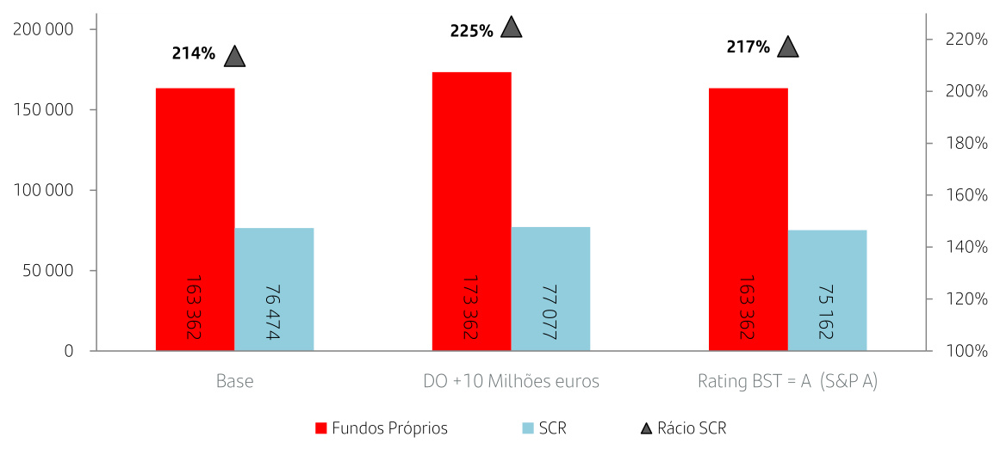  
Na figura seguinte são apresentadas as análises de sensibilidade:   
Figura 8 – Sensibilidades Risco de Contraparte  

Pela análise do gráfico verificamos que não houve alterações significativas à posição de Solvência e também face às análises apresentadas no ano anterior.  

# C.4 Risco de Liquidez  

O Risco de Liquidez corresponde ao risco de se verificarem dificuldades na obtenção de fundos por parte da Santander Totta Seguros para cumprir com os seus compromissos para com os Tomadores de Seguros e outros credores à medida que estes se vençam. O Risco de Liquidez pode-se refletir, por exemplo, na incapacidade de cumprir as obrigações associadas a passivos financeiros que sejam liquidados mediante entregas de dinheiro ou de outros ativos financeiros.  

A monitorização deste risco permite garantir que a Sociedade tenha sempre capacidade para fazer face às suas obrigações e responsabilidades no curto, médio e longo prazo.  

# Gestão e Controlo  

A monitorização do Risco de Liquidez é efetuada regularmente, sendo definidos limites de gestão de Balanço no que respeita à sensibilidade a variações paralelas da taxa de juro para a totalidade da carteira de ativos financeiros e dos passivos técnicos.  

São preparadas trimestralmente análises Asset Liability Management (ALM) incidindo sobre os ativos e as responsabilidades da Sociedade. As análises efetuadas abrangem o gap de taxa de juro, considerando a yield to maturity e a modified duration das responsabilidades e dos respetivos ativos, incluindo o efeito da convexidade, bem como o cash-flow matching no curto e no longo prazo. Esta análise inclui também uma comparação entre o cash-flow matching e a capacidade de geração de liquidez dos ativos sem maturidade, nomeadamente ações, fundos e imóveis.  

Nas Políticas de Gestão Ativo-Passivo, Gestão de Liquidez e Investimentos, encontra-se descrita a estratégia de Gestão de Riscos Financeiros e de liquidez, no curto, médio e longo prazo, num contexto de gestão Ativo-Passivo. As presentes políticas são alvo de revisão anual.  

Desta forma as Políticas de Gestão Ativo-Passivo e de Gestão de Liquidez visam assegurar o alinhamento entre ativos e passivos, com especial foco na maximização do retorno e na minimização do Risco de Taxa de Juro e do Risco de Liquidez. Neste sentido, são adotados procedimentos de forma a garantir que a Sociedade consegue honrar os compromissos, tendo em conta os limites de Apetite por Risco implementados e a otimização de recursos disponíveis.  

O processo de gestão de liquidez contempla as seguintes fases:  

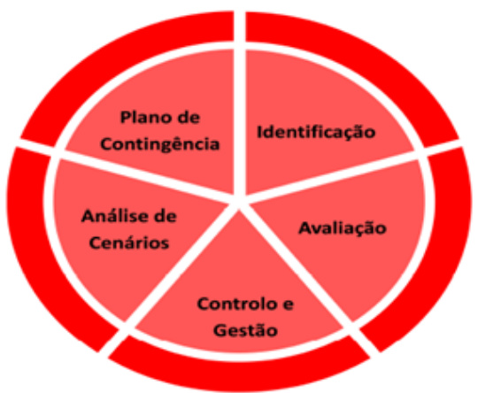  
Figura 9 – Processo de Gestão de Liquidez  

O Plano de Contingência de Liquidez quando acionado é reportado pelos membros do Comité de Investimentos em conjunto com o Departamento de Controlo de Gestão, Gestão de Riscos, Atuarial e Controlo Interno, para validação em Comité de Riscos e aprovação pelo Conselho de Administração.  

Em 31 de dezembro de 2023 e 2022 as maturidades contratuais residuais não descontados dos ativos e passivos financeiros da Santander Totta Seguros apresentam a seguinte composição:   

<html><body><table><tr><td>2023 (em milhares de euros)</td><td>Até 1 ano</td><td>De 1 ano a 3 anos</td><td>De3anos a5</td><td>Mais de 5 anos</td><td>Total</td></tr><tr><td>Ativo</td><td></td><td></td><td>anos</td><td></td><td></td></tr><tr><td>Caixa e seus equivalentese depositos a ordem</td><td>207039</td><td>0</td><td>0</td><td>0</td><td>207039</td></tr><tr><td>Investimentos em filiais, associadas e empreendimentos conjuntos</td><td>0</td><td>0</td><td>0</td><td>19 207</td><td>19207</td></tr><tr><td>Ativosfinanceiros valorizados ao justo valor atraves deganhoseperdas</td><td>235 565</td><td>769154</td><td>609153</td><td>1182962</td><td>2796834</td></tr><tr><td>Ativosfinanceirosvalorizados aojustovalor</td><td></td><td></td><td></td><td></td><td></td></tr><tr><td>atraves dereservas</td><td>121 737</td><td>206 802</td><td>162 117 0</td><td>221106</td><td>711762</td></tr><tr><td>Emprestimosconcedidosecontasareceber</td><td>75180</td><td>302</td><td></td><td>1352</td><td>76833</td></tr><tr><td>Contas a receber por operacoes de seguro direto</td><td>110</td><td>0</td><td>0 0</td><td>0 0</td><td>110</td></tr><tr><td>Contas a receber por operacoes deresseguro</td><td>8 11953</td><td>0</td><td>0</td><td>0</td><td>8 11953</td></tr><tr><td>Contas a receber por outras operacoes</td><td>651591</td><td>0 976258</td><td>771270</td><td>1424627</td><td>3823746</td></tr><tr><td>TotalAtivo Passivo</td><td></td><td></td><td></td><td></td><td></td></tr><tr><td>Passivosfinanceirosda componente dedeposito</td><td></td><td></td><td></td><td></td><td></td></tr><tr><td>de contratos de seguro e de contratos deseguro</td><td></td><td>(47 245)</td><td></td><td></td><td></td></tr><tr><td>e operacoesconsideradaspara efeitos</td><td>(531 000)</td><td></td><td>(537 196)</td><td>(223 348)</td><td>(1 338 789)</td></tr><tr><td>contabilisticoscomocontratosdeinvestimento</td><td></td><td></td><td></td><td></td><td></td></tr><tr><td>Valorizados aojustovalor</td><td>(529 679)</td><td>(46 200)</td><td>(397 554)</td><td>(207 126)</td><td>(1180558)</td></tr><tr><td>Valorizados aocusto amortizado</td><td>(1 322)</td><td>(1 045)</td><td>(139 642)</td><td>(16 222)</td><td>(158 231)</td></tr><tr><td>Outros passivos financeiros</td><td>(60 332)</td><td>(2 086)</td><td>0</td><td>(568)</td><td>(62 985)</td></tr><tr><td>Depositosrecebidos deresseguradores</td><td>0</td><td></td><td></td><td></td><td>0</td></tr><tr><td>Outros</td><td>(60 332)</td><td>(2 086)</td><td>0</td><td>(568)</td><td>(62 985)</td></tr><tr><td>Contas a pagar por operacoes de seguro direto</td><td>(9 077)</td><td></td><td></td><td></td><td>(9 077)</td></tr><tr><td>Contas a pagar por operacoes de resseguro</td><td>(2 859)</td><td></td><td></td><td></td><td>(2 859)</td></tr><tr><td>Contas a pagar por outras operacoes</td><td>(3 315)</td><td></td><td></td><td></td><td>(3315)</td></tr><tr><td>TotalPassivo</td><td>(606 583)</td><td>(49 331)</td><td>(537196)</td><td>(223 916)</td><td>(1 417 026)</td></tr><tr><td>2022</td><td></td><td></td><td></td><td></td><td></td></tr><tr><td></td><td>Até 1 ano</td><td>De 1 ano a 3 anos</td><td>De 3 anos a5</td><td></td><td>Total</td></tr><tr><td>Ativo</td><td></td><td></td><td>anos</td><td>Mais de 5 anos</td><td></td></tr><tr><td>Caixaeseusequivalentesedepositosaordem</td><td>225 163</td><td>0</td><td>0</td><td>0</td><td>225163</td></tr><tr><td>Investimentosemfiliais,associadase empreendimentos conjuntos</td><td>0</td><td></td><td></td><td></td><td>18707</td></tr><tr><td>Ativosfinanceiros valorizados aojustovalor</td><td></td><td>0</td><td>0</td><td>18707</td><td></td></tr><tr><td>atraves deganhoseperdas</td><td>1 279 271</td><td>579299</td><td>533208</td><td>275 804</td><td>2667582</td></tr><tr><td>Ativosfinanceirosvalorizados aojustovalor</td><td></td><td></td><td></td><td></td><td></td></tr><tr><td>atravesdereservas Emprestimosconcedidosecontasareceber</td><td>193 233 12 706</td><td>208124 5566</td><td>100366 0</td><td>184215 1471</td><td>685937 19742</td></tr><tr><td>Contas a receberpor operacoes de segurodireto</td><td>46</td><td>0</td><td>0</td><td>0</td><td>46</td></tr><tr><td>Contas areceberpor operacoes deresseguro</td><td>807</td><td>0</td><td>0</td><td>0</td><td>807</td></tr><tr><td>Contas a receber por outras operacoes</td><td>8635</td><td>0</td><td>0</td><td></td><td>0 8635</td></tr><tr><td>TotalAtivo</td><td>1719860</td><td>792988</td><td>633574</td><td></td><td>3626619</td></tr><tr><td>Passivo</td><td></td><td></td><td></td><td>480197</td><td></td></tr><tr><td>Passivos financeiros da componente de deposito</td><td></td><td></td><td></td><td></td><td></td></tr><tr><td>de contratos deseguroe decontratos deseguro</td><td>(501 011)</td><td>(73 617)</td><td>(2 263)</td><td>(620 433)</td><td>(1 197 324)</td></tr><tr><td>e operacoes consideradas para efeitos</td><td></td><td></td><td></td><td></td><td></td></tr><tr><td>contabilisticos como contratos deinvestimento</td><td></td><td></td><td></td><td></td><td></td></tr><tr><td>Valorizados ao justo valor</td><td>(500 371)</td><td>(71 576)</td><td>(1609)</td><td>(602 676)</td><td>(1176 232)</td></tr><tr><td>Valorizados ao custo amortizado</td><td>(640)</td><td>(2 040)</td><td>(655)</td><td>(17 757)</td><td>(21 092)</td></tr><tr><td>Outros passivos financeiros</td><td>(82 283)</td><td>(650 z)</td><td>0</td><td>0</td><td>(84 322)</td></tr><tr><td>Depositosrecebidos deresseguradores</td><td>(15)</td><td>0</td><td>0</td><td>0</td><td>(15)</td></tr><tr><td>Outros</td><td>(82 268)</td><td>(2 039)</td><td>0</td><td>0</td><td>(84 307)</td></tr><tr><td>Contas a pagar por operacoes de seguro direto</td><td>(9 352)</td><td>0</td><td>0</td><td>0</td><td>(9 352)</td></tr><tr><td></td><td>(1 915)</td><td></td><td>0</td><td>0</td><td></td></tr><tr><td>Contas a pagar por operacoes de resseguro</td><td></td><td>0</td><td></td><td></td><td>(1915)</td></tr><tr><td></td><td></td><td></td><td></td><td></td><td></td></tr><tr><td>Contas a pagar por outras operacoes Total Passivo</td><td>(3 227) (597 788)</td><td>0 (75 656)</td><td>0 (2263)</td><td>0 (620 433)</td><td>(3 227) (1 296 140)</td></tr></table></body></html>

Tabela 13 - Análise das Maturidades dos Ativos e Passivos Financeiros da Santander Totta Seguros  

Na construção destes quadros foram considerados os seguintes pressupostos:  

Foi considerada a data de maturidade de todas as obrigações callable em carteira; • Os seguros Unit-Linked sem maturidade definida foram considerados como exigíveis até 3 meses uma vez que estes podem ser resgatados a qualquer momento; • Considerou-se que os depósitos recebidos das resseguradoras têm vencimento trimestral.  

Face ao exposto em 2023, a Santander Totta Seguros considera que existe uma adequada mitigação deste risco.  

# Lucros esperados incluídos nos Prémios futuros  

No que respeita ao Risco de Liquidez, entende-se por “lucros esperados incluídos nos Prémios futuros” (EPIFP – Expected Profit Included in Future Premiums) o valor atual esperado dos fluxos de caixa futuros resultante da inclusão nas Provisões Técnicas dos Prémios referentes aos contratos de seguro e de resseguro existentes, que devam ser recebidos no futuro, mas que possam não ser recebidos por qualquer outra razão que não a ocorrência dos eventos segurados, independentemente dos direitos legais ou contratuais do tomador do seguro de cessar a apólice.  

O valor dos Lucros esperados incluídos nos Prémios futuros, em 31 de dezembro de 2023, é o seguinte:   
Tabela 14 – Montante total dos lucros esperados nos Prémios futuros   

<html><body><table><tr><td>(emmilharesdeeuros)</td><td>2023</td><td>2022</td></tr><tr><td>Lucros esperadosincluidosnospremiosfuturos</td><td>134787</td><td>184248</td></tr></table></body></html>  

No ano de 2023 o montante relativo aos lucros esperados incluídos nos prémios futuro reduziu cerca de $27\%$ devido à revisão anual dos pressupostos relativos às taxas de mortalidade, invalidez, descontinuidade, inflação e despesas e alteração da curva de taxa de juro sem risco da EIOPA.  

Importa frisar que os Prémios considerados no cálculo destes lucros encontram-se líquidos das responsabilidades de resseguro.  

# C.5 Risco Operacional  

A definição de Risco Operacional integra a probabilidade de ocorrência de perdas resultantes de diferentes fatores, nomeadamente falhas na análise, processamento ou liquidação das operações, fraudes internas e externas, do facto da função ou atividade ser afetada pela utilização de recursos em regime outsourcing, da insuficiente ou inadequada existência de recursos humanos ou da inoperacionalidade das infraestruturas.  

No ponto B.4. já foram apresentados os principais mecanismos de identificação, gestão e controlo do Risco Operacional. A categoria mais relevante, embora de pouca expressão, é a de práticas com Clientes, Produtos e de Negócio.  

O Risco Operacional foi avaliado com base na Fórmula-Padrão que tem como variáveis os resultados da atividade nos últimos dois anos em termos de prémios e provisões, juntamente com o mínimo de $30\%$ do Requisito de Capital de Solvência base (BSCR). Os resultados do Requisito de Capital de Solvência referente ao Risco Operacional, são os apresentados na tabela seguinte:  

Tabela 15 – Requisito de Capital de Solvência referente ao Risco Operacional   

<html><body><table><tr><td>(emmitharesdeeuros)</td><td>2023</td><td>2022</td></tr><tr><td>Risco Operacional</td><td>4478</td><td>4929</td></tr></table></body></html>  

O Requisito de Capital do Risco Operacional diminuiu $9\%$ face ao período homólogo.  

# Gestão e Controlo  

No ponto B.4 do presente relatório foram já apresentados os principais mecanismos de identificação, gestão e controlo, o processo de reporte regular de controlos operacionais, a implementação da base de dados de perdas, a definição e operacionalização do plano de continuidade de negócio e a implementação da função de verificação do cumprimento.  

Para além destas medidas, sintetizam-se outras que permitem identificar, gerir e mitigar o Risco Operacional:  

Existência de Código de Conduta;   
• Existência de manuais de procedimentos;   
? Implementação de políticas e procedimentos de prevenção da fraude interna e externa; Implementação de medidas relacionadas com a segurança no acesso às bases de dados e os sistemas de informação; Definição e implementação de procedimentos de gestão de recursos humanos; Formação às áreas que interagem diretamente com os Clientes; Formação específica referente à prevenção de branqueamento de capitais e financiamento do terrorismo e acompanhamento de controlos efetuados pelo distribuidor; Existência de procedimentos formais para monitorização do cumprimento de diversos prazos legais a que as Sociedades se encontram sujeitas.  

# C.6 Outros Riscos Materiais  

# Risco Reputacional  

Este risco pode ser definido como o risco da Santander Totta Seguros incorrer em perdas resultantes da deterioração ou posição no mercado devido a uma perceção negativa da sua imagem entre os clientes, contrapartes, acionistas ou autoridades de Supervisão, assim como do público em geral.  

Embora este risco não seja material, o Risco Reputacional é um risco com o qual a Sociedade se preocupa, uma vez que é constituída por um acionista de referência do mercado financeiro, cuja reputação pode ser influenciada pela reputação da Sociedade e vice-versa.  

Para este efeito a Sociedade implementou algumas medidas com o objetivo de mitigar esse risco, nomeadamente:  

Elaboração do Código de Conduta; Função autónoma de gestão de reclamações; Nomeação do provedor do cliente; Implementação da Política de Prevenção e Branqueamento de Capitais; ? Monitorização dos níveis de serviço nas respostas a clientes; Processo de aprovação de novos produtos.  

# Risco Estratégico  

O Risco Estratégico pode ser definido como o risco do impacto atual e futuro nos proveitos ou Capital que resulta de decisões de negócio inadequadas, implementação imprópria de decisões ou falta de capacidade de resposta às alterações ocorridas no mercado.  

Este Risco assume relevância quando a Sociedade se depara com a complexidade de avaliar o futuro, ou seja, de definir uma estratégia. Cada decisão será sempre acompanhada de uma avaliação dos limites de Apetite por Risco. Os fatores externos, como os concorrentes, a situação económica, os clientes ou os fornecedores, são essenciais na definição de uma estratégia e na análise do risco que esta pode envolver. A análise do Risco Estratégico integra mecanismos de crescimento, oportunidade e competitividade.  

Na gestão deste tipo de risco, a Sociedade define objetivos estratégicos de alto nível, aprovados e supervisionados ao nível do Conselho de Administração. As decisões estratégicas encontram-se devidamente suportadas e são sempre avaliadas do ponto de vista de exigência de custos de Capital necessários à sua prossecução.  

# Risco Sustentabilidade  

O risco de sustentabilidade é definido como o risco de ocorrência de um acontecimento ou circunstância de natureza ambiental, social ou de governo cuja eventual ocorrência possa ter impacto negativo, real ou potencial, sobre o valor do investimento ou do passivo.  

No âmbito da sua atividade, e de acordo com a missão e valores, a Sociedade procura integrar, sempre que as características dos produtos em causa o permitam, critérios de natureza ambiental, social ou de governação $"\mathsf{E S G}^{5"}$ nos processos de análise de risco e na tomada de decisões de investimento relativamente aos produtos que comercializa, baseando-se em princípios de investimento responsável e sustentável e de transparência na gestão de investimentos. A Santander Totta Seguros considera que a integração de fatores ESG nos seus processos internos, a par de outros critérios e práticas responsáveis, permite contribuir para o bem-estar financeiro dos seus Clientes e para o desenvolvimento sustentável da sociedade e do setor financeiro.  

# Risco Cibernético  

O risco cibernético é definido como um risco que ocasione uma perda financeira, uma interrupção de negócio ou um dano na reputação da Sociedade devido à destruição, uso indevido, roubo ou abuso de sistemas ou da informação. Este risco provém de dentro e de fora da Sociedade.  

A Sociedade tem implementados procedimentos e ferramentas necessárias baseados em princípios de defesa, antecipação e compromisso perante ameaças cibernéticas. Neste sentido, encontram-se definidas funções e responsabilidade que intervêm na gestão e controlo da cibersegurança baseado nas três linhas de defesa.  

# C.7 Volume e natureza da carteira de empréstimos  

Em 2023 a tipologia de ativos “empréstimos concedidos” tinha um valor de 1,4 milhões de euros.  

Os empréstimos concedidos foram considerados como tendo baixo risco, dada a materialidade do valor apresentado em balanço.  

# C.8 Eventuais Informações Adicionais  

No âmbito do Perfil de Risco, a Santander Totta Seguros considera que não existem informações adicionais relevantes.  

# D - Avaliação para Efeitos de Solvência  

Neste capítulo apresenta-se a informação relativa à avaliação dos ativos, Provisões Técnicas e outros Passivos para efeitos de Solvência e a comparação dessa avaliação com aquela que é usada nas Demonstrações Financeiras para Santander Totta Seguros.  

Adicionalmente, é apresentada a mesma informação para efeitos de Solvência, relativa a 31 de dezembro de 2023 e 31 de dezembro de 2022.  

De acordo com o artigo 75.º da Diretiva 138/2009 CE do Parlamento Europeu e do Conselho, os elementos do Ativo são avaliados pelo montante pelo qual podem ser transacionados entre partes informadas agindo de livre vontade numa transação em condições normais de mercado.  

Por sua vez, os elementos do Passivo são avaliados pelo montante que podem ser transferidos ou liquidados entre partes informadas agindo de livre vontade numa transação em condições normais de mercado.  

A Santander Totta Seguros efetuou a avaliação de todos os seus Ativos e Passivos de acordo com o Justo Valor, respeitando o princípio elencado nos parágrafos anteriores.  

O quadro seguinte apresenta a comparação entre a valorização dos Ativos e Passivos para efeitos de Solvência e para construção das Demonstrações Financeiras, à data de 31 de dezembro de 2023 e de 31 de dezembro de 2022:  

<html><body><table><tr><td>(emmilharesdeeuros)</td><td colspan="3">2023</td><td colspan="3">2022</td></tr><tr><td></td><td>SolvenciallEstatutarias</td><td></td><td>Diferenca</td><td>SolvenciallEstatutarias</td><td></td><td>Diferenca</td></tr><tr><td>Ativo</td></tr><tr><td>AtivosFinanceiros</td><td>3 794762</td><td>3 762 061</td><td>32 701</td><td>3610333</td><td>3583548</td><td>26 785</td></tr><tr><td>Ativosimobiliarios</td><td>78</td><td>78</td><td>0</td><td>78</td><td>78</td><td>0</td></tr><tr><td>RecuperaveisdeResseguro</td><td>3222</td><td>15 751</td><td>(12 529)</td><td>5097</td><td>21343</td><td>(16 247)</td></tr><tr><td>OutrosAtivos</td><td>72 430</td><td>72868</td><td>(438)</td><td>69823</td><td>70979</td><td>(1 157)</td></tr><tr><td>Totaldoativo</td><td>3870492</td><td>3850758</td><td>19734</td><td>3685331</td><td>3675949</td><td>9382</td></tr><tr><td>Passivo</td></tr><tr><td>ProvisoesTecnicas</td><td>3582932</td><td>3 614542</td><td>(31610)</td><td>3359294</td><td>3 458 111</td><td>(98 817)</td></tr><tr><td>OutrasResponsabilidades</td><td>97932</td><td>93432</td><td>4 501</td><td>130596</td><td>111374</td><td>19 223</td></tr><tr><td>TotaldePassivos</td><td>3680864</td><td>3707973</td><td>(27109)</td><td>3489890</td><td>3569484</td><td>(79594)</td></tr><tr><td>ExcessodeAtivossobreoPassivo</td><td>189628</td><td>142785</td><td>46843</td><td>195441</td><td>106465</td><td>88976</td></tr></table></body></html>

Tabela 16 – Composição do Balanço Económico e estatutário para a Santander Totta Seguros6  

As Demonstrações Financeiras da Santander Totta Seguros estão expressas na moeda Euro e são preparadas de acordo com o princípio do custo histórico, com exceção dos Ativos registados ao Justo Valor, nomeadamente, Ativos Financeiros disponíveis para venda, Ativos Financeiros classificados no reconhecimento inicial ao Justo Valor através de Ganhos e Perdas e Ativos Financeiros detidos para negociação. Os restantes Ativos e Passivos Financeiros, bem como os Ativos e Passivos não  

Financeiros, são registados ao Custo Amortizado ou ao Custo Histórico. Os passivos por contratos de seguro mensurados em conformidade com a IFRS17. Salienta-se que no quadro apresentados os valores referentes ao Balanço Estatutário em 2022 encontram-se mensurados ainda em conformidade com a norma contabilista IFRS4.  

# D.1 Ativo  

A avaliação dos ativos para efeitos de Solvência e a sua comparação com aquela que é usada nas Demonstrações Financeiras é apresentada neste relatório pelas seguintes rúbricas:  

Ativos Financeiros;   
Ativos Imobiliários;   
Recuperáveis de Resseguro;   
Outros Ativos.  

As classes de ativos descritos nas seções abaixo refletem a estrutura do Balanço para efeitos de Solvência II da Santander Totta Seguros. As tabelas seguintes apresentam para cada categoria de Ativos a valorização para efeitos de Solvência II e a respetiva comparação com os valores presentes nas Contas Estatutárias calculados de acordo com as normativas vigentes.  

Os Ativos Financeiros afetos às carteiras de risco da Sociedade ou de risco Tomador de Seguro encontram-se valorizados na sua maioria nas Demonstrações Financeiras com base no método do Justo Valor. De acordo com o disposto na alínea a) do artigo 75.º da Diretiva 2009/138/CE para efeitos de avaliação em Solvência II, os elementos do Ativo são avaliados pelo montante pelo qual podem ser transacionados entre as partes, usando assim o mesmo método apresentado nas Demonstrações Financeiras. Para todos os ativos que compõem as carteiras da Santander Totta Seguros e de acordo com o previsto no Regime de Solvência II, é efetuada uma caracterização dos ativos de acordo com o Anexo Técnico V – Tabela de Códigos de Identificação Complementar (CIC), cuja última revisão consta no Regulamento de Execução 2020/657 de 15 de maio de 2020.  

# D.1.1 Ativos Financeiros  

De seguida são apresentadas as avaliações dos Ativos Financeiros para efeitos de Solvência repartido por classe de Ativos.   

<html><body><table><tr><td>(em milhares de euros)</td><td colspan="3">2023</td><td colspan="3">2022</td></tr><tr><td></td><td>Solvencia Il</td><td>Estatutarias</td><td>Diferenca</td><td>SolvenciaIl</td><td>Estatutarias</td><td>Diferenca</td></tr><tr><td colspan="7">AtivosFinanceiros</td></tr><tr><td>Interesses em Empresas Relacionadas,</td><td>51 908</td><td>19 207</td><td>32 701</td><td>45 499</td><td>18707</td><td>26 792</td></tr><tr><td>incluindoParticipacoes Acoes-Cotadas em bolsa</td><td>0</td><td>0</td><td>0</td><td>0</td><td>0</td><td>0</td></tr><tr><td>Acoes-Nao Cotadasembolsa</td><td>860</td><td>860</td><td>(0)</td><td>860</td><td>860</td><td>(0)</td></tr><tr><td>Obrigacoes de Divida Publica</td><td>543 450</td><td>542 157</td><td>1293</td><td>588074</td><td>588160</td><td>(86)</td></tr><tr><td>Obrigacoes deEmpresas</td><td>168 312</td><td>169 605</td><td>(1 293)</td><td>97855</td><td>97769</td><td>86</td></tr><tr><td>Titulos de Divida Estruturados</td><td>0</td><td>0</td><td>0</td><td>0</td><td>0</td><td>0</td></tr><tr><td>Titulos de Divida Garantidos com colateral</td><td>0</td><td>0</td><td>0</td><td>0</td><td>0</td><td>0</td></tr><tr><td>Organismos de investimento coletivo</td><td>1788</td><td>1788</td><td>0</td><td>312</td><td>312</td><td>0</td></tr><tr><td>Derivados</td><td>0</td><td>0</td><td>0</td><td>0</td><td>0</td><td>0</td></tr><tr><td>Depositos que nao equivalentes a</td><td>64 661</td><td>64 661</td><td>(0)</td><td>1946</td><td>1946</td><td>(0)</td></tr><tr><td>numerario Outrosinvestmentos</td><td>92</td><td>92</td><td>0</td><td>0</td><td>6</td><td>(6)</td></tr><tr><td>Ativos detidospara contratosligados a</td><td>2 963690</td><td>2 963690</td><td>0</td><td>2 875788</td><td>2875788</td><td></td></tr><tr><td>indices e a unidades de participacao</td><td></td><td></td><td></td><td></td><td></td><td>0</td></tr><tr><td colspan="2">Total</td><td>3794762</td><td>3762061</td><td>32701</td><td>3610333</td><td>3583548</td><td>26785</td></tr></table></body></html>

s financeiros para efeitos de Solvência II e Demonstrações Financeiras da Santander  

Nas rúbricas de Ativos Financeiros, as principais diferenças foram registadas no valor dos interesses em empresas relacionadas, incluindo participações e ao nível das obrigações de dívida pública e empresas. Os restantes itens do ativo financeiro não sofreram qualquer alteração uma vez que verificam os princípios subjacentes ao Regime de Solvência II.  

Interesses em empresas relacionadas, incluindo participações: as participadas Aegon Santander Vida, Aegon Santander Não Vida e Mapfre Santander encontram-se registadas nas Demonstrações Financeiras ao custo de aquisição com o valor de 19,2 milhões de euros.  

De acordo o disposto no número 3 do artigo 13.º do Regulamento Delegado foi adotado o “Método de Equivalência Ajustada” no cálculo da participação da Santander Totta Seguros na Aegon Santander Vida, Aegon Santander Não Vida e Mapfre Santander. Desta forma o valor da participação é calculado aplicando-se a percentagem de participação à parcela relativa ao excesso do Ativo sobre o Passivo de cada umas das empresas relacionadas no Balanço Económico. Abaixo apresenta-se o detalhe do valor desta rúbrica:  

<html><body><table><tr><td>(emmilharesdeeuros)</td><td>Excessodo</td><td>ativosobreoParticipacao</td><td>Solvenciall</td><td>Estatutarias</td><td>Diferenca</td></tr><tr><td>AegonVida</td><td>passivo 51554</td><td>+49,00%</td><td>25 262</td><td>8232</td><td>17030</td></tr><tr><td>AegonNaoVida</td><td>46852</td><td>+49,00%</td><td>22957</td><td>6076</td><td>16881</td></tr><tr><td>MapfreSantander</td><td>7379</td><td>+49,99%</td><td>3689</td><td>4899</td><td>(1 210)</td></tr><tr><td>Total</td><td>105786</td><td></td><td>51908</td><td>19207</td><td>32701</td></tr></table></body></html>

Tabela 18 – Interesses em empresas relacionadas, incluindo participações de Solvência e Demonstrações Financeiras  

Desta forma a diferença de 32,7 milhões de euros entre o Balanço para efeitos de Solvência II e os valores reconhecidos nas Contas Estatutárias deve-se à aplicação de distintos métodos de valorização da participação na Aegon Santander Vida, Aegon Santander Não Vida e Mapfre Santander.  

Ações: para os títulos ações o Justo Valor foi obtido diretamente das cotações de mercado, ou seja, através dos preços destes títulos disponibilizadas na Bloomberg.  

Obrigações: nesta rúbrica são incluídas todas as obrigações afetas a carteiras não ligadas a UnitLinked, desagregando-se entre Obrigações de Divida Pública (código CIC 1), Obrigações de Empresas (código CIC 2), Títulos de Dívida Estruturados (CIC 5) e Títulos de Dívida Garantidos com colateral (código CIC 6). A diferença observada entre ambos os Balanços, na sua totalidade é nula, havendo apenas diferentes reclassificações entre ambos os Balanços nestas rubricas.  

Organismos de Investimento Coletivo: nesta rúbrica são incluídos valores mobiliários e imobiliários. Os Organismos de Investimento Coletivo são avaliados a valor de mercado utilizando as cotações enviadas pelas gestoras dos fundos.  

Os valores mobiliários admitidos à negociação numa bolsa de valores ou transacionados num mercado regulamentado e com transações efetuadas nos últimos 15 dias são valorizados à cotação de fecho, se a sessão tiver encerrado antes das 17 horas de Lisboa, ou à cotação verificada nessa hora se a sessão se encontrar em funcionamento e tiver decorrido mais de metade da sessão. As cotações são fornecidas pelas entidades gestoras do mercado onde os valores se encontram admitidos à cotação e captadas através da Bloomberg. Os critérios utilizados para determinar se os mercados estão ativos são semelhantes aos utilizados para as Obrigações.  

Derivados: nesta rúbrica são considerados todos os Ativos Financeiros com o código CIC correspondente a $^{\prime\prime}\mathsf{A}^{\prime\prime}\in\mathsf{\Omega}^{\prime\prime}\mathsf{D}^{\prime\prime}$ . Esta categoria de Ativos Financeiros é avaliada ao Justo Valor. O Justo Valor dos derivados que não são transacionados em bolsa é estimado com base no montante que seria recebido ou pago para liquidar o contrato na data em análise, considerando as condições de mercado vigentes.  

Depósitos que não equivalentes a numerário: nesta rúbrica são considerados todos os Ativos Financeiros com o código CIC 73 e 74 não afetos a carteiras Unit-Linked.  

Ativos detidos para contratos ligados a índices e a unidades de participação: neste campo são considerados todos os Ativos Financeiros afetos a carteiras Risco Tomador independentemente do código CIC do Ativo. Nas Demonstrações Financeiras os Ativos Financeiros associados aos produtos Unit-Linked são considerados como exigíveis $^{\prime}\partial$ vista” pelo montante do respetivo Justo Valor desses Ativos à data de cada relato financeiro.  

Em Solvência II os ativos detidos para contratos ligados a índices e a unidades de participação são avaliados ao valor de mercado utilizando as cotações da Bloomberg, sempre que estas existam e seja identificado diariamente se, uma cotação é significativa e representativa de mercado, não gerando desta forma diferença entre o valor nas Contas Estatutárias e de Solvência II.  

# D.1.2 Ativos Imobiliários  

Na tabela seguinte é apresentada a comparação da avaliação dos Ativos Imobiliários para efeitos de Solvência e a sua avaliação nas Demonstrações Financeiras.  

<html><body><table><tr><td>(emmilharesdeeuros)</td><td colspan="3">2023</td><td colspan="3">2022</td></tr><tr><td></td><td>Solvenciall</td><td>Estatutarias</td><td>Diferenca</td><td>Solvenciall</td><td>Estatutarias</td><td>Diferenca</td></tr><tr><td>Ativosimobiliarios</td><td></td><td></td><td></td><td></td><td></td><td></td></tr><tr><td>Ativosfixostangiveisparausoproprio</td><td>78</td><td>78</td><td>0</td><td>78</td><td>78</td><td>0</td></tr><tr><td>Imoveis (que nao para uso proprio)</td><td>0</td><td>0</td><td></td><td>0</td><td>0</td><td>0</td></tr><tr><td>Organismosdeinvestimentocoletivo</td><td>1259</td><td>1259</td><td>0</td><td>1259</td><td>1259</td><td>0</td></tr><tr><td>Total</td><td>1337</td><td>1337</td><td>0</td><td>1337</td><td>1337</td><td>0</td></tr></table></body></html>

Tabela 19 – Ativos imobiliários para efeitos de Solvência II e Demonstrações Financeiras  

No que diz respeito às rúbricas de Ativos Imobiliários não existem diferenças entre avaliação para efeitos de Solvência e a sua avaliação nas Demonstrações Financeiras.  

Ativos fixos tangíveis para uso próprio: os outros ativos fixos tangíveis são valorizados ao custo de aquisição, deduzido das subsequentes depreciações e perdas por imparidade. As despesas de reparação, manutenção e outras despesas associadas ao seu uso são reconhecidas como custo do exercício.  

O custo de aquisição inclui o preço de compra do ativo, as despesas diretamente imputáveis à sua aquisição e os encargos suportados com a preparação do ativo para a sua entrada em funcionamento.  

São realizadas periodicamente análises no sentido de identificar evidências de imparidade em outros ativos tangíveis. Sempre que o valor líquido contabilístico dos ativos tangíveis exceda o seu valor recuperável (maior de entre o valor de uso e o Justo Valor menos custos de venda) é reconhecida uma perda por imparidade com reflexo na conta de Ganhos e Perdas. As perdas por imparidade podem ser revertidas também com impacto em Ganhos e Perdas do exercício, caso subsequentemente, se verifique um aumento no valor recuperável do ativo, sendo que o valor contabilístico deste nunca poderá ser superior ao valor que teria caso nunca tivessem sido reconhecidas perdas por imparidade, considerando as depreciações que este teria sofrido.  

As depreciações são calculadas pelo método das quotas constantes às taxas correspondentes à vida útil estimada dos respetivos bens. As taxas definidas têm subjacentes as seguintes vidas úteis estimadas:   
Tabela 20 – Vida útil estimada para o cálculo das taxas de depreciação anuais   

<html><body><table><tr><td>Tipodebem</td><td>Vidautil(anos)</td></tr><tr><td>Equipamentoadministrativo</td><td>5a8</td></tr><tr><td>Equipamentoinformatico</td><td>3</td></tr><tr><td>Instalacoesinteriores</td><td>8a10</td></tr><tr><td>Materialdetransporte</td><td>4a6</td></tr><tr><td>Outrasimobilizacoescorporeas</td><td>5 a 10</td></tr></table></body></html>  

A vida útil de cada bem é revista a cada data de relato financeiro. Alterações às vidas úteis dos bens são tratadas como uma alteração de estimativa contabilística e são aplicadas prospectivamente. Os Ganhos e Perdas na alienação dos ativos são determinados na diferença entre valor de realização e o valor contabilístico do ativo, sendo reconhecidos na Demonstração de Resultados. O critério de valorização desta rúbrica para efeito de preparação do Balanço Económico não difere do critério para efeito contabilístico, pelo que não existe qualquer ajustamento.  

Imóveis (que não para uso próprio): a Santander Totta Seguros não possui esta tipologia de Ativos.  

Organismos de investimento coletivo: nesta rubrica são considerados os ativos financeiros com o código CIC 4, dos quais CIC 45 se referem a ativos imobiliários dos produtos Unit-Linked que no Balanço estão na linha dos Ativos Financeiros.  

# D.1.3. Recuperáveis de Resseguro  

Os Recuperáveis de Resseguro foram calculados seguindo metodologias congruentes com as usadas para a avaliação das Provisões Técnicas em princípios económicos, considerando-se o ajustamento para refletir a probabilidade de incumprimento do ressegurador. Assim, representa a Melhor Estimativa sobre os cash-flows gerados pelos tratados de resseguro para cada produto e apólice.  

Os Recuperáveis de Resseguro foram calculados no sistema RiskAgility Financial Modeler (RAFM) e considerando o definido nos artigos $87\,\uptheta\,\upepsilon$ os artigos $76^{\circ}$ a $79^{\circ}$ da Diretiva $\mathsf{n}^{\circ}\ 200\mathsf{g}/138/\mathsf{C E}$ do Parlamento Europeu de 25 de novembro de 2009 e os artigos $47\circ$ , $42^{\circ}$ , $19^{\circ}\in27^{\circ}$ do Regulamento Delegado (EU) 2015/35 da Comissão Europeu de 10 de outubro de 2014.  

Assim, no Balanço Económico o critério valorimétrico desta rúbrica é diferente do critério utilizado para efeito da preparação do Balanço contabilístico existindo, como tal, necessidade de quantificar o respetivo ajustamento.  

A Santander Totta Seguros em paralelo à modelização das responsabilidades de seguro determina também os cash-flows relativos aos Recuperáveis de Resseguro garantindo a consistência entre os  

fluxos considerados na Melhor Estimativa e os relativos aos recebimentos e pagamentos futuros dos resseguradores.   

<html><body><table><tr><td>(emmilhares deeuros)</td><td colspan="3">2023</td><td colspan="3">2022</td></tr><tr><td></td><td>Solvenciall</td><td>Estatutarias</td><td>Diferenca</td><td>Solvenciall</td><td>Estatutarias</td><td>Diferenca</td></tr><tr><td>RecuperaveisdeResseguro</td></tr><tr><td>VidaeDoencaSTV,excluindoUnit Linked</td><td>3311</td><td>15 751</td><td>(12 440)</td><td>5097</td><td>21343</td><td>(16 247)</td></tr><tr><td>VidaUnitLinked</td><td>(89)</td><td>0</td><td>(89)</td><td>0</td><td>0</td><td>0</td></tr><tr><td>Total</td><td>3222</td><td>15751</td><td>(12529)</td><td>5097</td><td>21343</td><td>(16247)</td></tr></table></body></html>

Tabela 21 – Recuperáveis de Resseguro para efeitos de Solvência e a sua avaliação nas Demonstrações Financeiras da Santander Totta Seguros  

A diferença relativa de -12,5 milhões de euros resulta na sua maioria da utilização de diferentes bases, métodos e principais pressupostos na avaliação dos montantes Recuperáveis de Resseguro baseados em princípios económicos para efeitos de Solvência.  

O montante dos recuperáveis de resseguro corresponde ao montante dos Ativos de contratos de resseguro de serviços futuros, ajustado de acordo com a probabilidade de incumprimento de resseguro e adicionado à melhor estimativa de resseguro.  

# D.1.4 Outros Ativos  

Os Outros Ativos encontram-se avaliados nas Demonstrações Financeiras de uma forma genérica ao Justo Valor. Situações particulares em que tal não ocorra encontram-se identificadas na tabela seguinte onde se apresenta a comparação da avaliação dos Outros Ativos para efeitos de Solvência e a sua avaliação nas Demonstrações Financeiras. A tabela seguinte apresenta a avaliação dos Outros Ativos para efeitos de Solvência II por classe de Ativos e a respetiva diferença para as Contas Estatutárias.  

<html><body><table><tr><td>(em milhares de euros)</td><td colspan="3">2023</td><td colspan="3">2022</td></tr><tr><td></td><td>Solvenciall</td><td>Estatutarias</td><td>Diferenca</td><td>SolvencialIl</td><td>Estatutarias</td><td>Diferenca</td></tr><tr><td>Outros ativos</td><td></td><td></td><td></td><td></td><td></td><td></td></tr><tr><td>Goodwill</td><td>0</td><td>0</td><td>0</td><td>0</td><td>0</td><td>0</td></tr><tr><td>Custos de aquisicao diferidos</td><td>0</td><td>0</td><td>0</td><td>0</td><td>0</td><td>0</td></tr><tr><td>Ativos intangiveis</td><td>0</td><td>665</td><td>(665)</td><td>0</td><td>505</td><td>(505)</td></tr><tr><td>Ativos porimpostos diferidos</td><td>2384</td><td>2228</td><td>156</td><td>15 203</td><td>15083</td><td>120</td></tr><tr><td>Excedentedeprestacoes depensao</td><td>24</td><td>24</td><td>0</td><td>24</td><td>24</td><td>0</td></tr><tr><td>Emprestimosehipotecas aparticulares</td><td>42</td><td>42</td><td>0</td><td>43</td><td>43</td><td>0</td></tr><tr><td>Outros emprestimos e hipotecas</td><td>1346</td><td>1268</td><td>78</td><td>1 423</td><td>1387</td><td>35</td></tr><tr><td>Emprestimossobre apolices deseguro</td><td>0</td><td>0</td><td>0</td><td>0</td><td>0</td><td>0</td></tr><tr><td>Depositosem cedentes</td><td>0</td><td>0</td><td>0</td><td>0</td><td>0</td><td>0</td></tr><tr><td>Valores a receber de operacoes de seguroe mediadores</td><td>3320</td><td>3320</td><td>0</td><td>8756</td><td>8756</td><td>0</td></tr><tr><td>Valores arecebera titulode operacoes deresseguro</td><td>0</td><td>8</td><td>(8)</td><td>0</td><td>807</td><td>(807)</td></tr><tr><td>Valores a receber(de operacoes comerciais,nao de seguro)</td><td>11 953</td><td>11 953</td><td>0</td><td>9248</td><td>9248</td><td>0</td></tr><tr><td>Acoesproprias(detidasdiretamente)</td><td>0</td><td>0</td><td>0</td><td>0</td><td>0</td><td>0</td></tr><tr><td>Montantes devidos a titulo de elementos dos fundos proprios ou dos fundos iniciais mobilizados mas ainda naorealizados</td><td>0</td><td>0</td><td>0</td><td>0</td><td>0</td><td>0</td></tr><tr><td>Caixa e equivalentes de caixa</td><td>46289</td><td>46289</td><td>0</td><td>30 401</td><td>30 401</td><td>(0)</td></tr><tr><td>Quaisqueroutros ativos,naoincluidosnoutros elementos dobalanco</td><td>7 072</td><td>7072</td><td>0</td><td>4 725</td><td>4 725</td><td>0</td></tr><tr><td>Total</td><td>72430</td><td>72868</td><td>(438)</td><td>69823</td><td>70979</td><td>(1156)</td></tr></table></body></html>

Tabela 22 - Outros Ativos para efeitos de Solvência e Demonstrações Financeiras da Santander Totta Seguros  

No que diz respeito às rúbricas de Outros Ativos as principais diferenças foram registadas no valor dos ativos intangíveis, ativos por impostos diferidos, outros empréstimos e hipotecas a particulares e valores a receber de operações de resseguro. Os restantes itens não sofreram nenhuma alteração porque verificam os princípios subjacentes ao Regime de Solvência II.  

Ativos Intangíveis: Nesta rúbrica são registadas as despesas com a fase de desenvolvimento de projetos relativos a tecnologias de informação implementados e em fase de implementação, bem como as despesas com software adquirido. Anualmente é efetuada uma análise para apuramento de eventuais perdas por imparidade.  

Os custos diretamente relacionados com o desenvolvimento de aplicações informáticas, sobre os quais seja expectável que venham a gerar benefícios económicos futuros para além de um exercício, são reconhecidos e registados como Ativos Intangíveis. Os custos com a manutenção de programas informáticos são reconhecidos como custos quando incorridos.  

Os Ativos intangíveis são amortizados por duodécimos, ao longo do seu período de vida útil estimado o qual, em média, corresponde a três anos.  

Para que estes ativos tenham valor no Balanço para efeitos de Solvência deveriam ser suscetíveis de serem vendidos separadamente e, adicionalmente, seria necessário demonstrar que existe um mercado ativo onde se transacionam ativos intangíveis semelhantes. Visto que os ativos da Santander Totta Seguros considerados nesta classe não reúnem estas características o seu valor para efeitos de Solvência é nulo.  

Ativos por Impostos Diferidos: na rúbrica de Ativos por Impostos Diferidos reconhecem-se os impostos sobre benefícios recuperáveis em períodos futuros relacionados com diferenças temporárias dedutíveis e créditos fiscais.  

Os Ativos por Impostos Diferidos são reconhecidos com base nas diferenças entre:  

O valor de ativos e passivos reconhecidos com base na Diretiva de Solvência II;   
O valor de ativos e passivos reconhecidos para efeitos fiscais.  

Para efeitos das Contas Estatutárias os Impostos Diferidos reportam-se pelo seu valor líquido, uma vez compensados os ativos por impostos diferidos com os correspondentes passivos por impostos diferidos. Por outro lado, para efeitos de Solvência II, são reportados os montantes referentes ao ativo e passivo na sua rúbrica de Balanço correspondente. A diferença resulta da aplicação da taxa de imposto às perdas com diferenças temporárias tributáveis implícitas no Balanço para efeitos de Solvência, ou seja, após os ajustamentos com impacto negativo nos Fundos Próprios. Foi considerada uma taxa de imposto média de $23.5\%$ .  

<html><body><table><tr><td>(emmilharesdeeuros)</td><td colspan="3">2023</td><td colspan="3">2022</td></tr><tr><td>Ativos</td><td>SolvenciaIl</td><td>Estatutarias</td><td>Diferenca</td><td>SolvenciaIl</td><td>Estatutarias</td><td>Diferenca</td></tr><tr><td>Investimentos</td><td>3844667</td><td>3811887</td><td>32 779</td><td>3657282</td><td>3630 462</td><td>26 821</td></tr><tr><td>Ativosintangiveis</td><td>0</td><td>665</td><td>(665)</td><td>0</td><td>505</td><td>(505)</td></tr><tr><td>RecuperaveisderesseguroeCustosde aquisicaodiferidos</td><td>3222</td><td>15 751</td><td>(12 529)</td><td>5097</td><td>21343</td><td>(16 247)</td></tr><tr><td>OutrosActivos</td><td>22 447</td><td>22 455</td><td>(8)</td><td>22832</td><td>23 639</td><td>(807)</td></tr><tr><td>TotalDiferencaAtivos</td><td></td><td></td><td>19578</td><td></td><td></td><td>9262</td></tr><tr><td>Ativoporimpostosdiferidos</td><td>2 384</td><td>2 228</td><td>156</td><td>15 203</td><td>15 083</td><td>120</td></tr></table></body></html>

Tabela 23 - Ativos por Impostos Diferidos para efeitos de Solvência e Demonstrações Financeiras da Santander Totta Seguros  

A Sociedade apresenta Ativos por Impostos Diferidos no montante de 2,4 milhões de euros (15,2 milhões de euros em 2022). De acordo com o Regime de Solvência II as participações superiores a $70\%$ e detidas há mais de um ano não devem ser consideradas neste cálculo. Desta forma, e uma vez que a Aegon Santander Vida, Aegon Santander Não Vida e Mapfre Santander cumprem com estes requisitos, as diferenças apresentas no quadro não incluem o valor das participadas.  

Outros Empréstimos e Hipotecas: os empréstimos são Ativos Financeiros com pagamentos fixos ou determináveis, não cotados num mercado. Esta categoria inclui, entre outros, depósitos em instituições de crédito, depósitos junto de empresas cedentes e empréstimos e outras contas a receber. Em Solvência II foi utilizada uma aproximação ao valor de mercado para estes ativos, sendo que a diferença entre o valor nas Demonstrações Financeiras e Solvência II é de 78 mil euros.  

Valores a receber de operações de seguro: os saldos das contas a receber associados aos contratos de seguro e a outras operações são reconhecidos quando devidos. Estes saldos incluem, entre outros, os montantes devidos de e para o mediador e Tomadores de Seguro. Os critérios de valorização destas rúbricas para efeito de preparação do Balanço Económico não diferem dos critérios para efeitos contabilísticos, uma vez que o valor contabilístico é considerado um bom indicador do Justo Valor, não havendo lugar a qualquer ajustamento.  

Valores a receber a título de operações de resseguro: engloba os montantes em atraso devidos por resseguradores e ligados à atividade de resseguro que não estão incluídos nos montantes Recuperáveis de contratos de Resseguro. A divergência de valorização refere-se à aplicação da probabilidade de incumprimento aos montantes observados de resseguro no âmbito de Solvência.  

Caixa e equivalentes de caixa: o valor relativo a caixa e seus equivalentes englobam os valores registados no Balanço com maturidade inferior a três meses a contar da data de relato do Balanço, prontamente convertíveis em dinheiro e com risco reduzido de alteração de valor, onde se incluem a caixa e as disponibilidades em Instituições de Crédito. Nesta rúbrica são considerados todos os Ativos Financeiros com o código CIC igual a 71 e 72 não afetos a carteiras não Unit-Linked.  

Quaisquer Outros Ativos: o critério de valorização desta rúbrica para efeito de preparação do Balanço Económico não difere do critério para efeito contabilístico, uma vez que o valor contabilístico é considerado um bom indicador do Justo Valor, pelo que não existe qualquer ajustamento.  

# D.2 Passivos  

# D.2.1 Provisões Técnicas  

Ao nível de Balanço Estatutário, as Provisões Técnicas encontram-se calculadas de acordo com os princípios da norma IFRS17 relativa a Passivos de contratos de seguro/resseguro e os Passivos Financeiros da Componente de Depósito de Contratos de Seguros. Neste sentido, salienta-se que ao nível do Balanço Estatutário em 2023, a mensuração das provisões técnicas foi efetuada de acordo com a nova norma de IFRS17, sendo que em 2022 se baseava ainda na norma antiga IFRS4.  

No Regime de Solvência II, as Provisões Técnicas são determinadas ou pela soma da Melhor Estimativa com a Margem de Risco ou são determinadas como um todo, devido à distinção entre ramos de Vida em que o risco é da Sociedade, contratos Unit-Linked com garantias para o Tomador de Seguro e contratos Unit-Linked sem garantias para o Tomador de Seguro.  

<html><body><table><tr><td colspan="2">(em milharesde euros)</td><td colspan="2">2023</td><td colspan="3">2022</td></tr><tr><td>Classe deNegocio</td><td>SolvenciaIl</td><td>Estatutarias</td><td>Diferenca</td><td>Solvenciall</td><td>Estatutarias</td><td>Diferenca</td></tr><tr><td>ProvisoesTecnicasVida(excluindoSaude)</td><td>551298</td><td>706609</td><td>(155 311)</td><td>578868</td><td>665315</td><td>(86 447)</td></tr><tr><td>PTcalculadas noseu todo</td><td>0</td><td>0</td><td></td><td>0</td><td>0</td><td></td></tr><tr><td>MelhorEstimativa</td><td>537859</td><td>0</td><td></td><td>546539</td><td>0</td><td></td></tr><tr><td>Margem deRisco</td><td>13 439</td><td>0</td><td></td><td>32329</td><td>0</td><td></td></tr><tr><td>ProvisoesTecnicas-contratosligadosaindicese aunidadesdeparticipacao</td><td>3031634</td><td>2907933</td><td>123701</td><td>2780425</td><td>2792796</td><td>(12370)</td></tr><tr><td>PT calculadas no seu todo</td><td>2 821917</td><td>2907933</td><td>(86 016)</td><td>2716799</td><td>2 792 796</td><td>(75 997)</td></tr><tr><td>MargemUnit-Linked</td><td>(16 897)</td><td>0</td><td>(16 897)</td><td>(20 302)</td><td>0</td><td>(20 302)</td></tr><tr><td>MelhorEstimativa</td><td>219665</td><td>0</td><td>219665</td><td>73676</td><td>0</td><td>73676</td></tr><tr><td>MargemdeRisco</td><td>6950</td><td>0</td><td>6950</td><td>10 254</td><td>0</td><td>10 254</td></tr><tr><td>Total</td><td>3582932</td><td>3614542</td><td>(31610)</td><td>3359294</td><td>3458111</td><td>(98 817)</td></tr></table></body></html>

Tabela 24 - Provisões Técnicas brutas de resseguro para efeitos de Solvência e sua avaliação nas Demonstrações Financeiras da Santander Totta Seguros  

Relativamente ao ano anterior as Provisões Técnicas calculadas com base em princípios económicos aumentaram $6.7\%_{1}$ i.e. aproximadamente 223,6 milhões euros, sendo que as Provisões Técnicas apresentadas no Balanço Estatutário aumentaram cerca de $5\%$ , i.e. aproximadamente 156 milhões de euros. Salienta-se que os dados apresentados em 2022 no Balanço estatutário encontram-se apurados de acordo com a norma contabilística de IFRS4, sendo que os de 2023 de acordo com a nova norma contabilística de IFRS17.  

Os Passivos de contratos de seguro/resseguro e os Passivos Financeiros da Componente de Depósito de Contratos de Seguros (que corresponde às Provisões Técnicas do Balanço Estatutário) totalizaram 3 615 milhões de euros em 31 de dezembro de 2023. Quase $50\%$ do aumento verificado em 2023 decorre da valorização do mercado dos ativos que compõem os fundos autónomos risco tomador e o remanescente resulta do aumento das contribuições versus resgates e cancelamentos. A produção permitiu compensar a queda de volumes provocada pelos vencimentos em produtos Unit-Linked fechados.  

As principais diferenças entre as valorizações económicas e estatutárias observadas referem-se a: Provisões Técnicas Vida: A diferença de -155,3 milhões de euros (86,4 milhões de euros em 2022) estão relacionadas com as diferentes metodologias de valorização entre o Balanço de Solvência II e o Balanço Estatutário, nomeadamente na utilização de diferentes pressupostos referentes às taxas de mortalidade, invalidez, descontinuidade, despesas, diferentes taxas de desconto aplicáveis a ambos os Balanços e diferentes fronteiras contratuais aplicáveis à mensuração dos contratos. A variação da diferença entre o Balanço de Solvência II e o Balanço Estatutário a 31 de dezembro 2023 versus a 31 de dezembro de 2022 deveu-se essencialmente à alteração da mensuração dos passivos no Balanço estatutário;  

Provisões Técnicas Saúde: A partir do ano de 2022, as coberturas complementares de morte, invalidez, morte por acidente, morte por acidente de circulação e Doenças Graves passaram a ser alocadas ao segmento de responsabilidades de natureza Vida e modelizadas de acordo com técnicas Vida (passando assim a ser avaliadas no ponto anterior a partir de 2022).  

Provisões Técnicas relativas a contratos ligados a índices e a unidades de participação: A diferença relativa a 123,7 milhões de euros (-12,4 milhões de euros em 2022) está relacionada com a aplicação de diferentes pressupostos referentes às taxas de mortalidade, invalidez, descontinuidade, despesas e aplicação de curvas de desconto. A variação da diferença entre o Balanço de Solvência II e o Balanço Estatutário a 31 de dezembro 2023 versus a 31 de dezembro de 2022 deveu-se essencialmente à alteração da mensuração dos passivos no Balanço estatutário.  

Os principais desvios em termos de valorização devem-se aos seguintes fatores:  

Valorização das responsabilidades de seguros Vida Risco puro, temporários a Prémios regulares, seguros de vida financeiro em que o risco é da seguradora com e sem participação nos resultados, seguros de rendas vitalícias, seguros Unit-Linked com garantias de Capital no vencimento do produto, segundo os requisitos de Solvência II (Melhor Estimativa) versus os requisitos de mensuração estatutários de acordo com a norma IFRS17 aplicáveis a diferentes tipologias de produtos; Taxas de Juro: as Provisões Técnicas valorizadas no contexto de Solvência II são calculadas descontando os cash-flows com uma curva de taxa de juro sem risco publicada pela EIOPA a 31 de dezembro de 2023 e o ajustamento de volatilidade, enquanto nas Contas Estatutárias são calculadas com diferentes taxas de desconto (taxas de desconto top-down, bottom-up e taxas combinadas) de acordo com a tipologia de produtos. Margem de Risco: no ambiente de Solvência II é exigido o cálculo de uma Margem de Risco, assim como nas contas estatutárias uma vez que estas já se encontram de acordo com IFRS17 a 31 de dezembro de 2023 para os produtos elegíveis em IFRS17. As diferenças residem nas taxas de desconto aplicáveis a cada tipo de produto e na aplicação de diferentes pressupostos, mantendo-se o método de custo de capital para apurar o ajustamento de risco.  

As Provisões Técnicas são calculadas de acordo com o indicado nos artigos 76.º e 77.º da Diretiva de Solvência II 2009/138/EC. A metodologia é proporcional à natureza, escala e complexidade dos riscos.  

As Provisões Técnicas Vida resultam da soma do valor da Melhor Estimativa e da Margem de Risco. A Melhor Estimativa corresponde ao valor atual dos cash-flows futuros projetados relativos aos contratos de seguro, incluindo prémios, sinistros, comissões e despesas, descontados à curva de taxas de juro de referência (ver ponto Hipóteses Macroeconómicas).  

Para projeção dos cash-flows futuros são aplicadas probabilidades de ocorrência de eventos baseadas na análise histórica dos mesmos na carteira da Sociedade, nomeadamente de mortalidade, invalidez, sobrevivência, descontinuidade, despesas e inflação.  

O valor da Melhor Estimativa resulta da soma dos Passivos de contratos de seguro de serviços passados, do valor da Melhor Estimativa de cash-flows futuros das apólices em carteira e do custo das opções e garantias contratuais.  

O valor dos Passivos de contratos de seguro de serviços passados corresponde ao valor reportado nas Demonstrações Financeiras, a 31 de dezembro de 2023 para cada classe de produtos, uma vez que o prazo médio de pagamento das mesmas é muito reduzido e o valor da redução provocada pelo efeito desconto seria residual. Para os casos das apólices que se mantenham em vigor, é efetuado o cálculo da Melhor Estimativa não sendo adicionado o valor dos Passivos de contratos de seguro de serviços passados.  

Todos os cash-flows do Passivo assentam no conceito de valor esperado na medida em que têm associados probabilidades de ocorrência dos eventos a que estão sujeitos. Estas probabilidades constituem as bases técnicas de segunda ordem, sendo, por isso, aquele valor esperado a Melhor Estimativa da Sociedade, o qual foi objeto de uma análise histórica de vários anos.  

A Melhor Estimativa das responsabilidades de natureza Vida é determinada com base no valor atual dos cash-flows esperados ponderados pela respetiva probabilidade de ocorrência. A projeção dos cash-flows das responsabilidades de natureza vida foi efetuada apólice a apólice no programa atuarial RiskAgility Financial Modeler  (RAFM) e tem em consideração todos os pagamentos de sinistros futuros, os correspondentes custos de gestão e despesas gerais e os proveitos dos prémios, garantindo que todos os cash-flows necessários para o integral cumprimento das responsabilidades foram considerados.  

Para tal foram utilizadas hipóteses de taxas de anulação, despesas internas e externas e taxas de mortalidade, sobrevivência, invalidez e inflação cuja revisão foi efetuada no início do ano de 2023.  

# Segmentação  

No cálculo das Provisões Técnicas a Santander Totta Seguros segmentou as suas responsabilidades de seguros de acordo com a natureza das garantias oferecidas nos seus produtos, de modo a refletir a natureza dos riscos subjacentes à sua comercialização.  

A segmentação das responsabilidades de seguros pelas várias classes de negócio foi feita de acordo com o definido no Anexo I do Regulamento Delegado, apresentando a seguinte estrutura:  

I. Seguros com participação nos resultados:  

a. Seguros de Vida Risco (seguros em caso de morte);   
b. Seguros de Sobrevivência – Seguros de Rendas;   
c. Seguros de Capitalização (em que o Risco de Investimento é da responsabilidade da Sociedade, nomeadamente Planos Poupança Reforma).  

II. Seguros ligados a fundos de investimento:  

a. Seguros Unit-Linked Puro - Risco de Investimento é do Tomador de Seguro (inclui Planos Poupança Reforma);   
b. Seguros Unit-Linked com Garantias - Risco de Investimento é suportado em parte pela Sociedade.  

III. Outras responsabilidades de natureza Vida (sem participação nos resultados): Seguros de Vida Risco (seguros em caso de morte);  

a. Risco Sobrevivência – Seguros de Rendas;   
b. Seguros Mistos;   
c. Seguros Temporários.  

# Limites dos contratos  

No âmbito da projeção da Melhor Estimativa das Provisões Técnicas e dos Recuperáveis de Resseguro são consideradas as obrigações conforme estabelecidas nos limites dos contratos de seguros previstos na regulamentação do Regime Solvência II. No caso específico dos temporários anuais renováveis considera-se apenas o horizonte temporal até à data do próximo vencimento anual.  

No caso dos contratos que incluem prémios nivelados e existem garantias de capital foram considerados esses prémios futuros no apuramento da Melhor Estimativa.  

Os fluxos inerentes ao cálculo da Melhor Estimativa são calculados pelo prazo de duração do contrato em causa. Sempre que o contrato não tem previsto uma data de fim foi assumida a projeção dos cashflows com um limite de 85 anos.  

# Hipóteses Macroeconómicas  

# Inflação  

As taxas de inflação futura assumida nos modelos atuariais de projeção de subscrição vida é:  

Tabela 25 – Taxas de inflação   

<html><body><table><tr><td></td><td>2024</td><td>2025</td><td>2026</td><td>2027</td><td>2028</td><td>2028</td></tr><tr><td>Inflacao</td><td>+2,09%</td><td>+1,86%</td><td>+1,75%</td><td>+1,85%</td><td>+2,03%</td><td>+2,00%</td></tr></table></body></html>  

# Taxas de juro de referência  

Na avaliação das Provisões Técnicas do Ramo Vida, a STS utilizou as estruturas pertinentes das taxas de juro sem risco estabelecidas no Regulamento de Execução (EU) 2024/456 da Comissão, de 7 de fevereiro de 2024 com o ajustamento de volatilidade.  

# Garantias financeiras e opções contratuais  

No cálculo da Melhor Estimativa foram consideradas as opções contratuais incluídas nas apólices de seguro, nomeadamente os resgates, entregas de prémios periódicos e a garantia financeira do rendimento mínimo garantido quando aplicável.  

A estimativa dos resgates foi efetuada tendo em conta pressupostos de acordo com as taxas de resgates históricas e os valores de resgates garantidos aos clientes, considerando a penalização de resgate caso exista.  

A garantia financeira do rendimento mínimo garantido foi calculada de forma implícita em todas as opções contratuais, não estando dependente de alterações futuras das condições financeiras.  

O custo global estimado para todas as opções ou garantias embutidas nos contratos de seguro encontra-se a ser calculado através do recurso a projeções estocásticas para os pressupostos de investimentos e pela determinação do custo médio das garantias para todos os cenários futuros de investimentos, sendo o cálculo efetuado anualmente.  

# Margem de Risco  

A Margem de Risco é a parte das Provisões Técnicas que representa o custo disposto a assumir numa eventual transferência da carteira.  

A Margem de Risco é calculada usando a fórmula referida no n.º 1 do artigo 37.º do Regulamento Delegado (EU) 2015/35 da Comissão, de 10 de outubro de 2014, ou seja, usando o método do custo de Capital com uma taxa de $6\%$ .  

Para efeitos desse método o Capital corresponde ao Requisito de Capital de Solvência dos riscos de Subscrição Vida, Operacional e de Incumprimento da Contraparte (na parte correspondente ao negócio Vida), distribuído por linha de negócio, de acordo com o previsto no art. $78^{\circ}$ do regulamento delegado (EU) 2015/35 da Comissão.  

A Santander Totta Seguros determinou a Margem de Risco para as responsabilidades vida com recurso ao software RAFM onde são projetados os valores dos Requisitos de Capital futuros em paralelo aos cash-flows utilizados no cálculo da Melhor Estimativa. Este cálculo é efetuado apólice a apólice e posteriormente alocado à respetiva linha de negócio.  

# Análise quantitativa do valor das Provisões Técnicas  

A tabela seguinte apresenta o valor das Provisões Técnicas Vida por classe de negócio, incluindo o valor da Melhor Estimativa e da Margem de Risco:  

<html><body><table><tr><td>[em mithares de euros)</td><td colspan="4">2023</td><td colspan="5">2022</td></tr><tr><td>ClassedeNegocio</td><td>Melhor Estimativa</td><td>PTcalculadas noseutodo</td><td>Margemde Risco</td><td>Total</td><td>Melhor Estimativa</td><td>PTcalculadas no seutodo</td><td>Margemde Risco</td><td>Total</td><td>Diferenca</td></tr><tr><td>Contratos com participacao nosresultados</td><td>490 477</td><td>0</td><td>13 071</td><td>503548</td><td>500 799</td><td>0</td><td>30 179</td><td>530978</td><td>(27 430)</td></tr><tr><td>Contratos sem participacaonosresultados</td><td>47 382</td><td>0</td><td>368</td><td>47750</td><td>45 740</td><td>0</td><td>2 150</td><td>47890</td><td>(140)</td></tr><tr><td>Contratossaude equivalente a vida</td><td>0</td><td>0</td><td>0</td><td>0</td><td>0</td><td>0</td><td>0</td><td>0</td><td>0</td></tr><tr><td>ContratosIndex-LinkedeUnit-Linked</td><td>202 768</td><td>2 821 917</td><td>6950</td><td>3031634</td><td>53 373</td><td>2 716 799</td><td>10 254</td><td>2780425</td><td>251 208</td></tr><tr><td>ProvisoesTecnicas calculadascomo umtodo</td><td>0</td><td>2 821917</td><td>0</td><td>2821917</td><td>0</td><td>2 716 799</td><td>0</td><td>2716799</td><td>105 118</td></tr><tr><td>Margem Unit-Linked</td><td>(16 897)</td><td>0</td><td>0</td><td>(16 897)</td><td>(20 302)</td><td>0</td><td>0</td><td>(20 302)</td><td>3 405</td></tr><tr><td>SegurosUnit-Linked comgarantias</td><td>219 665</td><td>0</td><td>6950</td><td>226 615</td><td>73 676</td><td>0</td><td>10 254</td><td>83929</td><td>142 685</td></tr><tr><td>Total</td><td>740626</td><td>2 821917</td><td>20389</td><td>3582932</td><td>599913</td><td>2716799</td><td>42582</td><td>3359294</td><td>223638</td></tr></table></body></html>

Tabela 26 – Provisões Técnicas Vida por classe de negócio para efeitos de Solvência  

As Provisões Técnicas no final de 2023 aumentaram $6.7\%$ em relação ao ano anterior essencialmente devido à alteração da curva de taxa de juro sem risco da EIOPA e à revisão dos pressupostos utilizados no cálculo, nos quais se inclui os pressupostos relativo às taxas de mortalidade e invalidez, taxas de resgate, evolução das despesas e revisão da inflação.  

# Contratos com participação nos resultados  

Esta linha de negócio inclui maioritariamente seguros de vida com capital diferido (Planos Poupança Reforma), seguros de capitalização e uma parte de produtos de risco. Estes produtos encontram-se fechados à comercialização de novas apólices.  

Para a projeção da participação dos resultados futura é determinado o valor temporal das opções e garantias financeiras. Este custo das opções e garantias é apurado pela diferença entre a média do valor atual dos fluxos considerando cerca de mil cenários estocásticos e o valor atual da melhor estimativa determinística. Este montante é posteriormente adicionado às provisões técnicas dos contratos com participação nos resultados.  

A variação das Provisões Técnicas de Solvência em relação ao ano anterior apresenta um decréscimo de 27,4 milhões de euros, o que representa uma redução de $5\%$ . Este decréscimo resulta essencialmente da alteração dos pressupostos.  

Nos produtos de risco com participação nos resultados estão incluídos maioritariamente os produtos de risco puro (TAR). Nestes produtos a diferença entre o valor das Provisões Técnicas Estatutárias e de Solvência resultam da diferença da mensuração entre ambas e na utilização de diferentes pressupostos.  

# Contratos sem participação nos resultados  

Esta linha de negócio inclui maioritariamente seguros de vida com capital diferido (Planos Poupança Reforma), seguros de capitalização e rendas.  

Para os produtos de capitalização sem participação nos resultados a diferença entre o valor das Provisões Técnicas Estatutárias e em Solvência resultam essencialmente da diferença entre as taxas garantidas aos clientes a que são capitalizados os cash-flow e as curvas de taxas a que são descontados os mesmos (curva das taxas de juro de EIOPA com ajustamento de volatilidade para efeitos do valor atual das responsabilidades futuras).  

Nos produtos de risco sem participação nos resultados incluem-se maioritariamente os produtos da carteira Sella (TAR).  

No caso dos seguros de rendas vitalícias as diferenças entre o valor das Provisões Técnicas Estatutárias e de Solvência resultam da utilização de diferentes bases técnicas (despesas, taxas de desconto, etc.…).  

Comparativamente ao ano anterior a variação do valor das Provisões Técnicas de Solvência do segmento de contratos sem participação apresenta um decréscimo de aproximadamente $740\,\mathrm{\mil}$ euros de euros, representando uma variação negativa de $0.3\%$ . Esta variação resulta da revisão dos pressupostos.  

# Contratos Unit-Linked  

Nesta classe de negócio estão incluídos os produtos Unit-Linked com e sem garantias para o Tomador de Seguro.  

Nos Unit-Linked sem garantia a Provisão Técnica é calculada através da soma da Provisão Técnica estatutária (correspondente ao valor de mercado dos ativos) e da Margem. A Margem é calculada através do valor atual da diferença entre as despesas estimadas e os encargos de gestão cobrados ao fundo em cada ano.  

Nos Unit-Linked com garantia a Melhor Estimativa é apurada através do valor atual da Melhor Estimativa dos cash-flows futuros, vencimentos, resgates, sinistros, comissões, despesas e deduzido de eventuais prémios futuros. No apuramento do cash-flow de vencimento é considerado o valor garantido.  

As comissões são estimadas de acordo com os acordos de distribuição e de gestão de carteira de cada produto. As despesas são estimadas através de custos unitários apurados com base nos custos totais imputados aos Unit-Linked. Os cash-flows de resgates e morte são estimados com base em probabilidades calculadas de acordo com o histórico da Sociedade.  

O valor das Provisões Técnicas dos seguros Unit-Linked com garantias apresenta um aumento de 142,7 milhões de euros representando uma variação positiva de $707\%$ , devido essencialmente ao início da comercialização dos novos produtos Valor Duplo e também à revisão efetuada aos pressupostos, mais concretamente à aplicação das taxas de resgate e à revisão das despesas.  

A margem dos Unit-Linked faz parte integrante da melhor estimativa dos produtos Unit-Linked, uma vez que o total de Provisões Técnica calculadas no seu todo corresponde apenas ao valor de mercado da carteira dos ativos. Neste sentido e comparativamente ao período homólogo, o montante da margem aumentou devido à evolução do mercado dos ativos (aumento de 3,4 milhões de euros face a 2023).  

# D.2.2 Aplicação da medida de longo prazo - Ajustamento de Volatilidade  

A Santander Totta Seguros submeteu junto da ASF em junho de 2020, o pedido de aprovação da aplicação do ajustamento de volatilidade à estrutura temporal das taxas de juro sem risco, no âmbito da Norma Regulamentar n.º 6/2015-R, de 17 de dezembro, com efeitos a 30 de junho de 2020.  

A aplicação desta medida de longo prazo visa prevenir o impacto do efeito da deterioração do preço das obrigações devido à falta de liquidez ou devido ao alargamento excecional dos spreads das obrigações em situações de crise nos mercados financeiros.  

O impacto da utilização desta medida de longo prazo no valor total das responsabilidades da Santander Totta Seguros situa-se em 9 pontos percentuais.  

<html><body><table><tr><td></td><td>SemaaplicacaodoAjustamento deVolatilidade</td><td>Comaaplicacaodo AjustamentodeVolatilidade</td><td>ImpactodoAjustamentode Volatilidade</td></tr><tr><td>FundosProprios</td><td>155472</td><td>163362</td><td>7890</td></tr><tr><td>SCR</td><td>76107</td><td>76 474</td><td>367</td></tr><tr><td>RaciodeSolvencia</td><td>+204%</td><td>+214%</td><td>9 p.p.</td></tr></table></body></html>

Tabela 27 – Impacto da aplicação do Ajustamento de Volatilidade na Santander Totta Seguros  

A Sociedade não aplica mais nenhuma medida transitória ou de longo prazo enquadradas no Regime de Solvência II. Salienta-se que os rácios apresentados já incluem a distribuição de dividendos futura no valor de 26,3 milhões de euros.  

# D.2.3 Outras Responsabilidades  

De seguida são apresentadas as avaliações das Outras Responsabilidades para efeitos de Solvência e Contas Estatutárias.  

No que diz respeito às rúbricas relativas a Outras Responsabilidades, as diferenças entre a avaliação de Solvência e a avaliação Estatutária foram registadas ao nível dos Passivos por Impostos Diferidos, Derivados e Dívidas a instituições de crédito.  

Na tabela seguinte é apresentada a comparação da avaliação de Outras Responsabilidades para efeitos de Solvência com a sua avaliação nas Demonstrações Financeiras.  

<html><body><table><tr><td>(em milthares de euros)</td><td colspan="3">2023</td><td colspan="3">2022</td></tr><tr><td>OutrasResponsabilidades</td><td>SolvenciaIl</td><td>Estatutarias</td><td>Diferenca</td><td>SolvenciaIl</td><td>Estatutarias</td><td>Diferenca</td></tr><tr><td>Outras Provisoes tecnicas</td><td>0</td><td>0</td><td>0</td><td>0</td><td>0</td><td>0</td></tr><tr><td>Passivos contingentes</td><td>0</td><td>0</td><td>0</td><td>0</td><td>0</td><td>0</td></tr><tr><td>Provisoes que naoprovisoestecnicas</td><td>168</td><td>168</td><td>0</td><td>168</td><td>168</td><td>0</td></tr><tr><td>Obrigacoes a titulo de prestacoes de pensao</td><td>349</td><td>349</td><td>0</td><td>6</td><td>6</td><td>0</td></tr><tr><td>Depositos de resseguradores</td><td>0</td><td>0</td><td>0</td><td>15</td><td>15</td><td>0</td></tr><tr><td>Passivos porimpostos diferidos</td><td>15 435</td><td>10 935</td><td>4 501</td><td>19 223</td><td>1</td><td>19 223</td></tr><tr><td>Derivados</td><td>0</td><td>0</td><td>0</td><td>0</td><td>0</td><td>0</td></tr><tr><td>Dividas ainstituicoes de credito</td><td>47 642</td><td>47 642</td><td>0</td><td>73 415</td><td>73 415</td><td>(0)</td></tr><tr><td>Passivos financeiros que nao sejam dividas a instituicoes de credito</td><td>13 327</td><td>13 327</td><td>(0)</td><td>9 153</td><td>9 153</td><td>0</td></tr><tr><td>Valores a pagar de operacoes de seguro e mediadores</td><td>9077</td><td>9077</td><td>0</td><td>14 544</td><td>14 544</td><td>0</td></tr><tr><td>Valores apagar a titulode operacoes deresseguro</td><td>2 859</td><td>2859</td><td>0</td><td>1915</td><td>1915</td><td>0</td></tr><tr><td>Valores a pagar(de operacoes comerciais, nao de seguro)</td><td>3 315</td><td>3 315</td><td>0</td><td>7992</td><td>7992</td><td>0</td></tr><tr><td>Passivos subordinados</td><td>0</td><td>0</td><td>0</td><td>0</td><td>0</td><td></td></tr><tr><td>Quaisquer outros passivos nao incluidos noutros elementosdobalanco</td><td>5 760</td><td>5 760</td><td>0</td><td>4 164</td><td>4 164</td><td>0</td></tr><tr><td>Total</td><td>97932</td><td>93432</td><td>4501</td><td>130596</td><td>111374</td><td>19223</td></tr></table></body></html>

Tabela 28 – Outras Responsabilidades para efeitos de Solvência da Santander Totta Seguros  

Os itens do Passivo, com exceção dos Passivos por Impostos Diferidos, não verificam alterações porque verificam os princípios subjacentes ao Regime de Solvência II.  

Os seguintes pontos apresentam os critérios de valorização utilizados na avaliação económica das diferentes classes do Passivo e as eventuais diferenças entre as bases, métodos e pressupostos utilizados na avaliação para efeitos de Solvência e os utilizados nas Demonstrações Financeiras.  

Provisões que não provisões técnicas: o critério de valorização desta rúbrica para efeito de preparação do Balanço Económico não difere do critério para efeito contabilístico, uma vez que o valor contabilístico é considerado um bom indicador do Justo Valor, pelo que não existe qualquer ajustamento.  

Depósitos recebidos de resseguradores: o valor do Passivo financeiro relativo a depósitos recebidos de resseguradores diz respeito à posição contratual da Santander Totta Seguros, à data de referência. O critério de valorização destas rúbricas para efeito de preparação do Balanço Económico não difere do critério para efeito contabilístico, uma vez que o valor contabilístico é considerado um bom indicador do Justo Valor, pelo que não existe qualquer ajustamento.  

Passivos por Impostos Diferidos: o valor desta rúbrica, determinado de acordo com o Regime de Solvência II, resultou das diferenças no valor das Provisões Técnicas decorrentes da alteração dos pressupostos de avaliação dos Passivos entre os dois Balanços, utilizando uma taxa de imposto média de $23.5\%$ .  

Derivados: esta rúbrica não apresenta diferença entre as Contas Estatutárias e Solvência II.  

Dívidas a instituições de crédito: o critério de valorização destas rúbricas para efeito de preparação do Balanço Económico não difere do critério para efeito contabilístico, uma vez que o valor contabilístico é considerado um bom indicador do Justo Valor, pelo que não existe qualquer ajustamento.  

Passivos financeiros que não sejam dívidas a instituições de crédito: esta rúbrica não apresenta diferença entre as Contas Estatutárias e Solvência II.  

Contas a pagar por operações de seguro e intermediários, por operações de resseguro e por outras operações: o critério de valorização destas rúbricas para efeito de preparação do Balanço Económico não difere do critério para efeito contabilístico, uma vez que o valor contabilístico é considerado um bom indicador do Justo Valor, pelo que não existe qualquer ajustamento.  

Outros Passivos: o critério de valorização destas rúbricas para efeito de preparação do Balanço Económico não difere do critério para efeito contabilístico, uma vez que o valor contabilístico é considerado um bom indicador do Justo Valor, pelo que não existe qualquer ajustamento.  

No quadro abaixo são apresentados os detalhes para os Passivos por Impostos Diferidos para a Santander Totta Seguros:  

<html><body><table><tr><td>(emmilharesdeeuros)</td><td colspan="3">2023</td><td colspan="3">2022</td></tr><tr><td>Passivos</td><td>Solvenciall</td><td>Estatutarias</td><td>Diferenca</td><td>Solvenciall</td><td>Estatutarias</td><td>Diferenca</td></tr><tr><td>ProvisoestecnicasliquidasdeCAD(*)</td><td>551298</td><td>706609</td><td>(155 311)</td><td>578868</td><td>665315</td><td>(86 447)</td></tr><tr><td>ProvisoesTecnicasUnit-linked</td><td>3 031634</td><td>2907933</td><td>123 701</td><td>2 780 425</td><td>2 792 796</td><td>(12 370)</td></tr><tr><td>Outrospassivos</td><td>82497</td><td>82497</td><td>0</td><td>111373</td><td>111373</td><td>(0)</td></tr><tr><td>TotalDiferencaPassivos</td><td></td><td></td><td>(31610)</td><td></td><td></td><td>(98817)</td></tr><tr><td>Passivosporimpostosdiferidos</td><td>15 435</td><td>10935</td><td>4 501</td><td>19223</td><td>1</td><td>19223</td></tr></table></body></html>

(\*) Custos de aquisição diferidos   
Tabela 29 – Passivos por Impostos Diferidos para efeitos de Solvência e a sua avaliação nas Demonstrações Financeiras da Santander Totta Seguros  

# D.3 Métodos Alternativos de Avaliação  

A Santander Totta Seguros não recorre a métodos alternativos de avaliação dos seus Ativos e Passivos.  

# D.4 Eventuais Informações Adicionais  

No presente exercício, não se considera que exista qualquer informação adicional, para além da anteriormente apresentada, que seja considerada significativa.  

# E - Gestão do Capital  

Durante o período abrangido pelo presente relatório não ocorreram alterações significativas relacionadas com os objetivos, as políticas e os processos adotados pela Santander Totta Seguros na gestão dos seus Fundos Próprios.  

As variações ocorridas em 2023 quer nos Fundos Próprios da Sociedade, quer no seu Requisito de Capital de Solvência encontram-se explicadas ao longo do presente capítulo.  

# E.1 Fundos Próprios  

O regime jurídico de acesso e exercício da atividade seguradora exige que as empresas de seguros possuam um sistema eficaz de Gestão de Riscos.  

Com o objetivo de garantir que o nível de Capital, a sua estrutura e a sua composição são adequadas em todo o momento, e tendo em conta o Perfil de Risco da Sociedade, é efetuada a verificação prevista na Política de Gestão de Capital relativamente ao seu nível, estrutura e composição de forma a:  

Garantir o cumprimento dos requisitos regulatórios e dos limiares mínimos estabelecidos internamente na Política de Apetite por Risco e no Plano de Contingência de Capital; Estar em linha com os interesses dos acionistas;   
Apoiar a estratégia de crescimento definida.  

A Santander Totta Seguros estabeleceu uma metodologia de Gestão de Capital assente em quatro processos chave:  

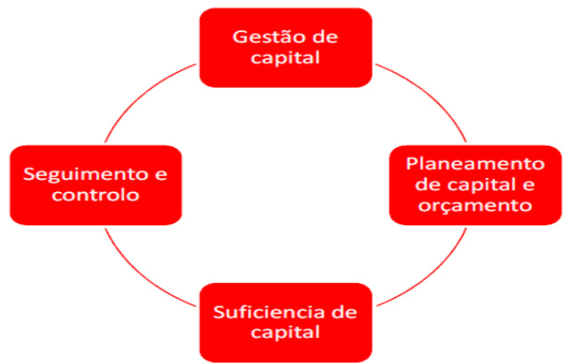  
Figura 10 – Gestão de Capital  

De forma a garantir a solidez e eficiência do Capital a sociedade define periodicamente objetivos a um nível granular apropriado relativamente a:  

Os indicadores objetivo;   
O conjunto de limiares que ativam o processo de escalamento; A frequência e revisão dos objetivos e limiares;   
O Governo do processo.  

Na Política de Apetite por Risco, a Santander Totta Seguros definiu objetivos e limites de Solvência procedendo à sua monitorização de forma regular. A Política contém um processo de Governação, incluindo o processo e as entidades envolvidas em caso de incumprimento dos limites estabelecidos.  

Ao nível da aprovação da estrutura de Fundos Próprios, a Santander Totta Seguros define, no mínimo:  

Os planos sobre recompra e emissão de instrumentos de Capital;  

A composição dos Fundos Próprios.  

Com uma periocidade mínima trimestral é efetuado o cálculo dos Fundos Próprios elegíveis para o cumprimento dos requisitos quantitativos de acordo com a regulamentação Solvência II.  

O ORSA, realizado numa base mínima anual, tem uma componente de análise das necessidades globais de Solvência da Santander Totta Seguros, partindo da avaliação realizada ao nível do risco da carteira no ano de referência, e tendo por base quantificações prospetivas de Risco e Capital realizadas a um horizonte temporal de três anos. Deste modo assume-se como um elemento fundamental para uma gestão de Capital adequada, pois permite analisar os riscos e necessidades de capital no curto e médio prazo.  

As conclusões sobre a adequação do capital consideram ainda uma análise do cumprimento de limites de Apetite por Risco no cenário base e em cenários de stress, de forma a avaliar em que medida a exposição ao risco se encontra em harmonia com os limites que a Santander Totta Seguros definiu como estando disposta a aceitar.  

Para a determinação e classificação dos Fundos Próprios a considerar no cálculo do Requisito de Capital são considerados os requisitos definidos na Diretiva 2009/138/CE, em particular o mencionado no art. 87.º, que indica que os Fundos Próprios são constituídos pela soma dos Fundos Próprios de base e dos Fundos Próprios complementares. Os primeiros representam o excesso de Ativos sobre os Passivos, avaliados de acordo com os princípios económicos, somados dos Passivos subordinados. Por sua vez, os Fundos Próprios complementares podem ser constituídos pelos Fundos Próprios, com exceção dos de base, que podem ser mobilizados para absorver perdas, nomeadamente, a parte não realizada do Capital Social, cartas de crédito e garantias ou quaisquer outros compromissos juridicamente vinculativos recebidos pela Sociedade. A Santander Totta Seguros não dispõe de Fundos Próprios complementares.  

Neste ponto apresenta-se a análise dos Fundos Próprios determinados e pela Santander Totta Seguros de acordo com o Regime de Solvência II. Reportam-se os Fundos Próprios disponíveis, a parte considerada elegível para a cobertura do Requisito de Capital de Solvência e do Requisito de Capital Mínimo, bem como a classificação em Tiers do montante disponível em função da sua qualidade.  

No quadro seguinte apresenta-se a composição dos Fundos Próprios da Santander Totta Seguros e a composição da Reserva de Reconciliação relativamente à posição a 31 de dezembro de 2023 e a 31 de dezembro de 2022:   

<html><body><table><tr><td>(emmilharesde euros)</td><td colspan="2">2023</td><td colspan="4">2022</td></tr><tr><td></td><td>Total</td><td>Tier 1 - sem restricoes</td><td>Tier 3</td><td>Total</td><td>Tier 1 -sem restricoes</td><td>Tier 3</td></tr><tr><td></td></tr><tr><td>Fundos Proprios de Base Capital</td><td>47250</td><td>47250</td><td>47250</td><td>47250</td><td></td></tr><tr><td>ReservadeReconciliacao</td><td>116 112</td><td>116 112</td><td></td><td>148191</td><td>148191</td><td></td></tr><tr><td>AtivosporImpostosDiferidos</td><td>0</td><td>0</td><td>0</td><td>0</td><td>0</td><td>0</td></tr><tr><td>Total dosFundosPropriosdeBase</td><td>163362</td><td>163362</td><td>0</td><td>195441</td><td>195441</td><td>0</td></tr><tr><td>Fundosproprioscomplementares</td></tr><tr><td>Total dos fundos proprios complementares</td><td>0</td><td>0</td><td>0</td><td>0</td><td>0</td><td></td></tr><tr><td></td></tr><tr><td>Fundos Proprios disponiveis e elegiveis</td><td>163362</td><td>163362</td><td>0</td><td>195441</td><td></td><td>0</td></tr><tr><td>TotaldisponivelparacalculodeSCR Total disponivelparacalculo deMCR</td><td>163362</td><td>163362</td><td></td><td>195441</td><td>195441 195441</td><td></td></tr><tr><td>Total elegivel para calculo de SCR</td><td>163362</td><td>163362</td><td>0</td><td>195441</td><td>195441</td><td></td></tr><tr><td>TotalelegivelparacalculodeMCR</td><td>163362</td><td>163362</td><td></td><td>195441</td><td>195441</td><td></td></tr><tr><td>SCR</td><td>76 474</td><td></td><td></td><td>85268</td><td></td><td></td></tr><tr><td>MCR</td><td>19119</td><td></td><td></td><td>21317</td><td></td><td></td></tr><tr><td>Racio fundos proprios elegiveis para SCR</td><td>+214%</td><td></td><td></td><td>+229%</td><td></td><td></td></tr><tr><td>Racio fundos proprios para MCR</td><td>+854%</td><td></td><td></td><td>+917%</td><td></td><td></td></tr></table></body></html>

Tabela 30 – Capital disponível em Solvência II da Santander Totta Seguros  

Tabela 31 - Reserva de Reconciliação da Santander Totta Seguros   

<html><body><table><tr><td colspan="3">ReservadeReconcrtlacao</td></tr><tr><td>(emmilharesdeeuros)</td><td>2023</td><td>2022</td></tr><tr><td>Excessodeativossobrepassivos</td><td>189628</td><td>195441</td></tr><tr><td>DividendosPrevistos</td><td>26266</td><td></td></tr><tr><td>Outrositensdefundospropriosbase</td><td>47250</td><td>47250</td></tr><tr><td>Total Reserva Reconciliacao</td><td>116112</td><td>148191</td></tr></table></body></html>  

No que diz respeito à Reserva de Reconciliação, esta representa um papel relevante na análise dos Fundos Próprios. É obtida através da análise do excesso de Ativos sobre Passivos do Balanço Económico, deduzindo os outros Fundos Próprios de base considerados e ajustamentos.  

Relativamente ao excesso de Ativos sobre Passivos verificou-se um decréscimo de $3\%$ em resultado da evolução da atividade, dos resultados obtidos e da revisão dos pressupostos. Encontra-se prevista a distribuição de dividendos no valor de 26,3 milhões de euros.  

No final de 2023, a totalidade dos Fundos Próprios disponíveis é classificada como Tier 1. No Tier 1, a Santander Totta Seguros só dispõe de fundos de natureza não restrita e são compostos pelo Capital Social e Reserva de Reconciliação, revelando uma qualidade muito elevada.  

Considerando os requisitos e limites de elegibilidade em vigor, a Santander Totta Seguros apresentava, no final de 2023, um Rácio de Capital de Solvência de $274\%$ ( $229\%$ em 2022).  

No contexto de Solvência II, são requeridos determinados limites para o total de Capital elegível para cobrir o Requisito de Capital de Solvência e o Requisito de Capital Mínimo pelos vários Tiers de Capital e que se encontram descritos no Artigo $82^{\circ}$ do Regulamento Delegado 2015/35.  

No âmbito do Requisito de Capital de Solvência, a restrição que estabelece que a proporção de Fundos Próprios elegíveis classificados como Tier 1 deve ser superior a metade do montante do Requisito de Capital de Solvência é verificada, pois a totalidade dos Fundos Próprios são Tier 1, logo representam $214\%$ do Requisito de Capital de Solvência ( $229\%$ em 2022).  

Uma vez que a Santander Totta Seguros não detém Fundos Próprios de Tier 1 de natureza restrita, também se verifica a condição relativa aos $20\%$ do total de Tier 1.  

Em contexto de Solvência II, os Fundos Próprios estão atribuídos na totalidade ao Capital de Tier 1 Unrestricted, correspondendo esta categoria a um peso de $700\%$ do Capital total disponível, refletindo assim a elevada qualidade e disponibilidade dos mesmos.  

Adicionalmente, nota-se que as alterações significativas dos Fundos Próprios durante o período abrangido pelo Relatório dizem respeito apenas à Reserva de Reconciliação. Não houve elementos de Fundos Próprios emitidos nem instrumentos resgatados durante o ano.  

De modo a tornar visível o cumprimento da Santander Totta Seguros em relação aos limites requeridos para o período em análise, são apresentados na tabela seguinte os resultados da análise efetuada para a adequação da decomposição do Capital de Solvência II por Tiers, tendo em conta o valor total de Capital elegível para cobrir o Requisito de Capital de Solvência e o Requisito de Capital Mínimo:  

<html><body><table><tr><td>Tier1</td><td>2023</td><td>2022</td><td>Tier3</td><td>2023</td><td>2022</td></tr><tr><td>AproporcaodeitensdeTier1noSCRtem deserpelomenosde50%</td><td>+214%</td><td>+229%</td><td>AproporcaodeitensdeTier3noSCR temdeserinferiora15%</td><td>+0%</td><td>+0%</td></tr><tr><td>Tier1:50%doSCR</td><td>Ok</td><td>Ok</td><td>Tier3:15%doSCR</td><td>Ok</td><td>Ok</td></tr><tr><td>Tier1Restricted</td><td>2023</td><td>2022</td><td>Tier1-MCR</td><td>2023</td><td>2022</td></tr><tr><td>AproporcaodeitensdeTier1Restrictedno TotaldeTier1temdeserinferiorade20%</td><td>+0%</td><td>+0%</td><td>AproporcaodeitensdeTier1noMCR temdeserpelomenosde80%</td><td>+854%</td><td>+917%</td></tr><tr><td>Tier1Restricted:20%doTier1(Total)</td><td>Ok</td><td>Ok</td><td>Tier1:80%doMCR</td><td>Ok</td><td>Ok</td></tr></table></body></html>

Tabela 32 – Adequação da decomposição do Capital de Solvência da Santander Totta Seguros  

O Requisito de Capital de Solvência e Requisito Capital Mínimo são maioritariamente cobertos por elementos de Tier 1 em cumprimento do critério de elegibilidade, obedecendo à condição de a proporção deste item representar um mínimo de $50\%$ do Requisito de Capital de Solvência e de $80\%$ do Requisito de Capital Mínimo.  

Com base na avaliação realizada, foi revelada uma adequada decomposição dos Fundos Próprios disponíveis para cobrir o Requisito de Capital de Solvência e Requisito Capital Mínimo.  

# E.2 Requisito de Capital de Solvência e Requisito de Capital Mínimo  

Neste ponto é apresentada a composição do Requisito de Capital de Solvência, o Requisito de Capital Mínimo e os seus respetivos níveis de cobertura. São também analisados os benefícios de diversificação considerados e o ajustamento para a capacidade de absorção de perdas das Provisões Técnicas.  

# Requisito de Capital de Solvência  

Para o cálculo do Requisito de Capital de Solvência, a Santander Totta Seguros utiliza a fórmula padrão prevista nos artigos 119.º a 129.º do Regime Jurídico de Acesso e Exercício da Atividade Seguradora e Resseguradora, sem recurso a simplificações ou parâmetros específicos da Santander Totta Seguros.  

Note-se também que a Santander Totta Seguros não tem fundos circunscritos para fins específicos nem carteiras com ajustamento de congruência, não sendo assim necessário proceder a ajustamentos relativos a estas rúbricas.  

No quadro seguinte apresenta-se a decomposição do Requisito de Capital de Solvência em grandes componentes, com referência ao final do ano de 2023 e de 2022, focando, nomeadamente, a composição do Requisito de Capital de Solvência de Base e os ajustamentos para a capacidade de absorção de perdas das Provisões Técnicas e dos Impostos Diferidos.  

Tabela 33 – Requisito de Capital da Santander Totta Seguros   

<html><body><table><tr><td>(em milharesdeeuros)</td><td>2023</td><td>2022</td></tr><tr><td>RiscodeMercado</td><td>48787</td><td>38061</td></tr><tr><td>RiscodeIncumprimentodeContraparte</td><td>7382</td><td>5595</td></tr><tr><td>RiscoEspecificodeVida</td><td>38550</td><td>60486</td></tr><tr><td>RiscoRiscoEspecificodeAcidenteseDoenca</td><td>0</td><td>0</td></tr><tr><td>Diversificacao</td><td>(22 722)</td><td>(23 116)</td></tr><tr><td>RiscodeAtivosIntangiveis</td><td>0</td><td>0</td></tr><tr><td>Requisito de Capital de Solvencia Base (BSCR)</td><td>71996</td><td>81027</td></tr><tr><td>RiscoOperacional</td><td>4478</td><td>4929</td></tr><tr><td>CapacidadedeAbsorcaodePerdasdasProvisoesTecnicas</td><td>0</td><td>(688)</td></tr><tr><td>CapacidadedeAbsorcaodePerdasdosImpostosDiferidos</td><td>0</td><td>0</td></tr><tr><td>RequisitodeCapitaldeSolvencia(SCR)</td><td>76474</td><td>85268</td></tr></table></body></html>  

Em 2023, os principais riscos aos quais a Santander Totta Seguros se encontra exposta são o Risco de Mercado e Risco Específico de Vida, representando ambos cerca de $88\%$ do valor do Requisito de Capital de Solvência de Base. O decréscimo observado no SCR deveu-se essencialmente à redução dos requisitos de capital do Risco Específico de Vida, cujas justificações encontram-se mencionadas no Capítulo C.2.  

O efeito de diversificação que resulta da agregação dos módulos de risco fixou-se nos 22,7 milhões de euros (23,1 milhões de euros em 2022), o que representa um decréscimo de $23\%$ do valor do BSCR.  

Comparativamente com o período anterior, verifica-se que, em 2023, rácio do Requisito de Capital de Solvência reduziu aproximadamente 15 pontos percentuais, de $229\%$ para $274\%$ , justificado pelo decréscimo mais acentuado dos Fundos Próprios face à redução do Requisito de Capital de Solvência.  

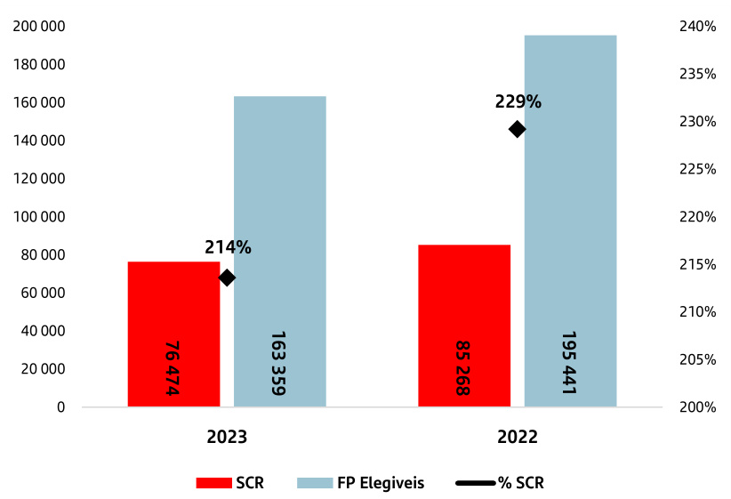  
Figura 11 – Evolução do Requisito de Capital de Solvência da Santander Totta Seguros  

As informações relativas às principais alterações ao Requisito de Capital de Solvência no período abrangido pelo presente Relatório, bem como os motivos dessas alterações, encontram-se incluídas no Capítulo C.  

# Requisito de Capital Mínimo  

O que diz respeito ao Requisito de Capital Mínimo, o seu valor reduziu para 19,1 milhões de euros (21,3 milhões de euros em 2022), devido ao decréscimo do Requisito de Capital. As diferentes componentes do seu cálculo encontram-se resumidas na tabela seguinte:  

Cálculo do MCR   
Tabela 34 – Componentes do Requisito de Capital Mínimo da Santander Totta Segu   

<html><body><table><tr><td>(emmilharesdeeuros)</td><td>2023</td><td>2022</td></tr><tr><td>MCRLinear</td><td>2468</td><td>3352</td></tr><tr><td>ComponenteVida</td><td>(2 468)</td><td>(3352)</td></tr><tr><td>ComponenteNaoVida</td><td>0</td><td>0</td></tr><tr><td>SCR</td><td>76 474</td><td>85268</td></tr><tr><td>MCRMaximo</td><td>34414</td><td>38371</td></tr><tr><td>MCRMinimo</td><td>19119</td><td>21317</td></tr><tr><td>MCRCombinado</td><td>19119</td><td>21317</td></tr><tr><td>MinimoAbsolutoMCR</td><td>4000</td><td>4000</td></tr><tr><td>MCR</td><td>19119</td><td>21317</td></tr></table></body></html>  

O decréscimo do Requisito de Capital Mínimo está diretamente relacionado com o decréscimo no montante do Requisito de Capital de Solvência.  

O gráfico seguinte apresenta a comparação do montante total do Requisito de Capital Mínimo entre 31 de dezembro de 2023 e 31 de dezembro de 2022:  

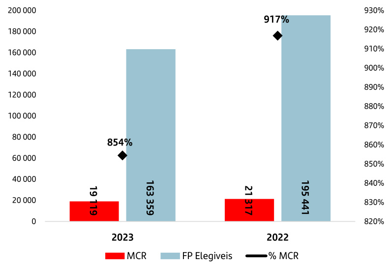  
Figura 12 – Evolução do Requisito de Capital Mínimo da Santander Totta Seguros  

O Requisito de Capital Mínimo decresceu cerca de $70\%$ e os Fundos Próprios elegíveis para cobertura do Requisito de Capital Mínimo reduziram cerca de $76\%$ , o rácio do Requisito de Capital Mínimo decresceu 62 pontos percentuais, isto $\dot{\mathbf{e}}$ , passou de $977\%$ para $854\%$ .  

# E.3 Utilização do Submódulo de Risco Acionista baseado na Duração para calcular o Requisito de Capital de Solvência  

A Santander Totta Seguros não utiliza o submódulo de Risco Acionista baseado na duração, previsto no ${\mathsf{n}}.^{0}\ {\mathsf{5}}$ do artigo 125.º do Regime Jurídico de Acesso e Exercício da Atividade Seguradora e Resseguradora.  

# E.4 Diferenças entre a Fórmula-Padrão e qualquer Modelo Interno utilizado  

Conforme referido, a Santander Totta Seguros utiliza a Fórmula-Padrão, não aplicando qualquer modelo interno.  

# E.5 Incumprimento do Requisito de Capital Mínimo e incumprimento do Requisito de Capital de Solvência  

Não ocorreu qualquer incumprimento do Requisito de Capital Mínimo ou do Requisito de Capital de Solvência durante o período abrangido pelo presente relatório da Santander Totta Seguros.  

# E.6 Eventuais Informações Adicionais  

Adicionalmente, não se considera que exista qualquer informação adicional, para além da anteriormente apresentada, que seja considerada significativa.  

# S.02.01 - Balanço  

Ativos   

<html><body><table><tr><td colspan="2">(em milhares de euros)</td><td>ValorSolvenciaIl</td></tr><tr><td>Goodwill</td><td>R0010</td><td></td></tr><tr><td>Custos de aquisicao diferidos</td><td>R0020</td><td></td></tr><tr><td>Ativos intangiveis</td><td>R0030</td><td>0</td></tr><tr><td>Ativos por Impostos Diferidos</td><td>R0040</td><td>2384</td></tr><tr><td>Excedente de prestacoes de pensao</td><td>R0050</td><td>24</td></tr><tr><td>Imoveis, instalacoes e equipamento para uso proprio</td><td>R0060</td><td>78</td></tr><tr><td>Investimentos(quenaoAtivosdetidosnoquadrodecontratosligadosa indices ea unidades de participacao)</td><td>R0070</td><td>831071</td></tr><tr><td>Imoveis (que nao para uso proprio)</td><td>R0080</td><td>0</td></tr><tr><td>Interesses em empresas relacionadas, incluindo participacoes</td><td>R0090</td><td>51908</td></tr><tr><td>Titulos deFundos Proprios</td><td>R0100</td><td>860</td></tr><tr><td>Acoes—cotadas em bolsa</td><td>R0110</td><td>0</td></tr><tr><td>Acoes — nao cotadas em bolsa</td><td></td><td>860</td></tr><tr><td>Obrigacoes</td><td>R0130</td><td>711762</td></tr><tr><td>Obrigacoesdedividapublica</td><td>R0140</td><td>543450</td></tr><tr><td>Obrigacoes de empresas</td><td>R0150</td><td>168312</td></tr><tr><td>Titulos dedivida estruturados</td><td>R0160</td><td>0</td></tr><tr><td>Titulos de divida garantidos com colateral</td><td>R0170</td><td>0</td></tr><tr><td>Organismosdeinvestimentocoletivo</td><td>R0180</td><td>1788</td></tr><tr><td>Derivados</td><td>R0190</td><td>0</td></tr><tr><td>Depositosquenaoequivalentesanumerario</td><td>R0200</td><td>64661</td></tr><tr><td>Outrosinvestimentos</td><td>R0210</td><td>92</td></tr><tr><td>Ativosdetidosnoquadrodecontratosligados aindiceseaunidades de participacao</td><td>R0220</td><td>2963690</td></tr><tr><td>Emprestimosehipotecas</td><td>R0230</td><td>1388</td></tr><tr><td>Emprestimossobre apolicesdeseguro</td><td>R0240</td><td>0</td></tr><tr><td>Emprestimosehipotecas aparticulares</td><td>R0250</td><td>42</td></tr><tr><td>Outros emprestimos ehipotecas</td><td>R0260</td><td>1346</td></tr><tr><td>Montantesrecuperaveisdecontratos deressegurodosramos:</td><td>R0270</td><td>3222</td></tr><tr><td>Nao-vida e acidentes e doenca com bases tecnicas semelhantes as do ramonao-vida</td><td>R0280</td><td>0</td></tr><tr><td>Nao-vida, excluindo seguros de acidentes e doenca</td><td>R0290</td><td>0</td></tr><tr><td>Acidentese doencacombases tecnicassemelhantes as doramo nao-vid Vida eacidentese doenca combases tecnicassemelhantes asdo Ramo</td><td>R0300</td><td>0</td></tr><tr><td>Vida,excluindo seguros de acidentes e doencae contratos ligados a indiceseaunidadesdeparticipacao</td><td>R0310</td><td>3311</td></tr><tr><td>Acidentesedoenca com bases tecnicassemelhantesas doRamoVida</td><td>R0320</td><td>0</td></tr><tr><td>Vida,excluindo segurosde acidentes e doenca e contratos ligados aindic Vida, ligado a indices e a unidades de participacao</td><td>R0330 R0340</td><td>3311</td></tr><tr><td>Depositos em cedentes</td><td>R0350</td><td>(89) 0</td></tr><tr><td>Valores a receber de operacoes de seguroemediadores</td><td>R0360</td><td></td></tr><tr><td>Valores arecebera titulodeoperacoes deresseguro</td><td>R0370</td><td>3320</td></tr><tr><td></td><td></td><td>0</td></tr><tr><td>Valoresareceber(deoperacoescomerciais,naodeseguro)</td><td>R0380</td><td>11953</td></tr><tr><td>Acoesproprias(detidas diretamente)</td><td>R0390</td><td>0</td></tr><tr><td>Montantes devidos a titulode elementos dosFundosProprios ou dosfundos</td><td>R0400</td><td>0</td></tr><tr><td>Caixa e equivalentes decaixa</td><td>R0410</td><td>46289</td></tr><tr><td>Quaisquer outros ativos,nao incluidos noutros elementos do Balango</td><td>R0420</td><td>7072</td></tr><tr><td>ATIVOSTOTAIS</td><td>R0500</td><td>3870492</td></tr></table></body></html>  

Passivos   

<html><body><table><tr><td colspan="2">(em milhares de euros)</td><td>ValorSolvenciaIl</td></tr><tr><td>ProvisoesTecnicas—nao-vida</td><td>R0510</td><td>0</td></tr><tr><td>ProvisoesTecnicas—nao-vida(excluindoacidentese doenca)</td><td>R0520</td><td>0</td></tr><tr><td>PT calculadasnoseutodo</td><td>R0530</td><td>0</td></tr><tr><td>Melhor Estimativa</td><td>R0540</td><td>0</td></tr><tr><td>Margem de Risco</td><td>R0550</td><td>0</td></tr><tr><td>ProvisoesTecnicas—acidentese doenca(combases tecnicas semelhantes as do ramo nao-vida)</td><td>R0560</td><td>0</td></tr><tr><td>PT calculadas no seu todo</td><td>R0570</td><td>0</td></tr><tr><td>Melhor Estimativa</td><td>R0580</td><td>0</td></tr><tr><td>Margem de Risco</td><td>R0590</td><td>0</td></tr><tr><td>ProvisoesTecnicas—vida(excluindoos seguros ligadosaindices ea unidades de participacao)</td><td>R0600</td><td>551298</td></tr><tr><td>Provisoes Tecnicas — acidentes e doenca (com bases tecnicas semelhantes as do Ramo Vida)</td><td>R0610</td><td>0</td></tr><tr><td>PT calculadas no seu todo</td><td>R0620</td><td>0</td></tr><tr><td>MelhorEstimativa</td><td>R0630</td><td>0</td></tr><tr><td>Margem deRisco</td><td>R0640</td><td>0</td></tr><tr><td>Provisoes Tecnicas—vida(excluindo os seguros de acidentes e doenca e contratosligadosaindicesea unidades departicipacao)</td><td>R0650</td><td>551298</td></tr><tr><td>PT calculadas no seu todo</td><td>R0660</td><td>0</td></tr><tr><td>Melhor Estimativa</td><td>R0670</td><td>537859</td></tr><tr><td>Margem de Risco</td><td>R0680</td><td>13439</td></tr><tr><td>ProvisoesTecnicas—contratosligadosaindiceseaunidadesde participacao</td><td>R0690</td><td>3031634</td></tr><tr><td>PT calculadas no seu todo</td><td>R0700</td><td>2821917</td></tr><tr><td>Melhor Estimativa</td><td>R0710</td><td>202768</td></tr><tr><td>Margem de Risco</td><td>R0720</td><td>6950</td></tr><tr><td>OUTROSPASSIVOS</td><td>R0730</td><td>0</td></tr><tr><td>Passivos contingentes</td><td>R0740</td><td>0</td></tr><tr><td>ProvisoesquenaoProvisoesTecnicas</td><td>R0750</td><td>168</td></tr><tr><td>Obrigacoes a titulo deprestacoes depensao</td><td>R0760</td><td>349</td></tr><tr><td>Depositos de resseguradores</td><td>R0770</td><td>0</td></tr><tr><td>PassivosporImpostosDiferidos</td><td>R0780</td><td>15 435</td></tr><tr><td>Derivados</td><td>R0790</td><td>0</td></tr><tr><td>Dividas a instituicoes de credito</td><td>R0800</td><td>47642</td></tr><tr><td>Passivosfinanceirosque naosejam dividas ainstituicoes decredito</td><td>R0810</td><td>13 327</td></tr><tr><td>Valoresapagardeoperacoesdeseguroemediadores</td><td>R0820</td><td>9077</td></tr><tr><td>Valores apagara titulo de operacoes de resseguro</td><td>R0830</td><td>2859</td></tr><tr><td>Valoresapagar(deoperacoescomerciais,naodeseguro)</td><td>R0840</td><td>3315</td></tr><tr><td>Passivossubordinados</td><td>R0850</td><td>0</td></tr><tr><td>Passivossubordinadosnao classificadosnosFundosPropriosdebase(FPE</td><td>R0860</td><td>0</td></tr><tr><td>Passivos subordinadosclassificadosnosFundosProprios debase(FPB)</td><td>R0870</td><td>0</td></tr><tr><td>Quaisquer outrosPassivosnaoincluidosnoutroselementosdoBalanco</td><td>R0880</td><td>5760</td></tr><tr><td>TOTALDOSPASSIVOS</td><td>R0900</td><td>3680864</td></tr><tr><td>EXCEDENTEDOATIVOSOBREOPASSIVO</td><td>R1000</td><td>189628</td></tr></table></body></html>  

S.05.01 - Prémios, Sinistros e despesas por classe de negócio   

<html><body><table><tr><td colspan="6"></td><td colspan="3">Responsabilidades deresseguro devida</td><td rowspan="2">Total</td></tr><tr><td>(em mithares de euros)</td><td>Seguros de acidentes e doenca</td><td>Seguros com participacao nos resultados</td><td>Responsabilidadesdesegurosdevida Seguros ligados a indices e unidades de participacao</td><td>Outros seguros de vida</td><td>Anuidades decorrentes de contratos de seguro do ramo nao-vida relacionadas com responsabilidades de seguro de acidentes e doenca</td><td>Anuidades decorrentesde contratosdeseguro do ramo nao-vida relacionadas com outras responsabilidades de seguro que nao de acidentes e doenca</td><td>Resseguro de acidentes e doenca</td><td>Resseguro do Ramo Vida</td></tr><tr><td>Premios emitidos</td><td>C0210 C0220</td><td></td><td>C0230</td><td>C0240</td><td>C0250</td><td>C0260</td><td>C0270</td><td>C0280</td></tr><tr><td></td><td></td><td></td><td></td><td></td><td></td><td></td><td></td><td></td><td>C0300</td></tr><tr><td>Valorbruto</td><td>0</td><td>18879</td><td>354 972</td><td>56509</td><td>0</td><td>0</td><td>0</td><td>0</td><td>430360</td></tr><tr><td>Parte dosresseguradores</td><td>0</td><td>642</td><td>247</td><td>51533 4976</td><td>0</td><td>0</td><td>0</td><td>0</td><td>52422</td></tr><tr><td>Liquido</td><td>0</td><td>18237</td><td>354725</td><td></td><td>0</td><td>0</td><td>0</td><td>0</td><td>377939</td></tr><tr><td>Premios adquiridos</td><td></td><td></td><td></td><td></td><td></td><td></td><td></td><td></td><td></td></tr><tr><td>Valorbruto</td><td>0</td><td>18879</td><td>354 972</td><td>56728</td><td>0 0</td><td>0</td><td>0 0</td><td>0 0</td><td>430579</td></tr><tr><td>Partedosresseguradores</td><td>0</td><td>641</td><td>247 354725</td><td>51750 4979</td><td>0</td><td>0 0</td><td>0</td><td>0</td><td>52638 377941</td></tr><tr><td>Liquido</td><td>0</td><td>18237</td><td></td><td></td><td></td><td></td><td></td><td></td><td></td></tr><tr><td>Sinistrosocorridos</td><td></td><td></td><td>281541</td><td>17302</td><td>0</td><td>0</td><td>0</td><td>0</td><td>386949</td></tr><tr><td>Valorbruto</td><td>0</td><td>88106 569</td><td>1</td><td>10216</td><td>0</td><td>0</td><td>0</td><td>0</td><td>10786</td></tr><tr><td>Partedosresseguradores</td><td>0</td><td>87537</td><td>281540</td><td>7086</td><td>0</td><td>0</td><td>0</td><td>0</td><td>376163</td></tr><tr><td>Liquido</td><td>0</td><td></td><td></td><td></td><td></td><td></td><td>0</td><td>0</td><td>25379</td></tr><tr><td>Despesasefetuadas</td><td>0</td><td>3228</td><td>20706</td><td>1446</td><td>0</td><td>0</td><td></td><td></td><td></td></tr></table></body></html>  

<html><body><table><tr><td></td><td colspan="6">Ramo:Responsabilidades de seguros devida</td><td colspan="2">Responsabilidadesderessegurodevida</td><td rowspan="5"></td><td rowspan="5"></td></tr><tr><td rowspan="2">(emmitharesde euros)</td><td colspan="5"></td><td rowspan="2">Anuidades Anuidades decorrentes de</td><td rowspan="2">Resseguro de Resseguro do Ramo acidentes e doenca Vida</td><td rowspan="2">Total</td></tr><tr><td>Seguros de acidentes e doenca</td><td>Seguros com participacao nos resultados</td><td>Seguros ligados a indices e unidades de participacao</td><td>Outrossegurosde vida</td><td>decorrentesde contratosdeseguro do ramo nao-vida relacionadas com responsabilidades de seguro de acidentes e doenca</td><td>contratos de seguro do ramo nao-vida relacionadas com outras responsabilidades de seguro que nao de acidentes e doenca</td></tr><tr><td></td><td>C0210</td><td>C0220</td><td>C0230</td><td>C0240</td><td>C0250</td><td>C0260</td><td>C0270</td><td>C0280</td></tr><tr><td>DespesasAdministrativas</td><td></td><td>882</td><td></td><td></td><td></td><td>0</td><td>0</td><td>0</td><td>C0300</td></tr><tr><td>Valorbruto</td><td>0</td><td>0</td><td>1968 0</td><td>662</td><td>0</td><td>0 0</td><td>0</td><td>0</td><td>3512</td></tr><tr><td>Partedosresseguradores</td><td>0</td><td>882</td><td>1968</td><td>0 662</td><td>0</td><td>0</td><td>0</td><td>0</td><td>0 3512</td></tr><tr><td>Liquido DespesasGestaodeInvestimentos</td><td>0</td><td></td><td></td><td></td><td></td><td></td><td></td><td></td><td></td></tr><tr><td></td><td></td><td>378</td><td>3797</td><td>43</td><td>0</td><td>0</td><td>0</td><td>0</td><td>4218</td></tr><tr><td>Valorbruto Partedosresseguradores</td><td>0 0</td><td>0</td><td>0</td><td></td><td>0</td><td>0 0</td><td>0</td><td>0</td><td>0</td></tr><tr><td>Liquido</td><td>0</td><td>378</td><td>3797</td><td>43</td><td>0</td><td>0</td><td>0</td><td>0</td><td>4218</td></tr><tr><td>DespesasGestaodeSinistros</td><td></td><td></td><td></td><td></td><td></td><td></td><td></td><td></td><td></td></tr><tr><td>Valorbruto</td><td>0</td><td>39</td><td>51</td><td>1344 0</td><td>0</td><td>0</td><td>0 0</td><td>0</td><td>1434</td></tr><tr><td>Partedosresseguradores</td><td>0</td><td>0</td><td>0</td><td>1344</td><td>0 0</td><td>0 0</td><td>0</td><td>0 0</td><td>0</td></tr><tr><td>Liquido</td><td>0</td><td>39</td><td>51</td><td></td><td></td><td></td><td></td><td></td><td>1434</td></tr><tr><td>Despesas Aquisicao</td><td></td><td></td><td>15 031</td><td>19 322</td><td></td><td>0</td><td>0</td><td>0</td><td></td></tr><tr><td>Valorbruto</td><td>0</td><td>1960</td><td>140</td><td>19 924</td><td></td><td>0 0 0</td><td>0</td><td>0</td><td>36312</td></tr><tr><td>Parte dosresseguradores</td><td>0</td><td>31 1929</td><td>14890</td><td>(602)</td><td></td><td>0 0</td><td>0</td><td>0</td><td>20096</td></tr><tr><td>Liquido</td><td>0</td><td></td><td></td><td></td><td></td><td></td><td></td><td></td><td>16217</td></tr><tr><td>Outras despesas</td><td></td><td></td><td></td><td></td><td></td><td></td><td></td><td></td><td>0</td></tr><tr><td>Total dasDespesas</td><td></td><td></td><td></td><td></td><td></td><td></td><td></td><td></td><td>25379</td></tr></table></body></html>  

<html><body><table><tr><td rowspan="2" colspan="3">(em mithares de euros) R0010</td><td rowspan="2">Seguroscomparticipacaonos resultados</td><td colspan="3">Segurosligadosaindiceseunidadesde participacao</td><td colspan="3">Outros seguros de vida</td><td rowspan="2">Anuidadesdecorrentesde contratos de seguro do ramo nao-vida</td><td rowspan="2"></td><td>Total (Vidaexcetosegurosdeacidentes</td></tr><tr><td></td><td>Contratos sem Contratos opcoesnem comopcoese garantias garantias</td><td></td><td>Contratos sem Contratoscom opcoes nem opcoese garantias garantias</td><td>relacionadascomoutras responsabilidades de seguro que nao de</td><td>Resseguro aceite e doenca,incluindo contratos ligados a unidades de</td></tr><tr><td colspan="3">visoesTecnicas calculadas como um todo</td><td>CO020</td><td>O0 2 821 917</td><td>CO040 CO050</td><td>CO060</td><td>CO070</td><td>C0080</td><td>acidentese doenca 06000</td><td>C0100</td><td>participacao) C0150</td></tr><tr><td colspan="3">l dos Montantes recuperaveis de contratos de resseguro/EOETe Resseguro Finito apos o tamento para perdas esperadas por incumprimento da contraparte associados as Provisoes</td><td>R0020</td><td></td><td></td><td></td><td></td><td></td><td></td><td></td><td>2 821 917</td></tr><tr><td colspan="3">nicas calculadasnoseu todo</td><td></td><td></td><td></td><td></td><td></td><td></td><td></td><td></td><td></td></tr><tr><td colspan="3">risoesTecnicascalculadascomoasomadaMEedaMR</td><td></td><td></td><td></td><td></td><td></td><td></td><td></td><td></td><td></td></tr><tr><td colspan="3">horEstimativa horEstimativabruta</td><td>R0030 490 477</td><td></td><td>202768</td><td></td><td>32265</td><td>15 117</td><td></td><td></td><td>740626</td></tr><tr><td colspan="3">l doMontante recuperavel de contratos deresseguro/EOETeResseguroFinito apos</td><td>R0080 512</td><td></td><td>(89)</td><td></td><td>2798</td><td></td><td></td><td></td><td></td></tr><tr><td colspan="3">tamentoparaperdasesperadasporincumprimentodacontraparte</td><td></td><td></td><td></td><td></td><td></td><td></td><td></td><td></td><td>3222</td></tr><tr><td colspan="3">hor Estimativa menos montante recuperavel de contratos deresseguro/EOETeresseguro finito otal</td><td>R0090 489964</td><td></td><td>202856</td><td></td><td>29466</td><td>15117</td><td></td><td></td><td>737 404</td></tr><tr><td colspan="3">gemdeRisco</td><td>R0100</td><td>13 071 6950</td><td></td><td></td><td>368</td><td></td><td></td><td></td><td>20389</td></tr><tr><td colspan="3">tante dasmedidas transitorias nasProvisoesTecnicas isoesTecnicascalculadascomoumtodo</td><td>R0110</td><td></td><td></td><td></td><td></td><td></td><td></td><td></td><td></td></tr><tr><td colspan="3">horEstimativa</td><td></td><td></td><td></td><td></td><td></td><td></td><td></td><td></td><td></td></tr><tr><td colspan="3">gemdeRisco</td><td></td><td></td><td></td><td></td><td></td><td></td><td></td><td></td><td></td></tr><tr><td colspan="3">VISOESTECNICAS-TOTAL</td><td>503548</td><td>3031634</td><td></td><td>47750</td><td></td><td></td><td></td><td></td><td></td></tr><tr><td rowspan="6">n-outFlows</td><td>BeneficiosGarantidoseDiscricionariosFuturos</td><td>R0120 R0130 R0200 R0230</td><td></td><td>215795</td><td></td><td>62965</td><td></td><td></td><td></td><td></td><td>3582932</td></tr><tr><td>BeneficiosGarantidosFuturos</td><td>RO240</td><td>548735</td><td></td><td></td><td></td><td></td><td></td><td></td><td></td><td>846379</td></tr><tr><td>Beneficios DiscricionariosFuturos RO250</td><td></td><td>18884</td><td></td><td></td><td></td><td></td><td></td><td></td><td></td><td>548735</td></tr><tr><td>Despesas Futuras e outros cash out-flows</td><td>R0260</td><td>32995</td><td>129313</td><td></td><td>9067</td><td></td><td></td><td></td><td></td><td>18884</td></tr><tr><td>R0270</td><td></td><td>110137</td><td></td><td></td><td>24650</td><td></td><td></td><td></td><td></td><td>171 374 134787</td></tr><tr><td>Premios Futuros n-in Flows Outros cash in-flows</td><td>R0280</td><td></td><td>142 340 2 821 917</td><td></td><td></td><td>0</td><td></td><td></td><td></td><td>142 340</td></tr><tr><td colspan="2">rdeResgate</td><td>R0290</td><td>476 577</td><td></td><td></td><td>51119</td><td></td><td></td><td></td><td></td><td>3349612</td></tr><tr><td colspan="2">visoesTecnicasSujeitasaoAjustamentodeVolatilidade</td><td>R0330</td><td>490 477</td><td>202768</td><td></td><td>47382</td><td></td><td></td><td></td><td></td><td>740626</td></tr><tr><td colspan="2">os Esperadoincluidosnos Premios Futuros(EPFIP)</td><td>R0370</td><td>110137</td><td>0</td><td></td><td>24650</td><td></td><td></td><td></td><td></td><td>134787</td></tr><tr><td colspan="2"></td><td></td><td></td><td></td><td></td><td></td><td></td><td></td><td></td><td></td><td></td></tr></table></body></html>  

<html><body><table><tr><td colspan="3">(em mithares de euros)</td><td colspan="3">Seguro de doenca (seguro direto)</td><td rowspan="2">Anuidadesdecorrentesde contratosdesegurodoramo nao-vida relacionadas com responsabilidadesdeseguro de acidentes e doenca</td><td rowspan="2">Seguro de doenca (resseguro aceite)</td><td rowspan="2">TOTAL (Seguros de doenca com bases tecnicassemelhantesas dos seguros do Ramo Vida)</td></tr><tr><td colspan="3"></td><td colspan="3">Contratos Contratos com sem opcoes opcoes nem nem garantias garantias</td></tr><tr><td colspan="2">ProvisoesTecnicascalculadascomoumtodo</td><td>R0010</td><td>C0160</td><td>C0170</td><td>C0180</td><td>C0190</td><td>C0200</td><td>C0210</td></tr><tr><td colspan="2">TotaldosMontantesrecuperaveisdecontratosderesseguro/EOETeResseguroFinitoaposo ajustamento paraperdasesperadas porincumprimento da contraparte associados asProvisoes R0020</td><td></td><td></td><td></td><td></td><td></td><td></td><td></td></tr><tr><td colspan="2">Tecnicascalculadasnoseutodo</td><td></td><td></td><td></td><td></td><td></td><td></td><td></td></tr><tr><td colspan="2">ProvisoesTecnicascalculadascomoa somadaMEedaMR</td><td></td><td></td><td></td><td></td><td></td><td></td><td></td></tr><tr><td colspan="2">MelhorEstimativa</td><td></td><td></td><td></td><td></td><td></td><td></td><td></td></tr><tr><td colspan="2">MelhorEstimativabruta</td><td>R0030</td><td></td><td></td><td></td><td></td><td></td><td></td></tr><tr><td colspan="2">TotaldoMontanterecuperaveldecontratosderesseguro/EOETeResseguroFinito apos ajustamentoparaperdasesperadasporincumprimentodacontraparte</td><td>R0080</td><td></td><td></td><td></td><td></td><td></td><td></td></tr><tr><td colspan="2">MelhorEstimativamenosmontanterecuperaveldecontratosderesseguro/EOETeresseguroFinito</td><td>R0090</td><td></td><td></td><td></td><td></td><td></td><td></td></tr><tr><td colspan="2">-total Margem de Risco</td><td>R0100</td><td></td><td></td><td></td><td></td><td></td><td></td></tr><tr><td colspan="2">MontantedasmedidastransitoriasnasProvisoesTecnicas</td><td></td><td></td><td></td><td></td><td></td><td></td><td></td></tr><tr><td colspan="2">ProvisoesTécnicascalculadascomoumtodo</td><td>R0110</td><td></td><td></td><td></td><td></td><td></td><td></td></tr><tr><td colspan="2">MelhorEstimativa</td><td>R0120</td><td></td><td></td><td></td><td></td><td></td><td>0</td></tr><tr><td colspan="2">Margem deRisco</td><td>R0130</td><td></td><td></td><td></td><td></td><td></td><td></td></tr><tr><td colspan="2">PROVISOESTECNICAS-TOTAL</td><td>R0200</td><td></td><td></td><td></td><td></td><td></td><td></td></tr><tr><td></td><td></td><td>R0230</td><td></td><td></td><td></td><td></td><td></td><td></td></tr><tr><td></td><td>BeneficiosGarantidoseDiscricionariosFuturos</td><td></td><td></td><td></td><td></td><td></td><td></td><td></td></tr><tr><td>Cash-outFlows</td><td>BeneficiosGarantidosFuturos</td><td>R0240</td><td></td><td></td><td></td><td></td><td></td><td></td></tr><tr><td></td><td>BeneficiosDiscricionariosFuturos</td><td>R0250 R0260</td><td></td><td></td><td></td><td></td><td></td><td>00</td></tr><tr><td></td><td>DespesasFuturaseoutroscashout-flows</td><td>R0270</td><td></td><td></td><td></td><td></td><td></td><td>0</td></tr><tr><td>Cash-inFlows</td><td>PremiosFuturos</td><td>R0280</td><td></td><td></td><td></td><td></td><td></td><td></td></tr><tr><td>ValordeResgate</td><td>Outros cash in-flows</td><td>R0290</td><td></td><td></td><td></td><td></td><td></td><td>0</td></tr><tr><td colspan="2"></td><td>R0330</td><td></td><td></td><td></td><td></td><td></td><td></td></tr><tr><td colspan="2">ProvisoesTecnicasSujeitasaoAjustamentodeVolatilidade</td><td>R0370</td><td></td><td></td><td></td><td></td><td></td><td>0</td></tr><tr><td colspan="2">LucrosEsperadoincluidosnosPremiosFuturos(EPFIP)</td><td></td><td></td><td></td><td></td><td></td><td></td><td></td></tr></table></body></html>  

S.22.01 - Medidas Transitórias e de Longo Prazo   

<html><body><table><tr><td rowspan="2">(em mithares de euros)</td><td rowspan="2"></td><td rowspan="2">Montantecomas Garantias a Longo Prazoemedidas transitorias</td><td rowspan="2">Semmedidas transitorias ao nivel dasprovisoes tecnicas</td><td rowspan="2">Impactodasmedidas transitoriasaonivel dasprovisoes tecnicas</td><td rowspan="2">Semmedidas transitorias aonivel da taxa dejuro</td><td rowspan="2">Impactodasmedidas transitorias aonivel da taxa dejuro</td><td rowspan="2">Sem ajustamento de volatilidadeesem outrasmedidas transitorias</td><td rowspan="2">Impactodafixacao doajustamento de volatilidadeemzero</td><td rowspan="2">Sem ajustamento de congruenciae sem todasasoutras medidas</td><td rowspan="2">Impactodafixacao do ajustamento de congruenciaem zero</td></tr><tr><td></td></tr><tr><td>ProvisoesTecnicas</td><td>R0010</td><td>CO010 3582932</td><td>CO020 3582 932</td><td>CO030</td><td>CO040 3582932</td><td>CO050</td><td>C0060 3 593 241</td><td>C0070 10309</td><td>C0080 3593241</td><td>06000 C0100</td></tr><tr><td>FundosPropriosdeBase</td><td>R0020</td><td>163 362</td><td>163 362</td><td></td><td>163362</td><td></td><td>181738</td><td>18376</td><td>181738</td><td>Impactodetodas GLPemedidas transitorias 10 18</td></tr><tr><td>Excedente dos ativos sobre os passivos</td><td>R0030</td><td>189628</td><td>189628</td><td></td><td>189628</td><td></td><td>181738</td><td>(7890)</td><td>181738</td><td>(78</td></tr><tr><td>Fundosproprios comrestricoesemrazao defundos circunscritosecarteirasdecongruencia</td><td>R0040</td><td></td><td></td><td></td><td></td><td></td><td></td><td></td><td></td><td></td></tr><tr><td>Fundosproprioselegiveispara cumprimentodoRequisitode</td><td></td><td>163362</td><td>163362</td><td></td><td>163 362</td><td></td><td>155 472</td><td>(7 890)</td><td>155 472</td><td></td></tr><tr><td>CapitaldeSolvencia</td><td>R0050</td><td></td><td></td><td></td><td>163362</td><td></td><td></td><td></td><td></td><td>(78</td></tr><tr><td>Nivel 1 Nivel 2</td><td>R0060 R0070</td><td>163362</td><td>163362</td><td></td><td></td><td></td><td>155 472</td><td>(7890)</td><td>155 472</td><td>(78</td></tr><tr><td>Nivel 3</td><td>R0080</td><td></td><td></td><td></td><td></td><td></td><td></td><td></td><td></td><td></td></tr><tr><td>RequisitodeCapitaldeSolvencia</td><td>R0090</td><td>76 474</td><td>76474</td><td></td><td>76 474</td><td></td><td>76107</td><td>(367)</td><td>76107</td><td></td></tr><tr><td>FundosproprioselegiveisparacumprimentodoRequisitode CapitalMinimo</td><td>R0100</td><td>163362</td><td>163362</td><td></td><td>163362</td><td></td><td>155 472</td><td>(7890)</td><td>155 472</td><td>(78</td></tr><tr><td>RequisitodeCapitalMinimo</td><td>R0110</td><td>19119</td><td>19119</td><td></td><td>19119</td><td></td><td>19027</td><td>(92)</td><td>19027</td><td></td></tr><tr><td>RaciodoRequisitodeCapitaldeSolvencia</td><td>R0120</td><td>+214%</td><td>+214%</td><td></td><td>+214%</td><td></td><td>+204%</td><td>+2149%</td><td>+204%</td><td>+214</td></tr><tr><td>RaciodoRequisitodeCapitalMinimo</td><td>R0130</td><td>+854%</td><td>+854%</td><td></td><td>+854%</td><td></td><td>+817%</td><td>+8598%</td><td>+817%</td><td>+859</td></tr></table></body></html>  

# S.23.01 - Fundos Próprios  

<html><body><table><tr><td>(em milhares de euros)</td><td></td><td>TOTAL</td><td>Nivel 1 - Nao Restrito</td><td>Nivel 1 —Restrito</td><td>Nivel 2</td><td>Nivel 3</td></tr><tr><td>FundosProprios de base antes da deducao porparticipacoes noutrossetoresfinanceiros comoprevistonoartigo68.o doRegulamentoDelegado2015/35</td><td></td><td></td><td></td><td></td><td></td><td></td></tr><tr><td>Capitalem acoes ordinarias (sem deducaodas acoesproprias)</td><td>R0010</td><td>47250</td><td>47250</td><td></td><td></td><td></td></tr><tr><td>ContadePrémiosdeemissaorelacionadoscomoCapitalemacoesordinarias</td><td>R0030</td><td></td><td></td><td></td><td></td><td></td></tr><tr><td>Fundos iniciais, contribuicoes dos membros ou elemento dos Fundos Proprios de base equivalente para asmutuas eSociedadessob a forma mutua</td><td>R0040</td><td></td><td></td><td></td><td></td><td></td></tr><tr><td>Contassubordinadasdosmembrosdemutuas</td><td>R0050</td><td></td><td></td><td></td><td></td><td></td></tr><tr><td>Fundos excedentarios</td><td>R0070</td><td></td><td></td><td></td><td></td><td></td></tr><tr><td>Acoes preferenciais</td><td>R0090</td><td></td><td></td><td></td><td></td><td></td></tr><tr><td>ContadePremiosdeemissaorelacionadoscomacoespreferenciais</td><td>R0110</td><td></td><td></td><td></td><td></td><td></td></tr><tr><td>Reservadereconciliacao</td><td>R0130</td><td>116112</td><td>116 112</td><td></td><td></td><td></td></tr><tr><td>Passivossubordinados</td><td>R0140</td><td></td><td></td><td></td><td></td><td></td></tr><tr><td>MontanteigualaovalorliquidodosAtivosporImpostosDiferidos</td><td>R0160</td><td></td><td></td><td></td><td></td><td></td></tr><tr><td>Outros elementos dosFundos Proprios aprovados pela autoridade de Supervisao como FundosPropriosdebase,naoespecificadosacima</td><td>R0180</td><td></td><td></td><td></td><td></td><td></td></tr><tr><td>FundosPropriosdasDemonstracoesFinanceirasquenaodevemserconsideradasna reserva dereconciliacaoe nao cumprem oscriteriospara serem classificadoscomoFundos PropriosnostermosdaSolvencia ll</td><td></td><td></td><td></td><td></td><td></td><td></td></tr><tr><td>FundosProprios dasDemonstracoes Financeiras que nao devem ser consideradas na reservadereconciliacaoenaocumpremoscriteriosparaseremclassificadoscomo FundosPropriosnostermosdaSolvenciall</td><td>R0220</td><td></td><td></td><td></td><td></td><td></td></tr><tr><td>Deducoes</td><td></td><td></td><td></td><td></td><td></td><td></td></tr><tr><td>Deducoes por participacoes em instituicoes financeiras e instituicoes de crédito TOTAL DOS FUNDOSPROPRIOS DE BASE APOS DEDUCOES</td><td>R0230</td><td></td><td></td><td></td><td></td><td></td></tr><tr><td></td><td>R0290</td><td>163362</td><td>163362</td><td></td><td></td><td></td></tr></table></body></html>  

<html><body><table><tr><td>(emmitharesdeeuros)</td><td>TOTAL</td><td>Nivel 1-Nao Restrito</td><td></td><td>Nivel1—Restrito</td><td>Nivel 2</td><td>Nivel3</td></tr><tr><td>FundosProprios disponiveiseelegiveis</td><td colspan="6"></td></tr><tr><td>FundosPropriostotaisdisponiveisparasatisfazeroRcs</td><td colspan="6">R0500 163362 163362</td></tr><tr><td>FundosPropriostotaisdisponiveisparasatisfazeroRCM</td><td>R0510</td><td>163362</td><td>163362</td><td></td><td></td><td></td></tr><tr><td>Fundos Proprios totais elegiveis para satisfazer o RCS</td><td>R0540</td><td>163362</td><td>163362</td><td></td><td></td><td></td></tr><tr><td>FundosPropriostotaiselegiveisparasatisfazeroRCM</td><td>R0550</td><td>163362</td><td>163362</td><td></td><td></td><td></td></tr><tr><td>RCS</td><td></td><td></td><td></td><td></td><td></td><td></td></tr><tr><td>RCM</td><td>R0580</td><td>76474</td><td></td><td></td><td></td><td></td></tr><tr><td>RaciodeFundosProprioselegiveisparaoRCS</td><td>R0600</td><td>19119</td><td></td><td></td><td></td><td></td></tr><tr><td>RaciodeFundosProprioselegiveisparaoRCM</td><td>R0620</td><td>214%</td><td></td><td></td><td></td><td></td></tr><tr><td></td><td>R0640</td><td>854%</td><td></td><td></td><td></td><td></td></tr><tr><td>Reservadereconciliacao</td><td></td><td></td><td></td><td></td><td></td><td></td></tr><tr><td>ExcedentedoAtivosobreoPassivo</td><td>R0700</td><td>189628</td><td></td><td></td><td></td><td></td></tr><tr><td>Acoesproprias(detidas diretaeindiretamente)</td><td>R0710</td><td></td><td></td><td></td><td></td><td></td></tr><tr><td>Dividendos previsiveis,distribuicoese encargos OutroselementosdosFundosPropriosdebase</td><td>R0720</td><td></td><td></td><td></td><td></td><td></td></tr><tr><td>AjustamentosparaelementosdosFundosProprioscomrestricoesemrelacaocom</td><td>R0730</td><td>47250</td><td></td><td></td><td></td><td></td></tr><tr><td>carteiras de ajustamento de congruenciaefundos circunscritospara fins especificos</td><td>R0740</td><td></td><td></td><td></td><td></td><td></td></tr><tr><td>Reservadereconciliacao</td><td>R0760</td><td>116112</td><td></td><td></td><td></td><td></td></tr><tr><td>Lucros Esperados</td><td></td><td></td><td></td><td></td><td></td><td></td></tr><tr><td>Lucros Esperadosincluidosnos Prémiosfuturos(EPIFP)—RamoVida</td><td>R0770</td><td>134787</td><td></td><td></td><td></td><td></td></tr><tr><td>Lucros Esperadosincluidos nosPrémiosfuturos(EPIFP)—Ramo nao-vida</td><td>R0780</td><td></td><td></td><td></td><td></td><td></td></tr><tr><td>TotaldosLucrosEsperadosincluidosnosPremiosfuturos(EPiFP)</td><td>R0790</td><td>134787</td><td></td><td></td><td></td><td></td></tr><tr><td></td><td></td><td></td><td></td><td></td><td></td><td></td></tr></table></body></html>  

# S.25.01.21 - Requisito de Capital de Solvência  

<html><body><table><tr><td colspan="2">(em milhares de euros)</td><td>Requisito de Capital de Solvencia</td></tr><tr><td>Risco deMercado</td><td>R0010</td><td>49318</td></tr><tr><td>Risco deIncumprimento pela contraparte</td><td>R0020</td><td>7382</td></tr><tr><td>Risco Especifico dos seguros de vida</td><td>R0030</td><td>38379</td></tr><tr><td>Risco Especifico dos seguros de acidentes e doenca</td><td>R0040</td><td>0</td></tr><tr><td>Risco Especifico dos seguros nao-vida</td><td>R0050</td><td>0</td></tr><tr><td>Diversificacao</td><td>R0060</td><td>(22 762)</td></tr><tr><td>Risco de Ativosintangiveis</td><td>R0070</td><td>0</td></tr><tr><td>Requisito deCapital deSolvencia deBase</td><td>R0100</td><td>72317</td></tr><tr><td colspan="3">Calculo do Requisito de Capital de Solvencia</td></tr><tr><td>Risco Operacional</td><td>R0130</td><td>4478</td></tr><tr><td>Capacidade de absorcaodeperdasdasProvisoesTécnicas</td><td>R0140</td><td>0</td></tr><tr><td>Capacidade de absorcao de perdas dos Impostos Diferidos</td><td>R0150</td><td>0</td></tr><tr><td>Requisito de Capital para atividades exercidas nos termos do artigo 4.° da Diretiva 2003/41/CE</td><td>R0160</td><td>0</td></tr><tr><td>Requisito de Capital de Solvencia excluindo acréscimos de Capital</td><td>R0200</td><td>76 474</td></tr><tr><td>Acrescimos de Capital ja decididos</td><td>R0210</td><td>0</td></tr><tr><td>REQUISITODECAPITALDESOLVENCIA</td><td>R0220</td><td>76 474</td></tr><tr><td>Outras informacoessobreo RCS</td><td></td><td></td></tr><tr><td>Requisito de Capital para o submodulo de Risco Acionista baseadonaduracao</td><td>R0400</td><td></td></tr><tr><td>Montantetotal doRequisitodeCapital deSolvencia Nocionalpara aparteremanescente</td><td>R0410</td><td></td></tr><tr><td>MontantetotaldoRequisito deCapitaldeSolvencia Nocional para os fundos circunscritos para fins especificos</td><td>R0420</td><td></td></tr><tr><td>Montante total doRequisito deCapital deSolvencia Nocional para as carteiras de ajustamento de congruencia</td><td>R0430</td><td></td></tr><tr><td>Efeitos de diversificacao devidos a agregacao RCSl dos FCFE para efeitos do artigo 304.0</td><td>R0440</td><td></td></tr><tr><td>Metodo utilizado para calcular o ajustamento devido a</td><td>R0450</td><td>4-Sem Ajustamento</td></tr><tr><td>agregacao dos RCSn dos FCFE/CAC Beneficios discricionarios futuros liquidos</td><td>R0460</td><td>18884</td></tr></table></body></html>  

# S.28.01.01 - Requisito de Capital Mínimo  

<html><body><table><tr><td colspan="2">(em mithares de euros)</td><td>Valor liquido (de contratos de resseguro/EOET) da MelhorEstimativaePT calculadas como um todo</td><td>Valor liquido (de contratos de resseguro/EOET)do Capital em risco total</td><td>Componente da formula linear para responsabilidadesde seguros de vida e resseguro - Calculo MCR</td></tr><tr><td>Responsabilidades com participacao nos lucros—beneficios garantidos</td><td>R0210</td><td>0</td><td></td><td>0</td></tr><tr><td>Responsabilidades com participacao nos lucros—beneficios discricionarios futuros</td><td>R0220</td><td>489964</td><td></td><td>0</td></tr><tr><td>Responsabilidades de seguros ligados a indices e a unidades de participacao</td><td>R0230</td><td>3 024773</td><td></td><td>0</td></tr><tr><td>Outras responsabilidades de (re)seguro dos ramosvidae acidentese doenca</td><td>R0240</td><td>44584</td><td></td><td>0</td></tr><tr><td>Total do Capital em risco para todas as responsabilidades de (re)seguro do Ramo Vida</td><td>R0250</td><td></td><td>1286530</td><td>0</td></tr><tr><td colspan="2"></td><td>AtividadesNaoVida</td><td>AtividadesVida</td><td>Total</td></tr><tr><td>ResultadodeRCNMV</td><td>R0010</td><td></td><td></td><td></td></tr><tr><td>Resultado deRCMV</td><td>R0200</td><td></td><td>(2 468)</td><td></td></tr><tr><td></td><td></td><td></td><td></td><td></td></tr><tr><td>RCM linear</td><td>R0300</td><td>(2 468)</td><td></td><td></td></tr><tr><td>RCS</td><td>R0310</td><td>76474</td><td></td><td></td></tr><tr><td>Limite superior do RCM</td><td>R0320</td><td>34414</td><td></td><td></td></tr><tr><td>Limiteinferior do RCM</td><td>R0330</td><td>19119</td><td></td><td></td></tr><tr><td>RCM combinado</td><td>R0340</td><td>19119</td><td></td><td></td></tr><tr><td>Limiteinferior absoluto doRCM</td><td>R0350</td><td>4000</td><td></td><td></td></tr><tr><td>REQUISITO DE CAPITAL MiNIMO (RCM)</td><td>R0400</td><td>19119</td><td></td><td></td></tr></table></body></html>  

Exmos. Senhores   
Santander Totta Seguros, Companhia de Seguros de Vida, S.A.   
Rua da Mesquita, $\mathsf{n}^{\mathsf{Q}}\,\mathsf{6}$ , Torre A, ${}^{2\ge0}$   
1070-238 LISBOA   
Portugal  

Madrid, 8 de abril de 2024  

Exmos. Senhores,  

Certificação atuarial do relatório sobre a solvência e a situação financeira e da informação a prestar à ASF para efeitos de supervisão reportado a 31 de dezembro de 2023  

# 1. Introdução  

A Towers Watson de España, S.A. (“Willis Towers Watson”) foi nomeada pela Santander Totta Seguros, Companhia de Seguros de Vida, S.A. (“STS”) para a elaboração da certificação atuarial do relatório sobre a solvência e a situação financeira e da informação a prestar à Autoridade de Supervisão de Seguros e Fundos de Pensões (“ASF”) para efeitos de supervisão reportado a 31 de dezembro de 2023 (a “informação sobre Solvência II”), de acordo com a Norma Regulamentar N.º 2/2017-R, de 24 de março.  

A elaboração da presente certificação foi realizada por Julien Vergues, consultor da Willis Towers Watson e certificado pela ASF como atuário responsável.  

Na Tabela 1 apresenta-se a informação global sobre Solvência II à data de 31 de dezembro de 2023 preparada pela Santander Totta Seguros.  

Tabela 1: Informação sobre Solvência II reportada a 31 de dezembro 2023 (Valores em Euros)   

<html><body><table><tr><td></td><td>31 de dezembro de 2023</td></tr><tr><td>Provisoestecnicas</td><td>3.582.931.896,39</td></tr><tr><td>Montantesrecuperaveis</td><td>3.222.018,42</td></tr><tr><td>Fundosproprios disponiveis</td><td>163.361.637,10</td></tr><tr><td>Fundos proprios elegiveis para a cobertura do SCR(1)</td><td>163.361.637,10</td></tr><tr><td>Fundos proprios elegiveis para a cobertura do MCR(2)</td><td>163.361.637,10</td></tr><tr><td>SCR(1)</td><td>76.474.457,10</td></tr><tr><td>MCR(2)</td><td>19.118.614,27</td></tr></table></body></html>

(1) Requisito de capital de solvência (2) Requisito de capital mínimo  

#  

# 2. Âmbito  

A certificação abrange a verificação da adequação às disposições legais, regulamentares e técnicas aplicáveis no cálculo dos seguintes elementos da informação sobre Solvência II:  

Das provisões técnicas, incluindo a aplicação do ajustamento de volatilidade;  

Dos montantes recuperáveis de contratos de resseguro;  

Do módulo de risco específico de seguros de vida e do ajustamento para a capacidade de absorção de perdas das provisões técnicas do requisito de capital de solvência, divulgados no relatório sobre a solvência e a situação financeira.  

A informação sobre Solvência II reportada a 31 de dezembro de 2023 foi preparada pela STS e o atuário responsável realizou a revisão da metodologia e dos pressupostos utilizados pela STS no cálculo dos elementos descritos anteriormente em relação aos requisitos das disposições legais, regulamentares e técnicas aplicáveis.  

O atuário responsável também realizou uma análise de razoabilidade aos resultados dos cálculos da informação sobre Solvência II, mas não procedeu a verificações detalhadas dos modelos e processos envolvidos.  

# 3. Responsabilidades  

Este relatório encontra-se elaborado em conformidade com o disposto na Norma Regulamentar n.º 2/2017-R, de 24 de março.  

O órgão de administração da STS é responsável pela aprovação do relatório sobre a solvência e a situação financeira.  

É função do atuário responsável a emissão de uma opinião de índole atuarial, independente, sobre os elementos referidos no número anterior. Para as suas conclusões foram tomadas em consideração as conclusões do revisor oficial de contas, incluindo, se aplicável, eventuais inconformidades por este detectadas.  

A STS é responsável pela completude e exatidão dos dados necessários para produzir a informação sobre Solvência II. O atuário responsável não procedeu a quaisquer testes de verificação à informação facultada e foi informado que os responsáveis de Direção da STS não têm conhecimento de nenhuma outra informação, a que o atuário responsável não tenha tido acesso que poderia ter afetado o seu parecer.  

# 4. Opinião  

O atuário responsável concluiu que a metodologia e os pressupostos utilizados para a determinação das provisões técnicas, dos montantes recuperáveis de contratos de resseguro e do módulo de risco específico de seguros de vida e do ajustamento para a capacidade de absorção de perdas das provisões técnicas do requisito de capital de solvência, encontram-se em conformidade com as disposições legais, regulamentares e técnicas aplicáveis, correspondentes às alíneas de 1.3 a 1.21, 2.3 a 2.10 e de 2.19 a 2.23 do Anexo II, Capítulo II, Secção II da Norma Regulamentar N.º 2/2017-R, de 24 de março. O atuário responsável considera que as questões encontradas não têm impacto material na informação sobre Solvência II analisada.  

De acordo com a nossa análise de razoabilidade, os resultados dos cálculos não revelaram nenhuma questão que sugerisse uma distorção material referente às provisões técnicas, aos montantes recuperáveis de contratos de resseguro e aos módulos de risco específico de seguros de vida e do ajustamento para a capacidade de absorção de perdas das provisões técnicas do requisito de capital de solvência.  

#  

# 5. Credibilidade e limitações  

Para estas conclusões o atuário responsável baseou-se nos dados e nas informações disponibilizadas pela STS. O presente parecer é efetuado unicamente para uso da STS de acordo com os termos do nosso âmbito do trabalho. Nos limites máximos permitidos pela lei aplicável, a Willis Towers Watson não aceita ou assume qualquer responsabilidade, dever ou pedidos de indemnização de outra entidade que não a STS em relação à revisão, opinião ou qualquer afirmação constante neste parecer.  

Vários pressupostos foram assumidos sobre a experiência futura, incluindo a experiência económica e de investimentos, custos, rescisões de contratos e sinistralidade. Estes pressupostos assumidos foram determinados com base em estimativas razoáveis. No entanto, é provável que a experiência real futura seja diferente destes pressupostos devido a flutuações aleatórias, alterações no contexto operacional e outros fatores incluindo acontecimentos imprevisíveis repentinos como a pandemia COVID-19 e o ambiente inflacionário que poderão ter repercussões importantes ao nível da atividade económica e no negócio da STS.  

Os efeitos da pandemia COVID-19 e o ambiente inflacionário poderão ter um impacto material inesperado nas nossas conclusões. O nível de incerteza das nossas conclusões e a volatilidade subjacente da experiência real futura são acrescidos devido ao surgimento e à evolução da pandemia COVID-19 e do ambiente inflacionário.  

Com os melhores cumprimentos,  

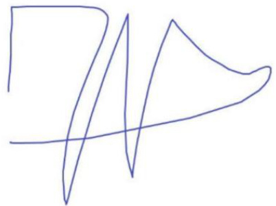  

Julien Vergues  

Willis Towers Watson  

# Santander Totta Seguros – Companhia de Seguros de Vida, S.A.  

Relatório do Revisor Oficial de Contas sobre o relatório anual sobre a solvência e a situação financeira nos termos da alínea a) do n.º 1 do artigo 3.º da Norma Regulamentar n.º 2/2017-R, de 24 de março, da Autoridade de Supervisão de Seguros e Fundos de Pensões  

31 de dezembro de 2023  

# Relatório do Revisor Oficial de Contas sobre o relatório anual sobre a solvência e a situação financeira nos termos da alínea a) do n.º 1 do artigo 3.º da Norma Regulamentar n.º 2/2017-R, de 24 de março, da Autoridade de Supervisão de Seguros e Fundos de Pensões  

Ao Conselho de Administração da Santander Totta Seguros – Companhia de Seguros de Vida, S.A.  

# Introdução  

Nos termos da alínea a) do n.º 1 do artigo 3.º da Norma Regulamentar n.º 2/2017-R, de 24 de Março, da Autoridade de Supervisão de Seguros e Fundos de Pensões (ASF) (Norma Regulamentar), analisámos o relatório anual sobre a solvência e a situação financeira (Relatório), previsto na alínea a) do artigo 26.º da Norma Regulamentar n.º 4/2023-R, de 11 de julho, da ASF, incluindo a informação quantitativa a divulgar em conjunto com esse Relatório, conforme estabelecida artigo 3.º do Regulamento de Execução (UE) n.º 2023/895, da Comissão, de 4 de abril de 2023 (Informação quantitativa), da Santander Totta Seguros – Companhia de Seguros de Vida, S.A. (a Entidade), com referência a 31 de dezembro de 2023.  

O nosso relatório compreende o relato das seguintes matérias:  

A. Relato sobre os ajustamentos entre a demonstração da posição financeira estatutária e a constante do balanço para efeitos de solvência e sobre a classificação, disponibilidade e elegibilidade dos fundos próprios e sobre o cálculo do requisito de capital de solvência e do requisito de capital mínimo;   
B. Relato sobre a implementação e efetiva aplicação do sistema de governação; e   
C. Relato sobre a restante informação divulgada no relatório sobre a solvência e a situação financeira e na Informação quantitativa conjuntamente divulgada.  

A. Relato sobre os ajustamentos entre a demonstração da posição financeira estatutária e a constante do balanço para efeitos de solvência e sobre a classificação, disponibilidade e elegibilidade dos fundos próprios e sobre o cálculo do requisito de capital de solvência e do requisito de capital mínimo  

# Responsabilidades do órgão de gestão  

É da responsabilidade do Conselho de Administração da Entidade o cálculo dos ajustamentos entre a respetiva demonstração da posição financeira estatutária e a constante do balanço para efeitos de solvência e a classificação e avaliação da disponibilidade e elegibilidade dos fundos próprios e o cálculo do requisito de capital de solvência e do requisito de capital mínimo submetido à ASF, em conformidade com o Regulamento Delegado (UE) n.º 2015/35, da Comissão, de 10 de outubro de 2014, que completa a Diretiva n.º 2009/138/CE, do Parlamento Europeu e do Conselho, de 25 de  

novembro de 2009, relativa ao acesso à atividade de seguros e resseguros e ao seu exercício, na sua redação atual (Regulamento Delegado).  

# Responsabilidades do Revisor Oficial de Contas  

A nossa responsabilidade, conforme definido na alínea a) do n.º 1 do artigo 4.º da Norma Regulamentar, consiste em expressar, com base no trabalho efetuado, uma conclusão com garantia razoável de fiabilidade, sobre se os ajustamentos entre a demonstração da posição financeira estatutária e a constante do balanço para efeitos de solvência, a classificação, disponibilidade e elegibilidade dos fundos próprios e o cálculo do requisito de capital de solvência e do requisito de capital mínimo, estão isentos de distorções materiais, são completos e fiáveis e, em todos os aspetos materialmente relevantes, são apresentados de acordo com os requisitos legais e regulamentares aplicáveis.  

De acordo com o n.º 2 do artigo 3.º da Norma Regulamentar, não é da nossa responsabilidade a verificação da adequação às disposições legais, regulamentares e técnicas aplicáveis do cálculo dos elementos incluídos no âmbito da certificação pelo atuário responsável da Entidade, definido no artigo 7.º da mesma Norma Regulamentar.  

# Âmbito do trabalho  

O nosso trabalho foi efetuado de acordo com a Norma Internacional de Trabalhos de Garantia de Fiabilidade (ISAE) 3000 (Revista) "Trabalhos de Garantia de Fiabilidade que Não Sejam Auditorias ou Revisões de Informação Financeira Histórica", e outras orientações técnicas e normas éticas aplicáveis da Ordem dos Revisores Oficiais de Contas (OROC) e consistiu na obtenção de prova suficiente e apropriada que permita, com segurança razoável, concluir que os ajustamentos entre a demonstração da posição financeira estatutária e a constante do balanço para efeitos de solvência, que a classificação, disponibilidade e elegibilidade dos fundos próprios e que o cálculo do requisito de capital de solvência e do requisito de capital mínimo, estão isentos de distorções materiais, são completos e fiáveis e, em todos os aspetos materialmente relevantes, são apresentados de acordo com os requisitos legais e regulamentares aplicáveis.  

O trabalho realizado incluiu, entre outros procedimentos, os seguintes:  

(i) a reconciliação da informação base utilizada para o cálculo dos ajustamentos com os sistemas de informação da Entidade e a respetiva demonstração da posição financeira estatutária em 31 de dezembro de 2023 objeto de revisão legal de contas, e sobre a qual foi emitida Certificação Legal das Contas sem reservas e sem ênfases, datada de 22 de março de 2024;   
(ii) a revisão de acontecimentos subsequentes ocorridos entre a data da Certificação Legal das Contas e a data deste relatório;   
(iii) o entendimento dos critérios adotados;   
(iv) o recálculo dos ajustamentos efetuados pela Entidade, exceto os referidos no parágrafo seguinte que estão excluídos do âmbito desta certificação;   
(v) a reconciliação da informação base utilizada para os cálculos dos requisitos de capital de solvência e de capital mínimo em 31 de dezembro de 2023, com o balanço para efeitos de solvência, os registos contabilísticos e demais informação mantida nos sistemas da Entidade, com referência à mesma data;   
(vi) a revisão em base de amostragem, da correta classificação e caracterização dos ativos de acordo com os requisitos do Regulamento Delegado;   
(vii) a revisão dos cálculos dos requisitos de capital de solvência e de capital mínimo em 31 de dezembro de 2023, efetuados pela Entidade; e   
(viii) a leitura da documentação preparada pela Entidade para dar cumprimento aos requisitos do Regulamento Delegado.  

O trabalho realizado não compreendeu a certificação dos ajustamentos efetuados ao nível das provisões técnicas e dos montantes recuperáveis de contratos de resseguro, nem a verificação do cálculo dos requisitos de capital que, conforme definido no artigo 7.º da Norma Regulamentar, são incluídos no âmbito da certificação do atuário responsável da Entidade.  

Relativamente aos ajustamentos efetuados ao nível de impostos diferidos decorrentes dos ajustamentos acima referidos, o trabalho realizado apenas compreendeu a verificação do impacto em impostos diferidos, tomando por base os referidos ajustamentos efetuados pela Entidade.  

A seleção dos procedimentos efetuados depende do nosso julgamento profissional, incluindo os procedimentos relativos à avaliação do risco de distorção material na informação objeto de análise, resultantes de fraude ou erro. Ao efetuar essas avaliações de risco consideramos o controlo interno relevante para a preparação e apresentação da referida informação, a fim de planear e executar os procedimentos apropriados nas circunstâncias.  

Aplicamos a Norma Internacional de Gestão de Qualidade ISQM 1, a qual requer que seja desenhado, implementado e mantido um sistema de gestão de qualidade abrangente que inclui políticas e procedimentos sobre o cumprimento de requisitos éticos, normas profissionais e requisitos legais e regulamentares aplicáveis.  

Entendemos que a prova obtida é suficiente e apropriada para proporcionar uma base aceitável para a expressão da nossa conclusão.  

# Conclusão  

Com base nos procedimentos realizados e incluídos na secção precedente “Âmbito do trabalho”, que foram planeados e executados com o objetivo de obter um grau de segurança razoável, concluímos que os ajustamentos entre a demonstração da posição financeira estatutária e a constante do balanço para efeitos de solvência, que a classificação, disponibilidade e elegibilidade dos fundos próprios e que o cálculo do requisito de capital de solvência e do requisito de capital mínimo, à data a que se refere o Relatório (31 de dezembro de 2023), estão isentos de distorções materiais, são completos e fiáveis e, em todos os aspetos materialmente relevantes, são apresentados de acordo com os requisitos legais e regulamentares aplicáveis.  

# B. Relato sobre a implementação e efetiva aplicação do sistema de governação  

# Responsabilidades do órgão de gestão  

É da responsabilidade do Conselho de Administração da Entidade:  

A preparação do Relatório e da informação a prestar à ASF para efeitos de supervisão, nos termos exigidos pela Norma Regulamentar n.º 4/2023-R, de 11 de julho, da ASF; e A definição, aprovação, revisão periódica e documentação das principais políticas, estratégias e processos que definem e regulamentam o modo como a Entidade é dirigida, administrada e controlada, incluindo os sistemas de gestão de riscos e de controlo interno (Sistema de governação), os quais devem ser descritos no capítulo B do Relatório, tendo em conta o previsto no artigo 294.º do Regulamento Delegado.  

# Responsabilidades do Revisor Oficial de Contas  

A nossa responsabilidade, conforme definido na alínea b) do n.º 1 do artigo 4.º da Norma Regulamentar, consiste em expressar, com base no trabalho efetuado, uma conclusão com garantia limitada de fiabilidade sobre a implementação e efetiva aplicação do sistema de governação.  

# Âmbito do trabalho  

O nosso trabalho foi efetuado de acordo com a Norma Internacional de Trabalhos de Garantia de Fiabilidade (ISAE) 3000 (Revista) "Trabalhos de Garantia de Fiabilidade que Não Sejam Auditorias ou Revisões de Informação Financeira Histórica" e outras orientações técnicas e normas éticas aplicáveis da OROC e consistiu na obtenção de prova suficiente e apropriada que permita concluir, com segurança moderada, sobre se o conteúdo do capítulo “Sistema de governação” do Relatório, reflete, em todos os aspetos materialmente relevantes, a descrição da implementação e efetiva aplicação do Sistema de governação da Entidade em 31 de dezembro de 2023.  

O trabalho realizado incluiu, entre outros procedimentos, os seguintes:  

(i) a apreciação da informação contida no relatório sobre o sistema de governação da Entidade quanto aos seguintes principais aspetos: informações gerais; requisitos de qualificação e de idoneidade; sistema de gestão de riscos com inclusão da autoavaliação do risco e da solvência; sistema de controlo interno; função de auditoria interna; função atuarial; subcontratação e eventuais informações adicionais;   
(ii) a leitura e apreciação da documentação que sustenta as principais políticas, estratégias e processos descritos no Relatório, que regulamentam o modo como a Entidade é dirigida, administrada e controlada e obtenção de prova corroborativa sobre a sua implementação; e   
(iii) a discussão das conclusões com os responsáveis da Entidade.  

Os procedimentos efetuados foram mais limitados do que seriam num trabalho de garantia razoável de fiabilidade e, por conseguinte, foi obtida menor segurança do que num trabalho de garantia razoável de fiabilidade.  

A seleção dos procedimentos efetuados depende do nosso julgamento profissional, incluindo os procedimentos relativos à avaliação do risco de distorção material na informação objeto de análise, resultantes de fraude ou erro. Ao efetuar essas avaliações de risco consideramos o controlo interno relevante para a preparação e apresentação da referida informação, a fim de planear e executar os procedimentos apropriados nas circunstâncias.  

Aplicamos a Norma Internacional de Gestão de Qualidade ISQM 1, a qual requer que seja desenhado, implementado e mantido um sistema de gestão de qualidade abrangente que inclui políticas e procedimentos sobre o cumprimento de requisitos éticos, normas profissionais e requisitos legais e regulamentares aplicáveis.  

Entendemos que a prova obtida é suficiente e apropriada para proporcionar uma base aceitável para a expressão da nossa conclusão.  

# Conclusão  

Com base nos procedimentos realizados e descritos na secção precedente “Âmbito do trabalho”, que foram planeados e executados com o objetivo de obter um grau de segurança moderada, nada chegou ao nosso conhecimento que nos leve a concluir que, à data a que se refere o Relatório (31 de dezembro de 2023), o conteúdo do capítulo “Sistema de governação”, não reflete, em todos os aspetos materiais, a descrição da implementação e efetiva aplicação do Sistema de governação da Entidade.  

# C. Relato sobre a restante informação divulgada no relatório sobre a solvência e a situação financeira e a Informação quantitativa conjuntamente divulgada  

# Responsabilidades do órgão de gestão  

É da responsabilidade do Conselho de Administração da Entidade a preparação do Relatório e da informação a prestar à ASF para efeitos de supervisão, nos termos exigidos pela Norma Regulamentar n.º 4/2023-R, de 11 de julho, da ASF, incluindo a informação quantitativa a divulgar em conjunto com esse Relatório, conforme estabelecida no artigo 3.º do Regulamento de Execução (UE) n.º 2023/895, da Comissão, de 4 de abril de 2023.  

# Responsabilidades do Revisor Oficial de Contas  

A nossa responsabilidade, conforme definido na alínea c) do n.º 1 do artigo 4.º da Norma Regulamentar, consiste em expressar, com base no trabalho efetuado, uma conclusão com garantia limitada de fiabilidade sobre se a restante informação divulgada no Relatório e na Informação quantitativa conjuntamente divulgada, é concordante com a informação que foi objeto do nosso trabalho e com o conhecimento que obtivemos durante a realização do mesmo.  

# Âmbito do trabalho  

O nosso trabalho foi efetuado de acordo com a Norma Internacional de Trabalhos de Garantia de Fiabilidade (ISAE) 3000 (Revista) "Trabalhos de Garantia de Fiabilidade que Não Sejam Auditorias ou Revisões de Informação Financeira Histórica" e outras orientações técnicas e normas éticas aplicáveis da OROC e consistiu na obtenção de prova suficiente e apropriada que permita concluir, com segurança moderada, sobre se a restante informação divulgada no Relatório é concordante com a informação objeto do trabalho do revisor oficial de contas e com o conhecimento obtido durante o processo de certificação.  

O trabalho realizado incluiu, entre outros procedimentos, a leitura integral do referido relatório e a avaliação da concordância conforme acima referida.  

Os procedimentos efetuados foram mais limitados do que seriam num trabalho de garantia razoável de fiabilidade e, por conseguinte, foi obtida menor segurança do que num trabalho de garantia razoável de fiabilidade.  

A seleção dos procedimentos efetuados depende do nosso julgamento profissional, incluindo os procedimentos relativos à avaliação do risco de distorção material na informação objeto de análise, resultantes de fraude ou erro. Ao efetuar essas avaliações de risco consideramos o controlo interno relevante para a preparação e apresentação da referida informação, a fim de planear e executar os procedimentos apropriados nas circunstâncias.  

Aplicamos a Norma Internacional de Gestão de Qualidade ISQM 1, a qual requer que seja desenhado, implementado e mantido um sistema de gestão de qualidade abrangente que inclui políticas e procedimentos sobre o cumprimento de requisitos éticos, normas profissionais e requisitos legais e regulamentares aplicáveis.  

Entendemos que a prova obtida é suficiente e apropriada para proporcionar uma base aceitável para a expressão da nossa conclusão.  

# Conclusão  

Com base nos procedimentos realizados e descritos na secção precedente “Âmbito do trabalho” que foram planeados e executados com o objetivo de obter um grau de segurança moderada, nada chegou ao nosso conhecimento que nos leve a concluir que, à data a que se refere o Relatório (31 de dezembro de 2023), a informação divulgada no Relatório não é concordante com a informação que foi objeto do nosso trabalho e com o conhecimento que obtivemos durante a realização do mesmo.  

# D. Outras matérias  

Tendo em conta a normal dinâmica de qualquer sistema de controlo interno, as conclusões apresentadas relativamente ao sistema de governação da Entidade não deverão ser utilizadas para efetuar qualquer projeção para períodos futuros, na medida em que poderão existir alterações nos processos e controlos analisados e no seu grau de eficácia. Por outro lado, dadas as limitações  

inerentes ao sistema de controlo interno, irregularidades, fraudes ou erros podem ocorrer sem que sejam detetados.  

8 de abril de 2024  

PricewaterhouseCoopers & Associados - Sociedade de Revisores Oficiais de Contas, Lda. representada por:  

  

Fernando Manuel Miguel Henriques, ROC nº 904   
Registado na CMVM com o nº 20160523  