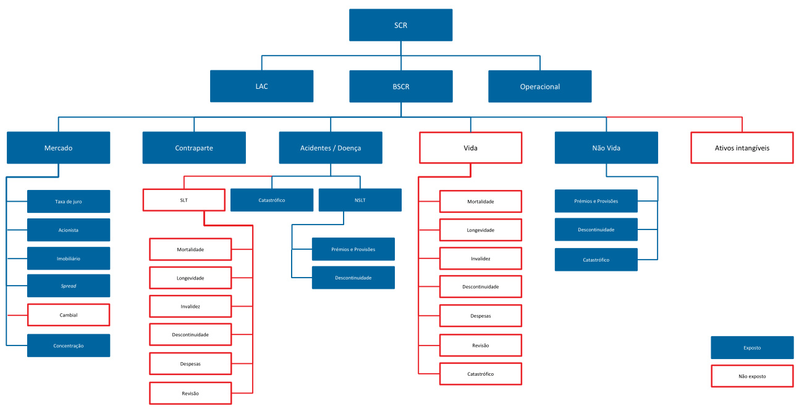

# Aegon Santander Portugal Não Vida  

Relatório sobre a Solvência e Situação Financeira  

# Índice  

SUMÁRIO EXECUTIVO .  

# ATIVIDADE E DESEMPENHO . 10  

A.1. ATIVIDADE . 10   
DESEMPENHO DA SUBSCRIÇÃO 12   
A.3. DESEMPENHO DOS INVESTIMENTOS . 13   
DESEMPENHO DE OUTRAS ATIVIDADES 14   
EVENTUAIS INFORMAÇÕES ADICIONAIS .... 14  

# SISTEMA DE GOVERNAÇÃO 5  

INFORMAÇÕES GERAIS SOBRE O SISTEMA DE GOVERNAÇÃO . 15   
REQUISITOS DE QUALIFICAÇÃO E IDONEIDADE . 22   
SISTEMA DE GESTÃO DE RISCOS COM INCLUSÃO DA AUTOAVALIAÇÃO DO RISCO E DA SOLVÊNCIA 24   
SISTEMA DE CONTROLO INTERNO . . 32   
FUNÇÃO DE AUDITORIA INTERNA .. 37   
FUNÇÃO ATUARIAL .. 39   
SUBCONTRATAÇÃO . 40   
EVENTUAIS INFORMAÇÕES ADICIONAIS . 42  

# C. PERFIL DE RISCO . 43  

RISCO ESPECÍFICO DE SEGUROS 46   
RISCO DE MERCADO ... 50   
RISCO DE CRÉDITO . 55   
RISCO DE LIQUIDEZ . 59   
RISCO OPERACIONAL .. . 61   
OUTROS RISCOS MATERIAIS . . 63   
EVENTUAIS INFORMAÇÕES ADICIONAIS . .. 67  

# AVALIAÇÃO PARA EFEITOS DE SOLVÊNCIA 68  

ATIVOS 69  

D.2. PROVISÕES TÉCNICAS . 74   
OUTRAS RESPONSABILIDADES . 80   
MÉTODOS ALTERNATIVOS DE AVALIAÇÃO . 82   
D.5. EVENTUAIS INFORMAÇÕES ADICIONAIS . . 82  

# GESTÃO DE CAPITAL . 83  

FUNDOS PRÓPRIOS .. . 83 REQUISITO DE CAPITAL DE SOLVÊNCIA E REQUISITO DE CAPITAL MÍNIMO .. . 86 UTILIZAÇÃO DO SUBMÓDULO DE RISCO ACIONISTA BASEADO NA DURAÇÃO PARA CALCULAR O REQUISITO DE CAPITAL DE SOLVÊNCIA.... . 91 DIFERENÇA ENTRE A FÓRMULA-PADRÃO E QUALQUER MODELO INTERNO UTILIZADO .. . 91 INCUMPRIMENTO DO REQUISITO DE CAPITAL MÍNIMO E INCUMPRIMENTO DO REQUISITO DE CAPITAL DE SOLVÊNCIA 91 EVENTUAIS INFORMAÇÕES ADICIONAIS . . 92  

SE.02.01.16 – BALANCE SHEET . 93   
S.05.01.02 – PREMIUMS, CLAIMS AND EXPENSES BY LINE OF BUSINESS . 94   
S.17.01.02 – NON-LIFE TECHNICAL PROVISIONS . 95   
S.19.01.21 – NON-LIFE INSURANCE CLAIMS INFORMATION .. 96   
S.23.01.01 – OWN FUNDS. 97   
S.25.01.21 – SOLVENCY CAPITAL REQUIREMENT – FOR UNDERTAKING ON STANDARD FORMULA . 98   
S.28.01.01 – MINIMUM CAPITAL REQUIREMENT – ONLY LIFE OR ONLY NON-LIFE INSURANCE OR REINSURANCE ACTIVITY   
100  

ANEXO B – RELATÓRIO DE CERTIFICAÇÃO ATUARIAL ....... 102  

ANEXO C – RELATÓRIO DO REVISOR OFICIAL DE CONTAS . 105  

# Índice de quadros  

Quadro 1 – Principais indicadores de atividade ... 11   
Quadro 2 – Produtos em carteira .... . 11   
Quadro 3 – Resultados líquido do exercício ..... . 12   
Quadro 4 – Principais indicadores técnicos .... 12   
Quadro 5 – Estrutura da carteira de investimentos e ganhos e perdas por categoria de ativos .... . 13   
Quadro 6 – Custos de gestão de ativos .. . 14   
Quadro 7 – Prestadores de serviços externos essenciais .... ... 41   
Quadro 8 – Valorização dos riscos específicos de seguros .. . 47   
Quadro 9 – Tratados de resseguro ..... . 49   
Quadro 10 – Avaliação dos riscos específicos de seguros . . 49   
Quadro 11 – Composição da carteira de obrigações por tipo de taxa .. . 51   
Quadro 12 – Composição da carteira de ativos por setor de atividade .. . 52   
Quadro 13 – Valorização dos riscos de mercado . 53   
Quadro 14 – Avaliação dos riscos de mercado .. . 55   
Quadro 15 – Valorização do risco de incumprimento pelas contrapartes .. . 56   
Quadro 16 – Exposição ao risco de crédito por rating . . 57   
Quadro 17 – Rating das contrapartes de resseguro .... . 57   
Quadro 18 – Participação dos resseguradores por tratado . . 58   
Quadro 19 – Exposição à dívida pública .... . 58   
Quadro 20 – Avaliação do risco de incumprimento .... . 59   
Quadro 21 – Valorização do risco de liquidez . . 59   
Quadro 22 – Análise das maturidades dos ativos e passivos financeiros .. 60   
Quadro 23 – Valorização do risco operacional ... . 62   
Quadro 24 – Avaliação do risco operacional ..... . 63   
Quadro 25 – Composição do balanço económico e estatutário . . 68   
Quadro 26 – Ativos por impostos diferidos ... . 71   
Quadro 27 – Linhas de negócio . 75   
Quadro 28 – Provisões técnicas das responsabilidades de não vida .. 77   
Quadro 29 – Comparação entre as provisões técnicas estatutárias e económicas . . 78   
Quadro 30 – Comparação entre resseguro cedido e recuperáveis de resseguro . .. 79   
Quadro 31 – Passivos por impostos diferidos .... . 81   
Quadro 32 – Níveis de capitalização com base no rácio do SCR 83   
Quadro 33 – Fundos próprios . . 84   
Quadro 34 – Reserva de reavaliação . .. 85   
Quadro 35 – Excesso dos ativos sobre os passivos: atribuição das diferenças de avaliação .... 86   
Quadro 36 – Requisito de capital de solvência ... ... 87   
Quadro 37 – Cenários relativos ao nível de reconhecimento do LAC DT .. .. 89   
Quadro 38 – Componentes do MCR . . 90  

# Índice de figuras  

Figura 1 – Estrutura de governação..... 15   
Figura 2 – Modelo das três linhas de defesa . 18   
Figura 3 – Processo de gestão de risco .. 25   
Figura 4 – Integração do ORSA na estratégia de negócio ...... . 30   
Figura 5 – Definição da preferência ao risco .. 44   
Figura 6 – Exposição aos riscos da fórmula-padrão 45   
Figura 7 – Perfil de risco atual .. . 45   
Figura 8 – Sensibilidades risco específico de seguros de não vida . 50   
Figura 9 – Sensibilidades risco de mercado . . 55   
Figura 10 – Sensibilidades risco operacional . . 63   
Figura 11 – Sistema de classificação dos riscos ESG . . 65   
Figura 12 – Classificação ESG da carteira de investimentos .. . 66   
Figura 13 – Detalhe da classificação ESG da carteira de investimentos . . 66   
Figura 14 – Evolução do requisito de capital de solvência .... . 90   
Figura 15 – Evolução do requisito de capital mínimo . 91  

# Sumário executivo  

O presente relatório tem como objetivo a apresentação da situação de solvência e financeira da Aegon Santander Portugal Não Vida, Companhia de Seguros de Não Vida, S.A. (doravante designada por ASP Não Vida ou Companhia) tendo por base o exercício de 2023. Para tal, apresentam-se os principais temas relativos à atividade e desempenho, ao sistema de governação, ao perfil de risco, à avaliação para efeitos de solvência e ainda à gestão de capital, relacionando os fundos próprios com os requisitos de capital de solvência.  

No ano de 2023, o volume da produção de seguro direto em Portugal ascendeu a quase 12 mil milhões de Euros, refletindo uma diminuição de $2\%$ face ao valor registado no período homólogo. O ramo Vida apresentou um decréscimo da produção de $^{14,3\%}$ . Os ramos Não Vida, seguindo a tendência dos últimos anos, registou um aumento de $^{10,3\%}$ .  

Não obstante, a ASP Não Vida apresentou, no ano de 2023, um desempenho comercial sólido e consistente, demonstrando resiliência e adaptabilidade num ambiente económico desafiante, tendo o ano sido marcado pelo desenvolvimento do mix estratégico de negócio da Companhia, que visa responder às necessidades dos clientes e um foco na fidelização de clientes, através da entrega de um serviço de excelência. A Companhia conseguiu um aumento de $50\%$ no resultado líquido, para 19 milhões de Euros (12,7 milhões de Euros em 2022), mantendo uma posição de capital robusta.  

Ao nível regulamentar e operacional, o setor tem enfrentado diversos desafios. A entrada em vigor da IFRS 17, em 1 de janeiro de 2023, implicou um intenso processo de adaptação. Esta nova norma introduziu uma profunda mudança na mensuração das responsabilidades dos contratos de seguro através de novas regras e um maior grau de exigência e complexidade. O empenho da Companhia de modo organizado, estruturado e atempado, permitiu cumprir todos os requisitos e prazos definidos.  

Adicionalmente, a ASP Não Vida investiu significativamente em tecnologia para aprimorar a experiência dos seus clientes, simplificar processos e fortalecer a relação de confiança entre todos os stakeholders.  

No que respeita ao sistema de governação, um dos temas basilares do regime de Solvência II, a Companhia reforçou o funcionamento de uma estrutura que promove uma gestão sã e prudente.  

Durante o 4.º trimestre de 2023, a ASP Não Vida realizou o exercício de autoavaliação do risco e da solvência (ORSA) com data de referência de 30 de setembro de 2023, de modo a efetuar uma avaliação atual e prospetiva das suas necessidades de solvência. O horizonte temporal considerado contempla o período entre 2023 e 2026. Quer no cenário base, quer nos cenários de stress, verificou-se que, após a distribuição de dividendos prevista, a Companhia apresentava um nível de capitalização sempre superior ao objetivo de $135\%$ do Solvency Capital Requirement (SCR). Estes resultados foram comunicados ao Supervisor em janeiro de 2024.  

Atendendo ao facto de as projeções de negócio e de rácio de solvência serem relevantes na política de gestão de capital, em particular na definição de distribuição de dividendos, os resultados deste exercício concedem suporte à análise relativa à futura distribuição de dividendos.  

No que respeita à distribuição de dividendos, a ASP Não Vida procedeu em 2023 ao pagamento de dividendos referentes ao exercício de 2022, no valor de 10,5 M€. Adicionalmente, no final de 2023 foi efetuada uma distribuição de 2,0 M€ por contrapartida de reservas livres. Não obstante esta distribuição, a Companhia continuou a apresentar rácios de solvência robustos.  

Relativamente ao perfil de risco, comparativamente ao exercício anterior, não foram registadas alterações significativas. O risco específico de não vida continua a ser o risco com maior relevância no perfil de risco da Companhia.  

Atualmente, estamos a evoluir para uma economia mais sustentável, o que implica um aumento da importância e criticidade da análise dos riscos ambientais, sociais e de governo societário das Seguradoras, e do setor. Neste sentido, a Companhia já incorporou nas suas políticas o risco de sustentabilidade e a definição do apetite a este tipo de risco, assim como a determinação dos indicadores de sustentabilidade na gestão da carteira de ativos. Ainda no que respeita a este risco, encontra-se a decorrer uma análise de cenários que funcionam como fatores de stress à carteira de investimentos, identificando pontos de risco face a alterações climáticas (riscos de transição e riscos físicos).  Considerando as características da carteira de investimentos, não são expectáveis alterações ao perfil de risco decorrentes de cenários de alterações climáticas.  

A Companhia avaliou os seus ativos e passivos de acordo com as regras e critérios de Solvência II. Analisou e apresentou as principais diferenças face aos valores estatutários decorrentes da aplicação do regime de IFRS17, que se verificaram principalmente nas rúbricas de ativos intangíveis, recuperáveis de resseguro, provisões técnicas e impostos diferidos.  

Refira-se que a Companhia não utilizou medidas transitórias nem de longo prazo na avaliação das suas responsabilidades de seguros.  

Relativamente à gestão de capital, a ASP Não Vida considera uma política de gestão de capital com diversos níveis de capitalização que são determinados em função do rácio de solvência. Como referido anteriormente, o seu nível objetivo situa-se nos $135\%$ do SCR.  

O valor dos fundos próprios elegíveis face ao requisito de capital regulamentar permitiu determinar um rácio de solvência de $^{137,2\%}$ no final de 2023, verificando-se um decréscimo de 16,2 pontos percentuais face ao ano anterior. Esta valor reflete a possibilidade de distribuição de dividendos referente à atividade de 2023, no montante de 20,5 M€. Se não fosse considerada esta distribuição de dividendos, o rácio situar-se-ia em $243,9\%$ .  

Os resultados consideram a utilização da totalidade dos impostos diferidos resultantes da perda igual ao valor do requisito de capital, uma vez que se demonstrou que a Companhia conseguirá, num período de três anos, gerar lucros futuros tributáveis em montantes suficientes contra os quais estes ativos possam ser utilizados.  

O ano de 2024 será, uma vez mais, um ano de muitos desafios para a gestão, dando continuidade a práticas que permitam tornar o setor mais rigoroso e transparente, quer na resposta ao supervisor, quer na prestação de informação a clientes e ao público em geral. A par da temática da sustentabilidade, identifica-se, uma crescente preocupação com os riscos cibernéticos e com a segurança da informação, temas que, já hoje, fazem parte do foco da Companhia.  

O presente relatório, bem como os quantitative reporting templates (QRT), foram analisados e aprovados pelo Conselho de Administração no dia 15 de abril de 2024.  

Lisboa, 15 de abril de 2024  

  

Tiago do Couto Venâncio (Administrador Delegado)  

# A. Atividade e desempenho  

# Atividade  

No final de 2014, a ASP Não Vida foi constituída em resultado de uma joint venture entre a Aegon Spain Holding B.V., com uma participação de $51\%$ do capital, e a Santander Totta Seguros, S.A. (doravante STS), com os restantes $49\%$ . Como tal, as suas operações e transações são influenciadas pelos grupos financeiros em que se insere, nomeadamente pelo Grupo Aegon e pelo Grupo Santander.  

Em adição, foi celebrado entre a Companhia e o Banco Santander Totta, S.A. (BST) um acordo de distribuição mediante o qual o BST irá comercializar os produtos da Companhia em regime de exclusividade, por um período de 25 anos. Como tal, a ASP Não Vida apenas exerce atividade em território português.  

Note-se que com a constituição da ASP Não Vida foi também criada a Aegon Santander Portugal Vida, Companhia de Seguros de Vida, S.A., que partilha acionistas, órgãos sociais, estrutura interna e alguns processos. O início de exploração da atividade de ambas as Companhias ocorreu em janeiro de 2015.  

A Companhia está sujeita à supervisão da ASF, sediada na Av. da República, 76, 1600-205 Lisboa, cujo contacto telefónico é o número $+351$ 217 903 100.  

Ao nível do Grupo em que se insere, Grupo Aegon, a entidade de supervisão é a Bermuda Monetary Authority (BMA), P.O. Box 2447, Hamilton HM JX, Bermuda.  

Por sua vez, o auditor externo é a Pricewaterhouse Coopers e Associados – S.R.O.C. Lda., representada pelo seu sócio Fernando Manuel Miguel Henriques, cujo contacto telefónico é o número $+351$ 213 599 333.  

Ao longo dos primeiros nove anos de atividade, a ASP Não Vida tem vindo a atingir os objetivos definidos aquando da sua constituição, mantendo uma estratégia que aposta no foco nos clientes aliado a uma oferta de produtos inovadores, comercializados através de um adequado modelo de distribuição, que aposta na multicanalidade para chegar de forma mais flexível e cómoda aos clientes.  

Em concordância com as necessidades dos clientes BST, a Companhia comercializa uma vasta gama de soluções de proteção acidentes e multirriscos habitação.  

A carteira de produtos comercializados pela Companhia insere-se nas classes de negócio relativas Seguros de despesas médicas, Seguros de proteção de rendimentos, Seguro de acidentes de trabalho, Seguro de incêndio e outros danos e Seguro de responsabilidade civil. Nos quadros seguintes apresenta-se um resumo dos principais indicadores de atividade da Companhia para os anos de 2023 e 2022, bem como a listagem dos produtos em carteira no final de 2023:  

Quadro 1 – Principais indicadores de atividade   

<html><body><table><tr><td>2023</td><td>2022</td></tr><tr><td>Apolices 592416</td><td>586308</td></tr><tr><td>dasquaismigradasdaPopularSeguros</td><td>12179 13942</td></tr><tr><td>CapitaisSeguros (Milhares de euros)</td><td>64835685 63976328</td></tr></table></body></html>  

Quadro 2 – Produtos em carteira   

<html><body><table><tr><td>Produto</td><td>Classe de negocio [Anexo I do Regulamento Delegado]</td><td>Tipo de contrato</td><td>Numero de Apolices</td></tr><tr><td>Protecao Lar</td><td>Segurodeincendioeoutrosdanos</td><td>TAR</td><td>212 391</td></tr><tr><td>MultirriscosHabitacao|Liberty</td><td>Segurodeincendioeoutrosdanos</td><td>TAR</td><td>154 558</td></tr><tr><td>Popular Habitacao</td><td>Segurodeincendioeoutrosdanos</td><td>TAR</td><td>10 173</td></tr><tr><td>AcidentesTelemarketing</td><td>Segurodeprotecaoderendimentos</td><td>TAR</td><td>1917</td></tr><tr><td>Acidentes2015</td><td>Segurodeprotecaoderendimentos</td><td>TAR</td><td>58 781</td></tr><tr><td>Popular ProtecaoPagamentos</td><td>Segurodeprotecaoderendimentos</td><td>TAR</td><td>718</td></tr><tr><td>Saude</td><td>Segurodedespesasmédicas</td><td>TAR</td><td>146 138</td></tr><tr><td>PopularSaudeExpress</td><td>Seguro de despesas medicas</td><td>TAR</td><td>8</td></tr><tr><td>AcidentesdeTrabalho|EmpregadasDomesticas</td><td>Segurodeacidentesdetrabalho</td><td>TAR</td><td>866</td></tr><tr><td>PopularServicosDomesticos</td><td>Segurodeacidentesdetrabalho</td><td>TAR</td><td>314</td></tr><tr><td>Popular Leasing</td><td>Segurodeincendioeoutrosdanos</td><td>TAR</td><td>209</td></tr><tr><td>ProtecaoFamiliarRC</td><td>Seguroderesponsabilidadecivilgeral</td><td>TAR</td><td>5586</td></tr><tr><td>PopularRCFamiliar</td><td>Seguroderesponsabilidadecivilgeral</td><td>TAR</td><td>757</td></tr></table></body></html>  

Em 2023, o resultado da atividade comercial da Companhia materializou-se num ligeiro aumento de $1.0\%$ do número de apólices em vigor, para 592 416 apólices. De salientar que os produtos provenientes da carteira migrada da Popular Seguros em 2019 encontram-se em runoff, justificando-se assim a sua contínua redução na carteira global $(-7,4\%$ face a 2022). Seguindo a mesma tendência, o volume de capitais seguros apresentou um acréscimo de $1,3\%$ face ao ano transato, fixando-se em 64 836 M€ no final de 2023.  

Quadro 3 – Resultados líquido do exercício   
Milhares de euros   

<html><body><table><tr><td></td><td>2023</td><td>2022</td></tr><tr><td>Resultado liquido do exercicio</td><td>18980</td><td>12652</td></tr></table></body></html>  

O resultado líquido da Companhia ascendeu a 19,0 M€, o que traduz um aumento notável de $33,3\%$ face ao valor apurado em 2022.  

# Desempenho da subscrição  

No ano de 2023, o desempenho da Companhia ao nível da subscrição mostrou-se positivo, traduzindo resiliência e adaptabilidade num ambiente económico desafiante, tendo o ano sido marcado pelo desenvolvimento do mix estratégico de negócio da Companhia, que visa responder às necessidades dos clientes e um foco na fidelização de clientes, através da entrega de um serviço excelência.  

No quadro que se segue são apresentados os principais indicadores de atividade:  

Quadro 4 – Principais indicadores técnicos   

<html><body><table><tr><td></td><td colspan="2">Milhoesdeeuros</td></tr><tr><td>Principaisindicadorestecnicos</td><td>2023</td><td>2022</td></tr><tr><td>Reditosdecontratosdeseguro</td><td>112,6</td><td>94,3</td></tr><tr><td>Sinistrosocorridoseoutrosgastosatribuiveise alteracoesaservicospassados</td><td>-23,8</td><td>-24,6</td></tr><tr><td>Custosdeaquisicaoatribuiveisacontratosdeseguros</td><td>-49,7</td><td>-41,9</td></tr><tr><td>Reditosegastosdecontratosderesseguro</td><td>-10,6</td><td>-8,0</td></tr></table></body></html>  

A consolidação e desenvolvimento dos seguros de saúde e consolidação das soluções de serviço e assistência disponibilizadas aos clientes de forma transversal, foram prioridades e permitiram a obtenção de réditos de contrato de seguro de 112,6 milhões de Euros (2022: 94,3 milhões de Euros), sendo o ramo de Incêndio e outros danos responsável por $62\%$ (2022: $68\%$ ) deste montante. Importa ainda realçar a evolução alcançada pelo ramo saúde, que atingiu um peso de $28\%$ no volume de réditos $(2022;21\%)$ ).  

Os sinistros ocorridos e outros gastos atribuíveis situaram-se nos 23,8 milhões de Euros (2022: 24,6 milhões de Euros), sendo o produto de Multirriscos habitação o principal responsável a este nível.  

Reforça-se ainda que a Companhia apenas exerce a sua atividade em território português. Como tal, todos os dados apresentados dizem respeito à atividade realizada em Portugal.  

No que respeita às classes de negócio mencionadas no ponto A.1 do presente relatório, importa referir que aquela que apresenta uma maior expressividade é a classe de negócio Incêndio e Outros Danos devido à dimensão da carteira do produto multirriscos, seguindo-se a classe de Seguros de despesas médicas que tem vindo a ganhar dimensão por via do forte crescimento dos produtos saúde.  

# Desempenho dos investimentos  

A atividade de gestão de investimentos é efetuada com base no princípio do gestor prudente, que promove a obtenção de um nível de diversificação adequado, tanto ao nível dos emitentes como por setores de atividade e qualidade creditícia.  

Tal como no ano anterior e seguindo a sua política de investimentos, durante o ano de 2023, a Companhia não possuiu qualquer instrumento financeiro derivado ou teve exposição significativa a instrumentos de capital. Nesta base, os investimentos da Companhia correspondem, essencialmente, a títulos de rendimento fixo.  

A estrutura da carteira de investimentos e os ganhos e perdas por categoria de ativos relativos ao ano de 2023 e 2022 são apresentados no quadro que se segue:  

utura da carteira de investimentos e ganhos e perdas por categoria   

<html><body><table><tr><td>2023</td><td colspan="5"></td></tr><tr><td rowspan="3">Categoriadeativos</td><td rowspan="3">Valorde mercado total</td><td colspan="2">Rendimentos</td><td rowspan="3">Ganhoseperdas realizados</td><td rowspan="3">Milharesdeeuros Ganhose perdasnao realizados</td></tr><tr><td>Dividendos</td><td>Juros</td></tr><tr><td>0</td><td>255</td></tr><tr><td>Obrigacoesgovernamentais</td><td>30660</td><td></td><td></td><td>0</td><td>552</td></tr><tr><td>Obrigacoesprivadas</td><td>31395</td><td>0</td><td>226</td><td>0</td><td>1 341</td></tr><tr><td>Acoes</td><td>0</td><td>0</td><td>0</td><td>0</td><td>0</td></tr><tr><td>Investimentosemtitularizacoes</td><td>0</td><td>0</td><td>0</td><td>0</td><td>0</td></tr><tr><td>Caixaeequivalentes</td><td>2 112</td><td>0</td><td>0</td><td>0</td><td>0</td></tr><tr><td>Total</td><td>64166</td><td>0</td><td>481</td><td>0</td><td>1892</td></tr></table></body></html>  

Milhares de euros   

<html><body><table><tr><td rowspan="2">Categoriadeativos</td><td rowspan="2">Valor de mercadototal</td><td colspan="2">Rendimentos</td><td colspan="2">Ganhose Ganhose</td></tr><tr><td>Dividendos</td><td>Juros</td><td>perdas realizados</td><td>perdas nao realizados</td></tr><tr><td>Obrigacoesgovernamentais</td><td>19929</td><td>0</td><td>302</td><td>17</td><td>0</td></tr><tr><td>Obrigacoesprivadas</td><td>30259</td><td>0</td><td>314</td><td>-19</td><td>0</td></tr><tr><td>Acoes</td><td>0</td><td>0</td><td>0</td><td>0</td><td>0</td></tr><tr><td>Investimentosemtitularizacoes</td><td>0</td><td>0</td><td>0</td><td>0</td><td>0</td></tr><tr><td>Caixaeequivalentes</td><td>6 222</td><td>0</td><td>0</td><td>0</td><td>0</td></tr><tr><td>Total</td><td>56410</td><td>0</td><td>616</td><td>-2</td><td>0</td></tr></table></body></html>  

Por último, no que se refere aos custos de gestão dos investimentos a comparação com o ano transato é apresentada no seguinte quadro:  

Quadro 6 – Custos de gestão de ativos  

<html><body><table><tr><td></td><td colspan="2">Milhares deeuros</td></tr><tr><td></td><td>2023</td><td>2022</td></tr><tr><td>Custos de gestaodeinvestimentos</td><td>18,3</td><td>17,9</td></tr></table></body></html>  

# Desempenho de outras atividades  

A Companhia não exerce outras atividades, como tal não apresenta outros rendimentos e despesas materiais respeitantes ao ano de 2023.  

# Eventuais informações adicionais  

No âmbito da atividade e desempenho, a Companhia considera que não existem informações adicionais relevantes.  

# Sistema de governação  

# Informações gerais sobre o sistema de governação  

Para assegurar decisões conscientes de rentabilidade versus risco e limitar a magnitude de perdas potenciais para níveis de confiança definidos, a Companhia apresenta um forte sistema de governação e gestão de risco, com uma estrutura organizacional bem definida, adequada à dimensão e complexidade da atividade desenvolvida.  

A Companhia dispõe de uma política denominada “Governação e Gestão de Risco”, que reflete detalhadamente o seu sistema de governação e gestão de risco. Para além de descrever o funcionamento ao nível de governação, é também descrita a metodologia de identificação, quantificação e gestão de risco utilizada na definição do apetite e tolerância ao risco, que permite construir e rever anualmente o seu perfil de risco.  

A estrutura de governação encontra-se sintetizada na figura seguinte:  

Figura 1 – Estrutura de governação  

  

Os acionistas deliberam nos termos da lei, designadamente, através de Assembleias Gerais convocadas pelo Conselho de Administração ou por qualquer acionista titular de mais de $5\%$ do capital.  

A Assembleia Geral de acionistas, que reúne ordinariamente pelo menos uma vez por ano no prazo de três meses a contar da data de encerramento do exercício, tem como principais competências deliberar sobre o relatório de gestão e contas do exercício anterior, deliberar sobre a proposta de aplicação de resultados, proceder à apreciação geral da administração da Companhia e proceder às eleições que legal e estatutariamente lhe sejam atribuídas ou aquelas que eventualmente se tornem necessárias.  

A administração de todos os negócios e interesses da Companhia é assegurada por um Conselho de Administração composto por oito membros, entre os quais um Administrador Delegado com a responsabilidade pela gestão corrente da Companhia. O mandato dos membros que o constituem é de quatro anos. O Conselho de Administração reúne pelo menos uma vez por trimestre ou sempre que o interesse da Companhia o exija. As suas deliberações são tomadas por maioria absoluta dos votos dos Administradores presentes ou representados, tendo o presidente voto de qualidade em caso de empate.  

Sem prejuízo do ponto anterior, existem matérias que requerem a aprovação por maioria qualificada de pelo menos dois terços dos Administradores em funções (não havendo para este efeito voto de qualidade do Presidente). Entre outras, destacam-se: a aprovação do plano estratégico, do plano de negócios e do orçamento anual; a concessão ou obtenção de garantias, empréstimos, linhas de crédito ou outras formas de financiamento, investimentos em ativos de capital que não resultem do curso normal da atividade; a modificação dos princípios e práticas contabilísticas; e participação em qualquer forma de joint venture, aliança estratégica ou operações similares.  

A fiscalização da Companhia compete a um Conselho Fiscal composto por três membros efetivos e um suplente, eleitos em Assembleia Geral por um período de quatro anos. Compete-lhe verificar a exatidão dos documentos de prestação de contas, verificar se as políticas contabilísticas e os critérios valorimétricos adotados pela entidade conduzem a uma correta avaliação do património e dos resultados, elaborar anualmente um relatório sobre a sua ação fiscalizadora e emitir parecer sobre o relatório, contas e propostas apresentadas.  

O Revisor Oficial de Contas é designado em Assembleia Geral por um período de três anos, mediante proposta do Conselho Fiscal. Compete-lhe assegurar a total transparência e fiabilidade da informação contabilística da Companhia e do seu controlo financeiro interno. Tem a responsabilidade de conferir se todas as contas estão em conformidade com o estipulado pelas normas técnicas aprovadas ou reconhecidas pela Ordem dos Revisores Oficiais de Contas, emitindo, após a revisão ou auditoria de contas, uma certificação legal das mesmas, documentando a sua opinião sobre a posição financeira, o desempenho financeiro e os fluxos de caixa da Companhia.  

Os Comités apresentados no organograma funcionam como órgãos de coordenação e suporte à comunicação entre acionistas e ao processo de tomada de decisão. Compete-lhes analisar as diversas temáticas apresentadas e emitir recomendações ao Conselho de Administração. Os Comités são constituídos por cinco membros, designadamente, o Administrador Delegado da Companhia e dois representantes de cada acionista. As suas principais responsabilidades são:  

• Comité Técnico: apresentar relatórios e propostas referentes à política de desenvolvimento de produtos e pricing, à análise técnica dos processos de subscrição e sinistros, a controlos atuariais, à estratégia de resseguro e ao controlo do Business Plan;   
• Comité de Risco: avaliar e supervisionar os diferentes riscos face à capacidade e tolerância estabelecidos, analisar e monitorizar os níveis de capitalização e solvência, devendo alertar o Conselho de Administração relativamente a possíveis desvios. Adicionalmente, deve propor e monitorizar as políticas de risco da Companhia e acompanhar e avaliar o sistema de controlo interno. Neste fórum são também apresentados os diferentes temas referentes à conformidade;   
• Comité Comercial: apresentar relatórios e propostas relativamente à supervisão da evolução dos objetivos comerciais integrados no Business Plan da Companhia, da estratégia comercial de curto, médio e longo prazos e dos planos comerciais. Deve apresentar ao Conselho de Administração o Business Plan para os próximos cinco anos, bem como planos estratégicos;   
• Comité de Auditoria e Financeiro: apresentar relatórios e propostas referentes à informação económico-financeira, destacando-se a análise de resultados, o comportamento das diversas rubricas face ao previsto, à definição e monitorização do orçamento da Companhia, ao cumprimento ao nível do reporte regulamentar e à monitorização dos trabalhos de auditoria; Comité de IT e Operações: apresentar relatórios e propostas relativamente à gestão operacional, aos serviços prestados por entidades externas e investimentos em tecnologia. Deve monitorizar os níveis de serviço operativos e tecnológicos, as incidências com clientes e rede de balcões. Além disso, analisa e aprova os modelos  

operativos, bem como os custos tecnológicos e operativos previstos em coordenação com outros Comités.  

Na sua gestão regular, para além do Administrador Delegado, a estrutura da Companhia integra as seguintes Direções:  

Direção de Tecnologia e Operações;  

Direção de Qualidade e Compliance;  

Direção Técnica e de Produtos;  

Direção de Gestão de Risco e Controlo Interno.  

Consoante a matéria/pelouro em questão, intervêm sempre como membros de decisão o Administrador Delegado e os diretores da Direção inerente à matéria em questão. Assim, os diretores de cada uma das Direções, em conjunto com o Administrador Delegado, correspondem às pessoas que dirigem efetivamente a Companhia, respeitando deste modo o “princípio dos quatro-olhos”.  

# Modelo das três linhas de defesa  

Por forma a implementar uma adequada, eficiente e eficaz gestão de riscos, a Companhia definiu e adotou o modelo das três linhas de defesa, promovendo assim o envolvimento de todas as áreas e estruturas na concretização deste objetivo.  

  
Figura 2 – Modelo das três linhas de defesa  

A identificação clara destas linhas, a descrição das suas responsabilidades e âmbitos de atuação, a definição de um processo adequado de comunicação e a implementação com base numa clara segregação de funções, evitando conflitos de interesses, traduzem-se num sistema eficaz ao nível do controlo da Companhia e da sua gestão em geral.  

Na primeira linha de defesa são consideradas as áreas de negócio e operacionais da Companhia, pois, em primeira instância, são responsáveis pela identificação do risco e pela implementação de controlos para mitigar todos os riscos materiais na sua área de atividade que excedam o apetite ao risco definido pelo Conselho de Administração.  

Na segunda linha de defesa surgem as três funções, designadas como funções-chave (atuarial, de gestão de riscos e de verificação do cumprimento). O processo de definição e implementação destas funções obedeceu a requisitos específicos de segregação de funções e de independência, bem como ao princípio da proporcionalidade previsto no regime de Solvência II.  

A função atuarial contribui para a implementação e monitorização de políticas, fundamentalmente, relacionadas com a coordenação e revisão do cálculo de provisões e outras funções de controlo relativas a subscrição, resseguro, novos produtos e tarifação. A função de gestão de risco tem como principal responsabilidade a implementação e administração do sistema de gestão de risco e controlo interno. A função de verificação do cumprimento contribui para práticas de negócio responsáveis e sólidas, para a integridade dos produtos e serviços prestados.  

Estas funções-chave foram implementadas tendo em consideração o necessário nível de autoridade e de independência operacional e definindo linhas de comunicação simples e diretas com o Órgão de Administração.  

Esta linha de defesa apresenta uma dupla funcionalidade. Por um lado, tem como responsabilidade dar suporte, assessoria, ferramentas e apoio à primeira linha de defesa, de modo a facilitar o cumprimento das responsabilidades por parte das áreas de negócio e da organização em geral. Por outro lado, têm como responsabilidade a supervisão do cumprimento deste modelo de funcionamento e prevenir a aceitação de risco discordante com o apetite e tolerância ao risco.  

Finalmente, na terceira linha de defesa, encontra-se a função de auditoria interna, cuja principal responsabilidade consiste em aferir a adequação e a eficácia do sistema de controlo interno e dos elementos do sistema de governação.  

O sistema de governação implementado encontra-se adequado à dimensão, complexidade e natureza da atividade e dos riscos, permitindo assegurar que as decisões significativas da Companhia são tomadas pelo menos por duas pessoas ou órgãos que dirigem efetivamente a empresa e garantindo um adequado nível de independência e segregação de funções e responsabilidades. Este sistema de governação é revisto periodicamente, sendo um dos pontos de agenda nas reuniões do Conselho de Administração.  

# Política de remunerações  

A política de remuneração tem como principal objetivo o estabelecimento de parâmetros de remuneração adequados que motivem o elevado desempenho individual e coletivo e que permitam estabelecer e atingir metas de crescimento da Companhia, representando bons resultados para os seus Acionistas.  

No ano de 2023 a Companhia procedeu à revisão a aprovação da sua Política de Remunerações.  

Nesta, estabeleceu o conjunto dos princípios e dos procedimentos destinados a fixar os critérios, a periodicidade e os responsáveis pela avaliação do desempenho dos colaboradores da empresa, bem como a forma, a estrutura e as condições de pagamento da remuneração devida a esses colaboradores, incluindo a decorrente do processo de avaliação de desempenho.  

Esta revisão vem dar cumprimento aos Artigos 258.º, 275.º, 294.º e 308.º do Regulamento Delegado (EU) 2015/35 da Comissão de 10 de outubro de 2014, ao Artigo 64.º, n.º 4 Regime Jurídico De Acesso e Exercício da Atividade Seguradora e Resseguradora (RJASR), aprovado pela Lei nº 147/2015, de 9 de setembro e às novas indicações que, relativamente a essa matéria, constam da Norma Regulamentar N.º 4/2022-R, de 31 de maio (NR 4/2022-R), da Autoridade de Supervisão dos Seguros e Fundos de Pensões (ASF), que revogou parcialmente a Norma Regulamentar N. º 5/2010-R no que respeita ao setor segurador.  

Foram também tomadas em consideração elementos da Secção 2 das “Orientações da EIOPA relativas ao sistema de governação - EIOPA-BoS-14/253 PT”, refletidas pela ASF na Norma Regulamentar n.º 4/2022-R e da “Opinion on the supervision of remuneration principles in the insurance and reinsurance sector (EIOPA-BoS-20/040), de 7 de abril de $2020^{\prime\prime}$ .  

Competitividade, tendo em consideração as práticas do mercado e equidade, sendo que a prática remuneratória assenta em critérios uniformes, consistentes, justos e equilibrados; Alinhamento com as melhores práticas e tendências recentes no sector financeiro, a nível nacional e internacional, com o objetivo último de desincentivar a exposição a riscos excessivos e promover a continuidade e sustentabilidade dos desempenhos e resultados positivos, nomeadamente: i) a criação de limites máximos para as componentes da remuneração que devem ser equilibradas entre si; ii) o diferimento no tempo de uma parcela da remuneração variável;  

Apuramento da remuneração variável individual considerando a avaliação do desempenho respetivo (em termos quantitativos e qualitativos), de acordo com as funções e o nível de responsabilidade, assim como dos resultados da Sociedade, também por comparação com outras entidades internacionais do sector.  

A política, bem como a declaração de cumprimento nos termos previstos no Artigo 92º da Norma 4/2022-R, de 26 de abril, da ASF, encontram-se publicadas no sítio da internet da Companhia.  

# Regime complementar de pensões  

Em 2 de dezembro 2020, a ASP Não Vida aderiu ao acordo coletivo de trabalho (ACT), atualmente em vigor, e que foi assinado entre as diversas seguradoras a operar no mercado nacional e dois sindicatos representativos da classe profissional (STAS e SISEP), a 6 de abril de 2020. De acordo com o n.º 1 da cláusula 52ª do ACT, “Todos os trabalhadores em efetividade de funções, bem como aqueles cujos contratos de trabalho estejam suspensos por motivo de doença ou de acidente de trabalho, com contratos de trabalho sem termo, beneficiam de um Plano Individual de Reforma (PIR) em caso de reforma por velhice ou por invalidez concedida pela Segurança Social, o qual integrará e substituirá quaisquer outros sistemas de atribuição de pensões de reforma previstos em anteriores instrumentos de regulamentação coletiva de trabalho aplicáveis à empresa”.  

O plano de pensões é financiado através de uma adesão coletiva ao fundo de pensões aberto Reforma Empresa.  

Tendo em conta o disposto no n.º 1 do Anexo V do novo ACT, a Companhia efetuará anualmente contribuições para o PIR de valor correspondente a $3,\!25\%$ do ordenado anual do trabalhador. O PIR prevê a garantia de capital investido.  

Dado que a obrigação da Companhia (Associado) é determinada pelas quantias a serem contribuídas, a respetiva contabilização consistirá em reconhecer um gasto anual, à medida que essas contribuições forem efetuadas.  

# Transações materiais  

No que respeita a transações materiais com acionistas, pessoas que exerçam uma influência significativa na empresa e membros do órgão de direção, administração ou supervisão, importa referir o pagamento de dividendos que ocorreu em 2023, tendo sido distribuído aos acionistas 10,5 M€, relativo ao exercício de 2022.  

# Requisitos de qualificação e idoneidade  

No sentido de garantir um sistema de governação constituído por recursos com competência e idoneidade que promovam uma gestão baseada em decisões coerentes e bem suportadas e de modo a dar cumprimento ao definido na Lei $\mathsf{n}^{\underline{{\circ}}}\ 147/2015$ , de 9 de setembro, a Companhia definiu e aprovou a política de competência e idoneidade, que tem como principais objetivos:  

Definir os princípios gerais aplicáveis às pessoas que dirijam efetivamente a Companhia ou nela sejam responsáveis por outras funções-chave; Estabelecer a metodologia para a identificação das funções abrangidas pela política; Definir a metodologia e os procedimentos para avaliação do nível de competência e idoneidade; ? Determinar os princípios que possam desencadear o processo de reavaliação do cumprimento dos requisitos de competência e idoneidade.  

Os critérios de competência e idoneidade a serem considerados na análise relativa às pessoas que dirigem efetivamente a Companhia ou desempenham outras funções-chave encontram-se definidos na Lei, sendo estes critérios incorporados no seu modelo de governação.  

Neste sentido, estes Colaboradores devem preencher cumulativamente, as seguintes condições:  

• Deterem qualificações profissionais, conhecimentos e experiência suficientes para uma gestão sã e prudente (competência);   
• Possuírem boa reputação e integridade (idoneidade).  

O primeiro critério refere-se à aptidão individual, que é entendida como a existência de qualificações suficientes ou experiência profissional. Presume-se que os Colaboradores tenham obtido um grau e área de ensino adequados à função e responsabilidade assumida e, ainda, que tenham experiência profissional relevante e adequada ao exercício das funções, garantindo que tal experiência será uma mais-valia para uma gestão sã e prudente da atividade.  

No que toca à idoneidade, deverá ser analisada a existência de indícios de desrespeito pela legislação e regulamentos, comportamentos éticos desadequados, envolvimento em processos disciplinares, conflito ou má reputação junto do Supervisor.  

Adicionalmente, na sequência das orientações relativas ao sistema de governação emitidas pela European Insurance and Occupational Pensions Authority (EIOPA), a Companhia deve assegurar que os Órgãos de Direção e Administração possuem coletivamente qualificação, experiência e conhecimento apropriados, pelo menos nos seguintes domínios:  

Mercados de seguros e financeiros;   
Estratégia de negócio e modelo de negócio;   
Sistema de governação;  

Análise financeira e atuarial;  

Enquadramento regulamentar e requisitos aplicáveis.  

Na prática, a metodologia para aferir a qualificação e idoneidade segue as seguintes fases:  

Identificação: são identificadas as funções e os responsáveis abrangidos pelas políticas e respetivas matrizes de avaliação ao nível da competência, idoneidade, independência, disponibilidade e capacidade;   
Documentação: são recolhidos os elementos (nomeadamente curriculum vitae) necessários à avaliação das matrizes supra descritas; Avaliação: o responsável pelos Recursos Humanos analisa toda a informação recolhida e procede ao preenchimento das respetivas matrizes de avaliação. Posteriormente, remete o resultado da avaliação ao Conselho de Administração; Monitorização: é exigido aos membros que integram os órgãos, que comuniquem eventuais inibições ou indícios que possam indicar constrangimentos e limitações às matrizes de avaliação;   
Reporte: o responsável pelos Recursos Humanos emite, anualmente, um relatório de monitorização a ser remetido ao Conselho de Administração.  

No cumprimento da Norma Regulamentar N.º 3/2017, de 18 de maio, emitida pela ASF, a Companhia implementou os requisitos e normativos legais, quer no que respeita ao registo dos Órgãos de Administração junto desta entidade, recolhendo a informação e emitindo a documentação necessária ao processo, quer no que se refere às pessoas que dirigem efetivamente a empresa, a fiscalizam ou são responsáveis por funções-chave e ao atuário responsável. De referir que, neste último caso, o registo foi efetuado durante o segundo semestre de 2017, tendo sido obtido o acordo por parte da ASF.  

# Sistema de gestão de riscos com inclusão da autoavaliação do risco e da solvência  

O sistema de gestão de risco implementado na Companhia abrange, entre outros, a operacionalização de um adequado sistema de governação, a definição de políticas, a identificação, quantificação e gestão dos diversos riscos a que a Companhia se encontra exposta e um sistema de comunicação e reporte adequado.  

A função de gestão de risco tem um papel fundamental na implementação de um sistema de gestão de risco eficiente e eficaz. Esta função faz parte da segunda linha de defesa do modelo implementado na Companhia, que integra as três linhas de defesa descritas no presente relatório, encontrando-se a mesma alocada à Direção de Gestão de Risco e Controlo Interno. Um processo de tomada de decisão adequadamente fundamentado requer que se avaliem e considerem os riscos a que a Companhia se encontra exposta. Neste sentido é essencial que o processo de gestão de riscos faça parte deste processo de tomada de decisão.  

# Processos de gestão de risco  

O processo de gestão de risco, que pode ser desagregado em várias componentes ou fases, é um processo cíclico, contínuo e iterativo, que deve incluir ajustes periódicos e pontuais da estratégia e tolerância ao risco baseados em nova informação de risco ou alterações de negócio. Este pode ser representado da seguinte forma:  

  
Figura 3 – Processo de gestão de risco  

Os riscos a que a Companhia se encontra exposta são identificados e apresentados com o suporte da descrição do universo de riscos, apresentados e descritos no documento de “Governação e Gestão de Risco”. Adicionalmente, a identificação dos riscos emergentes assegura que o universo de riscos contemplado é dinâmico e antecipa as tendências de mudança.  

A estratégia de risco estabelece a base para definir a tolerância e o apetite ao risco, os quais são considerados na definição dos níveis de capitalização, na determinação dos cenários de continuidade de negócio e na implementação da cultura risco. A política de “Governação e Gestão de Risco” apresenta esta informação de forma detalhada.  

A Companhia utiliza metodologias próprias na avaliação e medição dos riscos por forma a poder formalizar uma resposta apropriada ao risco, no sentido de aceitação ou não e, no último caso, de definição de planos de ação.  

Por último, refira-se que este ciclo deve estar integrado nas decisões chave da Companhia, nomeadamente, nos processos de definição de planos de negócio e de capital, de políticas de tarifação e de desenvolvimento de produtos e de modelos de suporte às decisões, proporcionando um sistema de governação com uma forte cultura de risco.  

# Estratégia e tolerância ao risco  

A estratégia de risco da Companhia define-se com base no apetite ao risco que se traduz em níveis de tolerância específicos para cada tipo de risco.  

A Companhia definiu e formalizou este processo num documento específico designado “Governação e Gestão de Risco”, que foi aprovado pelo Conselho de Administração. O referido documento estabelece os conceitos e metodologia de definição de níveis de capitalização, que visam aumentar a transparência e a responsabilidade sobre a gestão do capital.  

A Companhia desenvolve um plano de gestão do capital como parte do seu plano de negócio. Este plano contempla a utilização, necessidades e distribuição do capital. As conclusões do exercício ORSA são integradas no referido plano de capital.  

Por sua vez, a preferência pelos riscos é definida em função dos seguintes fatores:  

A estratégia de negócio; As necessidades dos clientes; • A capacidade de gestão dos diferentes riscos e a possibilidade de os mitigar; A rentabilidade associada à sua assunção e à rapidez com que se podem materializar.  

A estratégia de risco complementa-se com declarações de tolerância que são fundamentais para enquadrar o apetite ao risco da Companhia, de modo a que os seus objetivos e estratégia sejam cumpridos.  

Em 2020, a Companhia formalizou a sua política de aceitação de risco, que visa delinear o processo pelo qual os riscos que excedam os limites de tolerância definidos pela Companhia e/ou onde ações de mitigação adicionais não sejam possíveis, úteis ou financeiramente viáveis de implementar, são aceites pela mesma.  

No ponto C do presente documento apresenta-se com maior detalhe a metodologia adotada ao nível da gestão de risco que permite definir o perfil de risco da Companhia.  

# Processos e procedimentos  

No que respeita aos processos para identificar, quantificar e gerir os riscos destacam-se a implementação de diversas políticas de risco, bem como a definição e operacionalização de mecanismos que permitem monitorizar o cumprimento das regras e limites definidos nas políticas.  

Ao nível dos riscos de mercado, destaca-se a política de investimentos em vigor, a sua monitorização e reporte regular, bem como o acompanhamento que é efetuado pela Direção Financeira e pela Direção de Gestão de Risco e Controlo Interno. O Comité de Risco é também um fórum relevante na monitorização e aconselhamento relativamente aos riscos de mercado. De salientar que, na Politica de Investimentos, foram definidos limites de exposição por critério ESG (Sustainalytics), no âmbito da Sustentabilidade.  

No que respeita aos riscos específicos de vida, de não vida, de acidentes e doença e também ao risco de contraparte, destacam-se as políticas de subscrição, de tarifação e desenvolvimento de produtos, de resseguro e de provisões técnicas, que definem, entre outros, as regras de aceitação de risco, de valorização de reservas e de seleção de resseguradores e caraterísticas dos tratados.  

A Companhia dispõe de uma política de controlo interno, que foi aprovada pelo Conselho de Administração e revista em 2023. Este documento define os objetivos, fases, componentes e princípios do Sistema de Controlo Interno da Companhia, bem como as funções e responsabilidades dos intervenientes na sua implementação e monitorização.  

Estas melhorias na definição e formalização dos processos e procedimentos permitiram também que a Companhia se adequasse aos requisitos emanados na Diretiva (UE) 2016/97 do Parlamento Europeu e do Conselho, de 20 de janeiro de 2016 sobre a distribuição de seguros. Em síntese, a monitorização e análise dos processos relacionados com estes riscos efetuada regularmente pela Direção Técnica e de Produtos é um fator relevante na sua gestão. O Comité Técnico, o Comité Comercial e sempre que se justifique, o Comité de Risco, funcionam como fóruns de acompanhamento e aconselhamento relacionados com estes temas.  

Relativamente ao risco operacional destaca-se o sistema que integra controlos regulares, com destaque para os executados pelas áreas operacionais, que permite identificar incidências, melhorar processos, avaliar o nível de risco residual e identificar riscos emergentes. Neste reporte incluem-se os riscos de conformidade e legais. Este sistema tem particular importância na relação com o canal de distribuição e com os clientes, uma vez que abrangem vários subprocessos, destacando-se a subscrição, a gestão de sinistros, a análise de risco, a gestão de documentação e a comunicação com os clientes através da linha telefónica de apoio ao cliente. Ao nível de interrupção dos sistemas ou dos processos de negócio, a Companhia dispõe de uma política e procedimentos de gestão de continuidade de negócio, efetuando testes de operacionalização de planos de disaster recover e de recuperação de negócio em instalações alternativas. O ano de 2023 continuou a demonstrar o adequado funcionamento das políticas de gestão de continuidade de negócio, uma vez que se manteve a possibilidade dos colaboradores exerceram as suas tarefas em regime de teletrabalho sem qualquer repercussão negativa na atividade e na prestação dos serviços.  

No que respeita aos riscos reputacionais e legais, a Companhia dispõe também de diversas políticas que permitem mitigar a exposição a estes riscos. Estas políticas referem-se, essencialmente, aos temas de conformidade e verificação do cumprimento, tratamento de clientes, proteção de dados, gestão reputacional, branqueamento de capitais e mecanismos anti-fraude. A Companhia detém um código de conduta que se encontra publicado no website. A Direção de Qualidade e Compliance efetua também um acompanhamento de todos os requisitos legais e regulamentares no sentido de assegurar que são adequadamente implementados na Companhia mecanismos que permitam cumprir esses requisitos e mitigar riscos legais.  

Todas as políticas são aprovadas pelo Conselho de Administração e divulgadas aos Colaboradores da Companhia.  

Desde 2018 que a Companhia integra no seu sistema de gestão de risco a figura de um Data Protection Officer (DPO), com o objetivo de mitigar riscos que podem resultar em penalizações financeiras impactantes, para além poderem representar riscos reputacionais. Neste âmbito da proteção de dados, foram formalizadas algumas políticas e implementados alguns procedimentos, de modo a que, em qualquer iniciativa ou processo, o tema da análise de dados e circuitos de informação seja considerado.  

# Comunicação e reporte  

Um adequado sistema de gestão de risco requer um processo de comunicação eficiente e eficaz, que permita por um lado, que o Órgão de Administração tenha conhecimento dos riscos identificados ao nível da primeira e segunda linha de defesa e do seu processo de gestão e, por outro, que os diversos níveis de defesa conheçam o apetite ao risco definido, as tolerâncias e limites aprovados pelo Conselho de Administração.  

Neste sentido, existem processos de comunicação bottom-up, ou seja, das Direções para o Conselho de Administração, e top-down, o inverso.  

Na abordagem bottom-up, as atividades e os resultados são analisados e discutidos em reuniões de Direção, com a presença dos responsáveis das diversas áreas e do Administrador Delegado. Nestas reuniões, que ocorrem no mínimo uma vez por mês, são definidos e acompanhados os planos de ação.  

Os temas relevantes com maior impacto na atividade ou que carecem de uma análise de âmbito mais estratégico são, posteriormente, apresentados nos Comités. Desta forma estes são também analisados pelos representantes dos acionistas. Por sua vez, os Comités emitem pareceres e recomendações ao Conselho de Administração.  

Na abordagem top-down, as decisões estratégicas são definidas ao nível do Conselho de Administração, sendo apresentadas em primeira instância ao Administrador Delegado, uma vez que é o responsável pela gestão regular da Companhia. Este promove fóruns de discussão e análise com diversos interlocutores de modo a garantir que estas decisões são exequíveis e possíveis de representar em planos de ação concretos. O nível de apetite ao risco, tolerância e limites fazem parte das decisões do Conselho de Administração.  

# Integração dos resultados do exercício ORSA  

O exercício ORSA tem como principal objetivo efetuar uma avaliação da adequação de três fatores chave da gestão da atividade: o perfil de risco da Companhia, o capital disponível e a sua estratégia de negócio.  

Este é um processo essencial na definição de uma estratégia com sustentabilidade, exequível, que garanta a continuidade da atividade e que produza o retorno adequado aos acionistas. Na figura seguinte ilustra-se a integração do exercício ORSA no processo de gestão e decisão da Companhia:  

  

A primeira e a segunda fases dizem respeito à definição da estratégia de negócio e do plano de negócio. Assim, no contexto de planificação estratégica, as tolerâncias ao risco são alvo de um processo de revisão. Esta análise contempla uma avaliação da preferência aos diversos riscos a que a Companhia se encontra exposta ou a que poderá vir a estar no curto e médio prazo, analisando tanto a estratégia como a sua capacidade para os gerir.  

As preferências são depois traduzidas em tolerâncias que são monitorizados periodicamente em comparação com a exposição real. Caso sejam detetados incumprimentos, estes são discutidos nos fóruns de governação apropriados, por forma a definir as ações de gestão necessárias.  

Na terceira fase, a análise do risco e do capital deve incluir a identificação, mensuração, gestão e monitorização dos riscos. O nível de solvência do negócio deve ser também determinado, tanto para a situação atual como para o futuro, sendo neste caso definido com base em projeções. A quantificação dos riscos é realizada com base na fórmula-padrão do regime de SII. Por último, o resultado obtido da conjugação da estratégia de negócio com o plano de negócio e as análises de risco e capital deve ser utilizado nos processos de decisão e nas ações de gestão futuras.  

Em especial, caso o excesso de capital seja suficiente para suportar as condições de mercado extremas, mantendo o nível de solvência regulamentar exigido, este deve ser considerado para assegurar estabilidade no pagamento de dividendos aos acionistas. Por outro lado, caso a posição de capital seja inferior ao nível objetivo, serão consideradas ações de gestão para recuperar os níveis de capital. As posições atuais são monitorizadas trimestralmente como parte do processo de reporte de risco.  

Trata-se, assim, de um processo interativo, no qual cada uma das etapas influencia diretamente a seguinte e poderá implicar a redefinição da anterior.  

Para a definição de uma estratégia adequada e bem suportada é relevante considerar o nível de exposição ao risco numa ótica prospetiva, tendo em conta limites regulamentares, bem como a análise da relação entre os requisitos de capital e o capital disponível previsto para os anos seguintes. Estes fatores integram os principais resultados do processo ORSA, que permite avaliar se a Companhia detém capital suficiente para fazer face aos riscos que enfrenta ou se são necessários ajustamentos para que se atinjam níveis aceitáveis de exposição.  

Caso o resultado do exercício permita identificar possíveis períodos em que se preveja uma insuficiência de capital disponível para fazer face à exposição ao risco, os Órgãos de Gestão deverão analisar estes resultados e definir um plano de ação que poderá contemplar, entre outros, um reforço de capital, uma alteração da constituição de fundos próprios (volume ou composição) ou alterações na alocação de capital.  

Por outro lado, caso o excesso de capital seja suficiente para suportar as condições de mercado extremas, mantendo o nível de solvência regulamentar exigido, este deve ser considerado para assegurar estabilidade no pagamento de dividendos aos acionistas.  

Este exercício é efetuado anualmente, submetido à aprovação do Conselho de Administração e apresentado ao Supervisor.  

# Sistema de controlo interno  

Um sistema de controlo interno forte promove a mitigação do risco, o bom desempenho, a melhoria de processos e procedimentos e consequentemente bons resultados.  

Neste sentido, durante o ano de 2023, a Companhia deu continuidade a um processo de análise e definição de diversas medidas que permitem evitar a ocorrência de situações que coloquem a atividade, a performance, os resultados e a sua sustentabilidade em risco.  

Este trabalho tem por finalidade obter um grau de segurança razoável na execução dos processos, planos e objetivos, de modo a atingir as suas metas, em particular no respeitante a:  

Eficácia e eficiência das operações; • Construção de informação financeira e não financeira rigorosa e completa; Conformidade com as leis e regulamentação, bem como com as políticas e procedimentos internos.  

Algumas medidas incidem sobre a mitigação do risco operacional, implementação de mecanismos de controlo e monitorização, definição e implementação de planos específicos de controlo adequados às atividades executadas em cada área operacional.  

Nos pontos seguintes destacam-se os principais processos que fazem parte do sistema de controlo interno, nomeadamente, o reporte trimestral de controlo operacional e a implementação de uma base de dados de perdas e de um plano de continuidade de negócio. Por fim, apresenta-se também informação referente às atividades desenvolvidas pela função de verificação do cumprimento.  

# Identificação e gestão do risco operacional  

O funcionamento do sistema de controlo interno envolve praticamente todas as áreas da Companhia, em especial, as áreas operacionais (que identificam os riscos que resultam do exercício da atividade e os respetivos mecanismos de controlo), a área de gestão de risco e controlo interno (que assegura essencialmente a monitorização do sistema e promove a sua melhoria contínua) e a área de auditoria interna (que verifica o adequado funcionamento de todo o sistema de controlo interno).  

A identificação, documentação e implementação de controlos deve ser um processo revisto e atualizado regularmente em resultado da própria dinâmica e evolução das atividades, permitindo identificar e mitigar novos riscos ou riscos emergentes.  

Assim, em 2023 a Companhia deu seguimento a um projeto de otimização do seu sistema de controlo interno, com a revisão de todos os processos de negócio, a identificação de riscos e de controlos com o objetivo de os integrar numa ferramenta específica de controlo utilizada por todo o Grupo Aegon. Nesta ferramenta estão a ser incorporadas, com uma periodicidade definida, as evidências de cada um dos controlos identificados. Adicionalmente, foi revisto o processo de avaliação de risco inerente, nível de mitigação dos controlos e avaliação do risco residual.  

Por outro lado, a Companhia continuou a executar e a monitorizar os controlos automáticos implementados, que permitem mais facilmente e rapidamente identificar incidências operativas ou tendências atípicas em indicadores de controlo e performance. Estes automatismos relacionam-se essencialmente com os processos de contratação, gestão de carteira e gestão de cobranças.  

Sempre que são identificadas incidências ou pontos de melhoria, a Direção de Gestão de Risco e Controlo Interno elabora um plano de ação que é partilhado no Comité de Risco. Caso se verifique a existência de risco moderado ou significativo, esta Direção poderá emitir recomendações de implementação de novos controlos ou melhoria dos existentes, definindo um plano de ação em conjunto com o responsável pelo processo em análise e monitorizando o cumprimento deste plano de ação.  

Ainda ao nível do risco operacional importa destacar a crescente preocupação com os CiberRiscos. No sentido de reforçar o nível de proteção face a estes riscos, e na sequência de um processo de auditoria interna, a Companhia, em parceria com uma entidade externa, está a desenvolver um projeto de identificação de possíveis gaps face aos controlos exigidos nesta temática, de modo a implementá-los adequadamente, mitigando qualquer risco identificado ou emergente.  

Relativamente ao cumprimento dos requisitos do Regulamento Geral sobre a Proteção de Dados (RGPD), procedeu-se à otimização dos controlos operacionais que permitem avaliar e assegurar a conformidade com o referido regulamento, evitando principalmente riscos financeiros e reputacionais.  

# Base de dados de perdas  

A base de dados de perdas tem como objetivo quantificar os impactos das perdas decorrentes de deficiências ou falhas de processos internos, recursos humanos ou sistemas, ou derivado de circunstâncias externas. Neste sentido, a Companhia implementou um processo de registo em excel destes eventos.  

Os eventos a registar agrupam-se em três categorias:  

• Eventos com impacto: perda ou ganho conhecido; Eventos quase perda: não têm perdas/prejuízos monetários. Em princípio encontram-se resolvidos; Eventos potenciais: impacto de magnitude desconhecida ou, se conhecida, com possibilidade de alteração.  

As tipologias de Eventos definidas durante o ano de 2023 foram:  

Assumidos ASP;   
Coimas;   
Contencioso;   
Fraude;   
IT;   
Operacional;   
Prestadores;   
Reclamações;   
RGPD.  

Cada evento reportado é analisado, e poderá haver a necessidade de elaborar um plano de ação para mitigação do risco identificado.  

A utilização da ferramenta de controlo interna do Grupo Aegon, já referida anteriormente, permitirá melhorar este processo de registo.  

# Plano de Continuidade de Negócio  

O plano de continuidade de negócio faz parte dos mecanismos de controlo interno implementados na Companhia e encontra-se diretamente relacionado com a mitigação de risco operacional, na subcategoria designada “eventos externos que causem danos nos ativos físicos”. A Companhia dispõe de um plano de continuidade de negócio, que integra três cenários:  

Perda de instalações;   
Interrupção ou falhas nos sistemas;   
Perda de pessoas – pandemia.  

Relativamente ao primeiro cenário em análise, a perda de instalações, o plano implementado descreve os procedimentos que permitem assegurar a continuidade das atividades críticas, aquando da ocorrência de um evento que provoque danos nas instalações principais e que impossibilite os Colaboradores de exercerem a atividade com a regularidade prevista.  

Se o incidente ocorrer num momento em que os Colaboradores se encontram num período laboral normal, será ativado o plano de emergência interna que é aplicável às várias entidades que estão instaladas no edifício.  

O segundo cenário em análise diz respeito à interrupção ou falhas de sistemas, ou seja, refere-se à tecnologia, uma das dimensões a considerar na gestão da continuidade de negócio. O projeto de recuperação tecnológica (disaster recover) visa implementar mecanismos avançados para recuperação das operações no caso de ocorrência de incidentes graves de segurança ou desastres que possam afetar a infraestrutura tecnológica e os sistemas de informação e, consequentemente, a segurança física e lógica de toda a informação armazenada, processada e em circulação na rede. Em 2023 foi efetuado um teste de disaster recover, que permitiu verificar a continuidade das operações no caso de um evento adverso.  

Por último, o plano contempla o cenário referente à perda de recursos humanos, descrevendo os procedimentos que permitem assegurar a continuidade das atividades críticas aquando da ocorrência de um evento que provoque a ausência de Colaboradores em número significativo (cerca de $50\%$ ) e por tempo indeterminado. O exemplo mais comum é o de uma pandemia.  

O plano identifica os processos e atividades críticas que devem ser retomados no curto prazo, de modo a não comprometer o negócio, detalha os procedimentos a seguir e identifica o processo de comunicação e os interlocutores, caso se verifique algum dos cenários analisados. A avaliação contínua das atividades críticas não revelou alterações face às atividades identificadas em anos anteriores.  

Em 2023, não foi efetuado o teste referente à execução das atividades críticas em instalações alternativas, uma vez que todos os colaboradores dispõem da possibilidade e das ferramentas adequadas para o exercício das atividades em teletrabalho. salienta-se que, devido ao COVID19, durante um largo período de tempo, a Companhia teve $100\%$ dos colaboradores a efetuar as suas atividades em regime de teletrabalho, não tendo sido identificadas incidências.  

Todas as atividades, críticas e menos críticas, têm sido asseguradas de modo a dar continuidade às atividades do canal de distribuição, responder atempadamente e adequadamente a acionistas e Autoridade de Supervisão e promover um serviço de excelência junto dos clientes.  

# Função de verificação do cumprimento  

A função de verificação do cumprimento é uma das funções-chave integradas na segunda linha de defesa do modelo de governação da Companhia. Está atribuída à Direção de Qualidade e Compliance, que efetua um acompanhamento de todos os requisitos legais e regulamentares no sentido de assegurar que são adequadamente implementados na Companhia mecanismos que permitam cumprir esses requisitos e mitigar riscos legais.  

A implementação da função obedeceu aos requisitos de independência e objetividade que se espera face aos temas que fazem parte do seu âmbito de atuação.  

Destacam-se também nas suas funções e responsabilidades, a monitorização da prevenção da fraude interna e externa e do branqueamento de capitais. O responsável pela Direção é também interlocutor junto da ASF no que respeita ao processo de gestão de reclamações. Compete à função identificar os riscos de incumprimento, sendo os resultados deste trabalho reportados e analisados no Comité de Risco.  

Durante 2023, esta função analisou a aplicabilidade de novos requisitos regulamentares ou corporativos, definiu planos de ação de modo a garantir a sua implementação e analisou o seu grau de cumprimento. Destacam-se as seguintes ações relacionadas com os temas em análise:  

• Comunicação das novidades legislativas e regulamentares, diligenciando, sempre que se justifique, pelo acompanhamento da implementação de medidas e alteração de procedimentos junto das áreas operacionais para assegurar o cumprimento normativo; Monitorização de temas relacionados com a prevenção de branqueamento de capitais e combate ao financiamento do terrorismo;   
• Acompanhamento e monitorização contínua do projeto inerente ao RGPD, nomeadamente através de formação aos colaboradores e parceiros essenciais em matéria de dados pessoais. Adicionalmente, enviámos inquéritos aos prestadores essenciais para aferir do grau de cumprimento com o RGPD;   
• Acompanhamento e monitorização contínua do projeto inerente à Distribuição de Seguros; Análise e monitorização de casos suspeitos de fraude; Elaboração e apresentação ao Órgão de Administração do relatório anual de Compliance, que sintetiza todas as ações efetuadas a este nível.  

# Função de auditoria interna  

A função de auditoria interna faz parte da terceira linha de defesa do modelo de governação da ASP Não Vida. A sua principal responsabilidade consiste em aferir a adequação e a eficácia do sistema de controlo interno e dos restantes elementos do sistema de governação.  

A Companhia implementou esta função no final de 2016. O modelo de funcionamento teve em consideração o princípio da proporcionalidade previsto no regime regulamentar de Solvência II. A operacionalização da função de auditoria interna da Companhia encontra-se subcontratada à Aegon Administracion y Servicios AIE (Aegon AIE), um agrupamento complementar de empresas, do qual a Companhia faz parte, bem como o seu acionista maioritário. Porém, em cumprimento do normativo referente às funções-chave, encontra-se nomeado e registado junto da ASF um responsável interno pela função que assegura a relação entre esta entidade e as diversas áreas operacionais, bem como a relação com o Supervisor e auditores externos.  

Destaque-se a independência da área de auditoria interna da Aegon AIE face às restantes áreas que prestam outros serviços à Companhia e que podem ser incluídos em âmbitos de auditorias. Na estrutura interna da Aegon AIE, a área de auditoria interna reflete uma completa segregação de funções e independência face a outras áreas, garantindo que os trabalhos de auditoria são executados com rigor e isenção e que os resultados são exatos e fiáveis.  

A Companhia dispõe de uma política de auditoria interna, que foi aprovada pelo Conselho de Administração. O documento define as responsabilidades, funções, dependência, princípios orientadores e metodológicos, organização e estrutura relacional da função. A política estabelece ainda as diretrizes operacionais e processuais básicas de auditoria, de forma a garantir que os trabalhos de auditoria interna são adequados aos processos e metodologias utilizadas na Companhia.  

A principal missão desta função é a planificação e realização dos processos de auditoria de acordo com o regime legal em vigor e as diretrizes do Órgão de Administração da Companhia, de modo a assegurar a veracidade da informação, minimizar riscos e melhorar a eficácia da gestão. Destacam-se as principais funções específicas que permitem concretizar esta missão:  

• Desenvolver e propor o estabelecimento de normas e procedimentos de auditoria para a Companhia; Garantir o cumprimento das normas e procedimentos de auditoria; Planificar e realizar as auditorias e investigações específicas necessárias para prevenir e detetar os riscos económicos, operacionais, reputacionais e de alteração da informação contabilística; Supervisionar o cumprimento das normas internas e externas aplicáveis à atividade da Companhia e, em especial, no que se refere ao sistema de governação e à função de verificação do cumprimento; Rever a documentação contabilística e administrativa e a sua adequação aos normativos internos e externos; Informar o Órgão de Administração das anomalias ou inconsistências detetadas sugerindo medidas de correção; Colaborar nos trabalhos de auditoria externa e do Supervisor, verificando a implementação de requisitos e recomendações efetuadas por estas entidades no âmbito das suas funções, tendo sido aceites pelo Conselho de Administração; Verificar a implementação e monitorização das recomendações emitidas em resultado das auditorias efetuadas e que foram aceites pelo Conselho de Administração;  

• Analisar e avaliar as fraudes internas e externas, propondo planos de atuação com vista à sua prevenção; Elaborar um plano anual de auditoria baseado na análise prévia dos riscos a que está exposta a Companhia.  

O plano previsto para 2023 foi cumprido. A avaliação do risco e identificação de fragilidades, requisitos corporativos ou legais determinaram a definição do referido plano. Relativamente às recomendações emitidas e aos pontos passíveis de melhoria foram identificados planos de ação e os responsáveis pela sua implementação. Trimestralmente, no Comité Financeiro e de Auditoria é monitorizado o cumprimento dos planos de ação acordados.  

# Função atuarial  

A função atuarial é identificada como uma função-chave que faz parte da segunda linha de defesa do modelo de governação.  

A definição da função teve em consideração a necessidade de se garantir a independência entre as atividades operacionais e os processos relativos a provisionamento, subscrição e resseguro. Foram também assegurados requisitos referentes a conhecimentos em matemática atuarial e financeira e à experiência relativa às normas aplicáveis.  

Assim, de acordo com os requisitos do regime de Solvência II, durante o ano de 2024, o responsável pela função emitirá o seu parecer sobre a adequação do nível de provisionamento, da política global de subscrição e dos tratados de resseguro.  

Para além de emitir o referido parecer e apresentá-lo ao Órgão de Administração, a função tem ainda como principais responsabilidades:  

• Coordenar o cálculo das provisões técnicas; Assegurar a adequação das metodologias, modelos de base e pressupostos utilizados no referido cálculo;   
• Garantir a suficiência e qualidade dos dados utilizados no cálculo das provisões técnicas; Comparar o montante da melhor estimativa das provisões técnicas com os valores efetivamente observados;  

• Contribuir para a aplicação efetiva do sistema de gestão de risco, em especial, no que diz respeito à modelização do risco em que se baseia o cálculo do SCR e do requisito de capital mínimo (MCR), bem como ao ORSA.  

# Subcontratação  

A Companhia dispõe de uma política de subcontratação que define regras a considerar no processo de avaliação e adjudicação de serviços prestados por entidades externas.  

Para garantir a adequada execução das atividades, salvaguardando a sua boa imagem e confiança junto dos diversos stakeholders e promovendo os bons resultados e a sustentabilidade, a Companhia é responsável pela definição de mecanismos de monitorização do serviço prestado por entidades externas.  

As entidades são consideradas prestadores de serviços externos essenciais, ou seja, que prestam serviços no âmbito de atividades estratégicas ou operacionais de negócio (incluindo trabalhos de consultadoria e manutenção informática) se, pela sua natureza:  

• Realizam atividades de forma permanente e habitual ou;   
A prestação acarreta um elevado nível de risco pelo impacto que possa ter na atividade operacional da Companhia ou; A prestação acarreta um elevado nível de risco pelo acesso a dados da Companhia ou; A prestação acarreta um elevado nível de risco pela representação da Companhia que a entidade externa possa assumir junto dos clientes.  

A Companhia identificou um responsável pela monitorização do cumprimento de cada contrato. Foi definido um plano de controlo, com mecanismos de reporte e níveis de serviço a cumprir, que é monitorizado por este interlocutor.  

No quadro seguinte apresentam-se as entidades externas identificadas como essenciais e que fazem parte deste processo de monitorização:  

Quadro 7 – Prestadores de serviços externos essenciais   

<html><body><table><tr><td>PrincipaisPrestadores</td><td>Principal atividade</td><td>Juridiscao em que o prestadorselocaliza</td></tr><tr><td>AegonAdministracionyServiciosAIE</td><td>Atividades relacionadas com calculos atuariais,gestao de investimentos,auditoriainterna erecursos humanos</td><td>Espanha</td></tr><tr><td>Axa Assistance, Servicos Portugal, S.A.</td><td>Gestao de sinistrosMRH</td><td>Portugal</td></tr><tr><td>Ecco Salva,Medical Services,Lda</td><td>Prestacao de servicos relativos a coberturas complementares</td><td>Portugal</td></tr><tr><td>I2S - Informatica, Sistemas e Servicos, S.A.</td><td>Software-GIS</td><td>Portugal</td></tr><tr><td>Santander Global Technologies</td><td>Sistemase Hardware</td><td>Espanha</td></tr><tr><td>BancoSantanderTotta</td><td>Aplicacoes informaticas</td><td>Portugal</td></tr><tr><td>Neyond - Servicos de Consultoria e Gestao, S.A.</td><td>Gestaodeprocessos deoutsourcingeback office</td><td>Portugal</td></tr><tr><td>Contisystems -Tecnologias de Informacao, S.A.</td><td>Impressaoearquivodedocumentacao</td><td>Portugal</td></tr><tr><td>Future Healthcare, S.A.</td><td>Gestao de sinistros de Saude</td><td>Portugal</td></tr><tr><td>Mobility24SA-TOOLTO</td><td>GestaodeSinistros Multiriscos</td><td>Portugal</td></tr><tr><td>Leads R Us, Lda</td><td>Gestaodeinformacaonowebsite</td><td>Portugal</td></tr></table></body></html>  

Os indicadores de controlo e performance destas entidades são apresentados e analisados no Comité de IT e Operações, tal como mencionado nas principais funções deste Comité.  

Adicionalmente, a Direção de Gestão de Risco e Controlo Interno tem também focado a sua atividade no desenvolvimento de um plano de controlo mais regular sobre as atividades prestadas pelos prestadores externos essenciais, definindo métricas e reportes adicionais. A definição das matrizes de risco, que tal como referido anteriormente está em curso, foca-se também nos processos executados por estas entidades.  

Este trabalho e análise tem permitido a implementação de melhorias no que respeita aos controlos executados, bem como aos próprios procedimentos, mitigando o risco operacional. Dependendo da criticidade dos temas em análise e dos resultados, estes poderão ser reportados ao Comité de Risco.  

No que respeita à subcontratação de funções-chave, refira-se que a função de Auditoria Interna se encontra subcontratada à Aegon AIE, como mencionado no ponto B.5 do presente relatório. No entanto, a Companhia mantém o controlo sobre as atividades e a responsabilidade pela função junto da ASF.  

# Eventuais informações adicionais  

No âmbito do Sistema de Governação, a Companhia considera que não existem informações adicionais relevantes.  

# ? Perfil de risco  

gestão de risco assenta principalmente numa adequada estraté  

A Companhia adotou uma estratégia de risco que estabelece a preferência pelos riscos em função da estratégia de negócio, das necessidades dos clientes, da sua capacidade de gestão dos diferentes riscos, da possibilidade de os mitigar e da rendabilidade associada à sua assunção e rapidez com que se podem materializar.  

Da estratégia de risco resultam definições de tolerância materializadas em:  

Política de gestão de capital: foram definidos diferentes intervalos relativos à posição de solvência da Companhia, aos quais correspondem diferentes planos de ação para que direcionem a Companhia para o cumprimento dos requisitos regulamentares ou para o nível de otimização do capital:  

一 Objetivo: zona para a execução da estratégia, geração de capital e distribuição de dividendos. O nível operacional, que será utilizado para os cálculos de geração de capital, deve estar dentro desta zona. É estabelecido um nível igual ou superior a $135\%$ ; Recuperação: planos acelerados de acumulação de capital, para atingir a Zona Objetivo no prazo de 12 meses. Dividendos e aquisições são suspensos. A Zona de Recuperação é determinada, em primeira instância, para evitar que o nível de capitalização da empresa desça abaixo dos $100\%$ do SCR, após a ocorrência de um cenário de stress equivalente a um evento estatístico de probabilidade 1 em 10 anos; Plano regulatório: plano de recapitalização ao nível exigido pelo Supervisor, dentro do prazo máximo estabelecido por este.  

Teste de continuidade de negócio: anualmente é testado o nível de capitalização da Companhia de acordo com o horizonte temporal do plano de negócio considerando cenários específicos. Estes permitem validar a continuidade do negócio mediante condições de stress consideradas relevantes para o perfil de risco identificado. Os níveis de capitalização medem-se de acordo com os requisitos regulamentares. Em condições de stress, a Companhia deve permanecer capitalizada acima do nível objetivo.   
· Cultura de gestão de risco: uma forte cultura de risco integrada nas operações do negócio é essencial para garantir uma aceitação de risco equilibrada. Não existe  

tolerância relativamente a incumprimentos legais ou com os clientes e uma tolerância limitada para eventos operacionais, de fraude ou quebras de confidencialidade ou integridade dos dados.  

Por forma a estabelecer-se o apetite ao risco da Companhia devem ser considerados dois fatores essenciais: o retorno esperado e a sua valorização.  

De acordo com o trade-off entre o preço pago pelo risco e o seu interesse para a Companhia e para os seus clientes, o retorno esperado é classificado como alto, médio ou baixo. Por outro lado, a valorização do risco depende de variadíssimos fatores, entre os quais, do horizonte temporal necessário à concretização do risco e do retorno, da possibilidade de ser mitigado ou transferido, da rapidez de materialização, do facto de se tratar de um risco de cauda ou não, do seu nível de diversificação no conjunto dos riscos a que a Companhia se encontra exposta e do facto de se tratar de um risco com comportamento pró-cíclico ou não.  

Tendo em conta a capacidade de capital da Companhia e a sua estratégia de negócio, o processo de definição das preferências ao risco segue as seguintes etapas:  

  

Esta análise é realizada tendo em consideração uma metodologia específica que classifica os diferentes riscos em função das seguintes características: grau de alinhamento com os interesses dos clientes, nível de retorno esperados e as particularidades do risco.  

Assim, em função da preferência pelos riscos, da sua competência para os gerir e da sua capacidade atual para os tomar, os limites por risco são fixados, tendo como restrições o capital disponível, a capacidade adicional para os assumir e o plano de negócios.  

Considerando os produtos que a Companhia comercializa e as linhas pelas quais orienta o seu negócio, apresentam-se os módulos e submódulos de risco da fórmula-padrão de Solvência II aos quais esta se encontra exposta:  

  
Figura 6 – Exposição aos riscos da fórmula-padrão  

O atual perfil de risco da Companhia, determinado com base nos resultados da fórmula-padrão, apresenta-se na seguinte figura:  

  
Figura 7 – Perfil de risco atual  

A identificação, as declarações de apetite ao risco, as formas de monitorização, controlo e mitigação e os resultados relativos aos cenários de sensibilidade por tipo de risco são apresentados nos pontos que se seguem.  

# C.1. Risco específico de seguros  

O risco específico de seguro é definido como o risco inerente à comercialização de contratos de seguro, associado ao desenho de produtos e respetiva tarifação, ao processo de subscrição e de provisionamento das responsabilidades e à gestão dos sinistros e do resseguro. Reflete o facto de no momento da subscrição da apólice, não ser possível estimar com certeza o custo real efetivo dos sinistros futuros, assim como o momento em que estes ocorrerão.  

A Companhia tem como objetivo a definição de prémios suficientes e adequados que permitam fazer face a todos os compromissos por si assumidos (sinistros a pagar, despesas e custo do capital).  

Esta categoria de risco é composta pelo risco de prémios, provisões, descontinuidade e catastrófico.  

O risco de prémios relaciona-se com o custo total estimado que a Companhia terá de suportar para regularizar todos os sinistros que venham a ocorrer no futuro, enquadráveis nas coberturas das apólices em vigor à data a que se reporta a avaliação, deduzidos dos prémios futuros a receber respeitantes a essas apólices.  

O risco de provisões é determinado com base no custo total estimado que a Companhia terá de suportar para regularizar todos os desenvolvimentos futuros dos sinistros que tenham ocorrido até à data a que se reporta a avaliação, quer tenham sido comunicados quer não.  

O risco de descontinuidade está relacionado com o risco de cessação do pagamento de prémios e de anulação das apólices.  

O risco catastrófico decorre de eventos extremos ou irregulares cujos efeitos não são suficientemente capturados nos outros riscos específicos de seguros. Decorrem normalmente de um evento específico com impacto em diversos tomadores de seguros, devido a um acréscimo dos diferentes fatores de risco em resultado de um evento de contágio, por um curto período de tempo.  

O seguinte quadro apresenta o apetite aos diferentes riscos específicos de seguros da Companhia:  

Quadro 8 – Valorização dos riscos específicos de seguros   

<html><body><table><tr><td>Categoria</td><td>Retorno esperado</td><td>Valorizacao risco</td><td>Valorizacao</td></tr><tr><td>Riscoespecificode NaoVida</td><td>Alto</td><td>Alto</td><td>Contribui diretamente para a satisfacao das necessidades de protecao dosnossosclientes.Oprémioobtidoofereceumretornoatrativo.</td></tr><tr><td>Comportamentodos tomadoresde seguros</td><td>Alto</td><td>Baixo</td><td>A maior parte dos riscos de comportamento dos tomadores de seguros advemdaaltarentabilidadedosprodutos.Oriscorefletea possibilidadedeanulacoessuperioresaoconsiderado.</td></tr></table></body></html>  

# Gestão e controlo  

A gestão do risco específico de seguros é efetuada através da combinação das políticas de subscrição, tarifação e desenvolvimento de produtos, resseguro e provisões técnicas com o documento “Governação e Gestão de Risco”.  

A Política de Subscrição permite assegurar que a Companhia mantém um perfil de risco de subscrição consistente com o perfil de risco definido pelos seus Órgãos de Administração, enquanto a Política de Tarifação e Desenvolvimento de Produtos inclui os controlos definidos para assegurar a suficiência de prémios, incluindo a identificação e incorporação nos prémios de elementos como opções e garantias, comportamento de tomadores, riscos de investimentos, liquidez e estrutura de resseguro prevista.  

A adequação da tarifa é testada através de técnicas de projeção realística de cash flows enquanto a rentabilidade de cada produto ou de grupos de produtos, é monitorizada anualmente. Existem procedimentos internos definidos, que estabelecem as regras a verificar na aceitação de riscos sendo que estas têm por base a análise efetuada a vários indicadores estatísticos da carteira, de forma a permitir adequar o melhor possível o preço ao risco. A informação disponibilizada pelos resseguradores da Companhia é igualmente considerada.  

Por sua vez, a Política de Provisões Técnicas, que tem por objetivo a constituição de provisões adequadas e suficientes que lhe permitam cumprir todas as responsabilidades futuras, inclui os controlos definidos para assegurar a suficiência de reservas relacionadas com o risco específico de seguros.  

Assim, tendo por base estimativas e pressupostos que são definidos através de análises estatísticas de dados históricos internos e / ou externos, a Companhia constitui provisões de acordo com a tipologia dos produtos. A adequação da estimativa das responsabilidades da atividade seguradora é revista anualmente. Se as provisões técnicas não forem suficientes para cobrir o valor atual dos cash-flows futuros esperados (sinistros, custos e comissões), esta insuficiência é imediatamente reconhecida através da criação de provisões adicionais.  

Adicionalmente, a Companhia monitoriza a evolução da taxa de anulação, acompanhando assim o impacto resultante das anulações no valor da carteira. Para aferir o nível de exposição a este risco, são realizadas análises de sensibilidade a variações na taxa de anulação estimada.  

Importa ainda salientar que, numa ótica de monitorização do risco específico de seguros da ASP Não Vida, são efetuadas avaliações e testes de sensibilidade às hipóteses consideradas nos cálculos por uma entidade externa.  

Por último, sendo o principal objetivo do resseguro mitigar e limitar o valor das perdas associadas a sinistros de grandes dimensões, tanto numa ótica individual, para os casos em que os limites das indemnizações são elevados, bem como na possibilidade de se verificar uma única ocorrência com impacto em múltiplos tomadores de seguro, a Companhia celebra tratados de resseguro por forma a limitar os custos resultantes do aumento da sinistralidade no conjunto da carteira, apesar das exposições individuais estarem dentro dos limites internos definidos.  

Neste sentido, a Política de Resseguro inclui os controlos definidos para garantir que os resseguradores utilizados são os apropriados e para evitar uma excessiva concentração por ressegurador.  

As principais características dos tratados de resseguro, detidos pela ASP Não Vida a 31 de dezembro de 2023, estão resumidas na tabela que se segue:  

Quadro 9 – Tratados de resseguro   

<html><body><table><tr><td>Nome do tratado</td><td>Tipo de tratado</td><td>Retencao da Companhia</td><td>Limite do tratado</td></tr><tr><td>Acidentes pessoais telemarketing</td><td>Proporcional Quota-Share</td><td>70%</td><td></td></tr><tr><td>Acidentes pessoais 2015</td><td>Proporcional Surplus</td><td>80000  (1)</td><td>2000000</td></tr><tr><td>Acidentes pessoais CAT</td><td>Nao Proporcional Excess of Loss</td><td>135000</td><td>7500000</td></tr><tr><td>Acidentes de trabalho- QS</td><td>Proporcional Quota-Share</td><td>50%</td><td>400000</td></tr><tr><td>Acidentes de trabalho -XL</td><td>NaoProporcional Excess of Loss</td><td>100000</td><td>1800000</td></tr><tr><td colspan="4">Protecao Juridica AT| Assistencia MRH | Assistencia Saude</td></tr><tr><td>|Assistencia(apolices ex-Popular Seguros)|Protecao Juridica(apolices ex-PopularSeguros)</td><td>Proporcional Quota-Share</td><td>0%</td><td></td></tr><tr><td>Multiriscos habitacao - XL</td><td>Nao Proporcional Excess of Loss</td><td>75000</td><td>3000000</td></tr><tr><td>Multiriscos habitacao-CAT XL</td><td>NaoProporcional Excess of Loss</td><td></td><td></td></tr><tr><td>Multirriscoshabitacao-ProtReinst</td><td></td><td></td><td>1500000300000000</td></tr><tr><td>Responsabilidade Civil</td><td>Proporcional Quota-Share</td><td>0%</td><td></td></tr><tr><td>Saude Risco Base</td><td>Proporcional Quota-Share</td><td>50%</td><td></td></tr><tr><td>SaudeDoencasGravesInternacional</td><td>Proporcional Quota-Share Proporcional Quota-Share</td><td>40%</td><td></td></tr><tr><td></td><td></td><td>30%</td><td></td></tr><tr><td>ProtecaoPagamentos (apolices ex-Popular Seguros)</td><td>Proporcional Quota-Share</td><td>0%</td><td></td></tr></table></body></html>

(1) por cabeça  

# Avaliação e análises de sensibilidade  

Os riscos específicos de seguros são avaliados de acordo com os cenários ou stress definidos na fórmula-padrão do regime Solvência II. Assim, de acordo com a carteira de seguros em 2023 e 2022, os diferentes riscos específicos de seguros foram avaliados nos seguintes montantes:  

Quadro 10 – Avaliação dos riscos específicos de seguros   

<html><body><table><tr><td colspan="3"></td></tr><tr><td>Risco especificodeseguros Risco especifico dos seguros de naovida</td><td>2023 16 471</td><td>2022 16564</td></tr><tr><td>Prem&Res</td><td>13 777</td><td>13963</td></tr><tr><td>Descontinuidade</td><td>2436</td><td>2333</td></tr><tr><td>CAT</td><td>5906</td><td>5791</td></tr><tr><td>Diversificacao</td><td></td><td>-5 523</td></tr><tr><td>Risco especifico dosseguros de acidentes e doenca</td><td>-5 647</td><td></td></tr><tr><td>NSLT</td><td>8423</td><td>7552</td></tr><tr><td>Prem&Res</td><td>8373</td><td>7506</td></tr><tr><td>Descontinuidade</td><td>7580</td><td>7058</td></tr><tr><td>CAT</td><td>3557</td><td>2 555</td></tr><tr><td></td><td>191</td><td>177</td></tr><tr><td>Diversificacao</td><td>-141</td><td>-131</td></tr></table></body></html>  

Da sua análise verifica-se que, no contexto dos riscos específicos de seguros, os riscos específicos de não vida são os que assumem uma maior expressividade, embora os riscos dos seguros de acidentes e doença tem exibido uma crescente importância $(+11,5\%$ face ao ano anterior), em resultado da evolução da carteira da companhia.  

À semelhança do ano anterior, o principal risco específicos de seguros a que a Companhia está exposta é o risco de prémios e reservas, seguindo-se, numa proporção consideravelmente inferior, o risco catastrófico. Note-se que o risco catastrófico assume uma importância mais significativa no âmbito dos seguros de não vida, enquanto nos seguros de acidentes e doença este risco é residual devido à estrutura de resseguro em vigor.  

Face a 2022, o risco de prémios e reservas dos seguros não vida diminuiu $1,3\%$ , enquanto para os seguros de acidentes e doença verificou-se um incremento de $7,4\%$ . essencialmente, devido ao aumento da carteira. Relativamente ao risco catastrófico verificou-se um acréscimo de $3,1\%.$ , pelo mesmo motivo. Já o risco catastrófico aumentou para ambos os módulos não vida e de acidentes e doença.  

No quadro seguinte são apresentadas sensibilidades relativas ao risco específico de seguros não vida:  

  
Figura 8 – Sensibilidades risco específico de seguros de não vida  

# C.2. Risco de mercado  

O risco de mercado representa o risco decorrente das variações adversas no valor dos ativos relacionados com alterações nos mercados de capitais, cambiais, imobiliários e de taxas de juro.  

Assim, são incluídos no conjunto dos riscos de mercado o risco de spread, o risco de taxa de juro, o risco acionista, o risco imobiliário, o risco cambial, o risco de concentração e os riscos associados ao uso de instrumentos financeiros derivados.  

O risco de spread refere-se à parte do risco dos ativos que é explicada pela sensibilidade do valor dos ativos a alterações no nível ou volatilidade dos spreads de crédito ao longo da curva de taxas de juro sem risco. Os spreads de créditos são monitorizados periodicamente, de acordo com a Política de Investimentos.  

Por sua vez, o risco de taxa de juro apresenta-se em exposições, tanto ativos como passivos, cujo valor seja sensível a alterações da estrutura temporal ou da volatilidade das taxas de juro. Da análise dos ativos da Companhia, constata-se que este risco se encontra apenas nas obrigações, em especial, nos títulos que pagam cupões com base em taxas variáveis. Do lado dos passivos este risco é imaterial, visto que a Companhia apenas explora produtos de risco sem opções ou garantias.  

O quadro que se segue apresenta a evolução da exposição da Companhia a obrigações por tipo de taxa de cupão, entre 31 de dezembro de 2023 e 2022:  

Quadro 11 – Composição da carteira de obrigações por tipo de tax   

<html><body><table><tr><td rowspan="2"></td><td colspan="4">Milharesdeeuros</td></tr><tr><td colspan="2">2023</td><td colspan="2">2022</td></tr><tr><td></td><td>Valor</td><td>Proporcao</td><td>Valor</td><td>Proporcao</td></tr><tr><td>Obrigacoes de taxa fixa</td><td>60166307</td><td>97%</td><td>48398</td><td>96%</td></tr><tr><td>Obrigacoesdetaxavariavel</td><td>1887830</td><td>3%</td><td>1 791</td><td>4%</td></tr><tr><td>Total</td><td>62054137</td><td>100%</td><td>50 188</td><td>100%</td></tr></table></body></html>  

O risco cambial é originado pela volatilidade das taxas de câmbio face ao Euro. Todos os ativos da Companhia são valorizados em euros, como tal a exposição a este risco é inexistente. No que diz respeito ao risco acionista, que resulta da alteração do nível ou da volatilidade dos preços de mercado de capitais, a exposição da Companhia é residual, porque esta apenas detém uma pequena participação num agrupamento complementar de empresas, a Aegon AIE. O risco imobiliário é originado pela volatilidade dos preços do mercado imobiliário. A Companhia apenas está exposta a risco imobiliário relativamente ao ativo referente às rendas do edifício, ou seja, um “ativo de direito de uso”, pelo que a valorização deste risco é também residual. Por último, o risco de concentração, refere-se à volatilidade adicional existente em carteiras muito concentradas e às perdas parciais ou permanentes pelo incumprimento do emissor, surge por falta de diversificação de contrapartes de crédito, por qualquer relação empresarial ou concentração em setores de negócio ou regiões geográficas.  

Uma vez que este risco é amplamente diversificável, a sua gestão está definida na Política de Investimentos, onde se estabelecem os limites relativos às diferentes categorias dos ativos e contrapartes.  

A composição da carteira de ativos financeiros por setores de atividade, à data de 31 de dezembro de 2023 e 2022, apresenta-se da seguinte forma:  

Quadro 12 – Composição da carteira de ativos por setor de atividade   
  

<html><body><table><tr><td rowspan="2"></td><td colspan="3">Mtharesde souna</td></tr><tr><td>2023</td><td>2022 ValordeBalanco</td><td>Peso (%)</td></tr><tr><td>Setor de atividade</td><td>Valor de Balanco</td><td>Peso (%)</td><td></td></tr><tr><td>Governamental</td><td>29800</td><td>48%</td><td>19 094 28%</td></tr><tr><td>Financeiro Consumo, nao ciclico</td><td>12 691</td><td>20%</td><td>15 221 34%</td></tr><tr><td>Consumo, ciclico</td><td>5 757</td><td>9%</td><td>3575 9%</td></tr><tr><td>Utilities</td><td>3 219</td><td>5%</td><td>3290 9%</td></tr><tr><td>Assetbackedsecurities</td><td>1970</td><td>3%</td><td>2 128 4%</td></tr><tr><td>Comunicacoes</td><td>1825 1 451</td><td>3%</td><td>1882 2%</td></tr><tr><td>Energia</td><td>1 340</td><td>2% 2%</td><td>1 392 4%</td></tr><tr><td>Multi-nacional</td><td>860</td><td>1%</td><td>1 284 3% 2%</td></tr><tr><td>Tecnologia</td><td>817</td><td>1%</td><td>835</td></tr><tr><td>Materiaisbasicos</td><td>733</td><td></td><td>782 2%</td></tr><tr><td>Industrial</td><td>1 592</td><td>1%</td><td>703 2%</td></tr><tr><td>Total</td><td>62054</td><td>3% 100%</td><td>0% 50188 100%</td></tr></table></body></html>

O seguinte quadro apresenta o apetite aos diferentes riscos de mercado da Companhia:  

Quadro 13 – Valorização dos riscos de mercado   

<html><body><table><tr><td>Categoria</td><td>Valorizacao risco</td><td>Retorno esperado</td><td>Descricao</td></tr><tr><td>Defaults/Descidade qualificacaocrediticia</td><td>Médio</td><td>Alto</td><td>Aceitamos orisco de naopagamento e de descida da qualidade crediticia porque se riscos.Os critérios de valorizacao dorisco nao saofavoraveis:é umrisco que se comportademodopro-ciclico,asuficienciadosspreadsobtidosnaoé rapidamenteobservaveleéumriscoaltamentecorrelacionadocomosoutros riscosdemercado,emborapossaserdiversificadomantendoumaconcentracao reduzidaememitentesindividuais.</td></tr><tr><td>Spreads de credito</td><td>Alto</td><td>Alto</td><td>A parte dosspreadsdecréditoque naocobreorisco dedefaultou dedescidade qualificacaodecréditoéfacilmenterealizavelsesemantiverummatchingde ativosepassivos.A estrategia deinvestimentos estabaseada em manter os ativos atéamaturidadee comumaposicao neutra no diferencial deduracao entre ativos epassivos.</td></tr><tr><td>Acoes-Exposicao Direta</td><td>Baixo</td><td>Alto</td><td>A manutencao de posicoes de taxa variavel mediante o investimento direto nao satisfaz uma necessidadeimediata dos clientes.A historia demonstra que,com relativafrequencia,asinstituicoesfinanceirasseviramforcadasavenderassuas posicoes,em momentos de crise de mercado,para reforcar as suas posicoes de capital regulamentar.</td></tr><tr><td>Concentracao</td><td>Médio</td><td>Alto</td><td>Este risco é uma consequencia natural do negocio, como tal é aceite, contudo a Companhiagere-o atraves de uma monitorizacaoregular daestruturada carteira de ativose daconducaodeuma estrategiadediversificacaodamesma. Embora se espere obterretornosatrativosinvestindo em classes de ativos</td></tr><tr><td>Outrosinvestimentos</td><td>Médio</td><td>Alto</td><td>alternativas(infraestruturas,imobiliario,..),asCompanhias atuam comprudencia para incorporar riscos deste tipona sua atividade.Antes dese assumireste tipo de riscosdeve-seanalisarseexistemosmecanismosnecessariosparaosvalorizare geriradequadamente.</td></tr><tr><td>Taxas de juro</td><td>Baixo</td><td>Baixo</td><td>exposicao ariscode taxade juro,porisso asCompanhias decidiram mitigar/ cobrir este risco da melhor forma possivel.Nao obstante,podem existir situacoes em que compenseterumaexposicaorazoavelataxasdejuroecomotaldefine-se toleranciaparaestetipoderisco,queécontroladaatravesdelimites.</td></tr><tr><td>Divisa</td><td>Baixo</td><td>Baixo</td><td>Naoexisteapetiteparaestetipoderisco,excetoparaexposicoesindiretas.</td></tr></table></body></html>  

# Gestão e controlo  

Os resultados da Companhia são influenciados pelos resultados da atividade de investimentos. Para que este impacto seja positivo é necessário definir regras e estratégias de gestão de ativos prudentes, que sigam princípios que protejam a Companhia face a movimentos adversos no mercado.  

Neste sentido, a Companhia definiu princípios qualitativos e quantitativos na Política de Investimentos aprovada pelo Conselho de Administração. Estes princípios seguem o previsto no artigo 149.º da Lei nº 147/2015, de 9 de setembro, referente ao princípio do gestor prudente. A referida política incorpora um mandato de gestão de investimentos atribuído à entidade Aegon AIE, que executa as transações, determina e analisa indicadores de controlo e monitorização que são reportados regularmente à Companhia.  

A responsabilidade pela atividade, a análise e revisão de estratégias é atribuída à ASP Não Vida.  

Para além de definir limites e objetivos concretos como limites por emissor, ratings, setores de atividade e objetivo de rentabilidade da carteira, a política define também regras de valorização, de análise de ratings e de reporte. Esta política foi analisada pelo Comité de Risco e aprovada pelo Conselho de Administração, cumprindo o previsto no sistema de governação.  

O objetivo da gestão de ativos da Companhia é construir uma carteira diversificada de taxa fixa, que maximize a rentabilidade ajustada pelo consumo de capital económico, sujeita aos limites e restrições do plano económico.  

A estratégia de risco da Companhia resume-se do seguinte m • Preferência pelo risco de spread; Não apetência pelo risco de crédito, entendido como o resultante de alteração creditícia, com exceção do necessário a assumir relativamente ao risco de spread; Não existe apetite pelo risco de mismatch, referente a variações de taxas de juro ou cambiais; Não existe apetite por risco de taxa variável, com a exceção de empresas participadas.  

Adicionalmente, o Comité de Risco integra nas suas responsabilidades a análise da adequação da estratégia de investimentos à atividade e ao apetite ao risco. Além disso, é verificada a conformidade das decisões operativas tomadas, a evolução da carteira de investimentos e monitorizada a atividade relacionada com a sua gestão. Os níveis dos riscos de mercado são controlados com base na definição e implementação de ações de redução, mitigação ou transferência, caso se verifique necessário.  

Para além da monitorização efetuada pelo Comité de Risco, os resultados são também apresentados ao Conselho de Administração.  

# Avaliação e análises de sensibilidade  

À semelhança dos riscos específicos de seguros, os riscos de mercado são também avaliados de acordo com os cenários ou stress definidos na fórmula-padrão do regime Solvência II. Assim, de acordo com a carteira de investimentos a 31 de dezembro de 2023 e 2023, os diferentes riscos de mercado são avaliados nos seguintes montantes:  

Quadro 14 – Avaliação dos riscos de mercado   
  

<html><body><table><tr><td colspan="3">Mnaresdeeuros</td></tr><tr><td></td><td>2023</td><td>2022</td></tr><tr><td>Riscodemercado</td><td>2 204</td><td>2 350</td></tr><tr><td>Taxa juro</td><td>1 821</td><td>1 912</td></tr><tr><td>Acionista</td><td>0</td><td>0</td></tr><tr><td>Imobiliario</td><td>101</td><td>0</td></tr><tr><td>Spread</td><td>1 189</td><td>1 367</td></tr><tr><td>Concentracao</td><td>0</td><td>0</td></tr><tr><td>Diversificacao</td><td>-907</td><td>-928</td></tr></table></body></html>  

Os principais riscos de mercado são o risco de taxa de juro e o risco de spread. Como referido anteriormente, a Companhia não se encontra exposta ao risco cambial e apenas apresenta uma exposição residual ao risco acionista e imobiliário.  

No quadro seguinte são apresentadas sensibilidades relativas ao risco de spread, de dívida pública e de dívida privada, e ao risco de taxa de juro:  

  
Figura 9 – Sensibilidades risco de mercado  

# Risco de crédito  

O risco de crédito corresponde às perdas por incumprimento ou deterioração nos níveis de crédito das contrapartes, excluindo o risco considerado no âmbito do risco de spread de crédito apresentado no ponto C.2.  

Este risco pode ser decomposto em dois grupos de risco:  

Tipo 1 - inclui, de forma genérica, exposições a resseguradores, depósitos bancários e a contrapartes em instrumentos financeiros derivados. Normalmente são exposições não diversificadas e com rating de crédito disponível;   
Tipo 2 - compreende outras exposições, como, por exemplo, dívidas de intermediários ou de tomadores de seguro. Exposições usualmente diversificadas e sem rating de crédito disponível.  

Da análise das exposições da Companhia verifica-se que este risco se encontra principalmente nos ativos relativos a resseguro e a contas a receber por operações de seguro (clientes).  

O seguinte quadro apresenta o apetite ao risco de incumprimento pelas contrapartes da Companhia:  

Quadro 15 – Valorização do risco de incumprimento pelas contrap   

<html><body><table><tr><td>Categoria</td><td>Retorno esperado</td><td>Valorizacao risco</td><td>Valorizacao</td></tr><tr><td>Incumprimento pelas contrapartes</td><td>Medio</td><td>Baixo</td><td>A maior parte do risco resulta das exposicoes das contrapartes de resseguro uitlizadas na mitigagao de risco especifico de seguros, como taléumaconsequencianaturaldenegociorelativaamitigacaoderiscos maisseveros.Noentanto,aCompanhianaovalorizaoriscodecrédito, rigorosos das suas contrapartes de resseguro.</td></tr></table></body></html>  

# Gestão e controlo  

Por forma a gerir tanto o risco de spread de crédito como o risco de incumprimento pelas contrapartes, a Companhia tem definido na sua Política de Investimentos limites de exposição máxima por emissor e rating. Em paralelo, na Política de Resseguro da Companhia estão estabelecidos os limites máximos de exposição por ressegurador.  

Na escolha dos resseguradores e dos emissores de valores mobiliários são tidos em consideração os seus ratings e monitorizada, periodicamente, a sua evolução ao longo do ano.  

O quadro que se segue apresenta a exposição da Companhia ao risco de crédito, por rating do emitente, a 31 de dezembro de 2023 e 2022:  

Quadro 16 – Exposição ao risco de crédito por rating   

<html><body><table><tr><td>2023</td><td>AAA</td><td>AA</td><td>A</td><td>BBB</td><td>BB</td><td>B</td><td>Semrating</td><td>Total</td></tr><tr><td>Caixaeseusequivalentese depositosaordem</td><td></td><td></td><td></td><td>2 112</td><td></td><td></td><td></td><td>2 112</td></tr><tr><td>Investimentosemfiliais,associadase empreendimentosconjuntos</td><td></td><td></td><td></td><td></td><td></td><td></td><td>0,1</td><td>0</td></tr><tr><td>Ativosfinanceirosdisponiveispara venda</td><td>23518</td><td>9225</td><td>23206</td><td>6 104</td><td></td><td></td><td>0</td><td>62054</td></tr><tr><td>Outrosdevedoresporoperacoesde seguroseoutrasoperacoes</td><td></td><td></td><td></td><td></td><td></td><td></td><td>0</td><td>0</td></tr><tr><td>Total</td><td>23518</td><td>9225</td><td>25319</td><td>8217</td><td>0</td><td>0</td><td>0</td><td>64166</td></tr></table></body></html>  

<html><body><table><tr><td>2022</td><td>AAA</td><td>AA</td><td>A</td><td>BBB</td><td>BB</td><td>B</td><td>Semrating</td><td>Total</td></tr><tr><td>Caixaeseusequivalentese depositosaordem</td><td></td><td></td><td></td><td>6 222</td><td></td><td></td><td></td><td>6 222</td></tr><tr><td>Investimentosemfiliais,associadase empreendimentosconjuntos</td><td></td><td></td><td></td><td></td><td></td><td></td><td>0,1</td><td>0</td></tr><tr><td>Ativosfinanceirosdisponiveispara venda</td><td>10774</td><td>6038</td><td>20238</td><td>13 138</td><td></td><td></td><td></td><td>50188</td></tr><tr><td>Outrosdevedoresporoperacoesde seguroseoutrasoperacoes</td><td></td><td></td><td></td><td></td><td></td><td></td><td>450</td><td>450</td></tr><tr><td>Total</td><td>10774</td><td>6038</td><td>20238</td><td>19360</td><td></td><td></td><td>450</td><td>56860</td></tr></table></body></html>  

A qualidade creditícia dos diversos resseguradores é um fator relevante na avaliação económica dos recuperáveis de resseguro e requisito de capital de contraparte, de acordo com os critérios de Solvência II. O credit quality step (CQS) é definido em função do rating atribuído ao ressegurador e a probabilidade de incumprimento relaciona-se diretamente com este.  

No quadro seguinte é apresentado a informação creditícia dos diferentes resseguradores:  

Quadro 17 – Rating das contrapartes de resseguro   

<html><body><table><tr><td rowspan="2">Ressegurador</td><td colspan="5">Rating</td><td rowspan="2">PD</td></tr><tr><td>S&P</td><td>Moody's</td><td>Fitch</td><td>considerado</td><td>CQS</td></tr><tr><td>AXAFrancelard</td><td>AA-</td><td>Aa3</td><td>AA</td><td>AA</td><td>1</td><td>0,01%</td></tr><tr><td>Chubb European Group Ltd.</td><td>A</td><td>NR</td><td>A+</td><td>AA</td><td>1</td><td>0,00%</td></tr><tr><td>Everest Re Group Ltd.</td><td>A-</td><td></td><td>A+</td><td>A</td><td>2</td><td>0,05%</td></tr><tr><td>Gen Re</td><td>AA+</td><td>Aa1</td><td>AA+</td><td>AA</td><td>1</td><td>0,01%</td></tr><tr><td>Hannover Re (Bermuda)</td><td>AA-</td><td>-</td><td></td><td>AA</td><td>1</td><td>0,01%</td></tr><tr><td>IPA</td><td>A+</td><td>Aa3</td><td>AA-</td><td>AA</td><td>1</td><td>0,01%</td></tr><tr><td>Mapfre Re</td><td>A+</td><td>-</td><td></td><td>A</td><td>2</td><td>0,05%</td></tr><tr><td>Munich Re</td><td>AA-</td><td>Aa3</td><td>AA-</td><td>AA</td><td>1</td><td>0,01%</td></tr><tr><td>Nacional Re</td><td>A</td><td></td><td>-</td><td>A</td><td>2</td><td>0,05%</td></tr><tr><td>Hannover Ruck SE</td><td>AA-</td><td></td><td>A+</td><td>A</td><td>2</td><td>0,05%</td></tr><tr><td>Qbe Re</td><td>A+</td><td>A1</td><td></td><td>A</td><td>2</td><td>0,05%</td></tr><tr><td>R+VVersicherungAG</td><td>A+</td><td></td><td>-</td><td>A</td><td>2</td><td>0,05%</td></tr><tr><td>RGA</td><td>AA-</td><td></td><td>A+</td><td>BBB</td><td>3</td><td>0,24%</td></tr><tr><td>SCOR Global Life SE SwissReEuropeS.A.</td><td>A+ AA-</td><td>A1 Aa3</td><td>A</td><td>A AA</td><td>2 1</td><td>0,05% 0,01%</td></tr></table></body></html>  

A identificação do rating a considerar tem como base as classificações em vigor publicadas pelas agências Standard & Poors, Moody’s e Fitch. No caso de emissões com qualificação não equivalente entre duas agências, é considerada a que atribuí classificação inferior e, no caso de se verificarem três classificações distintas, é utilizada a de nível intermédio.  

No que diz respeito à diversificação deste risco, os quadros seguintes apresentam a participação dos resseguradores por tratado:  

Quadro 18 – Participação dos resseguradores por tratado   

<html><body><table><tr><td></td><td colspan="10">Participacao</td></tr><tr><td>Ressegurador</td><td>AP Telemarketing</td><td>AP 2015</td><td>AP CAT</td><td>AT QS</td><td>ProtecaoJuridicaAT| Assistencia MRH| AT Assistencia Saude| XLCAT Assistencia (apolices ex- Popular)IProtecaoJuridica</td><td>MRH XL</td><td>MRH CAT XL</td><td>MRH Prot Reinst</td><td>RC</td><td>Saude Risco Base</td><td>Saude Doencas Graves Internacional</td><td>Protecao Pagamentos (apolices ex-</td></tr><tr><td></td><td></td><td></td><td></td><td></td><td>(apolices ex-Popular)</td><td></td><td></td><td></td><td></td><td></td><td></td><td>Popular)</td></tr><tr><td>AXA Chubb</td><td></td><td></td><td></td><td></td><td></td><td></td><td></td><td></td><td></td><td></td><td></td><td>100,0%</td></tr><tr><td>Gen Re</td><td>100,0%</td><td></td><td></td><td></td><td></td><td></td><td></td><td></td><td></td><td></td><td></td><td></td></tr><tr><td>Hannover Re (Bermuda)</td><td></td><td></td><td>50,0%</td><td></td><td></td><td></td><td></td><td>6,5%</td><td></td><td></td><td></td><td></td></tr><tr><td>IPA</td><td></td><td></td><td></td><td></td><td></td><td>100,0%</td><td></td><td></td><td></td><td></td><td></td><td></td></tr><tr><td>Mapfre Re</td><td></td><td>10,0%</td><td></td><td></td><td></td><td></td><td>10,0%</td><td>15,0%</td><td></td><td></td><td></td><td></td></tr><tr><td>Munich Re</td><td></td><td>35,0%</td><td></td><td></td><td></td><td></td><td>15,0%</td><td>15,0%</td><td></td><td>100,0%</td><td>100,0%</td><td></td></tr><tr><td>Nacional Re</td><td></td><td>15,0%</td><td></td><td></td><td></td><td></td><td>3,0%</td><td>2,0%</td><td></td><td></td><td></td><td></td></tr><tr><td>Odissey Re</td><td></td><td></td><td></td><td></td><td></td><td></td><td>8,5%</td><td>5,0%</td><td></td><td></td><td></td><td></td></tr><tr><td>Qbe Re</td><td></td><td></td><td></td><td></td><td></td><td></td><td>10,0%</td><td>6,5%</td><td></td><td></td><td></td><td></td></tr><tr><td>R+V Versicherung AG</td><td></td><td></td><td></td><td>100,0%</td><td>100,0%</td><td></td><td>15,0% 15,0%</td><td></td><td>50,0%</td><td></td><td></td><td></td></tr><tr><td>RGA</td><td></td><td>20,0%</td><td>30,0%</td><td></td><td></td><td></td><td></td><td></td><td></td><td></td><td></td><td></td></tr><tr><td>SCOR SE</td><td></td><td>20,0%</td><td></td><td></td><td></td><td></td><td>15,0% 15,0%</td><td></td><td></td><td></td><td></td><td></td></tr><tr><td>Swiss Re</td><td></td><td></td><td>20,0%</td><td></td><td></td><td></td><td>23,5%</td><td>20,0% 100,0%</td><td>50,0%</td><td></td><td></td><td></td></tr><tr><td></td><td>100%</td><td>100%</td><td>100%</td><td>100%</td><td>100%</td><td>100%</td><td>100%</td><td>100%</td><td>100% 100%</td><td>100%</td><td>100%</td><td>100%</td></tr></table></body></html>  

Por último, é apresentada a comparação da exposição da Companhia à dívida pública por país entre o último dia de 2023 e 2022:  

Quadro 19 – Exposição à dívida pública   
  

<html><body><table><tr><td></td><td colspan="3">Mniharesdeeuros 2022</td></tr><tr><td></td><td colspan="3">2023</td></tr><tr><td>Pais(*)</td><td>ValordeBalanco</td><td>Peso</td><td>ValordeBalanco Peso</td></tr><tr><td>Alemanha</td><td>16 344</td><td>55%</td><td>7756 41%</td></tr><tr><td>Portugal</td><td>5206</td><td>17%</td><td>5989 31%</td></tr><tr><td>Holanda</td><td>5349</td><td>18%</td><td>2 132 11%</td></tr><tr><td>Espanha</td><td>850</td><td>3%</td><td>850 4%</td></tr><tr><td>Polonia</td><td>304</td><td>1%</td><td>720 4%</td></tr><tr><td>Bélgica</td><td>645</td><td>2%</td><td>632 3%</td></tr><tr><td>Irlanda</td><td>615</td><td>2%</td><td>620 3%</td></tr><tr><td>Austria</td><td>487</td><td>2%</td><td>0%</td></tr><tr><td>Italia</td><td></td><td>0%</td><td>394 2%</td></tr><tr><td>Total</td><td>29800</td><td>100%</td><td>19094 100%</td></tr></table></body></html>

(\*) Considera-se a alocação a obrigações de governos centrais por país de acordo com o definido no Regulamento Delegado (excluem-se multi-nacionais)  

# Avaliação  

De seguida apresenta-se a avaliação do risco de incumprimento pelas contrapartes da Companhia de acordo com a fórmula-padrão do regime Solvência II em 2023 e 2022:  

Quadro 20 – Avaliação do risco de incumprimento   

<html><body><table><tr><td></td><td colspan="2">Milharesdeeuros</td></tr><tr><td></td><td>2023</td><td>2022</td></tr><tr><td>Riscodeincumprimentopelacontraparte</td><td>2901</td><td>2685</td></tr><tr><td>Tipo 1</td><td>2843</td><td>2636</td></tr><tr><td>Tipo 2</td><td>77</td><td>65</td></tr><tr><td>Diversificacao</td><td>-19</td><td>-16</td></tr></table></body></html>  

Da respetiva análise verifica-se que a Companhia não está significativamente exposta a este risco e não se verificaram variações de relevo durante o período em análise.  

Não foram efetuadas análises de sensibilidades relativamente ao risco de incumprimento pela contraparte uma vez que não se considera que este risco seja materialmente relevante no total do perfil de risco da ASP Não Vida, representado apenas 15, $1\%$ do respetivo requisito de capital. No entanto, nota-se que no ponto C.2 foram efetuadas sensibilidades relativamente ao risco de spread de crédito.  

# C.4. Risco de liquidez  

O risco de liquidez advém da possibilidade da Companhia não deter ativos líquidos suficientes para fazer face aos requisitos de fluxos monetários necessários ao cumprimento das responsabilidades para com os tomadores de seguros e outros credores à medida que elas se vençam.  

O seguinte quadro apresenta o apetite ao risco de liquidez da Companhia:  

Quadro 21 – Valorização do risco de liquidez   

<html><body><table><tr><td>Categoria</td><td>Retorno esperado</td><td>Valorizacao risco</td><td>Valorizacao</td></tr><tr><td>Liquidez</td><td>Baixo</td><td>Baixo</td><td>Companhia gere-o de modo a minimizar o seu valor, através deumquadrodegestaoderiscodeliquidezadequado.</td></tr></table></body></html>  

# Gestão e controlo  

A Política de Investimentos apresenta um conjunto de requisitos e limites que a carteira de investimentos deve cumprir por forma a assegurar um adequado perfil de liquidez dos seus ativos. Adicionalmente, a Companhia efetua uma monitorização detalhada das suas responsabilidades de tesouraria face aos seus fluxos de entrada de caixa ou mediante a realização de investimentos, ajustando regularmente as necessidades/excedentes de capital.  

# Avaliação  

O seguinte quadro apresenta a análise das maturidades dos ativos e passivos financeiros à data de 31 de dezembro de 2023 e 2022:  

Quadro 22 – Análise das maturidades dos ativos e passivos financeiros   

<html><body><table><tr><td>2023</td><td>Até3 meses</td><td>De3meses a 1 ano</td><td>De 1anoa 3anos</td><td>De3 anos aSuperior a 5anos</td><td>5anos</td><td>Sem maturidade definida</td><td>Total</td></tr><tr><td>Ativo Caixae seus equivalentesedepositosaordem</td><td></td><td></td><td></td><td></td><td></td><td></td><td></td></tr><tr><td>Investimentosemfiliais,associadase</td><td></td><td></td><td></td><td></td><td></td><td>2 112</td><td>2 112</td></tr><tr><td>empreendimentosconjuntos</td><td></td><td></td><td></td><td></td><td></td><td>0,1</td><td>0,1</td></tr><tr><td>Ativosfinanceiros disponiveisparavenda Outrosdevedoresporoperacoes deseguroseoutras</td><td>7911</td><td>11 816</td><td>28 064</td><td>12 142</td><td>2 121</td><td>0</td><td>62 054</td></tr><tr><td>operacoes</td><td>1390</td><td></td><td></td><td></td><td></td><td></td><td>1 390</td></tr><tr><td>Total Passivo</td><td>9302</td><td>11 816</td><td>28064</td><td>12 142</td><td>2 121</td><td>2 112</td><td>65557</td></tr><tr><td>Outrospassivos financeiros</td><td></td><td></td><td></td><td></td><td></td><td></td><td></td></tr><tr><td>Depositosrecebidosderesseguradores</td><td>7</td><td></td><td></td><td></td><td></td><td></td><td>7</td></tr><tr><td></td><td>25</td><td>80</td><td>232</td><td>73</td><td></td><td></td><td>410</td></tr><tr><td>Outros credorespor operacoesde seguroseoutras operacoes</td><td></td><td></td><td></td><td></td><td></td><td></td><td></td></tr><tr><td>Contas a pagarpor operacoes deseguro directo</td><td>3688</td><td></td><td></td><td></td><td></td><td></td><td>3688</td></tr><tr><td>Contasapagarporoperacoesderesseguro</td><td>2 785</td><td></td><td></td><td></td><td></td><td></td><td>2 785</td></tr><tr><td>Contasapagarporoutrasoperacoes</td><td>2038</td><td></td><td></td><td></td><td></td><td></td><td>2038</td></tr><tr><td>Total</td><td>8542</td><td></td><td></td><td></td><td></td><td></td><td>8927</td></tr></table></body></html>  

<html><body><table><tr><td>2022</td><td>Até3 meses</td><td>De3meses a 1 ano</td><td>3anos</td><td>De 1ano aDe3anosaSuperior a 5anos</td><td>5anos</td><td>Sem maturidade definida</td><td>Total</td></tr><tr><td>Ativo</td><td></td><td></td><td></td><td></td><td></td><td></td><td></td></tr><tr><td>Caixaeseusequivalentesedepositosaordem Investimentosemfiliais,associadas e</td><td></td><td></td><td></td><td></td><td></td><td>6 222</td><td>6 222</td></tr><tr><td>empreendimentosconjuntos</td><td></td><td></td><td></td><td></td><td></td><td>0,1</td><td>0</td></tr><tr><td>Ativosfinanceirosdisponiveisparavenda</td><td>3261</td><td>5 855</td><td>23 719</td><td>13558</td><td>3796</td><td></td><td>50 188</td></tr><tr><td>Outros devedoresporoperacoes deseguroseoutras operacoes</td><td>82</td><td></td><td></td><td></td><td></td><td></td><td>82</td></tr><tr><td>Total</td><td>3343</td><td>5855</td><td>23719</td><td>13558</td><td>3796</td><td>6222</td><td>56492</td></tr><tr><td>Passivo</td><td></td><td></td><td></td><td></td><td></td><td></td><td></td></tr><tr><td>Outros passivos financeiros</td><td></td><td></td><td></td><td></td><td></td><td></td><td></td></tr><tr><td>Depositosrecebidos deresseguradores Outros</td><td>10 32</td><td>69</td><td>96</td><td>276</td><td></td><td></td><td>10 473</td></tr><tr><td>Outroscredoresporoperacoesdeseguroseoutras</td><td></td><td></td><td></td><td></td><td></td><td></td><td></td></tr><tr><td>operacoes</td><td></td><td></td><td></td><td></td><td></td><td></td><td></td></tr><tr><td>Contasapagarporoperacoesdesegurodirecto Contasa pagarpor operacoes deresseguro</td><td>3377</td><td></td><td></td><td></td><td></td><td></td><td>3377</td></tr><tr><td>Contasapagarporoutrasoperacoes</td><td>2 274</td><td></td><td></td><td></td><td></td><td></td><td>2 274</td></tr><tr><td>Total</td><td>2638 8331</td><td></td><td></td><td></td><td></td><td></td><td>2638 8772</td></tr></table></body></html>  

No que respeita ainda ao risco de liquidez, os Expected Profits Included in Future Premiums (EPIFP) correspondem ao valor atual esperado dos fluxos de caixa futuros resultante da inclusão nas provisões técnicas dos prémios referentes aos contratos de seguro e de resseguro existentes, que devam ser recebidos no futuro, mas que possam não ser recebidos por qualquer outra razão que não a ocorrência dos eventos segurados, independentemente dos direitos legais ou contratuais do tomador do seguro de cessar a apólice.  

Em 31 de dezembro de 2023, o valor dos EPIFP ascendia a 13,4 M€ (10,8 M€ em 2022).  

# C.5. Risco operacional  

O risco operacional corresponde ao risco de perdas relevantes resultantes da inadequação ou falhas em processos, pessoas ou sistemas, ou eventos externos, no âmbito da atividade diária da Companhia, podendo subdividir-se nas seguintes categorias:  

Má conduta profissional intencional (fraude interna); Atividades ilícitas efetuadas por terceiros (fraude externa); Práticas relacionadas com os recursos humanos e com a segurança no trabalho; Clientes, produtos e práticas comerciais; • Eventos externos que causem danos nos ativos físicos; Interrupção da atividade e falhas nos sistemas; Riscos relacionados com os processos de negócio.  

O risco operacional está diretamente relacionado com o sistema de controlo interno, que integra mecanismos que permitem identificar, gerir e mitigar este tipo de risco.  

Integrado nesta categoria de risco, encontra-se o risco legal. O conceito de risco legal engloba, entre outros, a exposição a coimas ou outras penalidades que resultem de ações de supervisão, assim como outro tipo de compensações.  

O quadro seguinte apresenta a valorização do risco operacional da Companhia:  

Quadro 23 – Valorização do risco operacional   

<html><body><table><tr><td>Categoria</td><td>Retorno esperado</td><td>Valorizacao risco E</td><td>Valorizacao</td></tr><tr><td>Operacional</td><td>Baixo</td><td>Baixo</td><td>uma consequencia natural do negocio, como tal é aceite. O risco controla-se mediante a definicao de um quadro de gestao de risco operacionaladequado.</td></tr></table></body></html>  

# Gestão e controlo  

No ponto B.4 do presente relatório foram já apresentados os principais mecanismos de identificação, gestão e controlo, como o processo de reporte trimestral de controlos operacionais, a implementação da base de dados de perdas, a definição e operacionalização do plano de continuidade de negócio e a implementação da função de verificação do cumprimento. Para além destas medidas, sintetizam-se outras que permitem identificar, gerir e mitigar o risco operacional:  

Existência de Código de Conduta; Existência de manuais de procedimentos; Implementação de políticas e procedimentos de prevenção da fraude interna e externa; Implementação de medidas relacionadas com a segurança no acesso às bases de dados e os sistemas de informação; Definição e implementação de procedimentos de gestão de recursos humanos; · Formação às áreas que interagem diretamente com os Clientes; Existência / formalização de diversas políticas transversais a toda Companhia, em matéria de prevenção da fraude, subscrição ou gestão de sinistros, nas quais o risco legal é especificamente abordado; Formação específica referente à prevenção de branqueamento de capitais e financiamento do terrorismo e acompanhamento de controlos efetuados pelo distribuidor; Existência de procedimentos formais para monitorização do cumprimento de diversos prazos legais a que a Companhia se encontra sujeita.  

# Avaliação  

O seguinte quadro apresenta o valor relativo ao requisito de capital do risco operacional determinado de acordo com a fórmula-padrão, à data de 31 de dezembro de 2023 e 2022:  

Quadro 24 – Avaliação do risco operacional   

<html><body><table><tr><td colspan="3">Milhares deeuros</td></tr><tr><td></td><td>2023</td><td>2022</td></tr><tr><td>Risco operacional</td><td>3378</td><td>3023</td></tr></table></body></html>  

No quadro seguinte são apresentadas sensibilidades relativas ao risco operacional:  

  
Figura 10 – Sensibilidades risco operacional  

# Outros riscos materiais  

# Risco reputacional  

Embora não se revele material, o risco reputacional é um risco com o qual a Companhia se preocupa, por ser constituída por dois acionistas de referência do mercado financeiro, cuja reputação pode ser influenciada pela reputação da Companhia e vice-versa.  

O risco reputacional pode ser definido como risco de a Companhia incorrer em perdas resultantes da deterioração ou posição no mercado devido a uma perceção negativa da sua imagem junto de clientes, contrapartes, acionistas ou entidades de supervisão, assim como do público em geral. Mais do que um risco autónomo, este pode ser considerado como o resultado da ocorrência de outros riscos.  

Apresentam-se algumas medidas que a Companhia implementou de modo a mitigar este risco:  

• Publicação do Código de Conduta, que regula um conjunto de comportamentos, entre os quais a comunicação com as entidades supervisoras, comunicação social e utilização de informação confidencial; Existência de políticas e procedimentos referentes ao lançamento e aprovação de produtos, e definição da respetiva documentação pré-contratual, contratual e publicitária/comercial; No que respeita a temas que poderão ter impacto na relação com entidades externas e com o mercado, a Companhia conta com o suporte de uma sociedade de advogados, no sentido de assegurar a conformidade face aos requisitos regulamentares e legais; Constituição de uma função autónoma de gestão de reclamações; Nomeação de um provedor do cliente;   
? Publicação da Política de tratamento de clientes;   
· Monitorização dos níveis de serviço nas respostas a clientes e a entidades de supervisão;   
• Implementação da Política de proteção de dados; Implementação da Política de prevenção de branqueamento de capitais; Nomeação de um DPO e implementação de regras de análise e tratamento de dados pessoais que permitem também mitigar os riscos reputacional e legal.  

# Risco estratégico  

Importa também referir o risco estratégico. Este assume relevância quando a Companhia se depara com a complexidade de avaliar o futuro, ou seja, definir uma estratégia. Cada decisão será sempre acompanhada de certos limites de risco. Os fatores externos, como os concorrentes, a situação económica, os clientes ou os fornecedores, são essenciais na definição de uma estratégia e na análise do risco que esta pode envolver. A análise do risco estratégico integra mecanismos de crescimento, oportunidade e competitividade.  

Na gestão deste tipo de risco, a Companhia define objetivos estratégicos de alto nível, aprovados e monitorizados ao nível do Conselho de Administração. As decisões estratégicas encontram-se devidamente suportadas e são sempre avaliadas do ponto de vista de exigência de custos e capital, necessários à sua prossecução.  

# Riscos ESG (environmental, social and governance)  

A incorporação de questões ambientais, sociais e de governação (ESG) nos processos de investimento é cada vez mais relevante nos mercados financeiros.  

As alterações climáticas e a degradação ambiental são fontes de mudança estruturais que afetam a atividade económica e, por conseguinte, o sistema financeiro, podendo este risco traduzir-se em físico e de transição. Ambos potenciam instabilidade financeira, dado os possíveis efeitos negativos sobre a atividade económica, porém, o primeiro prende-se com o impacto financeiro das alterações climáticas, incluindo a ocorrência mais frequente de fenómenos meteorológicos extremos e de alterações climáticas graduais. O segundo refere-se às perdas financeiras que podem resultar, direta ou indiretamente, do processo de ajustamento no sentido de uma economia hipocarbónica e mais sustentável em termos ambientais.  

De modo a avaliar os riscos físicos, a Companhia analisa os resultados dos cenários de stress testados nos exercícios ORSA, identificando os cenários de maior impacto. Mais precisamente, foram aplicados choques que se traduziram na redução do novo negócio previsto e no aumento das anulações. Salienta-se que, apesar de um choque sobre a sinistralidade aparentar ser, numa primeira análise, o cenário mais gravoso, a componente de resseguro atenua esses efeitos negativos, funcionando como elemento mitigador.  

Os resultados obtidos revelam que, apesar da severidade do cenário, a situação de solvência da Companhia permanece robusta.  

Em paralelo, o risco de transição é também avaliado. Desde o último trimestre de 2019, a ASP Não Vida avalia a qualidade ESG da carteira de investimentos de acordo com os padrões do grupo, recorrendo aos scores de risco ESG da Sustainalytics, líder mundial em investigação e classificações ESG. Este sistema utiliza pontuações de 0 a 10, que se traduzem em classificações de risco de Negligenciável a Severo.  

Figura 11 – Sistema de classificação dos riscos ESG  

Antes de efetuar qualquer investimento, as classificações ESG dos ativos são verificadas e ponderadas para efeitos de decisão. As classificações ESG são ainda monitorizadas numa base trimestral.  

Figura 12 – Classificação ESG da carteira de investimentos   

<html><body><table><tr><td>Negligible</td><td>Low</td><td>Medium</td><td>High</td><td>Severe</td></tr><tr><td>0-10</td><td>10-20</td><td>20-30</td><td>30-40</td><td>40+</td></tr></table></body></html>  

De seguida é apresentada a classificação ESG da carteira de investimento a 31 de dezembro de 2023, que tem por base as classificações da Sustainalytics sobre cada emitente:  

  
Figura 13 – Detalhe da classificação ESG da carteira de investimentos  

  

No final do 2023, a classificação ESG da carteira de investimentos da ASP Não Vida fixou-se em 17,33, ou seja, num patamar de risco "baixo-médio", ainda que muito próximo do limiar de classificação “baixo”, traduzindo-se, assim, numa exposição imaterial aos riscos de transição. Face a 2023, verificou-se ainda uma ligeira melhoria da classificação ESG da carteira de investimentos, que se posicionava em 19,13.  

Por fim, refere-se que, com o intuitivo de definir uma estratégia da Companhia relativamente aos riscos ambientais, sociais e de governação e definir um adequado modelo de governação dos mesmos, estão a ser constituídos grupos de trabalho em conjunto com o Grupo.  

# Eventuais informações adicionais  

No âmbito do perfil de risco, a Companhia considera que não existem informações adicionais relevantes.  

# Avaliação para efeitos de solvência  

De acordo com o artigo 75.º da Diretiva 138/2009 CE do Parlamento Europeu e do Conselho, os elementos do ativo são avaliados pelo montante pelo qual podem ser transacionados entre partes informadas agindo de livre vontade numa transação em condições normais de mercado. Por sua vez, os elementos do passivo são avaliados pelo montante por que podem ser transferidos ou liquidados entre partes informadas agindo de livre vontade numa transação em condições normais de mercado.  

A Companhia efetuou a avaliação de todos os seus ativos e passivos de acordo com o justo valor, respeitando o princípio elencado nos parágrafos anteriores.  

O quadro seguinte apresenta a comparação entre a valorização dos ativos e passivos para efeitos de solvência e para construção das demonstrações financeiras, à data de 31 de dezembro de 2023 e 2022:  

Quadro 25 – Composição do balanço económico e estatutário   

<html><body><table><tr><td rowspan="2"></td><td colspan="3">2023</td><td colspan="3">2022</td></tr><tr><td>Estatutario</td><td>Ajustamentos</td><td>Solvencia Il</td><td>Estatutario</td><td>Ajustamentos</td><td>Solvencia Il</td></tr><tr><td>Ativos Custosdeaquisicaodiferidosliquidos</td><td>0</td><td>0</td><td>0</td><td>0</td><td>0</td><td>0</td></tr><tr><td>Ativosintangiveis</td><td>3 907</td><td>-3 907</td><td>0</td><td>4 034</td><td>-4 034</td><td>0</td></tr><tr><td>Ativosporimpostos diferidos</td><td>0</td><td>1 055</td><td>1 055</td><td>0</td><td>1089</td><td>1089</td></tr><tr><td>Investimentos</td><td>62 054</td><td>0</td><td>62 054</td><td>50 188</td><td>0</td><td>50 188</td></tr><tr><td>Interessesemempresasrelacionadas,incluindoparticipacoes</td><td>0,1</td><td>0</td><td>0,1</td><td>0</td><td>0</td><td>0,1</td></tr><tr><td>Obrigacoes</td><td>62 054</td><td>0</td><td>62 054</td><td>50188</td><td>0</td><td>50188</td></tr><tr><td>Obrigacoesdedividapublica</td><td>30660</td><td>0</td><td>30660</td><td>19 929</td><td>0</td><td>19929</td></tr><tr><td>Obrigacoes deempresas</td><td>31395</td><td>0</td><td>31395</td><td>30 259</td><td>0</td><td>30259</td></tr><tr><td>Titulosgarantidos</td><td>0</td><td>0</td><td>0</td><td>0</td><td>0</td><td>0</td></tr><tr><td>Terrenose edificios</td><td>406</td><td>0</td><td>406</td><td>469</td><td>0</td><td>469</td></tr><tr><td>Recuperaveis de resseguro dos ramos:</td><td>2 070</td><td>-6 073</td><td>-4 003</td><td>1 335</td><td>-4 414</td><td>-3 079</td></tr><tr><td>NaovidaeacidentesedoencaNSTV</td><td>2 070</td><td>-6 073</td><td>-4 003</td><td>1335</td><td>-4 414</td><td>-3 079</td></tr><tr><td>Naovida</td><td>296</td><td>-4 642</td><td>-4 346</td><td>226</td><td>-3 743</td><td>-3 517</td></tr><tr><td>AcidentesedoencaNsTV</td><td>1773</td><td>-1 431</td><td>343</td><td>1110</td><td>-671</td><td>439</td></tr><tr><td>Contasareceberporoperacoesdesegurodireto</td><td>513</td><td>0</td><td>513</td><td>431</td><td>0</td><td>431</td></tr><tr><td>Contasareceberporoperacoesderesseguro</td><td>4</td><td>0</td><td>4</td><td>0</td><td>0</td><td>0</td></tr><tr><td>Contasareceberporoutrasoperacoes</td><td>1 314</td><td>0</td><td>1 314</td><td>20</td><td>0</td><td>20</td></tr><tr><td>Caixaeequivalentesdecaixa</td><td>2 112</td><td>0</td><td>2 112</td><td>6 222</td><td>0</td><td>6 222</td></tr><tr><td>Outros ativos</td><td>0,5</td><td>0</td><td>0</td><td>2</td><td>0</td><td>2</td></tr><tr><td>Ativostotais</td><td>72381</td><td>-8 925</td><td>63 455</td><td>62 702</td><td>-7359</td><td>55343</td></tr></table></body></html>  

Milhares de euros   

<html><body><table><tr><td rowspan="2"></td><td colspan="3">2023</td><td colspan="3">2022</td></tr><tr><td>Estatutario</td><td>Ajustamentos</td><td>Solvencia Il</td><td>Estatutario</td><td>Ajustamentos</td><td>Solvenciall</td></tr><tr><td>Passivos Provisoestécnicas-naovida</td><td>18 134</td><td>-24 153</td><td>-6 018</td><td>19938</td><td>-19 096</td><td>842</td></tr><tr><td>Provisoestecnicas-naovida</td><td>14373</td><td>-14068</td><td>306</td><td>17616</td><td>-12 489</td><td>5 127</td></tr><tr><td>Melhorestimativa</td><td></td><td></td><td>-831</td><td></td><td></td><td>3932</td></tr><tr><td>Margemderisco</td><td></td><td></td><td>1 137</td><td></td><td></td><td>1 196</td></tr><tr><td>Provisoestecnicas-acidentesedoencaNsTV</td><td>3761</td><td>-10085</td><td>-6 324</td><td>2322</td><td>-6 607</td><td>-4 286</td></tr><tr><td>Melhorestimativa</td><td></td><td></td><td>-6 724</td><td></td><td></td><td>-4 618</td></tr><tr><td>Margemderisco</td><td></td><td></td><td>400</td><td></td><td></td><td>333</td></tr><tr><td>Depositosrecebidosderesseguradores</td><td>7</td><td>0</td><td>7</td><td>10</td><td>0</td><td>10</td></tr><tr><td>Passivosporimpostosdiferidos</td><td>1 149</td><td>4882</td><td>6 031</td><td>841</td><td>3964</td><td>4 805</td></tr><tr><td>Contasapagarpor operacoesde seguro directo</td><td>3 781</td><td>0</td><td>3781</td><td>3545</td><td>0</td><td>3545</td></tr><tr><td>Contasapagarpor operacoesderesseguro</td><td>2 723</td><td>0</td><td>2 723</td><td>2 265</td><td>0</td><td>2 265</td></tr><tr><td>Contasapagarpor outras operacoes</td><td>6 737</td><td>0</td><td>6 737</td><td>4 940</td><td>0</td><td>4940</td></tr><tr><td>Outros passivos</td><td>3332</td><td>0</td><td>3332</td><td>2498</td><td>0</td><td>2498</td></tr><tr><td>Passivos totais</td><td>35863</td><td>-19 271</td><td>16592</td><td>34037</td><td>-15 132</td><td>18906</td></tr><tr><td>Excessodeativossobrepassivos</td><td>36518</td><td>10346</td><td>46864</td><td>28665</td><td>7772</td><td>36437</td></tr></table></body></html>  

# Ativos  

No que toca às rubricas de ativos, as principais diferenças registaram-se no valor dos custos de aquisição diferidos, ativos intangíveis, ativos por impostos diferidos e recuperáveis de resseguro. Os restantes itens, nomeadamente, investimentos, caixa e equivalentes e contas a receber, não sofreram alteração pois verificam os mesmos princípios subjacentes ao regime de Solvência II. Os pontos seguintes apresentam os critérios valorimétricos usados na avaliação económica das diferentes classes de ativos e as eventuais diferenças entre as bases, métodos e pressupostos utilizados na avaliação para efeitos de solvência e os utilizados nas demonstrações financeiras.  

# Custos de aquisição diferidos  

Os custos de aquisição são essencialmente representados pela remuneração de mediação contratualmente atribuída ao canal de distribuição (BST), pela angariação de contratos de seguro. Para além do BST, a Companhia incorre igualmente em custos de aquisição com outros mediadores e angariadores originais de parte da atividade transferida da Popular Seguros. Os custos de aquisição diferidos correspondem a custos de aquisição já contabilizados, mas relativos a exercícios seguintes. Na ASP Não Vida, para efeitos do apuramento do balanço estatutário, a Companhia integra estes custos nos fluxos de caixa projetados. Assim, o critério valorimétrico desta rubrica para efeito de preparação do balanço económico não difere do critério para efeito contabilístico, pelo que não existe qualquer ajustamento.  

# Ativos intangíveis  

Os ativos intangíveis estão contabilizados ao respetivo custo histórico de aquisição sujeito a amortização e testes de imparidade. As amortizações respetivas são calculadas através da aplicação do método das quotas constantes, seguindo o critério duodecimal, com base numa taxa anual, a qual reflete, de forma razoável, a sua vida útil estimada, que não excede os 5 anos. Os custos incorridos com a aquisição de aplicações informáticas são capitalizados como ativos intangíveis, assim como as despesas adicionais necessárias à sua implementação e manutenção. Além disso, os custos diretamente relacionados com o desenvolvimento de aplicações informáticas, sobre os quais seja expectável que venham a gerar benefícios económicos futuros para além de um exercício, são reconhecidos e registados como ativos intangíveis. Estes custos são mantidos na rubrica de intangíveis em curso durante a fase de desenvolvimento e até à conclusão de cada módulo.  

A Companhia registou ainda nesta rubrica o preço de transferência da carteira de seguros não vida transferida da STS, da carteira de multirriscos comercializada pelo BST e ainda da carteira de seguros de não vida originalmente comercializados pela Popular Seguros. Estes valores são amortizados ao longo do período em que se espera que as referidas carteiras gerem benefícios económicos para a Companhia.  

Quando existe indicação de que um ativo possa estar em imparidade, o seu valor recuperável é estimado, devendo ser reconhecida uma perda por imparidade sempre que o valor líquido de um ativo exceda o seu valor recuperável. As perdas por imparidade são reconhecidas em resultados para os ativos registados ao custo histórico.  

O valor recuperável é determinado como o mais elevado entre o preço de venda líquido e o seu valor de uso, sendo este calculado com base no valor atual dos fluxos de caixa estimados futuros que se esperam vir a obter do uso continuado do ativo e da sua alienação no fim da sua vida útil. Para efeito de preparação do balanço económico o critério valorimétrico desta rubrica é diferente do critério utilizado para efeito da preparação do balanço contabilístico, existindo como tal necessidade de quantificar o respetivo ajustamento.  

Assim, de acordo com o n.º 2 do artigo 12.º do Regulamento Delegado (EU) 2015/35, no regime de Solvência II estes ativos são avaliados em zero, pois não são suscetíveis de ser vendidos em separado e a Companhia não consegue demonstrar que existe um valor para os ativos ou para ativos semelhantes que tenha sido determinado em conformidade com o n.º 2 do artigo 10.º.  

# Ativos por impostos diferidos  

O valor desta rubrica determinado de acordo com o regime de Solvência II resultou apenas das diferenças no valor dos ativos intangíveis e dos recuperáveis de resseguro decorrentes da alteração dos pressupostos de avaliação dos ativos entre os dois balanços, utilizando uma taxa de imposto média igual a $27\%$ .  

O valor dos ativos por impostos diferidos à data de 31 de dezembro de 2023 e 2022 é analisado de acordo com os quadros seguintes:  

Quadro 26 – Ativos por impostos diferidos   

<html><body><table><tr><td>2023</td><td>Solvenciall</td><td>Estatutario</td><td>Diferenca</td></tr><tr><td>Ativosintangiveis</td><td>0</td><td>3907</td><td>-3907</td></tr><tr><td>Recuperaveis de resseguro liquidos de CAD</td><td>-4003</td><td>2070</td><td>-6 073</td></tr><tr><td>Diferencaativos</td><td></td><td></td><td>-9 980</td></tr><tr><td>Ativoporimpostosdiferidos</td><td>2695</td><td>0</td><td>2695</td></tr></table></body></html>  

<html><body><table><tr><td>2022</td><td>Solvenciall</td><td>Estatutario</td><td>Diferenca</td></tr><tr><td>Ativosintangiveis</td><td>0</td><td>4034</td><td>-4034</td></tr><tr><td>Recuperaveis de resseguro liquidos de CAD</td><td>-3079</td><td>1335</td><td>-4 414</td></tr><tr><td>Diferencaativos</td><td></td><td></td><td>-8449</td></tr><tr><td>Ativoporimpostosdiferidos</td><td>2264</td><td>0</td><td>2264</td></tr></table></body></html>

taxa de imposto de $^{26,8\%}$  

Em 2023, a Companhia apresenta ativos por impostos diferidos no montante de 2,7 M€ (2,3 M€ em 2022).  

Importa referir que, tendo presente o valor dos passivos por impostos diferidos apresentado no ponto D.3, o valor líquido é um passivo por imposto diferido de 4,9 M€. No entanto, em 2023 ASP Não Vida decidiu, por uma questão transparência no balanço económico e de forma a não sobrevalorizar a apresentação das respetivas rubricas do ativo e do passivo, apresentar pelo valor líquido os impostos diferidos ativos e passivos relativamente a diferenças temporárias da mesma natureza. A Companhia consegue demonstrar a recuperabilidade dos ativos por impostos diferidos gerados pelo desreconhecimento dos ativos intangíveis, não tendo que demonstrar a recuperabilidade dos passivos por impostos diferidos gerados com os ajustamentos nas provisões técnicas líquidas de resseguro.  

# Investimentos  

O valor dos investimentos apresentado corresponde a instrumentos de dívida mensurados ao justo valor através de outro rendimento integral (FVOCI), que se destinam a ser detidos para receber fluxos de caixa contratuais e que podem ser vendidos em resposta a necessidades de liquidez ou em resposta a alterações nas condições de mercado.  

As aquisições e alienações de ativos financeiros disponíveis para venda são reconhecidas na data em que a Companhia se compromete a adquirir ou alienar o ativo. Os ativos financeiros referidos são inicialmente reconhecidos ao justo valor adicionado dos custos de transação.  

Os instrumentos são subsequentemente mensurados ao justo valor com os ganhos e perdas resultantes de alterações no justo valor reconhecidos em OCI. Quando a Empresa detém mais do que um investimento no mesmo título, considera-se que estes são alienados numa base de “FIFO”. Aquando do desreconhecimento, os ganhos ou perdas acumuladas anteriormente reconhecidos no OCI são reclassificados de OCI para ganhos e perdas.  

A companhia procede ao desreconhecimento de um ativo financeiro quando expiram os direitos contratuais da Companhia ao recebimento dos seus fluxos de caixa, ou a Companhia tenha transferido substancialmente todos os riscos e benefícios associados à sua detenção ou, não obstante, retenha parte, mas não substancialmente todos os riscos e benefícios associados à sua detenção, a Companhia tenha transferido o controlo sobre os ativos.  

Além disso, a Companhia desreconhece um ativo financeiro quando os termos e condições foram renegociados ao ponto de, substancialmente, se tornar um novo instrumento, sendo a diferença reconhecida como um ganho ou perda de desreconhecimento.  

A Companhia analisa a cada data de balanço se existe evidência objetiva de que um ativo financeiro, ou um grupo de ativos financeiros, se encontram em imparidade. No caso de se verificar essa evidência, é determinado o respetivo valor recuperável, sendo as perdas por imparidade resultantes da diferença entre o valor recuperável e o valor contabilístico do ativo financeiro, registadas por contrapartida de resultados.  

O critério valorimétrico desta rubrica para efeito de preparação do balanço económico não difere do critério para efeito contabilístico, pelo que não existe qualquer ajustamento.  

# Contas a receber de operações de seguros, de resseguro e outras operações  

Os saldos das contas a receber associados aos contratos de seguro e a outras operações são reconhecidos quando devidos. Estes saldos incluem, entre outros, os montantes devidos de e para o mediador e os tomadores de seguro.  

Quando houver evidência objetiva de que um destes ativos possa estar em imparidade o seu valor recuperável é estimado, devendo ser reconhecida uma perda por imparidade sempre que o valor líquido de um ativo exceda o seu valor recuperável.  

As perdas por imparidade abatem ao valor do ativo e são reconhecidas em resultados. Estas perdas são calculadas de acordo com o mesmo método usado para os outros ativos financeiros. Os critérios valorimétricos destas rubricas para efeito de preparação do balanço económico não diferem dos critérios para efeito contabilístico, uma vez que o valor contabilístico é considerado um bom indicador do justo valor, pelo que não existe qualquer ajustamento.  

# Caixa e equivalentes de caixa  

O valor relativo a caixa e seus equivalentes englobam os valores registados no balanço com maturidade inferior a três meses a contar da data de balanço, prontamente convertíveis em dinheiro e com risco reduzido de alteração de valor, onde se incluem a caixa e as disponibilidades em Instituições de Crédito.  

O critério valorimétrico desta rubrica para efeito de preparação do balanço económico não difere do critério para efeito contabilístico, pelo que não existe qualquer ajustamento.  

# Outros ativos  

O critério valorimétrico desta rubrica para efeito de preparação do balanço económico não difere do critério para efeito contabilístico, uma vez que o valor contabilístico é considerado um bom indicador do justo valor, pelo que não existe qualquer ajustamento.  

# Provisões técnicas  

Ao nível do balanço estatutário a Companhia aplica a abordagem de imputação dos prémios para o apuramento dos passivos de  contratas de seguro, de acordo com o previsto no normativo IFRS 17 – Contratos de Seguro.  

Para efeito de preparação do balanço económico o critério valorimétrico desta rubrica é diferente do critério utilizado para efeito da preparação do balanço contabilístico, existindo como tal necessidade de quantificar o respetivo ajustamento, refletindo-se tanto no valor das provisões técnicas estatutárias como também no valor dos custos de aquisição diferidos.  

Assim, no regime de Solvência II as provisões técnicas são compostas pela soma da melhor estimativa (ME) com a margem de risco (MR) ou são determinadas como um todo. A Companhia determina as suas provisões técnicas com base no primeiro método.  

Para a adequada elaboração e interpretação do valor das provisões técnicas económicas, os pontos seguintes apresentam as linhas de negócio, os limites dos contratos, as hipóteses macroeconómicas, as principais características e os pressupostos de modelização das responsabilidades futuras da Companhia.  

# Segmentação  

No cálculo das provisões técnicas a Companhia segmentou as suas responsabilidades de seguros de acordo com a natureza das coberturas oferecidas nos seus produtos, de modo a refletir a natureza dos riscos subjacentes à sua comercialização.  

Assim, os produtos analisados foram alocados às seguintes classes de negócio:  

Quadro 27 – Linhas de negócio   

<html><body><table><tr><td>Produto</td><td>Classe de negocio [Anexo I do Regulamento Delegado]</td></tr><tr><td>Protecao Lar</td><td>Segurodeincendioeoutrosdanos</td></tr><tr><td>MultirriscosHabitacao|Liberty</td><td>Seguro de incendio e outros danos</td></tr><tr><td>Popular Habitacao</td><td>Segurodeincendioeoutrosdanos</td></tr><tr><td>AcidentesTelemarketing</td><td></td></tr><tr><td>Acidentes2015</td><td>Segurodeprotecaoderendimentos</td></tr><tr><td>PopularProtecaoPagamentos</td><td>Seguro de protecao de rendimentos</td></tr><tr><td>Saude</td><td>Segurodeprotecaoderendimentos</td></tr><tr><td>PopularSaudeExpress</td><td>Seguro de despesas médicas</td></tr><tr><td>AcidentesdeTrabalho|EmpregadasDomésticas</td><td>Seguro dedespesasmedicas</td></tr><tr><td>PopularServicosDomesticos</td><td>Segurodeacidentesdetrabalho</td></tr><tr><td>Popular Leasing</td><td>Segurodeacidentesdetrabalho</td></tr><tr><td>Popular RC Familiar</td><td>Seguro deincendioe outrosdanos Seguro deresponsabilidadecivilgeral</td></tr></table></body></html>  

# Limites dos contratos  

No que respeita aos limites dos contratos, a Companhia tem o direito unilateral de rescindir os contratos, rejeitar os prémios a pagar ao abrigo do contrato e de alterar os prémios ou os benefícios a pagar.  

Assim, considera-se que o limite dos contratos que são comercializados pela ASP Não Vida corresponde à data da sua próxima renovação anual ou à sua data fim, para os portfólios que se encontram em run off. Neste sentido, para efeitos de determinação da melhor estimativa, a Companhia considerou os prémios do tipo I e do tipo II, ou seja continuados e fracionados respetivamente, assumindo um limite dos contratos de seguros no máximo de um ano.  

# Pressupostos macroeconómicos  

Relativamente às hipóteses macroeconómicas foram assumidos dois pressupostos.  

O primeiro diz respeito ao valor da inflação que se considerou, de forma implícita, nos custos de exploração futuros projetados. Este parâmetro definiu-se nos $2\%$ .  

Atendendo ao facto dos produtos serem anuais renováveis e, por isso, a tarifa poder ser revista a cada renovação, do padrão de pagamentos de sinistros ser curto e da Companhia poder renegociar os contratos com os seus principais prestadores a qualquer momento, entende-se que o efeito das recentes alterações no nível da inflação terão um impacto reduzido na avaliação das suas responsabilidades.  

A manterem-se este contexto macroecnomico, com elevados níveis de inflação, a Companhia poderá desenvolver um processo mais robusto de definição e alocação deste pressuposto.  

O segundo refere-se à estrutura temporal de taxa de juro sem risco utilizada no desconto financeiro dos cash-flows futuros projetados. A Companhia não utilizou nenhuma medida de longo prazo nem de transição, como tal apenas foi aplicada a estrutura temporal de taxas de juro sem risco básica publicada pela EIOPA.  

# Responsabilidades de natureza não vida  

A melhor estimativa das responsabilidades de natureza não vida subdivide-se em provisões para prémios e provisões para sinistros, devendo estas ser avaliadas separadamente.  

A provisão para prémios considera os cash-flows relativos aos sinistros futuros, que ocorram após a data de avaliação e durante o período de vigência da apólice (sinistros CBNI, covered but not incurred). Os cash-flows futuros contemplam todos os pagamentos relativos a sinistros, custos administrativos e prémios futuros exigíveis, isto é pagamentos de prémios que se encontram dentro dos limites dos contratos das apólices em vigor.  

As hipóteses consideradas foram alvo de uma análise de recalibração por parte de uma entidade externa durante o ano de 2022, tendo-se verificado uma afinação destes pressupostos devida a uma maior relevância estatística dos dados.  

Por sua vez, a provisão para sinistros diz respeito aos sinistros já ocorridos, caso já tenham sido reportados ou não. Esta provisão deve também incluir os custos de gestão de sinistros que decorrem destes eventos.  

Porém, a totalidade da provisão para sinistros das contas estatutárias não foi modelizada em Solvência II, e foi considerada como proxy dos pagamentos futuros de sinistros ocorridos até à data de avaliação. Apenas foi aplicado o desconto financeiro ao desenvolvimento temporal esperado da provisão. Esta simplificação não coloca em causa a fiabilidade dos cálculos.  

# Margem de risco  

A margem de risco corresponde à parte das provisões técnicas que é adicionada para que este valor represente o montante pelo qual o mercado estaria disposto a oferecer para assumir as responsabilidades de seguros intrínsecas à carteira transferida.  

O seu valor deve ser calculado através da determinação do custo associado à disponibilização de um montante de fundos próprios elegíveis igual ao SCR necessário para cumprir as obrigações de seguro ou resseguro durante a vigência da carteira.  

A margem de risco é determinada com base no método 2, previsto na orientação 62 das Orientações sobre a avaliação de provisões técnicas emitidas pela EIOPA no âmbito do regime de Solvência II. Após calculado o SCR para cada ano futuro, este foi alocado a cada linha de negócio de acordo com a distribuição da melhor estimativa para cada uma dessas linhas.  

A taxa de custo de capital considerada foi de $6\%$ , conforme previsto no artigo n.º 39 do Regulamento Delegado (UE) 2015/35, de 10 de outubro de 2014.  

# Análise quantitativa do valor das provisões técnicas  

Os quadros seguintes apresentam o valor das provisões técnicas económicas por natureza e classe de negócio para o final de 2023 e 2022:  

Quadro 28 – Provisões técnicas das responsabilidades de não vida   

<html><body><table><tr><td>2023</td><td colspan="5">Segurodiretoeresseguroproporcionalaceite</td><td rowspan="3">Total responsabilidades</td></tr><tr><td>Provisoestecnicascalculadascomoa soma daMEedaMR</td><td>Seguro de despesas</td><td>Seguro de protecaode</td><td>Seguro de acidentes de</td><td>Seguro de incendioeoutrosresponsabilidade</td><td>Seguro de</td></tr><tr><td>Melhorestimativa</td><td>medicas</td><td>rendimentos</td><td>trabalho</td><td>danos</td><td>civil geral</td><td>Nao Vida</td></tr><tr><td>Provisaoparapremios</td><td></td><td></td><td></td><td></td><td></td><td></td></tr><tr><td>Bruta</td><td>-8 462</td><td>-2 041</td><td>14</td><td>-10 429</td><td>94</td><td>-20 823</td></tr><tr><td>Montantesrecuperaveisderesseguro</td><td>-757</td><td>-189</td><td>3</td><td>-4 522</td><td>43</td><td>-5 423</td></tr><tr><td>Melhorestimativadaprovisaoparapremiosliquida</td><td>-7 704</td><td>-1 852</td><td>11</td><td>-5 906</td><td>51</td><td>-15 400</td></tr><tr><td>Provisaoparasinistros</td><td></td><td></td><td></td><td></td><td></td><td></td></tr><tr><td>Bruta</td><td>2233</td><td>1 514</td><td>17</td><td>9502</td><td>1</td><td>13 268</td></tr><tr><td>Montantesrecuperaveis de resseguro</td><td>1 233</td><td>53</td><td>0</td><td>132</td><td>2</td><td>1 420</td></tr><tr><td>Melhorestimativadaprovisaoparasinistosliquida</td><td>1 000</td><td>1 461</td><td>17</td><td>9370</td><td>-1</td><td>11 848</td></tr><tr><td>Totalmelhorestimativa-bruta</td><td>-6 229</td><td>-527</td><td>32</td><td>-926</td><td>95</td><td>-7 555</td></tr><tr><td>Totalmelhorestimativa-liquida</td><td>-6 704</td><td>-390</td><td>28</td><td>3 464</td><td>51</td><td>-3 552</td></tr><tr><td>Margem derisco</td><td>257</td><td>142</td><td>1</td><td>1 137</td><td>0</td><td>1 537</td></tr><tr><td>Totalprovisoestecnicas</td><td></td><td></td><td></td><td></td><td></td><td></td></tr><tr><td>Total deprovisoes técnicas-bruta</td><td>-5 972</td><td>-384</td><td>32</td><td>210</td><td>95</td><td>-6 018</td></tr><tr><td>Totalmontantesrecuperaveisderesseguro</td><td>476</td><td>-136</td><td>3</td><td>-4 390</td><td>44</td><td>-4 003</td></tr><tr><td>Total deprovisoes técnicas-liquida</td><td>-6 447</td><td>-248</td><td>29</td><td>4 601</td><td>51</td><td>-2 015</td></tr></table></body></html>  

<html><body><table><tr><td>2022</td><td colspan="5">Seguro diretoeresseguroproporcional aceite</td><td rowspan="3">Total responsabilidades</td></tr><tr><td>Provisoes tecnicascalculadascomoasoma daMEedaMR</td><td>Seguro de despesas</td><td>Seguro de protecao de</td><td>Seguro de acidentes de</td><td>Seguro de incendioeoutrosresponsabilidade</td><td>Seguro de</td></tr><tr><td>Melhorestimativa</td><td>medicas</td><td>rendimentos</td><td>trabalho</td><td>danos</td><td>civil geral</td><td>NaoVida</td></tr><tr><td colspan="7">Provisaoparapremios</td></tr><tr><td>Bruta</td><td>-5 179</td><td>-2 020</td><td>11</td><td>-9 269</td><td></td><td>-16 455</td></tr><tr><td>Montantesrecuperaveisderesseguro</td><td>-335</td><td>36</td><td>2</td><td>-3 597</td><td>1 1</td><td>-3 892</td></tr><tr><td>Melhorestimativadaprovisaoparapremiosliquida</td><td>-4 844</td><td>-2 056</td><td>9</td><td>-5 672</td><td>0</td><td>-12 563</td></tr><tr><td>Provisaopara sinistros</td><td></td><td></td><td></td><td></td><td></td><td></td></tr><tr><td>Bruta</td><td>1 264</td><td>1 294</td><td>11</td><td>13 195</td><td>4</td><td>15 769</td></tr><tr><td>Montantes recuperaveis de resseguro</td><td>706</td><td>29</td><td>0</td><td>78</td><td>0</td><td>814</td></tr><tr><td>Melhorestimativadaprovisäopara sinistosliquida</td><td>558</td><td>1265</td><td>11</td><td>13 117</td><td>4</td><td>14 955</td></tr><tr><td>Totalmelhorestimativa-bruta</td><td>-3 914</td><td>-726</td><td>22</td><td>3927</td><td>5</td><td>-686</td></tr><tr><td>Total melhorestimativa-liquida</td><td>-4 286</td><td>-791</td><td>20</td><td>7 445</td><td>4</td><td>2 392</td></tr><tr><td>Margem derisco</td><td>190</td><td>143</td><td>0</td><td>1 195</td><td>0</td><td>1528</td></tr><tr><td colspan="7">Totalprovisoestecnicas</td></tr><tr><td>Total deprovisoes tecnicas-bruta</td><td>-3 725</td><td>-583</td><td>23</td><td>5 122</td><td>6</td><td>842</td></tr><tr><td>Totalmontantesrecuperaveisderesseguro</td><td>372</td><td>65</td><td>2</td><td>-3 519</td><td>1</td><td>-3 079</td></tr><tr><td>Total deprovisoestecnicas-liquida</td><td>-4 096</td><td>-648</td><td>21</td><td>8 641</td><td>4</td><td>3921</td></tr></table></body></html>  

Comparando o valor das provisões técnicas do final de 2023 com o ano anterior, verifica-se um acréscimo de $164\%$ relativo às responsabilidades de natureza não vida. Esta variação justificase, essencialmente, pelo aumento da melhor estimativa bruta das provisões para sinistros referente ao seguro de incêndio e outros danos.  

Adicionalmente é apresentada a comparação das provisões técnicas estatutárias com as económicas por classes de negócio, referente a 2023 e 2022:  

Quadro 29 – Comparação entre as provisões técnicas estatutárias e económicas   

<html><body><table><tr><td>2023</td><td colspan="6">Balanco estatutario</td><td colspan="6">Balanco solvencia 1l</td></tr><tr><td></td><td colspan="6">Responsabilidadesrelativas a cobertura</td><td colspan="6">Melhor estimativa</td></tr><tr><td rowspan="3">Classes de negocio</td><td colspan="3">restante</td><td colspan="3">Passivo de contratos de seguro-servicos passados</td><td rowspan="3"></td><td colspan="3"></td><td rowspan="3">Mnnaresdeeuros Margem de TOTAL</td></tr><tr><td>Excluindo a</td><td>Componente</td><td>Valor atual dos cash</td><td>Ajustamento</td><td>Total</td><td>TOTAL</td><td></td><td></td><td>risco</td></tr><tr><td>componente de</td><td>de perda</td><td>Total</td><td>flows futuros</td><td>dorisco</td><td></td><td>Prov.Premios</td><td>Prov.Sinistros</td><td>Total</td><td></td><td></td></tr><tr><td></td><td>perda*</td><td></td><td></td><td></td><td></td><td>2 326</td><td>3 713</td><td></td><td>2 233</td><td></td><td>257</td><td></td></tr><tr><td>Seguro de despesas medicas Seguro de protecao de rendimentos</td><td>1 387 276</td><td></td><td>1 387 276</td><td>2 307 1 601</td><td>19 9</td><td>1 611</td><td>1886</td><td>-8 462 -2 041</td><td>1 514</td><td>-6 229 -527</td><td>142</td><td>-5 972 -384</td></tr><tr><td>Segurodeacidentesde trabalho</td><td>20</td><td></td><td>20</td><td>28</td><td>0</td><td>28</td><td>48</td><td>14</td><td>17</td><td>32</td><td>1</td><td>32</td></tr><tr><td>Seguro de incendio e outros danos</td><td>2 269</td><td></td><td>2 269</td><td>10 050</td><td>148</td><td>10 198</td><td>12 467</td><td>-10 429</td><td>9 502</td><td>-926</td><td>1 137</td><td>210</td></tr><tr><td>Seguro de responsabilidade civil geral</td><td>10</td><td></td><td>10</td><td>10</td><td>0</td><td>10</td><td>20</td><td>94</td><td>1</td><td>95</td><td>0</td><td>95</td></tr><tr><td>TOTAL</td><td>3 962</td><td></td><td>3 962</td><td>13 996</td><td>176</td><td>14 173</td><td>18 134</td><td>-20 823</td><td>13 268</td><td>-7 555</td><td>1 537</td><td>-6018</td></tr></table></body></html>

\* líquida de custos de aquisição diferidos  

<html><body><table><tr><td>2022</td><td colspan="5">Balanco estatutario</td><td colspan="6">Balancosolvenciall</td></tr><tr><td></td><td colspan="2">Responsabilidades relativas a cobertura restante</td><td colspan="3">Passivo de contratos de seguro-servicos passados</td><td colspan="5">Melhorestimativa</td></tr><tr><td>Classes de negocio</td><td>Excluindo a Componente componente de de perda</td><td>Total</td><td>Valor atual doscash flows futuros</td><td>Ajustamento dorisco</td><td>Total</td><td>TOTAL</td><td>Prov.PremiosProv.Sinistros</td><td></td><td>Total</td><td>Margem de risco</td><td>TOTAL</td></tr><tr><td>Seguro de despesas medicas</td><td>perda* 989</td><td>989</td><td>1 289</td><td>9</td><td>1 298</td><td>2287</td><td>-5 179</td><td>1 264</td><td>-3 914</td><td>190</td><td>-3 725</td></tr><tr><td>Segurodeprotecao derendimentos</td><td>269</td><td>269</td><td>1 383</td><td>9</td><td>1 393</td><td>1662</td><td>-2 020</td><td>1 294</td><td>-726</td><td>143</td><td>-583</td></tr><tr><td>Seguro de acidentes de trabalho</td><td>18</td><td>18</td><td>16</td><td>0</td><td>16</td><td>34</td><td>11</td><td>11</td><td>22</td><td>0</td><td>23</td></tr><tr><td>Seguro de incendio e outros danos</td><td>2 208</td><td>2 208</td><td>13 544</td><td>185</td><td>13 728</td><td>15 936</td><td>-9 269</td><td>13 195</td><td>3 927</td><td>1 195</td><td>5 122</td></tr><tr><td>Seguro de responsabilidade civil geral</td><td>12</td><td>12</td><td>6</td><td>0</td><td>6</td><td>18</td><td>1</td><td>4</td><td></td><td>0</td><td>6</td></tr><tr><td>TOTAL</td><td>3 497</td><td>3 497</td><td>16 238</td><td>203</td><td>16 441</td><td>19 938</td><td>-16 455</td><td>15 769</td><td>-686</td><td>1 528</td><td>842</td></tr></table></body></html>

\* líquida de custos de aquisição diferidos  

Face às provisões técnicas apresentadas no balanço estatutário, o valor de provisões técnicas calculado de acordo com os critérios de Solvência II apresenta um decréscimo de 24,2M€ em 2023. Em 2022, também se verificou um decréscimo, no montante de 19,1 M€. Esta variação resulta da aplicação dos pressupostos, apresentados nos pontos anteriores, no que respeita à regras de mensuração dos contratos de seguro entre os dois regimes.  

Note-se que as provisões técnicas de Solvência II não contemplam medidas transitórias nem medidas de longo prazo.  

# Recuperáveis de resseguro | Provisões técnicas de resseguro cedido  

No âmbito da preparação das demonstrações financeiras da Companhia, as provisões técnicas de resseguro cedido são determinadas aplicando os critérios descritos nas secções relativas às provisões técnicas de seguro direto, tendo em atenção as cláusulas existentes nos tratados de resseguro em vigor e a correspondente parte dos resseguradores nos montantes brutos das provisões técnicas.  

Por sua vez, no balanço económico o critério valorimétrico desta rubrica é diferente do critério utilizado para efeito da preparação do balanço contabilístico, existindo como tal necessidade de quantificar o respetivo ajustamento.  

A Companhia, em paralelo à modelização das responsabilidades de seguro, determina também os cash-flows relativos aos recuperáveis de resseguro, garantindo a consistência entre os fluxos considerados na melhor estimativa e os relativos aos recebimentos e pagamentos futuros dos resseguradores.  

As provisões técnicas de resseguro calculadas de acordo com as regras contabilísticas, bem como o valor dos recuperáveis de resseguros calculados de acordo com o regime de Solvência II, relativos ao final de 2023 e de 2022, são apresentados nos quadros que se seguem:  

Quadro 30 – Comparação entre resseguro cedido e recuperáveis de resseguro   

<html><body><table><tr><td rowspan="2">2023</td><td colspan="6">Balanco estatutario</td><td colspan="2">Balancosolvenciall</td></tr><tr><td colspan="3">Responsabilidadesrelativasacoberturarestante</td><td colspan="3">Passivo decontratosdeseguro-servicos passados</td><td rowspan="3"></td></tr><tr><td>Classes de negocio</td><td>Excluindo a componentede</td><td>Componentede</td><td>Total</td><td>Valoratualdoscash</td><td>Ajustamento Total</td><td>TOTAL</td></tr><tr><td>Segurodedespesasmedicas</td><td>perda</td><td>perda</td><td>0</td><td>flows futuros 1 769</td><td>dorisco -2</td><td>1768</td><td>Rec.Resseguro 1768</td></tr><tr><td>Segurodeprotecaoderendimentos</td><td>0 11</td><td></td><td>11</td><td>142</td><td>0</td><td>142</td><td>152</td></tr><tr><td>Seguro de acidentes detrabalho</td><td>0</td><td></td><td>0</td><td>6</td><td>0</td><td>6</td><td>6</td></tr><tr><td>Seguro deincendioe outros danos</td><td>0</td><td></td><td>0</td><td>133</td><td>1</td><td>135</td><td>476 -136 3 -4 390</td></tr><tr><td>Seguroderesponsabilidadecivilgeral</td><td>0</td><td></td><td>0</td><td>9</td><td></td><td>135 9</td><td>44</td></tr><tr><td>TOTAL</td><td>11</td><td></td><td>11</td><td>2 059</td><td>0 (0)</td><td>9 2059 2070</td><td>-4 003</td></tr></table></body></html>

Os valores liquídos de custos de aquisição diferidos  

<html><body><table><tr><td rowspan="2">2022</td><td colspan="6">Balanco estatutario</td><td colspan="2">Balanco solvenciall</td></tr><tr><td colspan="3">Responsabilidadesrelativasacoberturarestante</td><td colspan="3">Passivo decontratosdeseguro-servicos passados</td><td rowspan="2"></td></tr><tr><td>Classes denegocio</td><td>Excluindo a componentede</td><td>Componentede Total</td><td>flows futuros</td><td>ValoratualdoscashAjustamento dorisco</td><td>Total</td><td>TOTAL</td></tr><tr><td>Seguro de despesas medicas</td><td>perda 0</td><td>perda</td><td>0</td><td>1 107</td><td>0</td><td>1 107</td><td>1 107</td><td>Rec.Resseguro 372</td></tr><tr><td>Seguro deprotecaoderendimentos</td><td>14</td><td></td><td>14</td><td>126</td><td>0</td><td>126</td><td>140</td><td>65</td></tr><tr><td>Segurodeacidentesdetrabalho</td><td>0</td><td></td><td></td><td>3</td><td>0</td><td>3</td><td>3</td><td>2</td></tr><tr><td>Segurodeincendioeoutrosdanos</td><td>0</td><td></td><td>0 0</td><td>79</td><td>1</td><td>80</td><td>80</td><td>-3 519</td></tr><tr><td>Seguro de responsabilidade civil geral</td><td>0</td><td></td><td>0</td><td>6</td><td>0</td><td>6</td><td>6</td><td>1</td></tr><tr><td>TOTAL</td><td>14</td><td></td><td>14</td><td>1 320</td><td>1</td><td>1 321</td><td>1 335</td><td>-3079</td></tr></table></body></html>

Os valores liquídos de custos de aquisição diferidos  

Analisando-se o quadro referente a 2023, verifica-se que o valor dos ativos relativos ao resseguro apresentado no balanço económico diminuiu 925 milhares de euros (m€) face a 2022. O valor do balanço económico em 2023 fixou-se 6,1 M€ abaixo do valor apurado no balanço estatutário. Esta variação decorre da aplicação dos pressupostos relativos à mensuração das responsabilidades de seguro, conforme já descrito.  

Note-se que os recuperáveis de resseguro são determinados tendo em atenção as hipóteses e características utilizadas no cálculo da melhor estimativa das responsabilidades de seguro, isto é, são consideradas as mesmas assunções no que diz respeito à segmentação das responsabilidades de seguro, limites dos contratos, hipóteses macroeconómicas, âmbito de modelização e pressupostos.  

Por último, a qualidade creditícia dos diversos resseguradores considerada no cálculo da dedução equivalente à estimativa do valor esperado da perda em caso de incumprimento não foi determinada uma vez que se trata de um valor imaterial.  

# Outras responsabilidades  

No que diz respeito às rubricas relativas a outras responsabilidades, a única diferença entre a avaliação económica e estatutária foi registada ao nível dos passivos por impostos diferidos. Os restantes itens do passivo, nomeadamente contas a pagar por operações de seguro e intermediação, por operações de resseguro e por outras operações não verificaram nenhuma alteração porque verificam os princípios subjacentes ao regime de Solvência II. Os seguintes pontos apresentam os critérios valorimétricos utilizados na avaliação económica das diferentes classes do passivo e as eventuais diferenças entre as bases, métodos e pressupostos utilizados na avaliação para efeitos de solvência e os utilizados nas demonstrações financeiras.  

# Passivos por impostos diferidos  

O valor desta rubrica determinado de acordo com o regime de Solvência II resultou apenas das diferenças no valor das provisões técnicas decorrentes da alteração dos pressupostos de avaliação dos ativos entre os dois balanços, utilizando uma taxa de imposto média igual a $26,\!8\%$ . O valor dos passivos por impostos diferidos à data de 31 de dezembro de 2022 e 2021 é analisado de acordo com o quadro seguinte:  

# Quadro 31 – Passivos por impostos diferidos  

Milhares de euros   

<html><body><table><tr><td colspan="3">2023 Estatutario</td><td colspan="2">Solvenciall Diferenca</td></tr><tr><td>ProvisoestécnicasliquidasdeCAD</td><td>18 134</td><td>-6018</td><td></td><td>24 153</td></tr><tr><td>Diferenca passivos</td><td>0</td><td></td><td></td><td>24153</td></tr><tr><td>Passivoporimpostosdiferidos</td><td>1 149</td><td></td><td>7671</td><td>6521</td></tr></table></body></html>  

<html><body><table><tr><td>2022</td><td>Estatutario</td><td>Solvencia ll</td><td>Diferenca</td></tr><tr><td>ProvisoestecnicasliquidasdeCAD</td><td>19938</td><td>842</td><td>19096</td></tr><tr><td>Diferenca passivos</td><td></td><td></td><td>19096</td></tr><tr><td>Passivo por impostos diferidos</td><td>841</td><td>5959</td><td>5 118</td></tr></table></body></html>  

A Companhia apresenta passivos por impostos diferidos no montante de 7,7 M€ (6,0 M€ em 2022).  

Tendo presente o disposto no ponto D.1, em 2023 a ASP Não Vida determinou apresentar os impostos diferidos gerados pelos ajustamentos entre o balanço estatutário e económico, desagregados pela sua natureza. Desta forma o valor de impostos diferidos passivos gerado pelo ajustamentos às provisões técnicas líquidas de resseguro foi de -4.9M.  

# Contas a pagar por operações de seguro e intermediários, por operações de resseguro e por outras operações  

Os saldos das contas a pagar associados aos contratos de seguro são reconhecidos quando devidos. Estes saldos incluem, entre outros, os montantes devidos de e para os agentes angariadores e tomadores de seguro.  

Adicionalmente, a Companhia no decurso normal da sua atividade cede negócio aos resseguradores, tendo por base os princípios definidos nos tratados de resseguro. Os valores a pagar relacionados com a atividade de resseguro, incluem saldos a pagar de empresas de seguro aos resseguradores, por sua vez relacionados com responsabilidades cedidas.  

Os princípios contabilísticos aplicáveis às operações relacionadas com o resseguro cedido, no âmbito de contratos de resseguro, que pressupõem a existência de um risco de seguro significativo são idênticos aos aplicáveis aos contratos de seguro direto.  

Por último, os valores a pagar por outras operações, não de seguro, seguem os mesmos princípios elencados anteriormente, embora estejam relacionados com outras atividades da Companhia não diretamente relacionadas com operações de seguro e resseguro.  

O critério valorimétrico destas rubricas para efeito de preparação do balanço económico não difere do critério para efeito contabilístico, uma vez que o valor contabilístico é considerado um bom indicador do justo valor, pelo que não existe qualquer ajustamento.  

# Métodos alternativos de avaliação  

A Companhia não utiliza métodos alternativos de avaliação dos seus ativos e passivos.  

# Eventuais informações adicionais  

A Companhia considera que não existem informações adicionais relevantes relativas à avaliação de ativos e passivos para efeitos de solvência.  

# Gestão de capital  

# E.1. Fundos próprios  

Os fundos próprios representam os recursos financeiros disponíveis para criar novo negócio e para absorver perdas inesperadas.  

Considerando a relevância da sua adequação de modo a garantir a sustentabilidade e continuidade da atividade e do negócio, a Companhia implementou a sua política de gestão de fundos próprios, definindo objetivos, processos e procedimentos que asseguram a manutenção de um nível de capital adequado, ou seja, que garanta o cumprimento de requisitos legais, permita absorver eventuais necessidades de capital e que contribua para a geração de rendimento e retorno para os acionistas.  

Um dos principais elementos de suporte à gestão do capital é a definição de níveis de capitalização com base no rácio SCR, que mede a proporção entre o capital disponível e o requisito de capital regulamentar. Para cada nível, a Companhia definiu medidas de ação que permitem ajustar o rácio para o nível pretendido.  

Neste sentido, definiram-se os seguintes níveis de capitalizaç  

Quadro 32 – Níveis de capitalização com base no rácio do SCR   

<html><body><table><tr><td>Zonas de Gestao de Capital</td><td>Descricao</td><td>Nivel</td></tr><tr><td>Objetivo</td><td>--ZonaObjetivoparaaexecucaodaestrategia,geracaode capital e distribuicao de dividendos. O nivel operacional, que serautilizadopara os calculosdegeracaode capital,deve estardentrodestazona.</td><td>≥135%doSCR</td></tr><tr><td>Recuperacao</td><td>-Planos acelerados de acumulacao decapital,para atingir a ZonaObjetivonoprazode12meses; -Dividendos e aquisicoes sao suspensos; -A Zona de Recuperacaoé determinada,emprimeira instancia, para evitar que o nivel de capitalizacao da empresa desca abaixo dos 100%do SCR, apos a ocorrencia de um cenario de stress equivalente a um evento estatistico de</td><td>Entre100%e 135%doSCR</td></tr><tr><td>PlanoRegulatorio</td><td>probabilidade 1 em 10 anos. - Plano de recapitalizacao ao nivel exigido pelo Supervisor, dentrodoprazomaximoestabelecidoporeste.</td><td><100%doSCR</td></tr></table></body></html>  

Refere-se também a importância do exercício ORSA enquanto elemento fundamental para uma gestão de capital adequada, permitindo analisar os riscos e necessidades de capital no curto e médio prazo, através de projeções com base no plano de negócio e mediante cenários adversos mas plausíveis. Esta análise é efetuada tendo por base os três anos de atividade seguintes.  

Para determinação e classificação dos fundos próprios a considerar no cálculo SCR são considerados os requisitos definidos na Diretiva 2009/138/CE, em particular o mencionado no artigo n.º 87, que indica que os fundos próprios são constituídos pela soma dos fundos próprios de base e dos fundos próprios complementares.  

Os primeiros representam o excesso de ativos sobre os passivos avaliados de acordo com os princípios económicos e os passivos subordinados.  

Por sua vez, os fundos próprios complementares são constituídos pelos fundos próprios, com exceção dos de base, que podem ser mobilizados para absorver perdas, nomeadamente, a parte não realizada do capital social, cartas de crédito e garantias ou quaisquer outros compromissos juridicamente vinculativos recebidos pela Companhia.  

Neste ponto apresenta-se a análise dos fundos próprios determinados pela Companhia de acordo com o regime de Solvência II. Reportam-se os fundos próprios disponíveis, a parte considerada elegível para a cobertura do SCR e do Minimum Capital Requirement (MCR), bem como a classificação em tiers do montante disponível em função da sua qualidade. A Companhia não dispõe de fundos próprios complementares.  

Nos quadros seguintes apresenta-se a composição dos fundos próprios da Companhia e a composição da reserva de reconciliação relativa à posição a 31 de dezembro de 2023 e 2022:  

Quadro 33 – Fundos próprios   

<html><body><table><tr><td colspan="5">Milharesdeeuros</td></tr><tr><td rowspan="2">Fundos proprios</td><td colspan="2">2023 Tier 1 - sem</td><td colspan="2">2022</td></tr><tr><td>Total</td><td>restricoes</td><td>Total</td><td>Tier1-sem restricoes</td></tr><tr><td>Fundos proprios de base</td><td></td><td></td><td></td><td></td></tr><tr><td>Capital</td><td>7500</td><td>7500</td><td>7500</td><td>7500</td></tr><tr><td>Prémio de emissao</td><td></td><td></td><td>4900</td><td>4900</td></tr><tr><td>Reserva de reconciliacao</td><td>18864</td><td>18864</td><td>16 437</td><td>16 450</td></tr><tr><td>Ativosporimpostosdiferidosliquidos</td><td></td><td></td><td></td><td></td></tr><tr><td>Total dosfundos proprios debase</td><td>26 364</td><td>26 364</td><td>28837</td><td>28 850</td></tr><tr><td></td><td></td><td></td><td>0</td><td>0</td></tr><tr><td>Fundos proprios complementares</td><td></td><td></td><td></td><td></td></tr><tr><td>Total dos fundos proprios complementares</td><td></td><td></td><td></td><td></td></tr><tr><td></td><td></td><td></td><td></td><td></td></tr><tr><td>Fundos proprios disponiveise elegivies</td><td>26 364</td><td></td><td></td><td></td></tr><tr><td>Total disponivel para calculodeSCR Total disponivel para calculo de MCR</td><td>26 364</td><td>26 364 26 364</td><td>28837</td><td>28850</td></tr><tr><td>Total elegivel para calculo de SCR</td><td>26 364</td><td>26 364</td><td>28837</td><td>28 850</td></tr><tr><td>Total elegivelpara calculo de MCR</td><td>26364</td><td>26 364</td><td>28837</td><td>28850</td></tr><tr><td>SCR</td><td>19 211</td><td></td><td>28837</td><td>28850</td></tr><tr><td></td><td></td><td></td><td>18727</td><td></td></tr><tr><td>MCR</td><td>7101</td><td></td><td>6697</td><td></td></tr><tr><td>Racio fundos proprios elegiveis face ao SCR</td><td>137,2%</td><td></td><td>154,0%</td><td></td></tr><tr><td>Racio fundos proprios elegiveis face aoMCR</td><td>371,3%</td><td></td><td>430,6%</td><td></td></tr></table></body></html>  

# Quadro 34 – Reserva de reavaliação  

Milhares de euros   

<html><body><table><tr><td>Reserva dereconciliacao</td><td>2023</td><td>2022</td></tr><tr><td>Excessodeativossobrepassivos</td><td>46864</td><td>36437</td></tr><tr><td>Dividendosprevistos</td><td>20500</td><td>7600</td></tr><tr><td>Outrositensdefundospropriosdebase</td><td>7500</td><td>12400</td></tr><tr><td>Totalreservadereconciliacao</td><td>18864</td><td>16437</td></tr></table></body></html>  

Em relação ao excesso de ativos sobre passivos verificou-se em 2023 um aumento de $22,\!2\%.$ , face ao ano anterior, em resultado da evolução da atividade da Companhia e dos resultados obtidos.  

No final de 2023 verifica-se que a totalidade dos fundos próprios disponíveis é classificada como tier 1, não existindo fundos classificados como tier 2 nem tier 3.  

Classificados como tier 1 integram-se apenas fundos de natureza não restrita, que inclui o capital social e a reserva de reconciliação, revelando uma qualidade muito elevada.  

O valor líquido de ativos por impostos diferidos e passivos por impostos diferidos é negativo logo, à semelhança do verificado no ano anterior, em 2023 não são considerados fundos próprios classificados em tier 3. Note-se que o valor correspondente ao prémio de emissão foi incorporado no capital social e, posteriormente, transferido para reservas livres, por decisão da Assembleia Geral da Companhia a junho de 2023.  

A definição dos fundos próprios elegíveis para cobertura do SCR e do MCR obedece aos limites previstos no regime de Solvência II.  

Neste sentido, importa referir que considerando as regras e limites de elegibilidade em vigor, bem como o valor previsto de dividendos a distribuir pelos acionistas, a Companhia apresentava no final de 2023 um rácio de SCR de $^{137,2\%}$ ( $154.0\%$ em 2022).  

A restrição que estabelece que a proporção de fundos próprios elegíveis classificados como tier 1 deve ser superior a metade do montante do SCR é verificada, pois a totalidade dos fundos próprios são tier 1, logo representam $^{137,2\%}$ do SCR.  

Uma vez que a Companhia não detém fundos próprios de tier 1 de natureza restrita, a condição relativa aos $20\%$ do total de tier 1 é também verificada.  

Por último, uma vez que não existem fundos elegíveis de tier 3, a regra que indica que estes devem ser inferiores a $15\%$ do total do SCR, é cumprida.  

No que respeita à elegibilidade para cobertura do MCR foram considerados todos os fundos próprios uma vez que são na totalidade classificados como tier 1.  

Assim, também se verifica que a proporção dos fundos próprios classificados como tier 1 é superior a metade do valor do MCR. Como referido, a Companhia não detém fundos próprios tier 1 restritos, como tal, a condição relativa aos $20\%$ do total de tier $^{1\,\acute{\mathbf{e}}}$ também cumprida.  

Posto isto, quer no âmbito do SCR ou do MCR, o valor dos fundos próprios disponíveis iguala o valor dos fundos próprios elegíveis para cobertura dos rácios de solvência.  

Note-se que a Companhia não detém nenhum item de capital sujeito ao regime transitório referido no artigo n.º 308-B da Diretiva 2009/138/CE.  

No que diz respeito à reserva de reconciliação, esta representa um papel relevante na análise dos fundos próprios. É obtida através da análise do excesso de ativos sobre passivos do balanço de Solvência II, deduzindo os outros fundos próprios de base considerados e ajustamentos, nomeadamente o valor dos dividendos previstos.  

Por último, a análise aos ajustamentos efetuados ao balanço estatutário permite relacionar o capital próprio das demonstrações financeiras com o excesso de ativos sobre passivos de solvência da seguinte forma:  

Quadro 35 – Excesso dos ativos sobre os passivos: atribuição das diferenças de avaliação   

<html><body><table><tr><td>Excesso dos ativossobrepassivos-atribuicaodasdiferencasde avaliacao</td><td>2023</td><td>2022</td></tr><tr><td>Totaldocapitalpropriodasdemonstracoesfinanceiras</td><td>36518</td><td>28665</td></tr><tr><td>Diferencas na avaliacao dos ativos</td><td>-2 852</td><td>-2 945</td></tr><tr><td>Diferencasnaavaliacaodeprovisoestécnicasliquidas</td><td>18080</td><td>14 682</td></tr><tr><td>Diferencasnaavaliacaodeoutrospassivos</td><td>-4 882</td><td>-3964</td></tr><tr><td>Capitalpropriodasdemonstracoesfinanceirasaposajustamentoparaasdiferencasde</td><td>46864</td><td>36437</td></tr><tr><td>avaliacao Atribuivelaelementosdosfundospropriosdebase,excluindoareservadereavaliacao</td><td></td><td></td></tr><tr><td>Reservadereconciliacao</td><td>7500</td><td>12 400</td></tr><tr><td>Dividendosprevistos</td><td>18864</td><td>16 437</td></tr><tr><td>Excessodosativossobreospassivos</td><td>20500 46864</td><td>7600 36437</td></tr></table></body></html>  

# Requisito de capital de solvência e requisito de capital mínimo  

Neste ponto é apresentada a composição do SCR, o MCR e os seus respetivos níveis de cobertura. São também analisados os benefícios de diversificação considerados e o ajustamento para a capacidade de absorção de perdas dos impostos diferidos (LAC DT).  

# Requisito de capital de solvência  

A Companhia determina o seu requisito de capital de solvência com base na fórmula-padrão, sem recurso a simplificações ou parâmetros específicos da Companhia. O valor do SCR não apresenta quaisquer acréscimos do requisito de capital de solvência impostos pela ASF.  

Note-se também que a Companhia não tem fundos circunscritos para fins específicos nem carteiras com ajustamento de congruência, não sendo assim necessário proceder a ajustamentos relativos a estas rubricas.  

O seguinte quadro apresenta o valor das diferentes componentes do SCR da Companhia no final do ano de 2023 e de 2022:  

Quadro 36 – Requisito de capital de solvência   

<html><body><table><tr><td></td><td colspan="2">Milharesdeeuros</td></tr><tr><td>Componentes do SCR</td><td>2023</td><td>2022</td></tr><tr><td>Riscos de mercado</td><td>2 204</td><td>2350</td></tr><tr><td>Riscodeincumprimentopelacontraparte</td><td>2901</td><td>2685</td></tr><tr><td>Riscoespecificodossegurosdevida</td><td>0</td><td>0</td></tr><tr><td>Riscoespecificodossegurosdeacidentesedoenca</td><td>8423</td><td>7552</td></tr><tr><td>Riscoespecificodossegurosdenaovida</td><td>16 471</td><td>16 564</td></tr><tr><td>Diversificacao</td><td>-8 877</td><td>-8 409</td></tr><tr><td>Requisito de capital de solvencia de base</td><td>21 122</td><td>20 742</td></tr><tr><td></td><td></td><td></td></tr><tr><td>Calculo do requisito de capital de solvencia</td><td></td><td></td></tr><tr><td>Riscooperacional Capacidadede absorcao deperdasdasprovisoes técnicas</td><td>3378 0</td><td>3023</td></tr><tr><td>Capacidade de absorcao de perdas dosimpostos diferidos</td><td>-5 290</td><td>0 -5038</td></tr><tr><td>Requisito de capital de solvencia</td><td></td><td></td></tr><tr><td></td><td>19 211</td><td>18727</td></tr></table></body></html>  

Por sua vez, a figura seguinte pretende ilustrar a contribuição dos submódulos de riscos no valor do SCR relativo ao final de 2023 e 2022:  

  
Figura 12 – Composição do SCR  

  

Em 2023, e à semelhança dos anos anteriores, o principal conjunto de riscos a que Companhia se encontra exposta é o risco específico de seguros não vida, em especial o risco de prémios e reservas, representando $54,9\%$ do valor do requisito de capital de solvência de base (BSCR) antes de consideração do efeito de diversificação entre módulos de risco $(56,8\%$ em 2022).  

O efeito de diversificação que resulta da agregação dos módulos de risco fixou-se nos 8,9 M€ (8,4 M€ em 2022), o que representa uma diminuição de $29,6\%$ do valor do BSCR $(-28,8\%$ em 2022).  

Por sua vez, o ajustamento para a capacidade de absorção de perdas dos impostos diferidos foi determinado com base na alocação da perda, de valor igual à soma do BSCR com o requisito de capital relativo ao risco operacional, às suas origens e na determinação do balanço económico pós choque. Esta componente definiu-se em 5,3 M€, o que corresponde a uma taxa média de imposto após choque implícita igual a $21,6\%$ , de acordo com o cenário hipotético definido pela Companhia. Em 2022, esta componente definiu-se em ${\mathsf{5,0}}\,{\mathsf{M}}{\mathsf{\Sigma}}_{\!}$ , aplicando uma taxa de $^{21,2\%}$ . Em resultado da análise de recuperação dos impostos diferidos efetuada, a totalidade do valor relativo ao LAC DT foi utilizado, uma vez que se demonstrou que a Companhia conseguirá, num período de três anos, gerar lucros futuros tributáveis em montantes suficientes contra os quais estes ativos possam ser utilizados.  

O seguinte quadro apresenta uma análise complementar de cenários relativamente à capacidade de absorção de perdas dos impostos diferidos, em que se testa o impacto no rácio de solvabilidade em caso de não se reconhecer a totalidade do valor do ajustamento. A análise refere-se a 2023 e 2022:  

Quadro 37 – Cenários relativos ao nível de reconhecimento do LAC   

<html><body><table><tr><td colspan="6">Mmnaresdeeuros</td></tr><tr><td>2023</td><td>0%</td><td>25%</td><td>50%</td><td>75%</td><td>100%</td></tr><tr><td>LAC DT (mE)</td><td>0</td><td>1 322</td><td>2 645</td><td>3967</td><td>5 290</td></tr><tr><td>SCR (mE)</td><td>24500</td><td>23 178</td><td>21 855</td><td>20533</td><td>19 211</td></tr><tr><td>%SCR</td><td>108%</td><td>114%</td><td>121%</td><td>128%</td><td>137%</td></tr></table></body></html>  

Milhares de euros   

<html><body><table><tr><td>2022</td><td>0%</td><td>25%</td><td>50%</td><td>75%</td><td>100%</td></tr><tr><td>LAC DT (mE)</td><td>0</td><td>1 260</td><td>2 519</td><td>3779</td><td>5038</td></tr><tr><td>SCR (mE)</td><td>23 765</td><td>22506</td><td>21 246</td><td>19987</td><td>18 727</td></tr><tr><td>%SCR</td><td>121%</td><td>128%</td><td>136%</td><td>144%</td><td>154%</td></tr></table></body></html>  

Da sua análise verifica-se que, num cenário extremo, em que nenhuma parte dos impostos diferidos originados pelo choque é recuperável, no final de 2023, o SCR estabelecer-se-ia nos 24,5 M€ e o rácio de solvência nos $108\%$ , valor superior ao nível mínimo regulamentar. Em 2022, estes valores eram 23,8M€ e $121\%$ , respetivamente.  

Em comparação com o período anterior verifica-se que, em 2023, o SCR aumentou $2,\!6\%$ . Este aumento, ainda que comedido, resulta essencialmente do acréscimo no requisito de capital do risco de prémios e reservas do risco de acidentes e doença, por vida do aumento da respetiva carteira ao longo de 2023.  

Por sua vez, o valor dos fundos próprios elegíveis diminuiu $8,6\%$ face a 2022, o que resulta do aumento do valor previsto de dividendos a distribuir.  

Assim, o rácio de solvência fixou-se nos $^{137,2\%}$ no final de 2023, o que compara com $154,0\%$ no ano transato.  

  
Figura 14 – Evolução do requisito de capital de solvência  

# Requisito de capital mínimo  

No que diz respeito ao MCR, o seu valor aumentou $5,7\%$ face a 2022, para 7,1 M€ (. As diferentes componentes do seu cálculo estão resumidas na tabela seguinte:  

Quadro 38 – Componentes do MCR   
Milhares de euros   

<html><body><table><tr><td>Calculo do MCR</td><td>2023</td><td>2022</td></tr><tr><td>MCRlinear</td><td>7101</td><td>6697</td></tr><tr><td>Componentenaovida</td><td>7101</td><td>6697</td></tr><tr><td>Componentevida</td><td>0</td><td>0</td></tr><tr><td>SCR</td><td>19 211</td><td>18727</td></tr><tr><td>McRmaximo</td><td>8645</td><td>8427</td></tr><tr><td>MCRminimo</td><td>4803</td><td>4682</td></tr><tr><td>MCRcombinado</td><td>7101</td><td>6697</td></tr><tr><td>MinimoabsolutoMCR</td><td>2700</td><td>3700</td></tr><tr><td>MCR</td><td></td><td></td></tr><tr><td></td><td>7101</td><td>6697</td></tr></table></body></html>  

O gráfico seguinte apresenta a comparação do montante total do MCR entre 31 de dezembro de 2023 e 2022:  

  
Figura 15 – Evolução do requisito de capital mínimo  

No final de 2023 o rácio MCR fixou-se em $371,3\%_{\cdot}$ , o que traduz um decréscimo face valor apurado no ano anterior $(430,6\%)$ , por via do aumento do valor previsto de dividendos a distribuir, conforma já descrito.  

# Utilização do submódulo de risco acionista baseado na duração para calcular o requisito de capital de solvência  

A Companhia não calcula o requisito de capital de solvência relativo ao risco acionista com base na duração.  

# Diferença entre a fórmula-padrão e qualquer modelo interno utilizado  

A Companhia determina o seu requisito de capital com base na fórmula-padrão.  

# Incumprimento do requisito de capital mínimo e incumprimento do requisito de capital de solvência  

Durante o período abrangido pelo relatório a Companhia não sofreu qualquer incumprimento do requisito de capital mínimo ou incumprimento do requisito de capital de solvência.  

# Eventuais informações adicionais  

A Companhia considera que não existem informações adicionais relevantes relativas à gestão de capital.  

# Anexo A – Templates de reportes quantitativos  

SE.02.01.16 – Balance sheet  

<html><body><table><tr><td colspan="3">2022</td></tr><tr><td>Assets</td><td></td><td>Solvency ll value</td></tr><tr><td>Intangible assets</td><td>R0030</td><td></td></tr><tr><td>Deferred tax assets</td><td>R0040</td><td>1 055</td></tr><tr><td>Pension benefit surplus</td><td>R0050</td><td></td></tr><tr><td>Property,plant &equipment held for own use</td><td>R0060</td><td>406</td></tr><tr><td>Investments (other than assets held forindex-linked and unit-linked contracts)</td><td>R0070</td><td>62 054</td></tr><tr><td>Property (other than for own use)</td><td>R0080</td><td></td></tr><tr><td>Holdings in related undertakings,including participations</td><td>R0090</td><td>0,1</td></tr><tr><td>Equities</td><td>R0100</td><td></td></tr><tr><td>Equities-listed</td><td>R0110</td><td></td></tr><tr><td>Equities-unlisted</td><td>R0120</td><td></td></tr><tr><td>Bonds</td><td>R0130</td><td>62 054</td></tr><tr><td>Government Bonds</td><td>R0140</td><td>30660</td></tr><tr><td>Corporate Bonds</td><td>R0150</td><td>31 395</td></tr><tr><td>Structured notes</td><td>R0160</td><td></td></tr><tr><td>Collateralised securities</td><td>R0170</td><td></td></tr><tr><td>Collective Investments Undertakings</td><td>R0180</td><td></td></tr><tr><td>Derivatives</td><td>R0190</td><td></td></tr><tr><td>Deposits otherthan cashequivalents</td><td>R0200</td><td></td></tr><tr><td>Otherinvestments</td><td>R0210</td><td></td></tr><tr><td>Assets held forindex-linked and unit-linked contracts</td><td>R0220</td><td></td></tr><tr><td>Loans and mortgages</td><td>R0230</td><td></td></tr><tr><td>Loans on policies</td><td>R0240</td><td></td></tr><tr><td>Loans and mortgages to individuals</td><td>R0250</td><td></td></tr><tr><td>Other loans and mortgages</td><td>R0260</td><td></td></tr><tr><td>Reinsurancerecoverablesfrom:</td><td>R0270</td><td>-4 003</td></tr><tr><td>Non-life and health similartonon-life</td><td>R0280</td><td>-4 003</td></tr><tr><td>Non-life excluding health</td><td>R0290</td><td>-4 346</td></tr><tr><td>Health similar to non-life</td><td>R0300</td><td>343</td></tr><tr><td>Life and health similar to life,excluding health and index-linked and unit-linked</td><td>R0310</td><td></td></tr><tr><td>Health similar to life</td><td>R0320</td><td></td></tr><tr><td>Lifeexcluding health and index-linked and unit-linked</td><td>R0330</td><td></td></tr><tr><td>Life index-linked and unit-linked</td><td>R0340</td><td></td></tr><tr><td>Deposits to cedants</td><td>R0350</td><td></td></tr><tr><td>Insuranceandintermediariesreceivables</td><td>R0360</td><td>513</td></tr><tr><td>Reinsurance receivables</td><td>R0370</td><td>4</td></tr><tr><td>Receivables (trade, not insurance)</td><td>R0380</td><td>1 314</td></tr><tr><td>Own shares (held directly)</td><td>R0390</td><td></td></tr><tr><td>Amounts due in respect of own fund items or initial fund called up but not yet paid in</td><td>R0400</td><td></td></tr><tr><td>Cash and cash equivalents</td><td>R0410</td><td>2 112</td></tr><tr><td>Any other assets,notelsewhere shown</td><td>R0420</td><td></td></tr><tr><td>Total assets</td><td>R0500</td><td>63 456</td></tr></table></body></html>  

S.05.01.02 – Premiums, claims and expenses by line of business   

<html><body><table><tr><td>2023</td><td>Medical expense insurance</td><td>Income protection insurance</td><td>insurance</td><td>Workers' compensation insurance</td><td>Motor vehicle liability insurance</td><td>Other motor</td><td>Marine, aviation and transport</td><td>Fire and other damageto property</td><td>General liability insurance</td><td>Credit and suretyship insurance</td><td>Legal expenses insurance</td><td>Assistance</td><td>Miscellaneous financial loss</td><td>Health</td><td>aviation, Casualty transport</td><td>Marine,</td><td>Property</td><td>Total</td></tr><tr><td>Premiumswritten</td><td>CO010 R0110</td><td>CO020</td><td></td><td>CO030</td><td>CO040</td><td>CO050</td><td>insurance C0060</td><td>insurance C0070</td><td>CO080</td><td>CO090</td><td>C0100</td><td>CO110</td><td>C0120</td><td>C0130</td><td>C0140</td><td>C0150</td><td>C0160</td><td>C0200</td></tr><tr><td>Gross-Direct Business Gross-Proportionalreinsuranceaccepted</td><td>R0120</td><td>32 064</td><td>10 867</td><td>82</td><td></td><td></td><td></td><td>70 381</td><td>29</td><td></td><td></td><td></td><td></td><td></td><td></td><td></td><td></td><td>113 422</td></tr><tr><td>Gross-Non-proportional reinsurance accepted</td><td></td><td></td><td></td><td></td><td></td><td></td><td></td><td></td><td></td><td></td><td></td><td></td><td></td><td></td><td></td><td></td><td></td><td></td></tr><tr><td>Reinsurers'share</td><td>R0130 R0140</td><td>4 870</td><td>507</td><td>60</td><td></td><td></td><td></td><td>8952</td><td>38</td><td></td><td></td><td></td><td></td><td></td><td></td><td></td><td></td><td>14 428</td></tr><tr><td>Net Premiumsearned</td><td>R0200</td><td>27 193</td><td>10 360</td><td>22</td><td></td><td></td><td></td><td>61 428</td><td>6-</td><td></td><td></td><td></td><td></td><td></td><td></td><td></td><td></td><td>98995</td></tr><tr><td>Gross-Direct Business Gross-Proportionalreinsuranceaccepted</td><td>R0210</td><td>31 556</td><td>10 837</td><td>80</td><td></td><td></td><td></td><td>70098</td><td>30</td><td></td><td></td><td></td><td></td><td></td><td></td><td></td><td></td><td>112 601</td></tr><tr><td>Gross-Non-proportional reinsurance</td><td>R0220</td><td></td><td></td><td></td><td></td><td></td><td></td><td></td><td></td><td></td><td></td><td></td><td></td><td></td><td></td><td></td><td></td><td></td></tr><tr><td>accepted</td><td>R0230</td><td></td><td></td><td></td><td></td><td></td><td></td><td></td><td></td><td></td><td></td><td></td><td></td><td></td><td></td><td></td><td></td><td></td></tr><tr><td>Reinsurers'share Net</td><td>R0240</td><td>4870</td><td>513</td><td>60</td><td></td><td></td><td></td><td>8952</td><td>38</td><td></td><td></td><td></td><td></td><td></td><td></td><td></td><td></td><td>14 435</td></tr><tr><td>Claimsincurred</td><td>R0300</td><td>26 685</td><td>10 323</td><td>20</td><td></td><td></td><td></td><td>61 146</td><td>6-</td><td></td><td></td><td></td><td></td><td></td><td></td><td></td><td></td><td>98 166</td></tr><tr><td>Gross-Direct Business</td><td>R0310</td><td>3946</td><td>614</td><td>12</td><td></td><td></td><td></td><td>16 835</td><td>-3</td><td></td><td></td><td></td><td></td><td></td><td></td><td></td><td></td><td>21 405</td></tr><tr><td>Gross-Proportionalreinsuranceaccepted</td><td>R0320</td><td></td><td></td><td></td><td></td><td></td><td></td><td></td><td></td><td></td><td></td><td></td><td></td><td></td><td></td><td></td><td></td><td></td></tr><tr><td>Gross-Non-proportional reinsurance</td><td></td><td></td><td></td><td></td><td></td><td></td><td></td><td></td><td></td><td></td><td></td><td></td><td></td><td></td><td></td><td></td><td></td><td></td></tr><tr><td>accepted</td><td>R0330</td><td></td><td></td><td></td><td></td><td></td><td></td><td></td><td></td><td></td><td></td><td></td><td></td><td></td><td></td><td></td><td></td><td></td></tr><tr><td>Reinsurers'share</td><td>R0340</td><td>2066</td><td>41</td><td>5</td><td></td><td></td><td></td><td>129</td><td>2</td><td></td><td></td><td></td><td></td><td></td><td></td><td></td><td></td><td>2 243</td></tr><tr><td>Net</td><td>R0400</td><td>1880</td><td>573</td><td>7</td><td></td><td></td><td></td><td>16 707</td><td>-5</td><td></td><td></td><td></td><td></td><td></td><td></td><td></td><td></td><td>19 162</td></tr><tr><td>Expensesincurred</td><td>R0550</td><td>19 035</td><td>4067</td><td>220</td><td></td><td></td><td></td><td>30 001</td><td>445</td><td></td><td></td><td></td><td></td><td></td><td></td><td></td><td></td><td>53 768</td></tr><tr><td></td><td></td><td></td><td></td><td></td><td></td><td></td><td></td><td></td><td></td><td></td><td></td><td></td><td></td><td></td><td></td><td></td><td></td><td></td></tr><tr><td>Balance-othertechnicalexpenses/income</td><td>R1210</td><td></td><td></td><td></td><td></td><td></td><td></td><td></td><td></td><td></td><td></td><td></td><td></td><td></td><td></td><td></td><td></td><td></td></tr><tr><td></td><td></td><td></td><td></td><td></td><td></td><td></td><td></td><td></td><td></td><td></td><td></td><td></td><td></td><td></td><td></td><td></td><td></td><td></td></tr><tr><td>Totaltechnicalexpenses</td><td></td><td></td><td></td><td></td><td></td><td></td><td></td><td></td><td></td><td></td><td></td><td></td><td></td><td></td><td></td><td></td><td></td><td></td></tr><tr><td></td><td>R1300</td><td></td><td></td><td></td><td></td><td></td><td></td><td></td><td></td><td></td><td></td><td></td><td></td><td></td><td></td><td></td><td></td><td>53 768</td></tr></table></body></html>  

S.17.01.02 – Non-Life Technical Provisions   
Thousands of euros   

<html><body><table><tr><td rowspan="2">2023</td><td rowspan="2">Medical expense</td><td rowspan="2">Income protection insurance</td><td rowspan="2">Workers'</td><td colspan="8">Motor vehicle Othermotor</td><td colspan="10">Non- Non-</td></tr><tr><td>compensation insurance</td><td></td><td>liability insurance</td><td>Direct business and accepted proportional reinsurance Marine, aviation and transport insurance insurance</td><td>Fire and other damage to property insurance</td><td></td><td>General liability insurance</td><td>Credit and suretyship insurance</td><td>Legal expenses insurance</td><td>Assistance</td><td>Miscellaneous financial loss C0130</td><td>proportional health reinsurance</td><td>proportional casualty reinsurance</td><td>Non-proportional marine, aviation and</td><td>Accepted non-proportionalreinsurance transport reinsurance</td><td>Non-proportional Total Non-Life property reinsurance</td><td>obligation</td></tr><tr><td>Technical provisions calculated as a whole</td><td>R0010</td><td>insurance C0020</td><td>C0030</td><td>CO040</td><td>CO050</td><td>C0060</td><td>C0070</td><td>C0080</td><td>C0090</td><td>C0100</td><td>C0110</td><td>C0120</td><td></td><td></td><td>C0140</td><td>C0150</td><td>C0160</td><td>C0170</td><td>C0180</td></tr><tr><td>Total Recoverables from reinsurance/SPV and Finite Re after the adjustment for expected losses due to counterparty default</td><td></td><td></td><td></td><td></td><td></td><td></td><td></td><td></td><td></td><td></td><td></td><td></td><td></td><td></td><td></td><td></td><td></td><td></td><td></td></tr><tr><td>associated to TP calculated as a whole Technical provisions calculated as a sum of BE and RM</td><td>R0050</td><td></td><td></td><td></td><td></td><td></td><td></td><td></td><td></td><td></td><td></td><td></td><td></td><td></td><td></td><td></td><td></td><td></td><td></td></tr><tr><td>Best estimate</td><td></td><td></td><td></td><td></td><td></td><td></td><td></td><td></td><td></td><td></td><td></td><td></td><td></td><td></td><td></td><td></td><td></td><td></td><td></td></tr><tr><td>Premium provisions</td><td></td><td>-8 462</td><td>-2 041</td><td></td><td>14</td><td></td><td></td><td>-10 429</td><td>94</td><td></td><td></td><td></td><td></td><td></td><td></td><td></td><td></td><td></td><td></td></tr><tr><td>Gross Total recoverable from reinsurance/SPV and Finite Re after</td><td>R0060</td><td></td><td></td><td></td><td></td><td></td><td></td><td></td><td></td><td></td><td></td><td></td><td></td><td></td><td></td><td></td><td></td><td></td><td>-20 823</td></tr><tr><td>the adjustment for expected losses due to counterparty default</td><td>R0140</td><td>-757</td><td>-189</td><td></td><td>3</td><td></td><td></td><td></td><td>43</td><td></td><td></td><td></td><td></td><td></td><td></td><td></td><td></td><td></td><td>-5 423</td></tr><tr><td>Net Best Estimate of Premium Provisions</td><td>R0150</td><td>-7 704</td><td>-1 852</td><td></td><td>11</td><td></td><td></td><td>-4 522 -5 906</td><td>51</td><td></td><td></td><td></td><td></td><td></td><td></td><td></td><td></td><td></td><td>-15 400</td></tr><tr><td>Claims provisions Gross</td><td>R0160</td><td>2 233</td><td>1 514</td><td></td><td>17</td><td></td><td></td><td>9 502</td><td>1</td><td></td><td></td><td></td><td></td><td></td><td></td><td></td><td></td><td></td><td></td></tr><tr><td>Total recoverable from reinsurance/SPV and Finite Re after</td><td></td><td></td><td></td><td></td><td></td><td></td><td></td><td></td><td></td><td></td><td></td><td></td><td></td><td></td><td></td><td></td><td></td><td></td><td>13 268</td></tr><tr><td>the adjustment for expected losses due to counterparty default</td><td>R0240</td><td>1 233</td><td>53 -</td><td></td><td></td><td></td><td></td><td>132</td><td>2</td><td></td><td></td><td></td><td></td><td></td><td></td><td></td><td></td><td></td><td>1 420</td></tr><tr><td>Net Best Estimate of Claims Provisions</td><td>R0250</td><td>1000</td><td>1 461</td><td></td><td>17</td><td></td><td></td><td>9 370</td><td>-1</td><td></td><td></td><td></td><td></td><td></td><td></td><td></td><td></td><td></td><td>11 848</td></tr><tr><td>Total Best estimate - gross</td><td>R0260 R0270</td><td>-6 229 -6 704</td><td>-527 -390</td><td></td><td>32 28</td><td></td><td></td><td>-926</td><td>S6</td><td></td><td></td><td></td><td></td><td></td><td></td><td></td><td></td><td></td><td>-7 555</td></tr><tr><td>Total Best estimate-net</td><td>R0280</td><td>257</td><td>142</td><td></td><td>1 -</td><td></td><td></td><td>3 464</td><td>51 0</td><td></td><td></td><td></td><td></td><td></td><td></td><td></td><td></td><td></td><td>-3 552</td></tr><tr><td>Risk margin Technical provisions- total</td><td></td><td></td><td></td><td></td><td></td><td></td><td></td><td>1 137</td><td></td><td></td><td></td><td></td><td></td><td></td><td></td><td></td><td></td><td></td><td>1 537</td></tr><tr><td>Technical provisions - total</td><td>R0320</td><td>-5 972</td><td>-384</td><td></td><td>32</td><td></td><td></td><td>210</td><td>95</td><td></td><td></td><td></td><td></td><td></td><td></td><td></td><td></td><td></td><td>-6 018</td></tr><tr><td>Recoverable from reinsurance contract/SPV and Finite Re after the adjustment for expected losses due to counterparty default -</td><td></td><td>476</td><td></td><td></td><td></td><td></td><td></td><td></td><td></td><td></td><td></td><td></td><td></td><td></td><td></td><td></td><td></td><td></td><td></td></tr><tr><td>total</td><td>R0330</td><td></td><td>-136</td><td></td><td>3</td><td></td><td></td><td>-4 390</td><td>44</td><td></td><td></td><td></td><td></td><td></td><td></td><td></td><td></td><td></td><td>-4 003</td></tr><tr><td>Technical provisions minus recoverables from reinsurance/SPV</td><td>R0340</td><td>-6 447</td><td>-248</td><td></td><td>29</td><td></td><td></td><td></td><td>51</td><td></td><td></td><td></td><td></td><td></td><td></td><td></td><td></td><td></td><td></td></tr><tr><td>and Finite Re -total</td><td></td><td></td><td></td><td></td><td></td><td></td><td></td><td>4 601</td><td></td><td></td><td></td><td></td><td></td><td></td><td></td><td></td><td></td><td></td><td>-2 015</td></tr><tr><td></td><td></td><td></td><td></td><td></td><td></td><td></td><td></td><td></td><td></td><td></td><td></td></table></body></html>  

# S.19.01.21 – Non-Life Insurance Claims Information  

<html><body><table><tr><td colspan="15">Thousands ofeuros</td></tr><tr><td colspan="10">Total Non-Life Business</td><td></td><td>2023</td><td></td></tr><tr><td colspan="10">Accidentyear/Underwritingyear Z0010 Accidentyear[AY]</td><td></td><td></td><td></td></tr><tr><td colspan="3">Gross ClaimsPaid (non-cumulative)</td><td colspan="10"></td></tr><tr><td colspan="2">(absolute amount)</td><td>Developmentyear</td><td colspan="8"></td><td></td></tr><tr><td>Year</td><td>0 1</td><td>2</td><td>3</td><td>4</td><td>5</td><td>6</td><td>7</td><td>8 9</td><td>10&+</td><td></td><td>In Currentyear</td><td>Sumofyears (cumulative)</td></tr><tr><td colspan="9">C0030</td><td></td><td>C0170</td><td>C0180</td></tr><tr><td>R0100 Prior</td><td>C0010</td><td>CO020</td><td>C0040</td><td>C0050</td><td>C0060</td><td>C0070</td><td>C0080</td><td>C0090</td><td>C0100</td><td>C0110</td><td>0</td><td>0</td></tr><tr><td>R0160 N-9</td><td>0</td><td>0</td><td>0</td><td>0</td><td>0 0</td><td>0</td><td>0,1353</td><td>0</td><td>0,01296 0</td><td>0</td><td>0,013</td><td>0,148</td></tr><tr><td>R0170 N-8</td><td>915</td><td>833</td><td>111</td><td>31</td><td>1</td><td>4 8</td><td>0</td><td>0</td><td></td><td>0</td><td>0</td><td>1 904</td></tr><tr><td>R0180 N-7</td><td>3 744</td><td>1609</td><td>108</td><td>0</td><td>7</td><td>1 0</td><td>0</td><td>0</td><td>0 0</td><td>0</td><td>0</td><td>5 469</td></tr><tr><td>R0190 N-6</td><td>4 276</td><td>2 772</td><td>113</td><td>13</td><td>7 43</td><td>1</td><td>0</td><td>0</td><td></td><td>0</td><td>1</td><td>7226</td></tr><tr><td>R0200 N-5</td><td>6017</td><td>3810</td><td>302</td><td>127</td><td>121</td><td>96 0</td><td>0</td><td></td><td>0</td><td>0 0</td><td>96</td><td>10 472</td></tr><tr><td>R0210 N-4</td><td>6208</td><td>6 420</td><td>619</td><td>220</td><td>58</td><td>0 0</td><td>0</td><td>0</td><td></td><td>0 0</td><td>61</td><td>13533</td></tr><tr><td>R0220 N-3</td><td>7002</td><td>4 641</td><td>546</td><td>96</td><td>0</td><td>0 0</td><td>0</td><td>0</td><td>0 0</td><td>0</td><td>101</td><td>12 285</td></tr><tr><td>R0230 N-2</td><td>10 192</td><td>3565</td><td>345</td><td>0</td><td>0</td><td>0 0 0</td><td>0 0</td><td>0 0</td><td></td><td>0</td><td>346</td><td>14 103</td></tr><tr><td>R0240 N-1</td><td>12 208</td><td>7 745 0</td><td>0 0</td><td>0</td><td>0</td><td>0 0</td><td>0 0</td><td></td><td>0</td><td>0 0</td><td>7748</td><td>19 956</td></tr><tr><td>R0250 N</td><td>15 417</td><td></td><td></td><td>0</td><td>0</td><td></td><td></td><td></td><td></td><td>0 0</td><td>15 417</td><td>15 417</td></tr><tr><td>R0260</td><td></td><td></td><td></td><td></td><td></td><td></td><td></td><td></td><td></td><td></td><td>Total 23 770</td><td>100365</td></tr></table></body></html>  

Gross undiscounted Best Estimate Claims Provision   

<html><body><table><tr><td colspan="10">Developmentyear</td><td colspan="3"></td><td rowspan="2"></td></tr><tr><td>Year</td><td>0</td><td>1</td><td>2</td><td>3</td><td>4</td><td>5</td><td></td><td>6</td><td>7</td><td>8</td><td>6</td><td>10&+</td><td>Yearend (discounted data)</td></tr><tr><td></td><td>C0200</td><td>C0210</td><td>C0220</td><td>C0230</td><td>C0240</td><td>C0250</td><td>C0260</td><td></td><td>C0270</td><td>C0280</td><td>C0290</td><td>C0300</td><td></td><td>C0360</td></tr><tr><td>R0100 Prior</td><td></td><td></td><td></td><td></td><td></td><td></td><td></td><td></td><td></td><td></td><td></td><td></td><td></td><td>0</td></tr><tr><td>R0160 N-9 R0170 N-8</td><td>1 230</td><td>206</td><td></td><td>40</td><td></td><td></td><td></td><td></td><td></td><td></td><td></td><td></td><td></td><td>0 0</td></tr><tr><td>R0180 N-7</td><td>1881</td><td>297</td><td>42</td><td></td><td></td><td></td><td></td><td></td><td></td><td></td><td></td><td></td><td></td><td>0</td></tr><tr><td>R0190 N-6</td><td>2897</td><td>108</td><td>156</td><td></td><td>202</td><td></td><td></td><td></td><td></td><td></td><td></td><td></td><td></td><td>0</td></tr><tr><td>R0200 N-5</td><td>5031</td><td>2930</td><td>558</td><td>178</td><td></td><td>123</td><td>70</td><td></td><td></td><td></td><td></td><td></td><td></td><td>70</td></tr><tr><td>R0210 N-4</td><td>4543</td><td>1 108</td><td>496</td><td>83</td><td></td><td>41</td><td></td><td></td><td></td><td></td><td></td><td></td><td></td><td>41</td></tr><tr><td>R0220 N-3</td><td>8591</td><td>1 100</td><td>519</td><td>172</td><td></td><td></td><td></td><td></td><td></td><td></td><td></td><td></td><td></td><td>172</td></tr><tr><td>R0230 N-2</td><td>8 472</td><td>6 726</td><td>772</td><td></td><td></td><td></td><td></td><td></td><td></td><td></td><td></td><td></td><td></td><td>772</td></tr><tr><td>R0240 N-1</td><td>9088</td><td>4889</td><td></td><td></td><td></td><td></td><td></td><td></td><td></td><td></td><td></td><td></td><td></td><td></td></tr><tr><td>R0250 N</td><td></td><td></td><td></td><td></td><td></td><td></td><td></td><td></td><td></td><td></td><td></td><td></td><td></td><td>4889</td></tr><tr><td>R0260</td><td>7915</td><td></td><td></td><td></td><td></td><td></td><td></td><td></td><td></td><td></td><td></td><td></td><td>Total</td><td>7915 13858</td></tr></table></body></html>  

# S.23.01.01 – Own Funds  

<html><body><table><tr><td>2023</td><td>Total</td><td></td><td>Tier 1 - unrestricted</td><td>Tier 1 - restricted</td><td></td><td>Tier3</td></tr><tr><td>Basic own funds before deduction for participations in other financial sector as foreseen in article 68 of</td><td></td><td>C0010</td><td>CO020</td><td></td><td>C0040</td><td>CO050</td></tr><tr><td>Delegated Regulation 2015/35</td><td></td><td></td><td></td><td></td><td></td><td></td></tr><tr><td>Ordinary share capital (gross of own shares)</td><td>R0010</td><td>7 500</td><td>7 500</td><td></td><td></td><td></td></tr><tr><td>Share premium account related to ordinary share capital</td><td>R0030</td><td></td><td></td><td></td><td></td><td></td></tr><tr><td>Initial funds, members' contributions or the equivalent basic own - fund item for mutual and mutual-type</td><td></td><td></td><td></td><td></td><td></td><td></td></tr><tr><td>undertakings</td><td>R0040</td><td></td><td></td><td></td><td></td><td></td></tr><tr><td>Subordinated mutual member accounts</td><td>R0050</td><td></td><td></td><td></td><td></td><td></td></tr><tr><td> Surplus funds</td><td>R0070</td><td></td><td></td><td></td><td></td><td></td></tr><tr><td>Preference shares</td><td>R0090</td><td></td><td></td><td></td><td></td><td></td></tr><tr><td>Share premium account related to preference shares</td><td>R0110</td><td></td><td></td><td></td><td></td><td></td></tr><tr><td>Reconciliation reserve</td><td></td><td>18 864</td><td></td><td></td><td></td><td></td></tr><tr><td>Subordinated liabilities</td><td>R0130</td><td></td><td>18 864</td><td></td><td></td><td></td></tr><tr><td>An amount equal to the value of net deferred tax assets</td><td>R0140</td><td></td><td></td><td></td><td></td><td></td></tr><tr><td>Other own fund items approved by the supervisory authority as basic own funds not specified above</td><td>R0160 R0180</td><td></td><td></td><td></td><td></td><td></td></tr><tr><td>Own funds from the financial statements that should not be represented by the reconciliation reserve and do not meet the criteria to be classified as Solvency ll own funds</td><td></td><td></td><td></td><td></td><td></td><td></td></tr><tr><td>Own funds from the financial statements that should not be represented by the reconciliation reserve and</td><td></td><td></td><td></td><td></td><td></td><td></td></tr><tr><td>do not meet the criteria to be classified as Solvency Il own funds</td><td>R0220</td><td></td><td></td><td></td><td></td><td></td></tr><tr><td>Deductions</td><td></td><td></td><td></td><td></td><td></td><td></td></tr><tr><td>Deductions for participations in financial and credit institutions</td><td>R0230</td><td></td><td></td><td></td><td></td><td></td></tr><tr><td>Total basic own funds after deductions</td><td>R0290</td><td>26 364</td><td>26 364</td><td></td><td></td><td></td></tr><tr><td>Ancillary own funds</td><td></td><td></td><td></td><td></td><td></td><td></td></tr><tr><td>Unpaid and uncalled ordinary share capital callable on demand</td><td>R0300</td><td></td><td></td><td></td><td></td><td></td></tr><tr><td>Unpaid and uncalled initial funds, members’ contributions or the equivalent basic own fund item for</td><td></td><td></td><td></td><td></td><td></td><td></td></tr><tr><td>mutual and mutual - type undertakings, callable on demand </td><td>R0310</td><td></td><td></td><td></td><td></td><td></td></tr><tr><td>Unpaid and uncalled preference shares callable on demand </td><td>R0320</td><td></td><td></td><td></td><td></td><td></td></tr><tr><td>A legally binding commitment to subscribe and pay for subordinated liabilities on demand</td><td>R0330</td><td></td><td></td><td></td><td></td><td></td></tr><tr><td>Letters of credit and guarantees under Article 96(2) of the Directive 2009/138/EC</td><td>R0340</td><td></td><td></td><td></td><td></td><td></td></tr><tr><td>Letters of credit and guarantees other than under Article 96(2) of the Directive 2009/138/EC</td><td>R0350</td><td></td><td></td><td></td><td></td><td></td></tr><tr><td>Supplementary members calls under first subparagraph of Article 96(3) of the Directive 2009/138/EC</td><td>R0360</td><td></td><td></td><td></td><td></td><td></td></tr><tr><td>Supplementary members calls - other than undler first subparagraph of Article 96(3) of the Directive</td><td></td><td></td><td></td><td></td><td></td><td></td></tr><tr><td>2009/138/EC</td><td>R0370</td><td></td><td></td><td></td><td></td><td></td></tr><tr><td>Other ancillary own funds</td><td>R0390</td><td></td><td></td><td></td><td></td><td></td></tr><tr><td>Total ancillary own funds</td><td>R0400</td><td></td><td></td><td></td><td></td><td></td></tr><tr><td>Available and eligible own funds</td><td></td><td></td><td></td><td></td><td></td><td></td></tr><tr><td>Total available own funds to meet the SCR</td><td>R0500</td><td>26 364</td><td>26 364</td><td></td><td></td><td></td></tr><tr><td>Total available own funds to meet the MCR</td><td>R0510</td><td>26 364</td><td>26 364</td><td></td><td></td><td></td></tr><tr><td>Total eligible own funds to meet the SCR</td><td>R0540</td><td>26 364</td><td>26 364</td><td></td><td></td><td></td></tr><tr><td>Total eligible own funds to meet the MCR</td><td>R0550</td><td>26 364</td><td>26 364</td><td></td><td></td><td></td></tr><tr><td>SCR</td><td>R0580</td><td>19 211</td><td></td><td></td><td></td><td></td></tr><tr><td>MCR</td><td>R0600</td><td>7 101</td><td></td><td></td><td></td><td></td></tr><tr><td>Ratio of Eligible own funds to SCR</td><td>R0620</td><td>137,2%</td><td></td><td></td><td></td><td></td></tr><tr><td>Ratio of Eligible own funds to MCR</td><td>R0640</td><td>371,3%</td><td></td><td></td><td></td><td></td></tr><tr><td></td><td></td><td></td><td></td><td></td><td></td><td></td></tr><tr><td></td><td></td><td>Thousands of euros</td><td></td><td></td><td></td><td></td></tr><tr><td>2023</td><td></td><td>Total</td><td></td><td></td><td></td><td></td></tr><tr><td>Reconciliation reserve</td><td></td><td>C0060</td><td></td><td></td><td></td><td></td></tr><tr><td>Excess of assets over liabilities</td><td>R0700</td><td>46 864</td><td></td><td></td><td></td><td></td></tr><tr><td>Own shares (held directly and indirectly)</td><td>R0710</td><td></td><td></td><td></td><td></td><td></td></tr><tr><td>Foreseeable dividends, distributions and charges</td><td>R0720</td><td>20 500</td><td></td><td></td><td></td><td></td></tr><tr><td>Other basic own fund items</td><td>R0730</td><td>7 500</td><td></td><td></td><td></td><td></td></tr><tr><td>Adjustment for restricted own fund items in respect of matching adjustment portfolios and ring fenced</td><td></td><td></td><td></td><td></td><td></td><td></td></tr><tr><td>funds</td><td>R0740</td><td></td><td></td><td></td><td></td><td></td></tr><tr><td>Reconciliation reserve</td><td>R0760</td><td>18 864</td><td></td><td></td><td></td><td></td></tr><tr><td>Expected profits</td><td></td><td>13 365 13 365</td><td></td><td></td><td></td><td></td></tr><tr><td>Expected profits included in future premiums (EPIFP) - Life business Expected profits included in future premiums (EPIFP) - Non-life business Total Expected profits included in future premiums (EPIFP)</td><td>R0770 R0780 R0790</td></table></body></html>  

# olvency Capital Requirement – for undertaking on standard formula  

<html><body><table><tr><td></td><td>Net solvency capital requirement CO030</td><td>Gross solvency capital requirement</td><td>Allocationfrom adjustments due to RFF and Matching adjustments portfolios</td></tr><tr><td>2023 Marketrisk</td><td></td><td>CO040 2 204 2 204</td><td>C0050</td></tr><tr><td>Counterparty default risk</td><td>R0010</td><td></td><td></td></tr><tr><td>Life underwriting risk</td><td>R0020</td><td>2 901</td><td>2 901</td></tr><tr><td></td><td>R0030</td><td></td><td></td></tr><tr><td>Health underwritingrisk</td><td>R0040</td><td>8423</td><td>8423</td></tr><tr><td>Non-life underwriting risk</td><td>R0050</td><td>16 471</td><td>16 471</td></tr><tr><td>Diversification</td><td>R0060</td><td>-8 877</td><td>-8 877</td></tr><tr><td>Intangible assetrisk</td><td>R0070 R0100</td><td></td><td></td></tr><tr><td>BasicSolvency Capital Requirement</td><td></td><td>21 122</td><td>21 122</td></tr><tr><td colspan="4">CalculationofSolvency Capital Requirement C0100</td></tr><tr><td>Adjustment due to RFF/MAP nSCR aggregation</td><td></td><td></td><td></td></tr><tr><td>Operationalrisk</td><td>R0120</td><td></td><td></td></tr><tr><td>Loss-absorbing capacity of technical provisions</td><td>R0130</td><td>3378</td><td></td></tr><tr><td></td><td>R0140</td><td></td><td></td></tr><tr><td>Loss-absorbingcapacityofdeferredtaxes</td><td>R0150</td><td>-5 290</td><td></td></tr><tr><td>Capital requirementforbusiness operated in accordance withArt.4of Directive 2003/41/EC</td><td>R0160</td><td></td><td></td></tr><tr><td>Solvencycapitalrequirementexcludingcapitaladd-on</td><td>R0200</td><td>19 211</td><td></td></tr><tr><td>Capitaladd-onalreadyset</td><td>R0210</td><td>0</td><td></td></tr><tr><td>of which,capital add-ons already set-Article 37(1) Type a</td><td>R0211</td><td></td><td></td></tr><tr><td>ofwhich,capital add-ons already set-Article 37(1)Type b</td><td>R0212</td><td></td><td></td></tr><tr><td>of which, capital add-ons already set-Article 37(1) Type c of which,capital add-ons already set -Article 37(1) Type d</td><td>R0213</td><td></td><td></td></tr><tr><td>Solvency capital requirement</td><td>R0214</td><td></td><td></td></tr><tr><td>OtherinformationonSCR</td><td>R0220</td><td>19 211</td><td></td></tr><tr><td></td><td></td><td></td><td></td></tr><tr><td>Capitalrequirementforduration-basedequityrisksub-module</td><td>R0400</td><td></td><td></td></tr><tr><td>Total amount of Notional Solvency Capital Requirements forremainingpart</td><td>R0410</td><td></td><td></td></tr><tr><td>Total amount of Notional Solvency Capital Requirements for ring fenced funds Total amount of Notional Solvency Capital Requirements for matching adjustment portfolios</td><td>R0420</td><td></td><td></td></tr><tr><td>Diversification effects duetoRFF nSCR aggregationfor article304</td><td>R0430</td><td></td><td></td></tr><tr><td>Method used to calculate the adjustment duetoRFF/MAP nSCR aggregation*</td><td>R0440</td><td></td><td></td></tr><tr><td>Netfuturediscretionarybenefits</td><td>R0450 R0460</td><td></td><td></td></tr></table></body></html>  

<html><body><table><tr><td colspan="2">2023 Yes/No</td></tr><tr><td>Approachtotaxrate</td><td>C0109</td></tr><tr><td>Approach based on average tax rate* R0590</td><td></td></tr></table></body></html>  

<html><body><table><tr><td colspan="3">2023 Beforetheshock</td><td>Aftertheshock</td></tr><tr><td>Calculationoflossabsorbingcapacityofdeferred taxes</td><td></td><td>C0110</td><td>C0120</td></tr><tr><td>DTA</td><td>R0600</td><td>1602</td><td></td></tr><tr><td>DTAcarryforward</td><td>R0610</td><td></td><td></td></tr><tr><td>DTAduetodeductible temporarydifferences</td><td>R0620</td><td>1602</td><td></td></tr><tr><td>DTL</td><td>R0630</td><td>7 124</td><td></td></tr></table></body></html>  

<html><body><table><tr><td colspan="3">2023 LAC DT</td></tr><tr><td colspan="3">C0130</td></tr><tr><td>LACDT</td><td>R0640</td><td>-5 290</td></tr><tr><td>LACDTjustifiedbyreversionofdeferredtaxliabilities</td><td>R0650</td><td></td></tr><tr><td>LACDTjustifiedbyreferencetoprobablefuturetaxableeconomicprofit</td><td>R0660</td><td>-5 290</td></tr><tr><td>LACDTjustifiedbycarryback,currentyear</td><td>R0670</td><td></td></tr><tr><td>LACDTjustifiedbycarryback,futureyears</td><td>R0680</td><td></td></tr><tr><td>MaximumLACDT</td><td>R0690</td><td></td></tr></table></body></html>  

uirement – Only life or only non-life insurance or reinsurance activit   

<html><body><table><tr><td colspan="4">Thousandsofeuros</td></tr><tr><td colspan="4">2023 Linear formula component for non-life insurance and reinsurance obligations</td></tr><tr><td></td><td>C0010</td><td></td><td></td></tr><tr><td>MCRNL Result</td><td>R0010</td><td>7101</td><td></td></tr><tr><td></td><td></td><td></td><td>Net (of reinsurance)</td></tr><tr><td></td><td></td><td>Net (of reinsurance/SPV) best estimate and TP</td><td>written premiums in the</td></tr><tr><td>Background information</td><td></td><td>calculated as a whole C0020</td><td>last 12 months CO030</td></tr><tr><td>Medical expenseinsurance and proportional reinsurance</td><td></td><td></td><td>27193</td></tr><tr><td>Incomeprotectioninsurance and proportionalreinsurance</td><td>R0020</td><td></td><td>10360</td></tr><tr><td>Workers'compensationinsurance andproportionalreinsurance</td><td>R0030 R0040</td><td>28</td><td>22</td></tr><tr><td>Motorvehicle liabilityinsurance and proportional reinsurance</td><td>R0050</td><td></td><td></td></tr><tr><td>Othermotorinsurance andproportionalreinsurance</td><td>R0060</td><td></td><td></td></tr><tr><td>Marine,aviation and transportinsurance and proportional reinsurance</td><td>R0070</td><td></td><td></td></tr><tr><td>Fire and other damage to property insurance and proportional reinsurance</td><td></td><td>3464</td><td>61428</td></tr><tr><td>General liabilityinsurance and proportional reinsurance</td><td>R0080</td><td></td><td></td></tr><tr><td>Credit and suretyshipinsurance and proportional reinsurance</td><td>R0090</td><td>51</td><td></td></tr><tr><td>Legalexpensesinsuranceandproportionalreinsurance</td><td>R0100</td><td></td><td></td></tr><tr><td>Assistance and proportional reinsurance</td><td>R0110</td><td></td><td></td></tr><tr><td>Miscellaneousfinanciallossinsurance andproportionalreinsurance</td><td>R0120</td><td></td><td></td></tr><tr><td></td><td>R0130</td><td></td><td></td></tr><tr><td>Non-proportional health reinsurance</td><td>R0140</td><td></td><td></td></tr><tr><td>Non-proportional casualtyreinsurance Non-proportionalmarine,aviationandtransportreinsurance</td><td>R0150</td><td></td><td></td></tr><tr><td></td><td>R0160</td><td></td><td></td></tr><tr><td>Non-proportionalpropertyreinsurance</td><td>R0170</td><td></td><td></td></tr></table></body></html>  

<html><body><table><tr><td colspan="4"></td></tr><tr><td colspan="4">2023 Linear formula component for life insurance and reinsurance obligations</td></tr><tr><td colspan="4"></td></tr><tr><td>MCRL Result</td><td>R0200</td><td>CO040</td></tr><tr><td colspan="3"></td></tr><tr><td></td><td>Net (of reinsurance/SpV) best estimate and TP</td><td>Thousands ofeuros Net (of reinsurance/SPV)</td></tr><tr><td>Background information</td><td>calculated as a whole</td><td>total capital at risk</td></tr><tr><td></td><td>C0050</td><td>C0060</td></tr><tr><td>Obligations with profit participation - guaranteed benefits</td><td>R0210</td><td></td></tr><tr><td>Obligations with profit participation - future discretionary benefits</td><td>R0220</td><td></td></tr><tr><td>Index-linked and unit-linked insurance obligations</td><td>R0230</td><td></td></tr><tr><td>Other life (re)insurance and health(re)insurance obligations</td><td>R0240</td><td></td></tr><tr><td>Total capital at risk for all life (re)insurance obligations</td><td>R0250</td><td></td></tr><tr><td colspan="3"></td></tr><tr><td colspan="3">Overall McR calculation</td></tr><tr><td></td><td></td><td>C0070</td></tr><tr><td>Linear MCR</td><td>R0300</td><td>7101</td></tr><tr><td>SCR</td><td>R0310</td><td>19 211</td></tr><tr><td>MCR cap</td><td>R0320</td><td>8688</td></tr><tr><td>MCR floor</td><td>R0330</td><td>4827</td></tr><tr><td>Combined MCR</td><td>R0340</td><td>7101</td></tr><tr><td>AbsoluteflooroftheMCR</td><td>R0350</td><td>2 700</td></tr><tr><td>Minimum Capital Requirement</td><td>R0400</td><td>7101</td></tr></table></body></html>  

# Anexo B – Relatório de certificação atuarial  

# 口 Milliman  

Paseo de la Castellana 93, Planta 11   
28046, Madrd, SPAIN   
Tel+34 9156984077   
mlllman.com  

15deabrilde2024  

Relatorio de CertificacaoAtuarial  

Aegon Santander Portugal Näo Vida - Companhia de Seguros, S.A.  

# 1. Introducao  

Este Relatorio de Certicacao Atuarial (ou "Relatonio") abrange os resultados de solvencia da Aegon Santander Portugal Nao Vida - Companhia de Seguros, S.A., uma Seguradora portuguesa (ou "Companhia") regulamentada pela Autoridade de Supervisao de Seguros e Fundos de Pensoes (ASF).  

No ambito do Atuario Responsavel e tal como é definido pela regulamentacao portuguesa, Norma Regulamentar n.°2/2017-R, de 24 de margo (ou \*NR"), a Milliman Consultants and Actuaries, S.L.U. (ou \*Milliman") foi contratada pela Companhia para rever certos aspetos dos seus resultados de solvencia em 31 de dezembro de 2023.  

Os resultados da solvencia da Companhia em 31 de dezembro de 2023 apresentados em seu Relatorio sobre a Solvencia e a Situacao Financeira (rSFCR") sao os seguintes:  

Provisoes Tecnicas de EUR -6.02 milhoes, compostos por EUR -7.56 milhoes da Melhor Estimativa doPassivo e EUR 1.54 milhoes de Margem de Risco. As Provisoes Técnicas da Companhia nao incluem uma deduc?o transitoria ou aplicacao do ajustamento de   
volatilidade.   
Montantes Recuperaveis de Contratos de Resseguro de EUR -4.0 milhoes.   
Fundos Proprios Elegiveis para a cobertura do Requisito de Capital de Solvencia(SCR) de EUR 26.36 milhoes e Fundos Proprios Elegiveis para a cobertura do Requisito de Capital Minimo (MCR) de EUR 26.36 milhoes.   
Capital de Solvencia (SCR) de EUR 19.21 milhoes e Requisito de Capital Minimo (MCR) de EUR 7.10 milhoes.  

# Milliman  

15 de abril de 2024  

# 2. Ambito  

Este Relatonio abrange a verificacao da aplicacao das especificagoes regulamentares e tecnicas relacionadas com o Solvencia ll no que respeita ao calculo dos seguintes elementos:  

Das provisoes tecnicas.   
Dos montantes Recuperaveis de Contratos de Resseguro.   
Dos modulos de risco especifico de seguros nao vida, de risco especifico de seguros de acidentes e doenga, divulgados no relatorio sobre a solvencia e a situagao financeira (SFCR).  

# 3. Responsabilidades  

Este Relatorio foi elaborado nos temos da Norma Regulamentar n.\* 2/2017-R, de 24 de margo.   
A responsabilidade da aprovagao do SFcR e do orgao de administragao ou governagao da Companhia.   
O Atuario Responsavel e o responsavel por emitir um parecer independente de natureza atuarial sobre os itens estabelecidos no ponto anterior (Ambito). No que respeita a este documento, a Milliman e o Atuanio(s) Responsdvel(s) nio pretendem favorecer nem assumem qualquer obrigagao ou responsabilidade para com outras partes.   
As nossas conclusoes tiveram em conta as conclusoes do Revisor Oficial de Contas da Companhia.  

# Milliman  

Relatorio de Certificagao Atuarial Aegon Santander Portugal Nao Vida -- Companhia de Seguros, S.A.  

15 de abril de 2024  

# 4. 0piniao  

A nossa opiniao baseia-se no ambito do Atuario Responsavel nos temos previstos na Norma Regulamentar n.° 2/2017-R, de 24 de margo. Verificamos que os seguintes pontos foram calculados pela Companhia em coerencia com as especificagoes regulamentares e tecnicas do Solvencia Il e ficamos satisfeitos com o resultado da analise: Provisoes Tecnicas; Recuperaveis de Contratos de Resseguro; SCR do risco especifico de seguros naio vida; SCR de risco especifico de seguros de acidentes e doenga.  

As nossas conclusoes sao baseadas, entre outras, em condigoes economicas, financeiras, bem como em obrigagoes para com os clientes existentes na Companhia em 31 de dezembro de 2023.  

Estas conclusoes nio preveem perdas para eventos futuros extraordinarios, ou perdas para eventos nao suficientemente representados nos dados fomecidos, ou que nao sao ainda quantificaveis. E importante referir que os valores reais podem variar significativamente, para cima ou para baixo, relativamente aos resultados analisados.  

Os dados, parametros e pressupostos utilizados pela Companhia permitem-nos chegar aos mesmos resultados e as nossas conclusoes nao foram para isso ajustadas.  

Baseamo-nos em dados e infomagoes, quer verbais quer por escrito, no que se refere a metodologia e pressupostos, bem como no processo de validagao utilizado pela Companhia para os elementos do ambito do nosso trabalho.  

Como resultado da sua opiniao, a Milliman nao pretende favorecer nem assume qualquer obrigagao ou responsabilidades para com outras partes.  

  

# Anexo C – Relatório do revisor oficial de contas  