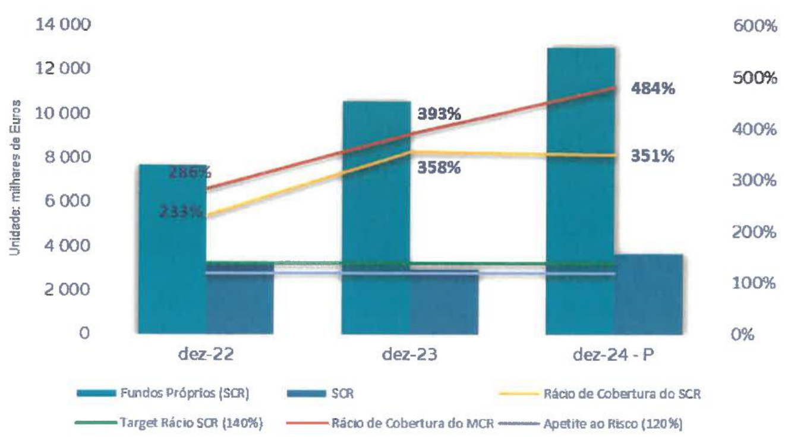
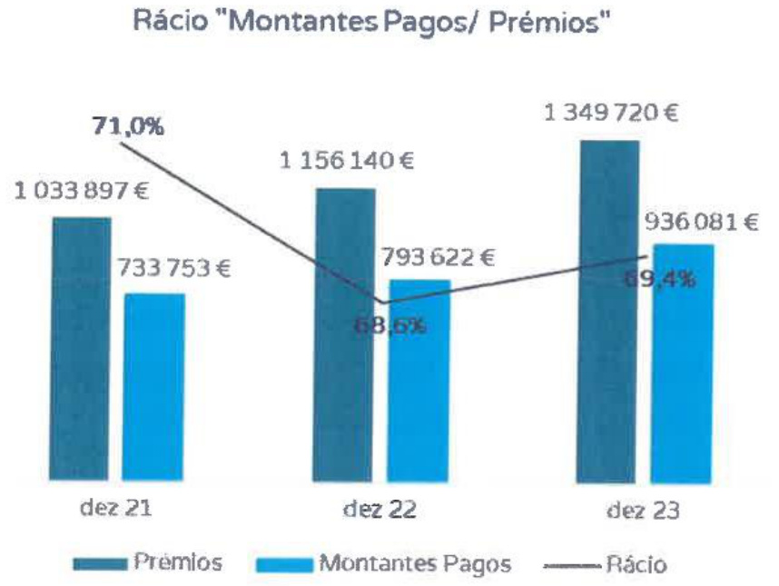

  

  

  

# iNDICE  

SINTESE  

ATIVIDADES E DESEMPENHO 23  

A.1 ATIVIDADES 24   
A.2 DESEMPENHO DA SUBSCRICAO 28   
A.3 DESEMPENHO DOSINVESTIMENTOS 35   
A.4 DESEMPENHODEOUTRASATIVIDADES 36   
A.5 EVENTUAISINFORMACOESADICIONAIS 36   
A.6 EVENTOSSUBSEQUENTES 37  

# B SISTEMAS DE GOVERNACAO  

B.1 INFORMACOES GERAISSOBREOSISTEMADEGOVERNACAO 40   
B.2 REQUISITOSDEQUALIFICACAOEIDONEIDADE 56   
B.3 SISTEMASDEGESTAO DE RISCOS COM INCLUSAO DA AUTOAVALIACAO DO RISCO EDA   
SOLVENCIA 57   
B.4 SISTEMADECONTROLOINTERNO 66   
B.5 FUNCAODEAUDITORIAINTERNA 68   
B.6 FUNCAOATUARIAL 69   
B.7 SUBCONTRACAO 70   
B.8 EVENTUAISINFORMACOESADICIONAIS 71   
C.1 RISCO ESPECIFICO DESEGUROSINTERNO 75   
C.2 RISCO DEMERCADO 76   
C.3 RISCO DE CREDITO 77   
C.4 RISCO DELIQUIDEZ 77   
C.5 RISCO OPERACIONAL 78   
C.6 OUTROSRISCOSMATERIAIS 78   
C.7 EVENTUAISINFORMACOESADICIONAIS 81   
D.1 ATIVOS 84   
D.2 PROVISOESTECNICAS 88   
D.3 OUTRASRESPONSABILIDADES 91   
D.4 METODOSALTERNATIVOSDEAVALIACAO 93   
D.5 EVENTUAISINFORMACOESADICIONAIS 93  

# E GESTAO DO CAPITAL 95  

E.1 FUNDOSPROPRIOS 96   
E.2 REQUISITODECAPITALDESOLVENCIAEREQUISITODECAPITALMINIMO 98   
E.3 UTILIZACAO DO SUBMODULO DE RISCO ACIONISTA BASEADO NA DURACAO PARA CALCULAROREQUISITODECAPITALDESOLVENCIA 101   
E.4 DIFERENCASENTREAFORMULA-PADRAOEQUALQUERMODELOINTERNO UTILIZADO 101   
E.5 INCUMPRIMENTODOREQUISITODECAPITALMINIMOEINCUMPRIMENTODO REQUISITO DECAPITALDESOLVENCIA 101   
E.6 EVENTUAISINFORMACOESADICIONAIS 101  

  

SiNTESE  

# 01 SINTESE  

Opresente documento constitui o Relatorio sobre a Solvencia e a Situacao Financeira da Planicare - Companhia de Seguros,S.A.(“Planicare”ou “Companhia"),relativamente ao ano de 2023,tendo sido produzido,aprovado e certificado e sendo divulgado nos termos dos artigos 81.8,numeros 5e 6,e 83.do Regime Juridico de Acesso e Exercicio da Atividade Seguradora e Resseguradora, constante do Anexo 1a Lei n.9147/2015,de 9 de setembro(RJASR"), dos artigos 290.a 303. do Regulamento Delegado(UE) 2015/35 da Comissao, de 10 de outubro de 2014(Regulamento Delegado 2015/35"), dos artigos 1.a 4.9,6.2e 7.9 do Regulamento de Execucao (UE) 2023/895 da Comissao, de 4 de abril de 2023 (Regulamento de Execucao 2023/895"),dos artigos 3.a 9.e13.2da Norma Regulamentar da ASF n.2/2017-R,de 24 de marco (Norma Regulamentar 2-2017-R"), do artigo 26.,alinea a), da Norma Regulamentar da ASFn.94/2023-R,de11de julho.  

O artigo 83. do RJAsR exige que as empresas de seguros divulguem publicamente um relatorio anual sobrea sua solvencia e situacao financeira,tendo como objeto de analise informacao qualitativa equantitativa.  

A informacao quantitativa a divulgar em conjunto com este relatorio encontra-se prevista no artigo 4.9do Regulamento de Execucao 2023/895.Por sua vez,0objeto da informacao qualitativa encontra-seprevisto no capituloXll do TituloI doRegulamentoDelegado2015/35. Oreforco domodelo de supervisao do sistema de governacao encontra-se previsto na Norma Regulamentar n.4/2022-R,de 26 de abril, sendo que o Art.26.“Elementos a reportar pelas empresas individuais" remete para os normativos descritos nos dois paragrafos anteriores. Considerando 0 n.92 do artigo 292. do Regulamento Delegado 2015/35, os cinco capitulos desta Sintese representam um resumo daquilo que sera explicitado ao longo do presente Relatorio.  

Num contexto de instabilidade economica,decorrente do rescaldo de uma pandemia mundial e da disrupcao criada pelos conflitos armados na Europa e Medio Oriente, surge um cenario de inflacäo globalizada,que fazprever um abrandamento do crescimentoglobal para $3,2\%$ em 2024,de acordo com o Fundo Monetario Internacional (FMi),ainda que se estime uma modesta subida para 3,2% em 2025.Na zona Euro,projeta-se uma recuperacao do crescimento que era de $0{,}5\%$ em 2023,emconsequencia da elevada exposicao da guerrana Ucrania,para $0{,}9\%$ em 2024e $1,7\%$ em 2025,tendoporbase a mesma fonte de dados.  

OFMl preve ainda uma estabilizacao do crescimento do PIB no medio prazo, em taxas consonantescomamediade $3,8\%$ que severificava prepandemia,valores que refletem as recentes melhorias na China,Estados Unidos e ao nivel dos mercados emergentes e economias em desenvolvimento,com suporte na subida dos rendimentos reaise fortalecimento da procura externa.  

  

No que dizrespeito a inflacao,o FMl preve uma reducao superior ao expectavel em cerca de $80\%$ da economiamundial,que sepressupoe alcancar percentagensde $5,8\%$ em2024ede $4,4\%$ em 2025.Os fatores que motivam esta reducao diferem depais para pais, ainda que de forma geral se devam a uma politica monetaria mais restrita, sustentada no restabelecimento das cadeias de abastecimento global, arrefecimento da procura global e reducao dos precos da energia.Na zona Euro,o indice de inflacao fixou-se numa media de 2,9% no final de 20232.  

  

A medida que a inflacao diminui em direcao aos niveis previstos para todas as regioes,osbancos centrais definem como prioridade de curto prazo a suavizacao do impacto dessa alteracao. Ainda que grande parte das medidas de inflacao subjacente tenham registado um novo abrandamento,de acordo com o Banco Central Europeu (BcE),as pressoes internas sobre os precos permanecem elevadas,pelo que importa assegurar que as taxas diretoras serao fixadas em niveis suficientemente restritivos durante o tempo que se considerar necessario.  

A Reserva Federal Norte-Americana (FED) reconhece a instabilidade relativa as taxas de inflagao,peloquenaoconsideraaprpriada mareduao dosvaloresalvo,atequeseverifique um maior graudeconfianca em como serao atingidosos $2\%$ previstospara osniveisde inflacao. Como suporte a eventuais ajustamentos nesta previsäao,o Comite Federal de Mercado Aberto tende a intervir de forma ponderadae com base na avaliacao dos dadosrecebidos,da evolucao de perspetivas e equilibrio dos riscos. A evolucao da inflacao na zona Euro comparativamente com a dos Estados Unidos da America,ilustra-se conforme a figura abaixo,em que e possivel verificar o seu decrescimo aolongo do ano de2023.  

  

Conforme estabelecido no Boletim Economico de Dezembro do Banco de Portugal, a politica monetaria do BcE em resposta a uma escalada inflacionista,passa por subir as taxas dejuro de referenciaoque propiciaoaumento dos custos definanciamento deempresase familias,tendo por finalidade incentivar a poupanca e restringir a procura por bens e servicos e, consequentemente,reduzir a pressao sobre os precos.  

# Desempenho da Atividade  

A Companhia alcancou um volume de premios brutos emitidos de seguro direto(PBE),liquidos de estornos e anulacoes,de11.886.881 euros,o querepresenta um crescimento superiora $21\%$ comparativamente a 2022.Por seu lado,oresultado liquido situou-se no limiar dos3milhoes de euros (2.844.469 euros), o que representa um acrescimo de cerca de922 milhares de euros em comparacao com operiodohom6logo(2022:1.922.774 euros).  

  
PBE e Resultado Liquido  

  
Excesso Ativo sobre Passivo e Racio Combinado (%)  

  
Gastos coim contratos de seguros e racio de sinistralidade  

No final de 2023,o excesso de ativo sobre o passivo da Planicare aumentou aproximadamente 2,8milhoes deeuros, situando-seem10,3milhoes de euros,registando uma diminuicao doracio combinado em cerca de 5p.p.Ja os gastos com contratos de seguro aumentaram sensivelmente 19% face ao periodo homologo, para 6.698.206E. O racio de sinistrlidade diminuiu 3 p.p. Finalmente,a carteira daPlanicare,apresentava 64.343 apolices e83.904 pessoas seguras a31 dedezembrode2023.  

# B.Sistema de governacao  

De acordo com o disposto no artigo 278.,numeros 1,alinea a),e3,do C6digo das Sociedades Comerciais,a administracao e a fiscalizacao da Planicare estruturam-se segundo o modelo "classico”, compreendendo um Conselho de Administracao (que delegou a gestao corrente da Planicare numa Comissao Executiva), um Conselho Fiscal e um Revisor Oficial de Contas.  

Os membros da Mesa da Assembleia Geral, do Conselho de Administracao e do Conselho Fiscal sao designados para mandados de dois anos civis,coincidentes com os exercicios sociais, contando-se como completo o ano da designacao.  

ORevisor Oficial de Contas e designado para mandados de dois anos civis,coincidente como exercicio social,contando-se como completo o ano da designacao.  

Sem prejuizodeeventuais limitacdeslegais,epermitida a reconducao,poruma oumais vezes. O governo das sociedades envolve um conjunto de relacoes entre a gestao da Companhia,os seus acionistas e outras partes interessadas, atraves do qual sao definidos os objetivos da empresa,bem como a forma de os alcangar e de osmonitorizar.  

Existem varias areas e comites especificos que asseguram a segregacao entre as areas de negocio e as areas de operacoes.Em dezembro de 2023,os comites existentes sao:  

Comite de Risco Comite de Produto  

Por sua vez,o quadro de governacao inclui entre outros,as quatro funces-chave de controlo:  

  

A framework de gestao de risco e controlo interno representa um fator fundamental na gestao e controlo eficaz e eficiente dos riscos a que a Planicare se encontra exposta no seu negocio e nas suas operacoes. No que respeita a Planicare,o Sistema de Gestao de Risco e Controlo Interno assenta em quatro componentes principais:Ambiente de Controlo, Gestao de Risco, ProcedimentosdeControloe Avaliacao Independente.  

A companhia possui uma Politica de Gestao de Riscos e uma Politica de Controlo Interno com o proposito de apoiare fundamentar o processo de tomada de decisao,sendo capaz depotenciar, tanto no curto como no longo prazo,a capacidade de a Planicare gerir os riscos a que esta exposta.  

A funcao de Verificacao do Cumprimento e Juridica é uma funcao independente, que devera assegurarqueaompanhiacumpreasleis,regulamentosregrasinternasepoliticasbemcom ospadroeseticosrelevantespara a integridade.  

  

A funcao de auditoria interna nao assume qualquer tipo de responsabilidade relativa a outras funcoes da Companhia, sendo exercida de forma objetiva e independente das funcoes operacionais.  

A funcao atuarial é independente em termos funcionais,reportando diretamente a Comissao ExecutivadaCompanhia.  

A Companhia aprovou uma Politica de Subcontratacao,que estabelece os procedimentos e regras a observar pelaPlanicare quanto a subcontratacao de funcoes ou atividades de seguro, em que oprestador de servicos realiza,diretamente oumediante nova subcontratacao,um processo, servico ou atividade que de outra forma seria realizado pela propria empresa de segurosouderesseguros.  

Oobjetivo da Funcao de Risco passa pela identificacao,avaliacao,mitigacao e monitorizacao dos riscos a que a Planicare se encontra exposta, garantindo o conhecimento necessario para o seu controlo,atraves da implementacao complementar do sistema de controlo interno.O Sistema de Gestao de Risco compreende a execucao de um processo global e integrado: Identificacao de Riscos,Definicao de Indicadores de Risco,Avaliacao de Riscos,Definicao de Perfil Risco,Execucao do Processo ORsA (autoavaliacao do risco e da solvencia) e Desenho de PlanosdeResposta.  

No ambito do Sistema de Gestao de Risco, destaca-se o processo de Autoavaliacao do Risco e da Solvencia (ORSA).No ano de 2023,a Planicare elaborou o seu quarto exercicio ORSA, perfilando-se como um suporte essencial nas decisoes estrategicas,na definicao dos niveis de apetite e tolerancia aorisco e suporte na definicao doplano de negocios da Companhia.  

Para garantir uma abordagem coerente e abrangente visando a identificacao de riscos, avaliacao,monitorizacao ereporte dentro da Planicare,os diferentes tipos derisco serao agrupadosem:  

risco especifico de seguros   
risco demercado   
risco de incumprimento pela contraparte   
risco operacional   
outrosriscos  

O sistema de controlo interno da Planicare institui o recurso a controlos como um meio para mitigar orisco ou eventos derisco cujo impacto podera colocar em causa a atividade da Planicare,sobretudo no caso daqueles situados acima do apetite ao risco definido.De forma a operacionalizar o modelo de controlo interno e,assim,garantir a eficacia do eventual recurso a controlos,é desenhado o processo global de controlo interno, que compreende as fases de caracterizaco,implementacao,monitorizacao e avaliacao de controlos.  

A fim de tracarseuperfil derisco,a Companhia,comapoio dagestao deriscos,identifica avalia, gere e monitoriza os diversos riscos a que esta ou podera vir a estar exposta.  

Uma etapa essencial para um bom sistema de gestao derisco passa pela identificacao dos principais riscos a que a Companhia se encontra exposta.Este passo permite nao so identificar os testes de esforco a efetuar,bem como contribui para o processo de avaliacao do perfil de risco da Companhia.ldentificar o risco implica avaliar a sua tipologia e analisar todos os potenciaisimpactosdomesmo.  

A avaliacao dos riscos tem porbase a formula-padrao aplicada no calculo do requisito de capital de solvencia.Para outros riscos,nao incluidos na formula,a Companhia realiza uma analise qualitativa de forma a classificar o impacto previsivel nas suas necessidades de capital. Assim,o calculo do requisito de capital de solvencia(ScR) da Planicare,a 31 de dezembro 2023, éoseguinte:  

  

No quadro seguinte observa-se a evolucao do requisito de capital de solvencia (SCR) da Planicare,entre2022e2023,bemcomo a evolucao dosrequisitos decapital derisco em termos deponderacao:  

<html><body><table><tr><td rowspan="2">Submodulo</td><td colspan="2">ValoremEuros</td><td colspan="2">Ponderacao</td></tr><tr><td>2023</td><td>2022</td><td>2023</td><td>2022</td></tr><tr><td>Risco deMercado</td><td>92720</td><td>0</td><td>3%</td><td>0%</td></tr><tr><td>Risco deIncumprimentopelaContraparte</td><td>1081077</td><td>1919651</td><td>30%</td><td>47%</td></tr><tr><td>Risco de Subscricao Doenca</td><td>2097110</td><td>1849770</td><td>58%</td><td>45%</td></tr><tr><td>Risco Operacional</td><td>348204</td><td>337236</td><td>10%</td><td>8%</td></tr></table></body></html>  

Oreferido aumento do volume de premios e,por conseguinte,oaumento da exposicao impacta positivamenteno submodulo risco de Incumprimento pela Contraparte,tendo em consideracao, tal como descrito na Politica de Investimentos,o facto dea Companhia privilegiara liquidez com a aplicacao dosvalores em depositos a ordem.  

  

Com efeito,oRisco Subscrico Doenca passou a ser omodulo de risco commaior ponderacao relativa (58%) tendo-se quantificado em 2,1 milhoes de euros, em linha com a evolucao do negocio.  

No seguimento do definido na Politica de Gestao de Risco,o perfil de risco da Companhia, encontra-sedentro doslimites definidos:  

Basic SCR-Limites de tolerancia por submodulo   

<html><body><table><tr><td></td><td>JMinimo</td><td>Maximol</td></tr><tr><td>Risco de Mercado</td><td>0,00%</td><td>25,00%</td></tr><tr><td>Risco de Incumprimentopela Contraparte</td><td>20,00%</td><td>40,00%</td></tr><tr><td>Risco de Subscricao Doenca</td><td>0,00%</td><td>70,00%</td></tr><tr><td>Risco Operacional</td><td>5,00%</td><td>15,00%</td></tr></table></body></html>  

Verifica-se que os limites de tolerancia ao risco por submodulo sao cumpridos.  

A Companhia nao reconhece qualquer ajustamento para a capacidade de absorcao de perdas dosimpostosdiferidos.  

# D.Avaliacao para efeitos de solvencia  

O justo valor é a principal metodologia de avaliacao do balanco de Solvencia ll,que é o valor pelo qual um ativo poderia ser trocado, um passivo liquidado ou um instrumento de patrimonio concedido trocado entre partes conhecedoras e com interesse no negocio, numa transacao em  

condicoes normais de mercado.  

As diferencas de avaliacaomais significativas sao:  

Os passivos de seguros bem como os recuperaveis de resseguros nos passivos tem uma metodologia propria no regime de Solvencia ll. Desta metodologia resuta um valor diferente de passivos de seguros face aos das normas contabilisticas locais;   
Nao reconhecimento dos custos de aquisicao diferidos e de ativos intangiveis se existirem;   
Os imoveis para investimento ou uma carteira de obrigacoes sao reavaliados ao justo valor.  

O total do ativo e do passivo sao apresentados no quadro seguinte:  

<html><body><table><tr><td>valoresemeuros</td><td>Solvenciall</td><td>Contas Locais Estatuarias</td><td>Var.</td></tr><tr><td>Ativos</td><td>14334051</td><td>15034722</td><td>-700671</td></tr><tr><td>Passivos</td><td>-3726695</td><td>-4781978</td><td>-1055283</td></tr><tr><td>Fundos Disponiveis</td><td>10607356</td><td>10252745</td><td>354612</td></tr></table></body></html>  

O valor das provisoes tecnicas em Solvencia ll é igual a soma da melhor estimativa das responsabilidades e da margem de risco,conforme estipulado no Regulamento Delegado 2015/35.  

A melhor estimativa das provisoes tecnicas foi calculada com recurso a curva de taxas de juro sem risco,disponibilizadapelaEioPA.  

A Planicare nao utiliza quaisquer medidas transitorias ou medidas de longo prazo no calculo da melhor estima dasprovisoes tecnicas.  

Ohorizonte temporal usado no calculo da melhor estimativa e o tempo de vida util completo das responsabilidades a data da avaliacao. A determinacao da vida util da carteira baseia-se nos limites dos contratos e nos pressupostos sobre quando é que estas responsabilidades podem ser liquidadas,canceladas ou expiradas.  

<html><body><table><tr><td>valoresemeuros</td><td>SolvenciaIl</td><td>Contas Locais Estatutarias</td><td>Var.</td></tr><tr><td>RamoSaude</td><td>2185611</td><td>3653123</td><td>-1467512</td></tr><tr><td>Margem de Risco</td><td>144316</td><td>12606</td><td>131711</td></tr><tr><td>Provisoes Tecnicas</td><td>2329927</td><td>3665728</td><td>-1335801</td></tr></table></body></html>  

A 31 de dezembro de 2023, a Companhia nao tinha celebrado qualquer contrato de resseauro.  

# E.Gestao de Capital  

O objetivo da Companhia no que respeita a gestao de capital é a otimizacao da composicao, estrutura e alocacao docapital de modo a obter um crescimento rentavel. No quadro seguinte observa-se a evolucao da composicao dos fundos proprios da Planicare entre2022e2023:  

<html><body><table><tr><td>valoresemeuros</td><td>2023（Disponiveis)</td><td>2023(Elegiveis)</td><td>2022(Disponiveis)</td><td>2022（Elegiveis)</td></tr><tr><td>Fundos Proprios</td><td>10607356</td><td>10607356</td><td>7716385</td><td>7716385</td></tr><tr><td>Tier1-unrestricted</td><td>10607356</td><td>10607356</td><td>7716385</td><td>7716385</td></tr><tr><td>Tier1-restricted</td><td></td><td>0</td><td></td><td></td></tr><tr><td>Tier2</td><td></td><td></td><td>O</td><td></td></tr><tr><td>Tier3</td><td></td><td></td><td></td><td></td></tr></table></body></html>  

No ambito da adequacao de capital emSolvencia ll, as seguintesmedidas sao aplicaveis:  

ORequisito de Capital Minimo (McR)-define o patamar minimo abaixo do qual é considerado que onivel deprotecao dos tomadoresebeneficiariose insuficiente,podendo desencadear medidas extremas por parte da autoridade de supervisao. E expectavel que esterequisitosesitueentreos25%e45%doSCR.  

O Requisito de Capital de Solvencia(ScR)-avalia se a empresa dispoe defundos proprios de modo a cobrir os requisitos de capital em funcao do risco.Em caso de insuficiencia,ou seja,quando os fundos proprios elegiveis descerem abaixo do ScR,devera ser definido e submetido aosupervisor umplano derecuperacao.  

<html><body><table><tr><td>valoresemeuros</td><td>31/12/2023</td><td>31/12/2022</td><td>Var.</td></tr><tr><td>FundosProprios Elegiveispara cobrir oSCR</td><td>10607356</td><td>7716385</td><td>37%</td></tr><tr><td>Requisito deCapital deSolvencia(SCR)</td><td>2966620</td><td>3317532</td><td>-11%</td></tr><tr><td>Racio de Cobertura doSCR</td><td>358%</td><td>233%</td><td>125</td></tr><tr><td>Fundos Proprios Elegiveispara cobriro MCR</td><td>10607356</td><td>7716385</td><td>37%</td></tr><tr><td>Requisito de Capital Minimo(MCR)</td><td>2700000</td><td>2700000</td><td>0%</td></tr><tr><td>Racio de Cobertura do MCR</td><td>393%</td><td>286%</td><td>107</td></tr></table></body></html>  

No final de 2023verificou-se uma evolucao favoravel do racio de cobertura do SCR,registando um aumento de 125 p.p. face ao ano de 2022.Ja no que dizrespeito aos Fundos Proprios Elegiveis para cobrir o ScR,estes registaram um aumento de cerca de 2,9 milhoes de euros. OraciodecoberturadoMcR,a fecho de2023,foi de $393\%$ oquerepresentaumcrescimento de1o7 p.p.,resutante do crescimento do volume denegocios. A evolucao favoravel dos fundosproprios e justificadapelo crescimento dovolume de negocios.  

A Companhia tem tido uma maior exposicao o que se traduz em maiores cargas de capital nos modulos derisco de Incumprimento pela Contraparte e de Risco de Subscricao.  

No ambito do trabalho desenvolvido no exercicio de Autoavaliacao do Risco e da Solvencia (ORSA), estima-se que o racio de SCRe MCR no final de 2024 se situe em 351% e 484%, respetivamente.  

Neste exercicio,foram ainda trabalhados cenarios de sensibilidade que de forma resumida se podemagruparem:  

Cenarios de sensibilidade de Subscricao;   
Cenarios de sensibilidade de Contraparte;   
Combinacao de cenarios de sensibilidade de Subscricao e Contraparte;   
Cenario sobre Risco de Alteracoes Climaticas.  

Relativamente a este ultimo ponto,refira-se ainda que de acordo com a Circular da AsF n. 1/2022, de 25 de janeiro (Circular 1/2022"),com o titulo“Analise de Cenarios sobre riscos de Alteracoes Climaticas no Ambito do Exercicio ORsA",a“ASF recomenda que a gestao dos riscos de alteracoes climaticas seja integrada no sistema de governacao, designadamente no sistema de gestao de riscos e no exercicio ORsA",recomendando“que seja integrada uma analise sobre riscosde alteracoesclimaticasno exercicioORsA."  

Com efeito,a Planicare, construiu o cenario solicitado de acordo com um conjunto de pressupostos,ressalvando, contudo, de acordo com o paragrafo 17 da Circular 1/2022",“ desafio inerente a analise da exposicao a riscos de alteracoes climaticas".  

Assim, e de acordo ainda com a ressalva que consta na “Circular 1/2022", esta primeira formulacao tem em consideracao a “dimensao e complexidade da exposicao da Planicare aos riscos de alteracoes climaticas”,sendo queo“ambito,profundidadee metodologias irao evoluir a medida que os modelos utilizados sao desenvolvidos"em funcao da crescente experiencia a adquirir.  

De acordo com operfil de risco da Planicare e sendoo Risco de Incumprimento pela Contraparte um dos riscos com maior ponderacao,uma das principais medidas de mitigacao consiste na realocacao dos montantes alocados em Depositos a Ordem a emitentes com grau de qualidade crediticia superior e / ou diversificando o risco de incumprimento pela contraparte atraves do aumento do numero deentidadesfinanceiras.  

O grafico seguinte ilustra ainda os targets minimo de apetite ao risco, tal como descrito na Politico de Gestao de Risco no que diz respeito aos 2 principais indicadores de solvencia (SCRSolvency Capital Requirement)e(McR -Minimum Capital Requirement):  

  

  

  

  

# A ATIVIDADESEDESEMPENHO  

# A.1 ATIVIDADES  

# A.1.1.DENOMINACAODA COMPANHIA EESTRUTURAACIONISTA  

A Planicare -Companhia de Seguros, S.A.,foi constituida em 14 de outubro de 2019 com um capital social de2,5millhbes de euros.E detida a $200\%$ pela sociedadeAmbitorelevo-SGPs, S.A.  

A sua sedesocial situa-senaRuaFernao deMagalhaes,n.2,FracoC,4429N.deGaia, no entanto, dispoe de escritorios tanto em Vila Nova de Gaia como em Lisboa.  

A 11 de novembro de 2019,a Planicare iniciou a sua atividade,explorando exclusivamente0 RamoDoenca em territorionacional.  

No seguinte grafico é possivel observaro organograma da estrutura de participacoes do grupo:  

  

# A.1.2.SUPERVISAO FINANCEIRA  

A supervisao financeira da Planicare cabe a Autoridade de Supervisao de Seguros e Fundos de Penses(ASF"),sedeada naAvenida daRepublica76,1600205,Lisboa,entidaderesponsavel pela regulacao e supervisao daatividade seguradora.  

# A.1.3.REVISOROFICIALDECONTAS  

O auditor externo da Companhia,responsavel pelos trabalhos de revisao legal de contas e auditoria é a PricewaterhouseCoopers &Associados(SRoc), com sede no Palacio Sottomayor, AvenidaFontes Pereira deMelo,n.16,1050-121Lisboa,representada porCarlos Manuel Sim SimMaia.  

A par dos trabalhos acima referenciados,a sociedade presta tambem servicos exigidos por lei, tais como a Certificacao do Relatorio Anual sobre a Solvencia e Situacäo Financeira (artigo 3.9, numero 1,alinea a), da Norma Regulamentar 2/2017-R) e a Revisao do Relatorio Anual sobre a Estrutura Organizacianal e osSistemas de Gestao de Risco e de Controlo Interno(artigos 19.e 20.9daNorma Regulamentar da ASF n.14/2005-R,de29 de novembro,NormaRegulamentar da ASFn.10/2006-R,de 24 de outubro,artigo 25.da Norma Regulamentar da ASFn. 10/2009-R,de25 dejunho,e Circular da ASFn.91/2017, de15defevereiro).  

# A.1.4.TITULARESDEPARTICIPACOESQUALIFICADAS  

A 31 de dezembro de 2023,a Ambitorelevo-SGPS, S.A., detinha 100% do capital social da Planicare-Companhia deSeguro,S.A.  

# A.1.5.PERSPETIVASFUTURAS  

"A inovacao nunca para. Nos tambem nao.O ecossistema das Fintech em Portugal tem-se mostrado brilhante.Apesar dos desafiosgeopoliticos e deumarecessao economica,o setoresta em constante evolucao, impulsionado pelos avancos tecnologicos e por alteracoes no comportamento do consumidor.A par disso, deparamo-nos com um vasto leque de oportunidades de financiamento como o Programa Portugues de Recuperacao e Resiliencia (PRR),o Portugal 2030 e o programa Horizonte Europa.Ate ao momento,este ecossistema Fintech ja arrecadou mais de 1,1 mil milhoes de euros em investimento.  

De acordo com a setima edicao do Portugal Fintech Report,em 2023,um terco do capital arrecadado destina-se a Insurtechs,sendo este setor responsavel por $20\%$ doecossistema.  

Esta tendencia promete revolucionar o setor financeiro,oferecendo servicos mais personalizados,convenientes e seguros.  

  
Figura 1-Dispersao dasFintechts por area de negocio  

Segundo o InsurTech Connect 2023, existem quatro fatores chave que estao no auge da inovacaoemseguros4:  

  
Figura 2-Fatores chave das Insurtechs  

A IA generativa,que se traduzno uso de inteligencia artificial para criar conteudos como texto, imagens,audio ouvideo.medidaque as empresas armazenamcadavezmais dados,aumenta a preocupagao em transformar as interacoes das seguradoras com os clientes e,com isto, melhorar os resultados financeiros. Os lideres dos seguros veem esta ferramenta como uma oportunidade transformadoradosetora longoprazo.  

Tem se vindo a observar algumas mudancas significativas na estrategia adotada. O foco esta atualmente direcionado para a lucratividade ao inves do crescimento,devido a complexidade na gestao de perdas e contencao de despesas. Eventos catastroficos, inflacao e aumento generalizado dos custos sao fatores determinantes para esta alteracao de comportamento.  

A solucao das Insurtechs passa por melhorar o processo de gestao de sinistros,atraves de recolha de dados da pessoa segura, de forma a prever e mitigar o risco,e,a melhorar a subscricao,atraves de modelos lineares generalizados deprecisao na selecäo de risco.  

Devido a constante evolucao que vivenciamos,fatores como avancos tecnologicos,alteracoes climaticas, envelhecimento da populacao e tensoes geopoliticas, fazem com que os riscos emergentes sejam cada vez mais complexos. Ha desta forma uma preocupacao adicional do setor em acompanhar a constante mudanca e salvaguardar-se das novas ameacas.  

Finalmente, a industria esta a optar por tomar decisoestecnologicasmais simples e os desafios mais basicos da tecnologia e da estrutura de dados estao a ganhar uma maiorimportancia. lsto, porque estamos perante um ritmo tecnologico acelerado e as empresas veem-se na iminencia de reduzir os custos com a tecnologia existente, de forma a conseguirem acompanhar a tendencia.  

OEconomic Outlook2024,refere oscinco principaisriscosmacroeconomicosglobais para anode2024.Saoeles:  

Desenvolvimentos geopoliticos - os conflitos entre varios paises ameacam o normal funcionamento das cadeias de abastecimento, inflacionam os precos das materiasprimas e perturbam os fluxos de capital. O clima de incerteza gera desconfianca e uma escalada significativa afetaria de forma muito significativa o setor do turismo;   
Inflacao-Se a inflacaopermanecer elevada,saonecessariasmaismedidaseuma politica monetaria mais restritiva.As taxas de juro elevadas poderao comprometer o crescimento economicorealdospaises;   
Estabilidade financeira -O ritmo crescente das taxas de juro podera revelar vulnerabilidades no sistema financeiro.A gestao prudente dos riscos e fundamental para oinvestimentofuturo;   
Incerteza economica da China - Os riscos em torno da economia chinesa no que concerne aos desafios da divida imobiliaria e dos setores do governo permanecem em destaque.Apesar do governo chines estar relutante no apoio politico a estimulacao da economia,uma politica expansionista poderia levar a um crescimento muito forte da China;   
Eventos climaticos -A intensificacao e gravidade dos desastres climaticos aumenta drasticamente o risco para as empresas,consumidores e decisores politicos.As empresas poderao ter de se adaptare priorizar estrategias omnichannel, as familias poderao alterar a sua residencia para locais menos propicios a fenomenos naturais (evitando zonas costeiras,ou zonas de placas tectonicas por exemplo),e os decisores politicos poderao ter de reforcar politicas ambientais que acarretam investimentos significativos e avultados em infraestruturas energeticas e de transporte.  

# A.2.1.EVOLUCAODA ECONOMIAPORTUGUESA  

# Evolucao da Economia Portuguesa  

Excedendo a expectativa para 2023,Portugal registou um crescimento economico de $2,3\%$ Banco dePortugal preveque,para024,haja um abrandamento do ritmo,mantendo-se est nos $^{1,2\%}$ Apesar do ritmo crescente, a recuperacao da atividade sera gradual ao longo do proximoano.  

Espera-se que em 2024 a procura externa aumente; se verifique uma descida da inflacao, proporcionando as familias um maior poder economico;um impulso da economia devido aos fundos de investimento europeu e uma trajetoria descendente das taxas de juro.  

No ambito do mercado de trabalho estamos perante uma situacao de estabilizacao do emprego. Estima-se que no proximo ano,haja uma melhoria do emprego em $0.1\%$ prevendotambemum aumento nos salarios reais.Ja a taxa de desemprego media para 0periodo de 2024 a 2026 ira rondaros $7,2\%$  

Finalmentepara024,Banco deortugalantev $0.2\%$ doPIB para o excedente orcamentale o racio da divida publica abaixo dos $I00\%$ do PIB,com tendencia a reduzir nos proximos anos.  

  

Segundo o Economic Outlook 2024,ao longo dos ultimos anos temos experienciado em Portugal um crescimento salarial superiora taxa deinflacao,exceto no ano de2020,explicado pela pandemia de SARs-Cov-2. Tambem o poder de compra dos portugueses aumentou cerca de $^{1,81\%}$ no terceiro trimestrede 2023 face ao periodo homologo.Esteaumento écinco vezes superior a media dos paises da OcDE. Tambem o PIB per capita em Portugal cresceu $1,61\%,$ tornando-se assim a maior taxa de crescimento da Uniao Europeia neste periodo.  

  

Comparativamente com a zona euro, a taxa de inflacao em Portugal acompanhou a trajetoria verificada nos restantes paises, mantendo-se ligeiramente abaixo nos ultimos anos. Ja o crescimento salarial destacou-se pela positiva.Com excecao do ano de2020,desde 2014 que o crescimento salarial se mantem acima da media da zona euro.  

  

Esta tendencia deve-se em parte aos sucessivos aumentos do salario minimo em Portugal ao longo dos ultimos anos e cada vez em maior percentagem, tal como observado no seguinte grafico:  

  

# A.2.2.EVOLUCAODOMERCADOSEGURADORPORTUGUES  

A atividade seguradora emPortugal apresentou,noano de2023,em producao de seguro direto, comportamentos distintos:variacao negativa no ramo Vida,ao passo que no segmento Nao Vida verificou-se uma variacao positiva relativamente a 2022.  

O ramo Vida registou uma quebra de 14,31%(recorde-se que ha um ano tinha ja registado uma quebradecercade $22\%$ e os ramos NaoVida,um crescimento de10,41%.Noglobal,no periodo em analise,a producao apresentou um decrescimo de 1,94%8.  

Nos ramos Nao Vida,mais uma vez,o destaque vai para o ramo Doenca,que registou um aumento da producao superior a 193 milhoes de euros, cerca de 16,7% face ao ano anterior. Esta evolucao permitiu ao ramo Doenca o 1.9 lugar no ranking dos ramos Nao Vida.  

<html><body><table><tr><td>PBE-unidade:milhares</td><td>31/12/2023</td><td>31/12/2022</td><td>Variacao</td></tr><tr><td>Total Mercado</td><td>11822834</td><td>12056430</td><td>-2%</td></tr><tr><td>Total MercadoVida</td><td>5159275</td><td>6021151</td><td>-14%</td></tr><tr><td>Total MercadoNaoVida</td><td>6663559</td><td>6035279</td><td>10%</td></tr></table></body></html>  

Relativamente a estrutura da carteira em Portugal8o segmento Vida foi responsavel por $43,6\%$ e o segmentoNaoVida,pelos restantes $^{56,4\%}$ A composicao dosramosNaoVida nao sofreu alteracoes significativas relativamente ao ano passado (figuras 8e 9).  

  
Figura 3-Estrutura da Carteira  

  
Estrutura dos ramos Nao Vida   
Figura 4-Estruturadacarteira dosramosNaoVida(4 trimestre de2023)  

No que concerne a montantes pagos, o ramo Doenga aumentou cerca de $18\%$ traduzindo-se um aumento superiora 142 milhoes de euros face ao periodo homologo.O racio de montantes pagos sobre os premios tambem registou uma trajetoria crescente comparativamente a 2022, de8p.p.8  

  

O comportamento dos consumidores esta em constante mudanca.  

Tem-se observado uma crescente preocupacao centrada nos riscos emergentes, tais como o aumento do custo de vida e as mudancas climaticas, em prol das areas seguradas mais tradicionaiscomo roubo edanosna propriedade.  

Tambem o fator geracional tem um peso elevado nesta tematica.Os millennials, que agora entram numa fase de vida mais propensa a aquisicao de seguros, demonstram maior preocupacao com saudemental,bem-estareprotecao dedados,ja a geraco que lhes precede, os baby boomers,estäo numa fase da vida commenor intencao de subscrever seguros e maior focona estabilidade financeira.  

E crucial que as companhias de seguros se adaptem as mudancas e preferencias dos consumidores, simplificando a experiencia do cliente e mantendo-se a par da inovacao tecnologica.  

  
Desempenho da Companhia  

A Planicare conta com uma rede convencionada de prestadores de cuidados de saude na gestao da sua atividade de seguros de saude.No final de 2023,apresentava quatro produtos para comercializacao:“EasyCare”“Protection"e“Soft”e“Easy 50+”  

As solucoes “EasyCare”“Protection”tem planos muito diversos,permitindo um elevado grau de flexibilizacao do plano a subscrever, sendo queoSoft”consiste numa solucomais simples, isto e, para o segmento que pretende garantir necessidades basicas de cuidados de saude.  

Relativamente a estrategia,a Planicare centrou-se essencialmente em 2 eixos de atuacao:  

Foco no aumento da taxa de penetracao no segmento-alvo, ou seja,no segmento individual,tendo como objetivo aumentara fidelizacao e incrementara taxa deretengao para atingir um crescimento sustentado e solido no segmento individual;  

Concretizacao do alargamento da Rede de Prestadores a um prestador com ampla implementacaoanivel nacional.  

Em 2023,a Rede dePrestadores por distrito da Companhia apresentava a seguinte distribuicao geografica:  

  

Ainda no mesmo exercicio,a Companhia alcancou um volume de premios brutos emitidos de seguro direto (PBE), liquidos de estornos e anulacoes, de 11.886.881 euros, tendo em carteira 64.343 apolicescobrindo 83.904pessoas seguras.  

  
Figura5-Nde apolices emvigor,pessoas seguraseracio combinado  

Entre 2022e 2023,o resultado liquido do exercicio registou uma evolucao positiva superiora 922milhares deeuros, situando-se em 2.844.469 euros.  

<html><body><table><tr><td>valoresemeuros</td><td>2023</td><td>2022</td></tr><tr><td>PremiosEmitidos</td><td>11886881</td><td>9806264</td></tr><tr><td>Resultado Liquido</td><td>2844469</td><td>1922774</td></tr><tr><td>Excesso de Ativos sobrePassivo</td><td>10252745</td><td>7408276</td></tr><tr><td>Ativo Liquido Total</td><td>15034722</td><td>11534333</td></tr><tr><td>Melhor Estimativa +Margem de Risco</td><td>2329927</td><td>2095092</td></tr><tr><td>N. Mediode Colaboradores</td><td>26</td><td>19</td></tr><tr><td>Racio Produtividade</td><td></td><td></td></tr><tr><td>PremiosEmitidos/N.deColaboradores</td><td>457188</td><td>516119</td></tr></table></body></html>  

A Planicare durante o ano de2023,nao era parte em nenhum contrato de resseguro. Os gastos com contratos de seguro ascenderam a 6.698.206 de euros em 2023,emcomparacao com os 5.646.762 euros registados em 2022.0 racio de sinistralidade em 2023 situou-se nos $61\%$ depois de sofrer uma quebra de cerca de3p.p.face a2022.  

  
Gastos com contratos de seguros e racio de sinistralidade  

O total de custos por natureza a imputara fecho de 2023foi de 2.146.364euros,em contraste comos1.785.887eurosregistadosem2022.  

As rubricas Gastos com o Pessoal e Fornecimentos e Servicos Externos,no seu conjunto, representamem2023, $85\%$ do total,sendo que,asrubricasTrabalhos EspecializadoseRendas eAlugueres tiveram umpesode $77\%$ no saldo deFornecimentoseServicos Externos.  

<html><body><table><tr><td>Custos pornatureza</td><td>2023</td><td>2022</td></tr><tr><td>Gastos comPessoal</td><td>1348987</td><td>1070483</td></tr><tr><td>Fornecimentos e Servicos Externos</td><td>469376</td><td>461400</td></tr><tr><td>Comissoes</td><td>54586</td><td>55511</td></tr><tr><td>Depreciacoese Amortizacoes do exercicio</td><td>243544</td><td>174539</td></tr><tr><td>ImpostoseTaxas</td><td>29871</td><td>23953</td></tr><tr><td></td><td>2146364</td><td>1785887</td></tr></table></body></html>  

# A.3 DESEMPENHODOSINVESTIMENTOS  

A politica de investimentos da Planicare mantem-se pelo principio do“gestar prudente” Em materia de politica de investimentos,é privilegiada a adequacao a natureza e a duracao das responsabilidades,bem como o melhor interesse dos tomadores de seguros, segurados e beneficiarios.Desta forma,a Companhia tende a preferir investimentos em ativos que permitam uma liquidezmais imediata,comoDepositosa Ordem e a Prazo.  

<html><body><table><tr><td></td><td>2023</td><td>2022</td></tr><tr><td>Ativos Financeiros Caixa e seus equivalentes e depositos a</td><td>13908559</td><td>10805551</td></tr><tr><td>ordem Outrosdevedorespor operacoes de</td><td>17140</td><td>4438</td></tr><tr><td>segurose outras operacoes</td><td></td><td></td></tr><tr><td></td><td></td><td>1392569910809989</td></tr><tr><td>Passivos Financeiros Outros credorespor operacoes de</td><td></td><td></td></tr><tr><td>segurose outras operacoes</td><td>71165</td><td>123025</td></tr><tr><td></td><td>71165</td><td>123025</td></tr></table></body></html>  

Durante o exercicio de 2023,o ativo liquido da Planicare situou-se em 15 milhoes de euros, sendo que 13,9 milhoes de euros correspondem a depositos a ordem.Os saldos de disponibilidadesem instituicoes decredito,contasareceberea pagar sao saldosdecurto prazo, motivo pelo qual se considera queovalor de balanco em 31 de dezembro de 2023 é o justo valor.  

# A.4DESEMPENHODEOUTRASATIVIDADES  

Nao existem outras atividades desempenhadas pela Companhia com relevancia material para efeitos dedivulgacao nopresenterelatorio.  

# A.5 EVENTUAISINFORMACOES ADICIONAIS  

A Companhiaconsidera que o seu sistema degovernacao éadequado face a natureza,dimensao e complexidadedosriscosaque esta exposta,cumprindo com osrequisitosprevistosno Regime Juridico de Acesso e Exercicio da Atividade Seguradora eResseguradora.  

No ambito da crescente preocupacao do combate as alteracoes climaticas e impactos dai decorrentes na economia e no setor financeiro,incluindo o setor segurador,a Companhia integra ainda os riscos de sustentabiidade no ambito do seu Sistema de Governacao.  

ORegulamento Delegado2021/1256 da Comissao de 21 de abril de2021 alterou0 Regulamento Delegado 2015/35 no querespeita a integracao dos riscos de sustentabilidade no governo das empresas deseguros e deresseguros.  

APlanicareeuma empresa $100\%$ digital, explorando exclusivamente o Ramo Doenca,nao contemplando linhas estrategicas especificasrelativas aos riscos de sustentabilidade,estando, todaviansivelaosrcosdesustentabilidadeamedidamqurxmloxi de Autoavaliacao do Risco e de Solvencia (ORsA) incorporou um cenario de sensibilidade no ambito de alteracoes climaticas,aferindo assim os potenciais impactos.  

Por outro lado, é efetuado um acompanhamento pelo Conselho de Administracao do risco de alteracoes climaticas. Nao existe politica autonoma para osriscos de sustentabilidade,embora no ambito da Politica de Controlo Interno a dimensao riscos de sustentabilidade esteja incorporada.  

Dada a dimensao, complexidade e estrutura,a Planicare,no ambito da estrategia de riscos de sustentabilidadenapossuiqupaspecializadasdedicadas stetmaend,noentan avaliado periodicamente em comitederisco.  

Tal como referido anteriormente na Politica de Investimentos,a Companhia privilegia Liquidez com a aplicacao dos valores em depositos a ordem.Com base neste principio conservador,os depositos a ordem estao constituidos em instituicoes financeiras nacionais de referencia,onde é tido em consideracao orating das entidades, sendo que o mesmo ja reflete o modelo governancedasmesmas.  

Com efeito,apesar de relevantes,os riscos de sustentabilidade nao afetam diretamente a Companhia uma vez que esta nao tem investimentos alem dos acima mencionados.  

# A.6 EVENTOS SUBSEQUENTES  

Nao existem eventos subsequentes com relevancia material para efeitos de divulgacao no presenterelatorio.  

  

  

# B  

# SISTEMASDEGOVERNACAO  

# B.1 INFORMACOES GERAIS SOBRE $\circ$ SISTEMA DE GOVERNACAO  

O sistema de governacao da Planicare,em linha com o disposto no artigo 64. do RJASR, cumpre os seguintesrequisitos:  

a)Assentar numa estrutura organizacional adequada e transparente,com responsabilidades devidamente definidas e segregadas e um sistema eficaz de transmissäode informacao;   
b) Assegurar permanentemente a monitorizacao e manutencao dos sistemas de controlo interno,tendoem vista uma gestao sa,prudente e transparente da Companhia;   
c)Controlar a monitorizacao das atividades de risco da empresa no que diz respeito ao seu funcionamento e ao reporte junto da autoridade de supervisao.  

Para alem do cumprimento da legislacao e dos regulamentos vigentes em cada momento,o cumprimento das recomendacoes e boas praticas de governacao sao objetivos da Companhia.  

# B.1.1.ESTRUTURADEGOVERNOSOCIETARIO  

De acordo com o disposto no artigo 278.,numeros 1,alinea a),e3,do C6digo das Sociedades Comerciais, a administracao e a fiscalizacao da Planicare estruturam-se segundo o modelo "classico"”, compreendendo um Conselho de Administracao (que delegou a gestao corrente da Planicare numa Comissao Executiva),um Conselho Fiscal e um Revisor Oficial deContas. Os membros da Mesa da Assembleia Geral, do Conselho de Administracaoe do Conselho Fiscal sao designados para mandados de dois anos civis, coincidentes com os exercicios sociais, contando-se como completo o ano da designacao.   
O Revisor Oficial de Contas é designado para mandados de dois anos civis,coincidente com o exercicio social,contando-se como completo o ano da designacao.   
Sem prejuizo de eventuais limitacoes legais, é permitida a reconducao,por uma oumais vezes. Ogoverno das sociedades envolve um conjunto de relacoes entre a gestao da Companhia,os seus acionistas e outras partes interessadas, atraves do qual sao definidos os objetivos da empresa,bem como a forma de os alcancare de os monitorizar.   
O quadro seguinte representa a estrutura de governo societario da Companhia durante o exerciciode2023:  

  

As principais competencias dos brgaos que compoem a estrutura de governo societario encontram-seelencadasabaixo.  

# Assembleia Geral  

A Assembleia Geral compete,nomeadamente,eleger a mesa daAssembleia Geral,osmembros do Conselho de Administracao,os membros do Conselho Fiscal e o Revisor Oficial de Contas, bem como definir asremuneracoes dosmembros dos brgaos sociais.   
A mesa ecomposta porum Presidente e um Secretario.  

# Conselho de Administracao  

O Conselho de Administracao é composto por um minimo de cinco e um maximo de onze membros.O Conselho de Administracao pode encarregar especialmente algum ou alguns administradores de se ocuparem de certas materias de administracao,bem como delegar, dentro dos limites da lei,poderes de administracao,incluindo os relativos a gestao corrente da Sociedade,em administrador ou administradores,ou na ComissaoExecutiva.  

Em31dedezembrode2023,oConselhodeAdministracaoeraconstituidoporumPresidente nao executivo(AntonioVila Nova de Azevedo Costa),um Vice-Presidente executivo (Rui Miguel Martins Dinis) e tresvogais -um nao-executivo (Paulo Manuel de Castro Nogueira)e dois executivos(GoncaloAntonio FernandesDias Carvalho e Jose Carlos Rodrigues Garcia).  

A Comissao Executiva pratica os atos necessarios ao regular funcionamento da sociedade, incluindo as materias referentes a execucao do plano de atividades,com excecao das materias reservadas ao Conselho de Administracao ou a Assembleia Geral.Foi constituida por deliberacao do Conselho de Administracao,que fixou a respetiva composicao e indicacao do Presidente,os limites da delegacao e o modo de funcionamento.  

Em 31 de dezembro de2023,a Comissao Executiva era constituida por tres membros:  

Rui Miguel MartinsDinis:Presidente,comospelouros daAreadeAuditorianterna,rea de Sistemas de Informacao, Gestao de Reclamacoes,Conduta de Mercado e Protecao de Dados,Area de Marketing e Comercial (Client Contact Centen, Area Tecnica (Subscricao e Produto/ Operacoes-Producao/Operacoes-Sinistros/Desenvolvimento deRededePrestadores); Goncalo Antonio Fernandes Dias Carvalho:Vogal com os pelouros da Area Financeira (Tesouraria/ Investimentos/ Planeamento e Controlo/ Cobrancas/ Contabilidade),Area de Risco (Gestao de Risco/ Resseguro), Area de Atuariado Interno, Back-Officel Subcontratacao (Recursos Humanos/ Administrativo),Area Juridica e de Compliance e Area Tecnica(Atuariado de Produto);e Jose Carlos Rodrigues Garcia:Vogal com o pelouro Area Marketing e Comercial (Marketing/ Comercial/ Desenvolvimento de Rede Mediacao).  

# Conselho Fiscal e Revisor Oficial de Contas  

O Conselho Fiscal na presente data e composto por um Presidente Joaquim Manuel Martins da Cunha) e dois vogais (Bruno Alexandre da Venda Flores e Luis Miguel Soares Borges de Almeida) designados,juntamente com um suplente (Rui Eurico Aragao Lopes da Gama), pela Assembleia Geral. OConselhoFiscal reune sempre que oPresidente ou os dois vogaiso convoquem e,pelo menos,uma vez em cada tres meses.  

A fiscalizacao é ainda exercida por um Roc(Revisor Oficial de Contas), estando nomeada uma Sociedade deRevisores Oficiais deContascomo membro efetivo e um Revisor Oficial de Contas comomembro suplente,ambos independentes.  

# B.1.2.ESTRUTURADEGOVERNOSOCIETARIO  

Existem varias areas e comites especificos que asseguram a segregacao entre as areas de negocio e as areas de operacoes. Nos termos dos artigos 65.e 66. do RJAsR, compete as empresas de seguros a identificacao dos responsaveis pela avaliacao da adequacao das pessoas que desempenham ou exercemfuncoes-chave.  

Consideram-se funcoes-chave,nos termos do artigo 5., numero 1, alinea z), subalinea i), do RJASR,asseguintes:  

a)GestaodeRiscos;   
b)Auditoria Interna; Verificacao do Cumprimento;   
d)Atuarial.  

Exercem ainda um papel relevante na fiscalizacao da Companhia,atendendo a natureza, dimensao ecomplexidade dos riscos inerentesa respetiva atividade:  

a) Atuario Responsavel;   
b)Auditoria Externa/ROC.  

De salientar que as pessoasresponsaveis de cada funcao-chave desenvolvem a sua atividade com independencia eimparcialidade,desempenhando asrespetivas tarefasde forma objetiva e isentadequalquer inffuencia indevida.  

# B.1.2.1FUNCAO DEGESTAODE RISCOS  

O artigo 72.do RJAsR indica-nos que as empresas de seguros devem dispor da funcao de Gestao de Riscos e implementar um sistema de gestao de riscos eficaz que compreenda estrategias,processos e procedimentos de prestacao de informacao que permitam identificar, mensurar,monitorizar,gerir e comunicar os riscos que a empresa esta ou pode vir a estar exposta.  

Deste modo,algumas das tarefas a ter em conta neste tipo de funcao sao as seguintes:  

a) Assegurar o desenvolvimento,implementacao e manutencao de um sistema de gestao de risco que permita a identificacao,avaliacao e monitorizacao de todos os riscos materiais aque a Planicare eogrupoestaoexpostos;   
b) Elaborar,propor e rever a Politica ORSA (autoavaliacao do risco e da solvencia);   
c)Avaliaremonitorizara situacao de solvencia,corrente e prospetiva;   
d)Elaborar,propor e rever a Politica de Gestao do Ativo-Passivo e de Liquidez;   
e) Colaborar na elaboracao erevisao das Politicas de Investimento;   
f)Identificar,avaliaremonitorizar os riscos demercado e de credito de contraparte;   
g)Identificaravaliaremonitorizarosriscosdenatureza operacional incorridosnogrupo segurador,identificando e caracterizando adicionalmente os dispositivos de controlo existentes;   
h)Avaliaremonitorizar os instrumentos demitigacao de risco,nomeadamente o resseguro; Assegurar a gestao integrada dos riscos a que a Planicare esta ou podera vir a estar exposta, garantindo que os mesmos sao geridos de forma apropriada pelos diversos departamentos e dentro dos limites estabelecidos;   
j） Documentar adequadamente os processos associados ao controlo do grau de conformidade com os requisitos legais e regulamentares e com os normativos internos, registando os incumprimentos detetados e os planos de acao aprovados para a sua mitigacao;   
k)Validar periodicamente osmodelos e asmetodologias de avaliacao do risco utilizados na Planicare,bem como os dados e a informacao externa de base considerados nestes modelos;   
D Acompanhar a adequacao e eficacia do sistema de gestao de risco face a atividade desenvolvida pela Planicare e promover as medidas necessarias a correcao das deficienciasdetetadas;   
m)Elaborarrelatoriosperiodicosde informacao de gestao derisco,querparaoConselhode Administraao,quer paraComite deRisco,aconselharsobre as praticasaadotara gestaoderisco.  

# B.1.2.2 FUNCAO ATUARIAL  

Compete a Funcao Atuarial:  

a) Monitorizar as Provisoes Tecnicas registadas contabilisticamente,avaliando o seu grau de prudencia;   
b)Coordenar o calculo das provisoes tecnicas de Solvencia ll e assegurar a adequacao das metodologias,modelosdebase e pressupostos utilizados para o seucalculo;   
c)Aplicar metodologias e procedimentos para avaliar a suficiencia das provisoes tecnicas e para garantir que o seu calculo esta em conformidade com os requisitos estabelecidos nos artigos 91.2a 106. do RJASR;   
d)Avaliar a incerteza associada as estimativas efetuadas no calculo das provisoes tecnicas;   
e) Comparar o montante da melhor estimativa das provisoes tecnicas com os valores efetivamente observados;   
f)Informar o orgao de administracao sobre o grau de fiabilidade e adequacao do calculo das provisoes tecnicas;   
g)Emitir parecer sobre a politica global de subscricao;   
h) Contribuir para a aplicacao efetiva do sistema de gestao de risco,em especial no que diz respeito a modelizacao do risco emque se baseia o calculo do requisito de capital de solvencia e do requisito de capital minimo,bem como a autoavaliacao do risco e da solvencia (ORSA);   
i)Emitir parecer sobre a politica global de subscricao;   
j) Emitir parecer sobre a adequacao dos acordos de resseguro;   
k) Elaborar o Relatorio Atuarial anual;   
I) Avaliara suficiencia e qualidade dos dados utilizados no calculo das provisoes tecnicas;   
m) Garantir que quaisquer limitacoes dos dados utilizados para o calculo das provisoes tecnicas sao objeto de um tratamento adequado;   
n)Assegurar a qualidade dos dados e a aplicacao de aproximacoes mais adequadas para efeitos de calculo da melhor estimativa conforme referido no artigo 103. do RJASR;   
o)Garantir que os grupos de risco homogeneos de responsabilidades de seguro sao identificados para uma avaliacao adequada dos riscos subjacentes;   
p) Considerar as informacoes relevantes fornecidas pelos mercados financeiros e os dados geralmente disponiveis sobre riscos especificos de seguros e garantir que os mesmos estao integrados na avaliacao das provisoes tecnicas;   
q) Comparar e justificar eventuais diferencas materiais no calculo das provisoes tecnicas de anopara ano;   
r)Garantir que é disponibilizada uma avaliacao adequada das coberturas dos contratos de seguro.  

# B.1.2.3FUNCAODEAUDITORIAINTERNA  

As competencias da Funcao de Auditoria Interna sao:  

a)Analisar os processos operativos e de negocio,avaliando a sua conformidade com os normativos internos e externos;   
b) Colaborar no apoio a correta observancia das politicas definidas;   
c) Elaborar um Plano Anual de Auditoria baseado numa analise metodica do risco.Este plano deve ter em conta o conjunto das atividades e todo o sistema de governacao da Companhia;   
d)Adotar uma abordagem baseada nos riscos para decidir as suas prioridades;   
e)Prestar informacoes sobre o Plano Anual de Auditoria ao Conselho de Administracaoe ao Conselho Fiscal;   
f)Emitir recomendacoes baseadas no resultado dos trabalhos realizados em conformidade com oPlano Anual deAuditoria;   
g)Elaborar um RelatorioAnual deAuditoria,contendo uma sintese das principais questoes detetadas nos trabalhos de auditoria e as respetivas conclusoes e recomendacoes ao Conseiho de Administracao;   
h) Verificar o cumprimento das decisoes tomadas pelo Conselho de Administracao com base nas recomendacoes enunciadas na alinea anterior;   
iSe necessario,realizar auditorias que nao se encontrem incluidas no Plano Anual de Auditoria; Avaliar o cumprimento dos principios e regras definidos no ambito da gestao do risco operacional e do controlo interno, identificando eventuais insuficiencias e sugerindo planos de acao para mitigaro risco inerente ou otimizaro controlo em termos de eficacia;   
k)Desenvolver acoes de auditoria fundamentadas numametodologia propria,que,tendo sempre presentea avaliacao dos riscos,possa contribuirpara determinara probabilidade  

aasuaocorrenciaeoimpacto; Apoiar, quando solicitado,no apuramento de factos relativos a eventuais infracoes disciplinares praticadas por colaboradores e irregularidades praticadas por mediadores ou prestadores de servicos;   
m) Verificar o cumprimento das normas legais e regulamentares que regem a atividade;   
n) Colaborar com a Auditoria Externa e com oRevisor Oficial de Contas;   
o) Investigar praticas contrarias ao Codigo de Conduta e as politicas da Planicare e/ou fraudulentas, tendo por objetivo identificar as causas e respetivos responsaveis e desencadeando o processo de penalizacoes e acoes disciplinares,conforme aplicavel;   
p) Reportar exposicoes significativas ao risco e factos relacionados com o controlo e outros assuntos que sejam pertinentes ou tenham sido solicitados pelo Conselho de Administracao;   
q) Contribuir para que a informacao resultante da atividade da Planicare seja fiavel e integra,atraves da apreciacao dos meios utilizados para a sua identificacao,medicao, classificacaoereporte;   
r)Emitir uma opiniao sobre a resolucao de deficiencias e a implementacao de recomendacoes emitidas porreguladores ou outras entidades reconhecidas que emitam recomendacoeseorientacoes;   
s) Monitorizar, avaliar e propor melhorias aos processos e operacoes da Planicare,de acordo com o plano,ou a pedido da Comissao Executiva,bem como avaliar a eficaciae eficiencia com que os recursossao utilizados;   
t)Assegurar uma avaliacao independente sobre os riscos e controlos-chave de unidades de negocio,processos,produtos e sistemas,propondorecomendacoes demelhoria para a evolucao do sistema decontrolodaPlanicare;   
u)Avaliar a cultura de controlo da Planicare, garantindo a conformidade com politicas, planos,regras deetica,rocedimentos,leiseregulamentos quepoderao terum impacto significativo nas suas atividades;   
v) Verificar os processos e controlos com base nos quais sao tomadas decisoes estrategicas e operacionais e avaliar se a informacao apresentada ao Conselho de Administracao e a Comissao Executiva representa os riscos e pressupostos associados com a estrategia e os planos de negocio.  

# B.1.2.4 FUNCAODEVERIFICACAODO CUMPRIMENTOEJURIDICA  

cao deVerificacao do CumprimentoeJuridica,nomeada  

a)Assegurar a conformidade legal e regulamentar das politicas e procedimentos da Planicare;   
b)Prestarassessoria aosrgaossociaisrelativamenteaefinicointerpretaco,aplicao e cumprimento das disposicoes legaiseregulamentares,de fonte interna oucomunitaria, aplicaveis ao acesso e exercicio da atividade da Planicare;   
c) Satisfazer,no ambito da sua competencia,as solicitacoes formuladas pelos acionistas no exercicio do direito a informacao e prestar a informacao solicitada aos membros dos 6rgaossociais que exercemfuncoes de fiscalizacao sobre deliberacoes do Conselhode Administracao ou da Comissao Executiva;   
d)Analisarsatisfazer,quandoaplicavelospedidosdeprestacaodenformacarecebidos dequaisquer entidades, incluindo da AsF;   
e) Assegurar,em conjunto com o administrador com o pelouro da area financeira, a divulgacointera doobjetodainformacrecolher,produzirtatar,rever,aprovau enviar por cada responsavel da Planicare para reporte a ASF, bem como a tempestividade dorespetivo envio,nos termos daPolitica de Adequacao da Informacao Prestada a ASF;   
f)Assegurar a recolha, produco, tratamento,conformidade legal e/ou envio da informacao especificada na Politica de Adequacao da Informacao Prestada a ASF;   
g) Colaborar com o Conselho Fiscal na realizacao de diligencias instrutorias e no acompanhamento da implementacao de medidas definidas por este orgao social, nos termos da Politica de Participacao de Irregularidades;   
h) Avaliar os sistemas,metodos e procedimentos implementados pela Planicare, assegurando a conformidade com as leis e regulamentos aplicaveis e com as politicas, planos e procedimentos internos; Avaliar o potencial impacto de alteracoes ao enquadramento legal e regulamentar na atividade da Planicare;   
j)Identificar e avaliar o risco de cumprimento.  

# B.1.3.COMITES  

Eimportantedestacaraexistencia dediferentescomitesnaCompanhianosquaisaorganizac assenta ou assentara grande parte do processo de tomada de decisao. Oscomites existentes naPlanicare,a31 de dezembro de2023,sao:  

# Comite de Risco  

O Comite de Risco éo orgao que tem como objetivo supervisionar o perfil de risco global e aconselhar a Comissao Executiva sobre possiveis estrategias de risco a serem seguidas pela Companhia.  

# Comite de Produto  

O Comite de Produto tem como principal missao a coordenacao do lancamento de produtos da Companhia,assegurando oalinhamento da nova oferta eaoferta existente comoplaneamento estrategico e o apetite ao risco da Companhia definido pela Comissao Executiva.Nao obstante ter como foco principal a revisao de propostas de produtos e de atribuicao de precos, é igualmente responsavel pela avaliacao dastendencias de mercadoeprocedera recomendacoes que devem ser consideradas em futuras propostas de produtos e atribuicao de precos, contribuindo para o crescimentoeaumento darendibilidade donegocio,em linha com os planos denegociodaempresa.  

Estes comites constituem um instrumento essencial doprocesso de preparacao da tomada de decisao,relativamente a identificacao do risco e suamonitorizacao.  

# B.1.4.POLITICADEREMUNERACAO  

A Planicare alinha a sua Politica com asmelhores praticas domercado,no sentido de assegurar uma gestao sa e prudente que nao incentive a prossecucao de riscos excessivos ou desajustados face ao perfil de risco e/ ou a estrategia definida pela Planicare.  

Elenca-se de seguida os tracos fundamentais ou estruturantes da Politica,que sao comuns a definicao e aos termos do pagamento da remuneracao e dos beneficios atribuidos pela Planicare:  

A Politica e as praticas de remuneracao sao estabelecidas, implementadas e mantidas em conformidade com a dimensao e organizacao interna da Planicare,as atividades ea estrategia de gestao do risco,operfil derisco,objetivos,praticas de gestao dos riscos e os interesses e desempenho a longo prazo da Planicare,incluindo medidas destinadasa evitar conflitosde interesses;  

i. A Politica promove uma gestao de risco solida e eficaz e nao incentiva a assuncao de riscos que excedam os limites de tolerancia face ao risco da Planicare,nomeadamente os riscos de sustentabilidade, tal qual os mesmos sao definidos no Regulamento Delegado2015/35,alteradopeloRegulamentoDelegado(UE)2021/1256da Comissao, de 21 de abril de2021,na medida emque garante o equilibrio entre remuneracao fixa e variavel, que permitira a Planicare adequar as decisoes referentes a sua politica remuneratoria em caso de evento que coloque em causa a sustentabilidade da atividade;  

Os Destinatarios nao poderao utilizar quaisquer estrategias pessoais de cobertura ou seguros de remuneracao ou de responsabilidade civil que possam (a) comprometer os efeitos de alinhamento com os riscos subjacentes as respetivas modalidades de remuneracäo ou (b) mitigar o risco inerente a variabilidade da remuneracao que lhes tenha sidofixadapelaPlanicare;  

iv. A determinacao da componente fixa da remuneracao basear-se-a primordialmente na experiencia profissional do Destinatario,na responsabilidade organizacional da funcao (complexidade e relevancia)e nos referenciais de mercado,ponderados a luz da situacao financeira da Planicare ou do grupo a que esta pertence;  

V. A remuneracao fixa deve equivaler a uma proporcao suficientemente elevada da remuneracao total,a fim de evitar uma dependencia excessiva relativamente a parte variavel da remuneracao e depermitir a definicao de uma politica totalmente flexivel relativa a esta componente,incluindo a possibilidade de nao pagamento da mesma;  

Vi. A fixacao da componente variavel da remuneracao basear-se-a numa combinacao da avaliacao do desempenho do Destinatario,cujo peso nao excedera os $70\%$ daavaliacao giobal, do desempenho da unidade de negocio (orgao e/ ou area funcional) em causa e dos resultados globais da Planicare ou do grupo a que esta pertence, com um peso minimode $30\%$ na determinacao dovalorglobal dacomponentevariavel;  

Vii. O desempenho individual sera avaliado com base em objetivos de indole qualitativa e quantitativa,nomeadamente financeiros,operacionais e estrategicos,bem como em criterios de elegibilidade relacionados com o cumprimento escrupuloso dos deveres laborais,como sao a assiduidade e pontualidade.Sera,ainda,ponderadoo grau de protecao dos interesses dos tomadores de seguros e pessoasseguras,a sustentabilidade a longo prazo e a natureza dos riscos assumidos pelo Destinatario, bem como o cumprimento das regras aplicaveis a atividade da Planicare. Quando aplicavel, sera observado o disposto na“Opiniao sobre a supervisao de politicas de remuneracao no setor seguradore ressegurador",emitida pela ElOPA em 31 de janeiro de2020("ElOPABoS-20/040")("Opiniao da ElOPA sobre Politicas de Remuneracao");  

A atribuicao de remuneracao variavel nao podera comprometer os fundos proprios da Planicare e devera ter em consideracao os riscos, atuais e futuros, os riscos de sustentabilidade,bem como o custo dos fundos proprios e da liquidez necessarios a Planicare;  

ix. Quando justificado,opagamento de uma parte substancial da componente variavel da remuneracao incluira uma componente flexivel e diferida,que tenha em conta a natureza e ohorizonte temporal das atividades da Planicare,bem como o comprometimento com uma gestao sa e prudente da empresa. Como regra,o periodo de diferimento nao sera inferior a tres anos e sera corretamente fixado em funcao da natureza da atividade,dos seus riscos e das atividades dos Destinatarios em causa. Quando aplicavel, sera observado o disposto na Opiniao da ElOPA sobrePoliticas de Remuneracao;  

X。 O pagamento da remuneracao variavel diferida apenas sera efetuado se a Planicare nao tiver conhecimento,por facto proprio ou por comunicacao do Destinatario,de que,por qualquer causa,este cessara funcoes na Planicare;  

Xi. Para alem do criterio referido na alinea anterior,o pagamento da parte diferida da remuneracao variavel esta sujeito a continuacao do desempenho positivo da Planicare ou do grupo segurador ao longo do periodo de diferimento. Com efeito,o total da remuneracao variavel deve ser reduzido em caso de regressao do desempenho ou desempenho negativo da Planicare ou do grupo segurador.Quando aplicavel, sera observado odisposto na Opiniao da EloPA sobrePoliticas de Remuneracao;  

xi。 A componente variavel da remuneracao podera,se assim for determinado,ser paga,no todo ou em parte, apos o apuramento das contas de exercicio correspondente a todo o mandato;  

Xiii. A Planicare atribui aos Destinatarios e aos restantes trabalhadores um conjunto de beneficios com condicoesminimas comuns(i.e,beneficios que atribuem aos respetivos titulares o direito a prestacoes com um objeto comum). Adicionalmente,e em relacao a alguns beneficios, serao definidas condicoes diferenciadas para os membros da ComissaoExecutiva;  

xiv. Caso um membro de orgao social ou trabalhador pretenda renunciar a um ou varios dos beneficios acima referidos,a sua decisao devera ser revista anualmente.  

Os membros nao executivos do Conselho de Administracao (que nao integram a Comissao Executiva) nao auferem remuneracao,fixa ou variavel,nem quaisquer beneficios.  

# Remuneracao e beneffcios dos Membros da Comissao Executiva  

A remuneracao total dos membros da Comissao Executiva é aprovada pelos acionistas da Planicare.  

A remuneracao fixa incluira as seguintes componentes:  

i. Retribuicao pecuniaria mensal,cujo montante é determinado casuisticamente,tendo em conta os criterios referidos na politica de remuneracoes;   
ii. Plano individual de reforma, que se regera pelas disposicoes do instrumento de regulamentacao coletiva de trabalho aplicavel aos trabalhadores da Planicare.  

Assim,o valor total dascontribuicoes em cada ano civil correspondera ao montanteque,a cada momento,se encontre previsto no instrumento deregulamentacao coletiva de trabalho aplicavel aos trabalhadores da Planicare -e que,na presente data,ascende a $3,25\%$ daretribuicao pecuniaria anual do administrador.A primeira contribuicao realizar-se-a no ano seguinte aquele em que o administrador complete dois anos de prestacao de servico efetivo na Planicare ("Periodo de Carencia”), conforme criterio previsto para os trabalhadores. No entanto, e conformeigualmenteprevistoparaostrabalhadores,seoadministradortivercumprido,parcil ou totalmente,o Periodo de Carencia ao servico de outra entidade abrangida pelo mesmo instrumento deregulamentacao coletiva de trabalho aplicavel aos trabalhadores da Planicare, esse periodo contar-se-a para efeitos de atribuicao do plano individual de reforma,o que determinara uma antecipacao do momento de realizacao da primeira contribuicao;  

i. Complemento remuneratorio fixo (a atribuir apenas aos membros da Comissao Executiva que aufiram uma retribuicao pecuniaria mensal de valor superiora  5.ooo,oo).  

Consoante opcao do membro da Comissao Executiva,a Planicare disponibilizara o complemento remuneratorio fixo atraves do pagamento de premio de contrato de seguro de capitalizacao ou da adesao a planopoupanca-reforma.   
Omontante concreto das contribuicoes a efetuar sera definido pelos acionistas da Planicare, por referencia aos anos civis correspondentes ao mandato em curso, entre $5\%\in25\%$ dovalor da retribuicao pecuniaria anual doadministrador.   
Caso a lei e o produto o permitam, o administrador podera efetuar contribuicoes voluntarias. $^{\circ}$ valor capitalizado podera,a pedido expresso do administrador,nomeadamente em caso de  

cessacao de funcoes na Planicare,ser transferido,total ou parcialmente,para um instrumento diverso do originario.O administrador suportara o valor da comissao de transferencia. Os membros da Comissao Executiva poderao ainda auferir remuneracao variavel,nos termos mencionadosenas seguintes disposicoes:  

i. Esta componente daremuneracao,quando existente,ao deverarepresentar,emmedia, maisde $40\%$ daremuneracaototalanual;   
ii. A decisao de atribuicao de remuneracao variavel e a ponderacao dos criterios para a fixacao do respetivo valor,incluindo a avaliacao do desempenho do administrador, cabem aos acionistas da Planicare;   
ili. Opagamento da remuneracaovariavel podera ser diferido no tempo por um prazo maximodecinco anos;   
iv. Caso os acionistas da Planicare deliberem que a remuneracao variavel dos membros da Comissao Executiva seja paga sob a forma de participacao nos lucras do exercicio, a percentagem global destes a utilizar para esse fim nao podera exceder $5\%$ dos lucros do exercicio que forem distribuiveis.  

Os membros da Comissao Executiva nao poderao praticar quaisquer atos materiais ou juridicos, nomeadamente celebrando ou determinando a celebracao de quaisquer negocios juridicos, suscetiveis de (i) alterar o valor da remuneracao ou de quaisquer beneficios recebidos da Planicare,nos termos previstos na Politica e em decisao dos acionistas,ou (i) fazer perigara razao de ser da atribuicao de remuneracao variavel ou do diferimento do respetivo pagamento. Durante operiodo de exercicio de funcoes,os membros da Comissao Executiva terao ainda direito aos seguintesbeneficios:  

i。 Seguro de saude que cubra os riscos de internamento e ambulatorio;e   
i. Seguro de vida que cubra os riscos de morte ou de reforma por invalidez.Este seguro devera prever opagamento de um capital correspondente a tres remuneracoes fixas anuais auferidas pelo administrador na anuidade anterior.  

<html><body><table><tr><td>Conselho de Administracao</td><td>RemuneracaoFlxa</td><td>Remuneracao Variavel</td></tr><tr><td>Membros executivos</td><td></td><td></td></tr><tr><td>Presidente da Comissao Executiva</td><td></td><td></td></tr><tr><td>Rul Mlguel MartinsDinis</td><td>112100</td><td>20428</td></tr><tr><td>Vogais da Comissao Executiva</td><td></td><td></td></tr><tr><td>GoncaloAntonioFernandes DlasCarvalho</td><td>110870</td><td>27717</td></tr><tr><td>Rui Filipe Veloso Melreles*</td><td>64333</td><td></td></tr><tr><td>JoseCarlos Rodrigues Garcia**</td><td>81336</td><td>20000</td></tr></table></body></html>

ODr.Rui Filipe Veloso Meireles renunciou ao cargo de Vogal da Comissao Executiva em feverelro de 2023. \*O Dr.Jose Carlos Rodrigues Garcla foi nomeado Vogal da Comlsso Executiva emmargo de2023.  

Os membros da Mesa da Assembleia Geral nao auferem remuneracao, fixa ou variavel,nem quaisquerbeneficios.  

# Remuneracao e beneficios dos Membros do Conselho Fiscal  

OsmembrosdoConselhoFiscal auferirao apenasremuneracaofixa,soba forma deretribuico pecuniaria mensal.O respetivo montante sera fixado pelos acionistas da Planicare, considerando os criterios referidos no presente relatorio.  

<html><body><table><tr><td>Conselho Fiscal</td><td>Remuneracao Fixa</td><td>RemuneracaoVariavel</td></tr><tr><td>Presidente</td><td></td><td></td></tr><tr><td>Joaguim Manuel Martinsda Cunha</td><td>6000</td><td></td></tr><tr><td>Vogais</td><td></td><td></td></tr><tr><td>Bruno AlexandredaVenda Flores</td><td>3000</td><td></td></tr><tr><td>Luis Miguel Soares Borges de Almeida Sequelra</td><td>3000</td><td></td></tr></table></body></html>  

# Remuneracao dos Colaboradores Relevantes  

A remuneracao total dos Colaboradores Relevantes e fixada pela Comissao Executiva,de acordo com as politicas e orientacoes aprovadas pelo Conselho de Administracao em materia de pessoal.  

A remuneracao fixa integrara:  

i。 Retribuicao pecuniariamensal,definida de acordo com oscriterios previstos naPolitica de Remuneracoes e no instrumento de regulamentacao coletiva de trabalho aplicavel; e   
i. Plano individual de reforma,nos termos previstos no instrumento de regulamentacao coletiva de trabalho aplicavel,com condicoes comuns a todos os trabalhadores da Planicare.  

A primeira contribuicao da Planicare para este plano verificar-se-a no ano seguinte aquele em que o Colaborador Relevante complete dois anos de prestacao de servica efetivo na Planicare. No entanto, se o Colaborador Relevante tiver cumprido,parcial ou totalmente,o Periodo de Carencia ao servico de outra entidade abrangida pelo mesmo instrumento de regulamentacao coletiva de trabalho, esse periodo contar-se-a para efeitos de atribuicao do beneficio na Planicare,o que determinara uma antecipacao do momento de realizacao da primeira contribuicao.  

A atribuicao de remuneracäo variavel dependera da ponderacao dos criterios plasmados na mesma seccao ereger-se-a pelas seguintes disposicoes:  

i. Esta componente da remuneracao,quando existente,nao devera representar,emmedia, maisde $30\%$ daremuneracaototalanual;   
ii. A decisao de atribuicao de remuneracao variavel e a ponderacao dos criterios para a fixacao dorespetivo valor,incluindo a avaliacao do desempenho do Colaborador Relevante,cabem a Comissao Executiva;   
i. A componente variavel da remuneracao das pessoas responsaveis por funcoes-chave é independente do desempenho das unidades operacionais e areas que sao submetidas ao seu controlo;   
iv. Opagamento da remuneracao variavel podera ser diferido no tempo por um prazo maximodecincoanos.  

Os Colaboradores Relevantes terao ainda direito aos beneficios previstos no instrumento de regulamentacaocoletiva de trabalho aplicavel,com condicoescomuns a todos os trabalhadores daPlanicare,nomeadamente:  

Seguro de saude que cubra os riscos de internamento e ambulatorio; ii. Seguro de vida que cubra os riscos de morte ou de reforma por invalidez.  

Remuneracao do Revisor Oficial de Contas  

A remuneracao atribuida ao Revisor Oficial de Contas consiste noshonorarios fixos negociados anualmente,de acordo com o regime legal,e aceites pela ComissaoExecutiva.  

# B.1.5.TRANSACOESCOMPARTESRELACIONADAS  

As operacoes a realizar entre a Planicare e entidades que com eles estejam em qualquer relacao sao objeto de apreciacao e de deliberaco pelo orgao de Administracao,estando estas operacoes sujeitas a fiscalizacao do Conselho Fiscal. As regras e procedimentos relativos as partes relacionadas e potenciais conflitos de interesses estao definidas nas Politicas de Selecao eAvaliacao.  

A informacao sobre as transacoes com partes relacionadas encontra-se nas Notas as Demonstracoes Financeiras (Nota 21) do Relatorio e Contas Individual.  

# B.1.6.AVALIACAODEADEQUACAODO SISTEMA DE GOVERNACAO  

A Planicare considera que o seu sistema de governacao é adequado face a natureza,dimenso e complexidade da atividade e dos riscos a que esta exposta.  

Adicionalmente,a Companhia monitoriza de forma continua a adequacao do sistema de governacao facea dimensaoecomplexidadeda atividade e,serelevante,procedea quaisquer alteracoesquevenham a sernecessarias.  

# B.2REQUISITOSDEQUALIFICACAOEIDONEIDADE  

A Politica de Selecao e Avaliacao da Planicare,enquadrada no disposto nos artigos 65. e 66. do RJASR,reconhece o papel determinante dos membros dos titulares dos orgaos de administracaoe demaispessoas que dirijam efetivamente a empresa,defiscalizacao,diretores de topo,responsaveise titulares defuncoes-chavepara garantir,empermanencia,uma gestao sa e prudente da Companhia.Neste contexto,a Politica visa garantir que o processo de selecao e avaliacao dos destinatarios e desenvolvido de acordo com os criterios legais aplicaveis,visando a salvaguarda da Planicare, dos seus tomadores de seguro e segurados.  

A Politica inclui:  

a) Identificacao dos responsaveis na empresa pela avaliacao da adequacao;   
b) Descricao dos procedimentos de avaliacao adotados;   
c) Requisitos de adequacao exigidos;   
d) Regras sobre prevengao,comunicacao e sanacao de conflitos de interesses;   
e) Indicacao dos meios de formacao profissional disponibilizados;   
f)Descricao das situacoes suscetiveis de desencadear um processo de reavaliacao dos requisitosdeadequacao;   
g) Medidas destinadas a prevenir e mitigar conflitos de interesses;   
h) Plano de sucessao dos orgaos de administracao, funcoes-chave e atuario responsavel, assim como o processo de suporte a selecao e avaliacao de potenciais sucessores.  

Na avaliacao da adequacao dos destinatarios,é verificado,em especial,o cumprimento dos requisitos de idoneidade,qualificaco profissional,independencia,disponibilidade e capacidade.  

A avaliacao dos membros ou candidatos a membros dos orgaos de administracao e de fiscalizacao,bem como a avaliacao coletiva destes orgaos,erealizada sempre que seja feitaa nomeacao para um mandato ou ainda em situacao de reeleicao.  

Na apreciacao da qualificacao dos destinatarios, deve atender-se as respetivas habilitacoes literarias, a experiencia profissional acumulada e ao perfil comportamental do candidato. Na avaliacao das habilitacoes literarias, deve atender-se a natureza e conteudo de cursos academicos, cursos de formacao especializados e a sua relacao com a atividade seguradora.Na apreciacao da experiencia profissional deve ponderar-se o tipo e duracao de funcoes desempenhadas anteriormente,bem como a dimensao e complexidade das empresas onde tais funcoes foram desempenhadas.Por fim,na avaliacao do perfil comportamental do candidato deve avaliar-se a capacidade de lideranca egestao de equipas,capacidade de analise e decisao, bemcomoorigoreprudencia.  

Na avaliacao da qualificacao das pessoas que integram orgaos colegiais (Conselho de Administracao e Conselho Fiscal), a adequacao dos candidatos deve ser tambem aferida em funcao das qualificacoes dos demais membros,de forma a garantir que coletivamente o orgao dispoes das valencias indispensaveis ao exercicio das respetivas funcoeslegais e estatutarias. Por fim,na avaliacao da independencia de qualquer candidato devem ser apreciadas as relacoes familiares profissionais ou economicas que o mesmo possa ter e que sejam suscetiveis de influencia-lo de forma indevida ou de potenciar um conflito de interesses. Na avaliacao dos candidatos a membros do Conselho de Administracao e do Conselho Fiscal,serao neste ambito tambem tidos em consideracao requisitos adicionais.  

# B.3 SISTEMAS DE GESTAO DE RISCOS COM INCLUSAO DA AUTOAVALIACAO DO RISCO E DA SOLVENCIA  

Planeamento e Definicao de Objetivos  

A framework de gestao de risco e controlo interno representa um fator fundamental na gestao e controlo eficaz e eficiente dos riscos a que a Planicare se encontra exposta no seu negocio e nas suas operacoes,sendo necessario,para a sua devida implementacao,o desenvolvimento de uma forte cultura de gestao dorisco transversal a toda a organizacao.   
No que respeita a Planicare,o Sistema de Gestao de Risco e Controlo Interno assenta em quatro componentes principais,como ilustrado na seguinte figura:  

  

Ambiente de Controlo: constitui a base do sistema de gestao de risco e controlo interno da Planicare,na medida em que reflete o compromisso dos orgaos de gestao e demais colaboradores perante o mesmo.O Conselho de Administracao e a Comissao Executiva desempenham um papel fundamental no desenvolvimento de uma cultura organizacional assente em metodologias claras de gestao do risco e controlo interno que visem,entre outros, garantir um ambiente de controlo robusto que envolve e responsabiliza todos os seus colaboradores.  

Gestao de Riscos:refere-se ao processo de identificacao, avaliacao, acompanhamento e controlo de todos os riscos materiais a que a Planicare se encontra exposta, procurando assegurar que estes se mantem nos niveis previamente definidos.  

Procedimentos de Controlo:O principal objetivo desta componente consiste em selecionar os controlos mais eficazes considerando o nivel de tolerancia ao risco definido pela Planicare,de forma a garantir que o risco residual que resulte da aplicacao dos controlos se encontra abaixo desse valor para a categoria derisco em questao.Oobjetivo é identificar deficiencias nos processos de controlo que permitam adotar medidas corretivas atempadamente.  

Avaliacao Independente:as avaliacoes autonomas e independentes executadas pela auditoria interna saoparticularmente relevantes para aferir da eficacia do sistema decontrolo interno.  

# Identificacaoe Gestao de Riscos  

Um sistema de gestao de riscopretende apoiare fundamentaro processo de tomada de decisao, sendo capaz de potenciar,tanto no curto como no longo prazo,a capacidade de a Companhia gerirosriscosaqueestaexposta.  

A Direcao de Gestao de Risco,um orgao de estrutura de segunda linha de defesa que garante a monitorizacao e avaliacäo de gestao de risco e a eficacia do sistema de controlo da Planicare, tendo em conta a framework de risco e controlo interno definidas para a instituicao, aconselhando e dado apoio a primeira linha sobre a identificacao de riscos e controlos e a sua avaliacao.  

O seuobjetivo passa pelaidentificacao,avaliacao,mitigacaoemonitorizaco dosriscos aqua Planicare se encontra exposta,garantindo o conhecimento necessario para o seu controlo, atraves da implementacao complementar do sistema de controlo interno.Adicionalmente,o sistema de gestao de risco auxilia na definicao do perfil de risco da Planicare.  

As atividades a desenvolver pela Funcao de Gestao de Risco, adicionais as ja mencionadas no ponto B1.2.1, enquadram-se na consolidacao de materias relacionadas com os tres pilares do regime Solvencia ll, bem como de aspetos tecnologicos e de certificacao da informacao produzida neste ambito.Destacam-se os seguintes:  

a) Elaboracao e envio do reporte trimestral e anual dos mapas de reporte quantitativo (Quantitative Report Templates - QRT) a ASF, os quais säo sujeitos a certificacao por Revisor Oficial de Contas (artigos 3.9 a 6.9 da Norma Regulamentar 2/2017-R);   
b)Reporte a ASF edivulgacao do Relatorio sobrea Solvencia ea Situacao Financeira (SFCR) (artigos 3.9e 7.9 da NormaRegulamentar 2/2017-R);   
c)Preparacao da Autoavaliacäo do Riscoe da Solvencia (ORSA) $\e e$ reporteaAsFdosseus resultados.  

Para o efeito,o Sistema de Gestao de Risco compreende a execucao de um processo global e integrado de gestao de risco,tal como ilustrado na figura abaixo:  

  

Identificacao de Riscos: A Planicare preve a existencia de um processo sistematico de identificacao dos principais riscos junto das diferentes areas,com vista a identificar e avaliar riscos que possam colocar em causa a concretizagao dos seus objetivos estrategicos. Desta forma, sao identificados os fatores de risco com maior impacto potencial, isto é,que possam originar perdas materiais significativas para aPlanicare,podendo tambem comprometera sua posicaodesolvencia.  

Definico de Indicadores de Risco (KRis):Para os principais riscos identificados,devera ser definida uma metrica para medicao do risco, denominada KRI (Key Risk Indicaton.A monitorizacao destes indicadores permite acompanhar e monitorizar os riscos a que a Planicare se encontra exposta,permitindo tomar decisoes para mitigacao do risco e delinear planos de acao sempre que existam desviosfaceao expectavel.  

Avaliacao de Riscos:Todos os riscos identificados pela Planicare devem ser avaliados qualitativa e/ou quantitativamente e,posteriormente,sistematizados em termos de grau de impacto do evento derisco e de probabilidade de ocorrencia domesmo.  

Definicao de Perfil de Risco:De forma a averiguar quais os riscos que a Planicare pretende mitigar e para os quais devera definir um plano deresposta,deverao ser definidospara a Planicare o seu nivel de apetite aoriscoe de tolerancia ao risco.  

Execucao de processo ORsA (Own Risk and Solvency Assessment:No ambito da gestao de risco,a Planicare executa o processo ORsA,tendo em vista a realizacao deuma autoavaliacao daexposicao aosdiferentesriscos.  

Para os riscos com maior probabilidade de ocorrencia e impacto na posicao de capital e solvencia da Planicare, deverao ser realizados (stress tests) para perceber a evolucao de solvabilidade da Planicare em cenarios de stress pre-definidos. Os testes de esforco devem ser validados no ambito do Comite deRisco da Companhia e aprovados pela Comissao Executiva. Desenho de Planos de Resposta: Uma vez concluida a etapa de avaliacao de riscos e de definicao do perfil de risco da Planicare, esta devera avancar para o desenho das respostas adequadas para garantir que a Planicare nao fica exposta a um nivel de risco residual (apos aplicacao dos controlos ja existentes)acima do apetite aorisco definido pela Planicare.  

Pelo menos anualmente, é efetuado um exercicio completo de autoavaliacao de riscos e controlos,identificando todos os riscos com que a empresa é confrontada e que colocam em risco a concretizacao dos objetivos estrategicos para o ano seguinte.Este exercicio e efetuado sob a perspetiva Top-Down,ou seja,a Comissäo Executiva participa de forma ativa noprocesso de autoavaliacao prospetiva dos riscos,incluindo a sua coordenacao e a forma como é implementada,questionaporfim,osseusresultados.Asreasderisco,atuarial efinanceira avaliam todos os possiveis impactos nos riscos e na solvencia e propoem possiveis estrategias e solucoespara suportara tomadadedecisao.  

O Conselho de Administracao da Planicare e a entidade responsavel pela aprovacao das principais linhas de atuacao em materia de Gestao de Risco e supervisiona, de forma permanente,atraves de indicadorese racios,a sua exposicao ao risco.  

Para garantir uma abordagem coerente e abrangente visando a identificacao de riscos, avaliacao,monitorizacao e reporte dentro da Planicare,os diferentes tipos de risco serao agrupados em cinco areas oucategorias,a saber:  

a)Risco Especifico de Seguros;  

b)RiscodeMercado;  

C Risco Operacional;   
d) Risco de Contraparte;   
e) Risco Estrategico.  

# B.3.1.RISCO ESPECiFICO DESEGUROS  

Orisco especifico de seguros corresponde ao risco inerente a comercializacao decontratos de seguro associado ao desenho e tarifacao dos produtos, ao processo de subscricao e de provisionamento das responsabilidades e a gestao dos sinistros e do resseguro. Por um lado,trata-se de todos os riscos associados a incerteza da ocorrencia dos sinistros bem como do momento dessa ocorrencia,por outro,a incerteza associada a propria subscricao do negocio.  

Orisco especifico de acidentes e doenca contempla os seguintes submodulos:  

Riscos de Premios e Provisoes Risco de Descontinuidade  

A Planicare tevecomo principalredededistribuicao,duranteoexerciciode2023,ocanal direto. Relativamente a gestao de sinistros, esta especificamente atribuida a Area de Operacoes - Sinistros a responsabilidade de analisar periodicamente os processos de sinistro pendentesde recobro,comvista aoseu enceramento.  

# B.3.2.RISCODEMERCADO  

O risco de mercado traduz-se na possibilidade de ocorrencia de perdas resultantes da flutuacao nos valores demercado dosseus ativos financeiros.  

Orisco de mercado e constituido pelos movimentos adversos no valor dos ativos da Companhia, originando uma divergencia entre ativos e responsabilidades,relacionados com variacoes das taxas de juro,do valor do imobiliario,dos instrumentos financeiros,entre outros.  

Os objetivos, regras e procedimentos de gestao do risco de mercado na Companhia estao regulados atraves da sua Politica de Investimentos.Desta forma,visa garantir o alinhamento entre os objetivos da carteira e a respetiva estrategia de investimento,alem de promover uma monitorizacao eficaz e continua,constituindo a matriz do processo de investimento da Companhia.  

Face a politica de investimentos adotada,a Planicare encontra-se exposta a um risco de mercado residual, sendo que a sua maioria é constituido pelo risco acionista.  

# B.3.3.RISCOOPERACIONAL  

De acordo com o disposto no do artigo 128. do RJASR,o requisito de capital para o Risco Operacional reflete os riscos operacionais que nao estejam ja refletidos nos modulos derisco referidosnoartigo120.9domesmodiplomalegal.  

O Risco Operacional pode,assim,resultar da probabilidade deocorrerem perdas decorrentes da falta deadequacaooudefalhanoscontrolos internos,sistemasoueventosexternos,estando normalmente associado a ocorrencias como fraudes,falhas de sistemas e ao nao cumprimento denormaseregras estabelecidas.  

No ambito do regime Solvencia ll, a sensibilizacao para a importancia do tema da gestao de riscos é cada vez mais proeminente nas empresas de seguros. Deste modo, a metodologia adotada para gestao do risco Operacional passa pelos seguintes pontos:  

a) Identificacao dos tipos de risco presentes na Companhia;   
b)Elaboracaodemapas derisco;   
c)Estabelecimento de planos de acao adequados que permitam reduzir os riscos identificados;   
d) Monitorizacao constante dos riscos e avaliacao permanente do grau de exposicao ao risco.  

Na avaliacao dos riscos operacionais,foram consideradosoefeito combinado da probabilidade de ocorrencia,daimportancia deumfatorderiscoe deum plano deacao,deforma a conseguir seumareducaodosmesmos.  

# B.3.4.RISCODECONTRAPARTE  

O Risco de incumprimento pela contraparte consiste no risco de perda por incumprimento ou deterioracao da qualidade crediticia de todas as partesrelacionadas com a Companhia,como devedoresetomadoresdeseguro.   
Este risco define-se pela maior ou menor probabilidade de uma entidade que emite instrumentos de divida, constitui depositos bancarios ou $\dot{\in},$ por qualquer titulo,devedora naosatisfazero pagamento.   
Relativamentea Planicare,o risco existira nos depositos constituidos junto de instituicoes bancarias.   
Omodulo de risco de incumprimento pela contraparte apresentou uma diminuicao durante o ano de 2023,em resultado da melhoria dos ratings das contrapartes.  

A concretizacao da estrategia da Companhia inicia-se no Conselho deAdministracäo,que define os objetivos estrategicos de alto nivel,passando pelosresponsaveis de primeira linha de cada Direcao,que tem a responsabilidade de delinear planos para atingir esses objetivos.  

As decisoes estrategicas tomadas pela Companhia assentam em processos,quer de aprovacao, quer da sua concretizacao e acompanhamento adequados aos fatores externos que possam afetarasua atividade.  

Deste modo,a Planicare gere os seus riscos realizando uma gestao integrada de cada um dos processos de negocio eadequando o nivel derisco aosobjetivos estrategicos estabelecidos,tais comoa atracaode novos clientes.  

Devido ao inicio de atividade da Companhia,o negocio esta concentrado ainda num numero reduzido de cliente,levando assim a perdas significativas nos casos decessacao antecipada de contratos,motivo pelo qual este foi considerado o risco estrategico mais relevante.  

# Processo de Autoavaliacao do Risco e da Solvencia (ORSA)  

A adocao do regime de Solvencia ll constituiu uma importante etapa no processo de evolucao regulamentar europeu,representando,pela sua dimensao e ambicao,um importante desafio para todo o setor segurador. Oregime Solvencia ll, tem por base uma visao integrada da gestao de risco, dedicando especial atencao aos diferentes instrumentos de natureza estrategica e operacional.  

A Politica de ORsA deve fornecer um nivel de seguranca aceitavel a gestao das empresas de seguros sobre o cumprimento dos seus objetivos estrategicos, enquadrados pelo apetite ao riscoestabelecido.  

Pretende-sequeaPolitica deORSA,considerando apetiteaorisco definido,proporcioneuma visao prospetiva sobre a capacidade do capital disponivel suportar diferentes niveis de risco, resultantes,quer de decisoes estrategicas,quer de eventuais cenariosresultantes defatores externos,considerando o apetite e a tolerancia ao risco definidos pela Companhia.  

A Politica de ORsA é, assim, um processo integrado na gestao estrategica da empresa,que permite ter,numa base regular,uma visao global sobre todos os riscos relevantes que ameacam a concretizacao dos objetivos estrategicos,enquadrados pelo apetite ao risco estabelecido,as suas consequencias em termos das necessidades futuras de capital.  

O ORsA deve contribuir tambem para a promocao da cultura de risco nas empresas de seguros, atravesda:  

Identificacao dos riscos aos quais a Planicare esta exposta, incluindo os riscos nao  

considerados na formula-padrao;  

Introducao do conceito de capital economico nosprocessos de gestao;  

Comunicacao dos riscos,permitindo aos diversos stakeholders a incorporacao deste conhecimentona sua tomada dedecisoes.  

No ambito da gestao de risco,a Planicare executa oprocesso ORsA,tendo emvista a realizacao de uma autoavaliacao da exposicao aos diferentes riscos.Para os riscos com maior impacto na posicao de capital e solvencia da Planicare, deverao ser realizados cenario de stress para percebera evolucao de solvencia da Planicare nesses cenarios. Oscenarios de stress devem ser validadosno ambito do Comite de Risco da Companhia e aprovados pela Comissao Executiva. O exercicio de orcamentacao que suportou a elaboracao do Business Plan de suporte ao primeiro exercicio ORSA da Planicare foi efetuado em colaboracao com a area Financeira e area de Gestao de Risco. Consistiu num processo de recolha, tratamento e analise detalhado da informacao quantitativa,tendo em consideracao oplano estrategico.  

Oprincipal objetivo do exercicio de orcamentacao e fornecer um conjunto de dados detalhado e estruturado para suportar o calculo da projecao de risco e capital da Companhia para o proximo ano e ainda para os dois anos subsequentes. Esta informacao é,no seu conjunto, informacao de indole contabillistico e financeiro.  

A area de Gestao de Risco e responsavel do ponto de vista operacional e pela producao do relatorioORSA.  

  

A Comissao Executiva compete a aprovacao do processo e relatorio de Autoavaliacao do Risco e da Solvencia(ORSA)ea submissao deste ao Reguladore,caso assimo entenda,a outras partes interessadas.  

O Conselho de Administracao éresponsavel pela Politica de Autoavaliacao do Risco e da Solvencia,compreendendo no ambito das suasresponsabilidades a aprovacao da politica,bem comoquaisqueralteracoesamesma.  

Assim,a Planicare,para levar a cabo a autoavaliacao prospetiva de riscos,define um processo constituido por quatro etapas,que estabelecem a ordem pela qual as atividades devem ser executadas, garantindo-se que as diferentes dimensoes do processo sao preparadas e realizadas de forma organizada e que as sinergias existentes sao potenciadas.  

No relatorio ORsA,devera estarrefletida,de forma clara econsistente,uma analise dos principais objetivos estrategicos e de negocio da Planicare, assim como uma apresentacao da evolucao esperada dos indicadores-chave para a Companhia,tanto ao nivel do orcamento como doplaneamentoestrategico.  

De acordo com o artigo 73. do RJASR e com asOrientacoes sobre a Autoavaliacao Prospetiva dos Riscos (baseada nos principios do ORSA)”, emitidas pela ASF a 14 de setembro de 2015, o exerciciodeORsAerealizado,com uma periodicidade anual,comointuito deidentificar todos os riscos com que a Companhia é confrontada e que colocam em risco a concretizacao dos objetivos estrategicos.Este exercicio envolve a gestao da operacao daCompanhia,bem comoa Comissao Executiva,que procedeasua revisao e aprovacao.  

No entanto,pode estar prevista a sua realizacao com carater extraordinario em determinadas situacoes.Destemodo,e definido um processo para arealizacao de umORsA Nao Regular,fora da calendarizaco prevista para o processo usual, devendo listar-se na Politica os triggers que o podemdespoletar.  

A evolucao decada triggerque possa dar origem a um ORsA Nao Regular deve sermonitorizada ereportada de forma regular pelo Responsavel de Risco.Para otimizar esta monitorizacao,a Companhia devera ter em conta metricas quantitativas ou qualitativas para cada trigger, que tornem possivel identificar os casos de alteracoes ou desvios significativos.  

Adicionalmente,a Comissao Executiva deve decidir,de acordo com os triggers definidosmais frentenapoliticaacercadanecessidadederealizarumORsANaoRegularCasoestesereale, e embora constituindo um exercicio mais breve, deve igualmente seguir o fluxo de reporte definido.  

Os resultados sao analisados,discutidos e aprovados em sessoes especialmente dedicadas a esse proposito,que contam com a participacao dosmembros da Comissao Executiva.Sendo um exercicio prospetivo e baseado num conjunto de principios e pressupostos,pode ainda ser identificada a necessidade de revisao das metodologias ou pressupostos utilizados durante o  

ORSA para assegurar que os resultados refletem adequadamente a visao da Planicare.  

A definicao de acoes adicionais ou medidas de acompanhamento deve efetuar-se aquando da identificacäo de insuficiencias de capital (conforme estabelecido no artigo 304. do RJAsR). Estas acoes e/ou medidas,e de acordo com a sua natureza e nivel da insuficiencia identificada, podem ter um reflexo imediato sobre os calculos realizados (por exemplo,alteracao do orcamento, da estrategia, da carteira de investimento ou reducao dos dividendos) ou ser definidasparaseraplicadas/acompanhadas duranteum determinadoperiodo,permitindo assim identificar as medidas que a Companhia pretende tomar,e orespetivo prazo,para mitigar ou corrigir a situacao identificada.De forma nao exaustiva,estas podem incluir:  

a)Ajuste aos Fundos Proprios;  

b) Ajuste do perfil de risco e necessidades de requisito de capital (SCR);  

c) Alteracao da estrategia de negocio.  

No seguimento da aprovacao pela ASF e com base no Art. 42. da Norma Regulamentar n.g 4/2022-R-Sistema de governacao das empresas de seguros e deresseguros, de 26 de abril, a Planicare apresenta ainda um relatorio interna sobre a autoavaliacao de risco e da solvencia para responder em simultaneo as avaliacoes exigidas pelo referido artigo a nivel de grupo (Ambitorelevo,S.G.P.S,S.A.)e individual(Planicare,Companhia de Seguros,S.A.).  

# B.4SISTEMADECONTROLOINTERNO  

O sistema de controlo interno da Planicare institui orecurso a controlos como um meio para mitigar o risco ou eventos de risco cujo impacto podera colocar em causa a atividade da Planicare, sobretudo no caso daqueles situados acima do apetite ao risco definido. De formaaoperacionalizaromodelo decontrolo interno e,assim,garantira eficacia do eventual recurso a controlos,é desenhado o processo global de controlo interno,que compreende as fases de caracterizacao,implementacao,monitorizacao e avaliacao de controlos.  

  

# Definicao de Controlos  

O processo inicial do sistema de controlo interno visa definir e descrever os controlos mais adequados e eficientes para os riscos aos quais a Planicare se encontra exposta e que pretende quesejammitigados.  

Esta fase, cuja responsabilidade sera partilhada entre a area funcional responsavel pela sua concretizacaoea area deRisco,devera serexecutado periodicamente ou sempreque seafigure como necessario (por exemplo, devido a detecao de deficiencias nos controlos existentes ou a alteracoes nos processos e novos produtos).  

# Implementacao de Controlos  

A definicao dos procedimentos erequisitos de implementacao, os respetivos testes e entrada emproducao sao da responsabilidade da area funcional,que devera beneficiar diretamente da implementacao do controlo, sendo que cabera a Area de Risco auxiliar o processo de implementacao do controlo,bem como garantir que o inicio da sua execucao decorre conforme planeado.  

# Monitorizacao de Controlos  

Apos implementacao dos controlos,a Area deRisco,com o apoio das areasfuncionais,devera assegurar o acompanhamento continuo e sistematico a todos os controlos implementados na Planicare,para que possam ser detetadas eventuais anomalias ou deficiencias associadas aos mesmos.  

Com base na monitorizacao dos controlos,a Area de Risco devera assegurar a analise da sua eficacia e eficiencia.Apos a analisea eficacia e eficiencia dos controlos e respetivo registo dos seusresultados,deveraoseratempadamentedefinidasacoesmelhoria docontrolo,substituico do controlo ou adicao de um novo controlo) que visem corrigir as deficiencias e anomalias detetadas.  

# Avaliacao de Controlos  

A ultima etapa do sistema de controlo interno da Planicare remete para a avaliacao de controlos, a ser executada pela area funcional ao qual o controlo respeita e,paralelamente,a Area de AuditoriaInterna.  

Oobjetivo destafase passa por avaliar,quantoa sua eficaciaeeficiencia,oscontrolos internos implementados, atraves da medicao do desempenho dos controlos; verificacao da apropriacao das medidas implementadas para a mitigacao dos riscos identificados, elaborando relatoriosque indiquem o grau de eficacia e eficiencia dos controlos executados;e determinacao dos  

# Descricao e Implementacao da Funcao de Verificacao do Cumprimento  

A Funcao de Verificacao do Cumprimento é uma funcao independente que devera assegurar que a Companhia cumpre as leis,regulamentos, regras internas e politicas,bem como os padroes eticos relevantes.Pretende evitar-se o risco legal e reputacional da Companhia.  

A Funcao deVerificacao do Cumprimento e uma estrutura independente em termos funcionais, que desempenha um papel essencial no sistema de controlo interno.Tem como principal missao contribuir para que os orgaos de gestao,a estrutura diretiva e os colaboradores cumpram a legislacao, as regras,os codigos e os normativos em cada momento em vigor,externos e internos,por forma a evitar situacoes de nao conformidade que prejudiquem a imagem da Companhia ea sua reputacaonomercado.  

Existem duas abordagens no ambito da Funcao de Verificacao do Cumprimento: abordagem baseada em regras e no risco. A abordagem baseada em regras consiste em assegurar que as leis e regulamentos sao adequadamente transpostos para procedimentos claros e precisos e sao implementados corretamente.A abordagem baseada no risco consiste em identificar e avaliar os riscos de cumprimento e assegurar que sao tomadas medidas corretivas no sentido de minimizar os danoscaso os riscos se materializem.  

# B.5 FUNCAO DE AUDITORIAINTERNA  

A Auditoria Interna é uma funcao independente na estrutura da Companhia que apoia a Comissäo Executiva no desempenho dos seus deveres,proporcionando seguranca razoavel acerca dos processos de governacao,risco e controlo, incluindo relatorios anuais sobre a efetividade do controlo interno.O responsavel desta funcao exerce atividades demonitorizacao e avaliacao e comprova seosmecanismos e processos adotados,em termos decontrolo interno, sao adequados aos niveis deatividade da Companhia.  

A funcao de auditoria interna é considerada terceira linha de defesa, pois é uma atividade que tem como missao avaliar, atraves de uma abordagem sistematica e disciplinada,a eficacia e adequacao dos processos da Planicare,bem como a robustez e a continuidade do seu sistema de gestao de riscos e de controlo interno desenhado para mitigar os riscos (presentes e emergentes),de acordo com os objetivos estrategicos,denegocio e operacionais,da Planicare. A independencia,imparcialidade e objetividade da funcao de auditoria interna e preservada atraves de diversos mecanismos. Por um lado,as pessoas que exercam funcao de auditoria interna nao podem acumular qualquerfuncao operacional direta ou exercer autoridade sobre nenhuma das atividades auditadas.Adicionalmente,a pessoa responsavel pela funcao de auditoria interna comunica as conclusoes dos seus trabalhos direta e exclusivamente aos Presidentes da Comissao Executiva e do Conselho de Administracao.  

A atividade de auditoria interna,com o devido rigor na confidencialidade e salvaguarda de documentacaoe informacao,esta autorizada ao acesso total,tempestivo,livree irrestrito a toda e qualquer nformacao,funcao,sistema,documento ouregisto,instalacao fisicaecolaborador da Planicarequeseja pertinenteparaoexerciciodos seustrabalhos,exceto aquelaqueheestj vedadalegalmente.  

A atividade de auditoria interna mantera um programa de garantia e melhoria continua da qualidade e eficacia da funcao, cobrindo todos os aspetos das suas atividades. O programa incluira uma avaliacao da conformidade das atividades de auditoria interna face aos objetivos e metodologia definidos,bem com uma avaliacao da eficacia e eficiencia da atividade de auditoria interna,identificando oportunidades de melhoria.  

Finalmente, encontra-se previsto o acompanhamento pela auditoria interna da aplicacao das acoes de melhoria propostas,atraves da producao, sempre que se justifique, de relatorios de follow-up.  

# B.6 FUNCAO ATUARIAL  

O artigo 76. do RJAsR indica-nos que as empresas de seguros devem dispor de uma funcao atuarial que coordene,desenvolva ereporte informacao demodo a assegurar a adequacao das provisoes tecnicas,a adequacao dasmetodologias,modelos de base epressupostosutilizados no seu calculo ea contribuicao para a implementacao efetiva do sistema de gestao de riscos. A funcao atuarial avalia se asmetodologias eospressupostos utilizados no calculo das provisoes tecnicas sao adequados para as classes de negocio especificas da empresa e para a forma como a atividade é gerida,tendo em conta os dados disponiveis.  

A funcao atuarial avalia ainda se os sistemas de tecnologias de informacao utilizadosno calculo das provisoes tecnicas apoiam suficientemente os procedimentos atuariais e estatisticos.  

Para efeitos de solvencia,a funcao atuarial temcomo funcoesocalculo das provisoes tecnicas, calculando para o efeito a melhor estimativa e a margem de risco.  

Neste tipo de calculo sao observados os normativos da ASF,nomeadamente no que respeita a identificacao das provisoes a constituir e regras de calculo a observar em cada uma das provisoestecnicas.  

Adicionalmente, esta funcao acompanha a avaliacao prospetiva das provisoes tecnicas, avaliando a razoabilidade das mesmas, tendo sempre em conta os objetivos estrategicos assumidospelaPlanicare.  

A funcao atuarial deve, na comparacao das melhores estimativas com os dados observados, analisar a qualidade das melhores estimativas anteriores e utilizar os conhecimentos obtidos desta avaliacao para melhorar a qualidade dos calculos atuariais. A comparacao dasmelhores estimativas com os dados observados inclui comparacoes entre valores observados e estimativas subjacentes ao calculo da melhor estimativa,a fim de tirar conclusoes sobre a adequacao,a exatidao e a completude dos dados e dos pressupostos utilizados,bem como sobre asmetodologias aplicadasparaoseucalculo.  

A funcao atuarial devera ser desempenhada por um responsavel com conhecimentos suficientes da area,na medida em que sao ponderados os conhecimentos de matematica atuarial e financeira considerando a natureza,dimensao e complexidade dos riscos inerentes a atividade e ainda a experiencia adquirida relativamente as normas aplicaveis.  

# B.7 SUBCONTRACAO  

# B.7.1.POLITICA DESUBCONTRATACAO  

A Politica de subcontratacao estabelece osprocedimentos eregras a observar pela Planicare quanto a subcontratacao defuncoes ou atividades de seguro,em que o prestador de servicos realiza,diretamenteoumediante nova subcontratacao,um processo,servico ou atividade que de outra forma seria realizado pela propria empresa deseguros.  

O cumprimento dos servicos objeto de subcontratacao sera acompanhado de perto pelo Conselho de Administracao e/ou pela Comissao Executiva, com o objetivo de controlar o cumprimento da legislacao em vigor e mitigar os riscos operacionais decorrentes da subcontratacaodeservicos.  

No ambito da subcontratacao de funcoes ou atividades fundamentais,a Planicare devera adotar as medidas necessarias para assegurar que sao cumpridas as condicoes e principios estabelecidos na Politica de Subcontratacao.  

# B.7.2.FUNCOES/ATIVIDADESSUBCONTRATADAS  

Identifica-se na Planicare um conjunto de funcoes ou atividades consideradas fundamentais que se encontram subcontratadas,relacionadas com areas nao core do negocio,nomeadamente servicos decontabilidade,servicos administrativos,servicos na area de informatica,servicos na area derecursos humanos e de call-center.Estes servicos foram subcontratados a entidade Vila Nova Carneiro,S.A.,CiberbiteVNCl,S.A.  

A Planicare,para verificar e validar que o fornecedor de servicos dispoe da competencia e capacidade para realizar deforma satisfatoria asfuncoes/atividades exigidas,solicita,recolhee analisa a informacao fornecida pelo prestador,realiza entrevistas com os responsaveis das funcoes-chave do prestador e verifica a existencia de litigios contra o prestador. Adicionalmente,os prestadores de servicos dispoem nos contratos, declaracoes e garantias quanto a veracidade,completude e exatidao de informacao respeitante a capacidade para o exercicio dos direitos e obrigacoes decorrentes dos contratos e para o cumprimento dos requisitos legais, regulamentares e contratuais aplicaveis a subcontratacao das funcoes/atividadesemcausa.  

A Companhia apresenta uma politica de subcontratacao,bem como um guia de selecao e avaliacao de prestadores de servicos com o intuito primordial de identificar os deveres e o metodo de avaliacao do desempenho dos prestadores.  

Os prestadores destes servicose funcoes encontram-se domiciliados em Portugal.  

# B.8 EVENTUAISINFORMACOES ADICIONAIS  

A Companhia consideraqueoseusistema degovernacaoeadequadofaceanatureza,dimenso e complexidade dos riscos a que esta exposta,cumprindo os requisitos previstos no Regime Juridico de Acesso e Exercicio da Atividade Seguradora eResseguradora.  

  

  

# C  

# PERFILDE RISCO  

A fimde tracarseuperfil derico,aCompanhiacomapoio dagestäoderiscos,identifica avalia,gere e monitoriza os diversos riscos a que esta ou podera vira estar exposta.  

Uma etapa essencial para um bom sistema de gestao de risco passa pela identificacao dos principais riscos a que a Companhia se encontra exposta. Este passo permite nao s6 identificar os testes de esforco a efetuar,bem como contribui para o processo de avaliacao do perfil de risco da Companhia. Identificar o risco implica avaliar a sua tipologia e analisar todos os potenciais impactosdomesmo.  

As politicas de gestao de risco e outros relatorios de natureza qualitativa constituem tambem uma importante fonte de informacao acerca dos riscos a que a Companhia esta exposta, das caracteristicas do seu sistema de gestao de risco e dos seus processos internos. Estes documentos permitem ainda a identificacao de limites, metricas e reportes requeridos e produzidos noambito das diferentes politicas de risco da Companhia.  

De forma a averiguar quais os riscos que a Planicare pretende mitigar e para os quais devera definirum plano deresposta,deverao ser definidosonivel deapetite ao riscoede tolerancia ao risco.  

A Planicare entende os conceitos de apetite ao risco como sendo ovalor maximo de risco que a Planicare esta disposta a aceitar para cada categoria e subcategoria de risco. Consequentemente,se um determinado risco se situar acima do montante maximo definido entao,devera serrealizado um plano deresposta imediato e omesmo devera incluir medidas de mitigacaofacea esserisco.  

Por sua vez,a tolerancia aorisco determina onivel de risco a partir do qual devera ser definido um plano deresposta para mitigar um determinado risco identificado. Este valor é inferior ao apetite ao risco e o plano de resposta nao tem necessariamente deproduzir efeitos no imediato. A avaliacao dos riscos tem por base a formula-padrao aplicada no calculo do requisito de capital de solvencia.Para outros riscos,nao incluidos na formula,a Companhia realiza uma analise qualitativa de forma a classificar o impacto previsivel nas suas necessidades de capital.  

Assim,calculo dorequisito decapital desolvencia(SCR)daPlanicare,a31dedezembro03, éoseguinte:  

  

Podemos, desta forma,concluir que o Risco Especifico de Seguros de Acidente e Doenca éo que se destaca no exercicio de 2023,situando-se em 2.097 milhares de euros. Ja o Risco de Contraparte destaca-se pela sua reducao face ao ano de 2022 situando-se no final do exercicio em 1.081 milhares de euros,reducao de cerca de 839 milhares de euros.  

# C.1 RISCO ESPECIFICO DE SEGUROS INTERNO  

O risco especifico de seguros corresponde ao risco associado a comercializacao decontratos de seguro desde o desenho e tarifacao dos produtos, ao processo de subscricao e de provisionamento das responsabilidades e a gestao dos sinistros e do resseguro. Trata-se de todos os riscos resultantes da incerteza da ocorrencia dos sinistros bem como do momento dessa ocorrencia,por um lado, e a incerteza associada a propria subscricao do negocio (incremento de despesas ou ocorrencia de anulacoes das apolices).  

  
SCR Risco Especifico de Seguros de Acidentee Doenca  

Analisaro risco de subscricao desaude implica analisar os riscos depremios,provisoes e o risco dedescontinuidade.  

O risco de premios pretende captar riscos associados com a ocorrencia de sinistros futuros e onde os premios possam nao ser suficientes para cobrir todas as responsabilidades.  

O risco de provisoes esta relacionado com os sinistros em curso,resultante de variacoes no montante dos beneficios e das despesas de gestao desses sinistros.  

O risco de descontinuidade esta relacionado com a perda de lucros associada a mais cessacoes antecipadasdecontratosdoque oesperado.  

O Risco de Subscricao de Saude a 31 de dezembro de 2023 ascendeu a 2.097.110 euros.  

# C.2RISCODEMERCADO  

O risco de mercado esta associado ao desempenho do mercado e do sistema financeiro e traduz-se na possibilidade de ocorrencia de perdas resultantes da volatilidade dos valores de mercado dos ativosfinanceiros.  

E constituido pelosmovimentos adversos no valor dos ativos da Companhia,originando uma divergencia entre ativos eresponsabilidades,relacionados com variacoes das taxas dejuro,do valor imobiliario,dos instrumentos financeiros,entre outros.  

O modulo de risco de mercado é composto por:  

Risco de taxa de juro;   
Risco acionista;   
Risco de spread, Risco cambial;   
Risco Imobiliario;   
Risco de concentracao.  

Em linha como negocio e carteira de investimentos daCompanhia,orisco demercado eresidual sendo na sua maioria constituido pelo risco acionista.No final de 2023 a Planicare apresentava umriscodemercadode92.720euros  

  

# C.3 RISCO DECREDITO  

O risco de credito reflete as potenciais perdas e incertezas por incumprimento ou deterioracao dos niveis de credito,por incumprimento (default) ou de alteracao da qualidade crediticia (rating) de todas as partes relacionadas com a Companhia, como os devedores e tomadores de seguro.  

Em 2023 este risco registou uma diminuicao de 1.919.651 euros para 1.077.288 euros, resultado de uma diversificacao dos depositos a ordem (Tipo I) em instituicoes com melhor qualidadecrediticia.  

Com efeito,a Planicare passou apenas a terexposicao a instituicescom rating BBBeA,mais concretamente, a exposicao a instituicoes com rating BBB passou a representar $44\%$ ea instituicoescom ratingApassoua ser de $56\%$ dototal dedepositosaordem.  

<html><body><table><tr><td>Rating</td><td>2023(%)</td><td>2022 (%)</td></tr><tr><td>BB</td><td>0%</td><td>51%</td></tr><tr><td>BBB</td><td>44%</td><td>9%</td></tr><tr><td>A</td><td>56%</td><td>40%</td></tr></table></body></html>  

Como procedimento de controlo interno a Planicare mantem um acompanhamento periodico da evolucao dos ratings das instituicoes onde possui depositos.  

# C.4 RISCO DE LIQUIDEZ  

Existe risco de liquidez numa Companhia quando os ativos existentes nao sao suficientemente liquidos para permitir cumprir as obrigacoes assumidas com tomadores de seguro e outros credores.  

No caso da Planicare,este risco esta mitigado pelos seguintes factos:  

A companhia apenas tem constituido depositos a ordem e a prazo;  

Os passivos financeiros da Companhia sao de curto prazo.  

O lucro esperado incluido nos premios futuros (EPIFP) dizrespeito ao valor esperado dos fluxos de caixa futuros resultantes da inclusao dos premios referentes a contratos de seguro nas provisoes tecnicas.Eesperado que estes premios sejam recebidos no futuro podendo,contudo, conformeo $n^{0}2$ do artigo 260 doRegulamento Delegado 2015/35,nao ser “recebidos por qualquer outra razao que nao a ocorrencia dos eventos segurados, independentemente dos direitos legais ou contratuais do tomador do seguro de cessara apolice".  

Comefeito,0montante deEPIFP a31 de dezembro de2023,era de 1.295.104 euros.  

# C.5RISCO OPERACIONAL  

O risco operacional traduz-se nas perdas resultantes da inadequacao ou falha nos processos ou sistemas ou da ocorrencia de eventos externos.  

Orequisito de capital para este risco e calculado de acordo com o artigo 2049 doRegulamento Delegado2015/35.  

No sentido de avaliar o risco operacional da Companhia,érecolhida informacao quantitativa sobre os riscos identificadose e efetuada uma avaliacao do sistema de controlo interno.  

Em resultado do aumento da exposicao, registou-se igualmente um aumento do risco operacional face ao ano de 2022,em linha com o crescimento do volume de premios,que permaneceo driver para o calculodestemodulo.  

<html><body><table><tr><td></td><td>2023</td><td>2022</td></tr><tr><td>Risco Operacional</td><td>348204</td><td>337236</td></tr><tr><td>Com basenos premios adquiridos</td><td>348204</td><td>337236</td></tr><tr><td>Com base nas provisoes tecnicas</td><td>65497</td><td>58854</td></tr></table></body></html>  

No ano de2023,o risco operacional quantificou-se em348.204 euros porcomparacao com os 337.236eurosregistadosem2022.  

# C.6 OUTROSRISCOS MATERIAIS  

Anualmenteecomo parte doprocesso doORs,säo identificadosriscosque,apesar denaoe encontrarem na formula-padrao,podem impactare comprometer os objetivos estrategicos e o plano de crescimento da Planicare.A identificacao destes riscos é efetuada sob uma perspetiva Top-Down,ou sejaa ComissaoExecutiva participa deforma ativanoprocesso deautoavaliaco prospetiva dosriscos,incluindoa suacoordenacaoeaforma como eimplementada,equestion porfim,osseusresultados. Estes riscos sao reconhecidos pela Companhia sendo descritos nos subcapitulos seguintes.  

# C.6.1.RISCO DE REPUTACAO  

O risco de reputacao éo risco de perda pelo decrescimo do numero de oportunidades de financiamento,decorrentes da percecao da imagem da Companhia por parte de clientese diferentes stakeholders. Este risco pode ter um impacto significativo no valor atual da Companhia pelo potencial aumento do numero de cessacoes antecipadas de contratos de seguro, colocando em causa a manutencao de clientes e o interesse de novos clientes.  

A gestao do risco de reputacao da Companhia centra-se, fundamentalmente,na funcao de gestao de reclamacoes de clientes,onde se inclui a disponibilizacao de informacao de gestao para os responsaveis das diversas areas da Companhia e Comissao Executiva.  

As acoes desenvolvidas neste ambito tem tido um reflexo positivo como pode ser comprovado peloRelatorio deRegulacaoe Supervisao da Conduta deMercado de2022,divulgadopela ASF, onde a Planicare se encontra abaixo da media de mercado no racio de reclamacoes abertas.Por estemotivo e possivel afirmar que esterisco se encontra adequadamente mitigado.  

# C.6.2.RISCOESTRATEGICO  

O risco estrategico e aqueleresultante de decisoes de negocio inadequadas e surge,por norma, associado a outros riscos. Para a Planicare,a mitigacao deste risco inicia-se no orgao de administracao que define os objetivos estrategicos.Posteriormente estes sao transmitidos aos responsaveis de primeira linha de cada area de modo a delinearem planos para atingir esses objetivos.  

As decisoes estrategicas tomadas pela Companhia assentam em pressupostos adequados aos fatores externos que possam afetar o desenvolvimento da atividade da Planicare.  

Destemodo,a Planicare gere os seus riscos realizando uma gestao integrada de cada processo de negocio e adequando o nivel de risco aos objetivos estrategicos estabelecidos, tais como a atracao de novos clientes.Dado os poucos anos de atividade da Companhia,apesar da boa evolucao,o negocio esta ainda centrado num numero reduzido de clientes,levando a perdas significativas nos casos de cessacao antecipada de contratos. Por este motivo,o risco estrategico e considerado oriscomais relevante.  

Mensalmente e efetuada uma reuniao de Comissao Executiva com o proposito de acompanhar a evolucao dos planos definidos, analisando possiveis desvios face ao previsto.  

# C.6.3.RISCO DECONTINUIDADEDE NEGOCIO  

A Planicare,como qualquer outra empresa de segurosa operar em Portugal,pode estar exposta a potenciais eventos que possam comprometer a continuidade do negocio.Nao obstante,este risconaoéclassificadocomoelevado.  

De realcar que,na analise deste risco,dever-se-a ter em conta a possibilidade de a Companhia incorrer em perdas como consequencia de centrar o desenvolvimento da sua atividade num determinado setor, area geografica ou clientes especificos.  

Com efeito,um dos pilares estrategicos da Companhia consiste em alargara oferta de produtos, a rede de prestadores e os segmentos de mercado,indo ao encontro das necessidades das populacoes alvo, aumentando a taxa de penetracao em diferentes areas geograficas, contribuindo para o crescimento sustentado da Companhia.  

No entanto,em caso de algum evento adverso,tal como incendio ou terramoto que coloque em causa o desenvolvimento da atividade da Planicare, de acordo com a Politica de Continuidade do Negocio, estao definidos um conjunto de procedimentos para mitigar os impactos desse eventoadverso.  

# C.6.4.RISCOS CIBERNETICOS  

Os ataques ciberneticos sao cada vez mais frequentes em todos os setores. Em geral, estes ataques incluem a apropriacao de informacoes estrategicas, a fuga de dados de clientes e a interrupcao das atividadesda empresa de seguros.  

A Planicare pretende ser uma empresa de seguros de cariz digital em praticamente todos os processos do negocio segurador.Deste modo,caso se materialize o risco cibernetico,o impacto seriapotencialmenteelevado.  

De salientarainda quea Companhiabeneficia deuma infraestrutura tecnologica,que,pela sua dimensao e natureza, tem instituidas medidas de seguranca reforcadas, tendo ainda implementado sistemas demonitorizacao com relatorios periodicos,identificando novos fatores de risco.Adicionalmente,decorrente do processo ORsA,sao efetuados cenarios de stress de modoa avaliaro impacto deste risco na solvencia da Companhia.  

# C.6.5.RISCODEAMBIENTEECONOMICO  

Neste ambito encontram-se todas as alteracoes no contexto economico e consequente impacto no desenvolvimento e concretizacao de negocios e alteracoes no comportamento dos tomadores.  

As referidas alteracoes estao diretamente relacionadas com variaveis exogenas,tais como o recente fenomeno inflacionista,a normalizacao das taxas de juro ou ate as recentes alteracoes  

legislativasno dominio dahabitacao.   
A conjugacao destes fatores contextualiza o ambiente economico que encerra novos desafios e seguimentocontinuo.  

# C.7 EVENTUAIS INFORMACOES ADICIONAIS  

Nao aplicavel.  

  

  

# D  

# AVALIACAOPARAEFEITOSDESOLVENCIA  

O justo valor é a principal metodologia de avaliacao dobalanco de Solvencia ll,que e o valor pelo qual um ativo poderia sertrocado,um passivo liquidado ou um instrumento de patrimonio concedido trocado entre partes conhecedoras e com interesse no negocio,numa transacao emcondicoesnormaisdemercado.  

As diferencas de avaliacao mais significativas sao:  

Os passivos de seguros, bem como os recuperaveis de resseguros nos passivos, tem uma metodologia propria no regime deSolvencia ll. Desta metodologia resulta um valor diferente de passivos de seguros face aos das normas contabilisticas locais;   
Nao reconhecimento dos custos de aquisicao diferidos e de ativos intangiveis, se existirem;   
Os imoveis para investimento ou uma carteira de obrigacoes sao reavaliados ao justo valor.  

Nos pontos seguintes sao detalhados as bases, os metodos e os principais pressupostos usados na valorizacao das rubricas especificas de Balanco (Ativo e Passivo) e, simultaneamente,ascomparacoese justificacoes entrevaloresemSolvenciall eos valoresdas demonstracoesfinanceiraslocais.  

tal do ativo e do passivo sao apresentados no quadro se  

<html><body><table><tr><td>valoresemeuros</td><td>Solvencia Ii</td><td>Contas Locais Estatuarias</td><td>Var.</td></tr><tr><td>Ativos</td><td>14334051</td><td>15034722</td><td>-700671</td></tr><tr><td>Passivos</td><td>-3726695</td><td>-4781978</td><td>-1055283</td></tr><tr><td>Fundos Disponiveis</td><td>10607356</td><td>10252745</td><td>354612</td></tr></table></body></html>  

# D.1 ATIVOS  

s dos ativos podem ser estratificadas nas seguintes clas  

Ativos Intangiveis;   
Impostos diferidos;   
Ativos financeiros; Outros Ativos Tangiveis;   
Recuperaveis de Resseguro;   
Outros Ativos.  

Ovalor dos ativos da Planicare a 31 de dezembro de 2023 eo seguinte:   

<html><body><table><tr><td>valoresemeuros</td><td>Solvenciall</td><td>Contas Locais Estatutarias</td><td>Var.</td></tr><tr><td>Ativos Intangiveis</td><td>0</td><td>886925</td><td>-886925</td></tr><tr><td>Impostos diferidos</td><td>187301</td><td>1046</td><td>186254</td></tr><tr><td>Ativos Financeiros</td><td>0</td><td>0</td><td>0</td></tr><tr><td>Outros Ativos Tangiveis</td><td>179527</td><td>179527</td><td>0</td></tr><tr><td>Recuperaveis de Resseguro</td><td>0</td><td>0</td><td></td></tr><tr><td>OutroAtivos</td><td>13967224</td><td>13967224</td><td>0</td></tr><tr><td>Ativos</td><td>14334051</td><td>15034722</td><td>-700671</td></tr></table></body></html>  

# D.1.1.ATIVOSINTANGIVEIS  

Para esta classe de ativo,de acordo com asregras deSolvenciall,todos os ativos intangiveis sao valorizadosa zero.SobIFRs 17,a Companhia valoriza os seus ativos intangiveis pelo custo amortizado (se prazo de vida finito) ou pelo custo historico menos qualquer imparidade (se prazodevida indefinido).  

# D.1.2.IMPOSTOSDIFERIDOS  

De acordo com as regras de Solvencia ll,a valorizacao segundo o balanco economico é baseada na diferenca entre o valor dos ativos e passivos subjacentes no balanco economico, entre contas estatutariase de Solvencia ll com a base fiscal do balanco.  

Os principios da IAs 12 sao aplicados na valorizacao dos impostos diferidos.Apenas sera considerado como imposto diferido se a probabilidade de obter lucros futuros compensar estesvalores.  

# D.1.3.ATIVOSFINANCEIROS  

A Companhia,em31 de dezembrode2023,nao tinha emcarteiranenhum ativo,peloque impactoénulo.  

A metodologia base de avaliagao no balanco de Solvencia ll tem por base ojusto valor,que é omontante pelo qual um ativo pode ser negociado ou um passivo liquidado entre partes conhecedoras e com interesse no negocio,numa transacao em condicoes normais de  

mercado.  

justo valor fundamenta-se num dos niveis apresentados  

Nivel 1:valorizados de acordo com valores obtidos em mercados cotados ou fornecidos porproviders'   
Nivel 2:valorizados com modelos de avaliacao, suportados por variaveis de mercado observaveis;   
Nivel 3:valorizados com modelos de avaliacao,cujas variaveisnao sao passiveis de ser suportadas porevidencia de mercado,tendo estas um peso significativo na valorizacao obtida.  

A Companhia classifica os seus ativos financeiros no inicio da transacao considerando a intencao que lhes esta subjacente,de acordo com as seguintes categorias:  

a)Ativos financeiros ao justo valor atraves dos resultados. Esta categoria inclui: (i) os ativos financeiros detidos para negociacao, que sao aqueles adquiridos com o objetivo principal de serem transacionados no curto prazo; (i) os ativos financeiros designados no momento do seu reconhecimento inicial ao justo valor com variacoes reconhecidas em resultados.   
b)Ativos financeiros disponiveis para venda.   
Os ativos financeiros disponiveis para venda sao ativos financeiros nao derivados que: (i) a Companhia tem intencao de manter por tempo indeterminado; (i) säo designados como disponiveis para venda no momento do seu reconhecimento inicial; (i) nao se enquadram nas restantes categorias.  

# D.1.4.OUTROSATIVOSTANGIVEIS  

O justo valor dos outros ativos tangiveis,mensurados ao custo amortizado,é analisado como segue:  

<html><body><table><tr><td>valoresemeuros</td><td>Solvencia ll</td><td>Contas Locais Estatutarias</td><td>Var.</td></tr><tr><td>Equipamento administrativo</td><td>335</td><td>335</td><td></td></tr><tr><td>Equipamento informatico</td><td>8587</td><td>8587</td><td></td></tr><tr><td>Material de transporte</td><td>170604</td><td>170604</td><td></td></tr><tr><td></td><td>179527</td><td>179527</td><td></td></tr></table></body></html>  

Nao foram identificadas diferencas entre o valor estatutario e o valor no balanco economico, uma vez que ambos estao considerados ao custo amortizado para as rubricas apresentadas.  

# D.1.5.RECUPERAVEISDERESSEGURO  

Como a Companhia em 31 de dezembro de 2023 nao tinha celebrado qualquer contrato de resseguro,o impactonesta rubrica énulo.  

# D.1.6.OUTROSATIVOS  

O justo valor dos outros ativos mensurados ao custo amortizado e analisado como se segue:  

<html><body><table><tr><td>valoresemeuros</td><td>Solvenciall</td><td>Contas Locais Estatutarias</td><td>Var.</td></tr><tr><td>Devedorespor operacao deseguro direto, resseguroeoutros</td><td>17140</td><td>17140</td><td></td></tr><tr><td>Caixa e Disponibilidades</td><td>13908559</td><td>13908559</td><td>O</td></tr><tr><td>AcrescimoseDiferimentos</td><td>41525</td><td>41525</td><td></td></tr><tr><td>Outros Ativos</td><td>13967224</td><td>13967224</td><td></td></tr></table></body></html>  

Nao foram identificadas diferengas entre ovalor estatutario e o valornobalanco economico, uma vez que ambos estao considerados ao custo amortizado para as rubricas apresentadas.  

# D.1.6.1 DEVEDORESPOROPERACOESDESEGURODIRETO,RESSEGUROE OUTROS  

E utilizado o metodo do custo amortizado devido a imaterialidade da diferenca entre o custo amortizado e o justo valor pelo curto prazo destes ativos.Se apropriado, e aplicado o metodo da melhor estimativa para as contas a receber de resseguro.  

# D.1.6.2 CAIXAEDISPONIBILIDADES  

A valorizacäo deste ativo ébaseada nos precos de mercado,consistente com a regra das Contas Locais Estatutarias,pelo que nao seregista qualquer ajustamento.  

# D.1.6.3ACRESCIMOSEDIFERIMENTOS  

E utilizado o metodo do custo amortizado devido a imaterialidade da diferenca entre o custo amortizado e o justovalor,pelocurtoprazo destes.  

# D.2 PROVISOES TECNICAS  

# D.2.1.PRINCIPIOSEPRESSUPOSTOS  

O valor das provisoes tecnicas em Solvencia ll e igual a soma da melhor estimativa das responsabilidades e da margem de risco, conforme estipulado no Regulamento Delegado 2015/35.  

As Provisoes Tecnicas sao determinadas de forma separada, dentro dos seguintes ambitos parcelares:  

Provisao para Sinistros Provisao para Premios.  

A melhor estimativa da Provisao para Premios foi apurada tendo por base a simplificacao prevista no anexo tecnico lll das orientacoes da EloPA relativas as provisoes tecnicas. A melhor estimativa da Provisoes para Sinistros corresponde as indemnizacoes expectaveis no tempo,de acordo com modelos atuariais,incluindo os custos com gestao de sinistros. O horizonte temporal usado no calculo da melhor estimativa e o tempo de vida util completo das responsabilidades a data da avaliacao.A determinacao da vida util da carteira baseia-se nos limites dos contratos e nos pressupostos sobre quando é que estas responsabilidades podemser liquidadas,canceladasouexpiradas.  

Os limites dos contratos säo definidos nas especificacoes tecnicas da ElopA nos seguintes termos:  

Nos casos em que a seguradora tem o direito unilateral de terminar o contrato,um direito unilateral de rejeitar os premios pagos sob o contrato ou uma capacidade ilimitada de alterar os premios ou beneficios a pagar ao abrigo do contrato em algum momento do futuro, qualquer obrigacao que esteja relacionada com coberturas de seguro ou deresseguro,ea qual tenha sido fornecida pela companhia de seguros apos essa data,nao pertence ao contrato existente;   
Quandoa seguradora tem odireito unilateralde terminaro contrato ou unilateralmente: rejeitar os premios ou a capacidade ilimitada de alterar os premios ou beneficios relacionados unicamente com uma parte do contrato,oprincipio acima definido devera ser aplicado apenas a essa parte;   
Todas as outras obrigacoes relacionadas com os termos e condicoes do contrato.  

O desconto dos fluxos de caixa é efetuado para todas as entradas e saidas relevantes de fluxos  

de caixa (por exemplo,premios e sinistros pagos).De modo a simplificar o processo,esperase que osfluxos de caixa acontecam nomeio do ano.   
Este processo érealizado trimestralmente sobre os dados anualizados, sendo o desconto efetuado com base nas curvas de taxa de juro indicadas pela ElopA,a cada momento. A melhor estimativa é reconhecida bruta de resseguro, sem dedugao dos montantes recuperaveis de contratos de resseguro. Os montantes recuperaveis de resseguro,quando aplicaveis,sao reconhecidos separadamente (ponto D.1.5).  

# D.2.2.PROCEDIMENTOS  

# D.2.2.1 CALCULO DA MELHOR ESTIMATIVADA PROVISAO PARA SINISTROS  

A melhor estimativa da provisao para sinistros corresponde as indemnizacoes expectaveis no tempo,de acordo com modelos probabilisticos,incluindo custos de gestao de sinistros, administrativose de investimentos.  

No final de 2023,oinput para efeito decalculo damelhor estimativa da provisao para sinistros foi obtido atraves da construcao dematrizes de run-off por trimestre de ocorrencia.  

# D.2.2.2CALCULODA MELHORESTIMATIVADAPROVISAOPARAPREMIOS  

Na avaliacao da provisao para premios,consideraram-se os premios futuros que obedecem as regras estabelecidas no contract boundary. Esta provisao recai sobre os sinistros que irao ocorrer nofuturo,mas cujo risco ja foi aceite.  

Os custos com sinistros estimados resultam da aplicacao do racio combinado aos premios futuros,incluindo custos com investimentos.A forma de reparticao dosmesmos,por ano de pagamento,resulta da aplicacao demodelos atuariais.  

# D.2.2.3 MARGEMDERISCO  

A margem derisco e determinada aplicandoo metodo do Custo de Capital,cuja taxa e de 6%. Utilizou-se a simplificacao que consta da alinea a) do artigo 58. do Regulamento Delegado 2015/35,que corresponde a aproximacao do SCR(t)para cada ano futuro,aplicando o racio da melhor estimativa nesse futuro a melhor estimativa a data da avaliacao (Metodo 2).  

# D.2.3.COMPARACAOENTREASPROVISOESTECNICASSOLVENCIA VERSUSCONTASLOCAISESTATUTARIAS  

Na tabela seguinte e feita a reconciliacao entre asprovisoes tecnicas calculadas com base  

em Solvencia lle Contas Locais Estatutarias:   

<html><body><table><tr><td>valoresemeuros</td><td>Solvenciall</td><td>Contas Locais Estatutarias</td><td>Var.</td></tr><tr><td>RamoSaude</td><td>2185611</td><td>3653123</td><td>-1467512</td></tr><tr><td>Margem de Risco</td><td>144316</td><td>12606</td><td>131711</td></tr><tr><td>Provisoes Tecnicas</td><td>2329927</td><td>3665728</td><td>-1335801</td></tr></table></body></html>  

Os ajustamentos resultam do facto de as provisoes tecnicas de Solvencia ll serem calculadas atraves de diferentes metodologias quando comparadas com as Contas Locais Estatutarias. As diferencas saoassim justificadas:  

Utilizacao de uma curva de taxa de juro sem risco para desconto dos fluxos de caixa futuros;   
Diferentes metodos para determinar a melhor estimativa para a provisao para premios esinistros.  

# D.2.4.NIVELDEINCERTEZA  

As provisoestecnicas sao calculadassegundo variasmetodologias deterministicas-permitindo no processo de estimacao utilizado quantificaro grau de incerteza ou a variabilidade das estimativas obtidas,assim como estabelecer e quantificar o nivel de prudencia que se deseja refletirnoprocessodeprovisionamento.  

# D.2.5.MONTANTESRECUPERAVEISDECONTRATOSDERESSEGURO  

A Companhiaem31 de dezembro de2023,nao era parteemqualquercontrato deresseguro.  

# D.2.6.IMPACTODA EXCLUSAODOAJUSTAMENTODEVOLATILIDADEEDA MEDIDADETRANSICAODASPROVISOESTECNICAS  

A Companhia nao solicitoua ASF a possibilidade de utilizacao do ajustamento de volatilidade oumedidasdetransicao.  

# D.3 OUTRAS RESPONSABILIDADES  

O justo valor dos outros passivos mensurados ao custo amortizado e analisado como segue:  

<html><body><table><tr><td>valoresemeuros</td><td>SolvenciaIl</td><td>Contas Locais Estatutarias</td><td>Var.</td></tr><tr><td>Outras Provisoes</td><td>0</td><td>0</td><td>0</td></tr><tr><td>Passivosporbeneficiospos-emprego e outros beneficiosdelongoprazo</td><td>6645</td><td>6645</td><td></td></tr><tr><td>PassivosporImpostos</td><td>1030863</td><td>750345</td><td>280518</td></tr><tr><td>Contas a pagar por operacoes de seguro direto</td><td>52176</td><td>52176</td><td>0</td></tr><tr><td>Contas a pagarpor outras operacoesde</td><td>0</td><td>0</td><td>0</td></tr><tr><td>resseguro Contas a pagarporoutras operacoes</td><td>18990</td><td>18990</td><td>0</td></tr><tr><td>Passivo de Locacoes</td><td>9161</td><td>9161</td><td>0</td></tr><tr><td>Acrescimosediferimentos</td><td>278933</td><td>278933</td><td>0</td></tr><tr><td>Outros Passivos</td><td>1396768</td><td>1116250</td><td>280518</td></tr></table></body></html>  

Com excecao da rubrica passivo por impostos diferidos,nao foram identificadas diferencas entre o valor estatutario e o valor no balanco economico, uma vez que ambos estao considerados ao custo amortizado para as rubricas apresentadas.  

De acordo com o regime Solvencia ll, a valorizacao segundo o balanco economico e baseada na diferenca entre o valor dos ativos e passivos subjacentes no balanco economico, entre contas estatutarias e Solvencia ll e a base fiscal do balanco.  

# D.3.1.OUTRASPROVISOES  

A valorizacao destes passivos baseia-se no metodo da melhor estimativa(ao abrigo da IAs 37), em conjunto com a componente de expert judgement e a opiniao de consultores legais e fiscais.  

# D.3.2.PASSIVOSPORBENEFiCIOSPOS-EMPREGO EOUTROSBENEFiCIOS DELONGOPRAZO  

Ovalor tem por base a IAs 19,utilizando o metodo da unidade de credito projetada no caso dePlanosdeBeneficiosDefinidos.  

# D.3.2.1 PLANO DE CONTRIBUICAO DEFINIDA  

A Companhia ao abrigo do Contrato Coletivo de Trabalho ("cCT") aplicavel (CCT da Atividade Seguradora celebrado em23/12/2011,publicado no BTEn.°2,de 15/01/2012,e no BTEn. 45,de08/12/2014)atribui aoscolaboradores um Plano Individual de Reforma.  

# D.3.2.2 PREMIODEPERMANENCIA  

De acordo coma clausula41. doCCT,verificados os requisitos ai mencionados,sempre que o trabalhador complete um ou mais multiplos de cinco anos de servico na Companhia,tera direito a receber um premio unico correspondente a $50\%$ doseuordenadomensal,em expressao monetaria ou em especie (concessao de dias de licenca com retribuicao).  

# D.3.3.PASSIVOPORIMPOSTOS  

A valorizacao do Balanco Economico (McBs) tem como base as diferencas entre os ativos e passivos subjacentes ao balanco e a sua base fiscal. No entanto, os principios de medicao da IAS 12 sao aplicados na valorizacao de ativos por impostos diferidos.  

# D.3.4.CONTASAPAGARPOROPERACOESDESEGURODIRETO  

E utilizado o metodo do custo amortizado devido a imaterialidade da diferenca entre o custo amortizado e o justo valor,pelo curto prazo destes pagamentos.  

D.3.5.CONTASA PAGARPOROUTRASOPERACOESDERESSEGURO  

A valorizacao deste ativo é baseada nos precos de mercado, consistente com a regra das Contas Locais Estatutarias,pelo que nao se regista qualquer ajustamento.  

D.3.6.CONTASAPAGARPOROUTRASOPERACOES  

E utilizado o metodo do custo amortizado devido a imaterialidade da diferenca entre o custo amortizado e o justo valor,pelo curto prazo destes pagamentos.  

# D.3.7.ACRESCIMOSEDIFERIMENTOS  

E utilizado ometodo do custo amortizado devido a imaterialidade da diferenca entre o custo amortizado eo justo valor,pelo curto prazo destes pagamentos.  

# D.3.8.PASSIVODELOCACAO  

O passivo de locacao corresponde ao valor atual das rendas a pagar durante o periodo de locacao, descontado a taxa de juro implicita do contrato,caso amesma estea disponivel, caso contrario é usada a taxa de juro incremental. O passivo devera ser remensurado sempre que existirem alteracoes no contrato de locacao que assim o justifiquem.Quando o passivo de locacao éremensurado,a respetiva diferenca é contabilizada por contrapartida do ativo de direito de uso,ou eregistada emresultados seo valor contabilistico do ativo dedireito deuso tiver sidoreduzidopara zero.  

# D.4 METODOS ALTERNATIVOS DE AVALIACAO  

A Companhia nao aplica,em 31 de dezembro de2023,metodos alternativos de avaliacao.  

# D.5 EVENTUAISINFORMACOESADICIONAIS  

Nada a mencionar relativamente ao exercicio em causa.  

  

  

# E.1 FUNDOS PROPRIOS  

# E.1.1.GESTAODOSFUNDOSPROPRIOS  

A gestao de capital deve estar claramente definida de modo a garantir uma implantacao eficiente e eficaz. Esta abordagem deve equilibrar as necessidades e os requisitos das partes interessadas,incluindo acionistas,supervisores,colaboradorese clientes.  

Osobjetivos da Planicare no que respeita a gestao decapital deverao ser alcancados atraves de um processo que é regido por politicas definidas,que vincula o perfil de risco com as necessidades decapital e tem como objetivo a criacao devalor.  

$\circ$ principal objetivo do processo de gestao de capital é otimizar a estrutura,composicao e alocacao do capital da Companhia,de modo a suportar um crescimento futuro rentavel e garantido aviabilidadedapolitica de dividendoscorrente.  

O exercicio ORSA assume um papel fundamental na Gestao de Capital da Companhia, suportando assuasprincipais atividades,designadamente aavaliacao,juntamentecomagestao de riscos da estrutura de apetite de risco face a estrategia de negocio e de gestao do capital.A Planicaremonitoriza numa base regular a adequacao do capital de acordo com osrequisitos de capital regulamentar e as necessidades internas de capital. Qualquer alteracao que ponha em risco a qualidade dosseus fundospropriossera alvo de avaliacaoe respetiva correcao.  

Por fim, tanto a autoavaliacao do risco e de solvencia como oplaneamento estrategico anual sao fundamentais para a recolha de informacao para a adequada realizacao de previsoes e projecoesbaseadasem eventos especificos.  

# E.1.2.ESTRUTURA,MONTANTEEQUALIDADEDOSFUNDOSPROPRIOS  

A disponibilidade dosfundos proprios depende da sua classificacao em niveis,denominados de ‘tiers,ou seja,o capital é classificado de acordo com a qualidade de cada uma das suas componentes,como definido noregimeSolvencia ll.  

A evolucao da composicao dos fundosproprios (disponiveis e elegiveis) da Planicare entre 2022 e2023éaseguinte:  

<html><body><table><tr><td>valoresemeuros</td><td>2023(Disponiveis)</td><td>2023(Elegiveis)</td><td>2022（Disponfveis)</td><td>2022(Elegiveis)</td></tr><tr><td>Fundos Proprios</td><td>10607356</td><td>10607356</td><td>7716385</td><td>7716385</td></tr><tr><td>Tier1-unrestricted</td><td>10607356</td><td>10607356</td><td>7716385</td><td>7716385</td></tr><tr><td>Tier1-restricted</td><td></td><td>0</td><td>0</td><td>0</td></tr><tr><td>Tier2</td><td></td><td></td><td></td><td></td></tr><tr><td>Tier3</td><td></td><td></td><td></td><td></td></tr></table></body></html>  

A metodologia da Companhia e a seguinte:  

Tier 1: Todos os outros itens nao considerados nos pontos infra;   
Tier 2:Emprestimos subordinados com uma determinada maturidade;   
Tier 3:Impostos diferidosativos.  

Existem tambem limites derepresentatividade dos Fundos Proprios,em cada um dos niveis (expressos em percentagem do ScR), conforme se mostra nos pontos seguintes:  

50%comominimo emTier 1;   
50%como maximona soma de Tier2 com Tier3;   
15%comomaximoemTier3.  

As diferencas entre o capital proprio nas demonstracoes financeiras,obtido de acordo com as regras de IFRs,e o excesso de ativos sobre passivos apurados em ambiente de Solvencia ll (fundos proprios) saomaioritariamente explicadas por:  

Ajustamento de ativos: Onao reconhecimento de ativos intangiveis; Ajuste nos impostos diferidos.   
Ajustamento de passivos:   
Ajustamento das provisoes tecnicas de forma a corresponder a soma da melhor estimativa das responsabilidades e da margem de risco, de acordo com as regras de Solvencia ll.  

A explicacao destas diferencas de valorizacao encontra-se em maior detalhe no capitulo D. No esquema que se segue é possivel verificar as diferencas de valorizacao que impactam o montante dosfundosproprios a31 de dezembro de2023.  

  

Tal como no ano anterior,em 2023 nao existe diferenca entre os valores dos Fundos Proprios Disponiveis e dos Fundos Proprios Elegiveis para cobrir o SCR.   
O detalhe dos valores dos fundos proprios elegiveis para cobertura dos requisitos de capital podeserobservadonomapaS.23.01.01 em anexo,  

# E.2 REQUISITO DE CAPITALDE SOLVENCIAEREQUISITO DECAPITAL MiNIMO  

Para o calculo do requisito de capital de solvencia,a Planicare é aplicada a formula-padrao prevista nos artigos 119° a 129 do RJAsR,nao utilizando calculos simplificados nem parametrosespecificosdaempresa.  

Ocalculo do requisito de capital minimo foi elaborado de acordo com o previsto no artigo 1479 dodiplomasupramencionado.  

No ambito da adequacao de capital em Solvencia ll, sao aplicaveis as seguintes medidas:  

O Requisito de Capital de Solvencia (SCR)-avalia se a empresa dispoe de fundos proprios de modo a cobrir os requisitos de capital em funcao do risco. Em caso de insuficiencia,ou seja,quando os fundos proprios elegiveis descerem abaixo do ScR, devera ser definido e submetido ao supervisor um plano de recuperacao. O Requisito de Capital Minimo (MCR) -define o patamar minimo abaixo do qual é considerado que o nivel de protecao dos tomadores e beneficiarios é insuficiente, podendo desencadear medidas extremas por parte da autoridade de supervisao.E expectavel que este requisito sesitue entreos $25\%$ e45%doSCR.  

<html><body><table><tr><td>valoresemeuros</td><td>31/12/2023</td><td>31/12/2022</td><td>Var.</td></tr><tr><td>Fundos Proprios Elegiveispara cobrir o SCR</td><td>10607356</td><td>7716385</td><td>37%</td></tr><tr><td>Requisito de Capital deSolvencia(SCR)</td><td>2966620</td><td>3317532</td><td>-11%</td></tr><tr><td>Racio de Cobertura doSCR</td><td>358%</td><td>233%</td><td>125</td></tr><tr><td>FundosProprios Elegiveispara cobriroMCF</td><td>10607356</td><td>7716385</td><td>37%</td></tr><tr><td>Requisito de Capital Minimo (MCR)</td><td>2700000</td><td>2700000</td><td>0%</td></tr><tr><td>Racio de Cobertura do MCR</td><td>393%</td><td>286%</td><td>107</td></tr></table></body></html>  

No final de2023verificou-se uma evolucao favoravel doracio de cobertura do SCR,registando um aumento de 125 p.p. face ao ano de 2022. Ja no que diz respeito aos Fundos Proprios Elegiveis para cobrir o ScR,estes registaram um aumento de cerca de 2,9milhoes de euros. Oracio de cobertura do McR,a fecho de2023,foi de393%,oque representa um crescimento de 107 p.p.,resultante do crescimento do volume de negocios.  

A evolucao favoravel dos fundos proprios é justificada pelo crescimento do volume de negocios. A Companhia tem tido uma maior exposicao o que se traduz em maiores cargas de capital nos modulos de risco de Incumprimento pela Contraparte e de Risco de Subscricao.  

No ambito do trabalho desenvolvido no exercicio de Autoavaliacao do Risco e da Solvencia (ORSA),estima-se que o racio de SCRe MCR no final de 2024 se situe em 351%e 484%, respetivamente.  

O grafico seguinte ilustra ainda os targets minimo de apetite ao risco, tal como descrito na Politico de Gestao deRisco noque diz respeito aos 2 principais indicadores de solvencia(SCRSolvency Capital Requirement) e(McR-Minimum Capital Requirement):  

  

# E.2.1.INFORMACAOQUANTITATIVADOSCRPORMODULO DERISCO  

  

E.2.2.INFORMACAOQUANTITATIVA DOMCR   

<html><body><table><tr><td>valoresemeuros</td><td>31/12/2023</td><td>31/12/2022</td><td>Var.</td></tr><tr><td>MCR Linear</td><td>661407</td><td>553292</td><td>20%</td></tr><tr><td>MCRcap(45%SCR)</td><td>1334979</td><td>1492889</td><td>-11%</td></tr><tr><td>MCRfloor(25%SCR)</td><td>741655</td><td>829383</td><td>-11%</td></tr><tr><td>MCRCombinado=min[max(McRLinear; MCRfloor),MCRcap]</td><td>741655</td><td>829383</td><td>-11%</td></tr><tr><td>Limite inferiorabsoluto</td><td>2700000</td><td>2700000</td><td>0%</td></tr><tr><td>MCR</td><td>2700000</td><td>2700000</td><td>%0</td></tr></table></body></html>  

OMCR linear foi calculado de acordo com os artigos250ge2519 do RegulamentoDelegado 2015/35 com base nos premios brutos emitidos liquidos de resseguro e na melhor estimativa das provisoes tecnicas liquidas de resseguro por linha de negocio.  

A evolucao da composicao dos Fundos Proprios de Base para satisfazer o Requisito de Capital Minimo daPlanicare entre2022e2023ea seguinte:  

<html><body><table><tr><td>valoresemeuros</td><td>2023</td><td>2022</td></tr><tr><td>FundosProprios de Base</td><td>10607356</td><td>7716385</td></tr><tr><td>Tier1-unrestricted</td><td>10607356</td><td>7716385</td></tr><tr><td>Tier1-restricted</td><td>0</td><td>0</td></tr><tr><td>Tier2</td><td>0</td><td></td></tr></table></body></html>  

# E.3 UTILIZACAO DO SUBMODULO DE RISCO ACIONISTA BASEADO NA DURACAO PARA CALCULAR O REQUISITO DE CAPITAL DE SOLVENCIA  

Nao aplicavel.  

E.4 DIFERENCAS ENTRE A FORMULA-PADRAO E QUALQUER MODELO INTERNO UTILIZADO  

A Planicare nao utiliza modelo interno.  

E.5INCUMPRIMENTO DO REQUISITO DE CAPITAL MiNIMO E INCUMPRIMENTO DO REQUISITO DE CAPITAL DE SOLVENCIA  

Nao aplicavel.  

E.6 EVENTUAIS INFORMACOES ADICIONAIS  

E.6.1 USODEMETODOSSIMPLIFICADOS  

A Planicare nao utiliza metodos simplificados.  

E.6.2PARAMETROSESPECIFICOSDAENTIDADE  

Nao aplicavel.  

E.6.3ACRESCIMODOREQUISITODECAPITALDESOLVENCIA  

Nao aplicavel.  

  

  

# 1. MODELOS QUANTITATIVOS  

S.02.01.02-BALANCO(ATIVO)  

<html><body><table><tr><td colspan="2"></td><td>Valor Solvencia Il</td></tr><tr><td colspan="2">ATIVOS</td><td>CO010</td></tr><tr><td>Goodwill</td><td>R0010</td><td></td></tr><tr><td>Custos de AquisicaoDiferidos</td><td>R0020</td><td></td></tr><tr><td>Ativos intangiveis</td><td>R0030</td><td>0</td></tr><tr><td>Ativosporimpostos diferidos</td><td>RO040</td><td>187301</td></tr><tr><td>Excedente de prestacoes depensao</td><td>R0050</td><td>0</td></tr><tr><td>Imoveis,instalacoese equipamentopara usoproprio</td><td>R0060</td><td>179527</td></tr><tr><td>Investimentos (que nao ativos detidos no quadro de contratos ligados a indicesea unidades de participacao)</td><td>R0070</td><td>0</td></tr><tr><td>Imoveis(quenao para uso proprio)</td><td>R0080</td><td>0</td></tr><tr><td>iInteresses em empresasrelacionadas,incluindoparticipacoes</td><td>R0090</td><td>0</td></tr><tr><td>Titulos de fundos proprios</td><td>R0100</td><td>0</td></tr><tr><td>Acoes-cotadasem bolsa</td><td>R0110</td><td>0</td></tr><tr><td>Acoes-nao cotadas em bolsa</td><td>R0120</td><td>0</td></tr><tr><td>Obrigacoes</td><td>R0130</td><td>0</td></tr><tr><td>Obrigac8esde dividapublica</td><td>R0140</td><td>0</td></tr><tr><td>Obrigacoes de empresas</td><td>R0150</td><td>0</td></tr><tr><td>Titulos de divida estruturados</td><td>R0160</td><td>0</td></tr><tr><td>Titulos dedividagarantidoscom colateral</td><td>R0170</td><td>0</td></tr><tr><td>Organismos de investimento coletivo</td><td>R0180</td><td>0</td></tr><tr><td>Derivados</td><td>R0190</td><td>0</td></tr><tr><td>Depositos que nao equivalentes a numerario</td><td>R0200</td><td>0</td></tr><tr><td>Outros investimentos</td><td>R0210</td><td>ol</td></tr><tr><td>Ativos detidos no quadro de contratos ligadosa indicesea unidades de</td><td></td><td>0</td></tr><tr><td>participacao Emprestimos ehipotecas</td><td>R0220</td><td></td></tr><tr><td>Emprestimos sobre apolices de seguro</td><td>R0230 R0240</td><td>0 0</td></tr><tr><td>Emprestimosehipotecas a particulares</td><td>R0250</td><td>0</td></tr><tr><td>Outros emprestimos e hipotecas</td><td>R0260</td><td>0</td></tr><tr><td>Montantesrecuperaveis de cantratos de resseguro dos ramos:</td><td>R0270</td><td>0</td></tr><tr><td>Nao-vida e acidentes e doenca combases tecnicas semelhantes as do ramo nao-vida</td><td>R0280</td><td>0</td></tr><tr><td>Nao-vida,excluindo seguros deacidentes e doenca</td><td></td><td></td></tr><tr><td>Acidentese doenca com bases tecnicas semelhantes as do ramo nao-vida</td><td>R0290 R0300</td><td>0 0</td></tr><tr><td>Vida e acidentese doenca com bases tecnicas semelhantes as do ramo vida, excluindo seguros de acidentes e doenca e contratos ligados a indices ea</td><td>R0310</td><td>0</td></tr><tr><td>unidades departicipacao Acidentes e doenca com bases tecnicas semelhantes as do ramo vida</td><td></td><td></td></tr><tr><td>Vida,excluindo seguros de acidentes e doenca e contratos ligados a indices e</td><td>R0320</td><td>0</td></tr><tr><td>a unidades de participacao Vida,ligadoa indicese a unidades de participaco</td><td>R0330</td><td>0</td></tr><tr><td>Depositos em cedentes</td><td>R0340 R0350</td><td>0 0l</td></tr><tr><td>Valoresa receber de operacoesdeseguro emediadores</td><td>R0360</td><td></td></tr><tr><td>Valores a recebera titulode operacoesderesseguro</td><td>R0370</td><td>0</td></tr><tr><td>Valores a receber(de operacoes comerciais,nao de seguro)</td><td>R0380</td><td>0</td></tr><tr><td>Acoes proprias(detidas diretamente)</td><td></td><td>17140</td></tr><tr><td>Montantes devidos a titula de elementos dos fundos proprios ou dosfundos</td><td>R0390</td><td>i0</td></tr><tr><td>iniciais mobilizadosmas aindanao realizados</td><td>R0400</td><td>0</td></tr><tr><td>Caixa e equivalentes de caixa</td><td>R0410</td><td>13908559</td></tr><tr><td>Quaisquer outros ativos,nao incluidos noutros elementos dobalanco</td><td>R0420</td><td>41525</td></tr><tr><td>ATIVOSTOTAIS</td><td>R0500</td><td>14334051</td></tr></table></body></html>  

<html><body><table><tr><td colspan="3">Co010</td></tr><tr><td>Provisoestecnicas-nao-vida</td><td>R0510</td><td>2329927</td></tr><tr><td>Provisoes tecnicas -nao-vida (excluindo acidentese doenca)</td><td>R0520</td><td>0</td></tr><tr><td>PT calculadas no seu todo</td><td>R0530</td><td>0</td></tr><tr><td>Melhor Estimativa</td><td>R0540</td><td>0</td></tr><tr><td>Margem derisco</td><td>R0550</td><td>0</td></tr><tr><td>Provisoes tecnicas-acidentes e doenca (com bases tecnicas semelhantes as doramonao-vida</td><td>R0560</td><td>2329927</td></tr><tr><td>PT calculadas no seu todo</td><td>R0570</td><td>0</td></tr><tr><td>Melhor Estimativa</td><td>R0580</td><td>2185611</td></tr><tr><td>Margem derisco</td><td>R0590</td><td>144317</td></tr><tr><td>Provisoes tecnicas-vida fexcluindo os seguros ligados a indicesea unidades departicipacao)</td><td>R0600</td><td>0</td></tr><tr><td>Provisoes tecnicas -acidentes e doenca (com bases tecnicas semelhantes asdo ramo vida)</td><td>R0610</td><td>0</td></tr><tr><td>PT calculadasno seu todo</td><td>R0620</td><td>0</td></tr><tr><td>Melhor Estimativa</td><td>R0630</td><td></td></tr><tr><td>Margem derisco</td><td>R0640</td><td>0</td></tr><tr><td>Provisoes tecnicas-vida Cexcluindo osseguros deacidentes e doenca e contratos ligados a indices ea unidades de participacao)</td><td>R0650</td><td>0</td></tr><tr><td>PT calculadas no seu todo</td><td>R0660</td><td></td></tr><tr><td>Melhor Estimativa</td><td>R0670</td><td>0 0</td></tr><tr><td>Margem de risco</td><td>R0680</td><td>0</td></tr><tr><td>Provisoes tecnicas-contratos ligados a indices ea unidadesde participacao</td><td>R0690</td><td>0</td></tr><tr><td>PT calculadasno seu todo</td><td></td><td></td></tr><tr><td>Melhor Estimativa</td><td>R0700 R0710</td><td></td></tr><tr><td>Margem de risco</td><td>R0720</td><td></td></tr><tr><td>Outrasprovisoes tecnicas</td><td>R0730</td><td></td></tr><tr><td>Passivos contingentes</td><td>R0740</td><td></td></tr><tr><td>Provisoesquenaoprovisoes tecnicas</td><td>R0750</td><td>0</td></tr><tr><td>Obrigacoes a titulo de prestacoes depensao</td><td>R0760</td><td>0</td></tr><tr><td>Depositos deresseguradores</td><td>R0770</td><td>6645</td></tr><tr><td>Passivos porimpostos diferidos</td><td>R0780</td><td>0</td></tr><tr><td>Derivados</td><td>R0790</td><td>280518 0</td></tr><tr><td>Dividas a instituicoes de credito</td><td>R0800</td><td>0</td></tr><tr><td>Passivos financeiros que nao sejam dividas a instituicoes de credito</td><td>R0810</td><td>9161</td></tr><tr><td>Valores apagar de operacoes de seguro e mediadores</td><td>R0820</td><td>52176</td></tr><tr><td>Valores a pagar a titulo deoperacoes deresseguro</td><td>R0830</td><td>0</td></tr><tr><td>Valores a pagar(deoperacoescomerciais,nao deseguro)</td><td>R0840</td><td>769335</td></tr><tr><td>Passivos subordinados</td><td>R0850</td><td>0</td></tr><tr><td>Passivossubordinados nao classificados nos fundosproprios de base(FPB)</td><td>R0860</td><td>0</td></tr><tr><td>Passivos subordinados classificados nos fundos proprios de base(FPB)</td><td>R0870</td><td>0</td></tr><tr><td>Quaisquer outros passivos nao incluidos noutros elementos dobalanco</td><td>R0880</td><td>278933</td></tr><tr><td>TOTALDOSPASSIVOS</td><td>R0900</td><td>3726695</td></tr><tr><td>EXCEDENTEDO ATIVOSOBREOPASSIVO</td><td>R1000</td><td>10607356</td></tr></table></body></html>  

<html><body><table><tr><td>PERDAS PECUNIARIAS DIVERSAS ASSISTENCIA SEGURODE PROTECAO JURIDICA SEGURODE SEGURODE SEGURO OUTROS SEGURODE SEGURODE PROTECAODE RENDIMENTOS SEGURODE SEGURODE DESPESAS MEDICAS</td><td rowspan="9">11886881</td><td rowspan="9">CO110 06005 08005 09000 O CO020</td><td rowspan="9">11886881</td><td rowspan="9"></td><td rowspan="9"></td><td rowspan="9"></td><td></td><td></td><td rowspan="9"></td></tr><tr><td>CREDITOE CAUCAO RESPONSABILIDADE SEGURO DE CIVILGERAL INCENDIOE OUTROS DANOS MARITIMO,DA AVIACAOEDOS TRANSPORTES SEGUROSDE MOTORIZADOS VEICULOS RESPONSABILIDADE CIVIL AUTOMOVEL ACIDENTES TRABALHO 30</td><td></td></tr><tr><td></td><td></td></tr><tr><td></td><td></td></tr><tr><td></td><td></td></tr><tr><td></td><td rowspan="3">5271172 2154882</td></tr><tr><td rowspan="2">11056910</td></tr><tr><td>11056910 5271172 R0230 R0240 R0300 R0310</td></tr><tr><td>R0110 R0120 R0130 R0140 Valor Bruto-Atividade direta Parte dosresseguradores Premiosemitidos</td><td>R0200 R0210 R0220 ValorBruto-Resseguro proporcional aceite ValorBruto-Atividade direta Premlos adquiridos ValorLiquido</td><td>R0320 Valor Bruto-Atividade direta Parte dosresseguradores Slnistros incorridos ValorLiquido</td><td>O R0340 R0400 R0550 R1210 R1300 Parte dosresseguradores Despesas Efetuadas sesadsagseno Despesas Totals ValorLlquido</td></tr></table></body></html>  

<html><body><table><tr><td>TOTAL IMOBILIARIO</td><td></td><td>11886881 C0200 C0160</td><td></td><td>11886881</td><td>11056910</td><td></td><td>11056910</td><td>5271172</td><td></td><td>5271172 2154882</td><td>2154855 -27</td><td></td></tr><tr><td>CLASSE DE NEGOCIO:RESSEGURO NAO PROPORCIONAL ACEITE</td><td>AVIACAO EDOS MARITIMO,DA ACIDENTES ACIDENTES EDOENCA</td><td>TRANSPORTES C0150 C0140 CO130 R0110 ValorBruto-Atividade direta Premios emitidos</td><td>R0120 R0130 R0140 R0200 Parte dosresseguradores Valor Liquido</td><td>Premios adquiridos</td><td>R0210 ValorBruto-Atividadedireta</td><td>R0220 R0230 R0240 R0300 Parte dosresseguradores Valor Liquido</td><td>R0310 ValorBruto-Atividadedireta Sinistros incorridos</td><td></td><td>R0320 R0330 R0340 R0400 R0550 Parte dosresseguradores Despesas Efetuadas Valor Liquido</td><td>R1210 R1300 Despesas Totais</td></tr></table></body></html>  

<html><body><table><tr><td>PECUNIARIAS PERDAS DIVERSAS ASSISTENCIA SEGURODE PROTECAO JURIDICA SEGURO CREDITO ECAUCAO RESPONSABILIDADE SEGURODE CIVILGERAL SEGURODE INCENDIOE OUTROS DANOS MARITIMO,DA TRANSPORTES AVIACAOE SOO MOTORIZADOS SEGUROSDE VEICULOS OUTROS RESPONSABILIDADE CIVILAUTOMOVEL SEGURODE SEGURODE ACIDENTES TRABALHO DE SEGURODE PROTECAODE RENDIMENTO SEGURODE DESPESAS MEDICAS CO020</td><td></td><td rowspan="10"></td><td rowspan="10">1892403</td><td rowspan="3"></td><td rowspan="8"></td><td rowspan="8">1892403</td><td rowspan="8">Valorbruto</td><td rowspan="8">Sinistros</td><td rowspan="8">144317 R0270 R0280 Total da Melhor Estimativa -valor liquido Margem de Risco</td><td rowspan="8">2329927 R0320 O Montanterecuperavel de contratos deresseguro/EOETe Provisbes tecnicas menosmontantesrecuperaveis de porincumprimento da contraparte-Totat PROVISOES TECNICAS-TOTAL Provisoes tecnicas-Total</td></tr><tr><td>CO120 C0110</td></tr><tr><td rowspan="2">C0100 0000 COOBO CO040</td><td rowspan="2"></td><td></td><td></td></tr><tr><td></td><td>2185611 293208</td></tr><tr><td>R0010</td><td></td><td>R0060</td><td>R0140</td><td>R0150 R0160</td><td>2329927 R0240 R0250 R0260 R0340</td></tr><tr><td>perdas asperadas porincumprlmento da contraparte</td><td></td><td></td><td></td><td>Valor liquido daMelhorEstimativa dasProvisesparaPremlos Total do Montanterecuperavel de contratosde Provisbes para Slnistros</td><td>contratos deresseguro/EOETeResseguro Finito-Total</td></tr><tr><td>Tatal dos Montantes recuperavels de contratos de ProvisoesTecnicascalculadas como um todo</td><td>Melhor Estimativa</td><td>Provlsdes para premios Valarbruto</td><td>perdas esperadas porincurnprimento da contraparte Total do Montanterecuperavelde contratosde</td></tr></table></body></html>  

<html><body><table><tr><td>RESPONSABILIDA DESNAO-VIDA TOTALDE DANOSPATRIMONIAIS PROPORCIONALDE RESSEGURO NAO</td><td>C0180</td><td></td><td></td><td></td><td>1892403</td><td></td><td>1892403 293208</td><td></td><td>293208 2185611 2185611 144317 2329927</td><td></td><td rowspan="11">2329927</td></tr><tr><td rowspan="2">PROPORCIONALMARITIMO, RESSEGURONAO DAAVIACAOEDOS TRANSPORTES RESSEGURONAO PROPORCIONALDE ACIDENTES RESSEGURO NAO</td><td rowspan="2">C0170 C0160 CO150</td><td rowspan="2"></td><td rowspan="2"></td><td rowspan="2"></td><td rowspan="2"></td><td rowspan="2"></td><td rowspan="2"></td><td rowspan="2"></td><td rowspan="2"></td></tr><tr><td></td><td rowspan="3"></td></tr><tr><td>ACIDENTESEDOENCA PROPORCIONALDE</td><td>C0140 ROO50</td><td></td><td></td><td>R0060</td><td>R0140</td><td>R0150</td><td>R0160</td><td>R0240 R0250</td><td>R0260 R0270 R0280</td><td>R0320 R0330 R0340</td></tr><tr><td>R0010</td><td>Total dos Montantes recuperaveis de contratosde</td><td></td><td></td><td></td><td></td><td></td><td></td><td></td><td></td><td></td><td></td><td></td></tr><tr><td colspan="2" rowspan="2">Provisoes Tecnicas calculadas como um todo</td><td rowspan="2">associados as provisoes tecnicas calculadas no seutodo perdas esperadas por incumprimento da contraparte</td><td rowspan="2"></td><td rowspan="2"></td><td rowspan="2">Provisoes para premios Melhor Estimativa Valorbruto MR</td><td rowspan="2">Total do Montante recuperavel de contratcs de</td><td rowspan="2"></td><td rowspan="2">Valor liquido da MelhorEstimativa dasProvisoesparaPremios</td><td rowspan="2">Total do Montanterecuperavel decontratos de Provisoes para Sinistros</td><td rowspan="2">Valorbruto</td><td rowspan="2">Total da Melhor Estimativa -valor liquido Total da Melhor Estimativa-valor bruto PROVISOESTECNICAS-TOTAL Margem de Risco Sinistros</td><td rowspan="2">Montante recuperavel de contratos deresseguro/EOETe Provisoes tecnicasmenos montantesrecuperaveis de porincumprimento da contraparte-Total Provisdestecnicas-Total</td></tr><tr><td>perdas esperadaspor incumprimento da contraparte</td></tr></table></body></html>  

<html><body><table><tr><td colspan="2"></td><td>Total</td><td>Nivel1- restricoes</td><td>Nivel1- sem restricbes</td><td>com Nivel2</td><td></td><td>Nlvel3</td></tr><tr><td colspan="2">Fundosproprios de base antes da deduc&oporparticipacoes noutros setores flnancelros como previsto no artigo 68.s do</td><td>CO010</td><td>CO020</td><td></td><td>CO030</td><td>CO040</td><td>CO050</td></tr><tr><td>Regulamento Delegado 2015/35 Capital em acoes ordinarias(sem deducao das acoesproprias)</td><td>RO010</td><td>2500000</td><td>2500000</td><td></td><td></td><td>0</td><td></td></tr><tr><td>Conta de premios deemissao relacionados com o capital emacoes ordinarias</td><td>RO030</td><td></td><td>0</td><td>0</td><td></td><td>0</td><td></td></tr><tr><td>Fundosiniciais,contribuicdes dosmembros ou elementa dos fundos</td><td></td><td></td><td></td><td>0</td><td></td><td>0</td><td></td></tr><tr><td>propriosdebase equivalente para asnutuase sociedades soba formamutua</td><td>R0040</td><td></td><td>0</td><td></td><td></td><td></td><td></td></tr><tr><td>Contas subordinadas dos membros de mutuas Fundos excedentarios</td><td>R0050</td><td></td><td>0</td><td></td><td>D</td><td>0</td><td></td></tr><tr><td>Acbes preferenciais.</td><td>R0070 R0090</td><td></td><td>0</td><td></td><td></td><td></td><td></td></tr><tr><td>Conta depremios de emissaorelacionados com acoespreferenciais</td><td>R0110</td><td></td><td>0</td><td></td><td>0</td><td>0</td><td></td></tr><tr><td>Reserva dereconciliacao</td><td>R0130</td><td>6107356</td><td></td><td>6107356</td><td></td><td></td><td></td></tr><tr><td>Passivos subordinados</td><td>R0140</td><td></td><td>0 D</td><td></td><td></td><td></td><td>0</td></tr><tr><td>Montanteigualao valor liquido dos ativosporimpostosdiferidos Outros elementos dosfundas propriosaprovados pela autoridadede</td><td>R0160 A01B0</td><td>2000000</td><td></td><td>2000000</td><td>0!</td><td></td><td>0</td></tr><tr><td>supervisao como fundosproprios debase,naoespeciflcados acima Fundos proprios das demonstracoes financelras que nlo deyem ser consideradas na resurva de raconcillacioe nlo cumpram os critarlospara seram ciassificados como fundos</td><td></td><td></td><td></td><td></td><td></td><td></td><td></td></tr><tr><td>prdprios nos termos da Solvencia ll Fundosproprios das demonstragdes financeirasque nao devem ser consideradasnareseva dereconciliacoen&ocumprem scriterios para serem classificadoscomo fundospropriosnostermosda</td><td>R0220</td><td></td><td></td><td></td><td></td><td></td><td></td></tr><tr><td>Soivenciall Deducbes</td><td></td><td></td><td></td><td></td><td></td><td></td><td></td></tr><tr><td>decredito</td><td>R0230</td><td>0</td><td></td><td>0</td><td></td><td>0</td><td></td></tr><tr><td>TOTALDOSFUNDOSPROPRIOSDEBASEAPDSDEDUCOES Fundos proprios complermentares</td><td>R0290</td><td>10607356</td><td>10607356</td><td></td><td></td><td>0</td><td></td></tr><tr><td>Capital naorealizadaenaomobilizado emagdes ordinarias, mobilizaveismediantepedido</td><td>R0300</td><td>0</td><td></td><td></td><td></td><td>0</td><td></td></tr><tr><td>Fundosiniciaisnao realizadose nao mobilizados,cantribuicaes dos membros ouelemento dosfundas prdprios debase equivalentepara</td><td></td><td>0</td><td></td><td></td><td></td><td></td><td></td></tr><tr><td>asmutuaseassociedadessobaforma mutua,mobilizavelsmediante pedido</td><td>R0310</td><td></td><td></td><td></td><td></td><td>D</td><td></td></tr><tr><td>Acbespreferenciaisnaorealizadasenao mobillzadas,mobilzaveis mediante pedido Um compromissojuridicamentevinculativo desubscricao.e</td><td>R0320</td><td></td><td></td><td></td><td></td><td>0</td><td></td></tr><tr><td>pagamento dospassivos subordinadosmediantepedido</td><td>A0330</td><td>0</td><td></td><td></td><td></td><td>0</td><td></td></tr><tr><td>Cartas decredito egarantiasnos termos do artigo96.8,n.2,da Diretiva2009/138/CE</td><td>R0340</td><td></td><td></td><td></td><td></td><td></td><td></td></tr><tr><td>Cartas de credito e garantiasnao abrangidas pelo artigo 96.,n2 daDiretiva2009/13B/CE</td><td>R0350</td><td></td><td></td><td></td><td></td><td>0</td><td></td></tr><tr><td>Reforcos de quotizacao dosmembrosnostermos doartigo96.2,n.</td><td>R0360</td><td></td><td></td><td></td><td></td><td>D</td><td></td></tr><tr><td>3.primeiroparagrafo,daDiretiva 2009/138/CE Reforcos de quotizacao dos membros-nao abrangidospelo artigo</td><td></td><td>0</td><td></td><td></td><td></td><td></td><td></td></tr><tr><td>96.,n.3,primeiro paragrafo,daDiretiva2009/138/E Outros fundos proprios cormplementares</td><td>R0370</td><td>0</td><td></td><td></td><td></td><td>D</td><td></td></tr><tr><td>TOTALDOSFUNDOSPROPRIOSCOMPLEMENTARES</td><td>R0390 R04DO</td><td>D</td><td></td><td>o</td><td>0</td><td>0</td><td>0</td></tr><tr><td></td><td></td><td></td><td>Nivel1-</td><td>Nivel1-</td><td></td><td></td><td></td></tr><tr><td></td><td></td><td>Total</td><td>sem</td><td>restricoes</td><td>com restricoes</td><td>Nivel2</td><td>Nivel3</td></tr><tr><td>Fundosproprios disponiveis e elegiveis Fundosproprios totais disponiveisparasatisfazero Rcs</td><td></td><td>C0010</td><td>CO020</td><td>10607356</td><td>C0030</td><td>C0040</td><td>CO050 D</td></tr><tr><td>Fundos proprios totaisdisponiveis para satisfazer oRCM</td><td>RO50D R0510</td><td>10607356 10607356</td><td></td><td>10607356</td><td>0</td><td>D 0</td><td></td></tr><tr><td>Fundos proprios totais elegiveispara satisfazero Rcs</td><td></td><td></td><td></td><td></td><td>D</td><td>0</td><td></td></tr><tr><td>Fundosproprios torais elegiveispara satistazeroRCM</td><td>R0540</td><td>10607356</td><td>10607356</td><td></td><td></td><td></td><td>0</td></tr><tr><td></td><td>R0550</td><td>10607356</td><td>10607356</td><td></td><td>D</td><td>0</td><td></td></tr><tr><td>RCS</td><td>R0580</td><td>2966620</td><td></td><td></td><td></td><td></td><td></td></tr><tr><td>RCM</td><td>RO600</td><td>2700000</td><td></td><td></td><td></td><td></td><td></td></tr><tr><td>Raclo de fundos proprios efegiveis para oRcS Raclo de fundos proprios eleglveis para o RCM</td><td>R0620 R0640</td><td>358% 393%</td><td></td><td></td><td></td><td></td><td></td></tr><tr><td></td><td></td><td></td><td></td><td></td><td></td><td></td><td></td></tr><tr><td>Reserva dereconclllac&o</td><td></td><td>C0060</td><td></td><td></td><td></td><td></td><td></td></tr><tr><td>Excedentedo ativo sobre opassiva Acbesproprias(detidas direta eindiretamente)</td><td>R0700</td><td>10607356</td><td></td><td></td><td></td><td></td><td></td></tr><tr><td>Dividendosprevisiveis,distribuiceseencargos</td><td>R0710</td><td></td><td>0</td><td></td><td></td><td></td><td></td></tr><tr><td>Outros elementos dosfundosproprios debase</td><td>R0720</td><td>4500000</td><td></td><td></td><td></td><td></td><td></td></tr><tr><td>Ajustamentospara elementos dosfundospr6prios com restricoesem Ro740</td><td>R0730</td><td></td><td>0</td><td></td><td></td><td></td><td></td></tr><tr><td>Reserva dereconciliac&o Lucros Esperados</td><td>R0760</td><td>6107356</td><td></td><td></td><td></td><td></td><td></td></tr><tr><td>Lucros Esperadosincluidosnos preniosfuturos (EPIFP)-Ramo vida</td><td>R0770</td><td></td><td>a</td><td></td><td></td><td></td><td></td></tr><tr><td>LucrosEsperadosincluidos nospremiosfuturos(EPIFP)-Ramo nao-</td><td>R0780</td><td>1295104</td><td></td><td></td><td></td><td></td><td></td></tr><tr><td>vida</td><td></td><td></td><td></td><td></td><td></td><td></td><td></td></tr><tr><td>Total dos Lucros Esperados Incluldos nospremios futuros (EPIFP)</td><td>R0790</td><td>1295104</td><td></td><td></td><td></td><td></td><td></td></tr></table></body></html>  

S.25.01.21-REQUISITODECAPITALDESOLVENCIA-PARAASEMPRESASQUEUTILIZAM AFORMULA-PADRAO  

<html><body><table><tr><td colspan="2"></td><td>Valorbruto do requisito de capital de solvencia</td><td>(euros) Simplificac&es</td></tr><tr><td colspan="2"></td><td>C0110</td><td>C0120</td></tr><tr><td>Risco de mercado</td><td>R0010</td><td>92720</td><td>0</td></tr><tr><td>Risco de incumprimento pela contraparte</td><td>R0020</td><td>1081077</td><td></td></tr><tr><td>Risco especifico dos seguros de vida</td><td>R0030</td><td>0</td><td></td></tr><tr><td>Risco especifico dos seguros de acidentes e doenca</td><td>R0040</td><td>2097110</td><td>0</td></tr><tr><td>Risco especifico dos seguros nao-vida</td><td>R0050</td><td>0</td><td>0</td></tr><tr><td>Diversificacao</td><td>R0060</td><td>-652490</td><td></td></tr><tr><td>Risco de ativos intangiveis</td><td>R0070</td><td></td><td></td></tr><tr><td>Requisito de Capital de Solvencia de Base</td><td>R0100</td><td>2618416</td><td></td></tr></table></body></html>  

# CALCULODOREQUISITODECAPITALDESOLVENCIA  

<html><body><table><tr><td>Riscooperacional</td><td>R0130</td><td>Co100 348204</td></tr><tr><td>Capacidade deabsorcao deperdas dasprovisoes tecnicas</td><td>R0140</td><td></td></tr><tr><td>Capacidade deabsorcao deperdas dosimpostos diferidos</td><td>R0150</td><td>0</td></tr><tr><td>Requisito de capital para atividades exercidasnostermos do artigo n.4da Diretiva 2003/41/CE</td><td>R0160</td><td>D</td></tr><tr><td>Requisito de capital de solvencia excluindo acrescimos de capital</td><td>R0200</td><td>2966620</td></tr><tr><td>Acrescimos decapital ja decididos</td><td>R0210</td><td>0</td></tr><tr><td>Dos quais,acrescimos dosrequisitos decapital ja estabelecidos-artigo 37.o,n.o 1,Tipoa)</td><td>R0211</td><td>0</td></tr><tr><td>Dos quais,acrescimos dosrequisitos decapital jaestabelecidos-artigo 37.o,n.o 1,Tipo b)</td><td>R0212</td><td></td></tr><tr><td>Dos quais,acrescimos dosrequisitos decapital ja estabelecidos-artigo37.o,n.o 1,Tipoc)</td><td>R0213</td><td>0</td></tr><tr><td>Dos quais,acrescimos dosrequisitos decapital ja estabelecidosartigo 37.o,n.o 1,Tipo d</td><td>R0214</td><td></td></tr><tr><td>REQUISITO DECAPITALDESOLVENCIA</td><td>R0220</td><td>2966620</td></tr><tr><td>Outras informacoes sobreo Rcs</td><td></td><td></td></tr><tr><td>Requisito decapital para o submodulo de risca acionista baseado na duracao</td><td>R0400</td><td>Q</td></tr><tr><td>Montante total do Requisito deCapital de Solvencia Nocional para aparte remanescente</td><td>R0410</td><td>0</td></tr><tr><td>Montante total do Requisito de Capital de Solvencia Nacional para os fundos circunscritos para fins especificos</td><td>R0420</td><td>0</td></tr><tr><td>Montante total do Requisito de Capital deSolvenciaNocional para ascarteirasde ajustamento de congruencia</td><td>R0430</td><td>0</td></tr><tr><td>Efeitosde diversificacao devidosa agregacaoRcSl dos FCFE para efeitos do artigon.304</td><td>R0440</td><td></td></tr></table></body></html>  

S.28.01.01-REQUISITODECAPITALMINIMO-ATIVIDADESDESEGUROOUDE RESSEGUROAPENASDORAMOVIDAOUAPENASDORAMONAO-VIDA  

COMPONENTEDAFORMULALINEARRELATIVAASRESPONSABILIDADESDESEGUROE DERESSEGURONAO-VIDA  

<html><body><table><tr><td colspan="2">ATIVIDADESNAO- VIDA C0010 661407</td></tr><tr><td colspan="2">Resultado de RCMNL R0010</td></tr></table></body></html>  

<html><body><table><tr><td></td><td>Euros</td><td>CO020</td><td>CO030</td></tr><tr><td>Seguro de despesas medicas eresseguro proporcional</td><td>R0020</td><td>2185611</td><td>11886881</td></tr><tr><td>Seguro deprotecao dorendimento eresseguro proporcional</td><td>R0030</td><td>0</td><td></td></tr><tr><td>Seguro de acidentes de trabalho e resseguro proporcional</td><td>R0040</td><td>0</td><td></td></tr><tr><td>Seguroderesponsabilidadecivil automovel e resseguro proporcional</td><td>R0050</td><td>0</td><td></td></tr><tr><td>Outrossegurosdoramoautomoveleresseguro proporcional</td><td>R0060</td><td>0</td><td>0</td></tr><tr><td>Seguro maritimo,da aviacaoe dostransportes e resseguroproporcional</td><td>R0070</td><td>0</td><td>0</td></tr><tr><td>Seguro de incendio eoutros danos eresseguro proporcional</td><td>R0080</td><td>0</td><td>0</td></tr><tr><td>Seguro deresponsabilidade civil geral eresseguro proporcional</td><td>R0090</td><td>0</td><td></td></tr><tr><td>Seguro de credito e caucao eresseguro proporcional</td><td>R0100</td><td>0</td><td>0</td></tr><tr><td>Seguro deprotecaojuridicaeresseguro proporcional</td><td>R0110</td><td>0</td><td>0</td></tr><tr><td>Assistencia eresseguro proporcional</td><td>R0120</td><td>0</td><td>0</td></tr><tr><td>Seguro deperdasfinanceiras diversaseresseguro proporcional</td><td>R0130</td><td>0</td><td>0</td></tr><tr><td>Resseguro nao proporcional de acidentese doenca</td><td>R0140</td><td>0</td><td>0</td></tr><tr><td>Resseguro nao proporcional de acidentes</td><td>R0150</td><td>0</td><td>0</td></tr><tr><td>Resseguronao proporcional maritimo,da aviacao e dos trasnportes</td><td>R0160</td><td>0</td><td>0</td></tr><tr><td>Resseguro nao proporcional de danos patrimoniais</td><td>R0170</td><td>0</td><td>0</td></tr></table></body></html>  

# CALCULO DO RCMGLOBAL  

<html><body><table><tr><td>RCM Jinear</td><td>R0300</td><td>661407</td></tr><tr><td>RCS</td><td>R0310</td><td>2966620</td></tr><tr><td>Limite superior do RCM</td><td>R0320</td><td>1334979</td></tr><tr><td>Limite inferior do RCM</td><td>R0330</td><td>741655</td></tr><tr><td>RCMcombinado</td><td>R0340</td><td>741655</td></tr><tr><td>LimiteinferiorabsolutodoRCM</td><td>R0350</td><td>2700000</td></tr></table></body></html>  

<html><body><table><tr><td></td><td colspan="2"></td><td>C0070</td></tr><tr><td>Requisito de Capital Minimo</td><td>R0400</td><td>2700000</td><td</table></body></html>  